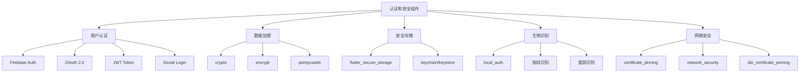

# 认证和安全组件

> 掌握 Flutter 中用户认证、数据加密、安全存储等安全相关技术的集成和使用。

## 认证安全概览



## Firebase 认证

### 基础配置和使用

#### 1. 依赖配置

```yaml
# pubspec.yaml
dependencies:
  firebase_core: ^2.24.2
  firebase_auth: ^4.15.3
  google_sign_in: ^6.1.6
  sign_in_with_apple: ^5.0.0
  flutter_facebook_auth: ^6.0.3
```

#### 2. Firebase 初始化

```dart
// main.dart
import 'package:firebase_core/firebase_core.dart';
import 'firebase_options.dart';

void main() async {
  WidgetsFlutterBinding.ensureInitialized();
  
  await Firebase.initializeApp(
    options: DefaultFirebaseOptions.currentPlatform,
  );
  
  runApp(MyApp());
}
```

#### 3. 认证服务类

```dart
import 'package:firebase_auth/firebase_auth.dart';
import 'package:google_sign_in/google_sign_in.dart';
import 'package:sign_in_with_apple/sign_in_with_apple.dart';
import 'package:flutter_facebook_auth/flutter_facebook_auth.dart';

class AuthService {
  static final FirebaseAuth _auth = FirebaseAuth.instance;
  static final GoogleSignIn _googleSignIn = GoogleSignIn();
  
  // 当前用户
  static User? get currentUser => _auth.currentUser;
  
  // 用户状态流
  static Stream<User?> get authStateChanges => _auth.authStateChanges();
  
  // 邮箱密码注册
  static Future<AuthResult> registerWithEmailPassword(
    String email,
    String password,
    String displayName,
  ) async {
    try {
      final credential = await _auth.createUserWithEmailAndPassword(
        email: email,
        password: password,
      );
      
      // 更新用户信息
      await credential.user?.updateDisplayName(displayName);
      await credential.user?.reload();
      
      return AuthResult.success(
        user: _auth.currentUser,
        message: '注册成功',
      );
    } on FirebaseAuthException catch (e) {
      return AuthResult.failure(
        error: _getErrorMessage(e.code),
      );
    } catch (e) {
      return AuthResult.failure(
        error: '注册失败: $e',
      );
    }
  }
  
  // 邮箱密码登录
  static Future<AuthResult> signInWithEmailPassword(
    String email,
    String password,
  ) async {
    try {
      final credential = await _auth.signInWithEmailAndPassword(
        email: email,
        password: password,
      );
      
      return AuthResult.success(
        user: credential.user,
        message: '登录成功',
      );
    } on FirebaseAuthException catch (e) {
      return AuthResult.failure(
        error: _getErrorMessage(e.code),
      );
    } catch (e) {
      return AuthResult.failure(
        error: '登录失败: $e',
      );
    }
  }
  
  // Google 登录
  static Future<AuthResult> signInWithGoogle() async {
    try {
      final GoogleSignInAccount? googleUser = await _googleSignIn.signIn();
      
      if (googleUser == null) {
        return AuthResult.failure(error: '用户取消登录');
      }
      
      final GoogleSignInAuthentication googleAuth =
          await googleUser.authentication;
      
      final credential = GoogleAuthProvider.credential(
        accessToken: googleAuth.accessToken,
        idToken: googleAuth.idToken,
      );
      
      final userCredential = await _auth.signInWithCredential(credential);
      
      return AuthResult.success(
        user: userCredential.user,
        message: 'Google 登录成功',
      );
    } catch (e) {
      return AuthResult.failure(
        error: 'Google 登录失败: $e',
      );
    }
  }
  
  // Apple 登录
  static Future<AuthResult> signInWithApple() async {
    try {
      final appleCredential = await SignInWithApple.getAppleIDCredential(
        scopes: [
          AppleIDAuthorizationScopes.email,
          AppleIDAuthorizationScopes.fullName,
        ],
      );
      
      final oauthCredential = OAuthProvider("apple.com").credential(
        idToken: appleCredential.identityToken,
        accessToken: appleCredential.authorizationCode,
      );
      
      final userCredential = await _auth.signInWithCredential(oauthCredential);
      
      return AuthResult.success(
        user: userCredential.user,
        message: 'Apple 登录成功',
      );
    } catch (e) {
      return AuthResult.failure(
        error: 'Apple 登录失败: $e',
      );
    }
  }
  
  // Facebook 登录
  static Future<AuthResult> signInWithFacebook() async {
    try {
      final LoginResult result = await FacebookAuth.instance.login();
      
      if (result.status == LoginStatus.success) {
        final OAuthCredential facebookAuthCredential =
            FacebookAuthProvider.credential(result.accessToken!.token);
        
        final userCredential = await _auth.signInWithCredential(
          facebookAuthCredential,
        );
        
        return AuthResult.success(
          user: userCredential.user,
          message: 'Facebook 登录成功',
        );
      } else {
        return AuthResult.failure(
          error: 'Facebook 登录失败: ${result.message}',
        );
      }
    } catch (e) {
      return AuthResult.failure(
        error: 'Facebook 登录失败: $e',
      );
    }
  }
  
  // 手机号登录
  static Future<AuthResult> signInWithPhoneNumber(
    String phoneNumber,
    Function(String verificationId) onCodeSent,
  ) async {
    try {
      await _auth.verifyPhoneNumber(
        phoneNumber: phoneNumber,
        verificationCompleted: (PhoneAuthCredential credential) async {
          // 自动验证完成（Android）
          final userCredential = await _auth.signInWithCredential(credential);
          // 这里需要通过其他方式通知 UI
        },
        verificationFailed: (FirebaseAuthException e) {
          // 验证失败
        },
        codeSent: (String verificationId, int? resendToken) {
          onCodeSent(verificationId);
        },
        codeAutoRetrievalTimeout: (String verificationId) {
          // 自动检索超时
        },
      );
      
      return AuthResult.success(
        message: '验证码已发送',
      );
    } on FirebaseAuthException catch (e) {
      return AuthResult.failure(
        error: _getErrorMessage(e.code),
      );
    }
  }
  
  // 验证手机号验证码
  static Future<AuthResult> verifyPhoneCode(
    String verificationId,
    String smsCode,
  ) async {
    try {
      final credential = PhoneAuthProvider.credential(
        verificationId: verificationId,
        smsCode: smsCode,
      );
      
      final userCredential = await _auth.signInWithCredential(credential);
      
      return AuthResult.success(
        user: userCredential.user,
        message: '手机号登录成功',
      );
    } on FirebaseAuthException catch (e) {
      return AuthResult.failure(
        error: _getErrorMessage(e.code),
      );
    }
  }
  
  // 发送密码重置邮件
  static Future<AuthResult> sendPasswordResetEmail(String email) async {
    try {
      await _auth.sendPasswordResetEmail(email: email);
      
      return AuthResult.success(
        message: '密码重置邮件已发送',
      );
    } on FirebaseAuthException catch (e) {
      return AuthResult.failure(
        error: _getErrorMessage(e.code),
      );
    }
  }
  
  // 更新密码
  static Future<AuthResult> updatePassword(
    String currentPassword,
    String newPassword,
  ) async {
    try {
      final user = _auth.currentUser;
      if (user == null) {
        return AuthResult.failure(error: '用户未登录');
      }
      
      // 重新认证
      final credential = EmailAuthProvider.credential(
        email: user.email!,
        password: currentPassword,
      );
      
      await user.reauthenticateWithCredential(credential);
      
      // 更新密码
      await user.updatePassword(newPassword);
      
      return AuthResult.success(
        message: '密码更新成功',
      );
    } on FirebaseAuthException catch (e) {
      return AuthResult.failure(
        error: _getErrorMessage(e.code),
      );
    }
  }
  
  // 更新用户信息
  static Future<AuthResult> updateProfile({
    String? displayName,
    String? photoURL,
  }) async {
    try {
      final user = _auth.currentUser;
      if (user == null) {
        return AuthResult.failure(error: '用户未登录');
      }
      
      await user.updateDisplayName(displayName);
      await user.updatePhotoURL(photoURL);
      await user.reload();
      
      return AuthResult.success(
        user: _auth.currentUser,
        message: '用户信息更新成功',
      );
    } catch (e) {
      return AuthResult.failure(
        error: '用户信息更新失败: $e',
      );
    }
  }
  
  // 删除账户
  static Future<AuthResult> deleteAccount(String password) async {
    try {
      final user = _auth.currentUser;
      if (user == null) {
        return AuthResult.failure(error: '用户未登录');
      }
      
      // 重新认证
      final credential = EmailAuthProvider.credential(
        email: user.email!,
        password: password,
      );
      
      await user.reauthenticateWithCredential(credential);
      
      // 删除账户
      await user.delete();
      
      return AuthResult.success(
        message: '账户删除成功',
      );
    } on FirebaseAuthException catch (e) {
      return AuthResult.failure(
        error: _getErrorMessage(e.code),
      );
    }
  }
  
  // 登出
  static Future<void> signOut() async {
    await Future.wait([
      _auth.signOut(),
      _googleSignIn.signOut(),
      FacebookAuth.instance.logOut(),
    ]);
  }
  
  // 获取错误消息
  static String _getErrorMessage(String errorCode) {
    switch (errorCode) {
      case 'weak-password':
        return '密码强度不够';
      case 'email-already-in-use':
        return '邮箱已被使用';
      case 'invalid-email':
        return '邮箱格式无效';
      case 'user-not-found':
        return '用户不存在';
      case 'wrong-password':
        return '密码错误';
      case 'user-disabled':
        return '用户已被禁用';
      case 'too-many-requests':
        return '请求过于频繁，请稍后再试';
      case 'operation-not-allowed':
        return '操作不被允许';
      case 'invalid-verification-code':
        return '验证码无效';
      case 'invalid-verification-id':
        return '验证ID无效';
      default:
        return '认证失败: $errorCode';
    }
  }
}

// 认证结果类
class AuthResult {
  final bool success;
  final User? user;
  final String? message;
  final String? error;
  
  AuthResult._(
    this.success, {
    this.user,
    this.message,
    this.error,
  });
  
  factory AuthResult.success({
    User? user,
    String? message,
  }) {
    return AuthResult._(true, user: user, message: message);
  }
  
  factory AuthResult.failure({
    required String error,
  }) {
    return AuthResult._(false, error: error);
  }
}
```

## 数据加密

### 基础加密实现

#### 1. 依赖配置

```yaml
# pubspec.yaml
dependencies:
  crypto: ^3.0.3
  encrypt: ^5.0.1
  pointycastle: ^3.7.3
```

#### 2. 加密服务类

```dart
import 'dart:convert';
import 'dart:math';
import 'dart:typed_data';
import 'package:crypto/crypto.dart';
import 'package:encrypt/encrypt.dart';
import 'package:pointycastle/export.dart';

class EncryptionService {
  // AES 加密密钥（实际应用中应该安全存储）
  static const String _aesKeyString = 'your-32-character-secret-key-here';
  static final _aesKey = Key.fromBase64(base64.encode(_aesKeyString.codeUnits));
  static final _aesIV = IV.fromSecureRandom(16);
  static final _aesEncrypter = Encrypter(AES(_aesKey));
  
  // RSA 密钥对
  static AsymmetricKeyPair<RSAPublicKey, RSAPrivateKey>? _rsaKeyPair;
  
  // 初始化 RSA 密钥对
  static Future<void> initializeRSA() async {
    _rsaKeyPair = await generateRSAKeyPair();
  }
  
  // AES 加密
  static String encryptAES(String plainText) {
    final encrypted = _aesEncrypter.encrypt(plainText, iv: _aesIV);
    return encrypted.base64;
  }
  
  // AES 解密
  static String decryptAES(String encryptedText) {
    final encrypted = Encrypted.fromBase64(encryptedText);
    return _aesEncrypter.decrypt(encrypted, iv: _aesIV);
  }
  
  // AES 加密（带自定义密钥）
  static EncryptionResult encryptAESWithKey(
    String plainText,
    String keyString,
  ) {
    final key = Key.fromBase64(base64.encode(keyString.codeUnits));
    final iv = IV.fromSecureRandom(16);
    final encrypter = Encrypter(AES(key));
    
    final encrypted = encrypter.encrypt(plainText, iv: iv);
    
    return EncryptionResult(
      encryptedData: encrypted.base64,
      iv: iv.base64,
      key: key.base64,
    );
  }
  
  // AES 解密（带自定义密钥）
  static String decryptAESWithKey(
    String encryptedText,
    String keyString,
    String ivString,
  ) {
    final key = Key.fromBase64(keyString);
    final iv = IV.fromBase64(ivString);
    final encrypter = Encrypter(AES(key));
    
    final encrypted = Encrypted.fromBase64(encryptedText);
    return encrypter.decrypt(encrypted, iv: iv);
  }
  
  // RSA 加密
  static String? encryptRSA(String plainText) {
    if (_rsaKeyPair == null) return null;
    
    final encrypter = Encrypter(RSA(publicKey: _rsaKeyPair!.publicKey));
    final encrypted = encrypter.encrypt(plainText);
    return encrypted.base64;
  }
  
  // RSA 解密
  static String? decryptRSA(String encryptedText) {
    if (_rsaKeyPair == null) return null;
    
    final encrypter = Encrypter(RSA(privateKey: _rsaKeyPair!.privateKey));
    final encrypted = Encrypted.fromBase64(encryptedText);
    return encrypter.decrypt(encrypted);
  }
  
  // 生成 RSA 密钥对
  static Future<AsymmetricKeyPair<RSAPublicKey, RSAPrivateKey>> generateRSAKeyPair() async {
    final keyGen = RSAKeyGenerator();
    final secureRandom = FortunaRandom();
    
    // 初始化随机数生成器
    final seedSource = Random.secure();
    final seeds = <int>[];
    for (int i = 0; i < 32; i++) {
      seeds.add(seedSource.nextInt(255));
    }
    secureRandom.seed(KeyParameter(Uint8List.fromList(seeds)));
    
    // 配置密钥生成参数
    final params = RSAKeyGeneratorParameters(
      BigInt.parse('65537'), // 公钥指数
      2048, // 密钥长度
      64, // 确定性测试轮数
    );
    
    keyGen.init(ParametersWithRandom(params, secureRandom));
    
    return keyGen.generateKeyPair();
  }
  
  // 哈希函数
  static String hashSHA256(String input) {
    final bytes = utf8.encode(input);
    final digest = sha256.convert(bytes);
    return digest.toString();
  }
  
  // HMAC 签名
  static String hmacSHA256(String message, String secret) {
    final key = utf8.encode(secret);
    final bytes = utf8.encode(message);
    final hmacSha256 = Hmac(sha256, key);
    final digest = hmacSha256.convert(bytes);
    return digest.toString();
  }
  
  // 生成随机密钥
  static String generateRandomKey(int length) {
    const chars = 'ABCDEFGHIJKLMNOPQRSTUVWXYZabcdefghijklmnopqrstuvwxyz0123456789';
    final random = Random.secure();
    return String.fromCharCodes(
      Iterable.generate(
        length,
        (_) => chars.codeUnitAt(random.nextInt(chars.length)),
      ),
    );
  }
  
  // 生成随机盐值
  static String generateSalt([int length = 32]) {
    final random = Random.secure();
    final saltBytes = List<int>.generate(length, (_) => random.nextInt(256));
    return base64.encode(saltBytes);
  }
  
  // PBKDF2 密钥派生
  static String deriveKeyPBKDF2(
    String password,
    String salt, {
    int iterations = 10000,
    int keyLength = 32,
  }) {
    final pbkdf2 = PBKDF2KeyDerivator(HMac(SHA256Digest(), 64));
    pbkdf2.init(Pbkdf2Parameters(
      Uint8List.fromList(base64.decode(salt)),
      iterations,
      keyLength,
    ));
    
    final key = pbkdf2.process(Uint8List.fromList(utf8.encode(password)));
    return base64.encode(key);
  }
  
  // 文件加密
  static Future<bool> encryptFile(
    String inputPath,
    String outputPath,
    String password,
  ) async {
    try {
      final inputFile = File(inputPath);
      final outputFile = File(outputPath);
      
      if (!await inputFile.exists()) {
        return false;
      }
      
      final salt = generateSalt();
      final key = deriveKeyPBKDF2(password, salt);
      final iv = IV.fromSecureRandom(16);
      
      final encrypter = Encrypter(AES(Key.fromBase64(key)));
      final inputBytes = await inputFile.readAsBytes();
      
      final encrypted = encrypter.encryptBytes(inputBytes, iv: iv);
      
      // 将盐值、IV 和加密数据写入文件
      final outputData = <int>[];
      outputData.addAll(base64.decode(salt));
      outputData.addAll(iv.bytes);
      outputData.addAll(encrypted.bytes);
      
      await outputFile.writeAsBytes(outputData);
      return true;
    } catch (e) {
      debugPrint('文件加密失败: $e');
      return false;
    }
  }
  
  // 文件解密
  static Future<bool> decryptFile(
    String inputPath,
    String outputPath,
    String password,
  ) async {
    try {
      final inputFile = File(inputPath);
      final outputFile = File(outputPath);
      
      if (!await inputFile.exists()) {
        return false;
      }
      
      final inputBytes = await inputFile.readAsBytes();
      
      // 提取盐值、IV 和加密数据
      final salt = base64.encode(inputBytes.sublist(0, 32));
      final iv = IV(Uint8List.fromList(inputBytes.sublist(32, 48)));
      final encryptedData = inputBytes.sublist(48);
      
      final key = deriveKeyPBKDF2(password, salt);
      final encrypter = Encrypter(AES(Key.fromBase64(key)));
      
      final decrypted = encrypter.decryptBytes(
        Encrypted(Uint8List.fromList(encryptedData)),
        iv: iv,
      );
      
      await outputFile.writeAsBytes(decrypted);
      return true;
    } catch (e) {
      debugPrint('文件解密失败: $e');
      return false;
    }
  }
}

// 加密结果类
class EncryptionResult {
  final String encryptedData;
  final String iv;
  final String key;
  
  EncryptionResult({
    required this.encryptedData,
    required this.iv,
    required this.key,
  });
  
  Map<String, dynamic> toJson() {
    return {
      'encryptedData': encryptedData,
      'iv': iv,
      'key': key,
    };
  }
  
  factory EncryptionResult.fromJson(Map<String, dynamic> json) {
    return EncryptionResult(
      encryptedData: json['encryptedData'],
      iv: json['iv'],
      key: json['key'],
    );
  }
}
```

## 安全存储

### Flutter Secure Storage

#### 1. 依赖配置

```yaml
# pubspec.yaml
dependencies:
  flutter_secure_storage: ^9.0.0
```

#### 2. 安全存储服务

```dart
import 'package:flutter_secure_storage/flutter_secure_storage.dart';

class SecureStorageService {
  static const FlutterSecureStorage _storage = FlutterSecureStorage(
    aOptions: AndroidOptions(
      encryptedSharedPreferences: true,
      sharedPreferencesName: 'secure_prefs',
      preferencesKeyPrefix: 'secure_',
    ),
    iOptions: IOSOptions(
      groupId: 'group.com.example.app',
      accountName: 'secure_storage',
      accessibility: KeychainAccessibility.first_unlock_this_device,
    ),
    lOptions: LinuxOptions(
      encryptedSharedPreferences: true,
    ),
    wOptions: WindowsOptions(
      encryptedSharedPreferences: true,
    ),
    mOptions: MacOsOptions(
      groupId: 'group.com.example.app',
      accountName: 'secure_storage',
      accessibility: KeychainAccessibility.first_unlock_this_device,
    ),
  );
  
  // 存储数据
  static Future<void> write(String key, String value) async {
    try {
      await _storage.write(key: key, value: value);
    } catch (e) {
      debugPrint('安全存储写入失败: $e');
      rethrow;
    }
  }
  
  // 读取数据
  static Future<String?> read(String key) async {
    try {
      return await _storage.read(key: key);
    } catch (e) {
      debugPrint('安全存储读取失败: $e');
      return null;
    }
  }
  
  // 删除数据
  static Future<void> delete(String key) async {
    try {
      await _storage.delete(key: key);
    } catch (e) {
      debugPrint('安全存储删除失败: $e');
      rethrow;
    }
  }
  
  // 删除所有数据
  static Future<void> deleteAll() async {
    try {
      await _storage.deleteAll();
    } catch (e) {
      debugPrint('安全存储清空失败: $e');
      rethrow;
    }
  }
  
  // 获取所有键
  static Future<Map<String, String>> readAll() async {
    try {
      return await _storage.readAll();
    } catch (e) {
      debugPrint('安全存储读取全部失败: $e');
      return {};
    }
  }
  
  // 检查键是否存在
  static Future<bool> containsKey(String key) async {
    try {
      final value = await _storage.read(key: key);
      return value != null;
    } catch (e) {
      debugPrint('安全存储检查键失败: $e');
      return false;
    }
  }
  
  // 存储 JSON 对象
  static Future<void> writeJson(String key, Map<String, dynamic> value) async {
    await write(key, jsonEncode(value));
  }
  
  // 读取 JSON 对象
  static Future<Map<String, dynamic>?> readJson(String key) async {
    final value = await read(key);
    if (value != null) {
      try {
        return jsonDecode(value);
      } catch (e) {
        debugPrint('JSON 解析失败: $e');
        return null;
      }
    }
    return null;
  }
  
  // 存储加密数据
  static Future<void> writeEncrypted(
    String key,
    String value,
    String password,
  ) async {
    final encryptionResult = EncryptionService.encryptAESWithKey(value, password);
    await writeJson(key, encryptionResult.toJson());
  }
  
  // 读取加密数据
  static Future<String?> readEncrypted(
    String key,
    String password,
  ) async {
    final encryptionData = await readJson(key);
    if (encryptionData != null) {
      try {
        final encryptionResult = EncryptionResult.fromJson(encryptionData);
        return EncryptionService.decryptAESWithKey(
          encryptionResult.encryptedData,
          encryptionResult.key,
          encryptionResult.iv,
        );
      } catch (e) {
        debugPrint('加密数据解密失败: $e');
        return null;
      }
    }
    return null;
  }
}

// 令牌管理服务
class TokenManager {
  static const String _accessTokenKey = 'access_token';
  static const String _refreshTokenKey = 'refresh_token';
  static const String _tokenExpiryKey = 'token_expiry';
  
  // 存储访问令牌
  static Future<void> saveAccessToken(
    String token, {
    DateTime? expiryTime,
  }) async {
    await SecureStorageService.write(_accessTokenKey, token);
    
    if (expiryTime != null) {
      await SecureStorageService.write(
        _tokenExpiryKey,
        expiryTime.millisecondsSinceEpoch.toString(),
      );
    }
  }
  
  // 获取访问令牌
  static Future<String?> getAccessToken() async {
    // 检查令牌是否过期
    if (await isTokenExpired()) {
      return null;
    }
    
    return await SecureStorageService.read(_accessTokenKey);
  }
  
  // 存储刷新令牌
  static Future<void> saveRefreshToken(String token) async {
    await SecureStorageService.write(_refreshTokenKey, token);
  }
  
  // 获取刷新令牌
  static Future<String?> getRefreshToken() async {
    return await SecureStorageService.read(_refreshTokenKey);
  }
  
  // 检查令牌是否过期
  static Future<bool> isTokenExpired() async {
    final expiryString = await SecureStorageService.read(_tokenExpiryKey);
    if (expiryString == null) return false;
    
    final expiryTime = DateTime.fromMillisecondsSinceEpoch(
      int.parse(expiryString),
    );
    
    return DateTime.now().isAfter(expiryTime);
  }
  
  // 清除所有令牌
  static Future<void> clearTokens() async {
    await Future.wait([
      SecureStorageService.delete(_accessTokenKey),
      SecureStorageService.delete(_refreshTokenKey),
      SecureStorageService.delete(_tokenExpiryKey),
    ]);
  }
  
  // 刷新访问令牌
  static Future<String?> refreshAccessToken() async {
    final refreshToken = await getRefreshToken();
    if (refreshToken == null) return null;
    
    try {
      // 调用刷新令牌 API
      final response = await DioService.instance.post(
        '/auth/refresh',
        data: {'refresh_token': refreshToken},
      );
      
      final newAccessToken = response.data['access_token'];
      final newRefreshToken = response.data['refresh_token'];
      final expiresIn = response.data['expires_in']; // 秒数
      
      // 保存新令牌
      await saveAccessToken(
        newAccessToken,
        expiryTime: DateTime.now().add(Duration(seconds: expiresIn)),
      );
      
      if (newRefreshToken != null) {
        await saveRefreshToken(newRefreshToken);
      }
      
      return newAccessToken;
    } catch (e) {
      debugPrint('刷新令牌失败: $e');
      await clearTokens();
      return null;
    }
  }
}
```

## 生物识别认证

### Local Auth 实现

#### 1. 依赖配置

```yaml
# pubspec.yaml
dependencies:
  local_auth: ^2.1.6
  local_auth_android: ^1.0.34
  local_auth_ios: ^1.0.15
  local_auth_windows: ^1.0.10
```

#### 2. 生物识别服务

```dart
import 'package:local_auth/local_auth.dart';
import 'package:local_auth_android/local_auth_android.dart';
import 'package:local_auth_ios/local_auth_ios.dart';

class BiometricAuthService {
  static final LocalAuthentication _localAuth = LocalAuthentication();
  
  // 检查设备是否支持生物识别
  static Future<bool> isDeviceSupported() async {
    try {
      return await _localAuth.isDeviceSupported();
    } catch (e) {
      debugPrint('检查设备支持失败: $e');
      return false;
    }
  }
  
  // 检查是否有可用的生物识别
  static Future<bool> canCheckBiometrics() async {
    try {
      return await _localAuth.canCheckBiometrics;
    } catch (e) {
      debugPrint('检查生物识别可用性失败: $e');
      return false;
    }
  }
  
  // 获取可用的生物识别类型
  static Future<List<BiometricType>> getAvailableBiometrics() async {
    try {
      return await _localAuth.getAvailableBiometrics();
    } catch (e) {
      debugPrint('获取可用生物识别类型失败: $e');
      return [];
    }
  }
  
  // 执行生物识别认证
  static Future<BiometricAuthResult> authenticate({
    String localizedReason = '请验证您的身份',
    bool useErrorDialogs = true,
    bool stickyAuth = false,
    bool sensitiveTransaction = true,
    bool biometricOnly = false,
  }) async {
    try {
      // 检查设备支持
      if (!await isDeviceSupported()) {
        return BiometricAuthResult.failure('设备不支持生物识别');
      }
      
      // 检查生物识别可用性
      if (!await canCheckBiometrics()) {
        return BiometricAuthResult.failure('生物识别不可用');
      }
      
      // 获取可用的生物识别类型
      final availableBiometrics = await getAvailableBiometrics();
      if (availableBiometrics.isEmpty) {
        return BiometricAuthResult.failure('没有可用的生物识别方法');
      }
      
      // 执行认证
      final bool didAuthenticate = await _localAuth.authenticate(
        localizedReason: localizedReason,
        authMessages: const [
          AndroidAuthMessages(
            signInTitle: '生物识别认证',
            cancelButton: '取消',
            deviceCredentialsRequiredTitle: '需要设备凭据',
            deviceCredentialsSetupDescription: '请在设置中配置设备凭据',
            goToSettingsButton: '去设置',
            goToSettingsDescription: '请在设置中配置生物识别',
          ),
          IOSAuthMessages(
            cancelButton: '取消',
            goToSettingsButton: '去设置',
            goToSettingsDescription: '请在设置中配置生物识别',
            lockOut: '生物识别已锁定，请使用密码解锁',
          ),
        ],
        options: AuthenticationOptions(
          useErrorDialogs: useErrorDialogs,
          stickyAuth: stickyAuth,
          sensitiveTransaction: sensitiveTransaction,
          biometricOnly: biometricOnly,
        ),
      );
      
      if (didAuthenticate) {
        return BiometricAuthResult.success(
          biometricTypes: availableBiometrics,
        );
      } else {
        return BiometricAuthResult.failure('认证失败或用户取消');
      }
    } catch (e) {
      return BiometricAuthResult.failure('生物识别认证异常: $e');
    }
  }
  
  // 停止认证
  static Future<bool> stopAuthentication() async {
    try {
      return await _localAuth.stopAuthentication();
    } catch (e) {
      debugPrint('停止认证失败: $e');
      return false;
    }
  }
  
  // 检查特定生物识别类型是否可用
  static Future<bool> isBiometricTypeAvailable(BiometricType type) async {
    final availableBiometrics = await getAvailableBiometrics();
    return availableBiometrics.contains(type);
  }
  
  // 获取生物识别类型描述
  static String getBiometricTypeDescription(BiometricType type) {
    switch (type) {
      case BiometricType.face:
        return '面部识别';
      case BiometricType.fingerprint:
        return '指纹识别';
      case BiometricType.iris:
        return '虹膜识别';
      case BiometricType.weak:
        return '弱生物识别';
      case BiometricType.strong:
        return '强生物识别';
      default:
        return '未知生物识别类型';
    }
  }
}

// 生物识别认证结果
class BiometricAuthResult {
  final bool success;
  final String? error;
  final List<BiometricType>? biometricTypes;
  
  BiometricAuthResult._(
    this.success, {
    this.error,
    this.biometricTypes,
  });
  
  factory BiometricAuthResult.success({
    List<BiometricType>? biometricTypes,
  }) {
    return BiometricAuthResult._(true, biometricTypes: biometricTypes);
  }
  
  factory BiometricAuthResult.failure(String error) {
    return BiometricAuthResult._(false, error: error);
  }
}

// 生物识别设置管理
class BiometricSettings {
  static const String _biometricEnabledKey = 'biometric_enabled';
  static const String _biometricTypeKey = 'biometric_type';
  
  // 启用生物识别
  static Future<void> enableBiometric(BiometricType type) async {
    await SecureStorageService.write(_biometricEnabledKey, 'true');
    await SecureStorageService.write(_biometricTypeKey, type.toString());
  }
  
  // 禁用生物识别
  static Future<void> disableBiometric() async {
    await SecureStorageService.delete(_biometricEnabledKey);
    await SecureStorageService.delete(_biometricTypeKey);
  }
  
  // 检查是否启用生物识别
  static Future<bool> isBiometricEnabled() async {
    final enabled = await SecureStorageService.read(_biometricEnabledKey);
    return enabled == 'true';
  }
  
  // 获取启用的生物识别类型
  static Future<BiometricType?> getEnabledBiometricType() async {
    final typeString = await SecureStorageService.read(_biometricTypeKey);
    if (typeString == null) return null;
    
    switch (typeString) {
      case 'BiometricType.face':
        return BiometricType.face;
      case 'BiometricType.fingerprint':
        return BiometricType.fingerprint;
      case 'BiometricType.iris':
        return BiometricType.iris;
      case 'BiometricType.weak':
        return BiometricType.weak;
      case 'BiometricType.strong':
        return BiometricType.strong;
      default:
        return null;
    }
  }
}
```

## 认证安全最佳实践

### 安全配置和防护

```dart
class SecurityConfig {
  // 密码强度验证
  static bool isPasswordStrong(String password) {
    // 至少8位，包含大小写字母、数字和特殊字符
    final regex = RegExp(r'^(?=.*[a-z])(?=.*[A-Z])(?=.*\d)(?=.*[@$!%*?&])[A-Za-z\d@$!%*?&]{8,}$');
    return regex.hasMatch(password);
  }
  
  // 邮箱格式验证
  static bool isEmailValid(String email) {
    final regex = RegExp(r'^[\w-\.]+@([\w-]+\.)+[\w-]{2,4}$');
    return regex.hasMatch(email);
  }
  
  // 手机号格式验证（中国）
  static bool isPhoneNumberValid(String phoneNumber) {
    final regex = RegExp(r'^1[3-9]\d{9}$');
    return regex.hasMatch(phoneNumber);
  }
  
  // 防暴力破解 - 登录尝试限制
  static const int maxLoginAttempts = 5;
  static const Duration lockoutDuration = Duration(minutes: 15);
  
  static Future<bool> canAttemptLogin(String identifier) async {
    final key = 'login_attempts_$identifier';
    final attemptsData = await SecureStorageService.readJson(key);
    
    if (attemptsData == null) return true;
    
    final attempts = attemptsData['attempts'] as int;
    final lastAttempt = DateTime.fromMillisecondsSinceEpoch(
      attemptsData['lastAttempt'] as int,
    );
    
    // 检查是否在锁定期内
    if (attempts >= maxLoginAttempts) {
      final lockoutEnd = lastAttempt.add(lockoutDuration);
      if (DateTime.now().isBefore(lockoutEnd)) {
        return false;
      } else {
        // 锁定期结束，重置尝试次数
        await SecureStorageService.delete(key);
        return true;
      }
    }
    
    return true;
  }
  
  static Future<void> recordLoginAttempt(
    String identifier,
    bool success,
  ) async {
    final key = 'login_attempts_$identifier';
    
    if (success) {
      // 登录成功，清除尝试记录
      await SecureStorageService.delete(key);
    } else {
      // 登录失败，增加尝试次数
      final attemptsData = await SecureStorageService.readJson(key);
      final attempts = (attemptsData?['attempts'] as int?) ?? 0;
      
      await SecureStorageService.writeJson(key, {
        'attempts': attempts + 1,
        'lastAttempt': DateTime.now().millisecondsSinceEpoch,
      });
    }
  }
  
  // 会话管理
  static const Duration sessionTimeout = Duration(hours: 24);
  
  static Future<void> updateSessionActivity() async {
    await SecureStorageService.write(
      'last_activity',
      DateTime.now().millisecondsSinceEpoch.toString(),
    );
  }
  
  static Future<bool> isSessionValid() async {
    final lastActivityString = await SecureStorageService.read('last_activity');
    if (lastActivityString == null) return false;
    
    final lastActivity = DateTime.fromMillisecondsSinceEpoch(
      int.parse(lastActivityString),
    );
    
    return DateTime.now().difference(lastActivity) < sessionTimeout;
  }
  
  static Future<void> invalidateSession() async {
    await Future.wait([
      SecureStorageService.delete('last_activity'),
      TokenManager.clearTokens(),
    ]);
  }
  
  // 设备指纹
  static Future<String> generateDeviceFingerprint() async {
    final deviceInfo = DeviceInfoPlugin();
    String fingerprint = '';
    
    if (Platform.isAndroid) {
      final androidInfo = await deviceInfo.androidInfo;
      fingerprint = '${androidInfo.model}_${androidInfo.androidId}_${androidInfo.brand}';
    } else if (Platform.isIOS) {
      final iosInfo = await deviceInfo.iosInfo;
      fingerprint = '${iosInfo.model}_${iosInfo.identifierForVendor}_${iosInfo.systemVersion}';
    }
    
    return EncryptionService.hashSHA256(fingerprint);
  }
  
  static Future<void> saveDeviceFingerprint() async {
    final fingerprint = await generateDeviceFingerprint();
    await SecureStorageService.write('device_fingerprint', fingerprint);
  }
  
  static Future<bool> verifyDeviceFingerprint() async {
    final savedFingerprint = await SecureStorageService.read('device_fingerprint');
    if (savedFingerprint == null) return false;
    
    final currentFingerprint = await generateDeviceFingerprint();
    return savedFingerprint == currentFingerprint;
  }
}

// 安全事件日志
class SecurityLogger {
  static const String _logKey = 'security_logs';
  
  static Future<void> logSecurityEvent(
    SecurityEventType type,
    String description, {
    Map<String, dynamic>? metadata,
  }) async {
    final event = SecurityEvent(
      type: type,
      description: description,
      timestamp: DateTime.now(),
      metadata: metadata,
    );
    
    final logs = await getSecurityLogs();
    logs.add(event);
    
    // 只保留最近100条日志
    if (logs.length > 100) {
      logs.removeRange(0, logs.length - 100);
    }
    
    await SecureStorageService.writeJson(
      _logKey,
      {'logs': logs.map((e) => e.toJson()).toList()},
    );
  }
  
  static Future<List<SecurityEvent>> getSecurityLogs() async {
    final data = await SecureStorageService.readJson(_logKey);
    if (data == null) return [];
    
    final logsData = data['logs'] as List<dynamic>;
    return logsData
        .map((e) => SecurityEvent.fromJson(e as Map<String, dynamic>))
        .toList();
  }
  
  static Future<void> clearSecurityLogs() async {
    await SecureStorageService.delete(_logKey);
  }
}

class SecurityEvent {
  final SecurityEventType type;
  final String description;
  final DateTime timestamp;
  final Map<String, dynamic>? metadata;
  
  SecurityEvent({
    required this.type,
    required this.description,
    required this.timestamp,
    this.metadata,
  });
  
  Map<String, dynamic> toJson() {
    return {
      'type': type.toString(),
      'description': description,
      'timestamp': timestamp.millisecondsSinceEpoch,
      'metadata': metadata,
    };
  }
  
  factory SecurityEvent.fromJson(Map<String, dynamic> json) {
    return SecurityEvent(
      type: SecurityEventType.values.firstWhere(
        (e) => e.toString() == json['type'],
      ),
      description: json['description'],
      timestamp: DateTime.fromMillisecondsSinceEpoch(json['timestamp']),
      metadata: json['metadata'],
    );
  }
}

enum SecurityEventType {
  login,
  logout,
  loginFailed,
  passwordChanged,
  biometricEnabled,
  biometricDisabled,
  deviceRegistered,
  suspiciousActivity,
}
```

## 总结

认证和安全组件是应用安全的基石，本文档涵盖了：

### 核心功能
- **用户认证**：Firebase Auth、OAuth 2.0、社交登录、多因素认证
- **数据加密**：AES、RSA、哈希函数、密钥派生
- **安全存储**：Keychain/Keystore、加密存储、令牌管理
- **生物识别**：指纹、面部、虹膜识别

### 最佳实践
- **密码安全**：强度验证、哈希存储、定期更换
- **会话管理**：超时控制、活动跟踪、安全注销
- **防护机制**：暴力破解防护、设备指纹、异常检测
- **安全日志**：事件记录、审计跟踪、威胁分析

### 推荐组件库
- **firebase_auth**：完整的认证解决方案
- **flutter_secure_storage**：安全的本地存储
- **local_auth**：生物识别认证
- **encrypt**：数据加密库

## 相关资源

- [Firebase Auth 文档](https://firebase.google.com/docs/auth/flutter/start)
- [Flutter Secure Storage 文档](https://pub.dev/packages/flutter_secure_storage)
- [Local Auth 文档](https://pub.dev/packages/local_auth)
- [Encrypt 文档](https://pub.dev/packages/encrypt)
- [Flutter 安全最佳实践](https://flutter.dev/docs/development/data-and-backend/security)