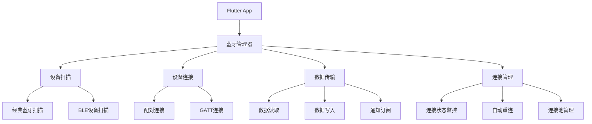

# Flutter 蓝牙通信实现

## 概述

本文档详细介绍了 Flutter 中蓝牙通信的实现方案，包括经典蓝牙和低功耗蓝牙（BLE）的使用方法、设备管理、数据传输和实际应用案例。

## 蓝牙通信架构



## 依赖配置

### pubspec.yaml

```yaml
dependencies:
  flutter:
    sdk: flutter

  # 蓝牙通信
  flutter_bluetooth_serial: ^0.4.0
  flutter_blue_plus: ^1.14.6
  permission_handler: ^11.0.1

  # 数据处理
  convert: ^3.1.1
  crypto: ^3.0.3

  # 状态管理
  provider: ^6.1.1
  rxdart: ^0.27.7

dev_dependencies:
  flutter_test:
    sdk: flutter
  mockito: ^5.4.2
  build_runner: ^2.4.7
```

### Android 权限配置

```xml
<!-- android/app/src/main/AndroidManifest.xml -->
<uses-permission android:name="android.permission.BLUETOOTH" />
<uses-permission android:name="android.permission.BLUETOOTH_ADMIN" />
<uses-permission android:name="android.permission.ACCESS_COARSE_LOCATION" />
<uses-permission android:name="android.permission.ACCESS_FINE_LOCATION" />
<uses-permission android:name="android.permission.BLUETOOTH_SCAN" android:usesPermissionFlags="neverForLocation" />
<uses-permission android:name="android.permission.BLUETOOTH_ADVERTISE" />
<uses-permission android:name="android.permission.BLUETOOTH_CONNECT" />
```

### iOS 权限配置

```xml
<!-- ios/Runner/Info.plist -->
<key>NSBluetoothAlwaysUsageDescription</key>
<string>This app needs access to bluetooth to communicate with devices</string>
<key>NSBluetoothPeripheralUsageDescription</key>
<string>This app needs access to bluetooth to communicate with devices</string>
<key>NSLocationWhenInUseUsageDescription</key>
<string>This app needs location access to scan for bluetooth devices</string>
```

## 蓝牙管理器核心实现

### 蓝牙管理器

```dart
import 'package:flutter/foundation.dart';
import 'package:flutter_blue_plus/flutter_blue_plus.dart';
import 'package:permission_handler/permission_handler.dart';
import 'package:rxdart/rxdart.dart';

/// 蓝牙设备状态
enum BluetoothDeviceState {
  disconnected,
  connecting,
  connected,
  disconnecting,
  error,
}

/// 蓝牙设备信息
class BluetoothDeviceInfo {
  final String id;
  final String name;
  final int rssi;
  final BluetoothDeviceState state;
  final BluetoothDevice device;
  final DateTime lastSeen;
  final Map<String, dynamic> advertisementData;

  const BluetoothDeviceInfo({
    required this.id,
    required this.name,
    required this.rssi,
    required this.state,
    required this.device,
    required this.lastSeen,
    required this.advertisementData,
  });

  BluetoothDeviceInfo copyWith({
    String? id,
    String? name,
    int? rssi,
    BluetoothDeviceState? state,
    BluetoothDevice? device,
    DateTime? lastSeen,
    Map<String, dynamic>? advertisementData,
  }) {
    return BluetoothDeviceInfo(
      id: id ?? this.id,
      name: name ?? this.name,
      rssi: rssi ?? this.rssi,
      state: state ?? this.state,
      device: device ?? this.device,
      lastSeen: lastSeen ?? this.lastSeen,
      advertisementData: advertisementData ?? this.advertisementData,
    );
  }
}

/// 蓝牙管理器
class BluetoothManager {
  static final BluetoothManager _instance = BluetoothManager._internal();
  factory BluetoothManager() => _instance;
  BluetoothManager._internal();

  // 状态流
  final _isScanning = BehaviorSubject<bool>.seeded(false);
  final _discoveredDevices = BehaviorSubject<List<BluetoothDeviceInfo>>.seeded([]);
  final _connectedDevices = BehaviorSubject<List<BluetoothDeviceInfo>>.seeded([]);
  final _bluetoothState = BehaviorSubject<BluetoothAdapterState>.seeded(BluetoothAdapterState.unknown);

  // 设备缓存
  final Map<String, BluetoothDeviceInfo> _deviceCache = {};
  final Map<String, BluetoothDevice> _connectedDeviceMap = {};

  // Getters
  Stream<bool> get isScanning => _isScanning.stream;
  Stream<List<BluetoothDeviceInfo>> get discoveredDevices => _discoveredDevices.stream;
  Stream<List<BluetoothDeviceInfo>> get connectedDevices => _connectedDevices.stream;
  Stream<BluetoothAdapterState> get bluetoothState => _bluetoothState.stream;

  /// 初始化蓝牙管理器
  Future<void> initialize() async {
    try {
      // 监听蓝牙状态
      FlutterBluePlus.adapterState.listen((state) {
        _bluetoothState.add(state);
        debugPrint('蓝牙状态变化: $state');
      });

      // 监听扫描状态
      FlutterBluePlus.isScanning.listen((isScanning) {
        _isScanning.add(isScanning);
        debugPrint('扫描状态: $isScanning');
      });

      // 监听扫描结果
      FlutterBluePlus.scanResults.listen((results) {
        _updateDiscoveredDevices(results);
      });

      debugPrint('蓝牙管理器初始化完成');
    } catch (e) {
      debugPrint('蓝牙管理器初始化失败: $e');
      rethrow;
    }
  }

  /// 检查并请求权限
  Future<bool> checkAndRequestPermissions() async {
    try {
      final permissions = [
        Permission.bluetooth,
        Permission.bluetoothScan,
        Permission.bluetoothConnect,
        Permission.bluetoothAdvertise,
        Permission.location,
      ];

      Map<Permission, PermissionStatus> statuses = await permissions.request();

      bool allGranted = statuses.values.every(
        (status) => status == PermissionStatus.granted,
      );

      if (!allGranted) {
        debugPrint('部分蓝牙权限未授予');
        return false;
      }

      return true;
    } catch (e) {
      debugPrint('权限检查失败: $e');
      return false;
    }
  }

  /// 开始扫描设备
  Future<void> startScan({
    Duration timeout = const Duration(seconds: 10),
    List<String> serviceUuids = const [],
    bool allowDuplicates = false,
  }) async {
    try {
      // 检查权限
      bool hasPermissions = await checkAndRequestPermissions();
      if (!hasPermissions) {
        throw Exception('蓝牙权限不足');
      }

      // 检查蓝牙状态
      if (_bluetoothState.value != BluetoothAdapterState.on) {
        throw Exception('蓝牙未开启');
      }

      // 停止当前扫描
      if (_isScanning.value) {
        await stopScan();
      }

      // 清空设备列表
      _deviceCache.clear();
      _discoveredDevices.add([]);

      // 开始扫描
      await FlutterBluePlus.startScan(
        timeout: timeout,
        withServices: serviceUuids.map((uuid) => Guid(uuid)).toList(),
        allowDuplicates: allowDuplicates,
      );

      debugPrint('开始扫描蓝牙设备');
    } catch (e) {
      debugPrint('开始扫描失败: $e');
      rethrow;
    }
  }

  /// 停止扫描
  Future<void> stopScan() async {
    try {
      await FlutterBluePlus.stopScan();
      debugPrint('停止扫描蓝牙设备');
    } catch (e) {
      debugPrint('停止扫描失败: $e');
    }
  }

  /// 连接设备
  Future<BluetoothDeviceInfo> connectDevice(String deviceId) async {
    try {
      final deviceInfo = _deviceCache[deviceId];
      if (deviceInfo == null) {
        throw Exception('设备不存在: $deviceId');
      }

      // 更新设备状态为连接中
      final connectingDevice = deviceInfo.copyWith(state: BluetoothDeviceState.connecting);
      _updateDeviceInCache(connectingDevice);

      // 连接设备
      await deviceInfo.device.connect(
        timeout: const Duration(seconds: 15),
        autoConnect: false,
      );

      // 监听连接状态
      deviceInfo.device.connectionState.listen((state) {
        _handleConnectionStateChange(deviceId, state);
      });

      // 更新设备状态为已连接
      final connectedDevice = deviceInfo.copyWith(state: BluetoothDeviceState.connected);
      _updateDeviceInCache(connectedDevice);
      _connectedDeviceMap[deviceId] = deviceInfo.device;
      _updateConnectedDevices();

      debugPrint('设备连接成功: ${deviceInfo.name}');
      return connectedDevice;
    } catch (e) {
      // 更新设备状态为错误
      final deviceInfo = _deviceCache[deviceId];
      if (deviceInfo != null) {
        final errorDevice = deviceInfo.copyWith(state: BluetoothDeviceState.error);
        _updateDeviceInCache(errorDevice);
      }

      debugPrint('设备连接失败: $e');
      rethrow;
    }
  }

  /// 断开设备连接
  Future<void> disconnectDevice(String deviceId) async {
    try {
      final device = _connectedDeviceMap[deviceId];
      if (device == null) {
        throw Exception('设备未连接: $deviceId');
      }

      // 更新设备状态为断开中
      final deviceInfo = _deviceCache[deviceId];
      if (deviceInfo != null) {
        final disconnectingDevice = deviceInfo.copyWith(state: BluetoothDeviceState.disconnecting);
        _updateDeviceInCache(disconnectingDevice);
      }

      // 断开连接
      await device.disconnect();

      // 移除设备
      _connectedDeviceMap.remove(deviceId);

      // 更新设备状态为已断开
      if (deviceInfo != null) {
        final disconnectedDevice = deviceInfo.copyWith(state: BluetoothDeviceState.disconnected);
        _updateDeviceInCache(disconnectedDevice);
      }

      _updateConnectedDevices();
      debugPrint('设备断开连接: $deviceId');
    } catch (e) {
      debugPrint('断开设备连接失败: $e');
      rethrow;
    }
  }

  /// 获取设备服务
  Future<List<BluetoothService>> getDeviceServices(String deviceId) async {
    try {
      final device = _connectedDeviceMap[deviceId];
      if (device == null) {
        throw Exception('设备未连接: $deviceId');
      }

      final services = await device.discoverServices();
      debugPrint('发现设备服务: ${services.length} 个');
      return services;
    } catch (e) {
      debugPrint('获取设备服务失败: $e');
      rethrow;
    }
  }

  /// 读取特征值
  Future<List<int>> readCharacteristic(
    String deviceId,
    String serviceUuid,
    String characteristicUuid,
  ) async {
    try {
      final device = _connectedDeviceMap[deviceId];
      if (device == null) {
        throw Exception('设备未连接: $deviceId');
      }

      final services = await device.discoverServices();
      final service = services.firstWhere(
        (s) => s.uuid.toString().toLowerCase() == serviceUuid.toLowerCase(),
        orElse: () => throw Exception('服务不存在: $serviceUuid'),
      );

      final characteristic = service.characteristics.firstWhere(
        (c) => c.uuid.toString().toLowerCase() == characteristicUuid.toLowerCase(),
        orElse: () => throw Exception('特征值不存在: $characteristicUuid'),
      );

      final data = await characteristic.read();
      debugPrint('读取特征值成功: ${data.length} 字节');
      return data;
    } catch (e) {
      debugPrint('读取特征值失败: $e');
      rethrow;
    }
  }

  /// 写入特征值
  Future<void> writeCharacteristic(
    String deviceId,
    String serviceUuid,
    String characteristicUuid,
    List<int> data, {
    bool withoutResponse = false,
  }) async {
    try {
      final device = _connectedDeviceMap[deviceId];
      if (device == null) {
        throw Exception('设备未连接: $deviceId');
      }

      final services = await device.discoverServices();
      final service = services.firstWhere(
        (s) => s.uuid.toString().toLowerCase() == serviceUuid.toLowerCase(),
        orElse: () => throw Exception('服务不存在: $serviceUuid'),
      );

      final characteristic = service.characteristics.firstWhere(
        (c) => c.uuid.toString().toLowerCase() == characteristicUuid.toLowerCase(),
        orElse: () => throw Exception('特征值不存在: $characteristicUuid'),
      );

      await characteristic.write(
        data,
        withoutResponse: withoutResponse,
      );

      debugPrint('写入特征值成功: ${data.length} 字节');
    } catch (e) {
      debugPrint('写入特征值失败: $e');
      rethrow;
    }
  }

  /// 订阅特征值通知
  Stream<List<int>> subscribeToCharacteristic(
    String deviceId,
    String serviceUuid,
    String characteristicUuid,
  ) async* {
    try {
      final device = _connectedDeviceMap[deviceId];
      if (device == null) {
        throw Exception('设备未连接: $deviceId');
      }

      final services = await device.discoverServices();
      final service = services.firstWhere(
        (s) => s.uuid.toString().toLowerCase() == serviceUuid.toLowerCase(),
        orElse: () => throw Exception('服务不存在: $serviceUuid'),
      );

      final characteristic = service.characteristics.firstWhere(
        (c) => c.uuid.toString().toLowerCase() == characteristicUuid.toLowerCase(),
        orElse: () => throw Exception('特征值不存在: $characteristicUuid'),
      );

      // 启用通知
      await characteristic.setNotifyValue(true);

      // 监听数据变化
      await for (final data in characteristic.lastValueStream) {
        debugPrint('收到通知数据: ${data.length} 字节');
        yield data;
      }
    } catch (e) {
      debugPrint('订阅特征值通知失败: $e');
      rethrow;
    }
  }

  /// 更新发现的设备
  void _updateDiscoveredDevices(List<ScanResult> results) {
    for (final result in results) {
      final deviceInfo = BluetoothDeviceInfo(
        id: result.device.remoteId.toString(),
        name: result.device.platformName.isNotEmpty
            ? result.device.platformName
            : 'Unknown Device',
        rssi: result.rssi,
        state: BluetoothDeviceState.disconnected,
        device: result.device,
        lastSeen: DateTime.now(),
        advertisementData: {
          'localName': result.advertisementData.localName,
          'manufacturerData': result.advertisementData.manufacturerData,
          'serviceData': result.advertisementData.serviceData,
          'serviceUuids': result.advertisementData.serviceUuids.map((uuid) => uuid.toString()).toList(),
        },
      );

      _deviceCache[deviceInfo.id] = deviceInfo;
    }

    _discoveredDevices.add(_deviceCache.values.toList());
  }

  /// 更新设备缓存
  void _updateDeviceInCache(BluetoothDeviceInfo deviceInfo) {
    _deviceCache[deviceInfo.id] = deviceInfo;
    _discoveredDevices.add(_deviceCache.values.toList());
  }

  /// 更新已连接设备列表
  void _updateConnectedDevices() {
    final connectedDevices = _deviceCache.values
        .where((device) => device.state == BluetoothDeviceState.connected)
        .toList();
    _connectedDevices.add(connectedDevices);
  }

  /// 处理连接状态变化
  void _handleConnectionStateChange(String deviceId, BluetoothConnectionState state) {
    final deviceInfo = _deviceCache[deviceId];
    if (deviceInfo == null) return;

    BluetoothDeviceState newState;
    switch (state) {
      case BluetoothConnectionState.disconnected:
        newState = BluetoothDeviceState.disconnected;
        _connectedDeviceMap.remove(deviceId);
        break;
      case BluetoothConnectionState.connected:
        newState = BluetoothDeviceState.connected;
        break;
      default:
        return;
    }

    final updatedDevice = deviceInfo.copyWith(state: newState);
    _updateDeviceInCache(updatedDevice);
    _updateConnectedDevices();
  }

  /// 释放资源
  void dispose() {
    _isScanning.close();
    _discoveredDevices.close();
    _connectedDevices.close();
    _bluetoothState.close();
  }
}
```

## 数据传输协议

### 协议定义

```dart
/// 蓝牙数据包类型
enum BluetoothPacketType {
  heartbeat,
  command,
  data,
  response,
  error,
}

/// 蓝牙数据包
class BluetoothPacket {
  final BluetoothPacketType type;
  final int sequence;
  final List<int> payload;
  final int checksum;
  final DateTime timestamp;

  const BluetoothPacket({
    required this.type,
    required this.sequence,
    required this.payload,
    required this.checksum,
    required this.timestamp,
  });

  /// 序列化为字节数组
  List<int> toBytes() {
    final buffer = <int>[];

    // 包头 (4字节)
    buffer.addAll([0xAA, 0xBB, 0xCC, 0xDD]);

    // 包类型 (1字节)
    buffer.add(type.index);

    // 序列号 (2字节)
    buffer.addAll([(sequence >> 8) & 0xFF, sequence & 0xFF]);

    // 负载长度 (2字节)
    final payloadLength = payload.length;
    buffer.addAll([(payloadLength >> 8) & 0xFF, payloadLength & 0xFF]);

    // 负载数据
    buffer.addAll(payload);

    // 校验和 (2字节)
    buffer.addAll([(checksum >> 8) & 0xFF, checksum & 0xFF]);

    // 包尾 (2字节)
    buffer.addAll([0xEE, 0xFF]);

    return buffer;
  }

  /// 从字节数组反序列化
  static BluetoothPacket? fromBytes(List<int> bytes) {
    try {
      if (bytes.length < 13) return null; // 最小包长度

      // 验证包头
      if (bytes[0] != 0xAA || bytes[1] != 0xBB ||
          bytes[2] != 0xCC || bytes[3] != 0xDD) {
        return null;
      }

      // 解析包类型
      final typeIndex = bytes[4];
      if (typeIndex >= BluetoothPacketType.values.length) return null;
      final type = BluetoothPacketType.values[typeIndex];

      // 解析序列号
      final sequence = (bytes[5] << 8) | bytes[6];

      // 解析负载长度
      final payloadLength = (bytes[7] << 8) | bytes[8];

      // 验证包长度
      if (bytes.length < 13 + payloadLength) return null;

      // 提取负载
      final payload = bytes.sublist(9, 9 + payloadLength);

      // 解析校验和
      final checksum = (bytes[9 + payloadLength] << 8) | bytes[10 + payloadLength];

      // 验证包尾
      if (bytes[11 + payloadLength] != 0xEE ||
          bytes[12 + payloadLength] != 0xFF) {
        return null;
      }

      return BluetoothPacket(
        type: type,
        sequence: sequence,
        payload: payload,
        checksum: checksum,
        timestamp: DateTime.now(),
      );
    } catch (e) {
      return null;
    }
  }

  /// 计算校验和
  static int calculateChecksum(List<int> data) {
    int sum = 0;
    for (final byte in data) {
      sum += byte;
    }
    return sum & 0xFFFF;
  }
}

/// 蓝牙协议处理器
class BluetoothProtocolHandler {
  final BluetoothManager _bluetoothManager;
  final Map<String, StreamController<BluetoothPacket>> _deviceStreams = {};
  final Map<String, List<int>> _deviceBuffers = {};
  int _sequenceNumber = 0;

  BluetoothProtocolHandler(this._bluetoothManager);

  /// 发送数据包
  Future<void> sendPacket(
    String deviceId,
    BluetoothPacketType type,
    List<int> payload, {
    String serviceUuid = '12345678-1234-1234-1234-123456789abc',
    String characteristicUuid = '87654321-4321-4321-4321-cba987654321',
  }) async {
    try {
      final packet = BluetoothPacket(
        type: type,
        sequence: _sequenceNumber++,
        payload: payload,
        checksum: BluetoothPacket.calculateChecksum(payload),
        timestamp: DateTime.now(),
      );

      final bytes = packet.toBytes();
      await _bluetoothManager.writeCharacteristic(
        deviceId,
        serviceUuid,
        characteristicUuid,
        bytes,
      );

      debugPrint('发送数据包: ${type.name}, 序列号: ${packet.sequence}');
    } catch (e) {
      debugPrint('发送数据包失败: $e');
      rethrow;
    }
  }

  /// 监听设备数据
  Stream<BluetoothPacket> listenToDevice(
    String deviceId, {
    String serviceUuid = '12345678-1234-1234-1234-123456789abc',
    String characteristicUuid = '87654321-4321-4321-4321-cba987654321',
  }) async* {
    try {
      // 创建设备流
      if (!_deviceStreams.containsKey(deviceId)) {
        _deviceStreams[deviceId] = StreamController<BluetoothPacket>.broadcast();
        _deviceBuffers[deviceId] = [];
      }

      // 监听原始数据
      _bluetoothManager.subscribeToCharacteristic(
        deviceId,
        serviceUuid,
        characteristicUuid,
      ).listen((data) {
        _processRawData(deviceId, data);
      });

      // 返回解析后的数据包流
      yield* _deviceStreams[deviceId]!.stream;
    } catch (e) {
      debugPrint('监听设备数据失败: $e');
      rethrow;
    }
  }

  /// 处理原始数据
  void _processRawData(String deviceId, List<int> data) {
    try {
      // 添加到缓冲区
      _deviceBuffers[deviceId]!.addAll(data);

      // 尝试解析数据包
      while (_deviceBuffers[deviceId]!.length >= 13) {
        final packet = BluetoothPacket.fromBytes(_deviceBuffers[deviceId]!);
        if (packet != null) {
          // 计算数据包长度
          final packetLength = 13 + packet.payload.length;

          // 移除已处理的数据
          _deviceBuffers[deviceId]!.removeRange(0, packetLength);

          // 发送到流
          _deviceStreams[deviceId]!.add(packet);

          debugPrint('接收数据包: ${packet.type.name}, 序列号: ${packet.sequence}');
        } else {
          // 移除无效字节
          _deviceBuffers[deviceId]!.removeAt(0);
        }
      }
    } catch (e) {
      debugPrint('处理原始数据失败: $e');
    }
  }

  /// 发送心跳包
  Future<void> sendHeartbeat(String deviceId) async {
    await sendPacket(deviceId, BluetoothPacketType.heartbeat, []);
  }

  /// 发送命令
  Future<void> sendCommand(String deviceId, String command) async {
    final payload = command.codeUnits;
    await sendPacket(deviceId, BluetoothPacketType.command, payload);
  }

  /// 发送数据
  Future<void> sendData(String deviceId, Map<String, dynamic> data) async {
    final jsonString = jsonEncode(data);
    final payload = utf8.encode(jsonString);
    await sendPacket(deviceId, BluetoothPacketType.data, payload);
  }

  /// 释放资源
  void dispose() {
    for (final controller in _deviceStreams.values) {
      controller.close();
    }
    _deviceStreams.clear();
    _deviceBuffers.clear();
  }
}
```

## 实际应用案例

### 智能设备控制器

```dart
import 'package:flutter/material.dart';
import 'package:provider/provider.dart';

/// 智能设备控制器
class SmartDeviceController extends StatefulWidget {
  const SmartDeviceController({Key? key}) : super(key: key);

  @override
  State<SmartDeviceController> createState() => _SmartDeviceControllerState();
}

class _SmartDeviceControllerState extends State<SmartDeviceController> {
  final BluetoothManager _bluetoothManager = BluetoothManager();
  late BluetoothProtocolHandler _protocolHandler;
  String? _connectedDeviceId;
  bool _isScanning = false;
  List<BluetoothDeviceInfo> _devices = [];
  Map<String, dynamic> _deviceData = {};

  @override
  void initState() {
    super.initState();
    _initializeBluetooth();
  }

  Future<void> _initializeBluetooth() async {
    try {
      await _bluetoothManager.initialize();
      _protocolHandler = BluetoothProtocolHandler(_bluetoothManager);

      // 监听设备列表
      _bluetoothManager.discoveredDevices.listen((devices) {
        setState(() {
          _devices = devices;
        });
      });

      // 监听扫描状态
      _bluetoothManager.isScanning.listen((isScanning) {
        setState(() {
          _isScanning = isScanning;
        });
      });
    } catch (e) {
      _showError('蓝牙初始化失败: $e');
    }
  }

  Future<void> _startScan() async {
    try {
      await _bluetoothManager.startScan(
        timeout: const Duration(seconds: 10),
      );
    } catch (e) {
      _showError('扫描失败: $e');
    }
  }

  Future<void> _connectDevice(BluetoothDeviceInfo device) async {
    try {
      await _bluetoothManager.connectDevice(device.id);
      setState(() {
        _connectedDeviceId = device.id;
      });

      // 开始监听设备数据
      _protocolHandler.listenToDevice(device.id).listen((packet) {
        _handleDevicePacket(packet);
      });

      // 发送初始化命令
      await _protocolHandler.sendCommand(device.id, 'INIT');

      _showSuccess('设备连接成功');
    } catch (e) {
      _showError('连接失败: $e');
    }
  }

  Future<void> _disconnectDevice() async {
    if (_connectedDeviceId == null) return;

    try {
      await _bluetoothManager.disconnectDevice(_connectedDeviceId!);
      setState(() {
        _connectedDeviceId = null;
        _deviceData.clear();
      });

      _showSuccess('设备断开连接');
    } catch (e) {
      _showError('断开连接失败: $e');
    }
  }

  void _handleDevicePacket(BluetoothPacket packet) {
    switch (packet.type) {
      case BluetoothPacketType.data:
        try {
          final jsonString = utf8.decode(packet.payload);
          final data = jsonDecode(jsonString) as Map<String, dynamic>;
          setState(() {
            _deviceData.addAll(data);
          });
        } catch (e) {
          debugPrint('解析设备数据失败: $e');
        }
        break;
      case BluetoothPacketType.response:
        final response = utf8.decode(packet.payload);
        _showInfo('设备响应: $response');
        break;
      case BluetoothPacketType.error:
        final error = utf8.decode(packet.payload);
        _showError('设备错误: $error');
        break;
      default:
        break;
    }
  }

  Future<void> _sendControlCommand(String command, dynamic value) async {
    if (_connectedDeviceId == null) return;

    try {
      await _protocolHandler.sendData(_connectedDeviceId!, {
        'command': command,
        'value': value,
        'timestamp': DateTime.now().millisecondsSinceEpoch,
      });
    } catch (e) {
      _showError('发送命令失败: $e');
    }
  }

  @override
  Widget build(BuildContext context) {
    return Scaffold(
      appBar: AppBar(
        title: const Text('智能设备控制器'),
        actions: [
          if (_connectedDeviceId == null)
            IconButton(
              icon: Icon(_isScanning ? Icons.stop : Icons.search),
              onPressed: _isScanning ? null : _startScan,
            )
          else
            IconButton(
              icon: const Icon(Icons.bluetooth_disabled),
              onPressed: _disconnectDevice,
            ),
        ],
      ),
      body: _connectedDeviceId == null
          ? _buildDeviceList()
          : _buildDeviceControl(),
    );
  }

  Widget _buildDeviceList() {
    return Column(
      children: [
        if (_isScanning)
          const LinearProgressIndicator(),
        Expanded(
          child: ListView.builder(
            itemCount: _devices.length,
            itemBuilder: (context, index) {
              final device = _devices[index];
              return ListTile(
                leading: Icon(
                  Icons.bluetooth,
                  color: _getDeviceStateColor(device.state),
                ),
                title: Text(device.name),
                subtitle: Text('RSSI: ${device.rssi} dBm'),
                trailing: _getDeviceStateIcon(device.state),
                onTap: device.state == BluetoothDeviceState.disconnected
                    ? () => _connectDevice(device)
                    : null,
              );
            },
          ),
        ),
      ],
    );
  }

  Widget _buildDeviceControl() {
    return Padding(
      padding: const EdgeInsets.all(16.0),
      child: Column(
        crossAxisAlignment: CrossAxisAlignment.start,
        children: [
          // 设备状态
          Card(
            child: Padding(
              padding: const EdgeInsets.all(16.0),
              child: Column(
                crossAxisAlignment: CrossAxisAlignment.start,
                children: [
                  const Text(
                    '设备状态',
                    style: TextStyle(fontSize: 18, fontWeight: FontWeight.bold),
                  ),
                  const SizedBox(height: 8),
                  ..._deviceData.entries.map((entry) =>
                    Padding(
                      padding: const EdgeInsets.symmetric(vertical: 2),
                      child: Row(
                        mainAxisAlignment: MainAxisAlignment.spaceBetween,
                        children: [
                          Text(entry.key),
                          Text(entry.value.toString()),
                        ],
                      ),
                    ),
                  ),
                ],
              ),
            ),
          ),

          const SizedBox(height: 16),

          // 控制面板
          Card(
            child: Padding(
              padding: const EdgeInsets.all(16.0),
              child: Column(
                crossAxisAlignment: CrossAxisAlignment.start,
                children: [
                  const Text(
                    '设备控制',
                    style: TextStyle(fontSize: 18, fontWeight: FontWeight.bold),
                  ),
                  const SizedBox(height: 16),

                  // LED 控制
                  Row(
                    mainAxisAlignment: MainAxisAlignment.spaceBetween,
                    children: [
                      const Text('LED 开关'),
                      Switch(
                        value: _deviceData['led'] == true,
                        onChanged: (value) {
                          _sendControlCommand('led', value);
                        },
                      ),
                    ],
                  ),

                  const SizedBox(height: 16),

                  // 亮度控制
                  const Text('LED 亮度'),
                  Slider(
                    value: (_deviceData['brightness'] ?? 0).toDouble(),
                    min: 0,
                    max: 100,
                    divisions: 100,
                    label: '${_deviceData['brightness'] ?? 0}%',
                    onChanged: (value) {
                      _sendControlCommand('brightness', value.toInt());
                    },
                  ),

                  const SizedBox(height: 16),

                  // 快捷按钮
                  Wrap(
                    spacing: 8,
                    children: [
                      ElevatedButton(
                        onPressed: () => _sendControlCommand('preset', 'warm'),
                        child: const Text('暖光'),
                      ),
                      ElevatedButton(
                        onPressed: () => _sendControlCommand('preset', 'cool'),
                        child: const Text('冷光'),
                      ),
                      ElevatedButton(
                        onPressed: () => _sendControlCommand('preset', 'rainbow'),
                        child: const Text('彩虹'),
                      ),
                    ],
                  ),
                ],
              ),
            ),
          ),
        ],
      ),
    );
  }

  Color _getDeviceStateColor(BluetoothDeviceState state) {
    switch (state) {
      case BluetoothDeviceState.connected:
        return Colors.green;
      case BluetoothDeviceState.connecting:
        return Colors.orange;
      case BluetoothDeviceState.disconnecting:
        return Colors.orange;
      case BluetoothDeviceState.error:
        return Colors.red;
      default:
        return Colors.grey;
    }
  }

  Widget _getDeviceStateIcon(BluetoothDeviceState state) {
    switch (state) {
      case BluetoothDeviceState.connected:
        return const Icon(Icons.check_circle, color: Colors.green);
      case BluetoothDeviceState.connecting:
        return const SizedBox(
          width: 20,
          height: 20,
          child: CircularProgressIndicator(strokeWidth: 2),
        );
      case BluetoothDeviceState.disconnecting:
        return const SizedBox(
          width: 20,
          height: 20,
          child: CircularProgressIndicator(strokeWidth: 2),
        );
      case BluetoothDeviceState.error:
        return const Icon(Icons.error, color: Colors.red);
      default:
        return const Icon(Icons.bluetooth_disabled, color: Colors.grey);
    }
  }

  void _showError(String message) {
    ScaffoldMessenger.of(context).showSnackBar(
      SnackBar(
        content: Text(message),
        backgroundColor: Colors.red,
      ),
    );
  }

  void _showSuccess(String message) {
    ScaffoldMessenger.of(context).showSnackBar(
      SnackBar(
        content: Text(message),
        backgroundColor: Colors.green,
      ),
    );
  }

  void _showInfo(String message) {
    ScaffoldMessenger.of(context).showSnackBar(
      SnackBar(
        content: Text(message),
        backgroundColor: Colors.blue,
      ),
    );
  }

  @override
  void dispose() {
    _protocolHandler.dispose();
    _bluetoothManager.dispose();
    super.dispose();
  }
}
```

## 最佳实践

### 设计原则

1. **连接管理**
   - 实现连接池管理多个设备
   - 支持自动重连机制
   - 处理连接超时和异常

2. **数据传输**
   - 使用可靠的数据包协议
   - 实现数据校验和重传
   - 支持大数据分包传输

3. **错误处理**
   - 完善的异常捕获和处理
   - 用户友好的错误提示
   - 自动恢复机制

### 性能优化

1. **扫描优化**
   - 合理设置扫描时间
   - 使用服务UUID过滤
   - 避免重复扫描

2. **连接优化**
   - 复用已建立的连接
   - 及时释放无用连接
   - 优化连接参数

3. **数据传输优化**
   - 批量传输小数据
   - 压缩大数据包
   - 使用适当的MTU大小

### 测试策略

```dart
// 蓝牙管理器测试
class BluetoothManagerTest {
  static Future<void> runTests() async {
    await testDeviceScanning();
    await testDeviceConnection();
    await testDataTransmission();
    await testErrorHandling();
  }

  static Future<void> testDeviceScanning() async {
    final manager = BluetoothManager();
    await manager.initialize();

    // 测试扫描功能
    await manager.startScan(timeout: const Duration(seconds: 5));

    // 验证扫描结果
    final devices = await manager.discoveredDevices.first;
    assert(devices.isNotEmpty, '应该发现至少一个设备');

    await manager.stopScan();
    manager.dispose();
  }

  static Future<void> testDeviceConnection() async {
    // 连接测试逻辑
  }

  static Future<void> testDataTransmission() async {
    // 数据传输测试逻辑
  }

  static Future<void> testErrorHandling() async {
    // 错误处理测试逻辑
  }
}
```

## 总结

蓝牙通信是移动应用中重要的功能模块，本文档提供了完整的 Flutter 蓝牙通信解决方案：

### 关键要点

1. **完整的蓝牙管理** - 设备扫描、连接管理、状态监控
2. **可靠的数据传输** - 自定义协议、数据校验、错误处理
3. **实用的应用案例** - 智能设备控制、实时数据监控
4. **最佳实践指导** - 性能优化、测试策略、错误处理

### 最佳实践建议

- 合理管理蓝牙连接生命周期
- 实现健壮的数据传输协议
- 提供良好的用户体验和错误提示
- 进行充分的设备兼容性测试

### 相关文档

- [Flutter Blue Plus 官方文档](https://pub.dev/packages/flutter_blue_plus)
- [蓝牙低功耗开发指南](https://developer.android.com/guide/topics/connectivity/bluetooth-le)
- [iOS Core Bluetooth 编程指南](https://developer.apple.com/library/archive/documentation/NetworkingInternetWeb/Conceptual/CoreBluetooth_concepts/)
- [MQTT 通信实现](./mqtt-communication.md)
```
