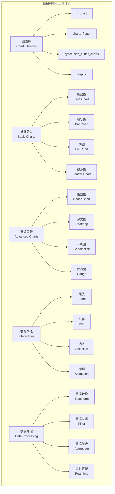

# 数据可视化组件

本文档详细介绍 Flutter 中各种数据可视化组件的使用，包括图表库、数据展示、统计图表等。

## 1. 图表组件概览



## 2. fl_chart 图表库

### 2.1 基础配置

```yaml
# pubspec.yaml
dependencies:
  fl_chart: ^0.65.0
```

```dart
// fl_chart 基础使用
import 'package:fl_chart/fl_chart.dart';
import 'dart:math';

class FlChartComponents extends StatefulWidget {
  @override
  _FlChartComponentsState createState() => _FlChartComponentsState();
}

class _FlChartComponentsState extends State<FlChartComponents> {
  int _selectedChartIndex = 0;
  List<FlSpot> _lineChartData = [];
  List<BarChartGroupData> _barChartData = [];
  List<PieChartSectionData> _pieChartData = [];
  
  @override
  void initState() {
    super.initState();
    _generateData();
  }
  
  void _generateData() {
    final random = Random();
    
    // 生成折线图数据
    _lineChartData = List.generate(12, (index) {
      return FlSpot(index.toDouble(), random.nextDouble() * 100);
    });
    
    // 生成柱状图数据
    _barChartData = List.generate(7, (index) {
      return BarChartGroupData(
        x: index,
        barRods: [
          BarChartRodData(
            toY: random.nextDouble() * 100,
            color: Colors.blue,
            width: 20,
            borderRadius: BorderRadius.circular(4),
          ),
        ],
      );
    });
    
    // 生成饼图数据
    final colors = [Colors.blue, Colors.red, Colors.green, Colors.orange, Colors.purple];
    _pieChartData = List.generate(5, (index) {
      return PieChartSectionData(
        value: random.nextDouble() * 100,
        color: colors[index],
        title: '${index + 1}',
        radius: 100,
        titleStyle: const TextStyle(
          fontSize: 16,
          fontWeight: FontWeight.bold,
          color: Colors.white,
        ),
      );
    });
  }
  
  @override
  Widget build(BuildContext context) {
    return Scaffold(
      appBar: AppBar(
        title: const Text('fl_chart 图表库'),
        actions: [
          IconButton(
            icon: const Icon(Icons.refresh),
            onPressed: () {
              setState(() {
                _generateData();
              });
            },
          ),
        ],
      ),
      body: Column(
        children: [
          // 图表类型选择
          Container(
            height: 60,
            padding: const EdgeInsets.symmetric(horizontal: 16),
            child: Row(
              children: [
                Expanded(
                  child: ListView(
                    scrollDirection: Axis.horizontal,
                    children: [
                      _buildChartTypeButton('折线图', 0),
                      _buildChartTypeButton('柱状图', 1),
                      _buildChartTypeButton('饼图', 2),
                      _buildChartTypeButton('雷达图', 3),
                    ],
                  ),
                ),
              ],
            ),
          ),
          
          // 图表显示区域
          Expanded(
            child: Padding(
              padding: const EdgeInsets.all(16),
              child: _buildSelectedChart(),
            ),
          ),
        ],
      ),
    );
  }
  
  Widget _buildChartTypeButton(String title, int index) {
    final isSelected = _selectedChartIndex == index;
    return Container(
      margin: const EdgeInsets.only(right: 12),
      child: ElevatedButton(
        onPressed: () {
          setState(() {
            _selectedChartIndex = index;
          });
        },
        style: ElevatedButton.styleFrom(
          backgroundColor: isSelected ? Colors.blue : Colors.grey[300],
          foregroundColor: isSelected ? Colors.white : Colors.black,
        ),
        child: Text(title),
      ),
    );
  }
  
  Widget _buildSelectedChart() {
    switch (_selectedChartIndex) {
      case 0:
        return _buildLineChart();
      case 1:
        return _buildBarChart();
      case 2:
        return _buildPieChart();
      case 3:
        return _buildRadarChart();
      default:
        return _buildLineChart();
    }
  }
  
  Widget _buildLineChart() {
    return Card(
      elevation: 4,
      child: Padding(
        padding: const EdgeInsets.all(16),
        child: Column(
          crossAxisAlignment: CrossAxisAlignment.start,
          children: [
            const Text(
              '月度销售趋势',
              style: TextStyle(
                fontSize: 18,
                fontWeight: FontWeight.bold,
              ),
            ),
            const SizedBox(height: 16),
            Expanded(
              child: LineChart(
                LineChartData(
                  gridData: FlGridData(
                    show: true,
                    drawVerticalLine: true,
                    horizontalInterval: 20,
                    verticalInterval: 2,
                    getDrawingHorizontalLine: (value) {
                      return FlLine(
                        color: Colors.grey[300]!,
                        strokeWidth: 1,
                      );
                    },
                    getDrawingVerticalLine: (value) {
                      return FlLine(
                        color: Colors.grey[300]!,
                        strokeWidth: 1,
                      );
                    },
                  ),
                  titlesData: FlTitlesData(
                    show: true,
                    rightTitles: AxisTitles(
                      sideTitles: SideTitles(showTitles: false),
                    ),
                    topTitles: AxisTitles(
                      sideTitles: SideTitles(showTitles: false),
                    ),
                    bottomTitles: AxisTitles(
                      sideTitles: SideTitles(
                        showTitles: true,
                        reservedSize: 30,
                        interval: 1,
                        getTitlesWidget: (double value, TitleMeta meta) {
                          const style = TextStyle(
                            color: Colors.grey,
                            fontWeight: FontWeight.bold,
                            fontSize: 12,
                          );
                          Widget text;
                          switch (value.toInt()) {
                            case 0:
                              text = const Text('1月', style: style);
                              break;
                            case 2:
                              text = const Text('3月', style: style);
                              break;
                            case 4:
                              text = const Text('5月', style: style);
                              break;
                            case 6:
                              text = const Text('7月', style: style);
                              break;
                            case 8:
                              text = const Text('9月', style: style);
                              break;
                            case 10:
                              text = const Text('11月', style: style);
                              break;
                            default:
                              text = const Text('', style: style);
                              break;
                          }
                          return SideTitleWidget(
                            axisSide: meta.axisSide,
                            child: text,
                          );
                        },
                      ),
                    ),
                    leftTitles: AxisTitles(
                      sideTitles: SideTitles(
                        showTitles: true,
                        interval: 20,
                        getTitlesWidget: (double value, TitleMeta meta) {
                          return Text(
                            value.toInt().toString(),
                            style: const TextStyle(
                              color: Colors.grey,
                              fontWeight: FontWeight.bold,
                              fontSize: 12,
                            ),
                          );
                        },
                        reservedSize: 42,
                      ),
                    ),
                  ),
                  borderData: FlBorderData(
                    show: true,
                    border: Border.all(
                      color: Colors.grey[300]!,
                      width: 1,
                    ),
                  ),
                  minX: 0,
                  maxX: 11,
                  minY: 0,
                  maxY: 100,
                  lineBarsData: [
                    LineChartBarData(
                      spots: _lineChartData,
                      isCurved: true,
                      gradient: LinearGradient(
                        colors: [
                          Colors.blue,
                          Colors.blue.withOpacity(0.3),
                        ],
                      ),
                      barWidth: 3,
                      isStrokeCapRound: true,
                      dotData: FlDotData(
                        show: true,
                        getDotPainter: (spot, percent, barData, index) {
                          return FlDotCirclePainter(
                            radius: 4,
                            color: Colors.blue,
                            strokeWidth: 2,
                            strokeColor: Colors.white,
                          );
                        },
                      ),
                      belowBarData: BarAreaData(
                        show: true,
                        gradient: LinearGradient(
                          begin: Alignment.topCenter,
                          end: Alignment.bottomCenter,
                          colors: [
                            Colors.blue.withOpacity(0.3),
                            Colors.blue.withOpacity(0.1),
                          ],
                        ),
                      ),
                    ),
                  ],
                  lineTouchData: LineTouchData(
                    enabled: true,
                    touchTooltipData: LineTouchTooltipData(
                      tooltipBgColor: Colors.black.withOpacity(0.8),
                      getTooltipItems: (List<LineBarSpot> touchedBarSpots) {
                        return touchedBarSpots.map((barSpot) {
                          final flSpot = barSpot;
                          return LineTooltipItem(
                            '${(flSpot.x + 1).toInt()}月\n${flSpot.y.toStringAsFixed(1)}',
                            const TextStyle(
                              color: Colors.white,
                              fontWeight: FontWeight.bold,
                            ),
                          );
                        }).toList();
                      },
                    ),
                  ),
                ),
              ),
            ),
          ],
        ),
      ),
    );
  }
  
  Widget _buildBarChart() {
    return Card(
      elevation: 4,
      child: Padding(
        padding: const EdgeInsets.all(16),
        child: Column(
          crossAxisAlignment: CrossAxisAlignment.start,
          children: [
            const Text(
              '周销售统计',
              style: TextStyle(
                fontSize: 18,
                fontWeight: FontWeight.bold,
              ),
            ),
            const SizedBox(height: 16),
            Expanded(
              child: BarChart(
                BarChartData(
                  alignment: BarChartAlignment.spaceAround,
                  maxY: 100,
                  barTouchData: BarTouchData(
                    enabled: true,
                    touchTooltipData: BarTouchTooltipData(
                      tooltipBgColor: Colors.black.withOpacity(0.8),
                      getTooltipItem: (group, groupIndex, rod, rodIndex) {
                        String weekDay;
                        switch (group.x.toInt()) {
                          case 0:
                            weekDay = '周一';
                            break;
                          case 1:
                            weekDay = '周二';
                            break;
                          case 2:
                            weekDay = '周三';
                            break;
                          case 3:
                            weekDay = '周四';
                            break;
                          case 4:
                            weekDay = '周五';
                            break;
                          case 5:
                            weekDay = '周六';
                            break;
                          case 6:
                            weekDay = '周日';
                            break;
                          default:
                            weekDay = '';
                        }
                        return BarTooltipItem(
                          '$weekDay\n${rod.toY.toStringAsFixed(1)}',
                          const TextStyle(
                            color: Colors.white,
                            fontWeight: FontWeight.bold,
                          ),
                        );
                      },
                    ),
                  ),
                  titlesData: FlTitlesData(
                    show: true,
                    rightTitles: AxisTitles(
                      sideTitles: SideTitles(showTitles: false),
                    ),
                    topTitles: AxisTitles(
                      sideTitles: SideTitles(showTitles: false),
                    ),
                    bottomTitles: AxisTitles(
                      sideTitles: SideTitles(
                        showTitles: true,
                        getTitlesWidget: (double value, TitleMeta meta) {
                          const style = TextStyle(
                            color: Colors.grey,
                            fontWeight: FontWeight.bold,
                            fontSize: 12,
                          );
                          Widget text;
                          switch (value.toInt()) {
                            case 0:
                              text = const Text('周一', style: style);
                              break;
                            case 1:
                              text = const Text('周二', style: style);
                              break;
                            case 2:
                              text = const Text('周三', style: style);
                              break;
                            case 3:
                              text = const Text('周四', style: style);
                              break;
                            case 4:
                              text = const Text('周五', style: style);
                              break;
                            case 5:
                              text = const Text('周六', style: style);
                              break;
                            case 6:
                              text = const Text('周日', style: style);
                              break;
                            default:
                              text = const Text('', style: style);
                              break;
                          }
                          return SideTitleWidget(
                            axisSide: meta.axisSide,
                            child: text,
                          );
                        },
                        reservedSize: 38,
                      ),
                    ),
                    leftTitles: AxisTitles(
                      sideTitles: SideTitles(
                        showTitles: true,
                        reservedSize: 28,
                        interval: 20,
                        getTitlesWidget: (double value, TitleMeta meta) {
                          return Text(
                            value.toInt().toString(),
                            style: const TextStyle(
                              color: Colors.grey,
                              fontWeight: FontWeight.bold,
                              fontSize: 12,
                            ),
                          );
                        },
                      ),
                    ),
                  ),
                  borderData: FlBorderData(
                    show: false,
                  ),
                  barGroups: _barChartData,
                  gridData: FlGridData(
                    show: true,
                    drawHorizontalLine: true,
                    drawVerticalLine: false,
                    horizontalInterval: 20,
                    getDrawingHorizontalLine: (value) {
                      return FlLine(
                        color: Colors.grey[300]!,
                        strokeWidth: 1,
                      );
                    },
                  ),
                ),
              ),
            ),
          ],
        ),
      ),
    );
  }
  
  Widget _buildPieChart() {
    return Card(
      elevation: 4,
      child: Padding(
        padding: const EdgeInsets.all(16),
        child: Column(
          crossAxisAlignment: CrossAxisAlignment.start,
          children: [
            const Text(
              '销售占比分析',
              style: TextStyle(
                fontSize: 18,
                fontWeight: FontWeight.bold,
              ),
            ),
            const SizedBox(height: 16),
            Expanded(
              child: Row(
                children: [
                  Expanded(
                    flex: 2,
                    child: PieChart(
                      PieChartData(
                        pieTouchData: PieTouchData(
                          touchCallback: (FlTouchEvent event, pieTouchResponse) {
                            // 处理触摸事件
                          },
                        ),
                        borderData: FlBorderData(
                          show: false,
                        ),
                        sectionsSpace: 2,
                        centerSpaceRadius: 40,
                        sections: _pieChartData,
                      ),
                    ),
                  ),
                  Expanded(
                    flex: 1,
                    child: Column(
                      mainAxisAlignment: MainAxisAlignment.center,
                      crossAxisAlignment: CrossAxisAlignment.start,
                      children: [
                        _buildLegendItem('产品A', Colors.blue),
                        _buildLegendItem('产品B', Colors.red),
                        _buildLegendItem('产品C', Colors.green),
                        _buildLegendItem('产品D', Colors.orange),
                        _buildLegendItem('产品E', Colors.purple),
                      ],
                    ),
                  ),
                ],
              ),
            ),
          ],
        ),
      ),
    );
  }
  
  Widget _buildLegendItem(String title, Color color) {
    return Padding(
      padding: const EdgeInsets.symmetric(vertical: 4),
      child: Row(
        children: [
          Container(
            width: 16,
            height: 16,
            decoration: BoxDecoration(
              color: color,
              shape: BoxShape.circle,
            ),
          ),
          const SizedBox(width: 8),
          Text(
            title,
            style: const TextStyle(
              fontSize: 14,
              fontWeight: FontWeight.w500,
            ),
          ),
        ],
      ),
    );
  }
  
  Widget _buildRadarChart() {
    return Card(
      elevation: 4,
      child: Padding(
        padding: const EdgeInsets.all(16),
        child: Column(
          crossAxisAlignment: CrossAxisAlignment.start,
          children: [
            const Text(
              '能力雷达图',
              style: TextStyle(
                fontSize: 18,
                fontWeight: FontWeight.bold,
              ),
            ),
            const SizedBox(height: 16),
            Expanded(
              child: RadarChart(
                RadarChartData(
                  radarTouchData: RadarTouchData(
                    touchCallback: (FlTouchEvent event, response) {
                      // 处理触摸事件
                    },
                  ),
                  dataSets: [
                    RadarDataSet(
                      fillColor: Colors.blue.withOpacity(0.2),
                      borderColor: Colors.blue,
                      entryRadius: 3,
                      dataEntries: [
                        RadarEntry(value: 80),
                        RadarEntry(value: 90),
                        RadarEntry(value: 70),
                        RadarEntry(value: 85),
                        RadarEntry(value: 75),
                        RadarEntry(value: 95),
                      ],
                    ),
                  ],
                  radarBackgroundColor: Colors.transparent,
                  borderData: FlBorderData(show: false),
                  radarBorderData: BorderSide(color: Colors.grey[300]!, width: 1),
                  titlePositionPercentageOffset: 0.2,
                  titleTextStyle: const TextStyle(
                    color: Colors.grey,
                    fontSize: 12,
                  ),
                  getTitle: (index, angle) {
                    switch (index) {
                      case 0:
                        return RadarChartTitle(text: '技术能力');
                      case 1:
                        return RadarChartTitle(text: '沟通能力');
                      case 2:
                        return RadarChartTitle(text: '学习能力');
                      case 3:
                        return RadarChartTitle(text: '解决问题');
                      case 4:
                        return RadarChartTitle(text: '团队协作');
                      case 5:
                        return RadarChartTitle(text: '创新思维');
                      default:
                        return const RadarChartTitle(text: '');
                    }
                  },
                  tickCount: 5,
                  ticksTextStyle: const TextStyle(
                    color: Colors.grey,
                    fontSize: 10,
                  ),
                  tickBorderData: BorderSide(color: Colors.grey[300]!, width: 1),
                  gridBorderData: BorderSide(color: Colors.grey[300]!, width: 1),
                ),
              ),
            ),
          ],
        ),
      ),
    );
  }
}
```

## 3. Syncfusion Charts

### 3.1 基础配置

```yaml
# pubspec.yaml
dependencies:
  syncfusion_flutter_charts: ^24.1.41
```

```dart
// Syncfusion Charts 使用
import 'package:syncfusion_flutter_charts/charts.dart';

class SyncfusionChartsComponents extends StatefulWidget {
  @override
  _SyncfusionChartsComponentsState createState() => _SyncfusionChartsComponentsState();
}

class _SyncfusionChartsComponentsState extends State<SyncfusionChartsComponents> {
  List<SalesData> _salesData = [];
  List<ChartData> _chartData = [];
  
  @override
  void initState() {
    super.initState();
    _generateData();
  }
  
  void _generateData() {
    final random = Random();
    
    _salesData = [
      SalesData('1月', random.nextInt(100) + 20),
      SalesData('2月', random.nextInt(100) + 20),
      SalesData('3月', random.nextInt(100) + 20),
      SalesData('4月', random.nextInt(100) + 20),
      SalesData('5月', random.nextInt(100) + 20),
      SalesData('6月', random.nextInt(100) + 20),
    ];
    
    _chartData = [
      ChartData('产品A', random.nextInt(50) + 10, Colors.blue),
      ChartData('产品B', random.nextInt(50) + 10, Colors.red),
      ChartData('产品C', random.nextInt(50) + 10, Colors.green),
      ChartData('产品D', random.nextInt(50) + 10, Colors.orange),
      ChartData('产品E', random.nextInt(50) + 10, Colors.purple),
    ];
  }
  
  @override
  Widget build(BuildContext context) {
    return Scaffold(
      appBar: AppBar(
        title: const Text('Syncfusion Charts'),
        actions: [
          IconButton(
            icon: const Icon(Icons.refresh),
            onPressed: () {
              setState(() {
                _generateData();
              });
            },
          ),
        ],
      ),
      body: ListView(
        padding: const EdgeInsets.all(16),
        children: [
          // 折线图
          _buildSection(
            '折线图',
            Container(
              height: 300,
              child: SfCartesianChart(
                primaryXAxis: CategoryAxis(),
                primaryYAxis: NumericAxis(
                  minimum: 0,
                  maximum: 150,
                  interval: 25,
                ),
                title: ChartTitle(text: '月度销售趋势'),
                legend: Legend(isVisible: true),
                tooltipBehavior: TooltipBehavior(enable: true),
                series: <ChartSeries<SalesData, String>>[
                  LineSeries<SalesData, String>(
                    dataSource: _salesData,
                    xValueMapper: (SalesData sales, _) => sales.month,
                    yValueMapper: (SalesData sales, _) => sales.sales,
                    name: '销售额',
                    color: Colors.blue,
                    width: 3,
                    markerSettings: const MarkerSettings(
                      isVisible: true,
                      shape: DataMarkerType.circle,
                      borderWidth: 2,
                      borderColor: Colors.white,
                    ),
                    dataLabelSettings: const DataLabelSettings(
                      isVisible: true,
                      labelAlignment: ChartDataLabelAlignment.top,
                    ),
                  ),
                ],
              ),
            ),
          ),
          
          // 柱状图
          _buildSection(
            '柱状图',
            Container(
              height: 300,
              child: SfCartesianChart(
                primaryXAxis: CategoryAxis(),
                primaryYAxis: NumericAxis(
                  minimum: 0,
                  maximum: 150,
                  interval: 25,
                ),
                title: ChartTitle(text: '产品销售对比'),
                legend: Legend(isVisible: true),
                tooltipBehavior: TooltipBehavior(enable: true),
                series: <ChartSeries<SalesData, String>>[
                  ColumnSeries<SalesData, String>(
                    dataSource: _salesData,
                    xValueMapper: (SalesData sales, _) => sales.month,
                    yValueMapper: (SalesData sales, _) => sales.sales,
                    name: '销售额',
                    color: Colors.blue,
                    borderRadius: const BorderRadius.all(Radius.circular(4)),
                    dataLabelSettings: const DataLabelSettings(
                      isVisible: true,
                      labelAlignment: ChartDataLabelAlignment.top,
                    ),
                  ),
                ],
              ),
            ),
          ),
          
          // 饼图
          _buildSection(
            '饼图',
            Container(
              height: 300,
              child: SfCircularChart(
                title: ChartTitle(text: '产品销售占比'),
                legend: Legend(
                  isVisible: true,
                  position: LegendPosition.right,
                ),
                tooltipBehavior: TooltipBehavior(enable: true),
                series: <CircularSeries<ChartData, String>>[
                  PieSeries<ChartData, String>(
                    dataSource: _chartData,
                    xValueMapper: (ChartData data, _) => data.category,
                    yValueMapper: (ChartData data, _) => data.value,
                    pointColorMapper: (ChartData data, _) => data.color,
                    dataLabelSettings: const DataLabelSettings(
                      isVisible: true,
                      labelPosition: ChartDataLabelPosition.outside,
                    ),
                    enableTooltip: true,
                    explode: true,
                    explodeIndex: 0,
                  ),
                ],
              ),
            ),
          ),
          
          // 环形图
          _buildSection(
            '环形图',
            Container(
              height: 300,
              child: SfCircularChart(
                title: ChartTitle(text: '销售分布'),
                legend: Legend(
                  isVisible: true,
                  position: LegendPosition.bottom,
                ),
                tooltipBehavior: TooltipBehavior(enable: true),
                series: <CircularSeries<ChartData, String>>[
                  DoughnutSeries<ChartData, String>(
                    dataSource: _chartData,
                    xValueMapper: (ChartData data, _) => data.category,
                    yValueMapper: (ChartData data, _) => data.value,
                    pointColorMapper: (ChartData data, _) => data.color,
                    innerRadius: '60%',
                    dataLabelSettings: const DataLabelSettings(
                      isVisible: true,
                      labelPosition: ChartDataLabelPosition.outside,
                    ),
                    enableTooltip: true,
                  ),
                ],
                annotations: <CircularChartAnnotation>[
                  CircularChartAnnotation(
                    widget: Container(
                      child: const Text(
                        '总销售\n500万',
                        style: TextStyle(
                          fontSize: 16,
                          fontWeight: FontWeight.bold,
                        ),
                        textAlign: TextAlign.center,
                      ),
                    ),
                  ),
                ],
              ),
            ),
          ),
        ],
      ),
    );
  }
  
  Widget _buildSection(String title, Widget child) {
    return Column(
      crossAxisAlignment: CrossAxisAlignment.start,
      children: [
        Text(
          title,
          style: const TextStyle(
            fontSize: 18,
            fontWeight: FontWeight.bold,
          ),
        ),
        const SizedBox(height: 12),
        Card(
          elevation: 4,
          child: Padding(
            padding: const EdgeInsets.all(16),
            child: child,
          ),
        ),
        const SizedBox(height: 24),
      ],
    );
  }
}

// 数据模型
class SalesData {
  final String month;
  final int sales;
  
  SalesData(this.month, this.sales);
}

class ChartData {
  final String category;
  final int value;
  final Color color;
  
  ChartData(this.category, this.value, this.color);
}
```

## 4. 实时数据图表

```dart
// 实时数据图表
class RealTimeChartComponents extends StatefulWidget {
  @override
  _RealTimeChartComponentsState createState() => _RealTimeChartComponentsState();
}

class _RealTimeChartComponentsState extends State<RealTimeChartComponents> {
  List<FlSpot> _realTimeData = [];
  Timer? _timer;
  double _currentX = 0;
  final int _maxDataPoints = 50;
  
  @override
  void initState() {
    super.initState();
    _startRealTimeUpdates();
  }
  
  void _startRealTimeUpdates() {
    _timer = Timer.periodic(const Duration(milliseconds: 500), (timer) {
      setState(() {
        final random = Random();
        final newY = 50 + random.nextDouble() * 50;
        
        _realTimeData.add(FlSpot(_currentX, newY));
        _currentX++;
        
        // 保持数据点数量在限制范围内
        if (_realTimeData.length > _maxDataPoints) {
          _realTimeData.removeAt(0);
          // 重新调整 x 坐标
          for (int i = 0; i < _realTimeData.length; i++) {
            _realTimeData[i] = FlSpot(i.toDouble(), _realTimeData[i].y);
          }
          _currentX = _realTimeData.length.toDouble();
        }
      });
    });
  }
  
  @override
  Widget build(BuildContext context) {
    return Scaffold(
      appBar: AppBar(
        title: const Text('实时数据图表'),
        actions: [
          IconButton(
            icon: Icon(_timer?.isActive == true ? Icons.pause : Icons.play_arrow),
            onPressed: () {
              if (_timer?.isActive == true) {
                _timer?.cancel();
              } else {
                _startRealTimeUpdates();
              }
              setState(() {});
            },
          ),
          IconButton(
            icon: const Icon(Icons.clear),
            onPressed: () {
              setState(() {
                _realTimeData.clear();
                _currentX = 0;
              });
            },
          ),
        ],
      ),
      body: Padding(
        padding: const EdgeInsets.all(16),
        child: Column(
          children: [
            // 实时数据显示
            Card(
              child: Padding(
                padding: const EdgeInsets.all(16),
                child: Row(
                  mainAxisAlignment: MainAxisAlignment.spaceAround,
                  children: [
                    _buildDataItem(
                      '当前值',
                      _realTimeData.isNotEmpty
                          ? _realTimeData.last.y.toStringAsFixed(1)
                          : '0.0',
                      Colors.blue,
                    ),
                    _buildDataItem(
                      '平均值',
                      _realTimeData.isNotEmpty
                          ? (_realTimeData.map((e) => e.y).reduce((a, b) => a + b) / _realTimeData.length).toStringAsFixed(1)
                          : '0.0',
                      Colors.green,
                    ),
                    _buildDataItem(
                      '数据点',
                      _realTimeData.length.toString(),
                      Colors.orange,
                    ),
                  ],
                ),
              ),
            ),
            
            const SizedBox(height: 16),
            
            // 实时图表
            Expanded(
              child: Card(
                child: Padding(
                  padding: const EdgeInsets.all(16),
                  child: LineChart(
                    LineChartData(
                      gridData: FlGridData(
                        show: true,
                        drawVerticalLine: true,
                        horizontalInterval: 25,
                        verticalInterval: 10,
                        getDrawingHorizontalLine: (value) {
                          return FlLine(
                            color: Colors.grey[300]!,
                            strokeWidth: 1,
                          );
                        },
                        getDrawingVerticalLine: (value) {
                          return FlLine(
                            color: Colors.grey[300]!,
                            strokeWidth: 1,
                          );
                        },
                      ),
                      titlesData: FlTitlesData(
                        show: true,
                        rightTitles: AxisTitles(
                          sideTitles: SideTitles(showTitles: false),
                        ),
                        topTitles: AxisTitles(
                          sideTitles: SideTitles(showTitles: false),
                        ),
                        bottomTitles: AxisTitles(
                          sideTitles: SideTitles(
                            showTitles: true,
                            reservedSize: 30,
                            interval: 10,
                            getTitlesWidget: (double value, TitleMeta meta) {
                              return Text(
                                value.toInt().toString(),
                                style: const TextStyle(
                                  color: Colors.grey,
                                  fontWeight: FontWeight.bold,
                                  fontSize: 12,
                                ),
                              );
                            },
                          ),
                        ),
                        leftTitles: AxisTitles(
                          sideTitles: SideTitles(
                            showTitles: true,
                            interval: 25,
                            getTitlesWidget: (double value, TitleMeta meta) {
                              return Text(
                                value.toInt().toString(),
                                style: const TextStyle(
                                  color: Colors.grey,
                                  fontWeight: FontWeight.bold,
                                  fontSize: 12,
                                ),
                              );
                            },
                            reservedSize: 42,
                          ),
                        ),
                      ),
                      borderData: FlBorderData(
                        show: true,
                        border: Border.all(
                          color: Colors.grey[300]!,
                          width: 1,
                        ),
                      ),
                      minX: _realTimeData.isNotEmpty ? _realTimeData.first.x : 0,
                      maxX: _realTimeData.isNotEmpty ? _realTimeData.last.x : 10,
                      minY: 0,
                      maxY: 100,
                      lineBarsData: [
                        LineChartBarData(
                          spots: _realTimeData,
                          isCurved: true,
                          gradient: LinearGradient(
                            colors: [
                              Colors.blue,
                              Colors.blue.withOpacity(0.3),
                            ],
                          ),
                          barWidth: 2,
                          isStrokeCapRound: true,
                          dotData: FlDotData(show: false),
                          belowBarData: BarAreaData(
                            show: true,
                            gradient: LinearGradient(
                              begin: Alignment.topCenter,
                              end: Alignment.bottomCenter,
                              colors: [
                                Colors.blue.withOpacity(0.3),
                                Colors.blue.withOpacity(0.1),
                              ],
                            ),
                          ),
                        ),
                      ],
                    ),
                  ),
                ),
              ),
            ),
          ],
        ),
      ),
    );
  }
  
  Widget _buildDataItem(String label, String value, Color color) {
    return Column(
      children: [
        Text(
          label,
          style: const TextStyle(
            fontSize: 12,
            color: Colors.grey,
          ),
        ),
        const SizedBox(height: 4),
        Text(
          value,
          style: TextStyle(
            fontSize: 18,
            fontWeight: FontWeight.bold,
            color: color,
          ),
        ),
      ],
    );
  }
  
  @override
  void dispose() {
    _timer?.cancel();
    super.dispose();
  }
}
```

## 5. 数据可视化最佳实践

### 5.1 性能优化

```dart
// 图表性能优化
class ChartOptimization {
  // 数据采样
  static List<FlSpot> sampleData(List<FlSpot> data, int maxPoints) {
    if (data.length <= maxPoints) return data;
    
    final step = data.length / maxPoints;
    final sampledData = <FlSpot>[];
    
    for (int i = 0; i < maxPoints; i++) {
      final index = (i * step).round();
      if (index < data.length) {
        sampledData.add(data[index]);
      }
    }
    
    return sampledData;
  }
  
  // 数据缓存
  static final Map<String, List<dynamic>> _dataCache = {};
  
  static List<dynamic>? getCachedData(String key) {
    return _dataCache[key];
  }
  
  static void setCachedData(String key, List<dynamic> data) {
    _dataCache[key] = data;
  }
  
  // 延迟加载
  static Future<List<dynamic>> loadDataLazily(Future<List<dynamic>> Function() loader) async {
    // 添加加载延迟以避免阻塞 UI
    await Future.delayed(const Duration(milliseconds: 100));
    return await loader();
  }
}
```

### 5.2 交互增强

```dart
// 图表交互增强
class ChartInteractions {
  // 缩放和平移
  static InteractiveViewer buildZoomableChart(Widget chart) {
    return InteractiveViewer(
      boundaryMargin: const EdgeInsets.all(20),
      minScale: 0.5,
      maxScale: 3.0,
      child: chart,
    );
  }
  
  // 数据筛选
  static List<FlSpot> filterDataByDateRange(
    List<FlSpot> data,
    DateTime startDate,
    DateTime endDate,
  ) {
    return data.where((spot) {
      final spotDate = DateTime.fromMillisecondsSinceEpoch(spot.x.toInt());
      return spotDate.isAfter(startDate) && spotDate.isBefore(endDate);
    }).toList();
  }
  
  // 数据导出
  static String exportDataToCsv(List<FlSpot> data) {
    final buffer = StringBuffer();
    buffer.writeln('X,Y');
    
    for (final spot in data) {
      buffer.writeln('${spot.x},${spot.y}');
    }
    
    return buffer.toString();
  }
}
```

## 6. 总结

数据可视化是现代应用的重要功能，本文档涵盖了：

### 核心组件
- **fl_chart**：轻量级、高性能的图表库
- **Syncfusion Charts**：功能丰富的商业图表库
- **实时图表**：动态数据展示

### 图表类型
- **基础图表**：折线图、柱状图、饼图
- **高级图表**：雷达图、散点图、热力图
- **交互功能**：缩放、平移、选择、动画

### 最佳实践
- **性能优化**：数据采样、缓存、延迟加载
- **用户体验**：交互增强、响应式设计
- **数据处理**：转换、过滤、聚合

## 相关资源

- [fl_chart 官方文档](https://pub.dev/packages/fl_chart)
- [Syncfusion Flutter Charts](https://pub.dev/packages/syncfusion_flutter_charts)
- [Flutter 数据可视化指南](https://docs.flutter.dev/development/ui/widgets/material)
- [图表设计最佳实践](https://material.io/design/communication/data-visualization.html)