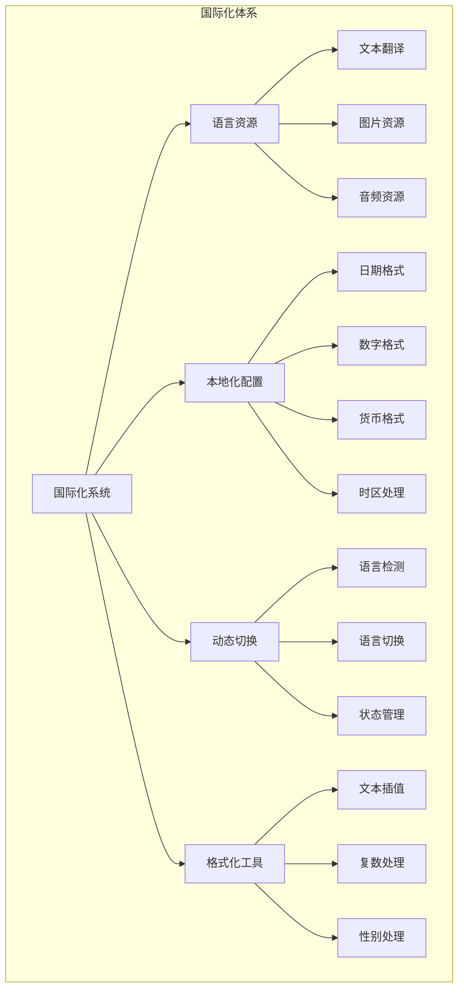

# Flutter 国际化实现方案详解

本文档详细介绍 Flutter 应用的国际化(i18n)实现方案，包括多语言支持、本地化配置和动态语言切换。

## 📋 目录

- [国际化基础](#国际化基础)
- [官方国际化方案](#官方国际化方案)
- [第三方国际化方案](#第三方国际化方案)
- [动态语言切换](#动态语言切换)
- [实际应用案例](#实际应用案例)
- [最佳实践](#最佳实践)

## 国际化基础

### 架构图



### 基础概念

```dart
import 'package:flutter/material.dart';
import 'package:flutter_localizations/flutter_localizations.dart';

// 支持的语言列表
class SupportedLocales {
  static const List<Locale> supportedLocales = [
    Locale('en', 'US'), // 英语(美国)
    Locale('zh', 'CN'), // 中文(简体)
    Locale('zh', 'TW'), // 中文(繁体)
    Locale('ja', 'JP'), // 日语
    Locale('ko', 'KR'), // 韩语
    Locale('es', 'ES'), // 西班牙语
    Locale('fr', 'FR'), // 法语
    Locale('de', 'DE'), // 德语
    Locale('ru', 'RU'), // 俄语
    Locale('ar', 'SA'), // 阿拉伯语
  ];
  
  // 语言名称映射
  static const Map<String, String> languageNames = {
    'en_US': 'English',
    'zh_CN': '简体中文',
    'zh_TW': '繁體中文',
    'ja_JP': '日本語',
    'ko_KR': '한국어',
    'es_ES': 'Español',
    'fr_FR': 'Français',
    'de_DE': 'Deutsch',
    'ru_RU': 'Русский',
    'ar_SA': 'العربية',
  };
  
  // 获取语言名称
  static String getLanguageName(Locale locale) {
    final key = '${locale.languageCode}_${locale.countryCode}';
    return languageNames[key] ?? locale.toString();
  }
  
  // 检查是否支持该语言
  static bool isSupported(Locale locale) {
    return supportedLocales.any((supportedLocale) =>
        supportedLocale.languageCode == locale.languageCode &&
        supportedLocale.countryCode == locale.countryCode);
  }
  
  // 获取默认语言
  static Locale getDefaultLocale() {
    return const Locale('en', 'US');
  }
  
  // 根据语言代码获取Locale
  static Locale? getLocaleFromCode(String languageCode, [String? countryCode]) {
    return supportedLocales.firstWhere(
      (locale) => locale.languageCode == languageCode &&
          (countryCode == null || locale.countryCode == countryCode),
      orElse: () => getDefaultLocale(),
    );
  }
}
```

## 官方国际化方案

### 依赖配置

```yaml
# pubspec.yaml
dependencies:
  flutter:
    sdk: flutter
  flutter_localizations:
    sdk: flutter
  intl: ^0.18.1

dev_dependencies:
  flutter_gen: ^5.3.2

# 启用国际化代码生成
flutter:
  generate: true
```

### l10n.yaml 配置

```yaml
# l10n.yaml
arb-dir: lib/l10n
template-arb-file: app_en.arb
output-localization-file: app_localizations.dart
output-class: AppLocalizations
output-dir: lib/l10n/generated
preferred-supported-locales: ['en', 'zh']
```

### ARB 文件配置

```json
// lib/l10n/app_en.arb
{
  "@@locale": "en",
  "appTitle": "Flutter I18n Demo",
  "@appTitle": {
    "description": "The title of the application"
  },
  "welcome": "Welcome",
  "@welcome": {
    "description": "Welcome message"
  },
  "hello": "Hello {name}!",
  "@hello": {
    "description": "Greeting message with name",
    "placeholders": {
      "name": {
        "type": "String",
        "example": "John"
      }
    }
  },
  "itemCount": "{count, plural, =0{No items} =1{One item} other{{count} items}}",
  "@itemCount": {
    "description": "Item count with plural support",
    "placeholders": {
      "count": {
        "type": "int",
        "example": "5"
      }
    }
  },
  "currentDate": "Today is {date}",
  "@currentDate": {
    "description": "Current date display",
    "placeholders": {
      "date": {
        "type": "DateTime",
        "format": "yMMMd",
        "example": "Jan 1, 2024"
      }
    }
  },
  "price": "Price: {amount}",
  "@price": {
    "description": "Price display",
    "placeholders": {
      "amount": {
        "type": "double",
        "format": "currency",
        "example": "$9.99"
      }
    }
  },
  "settings": "Settings",
  "language": "Language",
  "theme": "Theme",
  "about": "About",
  "version": "Version {version}",
  "@version": {
    "placeholders": {
      "version": {
        "type": "String"
      }
    }
  },
  "login": "Login",
  "logout": "Logout",
  "username": "Username",
  "password": "Password",
  "email": "Email",
  "phone": "Phone",
  "save": "Save",
  "cancel": "Cancel",
  "confirm": "Confirm",
  "delete": "Delete",
  "edit": "Edit",
  "add": "Add",
  "search": "Search",
  "filter": "Filter",
  "sort": "Sort",
  "refresh": "Refresh",
  "loading": "Loading...",
  "error": "Error",
  "success": "Success",
  "warning": "Warning",
  "info": "Information"
}
```

```json
// lib/l10n/app_zh.arb
{
  "@@locale": "zh",
  "appTitle": "Flutter 国际化示例",
  "welcome": "欢迎",
  "hello": "你好，{name}！",
  "itemCount": "{count, plural, =0{没有项目} =1{一个项目} other{{count} 个项目}}",
  "currentDate": "今天是 {date}",
  "price": "价格：{amount}",
  "settings": "设置",
  "language": "语言",
  "theme": "主题",
  "about": "关于",
  "version": "版本 {version}",
  "login": "登录",
  "logout": "退出登录",
  "username": "用户名",
  "password": "密码",
  "email": "邮箱",
  "phone": "电话",
  "save": "保存",
  "cancel": "取消",
  "confirm": "确认",
  "delete": "删除",
  "edit": "编辑",
  "add": "添加",
  "search": "搜索",
  "filter": "筛选",
  "sort": "排序",
  "refresh": "刷新",
  "loading": "加载中...",
  "error": "错误",
  "success": "成功",
  "warning": "警告",
  "info": "信息"
}
```

### 应用配置

```dart
import 'package:flutter/material.dart';
import 'package:flutter_localizations/flutter_localizations.dart';
import 'l10n/generated/app_localizations.dart';

class MyApp extends StatelessWidget {
  @override
  Widget build(BuildContext context) {
    return MaterialApp(
      title: 'Flutter I18n Demo',
      
      // 国际化配置
      localizationsDelegates: const [
        AppLocalizations.delegate,
        GlobalMaterialLocalizations.delegate,
        GlobalWidgetsLocalizations.delegate,
        GlobalCupertinoLocalizations.delegate,
      ],
      
      // 支持的语言
      supportedLocales: AppLocalizations.supportedLocales,
      
      // 语言解析回调
      localeResolutionCallback: (locale, supportedLocales) {
        // 如果设备语言在支持列表中，使用设备语言
        if (locale != null) {
          for (var supportedLocale in supportedLocales) {
            if (supportedLocale.languageCode == locale.languageCode &&
                supportedLocale.countryCode == locale.countryCode) {
              return supportedLocale;
            }
          }
          
          // 如果只匹配语言代码
          for (var supportedLocale in supportedLocales) {
            if (supportedLocale.languageCode == locale.languageCode) {
              return supportedLocale;
            }
          }
        }
        
        // 默认返回第一个支持的语言
        return supportedLocales.first;
      },
      
      home: const HomePage(),
    );
  }
}
```

### 使用示例

```dart
class HomePage extends StatelessWidget {
  const HomePage({Key? key}) : super(key: key);
  
  @override
  Widget build(BuildContext context) {
    final l10n = AppLocalizations.of(context)!;
    
    return Scaffold(
      appBar: AppBar(
        title: Text(l10n.appTitle),
        actions: [
          IconButton(
            icon: const Icon(Icons.settings),
            onPressed: () {
              Navigator.push(
                context,
                MaterialPageRoute(
                  builder: (context) => const SettingsPage(),
                ),
              );
            },
          ),
        ],
      ),
      body: Padding(
        padding: const EdgeInsets.all(16.0),
        child: Column(
          crossAxisAlignment: CrossAxisAlignment.start,
          children: [
            // 简单文本
            Text(
              l10n.welcome,
              style: Theme.of(context).textTheme.headlineMedium,
            ),
            const SizedBox(height: 16),
            
            // 带参数的文本
            Text(
              l10n.hello('Flutter'),
              style: Theme.of(context).textTheme.bodyLarge,
            ),
            const SizedBox(height: 16),
            
            // 复数处理
            Text(l10n.itemCount(0)),
            Text(l10n.itemCount(1)),
            Text(l10n.itemCount(5)),
            const SizedBox(height: 16),
            
            // 日期格式化
            Text(l10n.currentDate(DateTime.now())),
            const SizedBox(height: 16),
            
            // 货币格式化
            Text(l10n.price(99.99)),
            const SizedBox(height: 32),
            
            // 按钮示例
            Wrap(
              spacing: 8,
              runSpacing: 8,
              children: [
                ElevatedButton(
                  onPressed: () {},
                  child: Text(l10n.login),
                ),
                OutlinedButton(
                  onPressed: () {},
                  child: Text(l10n.cancel),
                ),
                TextButton(
                  onPressed: () {},
                  child: Text(l10n.save),
                ),
              ],
            ),
            
            const SizedBox(height: 32),
            
            // 表单示例
            TextField(
              decoration: InputDecoration(
                labelText: l10n.username,
                border: const OutlineInputBorder(),
              ),
            ),
            const SizedBox(height: 16),
            TextField(
              decoration: InputDecoration(
                labelText: l10n.password,
                border: const OutlineInputBorder(),
              ),
              obscureText: true,
            ),
          ],
        ),
      ),
    );
  }
}
```

## 第三方国际化方案

### easy_localization 使用

```yaml
# pubspec.yaml
dependencies:
  easy_localization: ^3.0.3
  
# 资源文件
flutter:
  assets:
    - assets/translations/
```

```json
// assets/translations/en.json
{
  "app_title": "Flutter I18n Demo",
  "welcome": "Welcome",
  "hello": "Hello {}!",
  "settings": {
    "title": "Settings",
    "language": "Language",
    "theme": "Theme"
  },
  "buttons": {
    "save": "Save",
    "cancel": "Cancel",
    "confirm": "Confirm"
  },
  "validation": {
    "required": "This field is required",
    "email": "Please enter a valid email",
    "password": "Password must be at least 6 characters"
  }
}
```

```json
// assets/translations/zh.json
{
  "app_title": "Flutter 国际化示例",
  "welcome": "欢迎",
  "hello": "你好，{}！",
  "settings": {
    "title": "设置",
    "language": "语言",
    "theme": "主题"
  },
  "buttons": {
    "save": "保存",
    "cancel": "取消",
    "confirm": "确认"
  },
  "validation": {
    "required": "此字段为必填项",
    "email": "请输入有效的邮箱地址",
    "password": "密码至少需要6个字符"
  }
}
```

```dart
import 'package:easy_localization/easy_localization.dart';

void main() async {
  WidgetsFlutterBinding.ensureInitialized();
  await EasyLocalization.ensureInitialized();
  
  runApp(
    EasyLocalization(
      supportedLocales: const [
        Locale('en'),
        Locale('zh'),
        Locale('ja'),
        Locale('ko'),
      ],
      path: 'assets/translations',
      fallbackLocale: const Locale('en'),
      child: MyApp(),
    ),
  );
}

class MyApp extends StatelessWidget {
  @override
  Widget build(BuildContext context) {
    return MaterialApp(
      title: 'app_title'.tr(),
      localizationsDelegates: context.localizationDelegates,
      supportedLocales: context.supportedLocales,
      locale: context.locale,
      home: const EasyLocalizationDemo(),
    );
  }
}

class EasyLocalizationDemo extends StatelessWidget {
  const EasyLocalizationDemo({Key? key}) : super(key: key);
  
  @override
  Widget build(BuildContext context) {
    return Scaffold(
      appBar: AppBar(
        title: Text('app_title'.tr()),
        actions: [
          PopupMenuButton<Locale>(
            onSelected: (locale) {
              context.setLocale(locale);
            },
            itemBuilder: (context) {
              return context.supportedLocales.map((locale) {
                return PopupMenuItem(
                  value: locale,
                  child: Text(locale.toString()),
                );
              }).toList();
            },
          ),
        ],
      ),
      body: Padding(
        padding: const EdgeInsets.all(16.0),
        child: Column(
          crossAxisAlignment: CrossAxisAlignment.start,
          children: [
            // 简单翻译
            Text(
              'welcome'.tr(),
              style: Theme.of(context).textTheme.headlineMedium,
            ),
            const SizedBox(height: 16),
            
            // 带参数的翻译
            Text(
              'hello'.tr(args: ['Flutter']),
              style: Theme.of(context).textTheme.bodyLarge,
            ),
            const SizedBox(height: 16),
            
            // 嵌套键值翻译
            Text('settings.title'.tr()),
            Text('settings.language'.tr()),
            Text('settings.theme'.tr()),
            const SizedBox(height: 16),
            
            // 复数翻译
            Text('item'.plural(0)),
            Text('item'.plural(1)),
            Text('item'.plural(5)),
            const SizedBox(height: 16),
            
            // 性别翻译
            Text('user'.tr(gender: 'male')),
            Text('user'.tr(gender: 'female')),
            const SizedBox(height: 32),
            
            // 按钮
            Row(
              children: [
                ElevatedButton(
                  onPressed: () {},
                  child: Text('buttons.save'.tr()),
                ),
                const SizedBox(width: 8),
                OutlinedButton(
                  onPressed: () {},
                  child: Text('buttons.cancel'.tr()),
                ),
              ],
            ),
            
            const SizedBox(height: 32),
            
            // 表单验证
            TextFormField(
              decoration: InputDecoration(
                labelText: 'Email',
                border: const OutlineInputBorder(),
              ),
              validator: (value) {
                if (value?.isEmpty ?? true) {
                  return 'validation.required'.tr();
                }
                if (!value!.contains('@')) {
                  return 'validation.email'.tr();
                }
                return null;
              },
            ),
          ],
        ),
      ),
    );
  }
}
```

### get 国际化方案

```dart
import 'package:get/get.dart';

class Messages extends Translations {
  @override
  Map<String, Map<String, String>> get keys => {
    'en_US': {
      'app_title': 'Flutter I18n Demo',
      'welcome': 'Welcome',
      'hello': 'Hello @name!',
      'settings': 'Settings',
      'language': 'Language',
      'save': 'Save',
      'cancel': 'Cancel',
    },
    'zh_CN': {
      'app_title': 'Flutter 国际化示例',
      'welcome': '欢迎',
      'hello': '你好，@name！',
      'settings': '设置',
      'language': '语言',
      'save': '保存',
      'cancel': '取消',
    },
  };
}

class MyApp extends StatelessWidget {
  @override
  Widget build(BuildContext context) {
    return GetMaterialApp(
      title: 'app_title'.tr,
      translations: Messages(),
      locale: Get.deviceLocale,
      fallbackLocale: const Locale('en', 'US'),
      home: const GetI18nDemo(),
    );
  }
}

class GetI18nDemo extends StatelessWidget {
  const GetI18nDemo({Key? key}) : super(key: key);
  
  @override
  Widget build(BuildContext context) {
    return Scaffold(
      appBar: AppBar(
        title: Text('app_title'.tr),
        actions: [
          PopupMenuButton<Locale>(
            onSelected: (locale) {
              Get.updateLocale(locale);
            },
            itemBuilder: (context) {
              return [
                const PopupMenuItem(
                  value: Locale('en', 'US'),
                  child: Text('English'),
                ),
                const PopupMenuItem(
                  value: Locale('zh', 'CN'),
                  child: Text('中文'),
                ),
              ];
            },
          ),
        ],
      ),
      body: Padding(
        padding: const EdgeInsets.all(16.0),
        child: Column(
          children: [
            Text('welcome'.tr),
            Text('hello'.trParams({'name': 'Flutter'})),
            ElevatedButton(
              onPressed: () {},
              child: Text('save'.tr),
            ),
          ],
        ),
      ),
    );
  }
}
```

## 动态语言切换

### 语言管理器

```dart
import 'package:flutter/material.dart';
import 'package:shared_preferences/shared_preferences.dart';

class LanguageManager extends ChangeNotifier {
  static const String _languageKey = 'selected_language';
  
  Locale _currentLocale = const Locale('en', 'US');
  
  Locale get currentLocale => _currentLocale;
  
  // 支持的语言列表
  final List<LanguageOption> supportedLanguages = [
    LanguageOption(
      locale: const Locale('en', 'US'),
      name: 'English',
      flag: '🇺🇸',
    ),
    LanguageOption(
      locale: const Locale('zh', 'CN'),
      name: '简体中文',
      flag: '🇨🇳',
    ),
    LanguageOption(
      locale: const Locale('zh', 'TW'),
      name: '繁體中文',
      flag: '🇹🇼',
    ),
    LanguageOption(
      locale: const Locale('ja', 'JP'),
      name: '日本語',
      flag: '🇯🇵',
    ),
    LanguageOption(
      locale: const Locale('ko', 'KR'),
      name: '한국어',
      flag: '🇰🇷',
    ),
  ];
  
  // 初始化语言设置
  Future<void> initialize() async {
    final prefs = await SharedPreferences.getInstance();
    final languageCode = prefs.getString(_languageKey);
    
    if (languageCode != null) {
      final parts = languageCode.split('_');
      if (parts.length == 2) {
        _currentLocale = Locale(parts[0], parts[1]);
      }
    } else {
      // 使用系统语言
      _currentLocale = _getSystemLocale();
    }
    
    notifyListeners();
  }
  
  // 切换语言
  Future<void> changeLanguage(Locale locale) async {
    if (_currentLocale == locale) return;
    
    _currentLocale = locale;
    
    // 保存到本地存储
    final prefs = await SharedPreferences.getInstance();
    await prefs.setString(_languageKey, '${locale.languageCode}_${locale.countryCode}');
    
    notifyListeners();
  }
  
  // 获取系统语言
  Locale _getSystemLocale() {
    final systemLocale = WidgetsBinding.instance.window.locale;
    
    // 检查是否支持系统语言
    for (final language in supportedLanguages) {
      if (language.locale.languageCode == systemLocale.languageCode) {
        return language.locale;
      }
    }
    
    // 默认返回英语
    return const Locale('en', 'US');
  }
  
  // 获取当前语言选项
  LanguageOption get currentLanguageOption {
    return supportedLanguages.firstWhere(
      (language) => language.locale == _currentLocale,
      orElse: () => supportedLanguages.first,
    );
  }
  
  // 重置为系统语言
  Future<void> resetToSystemLanguage() async {
    final systemLocale = _getSystemLocale();
    await changeLanguage(systemLocale);
  }
}

class LanguageOption {
  final Locale locale;
  final String name;
  final String flag;
  
  LanguageOption({
    required this.locale,
    required this.name,
    required this.flag,
  });
}
```

### 语言选择器组件

```dart
class LanguageSelector extends StatelessWidget {
  final LanguageManager languageManager;
  
  const LanguageSelector({
    Key? key,
    required this.languageManager,
  }) : super(key: key);
  
  @override
  Widget build(BuildContext context) {
    return Consumer<LanguageManager>(
      builder: (context, manager, child) {
        return Column(
          crossAxisAlignment: CrossAxisAlignment.start,
          children: [
            Text(
              'Language / 语言',
              style: Theme.of(context).textTheme.titleMedium,
            ),
            const SizedBox(height: 16),
            
            // 当前语言显示
            Container(
              padding: const EdgeInsets.all(12),
              decoration: BoxDecoration(
                color: Theme.of(context).colorScheme.surfaceVariant,
                borderRadius: BorderRadius.circular(8),
              ),
              child: Row(
                children: [
                  Text(
                    manager.currentLanguageOption.flag,
                    style: const TextStyle(fontSize: 24),
                  ),
                  const SizedBox(width: 12),
                  Expanded(
                    child: Column(
                      crossAxisAlignment: CrossAxisAlignment.start,
                      children: [
                        Text(
                          manager.currentLanguageOption.name,
                          style: Theme.of(context).textTheme.bodyLarge,
                        ),
                        Text(
                          manager.currentLocale.toString(),
                          style: Theme.of(context).textTheme.bodySmall,
                        ),
                      ],
                    ),
                  ),
                  IconButton(
                    icon: const Icon(Icons.edit),
                    onPressed: () => _showLanguageDialog(context, manager),
                  ),
                ],
              ),
            ),
            
            const SizedBox(height: 16),
            
            // 快速切换按钮
            Wrap(
              spacing: 8,
              runSpacing: 8,
              children: manager.supportedLanguages.map((language) {
                final isSelected = language.locale == manager.currentLocale;
                
                return FilterChip(
                  selected: isSelected,
                  label: Row(
                    mainAxisSize: MainAxisSize.min,
                    children: [
                      Text(language.flag),
                      const SizedBox(width: 4),
                      Text(language.name),
                    ],
                  ),
                  onSelected: (selected) {
                    if (selected && !isSelected) {
                      manager.changeLanguage(language.locale);
                    }
                  },
                );
              }).toList(),
            ),
          ],
        );
      },
    );
  }
  
  void _showLanguageDialog(BuildContext context, LanguageManager manager) {
    showDialog(
      context: context,
      builder: (context) {
        return AlertDialog(
          title: const Text('Select Language'),
          content: SizedBox(
            width: double.maxFinite,
            child: ListView.builder(
              shrinkWrap: true,
              itemCount: manager.supportedLanguages.length,
              itemBuilder: (context, index) {
                final language = manager.supportedLanguages[index];
                final isSelected = language.locale == manager.currentLocale;
                
                return ListTile(
                  leading: Text(
                    language.flag,
                    style: const TextStyle(fontSize: 24),
                  ),
                  title: Text(language.name),
                  subtitle: Text(language.locale.toString()),
                  trailing: isSelected 
                      ? const Icon(Icons.check, color: Colors.green)
                      : null,
                  onTap: () {
                    manager.changeLanguage(language.locale);
                    Navigator.of(context).pop();
                  },
                );
              },
            ),
          ),
          actions: [
            TextButton(
              onPressed: () => Navigator.of(context).pop(),
              child: const Text('Cancel'),
            ),
            TextButton(
              onPressed: () {
                manager.resetToSystemLanguage();
                Navigator.of(context).pop();
              },
              child: const Text('System Default'),
            ),
          ],
        );
      },
    );
  }
}
```

### 应用集成

```dart
class I18nApp extends StatelessWidget {
  @override
  Widget build(BuildContext context) {
    return MultiProvider(
      providers: [
        ChangeNotifierProvider(create: (_) => LanguageManager()),
      ],
      child: Consumer<LanguageManager>(
        builder: (context, languageManager, child) {
          return MaterialApp(
            title: 'Flutter I18n Demo',
            locale: languageManager.currentLocale,
            localizationsDelegates: const [
              AppLocalizations.delegate,
              GlobalMaterialLocalizations.delegate,
              GlobalWidgetsLocalizations.delegate,
              GlobalCupertinoLocalizations.delegate,
            ],
            supportedLocales: AppLocalizations.supportedLocales,
            home: const I18nHomePage(),
          );
        },
      ),
    );
  }
}

class I18nHomePage extends StatefulWidget {
  const I18nHomePage({Key? key}) : super(key: key);
  
  @override
  State<I18nHomePage> createState() => _I18nHomePageState();
}

class _I18nHomePageState extends State<I18nHomePage> {
  @override
  void initState() {
    super.initState();
    // 初始化语言管理器
    WidgetsBinding.instance.addPostFrameCallback((_) {
      context.read<LanguageManager>().initialize();
    });
  }
  
  @override
  Widget build(BuildContext context) {
    final l10n = AppLocalizations.of(context)!;
    
    return Scaffold(
      appBar: AppBar(
        title: Text(l10n.appTitle),
        actions: [
          IconButton(
            icon: const Icon(Icons.language),
            onPressed: () {
              Navigator.push(
                context,
                MaterialPageRoute(
                  builder: (context) => const LanguageSettingsPage(),
                ),
              );
            },
          ),
        ],
      ),
      body: SingleChildScrollView(
        padding: const EdgeInsets.all(16),
        child: Column(
          crossAxisAlignment: CrossAxisAlignment.start,
          children: [
            Text(
              l10n.welcome,
              style: Theme.of(context).textTheme.headlineMedium,
            ),
            const SizedBox(height: 16),
            
            Text(l10n.hello('Flutter')),
            const SizedBox(height: 16),
            
            Text(l10n.currentDate(DateTime.now())),
            const SizedBox(height: 16),
            
            Text(l10n.price(99.99)),
            const SizedBox(height: 32),
            
            // 语言选择器
            LanguageSelector(
              languageManager: context.read<LanguageManager>(),
            ),
          ],
        ),
      ),
    );
  }
}

class LanguageSettingsPage extends StatelessWidget {
  const LanguageSettingsPage({Key? key}) : super(key: key);
  
  @override
  Widget build(BuildContext context) {
    final l10n = AppLocalizations.of(context)!;
    
    return Scaffold(
      appBar: AppBar(
        title: Text(l10n.language),
      ),
      body: Padding(
        padding: const EdgeInsets.all(16),
        child: LanguageSelector(
          languageManager: context.read<LanguageManager>(),
        ),
      ),
    );
  }
}
```

## 实际应用案例

### 电商应用国际化

```dart
class ECommerceI18n {
  // 商品相关
  static const Map<String, Map<String, String>> productKeys = {
    'en': {
      'product_name': 'Product Name',
      'product_price': 'Price',
      'product_description': 'Description',
      'add_to_cart': 'Add to Cart',
      'buy_now': 'Buy Now',
      'out_of_stock': 'Out of Stock',
      'in_stock': 'In Stock',
      'product_rating': 'Rating',
      'product_reviews': 'Reviews',
    },
    'zh': {
      'product_name': '商品名称',
      'product_price': '价格',
      'product_description': '商品描述',
      'add_to_cart': '加入购物车',
      'buy_now': '立即购买',
      'out_of_stock': '缺货',
      'in_stock': '有库存',
      'product_rating': '评分',
      'product_reviews': '评价',
    },
  };
  
  // 订单相关
  static const Map<String, Map<String, String>> orderKeys = {
    'en': {
      'order_number': 'Order Number',
      'order_status': 'Order Status',
      'order_total': 'Total',
      'shipping_address': 'Shipping Address',
      'payment_method': 'Payment Method',
      'order_pending': 'Pending',
      'order_confirmed': 'Confirmed',
      'order_shipped': 'Shipped',
      'order_delivered': 'Delivered',
      'order_cancelled': 'Cancelled',
    },
    'zh': {
      'order_number': '订单号',
      'order_status': '订单状态',
      'order_total': '总计',
      'shipping_address': '收货地址',
      'payment_method': '支付方式',
      'order_pending': '待处理',
      'order_confirmed': '已确认',
      'order_shipped': '已发货',
      'order_delivered': '已送达',
      'order_cancelled': '已取消',
    },
  };
  
  // 用户相关
  static const Map<String, Map<String, String>> userKeys = {
    'en': {
      'profile': 'Profile',
      'account_settings': 'Account Settings',
      'order_history': 'Order History',
      'wishlist': 'Wishlist',
      'addresses': 'Addresses',
      'payment_cards': 'Payment Cards',
      'notifications': 'Notifications',
      'help_support': 'Help & Support',
      'logout': 'Logout',
    },
    'zh': {
      'profile': '个人资料',
      'account_settings': '账户设置',
      'order_history': '订单历史',
      'wishlist': '心愿单',
      'addresses': '地址管理',
      'payment_cards': '支付卡片',
      'notifications': '通知设置',
      'help_support': '帮助与支持',
      'logout': '退出登录',
    },
  };
}

// 货币格式化
class CurrencyFormatter {
  static String formatPrice(double price, String currencyCode, String locale) {
    final formatter = NumberFormat.currency(
      locale: locale,
      symbol: _getCurrencySymbol(currencyCode),
    );
    return formatter.format(price);
  }
  
  static String _getCurrencySymbol(String currencyCode) {
    switch (currencyCode) {
      case 'USD':
        return r'$';
      case 'CNY':
        return '¥';
      case 'EUR':
        return '€';
      case 'JPY':
        return '¥';
      case 'KRW':
        return '₩';
      default:
        return currencyCode;
    }
  }
}

// 日期格式化
class DateFormatter {
  static String formatDate(DateTime date, String locale) {
    switch (locale) {
      case 'zh':
        return DateFormat('yyyy年MM月dd日', locale).format(date);
      case 'ja':
        return DateFormat('yyyy年MM月dd日', locale).format(date);
      case 'ko':
        return DateFormat('yyyy년 MM월 dd일', locale).format(date);
      default:
        return DateFormat('MMM dd, yyyy', locale).format(date);
    }
  }
  
  static String formatTime(DateTime time, String locale) {
    switch (locale) {
      case 'zh':
      case 'ja':
      case 'ko':
        return DateFormat('HH:mm', locale).format(time);
      default:
        return DateFormat('h:mm a', locale).format(time);
    }
  }
}
```

## 最佳实践

### 1. 组织结构

```dart
class I18nBestPractices {
  // 1. 按功能模块组织翻译键
  static const Map<String, String> authKeys = {
    'auth.login': 'Login',
    'auth.register': 'Register',
    'auth.forgot_password': 'Forgot Password',
    'auth.reset_password': 'Reset Password',
  };
  
  static const Map<String, String> homeKeys = {
    'home.welcome': 'Welcome',
    'home.featured_products': 'Featured Products',
    'home.categories': 'Categories',
  };
  
  // 2. 使用命名空间避免冲突
  static const Map<String, String> buttonKeys = {
    'button.primary.save': 'Save',
    'button.primary.submit': 'Submit',
    'button.secondary.cancel': 'Cancel',
    'button.secondary.back': 'Back',
  };
  
  // 3. 提供上下文信息
  static const Map<String, String> contextualKeys = {
    'error.network.title': 'Network Error',
    'error.network.message': 'Please check your internet connection',
    'error.validation.email': 'Please enter a valid email address',
    'error.validation.password': 'Password must be at least 8 characters',
  };
  
  // 4. 处理复数形式
  static String getItemCountText(int count, String locale) {
    if (locale.startsWith('zh')) {
      return '$count 个项目';
    } else {
      return count == 1 ? '$count item' : '$count items';
    }
  }
  
  // 5. 处理性别相关文本
  static String getUserGreeting(String name, String gender, String locale) {
    if (locale.startsWith('zh')) {
      return '你好，$name';
    } else {
      final title = gender == 'male' ? 'Mr.' : 'Ms.';
      return 'Hello, $title $name';
    }
  }
}
```

### 2. 性能优化

```dart
class I18nPerformanceOptimization {
  // 1. 延迟加载翻译资源
  static final Map<String, Map<String, String>> _translationCache = {};
  
  static Future<Map<String, String>> loadTranslations(String locale) async {
    if (_translationCache.containsKey(locale)) {
      return _translationCache[locale]!;
    }
    
    // 从网络或本地文件加载
    final translations = await _loadTranslationsFromSource(locale);
    _translationCache[locale] = translations;
    
    return translations;
  }
  
  static Future<Map<String, String>> _loadTranslationsFromSource(String locale) async {
    // 实际的加载逻辑
    await Future.delayed(const Duration(milliseconds: 100));
    return {};
  }
  
  // 2. 预加载常用语言
  static Future<void> preloadCommonLanguages() async {
    const commonLanguages = ['en', 'zh', 'es', 'fr'];
    
    await Future.wait(
      commonLanguages.map((locale) => loadTranslations(locale)),
    );
  }
  
  // 3. 清理缓存
  static void clearCache() {
    _translationCache.clear();
  }
  
  // 4. 内存管理
  static void optimizeMemoryUsage() {
    // 只保留当前语言和备用语言的翻译
    final currentLocale = 'en'; // 从当前上下文获取
    final fallbackLocale = 'en';
    
    _translationCache.removeWhere((locale, translations) {
      return locale != currentLocale && locale != fallbackLocale;
    });
  }
}
```

### 3. 测试策略

```dart
class I18nTesting {
  // 1. 翻译完整性测试
  static void testTranslationCompleteness() {
    testWidgets('所有支持的语言都应该有完整的翻译', (tester) async {
      const supportedLocales = ['en', 'zh', 'ja', 'ko'];
      const requiredKeys = [
        'app_title',
        'welcome',
        'login',
        'logout',
        'save',
        'cancel',
      ];
      
      for (final locale in supportedLocales) {
        final translations = await I18nPerformanceOptimization.loadTranslations(locale);
        
        for (final key in requiredKeys) {
          expect(
            translations.containsKey(key),
            true,
            reason: 'Missing translation for key "$key" in locale "$locale"',
          );
          
          expect(
            translations[key]?.isNotEmpty,
            true,
            reason: 'Empty translation for key "$key" in locale "$locale"',
          );
        }
      }
    });
  }
  
  // 2. 格式化测试
  static void testFormatting() {
    test('货币格式化应该正确', () {
      expect(
        CurrencyFormatter.formatPrice(99.99, 'USD', 'en_US'),
        r'$99.99',
      );
      
      expect(
        CurrencyFormatter.formatPrice(99.99, 'CNY', 'zh_CN'),
        '¥99.99',
      );
    });
    
    test('日期格式化应该正确', () {
      final testDate = DateTime(2024, 1, 15);
      
      expect(
        DateFormatter.formatDate(testDate, 'en'),
        'Jan 15, 2024',
      );
      
      expect(
        DateFormatter.formatDate(testDate, 'zh'),
        '2024年01月15日',
      );
    });
  }
  
  // 3. UI 测试
  static void testUIWithDifferentLanguages() {
    testWidgets('UI 应该在不同语言下正确显示', (tester) async {
      // 测试英语
      await tester.pumpWidget(
        MaterialApp(
          locale: const Locale('en'),
          home: const HomePage(),
        ),
      );
      
      expect(find.text('Welcome'), findsOneWidget);
      
      // 测试中文
      await tester.pumpWidget(
        MaterialApp(
          locale: const Locale('zh'),
          home: const HomePage(),
        ),
      );
      
      expect(find.text('欢迎'), findsOneWidget);
    });
  }
}
```

## 总结

Flutter 国际化是构建全球化应用的重要基础：

### 核心要点
1. **官方方案** - 使用 intl 和 ARB 文件提供标准化支持
2. **第三方方案** - easy_localization 和 GetX 提供更灵活的选择
3. **动态切换** - 实现运行时语言切换功能
4. **格式化处理** - 正确处理日期、货币、数字格式
5. **性能优化** - 合理管理翻译资源和内存使用

### 最佳实践
1. **结构化组织** - 按功能模块组织翻译键值
2. **命名规范** - 使用清晰的命名空间和层次结构
3. **完整性保证** - 确保所有语言的翻译完整性
4. **测试验证** - 建立完善的国际化测试体系
5. **用户体验** - 提供直观的语言切换界面

通过合理的国际化实现，可以让 Flutter 应用轻松支持多语言，为全球用户提供本地化的优秀体验。

---

**相关文档：**
- [屏幕适配方案](./screen-adaptation.md)
- [PhotoView 和 WebView 控件](./photo-webview-widgets.md)
- [刷新控件使用](./refresh-widgets.md)