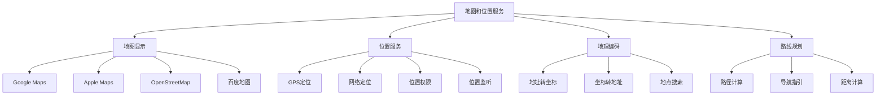

# 地图和位置服务组件

> 掌握 Flutter 中地图显示、位置获取、地理编码等位置服务的集成和使用。

## 地图组件概览



## Google Maps 集成

### 基础配置

#### 1. 依赖配置

```yaml
# pubspec.yaml
dependencies:
  google_maps_flutter: ^2.5.0
  location: ^5.0.3
  geocoding: ^2.1.1
  geolocator: ^10.1.0
```

#### 2. Android 配置

```xml
<!-- android/app/src/main/AndroidManifest.xml -->
<manifest xmlns:android="http://schemas.android.com/apk/res/android">
    <!-- 位置权限 -->
    <uses-permission android:name="android.permission.ACCESS_FINE_LOCATION" />
    <uses-permission android:name="android.permission.ACCESS_COARSE_LOCATION" />
    <uses-permission android:name="android.permission.INTERNET" />
    
    <application>
        <!-- Google Maps API Key -->
        <meta-data
            android:name="com.google.android.geo.API_KEY"
            android:value="YOUR_API_KEY_HERE" />
    </application>
</manifest>
```

#### 3. iOS 配置

```xml
<!-- ios/Runner/Info.plist -->
<dict>
    <!-- 位置权限描述 -->
    <key>NSLocationWhenInUseUsageDescription</key>
    <string>This app needs location access to show your position on the map.</string>
    <key>NSLocationAlwaysAndWhenInUseUsageDescription</key>
    <string>This app needs location access to show your position on the map.</string>
    
    <!-- Google Maps API Key -->
    <key>GoogleMapsAPIKey</key>
    <string>YOUR_API_KEY_HERE</string>
</dict>
```

### 基础地图显示

```dart
import 'package:flutter/material.dart';
import 'package:google_maps_flutter/google_maps_flutter.dart';
import 'package:location/location.dart';

class BasicMapWidget extends StatefulWidget {
  const BasicMapWidget({Key? key}) : super(key: key);

  @override
  State<BasicMapWidget> createState() => _BasicMapWidgetState();
}

class _BasicMapWidgetState extends State<BasicMapWidget> {
  GoogleMapController? _mapController;
  Location _location = Location();
  LatLng _currentPosition = const LatLng(39.9042, 116.4074); // 北京
  Set<Marker> _markers = {};
  
  @override
  void initState() {
    super.initState();
    _getCurrentLocation();
  }
  
  Future<void> _getCurrentLocation() async {
    try {
      // 检查位置服务是否启用
      bool serviceEnabled = await _location.serviceEnabled();
      if (!serviceEnabled) {
        serviceEnabled = await _location.requestService();
        if (!serviceEnabled) return;
      }
      
      // 检查位置权限
      PermissionStatus permissionGranted = await _location.hasPermission();
      if (permissionGranted == PermissionStatus.denied) {
        permissionGranted = await _location.requestPermission();
        if (permissionGranted != PermissionStatus.granted) return;
      }
      
      // 获取当前位置
      LocationData locationData = await _location.getLocation();
      
      setState(() {
        _currentPosition = LatLng(
          locationData.latitude!,
          locationData.longitude!,
        );
        
        // 添加当前位置标记
        _markers.add(
          Marker(
            markerId: const MarkerId('current_location'),
            position: _currentPosition,
            infoWindow: const InfoWindow(
              title: '我的位置',
              snippet: '当前所在位置',
            ),
            icon: BitmapDescriptor.defaultMarkerWithHue(
              BitmapDescriptor.hueBlue,
            ),
          ),
        );
      });
      
      // 移动地图到当前位置
      _mapController?.animateCamera(
        CameraUpdate.newLatLngZoom(_currentPosition, 15.0),
      );
    } catch (e) {
      debugPrint('获取位置失败: $e');
    }
  }
  
  void _onMapCreated(GoogleMapController controller) {
    _mapController = controller;
  }
  
  void _onMapTapped(LatLng position) {
    setState(() {
      _markers.add(
        Marker(
          markerId: MarkerId('marker_${_markers.length}'),
          position: position,
          infoWindow: InfoWindow(
            title: '标记点 ${_markers.length + 1}',
            snippet: '纬度: ${position.latitude.toStringAsFixed(6)}\n经度: ${position.longitude.toStringAsFixed(6)}',
          ),
        ),
      );
    });
  }
  
  @override
  Widget build(BuildContext context) {
    return Scaffold(
      appBar: AppBar(
        title: const Text('Google Maps'),
        actions: [
          IconButton(
            icon: const Icon(Icons.my_location),
            onPressed: _getCurrentLocation,
          ),
          IconButton(
            icon: const Icon(Icons.clear),
            onPressed: () {
              setState(() {
                _markers.clear();
              });
            },
          ),
        ],
      ),
      body: GoogleMap(
        onMapCreated: _onMapCreated,
        onTap: _onMapTapped,
        initialCameraPosition: CameraPosition(
          target: _currentPosition,
          zoom: 10.0,
        ),
        markers: _markers,
        myLocationEnabled: true,
        myLocationButtonEnabled: false,
        mapType: MapType.normal,
        zoomControlsEnabled: false,
      ),
      floatingActionButton: Column(
        mainAxisAlignment: MainAxisAlignment.end,
        children: [
          FloatingActionButton(
            heroTag: 'zoom_in',
            mini: true,
            onPressed: () {
              _mapController?.animateCamera(CameraUpdate.zoomIn());
            },
            child: const Icon(Icons.zoom_in),
          ),
          const SizedBox(height: 8),
          FloatingActionButton(
            heroTag: 'zoom_out',
            mini: true,
            onPressed: () {
              _mapController?.animateCamera(CameraUpdate.zoomOut());
            },
            child: const Icon(Icons.zoom_out),
          ),
        ],
      ),
    );
  }
}
```

### 高级地图功能

```dart
class AdvancedMapWidget extends StatefulWidget {
  const AdvancedMapWidget({Key? key}) : super(key: key);

  @override
  State<AdvancedMapWidget> createState() => _AdvancedMapWidgetState();
}

class _AdvancedMapWidgetState extends State<AdvancedMapWidget> {
  GoogleMapController? _mapController;
  Set<Marker> _markers = {};
  Set<Polyline> _polylines = {};
  Set<Polygon> _polygons = {};
  Set<Circle> _circles = {};
  MapType _currentMapType = MapType.normal;
  
  @override
  Widget build(BuildContext context) {
    return Scaffold(
      appBar: AppBar(
        title: const Text('高级地图功能'),
        actions: [
          PopupMenuButton<MapType>(
            onSelected: (MapType type) {
              setState(() {
                _currentMapType = type;
              });
            },
            itemBuilder: (context) => [
              const PopupMenuItem(
                value: MapType.normal,
                child: Text('普通地图'),
              ),
              const PopupMenuItem(
                value: MapType.satellite,
                child: Text('卫星地图'),
              ),
              const PopupMenuItem(
                value: MapType.hybrid,
                child: Text('混合地图'),
              ),
              const PopupMenuItem(
                value: MapType.terrain,
                child: Text('地形地图'),
              ),
            ],
          ),
        ],
      ),
      body: GoogleMap(
        onMapCreated: (GoogleMapController controller) {
          _mapController = controller;
          _addSampleData();
        },
        initialCameraPosition: const CameraPosition(
          target: LatLng(39.9042, 116.4074),
          zoom: 12.0,
        ),
        mapType: _currentMapType,
        markers: _markers,
        polylines: _polylines,
        polygons: _polygons,
        circles: _circles,
        onTap: _addMarker,
      ),
      bottomNavigationBar: BottomNavigationBar(
        type: BottomNavigationBarType.fixed,
        items: const [
          BottomNavigationBarItem(
            icon: Icon(Icons.place),
            label: '标记',
          ),
          BottomNavigationBarItem(
            icon: Icon(Icons.timeline),
            label: '路线',
          ),
          BottomNavigationBarItem(
            icon: Icon(Icons.crop_free),
            label: '区域',
          ),
          BottomNavigationBarItem(
            icon: Icon(Icons.radio_button_unchecked),
            label: '圆形',
          ),
        ],
        onTap: (index) {
          switch (index) {
            case 0:
              _showMarkerDialog();
              break;
            case 1:
              _addPolyline();
              break;
            case 2:
              _addPolygon();
              break;
            case 3:
              _addCircle();
              break;
          }
        },
      ),
    );
  }
  
  void _addSampleData() {
    // 添加示例标记
    setState(() {
      _markers.addAll([
        const Marker(
          markerId: MarkerId('tiananmen'),
          position: LatLng(39.9163, 116.3972),
          infoWindow: InfoWindow(
            title: '天安门',
            snippet: '北京市中心',
          ),
        ),
        const Marker(
          markerId: MarkerId('forbidden_city'),
          position: LatLng(39.9163, 116.4074),
          infoWindow: InfoWindow(
            title: '故宫',
            snippet: '明清皇宫',
          ),
        ),
      ]);
      
      // 添加路线
      _polylines.add(
        const Polyline(
          polylineId: PolylineId('route1'),
          points: [
            LatLng(39.9163, 116.3972),
            LatLng(39.9163, 116.4074),
            LatLng(39.9042, 116.4074),
          ],
          color: Colors.blue,
          width: 5,
          patterns: [PatternItem.dash(20), PatternItem.gap(10)],
        ),
      );
      
      // 添加区域
      _polygons.add(
        Polygon(
          polygonId: const PolygonId('area1'),
          points: const [
            LatLng(39.920, 116.390),
            LatLng(39.920, 116.420),
            LatLng(39.900, 116.420),
            LatLng(39.900, 116.390),
          ],
          fillColor: Colors.red.withOpacity(0.3),
          strokeColor: Colors.red,
          strokeWidth: 2,
        ),
      );
      
      // 添加圆形
      _circles.add(
        Circle(
          circleId: const CircleId('circle1'),
          center: const LatLng(39.9042, 116.4074),
          radius: 1000, // 半径（米）
          fillColor: Colors.green.withOpacity(0.3),
          strokeColor: Colors.green,
          strokeWidth: 2,
        ),
      );
    });
  }
  
  void _addMarker(LatLng position) {
    setState(() {
      _markers.add(
        Marker(
          markerId: MarkerId('marker_${DateTime.now().millisecondsSinceEpoch}'),
          position: position,
          infoWindow: InfoWindow(
            title: '新标记',
            snippet: '${position.latitude.toStringAsFixed(6)}, ${position.longitude.toStringAsFixed(6)}',
          ),
          draggable: true,
        ),
      );
    });
  }
  
  void _showMarkerDialog() {
    showDialog(
      context: context,
      builder: (context) => AlertDialog(
        title: const Text('标记操作'),
        content: const Text('点击地图添加标记，长按标记可拖拽'),
        actions: [
          TextButton(
            onPressed: () {
              setState(() {
                _markers.clear();
              });
              Navigator.pop(context);
            },
            child: const Text('清除所有标记'),
          ),
          TextButton(
            onPressed: () => Navigator.pop(context),
            child: const Text('确定'),
          ),
        ],
      ),
    );
  }
  
  void _addPolyline() {
    if (_markers.length >= 2) {
      final points = _markers.map((marker) => marker.position).toList();
      setState(() {
        _polylines.add(
          Polyline(
            polylineId: PolylineId('polyline_${DateTime.now().millisecondsSinceEpoch}'),
            points: points,
            color: Colors.blue,
            width: 3,
          ),
        );
      });
    } else {
      ScaffoldMessenger.of(context).showSnackBar(
        const SnackBar(content: Text('至少需要2个标记点才能绘制路线')),
      );
    }
  }
  
  void _addPolygon() {
    if (_markers.length >= 3) {
      final points = _markers.map((marker) => marker.position).toList();
      setState(() {
        _polygons.add(
          Polygon(
            polygonId: PolygonId('polygon_${DateTime.now().millisecondsSinceEpoch}'),
            points: points,
            fillColor: Colors.orange.withOpacity(0.3),
            strokeColor: Colors.orange,
            strokeWidth: 2,
          ),
        );
      });
    } else {
      ScaffoldMessenger.of(context).showSnackBar(
        const SnackBar(content: Text('至少需要3个标记点才能绘制区域')),
      );
    }
  }
  
  void _addCircle() {
    if (_markers.isNotEmpty) {
      final center = _markers.first.position;
      setState(() {
        _circles.add(
          Circle(
            circleId: CircleId('circle_${DateTime.now().millisecondsSinceEpoch}'),
            center: center,
            radius: 500,
            fillColor: Colors.purple.withOpacity(0.3),
            strokeColor: Colors.purple,
            strokeWidth: 2,
          ),
        );
      });
    } else {
      ScaffoldMessenger.of(context).showSnackBar(
        const SnackBar(content: Text('请先添加一个标记点作为圆心')),
      );
    }
  }
}
```

## 位置服务

### 位置获取和监听

```dart
import 'package:geolocator/geolocator.dart';

class LocationService {
  static Future<Position?> getCurrentPosition() async {
    try {
      // 检查位置服务是否启用
      bool serviceEnabled = await Geolocator.isLocationServiceEnabled();
      if (!serviceEnabled) {
        throw Exception('位置服务未启用');
      }
      
      // 检查位置权限
      LocationPermission permission = await Geolocator.checkPermission();
      if (permission == LocationPermission.denied) {
        permission = await Geolocator.requestPermission();
        if (permission == LocationPermission.denied) {
          throw Exception('位置权限被拒绝');
        }
      }
      
      if (permission == LocationPermission.deniedForever) {
        throw Exception('位置权限被永久拒绝');
      }
      
      // 获取当前位置
      Position position = await Geolocator.getCurrentPosition(
        desiredAccuracy: LocationAccuracy.high,
        timeLimit: const Duration(seconds: 10),
      );
      
      return position;
    } catch (e) {
      debugPrint('获取位置失败: $e');
      return null;
    }
  }
  
  static Stream<Position> getPositionStream() {
    const LocationSettings locationSettings = LocationSettings(
      accuracy: LocationAccuracy.high,
      distanceFilter: 10, // 最小距离变化（米）
    );
    
    return Geolocator.getPositionStream(
      locationSettings: locationSettings,
    );
  }
  
  static double calculateDistance(
    double startLatitude,
    double startLongitude,
    double endLatitude,
    double endLongitude,
  ) {
    return Geolocator.distanceBetween(
      startLatitude,
      startLongitude,
      endLatitude,
      endLongitude,
    );
  }
  
  static double calculateBearing(
    double startLatitude,
    double startLongitude,
    double endLatitude,
    double endLongitude,
  ) {
    return Geolocator.bearingBetween(
      startLatitude,
      startLongitude,
      endLatitude,
      endLongitude,
    );
  }
}

class LocationTrackingWidget extends StatefulWidget {
  const LocationTrackingWidget({Key? key}) : super(key: key);

  @override
  State<LocationTrackingWidget> createState() => _LocationTrackingWidgetState();
}

class _LocationTrackingWidgetState extends State<LocationTrackingWidget> {
  Position? _currentPosition;
  StreamSubscription<Position>? _positionStreamSubscription;
  List<Position> _locationHistory = [];
  bool _isTracking = false;
  
  @override
  void dispose() {
    _positionStreamSubscription?.cancel();
    super.dispose();
  }
  
  void _getCurrentLocation() async {
    final position = await LocationService.getCurrentPosition();
    if (position != null) {
      setState(() {
        _currentPosition = position;
      });
    }
  }
  
  void _startTracking() {
    setState(() {
      _isTracking = true;
      _locationHistory.clear();
    });
    
    _positionStreamSubscription = LocationService.getPositionStream().listen(
      (Position position) {
        setState(() {
          _currentPosition = position;
          _locationHistory.add(position);
        });
      },
      onError: (error) {
        debugPrint('位置监听错误: $error');
        _stopTracking();
      },
    );
  }
  
  void _stopTracking() {
    setState(() {
      _isTracking = false;
    });
    _positionStreamSubscription?.cancel();
  }
  
  String _formatPosition(Position position) {
    return '纬度: ${position.latitude.toStringAsFixed(6)}\n'
           '经度: ${position.longitude.toStringAsFixed(6)}\n'
           '精度: ${position.accuracy.toStringAsFixed(1)}m\n'
           '海拔: ${position.altitude.toStringAsFixed(1)}m\n'
           '速度: ${(position.speed * 3.6).toStringAsFixed(1)}km/h';
  }
  
  double _calculateTotalDistance() {
    if (_locationHistory.length < 2) return 0.0;
    
    double totalDistance = 0.0;
    for (int i = 1; i < _locationHistory.length; i++) {
      totalDistance += LocationService.calculateDistance(
        _locationHistory[i - 1].latitude,
        _locationHistory[i - 1].longitude,
        _locationHistory[i].latitude,
        _locationHistory[i].longitude,
      );
    }
    return totalDistance;
  }
  
  @override
  Widget build(BuildContext context) {
    return Scaffold(
      appBar: AppBar(
        title: const Text('位置追踪'),
        actions: [
          IconButton(
            icon: Icon(_isTracking ? Icons.stop : Icons.play_arrow),
            onPressed: _isTracking ? _stopTracking : _startTracking,
          ),
        ],
      ),
      body: Padding(
        padding: const EdgeInsets.all(16.0),
        child: Column(
          crossAxisAlignment: CrossAxisAlignment.start,
          children: [
            Card(
              child: Padding(
                padding: const EdgeInsets.all(16.0),
                child: Column(
                  crossAxisAlignment: CrossAxisAlignment.start,
                  children: [
                    Text(
                      '当前位置',
                      style: Theme.of(context).textTheme.titleLarge,
                    ),
                    const SizedBox(height: 8),
                    Text(
                      _currentPosition != null
                          ? _formatPosition(_currentPosition!)
                          : '未获取位置信息',
                      style: Theme.of(context).textTheme.bodyMedium,
                    ),
                    const SizedBox(height: 16),
                    Row(
                      children: [
                        ElevatedButton(
                          onPressed: _getCurrentLocation,
                          child: const Text('获取当前位置'),
                        ),
                        const SizedBox(width: 16),
                        ElevatedButton(
                          onPressed: _isTracking ? _stopTracking : _startTracking,
                          child: Text(_isTracking ? '停止追踪' : '开始追踪'),
                        ),
                      ],
                    ),
                  ],
                ),
              ),
            ),
            const SizedBox(height: 16),
            if (_isTracking || _locationHistory.isNotEmpty)
              Card(
                child: Padding(
                  padding: const EdgeInsets.all(16.0),
                  child: Column(
                    crossAxisAlignment: CrossAxisAlignment.start,
                    children: [
                      Text(
                        '追踪统计',
                        style: Theme.of(context).textTheme.titleLarge,
                      ),
                      const SizedBox(height: 8),
                      Text('追踪点数: ${_locationHistory.length}'),
                      Text('总距离: ${(_calculateTotalDistance() / 1000).toStringAsFixed(2)} km'),
                      Text('状态: ${_isTracking ? "追踪中" : "已停止"}'),
                    ],
                  ),
                ),
              ),
            const SizedBox(height: 16),
            if (_locationHistory.isNotEmpty)
              Expanded(
                child: Card(
                  child: Column(
                    children: [
                      Padding(
                        padding: const EdgeInsets.all(16.0),
                        child: Text(
                          '位置历史',
                          style: Theme.of(context).textTheme.titleLarge,
                        ),
                      ),
                      Expanded(
                        child: ListView.builder(
                          itemCount: _locationHistory.length,
                          itemBuilder: (context, index) {
                            final position = _locationHistory[index];
                            return ListTile(
                              leading: CircleAvatar(
                                child: Text('${index + 1}'),
                              ),
                              title: Text(
                                '${position.latitude.toStringAsFixed(6)}, ${position.longitude.toStringAsFixed(6)}',
                              ),
                              subtitle: Text(
                                '精度: ${position.accuracy.toStringAsFixed(1)}m | '
                                '时间: ${DateTime.fromMillisecondsSinceEpoch(position.timestamp.millisecondsSinceEpoch).toString().substring(11, 19)}',
                              ),
                            );
                          },
                        ),
                      ),
                    ],
                  ),
                ),
              ),
          ],
        ),
      ),
    );
  }
}
```

## 地理编码服务

### 地址和坐标转换

```dart
import 'package:geocoding/geocoding.dart';

class GeocodingService {
  // 地址转坐标
  static Future<List<Location>> getLocationFromAddress(String address) async {
    try {
      List<Location> locations = await locationFromAddress(address);
      return locations;
    } catch (e) {
      debugPrint('地址转坐标失败: $e');
      return [];
    }
  }
  
  // 坐标转地址
  static Future<List<Placemark>> getAddressFromLocation(
    double latitude,
    double longitude,
  ) async {
    try {
      List<Placemark> placemarks = await placemarkFromCoordinates(
        latitude,
        longitude,
      );
      return placemarks;
    } catch (e) {
      debugPrint('坐标转地址失败: $e');
      return [];
    }
  }
  
  // 格式化地址
  static String formatAddress(Placemark placemark) {
    List<String> addressParts = [];
    
    if (placemark.street?.isNotEmpty == true) {
      addressParts.add(placemark.street!);
    }
    if (placemark.subLocality?.isNotEmpty == true) {
      addressParts.add(placemark.subLocality!);
    }
    if (placemark.locality?.isNotEmpty == true) {
      addressParts.add(placemark.locality!);
    }
    if (placemark.administrativeArea?.isNotEmpty == true) {
      addressParts.add(placemark.administrativeArea!);
    }
    if (placemark.country?.isNotEmpty == true) {
      addressParts.add(placemark.country!);
    }
    
    return addressParts.join(', ');
  }
}

class GeocodingWidget extends StatefulWidget {
  const GeocodingWidget({Key? key}) : super(key: key);

  @override
  State<GeocodingWidget> createState() => _GeocodingWidgetState();
}

class _GeocodingWidgetState extends State<GeocodingWidget> {
  final TextEditingController _addressController = TextEditingController();
  final TextEditingController _latController = TextEditingController();
  final TextEditingController _lngController = TextEditingController();
  
  List<Location> _locations = [];
  List<Placemark> _placemarks = [];
  bool _isLoading = false;
  
  @override
  void dispose() {
    _addressController.dispose();
    _latController.dispose();
    _lngController.dispose();
    super.dispose();
  }
  
  void _searchByAddress() async {
    if (_addressController.text.trim().isEmpty) return;
    
    setState(() {
      _isLoading = true;
      _locations.clear();
    });
    
    final locations = await GeocodingService.getLocationFromAddress(
      _addressController.text.trim(),
    );
    
    setState(() {
      _locations = locations;
      _isLoading = false;
    });
  }
  
  void _searchByCoordinates() async {
    final lat = double.tryParse(_latController.text);
    final lng = double.tryParse(_lngController.text);
    
    if (lat == null || lng == null) {
      ScaffoldMessenger.of(context).showSnackBar(
        const SnackBar(content: Text('请输入有效的经纬度')),
      );
      return;
    }
    
    setState(() {
      _isLoading = true;
      _placemarks.clear();
    });
    
    final placemarks = await GeocodingService.getAddressFromLocation(lat, lng);
    
    setState(() {
      _placemarks = placemarks;
      _isLoading = false;
    });
  }
  
  @override
  Widget build(BuildContext context) {
    return Scaffold(
      appBar: AppBar(
        title: const Text('地理编码'),
      ),
      body: Padding(
        padding: const EdgeInsets.all(16.0),
        child: Column(
          children: [
            // 地址转坐标
            Card(
              child: Padding(
                padding: const EdgeInsets.all(16.0),
                child: Column(
                  crossAxisAlignment: CrossAxisAlignment.start,
                  children: [
                    Text(
                      '地址转坐标',
                      style: Theme.of(context).textTheme.titleLarge,
                    ),
                    const SizedBox(height: 16),
                    TextField(
                      controller: _addressController,
                      decoration: const InputDecoration(
                        labelText: '输入地址',
                        hintText: '例如：北京市天安门广场',
                        border: OutlineInputBorder(),
                      ),
                    ),
                    const SizedBox(height: 16),
                    ElevatedButton(
                      onPressed: _isLoading ? null : _searchByAddress,
                      child: _isLoading
                          ? const SizedBox(
                              width: 20,
                              height: 20,
                              child: CircularProgressIndicator(strokeWidth: 2),
                            )
                          : const Text('搜索坐标'),
                    ),
                    if (_locations.isNotEmpty) ..[
                      const SizedBox(height: 16),
                      const Text('搜索结果:'),
                      ...(_locations.map((location) => ListTile(
                            leading: const Icon(Icons.location_on),
                            title: Text(
                              '${location.latitude.toStringAsFixed(6)}, ${location.longitude.toStringAsFixed(6)}',
                            ),
                            subtitle: Text('时间戳: ${location.timestamp}'),
                            onTap: () {
                              _latController.text = location.latitude.toString();
                              _lngController.text = location.longitude.toString();
                            },
                          ))),
                    ],
                  ],
                ),
              ),
            ),
            const SizedBox(height: 16),
            // 坐标转地址
            Card(
              child: Padding(
                padding: const EdgeInsets.all(16.0),
                child: Column(
                  crossAxisAlignment: CrossAxisAlignment.start,
                  children: [
                    Text(
                      '坐标转地址',
                      style: Theme.of(context).textTheme.titleLarge,
                    ),
                    const SizedBox(height: 16),
                    Row(
                      children: [
                        Expanded(
                          child: TextField(
                            controller: _latController,
                            decoration: const InputDecoration(
                              labelText: '纬度',
                              border: OutlineInputBorder(),
                            ),
                            keyboardType: TextInputType.number,
                          ),
                        ),
                        const SizedBox(width: 16),
                        Expanded(
                          child: TextField(
                            controller: _lngController,
                            decoration: const InputDecoration(
                              labelText: '经度',
                              border: OutlineInputBorder(),
                            ),
                            keyboardType: TextInputType.number,
                          ),
                        ),
                      ],
                    ),
                    const SizedBox(height: 16),
                    ElevatedButton(
                      onPressed: _isLoading ? null : _searchByCoordinates,
                      child: _isLoading
                          ? const SizedBox(
                              width: 20,
                              height: 20,
                              child: CircularProgressIndicator(strokeWidth: 2),
                            )
                          : const Text('搜索地址'),
                    ),
                    if (_placemarks.isNotEmpty) ..[
                      const SizedBox(height: 16),
                      const Text('搜索结果:'),
                      ...(_placemarks.map((placemark) => ListTile(
                            leading: const Icon(Icons.place),
                            title: Text(GeocodingService.formatAddress(placemark)),
                            subtitle: Text(
                              '国家: ${placemark.country ?? "未知"}\n'
                              '省/州: ${placemark.administrativeArea ?? "未知"}\n'
                              '城市: ${placemark.locality ?? "未知"}',
                            ),
                            isThreeLine: true,
                          ))),
                    ],
                  ],
                ),
              ),
            ),
          ],
        ),
      ),
    );
  }
}
```

## 地图组件最佳实践

### 性能优化

```dart
class OptimizedMapWidget extends StatefulWidget {
  const OptimizedMapWidget({Key? key}) : super(key: key);

  @override
  State<OptimizedMapWidget> createState() => _OptimizedMapWidgetState();
}

class _OptimizedMapWidgetState extends State<OptimizedMapWidget> {
  GoogleMapController? _mapController;
  Set<Marker> _markers = {};
  Timer? _debounceTimer;
  
  // 标记聚合
  void _clusterMarkers(Set<Marker> markers, double zoomLevel) {
    // 根据缩放级别决定是否聚合标记
    if (zoomLevel < 10 && markers.length > 100) {
      // 实现标记聚合逻辑
      _performMarkerClustering(markers);
    }
  }
  
  void _performMarkerClustering(Set<Marker> markers) {
    // 标记聚合实现
    // 可以使用第三方库如 google_maps_cluster_manager
  }
  
  // 防抖处理地图移动
  void _onCameraMove(CameraPosition position) {
    _debounceTimer?.cancel();
    _debounceTimer = Timer(const Duration(milliseconds: 300), () {
      _clusterMarkers(_markers, position.zoom);
    });
  }
  
  // 延迟加载标记
  void _loadMarkersInBounds(LatLngBounds bounds) async {
    // 只加载可视区域内的标记
    final visibleMarkers = await _fetchMarkersInBounds(bounds);
    setState(() {
      _markers = visibleMarkers;
    });
  }
  
  Future<Set<Marker>> _fetchMarkersInBounds(LatLngBounds bounds) async {
    // 从服务器获取指定区域内的标记
    // 实现分页加载
    return {};
  }
  
  @override
  void dispose() {
    _debounceTimer?.cancel();
    super.dispose();
  }
  
  @override
  Widget build(BuildContext context) {
    return GoogleMap(
      onMapCreated: (controller) {
        _mapController = controller;
      },
      onCameraMove: _onCameraMove,
      onCameraIdle: () async {
        // 地图停止移动后加载数据
        final bounds = await _mapController!.getVisibleRegion();
        _loadMarkersInBounds(bounds);
      },
      initialCameraPosition: const CameraPosition(
        target: LatLng(39.9042, 116.4074),
        zoom: 10.0,
      ),
      markers: _markers,
      // 性能优化设置
      liteModeEnabled: false, // 禁用精简模式以获得更好的交互
      mapToolbarEnabled: false, // 禁用地图工具栏
      zoomControlsEnabled: false, // 禁用缩放控件
      myLocationButtonEnabled: false, // 禁用定位按钮
      compassEnabled: false, // 禁用指南针
      tiltGesturesEnabled: false, // 禁用倾斜手势
      rotateGesturesEnabled: false, // 禁用旋转手势
    );
  }
}
```

### 错误处理

```dart
class RobustMapWidget extends StatefulWidget {
  const RobustMapWidget({Key? key}) : super(key: key);

  @override
  State<RobustMapWidget> createState() => _RobustMapWidgetState();
}

class _RobustMapWidgetState extends State<RobustMapWidget> {
  GoogleMapController? _mapController;
  String? _errorMessage;
  bool _isLoading = true;
  
  @override
  void initState() {
    super.initState();
    _initializeMap();
  }
  
  Future<void> _initializeMap() async {
    try {
      // 检查网络连接
      final connectivityResult = await Connectivity().checkConnectivity();
      if (connectivityResult == ConnectivityResult.none) {
        throw Exception('无网络连接');
      }
      
      // 检查位置权限
      final permission = await Geolocator.checkPermission();
      if (permission == LocationPermission.denied) {
        await Geolocator.requestPermission();
      }
      
      setState(() {
        _isLoading = false;
        _errorMessage = null;
      });
    } catch (e) {
      setState(() {
        _isLoading = false;
        _errorMessage = e.toString();
      });
    }
  }
  
  void _onMapCreated(GoogleMapController controller) {
    _mapController = controller;
    
    // 设置地图样式（可选）
    _setMapStyle();
  }
  
  Future<void> _setMapStyle() async {
    try {
      final String style = await rootBundle.loadString('assets/map_style.json');
      await _mapController?.setMapStyle(style);
    } catch (e) {
      debugPrint('设置地图样式失败: $e');
    }
  }
  
  void _retry() {
    setState(() {
      _isLoading = true;
      _errorMessage = null;
    });
    _initializeMap();
  }
  
  @override
  Widget build(BuildContext context) {
    if (_isLoading) {
      return const Scaffold(
        body: Center(
          child: CircularProgressIndicator(),
        ),
      );
    }
    
    if (_errorMessage != null) {
      return Scaffold(
        body: Center(
          child: Column(
            mainAxisAlignment: MainAxisAlignment.center,
            children: [
              Icon(
                Icons.error_outline,
                size: 64,
                color: Colors.red.shade300,
              ),
              const SizedBox(height: 16),
              Text(
                '地图加载失败',
                style: Theme.of(context).textTheme.headlineSmall,
              ),
              const SizedBox(height: 8),
              Text(
                _errorMessage!,
                textAlign: TextAlign.center,
                style: Theme.of(context).textTheme.bodyMedium,
              ),
              const SizedBox(height: 24),
              ElevatedButton(
                onPressed: _retry,
                child: const Text('重试'),
              ),
            ],
          ),
        ),
      );
    }
    
    return Scaffold(
      body: GoogleMap(
        onMapCreated: _onMapCreated,
        initialCameraPosition: const CameraPosition(
          target: LatLng(39.9042, 116.4074),
          zoom: 10.0,
        ),
        // 错误处理
        onTap: (position) {
          // 处理地图点击
        },
      ),
    );
  }
}
```

## 总结

地图和位置服务是移动应用的重要功能，本文档涵盖了：

### 核心功能
- **地图显示**：Google Maps 集成和基础功能
- **位置服务**：GPS 定位、位置监听、距离计算
- **地理编码**：地址和坐标的相互转换
- **高级功能**：标记、路线、区域、圆形等地图元素

### 最佳实践
- **性能优化**：标记聚合、延迟加载、防抖处理
- **错误处理**：网络检查、权限验证、异常捕获
- **用户体验**：加载状态、错误提示、重试机制

### 推荐组件库
- **google_maps_flutter**：Google Maps 官方插件
- **geolocator**：位置服务和计算
- **geocoding**：地理编码服务
- **location**：位置获取和监听

## 相关资源

- [Google Maps Flutter 官方文档](https://pub.dev/packages/google_maps_flutter)
- [Geolocator 插件文档](https://pub.dev/packages/geolocator)
- [Geocoding 插件文档](https://pub.dev/packages/geocoding)
- [Google Maps API 文档](https://developers.google.com/maps/documentation)
- [位置服务最佳实践](https://developer.android.com/guide/topics/location)