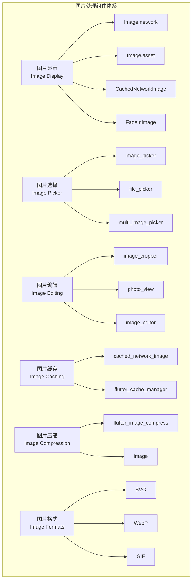

# 媒体组件集成

本文档详细介绍 Flutter 中各种媒体组件的使用，包括图片处理、视频播放、音频处理、相机功能等。

## 1. 图片处理组件



### 1.1 图片显示和缓存

```yaml
# pubspec.yaml
dependencies:
  cached_network_image: ^3.3.0
  flutter_svg: ^2.0.9
  photo_view: ^0.14.0
```

```dart
// 图片显示组件
import 'package:cached_network_image/cached_network_image.dart';
import 'package:flutter_svg/flutter_svg.dart';
import 'package:photo_view/photo_view.dart';
import 'package:photo_view/photo_view_gallery.dart';

class ImageDisplayComponents extends StatelessWidget {
  final List<String> imageUrls = [
    'https://picsum.photos/800/600?random=1',
    'https://picsum.photos/800/600?random=2',
    'https://picsum.photos/800/600?random=3',
  ];
  
  @override
  Widget build(BuildContext context) {
    return Scaffold(
      appBar: AppBar(
        title: const Text('图片显示组件'),
      ),
      body: ListView(
        padding: const EdgeInsets.all(16),
        children: [
          // 基础图片显示
          _buildSection(
            '基础图片显示',
            Column(
              children: [
                // 网络图片
                Container(
                  height: 200,
                  width: double.infinity,
                  decoration: BoxDecoration(
                    borderRadius: BorderRadius.circular(12),
                    boxShadow: [
                      BoxShadow(
                        color: Colors.black.withOpacity(0.1),
                        blurRadius: 8,
                        offset: const Offset(0, 4),
                      ),
                    ],
                  ),
                  child: ClipRRect(
                    borderRadius: BorderRadius.circular(12),
                    child: Image.network(
                      imageUrls[0],
                      fit: BoxFit.cover,
                      loadingBuilder: (context, child, loadingProgress) {
                        if (loadingProgress == null) return child;
                        return Center(
                          child: CircularProgressIndicator(
                            value: loadingProgress.expectedTotalBytes != null
                                ? loadingProgress.cumulativeBytesLoaded /
                                    loadingProgress.expectedTotalBytes!
                                : null,
                          ),
                        );
                      },
                      errorBuilder: (context, error, stackTrace) {
                        return Container(
                          color: Colors.grey[300],
                          child: const Center(
                            child: Icon(
                              Icons.error,
                              color: Colors.red,
                              size: 50,
                            ),
                          ),
                        );
                      },
                    ),
                  ),
                ),
                
                const SizedBox(height: 16),
                
                // 本地资源图片
                Container(
                  height: 150,
                  width: double.infinity,
                  decoration: BoxDecoration(
                    borderRadius: BorderRadius.circular(12),
                    border: Border.all(color: Colors.grey[300]!),
                  ),
                  child: ClipRRect(
                    borderRadius: BorderRadius.circular(12),
                    child: Image.asset(
                      'assets/images/placeholder.png',
                      fit: BoxFit.cover,
                      errorBuilder: (context, error, stackTrace) {
                        return Container(
                          color: Colors.grey[200],
                          child: const Center(
                            child: Text(
                              '本地图片\n(assets/images/placeholder.png)',
                              textAlign: TextAlign.center,
                              style: TextStyle(color: Colors.grey),
                            ),
                          ),
                        );
                      },
                    ),
                  ),
                ),
              ],
            ),
          ),
          
          // 缓存网络图片
          _buildSection(
            '缓存网络图片',
            Column(
              children: [
                Container(
                  height: 200,
                  width: double.infinity,
                  decoration: BoxDecoration(
                    borderRadius: BorderRadius.circular(12),
                    boxShadow: [
                      BoxShadow(
                        color: Colors.black.withOpacity(0.1),
                        blurRadius: 8,
                        offset: const Offset(0, 4),
                      ),
                    ],
                  ),
                  child: ClipRRect(
                    borderRadius: BorderRadius.circular(12),
                    child: CachedNetworkImage(
                      imageUrl: imageUrls[1],
                      fit: BoxFit.cover,
                      placeholder: (context, url) => Container(
                        color: Colors.grey[200],
                        child: const Center(
                          child: CircularProgressIndicator(),
                        ),
                      ),
                      errorWidget: (context, url, error) => Container(
                        color: Colors.grey[300],
                        child: const Center(
                          child: Icon(
                            Icons.error,
                            color: Colors.red,
                            size: 50,
                          ),
                        ),
                      ),
                      fadeInDuration: const Duration(milliseconds: 500),
                      fadeOutDuration: const Duration(milliseconds: 300),
                    ),
                  ),
                ),
                
                const SizedBox(height: 16),
                
                // 渐变加载图片
                Container(
                  height: 150,
                  width: double.infinity,
                  decoration: BoxDecoration(
                    borderRadius: BorderRadius.circular(12),
                  ),
                  child: ClipRRect(
                    borderRadius: BorderRadius.circular(12),
                    child: FadeInImage.assetNetwork(
                      placeholder: 'assets/images/loading.gif',
                      image: imageUrls[2],
                      fit: BoxFit.cover,
                      fadeInDuration: const Duration(milliseconds: 500),
                      imageErrorBuilder: (context, error, stackTrace) {
                        return Container(
                          color: Colors.grey[300],
                          child: const Center(
                            child: Icon(
                              Icons.broken_image,
                              color: Colors.grey,
                              size: 50,
                            ),
                          ),
                        );
                      },
                    ),
                  ),
                ),
              ],
            ),
          ),
          
          // SVG 图片
          _buildSection(
            'SVG 图片',
            Container(
              height: 120,
              width: double.infinity,
              decoration: BoxDecoration(
                borderRadius: BorderRadius.circular(12),
                color: Colors.blue[50],
                border: Border.all(color: Colors.blue[200]!),
              ),
              child: Center(
                child: SvgPicture.network(
                  'https://www.svgrepo.com/show/303229/microsoft-sql-server-logo.svg',
                  height: 80,
                  placeholderBuilder: (context) => const CircularProgressIndicator(),
                ),
              ),
            ),
          ),
          
          // 图片查看器
          _buildSection(
            '图片查看器',
            Column(
              children: [
                ElevatedButton(
                  onPressed: () {
                    Navigator.push(
                      context,
                      MaterialPageRoute(
                        builder: (context) => ImageViewerPage(
                          imageUrls: imageUrls,
                          initialIndex: 0,
                        ),
                      ),
                    );
                  },
                  child: const Text('打开图片查看器'),
                ),
                
                const SizedBox(height: 16),
                
                // 图片网格
                GridView.builder(
                  shrinkWrap: true,
                  physics: const NeverScrollableScrollPhysics(),
                  gridDelegate: const SliverGridDelegateWithFixedCrossAxisCount(
                    crossAxisCount: 3,
                    crossAxisSpacing: 8,
                    mainAxisSpacing: 8,
                  ),
                  itemCount: imageUrls.length,
                  itemBuilder: (context, index) {
                    return GestureDetector(
                      onTap: () {
                        Navigator.push(
                          context,
                          MaterialPageRoute(
                            builder: (context) => ImageViewerPage(
                              imageUrls: imageUrls,
                              initialIndex: index,
                            ),
                          ),
                        );
                      },
                      child: Container(
                        decoration: BoxDecoration(
                          borderRadius: BorderRadius.circular(8),
                          boxShadow: [
                            BoxShadow(
                              color: Colors.black.withOpacity(0.1),
                              blurRadius: 4,
                              offset: const Offset(0, 2),
                            ),
                          ],
                        ),
                        child: ClipRRect(
                          borderRadius: BorderRadius.circular(8),
                          child: CachedNetworkImage(
                            imageUrl: imageUrls[index],
                            fit: BoxFit.cover,
                            placeholder: (context, url) => Container(
                              color: Colors.grey[200],
                              child: const Center(
                                child: CircularProgressIndicator(),
                              ),
                            ),
                          ),
                        ),
                      ),
                    );
                  },
                ),
              ],
            ),
          ),
        ],
      ),
    );
  }
  
  Widget _buildSection(String title, Widget child) {
    return Column(
      crossAxisAlignment: CrossAxisAlignment.start,
      children: [
        Text(
          title,
          style: const TextStyle(
            fontSize: 18,
            fontWeight: FontWeight.bold,
          ),
        ),
        const SizedBox(height: 12),
        child,
        const SizedBox(height: 24),
      ],
    );
  }
}

// 图片查看器页面
class ImageViewerPage extends StatelessWidget {
  final List<String> imageUrls;
  final int initialIndex;
  
  const ImageViewerPage({
    Key? key,
    required this.imageUrls,
    this.initialIndex = 0,
  }) : super(key: key);
  
  @override
  Widget build(BuildContext context) {
    return Scaffold(
      backgroundColor: Colors.black,
      appBar: AppBar(
        backgroundColor: Colors.black,
        foregroundColor: Colors.white,
        title: Text('${initialIndex + 1} / ${imageUrls.length}'),
        actions: [
          IconButton(
            icon: const Icon(Icons.share),
            onPressed: () {
              // 分享图片
            },
          ),
          IconButton(
            icon: const Icon(Icons.download),
            onPressed: () {
              // 下载图片
            },
          ),
        ],
      ),
      body: PhotoViewGallery.builder(
        itemCount: imageUrls.length,
        pageController: PageController(initialPage: initialIndex),
        builder: (context, index) {
          return PhotoViewGalleryPageOptions(
            imageProvider: CachedNetworkImageProvider(imageUrls[index]),
            initialScale: PhotoViewComputedScale.contained,
            minScale: PhotoViewComputedScale.contained * 0.8,
            maxScale: PhotoViewComputedScale.covered * 2.0,
            heroAttributes: PhotoViewHeroAttributes(tag: imageUrls[index]),
          );
        },
        scrollPhysics: const BouncingScrollPhysics(),
        backgroundDecoration: const BoxDecoration(
          color: Colors.black,
        ),
        loadingBuilder: (context, event) => Center(
          child: Container(
            width: 20.0,
            height: 20.0,
            child: CircularProgressIndicator(
              value: event == null
                  ? 0
                  : event.cumulativeBytesLoaded / event.expectedTotalBytes!,
              valueColor: const AlwaysStoppedAnimation<Color>(Colors.white),
            ),
          ),
        ),
      ),
    );
  }
}
```

### 1.2 图片选择和编辑

```yaml
# pubspec.yaml
dependencies:
  image_picker: ^1.0.4
  image_cropper: ^5.0.1
  flutter_image_compress: ^2.1.0
```

```dart
// 图片选择和编辑组件
import 'package:image_picker/image_picker.dart';
import 'package:image_cropper/image_cropper.dart';
import 'package:flutter_image_compress/flutter_image_compress.dart';
import 'dart:io';
import 'dart:typed_data';

class ImagePickerComponents extends StatefulWidget {
  @override
  _ImagePickerComponentsState createState() => _ImagePickerComponentsState();
}

class _ImagePickerComponentsState extends State<ImagePickerComponents> {
  final ImagePicker _picker = ImagePicker();
  List<File> _selectedImages = [];
  File? _croppedImage;
  
  @override
  Widget build(BuildContext context) {
    return Scaffold(
      appBar: AppBar(
        title: const Text('图片选择和编辑'),
      ),
      body: ListView(
        padding: const EdgeInsets.all(16),
        children: [
          // 图片选择按钮
          _buildSection(
            '图片选择',
            Column(
              children: [
                Row(
                  children: [
                    Expanded(
                      child: ElevatedButton.icon(
                        onPressed: () => _pickImage(ImageSource.camera),
                        icon: const Icon(Icons.camera_alt),
                        label: const Text('拍照'),
                      ),
                    ),
                    const SizedBox(width: 16),
                    Expanded(
                      child: ElevatedButton.icon(
                        onPressed: () => _pickImage(ImageSource.gallery),
                        icon: const Icon(Icons.photo_library),
                        label: const Text('相册'),
                      ),
                    ),
                  ],
                ),
                
                const SizedBox(height: 16),
                
                ElevatedButton.icon(
                  onPressed: _pickMultipleImages,
                  icon: const Icon(Icons.photo_library_outlined),
                  label: const Text('选择多张图片'),
                ),
              ],
            ),
          ),
          
          // 显示选中的图片
          if (_selectedImages.isNotEmpty)
            _buildSection(
              '选中的图片',
              Column(
                children: [
                  GridView.builder(
                    shrinkWrap: true,
                    physics: const NeverScrollableScrollPhysics(),
                    gridDelegate: const SliverGridDelegateWithFixedCrossAxisCount(
                      crossAxisCount: 3,
                      crossAxisSpacing: 8,
                      mainAxisSpacing: 8,
                    ),
                    itemCount: _selectedImages.length,
                    itemBuilder: (context, index) {
                      return Stack(
                        children: [
                          Container(
                            decoration: BoxDecoration(
                              borderRadius: BorderRadius.circular(8),
                              boxShadow: [
                                BoxShadow(
                                  color: Colors.black.withOpacity(0.1),
                                  blurRadius: 4,
                                  offset: const Offset(0, 2),
                                ),
                              ],
                            ),
                            child: ClipRRect(
                              borderRadius: BorderRadius.circular(8),
                              child: Image.file(
                                _selectedImages[index],
                                fit: BoxFit.cover,
                                width: double.infinity,
                                height: double.infinity,
                              ),
                            ),
                          ),
                          Positioned(
                            top: 4,
                            right: 4,
                            child: GestureDetector(
                              onTap: () => _removeImage(index),
                              child: Container(
                                padding: const EdgeInsets.all(4),
                                decoration: const BoxDecoration(
                                  color: Colors.red,
                                  shape: BoxShape.circle,
                                ),
                                child: const Icon(
                                  Icons.close,
                                  color: Colors.white,
                                  size: 16,
                                ),
                              ),
                            ),
                          ),
                        ],
                      );
                    },
                  ),
                  
                  const SizedBox(height: 16),
                  
                  Row(
                    children: [
                      Expanded(
                        child: ElevatedButton.icon(
                          onPressed: _selectedImages.isNotEmpty
                              ? () => _cropImage(_selectedImages.first)
                              : null,
                          icon: const Icon(Icons.crop),
                          label: const Text('裁剪第一张'),
                        ),
                      ),
                      const SizedBox(width: 16),
                      Expanded(
                        child: ElevatedButton.icon(
                          onPressed: _selectedImages.isNotEmpty
                              ? _compressImages
                              : null,
                          icon: const Icon(Icons.compress),
                          label: const Text('压缩图片'),
                        ),
                      ),
                    ],
                  ),
                ],
              ),
            ),
          
          // 显示裁剪后的图片
          if (_croppedImage != null)
            _buildSection(
              '裁剪后的图片',
              Container(
                height: 200,
                width: double.infinity,
                decoration: BoxDecoration(
                  borderRadius: BorderRadius.circular(12),
                  boxShadow: [
                    BoxShadow(
                      color: Colors.black.withOpacity(0.1),
                      blurRadius: 8,
                      offset: const Offset(0, 4),
                    ),
                  ],
                ),
                child: ClipRRect(
                  borderRadius: BorderRadius.circular(12),
                  child: Image.file(
                    _croppedImage!,
                    fit: BoxFit.cover,
                  ),
                ),
              ),
            ),
        ],
      ),
    );
  }
  
  Widget _buildSection(String title, Widget child) {
    return Column(
      crossAxisAlignment: CrossAxisAlignment.start,
      children: [
        Text(
          title,
          style: const TextStyle(
            fontSize: 18,
            fontWeight: FontWeight.bold,
          ),
        ),
        const SizedBox(height: 12),
        child,
        const SizedBox(height: 24),
      ],
    );
  }
  
  Future<void> _pickImage(ImageSource source) async {
    try {
      final XFile? image = await _picker.pickImage(
        source: source,
        maxWidth: 1920,
        maxHeight: 1080,
        imageQuality: 85,
      );
      
      if (image != null) {
        setState(() {
          _selectedImages = [File(image.path)];
        });
      }
    } catch (e) {
      ScaffoldMessenger.of(context).showSnackBar(
        SnackBar(content: Text('选择图片失败: $e')),
      );
    }
  }
  
  Future<void> _pickMultipleImages() async {
    try {
      final List<XFile> images = await _picker.pickMultiImage(
        maxWidth: 1920,
        maxHeight: 1080,
        imageQuality: 85,
      );
      
      if (images.isNotEmpty) {
        setState(() {
          _selectedImages = images.map((image) => File(image.path)).toList();
        });
      }
    } catch (e) {
      ScaffoldMessenger.of(context).showSnackBar(
        SnackBar(content: Text('选择图片失败: $e')),
      );
    }
  }
  
  void _removeImage(int index) {
    setState(() {
      _selectedImages.removeAt(index);
    });
  }
  
  Future<void> _cropImage(File imageFile) async {
    try {
      final CroppedFile? croppedFile = await ImageCropper().cropImage(
        sourcePath: imageFile.path,
        aspectRatioPresets: [
          CropAspectRatioPreset.square,
          CropAspectRatioPreset.ratio3x2,
          CropAspectRatioPreset.original,
          CropAspectRatioPreset.ratio4x3,
          CropAspectRatioPreset.ratio16x9
        ],
        uiSettings: [
          AndroidUiSettings(
            toolbarTitle: '裁剪图片',
            toolbarColor: Colors.blue,
            toolbarWidgetColor: Colors.white,
            initAspectRatio: CropAspectRatioPreset.original,
            lockAspectRatio: false,
          ),
          IOSUiSettings(
            title: '裁剪图片',
            doneButtonTitle: '完成',
            cancelButtonTitle: '取消',
          ),
        ],
      );
      
      if (croppedFile != null) {
        setState(() {
          _croppedImage = File(croppedFile.path);
        });
      }
    } catch (e) {
      ScaffoldMessenger.of(context).showSnackBar(
        SnackBar(content: Text('裁剪图片失败: $e')),
      );
    }
  }
  
  Future<void> _compressImages() async {
    try {
      for (int i = 0; i < _selectedImages.length; i++) {
        final File originalFile = _selectedImages[i];
        final String targetPath = originalFile.path.replaceAll(
          '.jpg',
          '_compressed.jpg',
        );
        
        final XFile? compressedFile = await FlutterImageCompress.compressAndGetFile(
          originalFile.absolute.path,
          targetPath,
          quality: 70,
          minWidth: 800,
          minHeight: 600,
        );
        
        if (compressedFile != null) {
          setState(() {
            _selectedImages[i] = File(compressedFile.path);
          });
        }
      }
      
      ScaffoldMessenger.of(context).showSnackBar(
        const SnackBar(content: Text('图片压缩完成')),
      );
    } catch (e) {
      ScaffoldMessenger.of(context).showSnackBar(
        SnackBar(content: Text('压缩图片失败: $e')),
      );
    }
  }
}
```

## 2. 视频播放组件

### 2.1 video_player 基础使用

```yaml
# pubspec.yaml
dependencies:
  video_player: ^2.8.1
  chewie: ^1.7.4
```

```dart
// 视频播放器组件
import 'package:video_player/video_player.dart';
import 'package:chewie/chewie.dart';

class VideoPlayerComponents extends StatefulWidget {
  @override
  _VideoPlayerComponentsState createState() => _VideoPlayerComponentsState();
}

class _VideoPlayerComponentsState extends State<VideoPlayerComponents> {
  late VideoPlayerController _videoController;
  ChewieController? _chewieController;
  bool _isVideoInitialized = false;
  
  final String videoUrl = 'https://sample-videos.com/zip/10/mp4/SampleVideo_1280x720_1mb.mp4';
  
  @override
  void initState() {
    super.initState();
    _initializeVideo();
  }
  
  Future<void> _initializeVideo() async {
    try {
      _videoController = VideoPlayerController.networkUrl(
        Uri.parse(videoUrl),
      );
      
      await _videoController.initialize();
      
      _chewieController = ChewieController(
        videoPlayerController: _videoController,
        autoPlay: false,
        looping: false,
        aspectRatio: _videoController.value.aspectRatio,
        allowFullScreen: true,
        allowMuting: true,
        showControls: true,
        materialProgressColors: ChewieProgressColors(
          playedColor: Colors.blue,
          handleColor: Colors.blueAccent,
          backgroundColor: Colors.grey,
          bufferedColor: Colors.lightBlue,
        ),
        placeholder: Container(
          color: Colors.black,
          child: const Center(
            child: CircularProgressIndicator(),
          ),
        ),
        errorBuilder: (context, errorMessage) {
          return Center(
            child: Column(
              mainAxisAlignment: MainAxisAlignment.center,
              children: [
                const Icon(
                  Icons.error,
                  color: Colors.red,
                  size: 60,
                ),
                const SizedBox(height: 16),
                Text(
                  '视频加载失败',
                  style: TextStyle(
                    color: Colors.red,
                    fontSize: 16,
                  ),
                ),
                const SizedBox(height: 8),
                Text(
                  errorMessage,
                  style: TextStyle(
                    color: Colors.grey,
                    fontSize: 12,
                  ),
                  textAlign: TextAlign.center,
                ),
              ],
            ),
          );
        },
      );
      
      setState(() {
        _isVideoInitialized = true;
      });
    } catch (e) {
      print('视频初始化失败: $e');
    }
  }
  
  @override
  Widget build(BuildContext context) {
    return Scaffold(
      appBar: AppBar(
        title: const Text('视频播放器'),
      ),
      body: ListView(
        padding: const EdgeInsets.all(16),
        children: [
          // 基础视频播放器
          _buildSection(
            '基础视频播放器',
            Container(
              height: 200,
              decoration: BoxDecoration(
                borderRadius: BorderRadius.circular(12),
                color: Colors.black,
              ),
              child: ClipRRect(
                borderRadius: BorderRadius.circular(12),
                child: _isVideoInitialized && _chewieController != null
                    ? Chewie(controller: _chewieController!)
                    : const Center(
                        child: CircularProgressIndicator(
                          valueColor: AlwaysStoppedAnimation<Color>(Colors.white),
                        ),
                      ),
              ),
            ),
          ),
          
          // 视频信息
          if (_isVideoInitialized)
            _buildSection(
              '视频信息',
              Card(
                child: Padding(
                  padding: const EdgeInsets.all(16),
                  child: Column(
                    crossAxisAlignment: CrossAxisAlignment.start,
                    children: [
                      _buildInfoRow(
                        '时长',
                        _formatDuration(_videoController.value.duration),
                      ),
                      _buildInfoRow(
                        '分辨率',
                        '${_videoController.value.size.width.toInt()} x ${_videoController.value.size.height.toInt()}',
                      ),
                      _buildInfoRow(
                        '宽高比',
                        _videoController.value.aspectRatio.toStringAsFixed(2),
                      ),
                      _buildInfoRow(
                        '是否循环',
                        _videoController.value.isLooping ? '是' : '否',
                      ),
                    ],
                  ),
                ),
              ),
            ),
          
          // 控制按钮
          if (_isVideoInitialized)
            _buildSection(
              '播放控制',
              Column(
                children: [
                  Row(
                    mainAxisAlignment: MainAxisAlignment.spaceEvenly,
                    children: [
                      ElevatedButton.icon(
                        onPressed: () {
                          if (_videoController.value.isPlaying) {
                            _videoController.pause();
                          } else {
                            _videoController.play();
                          }
                        },
                        icon: Icon(
                          _videoController.value.isPlaying
                              ? Icons.pause
                              : Icons.play_arrow,
                        ),
                        label: Text(
                          _videoController.value.isPlaying ? '暂停' : '播放',
                        ),
                      ),
                      ElevatedButton.icon(
                        onPressed: () {
                          _videoController.seekTo(Duration.zero);
                        },
                        icon: const Icon(Icons.replay),
                        label: const Text('重播'),
                      ),
                    ],
                  ),
                  
                  const SizedBox(height: 16),
                  
                  // 音量控制
                  Row(
                    children: [
                      const Icon(Icons.volume_down),
                      Expanded(
                        child: Slider(
                          value: _videoController.value.volume,
                          onChanged: (value) {
                            _videoController.setVolume(value);
                          },
                          min: 0.0,
                          max: 1.0,
                        ),
                      ),
                      const Icon(Icons.volume_up),
                    ],
                  ),
                  
                  // 播放速度控制
                  Row(
                    children: [
                      const Text('播放速度: '),
                      DropdownButton<double>(
                        value: _videoController.value.playbackSpeed,
                        items: const [
                          DropdownMenuItem(value: 0.5, child: Text('0.5x')),
                          DropdownMenuItem(value: 1.0, child: Text('1.0x')),
                          DropdownMenuItem(value: 1.25, child: Text('1.25x')),
                          DropdownMenuItem(value: 1.5, child: Text('1.5x')),
                          DropdownMenuItem(value: 2.0, child: Text('2.0x')),
                        ],
                        onChanged: (speed) {
                          if (speed != null) {
                            _videoController.setPlaybackSpeed(speed);
                          }
                        },
                      ),
                    ],
                  ),
                ],
              ),
            ),
          
          // 视频列表
          _buildSection(
            '视频列表',
            Column(
              children: [
                _buildVideoListItem(
                  '示例视频 1',
                  'https://sample-videos.com/zip/10/mp4/SampleVideo_1280x720_1mb.mp4',
                  'assets/images/video_thumb_1.jpg',
                ),
                _buildVideoListItem(
                  '示例视频 2',
                  'https://sample-videos.com/zip/10/mp4/SampleVideo_640x360_1mb.mp4',
                  'assets/images/video_thumb_2.jpg',
                ),
                _buildVideoListItem(
                  '示例视频 3',
                  'https://sample-videos.com/zip/10/mp4/SampleVideo_720x480_1mb.mp4',
                  'assets/images/video_thumb_3.jpg',
                ),
              ],
            ),
          ),
        ],
      ),
    );
  }
  
  Widget _buildSection(String title, Widget child) {
    return Column(
      crossAxisAlignment: CrossAxisAlignment.start,
      children: [
        Text(
          title,
          style: const TextStyle(
            fontSize: 18,
            fontWeight: FontWeight.bold,
          ),
        ),
        const SizedBox(height: 12),
        child,
        const SizedBox(height: 24),
      ],
    );
  }
  
  Widget _buildInfoRow(String label, String value) {
    return Padding(
      padding: const EdgeInsets.symmetric(vertical: 4),
      child: Row(
        mainAxisAlignment: MainAxisAlignment.spaceBetween,
        children: [
          Text(
            label,
            style: const TextStyle(fontWeight: FontWeight.w500),
          ),
          Text(value),
        ],
      ),
    );
  }
  
  Widget _buildVideoListItem(String title, String url, String thumbnail) {
    return Card(
      margin: const EdgeInsets.only(bottom: 12),
      child: ListTile(
        leading: Container(
          width: 80,
          height: 60,
          decoration: BoxDecoration(
            borderRadius: BorderRadius.circular(8),
            color: Colors.grey[300],
          ),
          child: ClipRRect(
            borderRadius: BorderRadius.circular(8),
            child: Image.asset(
              thumbnail,
              fit: BoxFit.cover,
              errorBuilder: (context, error, stackTrace) {
                return Container(
                  color: Colors.grey[300],
                  child: const Icon(
                    Icons.video_library,
                    color: Colors.grey,
                  ),
                );
              },
            ),
          ),
        ),
        title: Text(title),
        subtitle: const Text('点击播放'),
        trailing: const Icon(Icons.play_circle_outline),
        onTap: () {
          _switchVideo(url);
        },
      ),
    );
  }
  
  Future<void> _switchVideo(String newUrl) async {
    try {
      await _videoController.pause();
      
      setState(() {
        _isVideoInitialized = false;
      });
      
      _videoController.dispose();
      _chewieController?.dispose();
      
      _videoController = VideoPlayerController.networkUrl(
        Uri.parse(newUrl),
      );
      
      await _videoController.initialize();
      
      _chewieController = ChewieController(
        videoPlayerController: _videoController,
        autoPlay: true,
        looping: false,
        aspectRatio: _videoController.value.aspectRatio,
      );
      
      setState(() {
        _isVideoInitialized = true;
      });
    } catch (e) {
      print('切换视频失败: $e');
    }
  }
  
  String _formatDuration(Duration duration) {
    String twoDigits(int n) => n.toString().padLeft(2, '0');
    String twoDigitMinutes = twoDigits(duration.inMinutes.remainder(60));
    String twoDigitSeconds = twoDigits(duration.inSeconds.remainder(60));
    return '${twoDigits(duration.inHours)}:$twoDigitMinutes:$twoDigitSeconds';
  }
  
  @override
  void dispose() {
    _videoController.dispose();
    _chewieController?.dispose();
    super.dispose();
  }
}
```

## 3. 音频播放组件

### 3.1 audioplayers 基础使用

```yaml
# pubspec.yaml
dependencies:
  audioplayers: ^5.2.1
  just_audio: ^0.9.36
```

```dart
// 音频播放器组件
import 'package:audioplayers/audioplayers.dart';
import 'package:just_audio/just_audio.dart' as just_audio;

class AudioPlayerComponents extends StatefulWidget {
  @override
  _AudioPlayerComponentsState createState() => _AudioPlayerComponentsState();
}

class _AudioPlayerComponentsState extends State<AudioPlayerComponents> {
  late AudioPlayer _audioPlayer;
  late just_audio.AudioPlayer _justAudioPlayer;
  
  bool _isPlaying = false;
  Duration _duration = Duration.zero;
  Duration _position = Duration.zero;
  double _volume = 1.0;
  
  final List<AudioTrack> _playlist = [
    AudioTrack(
      title: '示例音频 1',
      artist: '艺术家 1',
      url: 'https://www.soundjay.com/misc/sounds/bell-ringing-05.wav',
      cover: 'assets/images/audio_cover_1.jpg',
    ),
    AudioTrack(
      title: '示例音频 2',
      artist: '艺术家 2',
      url: 'https://www.soundjay.com/misc/sounds/bell-ringing-04.wav',
      cover: 'assets/images/audio_cover_2.jpg',
    ),
  ];
  
  int _currentTrackIndex = 0;
  
  @override
  void initState() {
    super.initState();
    _initializeAudioPlayer();
  }
  
  void _initializeAudioPlayer() {
    _audioPlayer = AudioPlayer();
    _justAudioPlayer = just_audio.AudioPlayer();
    
    // 监听播放状态
    _audioPlayer.onPlayerStateChanged.listen((PlayerState state) {
      setState(() {
        _isPlaying = state == PlayerState.playing;
      });
    });
    
    // 监听播放进度
    _audioPlayer.onPositionChanged.listen((Duration position) {
      setState(() {
        _position = position;
      });
    });
    
    // 监听音频时长
    _audioPlayer.onDurationChanged.listen((Duration duration) {
      setState(() {
        _duration = duration;
      });
    });
    
    // 监听播放完成
    _audioPlayer.onPlayerComplete.listen((event) {
      _playNext();
    });
  }
  
  @override
  Widget build(BuildContext context) {
    return Scaffold(
      appBar: AppBar(
        title: const Text('音频播放器'),
      ),
      body: Column(
        children: [
          // 当前播放的音频信息
          Container(
            padding: const EdgeInsets.all(24),
            decoration: BoxDecoration(
              gradient: LinearGradient(
                begin: Alignment.topLeft,
                end: Alignment.bottomRight,
                colors: [Colors.blue[400]!, Colors.purple[400]!],
              ),
            ),
            child: Column(
              children: [
                // 专辑封面
                Container(
                  width: 200,
                  height: 200,
                  decoration: BoxDecoration(
                    borderRadius: BorderRadius.circular(16),
                    boxShadow: [
                      BoxShadow(
                        color: Colors.black.withOpacity(0.3),
                        blurRadius: 16,
                        offset: const Offset(0, 8),
                      ),
                    ],
                  ),
                  child: ClipRRect(
                    borderRadius: BorderRadius.circular(16),
                    child: Image.asset(
                      _playlist[_currentTrackIndex].cover,
                      fit: BoxFit.cover,
                      errorBuilder: (context, error, stackTrace) {
                        return Container(
                          color: Colors.grey[300],
                          child: const Icon(
                            Icons.music_note,
                            size: 80,
                            color: Colors.grey,
                          ),
                        );
                      },
                    ),
                  ),
                ),
                
                const SizedBox(height: 24),
                
                // 歌曲信息
                Text(
                  _playlist[_currentTrackIndex].title,
                  style: const TextStyle(
                    fontSize: 24,
                    fontWeight: FontWeight.bold,
                    color: Colors.white,
                  ),
                  textAlign: TextAlign.center,
                ),
                
                const SizedBox(height: 8),
                
                Text(
                  _playlist[_currentTrackIndex].artist,
                  style: const TextStyle(
                    fontSize: 16,
                    color: Colors.white70,
                  ),
                  textAlign: TextAlign.center,
                ),
              ],
            ),
          ),
          
          // 播放控制区域
          Expanded(
            child: Container(
              padding: const EdgeInsets.all(24),
              child: Column(
                children: [
                  // 进度条
                  Column(
                    children: [
                      Slider(
                        value: _position.inSeconds.toDouble(),
                        max: _duration.inSeconds.toDouble(),
                        onChanged: (value) {
                          _audioPlayer.seek(Duration(seconds: value.toInt()));
                        },
                        activeColor: Colors.blue,
                        inactiveColor: Colors.grey[300],
                      ),
                      
                      Padding(
                        padding: const EdgeInsets.symmetric(horizontal: 16),
                        child: Row(
                          mainAxisAlignment: MainAxisAlignment.spaceBetween,
                          children: [
                            Text(_formatDuration(_position)),
                            Text(_formatDuration(_duration)),
                          ],
                        ),
                      ),
                    ],
                  ),
                  
                  const SizedBox(height: 32),
                  
                  // 播放控制按钮
                  Row(
                    mainAxisAlignment: MainAxisAlignment.spaceEvenly,
                    children: [
                      IconButton(
                        onPressed: _playPrevious,
                        icon: const Icon(Icons.skip_previous),
                        iconSize: 48,
                        color: Colors.blue,
                      ),
                      
                      Container(
                        decoration: BoxDecoration(
                          shape: BoxShape.circle,
                          gradient: LinearGradient(
                            colors: [Colors.blue[400]!, Colors.purple[400]!],
                          ),
                          boxShadow: [
                            BoxShadow(
                              color: Colors.blue.withOpacity(0.3),
                              blurRadius: 16,
                              offset: const Offset(0, 4),
                            ),
                          ],
                        ),
                        child: IconButton(
                          onPressed: _togglePlayPause,
                          icon: Icon(
                            _isPlaying ? Icons.pause : Icons.play_arrow,
                            color: Colors.white,
                          ),
                          iconSize: 48,
                        ),
                      ),
                      
                      IconButton(
                        onPressed: _playNext,
                        icon: const Icon(Icons.skip_next),
                        iconSize: 48,
                        color: Colors.blue,
                      ),
                    ],
                  ),
                  
                  const SizedBox(height: 32),
                  
                  // 音量控制
                  Row(
                    children: [
                      const Icon(Icons.volume_down),
                      Expanded(
                        child: Slider(
                          value: _volume,
                          onChanged: (value) {
                            setState(() {
                              _volume = value;
                            });
                            _audioPlayer.setVolume(value);
                          },
                          min: 0.0,
                          max: 1.0,
                          activeColor: Colors.blue,
                        ),
                      ),
                      const Icon(Icons.volume_up),
                    ],
                  ),
                  
                  const SizedBox(height: 24),
                  
                  // 播放列表
                  Expanded(
                    child: ListView.builder(
                      itemCount: _playlist.length,
                      itemBuilder: (context, index) {
                        final track = _playlist[index];
                        final isCurrentTrack = index == _currentTrackIndex;
                        
                        return Card(
                          color: isCurrentTrack ? Colors.blue[50] : null,
                          child: ListTile(
                            leading: Container(
                              width: 50,
                              height: 50,
                              decoration: BoxDecoration(
                                borderRadius: BorderRadius.circular(8),
                              ),
                              child: ClipRRect(
                                borderRadius: BorderRadius.circular(8),
                                child: Image.asset(
                                  track.cover,
                                  fit: BoxFit.cover,
                                  errorBuilder: (context, error, stackTrace) {
                                    return Container(
                                      color: Colors.grey[300],
                                      child: const Icon(
                                        Icons.music_note,
                                        color: Colors.grey,
                                      ),
                                    );
                                  },
                                ),
                              ),
                            ),
                            title: Text(
                              track.title,
                              style: TextStyle(
                                fontWeight: isCurrentTrack
                                    ? FontWeight.bold
                                    : FontWeight.normal,
                                color: isCurrentTrack ? Colors.blue : null,
                              ),
                            ),
                            subtitle: Text(track.artist),
                            trailing: isCurrentTrack
                                ? Icon(
                                    _isPlaying ? Icons.pause : Icons.play_arrow,
                                    color: Colors.blue,
                                  )
                                : const Icon(Icons.play_arrow),
                            onTap: () => _playTrack(index),
                          ),
                        );
                      },
                    ),
                  ),
                ],
              ),
            ),
          ),
        ],
      ),
    );
  }
  
  Future<void> _togglePlayPause() async {
    if (_isPlaying) {
      await _audioPlayer.pause();
    } else {
      await _audioPlayer.play(UrlSource(_playlist[_currentTrackIndex].url));
    }
  }
  
  Future<void> _playTrack(int index) async {
    setState(() {
      _currentTrackIndex = index;
    });
    
    await _audioPlayer.stop();
    await _audioPlayer.play(UrlSource(_playlist[index].url));
  }
  
  void _playNext() {
    if (_currentTrackIndex < _playlist.length - 1) {
      _playTrack(_currentTrackIndex + 1);
    } else {
      _playTrack(0); // 循环到第一首
    }
  }
  
  void _playPrevious() {
    if (_currentTrackIndex > 0) {
      _playTrack(_currentTrackIndex - 1);
    } else {
      _playTrack(_playlist.length - 1); // 循环到最后一首
    }
  }
  
  String _formatDuration(Duration duration) {
    String twoDigits(int n) => n.toString().padLeft(2, '0');
    String twoDigitMinutes = twoDigits(duration.inMinutes.remainder(60));
    String twoDigitSeconds = twoDigits(duration.inSeconds.remainder(60));
    return '$twoDigitMinutes:$twoDigitSeconds';
  }
  
  @override
  void dispose() {
    _audioPlayer.dispose();
    _justAudioPlayer.dispose();
    super.dispose();
  }
}

// 音频轨道模型
class AudioTrack {
  final String title;
  final String artist;
  final String url;
  final String cover;
  
  AudioTrack({
    required this.title,
    required this.artist,
    required this.url,
    required this.cover,
  });
}
```

## 4. 相机功能组件

### 4.1 camera 插件使用

```yaml
# pubspec.yaml
dependencies:
  camera: ^0.10.5+5
  path_provider: ^2.1.1
  path: ^1.8.3
```

```dart
// 相机功能组件
import 'package:camera/camera.dart';
import 'package:path_provider/path_provider.dart';
import 'package:path/path.dart' as path;
import 'dart:io';

class CameraComponents extends StatefulWidget {
  @override
  _CameraComponentsState createState() => _CameraComponentsState();
}

class _CameraComponentsState extends State<CameraComponents> {
  CameraController? _cameraController;
  List<CameraDescription> _cameras = [];
  int _selectedCameraIndex = 0;
  bool _isRecording = false;
  bool _isFlashOn = false;
  List<File> _capturedImages = [];
  List<File> _recordedVideos = [];
  
  @override
  void initState() {
    super.initState();
    _initializeCamera();
  }
  
  Future<void> _initializeCamera() async {
    try {
      _cameras = await availableCameras();
      if (_cameras.isNotEmpty) {
        await _setupCamera(_selectedCameraIndex);
      }
    } catch (e) {
      print('相机初始化失败: $e');
    }
  }
  
  Future<void> _setupCamera(int cameraIndex) async {
    if (_cameraController != null) {
      await _cameraController!.dispose();
    }
    
    _cameraController = CameraController(
      _cameras[cameraIndex],
      ResolutionPreset.high,
      enableAudio: true,
    );
    
    try {
      await _cameraController!.initialize();
      setState(() {});
    } catch (e) {
      print('相机设置失败: $e');
    }
  }
  
  @override
  Widget build(BuildContext context) {
    if (_cameraController == null || !_cameraController!.value.isInitialized) {
      return Scaffold(
        appBar: AppBar(title: const Text('相机功能')),
        body: const Center(
          child: CircularProgressIndicator(),
        ),
      );
    }
    
    return Scaffold(
      backgroundColor: Colors.black,
      body: Stack(
        children: [
          // 相机预览
          Positioned.fill(
            child: CameraPreview(_cameraController!),
          ),
          
          // 顶部控制栏
          Positioned(
            top: MediaQuery.of(context).padding.top,
            left: 0,
            right: 0,
            child: Container(
              padding: const EdgeInsets.all(16),
              child: Row(
                mainAxisAlignment: MainAxisAlignment.spaceBetween,
                children: [
                  // 返回按钮
                  IconButton(
                    onPressed: () => Navigator.pop(context),
                    icon: const Icon(
                      Icons.arrow_back,
                      color: Colors.white,
                      size: 28,
                    ),
                  ),
                  
                  // 闪光灯控制
                  IconButton(
                    onPressed: _toggleFlash,
                    icon: Icon(
                      _isFlashOn ? Icons.flash_on : Icons.flash_off,
                      color: Colors.white,
                      size: 28,
                    ),
                  ),
                  
                  // 切换相机
                  if (_cameras.length > 1)
                    IconButton(
                      onPressed: _switchCamera,
                      icon: const Icon(
                        Icons.flip_camera_ios,
                        color: Colors.white,
                        size: 28,
                      ),
                    ),
                ],
              ),
            ),
          ),
          
          // 底部控制栏
          Positioned(
            bottom: 0,
            left: 0,
            right: 0,
            child: Container(
              padding: EdgeInsets.only(
                bottom: MediaQuery.of(context).padding.bottom + 16,
                top: 16,
                left: 16,
                right: 16,
              ),
              decoration: BoxDecoration(
                gradient: LinearGradient(
                  begin: Alignment.topCenter,
                  end: Alignment.bottomCenter,
                  colors: [
                    Colors.transparent,
                    Colors.black.withOpacity(0.7),
                  ],
                ),
              ),
              child: Row(
                mainAxisAlignment: MainAxisAlignment.spaceEvenly,
                children: [
                  // 查看已拍摄的照片
                  GestureDetector(
                    onTap: _viewCapturedImages,
                    child: Container(
                      width: 60,
                      height: 60,
                      decoration: BoxDecoration(
                        borderRadius: BorderRadius.circular(8),
                        border: Border.all(color: Colors.white, width: 2),
                        color: Colors.black.withOpacity(0.3),
                      ),
                      child: _capturedImages.isNotEmpty
                          ? ClipRRect(
                              borderRadius: BorderRadius.circular(6),
                              child: Image.file(
                                _capturedImages.last,
                                fit: BoxFit.cover,
                              ),
                            )
                          : const Icon(
                              Icons.photo_library,
                              color: Colors.white,
                              size: 24,
                            ),
                    ),
                  ),
                  
                  // 拍照/录像按钮
                  GestureDetector(
                    onTap: _capturePhoto,
                    onLongPressStart: (_) => _startVideoRecording(),
                    onLongPressEnd: (_) => _stopVideoRecording(),
                    child: Container(
                      width: 80,
                      height: 80,
                      decoration: BoxDecoration(
                        shape: BoxShape.circle,
                        border: Border.all(color: Colors.white, width: 4),
                        color: _isRecording ? Colors.red : Colors.white,
                      ),
                      child: _isRecording
                          ? const Icon(
                              Icons.stop,
                              color: Colors.white,
                              size: 32,
                            )
                          : null,
                    ),
                  ),
                  
                  // 切换拍照/录像模式
                  Container(
                    width: 60,
                    height: 60,
                    decoration: BoxDecoration(
                      borderRadius: BorderRadius.circular(8),
                      color: Colors.black.withOpacity(0.3),
                    ),
                    child: const Icon(
                      Icons.videocam,
                      color: Colors.white,
                      size: 24,
                    ),
                  ),
                ],
              ),
            ),
          ),
          
          // 录像指示器
          if (_isRecording)
            Positioned(
              top: MediaQuery.of(context).padding.top + 60,
              left: 16,
              child: Container(
                padding: const EdgeInsets.symmetric(
                  horizontal: 12,
                  vertical: 8,
                ),
                decoration: BoxDecoration(
                  color: Colors.red,
                  borderRadius: BorderRadius.circular(20),
                ),
                child: Row(
                  mainAxisSize: MainAxisSize.min,
                  children: [
                    Container(
                      width: 8,
                      height: 8,
                      decoration: const BoxDecoration(
                        color: Colors.white,
                        shape: BoxShape.circle,
                      ),
                    ),
                    const SizedBox(width: 8),
                    const Text(
                      'REC',
                      style: TextStyle(
                        color: Colors.white,
                        fontWeight: FontWeight.bold,
                        fontSize: 12,
                      ),
                    ),
                  ],
                ),
              ),
            ),
        ],
      ),
    );
  }
  
  Future<void> _capturePhoto() async {
    try {
      final XFile photo = await _cameraController!.takePicture();
      final Directory appDir = await getApplicationDocumentsDirectory();
      final String fileName = '${DateTime.now().millisecondsSinceEpoch}.jpg';
      final String filePath = path.join(appDir.path, fileName);
      
      final File savedImage = await File(photo.path).copy(filePath);
      
      setState(() {
        _capturedImages.add(savedImage);
      });
      
      ScaffoldMessenger.of(context).showSnackBar(
        const SnackBar(content: Text('照片已保存')),
      );
    } catch (e) {
      print('拍照失败: $e');
      ScaffoldMessenger.of(context).showSnackBar(
        SnackBar(content: Text('拍照失败: $e')),
      );
    }
  }
  
  Future<void> _startVideoRecording() async {
    try {
      await _cameraController!.startVideoRecording();
      setState(() {
        _isRecording = true;
      });
    } catch (e) {
      print('开始录像失败: $e');
    }
  }
  
  Future<void> _stopVideoRecording() async {
    try {
      final XFile video = await _cameraController!.stopVideoRecording();
      final Directory appDir = await getApplicationDocumentsDirectory();
      final String fileName = '${DateTime.now().millisecondsSinceEpoch}.mp4';
      final String filePath = path.join(appDir.path, fileName);
      
      final File savedVideo = await File(video.path).copy(filePath);
      
      setState(() {
        _isRecording = false;
        _recordedVideos.add(savedVideo);
      });
      
      ScaffoldMessenger.of(context).showSnackBar(
        const SnackBar(content: Text('视频已保存')),
      );
    } catch (e) {
      print('停止录像失败: $e');
      setState(() {
        _isRecording = false;
      });
    }
  }
  
  Future<void> _toggleFlash() async {
    try {
      if (_isFlashOn) {
        await _cameraController!.setFlashMode(FlashMode.off);
      } else {
        await _cameraController!.setFlashMode(FlashMode.torch);
      }
      setState(() {
        _isFlashOn = !_isFlashOn;
      });
    } catch (e) {
      print('切换闪光灯失败: $e');
    }
  }
  
  Future<void> _switchCamera() async {
    _selectedCameraIndex = (_selectedCameraIndex + 1) % _cameras.length;
    await _setupCamera(_selectedCameraIndex);
  }
  
  void _viewCapturedImages() {
    if (_capturedImages.isEmpty) return;
    
    Navigator.push(
      context,
      MaterialPageRoute(
        builder: (context) => CapturedImagesPage(
          images: _capturedImages,
          videos: _recordedVideos,
        ),
      ),
    );
  }
  
  @override
  void dispose() {
    _cameraController?.dispose();
    super.dispose();
  }
}

// 查看已拍摄内容页面
class CapturedImagesPage extends StatelessWidget {
  final List<File> images;
  final List<File> videos;
  
  const CapturedImagesPage({
    Key? key,
    required this.images,
    required this.videos,
  }) : super(key: key);
  
  @override
  Widget build(BuildContext context) {
    final List<File> allMedia = [...images, ...videos];
    
    return Scaffold(
      appBar: AppBar(
        title: Text('已拍摄内容 (${allMedia.length})'),
        actions: [
          IconButton(
            icon: const Icon(Icons.delete_sweep),
            onPressed: () => _showDeleteAllDialog(context),
          ),
        ],
      ),
      body: allMedia.isEmpty
          ? const Center(
              child: Column(
                mainAxisAlignment: MainAxisAlignment.center,
                children: [
                  Icon(
                    Icons.photo_library_outlined,
                    size: 80,
                    color: Colors.grey,
                  ),
                  SizedBox(height: 16),
                  Text(
                    '暂无拍摄内容',
                    style: TextStyle(
                      fontSize: 18,
                      color: Colors.grey,
                    ),
                  ),
                ],
              ),
            )
          : GridView.builder(
              padding: const EdgeInsets.all(16),
              gridDelegate: const SliverGridDelegateWithFixedCrossAxisCount(
                crossAxisCount: 3,
                crossAxisSpacing: 8,
                mainAxisSpacing: 8,
              ),
              itemCount: allMedia.length,
              itemBuilder: (context, index) {
                final file = allMedia[index];
                final isVideo = videos.contains(file);
                
                return GestureDetector(
                  onTap: () => _viewMedia(context, file, isVideo),
                  child: Stack(
                    children: [
                      Container(
                        decoration: BoxDecoration(
                          borderRadius: BorderRadius.circular(8),
                          boxShadow: [
                            BoxShadow(
                              color: Colors.black.withOpacity(0.1),
                              blurRadius: 4,
                              offset: const Offset(0, 2),
                            ),
                          ],
                        ),
                        child: ClipRRect(
                          borderRadius: BorderRadius.circular(8),
                          child: Image.file(
                            file,
                            fit: BoxFit.cover,
                            width: double.infinity,
                            height: double.infinity,
                          ),
                        ),
                      ),
                      if (isVideo)
                        Positioned(
                          bottom: 4,
                          right: 4,
                          child: Container(
                            padding: const EdgeInsets.all(4),
                            decoration: BoxDecoration(
                              color: Colors.black.withOpacity(0.7),
                              borderRadius: BorderRadius.circular(4),
                            ),
                            child: const Icon(
                              Icons.play_arrow,
                              color: Colors.white,
                              size: 16,
                            ),
                          ),
                        ),
                    ],
                  ),
                );
              },
            ),
    );
  }
  
  void _viewMedia(BuildContext context, File file, bool isVideo) {
    Navigator.push(
      context,
      MaterialPageRoute(
        builder: (context) => MediaViewerPage(
          file: file,
          isVideo: isVideo,
        ),
      ),
    );
  }
  
  void _showDeleteAllDialog(BuildContext context) {
    showDialog(
      context: context,
      builder: (context) => AlertDialog(
        title: const Text('删除所有内容'),
        content: const Text('确定要删除所有拍摄的照片和视频吗？此操作不可撤销。'),
        actions: [
          TextButton(
            onPressed: () => Navigator.pop(context),
            child: const Text('取消'),
          ),
          TextButton(
            onPressed: () {
              // 删除所有文件
              for (final file in [...images, ...videos]) {
                file.deleteSync();
              }
              Navigator.pop(context);
              Navigator.pop(context);
            },
            child: const Text(
              '删除',
              style: TextStyle(color: Colors.red),
            ),
          ),
        ],
      ),
    );
  }
}

// 媒体查看器页面
class MediaViewerPage extends StatelessWidget {
  final File file;
  final bool isVideo;
  
  const MediaViewerPage({
    Key? key,
    required this.file,
    required this.isVideo,
  }) : super(key: key);
  
  @override
  Widget build(BuildContext context) {
    return Scaffold(
      backgroundColor: Colors.black,
      appBar: AppBar(
        backgroundColor: Colors.black,
        foregroundColor: Colors.white,
        title: Text(isVideo ? '视频预览' : '照片预览'),
        actions: [
          IconButton(
            icon: const Icon(Icons.share),
            onPressed: () {
              // 分享文件
            },
          ),
          IconButton(
            icon: const Icon(Icons.delete),
            onPressed: () => _showDeleteDialog(context),
          ),
        ],
      ),
      body: Center(
        child: isVideo
            ? Container(
                child: const Text(
                  '视频播放器\n(需要集成 video_player)',
                  style: TextStyle(color: Colors.white),
                  textAlign: TextAlign.center,
                ),
              )
            : InteractiveViewer(
                child: Image.file(file),
              ),
      ),
    );
  }
  
  void _showDeleteDialog(BuildContext context) {
    showDialog(
      context: context,
      builder: (context) => AlertDialog(
        title: Text('删除${isVideo ? "视频" : "照片"}'),
        content: Text('确定要删除这个${isVideo ? "视频" : "照片"}吗？'),
        actions: [
          TextButton(
            onPressed: () => Navigator.pop(context),
            child: const Text('取消'),
          ),
          TextButton(
            onPressed: () {
              file.deleteSync();
              Navigator.pop(context);
              Navigator.pop(context);
            },
            child: const Text(
              '删除',
              style: TextStyle(color: Colors.red),
            ),
          ),
        ],
      ),
    );
  }
}
```

## 5. 媒体组件最佳实践

### 5.1 性能优化

```dart
// 媒体组件性能优化
class MediaOptimization {
  // 图片缓存管理
  static void configureImageCache() {
    // 设置图片缓存大小
    PaintingBinding.instance.imageCache.maximumSize = 1000;
    PaintingBinding.instance.imageCache.maximumSizeBytes = 100 << 20; // 100MB
  }
  
  // 图片预加载
  static Future<void> preloadImages(BuildContext context, List<String> imageUrls) async {
    for (final url in imageUrls) {
      await precacheImage(CachedNetworkImageProvider(url), context);
    }
  }
  
  // 视频缓存配置
  static void configureVideoCache() {
    // 配置视频缓存策略
  }
}
```

### 5.2 错误处理

```dart
// 媒体组件错误处理
class MediaErrorHandler {
  static Widget buildImageErrorWidget(BuildContext context, Object error, StackTrace? stackTrace) {
    return Container(
      color: Colors.grey[300],
      child: Column(
        mainAxisAlignment: MainAxisAlignment.center,
        children: [
          Icon(
            Icons.broken_image,
            size: 50,
            color: Colors.grey[600],
          ),
          const SizedBox(height: 8),
          Text(
            '图片加载失败',
            style: TextStyle(
              color: Colors.grey[600],
              fontSize: 12,
            ),
          ),
        ],
      ),
    );
  }
  
  static Widget buildVideoErrorWidget(String errorMessage) {
    return Container(
      color: Colors.black,
      child: Center(
        child: Column(
          mainAxisAlignment: MainAxisAlignment.center,
          children: [
            const Icon(
              Icons.error,
              color: Colors.red,
              size: 60,
            ),
            const SizedBox(height: 16),
            const Text(
              '视频播放失败',
              style: TextStyle(
                color: Colors.white,
                fontSize: 16,
              ),
            ),
            const SizedBox(height: 8),
            Text(
              errorMessage,
              style: const TextStyle(
                color: Colors.grey,
                fontSize: 12,
              ),
              textAlign: TextAlign.center,
            ),
          ],
        ),
      ),
    );
  }
}
```

## 6. 总结

媒体组件是 Flutter 应用中的重要组成部分，本文档涵盖了：

### 核心功能
- **图片处理**：显示、缓存、选择、编辑、压缩
- **视频播放**：基础播放、控制、列表管理
- **音频播放**：播放控制、播放列表、音量控制
- **相机功能**：拍照、录像、预览、管理

### 最佳实践
- **性能优化**：缓存管理、预加载、内存控制
- **用户体验**：加载状态、错误处理、交互反馈
- **平台适配**：iOS/Android 差异处理
- **权限管理**：相机、存储权限申请

### 推荐组件库
- **图片**：cached_network_image、image_picker、image_cropper
- **视频**：video_player、chewie
- **音频**：audioplayers、just_audio
- **相机**：camera

## 相关资源

- [Flutter 官方文档 - 媒体](https://docs.flutter.dev/development/ui/assets-and-images)
- [cached_network_image](https://pub.dev/packages/cached_network_image)
- [video_player](https://pub.dev/packages/video_player)
- [audioplayers](https://pub.dev/packages/audioplayers)
- [camera](https://pub.dev/packages/camera)
- [image_picker](https://pub.dev/packages/image_picker)