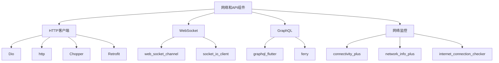

# 网络和API组件

> 掌握 Flutter 中网络请求、API 调用、WebSocket 连接等网络通信技术的集成和使用。

## 网络组件概览



## Dio HTTP 客户端

### 基础配置和使用

#### 1. 依赖配置

```yaml
# pubspec.yaml
dependencies:
  dio: ^5.3.2
  pretty_dio_logger: ^1.3.1
  dio_cache_interceptor: ^3.4.4
  dio_certificate_pinning: ^4.1.0
```

#### 2. Dio 服务配置

```dart
import 'package:dio/dio.dart';
import 'package:pretty_dio_logger/pretty_dio_logger.dart';
import 'package:dio_cache_interceptor/dio_cache_interceptor.dart';

class DioService {
  static Dio? _dio;
  static const String baseUrl = 'https://api.example.com';
  static const int connectTimeout = 30000;
  static const int receiveTimeout = 30000;
  
  // 获取 Dio 实例
  static Dio get instance {
    if (_dio == null) {
      _dio = Dio();
      _setupInterceptors();
      _setupOptions();
    }
    return _dio!;
  }
  
  // 配置基础选项
  static void _setupOptions() {
    _dio!.options = BaseOptions(
      baseUrl: baseUrl,
      connectTimeout: const Duration(milliseconds: connectTimeout),
      receiveTimeout: const Duration(milliseconds: receiveTimeout),
      headers: {
        'Content-Type': 'application/json',
        'Accept': 'application/json',
      },
    );
  }
  
  // 设置拦截器
  static void _setupInterceptors() {
    // 日志拦截器
    _dio!.interceptors.add(
      PrettyDioLogger(
        requestHeader: true,
        requestBody: true,
        responseBody: true,
        responseHeader: false,
        error: true,
        compact: true,
      ),
    );
    
    // 缓存拦截器
    final cacheOptions = CacheOptions(
      store: MemCacheStore(),
      policy: CachePolicy.request,
      hitCacheOnErrorExcept: [401, 403],
      maxStale: const Duration(days: 7),
      priority: CachePriority.normal,
      cipher: null,
      keyBuilder: CacheOptions.defaultCacheKeyBuilder,
      allowPostMethod: false,
    );
    _dio!.interceptors.add(DioCacheInterceptor(options: cacheOptions));
    
    // 认证拦截器
    _dio!.interceptors.add(
      InterceptorsWrapper(
        onRequest: (options, handler) async {
          // 添加认证头
          final token = await _getAuthToken();
          if (token != null) {
            options.headers['Authorization'] = 'Bearer $token';
          }
          handler.next(options);
        },
        onResponse: (response, handler) {
          // 处理响应
          handler.next(response);
        },
        onError: (error, handler) async {
          // 处理错误，如 token 过期自动刷新
          if (error.response?.statusCode == 401) {
            final newToken = await _refreshToken();
            if (newToken != null) {
              // 重试请求
              final options = error.requestOptions;
              options.headers['Authorization'] = 'Bearer $newToken';
              final response = await _dio!.fetch(options);
              handler.resolve(response);
              return;
            }
          }
          handler.next(error);
        },
      ),
    );
  }
  
  // 获取认证令牌
  static Future<String?> _getAuthToken() async {
    // 从安全存储获取 token
    return await SecureStorageService.read('access_token');
  }
  
  // 刷新令牌
  static Future<String?> _refreshToken() async {
    try {
      final refreshToken = await SecureStorageService.read('refresh_token');
      if (refreshToken == null) return null;
      
      final response = await _dio!.post(
        '/auth/refresh',
        data: {'refresh_token': refreshToken},
      );
      
      final newToken = response.data['access_token'];
      await SecureStorageService.write('access_token', newToken);
      return newToken;
    } catch (e) {
      debugPrint('刷新令牌失败: $e');
      return null;
    }
  }
}
```

### API 服务类

```dart
// 基础 API 响应模型
class ApiResponse<T> {
  final bool success;
  final String? message;
  final T? data;
  final int? code;
  
  ApiResponse({
    required this.success,
    this.message,
    this.data,
    this.code,
  });
  
  factory ApiResponse.fromJson(
    Map<String, dynamic> json,
    T Function(dynamic)? fromJsonT,
  ) {
    return ApiResponse<T>(
      success: json['success'] ?? false,
      message: json['message'],
      code: json['code'],
      data: json['data'] != null && fromJsonT != null
          ? fromJsonT(json['data'])
          : json['data'],
    );
  }
}

// 用户 API 服务
class UserApiService {
  static final Dio _dio = DioService.instance;
  
  // 获取用户列表
  static Future<ApiResponse<List<User>>> getUsers({
    int page = 1,
    int limit = 20,
    String? search,
  }) async {
    try {
      final response = await _dio.get(
        '/users',
        queryParameters: {
          'page': page,
          'limit': limit,
          if (search != null) 'search': search,
        },
      );
      
      final apiResponse = ApiResponse<List<User>>.fromJson(
        response.data,
        (data) => (data as List)
            .map((item) => User.fromJson(item))
            .toList(),
      );
      
      return apiResponse;
    } on DioException catch (e) {
      return _handleDioError<List<User>>(e);
    }
  }
  
  // 获取用户详情
  static Future<ApiResponse<User>> getUserById(String id) async {
    try {
      final response = await _dio.get('/users/$id');
      
      return ApiResponse<User>.fromJson(
        response.data,
        (data) => User.fromJson(data),
      );
    } on DioException catch (e) {
      return _handleDioError<User>(e);
    }
  }
  
  // 创建用户
  static Future<ApiResponse<User>> createUser(User user) async {
    try {
      final response = await _dio.post(
        '/users',
        data: user.toJson(),
      );
      
      return ApiResponse<User>.fromJson(
        response.data,
        (data) => User.fromJson(data),
      );
    } on DioException catch (e) {
      return _handleDioError<User>(e);
    }
  }
  
  // 更新用户
  static Future<ApiResponse<User>> updateUser(String id, User user) async {
    try {
      final response = await _dio.put(
        '/users/$id',
        data: user.toJson(),
      );
      
      return ApiResponse<User>.fromJson(
        response.data,
        (data) => User.fromJson(data),
      );
    } on DioException catch (e) {
      return _handleDioError<User>(e);
    }
  }
  
  // 删除用户
  static Future<ApiResponse<void>> deleteUser(String id) async {
    try {
      await _dio.delete('/users/$id');
      
      return ApiResponse<void>(
        success: true,
        message: '用户删除成功',
      );
    } on DioException catch (e) {
      return _handleDioError<void>(e);
    }
  }
  
  // 上传头像
  static Future<ApiResponse<String>> uploadAvatar(
    String userId,
    String filePath,
  ) async {
    try {
      final formData = FormData.fromMap({
        'avatar': await MultipartFile.fromFile(
          filePath,
          filename: 'avatar.jpg',
        ),
      });
      
      final response = await _dio.post(
        '/users/$userId/avatar',
        data: formData,
        onSendProgress: (sent, total) {
          final progress = (sent / total * 100).toStringAsFixed(1);
          debugPrint('上传进度: $progress%');
        },
      );
      
      return ApiResponse<String>.fromJson(
        response.data,
        (data) => data['avatar_url'],
      );
    } on DioException catch (e) {
      return _handleDioError<String>(e);
    }
  }
  
  // 处理 Dio 错误
  static ApiResponse<T> _handleDioError<T>(DioException error) {
    String message = '网络请求失败';
    int? code;
    
    switch (error.type) {
      case DioExceptionType.connectionTimeout:
        message = '连接超时';
        break;
      case DioExceptionType.sendTimeout:
        message = '发送超时';
        break;
      case DioExceptionType.receiveTimeout:
        message = '接收超时';
        break;
      case DioExceptionType.badResponse:
        code = error.response?.statusCode;
        message = _getErrorMessage(code, error.response?.data);
        break;
      case DioExceptionType.cancel:
        message = '请求已取消';
        break;
      case DioExceptionType.unknown:
        message = '网络连接失败';
        break;
      default:
        message = '未知错误';
    }
    
    return ApiResponse<T>(
      success: false,
      message: message,
      code: code,
    );
  }
  
  // 获取错误消息
  static String _getErrorMessage(int? statusCode, dynamic responseData) {
    if (responseData is Map<String, dynamic> && responseData['message'] != null) {
      return responseData['message'];
    }
    
    switch (statusCode) {
      case 400:
        return '请求参数错误';
      case 401:
        return '未授权，请重新登录';
      case 403:
        return '禁止访问';
      case 404:
        return '资源不存在';
      case 500:
        return '服务器内部错误';
      case 502:
        return '网关错误';
      case 503:
        return '服务不可用';
      default:
        return '请求失败 ($statusCode)';
    }
  }
}
```

### 文件上传和下载

```dart
class FileApiService {
  static final Dio _dio = DioService.instance;
  
  // 上传单个文件
  static Future<ApiResponse<String>> uploadFile(
    String filePath, {
    String? fileName,
    Function(int, int)? onProgress,
  }) async {
    try {
      final file = File(filePath);
      final formData = FormData.fromMap({
        'file': await MultipartFile.fromFile(
          filePath,
          filename: fileName ?? file.path.split('/').last,
        ),
      });
      
      final response = await _dio.post(
        '/upload',
        data: formData,
        onSendProgress: onProgress,
      );
      
      return ApiResponse<String>.fromJson(
        response.data,
        (data) => data['file_url'],
      );
    } on DioException catch (e) {
      return UserApiService._handleDioError<String>(e);
    }
  }
  
  // 上传多个文件
  static Future<ApiResponse<List<String>>> uploadMultipleFiles(
    List<String> filePaths, {
    Function(int, int)? onProgress,
  }) async {
    try {
      final formData = FormData();
      
      for (int i = 0; i < filePaths.length; i++) {
        final file = File(filePaths[i]);
        formData.files.add(
          MapEntry(
            'files',
            await MultipartFile.fromFile(
              filePaths[i],
              filename: file.path.split('/').last,
            ),
          ),
        );
      }
      
      final response = await _dio.post(
        '/upload/multiple',
        data: formData,
        onSendProgress: onProgress,
      );
      
      return ApiResponse<List<String>>.fromJson(
        response.data,
        (data) => List<String>.from(data['file_urls']),
      );
    } on DioException catch (e) {
      return UserApiService._handleDioError<List<String>>(e);
    }
  }
  
  // 下载文件
  static Future<bool> downloadFile(
    String url,
    String savePath, {
    Function(int, int)? onProgress,
    CancelToken? cancelToken,
  }) async {
    try {
      await _dio.download(
        url,
        savePath,
        onReceiveProgress: onProgress,
        cancelToken: cancelToken,
      );
      return true;
    } on DioException catch (e) {
      debugPrint('文件下载失败: $e');
      return false;
    }
  }
  
  // 获取下载进度
  static Future<void> downloadWithProgress(
    String url,
    String savePath,
    Function(double) onProgress,
  ) async {
    try {
      await _dio.download(
        url,
        savePath,
        onReceiveProgress: (received, total) {
          if (total != -1) {
            final progress = received / total;
            onProgress(progress);
          }
        },
      );
    } on DioException catch (e) {
      debugPrint('文件下载失败: $e');
      onProgress(-1); // 表示下载失败
    }
  }
  
  // 断点续传下载
  static Future<bool> resumableDownload(
    String url,
    String savePath, {
    Function(int, int)? onProgress,
  }) async {
    try {
      final file = File(savePath);
      int downloadedBytes = 0;
      
      // 检查文件是否已存在（断点续传）
      if (await file.exists()) {
        downloadedBytes = await file.length();
      }
      
      final response = await _dio.download(
        url,
        savePath,
        options: Options(
          headers: {
            'Range': 'bytes=$downloadedBytes-',
          },
        ),
        onReceiveProgress: (received, total) {
          final totalReceived = downloadedBytes + received;
          final totalSize = downloadedBytes + total;
          onProgress?.call(totalReceived, totalSize);
        },
      );
      
      return response.statusCode == 206 || response.statusCode == 200;
    } on DioException catch (e) {
      debugPrint('断点续传下载失败: $e');
      return false;
    }
  }
}
```

## WebSocket 连接

### 基础 WebSocket 实现

#### 1. 依赖配置

```yaml
# pubspec.yaml
dependencies:
  web_socket_channel: ^2.4.0
  socket_io_client: ^2.0.3+1
```

#### 2. WebSocket 服务类

```dart
import 'package:web_socket_channel/web_socket_channel.dart';
import 'package:web_socket_channel/status.dart' as status;

class WebSocketService {
  WebSocketChannel? _channel;
  StreamSubscription? _subscription;
  Timer? _heartbeatTimer;
  Timer? _reconnectTimer;
  
  final String _url;
  final Duration _heartbeatInterval;
  final Duration _reconnectInterval;
  final int _maxReconnectAttempts;
  
  int _reconnectAttempts = 0;
  bool _isConnected = false;
  bool _shouldReconnect = true;
  
  // 事件流控制器
  final StreamController<WebSocketEvent> _eventController =
      StreamController<WebSocketEvent>.broadcast();
  
  WebSocketService({
    required String url,
    Duration heartbeatInterval = const Duration(seconds: 30),
    Duration reconnectInterval = const Duration(seconds: 5),
    int maxReconnectAttempts = 5,
  })  : _url = url,
        _heartbeatInterval = heartbeatInterval,
        _reconnectInterval = reconnectInterval,
        _maxReconnectAttempts = maxReconnectAttempts;
  
  // 事件流
  Stream<WebSocketEvent> get events => _eventController.stream;
  
  // 连接状态
  bool get isConnected => _isConnected;
  
  // 连接 WebSocket
  Future<void> connect() async {
    try {
      _channel = WebSocketChannel.connect(Uri.parse(_url));
      
      _subscription = _channel!.stream.listen(
        _onMessage,
        onError: _onError,
        onDone: _onDisconnected,
      );
      
      _isConnected = true;
      _reconnectAttempts = 0;
      
      _startHeartbeat();
      _eventController.add(WebSocketEvent.connected());
      
      debugPrint('WebSocket 连接成功');
    } catch (e) {
      debugPrint('WebSocket 连接失败: $e');
      _eventController.add(WebSocketEvent.error('连接失败: $e'));
      _scheduleReconnect();
    }
  }
  
  // 断开连接
  Future<void> disconnect() async {
    _shouldReconnect = false;
    _stopHeartbeat();
    _stopReconnectTimer();
    
    await _channel?.sink.close(status.goingAway);
    await _subscription?.cancel();
    
    _isConnected = false;
    _eventController.add(WebSocketEvent.disconnected());
    
    debugPrint('WebSocket 已断开连接');
  }
  
  // 发送消息
  void send(dynamic message) {
    if (_isConnected && _channel != null) {
      _channel!.sink.add(message);
    } else {
      debugPrint('WebSocket 未连接，无法发送消息');
    }
  }
  
  // 发送 JSON 消息
  void sendJson(Map<String, dynamic> data) {
    send(jsonEncode(data));
  }
  
  // 处理接收到的消息
  void _onMessage(dynamic message) {
    try {
      final data = jsonDecode(message);
      _eventController.add(WebSocketEvent.message(data));
    } catch (e) {
      _eventController.add(WebSocketEvent.message(message));
    }
  }
  
  // 处理错误
  void _onError(error) {
    debugPrint('WebSocket 错误: $error');
    _eventController.add(WebSocketEvent.error(error.toString()));
    _scheduleReconnect();
  }
  
  // 处理断开连接
  void _onDisconnected() {
    _isConnected = false;
    _stopHeartbeat();
    
    debugPrint('WebSocket 连接已断开');
    _eventController.add(WebSocketEvent.disconnected());
    
    if (_shouldReconnect) {
      _scheduleReconnect();
    }
  }
  
  // 开始心跳
  void _startHeartbeat() {
    _heartbeatTimer = Timer.periodic(_heartbeatInterval, (timer) {
      if (_isConnected) {
        sendJson({'type': 'ping', 'timestamp': DateTime.now().millisecondsSinceEpoch});
      }
    });
  }
  
  // 停止心跳
  void _stopHeartbeat() {
    _heartbeatTimer?.cancel();
    _heartbeatTimer = null;
  }
  
  // 安排重连
  void _scheduleReconnect() {
    if (!_shouldReconnect || _reconnectAttempts >= _maxReconnectAttempts) {
      debugPrint('达到最大重连次数，停止重连');
      return;
    }
    
    _reconnectAttempts++;
    debugPrint('安排第 $_reconnectAttempts 次重连');
    
    _reconnectTimer = Timer(_reconnectInterval, () {
      connect();
    });
  }
  
  // 停止重连定时器
  void _stopReconnectTimer() {
    _reconnectTimer?.cancel();
    _reconnectTimer = null;
  }
  
  // 释放资源
  void dispose() {
    _shouldReconnect = false;
    disconnect();
    _eventController.close();
  }
}

// WebSocket 事件类
class WebSocketEvent {
  final WebSocketEventType type;
  final dynamic data;
  final String? error;
  
  WebSocketEvent._(this.type, {this.data, this.error});
  
  factory WebSocketEvent.connected() {
    return WebSocketEvent._(WebSocketEventType.connected);
  }
  
  factory WebSocketEvent.disconnected() {
    return WebSocketEvent._(WebSocketEventType.disconnected);
  }
  
  factory WebSocketEvent.message(dynamic data) {
    return WebSocketEvent._(WebSocketEventType.message, data: data);
  }
  
  factory WebSocketEvent.error(String error) {
    return WebSocketEvent._(WebSocketEventType.error, error: error);
  }
}

enum WebSocketEventType {
  connected,
  disconnected,
  message,
  error,
}
```

### Socket.IO 客户端

```dart
import 'package:socket_io_client/socket_io_client.dart' as IO;

class SocketIOService {
  IO.Socket? _socket;
  final String _url;
  final Map<String, dynamic> _options;
  
  // 事件流控制器
  final StreamController<SocketIOEvent> _eventController =
      StreamController<SocketIOEvent>.broadcast();
  
  SocketIOService({
    required String url,
    Map<String, dynamic>? options,
  })  : _url = url,
        _options = options ?? {};
  
  // 事件流
  Stream<SocketIOEvent> get events => _eventController.stream;
  
  // 连接状态
  bool get isConnected => _socket?.connected ?? false;
  
  // 连接 Socket.IO
  void connect() {
    _socket = IO.io(_url, {
      'transports': ['websocket'],
      'autoConnect': false,
      ..._options,
    });
    
    // 监听连接事件
    _socket!.onConnect((_) {
      debugPrint('Socket.IO 连接成功');
      _eventController.add(SocketIOEvent.connected());
    });
    
    // 监听断开事件
    _socket!.onDisconnect((_) {
      debugPrint('Socket.IO 连接断开');
      _eventController.add(SocketIOEvent.disconnected());
    });
    
    // 监听错误事件
    _socket!.onError((error) {
      debugPrint('Socket.IO 错误: $error');
      _eventController.add(SocketIOEvent.error(error.toString()));
    });
    
    // 监听重连事件
    _socket!.onReconnect((_) {
      debugPrint('Socket.IO 重连成功');
      _eventController.add(SocketIOEvent.reconnected());
    });
    
    _socket!.connect();
  }
  
  // 断开连接
  void disconnect() {
    _socket?.disconnect();
  }
  
  // 发送事件
  void emit(String event, [dynamic data]) {
    _socket?.emit(event, data);
  }
  
  // 监听事件
  void on(String event, Function(dynamic) callback) {
    _socket?.on(event, callback);
  }
  
  // 取消监听事件
  void off(String event) {
    _socket?.off(event);
  }
  
  // 监听一次性事件
  void once(String event, Function(dynamic) callback) {
    _socket?.once(event, callback);
  }
  
  // 释放资源
  void dispose() {
    _socket?.dispose();
    _eventController.close();
  }
}

// Socket.IO 事件类
class SocketIOEvent {
  final SocketIOEventType type;
  final dynamic data;
  final String? error;
  
  SocketIOEvent._(this.type, {this.data, this.error});
  
  factory SocketIOEvent.connected() {
    return SocketIOEvent._(SocketIOEventType.connected);
  }
  
  factory SocketIOEvent.disconnected() {
    return SocketIOEvent._(SocketIOEventType.disconnected);
  }
  
  factory SocketIOEvent.reconnected() {
    return SocketIOEvent._(SocketIOEventType.reconnected);
  }
  
  factory SocketIOEvent.error(String error) {
    return SocketIOEvent._(SocketIOEventType.error, error: error);
  }
}

enum SocketIOEventType {
  connected,
  disconnected,
  reconnected,
  error,
}
```

## 网络监控

### 网络状态检测

#### 1. 依赖配置

```yaml
# pubspec.yaml
dependencies:
  connectivity_plus: ^5.0.1
  internet_connection_checker: ^1.0.0+1
  network_info_plus: ^4.1.0
```

#### 2. 网络监控服务

```dart
import 'package:connectivity_plus/connectivity_plus.dart';
import 'package:internet_connection_checker/internet_connection_checker.dart';
import 'package:network_info_plus/network_info_plus.dart';

class NetworkService {
  static final Connectivity _connectivity = Connectivity();
  static final InternetConnectionChecker _connectionChecker =
      InternetConnectionChecker();
  static final NetworkInfo _networkInfo = NetworkInfo();
  
  // 网络状态流控制器
  static final StreamController<NetworkStatus> _statusController =
      StreamController<NetworkStatus>.broadcast();
  
  // 网络状态流
  static Stream<NetworkStatus> get statusStream => _statusController.stream;
  
  // 当前网络状态
  static NetworkStatus _currentStatus = NetworkStatus.unknown;
  
  // 初始化网络监控
  static Future<void> initialize() async {
    // 获取初始网络状态
    await _updateNetworkStatus();
    
    // 监听网络连接变化
    _connectivity.onConnectivityChanged.listen((result) async {
      await _updateNetworkStatus();
    });
    
    // 监听网络可达性变化
    _connectionChecker.onStatusChange.listen((status) {
      final isConnected = status == InternetConnectionStatus.connected;
      _updateConnectionStatus(isConnected);
    });
  }
  
  // 获取当前网络状态
  static NetworkStatus get currentStatus => _currentStatus;
  
  // 检查是否有网络连接
  static Future<bool> isConnected() async {
    final connectivityResult = await _connectivity.checkConnectivity();
    return connectivityResult != ConnectivityResult.none;
  }
  
  // 检查是否可以访问互联网
  static Future<bool> hasInternetAccess() async {
    return await _connectionChecker.hasConnection;
  }
  
  // 获取网络连接类型
  static Future<ConnectivityResult> getConnectivityType() async {
    return await _connectivity.checkConnectivity();
  }
  
  // 获取 WiFi 信息
  static Future<WiFiInfo?> getWiFiInfo() async {
    try {
      final wifiName = await _networkInfo.getWifiName();
      final wifiBSSID = await _networkInfo.getWifiBSSID();
      final wifiIP = await _networkInfo.getWifiIP();
      final wifiGateway = await _networkInfo.getWifiGatewayIP();
      final wifiSubmask = await _networkInfo.getWifiSubmask();
      
      if (wifiName != null) {
        return WiFiInfo(
          name: wifiName,
          bssid: wifiBSSID,
          ip: wifiIP,
          gateway: wifiGateway,
          submask: wifiSubmask,
        );
      }
      return null;
    } catch (e) {
      debugPrint('获取 WiFi 信息失败: $e');
      return null;
    }
  }
  
  // 更新网络状态
  static Future<void> _updateNetworkStatus() async {
    final connectivityResult = await _connectivity.checkConnectivity();
    final hasInternet = await _connectionChecker.hasConnection;
    
    NetworkStatus newStatus;
    
    if (connectivityResult == ConnectivityResult.none) {
      newStatus = NetworkStatus.disconnected;
    } else if (!hasInternet) {
      newStatus = NetworkStatus.connectedNoInternet;
    } else {
      switch (connectivityResult) {
        case ConnectivityResult.wifi:
          newStatus = NetworkStatus.connectedWiFi;
          break;
        case ConnectivityResult.mobile:
          newStatus = NetworkStatus.connectedMobile;
          break;
        case ConnectivityResult.ethernet:
          newStatus = NetworkStatus.connectedEthernet;
          break;
        default:
          newStatus = NetworkStatus.connected;
      }
    }
    
    if (_currentStatus != newStatus) {
      _currentStatus = newStatus;
      _statusController.add(newStatus);
      debugPrint('网络状态变化: ${newStatus.name}');
    }
  }
  
  // 更新连接状态
  static void _updateConnectionStatus(bool isConnected) {
    if (!isConnected && _currentStatus != NetworkStatus.disconnected) {
      _currentStatus = NetworkStatus.connectedNoInternet;
      _statusController.add(_currentStatus);
    }
  }
  
  // 测试网络延迟
  static Future<int?> pingTest({
    String host = 'google.com',
    int timeout = 5000,
  }) async {
    try {
      final stopwatch = Stopwatch()..start();
      
      final result = await InternetAddress.lookup(host)
          .timeout(Duration(milliseconds: timeout));
      
      stopwatch.stop();
      
      if (result.isNotEmpty && result[0].rawAddress.isNotEmpty) {
        return stopwatch.elapsedMilliseconds;
      }
      return null;
    } catch (e) {
      debugPrint('网络延迟测试失败: $e');
      return null;
    }
  }
  
  // 测试下载速度
  static Future<double?> speedTest({
    String testUrl = 'https://httpbin.org/bytes/1048576', // 1MB
    int timeout = 30000,
  }) async {
    try {
      final stopwatch = Stopwatch()..start();
      
      final response = await Dio().get(
        testUrl,
        options: Options(
          receiveTimeout: Duration(milliseconds: timeout),
        ),
      );
      
      stopwatch.stop();
      
      if (response.statusCode == 200) {
        final bytes = response.data.length;
        final seconds = stopwatch.elapsedMilliseconds / 1000;
        final speedMbps = (bytes * 8) / (seconds * 1000000); // Mbps
        return speedMbps;
      }
      return null;
    } catch (e) {
      debugPrint('网络速度测试失败: $e');
      return null;
    }
  }
  
  // 释放资源
  static void dispose() {
    _statusController.close();
  }
}

// 网络状态枚举
enum NetworkStatus {
  unknown,
  disconnected,
  connectedNoInternet,
  connected,
  connectedWiFi,
  connectedMobile,
  connectedEthernet,
}

// WiFi 信息类
class WiFiInfo {
  final String name;
  final String? bssid;
  final String? ip;
  final String? gateway;
  final String? submask;
  
  WiFiInfo({
    required this.name,
    this.bssid,
    this.ip,
    this.gateway,
    this.submask,
  });
  
  @override
  String toString() {
    return 'WiFiInfo{name: $name, bssid: $bssid, ip: $ip, gateway: $gateway, submask: $submask}';
  }
}
```

## 网络组件最佳实践

### 错误处理和重试机制

```dart
class NetworkErrorHandler {
  // 重试配置
  static const int maxRetries = 3;
  static const Duration retryDelay = Duration(seconds: 2);
  
  // 带重试的网络请求
  static Future<T> withRetry<T>(
    Future<T> Function() operation, {
    int maxRetries = NetworkErrorHandler.maxRetries,
    Duration delay = retryDelay,
    bool Function(dynamic error)? shouldRetry,
  }) async {
    int attempts = 0;
    
    while (attempts < maxRetries) {
      try {
        return await operation();
      } catch (error) {
        attempts++;
        
        // 检查是否应该重试
        if (attempts >= maxRetries || 
            (shouldRetry != null && !shouldRetry(error))) {
          rethrow;
        }
        
        // 等待后重试
        await Future.delayed(delay * attempts);
        debugPrint('重试第 $attempts 次: $error');
      }
    }
    
    throw Exception('达到最大重试次数');
  }
  
  // 判断是否应该重试
  static bool shouldRetryError(dynamic error) {
    if (error is DioException) {
      switch (error.type) {
        case DioExceptionType.connectionTimeout:
        case DioExceptionType.sendTimeout:
        case DioExceptionType.receiveTimeout:
        case DioExceptionType.unknown:
          return true;
        case DioExceptionType.badResponse:
          // 5xx 错误可以重试
          final statusCode = error.response?.statusCode;
          return statusCode != null && statusCode >= 500;
        default:
          return false;
      }
    }
    return false;
  }
  
  // 指数退避重试
  static Future<T> withExponentialBackoff<T>(
    Future<T> Function() operation, {
    int maxRetries = 5,
    Duration initialDelay = const Duration(seconds: 1),
    double multiplier = 2.0,
  }) async {
    int attempts = 0;
    Duration currentDelay = initialDelay;
    
    while (attempts < maxRetries) {
      try {
        return await operation();
      } catch (error) {
        attempts++;
        
        if (attempts >= maxRetries || !shouldRetryError(error)) {
          rethrow;
        }
        
        await Future.delayed(currentDelay);
        currentDelay = Duration(
          milliseconds: (currentDelay.inMilliseconds * multiplier).round(),
        );
        
        debugPrint('指数退避重试第 $attempts 次，延迟: ${currentDelay.inMilliseconds}ms');
      }
    }
    
    throw Exception('达到最大重试次数');
  }
}
```

### 请求缓存和离线支持

```dart
class OfflineSupport {
  static const String cacheKey = 'api_cache';
  
  // 带缓存的网络请求
  static Future<T> withCache<T>(
    String cacheKey,
    Future<T> Function() networkCall,
    T Function(Map<String, dynamic>) fromJson,
    Map<String, dynamic> Function(T) toJson, {
    Duration cacheExpiry = const Duration(hours: 1),
    bool forceRefresh = false,
  }) async {
    // 检查网络状态
    final isOnline = await NetworkService.hasInternetAccess();
    
    if (!forceRefresh && !isOnline) {
      // 离线时从缓存获取
      final cachedData = await CacheManager.getDiskCache<T>(
        cacheKey,
        maxAge: cacheExpiry,
      );
      
      if (cachedData != null) {
        debugPrint('从缓存获取数据: $cacheKey');
        return cachedData;
      } else {
        throw Exception('无网络连接且无缓存数据');
      }
    }
    
    try {
      // 在线时从网络获取
      final result = await networkCall();
      
      // 缓存结果
      await CacheManager.setDiskCache(cacheKey, result);
      debugPrint('网络请求成功并缓存: $cacheKey');
      
      return result;
    } catch (error) {
      // 网络请求失败，尝试从缓存获取
      final cachedData = await CacheManager.getDiskCache<T>(cacheKey);
      
      if (cachedData != null) {
        debugPrint('网络请求失败，使用缓存数据: $cacheKey');
        return cachedData;
      }
      
      rethrow;
    }
  }
  
  // 预加载数据
  static Future<void> preloadData() async {
    if (await NetworkService.hasInternetAccess()) {
      // 预加载关键数据
      try {
        await Future.wait([
          UserApiService.getUsers(),
          // 其他关键 API 调用
        ]);
        debugPrint('数据预加载完成');
      } catch (e) {
        debugPrint('数据预加载失败: $e');
      }
    }
  }
  
  // 同步离线数据
  static Future<void> syncOfflineData() async {
    if (await NetworkService.hasInternetAccess()) {
      // 同步离线期间的数据变更
      try {
        final pendingRequests = await _getPendingRequests();
        
        for (final request in pendingRequests) {
          await _executePendingRequest(request);
        }
        
        await _clearPendingRequests();
        debugPrint('离线数据同步完成');
      } catch (e) {
        debugPrint('离线数据同步失败: $e');
      }
    }
  }
  
  static Future<List<PendingRequest>> _getPendingRequests() async {
    // 从本地存储获取待同步的请求
    return [];
  }
  
  static Future<void> _executePendingRequest(PendingRequest request) async {
    // 执行待同步的请求
  }
  
  static Future<void> _clearPendingRequests() async {
    // 清除已同步的请求
  }
}

class PendingRequest {
  final String method;
  final String url;
  final Map<String, dynamic>? data;
  final DateTime timestamp;
  
  PendingRequest({
    required this.method,
    required this.url,
    this.data,
    required this.timestamp,
  });
}
```

## 总结

网络和API组件是现代应用的核心基础设施，本文档涵盖了：

### 核心功能
- **HTTP客户端**：Dio、http、Chopper、Retrofit
- **WebSocket**：实时双向通信、心跳机制、自动重连
- **网络监控**：连接状态检测、网络类型识别、速度测试
- **文件传输**：上传下载、进度监控、断点续传

### 最佳实践
- **错误处理**：重试机制、指数退避、错误分类
- **缓存策略**：请求缓存、离线支持、数据同步
- **性能优化**：连接复用、请求合并、并发控制
- **安全性**：证书固定、请求签名、数据加密

### 推荐组件库
- **dio**：功能强大的 HTTP 客户端
- **web_socket_channel**：WebSocket 连接
- **connectivity_plus**：网络连接检测
- **internet_connection_checker**：网络可达性检测

## 相关资源

- [Dio 官方文档](https://pub.dev/packages/dio)
- [WebSocket Channel 文档](https://pub.dev/packages/web_socket_channel)
- [Connectivity Plus 文档](https://pub.dev/packages/connectivity_plus)
- [HTTP 最佳实践](https://flutter.dev/docs/cookbook/networking)
- [网络安全指南](https://flutter.dev/docs/development/data-and-backend/networking)