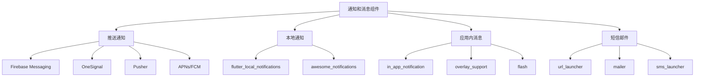

# 通知和消息组件

> 掌握 Flutter 中推送通知、本地通知、消息传递等通信功能的集成和使用。

## 通知消息概览



## Firebase Cloud Messaging (FCM)

### 基础配置和使用

#### 1. 依赖配置

```yaml
# pubspec.yaml
dependencies:
  firebase_core: ^2.24.2
  firebase_messaging: ^14.7.10
  flutter_local_notifications: ^16.3.2
```

#### 2. FCM 服务配置

```dart
import 'package:firebase_messaging/firebase_messaging.dart';
import 'package:flutter_local_notifications/flutter_local_notifications.dart';

// 后台消息处理器（必须是顶级函数）
@pragma('vm:entry-point')
Future<void> _firebaseMessagingBackgroundHandler(RemoteMessage message) async {
  await Firebase.initializeApp();
  debugPrint('后台消息: ${message.messageId}');
  
  // 处理后台消息
  await FCMService._handleBackgroundMessage(message);
}

class FCMService {
  static final FirebaseMessaging _messaging = FirebaseMessaging.instance;
  static final FlutterLocalNotificationsPlugin _localNotifications =
      FlutterLocalNotificationsPlugin();
  
  static const AndroidNotificationChannel _channel = AndroidNotificationChannel(
    'high_importance_channel',
    'High Importance Notifications',
    description: 'This channel is used for important notifications.',
    importance: Importance.high,
  );
  
  // 消息流控制器
  static final StreamController<RemoteMessage> _messageController =
      StreamController<RemoteMessage>.broadcast();
  
  // 消息流
  static Stream<RemoteMessage> get messageStream => _messageController.stream;
  
  // 初始化 FCM
  static Future<void> initialize() async {
    // 请求通知权限
    await _requestPermission();
    
    // 初始化本地通知
    await _initializeLocalNotifications();
    
    // 设置后台消息处理器
    FirebaseMessaging.onBackgroundMessage(_firebaseMessagingBackgroundHandler);
    
    // 监听前台消息
    FirebaseMessaging.onMessage.listen(_handleForegroundMessage);
    
    // 监听消息点击
    FirebaseMessaging.onMessageOpenedApp.listen(_handleMessageOpenedApp);
    
    // 处理应用启动时的消息
    final initialMessage = await _messaging.getInitialMessage();
    if (initialMessage != null) {
      _handleMessageOpenedApp(initialMessage);
    }
    
    // 获取 FCM Token
    await _getFCMToken();
    
    // 监听 Token 刷新
    _messaging.onTokenRefresh.listen(_onTokenRefresh);
  }
  
  // 请求通知权限
  static Future<void> _requestPermission() async {
    final settings = await _messaging.requestPermission(
      alert: true,
      announcement: false,
      badge: true,
      carPlay: false,
      criticalAlert: false,
      provisional: false,
      sound: true,
    );
    
    debugPrint('通知权限状态: ${settings.authorizationStatus}');
  }
  
  // 初始化本地通知
  static Future<void> _initializeLocalNotifications() async {
    const androidSettings = AndroidInitializationSettings('@mipmap/ic_launcher');
    const iosSettings = DarwinInitializationSettings(
      requestAlertPermission: true,
      requestBadgePermission: true,
      requestSoundPermission: true,
    );
    
    const initSettings = InitializationSettings(
      android: androidSettings,
      iOS: iosSettings,
    );
    
    await _localNotifications.initialize(
      initSettings,
      onDidReceiveNotificationResponse: _onNotificationTapped,
    );
    
    // 创建 Android 通知渠道
    await _localNotifications
        .resolvePlatformSpecificImplementation<AndroidFlutterLocalNotificationsPlugin>()
        ?.createNotificationChannel(_channel);
  }
  
  // 获取 FCM Token
  static Future<String?> _getFCMToken() async {
    try {
      final token = await _messaging.getToken();
      debugPrint('FCM Token: $token');
      
      // 保存 Token 到服务器
      await _saveTokenToServer(token);
      
      return token;
    } catch (e) {
      debugPrint('获取 FCM Token 失败: $e');
      return null;
    }
  }
  
  // Token 刷新处理
  static Future<void> _onTokenRefresh(String token) async {
    debugPrint('FCM Token 刷新: $token');
    await _saveTokenToServer(token);
  }
  
  // 保存 Token 到服务器
  static Future<void> _saveTokenToServer(String? token) async {
    if (token == null) return;
    
    try {
      await DioService.instance.post(
        '/api/fcm/token',
        data: {
          'token': token,
          'platform': Platform.isIOS ? 'ios' : 'android',
          'user_id': AuthService.currentUser?.uid,
        },
      );
    } catch (e) {
      debugPrint('保存 FCM Token 失败: $e');
    }
  }
  
  // 处理前台消息
  static Future<void> _handleForegroundMessage(RemoteMessage message) async {
    debugPrint('前台消息: ${message.messageId}');
    
    // 显示本地通知
    await _showLocalNotification(message);
    
    // 发送到消息流
    _messageController.add(message);
  }
  
  // 处理后台消息
  static Future<void> _handleBackgroundMessage(RemoteMessage message) async {
    debugPrint('后台消息处理: ${message.messageId}');
    
    // 可以在这里处理数据同步等操作
    await _processMessageData(message);
  }
  
  // 处理消息点击
  static Future<void> _handleMessageOpenedApp(RemoteMessage message) async {
    debugPrint('消息点击: ${message.messageId}');
    
    // 处理消息点击逻辑
    await _handleMessageAction(message);
  }
  
  // 显示本地通知
  static Future<void> _showLocalNotification(RemoteMessage message) async {
    final notification = message.notification;
    if (notification == null) return;
    
    const androidDetails = AndroidNotificationDetails(
      'high_importance_channel',
      'High Importance Notifications',
      channelDescription: 'This channel is used for important notifications.',
      importance: Importance.high,
      priority: Priority.high,
      showWhen: true,
      enableVibration: true,
      playSound: true,
    );
    
    const iosDetails = DarwinNotificationDetails(
      presentAlert: true,
      presentBadge: true,
      presentSound: true,
    );
    
    const details = NotificationDetails(
      android: androidDetails,
      iOS: iosDetails,
    );
    
    await _localNotifications.show(
      message.hashCode,
      notification.title,
      notification.body,
      details,
      payload: jsonEncode(message.data),
    );
  }
  
  // 通知点击处理
  static Future<void> _onNotificationTapped(
    NotificationResponse response,
  ) async {
    final payload = response.payload;
    if (payload != null) {
      try {
        final data = jsonDecode(payload) as Map<String, dynamic>;
        await _handleNotificationData(data);
      } catch (e) {
        debugPrint('处理通知点击数据失败: $e');
      }
    }
  }
  
  // 处理消息数据
  static Future<void> _processMessageData(RemoteMessage message) async {
    final data = message.data;
    
    // 根据消息类型处理不同逻辑
    switch (data['type']) {
      case 'chat':
        await _handleChatMessage(data);
        break;
      case 'order':
        await _handleOrderUpdate(data);
        break;
      case 'system':
        await _handleSystemMessage(data);
        break;
      default:
        debugPrint('未知消息类型: ${data['type']}');
    }
  }
  
  // 处理消息动作
  static Future<void> _handleMessageAction(RemoteMessage message) async {
    final data = message.data;
    
    // 根据动作类型导航到不同页面
    switch (data['action']) {
      case 'open_chat':
        NavigationService.navigateTo('/chat/${data['chat_id']}');
        break;
      case 'open_order':
        NavigationService.navigateTo('/order/${data['order_id']}');
        break;
      case 'open_profile':
        NavigationService.navigateTo('/profile');
        break;
      default:
        NavigationService.navigateTo('/home');
    }
  }
  
  // 处理通知数据
  static Future<void> _handleNotificationData(Map<String, dynamic> data) async {
    await _handleMessageAction(RemoteMessage(data: data));
  }
  
  // 处理聊天消息
  static Future<void> _handleChatMessage(Map<String, dynamic> data) async {
    // 更新本地聊天数据
    debugPrint('处理聊天消息: ${data['message']}');
  }
  
  // 处理订单更新
  static Future<void> _handleOrderUpdate(Map<String, dynamic> data) async {
    // 更新本地订单数据
    debugPrint('处理订单更新: ${data['order_id']}');
  }
  
  // 处理系统消息
  static Future<void> _handleSystemMessage(Map<String, dynamic> data) async {
    // 处理系统通知
    debugPrint('处理系统消息: ${data['message']}');
  }
  
  // 订阅主题
  static Future<void> subscribeToTopic(String topic) async {
    try {
      await _messaging.subscribeToTopic(topic);
      debugPrint('订阅主题成功: $topic');
    } catch (e) {
      debugPrint('订阅主题失败: $e');
    }
  }
  
  // 取消订阅主题
  static Future<void> unsubscribeFromTopic(String topic) async {
    try {
      await _messaging.unsubscribeFromTopic(topic);
      debugPrint('取消订阅主题成功: $topic');
    } catch (e) {
      debugPrint('取消订阅主题失败: $e');
    }
  }
  
  // 获取当前 Token
  static Future<String?> getCurrentToken() async {
    return await _messaging.getToken();
  }
  
  // 删除 Token
  static Future<void> deleteToken() async {
    try {
      await _messaging.deleteToken();
      debugPrint('FCM Token 删除成功');
    } catch (e) {
      debugPrint('FCM Token 删除失败: $e');
    }
  }
  
  // 释放资源
  static void dispose() {
    _messageController.close();
  }
}

// 消息类型枚举
enum MessageType {
  chat,
  order,
  system,
  promotion,
  reminder,
}

// 消息优先级枚举
enum MessagePriority {
  low,
  normal,
  high,
  urgent,
}

// 推送消息模型
class PushMessage {
  final String id;
  final String title;
  final String body;
  final MessageType type;
  final MessagePriority priority;
  final Map<String, dynamic> data;
  final DateTime timestamp;
  final String? imageUrl;
  final String? action;
  
  PushMessage({
    required this.id,
    required this.title,
    required this.body,
    required this.type,
    this.priority = MessagePriority.normal,
    this.data = const {},
    required this.timestamp,
    this.imageUrl,
    this.action,
  });
  
  factory PushMessage.fromRemoteMessage(RemoteMessage message) {
    return PushMessage(
      id: message.messageId ?? '',
      title: message.notification?.title ?? '',
      body: message.notification?.body ?? '',
      type: _parseMessageType(message.data['type']),
      priority: _parseMessagePriority(message.data['priority']),
      data: message.data,
      timestamp: DateTime.now(),
      imageUrl: message.notification?.android?.imageUrl,
      action: message.data['action'],
    );
  }
  
  static MessageType _parseMessageType(String? type) {
    switch (type) {
      case 'chat':
        return MessageType.chat;
      case 'order':
        return MessageType.order;
      case 'system':
        return MessageType.system;
      case 'promotion':
        return MessageType.promotion;
      case 'reminder':
        return MessageType.reminder;
      default:
        return MessageType.system;
    }
  }
  
  static MessagePriority _parseMessagePriority(String? priority) {
    switch (priority) {
      case 'low':
        return MessagePriority.low;
      case 'normal':
        return MessagePriority.normal;
      case 'high':
        return MessagePriority.high;
      case 'urgent':
        return MessagePriority.urgent;
      default:
        return MessagePriority.normal;
    }
  }
}
```

## 本地通知

### Flutter Local Notifications

#### 1. 本地通知服务

```dart
import 'package:flutter_local_notifications/flutter_local_notifications.dart';
import 'package:timezone/timezone.dart' as tz;
import 'package:timezone/data/latest.dart' as tz;

class LocalNotificationService {
  static final FlutterLocalNotificationsPlugin _notifications =
      FlutterLocalNotificationsPlugin();
  
  static bool _initialized = false;
  
  // 初始化本地通知
  static Future<void> initialize() async {
    if (_initialized) return;
    
    // 初始化时区数据
    tz.initializeTimeZones();
    
    const androidSettings = AndroidInitializationSettings('@mipmap/ic_launcher');
    const iosSettings = DarwinInitializationSettings(
      requestAlertPermission: true,
      requestBadgePermission: true,
      requestSoundPermission: true,
      requestCriticalPermission: false,
    );
    
    const initSettings = InitializationSettings(
      android: androidSettings,
      iOS: iosSettings,
    );
    
    await _notifications.initialize(
      initSettings,
      onDidReceiveNotificationResponse: _onNotificationTapped,
    );
    
    _initialized = true;
    debugPrint('本地通知初始化完成');
  }
  
  // 显示简单通知
  static Future<void> showNotification({
    required int id,
    required String title,
    required String body,
    String? payload,
    NotificationPriority priority = NotificationPriority.defaultPriority,
  }) async {
    await _ensureInitialized();
    
    final androidDetails = AndroidNotificationDetails(
      'default_channel',
      'Default Notifications',
      channelDescription: 'Default notification channel',
      importance: _getAndroidImportance(priority),
      priority: _getAndroidPriority(priority),
      showWhen: true,
      enableVibration: true,
      playSound: true,
    );
    
    const iosDetails = DarwinNotificationDetails(
      presentAlert: true,
      presentBadge: true,
      presentSound: true,
    );
    
    final details = NotificationDetails(
      android: androidDetails,
      iOS: iosDetails,
    );
    
    await _notifications.show(id, title, body, details, payload: payload);
  }
  
  // 显示带图片的通知
  static Future<void> showImageNotification({
    required int id,
    required String title,
    required String body,
    required String imagePath,
    String? payload,
  }) async {
    await _ensureInitialized();
    
    final bigPictureStyleInformation = BigPictureStyleInformation(
      FilePathAndroidBitmap(imagePath),
      largeIcon: FilePathAndroidBitmap(imagePath),
      contentTitle: title,
      htmlFormatContentTitle: true,
      summaryText: body,
      htmlFormatSummaryText: true,
    );
    
    final androidDetails = AndroidNotificationDetails(
      'image_channel',
      'Image Notifications',
      channelDescription: 'Notifications with images',
      importance: Importance.high,
      priority: Priority.high,
      styleInformation: bigPictureStyleInformation,
    );
    
    final iosDetails = DarwinNotificationDetails(
      presentAlert: true,
      presentBadge: true,
      presentSound: true,
      attachments: [DarwinNotificationAttachment(imagePath)],
    );
    
    final details = NotificationDetails(
      android: androidDetails,
      iOS: iosDetails,
    );
    
    await _notifications.show(id, title, body, details, payload: payload);
  }
  
  // 显示进度通知
  static Future<void> showProgressNotification({
    required int id,
    required String title,
    required int progress,
    int maxProgress = 100,
    bool indeterminate = false,
  }) async {
    await _ensureInitialized();
    
    final androidDetails = AndroidNotificationDetails(
      'progress_channel',
      'Progress Notifications',
      channelDescription: 'Notifications showing progress',
      importance: Importance.low,
      priority: Priority.low,
      onlyAlertOnce: true,
      showProgress: true,
      maxProgress: maxProgress,
      progress: progress,
      indeterminate: indeterminate,
    );
    
    const iosDetails = DarwinNotificationDetails(
      presentAlert: false,
      presentBadge: false,
      presentSound: false,
    );
    
    final details = NotificationDetails(
      android: androidDetails,
      iOS: iosDetails,
    );
    
    await _notifications.show(
      id,
      title,
      indeterminate ? '正在处理...' : '$progress/$maxProgress',
      details,
    );
  }
  
  // 显示带动作按钮的通知
  static Future<void> showActionNotification({
    required int id,
    required String title,
    required String body,
    required List<NotificationAction> actions,
    String? payload,
  }) async {
    await _ensureInitialized();
    
    final androidDetails = AndroidNotificationDetails(
      'action_channel',
      'Action Notifications',
      channelDescription: 'Notifications with action buttons',
      importance: Importance.high,
      priority: Priority.high,
      actions: actions.map((action) => AndroidNotificationAction(
        action.id,
        action.title,
        icon: action.icon != null ? DrawableResourceAndroidBitmap(action.icon!) : null,
        showsUserInterface: action.showsUserInterface,
        cancelNotification: action.cancelNotification,
      )).toList(),
    );
    
    final iosDetails = DarwinNotificationDetails(
      presentAlert: true,
      presentBadge: true,
      presentSound: true,
      categoryIdentifier: 'actionCategory',
    );
    
    final details = NotificationDetails(
      android: androidDetails,
      iOS: iosDetails,
    );
    
    await _notifications.show(id, title, body, details, payload: payload);
  }
  
  // 定时通知
  static Future<void> scheduleNotification({
    required int id,
    required String title,
    required String body,
    required DateTime scheduledDate,
    String? payload,
  }) async {
    await _ensureInitialized();
    
    final androidDetails = AndroidNotificationDetails(
      'scheduled_channel',
      'Scheduled Notifications',
      channelDescription: 'Scheduled notifications',
      importance: Importance.high,
      priority: Priority.high,
    );
    
    const iosDetails = DarwinNotificationDetails(
      presentAlert: true,
      presentBadge: true,
      presentSound: true,
    );
    
    final details = NotificationDetails(
      android: androidDetails,
      iOS: iosDetails,
    );
    
    await _notifications.zonedSchedule(
      id,
      title,
      body,
      tz.TZDateTime.from(scheduledDate, tz.local),
      details,
      payload: payload,
      uiLocalNotificationDateInterpretation:
          UILocalNotificationDateInterpretation.absoluteTime,
    );
  }
  
  // 重复通知
  static Future<void> scheduleRepeatingNotification({
    required int id,
    required String title,
    required String body,
    required RepeatInterval repeatInterval,
    String? payload,
  }) async {
    await _ensureInitialized();
    
    const androidDetails = AndroidNotificationDetails(
      'repeating_channel',
      'Repeating Notifications',
      channelDescription: 'Repeating notifications',
      importance: Importance.high,
      priority: Priority.high,
    );
    
    const iosDetails = DarwinNotificationDetails(
      presentAlert: true,
      presentBadge: true,
      presentSound: true,
    );
    
    const details = NotificationDetails(
      android: androidDetails,
      iOS: iosDetails,
    );
    
    await _notifications.periodicallyShow(
      id,
      title,
      body,
      repeatInterval,
      details,
      payload: payload,
    );
  }
  
  // 每日定时通知
  static Future<void> scheduleDailyNotification({
    required int id,
    required String title,
    required String body,
    required Time time,
    String? payload,
  }) async {
    await _ensureInitialized();
    
    const androidDetails = AndroidNotificationDetails(
      'daily_channel',
      'Daily Notifications',
      channelDescription: 'Daily scheduled notifications',
      importance: Importance.high,
      priority: Priority.high,
    );
    
    const iosDetails = DarwinNotificationDetails(
      presentAlert: true,
      presentBadge: true,
      presentSound: true,
    );
    
    const details = NotificationDetails(
      android: androidDetails,
      iOS: iosDetails,
    );
    
    await _notifications.zonedSchedule(
      id,
      title,
      body,
      _nextInstanceOfTime(time),
      details,
      payload: payload,
      uiLocalNotificationDateInterpretation:
          UILocalNotificationDateInterpretation.absoluteTime,
      matchDateTimeComponents: DateTimeComponents.time,
    );
  }
  
  // 取消通知
  static Future<void> cancelNotification(int id) async {
    await _notifications.cancel(id);
  }
  
  // 取消所有通知
  static Future<void> cancelAllNotifications() async {
    await _notifications.cancelAll();
  }
  
  // 获取待处理的通知
  static Future<List<PendingNotificationRequest>> getPendingNotifications() async {
    return await _notifications.pendingNotificationRequests();
  }
  
  // 获取活动通知
  static Future<List<ActiveNotification>> getActiveNotifications() async {
    final plugin = _notifications.resolvePlatformSpecificImplementation<
        AndroidFlutterLocalNotificationsPlugin>();
    return await plugin?.getActiveNotifications() ?? [];
  }
  
  // 通知点击处理
  static Future<void> _onNotificationTapped(
    NotificationResponse response,
  ) async {
    final payload = response.payload;
    final actionId = response.actionId;
    
    debugPrint('通知点击: payload=$payload, actionId=$actionId');
    
    if (actionId != null) {
      await _handleNotificationAction(actionId, payload);
    } else if (payload != null) {
      await _handleNotificationPayload(payload);
    }
  }
  
  // 处理通知动作
  static Future<void> _handleNotificationAction(
    String actionId,
    String? payload,
  ) async {
    switch (actionId) {
      case 'reply':
        // 处理回复动作
        break;
      case 'mark_read':
        // 处理标记已读动作
        break;
      case 'dismiss':
        // 处理忽略动作
        break;
      default:
        debugPrint('未知通知动作: $actionId');
    }
  }
  
  // 处理通知载荷
  static Future<void> _handleNotificationPayload(String payload) async {
    try {
      final data = jsonDecode(payload) as Map<String, dynamic>;
      final route = data['route'] as String?;
      
      if (route != null) {
        NavigationService.navigateTo(route);
      }
    } catch (e) {
      debugPrint('处理通知载荷失败: $e');
    }
  }
  
  // 确保已初始化
  static Future<void> _ensureInitialized() async {
    if (!_initialized) {
      await initialize();
    }
  }
  
  // 获取下一个指定时间的实例
  static tz.TZDateTime _nextInstanceOfTime(Time time) {
    final now = tz.TZDateTime.now(tz.local);
    tz.TZDateTime scheduledDate = tz.TZDateTime(
      tz.local,
      now.year,
      now.month,
      now.day,
      time.hour,
      time.minute,
      time.second,
    );
    
    if (scheduledDate.isBefore(now)) {
      scheduledDate = scheduledDate.add(const Duration(days: 1));
    }
    
    return scheduledDate;
  }
  
  // 获取 Android 重要性
  static Importance _getAndroidImportance(NotificationPriority priority) {
    switch (priority) {
      case NotificationPriority.min:
        return Importance.min;
      case NotificationPriority.low:
        return Importance.low;
      case NotificationPriority.defaultPriority:
        return Importance.defaultImportance;
      case NotificationPriority.high:
        return Importance.high;
      case NotificationPriority.max:
        return Importance.max;
    }
  }
  
  // 获取 Android 优先级
  static Priority _getAndroidPriority(NotificationPriority priority) {
    switch (priority) {
      case NotificationPriority.min:
        return Priority.min;
      case NotificationPriority.low:
        return Priority.low;
      case NotificationPriority.defaultPriority:
        return Priority.defaultPriority;
      case NotificationPriority.high:
        return Priority.high;
      case NotificationPriority.max:
        return Priority.max;
    }
  }
}

// 通知优先级枚举
enum NotificationPriority {
  min,
  low,
  defaultPriority,
  high,
  max,
}

// 通知动作类
class NotificationAction {
  final String id;
  final String title;
  final String? icon;
  final bool showsUserInterface;
  final bool cancelNotification;
  
  NotificationAction({
    required this.id,
    required this.title,
    this.icon,
    this.showsUserInterface = false,
    this.cancelNotification = true,
  });
}
```

## 应用内通知

### 应用内消息组件

#### 1. 依赖配置

```yaml
# pubspec.yaml
dependencies:
  overlay_support: ^2.1.0
  flash: ^3.0.5
  another_flushbar: ^1.12.30
```

#### 2. 应用内通知服务

```dart
import 'package:overlay_support/overlay_support.dart';
import 'package:flash/flash.dart';
import 'package:another_flushbar/flushbar.dart';

class InAppNotificationService {
  // 显示简单提示
  static void showSimpleNotification(
    String message, {
    Duration duration = const Duration(seconds: 3),
    Color? backgroundColor,
    Color? textColor,
  }) {
    showSimpleNotification(
      Text(
        message,
        style: TextStyle(color: textColor ?? Colors.white),
      ),
      background: backgroundColor ?? Colors.black87,
      duration: duration,
    );
  }
  
  // 显示成功消息
  static void showSuccess(
    String message, {
    Duration duration = const Duration(seconds: 3),
  }) {
    showSimpleNotification(
      Row(
        children: [
          const Icon(Icons.check_circle, color: Colors.white),
          const SizedBox(width: 8),
          Expanded(
            child: Text(
              message,
              style: const TextStyle(color: Colors.white),
            ),
          ),
        ],
      ),
      background: Colors.green,
      duration: duration,
    );
  }
  
  // 显示错误消息
  static void showError(
    String message, {
    Duration duration = const Duration(seconds: 4),
  }) {
    showSimpleNotification(
      Row(
        children: [
          const Icon(Icons.error, color: Colors.white),
          const SizedBox(width: 8),
          Expanded(
            child: Text(
              message,
              style: const TextStyle(color: Colors.white),
            ),
          ),
        ],
      ),
      background: Colors.red,
      duration: duration,
    );
  }
  
  // 显示警告消息
  static void showWarning(
    String message, {
    Duration duration = const Duration(seconds: 3),
  }) {
    showSimpleNotification(
      Row(
        children: [
          const Icon(Icons.warning, color: Colors.white),
          const SizedBox(width: 8),
          Expanded(
            child: Text(
              message,
              style: const TextStyle(color: Colors.white),
            ),
          ),
        ],
      ),
      background: Colors.orange,
      duration: duration,
    );
  }
  
  // 显示信息消息
  static void showInfo(
    String message, {
    Duration duration = const Duration(seconds: 3),
  }) {
    showSimpleNotification(
      Row(
        children: [
          const Icon(Icons.info, color: Colors.white),
          const SizedBox(width: 8),
          Expanded(
            child: Text(
              message,
              style: const TextStyle(color: Colors.white),
            ),
          ),
        ],
      ),
      background: Colors.blue,
      duration: duration,
    );
  }
  
  // 显示自定义覆盖层
  static OverlaySupportEntry showCustomOverlay(
    Widget widget, {
    Duration? duration,
    AlignmentGeometry alignment = Alignment.topCenter,
  }) {
    return showOverlay(
      (context, progress) => Positioned(
        top: MediaQuery.of(context).padding.top + 16,
        left: 16,
        right: 16,
        child: Material(
          color: Colors.transparent,
          child: widget,
        ),
      ),
      duration: duration,
    );
  }
  
  // 显示 Flash 消息
  static Future<void> showFlashMessage(
    BuildContext context,
    String message, {
    FlashBehavior behavior = FlashBehavior.floating,
    Duration duration = const Duration(seconds: 3),
    Color? backgroundColor,
    IconData? icon,
    VoidCallback? onTap,
  }) async {
    await showFlash(
      context: context,
      duration: duration,
      builder: (context, controller) {
        return Flash(
          controller: controller,
          behavior: behavior,
          position: FlashPosition.top,
          boxShadows: kElevationToShadow[4],
          backgroundColor: backgroundColor ?? Colors.black87,
          borderRadius: BorderRadius.circular(8),
          margin: const EdgeInsets.all(16),
          child: FlashBar(
            content: Row(
              children: [
                if (icon != null) ..[
                  Icon(icon, color: Colors.white),
                  const SizedBox(width: 8),
                ],
                Expanded(
                  child: Text(
                    message,
                    style: const TextStyle(color: Colors.white),
                  ),
                ),
              ],
            ),
            actions: [
              TextButton(
                onPressed: () => controller.dismiss(),
                child: const Text(
                  '关闭',
                  style: TextStyle(color: Colors.white70),
                ),
              ),
            ],
          ),
        );
      },
    );
    
    if (onTap != null) {
      onTap();
    }
  }
  
  // 显示 Flushbar
  static void showFlushbar(
    BuildContext context,
    String message, {
    String? title,
    Duration duration = const Duration(seconds: 3),
    FlushbarPosition position = FlushbarPosition.TOP,
    Color? backgroundColor,
    IconData? icon,
    VoidCallback? onTap,
  }) {
    Flushbar(
      title: title,
      message: message,
      duration: duration,
      flushbarPosition: position,
      backgroundColor: backgroundColor ?? Colors.black87,
      borderRadius: BorderRadius.circular(8),
      margin: const EdgeInsets.all(16),
      icon: icon != null
          ? Icon(icon, color: Colors.white)
          : null,
      leftBarIndicatorColor: _getIndicatorColor(icon),
      onTap: onTap != null ? (_) => onTap() : null,
      dismissDirection: FlushbarDismissDirection.HORIZONTAL,
    ).show(context);
  }
  
  // 显示加载提示
  static OverlaySupportEntry showLoading({
    String message = '加载中...',
    bool barrierDismissible = false,
  }) {
    return showOverlay(
      (context, progress) => Material(
        color: Colors.black54,
        child: Center(
          child: Container(
            padding: const EdgeInsets.all(24),
            decoration: BoxDecoration(
              color: Colors.white,
              borderRadius: BorderRadius.circular(8),
            ),
            child: Column(
              mainAxisSize: MainAxisSize.min,
              children: [
                const CircularProgressIndicator(),
                const SizedBox(height: 16),
                Text(
                  message,
                  style: const TextStyle(
                    fontSize: 16,
                    color: Colors.black87,
                  ),
                ),
              ],
            ),
          ),
        ),
      ),
      duration: null,
    );
  }
  
  // 显示确认对话框
  static Future<bool?> showConfirmDialog(
    BuildContext context, {
    required String title,
    required String message,
    String confirmText = '确认',
    String cancelText = '取消',
    Color? confirmColor,
  }) async {
    return await showDialog<bool>(
      context: context,
      builder: (context) => AlertDialog(
        title: Text(title),
        content: Text(message),
        actions: [
          TextButton(
            onPressed: () => Navigator.of(context).pop(false),
            child: Text(cancelText),
          ),
          TextButton(
            onPressed: () => Navigator.of(context).pop(true),
            style: TextButton.styleFrom(
              foregroundColor: confirmColor ?? Colors.red,
            ),
            child: Text(confirmText),
          ),
        ],
      ),
    );
  }
  
  // 显示输入对话框
  static Future<String?> showInputDialog(
    BuildContext context, {
    required String title,
    String? hint,
    String? initialValue,
    String confirmText = '确认',
    String cancelText = '取消',
    TextInputType keyboardType = TextInputType.text,
    int? maxLength,
  }) async {
    final controller = TextEditingController(text: initialValue);
    
    return await showDialog<String>(
      context: context,
      builder: (context) => AlertDialog(
        title: Text(title),
        content: TextField(
          controller: controller,
          decoration: InputDecoration(
            hintText: hint,
            border: const OutlineInputBorder(),
          ),
          keyboardType: keyboardType,
          maxLength: maxLength,
          autofocus: true,
        ),
        actions: [
          TextButton(
            onPressed: () => Navigator.of(context).pop(),
            child: Text(cancelText),
          ),
          TextButton(
            onPressed: () => Navigator.of(context).pop(controller.text),
            child: Text(confirmText),
          ),
        ],
      ),
    );
  }
  
  // 获取指示器颜色
  static Color? _getIndicatorColor(IconData? icon) {
    if (icon == Icons.check_circle) return Colors.green;
    if (icon == Icons.error) return Colors.red;
    if (icon == Icons.warning) return Colors.orange;
    if (icon == Icons.info) return Colors.blue;
    return null;
  }
}

// 自定义通知卡片
class NotificationCard extends StatelessWidget {
  final String title;
  final String message;
  final IconData? icon;
  final Color? backgroundColor;
  final VoidCallback? onTap;
  final VoidCallback? onDismiss;
  
  const NotificationCard({
    Key? key,
    required this.title,
    required this.message,
    this.icon,
    this.backgroundColor,
    this.onTap,
    this.onDismiss,
  }) : super(key: key);
  
  @override
  Widget build(BuildContext context) {
    return Card(
      color: backgroundColor ?? Colors.white,
      elevation: 4,
      margin: const EdgeInsets.symmetric(horizontal: 16, vertical: 8),
      child: InkWell(
        onTap: onTap,
        borderRadius: BorderRadius.circular(8),
        child: Padding(
          padding: const EdgeInsets.all(16),
          child: Row(
            children: [
              if (icon != null) ..[
                Icon(
                  icon,
                  color: Colors.blue,
                  size: 24,
                ),
                const SizedBox(width: 12),
              ],
              Expanded(
                child: Column(
                  crossAxisAlignment: CrossAxisAlignment.start,
                  children: [
                    Text(
                      title,
                      style: const TextStyle(
                        fontSize: 16,
                        fontWeight: FontWeight.bold,
                      ),
                    ),
                    const SizedBox(height: 4),
                    Text(
                      message,
                      style: TextStyle(
                        fontSize: 14,
                        color: Colors.grey[600],
                      ),
                    ),
                  ],
                ),
              ),
              if (onDismiss != null)
                IconButton(
                  onPressed: onDismiss,
                  icon: const Icon(Icons.close),
                  iconSize: 20,
                ),
            ],
          ),
        ),
      ),
    );
  }
}
```

## 通知管理

### 通知设置和管理

```dart
class NotificationManager {
  static const String _settingsKey = 'notification_settings';
  
  // 通知设置
  static Future<NotificationSettings> getSettings() async {
    final data = await SecureStorageService.readJson(_settingsKey);
    if (data != null) {
      return NotificationSettings.fromJson(data);
    }
    return NotificationSettings.defaultSettings();
  }
  
  // 保存通知设置
  static Future<void> saveSettings(NotificationSettings settings) async {
    await SecureStorageService.writeJson(_settingsKey, settings.toJson());
  }
  
  // 检查通知权限
  static Future<bool> hasNotificationPermission() async {
    if (Platform.isAndroid) {
      final plugin = FlutterLocalNotificationsPlugin()
          .resolvePlatformSpecificImplementation<
              AndroidFlutterLocalNotificationsPlugin>();
      return await plugin?.areNotificationsEnabled() ?? false;
    } else if (Platform.isIOS) {
      final settings = await FirebaseMessaging.instance.getNotificationSettings();
      return settings.authorizationStatus == AuthorizationStatus.authorized;
    }
    return false;
  }
  
  // 请求通知权限
  static Future<bool> requestNotificationPermission() async {
    if (Platform.isAndroid) {
      final plugin = FlutterLocalNotificationsPlugin()
          .resolvePlatformSpecificImplementation<
              AndroidFlutterLocalNotificationsPlugin>();
      return await plugin?.requestPermission() ?? false;
    } else if (Platform.isIOS) {
      final settings = await FirebaseMessaging.instance.requestPermission(
        alert: true,
        badge: true,
        sound: true,
      );
      return settings.authorizationStatus == AuthorizationStatus.authorized;
    }
    return false;
  }
  
  // 打开系统通知设置
  static Future<void> openNotificationSettings() async {
    if (Platform.isAndroid) {
      final plugin = FlutterLocalNotificationsPlugin()
          .resolvePlatformSpecificImplementation<
              AndroidFlutterLocalNotificationsPlugin>();
      await plugin?.requestPermission();
    } else if (Platform.isIOS) {
      await openAppSettings();
    }
  }
  
  // 获取通知历史
  static Future<List<NotificationHistory>> getNotificationHistory() async {
    final data = await SecureStorageService.readJson('notification_history');
    if (data != null) {
      final historyData = data['history'] as List<dynamic>;
      return historyData
          .map((e) => NotificationHistory.fromJson(e as Map<String, dynamic>))
          .toList();
    }
    return [];
  }
  
  // 添加通知历史
  static Future<void> addNotificationHistory(
    NotificationHistory notification,
  ) async {
    final history = await getNotificationHistory();
    history.insert(0, notification);
    
    // 只保留最近100条
    if (history.length > 100) {
      history.removeRange(100, history.length);
    }
    
    await SecureStorageService.writeJson(
      'notification_history',
      {'history': history.map((e) => e.toJson()).toList()},
    );
  }
  
  // 清除通知历史
  static Future<void> clearNotificationHistory() async {
    await SecureStorageService.delete('notification_history');
  }
  
  // 标记通知为已读
  static Future<void> markAsRead(String notificationId) async {
    final history = await getNotificationHistory();
    final index = history.indexWhere((n) => n.id == notificationId);
    
    if (index != -1) {
      history[index] = history[index].copyWith(isRead: true);
      
      await SecureStorageService.writeJson(
        'notification_history',
        {'history': history.map((e) => e.toJson()).toList()},
      );
    }
  }
  
  // 获取未读通知数量
  static Future<int> getUnreadCount() async {
    final history = await getNotificationHistory();
    return history.where((n) => !n.isRead).length;
  }
}

// 通知设置类
class NotificationSettings {
  final bool pushEnabled;
  final bool localEnabled;
  final bool soundEnabled;
  final bool vibrationEnabled;
  final bool chatNotifications;
  final bool orderNotifications;
  final bool systemNotifications;
  final bool promotionNotifications;
  final TimeOfDay? quietHoursStart;
  final TimeOfDay? quietHoursEnd;
  
  NotificationSettings({
    required this.pushEnabled,
    required this.localEnabled,
    required this.soundEnabled,
    required this.vibrationEnabled,
    required this.chatNotifications,
    required this.orderNotifications,
    required this.systemNotifications,
    required this.promotionNotifications,
    this.quietHoursStart,
    this.quietHoursEnd,
  });
  
  factory NotificationSettings.defaultSettings() {
    return NotificationSettings(
      pushEnabled: true,
      localEnabled: true,
      soundEnabled: true,
      vibrationEnabled: true,
      chatNotifications: true,
      orderNotifications: true,
      systemNotifications: true,
      promotionNotifications: false,
      quietHoursStart: const TimeOfDay(hour: 22, minute: 0),
      quietHoursEnd: const TimeOfDay(hour: 8, minute: 0),
    );
  }
  
  Map<String, dynamic> toJson() {
    return {
      'pushEnabled': pushEnabled,
      'localEnabled': localEnabled,
      'soundEnabled': soundEnabled,
      'vibrationEnabled': vibrationEnabled,
      'chatNotifications': chatNotifications,
      'orderNotifications': orderNotifications,
      'systemNotifications': systemNotifications,
      'promotionNotifications': promotionNotifications,
      'quietHoursStart': quietHoursStart != null
          ? '${quietHoursStart!.hour}:${quietHoursStart!.minute}'
          : null,
      'quietHoursEnd': quietHoursEnd != null
          ? '${quietHoursEnd!.hour}:${quietHoursEnd!.minute}'
          : null,
    };
  }
  
  factory NotificationSettings.fromJson(Map<String, dynamic> json) {
    return NotificationSettings(
      pushEnabled: json['pushEnabled'] ?? true,
      localEnabled: json['localEnabled'] ?? true,
      soundEnabled: json['soundEnabled'] ?? true,
      vibrationEnabled: json['vibrationEnabled'] ?? true,
      chatNotifications: json['chatNotifications'] ?? true,
      orderNotifications: json['orderNotifications'] ?? true,
      systemNotifications: json['systemNotifications'] ?? true,
      promotionNotifications: json['promotionNotifications'] ?? false,
      quietHoursStart: json['quietHoursStart'] != null
          ? _parseTimeOfDay(json['quietHoursStart'])
          : null,
      quietHoursEnd: json['quietHoursEnd'] != null
          ? _parseTimeOfDay(json['quietHoursEnd'])
          : null,
    );
  }
  
  static TimeOfDay _parseTimeOfDay(String timeString) {
    final parts = timeString.split(':');
    return TimeOfDay(
      hour: int.parse(parts[0]),
      minute: int.parse(parts[1]),
    );
  }
  
  NotificationSettings copyWith({
    bool? pushEnabled,
    bool? localEnabled,
    bool? soundEnabled,
    bool? vibrationEnabled,
    bool? chatNotifications,
    bool? orderNotifications,
    bool? systemNotifications,
    bool? promotionNotifications,
    TimeOfDay? quietHoursStart,
    TimeOfDay? quietHoursEnd,
  }) {
    return NotificationSettings(
      pushEnabled: pushEnabled ?? this.pushEnabled,
      localEnabled: localEnabled ?? this.localEnabled,
      soundEnabled: soundEnabled ?? this.soundEnabled,
      vibrationEnabled: vibrationEnabled ?? this.vibrationEnabled,
      chatNotifications: chatNotifications ?? this.chatNotifications,
      orderNotifications: orderNotifications ?? this.orderNotifications,
      systemNotifications: systemNotifications ?? this.systemNotifications,
      promotionNotifications: promotionNotifications ?? this.promotionNotifications,
      quietHoursStart: quietHoursStart ?? this.quietHoursStart,
      quietHoursEnd: quietHoursEnd ?? this.quietHoursEnd,
    );
  }
}

// 通知历史类
class NotificationHistory {
  final String id;
  final String title;
  final String body;
  final MessageType type;
  final DateTime timestamp;
  final bool isRead;
  final Map<String, dynamic> data;
  
  NotificationHistory({
    required this.id,
    required this.title,
    required this.body,
    required this.type,
    required this.timestamp,
    this.isRead = false,
    this.data = const {},
  });
  
  Map<String, dynamic> toJson() {
    return {
      'id': id,
      'title': title,
      'body': body,
      'type': type.toString(),
      'timestamp': timestamp.millisecondsSinceEpoch,
      'isRead': isRead,
      'data': data,
    };
  }
  
  factory NotificationHistory.fromJson(Map<String, dynamic> json) {
    return NotificationHistory(
      id: json['id'],
      title: json['title'],
      body: json['body'],
      type: MessageType.values.firstWhere(
        (e) => e.toString() == json['type'],
      ),
      timestamp: DateTime.fromMillisecondsSinceEpoch(json['timestamp']),
      isRead: json['isRead'] ?? false,
      data: json['data'] ?? {},
    );
  }
  
  NotificationHistory copyWith({
    String? id,
    String? title,
    String? body,
    MessageType? type,
    DateTime? timestamp,
    bool? isRead,
    Map<String, dynamic>? data,
  }) {
    return NotificationHistory(
      id: id ?? this.id,
      title: title ?? this.title,
      body: body ?? this.body,
      type: type ?? this.type,
      timestamp: timestamp ?? this.timestamp,
      isRead: isRead ?? this.isRead,
      data: data ?? this.data,
    );
  }
}
```

## 通知组件最佳实践

### 性能优化和用户体验

```dart
class NotificationBestPractices {
  // 智能通知分组
  static Future<void> groupNotifications(
    List<PushMessage> messages,
  ) async {
    final groupedMessages = <MessageType, List<PushMessage>>{};
    
    for (final message in messages) {
      groupedMessages.putIfAbsent(message.type, () => []).add(message);
    }
    
    for (final entry in groupedMessages.entries) {
      final type = entry.key;
      final typeMessages = entry.value;
      
      if (typeMessages.length > 1) {
        await _showGroupedNotification(type, typeMessages);
      } else {
        await _showSingleNotification(typeMessages.first);
      }
    }
  }
  
  // 显示分组通知
  static Future<void> _showGroupedNotification(
    MessageType type,
    List<PushMessage> messages,
  ) async {
    final count = messages.length;
    final title = _getGroupTitle(type, count);
    final body = _getGroupBody(type, messages);
    
    final inboxStyleInformation = InboxStyleInformation(
      messages.map((m) => m.body).toList(),
      contentTitle: title,
      summaryText: '$count 条新消息',
    );
    
    const androidDetails = AndroidNotificationDetails(
      'grouped_channel',
      'Grouped Notifications',
      channelDescription: 'Grouped notifications by type',
      importance: Importance.high,
      priority: Priority.high,
      styleInformation: inboxStyleInformation,
      groupKey: 'grouped_notifications',
    );
    
    const iosDetails = DarwinNotificationDetails(
      presentAlert: true,
      presentBadge: true,
      presentSound: true,
      threadIdentifier: 'grouped_notifications',
    );
    
    const details = NotificationDetails(
      android: androidDetails,
      iOS: iosDetails,
    );
    
    await LocalNotificationService._notifications.show(
      type.hashCode,
      title,
      body,
      details,
    );
  }
  
  // 显示单个通知
  static Future<void> _showSingleNotification(PushMessage message) async {
    await LocalNotificationService.showNotification(
      id: message.id.hashCode,
      title: message.title,
      body: message.body,
      payload: jsonEncode(message.data),
    );
  }
  
  // 获取分组标题
  static String _getGroupTitle(MessageType type, int count) {
    switch (type) {
      case MessageType.chat:
        return '$count 条新聊天消息';
      case MessageType.order:
        return '$count 条订单更新';
      case MessageType.system:
        return '$count 条系统通知';
      case MessageType.promotion:
        return '$count 条促销信息';
      case MessageType.reminder:
        return '$count 条提醒';
    }
  }
  
  // 获取分组内容
  static String _getGroupBody(MessageType type, List<PushMessage> messages) {
    if (messages.isEmpty) return '';
    
    if (messages.length == 1) {
      return messages.first.body;
    }
    
    return '${messages.first.body} 等 ${messages.length} 条消息';
  }
  
  // 静默时间检查
  static Future<bool> isInQuietHours() async {
    final settings = await NotificationManager.getSettings();
    
    if (settings.quietHoursStart == null || settings.quietHoursEnd == null) {
      return false;
    }
    
    final now = TimeOfDay.now();
    final start = settings.quietHoursStart!;
    final end = settings.quietHoursEnd!;
    
    // 处理跨天的情况
    if (start.hour > end.hour || 
        (start.hour == end.hour && start.minute > end.minute)) {
      // 跨天：22:00 - 08:00
      return (now.hour > start.hour || 
              (now.hour == start.hour && now.minute >= start.minute)) ||
             (now.hour < end.hour || 
              (now.hour == end.hour && now.minute <= end.minute));
    } else {
      // 同天：08:00 - 22:00
      return (now.hour > start.hour || 
              (now.hour == start.hour && now.minute >= start.minute)) &&
             (now.hour < end.hour || 
              (now.hour == end.hour && now.minute <= end.minute));
    }
  }
  
  // 通知频率限制
  static final Map<String, DateTime> _lastNotificationTime = {};
  static const Duration _minInterval = Duration(minutes: 1);
  
  static bool shouldShowNotification(String type) {
    final lastTime = _lastNotificationTime[type];
    if (lastTime == null) {
      _lastNotificationTime[type] = DateTime.now();
      return true;
    }
    
    final now = DateTime.now();
    if (now.difference(lastTime) >= _minInterval) {
      _lastNotificationTime[type] = now;
      return true;
    }
    
    return false;
  }
  
  // 批量处理通知
  static final List<PushMessage> _pendingMessages = [];
  static Timer? _batchTimer;
  
  static void addToBatch(PushMessage message) {
    _pendingMessages.add(message);
    
    _batchTimer?.cancel();
    _batchTimer = Timer(const Duration(seconds: 2), () {
      _processBatch();
    });
  }
  
  static Future<void> _processBatch() async {
    if (_pendingMessages.isEmpty) return;
    
    final messages = List<PushMessage>.from(_pendingMessages);
    _pendingMessages.clear();
    
    await groupNotifications(messages);
  }
  
  // 通知优先级处理
  static Future<void> handlePriorityNotification(PushMessage message) async {
    switch (message.priority) {
      case MessagePriority.urgent:
        // 紧急通知立即显示，忽略静默时间
        await _showSingleNotification(message);
        break;
      case MessagePriority.high:
        // 高优先级通知检查静默时间
        if (!await isInQuietHours()) {
          await _showSingleNotification(message);
        } else {
          await _storeForLater(message);
        }
        break;
      case MessagePriority.normal:
      case MessagePriority.low:
        // 普通和低优先级通知加入批处理
        addToBatch(message);
        break;
    }
  }
  
  // 存储延后显示的通知
  static Future<void> _storeForLater(PushMessage message) async {
    final stored = await SecureStorageService.readJson('pending_notifications') ?? [];
    stored.add(message.toJson());
    await SecureStorageService.writeJson('pending_notifications', stored);
  }
  
  // 显示延后的通知
  static Future<void> showPendingNotifications() async {
    final stored = await SecureStorageService.readJson('pending_notifications');
    if (stored == null || stored.isEmpty) return;
    
    final messages = (stored as List)
        .map((e) => PushMessage.fromJson(e as Map<String, dynamic>))
        .toList();
    
    await groupNotifications(messages);
    
    // 清除已显示的通知
    await SecureStorageService.delete('pending_notifications');
  }
}

// 错误处理和重试机制
class NotificationErrorHandler {
  static const int maxRetries = 3;
  static const Duration retryDelay = Duration(seconds: 2);
  
  // 带重试的通知发送
  static Future<bool> sendWithRetry(
    Future<void> Function() notificationFunction,
  ) async {
    for (int attempt = 1; attempt <= maxRetries; attempt++) {
      try {
        await notificationFunction();
        return true;
      } catch (e) {
        debugPrint('通知发送失败 (尝试 $attempt/$maxRetries): $e');
        
        if (attempt == maxRetries) {
          await _logError('通知发送最终失败', e);
          return false;
        }
        
        await Future.delayed(retryDelay * attempt);
      }
    }
    return false;
  }
  
  // 错误日志记录
  static Future<void> _logError(String message, dynamic error) async {
    final errorLog = {
      'timestamp': DateTime.now().toIso8601String(),
      'message': message,
      'error': error.toString(),
      'stackTrace': StackTrace.current.toString(),
    };
    
    try {
      final logs = await SecureStorageService.readJson('notification_errors') ?? [];
      logs.add(errorLog);
      
      // 只保留最近50条错误日志
      if (logs.length > 50) {
        logs.removeRange(0, logs.length - 50);
      }
      
      await SecureStorageService.writeJson('notification_errors', logs);
    } catch (e) {
      debugPrint('保存错误日志失败: $e');
    }
  }
  
  // 网络错误处理
  static Future<void> handleNetworkError(dynamic error) async {
    if (error.toString().contains('SocketException') ||
        error.toString().contains('TimeoutException')) {
      // 网络错误，稍后重试
      await Future.delayed(const Duration(seconds: 5));
      await FCMService._getFCMToken();
    }
  }
  
  // 权限错误处理
  static Future<void> handlePermissionError() async {
    // 引导用户开启通知权限
    InAppNotificationService.showWarning(
      '通知权限未开启，请在设置中开启通知权限以接收重要消息',
      duration: const Duration(seconds: 5),
    );
  }
}

// 通知测试工具
class NotificationTester {
  // 测试推送通知
  static Future<void> testPushNotification() async {
    final testMessage = RemoteMessage(
      messageId: 'test_${DateTime.now().millisecondsSinceEpoch}',
      notification: const RemoteNotification(
        title: '测试推送通知',
        body: '这是一条测试推送通知消息',
      ),
      data: {
        'type': 'test',
        'action': 'open_home',
      },
    );
    
    await FCMService._handleForegroundMessage(testMessage);
  }
  
  // 测试本地通知
  static Future<void> testLocalNotification() async {
    await LocalNotificationService.showNotification(
      id: 999,
      title: '测试本地通知',
      body: '这是一条测试本地通知消息',
      payload: jsonEncode({'test': true}),
    );
  }
  
  // 测试定时通知
  static Future<void> testScheduledNotification() async {
    final scheduledDate = DateTime.now().add(const Duration(seconds: 10));
    
    await LocalNotificationService.scheduleNotification(
      id: 998,
      title: '测试定时通知',
      body: '这是一条测试定时通知消息',
      scheduledDate: scheduledDate,
    );
  }
  
  // 测试应用内通知
  static void testInAppNotification(BuildContext context) {
    InAppNotificationService.showSuccess('测试应用内通知成功');
    
    Future.delayed(const Duration(seconds: 2), () {
      InAppNotificationService.showError('测试应用内通知错误');
    });
    
    Future.delayed(const Duration(seconds: 4), () {
      InAppNotificationService.showWarning('测试应用内通知警告');
    });
  }
}

## 总结

### 核心功能

1. **推送通知**
   - Firebase Cloud Messaging 集成
   - 后台消息处理
   - Token 管理和刷新
   - 主题订阅

2. **本地通知**
   - 即时通知显示
   - 定时和重复通知
   - 通知样式定制
   - 动作按钮支持

3. **应用内消息**
   - 覆盖层通知
   - Flash 消息
   - 自定义通知卡片
   - 对话框和输入框

4. **通知管理**
   - 权限管理
   - 设置配置
   - 历史记录
   - 分组和批处理

### 最佳实践

1. **性能优化**
   - 通知分组和批处理
   - 频率限制和静默时间
   - 优先级处理
   - 资源管理

2. **用户体验**
   - 智能通知策略
   - 个性化设置
   - 清晰的通知内容
   - 合适的通知时机

3. **错误处理**
   - 重试机制
   - 错误日志
   - 降级策略
   - 用户反馈

### 推荐组件库

- **firebase_messaging**: Firebase 推送通知
- **flutter_local_notifications**: 本地通知
- **overlay_support**: 覆盖层通知
- **flash**: Flash 消息组件
- **another_flushbar**: Flushbar 通知

## 相关资源

- [Firebase Messaging 文档](https://firebase.flutter.dev/docs/messaging/overview/)
- [Flutter Local Notifications 文档](https://pub.dev/packages/flutter_local_notifications)
- [Overlay Support 文档](https://pub.dev/packages/overlay_support)
- [Flash 文档](https://pub.dev/packages/flash)
- [推送通知最佳实践](https://developer.android.com/guide/topics/ui/notifiers/notifications)
- [iOS 通知指南](https://developer.apple.com/design/human-interface-guidelines/notifications)