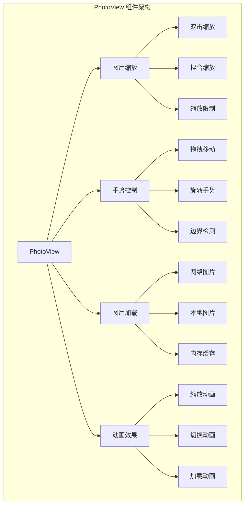
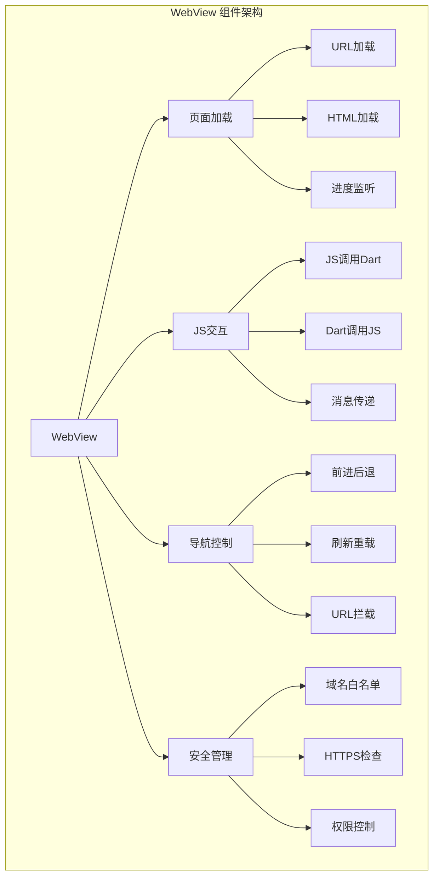

# PhotoView 和 WebView 第三方控件详解

本文档详细介绍 PhotoView 图片查看器和 WebView 网页视图控件的使用方法、JS交互处理和常见问题解决方案。

## 📋 目录

- [PhotoView 图片查看器](#photoview-图片查看器)
- [WebView 网页视图](#webview-网页视图)
- [JS 交互处理](#js-交互处理)
- [常见问题解决方案](#常见问题解决方案)
- [性能优化](#性能优化)
- [最佳实践](#最佳实践)

## PhotoView 图片查看器

### 架构图



### 基础使用

#### 依赖配置

```yaml
# pubspec.yaml
dependencies:
  photo_view: ^0.14.0
  photo_view_gallery: ^2.0.0
  cached_network_image: ^3.3.0
```

#### 单张图片查看

```dart
import 'package:photo_view/photo_view.dart';
import 'package:cached_network_image/cached_network_image.dart';

class SinglePhotoView extends StatelessWidget {
  final String imageUrl;
  final String? heroTag;
  
  const SinglePhotoView({
    Key? key,
    required this.imageUrl,
    this.heroTag,
  }) : super(key: key);
  
  @override
  Widget build(BuildContext context) {
    return Scaffold(
      backgroundColor: Colors.black,
      appBar: AppBar(
        backgroundColor: Colors.transparent,
        elevation: 0,
        leading: IconButton(
          icon: const Icon(Icons.close, color: Colors.white),
          onPressed: () => Navigator.pop(context),
        ),
        actions: [
          IconButton(
            icon: const Icon(Icons.download, color: Colors.white),
            onPressed: () => _downloadImage(),
          ),
          IconButton(
            icon: const Icon(Icons.share, color: Colors.white),
            onPressed: () => _shareImage(),
          ),
        ],
      ),
      body: PhotoView(
        imageProvider: CachedNetworkImageProvider(imageUrl),
        heroAttributes: heroTag != null 
            ? PhotoViewHeroAttributes(tag: heroTag!) 
            : null,
        minScale: PhotoViewComputedScale.contained,
        maxScale: PhotoViewComputedScale.covered * 3.0,
        initialScale: PhotoViewComputedScale.contained,
        backgroundDecoration: const BoxDecoration(
          color: Colors.black,
        ),
        loadingBuilder: (context, event) => Center(
          child: CircularProgressIndicator(
            value: event == null 
                ? 0 
                : event.cumulativeBytesLoaded / (event.expectedTotalBytes ?? 1),
          ),
        ),
        errorBuilder: (context, error, stackTrace) => const Center(
          child: Column(
            mainAxisAlignment: MainAxisAlignment.center,
            children: [
              Icon(Icons.error, color: Colors.white, size: 64),
              SizedBox(height: 16),
              Text(
                '图片加载失败',
                style: TextStyle(color: Colors.white),
              ),
            ],
          ),
        ),
      ),
    );
  }
  
  void _downloadImage() {
    // 实现图片下载逻辑
    print('下载图片: $imageUrl');
  }
  
  void _shareImage() {
    // 实现图片分享逻辑
    print('分享图片: $imageUrl');
  }
}
```

#### 图片画廊

```dart
import 'package:photo_view/photo_view_gallery.dart';

class PhotoGallery extends StatefulWidget {
  final List<String> imageUrls;
  final int initialIndex;
  
  const PhotoGallery({
    Key? key,
    required this.imageUrls,
    this.initialIndex = 0,
  }) : super(key: key);
  
  @override
  State<PhotoGallery> createState() => _PhotoGalleryState();
}

class _PhotoGalleryState extends State<PhotoGallery> {
  late PageController _pageController;
  late int _currentIndex;
  
  @override
  void initState() {
    super.initState();
    _currentIndex = widget.initialIndex;
    _pageController = PageController(initialPage: widget.initialIndex);
  }
  
  @override
  void dispose() {
    _pageController.dispose();
    super.dispose();
  }
  
  @override
  Widget build(BuildContext context) {
    return Scaffold(
      backgroundColor: Colors.black,
      appBar: AppBar(
        backgroundColor: Colors.transparent,
        elevation: 0,
        title: Text(
          '${_currentIndex + 1} / ${widget.imageUrls.length}',
          style: const TextStyle(color: Colors.white),
        ),
        leading: IconButton(
          icon: const Icon(Icons.close, color: Colors.white),
          onPressed: () => Navigator.pop(context),
        ),
        actions: [
          IconButton(
            icon: const Icon(Icons.download, color: Colors.white),
            onPressed: () => _downloadCurrentImage(),
          ),
        ],
      ),
      body: Stack(
        children: [
          PhotoViewGallery.builder(
            scrollPhysics: const BouncingScrollPhysics(),
            builder: (BuildContext context, int index) {
              return PhotoViewGalleryPageOptions(
                imageProvider: CachedNetworkImageProvider(
                  widget.imageUrls[index],
                ),
                initialScale: PhotoViewComputedScale.contained,
                minScale: PhotoViewComputedScale.contained,
                maxScale: PhotoViewComputedScale.covered * 3.0,
                heroAttributes: PhotoViewHeroAttributes(
                  tag: 'gallery_${widget.imageUrls[index]}',
                ),
              );
            },
            itemCount: widget.imageUrls.length,
            loadingBuilder: (context, event) => Center(
              child: CircularProgressIndicator(
                value: event == null
                    ? 0
                    : event.cumulativeBytesLoaded / 
                      (event.expectedTotalBytes ?? 1),
              ),
            ),
            backgroundDecoration: const BoxDecoration(
              color: Colors.black,
            ),
            pageController: _pageController,
            onPageChanged: (index) {
              setState(() {
                _currentIndex = index;
              });
            },
          ),
          
          // 底部缩略图
          Positioned(
            bottom: 20,
            left: 0,
            right: 0,
            child: _buildThumbnailBar(),
          ),
        ],
      ),
    );
  }
  
  Widget _buildThumbnailBar() {
    return Container(
      height: 80,
      child: ListView.builder(
        scrollDirection: Axis.horizontal,
        itemCount: widget.imageUrls.length,
        itemBuilder: (context, index) {
          final isSelected = index == _currentIndex;
          return GestureDetector(
            onTap: () {
              _pageController.animateToPage(
                index,
                duration: const Duration(milliseconds: 300),
                curve: Curves.easeInOut,
              );
            },
            child: Container(
              width: 60,
              height: 60,
              margin: const EdgeInsets.symmetric(horizontal: 4),
              decoration: BoxDecoration(
                border: Border.all(
                  color: isSelected ? Colors.white : Colors.transparent,
                  width: 2,
                ),
                borderRadius: BorderRadius.circular(8),
              ),
              child: ClipRRect(
                borderRadius: BorderRadius.circular(6),
                child: CachedNetworkImage(
                  imageUrl: widget.imageUrls[index],
                  fit: BoxFit.cover,
                  placeholder: (context, url) => Container(
                    color: Colors.grey[800],
                    child: const Icon(
                      Icons.image,
                      color: Colors.white54,
                    ),
                  ),
                ),
              ),
            ),
          );
        },
      ),
    );
  }
  
  void _downloadCurrentImage() {
    final currentUrl = widget.imageUrls[_currentIndex];
    print('下载图片: $currentUrl');
  }
}
```

### 高级特性

#### 自定义手势控制

```dart
class CustomPhotoView extends StatefulWidget {
  final String imageUrl;
  
  const CustomPhotoView({Key? key, required this.imageUrl}) : super(key: key);
  
  @override
  State<CustomPhotoView> createState() => _CustomPhotoViewState();
}

class _CustomPhotoViewState extends State<CustomPhotoView> {
  late PhotoViewController _controller;
  double _scaleFactor = 1.0;
  
  @override
  void initState() {
    super.initState();
    _controller = PhotoViewController();
  }
  
  @override
  Widget build(BuildContext context) {
    return Scaffold(
      backgroundColor: Colors.black,
      body: Stack(
        children: [
          PhotoView(
            imageProvider: CachedNetworkImageProvider(widget.imageUrl),
            controller: _controller,
            onScaleEnd: (context, details, controllerValue) {
              setState(() {
                _scaleFactor = controllerValue.scale ?? 1.0;
              });
            },
            customChild: _buildCustomOverlay(),
          ),
          
          // 缩放控制按钮
          Positioned(
            bottom: 100,
            right: 20,
            child: Column(
              children: [
                FloatingActionButton(
                  mini: true,
                  onPressed: _zoomIn,
                  child: const Icon(Icons.zoom_in),
                ),
                const SizedBox(height: 8),
                FloatingActionButton(
                  mini: true,
                  onPressed: _zoomOut,
                  child: const Icon(Icons.zoom_out),
                ),
                const SizedBox(height: 8),
                FloatingActionButton(
                  mini: true,
                  onPressed: _resetZoom,
                  child: const Icon(Icons.center_focus_strong),
                ),
              ],
            ),
          ),
          
          // 缩放信息显示
          Positioned(
            top: 100,
            left: 20,
            child: Container(
              padding: const EdgeInsets.all(8),
              decoration: BoxDecoration(
                color: Colors.black54,
                borderRadius: BorderRadius.circular(4),
              ),
              child: Text(
                '缩放: ${_scaleFactor.toStringAsFixed(1)}x',
                style: const TextStyle(color: Colors.white),
              ),
            ),
          ),
        ],
      ),
    );
  }
  
  Widget? _buildCustomOverlay() {
    // 可以返回自定义的覆盖层组件
    return null;
  }
  
  void _zoomIn() {
    final currentScale = _controller.scale ?? 1.0;
    _controller.scale = (currentScale * 1.2).clamp(0.5, 5.0);
  }
  
  void _zoomOut() {
    final currentScale = _controller.scale ?? 1.0;
    _controller.scale = (currentScale / 1.2).clamp(0.5, 5.0);
  }
  
  void _resetZoom() {
    _controller.reset();
  }
}
```

## WebView 网页视图

### 架构图



### 基础使用

#### 依赖配置

```yaml
# pubspec.yaml
dependencies:
  webview_flutter: ^4.4.2
  webview_flutter_android: ^3.12.1
  webview_flutter_wkwebview: ^3.9.4
```

#### 基础 WebView

```dart
import 'package:webview_flutter/webview_flutter.dart';

class BasicWebView extends StatefulWidget {
  final String initialUrl;
  final String? title;
  
  const BasicWebView({
    Key? key,
    required this.initialUrl,
    this.title,
  }) : super(key: key);
  
  @override
  State<BasicWebView> createState() => _BasicWebViewState();
}

class _BasicWebViewState extends State<BasicWebView> {
  late final WebViewController _controller;
  bool _isLoading = true;
  String _currentUrl = '';
  String _pageTitle = '';
  
  @override
  void initState() {
    super.initState();
    _initializeWebView();
  }
  
  void _initializeWebView() {
    _controller = WebViewController()
      ..setJavaScriptMode(JavaScriptMode.unrestricted)
      ..setBackgroundColor(const Color(0x00000000))
      ..setNavigationDelegate(
        NavigationDelegate(
          onProgress: (int progress) {
            // 更新加载进度
            setState(() {
              _isLoading = progress < 100;
            });
          },
          onPageStarted: (String url) {
            setState(() {
              _currentUrl = url;
              _isLoading = true;
            });
          },
          onPageFinished: (String url) {
            setState(() {
              _currentUrl = url;
              _isLoading = false;
            });
            _updatePageTitle();
          },
          onWebResourceError: (WebResourceError error) {
            _showErrorDialog(error.description);
          },
          onNavigationRequest: (NavigationRequest request) {
            // URL 拦截处理
            if (_shouldBlockNavigation(request.url)) {
              return NavigationDecision.prevent;
            }
            return NavigationDecision.navigate;
          },
        ),
      )
      ..loadRequest(Uri.parse(widget.initialUrl));
  }
  
  @override
  Widget build(BuildContext context) {
    return Scaffold(
      appBar: AppBar(
        title: Text(widget.title ?? _pageTitle),
        actions: [
          IconButton(
            icon: const Icon(Icons.refresh),
            onPressed: () => _controller.reload(),
          ),
          PopupMenuButton<String>(
            onSelected: _handleMenuAction,
            itemBuilder: (context) => [
              const PopupMenuItem(
                value: 'copy_url',
                child: Text('复制链接'),
              ),
              const PopupMenuItem(
                value: 'open_browser',
                child: Text('在浏览器中打开'),
              ),
              const PopupMenuItem(
                value: 'share',
                child: Text('分享'),
              ),
            ],
          ),
        ],
      ),
      body: Stack(
        children: [
          WebViewWidget(controller: _controller),
          if (_isLoading)
            const Center(
              child: CircularProgressIndicator(),
            ),
        ],
      ),
      bottomNavigationBar: _buildNavigationBar(),
    );
  }
  
  Widget _buildNavigationBar() {
    return Container(
      height: 50,
      decoration: BoxDecoration(
        color: Theme.of(context).scaffoldBackgroundColor,
        border: Border(
          top: BorderSide(
            color: Colors.grey.shade300,
            width: 0.5,
          ),
        ),
      ),
      child: Row(
        mainAxisAlignment: MainAxisAlignment.spaceEvenly,
        children: [
          IconButton(
            icon: const Icon(Icons.arrow_back),
            onPressed: () async {
              if (await _controller.canGoBack()) {
                await _controller.goBack();
              }
            },
          ),
          IconButton(
            icon: const Icon(Icons.arrow_forward),
            onPressed: () async {
              if (await _controller.canGoForward()) {
                await _controller.goForward();
              }
            },
          ),
          IconButton(
            icon: const Icon(Icons.home),
            onPressed: () {
              _controller.loadRequest(Uri.parse(widget.initialUrl));
            },
          ),
        ],
      ),
    );
  }
  
  bool _shouldBlockNavigation(String url) {
    // 实现 URL 过滤逻辑
    final blockedDomains = ['malicious-site.com', 'spam-site.com'];
    return blockedDomains.any((domain) => url.contains(domain));
  }
  
  void _updatePageTitle() async {
    final title = await _controller.getTitle();
    if (title != null && title.isNotEmpty) {
      setState(() {
        _pageTitle = title;
      });
    }
  }
  
  void _handleMenuAction(String action) {
    switch (action) {
      case 'copy_url':
        _copyCurrentUrl();
        break;
      case 'open_browser':
        _openInBrowser();
        break;
      case 'share':
        _shareCurrentUrl();
        break;
    }
  }
  
  void _copyCurrentUrl() {
    // 实现复制 URL 逻辑
    print('复制 URL: $_currentUrl');
  }
  
  void _openInBrowser() {
    // 实现在外部浏览器打开逻辑
    print('在浏览器中打开: $_currentUrl');
  }
  
  void _shareCurrentUrl() {
    // 实现分享逻辑
    print('分享 URL: $_currentUrl');
  }
  
  void _showErrorDialog(String message) {
    showDialog(
      context: context,
      builder: (context) => AlertDialog(
        title: const Text('加载错误'),
        content: Text(message),
        actions: [
          TextButton(
            onPressed: () => Navigator.pop(context),
            child: const Text('确定'),
          ),
        ],
      ),
    );
  }
}
```

## JS 交互处理

### Dart 调用 JavaScript

```dart
class JSInteractionWebView extends StatefulWidget {
  @override
  State<JSInteractionWebView> createState() => _JSInteractionWebViewState();
}

class _JSInteractionWebViewState extends State<JSInteractionWebView> {
  late final WebViewController _controller;
  String _jsResult = '';
  
  @override
  void initState() {
    super.initState();
    _initializeWebView();
  }
  
  void _initializeWebView() {
    _controller = WebViewController()
      ..setJavaScriptMode(JavaScriptMode.unrestricted)
      ..addJavaScriptChannel(
        'FlutterChannel',
        onMessageReceived: (JavaScriptMessage message) {
          // 接收来自 JS 的消息
          setState(() {
            _jsResult = message.message;
          });
          _handleJSMessage(message.message);
        },
      )
      ..loadHtmlString(_getTestHTML());
  }
  
  @override
  Widget build(BuildContext context) {
    return Scaffold(
      appBar: AppBar(
        title: const Text('JS 交互示例'),
      ),
      body: Column(
        children: [
          // 控制按钮
          Padding(
            padding: const EdgeInsets.all(16),
            child: Wrap(
              spacing: 8,
              children: [
                ElevatedButton(
                  onPressed: _callJSFunction,
                  child: const Text('调用 JS 函数'),
                ),
                ElevatedButton(
                  onPressed: _getPageInfo,
                  child: const Text('获取页面信息'),
                ),
                ElevatedButton(
                  onPressed: _changePageStyle,
                  child: const Text('修改页面样式'),
                ),
                ElevatedButton(
                  onPressed: _injectScript,
                  child: const Text('注入脚本'),
                ),
              ],
            ),
          ),
          
          // 结果显示
          Container(
            width: double.infinity,
            padding: const EdgeInsets.all(16),
            margin: const EdgeInsets.symmetric(horizontal: 16),
            decoration: BoxDecoration(
              color: Colors.grey[100],
              borderRadius: BorderRadius.circular(8),
            ),
            child: Text(
              'JS 返回结果: $_jsResult',
              style: const TextStyle(fontFamily: 'monospace'),
            ),
          ),
          
          // WebView
          Expanded(
            child: WebViewWidget(controller: _controller),
          ),
        ],
      ),
    );
  }
  
  String _getTestHTML() {
    return '''
<!DOCTYPE html>
<html>
<head>
    <meta charset="UTF-8">
    <meta name="viewport" content="width=device-width, initial-scale=1.0">
    <title>JS 交互测试</title>
    <style>
        body {
            font-family: Arial, sans-serif;
            padding: 20px;
            background-color: #f5f5f5;
        }
        .container {
            background: white;
            padding: 20px;
            border-radius: 8px;
            box-shadow: 0 2px 4px rgba(0,0,0,0.1);
        }
        .button {
            background: #007AFF;
            color: white;
            border: none;
            padding: 10px 20px;
            border-radius: 5px;
            margin: 5px;
            cursor: pointer;
        }
        .result {
            background: #e8f4fd;
            padding: 10px;
            border-radius: 5px;
            margin: 10px 0;
        }
    </style>
</head>
<body>
    <div class="container">
        <h2 id="title">JS 交互测试页面</h2>
        <p id="content">这是一个用于测试 Flutter 与 JavaScript 交互的页面。</p>
        
        <button class="button" onclick="sendMessageToFlutter()">发送消息到 Flutter</button>
        <button class="button" onclick="showAlert()">显示警告</button>
        <button class="button" onclick="updateContent()">更新内容</button>
        
        <div id="result" class="result">
            结果将显示在这里...
        </div>
    </div>
    
    <script>
        // 发送消息到 Flutter
        function sendMessageToFlutter() {
            const message = {
                type: 'user_action',
                action: 'button_click',
                timestamp: new Date().toISOString(),
                data: 'Hello from JavaScript!'
            };
            FlutterChannel.postMessage(JSON.stringify(message));
        }
        
        // 显示警告
        function showAlert() {
            alert('这是来自 JavaScript 的警告!');
        }
        
        // 更新页面内容
        function updateContent() {
            document.getElementById('result').innerHTML = 
                '内容已更新: ' + new Date().toLocaleString();
        }
        
        // Flutter 调用的函数
        function flutterCallJS(message) {
            document.getElementById('result').innerHTML = 
                'Flutter 调用: ' + message;
            return 'JS 函数执行成功: ' + message;
        }
        
        // 获取页面信息
        function getPageInfo() {
            return {
                title: document.title,
                url: window.location.href,
                userAgent: navigator.userAgent,
                timestamp: new Date().toISOString()
            };
        }
        
        // 修改页面样式
        function changeStyle(color) {
            document.body.style.backgroundColor = color;
            return 'Background color changed to: ' + color;
        }
        
        // 页面加载完成后的初始化
        window.onload = function() {
            console.log('页面加载完成');
            FlutterChannel.postMessage(JSON.stringify({
                type: 'page_loaded',
                message: '页面已加载完成'
            }));
        };
    </script>
</body>
</html>
    ''';
  }
  
  // Dart 调用 JavaScript 函数
  void _callJSFunction() async {
    try {
      final result = await _controller.runJavaScriptReturningResult(
        "flutterCallJS('Hello from Flutter!')"
      );
      setState(() {
        _jsResult = result.toString();
      });
    } catch (e) {
      setState(() {
        _jsResult = 'Error: $e';
      });
    }
  }
  
  // 获取页面信息
  void _getPageInfo() async {
    try {
      final result = await _controller.runJavaScriptReturningResult(
        'JSON.stringify(getPageInfo())'
      );
      setState(() {
        _jsResult = result.toString();
      });
    } catch (e) {
      setState(() {
        _jsResult = 'Error: $e';
      });
    }
  }
  
  // 修改页面样式
  void _changePageStyle() async {
    final colors = ['#ffebee', '#e8f5e8', '#fff3e0', '#f3e5f5'];
    final randomColor = colors[DateTime.now().millisecond % colors.length];
    
    try {
      final result = await _controller.runJavaScriptReturningResult(
        "changeStyle('$randomColor')"
      );
      setState(() {
        _jsResult = result.toString();
      });
    } catch (e) {
      setState(() {
        _jsResult = 'Error: $e';
      });
    }
  }
  
  // 注入脚本
  void _injectScript() async {
    const script = '''
      var newElement = document.createElement('div');
      newElement.innerHTML = '<p style="color: red; font-weight: bold;">这是通过 Flutter 注入的内容!</p>';
      document.querySelector('.container').appendChild(newElement);
      'Script injected successfully';
    ''';
    
    try {
      final result = await _controller.runJavaScriptReturningResult(script);
      setState(() {
        _jsResult = result.toString();
      });
    } catch (e) {
      setState(() {
        _jsResult = 'Error: $e';
      });
    }
  }
  
  // 处理来自 JS 的消息
  void _handleJSMessage(String message) {
    try {
      final data = jsonDecode(message);
      final type = data['type'];
      
      switch (type) {
        case 'user_action':
          _handleUserAction(data);
          break;
        case 'page_loaded':
          _handlePageLoaded(data);
          break;
        default:
          print('Unknown message type: $type');
      }
    } catch (e) {
      print('Error parsing JS message: $e');
    }
  }
  
  void _handleUserAction(Map<String, dynamic> data) {
    final action = data['action'];
    final actionData = data['data'];
    
    ScaffoldMessenger.of(context).showSnackBar(
      SnackBar(
        content: Text('用户操作: $action - $actionData'),
        duration: const Duration(seconds: 2),
      ),
    );
  }
  
  void _handlePageLoaded(Map<String, dynamic> data) {
    print('页面加载完成: ${data['message']}');
  }
}
```

### JavaScript 调用 Dart

```dart
class JSCallDartExample extends StatefulWidget {
  @override
  State<JSCallDartExample> createState() => _JSCallDartExampleState();
}

class _JSCallDartExampleState extends State<JSCallDartExample> {
  late final WebViewController _controller;
  final List<String> _messages = [];
  
  @override
  void initState() {
    super.initState();
    _initializeWebView();
  }
  
  void _initializeWebView() {
    _controller = WebViewController()
      ..setJavaScriptMode(JavaScriptMode.unrestricted)
      // 注册多个 JavaScript 通道
      ..addJavaScriptChannel(
        'NavigationChannel',
        onMessageReceived: (message) => _handleNavigation(message.message),
      )
      ..addJavaScriptChannel(
        'DataChannel',
        onMessageReceived: (message) => _handleDataRequest(message.message),
      )
      ..addJavaScriptChannel(
        'UIChannel',
        onMessageReceived: (message) => _handleUIAction(message.message),
      )
      ..loadHtmlString(_getAdvancedHTML());
  }
  
  @override
  Widget build(BuildContext context) {
    return Scaffold(
      appBar: AppBar(
        title: const Text('JS 调用 Dart 示例'),
      ),
      body: Column(
        children: [
          // 消息列表
          Container(
            height: 150,
            padding: const EdgeInsets.all(16),
            child: Column(
              crossAxisAlignment: CrossAxisAlignment.start,
              children: [
                const Text(
                  '来自 JS 的消息:',
                  style: TextStyle(fontWeight: FontWeight.bold),
                ),
                const SizedBox(height: 8),
                Expanded(
                  child: ListView.builder(
                    itemCount: _messages.length,
                    itemBuilder: (context, index) {
                      return Text(
                        '${_messages.length - index}: ${_messages[_messages.length - 1 - index]}',
                        style: const TextStyle(fontSize: 12),
                      );
                    },
                  ),
                ),
              ],
            ),
          ),
          
          const Divider(),
          
          // WebView
          Expanded(
            child: WebViewWidget(controller: _controller),
          ),
        ],
      ),
    );
  }
  
  String _getAdvancedHTML() {
    return '''
<!DOCTYPE html>
<html>
<head>
    <meta charset="UTF-8">
    <meta name="viewport" content="width=device-width, initial-scale=1.0">
    <title>JS 调用 Dart 示例</title>
    <style>
        body {
            font-family: Arial, sans-serif;
            padding: 20px;
            background: linear-gradient(135deg, #667eea 0%, #764ba2 100%);
            color: white;
        }
        .card {
            background: rgba(255, 255, 255, 0.1);
            backdrop-filter: blur(10px);
            border-radius: 15px;
            padding: 20px;
            margin: 10px 0;
            border: 1px solid rgba(255, 255, 255, 0.2);
        }
        .button {
            background: rgba(255, 255, 255, 0.2);
            color: white;
            border: 1px solid rgba(255, 255, 255, 0.3);
            padding: 12px 24px;
            border-radius: 25px;
            margin: 8px;
            cursor: pointer;
            transition: all 0.3s ease;
        }
        .button:hover {
            background: rgba(255, 255, 255, 0.3);
            transform: translateY(-2px);
        }
        .input {
            background: rgba(255, 255, 255, 0.1);
            border: 1px solid rgba(255, 255, 255, 0.3);
            color: white;
            padding: 10px;
            border-radius: 5px;
            margin: 5px;
            width: 200px;
        }
        .input::placeholder {
            color: rgba(255, 255, 255, 0.7);
        }
    </style>
</head>
<body>
    <div class="card">
        <h2>🚀 JS 调用 Dart 功能演示</h2>
        <p>点击下面的按钮来测试不同的功能</p>
    </div>
    
    <div class="card">
        <h3>📱 导航功能</h3>
        <button class="button" onclick="requestNavigation('home')">返回首页</button>
        <button class="button" onclick="requestNavigation('profile')">用户资料</button>
        <button class="button" onclick="requestNavigation('settings')">设置页面</button>
    </div>
    
    <div class="card">
        <h3>📊 数据请求</h3>
        <button class="button" onclick="requestUserData()">获取用户数据</button>
        <button class="button" onclick="requestAppInfo()">获取应用信息</button>
        <button class="button" onclick="requestDeviceInfo()">获取设备信息</button>
    </div>
    
    <div class="card">
        <h3>🎨 UI 操作</h3>
        <button class="button" onclick="showToast('Hello from WebView!')">显示 Toast</button>
        <button class="button" onclick="showDialog('这是来自 WebView 的对话框')">显示对话框</button>
        <button class="button" onclick="changeTheme()">切换主题</button>
    </div>
    
    <div class="card">
        <h3>💾 数据操作</h3>
        <input type="text" class="input" id="dataInput" placeholder="输入要保存的数据">
        <button class="button" onclick="saveData()">保存数据</button>
        <button class="button" onclick="loadData()">加载数据</button>
    </div>
    
    <script>
        // 导航请求
        function requestNavigation(page) {
            NavigationChannel.postMessage(JSON.stringify({
                action: 'navigate',
                page: page,
                timestamp: new Date().toISOString()
            }));
        }
        
        // 数据请求
        function requestUserData() {
            DataChannel.postMessage(JSON.stringify({
                action: 'get_user_data',
                timestamp: new Date().toISOString()
            }));
        }
        
        function requestAppInfo() {
            DataChannel.postMessage(JSON.stringify({
                action: 'get_app_info',
                timestamp: new Date().toISOString()
            }));
        }
        
        function requestDeviceInfo() {
            DataChannel.postMessage(JSON.stringify({
                action: 'get_device_info',
                timestamp: new Date().toISOString()
            }));
        }
        
        // UI 操作
        function showToast(message) {
            UIChannel.postMessage(JSON.stringify({
                action: 'show_toast',
                message: message,
                timestamp: new Date().toISOString()
            }));
        }
        
        function showDialog(message) {
            UIChannel.postMessage(JSON.stringify({
                action: 'show_dialog',
                message: message,
                timestamp: new Date().toISOString()
            }));
        }
        
        function changeTheme() {
            UIChannel.postMessage(JSON.stringify({
                action: 'change_theme',
                timestamp: new Date().toISOString()
            }));
        }
        
        // 数据操作
        function saveData() {
            const data = document.getElementById('dataInput').value;
            if (data.trim()) {
                DataChannel.postMessage(JSON.stringify({
                    action: 'save_data',
                    data: data,
                    timestamp: new Date().toISOString()
                }));
            }
        }
        
        function loadData() {
            DataChannel.postMessage(JSON.stringify({
                action: 'load_data',
                timestamp: new Date().toISOString()
            }));
        }
        
        // 接收来自 Dart 的数据
        function receiveDataFromDart(data) {
            console.log('Received data from Dart:', data);
            // 可以在这里更新页面内容
        }
    </script>
</body>
</html>
    ''';
  }
  
  // 处理导航请求
  void _handleNavigation(String message) {
    try {
      final data = jsonDecode(message);
      final action = data['action'];
      final page = data['page'];
      
      setState(() {
        _messages.add('导航请求: $page');
      });
      
      // 实际的导航逻辑
      switch (page) {
        case 'home':
          _navigateToPage('首页');
          break;
        case 'profile':
          _navigateToPage('用户资料');
          break;
        case 'settings':
          _navigateToPage('设置');
          break;
      }
    } catch (e) {
      print('Error handling navigation: $e');
    }
  }
  
  // 处理数据请求
  void _handleDataRequest(String message) {
    try {
      final data = jsonDecode(message);
      final action = data['action'];
      
      setState(() {
        _messages.add('数据请求: $action');
      });
      
      switch (action) {
        case 'get_user_data':
          _sendUserDataToJS();
          break;
        case 'get_app_info':
          _sendAppInfoToJS();
          break;
        case 'get_device_info':
          _sendDeviceInfoToJS();
          break;
        case 'save_data':
          _saveData(data['data']);
          break;
        case 'load_data':
          _loadData();
          break;
      }
    } catch (e) {
      print('Error handling data request: $e');
    }
  }
  
  // 处理 UI 操作
  void _handleUIAction(String message) {
    try {
      final data = jsonDecode(message);
      final action = data['action'];
      
      setState(() {
        _messages.add('UI 操作: $action');
      });
      
      switch (action) {
        case 'show_toast':
          _showToast(data['message']);
          break;
        case 'show_dialog':
          _showDialog(data['message']);
          break;
        case 'change_theme':
          _changeTheme();
          break;
      }
    } catch (e) {
      print('Error handling UI action: $e');
    }
  }
  
  void _navigateToPage(String pageName) {
    ScaffoldMessenger.of(context).showSnackBar(
      SnackBar(
        content: Text('导航到: $pageName'),
        duration: const Duration(seconds: 2),
      ),
    );
  }
  
  void _sendUserDataToJS() {
    final userData = {
      'id': '12345',
      'name': '张三',
      'email': 'zhangsan@example.com',
      'avatar': 'https://example.com/avatar.jpg',
    };
    
    _controller.runJavaScript(
      "receiveDataFromDart(${jsonEncode(userData)})"
    );
  }
  
  void _sendAppInfoToJS() {
    final appInfo = {
      'name': 'Flutter WebView Demo',
      'version': '1.0.0',
      'build': '100',
    };
    
    _controller.runJavaScript(
      "receiveDataFromDart(${jsonEncode(appInfo)})"
    );
  }
  
  void _sendDeviceInfoToJS() {
    final deviceInfo = {
      'platform': 'iOS',
      'model': 'iPhone 14 Pro',
      'os_version': '16.0',
    };
    
    _controller.runJavaScript(
      "receiveDataFromDart(${jsonEncode(deviceInfo)})"
    );
  }
  
  void _saveData(String data) {
    // 实现数据保存逻辑
    print('保存数据: $data');
    _showToast('数据已保存');
  }
  
  void _loadData() {
    // 实现数据加载逻辑
    final loadedData = '这是从本地加载的数据';
    _controller.runJavaScript(
      "document.getElementById('dataInput').value = '$loadedData'"
    );
    _showToast('数据已加载');
  }
  
  void _showToast(String message) {
    ScaffoldMessenger.of(context).showSnackBar(
      SnackBar(
        content: Text(message),
        duration: const Duration(seconds: 2),
      ),
    );
  }
  
  void _showDialog(String message) {
    showDialog(
      context: context,
      builder: (context) => AlertDialog(
        title: const Text('来自 WebView'),
        content: Text(message),
        actions: [
          TextButton(
            onPressed: () => Navigator.pop(context),
            child: const Text('确定'),
          ),
        ],
      ),
    );
  }
  
  void _changeTheme() {
    // 实现主题切换逻辑
    _showToast('主题已切换');
  }
}
```

## 常见问题解决方案

### 1. WebView 加载问题

```dart
class WebViewTroubleshooting {
  // 网络连接检查
  static Future<bool> checkNetworkConnection() async {
    try {
      final result = await InternetAddress.lookup('google.com');
      return result.isNotEmpty && result[0].rawAddress.isNotEmpty;
    } catch (e) {
      return false;
    }
  }
  
  // SSL 证书问题处理
  static void handleSSLError(WebViewController controller) {
    controller.setNavigationDelegate(
      NavigationDelegate(
        onWebResourceError: (WebResourceError error) {
          if (error.description.contains('SSL') || 
              error.description.contains('certificate')) {
            // 处理 SSL 证书错误
            _showSSLErrorDialog();
          }
        },
      ),
    );
  }
  
  static void _showSSLErrorDialog() {
    // 显示 SSL 错误对话框
  }
  
  // 内存泄漏防护
  static void preventMemoryLeaks(WebViewController controller) {
    // 清理缓存
    controller.clearCache();
    
    // 清理本地存储
    controller.clearLocalStorage();
  }
  
  // 性能监控
  static void monitorPerformance(WebViewController controller) {
    controller.setNavigationDelegate(
      NavigationDelegate(
        onPageStarted: (url) {
          final startTime = DateTime.now();
          print('页面开始加载: $url at $startTime');
        },
        onPageFinished: (url) {
          final endTime = DateTime.now();
          print('页面加载完成: $url at $endTime');
        },
      ),
    );
  }
}
```

### 2. PhotoView 性能优化

```dart
class PhotoViewOptimization {
  // 图片预加载
  static void preloadImages(List<String> imageUrls) {
    for (final url in imageUrls) {
      precacheImage(
        CachedNetworkImageProvider(url),
        navigatorKey.currentContext!,
      );
    }
  }
  
  // 内存管理
  static void optimizeMemoryUsage() {
    // 设置图片缓存大小
    PaintingBinding.instance.imageCache.maximumSize = 100;
    PaintingBinding.instance.imageCache.maximumSizeBytes = 50 << 20; // 50MB
  }
  
  // 懒加载实现
  static Widget buildLazyPhotoGallery(List<String> imageUrls) {
    return PageView.builder(
      itemCount: imageUrls.length,
      itemBuilder: (context, index) {
        return PhotoView(
          imageProvider: CachedNetworkImageProvider(
            imageUrls[index],
            cacheManager: CustomCacheManager(),
          ),
          loadingBuilder: (context, event) {
            return const Center(
              child: CircularProgressIndicator(),
            );
          },
        );
      },
    );
  }
}

class CustomCacheManager extends CacheManager {
  static const key = 'photoViewCache';
  
  static CustomCacheManager? _instance;
  
  factory CustomCacheManager() {
    return _instance ??= CustomCacheManager._();
  }
  
  CustomCacheManager._()
      : super(
          Config(
            key,
            stalePeriod: const Duration(days: 7),
            maxNrOfCacheObjects: 200,
            repo: JsonCacheInfoRepository(databaseName: key),
            fileService: HttpFileService(),
          ),
        );
}
```

## 性能优化

### 1. WebView 性能优化

```dart
class WebViewPerformanceOptimizer {
  static WebViewController createOptimizedWebView() {
    return WebViewController()
      ..setJavaScriptMode(JavaScriptMode.unrestricted)
      ..setBackgroundColor(const Color(0x00000000))
      // 启用硬件加速
      ..enableZoom(false)
      // 优化内存使用
      ..setNavigationDelegate(
        NavigationDelegate(
          onPageFinished: (url) {
            // 页面加载完成后的优化
            _optimizePagePerformance();
          },
        ),
      );
  }
  
  static void _optimizePagePerformance() {
    // 移除不必要的元素
    const script = '''
      // 移除广告
      var ads = document.querySelectorAll('[class*="ad"], [id*="ad"]');
      ads.forEach(function(ad) { ad.remove(); });
      
      // 优化图片加载
      var images = document.querySelectorAll('img');
      images.forEach(function(img) {
        img.loading = 'lazy';
      });
      
      // 移除不必要的脚本
      var scripts = document.querySelectorAll('script[src*="analytics"]');
      scripts.forEach(function(script) { script.remove(); });
    ''';
    
    // 注入优化脚本
  }
  
  // 缓存策略
  static void setupCacheStrategy(WebViewController controller) {
    // 设置缓存策略
    controller.setNavigationDelegate(
      NavigationDelegate(
        onNavigationRequest: (request) {
          // 检查缓存
          if (_isCached(request.url)) {
            return NavigationDecision.prevent;
          }
          return NavigationDecision.navigate;
        },
      ),
    );
  }
  
  static bool _isCached(String url) {
    // 实现缓存检查逻辑
    return false;
  }
}
```

### 2. PhotoView 性能优化

```dart
class PhotoViewPerformanceOptimizer {
  // 图片压缩
  static Future<Uint8List> compressImage(Uint8List imageData) async {
    final codec = await instantiateImageCodec(
      imageData,
      targetWidth: 1920,
      targetHeight: 1080,
    );
    final frame = await codec.getNextFrame();
    final data = await frame.image.toByteData(format: ImageByteFormat.png);
    return data!.buffer.asUint8List();
  }
  
  // 预加载策略
  static void preloadAdjacentImages(
    List<String> imageUrls,
    int currentIndex,
    BuildContext context,
  ) {
    final preloadRange = 2;
    final start = math.max(0, currentIndex - preloadRange);
    final end = math.min(imageUrls.length, currentIndex + preloadRange + 1);
    
    for (int i = start; i < end; i++) {
      if (i != currentIndex) {
        precacheImage(
          CachedNetworkImageProvider(imageUrls[i]),
          context,
        );
      }
    }
  }
  
  // 内存监控
  static void monitorMemoryUsage() {
    Timer.periodic(const Duration(seconds: 5), (timer) {
      final imageCache = PaintingBinding.instance.imageCache;
      print('图片缓存: ${imageCache.currentSize}/${imageCache.maximumSize}');
      print('内存使用: ${imageCache.currentSizeBytes}/${imageCache.maximumSizeBytes}');
      
      // 内存使用过高时清理缓存
      if (imageCache.currentSizeBytes > imageCache.maximumSizeBytes * 0.8) {
        imageCache.clear();
      }
    });
  }
}
```

## 最佳实践

### 1. PhotoView 最佳实践

```dart
class PhotoViewBestPractices {
  // 1. 合理的缓存策略
  static void setupImageCache() {
    PaintingBinding.instance.imageCache.maximumSize = 100;
    PaintingBinding.instance.imageCache.maximumSizeBytes = 50 << 20;
  }
  
  // 2. 错误处理
  static Widget buildRobustPhotoView(String imageUrl) {
    return PhotoView(
      imageProvider: CachedNetworkImageProvider(imageUrl),
      errorBuilder: (context, error, stackTrace) {
        return const Center(
          child: Column(
            mainAxisAlignment: MainAxisAlignment.center,
            children: [
              Icon(Icons.error, size: 64, color: Colors.grey),
              SizedBox(height: 16),
              Text('图片加载失败'),
              SizedBox(height: 8),
              Text('点击重试', style: TextStyle(color: Colors.blue)),
            ],
          ),
        );
      },
      loadingBuilder: (context, event) {
        return Center(
          child: CircularProgressIndicator(
            value: event?.expectedTotalBytes != null
                ? event!.cumulativeBytesLoaded / event.expectedTotalBytes!
                : null,
          ),
        );
      },
    );
  }
  
  // 3. 手势优化
  static PhotoViewGalleryPageOptions buildOptimizedGalleryPage(
    String imageUrl,
  ) {
    return PhotoViewGalleryPageOptions(
      imageProvider: CachedNetworkImageProvider(imageUrl),
      minScale: PhotoViewComputedScale.contained * 0.8,
      maxScale: PhotoViewComputedScale.covered * 2.0,
      initialScale: PhotoViewComputedScale.contained,
      heroAttributes: PhotoViewHeroAttributes(tag: imageUrl),
    );
  }
}
```

### 2. WebView 最佳实践

```dart
class WebViewBestPractices {
  // 1. 安全配置
  static WebViewController createSecureWebView() {
    return WebViewController()
      ..setJavaScriptMode(JavaScriptMode.unrestricted)
      ..setNavigationDelegate(
        NavigationDelegate(
          onNavigationRequest: (request) {
            // URL 白名单检查
            if (_isAllowedUrl(request.url)) {
              return NavigationDecision.navigate;
            }
            return NavigationDecision.prevent;
          },
        ),
      );
  }
  
  static bool _isAllowedUrl(String url) {
    final allowedDomains = [
      'https://example.com',
      'https://api.example.com',
    ];
    return allowedDomains.any((domain) => url.startsWith(domain));
  }
  
  // 2. 错误处理
  static void setupErrorHandling(WebViewController controller) {
    controller.setNavigationDelegate(
      NavigationDelegate(
        onWebResourceError: (error) {
          _handleWebViewError(error);
        },
      ),
    );
  }
  
  static void _handleWebViewError(WebResourceError error) {
    switch (error.errorType) {
      case WebResourceErrorType.hostLookup:
        // 网络连接问题
        break;
      case WebResourceErrorType.timeout:
        // 超时问题
        break;
      case WebResourceErrorType.unknown:
        // 未知错误
        break;
    }
  }
  
  // 3. 性能监控
  static void setupPerformanceMonitoring(WebViewController controller) {
    controller.setNavigationDelegate(
      NavigationDelegate(
        onProgress: (progress) {
          print('加载进度: $progress%');
        },
        onPageStarted: (url) {
          print('开始加载: $url');
        },
        onPageFinished: (url) {
          print('加载完成: $url');
        },
      ),
    );
  }
}
```

## 总结

PhotoView 和 WebView 是 Flutter 中重要的第三方控件：

### PhotoView 关键特性
1. **图片缩放** - 支持双击、捏合等手势缩放
2. **图片画廊** - 支持多图片浏览和切换
3. **Hero 动画** - 提供流畅的页面转场效果
4. **缓存管理** - 智能的图片缓存和内存管理
5. **自定义控制** - 灵活的手势和控制器配置

### WebView 关键特性
1. **网页渲染** - 完整的网页显示和交互
2. **JS 交互** - 双向的 JavaScript 和 Dart 通信
3. **导航控制** - 前进、后退、刷新等导航功能
4. **安全管理** - URL 过滤和权限控制
5. **性能优化** - 缓存策略和资源管理

### 最佳实践要点
1. **性能优化** - 合理的缓存策略和内存管理
2. **错误处理** - 完善的错误处理和用户反馈
3. **安全考虑** - URL 白名单和权限控制
4. **用户体验** - 流畅的加载动画和交互反馈
5. **资源管理** - 及时清理和释放资源

通过合理使用这些控件和优化技巧，可以创建出功能丰富、性能优秀的图片查看和网页浏览功能。

---

**相关文档：**
- [屏幕适配方案](./screen-adaptation.md)
- [国际化实现](./internationalization.md)
- [刷新控件使用](./refresh-widgets.md)