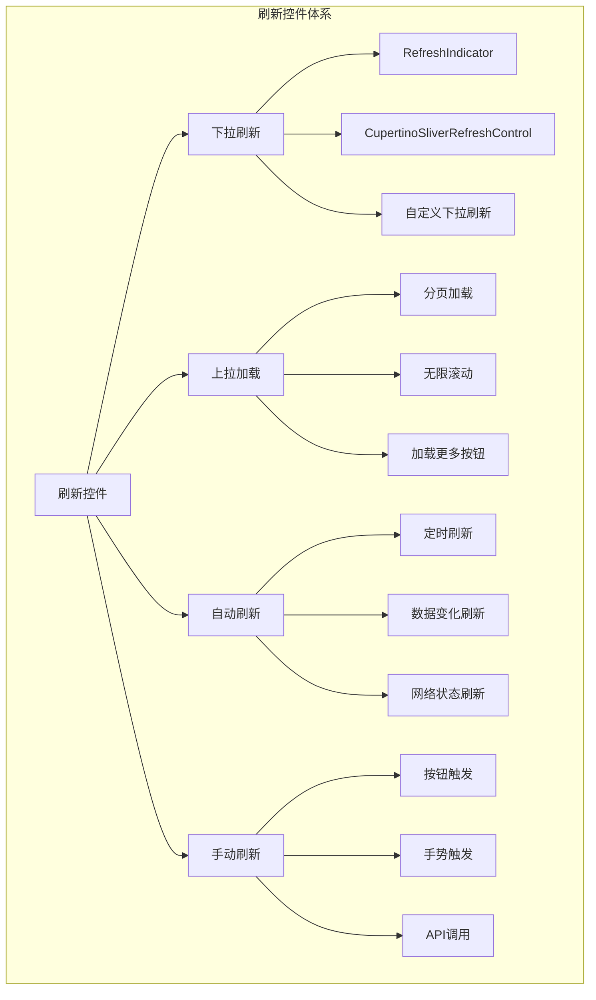

# Flutter 刷新控件使用详解

本文档详细介绍 Flutter 应用中各种刷新控件的使用方法，包括下拉刷新、上拉加载、自定义刷新指示器等。

## 📋 目录

- [刷新控件基础](#刷新控件基础)
- [RefreshIndicator 使用](#refreshindicator-使用)
- [第三方刷新控件](#第三方刷新控件)
- [自定义刷新指示器](#自定义刷新指示器)
- [实际应用案例](#实际应用案例)
- [最佳实践](#最佳实践)

## 刷新控件基础

### 架构图



### 基础概念

```dart
import 'package:flutter/material.dart';
import 'package:flutter/cupertino.dart';

// 刷新状态枚举
enum RefreshStatus {
  idle,        // 空闲状态
  pulling,     // 下拉中
  canRefresh,  // 可以刷新
  refreshing,  // 刷新中
  completed,   // 刷新完成
  failed,      // 刷新失败
}

// 加载状态枚举
enum LoadStatus {
  idle,        // 空闲状态
  loading,     // 加载中
  completed,   // 加载完成
  failed,      // 加载失败
  noMore,      // 没有更多数据
}

// 刷新控制器基类
abstract class RefreshController {
  RefreshStatus get refreshStatus;
  LoadStatus get loadStatus;
  
  Future<void> refresh();
  Future<void> loadMore();
  void reset();
}

// 数据源接口
abstract class DataSource<T> {
  Future<List<T>> loadData({int page = 1, int pageSize = 20});
  Future<List<T>> refreshData();
}

// 刷新配置
class RefreshConfig {
  final Duration refreshDuration;
  final Duration loadMoreDuration;
  final int pageSize;
  final bool enablePullDown;
  final bool enablePullUp;
  final bool enableAutoRefresh;
  
  const RefreshConfig({
    this.refreshDuration = const Duration(seconds: 2),
    this.loadMoreDuration = const Duration(seconds: 1),
    this.pageSize = 20,
    this.enablePullDown = true,
    this.enablePullUp = true,
    this.enableAutoRefresh = false,
  });
}
```

## RefreshIndicator 使用

### 基础用法

```dart
class BasicRefreshExample extends StatefulWidget {
  @override
  State<BasicRefreshExample> createState() => _BasicRefreshExampleState();
}

class _BasicRefreshExampleState extends State<BasicRefreshExample> {
  final List<String> _items = List.generate(20, (index) => 'Item ${index + 1}');
  bool _isRefreshing = false;
  
  @override
  Widget build(BuildContext context) {
    return Scaffold(
      appBar: AppBar(
        title: const Text('基础刷新示例'),
        actions: [
          IconButton(
            icon: const Icon(Icons.refresh),
            onPressed: _handleRefresh,
          ),
        ],
      ),
      body: RefreshIndicator(
        onRefresh: _handleRefresh,
        // 自定义刷新指示器颜色
        color: Colors.blue,
        backgroundColor: Colors.white,
        // 触发刷新的距离
        displacement: 40.0,
        // 刷新指示器的描边宽度
        strokeWidth: 2.0,
        child: ListView.builder(
          // 确保ListView可以滚动，即使内容不足一屏
          physics: const AlwaysScrollableScrollPhysics(),
          itemCount: _items.length,
          itemBuilder: (context, index) {
            return ListTile(
              leading: CircleAvatar(
                child: Text('${index + 1}'),
              ),
              title: Text(_items[index]),
              subtitle: Text('描述信息 ${index + 1}'),
              trailing: const Icon(Icons.arrow_forward_ios),
              onTap: () {
                ScaffoldMessenger.of(context).showSnackBar(
                  SnackBar(content: Text('点击了 ${_items[index]}')),
                );
              },
            );
          },
        ),
      ),
    );
  }
  
  Future<void> _handleRefresh() async {
    if (_isRefreshing) return;
    
    setState(() {
      _isRefreshing = true;
    });
    
    try {
      // 模拟网络请求
      await Future.delayed(const Duration(seconds: 2));
      
      // 更新数据
      setState(() {
        _items.clear();
        _items.addAll(
          List.generate(20, (index) => 'New Item ${index + 1}'),
        );
      });
      
      // 显示成功消息
      if (mounted) {
        ScaffoldMessenger.of(context).showSnackBar(
          const SnackBar(
            content: Text('刷新成功'),
            backgroundColor: Colors.green,
          ),
        );
      }
    } catch (e) {
      // 显示错误消息
      if (mounted) {
        ScaffoldMessenger.of(context).showSnackBar(
          SnackBar(
            content: Text('刷新失败: $e'),
            backgroundColor: Colors.red,
          ),
        );
      }
    } finally {
      if (mounted) {
        setState(() {
          _isRefreshing = false;
        });
      }
    }
  }
}
```

### 高级用法

```dart
class AdvancedRefreshExample extends StatefulWidget {
  @override
  State<AdvancedRefreshExample> createState() => _AdvancedRefreshExampleState();
}

class _AdvancedRefreshExampleState extends State<AdvancedRefreshExample>
    with TickerProviderStateMixin {
  final List<NewsItem> _items = [];
  final ScrollController _scrollController = ScrollController();
  
  bool _isRefreshing = false;
  bool _isLoadingMore = false;
  bool _hasMoreData = true;
  int _currentPage = 1;
  
  late AnimationController _refreshAnimationController;
  late Animation<double> _refreshAnimation;
  
  @override
  void initState() {
    super.initState();
    
    _refreshAnimationController = AnimationController(
      duration: const Duration(milliseconds: 300),
      vsync: this,
    );
    
    _refreshAnimation = Tween<double>(
      begin: 0.0,
      end: 1.0,
    ).animate(CurvedAnimation(
      parent: _refreshAnimationController,
      curve: Curves.easeInOut,
    ));
    
    _scrollController.addListener(_onScroll);
    _loadInitialData();
  }
  
  @override
  void dispose() {
    _refreshAnimationController.dispose();
    _scrollController.dispose();
    super.dispose();
  }
  
  void _onScroll() {
    if (_scrollController.position.pixels >=
        _scrollController.position.maxScrollExtent - 200) {
      _loadMoreData();
    }
  }
  
  @override
  Widget build(BuildContext context) {
    return Scaffold(
      appBar: AppBar(
        title: const Text('高级刷新示例'),
        actions: [
          AnimatedBuilder(
            animation: _refreshAnimation,
            builder: (context, child) {
              return Transform.rotate(
                angle: _refreshAnimation.value * 2 * 3.14159,
                child: IconButton(
                  icon: const Icon(Icons.refresh),
                  onPressed: _isRefreshing ? null : _handleRefresh,
                ),
              );
            },
          ),
        ],
      ),
      body: RefreshIndicator(
        onRefresh: _handleRefresh,
        child: CustomScrollView(
          controller: _scrollController,
          physics: const AlwaysScrollableScrollPhysics(),
          slivers: [
            // 刷新状态指示器
            if (_isRefreshing)
              SliverToBoxAdapter(
                child: Container(
                  padding: const EdgeInsets.all(16),
                  child: const Center(
                    child: Row(
                      mainAxisAlignment: MainAxisAlignment.center,
                      children: [
                        SizedBox(
                          width: 20,
                          height: 20,
                          child: CircularProgressIndicator(strokeWidth: 2),
                        ),
                        SizedBox(width: 12),
                        Text('正在刷新...'),
                      ],
                    ),
                  ),
                ),
              ),
            
            // 数据列表
            SliverList(
              delegate: SliverChildBuilderDelegate(
                (context, index) {
                  final item = _items[index];
                  return Card(
                    margin: const EdgeInsets.symmetric(
                      horizontal: 16,
                      vertical: 8,
                    ),
                    child: ListTile(
                      leading: CircleAvatar(
                        backgroundImage: NetworkImage(item.imageUrl),
                      ),
                      title: Text(
                        item.title,
                        maxLines: 2,
                        overflow: TextOverflow.ellipsis,
                      ),
                      subtitle: Column(
                        crossAxisAlignment: CrossAxisAlignment.start,
                        children: [
                          Text(
                            item.summary,
                            maxLines: 2,
                            overflow: TextOverflow.ellipsis,
                          ),
                          const SizedBox(height: 4),
                          Row(
                            children: [
                              Icon(
                                Icons.access_time,
                                size: 14,
                                color: Colors.grey[600],
                              ),
                              const SizedBox(width: 4),
                              Text(
                                _formatTime(item.publishTime),
                                style: TextStyle(
                                  fontSize: 12,
                                  color: Colors.grey[600],
                                ),
                              ),
                              const Spacer(),
                              Icon(
                                Icons.visibility,
                                size: 14,
                                color: Colors.grey[600],
                              ),
                              const SizedBox(width: 4),
                              Text(
                                '${item.viewCount}',
                                style: TextStyle(
                                  fontSize: 12,
                                  color: Colors.grey[600],
                                ),
                              ),
                            ],
                          ),
                        ],
                      ),
                      isThreeLine: true,
                      onTap: () => _onItemTap(item),
                    ),
                  );
                },
                childCount: _items.length,
              ),
            ),
            
            // 加载更多指示器
            SliverToBoxAdapter(
              child: _buildLoadMoreIndicator(),
            ),
          ],
        ),
      ),
    );
  }
  
  Widget _buildLoadMoreIndicator() {
    if (!_hasMoreData) {
      return Container(
        padding: const EdgeInsets.all(16),
        child: const Center(
          child: Text(
            '没有更多数据了',
            style: TextStyle(color: Colors.grey),
          ),
        ),
      );
    }
    
    if (_isLoadingMore) {
      return Container(
        padding: const EdgeInsets.all(16),
        child: const Center(
          child: Row(
            mainAxisAlignment: MainAxisAlignment.center,
            children: [
              SizedBox(
                width: 20,
                height: 20,
                child: CircularProgressIndicator(strokeWidth: 2),
              ),
              SizedBox(width: 12),
              Text('加载中...'),
            ],
          ),
        ),
      );
    }
    
    return const SizedBox(height: 80);
  }
  
  Future<void> _loadInitialData() async {
    setState(() {
      _isRefreshing = true;
    });
    
    try {
      final newItems = await _fetchNewsData(page: 1);
      setState(() {
        _items.clear();
        _items.addAll(newItems);
        _currentPage = 1;
        _hasMoreData = newItems.length >= 20;
      });
    } catch (e) {
      _showErrorMessage('加载数据失败: $e');
    } finally {
      setState(() {
        _isRefreshing = false;
      });
    }
  }
  
  Future<void> _handleRefresh() async {
    if (_isRefreshing) return;
    
    _refreshAnimationController.repeat();
    
    setState(() {
      _isRefreshing = true;
    });
    
    try {
      final newItems = await _fetchNewsData(page: 1);
      setState(() {
        _items.clear();
        _items.addAll(newItems);
        _currentPage = 1;
        _hasMoreData = newItems.length >= 20;
      });
      
      _showSuccessMessage('刷新成功');
    } catch (e) {
      _showErrorMessage('刷新失败: $e');
    } finally {
      setState(() {
        _isRefreshing = false;
      });
      _refreshAnimationController.stop();
      _refreshAnimationController.reset();
    }
  }
  
  Future<void> _loadMoreData() async {
    if (_isLoadingMore || !_hasMoreData || _isRefreshing) return;
    
    setState(() {
      _isLoadingMore = true;
    });
    
    try {
      final newItems = await _fetchNewsData(page: _currentPage + 1);
      
      setState(() {
        _items.addAll(newItems);
        _currentPage++;
        _hasMoreData = newItems.length >= 20;
      });
    } catch (e) {
      _showErrorMessage('加载更多失败: $e');
    } finally {
      setState(() {
        _isLoadingMore = false;
      });
    }
  }
  
  Future<List<NewsItem>> _fetchNewsData({required int page}) async {
    // 模拟网络请求
    await Future.delayed(const Duration(seconds: 1));
    
    // 模拟数据
    return List.generate(20, (index) {
      final id = (page - 1) * 20 + index + 1;
      return NewsItem(
        id: id,
        title: '新闻标题 $id',
        summary: '这是新闻 $id 的摘要内容，包含了重要的信息...',
        imageUrl: 'https://picsum.photos/60/60?random=$id',
        publishTime: DateTime.now().subtract(Duration(hours: id)),
        viewCount: (id * 123) % 9999,
      );
    });
  }
  
  void _onItemTap(NewsItem item) {
    Navigator.push(
      context,
      MaterialPageRoute(
        builder: (context) => NewsDetailPage(item: item),
      ),
    );
  }
  
  String _formatTime(DateTime time) {
    final now = DateTime.now();
    final difference = now.difference(time);
    
    if (difference.inMinutes < 60) {
      return '${difference.inMinutes}分钟前';
    } else if (difference.inHours < 24) {
      return '${difference.inHours}小时前';
    } else {
      return '${difference.inDays}天前';
    }
  }
  
  void _showSuccessMessage(String message) {
    ScaffoldMessenger.of(context).showSnackBar(
      SnackBar(
        content: Text(message),
        backgroundColor: Colors.green,
      ),
    );
  }
  
  void _showErrorMessage(String message) {
    ScaffoldMessenger.of(context).showSnackBar(
      SnackBar(
        content: Text(message),
        backgroundColor: Colors.red,
      ),
    );
  }
}

class NewsItem {
  final int id;
  final String title;
  final String summary;
  final String imageUrl;
  final DateTime publishTime;
  final int viewCount;
  
  NewsItem({
    required this.id,
    required this.title,
    required this.summary,
    required this.imageUrl,
    required this.publishTime,
    required this.viewCount,
  });
}

class NewsDetailPage extends StatelessWidget {
  final NewsItem item;
  
  const NewsDetailPage({Key? key, required this.item}) : super(key: key);
  
  @override
  Widget build(BuildContext context) {
    return Scaffold(
      appBar: AppBar(
        title: Text(item.title),
      ),
      body: Padding(
        padding: const EdgeInsets.all(16),
        child: Column(
          crossAxisAlignment: CrossAxisAlignment.start,
          children: [
            Text(
              item.title,
              style: Theme.of(context).textTheme.headlineSmall,
            ),
            const SizedBox(height: 16),
            Text(
              item.summary,
              style: Theme.of(context).textTheme.bodyLarge,
            ),
          ],
        ),
      ),
    );
  }
}
```

## 第三方刷新控件

### pull_to_refresh 使用

```yaml
# pubspec.yaml
dependencies:
  pull_to_refresh: ^2.0.0
```

```dart
import 'package:pull_to_refresh/pull_to_refresh.dart';

class PullToRefreshExample extends StatefulWidget {
  @override
  State<PullToRefreshExample> createState() => _PullToRefreshExampleState();
}

class _PullToRefreshExampleState extends State<PullToRefreshExample> {
  final RefreshController _refreshController = RefreshController(initialRefresh: false);
  final List<String> _items = List.generate(20, (index) => 'Item ${index + 1}');
  
  @override
  void dispose() {
    _refreshController.dispose();
    super.dispose();
  }
  
  @override
  Widget build(BuildContext context) {
    return Scaffold(
      appBar: AppBar(
        title: const Text('pull_to_refresh 示例'),
      ),
      body: SmartRefresher(
        controller: _refreshController,
        enablePullDown: true,
        enablePullUp: true,
        
        // 自定义头部刷新指示器
        header: const WaterDropMaterialHeader(
          backgroundColor: Colors.blue,
          color: Colors.white,
        ),
        
        // 自定义底部加载指示器
        footer: const ClassicFooter(
          loadStyle: LoadStyle.ShowWhenLoading,
          completeDuration: Duration(milliseconds: 500),
        ),
        
        onRefresh: _onRefresh,
        onLoading: _onLoading,
        
        child: ListView.builder(
          itemCount: _items.length,
          itemBuilder: (context, index) {
            return Card(
              margin: const EdgeInsets.symmetric(
                horizontal: 16,
                vertical: 8,
              ),
              child: ListTile(
                leading: CircleAvatar(
                  child: Text('${index + 1}'),
                ),
                title: Text(_items[index]),
                subtitle: Text('描述信息 ${index + 1}'),
                trailing: const Icon(Icons.arrow_forward_ios),
              ),
            );
          },
        ),
      ),
    );
  }
  
  void _onRefresh() async {
    // 模拟网络请求
    await Future.delayed(const Duration(milliseconds: 1000));
    
    setState(() {
      _items.clear();
      _items.addAll(List.generate(20, (index) => 'New Item ${index + 1}'));
    });
    
    _refreshController.refreshCompleted();
  }
  
  void _onLoading() async {
    // 模拟网络请求
    await Future.delayed(const Duration(milliseconds: 1000));
    
    setState(() {
      _items.addAll(List.generate(10, (index) => 'More Item ${_items.length + index + 1}'));
    });
    
    if (_items.length >= 50) {
      _refreshController.loadNoData();
    } else {
      _refreshController.loadComplete();
    }
  }
}
```

### easy_refresh 使用

```yaml
# pubspec.yaml
dependencies:
  easy_refresh: ^3.3.4
```

```dart
import 'package:easy_refresh/easy_refresh.dart';

class EasyRefreshExample extends StatefulWidget {
  @override
  State<EasyRefreshExample> createState() => _EasyRefreshExampleState();
}

class _EasyRefreshExampleState extends State<EasyRefreshExample> {
  final EasyRefreshController _controller = EasyRefreshController(
    controlFinishRefresh: true,
    controlFinishLoad: true,
  );
  
  final List<String> _items = List.generate(20, (index) => 'Item ${index + 1}');
  int _count = 20;
  
  @override
  void dispose() {
    _controller.dispose();
    super.dispose();
  }
  
  @override
  Widget build(BuildContext context) {
    return Scaffold(
      appBar: AppBar(
        title: const Text('easy_refresh 示例'),
        actions: [
          IconButton(
            icon: const Icon(Icons.refresh),
            onPressed: () {
              _controller.callRefresh();
            },
          ),
        ],
      ),
      body: EasyRefresh(
        controller: _controller,
        
        // 自定义头部指示器
        header: const ClassicHeader(
          dragText: '下拉刷新',
          armedText: '释放刷新',
          readyText: '刷新中...',
          processingText: '刷新中...',
          processedText: '刷新成功',
          noMoreText: '没有更多',
          failedText: '刷新失败',
          messageText: '最后更新于 %T',
        ),
        
        // 自定义底部指示器
        footer: const ClassicFooter(
          dragText: '上拉加载',
          armedText: '释放加载',
          readyText: '加载中...',
          processingText: '加载中...',
          processedText: '加载成功',
          noMoreText: '没有更多',
          failedText: '加载失败',
          messageText: '最后更新于 %T',
        ),
        
        onRefresh: () async {
          await Future.delayed(const Duration(seconds: 2));
          
          setState(() {
            _count = 20;
            _items.clear();
            _items.addAll(List.generate(_count, (index) => 'New Item ${index + 1}'));
          });
          
          _controller.finishRefresh(IndicatorResult.success);
        },
        
        onLoad: () async {
          await Future.delayed(const Duration(seconds: 1));
          
          setState(() {
            _items.addAll(List.generate(10, (index) => 'More Item ${_count + index + 1}'));
            _count += 10;
          });
          
          if (_count >= 50) {
            _controller.finishLoad(IndicatorResult.noMore);
          } else {
            _controller.finishLoad(IndicatorResult.success);
          }
        },
        
        child: ListView.builder(
          itemCount: _items.length,
          itemBuilder: (context, index) {
            return Card(
              margin: const EdgeInsets.symmetric(
                horizontal: 16,
                vertical: 8,
              ),
              child: ListTile(
                leading: CircleAvatar(
                  backgroundColor: Colors.blue,
                  child: Text(
                    '${index + 1}',
                    style: const TextStyle(color: Colors.white),
                  ),
                ),
                title: Text(_items[index]),
                subtitle: Text('描述信息 ${index + 1}'),
                trailing: const Icon(Icons.arrow_forward_ios),
                onTap: () {
                  ScaffoldMessenger.of(context).showSnackBar(
                    SnackBar(content: Text('点击了 ${_items[index]}')),
                  );
                },
              ),
            );
          },
        ),
      ),
    );
  }
}
```

## 自定义刷新指示器

### 自定义下拉刷新

```dart
class CustomRefreshIndicator extends StatefulWidget {
  final Widget child;
  final Future<void> Function() onRefresh;
  final double displacement;
  final Color? color;
  final Color? backgroundColor;
  
  const CustomRefreshIndicator({
    Key? key,
    required this.child,
    required this.onRefresh,
    this.displacement = 40.0,
    this.color,
    this.backgroundColor,
  }) : super(key: key);
  
  @override
  State<CustomRefreshIndicator> createState() => _CustomRefreshIndicatorState();
}

class _CustomRefreshIndicatorState extends State<CustomRefreshIndicator>
    with TickerProviderStateMixin {
  late AnimationController _animationController;
  late AnimationController _scaleController;
  late Animation<double> _rotationAnimation;
  late Animation<double> _scaleAnimation;
  
  bool _isRefreshing = false;
  double _dragDistance = 0.0;
  
  @override
  void initState() {
    super.initState();
    
    _animationController = AnimationController(
      duration: const Duration(seconds: 1),
      vsync: this,
    );
    
    _scaleController = AnimationController(
      duration: const Duration(milliseconds: 200),
      vsync: this,
    );
    
    _rotationAnimation = Tween<double>(
      begin: 0.0,
      end: 1.0,
    ).animate(_animationController);
    
    _scaleAnimation = Tween<double>(
      begin: 0.0,
      end: 1.0,
    ).animate(CurvedAnimation(
      parent: _scaleController,
      curve: Curves.elasticOut,
    ));
  }
  
  @override
  void dispose() {
    _animationController.dispose();
    _scaleController.dispose();
    super.dispose();
  }
  
  @override
  Widget build(BuildContext context) {
    return NotificationListener<ScrollNotification>(
      onNotification: _handleScrollNotification,
      child: Stack(
        children: [
          widget.child,
          
          // 自定义刷新指示器
          Positioned(
            top: 0,
            left: 0,
            right: 0,
            child: AnimatedBuilder(
              animation: Listenable.merge([_rotationAnimation, _scaleAnimation]),
              builder: (context, child) {
                return Transform.translate(
                  offset: Offset(0, _dragDistance - widget.displacement),
                  child: Container(
                    height: widget.displacement,
                    child: Center(
                      child: Transform.scale(
                        scale: _scaleAnimation.value,
                        child: _buildCustomIndicator(),
                      ),
                    ),
                  ),
                );
              },
            ),
          ),
        ],
      ),
    );
  }
  
  Widget _buildCustomIndicator() {
    if (_isRefreshing) {
      return Transform.rotate(
        angle: _rotationAnimation.value * 2 * 3.14159,
        child: Container(
          width: 30,
          height: 30,
          decoration: BoxDecoration(
            color: widget.color ?? Theme.of(context).primaryColor,
            shape: BoxShape.circle,
          ),
          child: const Icon(
            Icons.refresh,
            color: Colors.white,
            size: 20,
          ),
        ),
      );
    } else {
      final progress = (_dragDistance / (widget.displacement * 2)).clamp(0.0, 1.0);
      
      return Container(
        width: 30,
        height: 30,
        decoration: BoxDecoration(
          color: widget.backgroundColor ?? Colors.grey[200],
          shape: BoxShape.circle,
          border: Border.all(
            color: widget.color ?? Theme.of(context).primaryColor,
            width: 2,
          ),
        ),
        child: CircularProgressIndicator(
          value: progress,
          strokeWidth: 2,
          valueColor: AlwaysStoppedAnimation<Color>(
            widget.color ?? Theme.of(context).primaryColor,
          ),
        ),
      );
    }
  }
  
  bool _handleScrollNotification(ScrollNotification notification) {
    if (notification is ScrollStartNotification) {
      _scaleController.forward();
    } else if (notification is ScrollUpdateNotification) {
      if (notification.metrics.pixels < 0) {
        setState(() {
          _dragDistance = -notification.metrics.pixels;
        });
      }
    } else if (notification is ScrollEndNotification) {
      if (_dragDistance >= widget.displacement * 2 && !_isRefreshing) {
        _startRefresh();
      } else {
        _resetIndicator();
      }
    }
    
    return false;
  }
  
  void _startRefresh() async {
    setState(() {
      _isRefreshing = true;
    });
    
    _animationController.repeat();
    
    try {
      await widget.onRefresh();
    } finally {
      _animationController.stop();
      _resetIndicator();
    }
  }
  
  void _resetIndicator() {
    setState(() {
      _isRefreshing = false;
      _dragDistance = 0.0;
    });
    
    _scaleController.reverse();
  }
}
```

### 自定义加载更多

```dart
class CustomLoadMoreIndicator extends StatefulWidget {
  final Widget child;
  final Future<void> Function() onLoadMore;
  final bool hasMoreData;
  final String loadingText;
  final String noMoreText;
  
  const CustomLoadMoreIndicator({
    Key? key,
    required this.child,
    required this.onLoadMore,
    this.hasMoreData = true,
    this.loadingText = '加载中...',
    this.noMoreText = '没有更多数据',
  }) : super(key: key);
  
  @override
  State<CustomLoadMoreIndicator> createState() => _CustomLoadMoreIndicatorState();
}

class _CustomLoadMoreIndicatorState extends State<CustomLoadMoreIndicator>
    with TickerProviderStateMixin {
  late AnimationController _animationController;
  late Animation<double> _fadeAnimation;
  
  bool _isLoading = false;
  
  @override
  void initState() {
    super.initState();
    
    _animationController = AnimationController(
      duration: const Duration(milliseconds: 300),
      vsync: this,
    );
    
    _fadeAnimation = Tween<double>(
      begin: 0.0,
      end: 1.0,
    ).animate(_animationController);
  }
  
  @override
  void dispose() {
    _animationController.dispose();
    super.dispose();
  }
  
  @override
  Widget build(BuildContext context) {
    return NotificationListener<ScrollNotification>(
      onNotification: _handleScrollNotification,
      child: Column(
        children: [
          Expanded(child: widget.child),
          
          // 加载更多指示器
          AnimatedBuilder(
            animation: _fadeAnimation,
            builder: (context, child) {
              return Opacity(
                opacity: _fadeAnimation.value,
                child: _buildLoadMoreWidget(),
              );
            },
          ),
        ],
      ),
    );
  }
  
  Widget _buildLoadMoreWidget() {
    if (!widget.hasMoreData) {
      return Container(
        padding: const EdgeInsets.all(16),
        child: Row(
          mainAxisAlignment: MainAxisAlignment.center,
          children: [
            Icon(
              Icons.check_circle,
              color: Colors.grey[600],
              size: 16,
            ),
            const SizedBox(width: 8),
            Text(
              widget.noMoreText,
              style: TextStyle(
                color: Colors.grey[600],
                fontSize: 14,
              ),
            ),
          ],
        ),
      );
    }
    
    if (_isLoading) {
      return Container(
        padding: const EdgeInsets.all(16),
        child: Row(
          mainAxisAlignment: MainAxisAlignment.center,
          children: [
            const SizedBox(
              width: 16,
              height: 16,
              child: CircularProgressIndicator(strokeWidth: 2),
            ),
            const SizedBox(width: 12),
            Text(
              widget.loadingText,
              style: const TextStyle(fontSize: 14),
            ),
          ],
        ),
      );
    }
    
    return Container(
      padding: const EdgeInsets.all(16),
      child: GestureDetector(
        onTap: _loadMore,
        child: Container(
          padding: const EdgeInsets.symmetric(
            horizontal: 24,
            vertical: 12,
          ),
          decoration: BoxDecoration(
            color: Theme.of(context).primaryColor.withOpacity(0.1),
            borderRadius: BorderRadius.circular(20),
            border: Border.all(
              color: Theme.of(context).primaryColor,
              width: 1,
            ),
          ),
          child: Text(
            '点击加载更多',
            style: TextStyle(
              color: Theme.of(context).primaryColor,
              fontSize: 14,
              fontWeight: FontWeight.w500,
            ),
          ),
        ),
      ),
    );
  }
  
  bool _handleScrollNotification(ScrollNotification notification) {
    if (notification is ScrollEndNotification) {
      final metrics = notification.metrics;
      if (metrics.pixels >= metrics.maxScrollExtent - 100) {
        _animationController.forward();
        if (widget.hasMoreData && !_isLoading) {
          _loadMore();
        }
      } else {
        _animationController.reverse();
      }
    }
    
    return false;
  }
  
  void _loadMore() async {
    if (_isLoading || !widget.hasMoreData) return;
    
    setState(() {
      _isLoading = true;
    });
    
    try {
      await widget.onLoadMore();
    } finally {
      if (mounted) {
        setState(() {
          _isLoading = false;
        });
      }
    }
  }
}
```

## 实际应用案例

### 新闻应用刷新

```dart
class NewsAppRefreshExample extends StatefulWidget {
  @override
  State<NewsAppRefreshExample> createState() => _NewsAppRefreshExampleState();
}

class _NewsAppRefreshExampleState extends State<NewsAppRefreshExample>
    with TickerProviderStateMixin {
  final List<NewsArticle> _articles = [];
  final ScrollController _scrollController = ScrollController();
  
  bool _isRefreshing = false;
  bool _isLoadingMore = false;
  bool _hasMoreData = true;
  int _currentPage = 1;
  String _selectedCategory = 'all';
  
  late TabController _tabController;
  
  final List<String> _categories = [
    'all',
    'technology',
    'business',
    'sports',
    'entertainment',
  ];
  
  final Map<String, String> _categoryNames = {
    'all': '全部',
    'technology': '科技',
    'business': '商业',
    'sports': '体育',
    'entertainment': '娱乐',
  };
  
  @override
  void initState() {
    super.initState();
    
    _tabController = TabController(
      length: _categories.length,
      vsync: this,
    );
    
    _tabController.addListener(_onTabChanged);
    _scrollController.addListener(_onScroll);
    
    _loadInitialData();
  }
  
  @override
  void dispose() {
    _tabController.dispose();
    _scrollController.dispose();
    super.dispose();
  }
  
  void _onTabChanged() {
    if (_tabController.indexIsChanging) {
      final newCategory = _categories[_tabController.index];
      if (newCategory != _selectedCategory) {
        setState(() {
          _selectedCategory = newCategory;
        });
        _loadInitialData();
      }
    }
  }
  
  void _onScroll() {
    if (_scrollController.position.pixels >=
        _scrollController.position.maxScrollExtent - 200) {
      _loadMoreData();
    }
  }
  
  @override
  Widget build(BuildContext context) {
    return Scaffold(
      appBar: AppBar(
        title: const Text('新闻应用'),
        bottom: TabBar(
          controller: _tabController,
          isScrollable: true,
          tabs: _categories.map((category) {
            return Tab(text: _categoryNames[category]);
          }).toList(),
        ),
        actions: [
          IconButton(
            icon: const Icon(Icons.refresh),
            onPressed: _isRefreshing ? null : _handleRefresh,
          ),
        ],
      ),
      body: RefreshIndicator(
        onRefresh: _handleRefresh,
        child: CustomScrollView(
          controller: _scrollController,
          physics: const AlwaysScrollableScrollPhysics(),
          slivers: [
            // 刷新状态指示器
            if (_isRefreshing)
              const SliverToBoxAdapter(
                child: LinearProgressIndicator(),
              ),
            
            // 文章列表
            SliverList(
              delegate: SliverChildBuilderDelegate(
                (context, index) {
                  final article = _articles[index];
                  return _buildArticleCard(article);
                },
                childCount: _articles.length,
              ),
            ),
            
            // 加载更多指示器
            SliverToBoxAdapter(
              child: _buildLoadMoreIndicator(),
            ),
          ],
        ),
      ),
    );
  }
  
  Widget _buildArticleCard(NewsArticle article) {
    return Card(
      margin: const EdgeInsets.symmetric(
        horizontal: 16,
        vertical: 8,
      ),
      child: InkWell(
        onTap: () => _onArticleTap(article),
        child: Padding(
          padding: const EdgeInsets.all(16),
          child: Column(
            crossAxisAlignment: CrossAxisAlignment.start,
            children: [
              // 文章标题
              Text(
                article.title,
                style: Theme.of(context).textTheme.titleMedium?.copyWith(
                  fontWeight: FontWeight.bold,
                ),
                maxLines: 2,
                overflow: TextOverflow.ellipsis,
              ),
              const SizedBox(height: 8),
              
              // 文章摘要
              Text(
                article.summary,
                style: Theme.of(context).textTheme.bodyMedium?.copyWith(
                  color: Colors.grey[600],
                ),
                maxLines: 3,
                overflow: TextOverflow.ellipsis,
              ),
              const SizedBox(height: 12),
              
              // 文章信息
              Row(
                children: [
                  // 分类标签
                  Container(
                    padding: const EdgeInsets.symmetric(
                      horizontal: 8,
                      vertical: 4,
                    ),
                    decoration: BoxDecoration(
                      color: _getCategoryColor(article.category),
                      borderRadius: BorderRadius.circular(12),
                    ),
                    child: Text(
                      _categoryNames[article.category] ?? article.category,
                      style: const TextStyle(
                        color: Colors.white,
                        fontSize: 12,
                        fontWeight: FontWeight.w500,
                      ),
                    ),
                  ),
                  const SizedBox(width: 12),
                  
                  // 发布时间
                  Icon(
                    Icons.access_time,
                    size: 14,
                    color: Colors.grey[600],
                  ),
                  const SizedBox(width: 4),
                  Text(
                    _formatTime(article.publishTime),
                    style: TextStyle(
                      fontSize: 12,
                      color: Colors.grey[600],
                    ),
                  ),
                  
                  const Spacer(),
                  
                  // 阅读量
                  Icon(
                    Icons.visibility,
                    size: 14,
                    color: Colors.grey[600],
                  ),
                  const SizedBox(width: 4),
                  Text(
                    '${article.viewCount}',
                    style: TextStyle(
                      fontSize: 12,
                      color: Colors.grey[600],
                    ),
                  ),
                ],
              ),
            ],
          ),
        ),
      ),
    );
  }
  
  Widget _buildLoadMoreIndicator() {
    if (!_hasMoreData) {
      return Container(
        padding: const EdgeInsets.all(16),
        child: const Center(
          child: Text(
            '没有更多新闻了',
            style: TextStyle(color: Colors.grey),
          ),
        ),
      );
    }
    
    if (_isLoadingMore) {
      return Container(
        padding: const EdgeInsets.all(16),
        child: const Center(
          child: CircularProgressIndicator(),
        ),
      );
    }
    
    return const SizedBox(height: 80);
  }
  
  Color _getCategoryColor(String category) {
    switch (category) {
      case 'technology':
        return Colors.blue;
      case 'business':
        return Colors.green;
      case 'sports':
        return Colors.orange;
      case 'entertainment':
        return Colors.purple;
      default:
        return Colors.grey;
    }
  }
  
  String _formatTime(DateTime time) {
    final now = DateTime.now();
    final difference = now.difference(time);
    
    if (difference.inMinutes < 60) {
      return '${difference.inMinutes}分钟前';
    } else if (difference.inHours < 24) {
      return '${difference.inHours}小时前';
    } else {
      return '${difference.inDays}天前';
    }
  }
  
  Future<void> _loadInitialData() async {
    setState(() {
      _isRefreshing = true;
    });
    
    try {
      final newArticles = await _fetchArticles(
        category: _selectedCategory,
        page: 1,
      );
      
      setState(() {
        _articles.clear();
        _articles.addAll(newArticles);
        _currentPage = 1;
        _hasMoreData = newArticles.length >= 20;
      });
    } catch (e) {
      _showErrorMessage('加载数据失败: $e');
    } finally {
      setState(() {
        _isRefreshing = false;
      });
    }
  }
  
  Future<void> _handleRefresh() async {
    if (_isRefreshing) return;
    
    setState(() {
      _isRefreshing = true;
    });
    
    try {
      final newArticles = await _fetchArticles(
        category: _selectedCategory,
        page: 1,
      );
      
      setState(() {
        _articles.clear();
        _articles.addAll(newArticles);
        _currentPage = 1;
        _hasMoreData = newArticles.length >= 20;
      });
      
      _showSuccessMessage('刷新成功');
    } catch (e) {
      _showErrorMessage('刷新失败: $e');
    } finally {
      setState(() {
        _isRefreshing = false;
      });
    }
  }
  
  Future<void> _loadMoreData() async {
    if (_isLoadingMore || !_hasMoreData || _isRefreshing) return;
    
    setState(() {
      _isLoadingMore = true;
    });
    
    try {
      final newArticles = await _fetchArticles(
        category: _selectedCategory,
        page: _currentPage + 1,
      );
      
      setState(() {
        _articles.addAll(newArticles);
        _currentPage++;
        _hasMoreData = newArticles.length >= 20;
      });
    } catch (e) {
      _showErrorMessage('加载更多失败: $e');
    } finally {
      setState(() {
        _isLoadingMore = false;
      });
    }
  }
  
  Future<List<NewsArticle>> _fetchArticles({
    required String category,
    required int page,
  }) async {
    // 模拟网络请求
    await Future.delayed(const Duration(seconds: 1));
    
    // 模拟数据
    return List.generate(20, (index) {
      final id = (page - 1) * 20 + index + 1;
      return NewsArticle(
        id: id,
        title: '${_categoryNames[category]} 新闻标题 $id',
        summary: '这是 ${_categoryNames[category]} 新闻 $id 的摘要内容，包含了重要的信息和关键点...',
        category: category,
        publishTime: DateTime.now().subtract(Duration(hours: id)),
        viewCount: (id * 123) % 9999,
      );
    });
  }
  
  void _onArticleTap(NewsArticle article) {
    Navigator.push(
      context,
      MaterialPageRoute(
        builder: (context) => ArticleDetailPage(article: article),
      ),
    );
  }
  
  void _showSuccessMessage(String message) {
    ScaffoldMessenger.of(context).showSnackBar(
      SnackBar(
        content: Text(message),
        backgroundColor: Colors.green,
      ),
    );
  }
  
  void _showErrorMessage(String message) {
    ScaffoldMessenger.of(context).showSnackBar(
      SnackBar(
        content: Text(message),
        backgroundColor: Colors.red,
      ),
    );
  }
}

class NewsArticle {
  final int id;
  final String title;
  final String summary;
  final String category;
  final DateTime publishTime;
  final int viewCount;
  
  NewsArticle({
    required this.id,
    required this.title,
    required this.summary,
    required this.category,
    required this.publishTime,
    required this.viewCount,
  });
}

class ArticleDetailPage extends StatelessWidget {
  final NewsArticle article;
  
  const ArticleDetailPage({Key? key, required this.article}) : super(key: key);
  
  @override
  Widget build(BuildContext context) {
    return Scaffold(
      appBar: AppBar(
        title: Text(article.title),
      ),
      body: Padding(
        padding: const EdgeInsets.all(16),
        child: Column(
          crossAxisAlignment: CrossAxisAlignment.start,
          children: [
            Text(
              article.title,
              style: Theme.of(context).textTheme.headlineSmall,
            ),
            const SizedBox(height: 16),
            Text(
              article.summary,
              style: Theme.of(context).textTheme.bodyLarge,
            ),
          ],
        ),
      ),
    );
  }
}
```

## 最佳实践

### 1. 性能优化

```dart
class RefreshPerformanceOptimization {
  // 1. 防抖处理
  static Timer? _refreshTimer;
  
  static void debounceRefresh(VoidCallback callback, {
    Duration delay = const Duration(milliseconds: 300),
  }) {
    _refreshTimer?.cancel();
    _refreshTimer = Timer(delay, callback);
  }
  
  // 2. 缓存管理
  static final Map<String, List<dynamic>> _dataCache = {};
  
  static List<T>? getCachedData<T>(String key) {
    return _dataCache[key]?.cast<T>();
  }
  
  static void setCachedData<T>(String key, List<T> data) {
    _dataCache[key] = data;
  }
  
  static void clearCache() {
    _dataCache.clear();
  }
  
  // 3. 预加载策略
  static Future<void> preloadNextPage({
    required Future<List<dynamic>> Function(int page) loader,
    required int currentPage,
  }) async {
    try {
      final nextPageData = await loader(currentPage + 1);
      setCachedData('page_${currentPage + 1}', nextPageData);
    } catch (e) {
      // 预加载失败不影响主流程
      print('预加载失败: $e');
    }
  }
  
  // 4. 内存优化
  static void optimizeListMemory<T>(List<T> list, {
    int maxSize = 100,
  }) {
    if (list.length > maxSize) {
      // 保留最新的数据
      final itemsToRemove = list.length - maxSize;
      list.removeRange(0, itemsToRemove);
    }
  }
}
```

### 2. 错误处理

```dart
class RefreshErrorHandling {
  // 错误类型枚举
  enum RefreshErrorType {
    network,
    timeout,
    server,
    unknown,
  }
  
  // 错误信息映射
  static const Map<RefreshErrorType, String> errorMessages = {
    RefreshErrorType.network: '网络连接失败，请检查网络设置',
    RefreshErrorType.timeout: '请求超时，请稍后重试',
    RefreshErrorType.server: '服务器错误，请稍后重试',
    RefreshErrorType.unknown: '未知错误，请稍后重试',
  };
  
  // 错误分类
  static RefreshErrorType classifyError(dynamic error) {
    if (error is SocketException) {
      return RefreshErrorType.network;
    } else if (error is TimeoutException) {
      return RefreshErrorType.timeout;
    } else if (error is HttpException) {
      return RefreshErrorType.server;
    } else {
      return RefreshErrorType.unknown;
    }
  }
  
  // 重试策略
  static Future<T> retryOperation<T>(
    Future<T> Function() operation, {
    int maxRetries = 3,
    Duration delay = const Duration(seconds: 1),
  }) async {
    int attempts = 0;
    
    while (attempts < maxRetries) {
      try {
        return await operation();
      } catch (e) {
        attempts++;
        
        if (attempts >= maxRetries) {
          rethrow;
        }
        
        await Future.delayed(delay * attempts);
      }
    }
    
    throw Exception('Max retries exceeded');
  }
  
  // 错误恢复
  static Future<List<T>> recoverFromError<T>({
    required Future<List<T>> Function() primaryLoader,
    required Future<List<T>> Function() fallbackLoader,
    List<T>? cachedData,
  }) async {
    try {
      return await primaryLoader();
    } catch (e) {
      print('主要加载器失败: $e');
      
      try {
        return await fallbackLoader();
      } catch (e2) {
        print('备用加载器失败: $e2');
        
        if (cachedData != null && cachedData.isNotEmpty) {
          print('使用缓存数据');
          return cachedData;
        }
        
        rethrow;
      }
    }
  }
}
```

### 3. 测试策略

```dart
class RefreshWidgetTesting {
  // 1. 刷新功能测试
  static void testRefreshFunctionality() {
    testWidgets('下拉刷新应该正确工作', (tester) async {
      bool refreshCalled = false;
      
      await tester.pumpWidget(
        MaterialApp(
          home: Scaffold(
            body: NotificationListener<ScrollNotification>(
              onNotification: (notification) {
                if (notification is ScrollEndNotification &&
                    notification.metrics.pixels >=
                        notification.metrics.maxScrollExtent) {
                  loadMoreCalled = true;
                }
                return false;
              },
              child: ListView.builder(
                itemCount: 50,
                itemBuilder: (context, index) {
                  return ListTile(title: Text('Item $index'));
                },
              ),
            ),
          ),
        ),
      );
      
      // 滚动到底部
      await tester.fling(
        find.byType(ListView),
        const Offset(0, -1000),
        1000,
      );
      
      await tester.pump();
      
      expect(loadMoreCalled, true);
    });
  }
  
  // 3. 性能测试
  static void testRefreshPerformance() {
    testWidgets('刷新性能测试', (tester) async {
      final stopwatch = Stopwatch()..start();
      
      await tester.pumpWidget(
        MaterialApp(
          home: RefreshIndicator(
            onRefresh: () async {
              await Future.delayed(const Duration(milliseconds: 100));
            },
            child: ListView.builder(
              itemCount: 1000,
              itemBuilder: (context, index) {
                return ListTile(title: Text('Item $index'));
              },
            ),
          ),
        ),
      );
      
      stopwatch.stop();
      
      // 确保渲染时间在合理范围内
      expect(stopwatch.elapsedMilliseconds, lessThan(1000));
    });
  }
  
  // 4. 错误处理测试
  static void testErrorHandling() {
    testWidgets('错误处理测试', (tester) async {
      bool errorHandled = false;
      
      await tester.pumpWidget(
        MaterialApp(
          home: RefreshIndicator(
            onRefresh: () async {
              throw Exception('Test error');
            },
            child: Builder(
              builder: (context) {
                return ListView(
                  children: [
                    ElevatedButton(
                      onPressed: () async {
                        try {
                          await RefreshIndicatorState.of(context)?.show();
                        } catch (e) {
                          errorHandled = true;
                        }
                      },
                      child: const Text('Trigger Refresh'),
                    ),
                  ],
                );
              },
            ),
          ),
        ),
      );
      
      await tester.tap(find.text('Trigger Refresh'));
      await tester.pump();
      
      expect(errorHandled, true);
    });
  }
}
```

### 4. 调试技巧

```dart
class RefreshDebugging {
  // 1. 日志记录
  static void logRefreshEvent(String event, {Map<String, dynamic>? data}) {
    final timestamp = DateTime.now().toIso8601String();
    print('[$timestamp] Refresh Event: $event');
    if (data != null) {
      data.forEach((key, value) {
        print('  $key: $value');
      });
    }
  }
  
  // 2. 状态监控
  static void monitorRefreshState({
    required bool isRefreshing,
    required bool isLoadingMore,
    required int itemCount,
    required String source,
  }) {
    logRefreshEvent('State Update', data: {
      'source': source,
      'isRefreshing': isRefreshing,
      'isLoadingMore': isLoadingMore,
      'itemCount': itemCount,
    });
  }
  
  // 3. 性能监控
  static Future<T> measurePerformance<T>(
    String operation,
    Future<T> Function() task,
  ) async {
    final stopwatch = Stopwatch()..start();
    
    try {
      final result = await task();
      stopwatch.stop();
      
      logRefreshEvent('Performance', data: {
        'operation': operation,
        'duration': '${stopwatch.elapsedMilliseconds}ms',
        'success': true,
      });
      
      return result;
    } catch (e) {
      stopwatch.stop();
      
      logRefreshEvent('Performance', data: {
        'operation': operation,
        'duration': '${stopwatch.elapsedMilliseconds}ms',
        'success': false,
        'error': e.toString(),
      });
      
      rethrow;
    }
  }
  
  // 4. 网络请求监控
  static void monitorNetworkRequest({
    required String url,
    required String method,
    required int statusCode,
    required Duration duration,
    Map<String, String>? headers,
  }) {
    logRefreshEvent('Network Request', data: {
      'url': url,
      'method': method,
      'statusCode': statusCode,
      'duration': '${duration.inMilliseconds}ms',
      'headers': headers?.toString(),
    });
  }
}
```

## 总结

刷新控件是 Flutter 应用中的重要组件，正确使用可以显著提升用户体验：

### 关键要点

1. **选择合适的刷新方案**
   - 简单场景使用 `RefreshIndicator`
   - 复杂需求考虑第三方库
   - 特殊需求可以自定义实现

2. **性能优化**
   - 实现防抖机制
   - 合理使用缓存
   - 优化内存使用
   - 预加载策略

3. **用户体验**
   - 提供清晰的状态反馈
   - 合理的加载动画
   - 友好的错误提示
   - 流畅的交互体验

4. **错误处理**
   - 分类处理不同错误
   - 实现重试机制
   - 提供降级方案
   - 保持应用稳定性

5. **测试和调试**
   - 完善的单元测试
   - 性能监控
   - 日志记录
   - 用户行为分析

### 最佳实践建议

- 根据应用特点选择合适的刷新策略
- 注重性能优化和内存管理
- 提供良好的用户反馈机制
- 建立完善的错误处理体系
- 持续监控和优化用户体验

通过合理使用刷新控件，可以为用户提供流畅、稳定的数据加载体验，提升应用的整体质量。

## 相关文档

- [Flutter 官方文档 - RefreshIndicator](https://api.flutter.dev/flutter/material/RefreshIndicator-class.html)
- [pull_to_refresh 库文档](https://pub.dev/packages/pull_to_refresh)
- [easy_refresh 库文档](https://pub.dev/packages/easy_refresh)
- [Flutter 性能优化指南](../performance/optimization-guide.md)
- [Flutter 错误处理最佳实践](../error-handling/best-practices.md)home: RefreshIndicator(
            onRefresh: () async {
              refreshCalled = true;
            },
            child: ListView(
              children: const [
                ListTile(title: Text('Item 1')),
                ListTile(title: Text('Item 2')),
              ],
            ),
          ),
        ),
      );
      
      // 模拟下拉刷新
      await tester.fling(
        find.byType(ListView),
        const Offset(0, 300),
        1000,
      );
      
      await tester.pump();
      await tester.pump(const Duration(seconds: 1));
      
      expect(refreshCalled, true);
    });
  }
  
  // 2. 加载更多测试
  static void testLoadMoreFunctionality() {
    testWidgets('滚动到底部应该触发加载更多', (tester) async {
      bool loadMoreCalled = false;
      
      await tester.pumpWidget(
        MaterialApp(