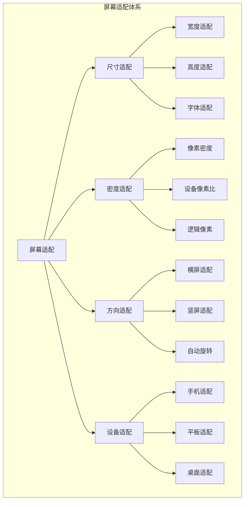

# Flutter 屏幕适配方案详解

本文档详细介绍 Flutter 应用的屏幕适配解决方案，包括响应式设计、屏幕尺寸适配和设备兼容性处理。

## 📋 目录

- [屏幕适配基础](#屏幕适配基础)
- [flutter_screenutil 使用](#flutter_screenutil-使用)
- [响应式布局设计](#响应式布局设计)
- [设备兼容性处理](#设备兼容性处理)
- [实际应用案例](#实际应用案例)
- [最佳实践](#最佳实践)

## 屏幕适配基础

### 架构图



### 基础概念

```dart
import 'dart:ui' as ui;
import 'package:flutter/material.dart';

class ScreenInfo {
  // 获取屏幕信息
  static void printScreenInfo(BuildContext context) {
    final mediaQuery = MediaQuery.of(context);
    final size = mediaQuery.size;
    final devicePixelRatio = mediaQuery.devicePixelRatio;
    final padding = mediaQuery.padding;
    final viewInsets = mediaQuery.viewInsets;
    
    print('=== 屏幕信息 ===');
    print('屏幕尺寸: ${size.width} x ${size.height}');
    print('设备像素比: $devicePixelRatio');
    print('物理像素: ${size.width * devicePixelRatio} x ${size.height * devicePixelRatio}');
    print('安全区域 - 顶部: ${padding.top}, 底部: ${padding.bottom}');
    print('键盘高度: ${viewInsets.bottom}');
    print('屏幕方向: ${mediaQuery.orientation}');
    print('文本缩放因子: ${mediaQuery.textScaleFactor}');
    print('亮度: ${mediaQuery.platformBrightness}');
    
    // 获取物理屏幕信息
    final physicalSize = ui.window.physicalSize;
    final physicalPixelRatio = ui.window.devicePixelRatio;
    print('物理屏幕尺寸: ${physicalSize.width} x ${physicalSize.height}');
    print('物理像素比: $physicalPixelRatio');
  }
  
  // 判断设备类型
  static DeviceType getDeviceType(BuildContext context) {
    final mediaQuery = MediaQuery.of(context);
    final size = mediaQuery.size;
    final diagonal = sqrt(pow(size.width, 2) + pow(size.height, 2));
    
    if (diagonal < 600) {
      return DeviceType.mobile;
    } else if (diagonal < 900) {
      return DeviceType.tablet;
    } else {
      return DeviceType.desktop;
    }
  }
  
  // 判断屏幕尺寸类别
  static ScreenSize getScreenSize(BuildContext context) {
    final width = MediaQuery.of(context).size.width;
    
    if (width < 600) {
      return ScreenSize.small;
    } else if (width < 1024) {
      return ScreenSize.medium;
    } else {
      return ScreenSize.large;
    }
  }
}

enum DeviceType { mobile, tablet, desktop }
enum ScreenSize { small, medium, large }
```

## flutter_screenutil 使用

### 依赖配置

```yaml
# pubspec.yaml
dependencies:
  flutter_screenutil: ^5.9.0
```

### 基础配置

```dart
import 'package:flutter_screenutil/flutter_screenutil.dart';

class MyApp extends StatelessWidget {
  @override
  Widget build(BuildContext context) {
    return ScreenUtilInit(
      // 设计稿尺寸 (iPhone 14 Pro)
      designSize: const Size(393, 852),
      // 最小文本适配
      minTextAdapt: true,
      // 分屏适配
      splitScreenMode: true,
      // 使用系统字体大小
      useInheritedMediaQuery: true,
      builder: (context, child) {
        return MaterialApp(
          title: 'Flutter 屏幕适配示例',
          theme: ThemeData(
            primarySwatch: Colors.blue,
            // 使用适配后的文本主题
            textTheme: TextTheme(
              headlineLarge: TextStyle(fontSize: 32.sp),
              headlineMedium: TextStyle(fontSize: 28.sp),
              headlineSmall: TextStyle(fontSize: 24.sp),
              bodyLarge: TextStyle(fontSize: 16.sp),
              bodyMedium: TextStyle(fontSize: 14.sp),
              bodySmall: TextStyle(fontSize: 12.sp),
            ),
          ),
          home: const ScreenAdaptationDemo(),
        );
      },
    );
  }
}
```

### 尺寸适配使用

```dart
class ScreenAdaptationDemo extends StatelessWidget {
  const ScreenAdaptationDemo({Key? key}) : super(key: key);
  
  @override
  Widget build(BuildContext context) {
    return Scaffold(
      appBar: AppBar(
        title: Text(
          '屏幕适配示例',
          style: TextStyle(fontSize: 18.sp),
        ),
        toolbarHeight: 56.h, // 适配高度
      ),
      body: SingleChildScrollView(
        padding: EdgeInsets.all(16.w), // 适配内边距
        child: Column(
          crossAxisAlignment: CrossAxisAlignment.start,
          children: [
            _buildScreenInfo(),
            SizedBox(height: 20.h),
            _buildSizeAdaptation(),
            SizedBox(height: 20.h),
            _buildFontAdaptation(),
            SizedBox(height: 20.h),
            _buildLayoutAdaptation(),
          ],
        ),
      ),
    );
  }
  
  Widget _buildScreenInfo() {
    return Card(
      child: Padding(
        padding: EdgeInsets.all(16.w),
        child: Column(
          crossAxisAlignment: CrossAxisAlignment.start,
          children: [
            Text(
              '屏幕信息',
              style: TextStyle(
                fontSize: 18.sp,
                fontWeight: FontWeight.bold,
              ),
            ),
            SizedBox(height: 12.h),
            _buildInfoRow('屏幕宽度', '${1.sw}dp (${ScreenUtil().screenWidth}px)'),
            _buildInfoRow('屏幕高度', '${1.sh}dp (${ScreenUtil().screenHeight}px)'),
            _buildInfoRow('状态栏高度', '${ScreenUtil().statusBarHeight}px'),
            _buildInfoRow('底部安全区', '${ScreenUtil().bottomBarHeight}px'),
            _buildInfoRow('像素密度比', '${ScreenUtil().pixelRatio}'),
            _buildInfoRow('文本缩放因子', '${ScreenUtil().textScaleFactor}'),
          ],
        ),
      ),
    );
  }
  
  Widget _buildInfoRow(String label, String value) {
    return Padding(
      padding: EdgeInsets.symmetric(vertical: 4.h),
      child: Row(
        mainAxisAlignment: MainAxisAlignment.spaceBetween,
        children: [
          Text(
            label,
            style: TextStyle(fontSize: 14.sp),
          ),
          Text(
            value,
            style: TextStyle(
              fontSize: 14.sp,
              fontWeight: FontWeight.w500,
              color: Colors.blue,
            ),
          ),
        ],
      ),
    );
  }
  
  Widget _buildSizeAdaptation() {
    return Card(
      child: Padding(
        padding: EdgeInsets.all(16.w),
        child: Column(
          crossAxisAlignment: CrossAxisAlignment.start,
          children: [
            Text(
              '尺寸适配示例',
              style: TextStyle(
                fontSize: 18.sp,
                fontWeight: FontWeight.bold,
              ),
            ),
            SizedBox(height: 16.h),
            
            // 固定尺寸容器
            Container(
              width: 200.w, // 适配宽度
              height: 100.h, // 适配高度
              decoration: BoxDecoration(
                color: Colors.blue.withOpacity(0.1),
                borderRadius: BorderRadius.circular(8.r), // 适配圆角
                border: Border.all(
                  color: Colors.blue,
                  width: 1.w, // 适配边框宽度
                ),
              ),
              child: Center(
                child: Text(
                  '200w x 100h',
                  style: TextStyle(fontSize: 16.sp),
                ),
              ),
            ),
            
            SizedBox(height: 16.h),
            
            // 响应式容器
            Container(
              width: 0.8.sw, // 屏幕宽度的80%
              height: 80.h,
              decoration: BoxDecoration(
                color: Colors.green.withOpacity(0.1),
                borderRadius: BorderRadius.circular(8.r),
                border: Border.all(
                  color: Colors.green,
                  width: 1.w,
                ),
              ),
              child: Center(
                child: Text(
                  '80% 屏幕宽度',
                  style: TextStyle(fontSize: 16.sp),
                ),
              ),
            ),
          ],
        ),
      ),
    );
  }
  
  Widget _buildFontAdaptation() {
    return Card(
      child: Padding(
        padding: EdgeInsets.all(16.w),
        child: Column(
          crossAxisAlignment: CrossAxisAlignment.start,
          children: [
            Text(
              '字体适配示例',
              style: TextStyle(
                fontSize: 18.sp,
                fontWeight: FontWeight.bold,
              ),
            ),
            SizedBox(height: 16.h),
            
            // 不同字体大小
            Text('12.sp 字体大小', style: TextStyle(fontSize: 12.sp)),
            SizedBox(height: 8.h),
            Text('14.sp 字体大小', style: TextStyle(fontSize: 14.sp)),
            SizedBox(height: 8.h),
            Text('16.sp 字体大小', style: TextStyle(fontSize: 16.sp)),
            SizedBox(height: 8.h),
            Text('18.sp 字体大小', style: TextStyle(fontSize: 18.sp)),
            SizedBox(height: 8.h),
            Text('20.sp 字体大小', style: TextStyle(fontSize: 20.sp)),
            
            SizedBox(height: 16.h),
            
            // 自适应字体
            Text(
              '这是自适应字体示例，会根据用户系统设置自动调整大小',
              style: TextStyle(
                fontSize: 16.sp,
                height: 1.5,
              ),
            ),
          ],
        ),
      ),
    );
  }
  
  Widget _buildLayoutAdaptation() {
    return Card(
      child: Padding(
        padding: EdgeInsets.all(16.w),
        child: Column(
          crossAxisAlignment: CrossAxisAlignment.start,
          children: [
            Text(
              '布局适配示例',
              style: TextStyle(
                fontSize: 18.sp,
                fontWeight: FontWeight.bold,
              ),
            ),
            SizedBox(height: 16.h),
            
            // 网格布局
            GridView.builder(
              shrinkWrap: true,
              physics: const NeverScrollableScrollPhysics(),
              gridDelegate: SliverGridDelegateWithFixedCrossAxisCount(
                crossAxisCount: _getCrossAxisCount(),
                crossAxisSpacing: 12.w,
                mainAxisSpacing: 12.h,
                childAspectRatio: 1.0,
              ),
              itemCount: 6,
              itemBuilder: (context, index) {
                return Container(
                  decoration: BoxDecoration(
                    color: Colors.orange.withOpacity(0.1),
                    borderRadius: BorderRadius.circular(8.r),
                    border: Border.all(
                      color: Colors.orange,
                      width: 1.w,
                    ),
                  ),
                  child: Center(
                    child: Text(
                      '${index + 1}',
                      style: TextStyle(
                        fontSize: 16.sp,
                        fontWeight: FontWeight.bold,
                      ),
                    ),
                  ),
                );
              },
            ),
          ],
        ),
      ),
    );
  }
  
  int _getCrossAxisCount() {
    final width = 1.sw;
    if (width < 600) {
      return 2; // 手机
    } else if (width < 1024) {
      return 3; // 平板
    } else {
      return 4; // 桌面
    }
  }
}
```

## 响应式布局设计

### 响应式组件

```dart
class ResponsiveWidget extends StatelessWidget {
  final Widget mobile;
  final Widget? tablet;
  final Widget? desktop;
  
  const ResponsiveWidget({
    Key? key,
    required this.mobile,
    this.tablet,
    this.desktop,
  }) : super(key: key);
  
  @override
  Widget build(BuildContext context) {
    return LayoutBuilder(
      builder: (context, constraints) {
        if (constraints.maxWidth >= 1024) {
          return desktop ?? tablet ?? mobile;
        } else if (constraints.maxWidth >= 600) {
          return tablet ?? mobile;
        } else {
          return mobile;
        }
      },
    );
  }
}

// 使用示例
class ResponsiveLayoutExample extends StatelessWidget {
  @override
  Widget build(BuildContext context) {
    return Scaffold(
      body: ResponsiveWidget(
        mobile: _buildMobileLayout(),
        tablet: _buildTabletLayout(),
        desktop: _buildDesktopLayout(),
      ),
    );
  }
  
  Widget _buildMobileLayout() {
    return Column(
      children: [
        _buildHeader(),
        Expanded(
          child: ListView(
            padding: EdgeInsets.all(16.w),
            children: [
              _buildCard('卡片 1'),
              SizedBox(height: 16.h),
              _buildCard('卡片 2'),
              SizedBox(height: 16.h),
              _buildCard('卡片 3'),
            ],
          ),
        ),
      ],
    );
  }
  
  Widget _buildTabletLayout() {
    return Column(
      children: [
        _buildHeader(),
        Expanded(
          child: Padding(
            padding: EdgeInsets.all(24.w),
            child: GridView.count(
              crossAxisCount: 2,
              crossAxisSpacing: 16.w,
              mainAxisSpacing: 16.h,
              children: [
                _buildCard('卡片 1'),
                _buildCard('卡片 2'),
                _buildCard('卡片 3'),
                _buildCard('卡片 4'),
              ],
            ),
          ),
        ),
      ],
    );
  }
  
  Widget _buildDesktopLayout() {
    return Row(
      children: [
        // 侧边栏
        Container(
          width: 250.w,
          color: Colors.grey[100],
          child: _buildSidebar(),
        ),
        // 主内容区
        Expanded(
          child: Column(
            children: [
              _buildHeader(),
              Expanded(
                child: Padding(
                  padding: EdgeInsets.all(32.w),
                  child: GridView.count(
                    crossAxisCount: 3,
                    crossAxisSpacing: 24.w,
                    mainAxisSpacing: 24.h,
                    children: [
                      _buildCard('卡片 1'),
                      _buildCard('卡片 2'),
                      _buildCard('卡片 3'),
                      _buildCard('卡片 4'),
                      _buildCard('卡片 5'),
                      _buildCard('卡片 6'),
                    ],
                  ),
                ),
              ),
            ],
          ),
        ),
      ],
    );
  }
  
  Widget _buildHeader() {
    return Container(
      height: 60.h,
      color: Colors.blue,
      child: Center(
        child: Text(
          '响应式布局示例',
          style: TextStyle(
            color: Colors.white,
            fontSize: 18.sp,
            fontWeight: FontWeight.bold,
          ),
        ),
      ),
    );
  }
  
  Widget _buildSidebar() {
    return ListView(
      padding: EdgeInsets.all(16.w),
      children: [
        Text(
          '导航菜单',
          style: TextStyle(
            fontSize: 16.sp,
            fontWeight: FontWeight.bold,
          ),
        ),
        SizedBox(height: 16.h),
        _buildMenuItem('首页'),
        _buildMenuItem('产品'),
        _buildMenuItem('服务'),
        _buildMenuItem('关于'),
      ],
    );
  }
  
  Widget _buildMenuItem(String title) {
    return Container(
      margin: EdgeInsets.only(bottom: 8.h),
      child: ListTile(
        title: Text(
          title,
          style: TextStyle(fontSize: 14.sp),
        ),
        onTap: () {},
      ),
    );
  }
  
  Widget _buildCard(String title) {
    return Card(
      elevation: 4,
      child: Padding(
        padding: EdgeInsets.all(16.w),
        child: Column(
          mainAxisAlignment: MainAxisAlignment.center,
          children: [
            Icon(
              Icons.card_giftcard,
              size: 48.w,
              color: Colors.blue,
            ),
            SizedBox(height: 12.h),
            Text(
              title,
              style: TextStyle(
                fontSize: 16.sp,
                fontWeight: FontWeight.bold,
              ),
            ),
            SizedBox(height: 8.h),
            Text(
              '这是卡片的描述内容',
              style: TextStyle(
                fontSize: 12.sp,
                color: Colors.grey[600],
              ),
              textAlign: TextAlign.center,
            ),
          ],
        ),
      ),
    );
  }
}
```

### 自适应导航

```dart
class AdaptiveNavigation extends StatefulWidget {
  @override
  State<AdaptiveNavigation> createState() => _AdaptiveNavigationState();
}

class _AdaptiveNavigationState extends State<AdaptiveNavigation> {
  int _selectedIndex = 0;
  
  final List<NavigationItem> _items = [
    NavigationItem(
      icon: Icons.home,
      label: '首页',
      page: HomePage(),
    ),
    NavigationItem(
      icon: Icons.search,
      label: '搜索',
      page: SearchPage(),
    ),
    NavigationItem(
      icon: Icons.favorite,
      label: '收藏',
      page: FavoritePage(),
    ),
    NavigationItem(
      icon: Icons.person,
      label: '我的',
      page: ProfilePage(),
    ),
  ];
  
  @override
  Widget build(BuildContext context) {
    return LayoutBuilder(
      builder: (context, constraints) {
        if (constraints.maxWidth >= 1024) {
          // 桌面端：侧边导航
          return _buildDesktopNavigation();
        } else if (constraints.maxWidth >= 600) {
          // 平板端：导航栏
          return _buildTabletNavigation();
        } else {
          // 手机端：底部导航
          return _buildMobileNavigation();
        }
      },
    );
  }
  
  Widget _buildMobileNavigation() {
    return Scaffold(
      body: _items[_selectedIndex].page,
      bottomNavigationBar: BottomNavigationBar(
        type: BottomNavigationBarType.fixed,
        currentIndex: _selectedIndex,
        onTap: (index) {
          setState(() {
            _selectedIndex = index;
          });
        },
        items: _items.map((item) {
          return BottomNavigationBarItem(
            icon: Icon(item.icon),
            label: item.label,
          );
        }).toList(),
      ),
    );
  }
  
  Widget _buildTabletNavigation() {
    return Scaffold(
      appBar: AppBar(
        title: Text(_items[_selectedIndex].label),
        bottom: TabBar(
          controller: TabController(
            length: _items.length,
            vsync: this,
            initialIndex: _selectedIndex,
          ),
          onTap: (index) {
            setState(() {
              _selectedIndex = index;
            });
          },
          tabs: _items.map((item) {
            return Tab(
              icon: Icon(item.icon),
              text: item.label,
            );
          }).toList(),
        ),
      ),
      body: _items[_selectedIndex].page,
    );
  }
  
  Widget _buildDesktopNavigation() {
    return Scaffold(
      body: Row(
        children: [
          // 侧边导航
          Container(
            width: 250.w,
            color: Colors.grey[100],
            child: Column(
              children: [
                Container(
                  height: 80.h,
                  child: Center(
                    child: Text(
                      'App Logo',
                      style: TextStyle(
                        fontSize: 20.sp,
                        fontWeight: FontWeight.bold,
                      ),
                    ),
                  ),
                ),
                Expanded(
                  child: ListView.builder(
                    itemCount: _items.length,
                    itemBuilder: (context, index) {
                      final item = _items[index];
                      final isSelected = index == _selectedIndex;
                      
                      return Container(
                        margin: EdgeInsets.symmetric(
                          horizontal: 8.w,
                          vertical: 4.h,
                        ),
                        decoration: BoxDecoration(
                          color: isSelected 
                              ? Colors.blue.withOpacity(0.1)
                              : null,
                          borderRadius: BorderRadius.circular(8.r),
                        ),
                        child: ListTile(
                          leading: Icon(
                            item.icon,
                            color: isSelected ? Colors.blue : null,
                          ),
                          title: Text(
                            item.label,
                            style: TextStyle(
                              color: isSelected ? Colors.blue : null,
                              fontWeight: isSelected 
                                  ? FontWeight.bold 
                                  : null,
                            ),
                          ),
                          onTap: () {
                            setState(() {
                              _selectedIndex = index;
                            });
                          },
                        ),
                      );
                    },
                  ),
                ),
              ],
            ),
          ),
          // 主内容区
          Expanded(
            child: _items[_selectedIndex].page,
          ),
        ],
      ),
    );
  }
}

class NavigationItem {
  final IconData icon;
  final String label;
  final Widget page;
  
  NavigationItem({
    required this.icon,
    required this.label,
    required this.page,
  });
}

// 示例页面
class HomePage extends StatelessWidget {
  @override
  Widget build(BuildContext context) {
    return Center(
      child: Text(
        '首页',
        style: TextStyle(fontSize: 24.sp),
      ),
    );
  }
}

class SearchPage extends StatelessWidget {
  @override
  Widget build(BuildContext context) {
    return Center(
      child: Text(
        '搜索页',
        style: TextStyle(fontSize: 24.sp),
      ),
    );
  }
}

class FavoritePage extends StatelessWidget {
  @override
  Widget build(BuildContext context) {
    return Center(
      child: Text(
        '收藏页',
        style: TextStyle(fontSize: 24.sp),
      ),
    );
  }
}

class ProfilePage extends StatelessWidget {
  @override
  Widget build(BuildContext context) {
    return Center(
      child: Text(
        '个人页',
        style: TextStyle(fontSize: 24.sp),
      ),
    );
  }
}
```

## 设备兼容性处理

### 平台适配

```dart
import 'dart:io';
import 'package:flutter/foundation.dart';

class PlatformAdaptation {
  // 判断平台类型
  static bool get isAndroid => !kIsWeb && Platform.isAndroid;
  static bool get isIOS => !kIsWeb && Platform.isIOS;
  static bool get isWeb => kIsWeb;
  static bool get isDesktop => !kIsWeb && (Platform.isWindows || Platform.isMacOS || Platform.isLinux);
  static bool get isMobile => isAndroid || isIOS;
  
  // 获取平台特定的设计规范
  static double getAppBarHeight() {
    if (isIOS) {
      return 44.0; // iOS 标准
    } else {
      return 56.0; // Material Design 标准
    }
  }
  
  static EdgeInsets getSafeAreaPadding(BuildContext context) {
    final mediaQuery = MediaQuery.of(context);
    if (isIOS) {
      return mediaQuery.padding;
    } else {
      return EdgeInsets.only(
        top: mediaQuery.padding.top,
        bottom: mediaQuery.viewInsets.bottom > 0 
            ? 0 
            : mediaQuery.padding.bottom,
      );
    }
  }
  
  // 平台特定的组件
  static Widget buildPlatformButton({
    required String text,
    required VoidCallback onPressed,
  }) {
    if (isIOS) {
      return CupertinoButton(
        onPressed: onPressed,
        child: Text(text),
      );
    } else {
      return ElevatedButton(
        onPressed: onPressed,
        child: Text(text),
      );
    }
  }
  
  static Widget buildPlatformSwitch({
    required bool value,
    required ValueChanged<bool> onChanged,
  }) {
    if (isIOS) {
      return CupertinoSwitch(
        value: value,
        onChanged: onChanged,
      );
    } else {
      return Switch(
        value: value,
        onChanged: onChanged,
      );
    }
  }
}
```

### 设备特性检测

```dart
class DeviceCapabilities {
  // 检测设备特性
  static Future<Map<String, dynamic>> getDeviceCapabilities() async {
    final capabilities = <String, dynamic>{};
    
    // 屏幕信息
    final window = WidgetsBinding.instance.window;
    capabilities['screenSize'] = {
      'width': window.physicalSize.width,
      'height': window.physicalSize.height,
      'pixelRatio': window.devicePixelRatio,
    };
    
    // 平台信息
    if (!kIsWeb) {
      capabilities['platform'] = Platform.operatingSystem;
      capabilities['version'] = Platform.operatingSystemVersion;
    }
    
    return capabilities;
  }
  
  // 检测是否支持特定功能
  static bool supportsHapticFeedback() {
    return !kIsWeb && (Platform.isIOS || Platform.isAndroid);
  }
  
  static bool supportsBiometrics() {
    return !kIsWeb && (Platform.isIOS || Platform.isAndroid);
  }
  
  static bool supportsCamera() {
    return !kIsWeb && (Platform.isIOS || Platform.isAndroid);
  }
  
  // 自适应功能启用
  static Widget buildAdaptiveFeature({
    required Widget child,
    required bool Function() isSupported,
    Widget? fallback,
  }) {
    if (isSupported()) {
      return child;
    } else {
      return fallback ?? const SizedBox.shrink();
    }
  }
}
```

## 实际应用案例

### 电商应用适配

```dart
class ECommerceAdaptiveLayout extends StatelessWidget {
  @override
  Widget build(BuildContext context) {
    return Scaffold(
      body: LayoutBuilder(
        builder: (context, constraints) {
          if (constraints.maxWidth >= 1024) {
            return _buildDesktopLayout();
          } else if (constraints.maxWidth >= 600) {
            return _buildTabletLayout();
          } else {
            return _buildMobileLayout();
          }
        },
      ),
    );
  }
  
  Widget _buildMobileLayout() {
    return CustomScrollView(
      slivers: [
        // 顶部轮播图
        SliverToBoxAdapter(
          child: Container(
            height: 200.h,
            child: _buildBanner(),
          ),
        ),
        
        // 分类网格
        SliverToBoxAdapter(
          child: Container(
            padding: EdgeInsets.all(16.w),
            child: _buildCategoryGrid(crossAxisCount: 4),
          ),
        ),
        
        // 商品列表
        SliverPadding(
          padding: EdgeInsets.symmetric(horizontal: 16.w),
          sliver: SliverGrid(
            gridDelegate: SliverGridDelegateWithFixedCrossAxisCount(
              crossAxisCount: 2,
              crossAxisSpacing: 12.w,
              mainAxisSpacing: 12.h,
              childAspectRatio: 0.75,
            ),
            delegate: SliverChildBuilderDelegate(
              (context, index) => _buildProductCard(index),
              childCount: 20,
            ),
          ),
        ),
      ],
    );
  }
  
  Widget _buildTabletLayout() {
    return Row(
      children: [
        // 侧边分类
        Container(
          width: 200.w,
          child: _buildCategoryList(),
        ),
        
        // 主内容区
        Expanded(
          child: CustomScrollView(
            slivers: [
              SliverToBoxAdapter(
                child: Container(
                  height: 250.h,
                  child: _buildBanner(),
                ),
              ),
              SliverPadding(
                padding: EdgeInsets.all(24.w),
                sliver: SliverGrid(
                  gridDelegate: SliverGridDelegateWithFixedCrossAxisCount(
                    crossAxisCount: 3,
                    crossAxisSpacing: 16.w,
                    mainAxisSpacing: 16.h,
                    childAspectRatio: 0.8,
                  ),
                  delegate: SliverChildBuilderDelegate(
                    (context, index) => _buildProductCard(index),
                    childCount: 20,
                  ),
                ),
              ),
            ],
          ),
        ),
      ],
    );
  }
  
  Widget _buildDesktopLayout() {
    return Row(
      children: [
        // 左侧导航
        Container(
          width: 250.w,
          child: _buildSideNavigation(),
        ),
        
        // 主内容区
        Expanded(
          child: Column(
            children: [
              // 顶部工具栏
              Container(
                height: 60.h,
                child: _buildTopToolbar(),
              ),
              
              // 内容区域
              Expanded(
                child: Row(
                  children: [
                    // 分类筛选
                    Container(
                      width: 200.w,
                      child: _buildFilterPanel(),
                    ),
                    
                    // 商品展示
                    Expanded(
                      child: CustomScrollView(
                        slivers: [
                          SliverToBoxAdapter(
                            child: Container(
                              height: 300.h,
                              child: _buildBanner(),
                            ),
                          ),
                          SliverPadding(
                            padding: EdgeInsets.all(32.w),
                            sliver: SliverGrid(
                              gridDelegate: SliverGridDelegateWithFixedCrossAxisCount(
                                crossAxisCount: 4,
                                crossAxisSpacing: 24.w,
                                mainAxisSpacing: 24.h,
                                childAspectRatio: 0.8,
                              ),
                              delegate: SliverChildBuilderDelegate(
                                (context, index) => _buildProductCard(index),
                                childCount: 20,
                              ),
                            ),
                          ),
                        ],
                      ),
                    ),
                  ],
                ),
              ),
            ],
          ),
        ),
      ],
    );
  }
  
  Widget _buildBanner() {
    return Container(
      decoration: BoxDecoration(
        gradient: LinearGradient(
          colors: [Colors.blue, Colors.purple],
        ),
      ),
      child: Center(
        child: Text(
          '轮播广告',
          style: TextStyle(
            color: Colors.white,
            fontSize: 24.sp,
            fontWeight: FontWeight.bold,
          ),
        ),
      ),
    );
  }
  
  Widget _buildCategoryGrid({required int crossAxisCount}) {
    return GridView.builder(
      shrinkWrap: true,
      physics: const NeverScrollableScrollPhysics(),
      gridDelegate: SliverGridDelegateWithFixedCrossAxisCount(
        crossAxisCount: crossAxisCount,
        crossAxisSpacing: 12.w,
        mainAxisSpacing: 12.h,
      ),
      itemCount: 8,
      itemBuilder: (context, index) {
        return Container(
          decoration: BoxDecoration(
            color: Colors.grey[100],
            borderRadius: BorderRadius.circular(8.r),
          ),
          child: Column(
            mainAxisAlignment: MainAxisAlignment.center,
            children: [
              Icon(
                Icons.category,
                size: 32.w,
                color: Colors.blue,
              ),
              SizedBox(height: 8.h),
              Text(
                '分类${index + 1}',
                style: TextStyle(fontSize: 12.sp),
              ),
            ],
          ),
        );
      },
    );
  }
  
  Widget _buildProductCard(int index) {
    return Card(
      elevation: 2,
      child: Column(
        crossAxisAlignment: CrossAxisAlignment.start,
        children: [
          Expanded(
            child: Container(
              decoration: BoxDecoration(
                color: Colors.grey[200],
                borderRadius: BorderRadius.vertical(
                  top: Radius.circular(8.r),
                ),
              ),
              child: Center(
                child: Icon(
                  Icons.image,
                  size: 48.w,
                  color: Colors.grey,
                ),
              ),
            ),
          ),
          Padding(
            padding: EdgeInsets.all(8.w),
            child: Column(
              crossAxisAlignment: CrossAxisAlignment.start,
              children: [
                Text(
                  '商品名称 ${index + 1}',
                  style: TextStyle(
                    fontSize: 14.sp,
                    fontWeight: FontWeight.w500,
                  ),
                  maxLines: 2,
                  overflow: TextOverflow.ellipsis,
                ),
                SizedBox(height: 4.h),
                Text(
                  '¥${(index + 1) * 99}',
                  style: TextStyle(
                    fontSize: 16.sp,
                    fontWeight: FontWeight.bold,
                    color: Colors.red,
                  ),
                ),
              ],
            ),
          ),
        ],
      ),
    );
  }
  
  Widget _buildCategoryList() {
    return Container(
      color: Colors.grey[100],
      child: ListView.builder(
        itemCount: 10,
        itemBuilder: (context, index) {
          return ListTile(
            title: Text('分类 ${index + 1}'),
            onTap: () {},
          );
        },
      ),
    );
  }
  
  Widget _buildSideNavigation() {
    return Container(
      color: Colors.grey[100],
      child: Column(
        children: [
          Container(
            height: 80.h,
            child: Center(
              child: Text(
                'Logo',
                style: TextStyle(
                  fontSize: 20.sp,
                  fontWeight: FontWeight.bold,
                ),
              ),
            ),
          ),
          Expanded(
            child: ListView(
              children: [
                ListTile(title: Text('首页'), onTap: () {}),
                ListTile(title: Text('分类'), onTap: () {}),
                ListTile(title: Text('购物车'), onTap: () {}),
                ListTile(title: Text('我的'), onTap: () {}),
              ],
            ),
          ),
        ],
      ),
    );
  }
  
  Widget _buildTopToolbar() {
    return Container(
      padding: EdgeInsets.symmetric(horizontal: 24.w),
      decoration: BoxDecoration(
        color: Colors.white,
        boxShadow: [
          BoxShadow(
            color: Colors.grey.withOpacity(0.1),
            blurRadius: 4,
            offset: const Offset(0, 2),
          ),
        ],
      ),
      child: Row(
        children: [
          Expanded(
            child: TextField(
              decoration: InputDecoration(
                hintText: '搜索商品',
                prefixIcon: const Icon(Icons.search),
                border: OutlineInputBorder(
                  borderRadius: BorderRadius.circular(24.r),
                ),
              ),
            ),
          ),
          SizedBox(width: 16.w),
          IconButton(
            icon: const Icon(Icons.shopping_cart),
            onPressed: () {},
          ),
        ],
      ),
    );
  }
  
  Widget _buildFilterPanel() {
    return Container(
      color: Colors.grey[50],
      padding: EdgeInsets.all(16.w),
      child: Column(
        crossAxisAlignment: CrossAxisAlignment.start,
        children: [
          Text(
            '筛选',
            style: TextStyle(
              fontSize: 16.sp,
              fontWeight: FontWeight.bold,
            ),
          ),
          SizedBox(height: 16.h),
          // 筛选选项
          Text('价格区间'),
          Text('品牌'),
          Text('评分'),
        ],
      ),
    );
  }
}
```

## 最佳实践

### 1. 设计原则

```dart
class ScreenAdaptationPrinciples {
  // 1. 使用相对单位而非绝对单位
  static Widget goodExample() {
    return Container(
      width: 0.8.sw, // 好：使用屏幕宽度的百分比
      height: 200.h,  // 好：使用适配后的高度
      padding: EdgeInsets.all(16.w), // 好：使用适配后的内边距
    );
  }
  
  static Widget badExample() {
    return Container(
      width: 300,     // 坏：使用固定像素值
      height: 200,    // 坏：使用固定像素值
      padding: const EdgeInsets.all(16), // 坏：使用固定内边距
    );
  }
  
  // 2. 响应式断点设计
  static const double mobileBreakpoint = 600;
  static const double tabletBreakpoint = 1024;
  
  static bool isMobile(BuildContext context) {
    return MediaQuery.of(context).size.width < mobileBreakpoint;
  }
  
  static bool isTablet(BuildContext context) {
    final width = MediaQuery.of(context).size.width;
    return width >= mobileBreakpoint && width < tabletBreakpoint;
  }
  
  static bool isDesktop(BuildContext context) {
    return MediaQuery.of(context).size.width >= tabletBreakpoint;
  }
  
  // 3. 字体缩放处理
  static TextStyle adaptiveTextStyle({
    required double fontSize,
    FontWeight? fontWeight,
    Color? color,
  }) {
    return TextStyle(
      fontSize: fontSize.sp,
      fontWeight: fontWeight,
      color: color,
      // 限制字体缩放范围
      textBaseline: TextBaseline.alphabetic,
    );
  }
  
  // 4. 安全区域处理
  static Widget safeAreaWrapper({
    required Widget child,
    bool top = true,
    bool bottom = true,
  }) {
    return SafeArea(
      top: top,
      bottom: bottom,
      child: child,
    );
  }
}
```

### 2. 性能优化

```dart
class ScreenAdaptationPerformance {
  // 1. 缓存计算结果
  static final Map<String, double> _sizeCache = {};
  
  static double getCachedSize(String key, double Function() calculator) {
    return _sizeCache.putIfAbsent(key, calculator);
  }
  
  // 2. 避免频繁重建
  static Widget buildOptimizedResponsiveWidget({
    required Widget Function(BuildContext, BoxConstraints) builder,
  }) {
    return LayoutBuilder(
      builder: (context, constraints) {
        // 缓存约束条件
        final cacheKey = '${constraints.maxWidth}_${constraints.maxHeight}';
        
        return builder(context, constraints);
      },
    );
  }
  
  // 3. 延迟加载
  static Widget buildLazyAdaptiveContent({
    required Widget Function() contentBuilder,
    required bool Function(BuildContext) shouldLoad,
  }) {
    return Builder(
      builder: (context) {
        if (shouldLoad(context)) {
          return contentBuilder();
        } else {
          return const SizedBox.shrink();
        }
      },
    );
  }
}
```

### 3. 测试策略

```dart
class ScreenAdaptationTesting {
  // 1. 多设备测试
  static void testMultipleDevices() {
    testWidgets('应该在不同设备上正确显示', (tester) async {
      // 测试手机尺寸
      await tester.binding.setSurfaceSize(const Size(375, 812));
      await tester.pumpWidget(MyApp());
      expect(find.byType(BottomNavigationBar), findsOneWidget);
      
      // 测试平板尺寸
      await tester.binding.setSurfaceSize(const Size(768, 1024));
      await tester.pumpWidget(MyApp());
      expect(find.byType(TabBar), findsOneWidget);
      
      // 测试桌面尺寸
      await tester.binding.setSurfaceSize(const Size(1200, 800));
      await tester.pumpWidget(MyApp());
      expect(find.byType(NavigationRail), findsOneWidget);
    });
  }
  
  // 2. 字体缩放测试
  static void testFontScaling() {
    testWidgets('应该正确处理字体缩放', (tester) async {
      await tester.pumpWidget(
        MediaQuery(
          data: const MediaQueryData(
            textScaleFactor: 1.5,
          ),
          child: MyApp(),
        ),
      );
      
      // 验证文本是否正确缩放
      final textWidget = tester.widget<Text>(find.byType(Text).first);
      expect(textWidget.style?.fontSize, greaterThan(16));
    });
  }
  
  // 3. 方向变化测试
  static void testOrientationChange() {
    testWidgets('应该正确处理屏幕方向变化', (tester) async {
      // 竖屏测试
      await tester.binding.setSurfaceSize(const Size(375, 812));
      await tester.pumpWidget(MyApp());
      
      // 横屏测试
      await tester.binding.setSurfaceSize(const Size(812, 375));
      await tester.pump();
      
      // 验证布局是否正确调整
      expect(find.byType(Row), findsWidgets);
    });
  }
}
```

## 总结

Flutter 屏幕适配是构建优秀用户体验的关键：

### 核心要点
1. **使用 flutter_screenutil** - 提供完整的尺寸适配解决方案
2. **响应式设计** - 根据屏幕尺寸提供不同的布局
3. **平台适配** - 考虑不同平台的设计规范
4. **性能优化** - 避免频繁重建和计算
5. **测试验证** - 在多种设备上测试适配效果

### 最佳实践
1. **设计稿标准化** - 使用统一的设计稿尺寸
2. **断点设计** - 定义清晰的响应式断点
3. **组件复用** - 创建可复用的响应式组件
4. **渐进增强** - 从移动端开始，逐步适配大屏
5. **用户体验** - 确保在所有设备上都有良好的体验

通过合理的屏幕适配策略，可以让 Flutter 应用在各种设备上都能提供一致且优秀的用户体验。

---

**相关文档：**
- [PhotoView 和 WebView 控件](./photo-webview-widgets.md)
- [国际化实现方案](./internationalization.md)
- [刷新控件使用](./refresh-widgets.md)