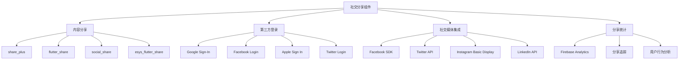

# 社交分享组件

> 掌握 Flutter 中社交媒体集成、内容分享、第三方登录等社交功能的实现。

## 社交分享概览



## 内容分享

### Share Plus 分享组件

#### 1. 依赖配置

```yaml
# pubspec.yaml
dependencies:
  share_plus: ^7.2.2
  path_provider: ^2.1.2
  http: ^1.1.2
```

#### 2. 分享服务实现

```dart
import 'package:share_plus/share_plus.dart';
import 'package:path_provider/path_provider.dart';
import 'dart:io';
import 'dart:typed_data';

class SocialShareService {
  // 分享文本
  static Future<void> shareText(
    String text, {
    String? subject,
    Rect? sharePositionOrigin,
  }) async {
    try {
      await Share.share(
        text,
        subject: subject,
        sharePositionOrigin: sharePositionOrigin,
      );
      
      await _trackShareEvent('text', {
        'content_type': 'text',
        'content_length': text.length,
      });
    } catch (e) {
      debugPrint('分享文本失败: $e');
      throw ShareException('分享文本失败', e);
    }
  }
  
  // 分享链接
  static Future<void> shareUrl(
    String url, {
    String? title,
    String? description,
    Rect? sharePositionOrigin,
  }) async {
    try {
      final content = title != null && description != null
          ? '$title\n\n$description\n\n$url'
          : url;
      
      await Share.share(
        content,
        subject: title,
        sharePositionOrigin: sharePositionOrigin,
      );
      
      await _trackShareEvent('url', {
        'url': url,
        'title': title,
        'has_description': description != null,
      });
    } catch (e) {
      debugPrint('分享链接失败: $e');
      throw ShareException('分享链接失败', e);
    }
  }
  
  // 分享文件
  static Future<void> shareFile(
    String filePath, {
    String? text,
    String? subject,
    List<String>? mimeTypes,
    Rect? sharePositionOrigin,
  }) async {
    try {
      final file = File(filePath);
      if (!await file.exists()) {
        throw ShareException('文件不存在: $filePath');
      }
      
      final xFile = XFile(filePath);
      await Share.shareXFiles(
        [xFile],
        text: text,
        subject: subject,
        sharePositionOrigin: sharePositionOrigin,
      );
      
      await _trackShareEvent('file', {
        'file_type': _getFileType(filePath),
        'file_size': await file.length(),
        'has_text': text != null,
      });
    } catch (e) {
      debugPrint('分享文件失败: $e');
      throw ShareException('分享文件失败', e);
    }
  }
  
  // 分享多个文件
  static Future<void> shareFiles(
    List<String> filePaths, {
    String? text,
    String? subject,
    List<String>? mimeTypes,
    Rect? sharePositionOrigin,
  }) async {
    try {
      final xFiles = <XFile>[];
      
      for (final path in filePaths) {
        final file = File(path);
        if (await file.exists()) {
          xFiles.add(XFile(path));
        }
      }
      
      if (xFiles.isEmpty) {
        throw ShareException('没有有效的文件可分享');
      }
      
      await Share.shareXFiles(
        xFiles,
        text: text,
        subject: subject,
        sharePositionOrigin: sharePositionOrigin,
      );
      
      await _trackShareEvent('files', {
        'file_count': xFiles.length,
        'total_size': await _calculateTotalSize(filePaths),
        'has_text': text != null,
      });
    } catch (e) {
      debugPrint('分享多个文件失败: $e');
      throw ShareException('分享多个文件失败', e);
    }
  }
  
  // 分享图片
  static Future<void> shareImage(
    Uint8List imageBytes, {
    String? text,
    String? subject,
    String fileName = 'image.png',
    Rect? sharePositionOrigin,
  }) async {
    try {
      final tempDir = await getTemporaryDirectory();
      final file = File('${tempDir.path}/$fileName');
      await file.writeAsBytes(imageBytes);
      
      await shareFile(
        file.path,
        text: text,
        subject: subject,
        sharePositionOrigin: sharePositionOrigin,
      );
    } catch (e) {
      debugPrint('分享图片失败: $e');
      throw ShareException('分享图片失败', e);
    }
  }
  
  // 分享网络图片
  static Future<void> shareNetworkImage(
    String imageUrl, {
    String? text,
    String? subject,
    Rect? sharePositionOrigin,
  }) async {
    try {
      final response = await http.get(Uri.parse(imageUrl));
      if (response.statusCode != 200) {
        throw ShareException('下载图片失败: ${response.statusCode}');
      }
      
      final fileName = _getFileNameFromUrl(imageUrl) ?? 'image.png';
      await shareImage(
        response.bodyBytes,
        text: text,
        subject: subject,
        fileName: fileName,
        sharePositionOrigin: sharePositionOrigin,
      );
    } catch (e) {
      debugPrint('分享网络图片失败: $e');
      throw ShareException('分享网络图片失败', e);
    }
  }
  
  // 分享应用
  static Future<void> shareApp({
    String? customMessage,
    Rect? sharePositionOrigin,
  }) async {
    try {
      final appInfo = await _getAppInfo();
      final message = customMessage ??
          '推荐一个很棒的应用：${appInfo.appName}\n\n'
          '${appInfo.description}\n\n'
          '下载链接：${appInfo.downloadUrl}';
      
      await shareText(
        message,
        subject: '推荐应用：${appInfo.appName}',
        sharePositionOrigin: sharePositionOrigin,
      );
    } catch (e) {
      debugPrint('分享应用失败: $e');
      throw ShareException('分享应用失败', e);
    }
  }
  
  // 获取文件类型
  static String _getFileType(String filePath) {
    final extension = filePath.split('.').last.toLowerCase();
    switch (extension) {
      case 'jpg':
      case 'jpeg':
      case 'png':
      case 'gif':
      case 'webp':
        return 'image';
      case 'mp4':
      case 'mov':
      case 'avi':
      case 'mkv':
        return 'video';
      case 'mp3':
      case 'wav':
      case 'aac':
      case 'flac':
        return 'audio';
      case 'pdf':
        return 'pdf';
      case 'doc':
      case 'docx':
        return 'document';
      default:
        return 'other';
    }
  }
  
  // 计算文件总大小
  static Future<int> _calculateTotalSize(List<String> filePaths) async {
    int totalSize = 0;
    for (final path in filePaths) {
      final file = File(path);
      if (await file.exists()) {
        totalSize += await file.length();
      }
    }
    return totalSize;
  }
  
  // 从URL获取文件名
  static String? _getFileNameFromUrl(String url) {
    try {
      final uri = Uri.parse(url);
      final segments = uri.pathSegments;
      if (segments.isNotEmpty) {
        return segments.last;
      }
    } catch (e) {
      debugPrint('解析URL文件名失败: $e');
    }
    return null;
  }
  
  // 获取应用信息
  static Future<AppInfo> _getAppInfo() async {
    // 这里应该从配置或API获取应用信息
    return AppInfo(
      appName: 'My Flutter App',
      description: '一个很棒的Flutter应用',
      downloadUrl: 'https://play.google.com/store/apps/details?id=com.example.app',
    );
  }
  
  // 追踪分享事件
  static Future<void> _trackShareEvent(
    String shareType,
    Map<String, dynamic> parameters,
  ) async {
    try {
      await AnalyticsService.logEvent(
        'share_content',
        parameters: {
          'share_type': shareType,
          'timestamp': DateTime.now().toIso8601String(),
          ...parameters,
        },
      );
    } catch (e) {
      debugPrint('追踪分享事件失败: $e');
    }
  }
}

// 应用信息类
class AppInfo {
  final String appName;
  final String description;
  final String downloadUrl;
  
  AppInfo({
    required this.appName,
    required this.description,
    required this.downloadUrl,
  });
}

// 分享异常类
class ShareException implements Exception {
  final String message;
  final dynamic originalError;
  
  ShareException(this.message, [this.originalError]);
  
  @override
  String toString() {
    return 'ShareException: $message';
  }
}
```

### 自定义分享组件

```dart
class CustomShareWidget extends StatelessWidget {
  final String? text;
  final String? url;
  final String? imagePath;
  final List<ShareOption> options;
  final VoidCallback? onShareComplete;
  
  const CustomShareWidget({
    Key? key,
    this.text,
    this.url,
    this.imagePath,
    this.options = const [],
    this.onShareComplete,
  }) : super(key: key);
  
  @override
  Widget build(BuildContext context) {
    return Container(
      padding: const EdgeInsets.all(16),
      decoration: BoxDecoration(
        color: Colors.white,
        borderRadius: const BorderRadius.vertical(top: Radius.circular(16)),
        boxShadow: [
          BoxShadow(
            color: Colors.black.withOpacity(0.1),
            blurRadius: 10,
            offset: const Offset(0, -2),
          ),
        ],
      ),
      child: Column(
        mainAxisSize: MainAxisSize.min,
        children: [
          Container(
            width: 40,
            height: 4,
            decoration: BoxDecoration(
              color: Colors.grey[300],
              borderRadius: BorderRadius.circular(2),
            ),
          ),
          const SizedBox(height: 16),
          const Text(
            '分享到',
            style: TextStyle(
              fontSize: 18,
              fontWeight: FontWeight.bold,
            ),
          ),
          const SizedBox(height: 16),
          _buildShareOptions(context),
          const SizedBox(height: 16),
          _buildSystemShare(context),
        ],
      ),
    );
  }
  
  Widget _buildShareOptions(BuildContext context) {
    if (options.isEmpty) {
      return _buildDefaultOptions(context);
    }
    
    return Wrap(
      spacing: 16,
      runSpacing: 16,
      children: options.map((option) => _buildShareOption(
        context,
        option,
      )).toList(),
    );
  }
  
  Widget _buildDefaultOptions(BuildContext context) {
    final defaultOptions = [
      ShareOption(
        name: '微信',
        icon: Icons.chat,
        color: Colors.green,
        onTap: () => _shareToWeChat(context),
      ),
      ShareOption(
        name: 'QQ',
        icon: Icons.chat_bubble,
        color: Colors.blue,
        onTap: () => _shareToQQ(context),
      ),
      ShareOption(
        name: '微博',
        icon: Icons.public,
        color: Colors.red,
        onTap: () => _shareToWeibo(context),
      ),
      ShareOption(
        name: '复制链接',
        icon: Icons.copy,
        color: Colors.grey,
        onTap: () => _copyToClipboard(context),
      ),
    ];
    
    return Wrap(
      spacing: 16,
      runSpacing: 16,
      children: defaultOptions.map((option) => _buildShareOption(
        context,
        option,
      )).toList(),
    );
  }
  
  Widget _buildShareOption(BuildContext context, ShareOption option) {
    return GestureDetector(
      onTap: () {
        option.onTap();
        Navigator.of(context).pop();
        onShareComplete?.call();
      },
      child: Column(
        mainAxisSize: MainAxisSize.min,
        children: [
          Container(
            width: 56,
            height: 56,
            decoration: BoxDecoration(
              color: option.color.withOpacity(0.1),
              borderRadius: BorderRadius.circular(28),
              border: Border.all(
                color: option.color.withOpacity(0.3),
                width: 1,
              ),
            ),
            child: Icon(
              option.icon,
              color: option.color,
              size: 28,
            ),
          ),
          const SizedBox(height: 8),
          Text(
            option.name,
            style: TextStyle(
              fontSize: 12,
              color: Colors.grey[600],
            ),
          ),
        ],
      ),
    );
  }
  
  Widget _buildSystemShare(BuildContext context) {
    return SizedBox(
      width: double.infinity,
      child: ElevatedButton.icon(
        onPressed: () {
          _shareToSystem(context);
          Navigator.of(context).pop();
          onShareComplete?.call();
        },
        icon: const Icon(Icons.share),
        label: const Text('更多分享选项'),
        style: ElevatedButton.styleFrom(
          backgroundColor: Colors.blue,
          foregroundColor: Colors.white,
          padding: const EdgeInsets.symmetric(vertical: 12),
          shape: RoundedRectangleBorder(
            borderRadius: BorderRadius.circular(8),
          ),
        ),
      ),
    );
  }
  
  Future<void> _shareToWeChat(BuildContext context) async {
    // 微信分享实现
    await _shareContent('wechat');
  }
  
  Future<void> _shareToQQ(BuildContext context) async {
    // QQ分享实现
    await _shareContent('qq');
  }
  
  Future<void> _shareToWeibo(BuildContext context) async {
    // 微博分享实现
    await _shareContent('weibo');
  }
  
  Future<void> _copyToClipboard(BuildContext context) async {
    final content = _getShareContent();
    await Clipboard.setData(ClipboardData(text: content));
    
    ScaffoldMessenger.of(context).showSnackBar(
      const SnackBar(
        content: Text('已复制到剪贴板'),
        duration: Duration(seconds: 2),
      ),
    );
  }
  
  Future<void> _shareToSystem(BuildContext context) async {
    if (imagePath != null) {
      await SocialShareService.shareFile(
        imagePath!,
        text: _getShareContent(),
      );
    } else {
      await SocialShareService.shareText(_getShareContent());
    }
  }
  
  Future<void> _shareContent(String platform) async {
    // 根据平台实现特定的分享逻辑
    debugPrint('分享到 $platform: ${_getShareContent()}');
  }
  
  String _getShareContent() {
    final parts = <String>[];
    
    if (text != null && text!.isNotEmpty) {
      parts.add(text!);
    }
    
    if (url != null && url!.isNotEmpty) {
      parts.add(url!);
    }
    
    return parts.join('\n\n');
  }
}

// 分享选项类
class ShareOption {
  final String name;
  final IconData icon;
  final Color color;
  final VoidCallback onTap;
  
  ShareOption({
    required this.name,
    required this.icon,
    required this.color,
    required this.onTap,
  });
}

// 分享工具类
class ShareUtils {
  // 显示分享底部弹窗
  static Future<void> showShareBottomSheet(
    BuildContext context, {
    String? text,
    String? url,
    String? imagePath,
    List<ShareOption>? options,
    VoidCallback? onShareComplete,
  }) async {
    await showModalBottomSheet(
      context: context,
      backgroundColor: Colors.transparent,
      isScrollControlled: true,
      builder: (context) => CustomShareWidget(
        text: text,
        url: url,
        imagePath: imagePath,
        options: options ?? [],
        onShareComplete: onShareComplete,
      ),
    );
  }
  
  // 生成分享链接
  static String generateShareLink({
    required String baseUrl,
    String? contentId,
    String? userId,
    Map<String, String>? extraParams,
  }) {
    final uri = Uri.parse(baseUrl);
    final queryParams = <String, String>{
      ...uri.queryParameters,
    };
    
    if (contentId != null) {
      queryParams['content_id'] = contentId;
    }
    
    if (userId != null) {
      queryParams['shared_by'] = userId;
    }
    
    if (extraParams != null) {
      queryParams.addAll(extraParams);
    }
    
    // 添加分享追踪参数
    queryParams['utm_source'] = 'app_share';
    queryParams['utm_medium'] = 'social';
    queryParams['utm_campaign'] = 'user_share';
    
    return uri.replace(queryParameters: queryParams).toString();
  }
  
  // 创建分享图片
  static Future<Uint8List> createShareImage({
    required String title,
    required String description,
    String? imageUrl,
    String? qrCodeData,
  }) async {
    // 这里应该实现图片生成逻辑
    // 可以使用 flutter/painting 或第三方库如 image
    throw UnimplementedError('分享图片生成功能待实现');
  }
}
```

## 第三方登录

### Google 登录

#### 1. 依赖配置

```yaml
# pubspec.yaml
dependencies:
  google_sign_in: ^6.2.1
  firebase_auth: ^4.15.3
```

#### 2. Google 登录服务

```dart
import 'package:google_sign_in/google_sign_in.dart';
import 'package:firebase_auth/firebase_auth.dart';

class GoogleSignInService {
  static final GoogleSignIn _googleSignIn = GoogleSignIn(
    scopes: [
      'email',
      'profile',
    ],
  );
  
  static final FirebaseAuth _auth = FirebaseAuth.instance;
  
  // Google 登录
  static Future<UserCredential?> signInWithGoogle() async {
    try {
      // 触发 Google 登录流程
      final GoogleSignInAccount? googleUser = await _googleSignIn.signIn();
      
      if (googleUser == null) {
        // 用户取消登录
        return null;
      }
      
      // 获取认证详情
      final GoogleSignInAuthentication googleAuth = 
          await googleUser.authentication;
      
      // 创建 Firebase 凭证
      final credential = GoogleAuthProvider.credential(
        accessToken: googleAuth.accessToken,
        idToken: googleAuth.idToken,
      );
      
      // 使用凭证登录 Firebase
      final userCredential = await _auth.signInWithCredential(credential);
      
      await _saveUserInfo(userCredential.user, googleUser);
      
      return userCredential;
    } catch (e) {
      debugPrint('Google 登录失败: $e');
      throw AuthException('Google 登录失败', e);
    }
  }
  
  // 静默登录
  static Future<UserCredential?> signInSilently() async {
    try {
      final GoogleSignInAccount? googleUser = 
          await _googleSignIn.signInSilently();
      
      if (googleUser == null) {
        return null;
      }
      
      final GoogleSignInAuthentication googleAuth = 
          await googleUser.authentication;
      
      final credential = GoogleAuthProvider.credential(
        accessToken: googleAuth.accessToken,
        idToken: googleAuth.idToken,
      );
      
      return await _auth.signInWithCredential(credential);
    } catch (e) {
      debugPrint('Google 静默登录失败: $e');
      return null;
    }
  }
  
  // 登出
  static Future<void> signOut() async {
    try {
      await Future.wait([
        _googleSignIn.signOut(),
        _auth.signOut(),
      ]);
    } catch (e) {
      debugPrint('Google 登出失败: $e');
      throw AuthException('Google 登出失败', e);
    }
  }
  
  // 断开连接
  static Future<void> disconnect() async {
    try {
      await _googleSignIn.disconnect();
      await _auth.signOut();
    } catch (e) {
      debugPrint('Google 断开连接失败: $e');
      throw AuthException('Google 断开连接失败', e);
    }
  }
  
  // 获取当前用户
  static GoogleSignInAccount? get currentUser => _googleSignIn.currentUser;
  
  // 检查是否已登录
  static bool get isSignedIn => _googleSignIn.currentUser != null;
  
  // 保存用户信息
  static Future<void> _saveUserInfo(
    User? firebaseUser,
    GoogleSignInAccount googleUser,
  ) async {
    if (firebaseUser == null) return;
    
    final userInfo = {
      'uid': firebaseUser.uid,
      'email': firebaseUser.email,
      'displayName': firebaseUser.displayName,
      'photoURL': firebaseUser.photoURL,
      'provider': 'google',
      'googleId': googleUser.id,
      'lastSignIn': DateTime.now().toIso8601String(),
    };
    
    await SecureStorageService.writeJson('user_info', userInfo);
  }
}
```

### Apple 登录

#### 1. 依赖配置

```yaml
# pubspec.yaml
dependencies:
  sign_in_with_apple: ^5.0.0
  crypto: ^3.0.3
```

#### 2. Apple 登录服务

```dart
import 'package:sign_in_with_apple/sign_in_with_apple.dart';
import 'package:crypto/crypto.dart';
import 'dart:convert';
import 'dart:math';

class AppleSignInService {
  // Apple 登录
  static Future<UserCredential?> signInWithApple() async {
    try {
      // 检查 Apple 登录可用性
      if (!await SignInWithApple.isAvailable()) {
        throw AuthException('Apple 登录在此设备上不可用');
      }
      
      // 生成随机 nonce
      final rawNonce = _generateNonce();
      final nonce = _sha256ofString(rawNonce);
      
      // 请求 Apple 登录
      final appleCredential = await SignInWithApple.getAppleIDCredential(
        scopes: [
          AppleIDAuthorizationScopes.email,
          AppleIDAuthorizationScopes.fullName,
        ],
        nonce: nonce,
      );
      
      // 创建 Firebase 凭证
      final oauthCredential = OAuthProvider('apple.com').credential(
        idToken: appleCredential.identityToken,
        rawNonce: rawNonce,
      );
      
      // 使用凭证登录 Firebase
      final userCredential = await FirebaseAuth.instance
          .signInWithCredential(oauthCredential);
      
      await _saveUserInfo(userCredential.user, appleCredential);
      
      return userCredential;
    } catch (e) {
      debugPrint('Apple 登录失败: $e');
      throw AuthException('Apple 登录失败', e);
    }
  }
  
  // 生成随机 nonce
  static String _generateNonce([int length = 32]) {
    const charset = '0123456789ABCDEFGHIJKLMNOPQRSTUVXYZabcdefghijklmnopqrstuvwxyz-._';
    final random = Random.secure();
    return List.generate(length, (_) => charset[random.nextInt(charset.length)])
        .join();
  }
  
  // SHA256 哈希
  static String _sha256ofString(String input) {
    final bytes = utf8.encode(input);
    final digest = sha256.convert(bytes);
    return digest.toString();
  }
  
  // 保存用户信息
  static Future<void> _saveUserInfo(
    User? firebaseUser,
    AuthorizationCredentialAppleID appleCredential,
  ) async {
    if (firebaseUser == null) return;
    
    final userInfo = {
      'uid': firebaseUser.uid,
      'email': firebaseUser.email ?? appleCredential.email,
      'displayName': firebaseUser.displayName ?? 
          '${appleCredential.givenName ?? ''} ${appleCredential.familyName ?? ''}'
              .trim(),
      'provider': 'apple',
      'appleId': appleCredential.userIdentifier,
      'lastSignIn': DateTime.now().toIso8601String(),
    };
    
    await SecureStorageService.writeJson('user_info', userInfo);
  }
}
```

### Facebook 登录

#### 1. 依赖配置

```yaml
# pubspec.yaml
dependencies:
  flutter_facebook_auth: ^6.0.4
```

#### 2. Facebook 登录服务

```dart
import 'package:flutter_facebook_auth/flutter_facebook_auth.dart';

class FacebookSignInService {
  // Facebook 登录
  static Future<UserCredential?> signInWithFacebook() async {
    try {
      // 触发 Facebook 登录流程
      final LoginResult result = await FacebookAuth.instance.login(
        permissions: ['email', 'public_profile'],
      );
      
      if (result.status != LoginStatus.success) {
        if (result.status == LoginStatus.cancelled) {
          return null; // 用户取消登录
        }
        throw AuthException('Facebook 登录失败: ${result.message}');
      }
      
      // 获取访问令牌
      final AccessToken accessToken = result.accessToken!;
      
      // 创建 Firebase 凭证
      final credential = FacebookAuthProvider.credential(accessToken.token);
      
      // 使用凭证登录 Firebase
      final userCredential = await FirebaseAuth.instance
          .signInWithCredential(credential);
      
      // 获取用户详细信息
      final userData = await FacebookAuth.instance.getUserData(
        fields: 'name,email,picture.width(200)',
      );
      
      await _saveUserInfo(userCredential.user, userData, accessToken);
      
      return userCredential;
    } catch (e) {
      debugPrint('Facebook 登录失败: $e');
      throw AuthException('Facebook 登录失败', e);
    }
  }
  
  // 登出
  static Future<void> signOut() async {
    try {
      await FacebookAuth.instance.logOut();
      await FirebaseAuth.instance.signOut();
    } catch (e) {
      debugPrint('Facebook 登出失败: $e');
      throw AuthException('Facebook 登出失败', e);
    }
  }
  
  // 获取用户信息
  static Future<Map<String, dynamic>?> getUserData() async {
    try {
      final accessToken = await FacebookAuth.instance.accessToken;
      if (accessToken == null) return null;
      
      return await FacebookAuth.instance.getUserData(
        fields: 'name,email,picture.width(200),birthday,location',
      );
    } catch (e) {
      debugPrint('获取 Facebook 用户信息失败: $e');
      return null;
    }
  }
  
  // 检查登录状态
  static Future<bool> isLoggedIn() async {
    final accessToken = await FacebookAuth.instance.accessToken;
    return accessToken != null;
  }
  
  // 保存用户信息
  static Future<void> _saveUserInfo(
    User? firebaseUser,
    Map<String, dynamic> userData,
    AccessToken accessToken,
  ) async {
    if (firebaseUser == null) return;
    
    final userInfo = {
      'uid': firebaseUser.uid,
      'email': firebaseUser.email ?? userData['email'],
      'displayName': firebaseUser.displayName ?? userData['name'],
      'photoURL': firebaseUser.photoURL ?? userData['picture']?['data']?['url'],
      'provider': 'facebook',
      'facebookId': userData['id'],
      'accessToken': accessToken.token,
      'lastSignIn': DateTime.now().toIso8601String(),
    };
    
    await SecureStorageService.writeJson('user_info', userInfo);
  }
}
```

## 社交媒体集成

### 社交媒体管理器

```dart
class SocialMediaManager {
  // 支持的社交平台
  static const List<SocialPlatform> supportedPlatforms = [
    SocialPlatform.facebook,
    SocialPlatform.twitter,
    SocialPlatform.instagram,
    SocialPlatform.linkedin,
    SocialPlatform.wechat,
    SocialPlatform.weibo,
  ];
  
  // 获取用户社交账户
  static Future<List<SocialAccount>> getUserSocialAccounts() async {
    final accounts = <SocialAccount>[];
    
    for (final platform in supportedPlatforms) {
      final account = await _getSocialAccount(platform);
      if (account != null) {
        accounts.add(account);
      }
    }
    
    return accounts;
  }
  
  // 绑定社交账户
  static Future<void> linkSocialAccount(SocialPlatform platform) async {
    try {
      switch (platform) {
        case SocialPlatform.facebook:
          await _linkFacebookAccount();
          break;
        case SocialPlatform.google:
          await _linkGoogleAccount();
          break;
        case SocialPlatform.apple:
          await _linkAppleAccount();
          break;
        default:
          throw UnsupportedError('不支持的社交平台: $platform');
      }
    } catch (e) {
      debugPrint('绑定社交账户失败: $e');
      throw SocialException('绑定社交账户失败', e);
    }
  }
  
  // 解绑社交账户
  static Future<void> unlinkSocialAccount(SocialPlatform platform) async {
    try {
      final user = FirebaseAuth.instance.currentUser;
      if (user == null) {
        throw AuthException('用户未登录');
      }
      
      final providerId = _getProviderId(platform);
      await user.unlink(providerId);
      
      await _removeSocialAccountInfo(platform);
    } catch (e) {
      debugPrint('解绑社交账户失败: $e');
      throw SocialException('解绑社交账户失败', e);
    }
  }
  
  // 分享到社交平台
  static Future<void> shareToSocialPlatform(
    SocialPlatform platform,
    ShareContent content,
  ) async {
    try {
      switch (platform) {
        case SocialPlatform.facebook:
          await _shareToFacebook(content);
          break;
        case SocialPlatform.twitter:
          await _shareToTwitter(content);
          break;
        case SocialPlatform.instagram:
          await _shareToInstagram(content);
          break;
        case SocialPlatform.linkedin:
          await _shareToLinkedIn(content);
          break;
        case SocialPlatform.wechat:
          await _shareToWeChat(content);
          break;
        case SocialPlatform.weibo:
          await _shareToWeibo(content);
          break;
        default:
          throw UnsupportedError('不支持分享到: $platform');
      }
      
      await _trackSocialShare(platform, content);
    } catch (e) {
      debugPrint('分享到社交平台失败: $e');
      throw SocialException('分享到社交平台失败', e);
    }
  }
  
  // 获取社交账户信息
  static Future<SocialAccount?> _getSocialAccount(
    SocialPlatform platform,
  ) async {
    final key = 'social_account_${platform.name}';
    final data = await SecureStorageService.readJson(key);
    
    if (data != null) {
      return SocialAccount.fromJson(data);
    }
    
    return null;
  }
  
  // 绑定 Facebook 账户
  static Future<void> _linkFacebookAccount() async {
    final userCredential = await FacebookSignInService.signInWithFacebook();
    if (userCredential != null) {
      final userData = await FacebookAuth.instance.getUserData();
      await _saveSocialAccountInfo(SocialPlatform.facebook, userData);
    }
  }
  
  // 绑定 Google 账户
  static Future<void> _linkGoogleAccount() async {
    final userCredential = await GoogleSignInService.signInWithGoogle();
    if (userCredential != null) {
      final googleUser = GoogleSignInService.currentUser;
      if (googleUser != null) {
        final userData = {
          'id': googleUser.id,
          'email': googleUser.email,
          'displayName': googleUser.displayName,
          'photoUrl': googleUser.photoUrl,
        };
        await _saveSocialAccountInfo(SocialPlatform.google, userData);
      }
    }
  }
  
  // 绑定 Apple 账户
  static Future<void> _linkAppleAccount() async {
    final userCredential = await AppleSignInService.signInWithApple();
    if (userCredential != null) {
      final userData = {
        'uid': userCredential.user?.uid,
        'email': userCredential.user?.email,
        'displayName': userCredential.user?.displayName,
      };
      await _saveSocialAccountInfo(SocialPlatform.apple, userData);
    }
  }
  
  // 保存社交账户信息
  static Future<void> _saveSocialAccountInfo(
    SocialPlatform platform,
    Map<String, dynamic> userData,
  ) async {
    final account = SocialAccount(
      platform: platform,
      userId: userData['id']?.toString() ?? userData['uid']?.toString() ?? '',
      username: userData['displayName'] ?? userData['name'] ?? '',
      email: userData['email'],
      avatarUrl: userData['photoUrl'] ?? userData['picture']?['data']?['url'],
      isLinked: true,
      linkedAt: DateTime.now(),
    );
    
    final key = 'social_account_${platform.name}';
    await SecureStorageService.writeJson(key, account.toJson());
  }
  
  // 移除社交账户信息
  static Future<void> _removeSocialAccountInfo(SocialPlatform platform) async {
    final key = 'social_account_${platform.name}';
    await SecureStorageService.delete(key);
  }
  
  // 获取提供商ID
  static String _getProviderId(SocialPlatform platform) {
    switch (platform) {
      case SocialPlatform.google:
        return 'google.com';
      case SocialPlatform.facebook:
        return 'facebook.com';
      case SocialPlatform.apple:
        return 'apple.com';
      case SocialPlatform.twitter:
        return 'twitter.com';
      default:
        throw UnsupportedError('不支持的平台: $platform');
    }
  }
  
  // 分享到各个平台的实现
  static Future<void> _shareToFacebook(ShareContent content) async {
    // Facebook 分享实现
    debugPrint('分享到 Facebook: ${content.text}');
  }
  
  static Future<void> _shareToTwitter(ShareContent content) async {
    // Twitter 分享实现
    debugPrint('分享到 Twitter: ${content.text}');
  }
  
  static Future<void> _shareToInstagram(ShareContent content) async {
    // Instagram 分享实现
    debugPrint('分享到 Instagram: ${content.text}');
  }
  
  static Future<void> _shareToLinkedIn(ShareContent content) async {
    // LinkedIn 分享实现
    debugPrint('分享到 LinkedIn: ${content.text}');
  }
  
  static Future<void> _shareToWeChat(ShareContent content) async {
    // 微信分享实现
    debugPrint('分享到微信: ${content.text}');
  }
  
  static Future<void> _shareToWeibo(ShareContent content) async {
    // 微博分享实现
    debugPrint('分享到微博: ${content.text}');
  }
  
  // 追踪社交分享
  static Future<void> _trackSocialShare(
    SocialPlatform platform,
    ShareContent content,
  ) async {
    await AnalyticsService.logEvent(
      'social_share',
      parameters: {
        'platform': platform.name,
        'content_type': content.type.name,
        'has_image': content.imageUrl != null,
        'has_url': content.url != null,
        'timestamp': DateTime.now().toIso8601String(),
      },
    );
  }
}

// 社交平台枚举
enum SocialPlatform {
  facebook,
  google,
  apple,
  twitter,
  instagram,
  linkedin,
  wechat,
  weibo,
  qq,
}

// 社交账户类
class SocialAccount {
  final SocialPlatform platform;
  final String userId;
  final String username;
  final String? email;
  final String? avatarUrl;
  final bool isLinked;
  final DateTime linkedAt;
  
  SocialAccount({
    required this.platform,
    required this.userId,
    required this.username,
    this.email,
    this.avatarUrl,
    required this.isLinked,
    required this.linkedAt,
  });
  
  Map<String, dynamic> toJson() {
    return {
      'platform': platform.name,
      'userId': userId,
      'username': username,
      'email': email,
      'avatarUrl': avatarUrl,
      'isLinked': isLinked,
      'linkedAt': linkedAt.toIso8601String(),
    };
  }
  
  factory SocialAccount.fromJson(Map<String, dynamic> json) {
    return SocialAccount(
      platform: SocialPlatform.values.firstWhere(
        (e) => e.name == json['platform'],
      ),
      userId: json['userId'],
      username: json['username'],
      email: json['email'],
      avatarUrl: json['avatarUrl'],
      isLinked: json['isLinked'] ?? false,
      linkedAt: DateTime.parse(json['linkedAt']),
    );
  }
}

// 分享内容类
class ShareContent {
  final ShareContentType type;
  final String? text;
  final String? url;
  final String? imageUrl;
  final String? videoUrl;
  final Map<String, dynamic> metadata;
  
  ShareContent({
    required this.type,
    this.text,
    this.url,
    this.imageUrl,
    this.videoUrl,
    this.metadata = const {},
  });
}

// 分享内容类型枚举
enum ShareContentType {
  text,
  link,
  image,
  video,
  mixed,
}

// 社交异常类
class SocialException implements Exception {
  final String message;
  final dynamic originalError;
  
  SocialException(this.message, [this.originalError]);
  
  @override
  String toString() {
    return 'SocialException: $message';
  }
}

// 认证异常类
class AuthException implements Exception {
  final String message;
  final dynamic originalError;
  
  AuthException(this.message, [this.originalError]);
  
  @override
  String toString() {
    return 'AuthException: $message';
  }
}
```

## 分享统计和分析

### 分享分析服务

```dart
class ShareAnalyticsService {
  // 记录分享事件
  static Future<void> logShareEvent({
    required String contentId,
    required String contentType,
    required String shareMethod,
    String? platform,
    Map<String, dynamic>? additionalData,
  }) async {
    try {
      final eventData = {
        'content_id': contentId,
        'content_type': contentType,
        'share_method': shareMethod,
        'platform': platform,
        'timestamp': DateTime.now().toIso8601String(),
        'user_id': AuthService.currentUser?.uid,
        ...?additionalData,
      };
      
      // 记录到 Firebase Analytics
      await AnalyticsService.logEvent('share_content', parameters: eventData);
      
      // 保存到本地统计
      await _saveLocalShareStats(eventData);
      
      // 发送到后端统计
      await _sendShareStatsToBackend(eventData);
    } catch (e) {
      debugPrint('记录分享事件失败: $e');
    }
  }
  
  // 获取分享统计
  static Future<ShareStats> getShareStats({
    String? contentId,
    DateTimeRange? dateRange,
  }) async {
    try {
      final response = await DioService.instance.get(
        '/api/analytics/share-stats',
        queryParameters: {
          if (contentId != null) 'content_id': contentId,
          if (dateRange != null) ...{
            'start_date': dateRange.start.toIso8601String(),
            'end_date': dateRange.end.toIso8601String(),
          },
        },
      );
      
      return ShareStats.fromJson(response.data);
    } catch (e) {
      debugPrint('获取分享统计失败: $e');
      return ShareStats.empty();
    }
  }
  
  // 获取热门分享内容
  static Future<List<PopularContent>> getPopularSharedContent({
    int limit = 10,
    DateTimeRange? dateRange,
  }) async {
    try {
      final response = await DioService.instance.get(
        '/api/analytics/popular-content',
        queryParameters: {
          'limit': limit,
          if (dateRange != null) ...{
            'start_date': dateRange.start.toIso8601String(),
            'end_date': dateRange.end.toIso8601String(),
          },
        },
      );
      
      final data = response.data['content'] as List;
      return data.map((e) => PopularContent.fromJson(e)).toList();
    } catch (e) {
      debugPrint('获取热门分享内容失败: $e');
      return [];
    }
  }
  
  // 获取用户分享历史
  static Future<List<ShareHistory>> getUserShareHistory({
    int page = 1,
    int pageSize = 20,
  }) async {
    try {
      final response = await DioService.instance.get(
        '/api/user/share-history',
        queryParameters: {
          'page': page,
          'page_size': pageSize,
        },
      );
      
      final data = response.data['history'] as List;
      return data.map((e) => ShareHistory.fromJson(e)).toList();
    } catch (e) {
      debugPrint('获取用户分享历史失败: $e');
      return [];
    }
  }
  
  // 保存本地分享统计
  static Future<void> _saveLocalShareStats(
    Map<String, dynamic> eventData,
  ) async {
    try {
      final stats = await SecureStorageService.readJson('local_share_stats') ?? [];
      stats.add(eventData);
      
      // 只保留最近1000条记录
      if (stats.length > 1000) {
        stats.removeRange(0, stats.length - 1000);
      }
      
      await SecureStorageService.writeJson('local_share_stats', stats);
    } catch (e) {
      debugPrint('保存本地分享统计失败: $e');
    }
  }
  
  // 发送分享统计到后端
  static Future<void> _sendShareStatsToBackend(
    Map<String, dynamic> eventData,
  ) async {
    try {
      await DioService.instance.post(
        '/api/analytics/share-event',
        data: eventData,
      );
    } catch (e) {
      debugPrint('发送分享统计到后端失败: $e');
      // 失败时保存到待发送队列
      await _addToPendingQueue(eventData);
    }
  }
  
  // 添加到待发送队列
  static Future<void> _addToPendingQueue(
    Map<String, dynamic> eventData,
  ) async {
    try {
      final queue = await SecureStorageService.readJson('pending_share_stats') ?? [];
      queue.add(eventData);
      await SecureStorageService.writeJson('pending_share_stats', queue);
    } catch (e) {
      debugPrint('添加到待发送队列失败: $e');
    }
  }
  
  // 发送待发送的统计数据
  static Future<void> sendPendingStats() async {
    try {
      final queue = await SecureStorageService.readJson('pending_share_stats');
      if (queue == null || queue.isEmpty) return;
      
      final List<Map<String, dynamic>> pendingStats = 
          List<Map<String, dynamic>>.from(queue);
      
      for (final eventData in pendingStats) {
        try {
          await DioService.instance.post(
            '/api/analytics/share-event',
            data: eventData,
          );
        } catch (e) {
          debugPrint('发送待发送统计失败: $e');
          break; // 如果发送失败，停止发送剩余数据
        }
      }
      
      // 清空已发送的数据
      await SecureStorageService.delete('pending_share_stats');
    } catch (e) {
      debugPrint('发送待发送统计数据失败: $e');
    }
  }
}

// 分享统计类
class ShareStats {
  final int totalShares;
  final int uniqueUsers;
  final Map<String, int> platformBreakdown;
  final Map<String, int> contentTypeBreakdown;
  final List<DailyShareCount> dailyCounts;
  
  ShareStats({
    required this.totalShares,
    required this.uniqueUsers,
    required this.platformBreakdown,
    required this.contentTypeBreakdown,
    required this.dailyCounts,
  });
  
  factory ShareStats.fromJson(Map<String, dynamic> json) {
    return ShareStats(
      totalShares: json['total_shares'] ?? 0,
      uniqueUsers: json['unique_users'] ?? 0,
      platformBreakdown: Map<String, int>.from(json['platform_breakdown'] ?? {}),
      contentTypeBreakdown: Map<String, int>.from(json['content_type_breakdown'] ?? {}),
      dailyCounts: (json['daily_counts'] as List? ?? [])
          .map((e) => DailyShareCount.fromJson(e))
          .toList(),
    );
  }
  
  factory ShareStats.empty() {
    return ShareStats(
      totalShares: 0,
      uniqueUsers: 0,
      platformBreakdown: {},
      contentTypeBreakdown: {},
      dailyCounts: [],
    );
  }
}

// 每日分享数量类
class DailyShareCount {
  final DateTime date;
  final int count;
  
  DailyShareCount({
    required this.date,
    required this.count,
  });
  
  factory DailyShareCount.fromJson(Map<String, dynamic> json) {
    return DailyShareCount(
      date: DateTime.parse(json['date']),
      count: json['count'] ?? 0,
    );
  }
}

// 热门内容类
class PopularContent {
  final String contentId;
  final String title;
  final String contentType;
  final int shareCount;
  final String? thumbnailUrl;
  final DateTime lastShared;
  
  PopularContent({
    required this.contentId,
    required this.title,
    required this.contentType,
    required this.shareCount,
    this.thumbnailUrl,
    required this.lastShared,
  });
  
  factory PopularContent.fromJson(Map<String, dynamic> json) {
    return PopularContent(
      contentId: json['content_id'],
      title: json['title'],
      contentType: json['content_type'],
      shareCount: json['share_count'] ?? 0,
      thumbnailUrl: json['thumbnail_url'],
      lastShared: DateTime.parse(json['last_shared']),
    );
  }
}

// 分享历史类
class ShareHistory {
  final String id;
  final String contentId;
  final String contentTitle;
  final String shareMethod;
  final String? platform;
  final DateTime sharedAt;
  
  ShareHistory({
    required this.id,
    required this.contentId,
    required this.contentTitle,
    required this.shareMethod,
    this.platform,
    required this.sharedAt,
  });
  
  factory ShareHistory.fromJson(Map<String, dynamic> json) {
    return ShareHistory(
      id: json['id'],
      contentId: json['content_id'],
      contentTitle: json['content_title'],
      shareMethod: json['share_method'],
      platform: json['platform'],
      sharedAt: DateTime.parse(json['shared_at']),
    );
  }
}
```

## 社交分享最佳实践

### 性能优化和用户体验

```dart
class SocialSharingBestPractices {
  // 优化分享内容
  static ShareContent optimizeShareContent(ShareContent content) {
    // 文本长度优化
    String? optimizedText = content.text;
    if (optimizedText != null && optimizedText.length > 280) {
      optimizedText = '${optimizedText.substring(0, 277)}...';
    }
    
    // URL 短链接处理
    String? optimizedUrl = content.url;
    if (optimizedUrl != null && optimizedUrl.length > 100) {
      // 这里可以集成短链接服务
      optimizedUrl = _shortenUrl(optimizedUrl);
    }
    
    return ShareContent(
      type: content.type,
      text: optimizedText,
      url: optimizedUrl,
      imageUrl: content.imageUrl,
      videoUrl: content.videoUrl,
      metadata: content.metadata,
    );
  }
  
  // 智能分享建议
  static Future<void> preloadShareResources(ShareContent content) async {
    final futures = <Future>[];
    
    // 预加载图片
    if (content.imageUrl != null) {
      futures.add(_preloadImage(content.imageUrl!));
    }
    
    // 预加载视频缩略图
    if (content.videoUrl != null) {
      futures.add(_preloadVideoThumbnail(content.videoUrl!));
    }
    
    await Future.wait(futures);
  }
  
  // 智能分享建议
  static List<SocialPlatform> suggestBestPlatforms(
    ShareContent content,
    UserProfile userProfile,
  ) {
    final suggestions = <SocialPlatform>[];
    
    // 根据内容类型推荐
    switch (content.type) {
      case ShareContentType.image:
        suggestions.addAll([SocialPlatform.instagram, SocialPlatform.facebook]);
        break;
      case ShareContentType.video:
        suggestions.addAll([SocialPlatform.twitter, SocialPlatform.facebook]);
        break;
      case ShareContentType.text:
        suggestions.addAll([SocialPlatform.twitter, SocialPlatform.linkedin]);
        break;
      case ShareContentType.link:
        suggestions.addAll([SocialPlatform.linkedin, SocialPlatform.facebook]);
        break;
      default:
        suggestions.addAll([SocialPlatform.facebook, SocialPlatform.twitter]);
    }
    
    // 根据用户偏好调整
    final userPreferences = userProfile.preferredPlatforms;
    suggestions.sort((a, b) {
      final aIndex = userPreferences.indexOf(a);
      final bIndex = userPreferences.indexOf(b);
      
      if (aIndex == -1 && bIndex == -1) return 0;
      if (aIndex == -1) return 1;
      if (bIndex == -1) return -1;
      
      return aIndex.compareTo(bIndex);
    });
    
    return suggestions.take(3).toList();
  }
  
  // 分享时机建议
  static ShareTimingSuggestion getOptimalShareTiming(
    SocialPlatform platform,
    UserProfile userProfile,
  ) {
    final now = DateTime.now();
    final userTimezone = userProfile.timezone;
    
    // 根据平台和时区计算最佳分享时间
    final optimalTimes = _getOptimalTimesForPlatform(platform, userTimezone);
    
    DateTime? nextOptimalTime;
    for (final time in optimalTimes) {
      final today = DateTime(now.year, now.month, now.day, time.hour, time.minute);
      if (today.isAfter(now)) {
        nextOptimalTime = today;
        break;
      }
    }
    
    // 如果今天没有合适时间，选择明天的第一个时间
    nextOptimalTime ??= DateTime(
      now.year,
      now.month,
      now.day + 1,
      optimalTimes.first.hour,
      optimalTimes.first.minute,
    );
    
    return ShareTimingSuggestion(
      platform: platform,
      suggestedTime: nextOptimalTime,
      reason: _getTimingReason(platform, nextOptimalTime),
      confidence: _calculateTimingConfidence(platform, userProfile),
    );
  }
  
  // 分享内容优化建议
  static ContentOptimizationSuggestion optimizeContentForPlatform(
    ShareContent content,
    SocialPlatform platform,
  ) {
    final suggestions = <String>[];
    String? optimizedText = content.text;
    
    switch (platform) {
      case SocialPlatform.twitter:
        if (content.text != null && content.text!.length > 280) {
          optimizedText = '${content.text!.substring(0, 250)}...';
          suggestions.add('文本已缩短以适应Twitter字符限制');
        }
        if (content.url != null) {
          suggestions.add('Twitter会自动生成链接预览');
        }
        break;
        
      case SocialPlatform.instagram:
        if (content.imageUrl == null) {
          suggestions.add('Instagram需要图片或视频内容');
        }
        if (content.text != null && content.text!.length > 2200) {
          optimizedText = '${content.text!.substring(0, 2000)}...';
          suggestions.add('文本已缩短以适应Instagram限制');
        }
        break;
        
      case SocialPlatform.linkedin:
        if (content.text != null && content.text!.length < 50) {
          suggestions.add('LinkedIn建议使用更详细的描述');
        }
        if (content.url != null) {
          suggestions.add('LinkedIn对专业链接有更好的展示效果');
        }
        break;
        
      default:
        break;
    }
    
    return ContentOptimizationSuggestion(
      platform: platform,
      optimizedContent: ShareContent(
        type: content.type,
        text: optimizedText,
        url: content.url,
        imageUrl: content.imageUrl,
        videoUrl: content.videoUrl,
        metadata: content.metadata,
      ),
      suggestions: suggestions,
    );
  }
  
  // 获取平台最佳时间
  static List<TimeOfDay> _getOptimalTimesForPlatform(
    SocialPlatform platform,
    String timezone,
  ) {
    // 这里应该根据实际数据和研究来设定
    switch (platform) {
      case SocialPlatform.facebook:
        return [TimeOfDay(hour: 9, minute: 0), TimeOfDay(hour: 15, minute: 0)];
      case SocialPlatform.twitter:
        return [TimeOfDay(hour: 8, minute: 0), TimeOfDay(hour: 19, minute: 0)];
      case SocialPlatform.instagram:
        return [TimeOfDay(hour: 11, minute: 0), TimeOfDay(hour: 17, minute: 0)];
      case SocialPlatform.linkedin:
        return [TimeOfDay(hour: 8, minute: 0), TimeOfDay(hour: 12, minute: 0)];
      default:
        return [TimeOfDay(hour: 10, minute: 0), TimeOfDay(hour: 16, minute: 0)];
    }
  }
  
  // 获取时机建议原因
  static String _getTimingReason(SocialPlatform platform, DateTime time) {
    final hour = time.hour;
    
    if (hour >= 8 && hour <= 10) {
      return '早晨是${platform.name}用户活跃的时间';
    } else if (hour >= 12 && hour <= 14) {
      return '午休时间用户更容易查看社交媒体';
    } else if (hour >= 17 && hour <= 19) {
      return '下班时间是社交媒体的高峰期';
    } else {
      return '根据${platform.name}用户行为分析的最佳时间';
    }
  }
  
  // 计算时机建议置信度
  static double _calculateTimingConfidence(
    SocialPlatform platform,
    UserProfile userProfile,
  ) {
    double confidence = 0.7; // 基础置信度
    
    // 根据用户历史数据调整
    if (userProfile.shareHistory.isNotEmpty) {
      confidence += 0.2;
    }
    
    // 根据平台使用频率调整
    final platformUsage = userProfile.platformUsage[platform] ?? 0;
    if (platformUsage > 10) {
      confidence += 0.1;
    }
    
    return confidence.clamp(0.0, 1.0);
  }
  
  // 预加载图片
  static Future<void> _preloadImage(String imageUrl) async {
    try {
      final response = await http.head(Uri.parse(imageUrl));
      if (response.statusCode == 200) {
        debugPrint('图片预加载成功: $imageUrl');
      }
    } catch (e) {
      debugPrint('图片预加载失败: $e');
    }
  }
  
  // 预加载视频缩略图
  static Future<void> _preloadVideoThumbnail(String videoUrl) async {
    try {
      // 这里应该实现视频缩略图获取逻辑
      debugPrint('视频缩略图预加载: $videoUrl');
    } catch (e) {
      debugPrint('视频缩略图预加载失败: $e');
    }
  }
  
  // 短链接服务
  static String _shortenUrl(String url) {
    // 这里应该集成短链接服务如bit.ly
    return url; // 临时返回原URL
  }
}

// 用户资料类
class UserProfile {
  final String userId;
  final List<SocialPlatform> preferredPlatforms;
  final String timezone;
  final List<ShareHistory> shareHistory;
  final Map<SocialPlatform, int> platformUsage;
  
  UserProfile({
    required this.userId,
    required this.preferredPlatforms,
    required this.timezone,
    required this.shareHistory,
    required this.platformUsage,
  });
}

// 分享时机建议类
class ShareTimingSuggestion {
  final SocialPlatform platform;
  final DateTime suggestedTime;
  final String reason;
  final double confidence;
  
  ShareTimingSuggestion({
    required this.platform,
    required this.suggestedTime,
    required this.reason,
    required this.confidence,
  });
}

// 内容优化建议类
class ContentOptimizationSuggestion {
  final SocialPlatform platform;
  final ShareContent optimizedContent;
  final List<String> suggestions;
  
  ContentOptimizationSuggestion({
    required this.platform,
    required this.optimizedContent,
    required this.suggestions,
  });
}

### 错误处理和重试机制

```dart
class SocialSharingErrorHandler {
  // 分享错误处理
  static Future<ShareResult> handleShareWithRetry(
    Future<void> Function() shareFunction, {
    int maxRetries = 3,
    Duration retryDelay = const Duration(seconds: 2),
  }) async {
    int attempts = 0;
    
    while (attempts < maxRetries) {
      try {
        await shareFunction();
        return ShareResult.success();
      } catch (e) {
        attempts++;
        
        if (attempts >= maxRetries) {
          return ShareResult.failure(
            error: e,
            attempts: attempts,
          );
        }
        
        // 根据错误类型决定是否重试
        if (!_shouldRetry(e)) {
          return ShareResult.failure(
            error: e,
            attempts: attempts,
          );
        }
        
        await Future.delayed(retryDelay * attempts);
      }
    }
    
    return ShareResult.failure(
      error: Exception('超过最大重试次数'),
      attempts: attempts,
    );
  }
  
  // 判断是否应该重试
  static bool _shouldRetry(dynamic error) {
    if (error is SocketException) {
      return true; // 网络错误可以重试
    }
    
    if (error is TimeoutException) {
      return true; // 超时错误可以重试
    }
    
    if (error is ShareException) {
      // 根据分享异常类型判断
      return error.isRetryable;
    }
    
    return false; // 其他错误不重试
  }
  
  // 处理权限错误
  static Future<bool> handlePermissionError(
    BuildContext context,
    String permission,
  ) async {
    final result = await showDialog<bool>(
      context: context,
      builder: (context) => AlertDialog(
        title: const Text('权限请求'),
        content: Text('需要$permission权限才能完成分享，是否前往设置？'),
        actions: [
          TextButton(
            onPressed: () => Navigator.of(context).pop(false),
            child: const Text('取消'),
          ),
          TextButton(
            onPressed: () => Navigator.of(context).pop(true),
            child: const Text('前往设置'),
          ),
        ],
      ),
    );
    
    if (result == true) {
      await openAppSettings();
    }
    
    return result ?? false;
  }
  
  // 处理网络错误
  static Future<void> handleNetworkError(
    BuildContext context,
    dynamic error,
  ) async {
    String message = '网络连接失败，请检查网络设置';
    
    if (error is SocketException) {
      message = '无法连接到服务器，请检查网络连接';
    } else if (error is TimeoutException) {
      message = '网络请求超时，请稍后重试';
    }
    
    ScaffoldMessenger.of(context).showSnackBar(
      SnackBar(
        content: Text(message),
        action: SnackBarAction(
          label: '重试',
          onPressed: () {
            // 重试逻辑
          },
        ),
      ),
    );
  }
  
  // 记录错误日志
  static Future<void> logError(
    String operation,
    dynamic error,
    StackTrace? stackTrace,
  ) async {
    final errorLog = {
      'operation': operation,
      'error': error.toString(),
      'stackTrace': stackTrace?.toString(),
      'timestamp': DateTime.now().toIso8601String(),
      'userId': AuthService.currentUser?.uid,
    };
    
    // 记录到本地
    await _saveErrorLog(errorLog);
    
    // 发送到错误监控服务
    await _sendErrorToMonitoring(errorLog);
  }
  
  // 保存错误日志到本地
  static Future<void> _saveErrorLog(Map<String, dynamic> errorLog) async {
    try {
      final logs = await SecureStorageService.readJson('error_logs') ?? [];
      logs.add(errorLog);
      
      // 只保留最近100条错误日志
      if (logs.length > 100) {
        logs.removeRange(0, logs.length - 100);
      }
      
      await SecureStorageService.writeJson('error_logs', logs);
    } catch (e) {
      debugPrint('保存错误日志失败: $e');
    }
  }
  
  // 发送错误到监控服务
  static Future<void> _sendErrorToMonitoring(
    Map<String, dynamic> errorLog,
  ) async {
    try {
      await DioService.instance.post(
        '/api/monitoring/error',
        data: errorLog,
      );
    } catch (e) {
      debugPrint('发送错误监控失败: $e');
    }
  }
}

// 分享结果类
class ShareResult {
  final bool isSuccess;
  final dynamic error;
  final int attempts;
  final String? message;
  
  ShareResult._({
    required this.isSuccess,
    this.error,
    this.attempts = 1,
    this.message,
  });
  
  factory ShareResult.success({String? message}) {
    return ShareResult._(
      isSuccess: true,
      message: message ?? '分享成功',
    );
  }
  
  factory ShareResult.failure({
    required dynamic error,
    int attempts = 1,
    String? message,
  }) {
    return ShareResult._(
      isSuccess: false,
      error: error,
      attempts: attempts,
      message: message ?? '分享失败',
    );
  }
}

// 扩展分享异常类
class ShareException implements Exception {
  final String message;
  final dynamic originalError;
  final bool isRetryable;
  
  ShareException(
    this.message, [
    this.originalError,
    this.isRetryable = false,
  ]);
  
  @override
  String toString() {
    return 'ShareException: $message';
  }
}
```

### 分享测试工具

```dart
class SocialSharingTestUtils {
  // 测试分享功能
  static Future<void> testShareFunctionality() async {
    debugPrint('开始测试分享功能...');
    
    // 测试文本分享
    await _testTextShare();
    
    // 测试链接分享
    await _testUrlShare();
    
    // 测试图片分享
    await _testImageShare();
    
    // 测试文件分享
    await _testFileShare();
    
    debugPrint('分享功能测试完成');
  }
  
  // 测试文本分享
  static Future<void> _testTextShare() async {
    try {
      await SocialShareService.shareText(
        '这是一个测试分享的文本内容',
        subject: '测试分享',
      );
      debugPrint('✅ 文本分享测试通过');
    } catch (e) {
      debugPrint('❌ 文本分享测试失败: $e');
    }
  }
  
  // 测试链接分享
  static Future<void> _testUrlShare() async {
    try {
      await SocialShareService.shareUrl(
        'https://flutter.dev',
        title: 'Flutter官网',
        description: 'Flutter是Google的UI工具包',
      );
      debugPrint('✅ 链接分享测试通过');
    } catch (e) {
      debugPrint('❌ 链接分享测试失败: $e');
    }
  }
  
  // 测试图片分享
  static Future<void> _testImageShare() async {
    try {
      // 创建测试图片
      final testImage = await _createTestImage();
      await SocialShareService.shareImage(
        testImage,
        text: '这是一个测试图片',
        fileName: 'test_image.png',
      );
      debugPrint('✅ 图片分享测试通过');
    } catch (e) {
      debugPrint('❌ 图片分享测试失败: $e');
    }
  }
  
  // 测试文件分享
  static Future<void> _testFileShare() async {
    try {
      final testFile = await _createTestFile();
      await SocialShareService.shareFile(
        testFile,
        text: '这是一个测试文件',
      );
      debugPrint('✅ 文件分享测试通过');
    } catch (e) {
      debugPrint('❌ 文件分享测试失败: $e');
    }
  }
  
  // 创建测试图片
  static Future<Uint8List> _createTestImage() async {
    // 创建一个简单的测试图片
    final recorder = ui.PictureRecorder();
    final canvas = Canvas(recorder);
    final paint = Paint()..color = Colors.blue;
    
    canvas.drawRect(const Rect.fromLTWH(0, 0, 100, 100), paint);
    
    final picture = recorder.endRecording();
    final image = await picture.toImage(100, 100);
    final byteData = await image.toByteData(format: ui.ImageByteFormat.png);
    
    return byteData!.buffer.asUint8List();
  }
  
  // 创建测试文件
  static Future<String> _createTestFile() async {
    final tempDir = await getTemporaryDirectory();
    final file = File('${tempDir.path}/test_file.txt');
    await file.writeAsString('这是一个测试文件的内容');
    return file.path;
  }
  
  // 性能测试
  static Future<void> performanceTest() async {
    debugPrint('开始性能测试...');
    
    final stopwatch = Stopwatch()..start();
    
    // 测试分享服务初始化时间
    stopwatch.reset();
    stopwatch.start();
    // 初始化分享服务
    stopwatch.stop();
    debugPrint('分享服务初始化时间: ${stopwatch.elapsedMilliseconds}ms');
    
    // 测试分享内容优化时间
    stopwatch.reset();
    stopwatch.start();
    final content = ShareContent(
      type: ShareContentType.text,
      text: '这是一个很长的测试文本' * 100,
      url: 'https://example.com',
    );
    SocialSharingBestPractices.optimizeShareContent(content);
    stopwatch.stop();
    debugPrint('内容优化时间: ${stopwatch.elapsedMilliseconds}ms');
    
    debugPrint('性能测试完成');
  }
  
  // 模拟分享场景
  static Future<void> simulateShareScenarios() async {
    debugPrint('开始模拟分享场景...');
    
    final scenarios = [
      _simulateTextOnlyShare,
      _simulateImageWithTextShare,
      _simulateUrlShare,
      _simulateMultipleFilesShare,
    ];
    
    for (final scenario in scenarios) {
      try {
        await scenario();
      } catch (e) {
        debugPrint('场景模拟失败: $e');
      }
    }
    
    debugPrint('分享场景模拟完成');
  }
  
  // 模拟纯文本分享
  static Future<void> _simulateTextOnlyShare() async {
    debugPrint('模拟纯文本分享场景');
    await SocialShareService.shareText('这是一个纯文本分享测试');
  }
  
  // 模拟图片+文本分享
  static Future<void> _simulateImageWithTextShare() async {
    debugPrint('模拟图片+文本分享场景');
    final testImage = await _createTestImage();
    await SocialShareService.shareImage(
      testImage,
      text: '这是一个图片分享测试',
    );
  }
  
  // 模拟URL分享
  static Future<void> _simulateUrlShare() async {
    debugPrint('模拟URL分享场景');
    await SocialShareService.shareUrl(
      'https://flutter.dev',
      title: 'Flutter',
      description: 'Build apps for any screen',
    );
  }
  
  // 模拟多文件分享
  static Future<void> _simulateMultipleFilesShare() async {
    debugPrint('模拟多文件分享场景');
    final files = [
      await _createTestFile(),
      await _createTestFile(),
    ];
    await SocialShareService.shareFiles(
      files,
      text: '这是一个多文件分享测试',
    );
  }
}
```

## 总结

### 核心功能

1. **内容分享**
   - 文本、链接、图片、文件分享
   - 多平台兼容性
   - 自定义分享选项

2. **第三方登录**
   - Google、Apple、Facebook 登录
   - 统一的认证接口
   - 安全的令牌管理

3. **社交媒体集成**
   - 多平台账户绑定
   - 直接分享到社交平台
   - 社交数据同步

4. **分享分析**
   - 分享行为统计
   - 热门内容分析
   - 用户偏好分析

### 最佳实践

1. **性能优化**
   - 智能内容优化
   - 分享时机建议
   - 缓存机制

2. **用户体验**
   - 直观的分享界面
   - 快速分享操作
   - 个性化推荐

3. **错误处理**
   - 完善的重试机制
   - 友好的错误提示
   - 详细的错误日志

4. **安全性**
   - 安全的认证流程
   - 数据加密传输
   - 权限管理

### 推荐组件库

1. **分享功能**
   - `share_plus`: 基础分享功能
   - `flutter_share`: 高级分享选项
   - `social_share`: 社交平台分享

2. **第三方登录**
   - `google_sign_in`: Google 登录
   - `sign_in_with_apple`: Apple 登录
   - `flutter_facebook_auth`: Facebook 登录

3. **社交媒体**
   - `flutter_twitter_login`: Twitter 集成
   - `flutter_instagram`: Instagram 集成
   - `linkedin_login`: LinkedIn 集成

4. **分析统计**
   - `firebase_analytics`: 分享分析
   - `amplitude_flutter`: 用户行为分析
   - `mixpanel_flutter`: 事件追踪

## 相关资源

- [Share Plus 官方文档](https://pub.dev/packages/share_plus)
- [Google Sign-In 官方文档](https://pub.dev/packages/google_sign_in)
- [Sign in with Apple 官方文档](https://pub.dev/packages/sign_in_with_apple)
- [Flutter Facebook Auth 官方文档](https://pub.dev/packages/flutter_facebook_auth)
- [Firebase Analytics 官方文档](https://firebase.google.com/docs/analytics/flutter/start)
- [社交分享最佳实践](https://developers.google.com/identity/protocols/oauth2)
- [移动应用分享指南](https://developer.android.com/training/sharing)
- [iOS 分享扩展开发](https://developer.apple.com/documentation/social)