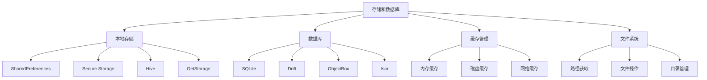

# 存储和数据库组件

> 掌握 Flutter 中本地存储、数据库操作、缓存管理等数据持久化技术的集成和使用。

## 存储方案概览



## SharedPreferences

### 基础使用

#### 1. 依赖配置

```yaml
# pubspec.yaml
dependencies:
  shared_preferences: ^2.2.2
```

#### 2. 基础操作

```dart
import 'package:shared_preferences/shared_preferences.dart';

class PreferencesService {
  static SharedPreferences? _prefs;
  
  // 初始化
  static Future<void> init() async {
    _prefs = await SharedPreferences.getInstance();
  }
  
  // 获取实例
  static SharedPreferences get instance {
    if (_prefs == null) {
      throw Exception('SharedPreferences not initialized. Call init() first.');
    }
    return _prefs!;
  }
  
  // 存储字符串
  static Future<bool> setString(String key, String value) async {
    return await instance.setString(key, value);
  }
  
  // 获取字符串
  static String? getString(String key, {String? defaultValue}) {
    return instance.getString(key) ?? defaultValue;
  }
  
  // 存储整数
  static Future<bool> setInt(String key, int value) async {
    return await instance.setInt(key, value);
  }
  
  // 获取整数
  static int getInt(String key, {int defaultValue = 0}) {
    return instance.getInt(key) ?? defaultValue;
  }
  
  // 存储布尔值
  static Future<bool> setBool(String key, bool value) async {
    return await instance.setBool(key, value);
  }
  
  // 获取布尔值
  static bool getBool(String key, {bool defaultValue = false}) {
    return instance.getBool(key) ?? defaultValue;
  }
  
  // 存储双精度浮点数
  static Future<bool> setDouble(String key, double value) async {
    return await instance.setDouble(key, value);
  }
  
  // 获取双精度浮点数
  static double getDouble(String key, {double defaultValue = 0.0}) {
    return instance.getDouble(key) ?? defaultValue;
  }
  
  // 存储字符串列表
  static Future<bool> setStringList(String key, List<String> value) async {
    return await instance.setStringList(key, value);
  }
  
  // 获取字符串列表
  static List<String> getStringList(String key, {List<String>? defaultValue}) {
    return instance.getStringList(key) ?? defaultValue ?? [];
  }
  
  // 删除键值对
  static Future<bool> remove(String key) async {
    return await instance.remove(key);
  }
  
  // 清除所有数据
  static Future<bool> clear() async {
    return await instance.clear();
  }
  
  // 检查键是否存在
  static bool containsKey(String key) {
    return instance.containsKey(key);
  }
  
  // 获取所有键
  static Set<String> getKeys() {
    return instance.getKeys();
  }
}

// 使用示例
class SettingsManager {
  static const String _themeKey = 'theme_mode';
  static const String _languageKey = 'language';
  static const String _userNameKey = 'user_name';
  static const String _isFirstLaunchKey = 'is_first_launch';
  
  // 主题设置
  static Future<void> setThemeMode(String themeMode) async {
    await PreferencesService.setString(_themeKey, themeMode);
  }
  
  static String getThemeMode() {
    return PreferencesService.getString(_themeKey, defaultValue: 'system');
  }
  
  // 语言设置
  static Future<void> setLanguage(String language) async {
    await PreferencesService.setString(_languageKey, language);
  }
  
  static String getLanguage() {
    return PreferencesService.getString(_languageKey, defaultValue: 'zh');
  }
  
  // 用户名
  static Future<void> setUserName(String userName) async {
    await PreferencesService.setString(_userNameKey, userName);
  }
  
  static String? getUserName() {
    return PreferencesService.getString(_userNameKey);
  }
  
  // 首次启动
  static Future<void> setFirstLaunch(bool isFirstLaunch) async {
    await PreferencesService.setBool(_isFirstLaunchKey, isFirstLaunch);
  }
  
  static bool isFirstLaunch() {
    return PreferencesService.getBool(_isFirstLaunchKey, defaultValue: true);
  }
}
```

### 高级用法

```dart
// 复杂数据存储
class ComplexDataManager {
  static const String _userProfileKey = 'user_profile';
  static const String _settingsKey = 'app_settings';
  
  // 存储用户配置
  static Future<void> saveUserProfile(UserProfile profile) async {
    final jsonString = jsonEncode(profile.toJson());
    await PreferencesService.setString(_userProfileKey, jsonString);
  }
  
  // 获取用户配置
  static UserProfile? getUserProfile() {
    final jsonString = PreferencesService.getString(_userProfileKey);
    if (jsonString != null) {
      final jsonMap = jsonDecode(jsonString);
      return UserProfile.fromJson(jsonMap);
    }
    return null;
  }
  
  // 存储应用设置
  static Future<void> saveAppSettings(AppSettings settings) async {
    final jsonString = jsonEncode(settings.toJson());
    await PreferencesService.setString(_settingsKey, jsonString);
  }
  
  // 获取应用设置
  static AppSettings getAppSettings() {
    final jsonString = PreferencesService.getString(_settingsKey);
    if (jsonString != null) {
      final jsonMap = jsonDecode(jsonString);
      return AppSettings.fromJson(jsonMap);
    }
    return AppSettings.defaultSettings();
  }
}

// 数据模型
class UserProfile {
  final String id;
  final String name;
  final String email;
  final String avatar;
  final DateTime lastLogin;
  
  UserProfile({
    required this.id,
    required this.name,
    required this.email,
    required this.avatar,
    required this.lastLogin,
  });
  
  Map<String, dynamic> toJson() {
    return {
      'id': id,
      'name': name,
      'email': email,
      'avatar': avatar,
      'lastLogin': lastLogin.toIso8601String(),
    };
  }
  
  factory UserProfile.fromJson(Map<String, dynamic> json) {
    return UserProfile(
      id: json['id'],
      name: json['name'],
      email: json['email'],
      avatar: json['avatar'],
      lastLogin: DateTime.parse(json['lastLogin']),
    );
  }
}

class AppSettings {
  final bool isDarkMode;
  final String language;
  final bool enableNotifications;
  final double fontSize;
  final List<String> favoriteCategories;
  
  AppSettings({
    required this.isDarkMode,
    required this.language,
    required this.enableNotifications,
    required this.fontSize,
    required this.favoriteCategories,
  });
  
  Map<String, dynamic> toJson() {
    return {
      'isDarkMode': isDarkMode,
      'language': language,
      'enableNotifications': enableNotifications,
      'fontSize': fontSize,
      'favoriteCategories': favoriteCategories,
    };
  }
  
  factory AppSettings.fromJson(Map<String, dynamic> json) {
    return AppSettings(
      isDarkMode: json['isDarkMode'],
      language: json['language'],
      enableNotifications: json['enableNotifications'],
      fontSize: json['fontSize'],
      favoriteCategories: List<String>.from(json['favoriteCategories']),
    );
  }
  
  factory AppSettings.defaultSettings() {
    return AppSettings(
      isDarkMode: false,
      language: 'zh',
      enableNotifications: true,
      fontSize: 16.0,
      favoriteCategories: [],
    );
  }
}
```

## Secure Storage

### 安全存储实现

#### 1. 依赖配置

```yaml
# pubspec.yaml
dependencies:
  flutter_secure_storage: ^9.0.0
```

#### 2. 基础使用

```dart
import 'package:flutter_secure_storage/flutter_secure_storage.dart';

class SecureStorageService {
  static const _storage = FlutterSecureStorage(
    aOptions: AndroidOptions(
      encryptedSharedPreferences: true,
    ),
    iOptions: IOSOptions(
      accessibility: KeychainAccessibility.first_unlock_this_device,
    ),
  );
  
  // 存储敏感数据
  static Future<void> write(String key, String value) async {
    try {
      await _storage.write(key: key, value: value);
    } catch (e) {
      debugPrint('Secure storage write error: $e');
      rethrow;
    }
  }
  
  // 读取敏感数据
  static Future<String?> read(String key) async {
    try {
      return await _storage.read(key: key);
    } catch (e) {
      debugPrint('Secure storage read error: $e');
      return null;
    }
  }
  
  // 删除数据
  static Future<void> delete(String key) async {
    try {
      await _storage.delete(key: key);
    } catch (e) {
      debugPrint('Secure storage delete error: $e');
    }
  }
  
  // 清除所有数据
  static Future<void> deleteAll() async {
    try {
      await _storage.deleteAll();
    } catch (e) {
      debugPrint('Secure storage deleteAll error: $e');
    }
  }
  
  // 获取所有键
  static Future<Map<String, String>> readAll() async {
    try {
      return await _storage.readAll();
    } catch (e) {
      debugPrint('Secure storage readAll error: $e');
      return {};
    }
  }
  
  // 检查键是否存在
  static Future<bool> containsKey(String key) async {
    try {
      final value = await _storage.read(key: key);
      return value != null;
    } catch (e) {
      debugPrint('Secure storage containsKey error: $e');
      return false;
    }
  }
}

// 认证信息管理
class AuthManager {
  static const String _accessTokenKey = 'access_token';
  static const String _refreshTokenKey = 'refresh_token';
  static const String _userIdKey = 'user_id';
  static const String _biometricKey = 'biometric_enabled';
  
  // 保存访问令牌
  static Future<void> saveAccessToken(String token) async {
    await SecureStorageService.write(_accessTokenKey, token);
  }
  
  // 获取访问令牌
  static Future<String?> getAccessToken() async {
    return await SecureStorageService.read(_accessTokenKey);
  }
  
  // 保存刷新令牌
  static Future<void> saveRefreshToken(String token) async {
    await SecureStorageService.write(_refreshTokenKey, token);
  }
  
  // 获取刷新令牌
  static Future<String?> getRefreshToken() async {
    return await SecureStorageService.read(_refreshTokenKey);
  }
  
  // 保存用户ID
  static Future<void> saveUserId(String userId) async {
    await SecureStorageService.write(_userIdKey, userId);
  }
  
  // 获取用户ID
  static Future<String?> getUserId() async {
    return await SecureStorageService.read(_userIdKey);
  }
  
  // 设置生物识别
  static Future<void> setBiometricEnabled(bool enabled) async {
    await SecureStorageService.write(_biometricKey, enabled.toString());
  }
  
  // 检查生物识别是否启用
  static Future<bool> isBiometricEnabled() async {
    final value = await SecureStorageService.read(_biometricKey);
    return value == 'true';
  }
  
  // 清除所有认证信息
  static Future<void> clearAuthData() async {
    await Future.wait([
      SecureStorageService.delete(_accessTokenKey),
      SecureStorageService.delete(_refreshTokenKey),
      SecureStorageService.delete(_userIdKey),
    ]);
  }
  
  // 检查是否已登录
  static Future<bool> isLoggedIn() async {
    final accessToken = await getAccessToken();
    return accessToken != null && accessToken.isNotEmpty;
  }
}
```

## Hive 数据库

### 基础配置和使用

#### 1. 依赖配置

```yaml
# pubspec.yaml
dependencies:
  hive: ^2.2.3
  hive_flutter: ^1.1.0
  
dev_dependencies:
  hive_generator: ^2.0.1
  build_runner: ^2.4.7
```

#### 2. 数据模型定义

```dart
import 'package:hive/hive.dart';

part 'user.g.dart'; // 生成的文件

@HiveType(typeId: 0)
class User extends HiveObject {
  @HiveField(0)
  String id;
  
  @HiveField(1)
  String name;
  
  @HiveField(2)
  String email;
  
  @HiveField(3)
  int age;
  
  @HiveField(4)
  DateTime createdAt;
  
  @HiveField(5)
  List<String> tags;
  
  User({
    required this.id,
    required this.name,
    required this.email,
    required this.age,
    required this.createdAt,
    required this.tags,
  });
  
  @override
  String toString() {
    return 'User{id: $id, name: $name, email: $email, age: $age}';
  }
}

@HiveType(typeId: 1)
class Task extends HiveObject {
  @HiveField(0)
  String id;
  
  @HiveField(1)
  String title;
  
  @HiveField(2)
  String description;
  
  @HiveField(3)
  bool isCompleted;
  
  @HiveField(4)
  DateTime dueDate;
  
  @HiveField(5)
  TaskPriority priority;
  
  Task({
    required this.id,
    required this.title,
    required this.description,
    required this.isCompleted,
    required this.dueDate,
    required this.priority,
  });
}

@HiveType(typeId: 2)
enum TaskPriority {
  @HiveField(0)
  low,
  
  @HiveField(1)
  medium,
  
  @HiveField(2)
  high,
  
  @HiveField(3)
  urgent,
}
```

#### 3. Hive 服务类

```dart
import 'package:hive_flutter/hive_flutter.dart';

class HiveService {
  static const String userBoxName = 'users';
  static const String taskBoxName = 'tasks';
  static const String settingsBoxName = 'settings';
  
  // 初始化 Hive
  static Future<void> init() async {
    await Hive.initFlutter();
    
    // 注册适配器
    Hive.registerAdapter(UserAdapter());
    Hive.registerAdapter(TaskAdapter());
    Hive.registerAdapter(TaskPriorityAdapter());
    
    // 打开数据库
    await Future.wait([
      Hive.openBox<User>(userBoxName),
      Hive.openBox<Task>(taskBoxName),
      Hive.openBox(settingsBoxName),
    ]);
  }
  
  // 获取用户数据库
  static Box<User> get userBox => Hive.box<User>(userBoxName);
  
  // 获取任务数据库
  static Box<Task> get taskBox => Hive.box<Task>(taskBoxName);
  
  // 获取设置数据库
  static Box get settingsBox => Hive.box(settingsBoxName);
  
  // 关闭所有数据库
  static Future<void> close() async {
    await Hive.close();
  }
}

// 用户数据管理
class UserRepository {
  static Box<User> get _box => HiveService.userBox;
  
  // 添加用户
  static Future<void> addUser(User user) async {
    await _box.put(user.id, user);
  }
  
  // 获取用户
  static User? getUser(String id) {
    return _box.get(id);
  }
  
  // 获取所有用户
  static List<User> getAllUsers() {
    return _box.values.toList();
  }
  
  // 更新用户
  static Future<void> updateUser(User user) async {
    await _box.put(user.id, user);
  }
  
  // 删除用户
  static Future<void> deleteUser(String id) async {
    await _box.delete(id);
  }
  
  // 清空所有用户
  static Future<void> clearAllUsers() async {
    await _box.clear();
  }
  
  // 搜索用户
  static List<User> searchUsers(String query) {
    return _box.values
        .where((user) =>
            user.name.toLowerCase().contains(query.toLowerCase()) ||
            user.email.toLowerCase().contains(query.toLowerCase()))
        .toList();
  }
  
  // 按年龄范围筛选用户
  static List<User> getUsersByAgeRange(int minAge, int maxAge) {
    return _box.values
        .where((user) => user.age >= minAge && user.age <= maxAge)
        .toList();
  }
  
  // 监听用户变化
  static Stream<BoxEvent> watchUsers() {
    return _box.watch();
  }
}

// 任务数据管理
class TaskRepository {
  static Box<Task> get _box => HiveService.taskBox;
  
  // 添加任务
  static Future<void> addTask(Task task) async {
    await _box.put(task.id, task);
  }
  
  // 获取任务
  static Task? getTask(String id) {
    return _box.get(id);
  }
  
  // 获取所有任务
  static List<Task> getAllTasks() {
    return _box.values.toList();
  }
  
  // 获取未完成任务
  static List<Task> getPendingTasks() {
    return _box.values.where((task) => !task.isCompleted).toList();
  }
  
  // 获取已完成任务
  static List<Task> getCompletedTasks() {
    return _box.values.where((task) => task.isCompleted).toList();
  }
  
  // 按优先级获取任务
  static List<Task> getTasksByPriority(TaskPriority priority) {
    return _box.values.where((task) => task.priority == priority).toList();
  }
  
  // 获取今日任务
  static List<Task> getTodayTasks() {
    final today = DateTime.now();
    return _box.values
        .where((task) =>
            task.dueDate.year == today.year &&
            task.dueDate.month == today.month &&
            task.dueDate.day == today.day)
        .toList();
  }
  
  // 更新任务
  static Future<void> updateTask(Task task) async {
    await _box.put(task.id, task);
  }
  
  // 标记任务完成
  static Future<void> markTaskCompleted(String id) async {
    final task = _box.get(id);
    if (task != null) {
      task.isCompleted = true;
      await task.save();
    }
  }
  
  // 删除任务
  static Future<void> deleteTask(String id) async {
    await _box.delete(id);
  }
  
  // 清空所有任务
  static Future<void> clearAllTasks() async {
    await _box.clear();
  }
  
  // 监听任务变化
  static Stream<BoxEvent> watchTasks() {
    return _box.watch();
  }
}
```

### Hive 使用示例

```dart
class HiveExampleWidget extends StatefulWidget {
  const HiveExampleWidget({Key? key}) : super(key: key);

  @override
  State<HiveExampleWidget> createState() => _HiveExampleWidgetState();
}

class _HiveExampleWidgetState extends State<HiveExampleWidget> {
  List<User> _users = [];
  List<Task> _tasks = [];
  
  @override
  void initState() {
    super.initState();
    _loadData();
    _listenToChanges();
  }
  
  void _loadData() {
    setState(() {
      _users = UserRepository.getAllUsers();
      _tasks = TaskRepository.getAllTasks();
    });
  }
  
  void _listenToChanges() {
    // 监听用户变化
    UserRepository.watchUsers().listen((event) {
      _loadData();
    });
    
    // 监听任务变化
    TaskRepository.watchTasks().listen((event) {
      _loadData();
    });
  }
  
  void _addSampleData() async {
    // 添加示例用户
    final user = User(
      id: DateTime.now().millisecondsSinceEpoch.toString(),
      name: '张三',
      email: 'zhangsan@example.com',
      age: 25,
      createdAt: DateTime.now(),
      tags: ['开发者', 'Flutter'],
    );
    await UserRepository.addUser(user);
    
    // 添加示例任务
    final task = Task(
      id: DateTime.now().millisecondsSinceEpoch.toString(),
      title: '完成项目文档',
      description: '编写项目的技术文档和用户手册',
      isCompleted: false,
      dueDate: DateTime.now().add(const Duration(days: 7)),
      priority: TaskPriority.high,
    );
    await TaskRepository.addTask(task);
  }
  
  void _clearAllData() async {
    await UserRepository.clearAllUsers();
    await TaskRepository.clearAllTasks();
  }
  
  @override
  Widget build(BuildContext context) {
    return Scaffold(
      appBar: AppBar(
        title: const Text('Hive 数据库示例'),
        actions: [
          IconButton(
            icon: const Icon(Icons.add),
            onPressed: _addSampleData,
          ),
          IconButton(
            icon: const Icon(Icons.clear),
            onPressed: _clearAllData,
          ),
        ],
      ),
      body: Column(
        children: [
          // 用户列表
          Expanded(
            child: Card(
              margin: const EdgeInsets.all(8.0),
              child: Column(
                children: [
                  Padding(
                    padding: const EdgeInsets.all(16.0),
                    child: Text(
                      '用户列表 (${_users.length})',
                      style: Theme.of(context).textTheme.titleLarge,
                    ),
                  ),
                  Expanded(
                    child: ListView.builder(
                      itemCount: _users.length,
                      itemBuilder: (context, index) {
                        final user = _users[index];
                        return ListTile(
                          leading: CircleAvatar(
                            child: Text(user.name[0]),
                          ),
                          title: Text(user.name),
                          subtitle: Text('${user.email} | 年龄: ${user.age}'),
                          trailing: IconButton(
                            icon: const Icon(Icons.delete),
                            onPressed: () {
                              UserRepository.deleteUser(user.id);
                            },
                          ),
                        );
                      },
                    ),
                  ),
                ],
              ),
            ),
          ),
          // 任务列表
          Expanded(
            child: Card(
              margin: const EdgeInsets.all(8.0),
              child: Column(
                children: [
                  Padding(
                    padding: const EdgeInsets.all(16.0),
                    child: Text(
                      '任务列表 (${_tasks.length})',
                      style: Theme.of(context).textTheme.titleLarge,
                    ),
                  ),
                  Expanded(
                    child: ListView.builder(
                      itemCount: _tasks.length,
                      itemBuilder: (context, index) {
                        final task = _tasks[index];
                        return ListTile(
                          leading: Checkbox(
                            value: task.isCompleted,
                            onChanged: (value) {
                              if (value == true) {
                                TaskRepository.markTaskCompleted(task.id);
                              }
                            },
                          ),
                          title: Text(
                            task.title,
                            style: TextStyle(
                              decoration: task.isCompleted
                                  ? TextDecoration.lineThrough
                                  : null,
                            ),
                          ),
                          subtitle: Text(
                            '${task.description}\n优先级: ${task.priority.name}',
                          ),
                          trailing: IconButton(
                            icon: const Icon(Icons.delete),
                            onPressed: () {
                              TaskRepository.deleteTask(task.id);
                            },
                          ),
                          isThreeLine: true,
                        );
                      },
                    ),
                  ),
                ],
              ),
            ),
          ),
        ],
      ),
    );
  }
}
```

## SQLite 数据库

### 基础配置和使用

#### 1. 依赖配置

```yaml
# pubspec.yaml
dependencies:
  sqflite: ^2.3.0
  path: ^1.8.3
```

#### 2. 数据库服务类

```dart
import 'package:sqflite/sqflite.dart';
import 'package:path/path.dart';

class DatabaseService {
  static Database? _database;
  static const String _databaseName = 'app_database.db';
  static const int _databaseVersion = 1;
  
  // 表名
  static const String usersTable = 'users';
  static const String postsTable = 'posts';
  static const String commentsTable = 'comments';
  
  // 获取数据库实例
  static Future<Database> get database async {
    if (_database != null) return _database!;
    _database = await _initDatabase();
    return _database!;
  }
  
  // 初始化数据库
  static Future<Database> _initDatabase() async {
    final databasePath = await getDatabasesPath();
    final path = join(databasePath, _databaseName);
    
    return await openDatabase(
      path,
      version: _databaseVersion,
      onCreate: _onCreate,
      onUpgrade: _onUpgrade,
    );
  }
  
  // 创建表
  static Future<void> _onCreate(Database db, int version) async {
    // 创建用户表
    await db.execute('''
      CREATE TABLE $usersTable (
        id INTEGER PRIMARY KEY AUTOINCREMENT,
        name TEXT NOT NULL,
        email TEXT UNIQUE NOT NULL,
        age INTEGER,
        created_at TEXT NOT NULL,
        updated_at TEXT NOT NULL
      )
    ''');
    
    // 创建文章表
    await db.execute('''
      CREATE TABLE $postsTable (
        id INTEGER PRIMARY KEY AUTOINCREMENT,
        title TEXT NOT NULL,
        content TEXT NOT NULL,
        author_id INTEGER NOT NULL,
        created_at TEXT NOT NULL,
        updated_at TEXT NOT NULL,
        FOREIGN KEY (author_id) REFERENCES $usersTable (id) ON DELETE CASCADE
      )
    ''');
    
    // 创建评论表
    await db.execute('''
      CREATE TABLE $commentsTable (
        id INTEGER PRIMARY KEY AUTOINCREMENT,
        content TEXT NOT NULL,
        post_id INTEGER NOT NULL,
        author_id INTEGER NOT NULL,
        created_at TEXT NOT NULL,
        FOREIGN KEY (post_id) REFERENCES $postsTable (id) ON DELETE CASCADE,
        FOREIGN KEY (author_id) REFERENCES $usersTable (id) ON DELETE CASCADE
      )
    ''');
    
    // 创建索引
    await db.execute('CREATE INDEX idx_posts_author_id ON $postsTable (author_id)');
    await db.execute('CREATE INDEX idx_comments_post_id ON $commentsTable (post_id)');
    await db.execute('CREATE INDEX idx_comments_author_id ON $commentsTable (author_id)');
  }
  
  // 数据库升级
  static Future<void> _onUpgrade(Database db, int oldVersion, int newVersion) async {
    // 处理数据库版本升级
    if (oldVersion < 2) {
      // 添加新列或表
    }
  }
  
  // 关闭数据库
  static Future<void> close() async {
    final db = await database;
    await db.close();
    _database = null;
  }
}

// 用户数据模型
class User {
  final int? id;
  final String name;
  final String email;
  final int age;
  final DateTime createdAt;
  final DateTime updatedAt;
  
  User({
    this.id,
    required this.name,
    required this.email,
    required this.age,
    required this.createdAt,
    required this.updatedAt,
  });
  
  Map<String, dynamic> toMap() {
    return {
      'id': id,
      'name': name,
      'email': email,
      'age': age,
      'created_at': createdAt.toIso8601String(),
      'updated_at': updatedAt.toIso8601String(),
    };
  }
  
  factory User.fromMap(Map<String, dynamic> map) {
    return User(
      id: map['id'],
      name: map['name'],
      email: map['email'],
      age: map['age'],
      createdAt: DateTime.parse(map['created_at']),
      updatedAt: DateTime.parse(map['updated_at']),
    );
  }
}

// 用户数据访问对象
class UserDao {
  // 插入用户
  static Future<int> insert(User user) async {
    final db = await DatabaseService.database;
    return await db.insert(
      DatabaseService.usersTable,
      user.toMap(),
      conflictAlgorithm: ConflictAlgorithm.replace,
    );
  }
  
  // 获取所有用户
  static Future<List<User>> getAll() async {
    final db = await DatabaseService.database;
    final List<Map<String, dynamic>> maps = await db.query(
      DatabaseService.usersTable,
      orderBy: 'created_at DESC',
    );
    
    return List.generate(maps.length, (i) {
      return User.fromMap(maps[i]);
    });
  }
  
  // 根据ID获取用户
  static Future<User?> getById(int id) async {
    final db = await DatabaseService.database;
    final List<Map<String, dynamic>> maps = await db.query(
      DatabaseService.usersTable,
      where: 'id = ?',
      whereArgs: [id],
    );
    
    if (maps.isNotEmpty) {
      return User.fromMap(maps.first);
    }
    return null;
  }
  
  // 根据邮箱获取用户
  static Future<User?> getByEmail(String email) async {
    final db = await DatabaseService.database;
    final List<Map<String, dynamic>> maps = await db.query(
      DatabaseService.usersTable,
      where: 'email = ?',
      whereArgs: [email],
    );
    
    if (maps.isNotEmpty) {
      return User.fromMap(maps.first);
    }
    return null;
  }
  
  // 搜索用户
  static Future<List<User>> search(String query) async {
    final db = await DatabaseService.database;
    final List<Map<String, dynamic>> maps = await db.query(
      DatabaseService.usersTable,
      where: 'name LIKE ? OR email LIKE ?',
      whereArgs: ['%$query%', '%$query%'],
      orderBy: 'name ASC',
    );
    
    return List.generate(maps.length, (i) {
      return User.fromMap(maps[i]);
    });
  }
  
  // 分页获取用户
  static Future<List<User>> getPaginated(int page, int pageSize) async {
    final db = await DatabaseService.database;
    final offset = (page - 1) * pageSize;
    
    final List<Map<String, dynamic>> maps = await db.query(
      DatabaseService.usersTable,
      orderBy: 'created_at DESC',
      limit: pageSize,
      offset: offset,
    );
    
    return List.generate(maps.length, (i) {
      return User.fromMap(maps[i]);
    });
  }
  
  // 更新用户
  static Future<int> update(User user) async {
    final db = await DatabaseService.database;
    return await db.update(
      DatabaseService.usersTable,
      user.toMap(),
      where: 'id = ?',
      whereArgs: [user.id],
    );
  }
  
  // 删除用户
  static Future<int> delete(int id) async {
    final db = await DatabaseService.database;
    return await db.delete(
      DatabaseService.usersTable,
      where: 'id = ?',
      whereArgs: [id],
    );
  }
  
  // 获取用户总数
  static Future<int> getCount() async {
    final db = await DatabaseService.database;
    final result = await db.rawQuery('SELECT COUNT(*) FROM ${DatabaseService.usersTable}');
    return Sqflite.firstIntValue(result) ?? 0;
  }
  
  // 批量插入用户
  static Future<void> insertBatch(List<User> users) async {
    final db = await DatabaseService.database;
    final batch = db.batch();
    
    for (final user in users) {
      batch.insert(
        DatabaseService.usersTable,
        user.toMap(),
        conflictAlgorithm: ConflictAlgorithm.replace,
      );
    }
    
    await batch.commit(noResult: true);
  }
}
```

## 文件系统操作

### 路径获取和文件操作

#### 1. 依赖配置

```yaml
# pubspec.yaml
dependencies:
  path_provider: ^2.1.1
```

#### 2. 文件服务类

```dart
import 'dart:io';
import 'dart:convert';
import 'package:path_provider/path_provider.dart';
import 'package:path/path.dart' as path;

class FileService {
  // 获取应用文档目录
  static Future<Directory> getDocumentsDirectory() async {
    return await getApplicationDocumentsDirectory();
  }
  
  // 获取应用支持目录
  static Future<Directory> getSupportDirectory() async {
    return await getApplicationSupportDirectory();
  }
  
  // 获取临时目录
  static Future<Directory> getTempDirectory() async {
    return await getTemporaryDirectory();
  }
  
  // 获取外部存储目录（Android）
  static Future<Directory?> getExternalStorageDirectory() async {
    if (Platform.isAndroid) {
      return await getExternalStorageDirectory();
    }
    return null;
  }
  
  // 写入文本文件
  static Future<File> writeTextFile(
    String fileName,
    String content, {
    Directory? directory,
  }) async {
    directory ??= await getDocumentsDirectory();
    final file = File(path.join(directory.path, fileName));
    return await file.writeAsString(content);
  }
  
  // 读取文本文件
  static Future<String?> readTextFile(
    String fileName, {
    Directory? directory,
  }) async {
    try {
      directory ??= await getDocumentsDirectory();
      final file = File(path.join(directory.path, fileName));
      
      if (await file.exists()) {
        return await file.readAsString();
      }
      return null;
    } catch (e) {
      debugPrint('读取文件失败: $e');
      return null;
    }
  }
  
  // 写入JSON文件
  static Future<File> writeJsonFile(
    String fileName,
    Map<String, dynamic> data, {
    Directory? directory,
  }) async {
    final jsonString = jsonEncode(data);
    return await writeTextFile(fileName, jsonString, directory: directory);
  }
  
  // 读取JSON文件
  static Future<Map<String, dynamic>?> readJsonFile(
    String fileName, {
    Directory? directory,
  }) async {
    try {
      final content = await readTextFile(fileName, directory: directory);
      if (content != null) {
        return jsonDecode(content);
      }
      return null;
    } catch (e) {
      debugPrint('读取JSON文件失败: $e');
      return null;
    }
  }
  
  // 写入二进制文件
  static Future<File> writeBinaryFile(
    String fileName,
    List<int> bytes, {
    Directory? directory,
  }) async {
    directory ??= await getDocumentsDirectory();
    final file = File(path.join(directory.path, fileName));
    return await file.writeAsBytes(bytes);
  }
  
  // 读取二进制文件
  static Future<List<int>?> readBinaryFile(
    String fileName, {
    Directory? directory,
  }) async {
    try {
      directory ??= await getDocumentsDirectory();
      final file = File(path.join(directory.path, fileName));
      
      if (await file.exists()) {
        return await file.readAsBytes();
      }
      return null;
    } catch (e) {
      debugPrint('读取二进制文件失败: $e');
      return null;
    }
  }
  
  // 检查文件是否存在
  static Future<bool> fileExists(
    String fileName, {
    Directory? directory,
  }) async {
    directory ??= await getDocumentsDirectory();
    final file = File(path.join(directory.path, fileName));
    return await file.exists();
  }
  
  // 删除文件
  static Future<bool> deleteFile(
    String fileName, {
    Directory? directory,
  }) async {
    try {
      directory ??= await getDocumentsDirectory();
      final file = File(path.join(directory.path, fileName));
      
      if (await file.exists()) {
        await file.delete();
        return true;
      }
      return false;
    } catch (e) {
      debugPrint('删除文件失败: $e');
      return false;
    }
  }
  
  // 获取文件大小
  static Future<int?> getFileSize(
    String fileName, {
    Directory? directory,
  }) async {
    try {
      directory ??= await getDocumentsDirectory();
      final file = File(path.join(directory.path, fileName));
      
      if (await file.exists()) {
        return await file.length();
      }
      return null;
    } catch (e) {
      debugPrint('获取文件大小失败: $e');
      return null;
    }
  }
  
  // 获取文件修改时间
  static Future<DateTime?> getFileModifiedTime(
    String fileName, {
    Directory? directory,
  }) async {
    try {
      directory ??= await getDocumentsDirectory();
      final file = File(path.join(directory.path, fileName));
      
      if (await file.exists()) {
        final stat = await file.stat();
        return stat.modified;
      }
      return null;
    } catch (e) {
      debugPrint('获取文件修改时间失败: $e');
      return null;
    }
  }
  
  // 列出目录中的所有文件
  static Future<List<FileSystemEntity>> listFiles({
    Directory? directory,
    bool recursive = false,
  }) async {
    try {
      directory ??= await getDocumentsDirectory();
      return await directory.list(recursive: recursive).toList();
    } catch (e) {
      debugPrint('列出文件失败: $e');
      return [];
    }
  }
  
  // 创建目录
  static Future<Directory> createDirectory(
    String dirName, {
    Directory? parentDirectory,
  }) async {
    parentDirectory ??= await getDocumentsDirectory();
    final directory = Directory(path.join(parentDirectory.path, dirName));
    return await directory.create(recursive: true);
  }
  
  // 复制文件
  static Future<File> copyFile(
    String sourceFileName,
    String targetFileName, {
    Directory? sourceDirectory,
    Directory? targetDirectory,
  }) async {
    sourceDirectory ??= await getDocumentsDirectory();
    targetDirectory ??= await getDocumentsDirectory();
    
    final sourceFile = File(path.join(sourceDirectory.path, sourceFileName));
    final targetFile = File(path.join(targetDirectory.path, targetFileName));
    
    return await sourceFile.copy(targetFile.path);
  }
  
  // 移动文件
  static Future<File> moveFile(
    String sourceFileName,
    String targetFileName, {
    Directory? sourceDirectory,
    Directory? targetDirectory,
  }) async {
    sourceDirectory ??= await getDocumentsDirectory();
    targetDirectory ??= await getDocumentsDirectory();
    
    final sourceFile = File(path.join(sourceDirectory.path, sourceFileName));
    final targetPath = path.join(targetDirectory.path, targetFileName);
    
    return await sourceFile.rename(targetPath);
  }
}

// 缓存管理
class CacheManager {
  static const String _cacheFileName = 'app_cache.json';
  static Map<String, dynamic> _memoryCache = {};
  
  // 设置内存缓存
  static void setMemoryCache(String key, dynamic value) {
    _memoryCache[key] = value;
  }
  
  // 获取内存缓存
  static T? getMemoryCache<T>(String key) {
    return _memoryCache[key] as T?;
  }
  
  // 清除内存缓存
  static void clearMemoryCache() {
    _memoryCache.clear();
  }
  
  // 设置磁盘缓存
  static Future<void> setDiskCache(String key, dynamic value) async {
    try {
      final cacheData = await _loadDiskCache();
      cacheData[key] = {
        'value': value,
        'timestamp': DateTime.now().millisecondsSinceEpoch,
      };
      await FileService.writeJsonFile(_cacheFileName, cacheData);
    } catch (e) {
      debugPrint('设置磁盘缓存失败: $e');
    }
  }
  
  // 获取磁盘缓存
  static Future<T?> getDiskCache<T>(
    String key, {
    Duration? maxAge,
  }) async {
    try {
      final cacheData = await _loadDiskCache();
      final item = cacheData[key];
      
      if (item != null) {
        final timestamp = item['timestamp'] as int;
        final cacheTime = DateTime.fromMillisecondsSinceEpoch(timestamp);
        
        // 检查缓存是否过期
        if (maxAge != null) {
          final now = DateTime.now();
          if (now.difference(cacheTime) > maxAge) {
            await removeDiskCache(key);
            return null;
          }
        }
        
        return item['value'] as T?;
      }
      return null;
    } catch (e) {
      debugPrint('获取磁盘缓存失败: $e');
      return null;
    }
  }
  
  // 删除磁盘缓存
  static Future<void> removeDiskCache(String key) async {
    try {
      final cacheData = await _loadDiskCache();
      cacheData.remove(key);
      await FileService.writeJsonFile(_cacheFileName, cacheData);
    } catch (e) {
      debugPrint('删除磁盘缓存失败: $e');
    }
  }
  
  // 清除所有磁盘缓存
  static Future<void> clearDiskCache() async {
    try {
      await FileService.deleteFile(_cacheFileName);
    } catch (e) {
      debugPrint('清除磁盘缓存失败: $e');
    }
  }
  
  // 加载磁盘缓存
  static Future<Map<String, dynamic>> _loadDiskCache() async {
    final cacheData = await FileService.readJsonFile(_cacheFileName);
    return cacheData ?? {};
  }
  
  // 获取缓存大小
  static Future<int> getCacheSize() async {
    try {
      final size = await FileService.getFileSize(_cacheFileName);
      return size ?? 0;
    } catch (e) {
      debugPrint('获取缓存大小失败: $e');
      return 0;
    }
  }
  
  // 清理过期缓存
  static Future<void> cleanExpiredCache(Duration maxAge) async {
    try {
      final cacheData = await _loadDiskCache();
      final now = DateTime.now();
      final keysToRemove = <String>[];
      
      cacheData.forEach((key, value) {
        final timestamp = value['timestamp'] as int;
        final cacheTime = DateTime.fromMillisecondsSinceEpoch(timestamp);
        
        if (now.difference(cacheTime) > maxAge) {
          keysToRemove.add(key);
        }
      });
      
      for (final key in keysToRemove) {
        cacheData.remove(key);
      }
      
      await FileService.writeJsonFile(_cacheFileName, cacheData);
    } catch (e) {
      debugPrint('清理过期缓存失败: $e');
    }
  }
}
```

## 存储组件最佳实践

### 性能优化

```dart
// 存储性能优化
class StorageOptimization {
  // 批量操作
  static Future<void> batchOperations() async {
    final db = await DatabaseService.database;
    
    // 使用事务进行批量操作
    await db.transaction((txn) async {
      final batch = txn.batch();
      
      // 批量插入
      for (int i = 0; i < 1000; i++) {
        batch.insert('users', {
          'name': 'User $i',
          'email': 'user$i@example.com',
          'age': 20 + (i % 50),
          'created_at': DateTime.now().toIso8601String(),
          'updated_at': DateTime.now().toIso8601String(),
        });
      }
      
      await batch.commit(noResult: true);
    });
  }
  
  // 连接池管理
  static Future<void> connectionPooling() async {
    // SQLite 自动管理连接池
    // 避免频繁打开关闭数据库
    final db = await DatabaseService.database;
    
    // 使用单例模式确保数据库连接复用
    // 在应用生命周期结束时关闭数据库
  }
  
  // 索引优化
  static Future<void> createIndexes() async {
    final db = await DatabaseService.database;
    
    // 为经常查询的字段创建索引
    await db.execute('CREATE INDEX IF NOT EXISTS idx_users_email ON users (email)');
    await db.execute('CREATE INDEX IF NOT EXISTS idx_users_age ON users (age)');
    await db.execute('CREATE INDEX IF NOT EXISTS idx_users_created_at ON users (created_at)');
  }
  
  // 分页查询
  static Future<List<Map<String, dynamic>>> paginatedQuery(
    int page,
    int pageSize,
  ) async {
    final db = await DatabaseService.database;
    final offset = (page - 1) * pageSize;
    
    return await db.query(
      'users',
      limit: pageSize,
      offset: offset,
      orderBy: 'created_at DESC',
    );
  }
}
```

### 错误处理

```dart
// 存储错误处理
class StorageErrorHandler {
  // 数据库错误处理
  static Future<T?> handleDatabaseOperation<T>(
    Future<T> Function() operation,
  ) async {
    try {
      return await operation();
    } on DatabaseException catch (e) {
      debugPrint('数据库错误: ${e.toString()}');
      
      // 根据错误类型进行处理
      if (e.isCorruptError()) {
        // 数据库损坏，尝试重建
        await _rebuildDatabase();
      } else if (e.isNoSuchTableError()) {
        // 表不存在，重新创建
        await _recreateTables();
      }
      
      return null;
    } catch (e) {
      debugPrint('未知错误: ${e.toString()}');
      return null;
    }
  }
  
  // 文件操作错误处理
  static Future<T?> handleFileOperation<T>(
    Future<T> Function() operation,
  ) async {
    try {
      return await operation();
    } on FileSystemException catch (e) {
      debugPrint('文件系统错误: ${e.toString()}');
      
      // 根据错误类型进行处理
      if (e.osError?.errorCode == 28) {
        // 磁盘空间不足
        await _cleanupTempFiles();
      } else if (e.osError?.errorCode == 13) {
        // 权限不足
        await _requestStoragePermission();
      }
      
      return null;
    } catch (e) {
      debugPrint('未知文件错误: ${e.toString()}');
      return null;
    }
  }
  
  static Future<void> _rebuildDatabase() async {
    // 重建数据库逻辑
  }
  
  static Future<void> _recreateTables() async {
    // 重新创建表逻辑
  }
  
  static Future<void> _cleanupTempFiles() async {
    // 清理临时文件逻辑
  }
  
  static Future<void> _requestStoragePermission() async {
    // 请求存储权限逻辑
  }
}
```

## 总结

存储和数据库是应用数据持久化的核心，本文档涵盖了：

### 核心功能
- **本地存储**：SharedPreferences、Secure Storage、Hive
- **数据库**：SQLite、Drift、ObjectBox、Isar
- **文件系统**：路径获取、文件操作、目录管理
- **缓存管理**：内存缓存、磁盘缓存、过期清理

### 最佳实践
- **性能优化**：批量操作、连接池、索引优化、分页查询
- **错误处理**：异常捕获、错误恢复、权限处理
- **数据安全**：加密存储、访问控制、数据备份

### 推荐组件库
- **shared_preferences**：简单键值对存储
- **flutter_secure_storage**：安全敏感数据存储
- **hive**：高性能 NoSQL 数据库
- **sqflite**：SQLite 关系型数据库
- **path_provider**：文件路径获取

## 相关资源

- [SharedPreferences 官方文档](https://pub.dev/packages/shared_preferences)
- [Flutter Secure Storage 文档](https://pub.dev/packages/flutter_secure_storage)
- [Hive 数据库文档](https://pub.dev/packages/hive)
- [SQLite 数据库文档](https://pub.dev/packages/sqflite)
- [Path Provider 文档](https://pub.dev/packages/path_provider)
- [数据持久化最佳实践](https://flutter.dev/docs/cookbook/persistence)