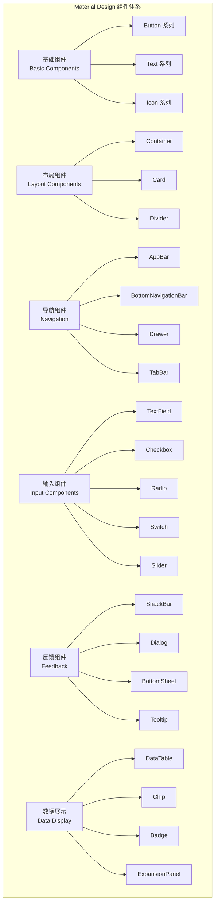

# UI 组件库集成

本文档详细介绍 Flutter 中各种 UI 组件库的使用，包括官方组件库和第三方 UI 库的集成与定制。

## 1. Material Design 组件



### 1.1 按钮组件

```dart
// 各种按钮类型
class ButtonShowcase extends StatelessWidget {
  @override
  Widget build(BuildContext context) {
    return Scaffold(
      appBar: AppBar(title: const Text('按钮组件')),
      body: Padding(
        padding: const EdgeInsets.all(16.0),
        child: Column(
          crossAxisAlignment: CrossAxisAlignment.stretch,
          children: [
            // ElevatedButton - 主要按钮
            ElevatedButton(
              onPressed: () {},
              style: ElevatedButton.styleFrom(
                backgroundColor: Colors.blue,
                foregroundColor: Colors.white,
                elevation: 8,
                shape: RoundedRectangleBorder(
                  borderRadius: BorderRadius.circular(12),
                ),
                padding: const EdgeInsets.symmetric(vertical: 16),
              ),
              child: const Text('主要按钮'),
            ),
            
            const SizedBox(height: 16),
            
            // OutlinedButton - 次要按钮
            OutlinedButton(
              onPressed: () {},
              style: OutlinedButton.styleFrom(
                side: const BorderSide(color: Colors.blue, width: 2),
                shape: RoundedRectangleBorder(
                  borderRadius: BorderRadius.circular(12),
                ),
                padding: const EdgeInsets.symmetric(vertical: 16),
              ),
              child: const Text('次要按钮'),
            ),
            
            const SizedBox(height: 16),
            
            // TextButton - 文本按钮
            TextButton(
              onPressed: () {},
              style: TextButton.styleFrom(
                foregroundColor: Colors.blue,
                padding: const EdgeInsets.symmetric(vertical: 16),
              ),
              child: const Text('文本按钮'),
            ),
            
            const SizedBox(height: 16),
            
            // IconButton - 图标按钮
            Row(
              mainAxisAlignment: MainAxisAlignment.spaceEvenly,
              children: [
                IconButton(
                  onPressed: () {},
                  icon: const Icon(Icons.favorite),
                  color: Colors.red,
                  iconSize: 32,
                ),
                IconButton(
                  onPressed: () {},
                  icon: const Icon(Icons.share),
                  color: Colors.blue,
                  iconSize: 32,
                ),
                IconButton(
                  onPressed: () {},
                  icon: const Icon(Icons.bookmark),
                  color: Colors.green,
                  iconSize: 32,
                ),
              ],
            ),
            
            const SizedBox(height: 16),
            
            // FloatingActionButton - 浮动按钮
            Row(
              mainAxisAlignment: MainAxisAlignment.spaceEvenly,
              children: [
                FloatingActionButton(
                  onPressed: () {},
                  child: const Icon(Icons.add),
                ),
                FloatingActionButton.extended(
                  onPressed: () {},
                  icon: const Icon(Icons.edit),
                  label: const Text('编辑'),
                ),
              ],
            ),
            
            const SizedBox(height: 16),
            
            // 自定义按钮
            Container(
              decoration: BoxDecoration(
                gradient: const LinearGradient(
                  colors: [Colors.purple, Colors.blue],
                ),
                borderRadius: BorderRadius.circular(12),
                boxShadow: [
                  BoxShadow(
                    color: Colors.purple.withOpacity(0.3),
                    blurRadius: 8,
                    offset: const Offset(0, 4),
                  ),
                ],
              ),
              child: Material(
                color: Colors.transparent,
                child: InkWell(
                  onTap: () {},
                  borderRadius: BorderRadius.circular(12),
                  child: const Padding(
                    padding: EdgeInsets.symmetric(vertical: 16),
                    child: Center(
                      child: Text(
                        '渐变按钮',
                        style: TextStyle(
                          color: Colors.white,
                          fontSize: 16,
                          fontWeight: FontWeight.bold,
                        ),
                      ),
                    ),
                  ),
                ),
              ),
            ),
          ],
        ),
      ),
    );
  }
}
```

### 1.2 输入组件

```dart
// 表单输入组件
class FormComponents extends StatefulWidget {
  @override
  _FormComponentsState createState() => _FormComponentsState();
}

class _FormComponentsState extends State<FormComponents> {
  final _formKey = GlobalKey<FormState>();
  final _emailController = TextEditingController();
  final _passwordController = TextEditingController();
  
  bool _isPasswordVisible = false;
  bool _agreeToTerms = false;
  String _selectedGender = 'male';
  bool _receiveNotifications = true;
  double _ageRange = 25;
  
  @override
  Widget build(BuildContext context) {
    return Scaffold(
      appBar: AppBar(title: const Text('表单组件')),
      body: Form(
        key: _formKey,
        child: Padding(
          padding: const EdgeInsets.all(16.0),
          child: Column(
            children: [
              // 邮箱输入
              TextFormField(
                controller: _emailController,
                keyboardType: TextInputType.emailAddress,
                decoration: InputDecoration(
                  labelText: '邮箱地址',
                  hintText: '请输入邮箱地址',
                  prefixIcon: const Icon(Icons.email),
                  border: OutlineInputBorder(
                    borderRadius: BorderRadius.circular(12),
                  ),
                  filled: true,
                  fillColor: Colors.grey[50],
                ),
                validator: (value) {
                  if (value == null || value.isEmpty) {
                    return '请输入邮箱地址';
                  }
                  if (!RegExp(r'^[\w-\.]+@([\w-]+\.)+[\w-]{2,4}$').hasMatch(value)) {
                    return '请输入有效的邮箱地址';
                  }
                  return null;
                },
              ),
              
              const SizedBox(height: 16),
              
              // 密码输入
              TextFormField(
                controller: _passwordController,
                obscureText: !_isPasswordVisible,
                decoration: InputDecoration(
                  labelText: '密码',
                  hintText: '请输入密码',
                  prefixIcon: const Icon(Icons.lock),
                  suffixIcon: IconButton(
                    icon: Icon(
                      _isPasswordVisible ? Icons.visibility : Icons.visibility_off,
                    ),
                    onPressed: () {
                      setState(() {
                        _isPasswordVisible = !_isPasswordVisible;
                      });
                    },
                  ),
                  border: OutlineInputBorder(
                    borderRadius: BorderRadius.circular(12),
                  ),
                  filled: true,
                  fillColor: Colors.grey[50],
                ),
                validator: (value) {
                  if (value == null || value.isEmpty) {
                    return '请输入密码';
                  }
                  if (value.length < 6) {
                    return '密码长度至少6位';
                  }
                  return null;
                },
              ),
              
              const SizedBox(height: 16),
              
              // 性别选择 - Radio
              Card(
                child: Padding(
                  padding: const EdgeInsets.all(16.0),
                  child: Column(
                    crossAxisAlignment: CrossAxisAlignment.start,
                    children: [
                      const Text(
                        '性别',
                        style: TextStyle(
                          fontSize: 16,
                          fontWeight: FontWeight.bold,
                        ),
                      ),
                      Row(
                        children: [
                          Radio<String>(
                            value: 'male',
                            groupValue: _selectedGender,
                            onChanged: (value) {
                              setState(() {
                                _selectedGender = value!;
                              });
                            },
                          ),
                          const Text('男'),
                          Radio<String>(
                            value: 'female',
                            groupValue: _selectedGender,
                            onChanged: (value) {
                              setState(() {
                                _selectedGender = value!;
                              });
                            },
                          ),
                          const Text('女'),
                        ],
                      ),
                    ],
                  ),
                ),
              ),
              
              const SizedBox(height: 16),
              
              // 年龄范围 - Slider
              Card(
                child: Padding(
                  padding: const EdgeInsets.all(16.0),
                  child: Column(
                    crossAxisAlignment: CrossAxisAlignment.start,
                    children: [
                      Text(
                        '年龄: ${_ageRange.round()}',
                        style: const TextStyle(
                          fontSize: 16,
                          fontWeight: FontWeight.bold,
                        ),
                      ),
                      Slider(
                        value: _ageRange,
                        min: 18,
                        max: 80,
                        divisions: 62,
                        label: _ageRange.round().toString(),
                        onChanged: (value) {
                          setState(() {
                            _ageRange = value;
                          });
                        },
                      ),
                    ],
                  ),
                ),
              ),
              
              const SizedBox(height: 16),
              
              // 开关选项
              Card(
                child: Padding(
                  padding: const EdgeInsets.all(16.0),
                  child: Column(
                    children: [
                      SwitchListTile(
                        title: const Text('接收通知'),
                        subtitle: const Text('允许应用发送推送通知'),
                        value: _receiveNotifications,
                        onChanged: (value) {
                          setState(() {
                            _receiveNotifications = value;
                          });
                        },
                      ),
                      CheckboxListTile(
                        title: const Text('同意用户协议'),
                        subtitle: const Text('我已阅读并同意用户协议和隐私政策'),
                        value: _agreeToTerms,
                        onChanged: (value) {
                          setState(() {
                            _agreeToTerms = value!;
                          });
                        },
                        controlAffinity: ListTileControlAffinity.leading,
                      ),
                    ],
                  ),
                ),
              ),
              
              const SizedBox(height: 24),
              
              // 提交按钮
              SizedBox(
                width: double.infinity,
                child: ElevatedButton(
                  onPressed: _agreeToTerms ? _submitForm : null,
                  style: ElevatedButton.styleFrom(
                    padding: const EdgeInsets.symmetric(vertical: 16),
                    shape: RoundedRectangleBorder(
                      borderRadius: BorderRadius.circular(12),
                    ),
                  ),
                  child: const Text(
                    '提交',
                    style: TextStyle(fontSize: 16),
                  ),
                ),
              ),
            ],
          ),
        ),
      ),
    );
  }
  
  void _submitForm() {
    if (_formKey.currentState!.validate()) {
      // 处理表单提交
      ScaffoldMessenger.of(context).showSnackBar(
        const SnackBar(
          content: Text('表单提交成功！'),
          backgroundColor: Colors.green,
        ),
      );
    }
  }
  
  @override
  void dispose() {
    _emailController.dispose();
    _passwordController.dispose();
    super.dispose();
  }
}
```

### 1.3 导航组件

```dart
// 导航组件示例
class NavigationComponents extends StatefulWidget {
  @override
  _NavigationComponentsState createState() => _NavigationComponentsState();
}

class _NavigationComponentsState extends State<NavigationComponents>
    with TickerProviderStateMixin {
  int _currentIndex = 0;
  late TabController _tabController;
  
  @override
  void initState() {
    super.initState();
    _tabController = TabController(length: 3, vsync: this);
  }
  
  @override
  Widget build(BuildContext context) {
    return Scaffold(
      // 自定义 AppBar
      appBar: AppBar(
        title: const Text('导航组件'),
        backgroundColor: Colors.blue,
        foregroundColor: Colors.white,
        elevation: 4,
        centerTitle: true,
        actions: [
          IconButton(
            icon: const Icon(Icons.search),
            onPressed: () {},
          ),
          IconButton(
            icon: const Icon(Icons.more_vert),
            onPressed: () {
              _showPopupMenu(context);
            },
          ),
        ],
        bottom: TabBar(
          controller: _tabController,
          tabs: const [
            Tab(icon: Icon(Icons.home), text: '首页'),
            Tab(icon: Icon(Icons.favorite), text: '收藏'),
            Tab(icon: Icon(Icons.person), text: '我的'),
          ],
          indicatorColor: Colors.white,
          labelColor: Colors.white,
          unselectedLabelColor: Colors.white70,
        ),
      ),
      
      // 侧边抽屉
      drawer: Drawer(
        child: ListView(
          padding: EdgeInsets.zero,
          children: [
            const UserAccountsDrawerHeader(
              accountName: Text('用户名'),
              accountEmail: Text('user@example.com'),
              currentAccountPicture: CircleAvatar(
                backgroundColor: Colors.white,
                child: Icon(
                  Icons.person,
                  size: 40,
                  color: Colors.blue,
                ),
              ),
              decoration: BoxDecoration(
                gradient: LinearGradient(
                  colors: [Colors.blue, Colors.purple],
                ),
              ),
            ),
            ListTile(
              leading: const Icon(Icons.home),
              title: const Text('首页'),
              onTap: () {
                Navigator.pop(context);
              },
            ),
            ListTile(
              leading: const Icon(Icons.settings),
              title: const Text('设置'),
              onTap: () {
                Navigator.pop(context);
              },
            ),
            ListTile(
              leading: const Icon(Icons.help),
              title: const Text('帮助'),
              onTap: () {
                Navigator.pop(context);
              },
            ),
            const Divider(),
            ListTile(
              leading: const Icon(Icons.logout),
              title: const Text('退出登录'),
              onTap: () {
                Navigator.pop(context);
              },
            ),
          ],
        ),
      ),
      
      // 主体内容
      body: TabBarView(
        controller: _tabController,
        children: [
          _buildHomeTab(),
          _buildFavoriteTab(),
          _buildProfileTab(),
        ],
      ),
      
      // 底部导航栏
      bottomNavigationBar: BottomNavigationBar(
        currentIndex: _currentIndex,
        onTap: (index) {
          setState(() {
            _currentIndex = index;
          });
        },
        type: BottomNavigationBarType.fixed,
        selectedItemColor: Colors.blue,
        unselectedItemColor: Colors.grey,
        items: const [
          BottomNavigationBarItem(
            icon: Icon(Icons.home),
            label: '首页',
          ),
          BottomNavigationBarItem(
            icon: Icon(Icons.explore),
            label: '发现',
          ),
          BottomNavigationBarItem(
            icon: Icon(Icons.notifications),
            label: '通知',
          ),
          BottomNavigationBarItem(
            icon: Icon(Icons.person),
            label: '我的',
          ),
        ],
      ),
      
      // 浮动按钮
      floatingActionButton: FloatingActionButton(
        onPressed: () {
          _showBottomSheet(context);
        },
        child: const Icon(Icons.add),
      ),
    );
  }
  
  Widget _buildHomeTab() {
    return const Center(
      child: Text(
        '首页内容',
        style: TextStyle(fontSize: 24),
      ),
    );
  }
  
  Widget _buildFavoriteTab() {
    return const Center(
      child: Text(
        '收藏内容',
        style: TextStyle(fontSize: 24),
      ),
    );
  }
  
  Widget _buildProfileTab() {
    return const Center(
      child: Text(
        '个人资料',
        style: TextStyle(fontSize: 24),
      ),
    );
  }
  
  void _showPopupMenu(BuildContext context) {
    showMenu(
      context: context,
      position: const RelativeRect.fromLTRB(100, 100, 0, 0),
      items: [
        const PopupMenuItem(
          value: 'refresh',
          child: ListTile(
            leading: Icon(Icons.refresh),
            title: Text('刷新'),
          ),
        ),
        const PopupMenuItem(
          value: 'share',
          child: ListTile(
            leading: Icon(Icons.share),
            title: Text('分享'),
          ),
        ),
        const PopupMenuItem(
          value: 'settings',
          child: ListTile(
            leading: Icon(Icons.settings),
            title: Text('设置'),
          ),
        ),
      ],
    ).then((value) {
      if (value != null) {
        ScaffoldMessenger.of(context).showSnackBar(
          SnackBar(content: Text('选择了: $value')),
        );
      }
    });
  }
  
  void _showBottomSheet(BuildContext context) {
    showModalBottomSheet(
      context: context,
      shape: const RoundedRectangleBorder(
        borderRadius: BorderRadius.vertical(top: Radius.circular(20)),
      ),
      builder: (context) {
        return Container(
          padding: const EdgeInsets.all(20),
          child: Column(
            mainAxisSize: MainAxisSize.min,
            children: [
              Container(
                width: 40,
                height: 4,
                decoration: BoxDecoration(
                  color: Colors.grey[300],
                  borderRadius: BorderRadius.circular(2),
                ),
              ),
              const SizedBox(height: 20),
              const Text(
                '选择操作',
                style: TextStyle(
                  fontSize: 18,
                  fontWeight: FontWeight.bold,
                ),
              ),
              const SizedBox(height: 20),
              ListTile(
                leading: const Icon(Icons.photo_camera),
                title: const Text('拍照'),
                onTap: () {
                  Navigator.pop(context);
                },
              ),
              ListTile(
                leading: const Icon(Icons.photo_library),
                title: const Text('从相册选择'),
                onTap: () {
                  Navigator.pop(context);
                },
              ),
              ListTile(
                leading: const Icon(Icons.file_upload),
                title: const Text('上传文件'),
                onTap: () {
                  Navigator.pop(context);
                },
              ),
            ],
          ),
        );
      },
    );
  }
  
  @override
  void dispose() {
    _tabController.dispose();
    super.dispose();
  }
}
```

## 2. Cupertino 组件

### 2.1 iOS 风格组件

```dart
// iOS 风格组件示例
import 'package:flutter/cupertino.dart';

class CupertinoComponents extends StatefulWidget {
  @override
  _CupertinoComponentsState createState() => _CupertinoComponentsState();
}

class _CupertinoComponentsState extends State<CupertinoComponents> {
  bool _switchValue = false;
  double _sliderValue = 0.5;
  int _segmentedValue = 0;
  DateTime _selectedDate = DateTime.now();
  
  @override
  Widget build(BuildContext context) {
    return CupertinoPageScaffold(
      navigationBar: const CupertinoNavigationBar(
        middle: Text('iOS 风格组件'),
        backgroundColor: CupertinoColors.systemBackground,
      ),
      child: SafeArea(
        child: ListView(
          padding: const EdgeInsets.all(16),
          children: [
            // iOS 风格按钮
            CupertinoButton(
              color: CupertinoColors.activeBlue,
              onPressed: () {},
              child: const Text('iOS 按钮'),
            ),
            
            const SizedBox(height: 16),
            
            CupertinoButton.filled(
              onPressed: () {},
              child: const Text('填充按钮'),
            ),
            
            const SizedBox(height: 16),
            
            // iOS 风格输入框
            CupertinoTextField(
              placeholder: '请输入文本',
              padding: const EdgeInsets.all(12),
              decoration: BoxDecoration(
                border: Border.all(color: CupertinoColors.systemGrey4),
                borderRadius: BorderRadius.circular(8),
              ),
            ),
            
            const SizedBox(height: 16),
            
            // iOS 风格搜索框
            CupertinoSearchTextField(
              placeholder: '搜索',
              onChanged: (value) {
                print('搜索: $value');
              },
            ),
            
            const SizedBox(height: 16),
            
            // iOS 风格开关
            Row(
              mainAxisAlignment: MainAxisAlignment.spaceBetween,
              children: [
                const Text('开关'),
                CupertinoSwitch(
                  value: _switchValue,
                  onChanged: (value) {
                    setState(() {
                      _switchValue = value;
                    });
                  },
                ),
              ],
            ),
            
            const SizedBox(height: 16),
            
            // iOS 风格滑块
            Column(
              crossAxisAlignment: CrossAxisAlignment.start,
              children: [
                Text('滑块值: ${(_sliderValue * 100).round()}%'),
                CupertinoSlider(
                  value: _sliderValue,
                  onChanged: (value) {
                    setState(() {
                      _sliderValue = value;
                    });
                  },
                ),
              ],
            ),
            
            const SizedBox(height: 16),
            
            // iOS 风格分段控制器
            CupertinoSegmentedControl<int>(
              children: const {
                0: Padding(
                  padding: EdgeInsets.all(8),
                  child: Text('第一个'),
                ),
                1: Padding(
                  padding: EdgeInsets.all(8),
                  child: Text('第二个'),
                ),
                2: Padding(
                  padding: EdgeInsets.all(8),
                  child: Text('第三个'),
                ),
              },
              groupValue: _segmentedValue,
              onValueChanged: (value) {
                setState(() {
                  _segmentedValue = value;
                });
              },
            ),
            
            const SizedBox(height: 16),
            
            // iOS 风格列表项
            CupertinoListSection(
              header: const Text('设置'),
              children: [
                CupertinoListTile(
                  leading: const Icon(
                    CupertinoIcons.person,
                    color: CupertinoColors.systemBlue,
                  ),
                  title: const Text('个人资料'),
                  trailing: const CupertinoListTileChevron(),
                  onTap: () {},
                ),
                CupertinoListTile(
                  leading: const Icon(
                    CupertinoIcons.bell,
                    color: CupertinoColors.systemOrange,
                  ),
                  title: const Text('通知'),
                  trailing: const CupertinoListTileChevron(),
                  onTap: () {},
                ),
                CupertinoListTile(
                  leading: const Icon(
                    CupertinoIcons.lock,
                    color: CupertinoColors.systemRed,
                  ),
                  title: const Text('隐私'),
                  trailing: const CupertinoListTileChevron(),
                  onTap: () {},
                ),
              ],
            ),
            
            const SizedBox(height: 16),
            
            // iOS 风格按钮组
            Row(
              children: [
                Expanded(
                  child: CupertinoButton(
                    color: CupertinoColors.systemRed,
                    onPressed: () {
                      _showCupertinoDialog();
                    },
                    child: const Text('显示对话框'),
                  ),
                ),
                const SizedBox(width: 16),
                Expanded(
                  child: CupertinoButton(
                    color: CupertinoColors.systemGreen,
                    onPressed: () {
                      _showCupertinoActionSheet();
                    },
                    child: const Text('显示操作表'),
                  ),
                ),
              ],
            ),
            
            const SizedBox(height: 16),
            
            // 日期选择器
            CupertinoButton(
              color: CupertinoColors.systemPurple,
              onPressed: () {
                _showDatePicker();
              },
              child: Text(
                '选择日期: ${_selectedDate.year}-${_selectedDate.month}-${_selectedDate.day}',
              ),
            ),
          ],
        ),
      ),
    );
  }
  
  void _showCupertinoDialog() {
    showCupertinoDialog(
      context: context,
      builder: (context) {
        return CupertinoAlertDialog(
          title: const Text('提示'),
          content: const Text('这是一个 iOS 风格的对话框'),
          actions: [
            CupertinoDialogAction(
              child: const Text('取消'),
              onPressed: () {
                Navigator.pop(context);
              },
            ),
            CupertinoDialogAction(
              isDestructiveAction: true,
              child: const Text('确定'),
              onPressed: () {
                Navigator.pop(context);
              },
            ),
          ],
        );
      },
    );
  }
  
  void _showCupertinoActionSheet() {
    showCupertinoModalPopup(
      context: context,
      builder: (context) {
        return CupertinoActionSheet(
          title: const Text('选择操作'),
          message: const Text('请选择要执行的操作'),
          actions: [
            CupertinoActionSheetAction(
              child: const Text('编辑'),
              onPressed: () {
                Navigator.pop(context);
              },
            ),
            CupertinoActionSheetAction(
              child: const Text('分享'),
              onPressed: () {
                Navigator.pop(context);
              },
            ),
            CupertinoActionSheetAction(
              isDestructiveAction: true,
              child: const Text('删除'),
              onPressed: () {
                Navigator.pop(context);
              },
            ),
          ],
          cancelButton: CupertinoActionSheetAction(
            child: const Text('取消'),
            onPressed: () {
              Navigator.pop(context);
            },
          ),
        );
      },
    );
  }
  
  void _showDatePicker() {
    showCupertinoModalPopup(
      context: context,
      builder: (context) {
        return Container(
          height: 300,
          color: CupertinoColors.systemBackground.resolveFrom(context),
          child: Column(
            children: [
              Container(
                height: 50,
                decoration: const BoxDecoration(
                  border: Border(
                    bottom: BorderSide(
                      color: CupertinoColors.systemGrey4,
                      width: 0.5,
                    ),
                  ),
                ),
                child: Row(
                  mainAxisAlignment: MainAxisAlignment.spaceBetween,
                  children: [
                    CupertinoButton(
                      child: const Text('取消'),
                      onPressed: () {
                        Navigator.pop(context);
                      },
                    ),
                    CupertinoButton(
                      child: const Text('确定'),
                      onPressed: () {
                        Navigator.pop(context);
                      },
                    ),
                  ],
                ),
              ),
              Expanded(
                child: CupertinoDatePicker(
                  mode: CupertinoDatePickerMode.date,
                  initialDateTime: _selectedDate,
                  onDateTimeChanged: (date) {
                    setState(() {
                      _selectedDate = date;
                    });
                  },
                ),
              ),
            ],
          ),
        );
      },
    );
  }
}
```

## 3. 第三方 UI 库

### 3.1 GetX UI 组件

```yaml
# pubspec.yaml
dependencies:
  get: ^4.6.6
```

```dart
// GetX UI 组件示例
import 'package:get/get.dart';

class GetXUIComponents extends StatelessWidget {
  @override
  Widget build(BuildContext context) {
    return Scaffold(
      appBar: AppBar(
        title: const Text('GetX UI 组件'),
      ),
      body: Padding(
        padding: const EdgeInsets.all(16),
        child: Column(
          children: [
            // GetX 按钮
            ElevatedButton(
              onPressed: () {
                // GetX SnackBar
                Get.snackbar(
                  '提示',
                  '这是 GetX 的 SnackBar',
                  snackPosition: SnackPosition.BOTTOM,
                  backgroundColor: Colors.blue,
                  colorText: Colors.white,
                  duration: const Duration(seconds: 3),
                  margin: const EdgeInsets.all(16),
                  borderRadius: 8,
                  icon: const Icon(
                    Icons.info,
                    color: Colors.white,
                  ),
                );
              },
              child: const Text('显示 GetX SnackBar'),
            ),
            
            const SizedBox(height: 16),
            
            ElevatedButton(
              onPressed: () {
                // GetX Dialog
                Get.dialog(
                  AlertDialog(
                    title: const Text('GetX Dialog'),
                    content: const Text('这是使用 GetX 显示的对话框'),
                    actions: [
                      TextButton(
                        onPressed: () => Get.back(),
                        child: const Text('取消'),
                      ),
                      TextButton(
                        onPressed: () {
                          Get.back();
                          Get.snackbar('成功', '操作完成');
                        },
                        child: const Text('确定'),
                      ),
                    ],
                  ),
                );
              },
              child: const Text('显示 GetX Dialog'),
            ),
            
            const SizedBox(height: 16),
            
            ElevatedButton(
              onPressed: () {
                // GetX BottomSheet
                Get.bottomSheet(
                  Container(
                    height: 200,
                    decoration: const BoxDecoration(
                      color: Colors.white,
                      borderRadius: BorderRadius.vertical(
                        top: Radius.circular(20),
                      ),
                    ),
                    child: Column(
                      children: [
                        Container(
                          width: 40,
                          height: 4,
                          margin: const EdgeInsets.symmetric(vertical: 10),
                          decoration: BoxDecoration(
                            color: Colors.grey[300],
                            borderRadius: BorderRadius.circular(2),
                          ),
                        ),
                        const Text(
                          'GetX BottomSheet',
                          style: TextStyle(
                            fontSize: 18,
                            fontWeight: FontWeight.bold,
                          ),
                        ),
                        const SizedBox(height: 20),
                        ListTile(
                          leading: const Icon(Icons.share),
                          title: const Text('分享'),
                          onTap: () => Get.back(),
                        ),
                        ListTile(
                          leading: const Icon(Icons.edit),
                          title: const Text('编辑'),
                          onTap: () => Get.back(),
                        ),
                      ],
                    ),
                  ),
                );
              },
              child: const Text('显示 GetX BottomSheet'),
            ),
            
            const SizedBox(height: 16),
            
            ElevatedButton(
              onPressed: () {
                // GetX 加载指示器
                Get.dialog(
                  const Center(
                    child: CircularProgressIndicator(),
                  ),
                  barrierDismissible: false,
                );
                
                // 模拟异步操作
                Future.delayed(const Duration(seconds: 2), () {
                  Get.back();
                  Get.snackbar('完成', '操作已完成');
                });
              },
              child: const Text('显示加载指示器'),
            ),
          ],
        ),
      ),
    );
  }
}
```

### 3.2 Flutter Neumorphic

```yaml
# pubspec.yaml
dependencies:
  flutter_neumorphic: ^3.2.0
```

```dart
// Neumorphic 风格组件
import 'package:flutter_neumorphic/flutter_neumorphic.dart';

class NeumorphicComponents extends StatefulWidget {
  @override
  _NeumorphicComponentsState createState() => _NeumorphicComponentsState();
}

class _NeumorphicComponentsState extends State<NeumorphicComponents> {
  bool _switchValue = false;
  double _sliderValue = 0.5;
  
  @override
  Widget build(BuildContext context) {
    return NeumorphicApp(
      debugShowCheckedModeBanner: false,
      theme: const NeumorphicThemeData(
        baseColor: Color(0xFFE0E5EC),
        lightSource: LightSource.topLeft,
        depth: 10,
      ),
      home: Scaffold(
        backgroundColor: NeumorphicTheme.baseColor(context),
        appBar: NeumorphicAppBar(
          title: const Text('Neumorphic 组件'),
        ),
        body: Padding(
          padding: const EdgeInsets.all(16),
          child: Column(
            children: [
              // Neumorphic 按钮
              NeumorphicButton(
                onPressed: () {},
                style: NeumorphicStyle(
                  shape: NeumorphicShape.flat,
                  boxShape: NeumorphicBoxShape.roundRect(
                    BorderRadius.circular(12),
                  ),
                ),
                padding: const EdgeInsets.all(16),
                child: const Text(
                  'Neumorphic 按钮',
                  style: TextStyle(fontSize: 16),
                ),
              ),
              
              const SizedBox(height: 20),
              
              // Neumorphic 容器
              Neumorphic(
                style: NeumorphicStyle(
                  shape: NeumorphicShape.concave,
                  boxShape: NeumorphicBoxShape.roundRect(
                    BorderRadius.circular(12),
                  ),
                  depth: 8,
                  lightSource: LightSource.topLeft,
                  color: NeumorphicTheme.baseColor(context),
                ),
                padding: const EdgeInsets.all(20),
                child: const Text(
                  'Neumorphic 容器',
                  style: TextStyle(fontSize: 16),
                ),
              ),
              
              const SizedBox(height: 20),
              
              // Neumorphic 开关
              Row(
                mainAxisAlignment: MainAxisAlignment.spaceBetween,
                children: [
                  const Text('Neumorphic 开关'),
                  NeumorphicSwitch(
                    value: _switchValue,
                    onChanged: (value) {
                      setState(() {
                        _switchValue = value;
                      });
                    },
                  ),
                ],
              ),
              
              const SizedBox(height: 20),
              
              // Neumorphic 滑块
              Column(
                crossAxisAlignment: CrossAxisAlignment.start,
                children: [
                  Text('滑块值: ${(_sliderValue * 100).round()}%'),
                  const SizedBox(height: 10),
                  NeumorphicSlider(
                    value: _sliderValue,
                    onChanged: (value) {
                      setState(() {
                        _sliderValue = value;
                      });
                    },
                  ),
                ],
              ),
              
              const SizedBox(height: 20),
              
              // Neumorphic 进度条
              Column(
                crossAxisAlignment: CrossAxisAlignment.start,
                children: [
                  const Text('进度条'),
                  const SizedBox(height: 10),
                  NeumorphicProgress(
                    percent: _sliderValue,
                    height: 10,
                  ),
                ],
              ),
              
              const SizedBox(height: 20),
              
              // Neumorphic 文本输入框
              Neumorphic(
                style: NeumorphicStyle(
                  depth: -5,
                  boxShape: NeumorphicBoxShape.roundRect(
                    BorderRadius.circular(12),
                  ),
                ),
                padding: const EdgeInsets.symmetric(
                  horizontal: 16,
                  vertical: 4,
                ),
                child: const TextField(
                  decoration: InputDecoration(
                    hintText: 'Neumorphic 输入框',
                    border: InputBorder.none,
                  ),
                ),
              ),
            ],
          ),
        ),
        floatingActionButton: NeumorphicFloatingActionButton(
          child: const Icon(Icons.add),
          onPressed: () {},
        ),
      ),
    );
  }
}
```

## 4. 主题定制

### 4.1 Material 主题定制

```dart
// 自定义 Material 主题
class CustomMaterialTheme {
  static ThemeData get lightTheme {
    return ThemeData(
      useMaterial3: true,
      colorScheme: ColorScheme.fromSeed(
        seedColor: Colors.blue,
        brightness: Brightness.light,
      ),
      
      // AppBar 主题
      appBarTheme: const AppBarTheme(
        centerTitle: true,
        elevation: 4,
        shadowColor: Colors.black26,
        titleTextStyle: TextStyle(
          fontSize: 20,
          fontWeight: FontWeight.bold,
        ),
      ),
      
      // 按钮主题
      elevatedButtonTheme: ElevatedButtonThemeData(
        style: ElevatedButton.styleFrom(
          padding: const EdgeInsets.symmetric(
            horizontal: 24,
            vertical: 12,
          ),
          shape: RoundedRectangleBorder(
            borderRadius: BorderRadius.circular(12),
          ),
          elevation: 4,
        ),
      ),
      
      outlinedButtonTheme: OutlinedButtonThemeData(
        style: OutlinedButton.styleFrom(
          padding: const EdgeInsets.symmetric(
            horizontal: 24,
            vertical: 12,
          ),
          shape: RoundedRectangleBorder(
            borderRadius: BorderRadius.circular(12),
          ),
          side: const BorderSide(width: 2),
        ),
      ),
      
      // 输入框主题
      inputDecorationTheme: InputDecorationTheme(
        filled: true,
        fillColor: Colors.grey[50],
        border: OutlineInputBorder(
          borderRadius: BorderRadius.circular(12),
          borderSide: BorderSide(color: Colors.grey[300]!),
        ),
        enabledBorder: OutlineInputBorder(
          borderRadius: BorderRadius.circular(12),
          borderSide: BorderSide(color: Colors.grey[300]!),
        ),
        focusedBorder: OutlineInputBorder(
          borderRadius: BorderRadius.circular(12),
          borderSide: const BorderSide(color: Colors.blue, width: 2),
        ),
        errorBorder: OutlineInputBorder(
          borderRadius: BorderRadius.circular(12),
          borderSide: const BorderSide(color: Colors.red, width: 2),
        ),
        contentPadding: const EdgeInsets.symmetric(
          horizontal: 16,
          vertical: 12,
        ),
      ),
      
      // 卡片主题
      cardTheme: CardTheme(
        elevation: 4,
        shape: RoundedRectangleBorder(
          borderRadius: BorderRadius.circular(12),
        ),
        margin: const EdgeInsets.all(8),
      ),
      
      // 列表项主题
      listTileTheme: const ListTileThemeData(
        contentPadding: EdgeInsets.symmetric(
          horizontal: 16,
          vertical: 8,
        ),
      ),
      
      // 文本主题
      textTheme: const TextTheme(
        headlineLarge: TextStyle(
          fontSize: 32,
          fontWeight: FontWeight.bold,
        ),
        headlineMedium: TextStyle(
          fontSize: 28,
          fontWeight: FontWeight.bold,
        ),
        headlineSmall: TextStyle(
          fontSize: 24,
          fontWeight: FontWeight.bold,
        ),
        titleLarge: TextStyle(
          fontSize: 20,
          fontWeight: FontWeight.w600,
        ),
        titleMedium: TextStyle(
          fontSize: 16,
          fontWeight: FontWeight.w600,
        ),
        bodyLarge: TextStyle(
          fontSize: 16,
        ),
        bodyMedium: TextStyle(
          fontSize: 14,
        ),
      ),
    );
  }
  
  static ThemeData get darkTheme {
    return ThemeData(
      useMaterial3: true,
      colorScheme: ColorScheme.fromSeed(
        seedColor: Colors.blue,
        brightness: Brightness.dark,
      ),
      
      // 深色主题特定配置
      appBarTheme: const AppBarTheme(
        centerTitle: true,
        elevation: 4,
        shadowColor: Colors.black54,
      ),
      
      inputDecorationTheme: InputDecorationTheme(
        filled: true,
        fillColor: Colors.grey[800],
        border: OutlineInputBorder(
          borderRadius: BorderRadius.circular(12),
          borderSide: BorderSide(color: Colors.grey[600]!),
        ),
        enabledBorder: OutlineInputBorder(
          borderRadius: BorderRadius.circular(12),
          borderSide: BorderSide(color: Colors.grey[600]!),
        ),
        focusedBorder: OutlineInputBorder(
          borderRadius: BorderRadius.circular(12),
          borderSide: const BorderSide(color: Colors.blue, width: 2),
        ),
      ),
    );
  }
}

// 在 main.dart 中使用
class MyApp extends StatelessWidget {
  @override
  Widget build(BuildContext context) {
    return MaterialApp(
      title: 'Custom Theme App',
      theme: CustomMaterialTheme.lightTheme,
      darkTheme: CustomMaterialTheme.darkTheme,
      themeMode: ThemeMode.system,
      home: const HomePage(),
    );
  }
}
```

### 4.2 动态主题切换

```dart
// 主题管理器
class ThemeManager extends ChangeNotifier {
  ThemeMode _themeMode = ThemeMode.system;
  Color _primaryColor = Colors.blue;
  
  ThemeMode get themeMode => _themeMode;
  Color get primaryColor => _primaryColor;
  
  void setThemeMode(ThemeMode mode) {
    _themeMode = mode;
    notifyListeners();
  }
  
  void setPrimaryColor(Color color) {
    _primaryColor = color;
    notifyListeners();
  }
  
  ThemeData get lightTheme {
    return ThemeData(
      useMaterial3: true,
      colorScheme: ColorScheme.fromSeed(
        seedColor: _primaryColor,
        brightness: Brightness.light,
      ),
    );
  }
  
  ThemeData get darkTheme {
    return ThemeData(
      useMaterial3: true,
      colorScheme: ColorScheme.fromSeed(
        seedColor: _primaryColor,
        brightness: Brightness.dark,
      ),
    );
  }
}

// 主题设置页面
class ThemeSettingsPage extends StatelessWidget {
  @override
  Widget build(BuildContext context) {
    return Scaffold(
      appBar: AppBar(
        title: const Text('主题设置'),
      ),
      body: Consumer<ThemeManager>(
        builder: (context, themeManager, child) {
          return ListView(
            padding: const EdgeInsets.all(16),
            children: [
              // 主题模式选择
              Card(
                child: Padding(
                  padding: const EdgeInsets.all(16),
                  child: Column(
                    crossAxisAlignment: CrossAxisAlignment.start,
                    children: [
                      const Text(
                        '主题模式',
                        style: TextStyle(
                          fontSize: 18,
                          fontWeight: FontWeight.bold,
                        ),
                      ),
                      const SizedBox(height: 16),
                      RadioListTile<ThemeMode>(
                        title: const Text('跟随系统'),
                        value: ThemeMode.system,
                        groupValue: themeManager.themeMode,
                        onChanged: (mode) {
                          themeManager.setThemeMode(mode!);
                        },
                      ),
                      RadioListTile<ThemeMode>(
                        title: const Text('浅色模式'),
                        value: ThemeMode.light,
                        groupValue: themeManager.themeMode,
                        onChanged: (mode) {
                          themeManager.setThemeMode(mode!);
                        },
                      ),
                      RadioListTile<ThemeMode>(
                        title: const Text('深色模式'),
                        value: ThemeMode.dark,
                        groupValue: themeManager.themeMode,
                        onChanged: (mode) {
                          themeManager.setThemeMode(mode!);
                        },
                      ),
                    ],
                  ),
                ),
              ),
              
              const SizedBox(height: 16),
              
              // 主色调选择
              Card(
                child: Padding(
                  padding: const EdgeInsets.all(16),
                  child: Column(
                    crossAxisAlignment: CrossAxisAlignment.start,
                    children: [
                      const Text(
                        '主色调',
                        style: TextStyle(
                          fontSize: 18,
                          fontWeight: FontWeight.bold,
                        ),
                      ),
                      const SizedBox(height: 16),
                      Wrap(
                        spacing: 16,
                        runSpacing: 16,
                        children: [
                          _buildColorOption(
                            context,
                            Colors.blue,
                            themeManager,
                          ),
                          _buildColorOption(
                            context,
                            Colors.red,
                            themeManager,
                          ),
                          _buildColorOption(
                            context,
                            Colors.green,
                            themeManager,
                          ),
                          _buildColorOption(
                            context,
                            Colors.purple,
                            themeManager,
                          ),
                          _buildColorOption(
                            context,
                            Colors.orange,
                            themeManager,
                          ),
                          _buildColorOption(
                            context,
                            Colors.teal,
                            themeManager,
                          ),
                        ],
                      ),
                    ],
                  ),
                ),
              ),
            ],
          );
        },
      ),
    );
  }
  
  Widget _buildColorOption(
    BuildContext context,
    Color color,
    ThemeManager themeManager,
  ) {
    final isSelected = themeManager.primaryColor == color;
    
    return GestureDetector(
      onTap: () {
        themeManager.setPrimaryColor(color);
      },
      child: Container(
        width: 50,
        height: 50,
        decoration: BoxDecoration(
          color: color,
          shape: BoxShape.circle,
          border: isSelected
              ? Border.all(color: Colors.white, width: 3)
              : null,
          boxShadow: isSelected
              ? [
                  BoxShadow(
                    color: color.withOpacity(0.5),
                    blurRadius: 8,
                    spreadRadius: 2,
                  ),
                ]
              : null,
        ),
        child: isSelected
            ? const Icon(
                Icons.check,
                color: Colors.white,
                size: 24,
              )
            : null,
      ),
    );
  }
}
```

## 5. 总结

UI 组件库的选择和使用需要考虑以下因素：

### 5.1 选择标准
- **平台一致性**：Material Design 适合 Android，Cupertino 适合 iOS
- **设计风格**：根据应用的设计语言选择合适的组件库
- **功能需求**：评估组件库是否满足功能需求
- **维护状态**：选择活跃维护的组件库
- **性能影响**：考虑组件库对应用性能的影响

### 5.2 最佳实践
- **统一设计语言**：在整个应用中保持一致的设计风格
- **主题定制**：使用主题系统统一管理样式
- **响应式设计**：确保组件在不同屏幕尺寸下正常显示
- **无障碍支持**：为组件添加适当的无障碍标签
- **性能优化**：避免过度使用复杂的自定义组件

### 5.3 发展趋势
- **Material 3**：Google 最新的设计系统
- **自适应设计**：支持多平台的自适应组件
- **动画增强**：更丰富的动画和过渡效果
- **可定制性**：更灵活的主题和样式定制

通过合理选择和使用 UI 组件库，可以快速构建出美观、一致、用户体验良好的 Flutter 应用。

## 相关资源

- [Material Design 3](https://m3.material.io/)
- [Flutter Material Components](https://flutter.dev/docs/development/ui/widgets/material)
- [Flutter Cupertino Components](https://flutter.dev/docs/development/ui/widgets/cupertino)
- [GetX Documentation](https://github.com/jonataslaw/getx)
- [Flutter Neumorphic](https://github.com/Idean/Flutter-Neumorphic)
- [Fluent UI for Flutter](https://github.com/bdlukaa/fluent_ui)