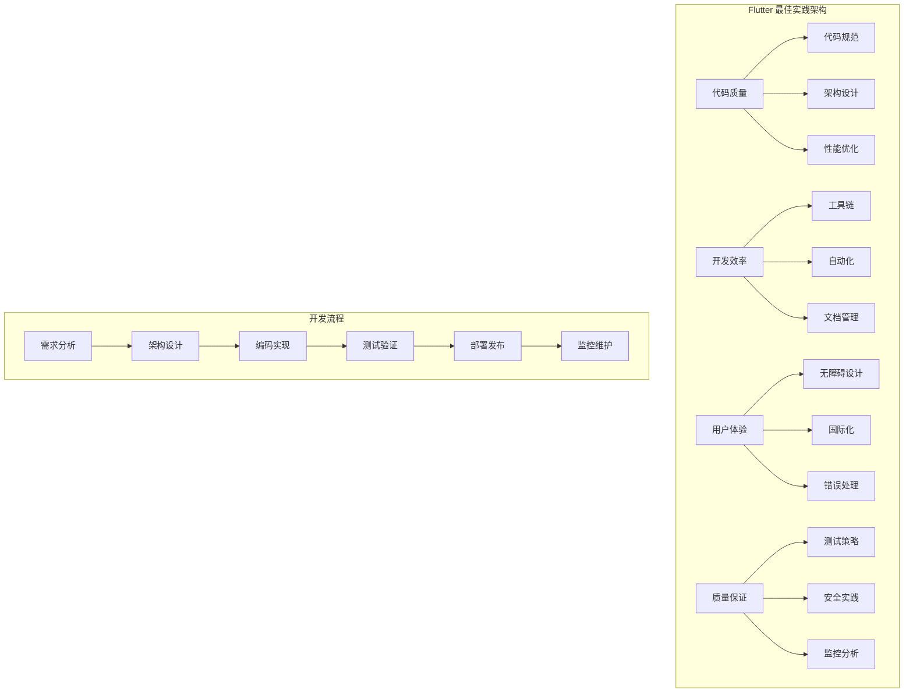
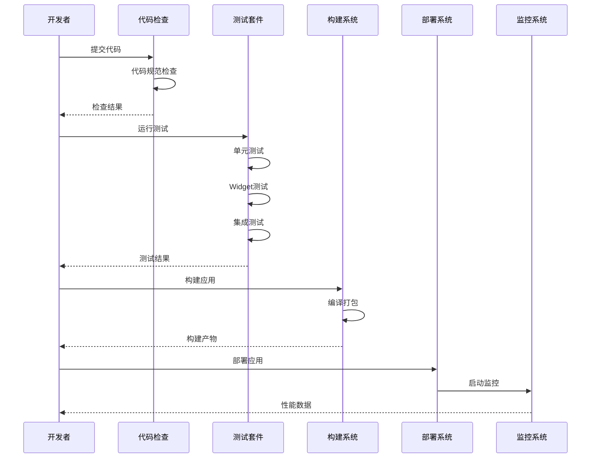
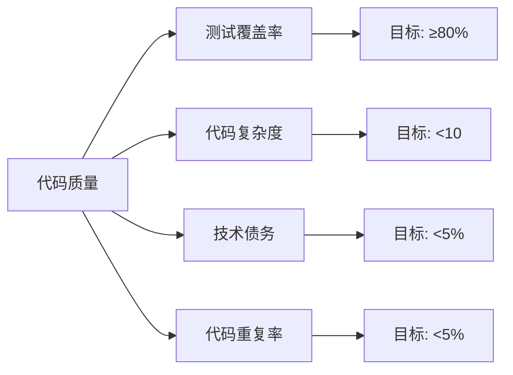
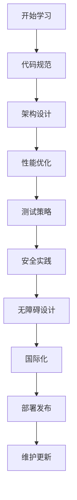

# 🏆 Flutter 最佳实践深度指南

> 全面的 Flutter 开发最佳实践指南，涵盖代码规范、性能优化、架构设计、测试策略等方面，帮助开发者构建高质量的 Flutter 应用


## 📋 目录导航

<details>
<summary>🎯 快速导航</summary>

### 📝 代码规范
- [📏 代码风格规范](code-style.md) - Dart代码风格和命名约定
- [🏗️ 架构设计](architecture.md) - 项目结构和架构模式
- [⚡ 性能优化](performance.md) - 性能优化策略和技巧

### 🧪 测试与质量
- [🧪 测试策略](testing.md) - 单元测试、Widget测试、集成测试
- [🔒 安全实践](security.md) - 数据安全和网络安全
- [♿ 无障碍设计](accessibility.md) - 可访问性设计原则

### 🌍 国际化与部署
- [🌍 国际化](internationalization.md) - 多语言支持和本地化
- [🚀 部署发布](deployment.md) - 应用打包和发布流程
- [🔧 维护更新](maintenance.md) - 代码维护和版本管理

</details>

## 🏗️ 最佳实践架构总览

### 整体架构图



### 质量保证流程



## 🎯 核心学习目标

### 📚 理论知识
- ✅ 深入理解Flutter开发最佳实践
- ✅ 掌握代码规范和架构设计原则
- ✅ 了解性能优化和测试策略
- ✅ 学会安全实践和无障碍设计

### 🛠️ 实践技能
- ✅ 熟练使用开发工具和自动化流程
- ✅ 掌握代码质量管理和监控
- ✅ 学会国际化部署和维护
- ✅ 能够建立团队开发规范

### 🎨 架构能力
- ✅ 理解Clean Architecture和SOLID原则
- ✅ 掌握测试驱动开发(TDD)方法
- ✅ 学会持续集成和部署(CI/CD)
- ✅ 能够进行代码重构和优化

## 🚀 快速开始

### 1. 环境准备

```bash
# 检查Flutter环境
flutter doctor

# 创建新项目
flutter create best_practices_demo
cd best_practices_demo

# 添加开发依赖
flutter pub add --dev flutter_lints dart_code_metrics build_runner
```

### 2. 配置代码规范

```yaml
# analysis_options.yaml
include: package:flutter_lints/flutter.yaml

analyzer:
  exclude:
    - "**/*.g.dart"
    - "**/*.freezed.dart"
    - "**/*.config.dart"
  
  errors:
    invalid_annotation_target: ignore

linter:
  rules:
    # 代码风格
    - prefer_const_constructors
    - prefer_const_literals_to_create_immutables
    - prefer_single_quotes
    - avoid_print
    
    # 性能优化
    - avoid_unnecessary_containers
    - prefer_sized_box_for_empty_space
    - use_key_in_widget_constructors
    
    # 代码质量
    - avoid_empty_else
    - avoid_unused_constructor_parameters
    - prefer_final_fields
    - prefer_final_locals
```

### 3. 项目结构设置

```
lib/
├── main.dart                 # 应用入口
├── app/
│   ├── app.dart             # 应用配置
│   ├── routes.dart          # 路由配置
│   └── theme.dart           # 主题配置
├── core/
│   ├── constants/           # 常量定义
│   │   ├── app_constants.dart
│   │   └── api_constants.dart
│   ├── errors/              # 错误处理
│   │   ├── exceptions.dart
│   │   └── failures.dart
│   ├── utils/               # 工具类
│   │   ├── date_utils.dart
│   │   └── string_utils.dart
│   └── services/            # 核心服务
│       ├── api_service.dart
│       └── storage_service.dart
├── features/                # 功能模块
│   ├── auth/
│   │   ├── data/
│   │   ├── domain/
│   │   └── presentation/
│   └── home/
│       ├── data/
│       ├── domain/
│       └── presentation/
└── shared/                  # 共享组件
    ├── widgets/
    ├── models/
    └── extensions/
```

### 4. 最佳实践示例

```dart
import 'package:flutter/material.dart';

// ✅ 遵循最佳实践的Widget示例
class UserProfileWidget extends StatelessWidget {
  const UserProfileWidget({
    super.key,
    required this.user,
    this.onTap,
    this.showEmail = true,
  });

  final User user;
  final VoidCallback? onTap;
  final bool showEmail;

  @override
  Widget build(BuildContext context) {
    return Semantics(
      label: '用户资料：${user.name}',
      button: onTap != null,
      child: InkWell(
        onTap: onTap,
        borderRadius: BorderRadius.circular(8),
        child: Container(
          padding: const EdgeInsets.all(16),
          decoration: BoxDecoration(
            border: Border.all(color: Colors.grey.shade300),
            borderRadius: BorderRadius.circular(8),
          ),
          child: Row(
            children: [
              // 头像
              CircleAvatar(
                backgroundImage: NetworkImage(user.avatarUrl),
                radius: 24,
                onBackgroundImageError: (exception, stackTrace) {
                  // 错误处理
                  debugPrint('头像加载失败: $exception');
                },
              ),
              const SizedBox(width: 12),
              
              // 用户信息
              Expanded(
                child: Column(
                  crossAxisAlignment: CrossAxisAlignment.start,
                  children: [
                    Text(
                      user.name,
                      style: Theme.of(context).textTheme.titleMedium?.copyWith(
                        fontWeight: FontWeight.bold,
                      ),
                      overflow: TextOverflow.ellipsis,
                    ),
                    if (showEmail) ...[
                      const SizedBox(height: 4),
                      Text(
                        user.email,
                        style: Theme.of(context).textTheme.bodySmall?.copyWith(
                          color: Colors.grey.shade600,
                        ),
                        overflow: TextOverflow.ellipsis,
                      ),
                    ],
                  ],
                ),
              ),
              
              // 操作按钮
              if (onTap != null)
                Icon(
                  Icons.chevron_right,
                  color: Colors.grey.shade400,
                ),
            ],
          ),
        ),
      ),
    );
  }
}

// 用户模型
class User {
  const User({
    required this.id,
    required this.name,
    required this.email,
    required this.avatarUrl,
  });

  final String id;
  final String name;
  final String email;
  final String avatarUrl;

  @override
  bool operator ==(Object other) {
    if (identical(this, other)) return true;
    return other is User && other.id == id;
  }

  @override
  int get hashCode => id.hashCode;
}
```

## 📊 质量指标监控

### 代码质量指标



### 性能指标监控

| 指标类型 | 目标值 | 监控工具 | 优化策略 |
|---------|--------|---------|---------|
| 启动时间 | < 3秒 | Firebase Performance | 懒加载、预加载 |
| 页面切换 | < 300ms | Flutter Inspector | Widget优化 |
| 内存使用 | 合理峰值 | Dart DevTools | 内存管理 |
| 包大小 | 最小化 | APK Analyzer | 资源优化 |

### 用户体验指标

```dart
// 用户体验监控示例
class UserExperienceMonitor {
  static void trackPageLoad(String pageName, Duration loadTime) {
    if (kDebugMode) {
      print('📊 页面加载: $pageName - ${loadTime.inMilliseconds}ms');
    }
    
    // 上报到分析平台
    analytics.track('page_load', {
      'page_name': pageName,
      'load_time': loadTime.inMilliseconds,
    });
  }
  
  static void trackUserAction(String action, Map<String, dynamic> params) {
    analytics.track('user_action', {
      'action': action,
      ...params,
    });
  }
  
  static void trackError(String error, StackTrace stackTrace) {
    // 错误上报
    crashlytics.recordError(error, stackTrace);
  }
}
```

## 🎨 设计模式应用

### 1. 工厂模式 (Factory Pattern)

```dart
// Widget工厂
abstract class WidgetFactory {
  static Widget createButton({
    required String text,
    required VoidCallback onPressed,
    ButtonType type = ButtonType.primary,
  }) {
    switch (type) {
      case ButtonType.primary:
        return ElevatedButton(
          onPressed: onPressed,
          child: Text(text),
        );
      case ButtonType.secondary:
        return OutlinedButton(
          onPressed: onPressed,
          child: Text(text),
        );
      case ButtonType.text:
        return TextButton(
          onPressed: onPressed,
          child: Text(text),
        );
    }
  }
}

enum ButtonType { primary, secondary, text }
```

### 2. 策略模式 (Strategy Pattern)

```dart
// 缓存策略
abstract class CacheStrategy {
  Future<T?> get<T>(String key);
  Future<void> set<T>(String key, T value);
  Future<void> remove(String key);
}

class MemoryCacheStrategy implements CacheStrategy {
  final Map<String, dynamic> _cache = {};
  
  @override
  Future<T?> get<T>(String key) async {
    return _cache[key] as T?;
  }
  
  @override
  Future<void> set<T>(String key, T value) async {
    _cache[key] = value;
  }
  
  @override
  Future<void> remove(String key) async {
    _cache.remove(key);
  }
}

class SharedPreferencesCacheStrategy implements CacheStrategy {
  final SharedPreferences _prefs;
  
  SharedPreferencesCacheStrategy(this._prefs);
  
  @override
  Future<T?> get<T>(String key) async {
    return _prefs.get(key) as T?;
  }
  
  @override
  Future<void> set<T>(String key, T value) async {
    await _prefs.setString(key, value.toString());
  }
  
  @override
  Future<void> remove(String key) async {
    await _prefs.remove(key);
  }
}
```

### 3. 观察者模式 (Observer Pattern)

```dart
// 主题管理
class ThemeManager extends ChangeNotifier {
  static ThemeManager? _instance;
  static ThemeManager get instance => _instance ??= ThemeManager._();
  
  ThemeManager._();
  
  ThemeMode _themeMode = ThemeMode.system;
  ThemeMode get themeMode => _themeMode;
  
  void setThemeMode(ThemeMode mode) {
    _themeMode = mode;
    notifyListeners();
  }
  
  bool get isDarkMode {
    if (_themeMode == ThemeMode.system) {
      return WidgetsBinding.instance.window.platformBrightness == Brightness.dark;
    }
    return _themeMode == ThemeMode.dark;
  }
}
```

## 🔧 开发工具推荐

### 📱 代码质量工具
- **Flutter Lints**: 代码规范检查
- **Dart Code Metrics**: 代码质量分析
- **SonarQube**: 代码质量管理
- **CodeClimate**: 技术债务分析

### 🧪 测试工具
- **Flutter Test**: 单元和Widget测试
- **Integration Test**: 集成测试
- **Mockito**: Mock对象生成
- **Golden Toolkit**: 视觉回归测试

### ⚡ 性能工具
- **Flutter Inspector**: UI调试
- **Dart DevTools**: 性能分析
- **Firebase Performance**: 性能监控
- **Sentry**: 错误追踪

### 🚀 CI/CD工具
- **GitHub Actions**: 自动化流水线
- **Fastlane**: 应用发布自动化
- **Codemagic**: Flutter专用CI/CD
- **Bitrise**: 移动应用CI/CD

## 📈 学习路径建议



### 🎯 阶段目标

#### 第一阶段：基础规范
- [ ] 掌握Dart代码风格规范
- [ ] 学会使用代码检查工具
- [ ] 理解项目结构设计
- [ ] 完成代码格式化配置

#### 第二阶段：架构设计
- [ ] 学习Clean Architecture
- [ ] 掌握依赖注入模式
- [ ] 学会模块化设计
- [ ] 完成架构重构实践

#### 第三阶段：性能优化
- [ ] 掌握Widget性能优化
- [ ] 学会内存管理策略
- [ ] 理解网络优化技巧
- [ ] 完成性能监控配置

#### 第四阶段：质量保证
- [ ] 掌握测试驱动开发
- [ ] 学会安全实践
- [ ] 理解无障碍设计
- [ ] 完成CI/CD流水线

## 🏆 最佳实践

### 📝 代码规范

```dart
// ✅ 推荐：使用const构造函数
const MyWidget({Key? key}) : super(key: key);

// ✅ 推荐：使用final字段
final String title;
final VoidCallback onTap;

// ✅ 推荐：使用命名参数
Widget buildButton({
  required String text,
  required VoidCallback onPressed,
  bool isEnabled = true,
}) {
  return ElevatedButton(
    onPressed: isEnabled ? onPressed : null,
    child: Text(text),
  );
}

// ❌ 避免：在build方法中创建对象
Widget build(BuildContext context) {
  return Container(
    child: Text(DateTime.now().toString()), // 每次都会创建新对象
  );
}
```

### 🎨 架构原则
- **单一职责**: 每个类只负责一个功能
- **开闭原则**: 对扩展开放，对修改关闭
- **依赖倒置**: 依赖抽象而非具体实现
- **接口隔离**: 使用小而精确的接口

### ⚡ 性能优化
- 使用const构造函数减少重建
- 避免在build方法中创建对象
- 合理使用RepaintBoundary
- 优化Widget树深度

### 🧪 测试策略
- 单元测试覆盖率≥80%
- Widget测试覆盖关键UI组件
- 集成测试覆盖用户流程
- 自动化测试集成CI/CD

## 📚 相关资源

### 🔗 官方资源
- [Flutter官方文档](https://flutter.dev/docs)
- [Dart语言指南](https://dart.dev/guides)
- [Flutter最佳实践](https://flutter.dev/docs/perf/best-practices)
- [Flutter性能优化](https://flutter.dev/docs/perf)

### 📖 推荐书籍
- 《Flutter实战》
- 《Dart语言实战》
- 《Flutter性能优化实战》
- 《测试驱动开发》

### 🎥 视频教程
- [Flutter官方YouTube频道](https://www.youtube.com/c/FlutterDev)
- [B站Flutter教程](https://www.bilibili.com/video/BV1S4411E7LY)

---

## 🎉 开始你的最佳实践之旅

现在你已经了解了Flutter最佳实践的整体架构和学习路径。接下来，让我们从[代码风格规范](code-style.md)开始，逐步掌握各种最佳实践的应用方法。

记住：**最佳实践是一个持续改进的过程**，需要根据项目需求和团队情况进行调整，始终保持学习和改进的心态！

---

<div align="center">

**🌟 如果这个指南对你有帮助，请给个Star支持一下！ 🌟**

[](https://github.com/your-repo/flutter-best-practices)
[](https://github.com/your-repo/flutter-best-practices)

</div>