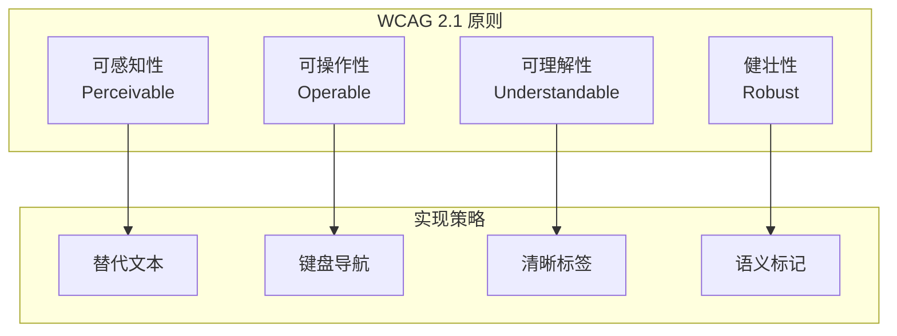

# Flutter 无障碍设计最佳指南

本文档详细介绍了 Flutter 应用的无障碍设计原则、技术实现和最佳实践，帮助开发者创建包容性的移动应用。

## 📋 目录

- [无障碍概述](#无障碍概述)
- [语义化设计](#语义化设计)
- [视觉无障碍](#视觉无障碍)
- [听觉无障碍](#听觉无障碍)
- [运动无障碍](#运动无障碍)
- [认知无障碍](#认知无障碍)
- [键盘导航](#键盘导航)
- [屏幕阅读器支持](#屏幕阅读器支持)
- [测试和验证](#测试和验证)
- [国际化支持](#国际化支持)

## ♿ 无障碍概述

### 无障碍设计原则



### 无障碍等级

- **A 级**：基本无障碍要求
- **AA 级**：标准无障碍要求（推荐）
- **AAA 级**：最高无障碍要求

## 🏷️ 语义化设计

### Semantics Widget

```dart
// lib/widgets/accessible_widgets.dart
import 'package:flutter/material.dart';
import 'package:flutter/semantics.dart';

class AccessibleButton extends StatelessWidget {
  const AccessibleButton({
    super.key,
    required this.onPressed,
    required this.child,
    this.semanticLabel,
    this.tooltip,
    this.enabled = true,
  });
  
  final VoidCallback? onPressed;
  final Widget child;
  final String? semanticLabel;
  final String? tooltip;
  final bool enabled;
  
  @override
  Widget build(BuildContext context) {
    return Semantics(
      label: semanticLabel,
      hint: tooltip,
      button: true,
      enabled: enabled,
      onTap: enabled ? onPressed : null,
      child: Tooltip(
        message: tooltip ?? '',
        child: ElevatedButton(
          onPressed: enabled ? onPressed : null,
          child: child,
        ),
      ),
    );
  }
}

class AccessibleTextField extends StatelessWidget {
  const AccessibleTextField({
    super.key,
    this.controller,
    this.labelText,
    this.hintText,
    this.errorText,
    this.helperText,
    this.obscureText = false,
    this.keyboardType,
    this.textInputAction,
    this.onChanged,
    this.onSubmitted,
    this.validator,
    this.required = false,
  });
  
  final TextEditingController? controller;
  final String? labelText;
  final String? hintText;
  final String? errorText;
  final String? helperText;
  final bool obscureText;
  final TextInputType? keyboardType;
  final TextInputAction? textInputAction;
  final ValueChanged<String>? onChanged;
  final ValueChanged<String>? onSubmitted;
  final FormFieldValidator<String>? validator;
  final bool required;
  
  @override
  Widget build(BuildContext context) {
    final semanticLabel = _buildSemanticLabel();
    
    return Semantics(
      label: semanticLabel,
      textField: true,
      child: TextFormField(
        controller: controller,
        obscureText: obscureText,
        keyboardType: keyboardType,
        textInputAction: textInputAction,
        onChanged: onChanged,
        onFieldSubmitted: onSubmitted,
        validator: validator,
        decoration: InputDecoration(
          labelText: labelText,
          hintText: hintText,
          errorText: errorText,
          helperText: helperText,
          suffixIcon: required
              ? const Icon(
                  Icons.star,
                  color: Colors.red,
                  semanticLabel: '必填字段',
                )
              : null,
        ),
      ),
    );
  }
  
  String _buildSemanticLabel() {
    final parts = <String>[];
    
    if (labelText != null) {
      parts.add(labelText!);
    }
    
    if (required) {
      parts.add('必填');
    }
    
    if (obscureText) {
      parts.add('密码字段');
    }
    
    if (errorText != null) {
      parts.add('错误：$errorText');
    }
    
    if (helperText != null) {
      parts.add('提示：$helperText');
    }
    
    return parts.join('，');
  }
}

class AccessibleCard extends StatelessWidget {
  const AccessibleCard({
    super.key,
    required this.child,
    this.semanticLabel,
    this.onTap,
    this.elevation = 1.0,
  });
  
  final Widget child;
  final String? semanticLabel;
  final VoidCallback? onTap;
  final double elevation;
  
  @override
  Widget build(BuildContext context) {
    return Semantics(
      label: semanticLabel,
      button: onTap != null,
      onTap: onTap,
      child: Card(
        elevation: elevation,
        child: InkWell(
          onTap: onTap,
          child: child,
        ),
      ),
    );
  }
}

class AccessibleImage extends StatelessWidget {
  const AccessibleImage({
    super.key,
    required this.image,
    required this.semanticLabel,
    this.width,
    this.height,
    this.fit,
    this.isDecorative = false,
  });
  
  final ImageProvider image;
  final String semanticLabel;
  final double? width;
  final double? height;
  final BoxFit? fit;
  final bool isDecorative;
  
  @override
  Widget build(BuildContext context) {
    return Semantics(
      label: isDecorative ? null : semanticLabel,
      image: !isDecorative,
      child: Image(
        image: image,
        width: width,
        height: height,
        fit: fit,
        semanticLabel: isDecorative ? null : semanticLabel,
      ),
    );
  }
}

class AccessibleListTile extends StatelessWidget {
  const AccessibleListTile({
    super.key,
    this.leading,
    required this.title,
    this.subtitle,
    this.trailing,
    this.onTap,
    this.semanticLabel,
    this.selected = false,
  });
  
  final Widget? leading;
  final Widget title;
  final Widget? subtitle;
  final Widget? trailing;
  final VoidCallback? onTap;
  final String? semanticLabel;
  final bool selected;
  
  @override
  Widget build(BuildContext context) {
    return Semantics(
      label: semanticLabel,
      button: onTap != null,
      selected: selected,
      onTap: onTap,
      child: ListTile(
        leading: leading,
        title: title,
        subtitle: subtitle,
        trailing: trailing,
        onTap: onTap,
        selected: selected,
      ),
    );
  }
}
```

### 语义化导航

```dart
// lib/widgets/accessible_navigation.dart
class AccessibleBottomNavigationBar extends StatelessWidget {
  const AccessibleBottomNavigationBar({
    super.key,
    required this.items,
    required this.currentIndex,
    required this.onTap,
  });
  
  final List<AccessibleNavigationItem> items;
  final int currentIndex;
  final ValueChanged<int> onTap;
  
  @override
  Widget build(BuildContext context) {
    return BottomNavigationBar(
      items: items.asMap().entries.map((entry) {
        final index = entry.key;
        final item = entry.value;
        final isSelected = index == currentIndex;
        
        return BottomNavigationBarItem(
          icon: Semantics(
            label: '${item.label}${isSelected ? '，已选中' : ''}',
            button: true,
            selected: isSelected,
            child: item.icon,
          ),
          activeIcon: Semantics(
            label: '${item.label}，已选中',
            button: true,
            selected: true,
            child: item.activeIcon ?? item.icon,
          ),
          label: item.label,
          tooltip: item.tooltip,
        );
      }).toList(),
      currentIndex: currentIndex,
      onTap: onTap,
    );
  }
}

class AccessibleNavigationItem {
  const AccessibleNavigationItem({
    required this.icon,
    this.activeIcon,
    required this.label,
    this.tooltip,
  });
  
  final Widget icon;
  final Widget? activeIcon;
  final String label;
  final String? tooltip;
}

class AccessibleTabBar extends StatelessWidget {
  const AccessibleTabBar({
    super.key,
    required this.tabs,
    this.controller,
    this.onTap,
  });
  
  final List<AccessibleTab> tabs;
  final TabController? controller;
  final ValueChanged<int>? onTap;
  
  @override
  Widget build(BuildContext context) {
    return TabBar(
      controller: controller,
      onTap: onTap,
      tabs: tabs.asMap().entries.map((entry) {
        final index = entry.key;
        final tab = entry.value;
        final isSelected = controller?.index == index;
        
        return Semantics(
          label: '${tab.text}标签页${isSelected ? '，已选中' : ''}',
          button: true,
          selected: isSelected,
          child: Tab(
            text: tab.text,
            icon: tab.icon,
          ),
        );
      }).toList(),
    );
  }
}

class AccessibleTab {
  const AccessibleTab({
    required this.text,
    this.icon,
  });
  
  final String text;
  final Widget? icon;
}
```

## 👁️ 视觉无障碍

### 颜色对比度

```dart
// lib/utils/color_contrast.dart
import 'package:flutter/material.dart';
import 'dart:math';

class ColorContrast {
  // 计算颜色对比度
  static double calculateContrast(Color color1, Color color2) {
    final luminance1 = _calculateLuminance(color1);
    final luminance2 = _calculateLuminance(color2);
    
    final lighter = max(luminance1, luminance2);
    final darker = min(luminance1, luminance2);
    
    return (lighter + 0.05) / (darker + 0.05);
  }
  
  // 计算相对亮度
  static double _calculateLuminance(Color color) {
    final r = _linearizeColorComponent(color.red / 255.0);
    final g = _linearizeColorComponent(color.green / 255.0);
    final b = _linearizeColorComponent(color.blue / 255.0);
    
    return 0.2126 * r + 0.7152 * g + 0.0722 * b;
  }
  
  static double _linearizeColorComponent(double component) {
    if (component <= 0.03928) {
      return component / 12.92;
    } else {
      return pow((component + 0.055) / 1.055, 2.4).toDouble();
    }
  }
  
  // 检查是否符合 WCAG AA 标准（4.5:1）
  static bool meetsWcagAA(Color foreground, Color background) {
    return calculateContrast(foreground, background) >= 4.5;
  }
  
  // 检查是否符合 WCAG AAA 标准（7:1）
  static bool meetsWcagAAA(Color foreground, Color background) {
    return calculateContrast(foreground, background) >= 7.0;
  }
  
  // 检查大文本是否符合 WCAG AA 标准（3:1）
  static bool meetsWcagAALargeText(Color foreground, Color background) {
    return calculateContrast(foreground, background) >= 3.0;
  }
  
  // 获取建议的文本颜色
  static Color getSuggestedTextColor(Color backgroundColor) {
    final whiteContrast = calculateContrast(Colors.white, backgroundColor);
    final blackContrast = calculateContrast(Colors.black, backgroundColor);
    
    return whiteContrast > blackContrast ? Colors.white : Colors.black;
  }
  
  // 调整颜色以满足对比度要求
  static Color adjustColorForContrast(
    Color color,
    Color background,
    double targetContrast,
  ) {
    final currentContrast = calculateContrast(color, background);
    
    if (currentContrast >= targetContrast) {
      return color;
    }
    
    // 尝试调整亮度
    final hsl = HSLColor.fromColor(color);
    
    // 如果背景较亮，使文本更暗
    if (_calculateLuminance(background) > 0.5) {
      for (double lightness = hsl.lightness; lightness >= 0; lightness -= 0.01) {
        final adjustedColor = hsl.withLightness(lightness).toColor();
        if (calculateContrast(adjustedColor, background) >= targetContrast) {
          return adjustedColor;
        }
      }
    } else {
      // 如果背景较暗，使文本更亮
      for (double lightness = hsl.lightness; lightness <= 1; lightness += 0.01) {
        final adjustedColor = hsl.withLightness(lightness).toColor();
        if (calculateContrast(adjustedColor, background) >= targetContrast) {
          return adjustedColor;
        }
      }
    }
    
    return color;
  }
}

// 无障碍颜色主题
class AccessibleColorScheme {
  static ColorScheme createHighContrastLight() {
    return const ColorScheme.light(
      primary: Color(0xFF000000),
      onPrimary: Color(0xFFFFFFFF),
      secondary: Color(0xFF1976D2),
      onSecondary: Color(0xFFFFFFFF),
      error: Color(0xFFD32F2F),
      onError: Color(0xFFFFFFFF),
      background: Color(0xFFFFFFFF),
      onBackground: Color(0xFF000000),
      surface: Color(0xFFFFFFFF),
      onSurface: Color(0xFF000000),
    );
  }
  
  static ColorScheme createHighContrastDark() {
    return const ColorScheme.dark(
      primary: Color(0xFFFFFFFF),
      onPrimary: Color(0xFF000000),
      secondary: Color(0xFF64B5F6),
      onSecondary: Color(0xFF000000),
      error: Color(0xFFEF5350),
      onError: Color(0xFF000000),
      background: Color(0xFF000000),
      onBackground: Color(0xFFFFFFFF),
      surface: Color(0xFF000000),
      onSurface: Color(0xFFFFFFFF),
    );
  }
}
```

### 字体大小和缩放

```dart
// lib/utils/text_scaling.dart
class TextScaling {
  // 获取系统文本缩放因子
  static double getSystemTextScaleFactor(BuildContext context) {
    return MediaQuery.of(context).textScaleFactor;
  }
  
  // 创建响应式文本样式
  static TextStyle createResponsiveTextStyle({
    required double baseFontSize,
    FontWeight? fontWeight,
    Color? color,
    double? height,
    double maxScaleFactor = 2.0,
  }) {
    return TextStyle(
      fontSize: baseFontSize,
      fontWeight: fontWeight,
      color: color,
      height: height,
    );
  }
  
  // 限制文本缩放因子
  static Widget limitTextScaling({
    required Widget child,
    double maxScaleFactor = 2.0,
  }) {
    return Builder(
      builder: (context) {
        final mediaQuery = MediaQuery.of(context);
        final scaleFactor = mediaQuery.textScaleFactor.clamp(1.0, maxScaleFactor);
        
        return MediaQuery(
          data: mediaQuery.copyWith(textScaleFactor: scaleFactor),
          child: child,
        );
      },
    );
  }
  
  // 创建可访问的文本主题
  static TextTheme createAccessibleTextTheme({
    required TextTheme baseTheme,
    double scaleFactor = 1.0,
  }) {
    return baseTheme.copyWith(
      displayLarge: baseTheme.displayLarge?.copyWith(
        fontSize: (baseTheme.displayLarge?.fontSize ?? 57) * scaleFactor,
      ),
      displayMedium: baseTheme.displayMedium?.copyWith(
        fontSize: (baseTheme.displayMedium?.fontSize ?? 45) * scaleFactor,
      ),
      displaySmall: baseTheme.displaySmall?.copyWith(
        fontSize: (baseTheme.displaySmall?.fontSize ?? 36) * scaleFactor,
      ),
      headlineLarge: baseTheme.headlineLarge?.copyWith(
        fontSize: (baseTheme.headlineLarge?.fontSize ?? 32) * scaleFactor,
      ),
      headlineMedium: baseTheme.headlineMedium?.copyWith(
        fontSize: (baseTheme.headlineMedium?.fontSize ?? 28) * scaleFactor,
      ),
      headlineSmall: baseTheme.headlineSmall?.copyWith(
        fontSize: (baseTheme.headlineSmall?.fontSize ?? 24) * scaleFactor,
      ),
      titleLarge: baseTheme.titleLarge?.copyWith(
        fontSize: (baseTheme.titleLarge?.fontSize ?? 22) * scaleFactor,
      ),
      titleMedium: baseTheme.titleMedium?.copyWith(
        fontSize: (baseTheme.titleMedium?.fontSize ?? 16) * scaleFactor,
      ),
      titleSmall: baseTheme.titleSmall?.copyWith(
        fontSize: (baseTheme.titleSmall?.fontSize ?? 14) * scaleFactor,
      ),
      bodyLarge: baseTheme.bodyLarge?.copyWith(
        fontSize: (baseTheme.bodyLarge?.fontSize ?? 16) * scaleFactor,
      ),
      bodyMedium: baseTheme.bodyMedium?.copyWith(
        fontSize: (baseTheme.bodyMedium?.fontSize ?? 14) * scaleFactor,
      ),
      bodySmall: baseTheme.bodySmall?.copyWith(
        fontSize: (baseTheme.bodySmall?.fontSize ?? 12) * scaleFactor,
      ),
      labelLarge: baseTheme.labelLarge?.copyWith(
        fontSize: (baseTheme.labelLarge?.fontSize ?? 14) * scaleFactor,
      ),
      labelMedium: baseTheme.labelMedium?.copyWith(
        fontSize: (baseTheme.labelMedium?.fontSize ?? 12) * scaleFactor,
      ),
      labelSmall: baseTheme.labelSmall?.copyWith(
        fontSize: (baseTheme.labelSmall?.fontSize ?? 11) * scaleFactor,
      ),
    );
  }
}

// 可访问的文本组件
class AccessibleText extends StatelessWidget {
  const AccessibleText(
    this.data, {
    super.key,
    this.style,
    this.semanticLabel,
    this.maxLines,
    this.overflow,
    this.textAlign,
    this.minFontSize = 12.0,
    this.maxFontSize = 24.0,
  });
  
  final String data;
  final TextStyle? style;
  final String? semanticLabel;
  final int? maxLines;
  final TextOverflow? overflow;
  final TextAlign? textAlign;
  final double minFontSize;
  final double maxFontSize;
  
  @override
  Widget build(BuildContext context) {
    final mediaQuery = MediaQuery.of(context);
    final baseFontSize = style?.fontSize ?? 14.0;
    final scaledFontSize = (baseFontSize * mediaQuery.textScaleFactor)
        .clamp(minFontSize, maxFontSize);
    
    return Semantics(
      label: semanticLabel,
      child: Text(
        data,
        style: style?.copyWith(fontSize: scaledFontSize),
        maxLines: maxLines,
        overflow: overflow,
        textAlign: textAlign,
      ),
    );
  }
}
```

### 焦点管理

```dart
// lib/utils/focus_management.dart
class FocusManagement {
  // 创建可访问的焦点节点
  static FocusNode createAccessibleFocusNode({
    String? debugLabel,
    bool canRequestFocus = true,
    bool skipTraversal = false,
  }) {
    return FocusNode(
      debugLabel: debugLabel,
      canRequestFocus: canRequestFocus,
      skipTraversal: skipTraversal,
    );
  }
  
  // 焦点遍历顺序
  static Widget createFocusTraversalGroup({
    required Widget child,
    FocusTraversalPolicy? policy,
  }) {
    return FocusTraversalGroup(
      policy: policy ?? OrderedTraversalPolicy(),
      child: child,
    );
  }
  
  // 跳过焦点的包装器
  static Widget skipFocus(Widget child) {
    return ExcludeFocus(
      child: child,
    );
  }
  
  // 焦点高亮
  static Widget focusHighlight({
    required Widget child,
    Color? highlightColor,
    double borderWidth = 2.0,
  }) {
    return Builder(
      builder: (context) {
        final theme = Theme.of(context);
        final focusColor = highlightColor ?? theme.focusColor;
        
        return Focus(
          child: Builder(
            builder: (context) {
              final hasFocus = Focus.of(context).hasFocus;
              
              return Container(
                decoration: hasFocus
                    ? BoxDecoration(
                        border: Border.all(
                          color: focusColor,
                          width: borderWidth,
                        ),
                      )
                    : null,
                child: child,
              );
            },
          ),
        );
      },
    );
  }
}

// 可访问的表单
class AccessibleForm extends StatefulWidget {
  const AccessibleForm({
    super.key,
    required this.child,
    this.autovalidateMode = AutovalidateMode.disabled,
    this.onChanged,
  });
  
  final Widget child;
  final AutovalidateMode autovalidateMode;
  final VoidCallback? onChanged;
  
  @override
  State<AccessibleForm> createState() => _AccessibleFormState();
}

class _AccessibleFormState extends State<AccessibleForm> {
  final _formKey = GlobalKey<FormState>();
  final List<FocusNode> _focusNodes = [];
  int _currentFocusIndex = 0;
  
  @override
  void dispose() {
    for (final node in _focusNodes) {
      node.dispose();
    }
    super.dispose();
  }
  
  void _addFocusNode(FocusNode node) {
    _focusNodes.add(node);
  }
  
  void _nextField() {
    if (_currentFocusIndex < _focusNodes.length - 1) {
      _currentFocusIndex++;
      _focusNodes[_currentFocusIndex].requestFocus();
    }
  }
  
  void _previousField() {
    if (_currentFocusIndex > 0) {
      _currentFocusIndex--;
      _focusNodes[_currentFocusIndex].requestFocus();
    }
  }
  
  @override
  Widget build(BuildContext context) {
    return Form(
      key: _formKey,
      autovalidateMode: widget.autovalidateMode,
      onChanged: widget.onChanged,
      child: FocusTraversalGroup(
        policy: OrderedTraversalPolicy(),
        child: widget.child,
      ),
    );
  }
}
```

## 🔊 听觉无障碍

### 音频反馈

```dart
// lib/services/audio_feedback_service.dart
import 'package:flutter/services.dart';
import 'package:audioplayers/audioplayers.dart';

class AudioFeedbackService {
  static final AudioPlayer _audioPlayer = AudioPlayer();
  
  // 播放系统音效
  static Future<void> playSystemSound(SystemSound sound) async {
    await SystemSound.play(sound);
  }
  
  // 播放成功音效
  static Future<void> playSuccessSound() async {
    await playSystemSound(SystemSound.click);
  }
  
  // 播放错误音效
  static Future<void> playErrorSound() async {
    await _playCustomSound('assets/sounds/error.mp3');
  }
  
  // 播放警告音效
  static Future<void> playWarningSound() async {
    await _playCustomSound('assets/sounds/warning.mp3');
  }
  
  // 播放通知音效
  static Future<void> playNotificationSound() async {
    await _playCustomSound('assets/sounds/notification.mp3');
  }
  
  // 播放自定义音效
  static Future<void> _playCustomSound(String assetPath) async {
    try {
      await _audioPlayer.play(AssetSource(assetPath));
    } catch (e) {
      // 如果无法播放自定义音效，回退到系统音效
      await playSystemSound(SystemSound.click);
    }
  }
  
  // 触觉反馈
  static Future<void> provideTactileFeedback({
    HapticFeedbackType type = HapticFeedbackType.lightImpact,
  }) async {
    switch (type) {
      case HapticFeedbackType.lightImpact:
        await HapticFeedback.lightImpact();
        break;
      case HapticFeedbackType.mediumImpact:
        await HapticFeedback.mediumImpact();
        break;
      case HapticFeedbackType.heavyImpact:
        await HapticFeedback.heavyImpact();
        break;
      case HapticFeedbackType.selectionClick:
        await HapticFeedback.selectionClick();
        break;
      case HapticFeedbackType.vibrate:
        await HapticFeedback.vibrate();
        break;
    }
  }
  
  // 组合音频和触觉反馈
  static Future<void> provideMultimodalFeedback({
    SystemSound? sound,
    HapticFeedbackType? haptic,
  }) async {
    final futures = <Future>[];
    
    if (sound != null) {
      futures.add(playSystemSound(sound));
    }
    
    if (haptic != null) {
      futures.add(provideTactileFeedback(type: haptic));
    }
    
    await Future.wait(futures);
  }
}

enum HapticFeedbackType {
  lightImpact,
  mediumImpact,
  heavyImpact,
  selectionClick,
  vibrate,
}

// 带音频反馈的按钮
class AudioFeedbackButton extends StatelessWidget {
  const AudioFeedbackButton({
    super.key,
    required this.onPressed,
    required this.child,
    this.sound = SystemSound.click,
    this.haptic = HapticFeedbackType.lightImpact,
  });
  
  final VoidCallback? onPressed;
  final Widget child;
  final SystemSound sound;
  final HapticFeedbackType haptic;
  
  @override
  Widget build(BuildContext context) {
    return ElevatedButton(
      onPressed: onPressed != null
          ? () async {
              await AudioFeedbackService.provideMultimodalFeedback(
                sound: sound,
                haptic: haptic,
              );
              onPressed!();
            }
          : null,
      child: child,
    );
  }
}
```

### 字幕和转录

```dart
// lib/widgets/caption_widget.dart
class CaptionWidget extends StatelessWidget {
  const CaptionWidget({
    super.key,
    required this.text,
    this.backgroundColor = Colors.black87,
    this.textColor = Colors.white,
    this.fontSize = 16.0,
    this.padding = const EdgeInsets.all(8.0),
  });
  
  final String text;
  final Color backgroundColor;
  final Color textColor;
  final double fontSize;
  final EdgeInsets padding;
  
  @override
  Widget build(BuildContext context) {
    return Container(
      padding: padding,
      decoration: BoxDecoration(
        color: backgroundColor,
        borderRadius: BorderRadius.circular(4.0),
      ),
      child: Text(
        text,
        style: TextStyle(
          color: textColor,
          fontSize: fontSize,
          fontWeight: FontWeight.w500,
        ),
        textAlign: TextAlign.center,
      ),
    );
  }
}

// 实时字幕服务
class LiveCaptionService {
  static final StreamController<String> _captionController =
      StreamController<String>.broadcast();
  
  static Stream<String> get captionStream => _captionController.stream;
  
  // 添加字幕
  static void addCaption(String text) {
    _captionController.add(text);
  }
  
  // 清除字幕
  static void clearCaption() {
    _captionController.add('');
  }
  
  // 释放资源
  static void dispose() {
    _captionController.close();
  }
}

// 带字幕的视频播放器
class AccessibleVideoPlayer extends StatefulWidget {
  const AccessibleVideoPlayer({
    super.key,
    required this.videoUrl,
    this.captionUrl,
    this.showCaptions = true,
  });
  
  final String videoUrl;
  final String? captionUrl;
  final bool showCaptions;
  
  @override
  State<AccessibleVideoPlayer> createState() => _AccessibleVideoPlayerState();
}

class _AccessibleVideoPlayerState extends State<AccessibleVideoPlayer> {
  String _currentCaption = '';
  
  @override
  void initState() {
    super.initState();
    if (widget.showCaptions) {
      _loadCaptions();
    }
  }
  
  void _loadCaptions() {
    // 加载字幕文件逻辑
    LiveCaptionService.captionStream.listen((caption) {
      setState(() {
        _currentCaption = caption;
      });
    });
  }
  
  @override
  Widget build(BuildContext context) {
    return Stack(
      children: [
        // 视频播放器
        Container(
          width: double.infinity,
          height: 200,
          color: Colors.black,
          child: const Center(
            child: Text(
              '视频播放器',
              style: TextStyle(color: Colors.white),
            ),
          ),
        ),
        
        // 字幕覆盖层
        if (widget.showCaptions && _currentCaption.isNotEmpty)
          Positioned(
            bottom: 20,
            left: 20,
            right: 20,
            child: CaptionWidget(text: _currentCaption),
          ),
      ],
    );
  }
}
```

## 🤲 运动无障碍

### 触摸目标大小

```dart
// lib/widgets/accessible_touch_targets.dart
class AccessibleTouchTarget extends StatelessWidget {
  const AccessibleTouchTarget({
    super.key,
    required this.child,
    required this.onTap,
    this.minSize = 44.0, // WCAG 推荐的最小触摸目标大小
    this.semanticLabel,
  });
  
  final Widget child;
  final VoidCallback onTap;
  final double minSize;
  final String? semanticLabel;
  
  @override
  Widget build(BuildContext context) {
    return Semantics(
      label: semanticLabel,
      button: true,
      onTap: onTap,
      child: GestureDetector(
        onTap: onTap,
        child: Container(
          constraints: BoxConstraints(
            minWidth: minSize,
            minHeight: minSize,
          ),
          child: child,
        ),
      ),
    );
  }
}

// 可访问的图标按钮
class AccessibleIconButton extends StatelessWidget {
  const AccessibleIconButton({
    super.key,
    required this.icon,
    required this.onPressed,
    required this.semanticLabel,
    this.tooltip,
    this.iconSize = 24.0,
    this.minSize = 44.0,
  });
  
  final IconData icon;
  final VoidCallback? onPressed;
  final String semanticLabel;
  final String? tooltip;
  final double iconSize;
  final double minSize;
  
  @override
  Widget build(BuildContext context) {
    return Semantics(
      label: semanticLabel,
      hint: tooltip,
      button: true,
      enabled: onPressed != null,
      onTap: onPressed,
      child: Tooltip(
        message: tooltip ?? semanticLabel,
        child: Material(
          type: MaterialType.transparency,
          child: InkWell(
            onTap: onPressed,
            borderRadius: BorderRadius.circular(minSize / 2),
            child: Container(
              width: minSize,
              height: minSize,
              alignment: Alignment.center,
              child: Icon(
                icon,
                size: iconSize,
              ),
            ),
          ),
        ),
      ),
    );
  }
}
```

### 手势替代方案

```dart
// lib/widgets/gesture_alternatives.dart
class AccessibleSwipeAction extends StatefulWidget {
  const AccessibleSwipeAction({
    super.key,
    required this.child,
    this.onSwipeLeft,
    this.onSwipeRight,
    this.onSwipeUp,
    this.onSwipeDown,
    this.showAlternativeButtons = true,
  });
  
  final Widget child;
  final VoidCallback? onSwipeLeft;
  final VoidCallback? onSwipeRight;
  final VoidCallback? onSwipeUp;
  final VoidCallback? onSwipeDown;
  final bool showAlternativeButtons;
  
  @override
  State<AccessibleSwipeAction> createState() => _AccessibleSwipeActionState();
}

class _AccessibleSwipeActionState extends State<AccessibleSwipeAction> {
  bool _showButtons = false;
  
  @override
  Widget build(BuildContext context) {
    return Column(
      children: [
        GestureDetector(
          onPanEnd: (details) {
            final velocity = details.velocity.pixelsPerSecond;
            
            if (velocity.dx.abs() > velocity.dy.abs()) {
              // 水平滑动
              if (velocity.dx > 0) {
                widget.onSwipeRight?.call();
              } else {
                widget.onSwipeLeft?.call();
              }
            } else {
              // 垂直滑动
              if (velocity.dy > 0) {
                widget.onSwipeDown?.call();
              } else {
                widget.onSwipeUp?.call();
              }
            }
          },
          onLongPress: () {
            if (widget.showAlternativeButtons) {
              setState(() {
                _showButtons = !_showButtons;
              });
            }
          },
          child: widget.child,
        ),
        
        if (_showButtons && widget.showAlternativeButtons)
          Padding(
            padding: const EdgeInsets.all(8.0),
            child: Row(
              mainAxisAlignment: MainAxisAlignment.spaceEvenly,
              children: [
                if (widget.onSwipeLeft != null)
                  AccessibleIconButton(
                    icon: Icons.arrow_back,
                    onPressed: widget.onSwipeLeft,
                    semanticLabel: '向左滑动操作',
                  ),
                if (widget.onSwipeUp != null)
                  AccessibleIconButton(
                    icon: Icons.arrow_upward,
                    onPressed: widget.onSwipeUp,
                    semanticLabel: '向上滑动操作',
                  ),
                if (widget.onSwipeDown != null)
                  AccessibleIconButton(
                    icon: Icons.arrow_downward,
                    onPressed: widget.onSwipeDown,
                    semanticLabel: '向下滑动操作',
                  ),
                if (widget.onSwipeRight != null)
                  AccessibleIconButton(
                    icon: Icons.arrow_forward,
                    onPressed: widget.onSwipeRight,
                    semanticLabel: '向右滑动操作',
                  ),
              ],
            ),
          ),
      ],
    );
  }
}

// 可访问的拖拽组件
class AccessibleDraggable extends StatelessWidget {
  const AccessibleDraggable({
    super.key,
    required this.child,
    required this.data,
    this.onDragStarted,
    this.onDragEnd,
    this.semanticLabel,
    this.showAlternativeAction = true,
  });
  
  final Widget child;
  final dynamic data;
  final VoidCallback? onDragStarted;
  final VoidCallback? onDragEnd;
  final String? semanticLabel;
  final bool showAlternativeAction;
  
  @override
  Widget build(BuildContext context) {
    return Semantics(
      label: semanticLabel,
      hint: '长按以显示替代操作',
      child: Draggable(
        data: data,
        onDragStarted: onDragStarted,
        onDragEnd: (_) => onDragEnd?.call(),
        feedback: Material(
          elevation: 4.0,
          child: child,
        ),
        childWhenDragging: Opacity(
          opacity: 0.5,
          child: child,
        ),
        child: showAlternativeAction
            ? GestureDetector(
                onLongPress: () {
                  _showDragAlternatives(context);
                },
                child: child,
              )
            : child,
      ),
    );
  }
  
  void _showDragAlternatives(BuildContext context) {
    showModalBottomSheet(
      context: context,
      builder: (context) => Container(
        padding: const EdgeInsets.all(16.0),
        child: Column(
          mainAxisSize: MainAxisSize.min,
          children: [
            const Text(
              '拖拽操作',
              style: TextStyle(
                fontSize: 18,
                fontWeight: FontWeight.bold,
              ),
            ),
            const SizedBox(height: 16),
            AccessibleButton(
              onPressed: () {
                Navigator.pop(context);
                // 执行拖拽操作的替代方案
              },
              semanticLabel: '移动到目标位置',
              child: const Text('移动'),
            ),
          ],
        ),
      ),
    );
  }
}
```

## 📚 总结

无障碍设计是创建包容性应用的关键：

### 核心原则

1. **可感知性**：提供替代文本和音频描述
2. **可操作性**：支持键盘导航和触摸替代
3. **可理解性**：使用清晰的标签和说明
4. **健壮性**：兼容辅助技术

### 最佳实践

1. **语义化**：正确使用 Semantics Widget
2. **对比度**：确保足够的颜色对比度
3. **触摸目标**：提供足够大的触摸区域
4. **音频反馈**：提供多模态反馈

### 推荐工具

- **Semantics**：语义化标记
- **Focus**：焦点管理
- **MediaQuery**：响应式设计
- **HapticFeedback**：触觉反馈

通过遵循无障碍设计原则，可以创建对所有用户都友好的 Flutter 应用。