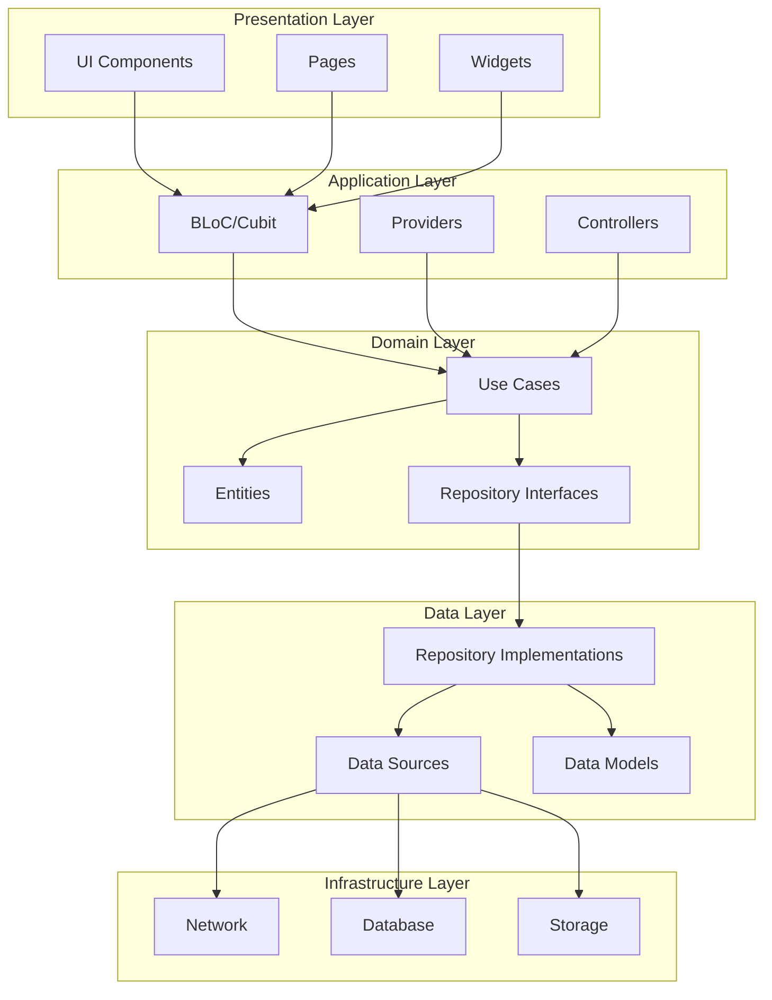
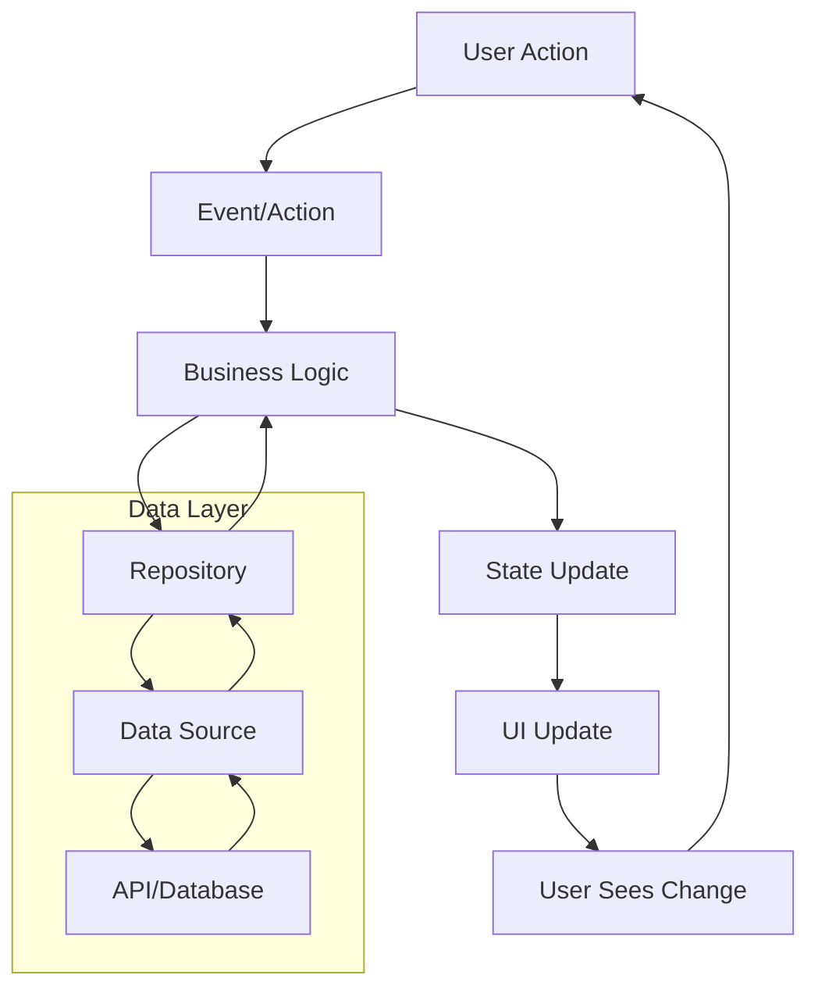

# Flutter 架构设计最佳实践

本文档详细介绍了 Flutter 应用的架构设计原则、模式和最佳实践，帮助开发者构建可维护、可扩展、可测试的应用程序。

## 📋 目录

- [架构设计原则](#架构设计原则)
- [分层架构](#分层架构)
- [设计模式](#设计模式)
- [依赖注入](#依赖注入)
- [状态管理架构](#状态管理架构)
- [数据流架构](#数据流架构)
- [模块化设计](#模块化设计)
- [错误处理架构](#错误处理架构)
- [测试架构](#测试架构)
- [性能优化架构](#性能优化架构)

## 🏗️ 架构设计原则

### SOLID 原则

#### 1. 单一职责原则 (SRP)

每个类应该只有一个引起它变化的原因：

```dart
// ❌ 违反 SRP - 一个类承担多个职责
class UserManager {
  // 用户数据管理
  Future<User> getUser(String id) async { /* ... */ }
  Future<void> saveUser(User user) async { /* ... */ }
  
  // 用户验证
  bool validateEmail(String email) { /* ... */ }
  bool validatePassword(String password) { /* ... */ }
  
  // 用户通知
  Future<void> sendWelcomeEmail(User user) async { /* ... */ }
  Future<void> sendPasswordResetEmail(String email) async { /* ... */ }
}

// ✅ 遵循 SRP - 职责分离
class UserRepository {
  Future<User> getUser(String id) async { /* ... */ }
  Future<void> saveUser(User user) async { /* ... */ }
}

class UserValidator {
  bool validateEmail(String email) { /* ... */ }
  bool validatePassword(String password) { /* ... */ }
}

class UserNotificationService {
  Future<void> sendWelcomeEmail(User user) async { /* ... */ }
  Future<void> sendPasswordResetEmail(String email) async { /* ... */ }
}
```

#### 2. 开闭原则 (OCP)

对扩展开放，对修改关闭：

```dart
// 抽象支付处理器
abstract class PaymentProcessor {
  Future<PaymentResult> processPayment(PaymentRequest request);
}

// 具体实现
class CreditCardProcessor implements PaymentProcessor {
  @override
  Future<PaymentResult> processPayment(PaymentRequest request) async {
    // 信用卡支付逻辑
  }
}

class PayPalProcessor implements PaymentProcessor {
  @override
  Future<PaymentResult> processPayment(PaymentRequest request) async {
    // PayPal 支付逻辑
  }
}

class AlipayProcessor implements PaymentProcessor {
  @override
  Future<PaymentResult> processPayment(PaymentRequest request) async {
    // 支付宝支付逻辑
  }
}

// 支付服务 - 无需修改即可支持新的支付方式
class PaymentService {
  final Map<PaymentType, PaymentProcessor> _processors;
  
  PaymentService(this._processors);
  
  Future<PaymentResult> processPayment(
    PaymentType type,
    PaymentRequest request,
  ) async {
    final processor = _processors[type];
    if (processor == null) {
      throw UnsupportedPaymentTypeException(type);
    }
    
    return processor.processPayment(request);
  }
}
```

#### 3. 里氏替换原则 (LSP)

子类应该能够替换其基类：

```dart
abstract class Shape {
  double calculateArea();
}

class Rectangle extends Shape {
  final double width;
  final double height;
  
  Rectangle(this.width, this.height);
  
  @override
  double calculateArea() => width * height;
}

class Square extends Shape {
  final double side;
  
  Square(this.side);
  
  @override
  double calculateArea() => side * side;
}

// 可以安全地替换
void printArea(Shape shape) {
  print('Area: ${shape.calculateArea()}');
}

void main() {
  final shapes = <Shape>[
    Rectangle(5, 10),
    Square(5),
  ];
  
  for (final shape in shapes) {
    printArea(shape); // LSP - 子类可以替换基类
  }
}
```

#### 4. 接口隔离原则 (ISP)

不应该强迫客户端依赖它们不使用的接口：

```dart
// ❌ 违反 ISP - 接口过于庞大
abstract class MediaPlayer {
  void playAudio();
  void playVideo();
  void recordAudio();
  void recordVideo();
}

// ✅ 遵循 ISP - 接口分离
abstract class AudioPlayer {
  void playAudio();
}

abstract class VideoPlayer {
  void playVideo();
}

abstract class AudioRecorder {
  void recordAudio();
}

abstract class VideoRecorder {
  void recordVideo();
}

// 客户端只需要实现需要的接口
class SimpleAudioPlayer implements AudioPlayer {
  @override
  void playAudio() {
    // 音频播放实现
  }
}

class FullMediaPlayer implements AudioPlayer, VideoPlayer, AudioRecorder {
  @override
  void playAudio() { /* ... */ }
  
  @override
  void playVideo() { /* ... */ }
  
  @override
  void recordAudio() { /* ... */ }
}
```

#### 5. 依赖倒置原则 (DIP)

高层模块不应该依赖低层模块，两者都应该依赖抽象：

```dart
// 抽象
abstract class DatabaseService {
  Future<User> getUser(String id);
  Future<void> saveUser(User user);
}

abstract class CacheService {
  Future<User?> getCachedUser(String id);
  Future<void> cacheUser(User user);
}

// 高层模块依赖抽象
class UserService {
  final DatabaseService _database;
  final CacheService _cache;
  
  UserService({
    required DatabaseService database,
    required CacheService cache,
  }) : _database = database,
       _cache = cache;
  
  Future<User> getUser(String id) async {
    // 先检查缓存
    final cachedUser = await _cache.getCachedUser(id);
    if (cachedUser != null) {
      return cachedUser;
    }
    
    // 从数据库获取
    final user = await _database.getUser(id);
    await _cache.cacheUser(user);
    
    return user;
  }
}

// 低层模块实现抽象
class SqliteDatabaseService implements DatabaseService {
  @override
  Future<User> getUser(String id) async {
    // SQLite 实现
  }
  
  @override
  Future<void> saveUser(User user) async {
    // SQLite 实现
  }
}

class RedisCacheService implements CacheService {
  @override
  Future<User?> getCachedUser(String id) async {
    // Redis 实现
  }
  
  @override
  Future<void> cacheUser(User user) async {
    // Redis 实现
  }
}
```

### Clean Architecture 原则



## 🏛️ 分层架构

### 1. 表示层 (Presentation Layer)

负责用户界面和用户交互：

```dart
// pages/user_profile_page.dart
class UserProfilePage extends StatelessWidget {
  const UserProfilePage({super.key});
  
  @override
  Widget build(BuildContext context) {
    return Scaffold(
      appBar: AppBar(title: const Text('用户资料')),
      body: BlocBuilder<UserProfileCubit, UserProfileState>(
        builder: (context, state) {
          return switch (state) {
            UserProfileLoading() => const LoadingWidget(),
            UserProfileLoaded(:final user) => UserProfileView(user: user),
            UserProfileError(:final message) => ErrorWidget(message),
          };
        },
      ),
    );
  }
}

// widgets/user_profile_view.dart
class UserProfileView extends StatelessWidget {
  const UserProfileView({super.key, required this.user});
  
  final User user;
  
  @override
  Widget build(BuildContext context) {
    return Column(
      children: [
        UserAvatar(user: user),
        UserInfoCard(user: user),
        UserActionsSection(user: user),
      ],
    );
  }
}
```

### 2. 应用层 (Application Layer)

处理应用逻辑和状态管理：

```dart
// cubits/user_profile_cubit.dart
class UserProfileCubit extends Cubit<UserProfileState> {
  UserProfileCubit({
    required GetUserUseCase getUserUseCase,
    required UpdateUserUseCase updateUserUseCase,
  }) : _getUserUseCase = getUserUseCase,
       _updateUserUseCase = updateUserUseCase,
       super(const UserProfileLoading());
  
  final GetUserUseCase _getUserUseCase;
  final UpdateUserUseCase _updateUserUseCase;
  
  Future<void> loadUser(String userId) async {
    emit(const UserProfileLoading());
    
    final result = await _getUserUseCase(GetUserParams(userId: userId));
    
    result.fold(
      (failure) => emit(UserProfileError(failure.message)),
      (user) => emit(UserProfileLoaded(user)),
    );
  }
  
  Future<void> updateUser(User user) async {
    final currentState = state;
    if (currentState is! UserProfileLoaded) return;
    
    emit(const UserProfileLoading());
    
    final result = await _updateUserUseCase(UpdateUserParams(user: user));
    
    result.fold(
      (failure) => emit(UserProfileError(failure.message)),
      (updatedUser) => emit(UserProfileLoaded(updatedUser)),
    );
  }
}

// states/user_profile_state.dart
sealed class UserProfileState {
  const UserProfileState();
}

class UserProfileLoading extends UserProfileState {
  const UserProfileLoading();
}

class UserProfileLoaded extends UserProfileState {
  const UserProfileLoaded(this.user);
  
  final User user;
}

class UserProfileError extends UserProfileState {
  const UserProfileError(this.message);
  
  final String message;
}
```

### 3. 领域层 (Domain Layer)

包含业务逻辑和规则：

```dart
// entities/user.dart
class User {
  const User({
    required this.id,
    required this.email,
    required this.name,
    this.avatarUrl,
    required this.createdAt,
    required this.updatedAt,
  });
  
  final String id;
  final String email;
  final String name;
  final String? avatarUrl;
  final DateTime createdAt;
  final DateTime updatedAt;
  
  // 业务逻辑方法
  bool get hasAvatar => avatarUrl != null && avatarUrl!.isNotEmpty;
  
  bool get isRecentlyCreated {
    final now = DateTime.now();
    final difference = now.difference(createdAt);
    return difference.inDays <= 7;
  }
  
  User copyWith({
    String? id,
    String? email,
    String? name,
    String? avatarUrl,
    DateTime? createdAt,
    DateTime? updatedAt,
  }) {
    return User(
      id: id ?? this.id,
      email: email ?? this.email,
      name: name ?? this.name,
      avatarUrl: avatarUrl ?? this.avatarUrl,
      createdAt: createdAt ?? this.createdAt,
      updatedAt: updatedAt ?? this.updatedAt,
    );
  }
}

// repositories/user_repository.dart
abstract class UserRepository {
  Future<Either<Failure, User>> getUser(String userId);
  Future<Either<Failure, User>> updateUser(User user);
  Future<Either<Failure, List<User>>> getUsers();
  Future<Either<Failure, void>> deleteUser(String userId);
}

// usecases/get_user_usecase.dart
class GetUserUseCase implements UseCase<User, GetUserParams> {
  const GetUserUseCase(this._repository);
  
  final UserRepository _repository;
  
  @override
  Future<Either<Failure, User>> call(GetUserParams params) async {
    return _repository.getUser(params.userId);
  }
}

class GetUserParams {
  const GetUserParams({required this.userId});
  
  final String userId;
}

// core/usecase.dart
abstract class UseCase<Type, Params> {
  Future<Either<Failure, Type>> call(Params params);
}

class NoParams {
  const NoParams();
}
```

### 4. 数据层 (Data Layer)

处理数据获取和存储：

```dart
// repositories/user_repository_impl.dart
class UserRepositoryImpl implements UserRepository {
  const UserRepositoryImpl({
    required UserRemoteDataSource remoteDataSource,
    required UserLocalDataSource localDataSource,
    required NetworkInfo networkInfo,
  }) : _remoteDataSource = remoteDataSource,
       _localDataSource = localDataSource,
       _networkInfo = networkInfo;
  
  final UserRemoteDataSource _remoteDataSource;
  final UserLocalDataSource _localDataSource;
  final NetworkInfo _networkInfo;
  
  @override
  Future<Either<Failure, User>> getUser(String userId) async {
    if (await _networkInfo.isConnected) {
      try {
        final userModel = await _remoteDataSource.getUser(userId);
        await _localDataSource.cacheUser(userModel);
        return Right(userModel.toEntity());
      } on ServerException {
        return const Left(ServerFailure('服务器错误'));
      }
    } else {
      try {
        final userModel = await _localDataSource.getLastUser(userId);
        return Right(userModel.toEntity());
      } on CacheException {
        return const Left(CacheFailure('缓存错误'));
      }
    }
  }
  
  @override
  Future<Either<Failure, User>> updateUser(User user) async {
    if (await _networkInfo.isConnected) {
      try {
        final userModel = UserModel.fromEntity(user);
        final updatedUserModel = await _remoteDataSource.updateUser(userModel);
        await _localDataSource.cacheUser(updatedUserModel);
        return Right(updatedUserModel.toEntity());
      } on ServerException {
        return const Left(ServerFailure('更新失败'));
      }
    } else {
      return const Left(NetworkFailure('网络连接失败'));
    }
  }
}

// datasources/user_remote_data_source.dart
abstract class UserRemoteDataSource {
  Future<UserModel> getUser(String userId);
  Future<UserModel> updateUser(UserModel user);
  Future<List<UserModel>> getUsers();
  Future<void> deleteUser(String userId);
}

class UserRemoteDataSourceImpl implements UserRemoteDataSource {
  const UserRemoteDataSourceImpl(this._apiClient);
  
  final ApiClient _apiClient;
  
  @override
  Future<UserModel> getUser(String userId) async {
    final response = await _apiClient.get('/users/$userId');
    
    if (response.statusCode == 200) {
      return UserModel.fromJson(response.data as Map<String, dynamic>);
    } else {
      throw ServerException();
    }
  }
  
  @override
  Future<UserModel> updateUser(UserModel user) async {
    final response = await _apiClient.put(
      '/users/${user.id}',
      data: user.toJson(),
    );
    
    if (response.statusCode == 200) {
      return UserModel.fromJson(response.data as Map<String, dynamic>);
    } else {
      throw ServerException();
    }
  }
}

// models/user_model.dart
class UserModel {
  const UserModel({
    required this.id,
    required this.email,
    required this.name,
    this.avatarUrl,
    required this.createdAt,
    required this.updatedAt,
  });
  
  final String id;
  final String email;
  final String name;
  final String? avatarUrl;
  final DateTime createdAt;
  final DateTime updatedAt;
  
  factory UserModel.fromJson(Map<String, dynamic> json) {
    return UserModel(
      id: json['id'] as String,
      email: json['email'] as String,
      name: json['name'] as String,
      avatarUrl: json['avatar_url'] as String?,
      createdAt: DateTime.parse(json['created_at'] as String),
      updatedAt: DateTime.parse(json['updated_at'] as String),
    );
  }
  
  Map<String, dynamic> toJson() {
    return {
      'id': id,
      'email': email,
      'name': name,
      'avatar_url': avatarUrl,
      'created_at': createdAt.toIso8601String(),
      'updated_at': updatedAt.toIso8601String(),
    };
  }
  
  User toEntity() {
    return User(
      id: id,
      email: email,
      name: name,
      avatarUrl: avatarUrl,
      createdAt: createdAt,
      updatedAt: updatedAt,
    );
  }
  
  factory UserModel.fromEntity(User user) {
    return UserModel(
      id: user.id,
      email: user.email,
      name: user.name,
      avatarUrl: user.avatarUrl,
      createdAt: user.createdAt,
      updatedAt: user.updatedAt,
    );
  }
}
```

## 🎯 设计模式

### 1. Repository 模式

```dart
// 抽象仓库
abstract class ProductRepository {
  Future<List<Product>> getProducts();
  Future<Product> getProduct(String id);
  Future<Product> createProduct(Product product);
  Future<Product> updateProduct(Product product);
  Future<void> deleteProduct(String id);
}

// 具体实现
class ProductRepositoryImpl implements ProductRepository {
  const ProductRepositoryImpl({
    required ProductRemoteDataSource remoteDataSource,
    required ProductLocalDataSource localDataSource,
    required NetworkInfo networkInfo,
  }) : _remoteDataSource = remoteDataSource,
       _localDataSource = localDataSource,
       _networkInfo = networkInfo;
  
  final ProductRemoteDataSource _remoteDataSource;
  final ProductLocalDataSource _localDataSource;
  final NetworkInfo _networkInfo;
  
  @override
  Future<List<Product>> getProducts() async {
    if (await _networkInfo.isConnected) {
      final products = await _remoteDataSource.getProducts();
      await _localDataSource.cacheProducts(products);
      return products.map((model) => model.toEntity()).toList();
    } else {
      final cachedProducts = await _localDataSource.getCachedProducts();
      return cachedProducts.map((model) => model.toEntity()).toList();
    }
  }
}
```

### 2. Factory 模式

```dart
// 抽象工厂
abstract class WidgetFactory {
  Widget createButton({
    required String text,
    required VoidCallback onPressed,
  });
  
  Widget createTextField({
    required String label,
    required ValueChanged<String> onChanged,
  });
  
  Widget createCard({
    required Widget child,
  });
}

// Material Design 工厂
class MaterialWidgetFactory implements WidgetFactory {
  @override
  Widget createButton({
    required String text,
    required VoidCallback onPressed,
  }) {
    return ElevatedButton(
      onPressed: onPressed,
      child: Text(text),
    );
  }
  
  @override
  Widget createTextField({
    required String label,
    required ValueChanged<String> onChanged,
  }) {
    return TextField(
      decoration: InputDecoration(labelText: label),
      onChanged: onChanged,
    );
  }
  
  @override
  Widget createCard({required Widget child}) {
    return Card(child: child);
  }
}

// Cupertino 工厂
class CupertinoWidgetFactory implements WidgetFactory {
  @override
  Widget createButton({
    required String text,
    required VoidCallback onPressed,
  }) {
    return CupertinoButton(
      onPressed: onPressed,
      child: Text(text),
    );
  }
  
  @override
  Widget createTextField({
    required String label,
    required ValueChanged<String> onChanged,
  }) {
    return CupertinoTextField(
      placeholder: label,
      onChanged: onChanged,
    );
  }
  
  @override
  Widget createCard({required Widget child}) {
    return Container(
      decoration: BoxDecoration(
        color: CupertinoColors.systemBackground,
        borderRadius: BorderRadius.circular(8),
        boxShadow: const [
          BoxShadow(
            color: CupertinoColors.systemGrey4,
            blurRadius: 4,
            offset: Offset(0, 2),
          ),
        ],
      ),
      child: child,
    );
  }
}

// 工厂提供者
class WidgetFactoryProvider {
  static WidgetFactory getFactory(TargetPlatform platform) {
    return switch (platform) {
      TargetPlatform.iOS || TargetPlatform.macOS => CupertinoWidgetFactory(),
      _ => MaterialWidgetFactory(),
    };
  }
}
```

### 3. Observer 模式

```dart
// 观察者接口
abstract class Observer<T> {
  void update(T data);
}

// 主题接口
abstract class Subject<T> {
  void addObserver(Observer<T> observer);
  void removeObserver(Observer<T> observer);
  void notifyObservers(T data);
}

// 具体主题
class UserStatusSubject implements Subject<UserStatus> {
  final List<Observer<UserStatus>> _observers = [];
  UserStatus _status = UserStatus.offline;
  
  UserStatus get status => _status;
  
  set status(UserStatus newStatus) {
    _status = newStatus;
    notifyObservers(_status);
  }
  
  @override
  void addObserver(Observer<UserStatus> observer) {
    _observers.add(observer);
  }
  
  @override
  void removeObserver(Observer<UserStatus> observer) {
    _observers.remove(observer);
  }
  
  @override
  void notifyObservers(UserStatus data) {
    for (final observer in _observers) {
      observer.update(data);
    }
  }
}

// 具体观察者
class StatusIndicatorWidget extends StatefulWidget implements Observer<UserStatus> {
  const StatusIndicatorWidget({super.key, required this.subject});
  
  final UserStatusSubject subject;
  
  @override
  State<StatusIndicatorWidget> createState() => _StatusIndicatorWidgetState();
  
  @override
  void update(UserStatus data) {
    // 更新 UI
  }
}

class _StatusIndicatorWidgetState extends State<StatusIndicatorWidget> {
  @override
  void initState() {
    super.initState();
    widget.subject.addObserver(widget);
  }
  
  @override
  void dispose() {
    widget.subject.removeObserver(widget);
    super.dispose();
  }
  
  @override
  Widget build(BuildContext context) {
    return Container(
      width: 12,
      height: 12,
      decoration: BoxDecoration(
        shape: BoxShape.circle,
        color: _getStatusColor(widget.subject.status),
      ),
    );
  }
  
  Color _getStatusColor(UserStatus status) {
    return switch (status) {
      UserStatus.online => Colors.green,
      UserStatus.away => Colors.yellow,
      UserStatus.offline => Colors.grey,
    };
  }
}

enum UserStatus { online, away, offline }
```

### 4. Strategy 模式

```dart
// 策略接口
abstract class SortStrategy<T> {
  List<T> sort(List<T> items);
}

// 具体策略
class BubbleSortStrategy<T extends Comparable<T>> implements SortStrategy<T> {
  @override
  List<T> sort(List<T> items) {
    final result = List<T>.from(items);
    
    for (int i = 0; i < result.length - 1; i++) {
      for (int j = 0; j < result.length - i - 1; j++) {
        if (result[j].compareTo(result[j + 1]) > 0) {
          final temp = result[j];
          result[j] = result[j + 1];
          result[j + 1] = temp;
        }
      }
    }
    
    return result;
  }
}

class QuickSortStrategy<T extends Comparable<T>> implements SortStrategy<T> {
  @override
  List<T> sort(List<T> items) {
    if (items.length <= 1) return List<T>.from(items);
    
    final pivot = items[items.length ~/ 2];
    final less = items.where((item) => item.compareTo(pivot) < 0).toList();
    final equal = items.where((item) => item.compareTo(pivot) == 0).toList();
    final greater = items.where((item) => item.compareTo(pivot) > 0).toList();
    
    return [...sort(less), ...equal, ...sort(greater)];
  }
}

// 上下文
class DataSorter<T extends Comparable<T>> {
  SortStrategy<T> _strategy;
  
  DataSorter(this._strategy);
  
  void setStrategy(SortStrategy<T> strategy) {
    _strategy = strategy;
  }
  
  List<T> sortData(List<T> data) {
    return _strategy.sort(data);
  }
}

// 使用示例
void main() {
  final data = [64, 34, 25, 12, 22, 11, 90];
  final sorter = DataSorter<int>(BubbleSortStrategy<int>());
  
  // 使用冒泡排序
  var sorted = sorter.sortData(data);
  print('Bubble sort: $sorted');
  
  // 切换到快速排序
  sorter.setStrategy(QuickSortStrategy<int>());
  sorted = sorter.sortData(data);
  print('Quick sort: $sorted');
}
```

## 🔧 依赖注入

### 使用 get_it 进行依赖注入

```dart
// service_locator.dart
import 'package:get_it/get_it.dart';

final GetIt sl = GetIt.instance;

Future<void> init() async {
  // 外部依赖
  final sharedPreferences = await SharedPreferences.getInstance();
  sl.registerLazySingleton(() => sharedPreferences);
  
  sl.registerLazySingleton(() => Dio());
  sl.registerLazySingleton(() => InternetConnectionChecker());
  
  // 核心服务
  sl.registerLazySingleton<NetworkInfo>(
    () => NetworkInfoImpl(sl()),
  );
  
  sl.registerLazySingleton<ApiClient>(
    () => ApiClientImpl(sl()),
  );
  
  // 数据源
  sl.registerLazySingleton<UserRemoteDataSource>(
    () => UserRemoteDataSourceImpl(sl()),
  );
  
  sl.registerLazySingleton<UserLocalDataSource>(
    () => UserLocalDataSourceImpl(sl()),
  );
  
  // 仓库
  sl.registerLazySingleton<UserRepository>(
    () => UserRepositoryImpl(
      remoteDataSource: sl(),
      localDataSource: sl(),
      networkInfo: sl(),
    ),
  );
  
  // 用例
  sl.registerLazySingleton(() => GetUserUseCase(sl()));
  sl.registerLazySingleton(() => UpdateUserUseCase(sl()));
  sl.registerLazySingleton(() => DeleteUserUseCase(sl()));
  
  // BLoC/Cubit
  sl.registerFactory(
    () => UserProfileCubit(
      getUserUseCase: sl(),
      updateUserUseCase: sl(),
    ),
  );
}

// main.dart
void main() async {
  WidgetsFlutterBinding.ensureInitialized();
  
  await init(); // 初始化依赖注入
  
  runApp(MyApp());
}

// 在 Widget 中使用
class UserProfilePage extends StatelessWidget {
  const UserProfilePage({super.key});
  
  @override
  Widget build(BuildContext context) {
    return BlocProvider(
      create: (context) => sl<UserProfileCubit>(),
      child: const UserProfileView(),
    );
  }
}
```

### 使用 Provider 进行依赖注入

```dart
// providers.dart
class AppProviders {
  static List<Provider> get providers => [
    // 单例服务
    Provider<ApiClient>(
      create: (_) => ApiClientImpl(Dio()),
    ),
    
    Provider<NetworkInfo>(
      create: (_) => NetworkInfoImpl(InternetConnectionChecker()),
    ),
    
    // 仓库
    ProxyProvider2<ApiClient, NetworkInfo, UserRepository>(
      update: (_, apiClient, networkInfo, __) => UserRepositoryImpl(
        remoteDataSource: UserRemoteDataSourceImpl(apiClient),
        localDataSource: UserLocalDataSourceImpl(),
        networkInfo: networkInfo,
      ),
    ),
    
    // 用例
    ProxyProvider<UserRepository, GetUserUseCase>(
      update: (_, repository, __) => GetUserUseCase(repository),
    ),
    
    ProxyProvider<UserRepository, UpdateUserUseCase>(
      update: (_, repository, __) => UpdateUserUseCase(repository),
    ),
  ];
}

// main.dart
class MyApp extends StatelessWidget {
  const MyApp({super.key});
  
  @override
  Widget build(BuildContext context) {
    return MultiProvider(
      providers: AppProviders.providers,
      child: MaterialApp(
        home: const HomePage(),
      ),
    );
  }
}

// 在页面中使用
class UserProfilePage extends StatelessWidget {
  const UserProfilePage({super.key});
  
  @override
  Widget build(BuildContext context) {
    return ChangeNotifierProvider(
      create: (context) => UserProfileCubit(
        getUserUseCase: context.read<GetUserUseCase>(),
        updateUserUseCase: context.read<UpdateUserUseCase>(),
      ),
      child: const UserProfileView(),
    );
  }
}
```

## 📊 状态管理架构

### BLoC 架构模式

```dart
// events/user_event.dart
sealed class UserEvent {
  const UserEvent();
}

class LoadUser extends UserEvent {
  const LoadUser(this.userId);
  
  final String userId;
}

class UpdateUser extends UserEvent {
  const UpdateUser(this.user);
  
  final User user;
}

class DeleteUser extends UserEvent {
  const DeleteUser(this.userId);
  
  final String userId;
}

// states/user_state.dart
sealed class UserState {
  const UserState();
}

class UserInitial extends UserState {
  const UserInitial();
}

class UserLoading extends UserState {
  const UserLoading();
}

class UserLoaded extends UserState {
  const UserLoaded(this.user);
  
  final User user;
}

class UserError extends UserState {
  const UserError(this.message);
  
  final String message;
}

// blocs/user_bloc.dart
class UserBloc extends Bloc<UserEvent, UserState> {
  UserBloc({
    required GetUserUseCase getUserUseCase,
    required UpdateUserUseCase updateUserUseCase,
    required DeleteUserUseCase deleteUserUseCase,
  }) : _getUserUseCase = getUserUseCase,
       _updateUserUseCase = updateUserUseCase,
       _deleteUserUseCase = deleteUserUseCase,
       super(const UserInitial()) {
    on<LoadUser>(_onLoadUser);
    on<UpdateUser>(_onUpdateUser);
    on<DeleteUser>(_onDeleteUser);
  }
  
  final GetUserUseCase _getUserUseCase;
  final UpdateUserUseCase _updateUserUseCase;
  final DeleteUserUseCase _deleteUserUseCase;
  
  Future<void> _onLoadUser(
    LoadUser event,
    Emitter<UserState> emit,
  ) async {
    emit(const UserLoading());
    
    final result = await _getUserUseCase(
      GetUserParams(userId: event.userId),
    );
    
    result.fold(
      (failure) => emit(UserError(failure.message)),
      (user) => emit(UserLoaded(user)),
    );
  }
  
  Future<void> _onUpdateUser(
    UpdateUser event,
    Emitter<UserState> emit,
  ) async {
    emit(const UserLoading());
    
    final result = await _updateUserUseCase(
      UpdateUserParams(user: event.user),
    );
    
    result.fold(
      (failure) => emit(UserError(failure.message)),
      (user) => emit(UserLoaded(user)),
    );
  }
  
  Future<void> _onDeleteUser(
    DeleteUser event,
    Emitter<UserState> emit,
  ) async {
    emit(const UserLoading());
    
    final result = await _deleteUserUseCase(
      DeleteUserParams(userId: event.userId),
    );
    
    result.fold(
      (failure) => emit(UserError(failure.message)),
      (_) => emit(const UserInitial()),
    );
  }
}
```

### Riverpod 架构模式

```dart
// providers/user_providers.dart

// 仓库提供者
final userRepositoryProvider = Provider<UserRepository>((ref) {
  return UserRepositoryImpl(
    remoteDataSource: ref.read(userRemoteDataSourceProvider),
    localDataSource: ref.read(userLocalDataSourceProvider),
    networkInfo: ref.read(networkInfoProvider),
  );
});

// 用例提供者
final getUserUseCaseProvider = Provider<GetUserUseCase>((ref) {
  return GetUserUseCase(ref.read(userRepositoryProvider));
});

final updateUserUseCaseProvider = Provider<UpdateUserUseCase>((ref) {
  return UpdateUserUseCase(ref.read(userRepositoryProvider));
});

// 状态提供者
final userProvider = StateNotifierProvider<UserNotifier, UserState>((ref) {
  return UserNotifier(
    getUserUseCase: ref.read(getUserUseCaseProvider),
    updateUserUseCase: ref.read(updateUserUseCaseProvider),
  );
});

// 特定用户提供者
final userByIdProvider = FutureProvider.family<User, String>((ref, userId) async {
  final getUserUseCase = ref.read(getUserUseCaseProvider);
  final result = await getUserUseCase(GetUserParams(userId: userId));
  
  return result.fold(
    (failure) => throw Exception(failure.message),
    (user) => user,
  );
});

// notifiers/user_notifier.dart
class UserNotifier extends StateNotifier<UserState> {
  UserNotifier({
    required GetUserUseCase getUserUseCase,
    required UpdateUserUseCase updateUserUseCase,
  }) : _getUserUseCase = getUserUseCase,
       _updateUserUseCase = updateUserUseCase,
       super(const UserInitial());
  
  final GetUserUseCase _getUserUseCase;
  final UpdateUserUseCase _updateUserUseCase;
  
  Future<void> loadUser(String userId) async {
    state = const UserLoading();
    
    final result = await _getUserUseCase(GetUserParams(userId: userId));
    
    state = result.fold(
      (failure) => UserError(failure.message),
      (user) => UserLoaded(user),
    );
  }
  
  Future<void> updateUser(User user) async {
    state = const UserLoading();
    
    final result = await _updateUserUseCase(UpdateUserParams(user: user));
    
    state = result.fold(
      (failure) => UserError(failure.message),
      (user) => UserLoaded(user),
    );
  }
}

// 在 Widget 中使用
class UserProfilePage extends ConsumerWidget {
  const UserProfilePage({super.key, required this.userId});
  
  final String userId;
  
  @override
  Widget build(BuildContext context, WidgetRef ref) {
    final userAsync = ref.watch(userByIdProvider(userId));
    
    return Scaffold(
      appBar: AppBar(title: const Text('用户资料')),
      body: userAsync.when(
        data: (user) => UserProfileView(user: user),
        loading: () => const LoadingWidget(),
        error: (error, stack) => ErrorWidget(error.toString()),
      ),
    );
  }
}
```

## 🔄 数据流架构

### 单向数据流



### 实现示例

```dart
// 数据流控制器
class DataFlowController {
  final StreamController<AppState> _stateController = StreamController.broadcast();
  final StreamController<AppAction> _actionController = StreamController.broadcast();
  
  AppState _currentState = const AppState.initial();
  
  Stream<AppState> get stateStream => _stateController.stream;
  AppState get currentState => _currentState;
  
  DataFlowController() {
    _actionController.stream.listen(_handleAction);
  }
  
  void dispatch(AppAction action) {
    _actionController.add(action);
  }
  
  Future<void> _handleAction(AppAction action) async {
    final newState = await _reducer(_currentState, action);
    
    if (newState != _currentState) {
      _currentState = newState;
      _stateController.add(_currentState);
    }
  }
  
  Future<AppState> _reducer(AppState state, AppAction action) async {
    return switch (action) {
      LoadUserAction(:final userId) => await _handleLoadUser(state, userId),
      UpdateUserAction(:final user) => await _handleUpdateUser(state, user),
      _ => state,
    };
  }
  
  Future<AppState> _handleLoadUser(AppState state, String userId) async {
    // 业务逻辑处理
    try {
      final user = await _userRepository.getUser(userId);
      return state.copyWith(user: user, isLoading: false);
    } catch (e) {
      return state.copyWith(error: e.toString(), isLoading: false);
    }
  }
  
  void dispose() {
    _stateController.close();
    _actionController.close();
  }
}

// 应用状态
class AppState {
  const AppState({
    this.user,
    this.isLoading = false,
    this.error,
  });
  
  final User? user;
  final bool isLoading;
  final String? error;
  
  const AppState.initial() : this();
  
  AppState copyWith({
    User? user,
    bool? isLoading,
    String? error,
  }) {
    return AppState(
      user: user ?? this.user,
      isLoading: isLoading ?? this.isLoading,
      error: error ?? this.error,
    );
  }
}

// 应用动作
sealed class AppAction {
  const AppAction();
}

class LoadUserAction extends AppAction {
  const LoadUserAction(this.userId);
  
  final String userId;
}

class UpdateUserAction extends AppAction {
  const UpdateUserAction(this.user);
  
  final User user;
}
```

## 📚 总结

良好的架构设计是 Flutter 应用成功的关键：

### 核心原则

1. **分离关注点**：每个层次和组件都有明确的职责
2. **依赖倒置**：高层模块不依赖低层模块，都依赖抽象
3. **可测试性**：架构支持单元测试和集成测试
4. **可扩展性**：易于添加新功能和修改现有功能
5. **可维护性**：代码结构清晰，易于理解和修改

### 最佳实践

1. **使用分层架构**：表示层、应用层、领域层、数据层
2. **应用设计模式**：Repository、Factory、Observer、Strategy 等
3. **依赖注入**：使用 get_it 或 Provider 管理依赖
4. **状态管理**：选择合适的状态管理方案（BLoC、Riverpod 等）
5. **单向数据流**：保持数据流的可预测性

### 推荐工具

- **依赖注入**：get_it、injectable
- **状态管理**：flutter_bloc、riverpod、provider
- **网络请求**：dio、retrofit
- **数据持久化**：hive、sqflite、shared_preferences
- **代码生成**：json_annotation、freezed、build_runner

通过遵循这些架构设计原则和最佳实践，你可以构建出高质量、可维护的 Flutter 应用程序。