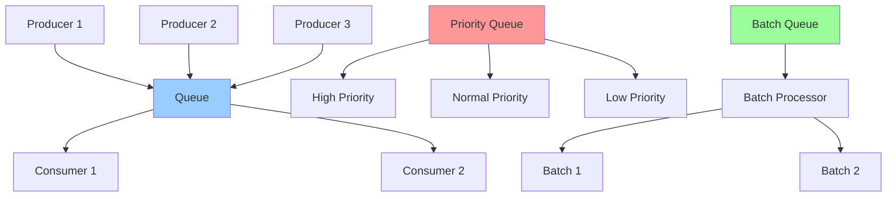

# 异步队列模式详解

> 异步队列是并发编程中的重要模式，用于解耦生产者和消费者，实现异步数据处理

## 📋 队列架构图



## 🎯 基础概念

### 队列特点
- **FIFO顺序**: 先进先出的处理顺序
- **异步解耦**: 生产者和消费者解耦
- **缓冲机制**: 平衡生产和消费速度
- **背压控制**: 防止内存溢出
- **优先级支持**: 支持优先级队列

### 适用场景
- **任务调度**: 异步任务处理
- **数据流处理**: 实时数据处理
- **批量操作**: 批量数据处理
- **消息传递**: 组件间通信
- **负载均衡**: 请求分发

## 🚀 基础异步队列

```dart
import 'dart:async';
import 'dart:collection';

// 异步队列实现
class AsyncQueue<T> {
  final Queue<T> _queue = Queue<T>();
  final Queue<Completer<T>> _waiters = Queue<Completer<T>>();
  final int? _maxSize;
  bool _isClosed = false;
  
  AsyncQueue({int? maxSize}) : _maxSize = maxSize;
  
  // 队列长度
  int get length => _queue.length;
  
  // 是否为空
  bool get isEmpty => _queue.isEmpty;
  
  // 是否已关闭
  bool get isClosed => _isClosed;
  
  // 添加元素
  Future<void> add(T item) async {
    if (_isClosed) {
      throw StateError('Queue is closed');
    }
    
    // 检查队列大小限制
    if (_maxSize != null && _queue.length >= _maxSize!) {
      throw StateError('Queue is full');
    }
    
    _queue.add(item);
    
    // 通知等待的消费者
    if (_waiters.isNotEmpty) {
      final waiter = _waiters.removeFirst();
      waiter.complete(_queue.removeFirst());
    }
  }
  
  // 尝试添加元素（非阻塞）
  bool tryAdd(T item) {
    if (_isClosed) return false;
    
    if (_maxSize != null && _queue.length >= _maxSize!) {
      return false;
    }
    
    _queue.add(item);
    
    // 通知等待的消费者
    if (_waiters.isNotEmpty) {
      final waiter = _waiters.removeFirst();
      waiter.complete(_queue.removeFirst());
    }
    
    return true;
  }
  
  // 获取元素
  Future<T> take() async {
    if (_queue.isNotEmpty) {
      return _queue.removeFirst();
    }
    
    if (_isClosed) {
      throw StateError('Queue is closed');
    }
    
    // 队列为空，等待新元素
    final completer = Completer<T>();
    _waiters.add(completer);
    return completer.future;
  }
  
  // 尝试获取元素（非阻塞）
  T? tryTake() {
    if (_queue.isEmpty) return null;
    return _queue.removeFirst();
  }
  
  // 关闭队列
  void close() {
    _isClosed = true;
    
    // 通知所有等待者
    while (_waiters.isNotEmpty) {
      final waiter = _waiters.removeFirst();
      waiter.completeError(StateError('Queue is closed'));
    }
  }
  
  // 清空队列
  void clear() {
    _queue.clear();
  }
  
  // 获取统计信息
  Map<String, dynamic> getStatistics() {
    return {
      'queueSize': _queue.length,
      'waitingConsumers': _waiters.length,
      'maxSize': _maxSize,
      'isClosed': _isClosed,
    };
  }
}

// 使用示例
void main() async {
  final queue = AsyncQueue<String>(maxSize: 10);
  
  // 生产者
  Future<void> producer() async {
    for (int i = 0; i < 5; i++) {
      await queue.add('Item $i');
      print('生产: Item $i');
      await Future.delayed(Duration(milliseconds: 500));
    }
    queue.close();
  }
  
  // 消费者
  Future<void> consumer() async {
    try {
      while (true) {
        final item = await queue.take();
        print('消费: $item');
        await Future.delayed(Duration(milliseconds: 300));
      }
    } catch (e) {
      print('消费者结束: $e');
    }
  }
  
  // 启动生产者和消费者
  await Future.wait([
    producer(),
    consumer(),
  ]);
}
```

## 🎯 优先级队列

```dart
// 优先级队列项
class PriorityItem<T> {
  final T item;
  final int priority;
  final DateTime timestamp;
  
  PriorityItem(this.item, this.priority) 
      : timestamp = DateTime.now();
}

// 优先级队列实现
class PriorityQueue<T> {
  final List<PriorityItem<T>> _heap = [];
  final Queue<Completer<T>> _waiters = Queue<Completer<T>>();
  bool _isClosed = false;
  
  // 队列长度
  int get length => _heap.length;
  
  // 是否为空
  bool get isEmpty => _heap.isEmpty;
  
  // 是否已关闭
  bool get isClosed => _isClosed;
  
  // 添加元素
  Future<void> add(T item, {int priority = 0}) async {
    if (_isClosed) {
      throw StateError('Queue is closed');
    }
    
    final priorityItem = PriorityItem(item, priority);
    _heap.add(priorityItem);
    _bubbleUp(_heap.length - 1);
    
    // 通知等待的消费者
    if (_waiters.isNotEmpty) {
      final waiter = _waiters.removeFirst();
      final topItem = _removeTop();
      waiter.complete(topItem.item);
    }
  }
  
  // 获取元素
  Future<T> take() async {
    if (_heap.isNotEmpty) {
      final item = _removeTop();
      return item.item;
    }
    
    if (_isClosed) {
      throw StateError('Queue is closed');
    }
    
    // 队列为空，等待新元素
    final completer = Completer<T>();
    _waiters.add(completer);
    return completer.future;
  }
  
  // 查看顶部元素（不移除）
  T? peek() {
    if (_heap.isEmpty) return null;
    return _heap.first.item;
  }
  
  // 向上冒泡
  void _bubbleUp(int index) {
    while (index > 0) {
      final parentIndex = (index - 1) ~/ 2;
      if (_compare(_heap[index], _heap[parentIndex]) >= 0) break;
      
      _swap(index, parentIndex);
      index = parentIndex;
    }
  }
  
  // 向下沉降
  void _bubbleDown(int index) {
    while (true) {
      int minIndex = index;
      final leftChild = 2 * index + 1;
      final rightChild = 2 * index + 2;
      
      if (leftChild < _heap.length && 
          _compare(_heap[leftChild], _heap[minIndex]) < 0) {
        minIndex = leftChild;
      }
      
      if (rightChild < _heap.length && 
          _compare(_heap[rightChild], _heap[minIndex]) < 0) {
        minIndex = rightChild;
      }
      
      if (minIndex == index) break;
      
      _swap(index, minIndex);
      index = minIndex;
    }
  }
  
  // 比较两个优先级项
  int _compare(PriorityItem<T> a, PriorityItem<T> b) {
    // 优先级高的排在前面（数值小的优先级高）
    final priorityCompare = a.priority.compareTo(b.priority);
    if (priorityCompare != 0) return priorityCompare;
    
    // 优先级相同时，按时间戳排序（先到先服务）
    return a.timestamp.compareTo(b.timestamp);
  }
  
  // 交换两个元素
  void _swap(int i, int j) {
    final temp = _heap[i];
    _heap[i] = _heap[j];
    _heap[j] = temp;
  }
  
  // 移除顶部元素
  PriorityItem<T> _removeTop() {
    if (_heap.isEmpty) {
      throw StateError('Queue is empty');
    }
    
    final top = _heap.first;
    final last = _heap.removeLast();
    
    if (_heap.isNotEmpty) {
      _heap[0] = last;
      _bubbleDown(0);
    }
    
    return top;
  }
  
  // 关闭队列
  void close() {
    _isClosed = true;
    
    // 通知所有等待者
    while (_waiters.isNotEmpty) {
      final waiter = _waiters.removeFirst();
      waiter.completeError(StateError('Queue is closed'));
    }
  }
}

// 使用示例
void main() async {
  final queue = PriorityQueue<String>();
  
  // 添加不同优先级的任务
  await queue.add('低优先级任务1', priority: 3);
  await queue.add('高优先级任务1', priority: 1);
  await queue.add('中优先级任务1', priority: 2);
  await queue.add('高优先级任务2', priority: 1);
  await queue.add('低优先级任务2', priority: 3);
  
  // 按优先级顺序处理
  while (!queue.isEmpty) {
    final task = await queue.take();
    print('处理: $task');
  }
  
  queue.close();
}
```

## 📦 批量处理队列

```dart
// 批量处理队列
class BatchQueue<T> {
  final List<T> _buffer = [];
  final int _batchSize;
  final Duration _batchTimeout;
  final Future<void> Function(List<T>) _processor;
  
  Timer? _timeoutTimer;
  bool _isProcessing = false;
  bool _isClosed = false;
  
  BatchQueue({
    required int batchSize,
    required Duration batchTimeout,
    required Future<void> Function(List<T>) processor,
  }) : _batchSize = batchSize,
       _batchTimeout = batchTimeout,
       _processor = processor;
  
  // 添加元素
  Future<void> add(T item) async {
    if (_isClosed) {
      throw StateError('Queue is closed');
    }
    
    _buffer.add(item);
    
    // 检查是否达到批量大小
    if (_buffer.length >= _batchSize) {
      await _processBatch();
    } else {
      _resetTimeout();
    }
  }
  
  // 处理批量数据
  Future<void> _processBatch() async {
    if (_buffer.isEmpty || _isProcessing) return;
    
    _isProcessing = true;
    _timeoutTimer?.cancel();
    
    try {
      final batch = List<T>.from(_buffer);
      _buffer.clear();
      
      await _processor(batch);
    } finally {
      _isProcessing = false;
      
      // 检查是否还有数据需要处理
      if (_buffer.isNotEmpty) {
        if (_buffer.length >= _batchSize) {
          await _processBatch();
        } else {
          _resetTimeout();
        }
      }
    }
  }
  
  // 重置超时定时器
  void _resetTimeout() {
    _timeoutTimer?.cancel();
    _timeoutTimer = Timer(_batchTimeout, () {
      if (_buffer.isNotEmpty && !_isProcessing) {
        _processBatch();
      }
    });
  }
  
  // 强制处理当前缓冲区
  Future<void> flush() async {
    if (_buffer.isNotEmpty) {
      await _processBatch();
    }
  }
  
  // 关闭队列
  Future<void> close() async {
    _isClosed = true;
    _timeoutTimer?.cancel();
    
    // 处理剩余数据
    await flush();
  }
  
  // 获取统计信息
  Map<String, dynamic> getStatistics() {
    return {
      'bufferSize': _buffer.length,
      'isProcessing': _isProcessing,
      'isClosed': _isClosed,
      'batchSize': _batchSize,
      'batchTimeout': _batchTimeout.inMilliseconds,
    };
  }
}

// 使用示例
void main() async {
  // 创建批量处理队列
  final batchQueue = BatchQueue<String>(
    batchSize: 5,
    batchTimeout: Duration(seconds: 2),
    processor: (batch) async {
      print('处理批量数据: $batch');
      // 模拟处理时间
      await Future.delayed(Duration(milliseconds: 500));
    },
  );
  
  // 添加数据
  for (int i = 0; i < 12; i++) {
    await batchQueue.add('Item $i');
    await Future.delayed(Duration(milliseconds: 300));
  }
  
  // 等待处理完成
  await Future.delayed(Duration(seconds: 3));
  
  // 关闭队列
  await batchQueue.close();
  
  print('批量处理完成');
}
```

## 🎯 最佳实践

### 设计原则
1. **合理设置队列大小**: 避免内存溢出
2. **处理背压**: 生产速度过快时的处理策略
3. **错误处理**: 完善的异常处理机制
4. **资源清理**: 及时释放资源
5. **监控统计**: 提供队列状态监控

### 性能优化
1. **批量处理**: 减少处理开销
2. **异步处理**: 避免阻塞主线程
3. **内存管理**: 及时清理已处理数据
4. **优先级调度**: 重要任务优先处理
5. **负载均衡**: 多消费者并行处理

### 测试策略
1. **单元测试**: 测试队列基本功能
2. **并发测试**: 测试多线程安全性
3. **压力测试**: 测试高负载下的性能
4. **边界测试**: 测试极限情况
5. **集成测试**: 测试与其他组件的集成

## 📚 总结

异步队列是并发编程中的重要工具，通过合理使用队列模式可以：

- **解耦组件**: 生产者和消费者独立开发
- **提高性能**: 异步处理提升响应速度
- **增强稳定性**: 缓冲机制平衡负载
- **简化设计**: 清晰的数据流向
- **便于扩展**: 支持多种队列类型

选择合适的队列类型和参数配置，结合良好的错误处理和监控机制，可以构建高效稳定的异步处理系统。