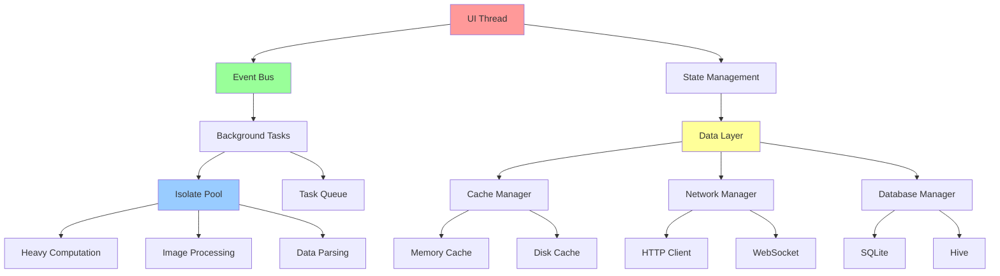

# 并发编程最佳实践与实战案例

> 结合实际项目场景，展示Flutter并发编程的最佳实践和常见模式

## 📋 实战架构图



## 🎯 核心设计原则

### 1. 单一职责原则
- **UI线程**: 只处理UI更新和用户交互
- **后台线程**: 处理耗时操作和计算
- **数据层**: 专注数据管理和持久化
- **网络层**: 专门处理网络请求

### 2. 异步优先原则
- 所有IO操作都使用异步
- 避免阻塞UI线程
- 合理使用Future和Stream
- 适当使用Isolate处理CPU密集型任务

### 3. 资源管理原则
- 及时释放不需要的资源
- 使用对象池管理昂贵资源
- 实现合理的缓存策略
- 监控内存使用情况

## 🚀 实战案例一：图片处理应用

### 1. 整体架构

```dart
// 图片处理服务
class ImageProcessingService {
  static final ImageProcessingService _instance = ImageProcessingService._internal();
  factory ImageProcessingService() => _instance;
  ImageProcessingService._internal();

  final IsolatePool _isolatePool = IsolatePool(maxIsolates: 4);
  final TaskQueue<ImageTask> _taskQueue = TaskQueue<ImageTask>();
  final ImageCache _cache = ImageCache();
  final EventBus _eventBus = EventBus();

  bool _isInitialized = false;

  // 初始化服务
  Future<void> initialize() async {
    if (_isInitialized) return;

    await _isolatePool.initialize();
    _startTaskProcessor();
    _isInitialized = true;
  }

  // 处理图片
  Future<ProcessedImage> processImage({
    required String imagePath,
    required ImageProcessingOptions options,
    VoidCallback? onProgress,
  }) async {
    // 检查缓存
    final cacheKey = _generateCacheKey(imagePath, options);
    final cachedResult = await _cache.get(cacheKey);
    if (cachedResult != null) {
      return cachedResult;
    }

    // 创建处理任务
    final task = ImageTask(
      id: DateTime.now().millisecondsSinceEpoch.toString(),
      imagePath: imagePath,
      options: options,
      onProgress: onProgress,
    );

    // 添加到队列
    await _taskQueue.add(task);

    // 等待处理完成
    final result = await task.completer.future;

    // 缓存结果
    await _cache.put(cacheKey, result);

    return result;
  }

  // 批量处理图片
  Future<List<ProcessedImage>> processBatch({
    required List<String> imagePaths,
    required ImageProcessingOptions options,
    Function(int completed, int total)? onProgress,
  }) async {
    final results = <ProcessedImage>[];
    int completed = 0;

    // 并发处理，但限制并发数
    final semaphore = Semaphore(3);
    final futures = imagePaths.map((path) async {
      await semaphore.acquire();
      try {
        final result = await processImage(
          imagePath: path,
          options: options,
          onProgress: () {
            completed++;
            onProgress?.call(completed, imagePaths.length);
          },
        );
        return result;
      } finally {
        semaphore.release();
      }
    });

    return await Future.wait(futures);
  }

  // 启动任务处理器
  void _startTaskProcessor() {
    _taskQueue.listen((task) async {
      try {
        final result = await _processImageInIsolate(task);
        task.completer.complete(result);

        // 发送完成事件
        _eventBus.fire(ImageProcessingCompleteEvent(
          taskId: task.id,
          result: result,
        ));
      } catch (e) {
        task.completer.completeError(e);

        // 发送错误事件
        _eventBus.fire(ImageProcessingErrorEvent(
          taskId: task.id,
          error: e,
        ));
      }
    });
  }

  // 在Isolate中处理图片
  Future<ProcessedImage> _processImageInIsolate(ImageTask task) async {
    return await _isolatePool.execute<ProcessedImage>(
      _imageProcessingFunction,
      {
        'imagePath': task.imagePath,
        'options': task.options.toMap(),
      },
    );
  }

  // 生成缓存键
  String _generateCacheKey(String imagePath, ImageProcessingOptions options) {
    return '${imagePath}_${options.hashCode}';
  }

  // 清理资源
  Future<void> dispose() async {
    await _isolatePool.dispose();
    await _cache.clear();
    _taskQueue.close();
  }
}

// 图片处理函数（在Isolate中运行）
static Future<ProcessedImage> _imageProcessingFunction(Map<String, dynamic> params) async {
  final imagePath = params['imagePath'] as String;
  final optionsMap = params['options'] as Map<String, dynamic>;
  final options = ImageProcessingOptions.fromMap(optionsMap);

  // 读取图片
  final imageBytes = await File(imagePath).readAsBytes();
  final image = img.decodeImage(imageBytes);

  if (image == null) {
    throw Exception('无法解码图片: $imagePath');
  }

  img.Image processedImage = image;

  // 应用各种处理
  if (options.resize != null) {
    processedImage = img.copyResize(
      processedImage,
      width: options.resize!.width,
      height: options.resize!.height,
    );
  }

  if (options.brightness != 0) {
    processedImage = img.brightness(processedImage, options.brightness);
  }

  if (options.contrast != 1.0) {
    processedImage = img.contrast(processedImage, options.contrast);
  }

  if (options.blur > 0) {
    processedImage = img.gaussianBlur(processedImage, options.blur);
  }

  if (options.grayscale) {
    processedImage = img.grayscale(processedImage);
  }

  // 编码结果
  final resultBytes = img.encodePng(processedImage);

  return ProcessedImage(
    originalPath: imagePath,
    processedBytes: resultBytes,
    width: processedImage.width,
    height: processedImage.height,
    options: options,
  );
}

// 图片处理任务
class ImageTask {
  final String id;
  final String imagePath;
  final ImageProcessingOptions options;
  final VoidCallback? onProgress;
  final Completer<ProcessedImage> completer = Completer<ProcessedImage>();

  ImageTask({
    required this.id,
    required this.imagePath,
    required this.options,
    this.onProgress,
  });
}

// 图片处理选项
class ImageProcessingOptions {
  final Size? resize;
  final double brightness;
  final double contrast;
  final double blur;
  final bool grayscale;

  const ImageProcessingOptions({
    this.resize,
    this.brightness = 0,
    this.contrast = 1.0,
    this.blur = 0,
    this.grayscale = false,
  });

  Map<String, dynamic> toMap() {
    return {
      'resize': resize != null ? {
        'width': resize!.width,
        'height': resize!.height,
      } : null,
      'brightness': brightness,
      'contrast': contrast,
      'blur': blur,
      'grayscale': grayscale,
    };
  }

  factory ImageProcessingOptions.fromMap(Map<String, dynamic> map) {
    return ImageProcessingOptions(
      resize: map['resize'] != null
        ? Size(map['resize']['width'], map['resize']['height'])
        : null,
      brightness: map['brightness'] ?? 0,
      contrast: map['contrast'] ?? 1.0,
      blur: map['blur'] ?? 0,
      grayscale: map['grayscale'] ?? false,
    );
  }

  @override
  int get hashCode {
    return Object.hash(resize, brightness, contrast, blur, grayscale);
  }
}

// 处理结果
class ProcessedImage {
  final String originalPath;
  final Uint8List processedBytes;
  final int width;
  final int height;
  final ImageProcessingOptions options;

  const ProcessedImage({
    required this.originalPath,
    required this.processedBytes,
    required this.width,
    required this.height,
    required this.options,
  });
}

// 事件定义
class ImageProcessingCompleteEvent {
  final String taskId;
  final ProcessedImage result;

  const ImageProcessingCompleteEvent({
    required this.taskId,
    required this.result,
  });
}

class ImageProcessingErrorEvent {
  final String taskId;
  final dynamic error;

  const ImageProcessingErrorEvent({
    required this.taskId,
    required this.error,
  });
}
```

### 2. UI集成

```dart
// 图片处理页面
class ImageProcessingPage extends StatefulWidget {
  @override
  _ImageProcessingPageState createState() => _ImageProcessingPageState();
}

class _ImageProcessingPageState extends State<ImageProcessingPage> {
  final ImageProcessingService _service = ImageProcessingService();
  final List<String> _selectedImages = [];
  final List<ProcessedImage> _processedImages = [];

  bool _isProcessing = false;
  double _progress = 0.0;

  @override
  void initState() {
    super.initState();
    _initializeService();
  }

  Future<void> _initializeService() async {
    await _service.initialize();

    // 监听处理事件
    _service._eventBus.on<ImageProcessingCompleteEvent>().listen((event) {
      setState(() {
        _processedImages.add(event.result);
      });
    });

    _service._eventBus.on<ImageProcessingErrorEvent>().listen((event) {
      ScaffoldMessenger.of(context).showSnackBar(
        SnackBar(content: Text('处理失败: ${event.error}')),
      );
    });
  }

  @override
  Widget build(BuildContext context) {
    return Scaffold(
      appBar: AppBar(
        title: Text('图片处理'),
        actions: [
          IconButton(
            icon: Icon(Icons.add_photo_alternate),
            onPressed: _selectImages,
          ),
        ],
      ),
      body: Column(
        children: [
          // 处理选项
          _buildProcessingOptions(),

          // 进度指示器
          if (_isProcessing)
            LinearProgressIndicator(value: _progress),

          // 图片列表
          Expanded(
            child: _buildImageGrid(),
          ),
        ],
      ),
      floatingActionButton: FloatingActionButton(
        onPressed: _selectedImages.isNotEmpty && !_isProcessing
          ? _processImages
          : null,
        child: Icon(Icons.play_arrow),
      ),
    );
  }

  Widget _buildProcessingOptions() {
    return Card(
      margin: EdgeInsets.all(16),
      child: Padding(
        padding: EdgeInsets.all(16),
        child: Column(
          crossAxisAlignment: CrossAxisAlignment.start,
          children: [
            Text('处理选项', style: Theme.of(context).textTheme.headline6),
            SizedBox(height: 16),

            // 亮度调节
            Row(
              children: [
                Text('亮度:'),
                Expanded(
                  child: Slider(
                    value: _brightness,
                    min: -100,
                    max: 100,
                    divisions: 200,
                    onChanged: (value) {
                      setState(() {
                        _brightness = value;
                      });
                    },
                  ),
                ),
                Text(_brightness.toStringAsFixed(0)),
              ],
            ),

            // 对比度调节
            Row(
              children: [
                Text('对比度:'),
                Expanded(
                  child: Slider(
                    value: _contrast,
                    min: 0.1,
                    max: 3.0,
                    divisions: 29,
                    onChanged: (value) {
                      setState(() {
                        _contrast = value;
                      });
                    },
                  ),
                ),
                Text(_contrast.toStringAsFixed(1)),
              ],
            ),

            // 模糊程度
            Row(
              children: [
                Text('模糊:'),
                Expanded(
                  child: Slider(
                    value: _blur,
                    min: 0,
                    max: 10,
                    divisions: 10,
                    onChanged: (value) {
                      setState(() {
                        _blur = value;
                      });
                    },
                  ),
                ),
                Text(_blur.toStringAsFixed(0)),
              ],
            ),

            // 灰度选项
            CheckboxListTile(
              title: Text('转为灰度'),
              value: _grayscale,
              onChanged: (value) {
                setState(() {
                  _grayscale = value ?? false;
                });
              },
            ),
          ],
        ),
      ),
    );
  }

  Widget _buildImageGrid() {
    if (_processedImages.isEmpty) {
      return Center(
        child: Text('请选择图片进行处理'),
      );
    }

    return GridView.builder(
      padding: EdgeInsets.all(16),
      gridDelegate: SliverGridDelegateWithFixedCrossAxisCount(
        crossAxisCount: 2,
        crossAxisSpacing: 16,
        mainAxisSpacing: 16,
      ),
      itemCount: _processedImages.length,
      itemBuilder: (context, index) {
        final image = _processedImages[index];
        return Card(
          child: Column(
            children: [
              Expanded(
                child: Image.memory(
                  image.processedBytes,
                  fit: BoxFit.cover,
                ),
              ),
              Padding(
                padding: EdgeInsets.all(8),
                child: Text(
                  '${image.width} x ${image.height}',
                  style: Theme.of(context).textTheme.caption,
                ),
              ),
            ],
          ),
        );
      },
    );
  }

  Future<void> _selectImages() async {
    final result = await FilePicker.platform.pickFiles(
      type: FileType.image,
      allowMultiple: true,
    );

    if (result != null) {
      setState(() {
        _selectedImages.clear();
        _selectedImages.addAll(
          result.files.map((file) => file.path!),
        );
      });
    }
  }

  Future<void> _processImages() async {
    if (_selectedImages.isEmpty) return;

    setState(() {
      _isProcessing = true;
      _progress = 0.0;
      _processedImages.clear();
    });

    try {
      final options = ImageProcessingOptions(
        brightness: _brightness,
        contrast: _contrast,
        blur: _blur,
        grayscale: _grayscale,
      );

      await _service.processBatch(
        imagePaths: _selectedImages,
        options: options,
        onProgress: (completed, total) {
          setState(() {
            _progress = completed / total;
          });
        },
      );
    } catch (e) {
      ScaffoldMessenger.of(context).showSnackBar(
        SnackBar(content: Text('批量处理失败: $e')),
      );
    } finally {
      setState(() {
        _isProcessing = false;
        _progress = 0.0;
      });
    }
  }

  @override
  void dispose() {
    _service.dispose();
    super.dispose();
  }
}
```

## 🚀 实战案例二：数据同步系统

### 1. 数据同步架构

```dart
// 数据同步管理器
class DataSyncManager {
  static final DataSyncManager _instance = DataSyncManager._internal();
  factory DataSyncManager() => _instance;
  DataSyncManager._internal();

  final EventBus _eventBus = EventBus();
  final SyncQueue _syncQueue = SyncQueue();
  final ConflictResolver _conflictResolver = ConflictResolver();
  final NetworkManager _networkManager = NetworkManager();
  final LocalDatabase _localDb = LocalDatabase();

  final StreamController<SyncStatus> _statusController = StreamController.broadcast();
  Stream<SyncStatus> get statusStream => _statusController.stream;

  bool _isInitialized = false;
  bool _isSyncing = false;
  Timer? _periodicSyncTimer;

  // 初始化同步管理器
  Future<void> initialize() async {
    if (_isInitialized) return;

    await _localDb.initialize();
    await _networkManager.initialize();

    _setupEventListeners();
    _startPeriodicSync();

    _isInitialized = true;
  }

  // 设置事件监听器
  void _setupEventListeners() {
    // 监听网络状态变化
    _networkManager.connectivityStream.listen((isConnected) {
      if (isConnected && !_isSyncing) {
        _triggerSync();
      }
    });

    // 监听数据变化
    _eventBus.on<DataChangedEvent>().listen((event) {
      _queueSyncOperation(event.operation);
    });

    // 监听同步冲突
    _eventBus.on<SyncConflictEvent>().listen((event) {
      _handleSyncConflict(event);
    });
  }

  // 启动定期同步
  void _startPeriodicSync() {
    _periodicSyncTimer = Timer.periodic(Duration(minutes: 5), (_) {
      if (_networkManager.isConnected && !_isSyncing) {
        _triggerSync();
      }
    });
  }

  // 触发同步
  Future<void> _triggerSync() async {
    if (_isSyncing) return;

    _isSyncing = true;
    _statusController.add(SyncStatus.syncing);

    try {
      await _performSync();
      _statusController.add(SyncStatus.completed);
    } catch (e) {
      _statusController.add(SyncStatus.error);
      _eventBus.fire(SyncErrorEvent(error: e));
    } finally {
      _isSyncing = false;
    }
  }

  // 执行同步操作
  Future<void> _performSync() async {
    // 1. 获取本地待同步数据
    final pendingOperations = await _syncQueue.getPendingOperations();

    // 2. 上传本地更改
    await _uploadLocalChanges(pendingOperations);

    // 3. 下载远程更改
    await _downloadRemoteChanges();

    // 4. 解决冲突
    await _resolveConflicts();

    // 5. 清理已完成的操作
    await _syncQueue.clearCompletedOperations();
  }

  // 上传本地更改
  Future<void> _uploadLocalChanges(List<SyncOperation> operations) async {
    final semaphore = Semaphore(3); // 限制并发上传数

    final futures = operations.map((operation) async {
      await semaphore.withPermit(() async {
        try {
          await _uploadOperation(operation);
          operation.status = SyncOperationStatus.completed;
        } catch (e) {
          operation.status = SyncOperationStatus.failed;
          operation.error = e.toString();
        }
      });
    });

    await Future.wait(futures);
  }

  // 上传单个操作
  Future<void> _uploadOperation(SyncOperation operation) async {
    switch (operation.type) {
      case SyncOperationType.create:
        await _networkManager.createRecord(operation.data);
        break;
      case SyncOperationType.update:
        await _networkManager.updateRecord(operation.id, operation.data);
        break;
      case SyncOperationType.delete:
        await _networkManager.deleteRecord(operation.id);
        break;
    }
  }

  // 下载远程更改
  Future<void> _downloadRemoteChanges() async {
    final lastSyncTime = await _localDb.getLastSyncTime();
    final remoteChanges = await _networkManager.getChangesSince(lastSyncTime);

    for (final change in remoteChanges) {
      await _applyRemoteChange(change);
    }

    await _localDb.updateLastSyncTime(DateTime.now());
  }

  // 应用远程更改
  Future<void> _applyRemoteChange(RemoteChange change) async {
    final localRecord = await _localDb.getRecord(change.id);

    if (localRecord == null) {
      // 新记录，直接插入
      await _localDb.insertRecord(change.data);
    } else if (localRecord.lastModified.isBefore(change.lastModified)) {
      // 远程更新，检查是否有本地未同步的更改
      final hasPendingChanges = await _syncQueue.hasPendingChanges(change.id);

      if (hasPendingChanges) {
        // 有冲突，触发冲突解决
        _eventBus.fire(SyncConflictEvent(
          localRecord: localRecord,
          remoteChange: change,
        ));
      } else {
        // 无冲突，直接更新
        await _localDb.updateRecord(change.id, change.data);
      }
    }
  }

  // 处理同步冲突
  Future<void> _handleSyncConflict(SyncConflictEvent event) async {
    final resolution = await _conflictResolver.resolve(
      local: event.localRecord,
      remote: event.remoteChange,
    );

    switch (resolution.strategy) {
      case ConflictResolutionStrategy.useLocal:
        // 保持本地版本，标记为需要上传
        await _syncQueue.addOperation(SyncOperation(
          id: event.localRecord.id,
          type: SyncOperationType.update,
          data: event.localRecord.data,
        ));
        break;

      case ConflictResolutionStrategy.useRemote:
        // 使用远程版本
        await _localDb.updateRecord(
          event.remoteChange.id,
          event.remoteChange.data,
        );
        break;

      case ConflictResolutionStrategy.merge:
        // 合并数据
        final mergedData = resolution.mergedData!;
        await _localDb.updateRecord(event.localRecord.id, mergedData);
        await _syncQueue.addOperation(SyncOperation(
          id: event.localRecord.id,
          type: SyncOperationType.update,
          data: mergedData,
        ));
        break;
    }
  }

  // 解决冲突
  Future<void> _resolveConflicts() async {
    final conflicts = await _localDb.getConflicts();

    for (final conflict in conflicts) {
      final resolution = await _conflictResolver.resolve(
        local: conflict.localRecord,
        remote: conflict.remoteChange,
      );

      await _applyConflictResolution(conflict, resolution);
    }
  }

  // 应用冲突解决方案
  Future<void> _applyConflictResolution(
    DataConflict conflict,
    ConflictResolution resolution,
  ) async {
    switch (resolution.strategy) {
      case ConflictResolutionStrategy.useLocal:
        await _localDb.markConflictResolved(conflict.id, useLocal: true);
        break;

      case ConflictResolutionStrategy.useRemote:
        await _localDb.updateRecord(
          conflict.localRecord.id,
          conflict.remoteChange.data,
        );
        await _localDb.markConflictResolved(conflict.id, useLocal: false);
        break;

      case ConflictResolutionStrategy.merge:
        await _localDb.updateRecord(
          conflict.localRecord.id,
          resolution.mergedData!,
        );
        await _localDb.markConflictResolved(conflict.id, useLocal: false);
        break;
    }
  }

  // 添加同步操作到队列
  Future<void> _queueSyncOperation(SyncOperation operation) async {
    await _syncQueue.addOperation(operation);

    // 如果网络可用，立即尝试同步
    if (_networkManager.isConnected && !_isSyncing) {
      _triggerSync();
    }
  }

  // 手动触发同步
  Future<void> manualSync() async {
    if (!_networkManager.isConnected) {
      throw Exception('网络不可用');
    }

    await _triggerSync();
  }

  // 获取同步统计信息
  Future<SyncStatistics> getStatistics() async {
    final pendingCount = await _syncQueue.getPendingCount();
    final failedCount = await _syncQueue.getFailedCount();
    final lastSyncTime = await _localDb.getLastSyncTime();

    return SyncStatistics(
      pendingOperations: pendingCount,
      failedOperations: failedCount,
      lastSyncTime: lastSyncTime,
      isConnected: _networkManager.isConnected,
      isSyncing: _isSyncing,
    );
  }

  // 清理资源
  Future<void> dispose() async {
    _periodicSyncTimer?.cancel();
    await _statusController.close();
    await _syncQueue.dispose();
    await _networkManager.dispose();
    await _localDb.dispose();
  }
}

// 同步状态枚举
enum SyncStatus {
  idle,
  syncing,
  completed,
  error,
}

// 同步操作类型
enum SyncOperationType {
  create,
  update,
  delete,
}

// 同步操作状态
enum SyncOperationStatus {
  pending,
  inProgress,
  completed,
  failed,
}

// 冲突解决策略
enum ConflictResolutionStrategy {
  useLocal,
  useRemote,
  merge,
}

// 同步操作
class SyncOperation {
  final String id;
  final SyncOperationType type;
  final Map<String, dynamic> data;
  SyncOperationStatus status;
  String? error;
  final DateTime createdAt;

  SyncOperation({
    required this.id,
    required this.type,
    required this.data,
    this.status = SyncOperationStatus.pending,
    this.error,
  }) : createdAt = DateTime.now();
}

// 远程更改
class RemoteChange {
  final String id;
  final Map<String, dynamic> data;
  final DateTime lastModified;

  const RemoteChange({
    required this.id,
    required this.data,
    required this.lastModified,
  });
}

// 本地记录
class LocalRecord {
  final String id;
  final Map<String, dynamic> data;
  final DateTime lastModified;

  const LocalRecord({
    required this.id,
    required this.data,
    required this.lastModified,
  });
}

// 数据冲突
class DataConflict {
  final String id;
  final LocalRecord localRecord;
  final RemoteChange remoteChange;

  const DataConflict({
    required this.id,
    required this.localRecord,
    required this.remoteChange,
  });
}

// 冲突解决方案
class ConflictResolution {
  final ConflictResolutionStrategy strategy;
  final Map<String, dynamic>? mergedData;

  const ConflictResolution({
    required this.strategy,
    this.mergedData,
  });
}

// 同步统计信息
class SyncStatistics {
  final int pendingOperations;
  final int failedOperations;
  final DateTime? lastSyncTime;
  final bool isConnected;
  final bool isSyncing;

  const SyncStatistics({
    required this.pendingOperations,
    required this.failedOperations,
    required this.lastSyncTime,
    required this.isConnected,
    required this.isSyncing,
  });
}

// 事件定义
class DataChangedEvent {
  final SyncOperation operation;

  const DataChangedEvent({required this.operation});
}

class SyncConflictEvent {
  final LocalRecord localRecord;
  final RemoteChange remoteChange;

  const SyncConflictEvent({
    required this.localRecord,
    required this.remoteChange,
  });
}

class SyncErrorEvent {
  final dynamic error;

  const SyncErrorEvent({required this.error});
}
```

### 2. 冲突解决器

```dart
// 冲突解决器
class ConflictResolver {
  // 解决冲突
  Future<ConflictResolution> resolve({
    required LocalRecord local,
    required RemoteChange remote,
  }) async {
    // 根据数据类型选择不同的解决策略
    final dataType = _getDataType(local.data);

    switch (dataType) {
      case 'user_profile':
        return await _resolveUserProfileConflict(local, remote);
      case 'document':
        return await _resolveDocumentConflict(local, remote);
      case 'settings':
        return await _resolveSettingsConflict(local, remote);
      default:
        return await _resolveGenericConflict(local, remote);
    }
  }

  // 解决用户资料冲突
  Future<ConflictResolution> _resolveUserProfileConflict(
    LocalRecord local,
    RemoteChange remote,
  ) async {
    // 用户资料通常使用字段级合并
    final mergedData = Map<String, dynamic>.from(local.data);

    // 合并非冲突字段
    for (final entry in remote.data.entries) {
      final key = entry.key;
      final remoteValue = entry.value;
      final localValue = local.data[key];

      if (localValue == null) {
        // 本地没有该字段，使用远程值
        mergedData[key] = remoteValue;
      } else if (localValue != remoteValue) {
        // 有冲突，根据字段类型处理
        mergedData[key] = _resolveFieldConflict(key, localValue, remoteValue);
      }
    }

    return ConflictResolution(
      strategy: ConflictResolutionStrategy.merge,
      mergedData: mergedData,
    );
  }

  // 解决文档冲突
  Future<ConflictResolution> _resolveDocumentConflict(
    LocalRecord local,
    RemoteChange remote,
  ) async {
    // 文档冲突通常需要用户手动选择
    // 这里简化为使用最新修改时间
    if (local.lastModified.isAfter(remote.lastModified)) {
      return ConflictResolution(strategy: ConflictResolutionStrategy.useLocal);
    } else {
      return ConflictResolution(strategy: ConflictResolutionStrategy.useRemote);
    }
  }

  // 解决设置冲突
  Future<ConflictResolution> _resolveSettingsConflict(
    LocalRecord local,
    RemoteChange remote,
  ) async {
    // 设置通常合并，本地优先
    final mergedData = Map<String, dynamic>.from(remote.data);
    mergedData.addAll(local.data);

    return ConflictResolution(
      strategy: ConflictResolutionStrategy.merge,
      mergedData: mergedData,
    );
  }

  // 解决通用冲突
  Future<ConflictResolution> _resolveGenericConflict(
    LocalRecord local,
    RemoteChange remote,
  ) async {
    // 默认使用远程版本
    return ConflictResolution(strategy: ConflictResolutionStrategy.useRemote);
  }

  // 解决字段级冲突
  dynamic _resolveFieldConflict(String fieldName, dynamic localValue, dynamic remoteValue) {
    switch (fieldName) {
      case 'email':
      case 'phone':
        // 联系信息优先使用本地值
        return localValue;
      case 'avatar':
      case 'nickname':
        // 显示信息优先使用远程值
        return remoteValue;
      case 'last_login':
        // 时间戳使用最新的
        if (localValue is String && remoteValue is String) {
          final localTime = DateTime.tryParse(localValue);
          final remoteTime = DateTime.tryParse(remoteValue);
          if (localTime != null && remoteTime != null) {
            return localTime.isAfter(remoteTime) ? localValue : remoteValue;
          }
        }
        return remoteValue;
      default:
        // 默认使用远程值
        return remoteValue;
    }
  }

  // 获取数据类型
  String _getDataType(Map<String, dynamic> data) {
    if (data.containsKey('user_id') && data.containsKey('email')) {
      return 'user_profile';
    } else if (data.containsKey('title') && data.containsKey('content')) {
      return 'document';
    } else if (data.containsKey('theme') || data.containsKey('language')) {
      return 'settings';
    }
    return 'generic';
  }
}
```

## 📚 性能优化技巧

### 1. 内存管理

```dart
// 内存池管理器
class MemoryPoolManager {
  static final MemoryPoolManager _instance = MemoryPoolManager._internal();
  factory MemoryPoolManager() => _instance;
  MemoryPoolManager._internal();

  final Map<Type, ObjectPool> _pools = {};
  final Map<String, WeakReference> _cache = {};
  Timer? _cleanupTimer;

  // 初始化
  void initialize() {
    // 创建常用对象池
    _pools[Uint8List] = ObjectPool<Uint8List>(
      factory: () => Uint8List(1024 * 1024), // 1MB缓冲区
      maxSize: 10,
      validator: (buffer) => buffer.length >= 1024 * 1024,
    );

    _pools[List] = ObjectPool<List>(
      factory: () => <dynamic>[],
      maxSize: 50,
      validator: (list) => list.isEmpty,
    );

    // 启动定期清理
    _cleanupTimer = Timer.periodic(Duration(minutes: 5), (_) {
      _cleanup();
    });
  }

  // 获取对象
  T getObject<T>() {
    final pool = _pools[T] as ObjectPool<T>?;
    if (pool != null) {
      return pool.acquire();
    }
    throw ArgumentError('No pool found for type $T');
  }

  // 归还对象
  void returnObject<T>(T object) {
    final pool = _pools[T] as ObjectPool<T>?;
    pool?.release(object);
  }

  // 缓存对象
  void cache(String key, dynamic object) {
    _cache[key] = WeakReference(object);
  }

  // 获取缓存对象
  T? getCached<T>(String key) {
    final ref = _cache[key];
    return ref?.target as T?;
  }

  // 清理过期缓存
  void _cleanup() {
    final keysToRemove = <String>[];

    for (final entry in _cache.entries) {
      if (entry.value.target == null) {
        keysToRemove.add(entry.key);
      }
    }

    for (final key in keysToRemove) {
      _cache.remove(key);
    }

    // 清理对象池
    for (final pool in _pools.values) {
      pool.cleanup();
    }
  }

  // 获取内存使用统计
  Map<String, dynamic> getMemoryStats() {
    return {
      'poolCount': _pools.length,
      'cacheSize': _cache.length,
      'poolStats': _pools.map((type, pool) => MapEntry(
        type.toString(),
        pool.getStats(),
      )),
    };
  }

  // 清理资源
  void dispose() {
    _cleanupTimer?.cancel();
    for (final pool in _pools.values) {
      pool.dispose();
    }
    _pools.clear();
    _cache.clear();
  }
}

// 对象池
class ObjectPool<T> {
  final T Function() _factory;
  final bool Function(T)? _validator;
  final int _maxSize;
  final Queue<T> _pool = Queue<T>();

  int _createdCount = 0;
  int _acquiredCount = 0;
  int _releasedCount = 0;

  ObjectPool({
    required T Function() factory,
    required int maxSize,
    bool Function(T)? validator,
  }) : _factory = factory,
       _maxSize = maxSize,
       _validator = validator;

  // 获取对象
  T acquire() {
    if (_pool.isNotEmpty) {
      final object = _pool.removeFirst();
      _acquiredCount++;
      return object;
    }

    final object = _factory();
    _createdCount++;
    _acquiredCount++;
    return object;
  }

  // 归还对象
  void release(T object) {
    if (_pool.length >= _maxSize) {
      return; // 池已满，丢弃对象
    }

    // 验证对象是否可重用
    if (_validator != null && !_validator!(object)) {
      return; // 对象无效，丢弃
    }

    _pool.add(object);
    _releasedCount++;
  }

  // 清理池
  void cleanup() {
    // 保留一半对象
    final keepCount = _pool.length ~/ 2;
    while (_pool.length > keepCount) {
      _pool.removeFirst();
    }
  }

  // 获取统计信息
  Map<String, dynamic> getStats() {
    return {
      'poolSize': _pool.length,
      'maxSize': _maxSize,
      'createdCount': _createdCount,
      'acquiredCount': _acquiredCount,
      'releasedCount': _releasedCount,
      'hitRate': _acquiredCount > 0
        ? (_acquiredCount - _createdCount) / _acquiredCount
        : 0.0,
    };
  }

  // 清理资源
  void dispose() {
    _pool.clear();
  }
}
```

### 2. 性能监控

```dart
// 性能监控器
class PerformanceMonitor {
  static final PerformanceMonitor _instance = PerformanceMonitor._internal();
  factory PerformanceMonitor() => _instance;
  PerformanceMonitor._internal();

  final Map<String, PerformanceMetric> _metrics = {};
  final StreamController<PerformanceReport> _reportController =
    StreamController.broadcast();

  Stream<PerformanceReport> get reportStream => _reportController.stream;

  Timer? _reportTimer;

  // 初始化监控
  void initialize() {
    _reportTimer = Timer.periodic(Duration(seconds: 30), (_) {
      _generateReport();
    });
  }

  // 开始计时
  void startTiming(String operation) {
    _metrics[operation] = PerformanceMetric(
      operation: operation,
      startTime: DateTime.now(),
    );
  }

  // 结束计时
  void endTiming(String operation) {
    final metric = _metrics[operation];
    if (metric != null) {
      metric.endTime = DateTime.now();
      metric.duration = metric.endTime!.difference(metric.startTime);
    }
  }

  // 记录内存使用
  void recordMemoryUsage(String operation, int bytes) {
    final metric = _metrics[operation];
    if (metric != null) {
      metric.memoryUsage = bytes;
    }
  }

  // 记录错误
  void recordError(String operation, dynamic error) {
    final metric = _metrics[operation];
    if (metric != null) {
      metric.error = error.toString();
    }
  }

  // 生成性能报告
  void _generateReport() {
    final completedMetrics = _metrics.values
      .where((metric) => metric.duration != null)
      .toList();

    if (completedMetrics.isEmpty) return;

    final report = PerformanceReport(
      timestamp: DateTime.now(),
      metrics: List.from(completedMetrics),
      summary: _generateSummary(completedMetrics),
    );

    _reportController.add(report);

    // 清理已完成的指标
    _metrics.removeWhere((key, metric) => metric.duration != null);
  }

  // 生成摘要
  PerformanceSummary _generateSummary(List<PerformanceMetric> metrics) {
    final durations = metrics
      .map((m) => m.duration!.inMilliseconds)
      .toList();

    durations.sort();

    final totalMemory = metrics
      .where((m) => m.memoryUsage != null)
      .map((m) => m.memoryUsage!)
      .fold(0, (sum, usage) => sum + usage);

    final errorCount = metrics
      .where((m) => m.error != null)
      .length;

    return PerformanceSummary(
      totalOperations: metrics.length,
      averageDuration: durations.isNotEmpty
        ? durations.reduce((a, b) => a + b) / durations.length
        : 0,
      medianDuration: durations.isNotEmpty
        ? durations[durations.length ~/ 2].toDouble()
        : 0,
      maxDuration: durations.isNotEmpty ? durations.last.toDouble() : 0,
      minDuration: durations.isNotEmpty ? durations.first.toDouble() : 0,
      totalMemoryUsage: totalMemory,
      errorRate: metrics.isNotEmpty ? errorCount / metrics.length : 0,
    );
  }

  // 获取当前指标
  Map<String, PerformanceMetric> getCurrentMetrics() {
    return Map.from(_metrics);
  }

  // 清理资源
  void dispose() {
    _reportTimer?.cancel();
    _reportController.close();
    _metrics.clear();
  }
}

// 性能指标
class PerformanceMetric {
  final String operation;
  final DateTime startTime;
  DateTime? endTime;
  Duration? duration;
  int? memoryUsage;
  String? error;

  PerformanceMetric({
    required this.operation,
    required this.startTime,
    this.endTime,
    this.duration,
    this.memoryUsage,
    this.error,
  });
}

// 性能报告
class PerformanceReport {
  final DateTime timestamp;
  final List<PerformanceMetric> metrics;
  final PerformanceSummary summary;

  const PerformanceReport({
    required this.timestamp,
    required this.metrics,
    required this.summary,
  });
}

// 性能摘要
class PerformanceSummary {
  final int totalOperations;
  final double averageDuration;
  final double medianDuration;
  final double maxDuration;
  final double minDuration;
  final int totalMemoryUsage;
  final double errorRate;

  const PerformanceSummary({
    required this.totalOperations,
    required this.averageDuration,
    required this.medianDuration,
    required this.maxDuration,
    required this.minDuration,
    required this.totalMemoryUsage,
    required this.errorRate,
  });
}
```

## 🔧 调试和测试

### 1. 并发测试工具

```dart
// 并发测试工具
class ConcurrencyTester {
  // 测试竞态条件
  static Future<TestResult> testRaceCondition({
    required Future<void> Function() operation,
    required int concurrency,
    required int iterations,
  }) async {
    final results = <dynamic>[];
    final errors = <dynamic>[];
    final stopwatch = Stopwatch()..start();

    final futures = List.generate(concurrency, (index) async {
      for (int i = 0; i < iterations; i++) {
        try {
          final result = await operation();
          results.add(result);
        } catch (e) {
          errors.add(e);
        }
      }
    });

    await Future.wait(futures);
    stopwatch.stop();

    return TestResult(
      totalOperations: concurrency * iterations,
      successCount: results.length,
      errorCount: errors.length,
      duration: stopwatch.elapsed,
      errors: errors,
    );
  }

  // 测试死锁
  static Future<bool> testDeadlock({
    required List<Future<void> Function()> operations,
    Duration timeout = const Duration(seconds: 10),
  }) async {
    try {
      await Future.wait(operations.map((op) => op())).timeout(timeout);
      return false; // 没有死锁
    } on TimeoutException {
      return true; // 可能发生死锁
    }
  }

  // 压力测试
  static Future<StressTestResult> stressTest({
    required Future<void> Function() operation,
    required Duration duration,
    required int maxConcurrency,
  }) async {
    final results = <Duration>[];
    final errors = <dynamic>[];
    final startTime = DateTime.now();
    final endTime = startTime.add(duration);

    int currentConcurrency = 1;

    while (DateTime.now().isBefore(endTime) && currentConcurrency <= maxConcurrency) {
      final batchStopwatch = Stopwatch()..start();
      final batchFutures = List.generate(currentConcurrency, (index) async {
        try {
          await operation();
        } catch (e) {
          errors.add(e);
        }
      });

      await Future.wait(batchFutures);
      batchStopwatch.stop();

      results.add(batchStopwatch.elapsed);
      currentConcurrency++;
    }

    return StressTestResult(
      maxConcurrency: currentConcurrency - 1,
      totalBatches: results.length,
      averageLatency: results.isNotEmpty
        ? results.map((d) => d.inMilliseconds).reduce((a, b) => a + b) / results.length
        : 0,
      errorCount: errors.length,
      errors: errors,
    );
  }
}

// 测试结果
class TestResult {
  final int totalOperations;
  final int successCount;
  final int errorCount;
  final Duration duration;
  final List<dynamic> errors;

  const TestResult({
    required this.totalOperations,
    required this.successCount,
    required this.errorCount,
    required this.duration,
    required this.errors,
  });

  double get successRate => totalOperations > 0 ? successCount / totalOperations : 0;
  double get errorRate => totalOperations > 0 ? errorCount / totalOperations : 0;
  double get operationsPerSecond => duration.inMilliseconds > 0
    ? totalOperations * 1000 / duration.inMilliseconds
    : 0;
}

// 压力测试结果
class StressTestResult {
  final int maxConcurrency;
  final int totalBatches;
  final double averageLatency;
  final int errorCount;
  final List<dynamic> errors;

  const StressTestResult({
    required this.maxConcurrency,
    required this.totalBatches,
    required this.averageLatency,
    required this.errorCount,
    required this.errors,
  });
}
```

## 📚 总结

### 关键要点
1. **合理使用并发**: 不是所有操作都需要并发处理
2. **避免过度同步**: 过多的锁会降低性能
3. **资源管理**: 及时释放资源，避免内存泄漏
4. **错误处理**: 完善的异常处理机制
5. **性能监控**: 持续监控并发性能

### 最佳实践
1. **UI线程保护**: 永远不要阻塞UI线程
2. **异步优先**: 优先使用async/await而不是Isolate
3. **批量处理**: 合并小操作以减少开销
4. **缓存策略**: 合理的缓存可以显著提升性能
5. **测试覆盖**: 充分测试并发场景

---

> 💡 **提示**: 并发编程需要在性能和复杂性之间找到平衡。始终从简单的解决方案开始，只有在确实需要时才引入复杂的并发机制。
