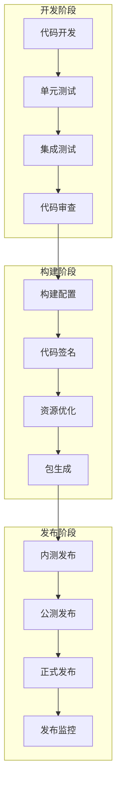

# Flutter 部署和发布最佳指南

本文档详细介绍了 Flutter 应用的部署和发布流程、最佳实践和自动化策略。

## 📋 目录

- [部署概述](#部署概述)
- [构建配置](#构建配置)
- [Android 发布](#android-发布)
- [iOS 发布](#ios-发布)
- [Web 部署](#web-部署)
- [桌面应用发布](#桌面应用发布)
- [CI/CD 自动化](#cicd-自动化)
- [版本管理](#版本管理)
- [发布策略](#发布策略)
- [监控和分析](#监控和分析)

## 🚀 部署概述

### 发布流程架构



### 发布平台

- **Android**：Google Play Store、华为应用市场、小米应用商店
- **iOS**：App Store、TestFlight
- **Web**：Firebase Hosting、Netlify、Vercel
- **桌面**：Microsoft Store、Mac App Store、直接分发

## ⚙️ 构建配置

### 环境配置

```yaml
# pubspec.yaml
name: my_app
description: A Flutter application
version: 1.0.0+1

environment:
  sdk: '>=3.0.0 <4.0.0'
  flutter: ">=3.10.0"

dependencies:
  flutter:
    sdk: flutter
  # 生产依赖
  http: ^1.1.0
  provider: ^6.1.1
  shared_preferences: ^2.2.2

dev_dependencies:
  flutter_test:
    sdk: flutter
  flutter_lints: ^3.0.0
  # 构建工具
  build_runner: ^2.4.7
  json_annotation: ^4.8.1
  json_serializable: ^6.7.1

flutter:
  uses-material-design: true
  
  assets:
    - assets/images/
    - assets/icons/
    - assets/config/
  
  fonts:
    - family: CustomFont
      fonts:
        - asset: assets/fonts/CustomFont-Regular.ttf
        - asset: assets/fonts/CustomFont-Bold.ttf
          weight: 700
```

### 构建脚本

```bash
#!/bin/bash
# scripts/build.sh

set -e

echo "🚀 开始构建 Flutter 应用..."

# 清理之前的构建
echo "🧹 清理构建缓存..."
flutter clean
flutter pub get

# 代码生成
echo "🔧 生成代码..."
flutter packages pub run build_runner build --delete-conflicting-outputs

# 运行测试
echo "🧪 运行测试..."
flutter test

# 分析代码
echo "🔍 分析代码质量..."
flutter analyze

# 构建不同平台
case "$1" in
  "android")
    echo "📱 构建 Android 应用..."
    flutter build apk --release
    flutter build appbundle --release
    ;;
  "ios")
    echo "🍎 构建 iOS 应用..."
    flutter build ios --release
    ;;
  "web")
    echo "🌐 构建 Web 应用..."
    flutter build web --release
    ;;
  "all")
    echo "📦 构建所有平台..."
    flutter build apk --release
    flutter build appbundle --release
    flutter build ios --release --no-codesign
    flutter build web --release
    ;;
  *)
    echo "❌ 请指定构建平台: android, ios, web, all"
    exit 1
    ;;
esac

echo "✅ 构建完成！"
```

### 环境变量配置

```dart
// lib/config/app_config.dart
class AppConfig {
  static const String _environment = String.fromEnvironment(
    'ENVIRONMENT',
    defaultValue: 'development',
  );
  
  static const String _apiBaseUrl = String.fromEnvironment(
    'API_BASE_URL',
    defaultValue: 'https://api.example.com',
  );
  
  static const String _appName = String.fromEnvironment(
    'APP_NAME',
    defaultValue: 'My App',
  );
  
  static bool get isProduction => _environment == 'production';
  static bool get isDevelopment => _environment == 'development';
  static bool get isStaging => _environment == 'staging';
  
  static String get apiBaseUrl => _apiBaseUrl;
  static String get appName => _appName;
  
  // 功能开关
  static bool get enableAnalytics => isProduction;
  static bool get enableCrashReporting => isProduction;
  static bool get enableDebugMode => isDevelopment;
  
  // 日志级别
  static String get logLevel {
    if (isProduction) return 'ERROR';
    if (isStaging) return 'WARNING';
    return 'DEBUG';
  }
}

// 环境特定配置
class EnvironmentConfig {
  static Map<String, dynamic> get config {
    switch (AppConfig._environment) {
      case 'production':
        return _productionConfig;
      case 'staging':
        return _stagingConfig;
      default:
        return _developmentConfig;
    }
  }
  
  static const Map<String, dynamic> _productionConfig = {
    'apiBaseUrl': 'https://api.myapp.com',
    'enableLogging': false,
    'enableDebugBanner': false,
    'crashlyticsEnabled': true,
    'analyticsEnabled': true,
  };
  
  static const Map<String, dynamic> _stagingConfig = {
    'apiBaseUrl': 'https://staging-api.myapp.com',
    'enableLogging': true,
    'enableDebugBanner': true,
    'crashlyticsEnabled': true,
    'analyticsEnabled': false,
  };
  
  static const Map<String, dynamic> _developmentConfig = {
    'apiBaseUrl': 'https://dev-api.myapp.com',
    'enableLogging': true,
    'enableDebugBanner': true,
    'crashlyticsEnabled': false,
    'analyticsEnabled': false,
  };
}
```

## 📱 Android 发布

### 签名配置

```properties
# android/key.properties
storePassword=your_store_password
keyPassword=your_key_password
keyAlias=your_key_alias
storeFile=../keystore/release-keystore.jks
```

```gradle
// android/app/build.gradle
android {
    namespace "com.example.myapp"
    compileSdkVersion flutter.compileSdkVersion
    ndkVersion flutter.ndkVersion

    compileOptions {
        sourceCompatibility JavaVersion.VERSION_1_8
        targetCompatibility JavaVersion.VERSION_1_8
    }

    kotlinOptions {
        jvmTarget = '1.8'
    }

    sourceSets {
        main.java.srcDirs += 'src/main/kotlin'
    }

    defaultConfig {
        applicationId "com.example.myapp"
        minSdkVersion flutter.minSdkVersion
        targetSdkVersion flutter.targetSdkVersion
        versionCode flutterVersionCode.toInteger()
        versionName flutterVersionName
        
        // 多 APK 支持
        ndk {
            abiFilters 'arm64-v8a', 'armeabi-v7a', 'x86_64'
        }
    }
    
    // 签名配置
    def keystoreProperties = new Properties()
    def keystorePropertiesFile = rootProject.file('key.properties')
    if (keystorePropertiesFile.exists()) {
        keystoreProperties.load(new FileInputStream(keystorePropertiesFile))
    }

    signingConfigs {
        release {
            keyAlias keystoreProperties['keyAlias']
            keyPassword keystoreProperties['keyPassword']
            storeFile keystoreProperties['storeFile'] ? file(keystoreProperties['storeFile']) : null
            storePassword keystoreProperties['storePassword']
        }
    }
    
    buildTypes {
        release {
            signingConfig signingConfigs.release
            minifyEnabled true
            shrinkResources true
            proguardFiles getDefaultProguardFile('proguard-android-optimize.txt'), 'proguard-rules.pro'
            
            // 构建配置
            buildConfigField "String", "API_BASE_URL", '"https://api.myapp.com"'
            buildConfigField "boolean", "ENABLE_LOGGING", "false"
        }
        
        debug {
            applicationIdSuffix ".debug"
            debuggable true
            buildConfigField "String", "API_BASE_URL", '"https://dev-api.myapp.com"'
            buildConfigField "boolean", "ENABLE_LOGGING", "true"
        }
        
        staging {
            applicationIdSuffix ".staging"
            debuggable true
            signingConfig signingConfigs.release
            buildConfigField "String", "API_BASE_URL", '"https://staging-api.myapp.com"'
            buildConfigField "boolean", "ENABLE_LOGGING", "true"
        }
    }
    
    // 产品风味
    flavorDimensions "environment"
    productFlavors {
        dev {
            dimension "environment"
            applicationIdSuffix ".dev"
            versionNameSuffix "-dev"
        }
        
        prod {
            dimension "environment"
        }
    }
}
```

### ProGuard 配置

```proguard
# android/app/proguard-rules.pro

# Flutter 相关
-keep class io.flutter.app.** { *; }
-keep class io.flutter.plugin.**  { *; }
-keep class io.flutter.util.**  { *; }
-keep class io.flutter.view.**  { *; }
-keep class io.flutter.**  { *; }
-keep class io.flutter.plugins.**  { *; }

# Gson 相关
-keepattributes Signature
-keepattributes *Annotation*
-dontwarn sun.misc.**
-keep class com.google.gson.** { *; }
-keep class * implements com.google.gson.TypeAdapterFactory
-keep class * implements com.google.gson.JsonSerializer
-keep class * implements com.google.gson.JsonDeserializer

# 网络请求相关
-dontwarn okhttp3.**
-dontwarn okio.**
-dontwarn javax.annotation.**
-keepnames class okhttp3.internal.publicsuffix.PublicSuffixDatabase

# 应用特定类
-keep class com.example.myapp.models.** { *; }
-keep class com.example.myapp.api.** { *; }

# 反射相关
-keepclassmembers class * {
    @com.google.gson.annotations.SerializedName <fields>;
}
```

### 发布脚本

```bash
#!/bin/bash
# scripts/deploy_android.sh

set -e

echo "📱 开始 Android 发布流程..."

# 检查环境
if [ ! -f "android/key.properties" ]; then
    echo "❌ 缺少签名配置文件 android/key.properties"
    exit 1
fi

# 清理和准备
echo "🧹 清理项目..."
flutter clean
flutter pub get

# 运行测试
echo "🧪 运行测试..."
flutter test

# 构建 Release 版本
echo "🔨 构建 Release APK..."
flutter build apk --release --split-per-abi

echo "🔨 构建 App Bundle..."
flutter build appbundle --release

# 检查构建结果
APK_PATH="build/app/outputs/flutter-apk/app-release.apk"
AAB_PATH="build/app/outputs/bundle/release/app-release.aab"

if [ -f "$APK_PATH" ]; then
    APK_SIZE=$(du -h "$APK_PATH" | cut -f1)
    echo "✅ APK 构建成功，大小: $APK_SIZE"
else
    echo "❌ APK 构建失败"
    exit 1
fi

if [ -f "$AAB_PATH" ]; then
    AAB_SIZE=$(du -h "$AAB_PATH" | cut -f1)
    echo "✅ App Bundle 构建成功，大小: $AAB_SIZE"
else
    echo "❌ App Bundle 构建失败"
    exit 1
fi

# 可选：上传到 Play Console
if [ "$1" = "--upload" ]; then
    echo "📤 上传到 Google Play Console..."
    # 这里可以集成 Google Play Console API
    # 或使用 fastlane 等工具
fi

echo "🎉 Android 发布流程完成！"
```

## 🍎 iOS 发布

### Xcode 项目配置

```xml
<!-- ios/Runner/Info.plist -->
<?xml version="1.0" encoding="UTF-8"?>
<!DOCTYPE plist PUBLIC "-//Apple//DTD PLIST 1.0//EN" "http://www.apple.com/DTDs/PropertyList-1.0.dtd">
<plist version="1.0">
<dict>
    <key>CFBundleDevelopmentRegion</key>
    <string>$(DEVELOPMENT_LANGUAGE)</string>
    <key>CFBundleDisplayName</key>
    <string>My App</string>
    <key>CFBundleExecutable</key>
    <string>$(EXECUTABLE_NAME)</string>
    <key>CFBundleIdentifier</key>
    <string>$(PRODUCT_BUNDLE_IDENTIFIER)</string>
    <key>CFBundleInfoDictionaryVersion</key>
    <string>6.0</string>
    <key>CFBundleName</key>
    <string>myapp</string>
    <key>CFBundlePackageType</key>
    <string>APPL</string>
    <key>CFBundleShortVersionString</key>
    <string>$(FLUTTER_BUILD_NAME)</string>
    <key>CFBundleSignature</key>
    <string>????</string>
    <key>CFBundleVersion</key>
    <string>$(FLUTTER_BUILD_NUMBER)</string>
    <key>LSRequiresIPhoneOS</key>
    <true/>
    <key>UILaunchStoryboardName</key>
    <string>LaunchScreen</string>
    <key>UIMainStoryboardFile</key>
    <string>Main</string>
    <key>UISupportedInterfaceOrientations</key>
    <array>
        <string>UIInterfaceOrientationPortrait</string>
        <string>UIInterfaceOrientationLandscapeLeft</string>
        <string>UIInterfaceOrientationLandscapeRight</string>
    </array>
    <key>UISupportedInterfaceOrientations~ipad</key>
    <array>
        <string>UIInterfaceOrientationPortrait</string>
        <string>UIInterfaceOrientationPortraitUpsideDown</string>
        <string>UIInterfaceOrientationLandscapeLeft</string>
        <string>UIInterfaceOrientationLandscapeRight</string>
    </array>
    <key>UIViewControllerBasedStatusBarAppearance</key>
    <false/>
    
    <!-- 权限配置 -->
    <key>NSCameraUsageDescription</key>
    <string>This app needs access to camera to take photos.</string>
    <key>NSPhotoLibraryUsageDescription</key>
    <string>This app needs access to photo library to select images.</string>
    <key>NSLocationWhenInUseUsageDescription</key>
    <string>This app needs location access to provide location-based services.</string>
    
    <!-- 网络配置 -->
    <key>NSAppTransportSecurity</key>
    <dict>
        <key>NSAllowsArbitraryLoads</key>
        <false/>
        <key>NSExceptionDomains</key>
        <dict>
            <key>api.myapp.com</key>
            <dict>
                <key>NSExceptionAllowsInsecureHTTPLoads</key>
                <false/>
                <key>NSExceptionMinimumTLSVersion</key>
                <string>TLSv1.2</string>
            </dict>
        </dict>
    </dict>
</dict>
</plist>
```

### 构建配置

```ruby
# ios/fastlane/Fastfile
default_platform(:ios)

platform :ios do
  desc "Build and upload to TestFlight"
  lane :beta do
    # 确保证书和配置文件
    match(type: "appstore")
    
    # 构建应用
    build_app(
      scheme: "Runner",
      export_method: "app-store",
      output_directory: "./build",
      output_name: "MyApp.ipa"
    )
    
    # 上传到 TestFlight
    upload_to_testflight(
      skip_waiting_for_build_processing: true
    )
  end
  
  desc "Build and upload to App Store"
  lane :release do
    # 确保证书和配置文件
    match(type: "appstore")
    
    # 构建应用
    build_app(
      scheme: "Runner",
      export_method: "app-store",
      output_directory: "./build",
      output_name: "MyApp.ipa"
    )
    
    # 上传到 App Store
    upload_to_app_store(
      force: true,
      reject_if_possible: true,
      skip_metadata: false,
      skip_screenshots: false,
      submit_for_review: false
    )
  end
  
  desc "Run tests"
  lane :test do
    run_tests(
      scheme: "Runner",
      device: "iPhone 14"
    )
  end
end
```

### iOS 发布脚本

```bash
#!/bin/bash
# scripts/deploy_ios.sh

set -e

echo "🍎 开始 iOS 发布流程..."

# 检查 Xcode 环境
if ! command -v xcodebuild &> /dev/null; then
    echo "❌ 未找到 Xcode，请确保已安装 Xcode"
    exit 1
fi

# 检查 fastlane
if ! command -v fastlane &> /dev/null; then
    echo "❌ 未找到 fastlane，请先安装: gem install fastlane"
    exit 1
fi

# 清理和准备
echo "🧹 清理项目..."
flutter clean
flutter pub get

# 运行测试
echo "🧪 运行测试..."
flutter test

# 构建 iOS 应用
echo "🔨 构建 iOS 应用..."
flutter build ios --release --no-codesign

# 使用 fastlane 处理签名和上传
cd ios

case "$1" in
  "testflight")
    echo "📤 上传到 TestFlight..."
    fastlane beta
    ;;
  "appstore")
    echo "📤 上传到 App Store..."
    fastlane release
    ;;
  *)
    echo "❌ 请指定发布目标: testflight 或 appstore"
    exit 1
    ;;
esac

cd ..

echo "🎉 iOS 发布流程完成！"
```

## 🌐 Web 部署

### Web 构建配置

```html
<!-- web/index.html -->
<!DOCTYPE html>
<html>
<head>
  <base href="$FLUTTER_BASE_HREF">
  
  <meta charset="UTF-8">
  <meta content="IE=Edge" http-equiv="X-UA-Compatible">
  <meta name="description" content="My Flutter Web App">
  <meta name="keywords" content="flutter, web, app">
  <meta name="author" content="Your Name">
  
  <!-- iOS meta tags & icons -->
  <meta name="apple-mobile-web-app-capable" content="yes">
  <meta name="apple-mobile-web-app-status-bar-style" content="black">
  <meta name="apple-mobile-web-app-title" content="My App">
  <link rel="apple-touch-icon" href="icons/Icon-192.png">
  
  <!-- Favicon -->
  <link rel="icon" type="image/png" href="favicon.png"/>
  
  <title>My App</title>
  <link rel="manifest" href="manifest.json">
  
  <style>
    /* 加载动画 */
    .loading {
      display: flex;
      justify-content: center;
      align-items: center;
      height: 100vh;
      background-color: #f5f5f5;
    }
    
    .spinner {
      width: 40px;
      height: 40px;
      border: 4px solid #e3e3e3;
      border-top: 4px solid #3498db;
      border-radius: 50%;
      animation: spin 1s linear infinite;
    }
    
    @keyframes spin {
      0% { transform: rotate(0deg); }
      100% { transform: rotate(360deg); }
    }
  </style>
</head>
<body>
  <div id="loading" class="loading">
    <div class="spinner"></div>
  </div>
  
  <script>
    // 服务工作者注册
    if ('serviceWorker' in navigator) {
      window.addEventListener('flutter-first-frame', function () {
        navigator.serviceWorker.register('flutter_service_worker.js');
      });
    }
    
    // 隐藏加载动画
    window.addEventListener('flutter-first-frame', function () {
      document.getElementById('loading').style.display = 'none';
    });
  </script>
  
  <script src="flutter.js" defer></script>
</body>
</html>
```

```json
// web/manifest.json
{
    "name": "My App",
    "short_name": "MyApp",
    "start_url": ".",
    "display": "standalone",
    "background_color": "#0175C2",
    "theme_color": "#0175C2",
    "description": "A Flutter web application.",
    "orientation": "portrait-primary",
    "prefer_related_applications": false,
    "icons": [
        {
            "src": "icons/Icon-192.png",
            "sizes": "192x192",
            "type": "image/png"
        },
        {
            "src": "icons/Icon-512.png",
            "sizes": "512x512",
            "type": "image/png"
        },
        {
            "src": "icons/Icon-maskable-192.png",
            "sizes": "192x192",
            "type": "image/png",
            "purpose": "maskable"
        },
        {
            "src": "icons/Icon-maskable-512.png",
            "sizes": "512x512",
            "type": "image/png",
            "purpose": "maskable"
        }
    ]
}
```

### Firebase 部署

```json
// firebase.json
{
  "hosting": {
    "public": "build/web",
    "ignore": [
      "firebase.json",
      "**/.*",
      "**/node_modules/**"
    ],
    "rewrites": [
      {
        "source": "**",
        "destination": "/index.html"
      }
    ],
    "headers": [
      {
        "source": "**/*.@(js|css|png|jpg|jpeg|gif|ico|svg|woff|woff2|ttf|eot)",
        "headers": [
          {
            "key": "Cache-Control",
            "value": "max-age=31536000"
          }
        ]
      },
      {
        "source": "**/*.@(html|json)",
        "headers": [
          {
            "key": "Cache-Control",
            "value": "max-age=0"
          }
        ]
      }
    ]
  }
}
```

### Web 部署脚本

```bash
#!/bin/bash
# scripts/deploy_web.sh

set -e

echo "🌐 开始 Web 部署流程..."

# 清理和准备
echo "🧹 清理项目..."
flutter clean
flutter pub get

# 运行测试
echo "🧪 运行测试..."
flutter test

# 构建 Web 应用
echo "🔨 构建 Web 应用..."
flutter build web --release --web-renderer canvaskit

# 检查构建结果
if [ ! -d "build/web" ]; then
    echo "❌ Web 构建失败"
    exit 1
fi

echo "✅ Web 构建成功"

# 部署到不同平台
case "$1" in
  "firebase")
    echo "🔥 部署到 Firebase Hosting..."
    if ! command -v firebase &> /dev/null; then
        echo "❌ 未找到 Firebase CLI，请先安装: npm install -g firebase-tools"
        exit 1
    fi
    firebase deploy --only hosting
    ;;
  "netlify")
    echo "🌐 部署到 Netlify..."
    if ! command -v netlify &> /dev/null; then
        echo "❌ 未找到 Netlify CLI，请先安装: npm install -g netlify-cli"
        exit 1
    fi
    netlify deploy --prod --dir=build/web
    ;;
  "vercel")
    echo "▲ 部署到 Vercel..."
    if ! command -v vercel &> /dev/null; then
        echo "❌ 未找到 Vercel CLI，请先安装: npm install -g vercel"
        exit 1
    fi
    vercel --prod build/web
    ;;
  *)
    echo "❌ 请指定部署平台: firebase, netlify, vercel"
    exit 1
    ;;
esac

echo "🎉 Web 部署完成！"
```

## 🖥️ 桌面应用发布

### Windows 配置

```cmake
# windows/runner/CMakeLists.txt
cmake_minimum_required(VERSION 3.14)
project(myapp LANGUAGES CXX)

set(BINARY_NAME "myapp")
set(APPLICATION_ID "com.example.myapp")

# 应用信息
set(VERSION_MAJOR 1)
set(VERSION_MINOR 0)
set(VERSION_PATCH 0)
set(VERSION_BUILD 1)

# 配置资源文件
configure_file(
  "${CMAKE_CURRENT_SOURCE_DIR}/runner.rc.in"
  "${CMAKE_CURRENT_BINARY_DIR}/runner.rc"
  @ONLY
)

# 添加可执行文件
add_executable(${BINARY_NAME} WIN32
  "flutter_window.cpp"
  "main.cpp"
  "utils.cpp"
  "win32_window.cpp"
  "${CMAKE_CURRENT_BINARY_DIR}/runner.rc"
  "runner.exe.manifest"
)
```

### macOS 配置

```xml
<!-- macos/Runner/Info.plist -->
<?xml version="1.0" encoding="UTF-8"?>
<!DOCTYPE plist PUBLIC "-//Apple//DTD PLIST 1.0//EN" "http://www.apple.com/DTDs/PropertyList-1.0.dtd">
<plist version="1.0">
<dict>
    <key>CFBundleDevelopmentRegion</key>
    <string>en</string>
    <key>CFBundleDisplayName</key>
    <string>My App</string>
    <key>CFBundleExecutable</key>
    <string>$(EXECUTABLE_NAME)</string>
    <key>CFBundleIconFile</key>
    <string>app_icon</string>
    <key>CFBundleIdentifier</key>
    <string>$(PRODUCT_BUNDLE_IDENTIFIER)</string>
    <key>CFBundleInfoDictionaryVersion</key>
    <string>6.0</string>
    <key>CFBundleName</key>
    <string>$(PRODUCT_NAME)</string>
    <key>CFBundlePackageType</key>
    <string>APPL</string>
    <key>CFBundleShortVersionString</key>
    <string>$(FLUTTER_BUILD_NAME)</string>
    <key>CFBundleVersion</key>
    <string>$(FLUTTER_BUILD_NUMBER)</string>
    <key>LSMinimumSystemVersion</key>
    <string>$(MACOSX_DEPLOYMENT_TARGET)</string>
    <key>NSHumanReadableCopyright</key>
    <string>Copyright © 2024 Your Company. All rights reserved.</string>
    <key>NSMainNibFile</key>
    <string>MainMenu</string>
    <key>NSPrincipalClass</key>
    <string>NSApplication</string>
    
    <!-- 权限配置 -->
    <key>NSCameraUsageDescription</key>
    <string>This app needs access to camera.</string>
    <key>NSMicrophoneUsageDescription</key>
    <string>This app needs access to microphone.</string>
</dict>
</plist>
```

### 桌面发布脚本

```bash
#!/bin/bash
# scripts/deploy_desktop.sh

set -e

echo "🖥️ 开始桌面应用发布流程..."

# 检查平台
OS="$(uname -s)"
case "${OS}" in
    Linux*)     PLATFORM=linux;;
    Darwin*)    PLATFORM=macos;;
    CYGWIN*|MINGW*|MSYS*) PLATFORM=windows;;
    *)          echo "❌ 不支持的操作系统: ${OS}"; exit 1;;
esac

echo "📋 检测到平台: $PLATFORM"

# 清理和准备
echo "🧹 清理项目..."
flutter clean
flutter pub get

# 运行测试
echo "🧪 运行测试..."
flutter test

# 构建桌面应用
echo "🔨 构建 $PLATFORM 应用..."
flutter build $PLATFORM --release

# 检查构建结果
BUILD_DIR="build/$PLATFORM/x64/release"
if [ ! -d "$BUILD_DIR" ]; then
    echo "❌ $PLATFORM 构建失败"
    exit 1
fi

echo "✅ $PLATFORM 构建成功"

# 创建安装包
case "$PLATFORM" in
    "windows")
        echo "📦 创建 Windows 安装包..."
        # 可以使用 Inno Setup 或 NSIS
        ;;
    "macos")
        echo "📦 创建 macOS 安装包..."
        # 可以使用 create-dmg
        if command -v create-dmg &> /dev/null; then
            create-dmg \
                --volname "My App" \
                --window-pos 200 120 \
                --window-size 600 300 \
                --icon-size 100 \
                --icon "My App.app" 175 120 \
                --hide-extension "My App.app" \
                --app-drop-link 425 120 \
                "MyApp-Installer.dmg" \
                "$BUILD_DIR/bundle/"
        fi
        ;;
    "linux")
        echo "📦 创建 Linux 安装包..."
        # 可以使用 AppImage 或 Snap
        ;;
esac

echo "🎉 桌面应用发布完成！"
```

## 🔄 CI/CD 自动化

### GitHub Actions 配置

```yaml
# .github/workflows/build_and_deploy.yml
name: Build and Deploy

on:
  push:
    branches: [ main, develop ]
  pull_request:
    branches: [ main ]
  release:
    types: [ published ]

jobs:
  test:
    runs-on: ubuntu-latest
    steps:
    - uses: actions/checkout@v4
    
    - name: Setup Flutter
      uses: subosito/flutter-action@v2
      with:
        flutter-version: '3.16.0'
        channel: 'stable'
    
    - name: Install dependencies
      run: flutter pub get
    
    - name: Run tests
      run: flutter test
    
    - name: Analyze code
      run: flutter analyze

  build_android:
    needs: test
    runs-on: ubuntu-latest
    if: github.event_name == 'release'
    steps:
    - uses: actions/checkout@v4
    
    - name: Setup Flutter
      uses: subosito/flutter-action@v2
      with:
        flutter-version: '3.16.0'
        channel: 'stable'
    
    - name: Setup Java
      uses: actions/setup-java@v3
      with:
        distribution: 'zulu'
        java-version: '17'
    
    - name: Install dependencies
      run: flutter pub get
    
    - name: Decode keystore
      run: |
        echo "${{ secrets.KEYSTORE_BASE64 }}" | base64 --decode > android/keystore/release-keystore.jks
    
    - name: Create key.properties
      run: |
        echo "storePassword=${{ secrets.STORE_PASSWORD }}" > android/key.properties
        echo "keyPassword=${{ secrets.KEY_PASSWORD }}" >> android/key.properties
        echo "keyAlias=${{ secrets.KEY_ALIAS }}" >> android/key.properties
        echo "storeFile=../keystore/release-keystore.jks" >> android/key.properties
    
    - name: Build APK
      run: flutter build apk --release
    
    - name: Build App Bundle
      run: flutter build appbundle --release
    
    - name: Upload artifacts
      uses: actions/upload-artifact@v3
      with:
        name: android-release
        path: |
          build/app/outputs/flutter-apk/app-release.apk
          build/app/outputs/bundle/release/app-release.aab

  build_ios:
    needs: test
    runs-on: macos-latest
    if: github.event_name == 'release'
    steps:
    - uses: actions/checkout@v4
    
    - name: Setup Flutter
      uses: subosito/flutter-action@v2
      with:
        flutter-version: '3.16.0'
        channel: 'stable'
    
    - name: Install dependencies
      run: flutter pub get
    
    - name: Build iOS
      run: flutter build ios --release --no-codesign
    
    - name: Upload artifacts
      uses: actions/upload-artifact@v3
      with:
        name: ios-release
        path: build/ios/iphoneos/Runner.app

  build_web:
    needs: test
    runs-on: ubuntu-latest
    steps:
    - uses: actions/checkout@v4
    
    - name: Setup Flutter
      uses: subosito/flutter-action@v2
      with:
        flutter-version: '3.16.0'
        channel: 'stable'
    
    - name: Install dependencies
      run: flutter pub get
    
    - name: Build Web
      run: flutter build web --release
    
    - name: Deploy to Firebase
      if: github.ref == 'refs/heads/main'
      uses: FirebaseExtended/action-hosting-deploy@v0
      with:
        repoToken: '${{ secrets.GITHUB_TOKEN }}'
        firebaseServiceAccount: '${{ secrets.FIREBASE_SERVICE_ACCOUNT }}'
        channelId: live
        projectId: your-project-id

  deploy_android:
    needs: build_android
    runs-on: ubuntu-latest
    if: github.event_name == 'release'
    steps:
    - name: Download artifacts
      uses: actions/download-artifact@v3
      with:
        name: android-release
    
    - name: Upload to Play Store
      uses: r0adkll/upload-google-play@v1
      with:
        serviceAccountJsonPlainText: ${{ secrets.GOOGLE_PLAY_SERVICE_ACCOUNT }}
        packageName: com.example.myapp
        releaseFiles: app-release.aab
        track: production
        status: completed
```

### GitLab CI 配置

```yaml
# .gitlab-ci.yml
stages:
  - test
  - build
  - deploy

variables:
  FLUTTER_VERSION: "3.16.0"

before_script:
  - apt-get update -qq && apt-get install -y -qq git curl unzip
  - git clone https://github.com/flutter/flutter.git -b stable --depth 1
  - export PATH="$PATH:`pwd`/flutter/bin"
  - flutter doctor -v
  - flutter pub get

test:
  stage: test
  script:
    - flutter test
    - flutter analyze
  only:
    - merge_requests
    - main
    - develop

build_android:
  stage: build
  script:
    - echo $KEYSTORE_BASE64 | base64 -d > android/keystore/release-keystore.jks
    - echo "storePassword=$STORE_PASSWORD" > android/key.properties
    - echo "keyPassword=$KEY_PASSWORD" >> android/key.properties
    - echo "keyAlias=$KEY_ALIAS" >> android/key.properties
    - echo "storeFile=../keystore/release-keystore.jks" >> android/key.properties
    - flutter build apk --release
    - flutter build appbundle --release
  artifacts:
    paths:
      - build/app/outputs/flutter-apk/app-release.apk
      - build/app/outputs/bundle/release/app-release.aab
    expire_in: 1 week
  only:
    - tags

build_web:
  stage: build
  script:
    - flutter build web --release
  artifacts:
    paths:
      - build/web/
    expire_in: 1 week
  only:
    - main
    - tags

deploy_web:
  stage: deploy
  image: node:16
  before_script:
    - npm install -g firebase-tools
  script:
    - firebase deploy --only hosting --token $FIREBASE_TOKEN
  dependencies:
    - build_web
  only:
    - main
```

## 📊 监控和分析

### 崩溃报告集成

```dart
// lib/services/crash_reporting_service.dart
import 'package:firebase_crashlytics/firebase_crashlytics.dart';
import 'package:flutter/foundation.dart';
import '../config/app_config.dart';

class CrashReportingService {
  static FirebaseCrashlytics? _crashlytics;
  
  static Future<void> initialize() async {
    if (!AppConfig.enableCrashReporting) return;
    
    _crashlytics = FirebaseCrashlytics.instance;
    
    // 在 Debug 模式下禁用崩溃报告
    await _crashlytics!.setCrashlyticsCollectionEnabled(!kDebugMode);
    
    // 设置全局错误处理
    FlutterError.onError = (FlutterErrorDetails details) {
      _crashlytics!.recordFlutterFatalError(details);
    };
    
    // 设置平台错误处理
    PlatformDispatcher.instance.onError = (error, stack) {
      _crashlytics!.recordError(error, stack, fatal: true);
      return true;
    };
  }
  
  static Future<void> recordError(
    dynamic exception,
    StackTrace? stackTrace, {
    bool fatal = false,
    Map<String, dynamic>? context,
  }) async {
    if (_crashlytics == null) return;
    
    await _crashlytics!.recordError(
      exception,
      stackTrace,
      fatal: fatal,
      information: context?.entries.map((e) => '${e.key}: ${e.value}').toList() ?? [],
    );
  }
  
  static Future<void> log(String message) async {
    if (_crashlytics == null) return;
    await _crashlytics!.log(message);
  }
  
  static Future<void> setUserId(String userId) async {
    if (_crashlytics == null) return;
    await _crashlytics!.setUserIdentifier(userId);
  }
  
  static Future<void> setCustomKey(String key, dynamic value) async {
    if (_crashlytics == null) return;
    await _crashlytics!.setCustomKey(key, value);
  }
}
```

### 性能监控

```dart
// lib/services/performance_service.dart
import 'package:firebase_performance/firebase_performance.dart';
import '../config/app_config.dart';

class PerformanceService {
  static FirebasePerformance? _performance;
  
  static Future<void> initialize() async {
    if (!AppConfig.enableAnalytics) return;
    
    _performance = FirebasePerformance.instance;
    await _performance!.setPerformanceCollectionEnabled(true);
  }
  
  static Trace? startTrace(String name) {
    if (_performance == null) return null;
    
    final trace = _performance!.newTrace(name);
    trace.start();
    return trace;
  }
  
  static Future<void> stopTrace(Trace? trace) async {
    if (trace == null) return;
    await trace.stop();
  }
  
  static HttpMetric? startHttpMetric(String url, HttpMethod method) {
    if (_performance == null) return null;
    
    return _performance!.newHttpMetric(url, method);
  }
  
  static Future<void> recordHttpMetric(
    String url,
    HttpMethod method,
    int responseCode,
    int requestPayloadSize,
    int responsePayloadSize,
  ) async {
    final metric = startHttpMetric(url, method);
    if (metric == null) return;
    
    metric.requestPayloadSize = requestPayloadSize;
    metric.responsePayloadSize = responsePayloadSize;
    metric.responseCode = responseCode;
    
    await metric.stop();
  }
}

// 性能监控装饰器
class PerformanceTracker {
  static Future<T> track<T>(
    String traceName,
    Future<T> Function() operation,
  ) async {
    final trace = PerformanceService.startTrace(traceName);
    
    try {
      final result = await operation();
      return result;
    } catch (e) {
      trace?.putAttribute('error', e.toString());
      rethrow;
    } finally {
      await PerformanceService.stopTrace(trace);
    }
  }
}
```

## 📚 总结

部署和发布是应用开发的最后一环，也是最关键的一环：

### 核心要素

1. **构建配置**：正确配置不同环境的构建参数
2. **签名和证书**：确保应用的安全性和完整性
3. **自动化流程**：使用 CI/CD 提高发布效率
4. **监控分析**：及时发现和解决问题

### 最佳实践

1. **环境分离**：开发、测试、生产环境独立
2. **版本管理**：规范的版本号和发布记录
3. **渐进发布**：分阶段发布降低风险
4. **质量保证**：完善的测试和代码审查

### 推荐工具

- **CI/CD**：GitHub Actions、GitLab CI、Jenkins
- **发布平台**：Google Play Console、App Store Connect
- **监控工具**：Firebase Crashlytics、Sentry
- **自动化工具**：Fastlane、Codemagic

通过系统性的部署和发布流程，可以确保 Flutter 应用的稳定发布和持续改进。