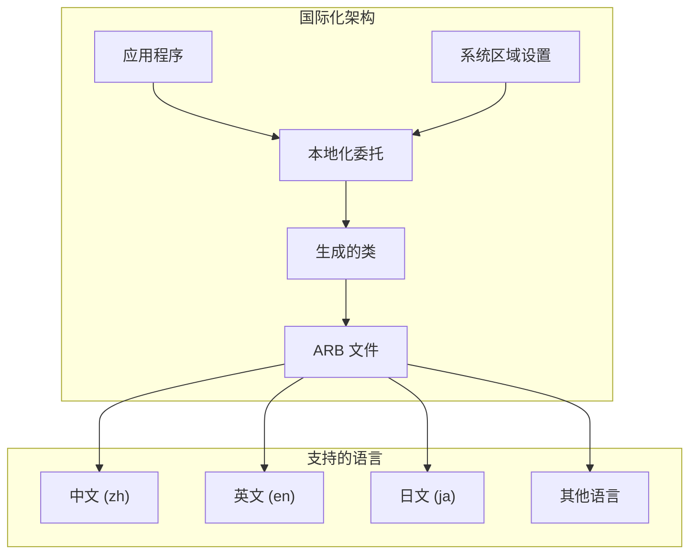

# Flutter 国际化和本地化最佳指南

本文档详细介绍了 Flutter 应用的国际化（i18n）和本地化（l10n）实现方法、最佳实践和技术细节。

## 📋 目录

- [国际化概述](#国际化概述)
- [项目配置](#项目配置)
- [文本国际化](#文本国际化)
- [日期和时间](#日期和时间)
- [数字和货币](#数字和货币)
- [图片和资源](#图片和资源)
- [RTL 支持](#rtl-支持)
- [动态语言切换](#动态语言切换)
- [本地化测试](#本地化测试)
- [性能优化](#性能优化)

## 🌍 国际化概述

### 国际化架构



### 核心概念

- **国际化 (i18n)**：设计应用以支持多种语言和地区
- **本地化 (l10n)**：为特定语言和地区适配应用
- **区域设置 (Locale)**：语言和地区的组合标识
- **ARB 文件**：应用资源包，存储翻译文本

## ⚙️ 项目配置

### pubspec.yaml 配置

```yaml
# pubspec.yaml
name: my_app
description: A Flutter application with internationalization.

version: 1.0.0+1

environment:
  sdk: '>=3.0.0 <4.0.0'
  flutter: ">=3.10.0"

dependencies:
  flutter:
    sdk: flutter
  flutter_localizations:
    sdk: flutter
  intl: ^0.18.1

dev_dependencies:
  flutter_test:
    sdk: flutter
  flutter_lints: ^3.0.0

flutter:
  uses-material-design: true
  
  # 启用国际化代码生成
  generate: true
  
  assets:
    - assets/images/
    - assets/images/flags/
  
  fonts:
    - family: NotoSans
      fonts:
        - asset: assets/fonts/NotoSans-Regular.ttf
        - asset: assets/fonts/NotoSans-Bold.ttf
          weight: 700
    - family: NotoSansCJK
      fonts:
        - asset: assets/fonts/NotoSansCJK-Regular.ttf
        - asset: assets/fonts/NotoSansCJK-Bold.ttf
          weight: 700
```

### l10n.yaml 配置

```yaml
# l10n.yaml
arb-dir: lib/l10n
template-arb-file: app_en.arb
output-localization-file: app_localizations.dart
output-class: AppLocalizations
output-dir: lib/generated/l10n
preferred-supported-locales: ["en", "zh"]

# 启用合成包
synthetic-package: false

# 启用空安全
nullable-getter: false

# 启用延迟加载
use-deferred-loading: true

# 自定义头部注释
header-file: lib/l10n/header.txt

# 启用转义
escape-character: '\'
```

### 应用程序配置

```dart
// lib/main.dart
import 'package:flutter/material.dart';
import 'package:flutter_localizations/flutter_localizations.dart';
import 'generated/l10n/app_localizations.dart';
import 'services/locale_service.dart';
import 'providers/locale_provider.dart';
import 'package:provider/provider.dart';

void main() {
  runApp(const MyApp());
}

class MyApp extends StatelessWidget {
  const MyApp({super.key});

  @override
  Widget build(BuildContext context) {
    return ChangeNotifierProvider(
      create: (context) => LocaleProvider(),
      child: Consumer<LocaleProvider>(
        builder: (context, localeProvider, child) {
          return MaterialApp(
            title: 'Flutter i18n Demo',
            
            // 国际化配置
            locale: localeProvider.locale,
            localizationsDelegates: const [
              AppLocalizations.delegate,
              GlobalMaterialLocalizations.delegate,
              GlobalWidgetsLocalizations.delegate,
              GlobalCupertinoLocalizations.delegate,
            ],
            supportedLocales: AppLocalizations.supportedLocales,
            
            // 区域设置解析
            localeResolutionCallback: (locale, supportedLocales) {
              return LocaleService.resolveLocale(locale, supportedLocales);
            },
            
            // 主题配置
            theme: ThemeData(
              primarySwatch: Colors.blue,
              fontFamily: _getFontFamily(localeProvider.locale),
            ),
            
            home: const HomePage(),
          );
        },
      ),
    );
  }
  
  String _getFontFamily(Locale locale) {
    switch (locale.languageCode) {
      case 'zh':
      case 'ja':
      case 'ko':
        return 'NotoSansCJK';
      default:
        return 'NotoSans';
    }
  }
}
```

## 📝 文本国际化

### ARB 文件结构

```json
// lib/l10n/app_en.arb
{
  "@@locale": "en",
  "@@last_modified": "2024-01-01T00:00:00.000Z",
  
  "appTitle": "My App",
  "@appTitle": {
    "description": "The title of the application"
  },
  
  "welcome": "Welcome",
  "@welcome": {
    "description": "Welcome message"
  },
  
  "hello": "Hello {name}!",
  "@hello": {
    "description": "Greeting message with name parameter",
    "placeholders": {
      "name": {
        "type": "String",
        "example": "John"
      }
    }
  },
  
  "itemCount": "{count, plural, =0{No items} =1{One item} other{{count} items}}",
  "@itemCount": {
    "description": "Number of items with plural support",
    "placeholders": {
      "count": {
        "type": "int",
        "format": "compact"
      }
    }
  },
  
  "lastSeen": "Last seen {date}",
  "@lastSeen": {
    "description": "Last seen date",
    "placeholders": {
      "date": {
        "type": "DateTime",
        "format": "yMd"
      }
    }
  },
  
  "price": "Price: {amount}",
  "@price": {
    "description": "Price with currency",
    "placeholders": {
      "amount": {
        "type": "double",
        "format": "currency",
        "optionalParameters": {
          "symbol": "$",
          "decimalDigits": 2
        }
      }
    }
  },
  
  "gender": "{gender, select, male{He} female{She} other{They}} is a developer",
  "@gender": {
    "description": "Gender-based message",
    "placeholders": {
      "gender": {
        "type": "String"
      }
    }
  },
  
  "loginButton": "Login",
  "logoutButton": "Logout",
  "settingsTitle": "Settings",
  "languageLabel": "Language",
  "themeLabel": "Theme",
  "darkMode": "Dark Mode",
  "lightMode": "Light Mode",
  
  "errorMessages": {
    "networkError": "Network connection error",
    "invalidInput": "Invalid input",
    "unauthorized": "Unauthorized access"
  },
  
  "validationMessages": {
    "required": "This field is required",
    "emailInvalid": "Please enter a valid email address",
    "passwordTooShort": "Password must be at least 8 characters"
  }
}
```

```json
// lib/l10n/app_zh.arb
{
  "@@locale": "zh",
  "@@last_modified": "2024-01-01T00:00:00.000Z",
  
  "appTitle": "我的应用",
  "welcome": "欢迎",
  "hello": "你好，{name}！",
  "itemCount": "{count, plural, =0{没有项目} =1{一个项目} other{{count} 个项目}}",
  "lastSeen": "最后访问时间：{date}",
  "price": "价格：{amount}",
  "gender": "{gender, select, male{他} female{她} other{他们}}是一名开发者",
  
  "loginButton": "登录",
  "logoutButton": "退出登录",
  "settingsTitle": "设置",
  "languageLabel": "语言",
  "themeLabel": "主题",
  "darkMode": "深色模式",
  "lightMode": "浅色模式",
  
  "errorMessages": {
    "networkError": "网络连接错误",
    "invalidInput": "输入无效",
    "unauthorized": "未授权访问"
  },
  
  "validationMessages": {
    "required": "此字段为必填项",
    "emailInvalid": "请输入有效的邮箱地址",
    "passwordTooShort": "密码至少需要8个字符"
  }
}
```

### 使用本地化文本

```dart
// lib/widgets/localized_widgets.dart
import 'package:flutter/material.dart';
import '../generated/l10n/app_localizations.dart';

class LocalizedHomePage extends StatelessWidget {
  const LocalizedHomePage({super.key});

  @override
  Widget build(BuildContext context) {
    final l10n = AppLocalizations.of(context)!;
    
    return Scaffold(
      appBar: AppBar(
        title: Text(l10n.appTitle),
      ),
      body: Padding(
        padding: const EdgeInsets.all(16.0),
        child: Column(
          crossAxisAlignment: CrossAxisAlignment.start,
          children: [
            // 简单文本
            Text(
              l10n.welcome,
              style: Theme.of(context).textTheme.headlineMedium,
            ),
            
            const SizedBox(height: 16),
            
            // 带参数的文本
            Text(
              l10n.hello('张三'),
              style: Theme.of(context).textTheme.bodyLarge,
            ),
            
            const SizedBox(height: 16),
            
            // 复数形式
            Text(l10n.itemCount(0)),
            Text(l10n.itemCount(1)),
            Text(l10n.itemCount(5)),
            
            const SizedBox(height: 16),
            
            // 日期格式化
            Text(l10n.lastSeen(DateTime.now())),
            
            const SizedBox(height: 16),
            
            // 货币格式化
            Text(l10n.price(99.99)),
            
            const SizedBox(height: 16),
            
            // 性别选择
            Text(l10n.gender('male')),
            Text(l10n.gender('female')),
            Text(l10n.gender('other')),
            
            const SizedBox(height: 32),
            
            // 按钮
            Row(
              children: [
                ElevatedButton(
                  onPressed: () {},
                  child: Text(l10n.loginButton),
                ),
                const SizedBox(width: 16),
                OutlinedButton(
                  onPressed: () {},
                  child: Text(l10n.logoutButton),
                ),
              ],
            ),
          ],
        ),
      ),
    );
  }
}

// 本地化扩展
extension AppLocalizationsExtension on AppLocalizations {
  // 错误消息
  String getErrorMessage(String errorType) {
    switch (errorType) {
      case 'network':
        return 'Network connection error'; // 应该从 ARB 文件获取
      case 'invalid_input':
        return 'Invalid input';
      case 'unauthorized':
        return 'Unauthorized access';
      default:
        return 'Unknown error';
    }
  }
  
  // 验证消息
  String getValidationMessage(String validationType) {
    switch (validationType) {
      case 'required':
        return 'This field is required';
      case 'email_invalid':
        return 'Please enter a valid email address';
      case 'password_too_short':
        return 'Password must be at least 8 characters';
      default:
        return 'Invalid input';
    }
  }
}
```

## 📅 日期和时间

### 日期时间本地化

```dart
// lib/utils/date_time_utils.dart
import 'package:intl/intl.dart';
import 'package:flutter/material.dart';

class DateTimeUtils {
  // 格式化日期
  static String formatDate(DateTime date, Locale locale) {
    final formatter = DateFormat.yMd(locale.toString());
    return formatter.format(date);
  }
  
  // 格式化时间
  static String formatTime(DateTime time, Locale locale) {
    final formatter = DateFormat.Hm(locale.toString());
    return formatter.format(time);
  }
  
  // 格式化日期时间
  static String formatDateTime(DateTime dateTime, Locale locale) {
    final formatter = DateFormat.yMd(locale.toString()).add_Hm();
    return formatter.format(dateTime);
  }
  
  // 相对时间（如：2小时前）
  static String formatRelativeTime(DateTime dateTime, Locale locale) {
    final now = DateTime.now();
    final difference = now.difference(dateTime);
    
    if (difference.inDays > 0) {
      return _getRelativeDayText(difference.inDays, locale);
    } else if (difference.inHours > 0) {
      return _getRelativeHourText(difference.inHours, locale);
    } else if (difference.inMinutes > 0) {
      return _getRelativeMinuteText(difference.inMinutes, locale);
    } else {
      return _getJustNowText(locale);
    }
  }
  
  static String _getRelativeDayText(int days, Locale locale) {
    switch (locale.languageCode) {
      case 'zh':
        return '$days天前';
      case 'en':
      default:
        return days == 1 ? '1 day ago' : '$days days ago';
    }
  }
  
  static String _getRelativeHourText(int hours, Locale locale) {
    switch (locale.languageCode) {
      case 'zh':
        return '$hours小时前';
      case 'en':
      default:
        return hours == 1 ? '1 hour ago' : '$hours hours ago';
    }
  }
  
  static String _getRelativeMinuteText(int minutes, Locale locale) {
    switch (locale.languageCode) {
      case 'zh':
        return '$minutes分钟前';
      case 'en':
      default:
        return minutes == 1 ? '1 minute ago' : '$minutes minutes ago';
    }
  }
  
  static String _getJustNowText(Locale locale) {
    switch (locale.languageCode) {
      case 'zh':
        return '刚刚';
      case 'en':
      default:
        return 'Just now';
    }
  }
  
  // 格式化星期
  static String formatWeekday(DateTime date, Locale locale) {
    final formatter = DateFormat.EEEE(locale.toString());
    return formatter.format(date);
  }
  
  // 格式化月份
  static String formatMonth(DateTime date, Locale locale) {
    final formatter = DateFormat.MMMM(locale.toString());
    return formatter.format(date);
  }
  
  // 自定义日期格式
  static String formatCustom(DateTime date, String pattern, Locale locale) {
    final formatter = DateFormat(pattern, locale.toString());
    return formatter.format(date);
  }
}

// 本地化日期选择器
class LocalizedDatePicker {
  static Future<DateTime?> showDatePicker({
    required BuildContext context,
    required DateTime initialDate,
    required DateTime firstDate,
    required DateTime lastDate,
  }) async {
    final locale = Localizations.localeOf(context);
    
    return await showDatePicker(
      context: context,
      initialDate: initialDate,
      firstDate: firstDate,
      lastDate: lastDate,
      locale: locale,
      builder: (context, child) {
        return Theme(
          data: Theme.of(context).copyWith(
            colorScheme: Theme.of(context).colorScheme.copyWith(
              primary: Theme.of(context).primaryColor,
            ),
          ),
          child: child!,
        );
      },
    );
  }
  
  static Future<TimeOfDay?> showTimePicker({
    required BuildContext context,
    required TimeOfDay initialTime,
  }) async {
    return await showTimePicker(
      context: context,
      initialTime: initialTime,
      builder: (context, child) {
        return MediaQuery(
          data: MediaQuery.of(context).copyWith(
            alwaysUse24HourFormat: _shouldUse24HourFormat(
              Localizations.localeOf(context),
            ),
          ),
          child: child!,
        );
      },
    );
  }
  
  static bool _shouldUse24HourFormat(Locale locale) {
    // 根据地区决定是否使用24小时制
    switch (locale.countryCode) {
      case 'US':
      case 'CA':
        return false; // 12小时制
      default:
        return true; // 24小时制
    }
  }
}
```

## 💰 数字和货币

### 数字格式化

```dart
// lib/utils/number_utils.dart
import 'package:intl/intl.dart';
import 'package:flutter/material.dart';

class NumberUtils {
  // 格式化整数
  static String formatInteger(int number, Locale locale) {
    final formatter = NumberFormat.decimalPattern(locale.toString());
    return formatter.format(number);
  }
  
  // 格式化小数
  static String formatDecimal(double number, Locale locale, {int? decimalDigits}) {
    final formatter = NumberFormat.decimalPattern(locale.toString());
    if (decimalDigits != null) {
      formatter.minimumFractionDigits = decimalDigits;
      formatter.maximumFractionDigits = decimalDigits;
    }
    return formatter.format(number);
  }
  
  // 格式化百分比
  static String formatPercentage(double number, Locale locale, {int? decimalDigits}) {
    final formatter = NumberFormat.percentPattern(locale.toString());
    if (decimalDigits != null) {
      formatter.minimumFractionDigits = decimalDigits;
      formatter.maximumFractionDigits = decimalDigits;
    }
    return formatter.format(number);
  }
  
  // 格式化紧凑数字（如：1K, 1M）
  static String formatCompact(num number, Locale locale) {
    final formatter = NumberFormat.compact(locale: locale.toString());
    return formatter.format(number);
  }
  
  // 格式化科学计数法
  static String formatScientific(double number, Locale locale) {
    final formatter = NumberFormat.scientificPattern(locale.toString());
    return formatter.format(number);
  }
}

// 货币格式化
class CurrencyUtils {
  // 支持的货币
  static const Map<String, CurrencyInfo> supportedCurrencies = {
    'USD': CurrencyInfo('USD', r'$', 2),
    'EUR': CurrencyInfo('EUR', '€', 2),
    'GBP': CurrencyInfo('GBP', '£', 2),
    'JPY': CurrencyInfo('JPY', '¥', 0),
    'CNY': CurrencyInfo('CNY', '¥', 2),
    'KRW': CurrencyInfo('KRW', '₩', 0),
  };
  
  // 根据地区获取默认货币
  static String getDefaultCurrency(Locale locale) {
    switch (locale.countryCode) {
      case 'US':
        return 'USD';
      case 'CN':
        return 'CNY';
      case 'JP':
        return 'JPY';
      case 'KR':
        return 'KRW';
      case 'GB':
        return 'GBP';
      default:
        return 'USD';
    }
  }
  
  // 格式化货币
  static String formatCurrency(
    double amount,
    Locale locale, {
    String? currencyCode,
    String? symbol,
    int? decimalDigits,
  }) {
    final currency = currencyCode ?? getDefaultCurrency(locale);
    final currencyInfo = supportedCurrencies[currency];
    
    final formatter = NumberFormat.currency(
      locale: locale.toString(),
      symbol: symbol ?? currencyInfo?.symbol ?? r'$',
      decimalDigits: decimalDigits ?? currencyInfo?.decimalDigits ?? 2,
    );
    
    return formatter.format(amount);
  }
  
  // 格式化货币（简化版）
  static String formatCurrencySimple(
    double amount,
    Locale locale, {
    String? currencyCode,
  }) {
    final currency = currencyCode ?? getDefaultCurrency(locale);
    final formatter = NumberFormat.simpleCurrency(
      locale: locale.toString(),
      name: currency,
    );
    
    return formatter.format(amount);
  }
  
  // 解析货币字符串
  static double? parseCurrency(String currencyString, Locale locale) {
    try {
      final formatter = NumberFormat.currency(locale: locale.toString());
      return formatter.parse(currencyString).toDouble();
    } catch (e) {
      return null;
    }
  }
}

class CurrencyInfo {
  const CurrencyInfo(this.code, this.symbol, this.decimalDigits);
  
  final String code;
  final String symbol;
  final int decimalDigits;
}

// 本地化数字输入
class LocalizedNumberField extends StatelessWidget {
  const LocalizedNumberField({
    super.key,
    this.controller,
    this.labelText,
    this.isCurrency = false,
    this.currencyCode,
    this.decimalDigits,
    this.onChanged,
  });
  
  final TextEditingController? controller;
  final String? labelText;
  final bool isCurrency;
  final String? currencyCode;
  final int? decimalDigits;
  final ValueChanged<double?>? onChanged;
  
  @override
  Widget build(BuildContext context) {
    final locale = Localizations.localeOf(context);
    
    return TextFormField(
      controller: controller,
      keyboardType: const TextInputType.numberWithOptions(decimal: true),
      decoration: InputDecoration(
        labelText: labelText,
        prefixText: isCurrency
            ? CurrencyUtils.supportedCurrencies[
                currencyCode ?? CurrencyUtils.getDefaultCurrency(locale)
              ]?.symbol
            : null,
      ),
      onChanged: (value) {
        final number = _parseNumber(value, locale);
        onChanged?.call(number);
      },
      validator: (value) {
        if (value == null || value.isEmpty) {
          return null;
        }
        
        final number = _parseNumber(value, locale);
        if (number == null) {
          return 'Invalid number format';
        }
        
        return null;
      },
    );
  }
  
  double? _parseNumber(String value, Locale locale) {
    try {
      if (isCurrency) {
        return CurrencyUtils.parseCurrency(value, locale);
      } else {
        final formatter = NumberFormat.decimalPattern(locale.toString());
        return formatter.parse(value).toDouble();
      }
    } catch (e) {
      return null;
    }
  }
}
```

## 🖼️ 图片和资源

### 本地化资源管理

```dart
// lib/utils/localized_assets.dart
import 'package:flutter/material.dart';

class LocalizedAssets {
  // 本地化图片路径
  static String getLocalizedImagePath(String imageName, Locale locale) {
    final languageCode = locale.languageCode;
    final countryCode = locale.countryCode;
    
    // 尝试完整的区域设置（如：zh_CN）
    if (countryCode != null) {
      final fullLocalePath = 'assets/images/${languageCode}_$countryCode/$imageName';
      if (_assetExists(fullLocalePath)) {
        return fullLocalePath;
      }
    }
    
    // 尝试语言代码（如：zh）
    final languagePath = 'assets/images/$languageCode/$imageName';
    if (_assetExists(languagePath)) {
      return languagePath;
    }
    
    // 回退到默认路径
    return 'assets/images/$imageName';
  }
  
  // 获取国旗图标
  static String getFlagIcon(Locale locale) {
    final countryCode = locale.countryCode?.toLowerCase() ?? 'unknown';
    return 'assets/images/flags/$countryCode.png';
  }
  
  // 获取本地化图标
  static String getLocalizedIcon(String iconName, Locale locale) {
    return getLocalizedImagePath('icons/$iconName', locale);
  }
  
  // 检查资源是否存在（简化实现）
  static bool _assetExists(String path) {
    // 在实际应用中，这里应该检查资源是否真的存在
    // 可以使用 rootBundle.load() 来验证
    return true;
  }
}

// 本地化图片组件
class LocalizedImage extends StatelessWidget {
  const LocalizedImage(
    this.imageName, {
    super.key,
    this.width,
    this.height,
    this.fit,
    this.semanticLabel,
  });
  
  final String imageName;
  final double? width;
  final double? height;
  final BoxFit? fit;
  final String? semanticLabel;
  
  @override
  Widget build(BuildContext context) {
    final locale = Localizations.localeOf(context);
    final imagePath = LocalizedAssets.getLocalizedImagePath(imageName, locale);
    
    return Image.asset(
      imagePath,
      width: width,
      height: height,
      fit: fit,
      semanticLabel: semanticLabel,
      errorBuilder: (context, error, stackTrace) {
        // 如果本地化图片加载失败，使用默认图片
        return Image.asset(
          'assets/images/$imageName',
          width: width,
          height: height,
          fit: fit,
          semanticLabel: semanticLabel,
        );
      },
    );
  }
}

// 国旗选择器
class FlagSelector extends StatelessWidget {
  const FlagSelector({
    super.key,
    required this.selectedLocale,
    required this.supportedLocales,
    required this.onLocaleChanged,
  });
  
  final Locale selectedLocale;
  final List<Locale> supportedLocales;
  final ValueChanged<Locale> onLocaleChanged;
  
  @override
  Widget build(BuildContext context) {
    return DropdownButton<Locale>(
      value: selectedLocale,
      items: supportedLocales.map((locale) {
        return DropdownMenuItem<Locale>(
          value: locale,
          child: Row(
            mainAxisSize: MainAxisSize.min,
            children: [
              Image.asset(
                LocalizedAssets.getFlagIcon(locale),
                width: 24,
                height: 16,
                fit: BoxFit.cover,
              ),
              const SizedBox(width: 8),
              Text(_getLanguageName(locale)),
            ],
          ),
        );
      }).toList(),
      onChanged: (locale) {
        if (locale != null) {
          onLocaleChanged(locale);
        }
      },
    );
  }
  
  String _getLanguageName(Locale locale) {
    switch (locale.languageCode) {
      case 'en':
        return 'English';
      case 'zh':
        return '中文';
      case 'ja':
        return '日本語';
      case 'ko':
        return '한국어';
      case 'es':
        return 'Español';
      case 'fr':
        return 'Français';
      case 'de':
        return 'Deutsch';
      default:
        return locale.languageCode.toUpperCase();
    }
  }
}
```

## ↔️ RTL 支持

### RTL 布局适配

```dart
// lib/utils/rtl_utils.dart
import 'package:flutter/material.dart';

class RtlUtils {
  // 检查是否为 RTL 语言
  static bool isRtlLanguage(Locale locale) {
    const rtlLanguages = [
      'ar', // 阿拉伯语
      'he', // 希伯来语
      'fa', // 波斯语
      'ur', // 乌尔都语
    ];
    
    return rtlLanguages.contains(locale.languageCode);
  }
  
  // 获取文本方向
  static TextDirection getTextDirection(Locale locale) {
    return isRtlLanguage(locale) ? TextDirection.rtl : TextDirection.ltr;
  }
  
  // 获取对齐方式
  static TextAlign getTextAlign(Locale locale, {TextAlign? defaultAlign}) {
    if (defaultAlign != null) {
      return defaultAlign;
    }
    
    return isRtlLanguage(locale) ? TextAlign.right : TextAlign.left;
  }
  
  // 获取边距（考虑 RTL）
  static EdgeInsets getDirectionalPadding({
    required double start,
    required double end,
    double top = 0,
    double bottom = 0,
  }) {
    return EdgeInsetsDirectional.fromSTEB(start, top, end, bottom);
  }
  
  // 获取对齐方式（考虑 RTL）
  static AlignmentDirectional getDirectionalAlignment({
    required double start,
    required double y,
  }) {
    return AlignmentDirectional(start, y);
  }
}

// RTL 适配的容器
class RtlAwareContainer extends StatelessWidget {
  const RtlAwareContainer({
    super.key,
    required this.child,
    this.padding,
    this.margin,
    this.alignment,
    this.decoration,
  });
  
  final Widget child;
  final EdgeInsetsGeometry? padding;
  final EdgeInsetsGeometry? margin;
  final AlignmentGeometry? alignment;
  final Decoration? decoration;
  
  @override
  Widget build(BuildContext context) {
    final locale = Localizations.localeOf(context);
    final textDirection = RtlUtils.getTextDirection(locale);
    
    return Directionality(
      textDirection: textDirection,
      child: Container(
        padding: padding,
        margin: margin,
        alignment: alignment,
        decoration: decoration,
        child: child,
      ),
    );
  }
}

// RTL 适配的行布局
class RtlAwareRow extends StatelessWidget {
  const RtlAwareRow({
    super.key,
    required this.children,
    this.mainAxisAlignment = MainAxisAlignment.start,
    this.crossAxisAlignment = CrossAxisAlignment.center,
    this.mainAxisSize = MainAxisSize.max,
  });
  
  final List<Widget> children;
  final MainAxisAlignment mainAxisAlignment;
  final CrossAxisAlignment crossAxisAlignment;
  final MainAxisSize mainAxisSize;
  
  @override
  Widget build(BuildContext context) {
    final locale = Localizations.localeOf(context);
    final isRtl = RtlUtils.isRtlLanguage(locale);
    
    return Row(
      textDirection: RtlUtils.getTextDirection(locale),
      mainAxisAlignment: _adjustMainAxisAlignment(mainAxisAlignment, isRtl),
      crossAxisAlignment: crossAxisAlignment,
      mainAxisSize: mainAxisSize,
      children: children,
    );
  }
  
  MainAxisAlignment _adjustMainAxisAlignment(
    MainAxisAlignment alignment,
    bool isRtl,
  ) {
    if (!isRtl) return alignment;
    
    switch (alignment) {
      case MainAxisAlignment.start:
        return MainAxisAlignment.end;
      case MainAxisAlignment.end:
        return MainAxisAlignment.start;
      default:
        return alignment;
    }
  }
}

// RTL 适配的文本
class RtlAwareText extends StatelessWidget {
  const RtlAwareText(
    this.data, {
    super.key,
    this.style,
    this.textAlign,
    this.maxLines,
    this.overflow,
  });
  
  final String data;
  final TextStyle? style;
  final TextAlign? textAlign;
  final int? maxLines;
  final TextOverflow? overflow;
  
  @override
  Widget build(BuildContext context) {
    final locale = Localizations.localeOf(context);
    final textDirection = RtlUtils.getTextDirection(locale);
    final effectiveTextAlign = textAlign ?? RtlUtils.getTextAlign(locale);
    
    return Directionality(
      textDirection: textDirection,
      child: Text(
        data,
        style: style,
        textAlign: effectiveTextAlign,
        maxLines: maxLines,
        overflow: overflow,
        textDirection: textDirection,
      ),
    );
  }
}
```

## 🔄 动态语言切换

### 语言切换服务

```dart
// lib/services/locale_service.dart
import 'package:flutter/material.dart';
import 'package:shared_preferences/shared_preferences.dart';

class LocaleService {
  static const String _localeKey = 'selected_locale';
  
  // 支持的语言
  static const List<Locale> supportedLocales = [
    Locale('en', 'US'),
    Locale('zh', 'CN'),
    Locale('ja', 'JP'),
    Locale('ko', 'KR'),
    Locale('es', 'ES'),
    Locale('fr', 'FR'),
    Locale('de', 'DE'),
    Locale('ar', 'SA'),
  ];
  
  // 获取保存的语言设置
  static Future<Locale?> getSavedLocale() async {
    final prefs = await SharedPreferences.getInstance();
    final localeString = prefs.getString(_localeKey);
    
    if (localeString != null) {
      final parts = localeString.split('_');
      if (parts.length == 2) {
        return Locale(parts[0], parts[1]);
      } else if (parts.length == 1) {
        return Locale(parts[0]);
      }
    }
    
    return null;
  }
  
  // 保存语言设置
  static Future<void> saveLocale(Locale locale) async {
    final prefs = await SharedPreferences.getInstance();
    final localeString = locale.countryCode != null
        ? '${locale.languageCode}_${locale.countryCode}'
        : locale.languageCode;
    
    await prefs.setString(_localeKey, localeString);
  }
  
  // 解析区域设置
  static Locale? resolveLocale(
    Locale? deviceLocale,
    Iterable<Locale> supportedLocales,
  ) {
    // 如果设备语言在支持列表中，直接使用
    if (deviceLocale != null) {
      for (final supportedLocale in supportedLocales) {
        if (supportedLocale.languageCode == deviceLocale.languageCode &&
            supportedLocale.countryCode == deviceLocale.countryCode) {
          return supportedLocale;
        }
      }
      
      // 如果完全匹配失败，尝试只匹配语言代码
      for (final supportedLocale in supportedLocales) {
        if (supportedLocale.languageCode == deviceLocale.languageCode) {
          return supportedLocale;
        }
      }
    }
    
    // 回退到默认语言（英语）
    return supportedLocales.first;
  }
  
  // 获取语言显示名称
  static String getLanguageDisplayName(Locale locale) {
    switch (locale.languageCode) {
      case 'en':
        return 'English';
      case 'zh':
        return '中文';
      case 'ja':
        return '日本語';
      case 'ko':
        return '한국어';
      case 'es':
        return 'Español';
      case 'fr':
        return 'Français';
      case 'de':
        return 'Deutsch';
      case 'ar':
        return 'العربية';
      default:
        return locale.languageCode.toUpperCase();
    }
  }
  
  // 获取语言的本地化显示名称
  static String getLocalizedLanguageName(Locale locale, Locale displayLocale) {
    // 这里可以根据 displayLocale 返回不同语言的语言名称
    // 简化实现，直接返回原生名称
    return getLanguageDisplayName(locale);
  }
}

// 语言状态管理
class LocaleProvider extends ChangeNotifier {
  Locale _locale = const Locale('en', 'US');
  
  Locale get locale => _locale;
  
  LocaleProvider() {
    _loadSavedLocale();
  }
  
  Future<void> _loadSavedLocale() async {
    final savedLocale = await LocaleService.getSavedLocale();
    if (savedLocale != null) {
      _locale = savedLocale;
      notifyListeners();
    }
  }
  
  Future<void> setLocale(Locale locale) async {
    if (_locale == locale) return;
    
    _locale = locale;
    await LocaleService.saveLocale(locale);
    notifyListeners();
  }
  
  bool isLocaleSupported(Locale locale) {
    return LocaleService.supportedLocales.contains(locale);
  }
}
```

### 语言切换界面

```dart
// lib/pages/language_settings_page.dart
import 'package:flutter/material.dart';
import 'package:provider/provider.dart';
import '../providers/locale_provider.dart';
import '../services/locale_service.dart';
import '../generated/l10n/app_localizations.dart';
import '../utils/localized_assets.dart';

class LanguageSettingsPage extends StatelessWidget {
  const LanguageSettingsPage({super.key});

  @override
  Widget build(BuildContext context) {
    final l10n = AppLocalizations.of(context)!;
    
    return Scaffold(
      appBar: AppBar(
        title: Text(l10n.languageLabel),
      ),
      body: Consumer<LocaleProvider>(
        builder: (context, localeProvider, child) {
          return ListView.builder(
            itemCount: LocaleService.supportedLocales.length,
            itemBuilder: (context, index) {
              final locale = LocaleService.supportedLocales[index];
              final isSelected = localeProvider.locale == locale;
              
              return ListTile(
                leading: Image.asset(
                  LocalizedAssets.getFlagIcon(locale),
                  width: 32,
                  height: 24,
                  fit: BoxFit.cover,
                ),
                title: Text(
                  LocaleService.getLanguageDisplayName(locale),
                  style: TextStyle(
                    fontWeight: isSelected ? FontWeight.bold : FontWeight.normal,
                  ),
                ),
                subtitle: Text(
                  '${locale.languageCode.toUpperCase()}${locale.countryCode != null ? '-${locale.countryCode}' : ''}',
                  style: Theme.of(context).textTheme.bodySmall,
                ),
                trailing: isSelected
                    ? Icon(
                        Icons.check,
                        color: Theme.of(context).primaryColor,
                      )
                    : null,
                onTap: () async {
                  await localeProvider.setLocale(locale);
                  
                  if (context.mounted) {
                    ScaffoldMessenger.of(context).showSnackBar(
                      SnackBar(
                        content: Text(
                          'Language changed to ${LocaleService.getLanguageDisplayName(locale)}',
                        ),
                        duration: const Duration(seconds: 2),
                      ),
                    );
                  }
                },
              );
            },
          );
        },
      ),
    );
  }
}

// 语言切换按钮
class LanguageSwitcher extends StatelessWidget {
  const LanguageSwitcher({super.key});

  @override
  Widget build(BuildContext context) {
    return Consumer<LocaleProvider>(
      builder: (context, localeProvider, child) {
        return PopupMenuButton<Locale>(
          icon: Row(
            mainAxisSize: MainAxisSize.min,
            children: [
              Image.asset(
                LocalizedAssets.getFlagIcon(localeProvider.locale),
                width: 20,
                height: 14,
                fit: BoxFit.cover,
              ),
              const SizedBox(width: 4),
              const Icon(Icons.arrow_drop_down),
            ],
          ),
          itemBuilder: (context) {
            return LocaleService.supportedLocales.map((locale) {
              return PopupMenuItem<Locale>(
                value: locale,
                child: Row(
                  children: [
                    Image.asset(
                      LocalizedAssets.getFlagIcon(locale),
                      width: 20,
                      height: 14,
                      fit: BoxFit.cover,
                    ),
                    const SizedBox(width: 8),
                    Text(LocaleService.getLanguageDisplayName(locale)),
                  ],
                ),
              );
            }).toList();
          },
          onSelected: (locale) {
            localeProvider.setLocale(locale);
          },
        );
      },
    );
  }
}
```

## 📚 总结

国际化和本地化是构建全球化应用的关键：

### 核心要素

1. **文本国际化**：使用 ARB 文件管理翻译
2. **格式化**：正确处理日期、数字和货币
3. **RTL 支持**：适配从右到左的语言
4. **资源本地化**：图片和其他资源的本地化

### 最佳实践

1. **结构化**：合理组织 ARB 文件和翻译资源
2. **自动化**：使用代码生成减少手动工作
3. **测试**：全面测试不同语言和地区
4. **性能**：优化本地化资源的加载

### 推荐工具

- **flutter_localizations**：官方国际化支持
- **intl**：格式化和解析
- **shared_preferences**：保存用户语言偏好
- **provider**：状态管理

通过系统性的国际化实现，可以让 Flutter 应用服务全球用户。