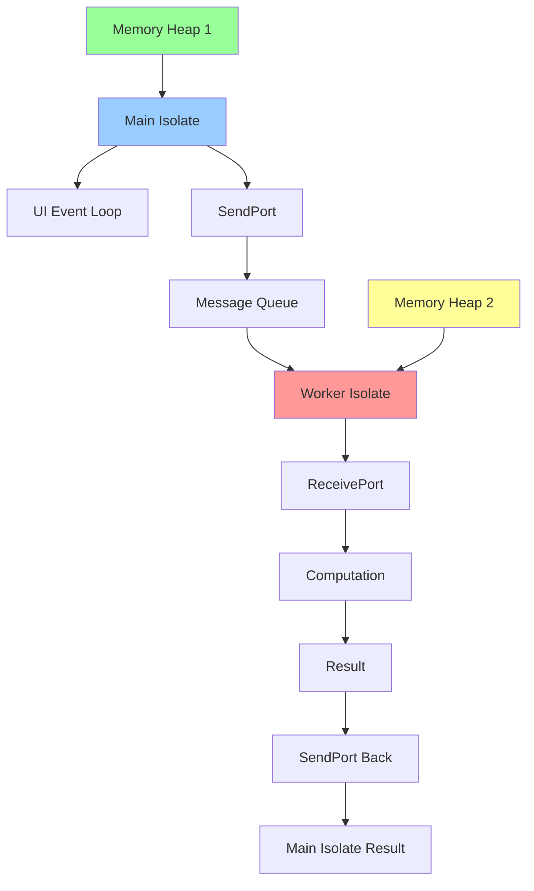

# Isolate 编程详解

> Isolate是Dart中实现真正并行处理的机制，每个Isolate都有独立的内存堆和事件循环

## 📋 Isolate架构图



## 🎯 基础概念

### Isolate特点
- **内存隔离**: 每个Isolate有独立的内存堆
- **无共享状态**: Isolate间不能直接共享对象
- **消息传递**: 通过SendPort/ReceivePort通信
- **真正并行**: 可以利用多核CPU
- **错误隔离**: 一个Isolate崩溃不影响其他

### 适用场景
- CPU密集型计算
- 大数据处理
- 图像/音频处理
- 加密解密操作
- 文件解析
- 网络数据处理

## 🚀 基础使用

### 1. 简单Isolate创建

```dart
import 'dart:isolate';
import 'dart:math';

// 计算密集型函数
void computeFactorial(SendPort sendPort) {
  // 接收参数
  final receivePort = ReceivePort();
  sendPort.send(receivePort.sendPort);

  receivePort.listen((message) {
    if (message is int) {
      // 计算阶乘
      int result = 1;
      for (int i = 1; i <= message; i++) {
        result *= i;
      }

      // 发送结果
      sendPort.send(result);
    } else if (message == 'close') {
      receivePort.close();
    }
  });
}

// 使用Isolate
Future<int> calculateFactorialInIsolate(int n) async {
  final receivePort = ReceivePort();

  // 创建Isolate
  final isolate = await Isolate.spawn(computeFactorial, receivePort.sendPort);

  // 获取worker的SendPort
  final sendPort = await receivePort.first as SendPort;

  // 创建结果接收端口
  final resultPort = ReceivePort();
  sendPort.send(resultPort.sendPort);

  // 发送计算请求
  sendPort.send(n);

  // 等待结果
  final result = await resultPort.first as int;

  // 清理资源
  sendPort.send('close');
  isolate.kill();
  resultPort.close();
  receivePort.close();

  return result;
}

// 使用示例
void main() async {
  print('开始计算...');
  final result = await calculateFactorialInIsolate(20);
  print('20的阶乘: $result');
}
```

### 2. 双向通信Isolate

```dart
// 双向通信的Worker
class IsolateWorker {
  late Isolate _isolate;
  late SendPort _sendPort;
  late ReceivePort _receivePort;
  final Completer<void> _initCompleter = Completer();

  // 初始化Worker
  Future<void> initialize() async {
    _receivePort = ReceivePort();
    _isolate = await Isolate.spawn(_workerEntryPoint, _receivePort.sendPort);

    // 等待Worker发送SendPort
    _sendPort = await _receivePort.first as SendPort;
    _initCompleter.complete();
  }

  // Worker入口点
  static void _workerEntryPoint(SendPort mainSendPort) {
    final workerReceivePort = ReceivePort();

    // 发送Worker的SendPort给主Isolate
    mainSendPort.send(workerReceivePort.sendPort);

    // 监听主Isolate的消息
    workerReceivePort.listen((message) {
      if (message is Map<String, dynamic>) {
        final command = message['command'] as String;
        final data = message['data'];
        final replyPort = message['replyPort'] as SendPort;

        switch (command) {
          case 'compute':
            final result = _performComputation(data);
            replyPort.send({'status': 'success', 'result': result});
            break;
          case 'process_list':
            final result = _processList(data as List<int>);
            replyPort.send({'status': 'success', 'result': result});
            break;
          case 'shutdown':
            replyPort.send({'status': 'shutdown'});
            workerReceivePort.close();
            break;
          default:
            replyPort.send({'status': 'error', 'message': 'Unknown command'});
        }
      }
    });
  }

  // 执行计算
  static dynamic _performComputation(dynamic data) {
    if (data is int) {
      // 模拟复杂计算
      double result = 0;
      for (int i = 0; i < data; i++) {
        result += sqrt(i.toDouble());
      }
      return result;
    }
    return null;
  }

  // 处理列表
  static List<int> _processList(List<int> list) {
    // 模拟数据处理
    return list.map((e) => e * e).toList();
  }

  // 发送命令
  Future<Map<String, dynamic>> sendCommand(String command, dynamic data) async {
    await _initCompleter.future;

    final replyPort = ReceivePort();
    _sendPort.send({
      'command': command,
      'data': data,
      'replyPort': replyPort.sendPort,
    });

    final response = await replyPort.first as Map<String, dynamic>;
    replyPort.close();

    return response;
  }

  // 关闭Worker
  Future<void> shutdown() async {
    await sendCommand('shutdown', null);
    _isolate.kill();
    _receivePort.close();
  }
}

// 使用示例
void main() async {
  final worker = IsolateWorker();
  await worker.initialize();

  try {
    // 执行计算
    var result = await worker.sendCommand('compute', 1000000);
    print('计算结果: ${result['result']}');

    // 处理列表
    result = await worker.sendCommand('process_list', [1, 2, 3, 4, 5]);
    print('列表处理结果: ${result['result']}');
  } finally {
    await worker.shutdown();
  }
}
```

## 🔧 高级特性

### 1. Isolate池管理

```dart
// Isolate池管理器
class IsolatePool {
  final int _poolSize;
  final List<IsolateWorker> _workers = [];
  final Queue<Completer<IsolateWorker>> _waitingQueue = Queue();
  final Set<IsolateWorker> _busyWorkers = {};
  bool _isShutdown = false;

  IsolatePool({int poolSize = 4}) : _poolSize = poolSize;

  // 初始化池
  Future<void> initialize() async {
    for (int i = 0; i < _poolSize; i++) {
      final worker = IsolateWorker();
      await worker.initialize();
      _workers.add(worker);
    }
    print('Isolate池初始化完成，大小: $_poolSize');
  }

  // 获取可用Worker
  Future<IsolateWorker> _getAvailableWorker() async {
    if (_isShutdown) {
      throw StateError('Isolate池已关闭');
    }

    // 查找空闲Worker
    for (final worker in _workers) {
      if (!_busyWorkers.contains(worker)) {
        _busyWorkers.add(worker);
        return worker;
      }
    }

    // 没有空闲Worker，加入等待队列
    final completer = Completer<IsolateWorker>();
    _waitingQueue.add(completer);
    return completer.future;
  }

  // 释放Worker
  void _releaseWorker(IsolateWorker worker) {
    _busyWorkers.remove(worker);

    // 处理等待队列
    if (_waitingQueue.isNotEmpty) {
      final completer = _waitingQueue.removeFirst();
      _busyWorkers.add(worker);
      completer.complete(worker);
    }
  }

  // 执行任务
  Future<T> execute<T>(Future<T> Function(IsolateWorker worker) task) async {
    final worker = await _getAvailableWorker();

    try {
      return await task(worker);
    } finally {
      _releaseWorker(worker);
    }
  }

  // 批量执行任务
  Future<List<T>> executeAll<T>(
    List<Future<T> Function(IsolateWorker worker)> tasks,
  ) async {
    final futures = tasks.map((task) => execute(task));
    return await Future.wait(futures);
  }

  // 关闭池
  Future<void> shutdown() async {
    _isShutdown = true;

    // 等待所有任务完成
    while (_busyWorkers.isNotEmpty) {
      await Future.delayed(Duration(milliseconds: 10));
    }

    // 关闭所有Worker
    for (final worker in _workers) {
      await worker.shutdown();
    }

    _workers.clear();
    print('Isolate池已关闭');
  }

  // 获取池状态
  Map<String, dynamic> getStatus() {
    return {
      'poolSize': _poolSize,
      'busyWorkers': _busyWorkers.length,
      'availableWorkers': _workers.length - _busyWorkers.length,
      'waitingTasks': _waitingQueue.length,
      'isShutdown': _isShutdown,
    };
  }
}

// 使用示例
void main() async {
  final pool = IsolatePool(poolSize: 3);
  await pool.initialize();

  try {
    // 并行执行多个任务
    final tasks = List.generate(10, (i) =>
      (IsolateWorker worker) => worker.sendCommand('compute', 100000 + i * 10000)
    );

    final stopwatch = Stopwatch()..start();
    final results = await pool.executeAll(tasks);
    stopwatch.stop();

    print('并行执行10个任务耗时: ${stopwatch.elapsedMilliseconds}ms');
    print('池状态: ${pool.getStatus()}');
  } finally {
    await pool.shutdown();
  }
}
```

### 2. 流式数据处理

```dart
// 流式Isolate处理器
class StreamIsolateProcessor {
  late Isolate _isolate;
  late SendPort _sendPort;
  late ReceivePort _receivePort;
  late StreamController<dynamic> _outputController;

  Stream<dynamic> get outputStream => _outputController.stream;

  // 初始化
  Future<void> initialize() async {
    _receivePort = ReceivePort();
    _outputController = StreamController<dynamic>();

    _isolate = await Isolate.spawn(_streamWorkerEntryPoint, _receivePort.sendPort);
    _sendPort = await _receivePort.first as SendPort;

    // 监听输出
    _receivePort.listen((message) {
      if (message is Map<String, dynamic>) {
        final type = message['type'] as String;

        switch (type) {
          case 'data':
            _outputController.add(message['payload']);
            break;
          case 'error':
            _outputController.addError(message['error']);
            break;
          case 'done':
            _outputController.close();
            break;
        }
      }
    });
  }

  // Worker入口点
  static void _streamWorkerEntryPoint(SendPort mainSendPort) {
    final workerReceivePort = ReceivePort();
    mainSendPort.send(workerReceivePort.sendPort);

    workerReceivePort.listen((message) {
      if (message is Map<String, dynamic>) {
        final command = message['command'] as String;
        final data = message['data'];

        switch (command) {
          case 'process_stream':
            _processStreamData(data, mainSendPort);
            break;
          case 'batch_process':
            _batchProcess(data as List, mainSendPort);
            break;
        }
      }
    });
  }

  // 处理流数据
  static void _processStreamData(dynamic data, SendPort sendPort) {
    try {
      if (data is List) {
        for (final item in data) {
          // 模拟数据处理
          final processed = _processItem(item);
          sendPort.send({
            'type': 'data',
            'payload': processed,
          });
        }
      }

      sendPort.send({'type': 'done'});
    } catch (e) {
      sendPort.send({
        'type': 'error',
        'error': e.toString(),
      });
    }
  }

  // 批量处理
  static void _batchProcess(List data, SendPort sendPort) {
    try {
      final batchSize = 100;

      for (int i = 0; i < data.length; i += batchSize) {
        final batch = data.skip(i).take(batchSize).toList();
        final processedBatch = batch.map(_processItem).toList();

        sendPort.send({
          'type': 'data',
          'payload': processedBatch,
        });
      }

      sendPort.send({'type': 'done'});
    } catch (e) {
      sendPort.send({
        'type': 'error',
        'error': e.toString(),
      });
    }
  }

  // 处理单个项目
  static dynamic _processItem(dynamic item) {
    if (item is int) {
      return item * item; // 平方
    } else if (item is String) {
      return item.toUpperCase(); // 转大写
    }
    return item;
  }

  // 发送数据进行处理
  void processStream(List data) {
    _sendPort.send({
      'command': 'process_stream',
      'data': data,
    });
  }

  // 批量处理
  void batchProcess(List data) {
    _sendPort.send({
      'command': 'batch_process',
      'data': data,
    });
  }

  // 关闭处理器
  Future<void> shutdown() async {
    _isolate.kill();
    _receivePort.close();
    await _outputController.close();
  }
}

// 使用示例
void main() async {
  final processor = StreamIsolateProcessor();
  await processor.initialize();

  // 监听输出流
  processor.outputStream.listen(
    (data) => print('处理结果: $data'),
    onError: (error) => print('错误: $error'),
    onDone: () => print('处理完成'),
  );

  // 发送数据进行处理
  final testData = List.generate(1000, (i) => i);
  processor.batchProcess(testData);

  // 等待处理完成
  await Future.delayed(Duration(seconds: 2));
  await processor.shutdown();
}
```

## 📊 性能优化

### 1. 数据传递优化

```dart
// 优化的数据传递
class OptimizedDataTransfer {
  // 使用TransferableTypedData减少复制开销
  static TransferableTypedData createTransferable(Uint8List data) {
    return TransferableTypedData.fromList([data]);
  }

  // 大数据传递
  static void largeDataWorker(SendPort sendPort) {
    final receivePort = ReceivePort();
    sendPort.send(receivePort.sendPort);

    receivePort.listen((message) {
      if (message is TransferableTypedData) {
        // 直接使用传递的数据，无需复制
        final data = message.materialize().asUint8List();

        // 处理数据
        final processed = _processLargeData(data);

        // 返回结果
        final result = createTransferable(processed);
        sendPort.send(result);
      }
    });
  }

  static Uint8List _processLargeData(Uint8List data) {
    // 模拟图像处理或其他大数据操作
    final result = Uint8List(data.length);
    for (int i = 0; i < data.length; i++) {
      result[i] = (data[i] * 1.2).clamp(0, 255).toInt();
    }
    return result;
  }
}

// 内存映射文件处理
class MemoryMappedProcessor {
  static void fileProcessorWorker(SendPort sendPort) {
    final receivePort = ReceivePort();
    sendPort.send(receivePort.sendPort);

    receivePort.listen((message) async {
      if (message is Map<String, dynamic>) {
        final filePath = message['filePath'] as String;
        final operation = message['operation'] as String;

        try {
          final file = File(filePath);
          final bytes = await file.readAsBytes();

          Uint8List result;
          switch (operation) {
            case 'compress':
              result = _compressData(bytes);
              break;
            case 'encrypt':
              result = _encryptData(bytes);
              break;
            default:
              result = bytes;
          }

          // 写入结果文件
          final outputPath = '${filePath}_processed';
          await File(outputPath).writeAsBytes(result);

          sendPort.send({
            'status': 'success',
            'outputPath': outputPath,
            'size': result.length,
          });
        } catch (e) {
          sendPort.send({
            'status': 'error',
            'error': e.toString(),
          });
        }
      }
    });
  }

  static Uint8List _compressData(Uint8List data) {
    // 模拟压缩算法
    return data; // 实际应用中使用真实的压缩算法
  }

  static Uint8List _encryptData(Uint8List data) {
    // 模拟加密算法
    final result = Uint8List(data.length);
    for (int i = 0; i < data.length; i++) {
      result[i] = data[i] ^ 0xAA; // 简单XOR加密
    }
    return result;
  }
}
```

### 2. 错误处理和监控

```dart
// Isolate监控器
class IsolateMonitor {
  final Map<String, IsolateInfo> _isolates = {};
  Timer? _monitorTimer;

  void startMonitoring() {
    _monitorTimer = Timer.periodic(Duration(seconds: 5), (_) {
      _checkIsolateHealth();
    });
  }

  void registerIsolate(String id, Isolate isolate, ReceivePort receivePort) {
    _isolates[id] = IsolateInfo(
      id: id,
      isolate: isolate,
      receivePort: receivePort,
      createdAt: DateTime.now(),
      lastActivity: DateTime.now(),
    );

    // 监听Isolate错误
    receivePort.listen(
      (message) {
        _isolates[id]?.lastActivity = DateTime.now();
      },
      onError: (error) {
        print('Isolate $id 错误: $error');
        _handleIsolateError(id, error);
      },
      onDone: () {
        print('Isolate $id 已关闭');
        _isolates.remove(id);
      },
    );
  }

  void _checkIsolateHealth() {
    final now = DateTime.now();

    for (final info in _isolates.values) {
      final inactiveTime = now.difference(info.lastActivity);

      if (inactiveTime.inMinutes > 5) {
        print('警告: Isolate ${info.id} 已无活动 ${inactiveTime.inMinutes} 分钟');
      }

      if (inactiveTime.inMinutes > 10) {
        print('强制关闭无响应的 Isolate ${info.id}');
        info.isolate.kill(priority: Isolate.immediate);
        _isolates.remove(info.id);
      }
    }
  }

  void _handleIsolateError(String id, dynamic error) {
    final info = _isolates[id];
    if (info != null) {
      info.errorCount++;

      if (info.errorCount > 3) {
        print('Isolate $id 错误次数过多，强制关闭');
        info.isolate.kill(priority: Isolate.immediate);
        _isolates.remove(id);
      }
    }
  }

  Map<String, dynamic> getStatistics() {
    return {
      'totalIsolates': _isolates.length,
      'isolates': _isolates.values.map((info) => {
        'id': info.id,
        'createdAt': info.createdAt.toIso8601String(),
        'lastActivity': info.lastActivity.toIso8601String(),
        'errorCount': info.errorCount,
      }).toList(),
    };
  }

  void stopMonitoring() {
    _monitorTimer?.cancel();

    // 关闭所有Isolate
    for (final info in _isolates.values) {
      info.isolate.kill();
      info.receivePort.close();
    }

    _isolates.clear();
  }
}

class IsolateInfo {
  final String id;
  final Isolate isolate;
  final ReceivePort receivePort;
  final DateTime createdAt;
  DateTime lastActivity;
  int errorCount = 0;

  IsolateInfo({
    required this.id,
    required this.isolate,
    required this.receivePort,
    required this.createdAt,
    required this.lastActivity,
  });
}
```

## 🧪 测试和调试

### 1. Isolate单元测试

```dart
// test/isolate_test.dart
import 'package:flutter_test/flutter_test.dart';
import 'package:myapp/isolate_worker.dart';

void main() {
  group('Isolate Tests', () {
    late IsolateWorker worker;

    setUp(() async {
      worker = IsolateWorker();
      await worker.initialize();
    });

    tearDown(() async {
      await worker.shutdown();
    });

    test('应该正确执行计算任务', () async {
      final result = await worker.sendCommand('compute', 1000);

      expect(result['status'], equals('success'));
      expect(result['result'], isA<double>());
      expect(result['result'], greaterThan(0));
    });

    test('应该正确处理列表', () async {
      final input = [1, 2, 3, 4, 5];
      final result = await worker.sendCommand('process_list', input);

      expect(result['status'], equals('success'));
      expect(result['result'], equals([1, 4, 9, 16, 25]));
    });

    test('应该处理错误命令', () async {
      final result = await worker.sendCommand('invalid_command', null);

      expect(result['status'], equals('error'));
      expect(result['message'], contains('Unknown command'));
    });
  });

  group('IsolatePool Tests', () {
    late IsolatePool pool;

    setUp(() async {
      pool = IsolatePool(poolSize: 2);
      await pool.initialize();
    });

    tearDown(() async {
      await pool.shutdown();
    });

    test('应该并行执行任务', () async {
      final tasks = List.generate(4, (i) =>
        (IsolateWorker worker) => worker.sendCommand('compute', 1000)
      );

      final stopwatch = Stopwatch()..start();
      final results = await pool.executeAll(tasks);
      stopwatch.stop();

      expect(results.length, equals(4));
      expect(stopwatch.elapsedMilliseconds, lessThan(5000));

      for (final result in results) {
        expect(result['status'], equals('success'));
      }
    });

    test('应该正确管理池状态', () async {
      final status = pool.getStatus();

      expect(status['poolSize'], equals(2));
      expect(status['busyWorkers'], equals(0));
      expect(status['availableWorkers'], equals(2));
      expect(status['isShutdown'], equals(false));
    });
  });
}
```

### 2. 性能基准测试

```dart
// benchmark/isolate_benchmark.dart
import 'dart:isolate';
import 'dart:math';

class IsolateBenchmark {
  // 基准测试：串行 vs 并行
  static Future<void> runComputationBenchmark() async {
    const iterations = 1000000;
    const taskCount = 4;

    print('=== 计算密集型任务基准测试 ===');

    // 串行执行
    final serialStopwatch = Stopwatch()..start();
    for (int i = 0; i < taskCount; i++) {
      _computeIntensive(iterations);
    }
    serialStopwatch.stop();

    print('串行执行耗时: ${serialStopwatch.elapsedMilliseconds}ms');

    // 并行执行
    final parallelStopwatch = Stopwatch()..start();
    final futures = <Future>[];

    for (int i = 0; i < taskCount; i++) {
      futures.add(_computeInIsolate(iterations));
    }

    await Future.wait(futures);
    parallelStopwatch.stop();

    print('并行执行耗时: ${parallelStopwatch.elapsedMilliseconds}ms');
    print('性能提升: ${(serialStopwatch.elapsedMilliseconds / parallelStopwatch.elapsedMilliseconds).toStringAsFixed(2)}x');
  }

  static double _computeIntensive(int iterations) {
    double result = 0;
    for (int i = 0; i < iterations; i++) {
      result += sqrt(i.toDouble());
    }
    return result;
  }

  static Future<double> _computeInIsolate(int iterations) async {
    final receivePort = ReceivePort();
    await Isolate.spawn(_isolateEntryPoint, {
      'sendPort': receivePort.sendPort,
      'iterations': iterations,
    });

    final result = await receivePort.first as double;
    receivePort.close();
    return result;
  }

  static void _isolateEntryPoint(Map<String, dynamic> args) {
    final sendPort = args['sendPort'] as SendPort;
    final iterations = args['iterations'] as int;

    final result = _computeIntensive(iterations);
    sendPort.send(result);
  }

  // 内存使用基准测试
  static Future<void> runMemoryBenchmark() async {
    print('\n=== 内存使用基准测试 ===');

    const dataSize = 10000000; // 10MB数据
    final testData = List.generate(dataSize, (i) => i);

    // 测试数据传递开销
    final transferStopwatch = Stopwatch()..start();
    await _transferDataToIsolate(testData);
    transferStopwatch.stop();

    print('数据传递耗时: ${transferStopwatch.elapsedMilliseconds}ms');
    print('数据大小: ${(dataSize * 4 / 1024 / 1024).toStringAsFixed(2)}MB');
  }

  static Future<void> _transferDataToIsolate(List<int> data) async {
    final receivePort = ReceivePort();
    await Isolate.spawn(_dataProcessorEntryPoint, {
      'sendPort': receivePort.sendPort,
      'data': data,
    });

    await receivePort.first;
    receivePort.close();
  }

  static void _dataProcessorEntryPoint(Map<String, dynamic> args) {
    final sendPort = args['sendPort'] as SendPort;
    final data = args['data'] as List<int>;

    // 模拟数据处理
    int sum = 0;
    for (final value in data) {
      sum += value;
    }

    sendPort.send(sum);
  }
}

// 运行基准测试
void main() async {
  await IsolateBenchmark.runComputationBenchmark();
  await IsolateBenchmark.runMemoryBenchmark();
}
```

## 📚 最佳实践

### 1. 设计原则
- **单一职责**: 每个Isolate专注于特定任务
- **无状态设计**: 避免在Isolate间共享可变状态
- **错误隔离**: 合理处理Isolate错误和异常
- **资源管理**: 及时清理Isolate和相关资源

### 2. 性能优化
- **减少数据传递**: 最小化Isolate间的数据交换
- **批量处理**: 将多个小任务合并为批量操作
- **池化管理**: 使用Isolate池避免频繁创建销毁
- **内存优化**: 使用TransferableTypedData减少复制

### 3. 错误处理
- **超时机制**: 为长时间运行的任务设置超时
- **重试逻辑**: 实现任务失败重试机制
- **监控告警**: 监控Isolate健康状态
- **优雅降级**: 提供Isolate不可用时的备选方案

### 4. 调试技巧
- **日志记录**: 在关键点添加日志
- **状态监控**: 实时监控Isolate状态
- **性能分析**: 定期进行性能基准测试
- **内存分析**: 监控内存使用情况

---

> 💡 **提示**: Isolate是Flutter中实现真正并行处理的强大工具，但需要合理设计和使用。建议从简单的计算任务开始，逐步掌握复杂的并发模式和优化技巧。
