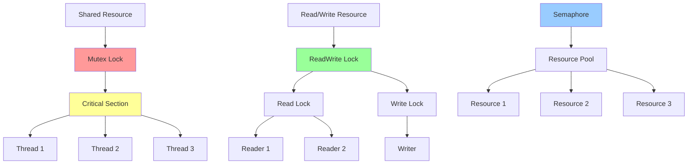

# 锁机制详解

> 锁是并发编程中的核心同步原语，用于保护共享资源，确保线程安全

## 📋 锁机制架构图



## 🎯 基础概念

### 锁机制特点
- **互斥访问**: 确保同时只有一个线程访问资源
- **原子操作**: 保证操作的原子性
- **死锁预防**: 避免死锁情况
- **公平性**: 确保线程获取锁的公平性
- **可重入性**: 支持同一线程多次获取锁

### 适用场景
- **共享资源保护**: 保护共享变量
- **临界区同步**: 确保代码块原子执行
- **资源池管理**: 限制资源访问数量
- **状态一致性**: 维护对象状态一致性
- **并发控制**: 控制并发访问级别

## 🔒 互斥锁（Mutex）

```dart
import 'dart:async';
import 'dart:collection';

// 互斥锁实现
class Mutex {
  final Queue<Completer<void>> _waitQueue = Queue<Completer<void>>();
  bool _isLocked = false;
  
  // 是否已锁定
  bool get isLocked => _isLocked;
  
  // 等待队列长度
  int get waitingCount => _waitQueue.length;
  
  // 获取锁
  Future<void> acquire() async {
    if (!_isLocked) {
      _isLocked = true;
      return;
    }
    
    // 锁已被占用，加入等待队列
    final completer = Completer<void>();
    _waitQueue.add(completer);
    return completer.future;
  }
  
  // 释放锁
  void release() {
    if (!_isLocked) {
      throw StateError('Mutex is not locked');
    }
    
    if (_waitQueue.isNotEmpty) {
      // 唤醒下一个等待者
      final nextWaiter = _waitQueue.removeFirst();
      nextWaiter.complete();
    } else {
      _isLocked = false;
    }
  }
  
  // 使用锁执行代码块
  Future<T> synchronized<T>(Future<T> Function() action) async {
    await acquire();
    try {
      return await action();
    } finally {
      release();
    }
  }
  
  // 尝试获取锁（非阻塞）
  bool tryAcquire() {
    if (_isLocked) {
      return false;
    }
    
    _isLocked = true;
    return true;
  }
  
  // 获取锁状态
  Map<String, dynamic> getStatus() {
    return {
      'isLocked': _isLocked,
      'waitingCount': _waitQueue.length,
    };
  }
}

// 使用示例
class Counter {
  final Mutex _mutex = Mutex();
  int _value = 0;
  
  int get value => _value;
  
  // 线程安全的增加操作
  Future<void> increment() async {
    await _mutex.synchronized(() async {
      final oldValue = _value;
      // 模拟一些处理时间
      await Future.delayed(Duration(milliseconds: 1));
      _value = oldValue + 1;
    });
  }
  
  // 线程安全的减少操作
  Future<void> decrement() async {
    await _mutex.synchronized(() async {
      final oldValue = _value;
      await Future.delayed(Duration(milliseconds: 1));
      _value = oldValue - 1;
    });
  }
  
  // 线程安全的设置操作
  Future<void> setValue(int newValue) async {
    await _mutex.synchronized(() async {
      _value = newValue;
    });
  }
}

void main() async {
  final counter = Counter();
  
  // 并发执行增加和减少操作
  final futures = <Future>[];
  
  for (int i = 0; i < 100; i++) {
    futures.add(counter.increment());
    futures.add(counter.decrement());
  }
  
  await Future.wait(futures);
  
  print('最终计数值: ${counter.value}'); // 应该是0
}
```

## 📖 读写锁（ReadWriteLock）

```dart
// 读写锁实现
class ReadWriteLock {
  final Queue<Completer<void>> _readWaitQueue = Queue<Completer<void>>();
  final Queue<Completer<void>> _writeWaitQueue = Queue<Completer<void>>();
  
  int _readCount = 0;
  bool _writeActive = false;
  
  // 获取读锁
  Future<void> acquireRead() async {
    // 如果有写操作或等待的写操作，需要等待
    if (_writeActive || _writeWaitQueue.isNotEmpty) {
      final completer = Completer<void>();
      _readWaitQueue.add(completer);
      await completer.future;
    }
    
    _readCount++;
  }
  
  // 释放读锁
  void releaseRead() {
    if (_readCount <= 0) {
      throw StateError('No read lock to release');
    }
    
    _readCount--;
    
    // 如果没有读者了，唤醒等待的写者
    if (_readCount == 0 && _writeWaitQueue.isNotEmpty) {
      final nextWriter = _writeWaitQueue.removeFirst();
      _writeActive = true;
      nextWriter.complete();
    }
  }
  
  // 获取写锁
  Future<void> acquireWrite() async {
    // 如果有读者或写者，需要等待
    if (_readCount > 0 || _writeActive) {
      final completer = Completer<void>();
      _writeWaitQueue.add(completer);
      await completer.future;
    } else {
      _writeActive = true;
    }
  }
  
  // 释放写锁
  void releaseWrite() {
    if (!_writeActive) {
      throw StateError('No write lock to release');
    }
    
    _writeActive = false;
    
    // 优先唤醒等待的写者
    if (_writeWaitQueue.isNotEmpty) {
      final nextWriter = _writeWaitQueue.removeFirst();
      _writeActive = true;
      nextWriter.complete();
    } else {
      // 唤醒所有等待的读者
      while (_readWaitQueue.isNotEmpty) {
        final nextReader = _readWaitQueue.removeFirst();
        _readCount++;
        nextReader.complete();
      }
    }
  }
  
  // 使用读锁执行代码块
  Future<T> withReadLock<T>(Future<T> Function() action) async {
    await acquireRead();
    try {
      return await action();
    } finally {
      releaseRead();
    }
  }
  
  // 使用写锁执行代码块
  Future<T> withWriteLock<T>(Future<T> Function() action) async {
    await acquireWrite();
    try {
      return await action();
    } finally {
      releaseWrite();
    }
  }
  
  // 获取锁状态
  Map<String, dynamic> getStatus() {
    return {
      'readCount': _readCount,
      'writeActive': _writeActive,
      'readWaiting': _readWaitQueue.length,
      'writeWaiting': _writeWaitQueue.length,
    };
  }
}

// 使用示例
class SharedData {
  final ReadWriteLock _lock = ReadWriteLock();
  final Map<String, dynamic> _data = {};
  
  // 读取数据
  Future<dynamic> read(String key) async {
    return await _lock.withReadLock(() async {
      print('读取 $key');
      await Future.delayed(Duration(milliseconds: 100)); // 模拟读取时间
      return _data[key];
    });
  }
  
  // 写入数据
  Future<void> write(String key, dynamic value) async {
    await _lock.withWriteLock(() async {
      print('写入 $key = $value');
      await Future.delayed(Duration(milliseconds: 200)); // 模拟写入时间
      _data[key] = value;
    });
  }
  
  // 批量读取
  Future<Map<String, dynamic>> readAll() async {
    return await _lock.withReadLock(() async {
      print('批量读取');
      await Future.delayed(Duration(milliseconds: 150));
      return Map<String, dynamic>.from(_data);
    });
  }
  
  // 清空数据
  Future<void> clear() async {
    await _lock.withWriteLock(() async {
      print('清空数据');
      _data.clear();
    });
  }
}

void main() async {
  final sharedData = SharedData();
  
  // 并发读写操作
  final futures = <Future>[];
  
  // 写入操作
  for (int i = 0; i < 5; i++) {
    futures.add(sharedData.write('key$i', 'value$i'));
  }
  
  // 读取操作
  for (int i = 0; i < 10; i++) {
    futures.add(sharedData.read('key${i % 5}'));
  }
  
  // 批量读取
  futures.add(sharedData.readAll());
  
  await Future.wait(futures);
  
  print('所有操作完成');
}
```

## 🎯 信号量（Semaphore）

```dart
// 信号量实现
class Semaphore {
  final Queue<Completer<void>> _waitQueue = Queue<Completer<void>>();
  int _permits;
  final int _maxPermits;
  
  Semaphore(int permits) 
      : _permits = permits,
        _maxPermits = permits;
  
  // 可用许可数
  int get availablePermits => _permits;
  
  // 等待队列长度
  int get waitingCount => _waitQueue.length;
  
  // 获取许可
  Future<void> acquire([int permits = 1]) async {
    if (permits <= 0) {
      throw ArgumentError('Permits must be positive');
    }
    
    if (_permits >= permits) {
      _permits -= permits;
      return;
    }
    
    // 许可不足，加入等待队列
    final completer = Completer<void>();
    _waitQueue.add(completer);
    await completer.future;
    
    // 递归获取剩余许可
    if (permits > 1) {
      await acquire(permits - 1);
    }
  }
  
  // 释放许可
  void release([int permits = 1]) {
    if (permits <= 0) {
      throw ArgumentError('Permits must be positive');
    }
    
    _permits += permits;
    
    // 唤醒等待的线程
    while (_waitQueue.isNotEmpty && _permits > 0) {
      final waiter = _waitQueue.removeFirst();
      _permits--;
      waiter.complete();
    }
  }
  
  // 尝试获取许可（非阻塞）
  bool tryAcquire([int permits = 1]) {
    if (permits <= 0) {
      throw ArgumentError('Permits must be positive');
    }
    
    if (_permits >= permits) {
      _permits -= permits;
      return true;
    }
    
    return false;
  }
  
  // 使用许可执行代码块
  Future<T> withPermit<T>(Future<T> Function() action) async {
    await acquire();
    try {
      return await action();
    } finally {
      release();
    }
  }
  
  // 获取状态
  Map<String, dynamic> getStatus() {
    return {
      'availablePermits': _permits,
      'maxPermits': _maxPermits,
      'waitingCount': _waitQueue.length,
    };
  }
}

// 资源池示例
class ResourcePool<T> {
  final List<T> _resources;
  final Semaphore _semaphore;
  final Queue<T> _availableResources = Queue<T>();
  
  ResourcePool(List<T> resources) 
      : _resources = List.from(resources),
        _semaphore = Semaphore(resources.length) {
    _availableResources.addAll(_resources);
  }
  
  // 获取资源
  Future<T> acquire() async {
    await _semaphore.acquire();
    return _availableResources.removeFirst();
  }
  
  // 释放资源
  void release(T resource) {
    if (!_resources.contains(resource)) {
      throw ArgumentError('Resource not from this pool');
    }
    
    _availableResources.add(resource);
    _semaphore.release();
  }
  
  // 使用资源执行代码块
  Future<R> withResource<R>(Future<R> Function(T resource) action) async {
    final resource = await acquire();
    try {
      return await action(resource);
    } finally {
      release(resource);
    }
  }
  
  // 获取状态
  Map<String, dynamic> getStatus() {
    return {
      'totalResources': _resources.length,
      'availableResources': _availableResources.length,
      'semaphoreStatus': _semaphore.getStatus(),
    };
  }
}

// 使用示例
void main() async {
  // 创建数据库连接池
  final connectionPool = ResourcePool<String>([
    'Connection1',
    'Connection2',
    'Connection3',
  ]);
  
  // 并发使用连接
  final futures = <Future>[];
  
  for (int i = 0; i < 10; i++) {
    futures.add(
      connectionPool.withResource((connection) async {
        print('使用连接: $connection (任务 $i)');
        await Future.delayed(Duration(milliseconds: 500));
        print('释放连接: $connection (任务 $i)');
        return '任务 $i 完成';
      })
    );
  }
  
  final results = await Future.wait(futures);
  print('所有任务完成: $results');
}
```

## 🔄 可重入锁（ReentrantLock）

```dart
// 可重入锁实现
class ReentrantLock {
  final Queue<Completer<void>> _waitQueue = Queue<Completer<void>>();
  Object? _owner;
  int _lockCount = 0;
  
  // 是否已锁定
  bool get isLocked => _lockCount > 0;
  
  // 锁定次数
  int get lockCount => _lockCount;
  
  // 获取锁
  Future<void> acquire([Object? owner]) async {
    owner ??= Object();
    
    // 如果是同一个所有者，直接增加计数
    if (_owner == owner) {
      _lockCount++;
      return;
    }
    
    // 如果锁未被占用
    if (_lockCount == 0) {
      _owner = owner;
      _lockCount = 1;
      return;
    }
    
    // 锁被其他所有者占用，加入等待队列
    final completer = Completer<void>();
    _waitQueue.add(completer);
    await completer.future;
    
    // 获取锁
    _owner = owner;
    _lockCount = 1;
  }
  
  // 释放锁
  void release([Object? owner]) {
    if (_lockCount == 0) {
      throw StateError('Lock is not acquired');
    }
    
    if (_owner != owner && owner != null) {
      throw StateError('Lock not owned by this owner');
    }
    
    _lockCount--;
    
    // 完全释放锁
    if (_lockCount == 0) {
      _owner = null;
      
      // 唤醒下一个等待者
      if (_waitQueue.isNotEmpty) {
        final nextWaiter = _waitQueue.removeFirst();
        nextWaiter.complete();
      }
    }
  }
  
  // 使用锁执行代码块
  Future<T> synchronized<T>(
    Future<T> Function() action, {
    Object? owner,
  }) async {
    await acquire(owner);
    try {
      return await action();
    } finally {
      release(owner);
    }
  }
  
  // 获取状态
  Map<String, dynamic> getStatus() {
    return {
      'isLocked': isLocked,
      'lockCount': _lockCount,
      'waitingCount': _waitQueue.length,
      'owner': _owner?.toString(),
    };
  }
}

// 使用示例
class ReentrantCounter {
  final ReentrantLock _lock = ReentrantLock();
  int _value = 0;
  
  int get value => _value;
  
  // 可重入的递增操作
  Future<void> increment([int times = 1]) async {
    final owner = Object();
    
    await _lock.synchronized(() async {
      if (times > 1) {
        // 递归调用，测试可重入性
        await increment(times - 1);
      }
      _value++;
      print('增加后值: $_value (剩余次数: ${times - 1})');
    }, owner: owner);
  }
  
  // 复合操作
  Future<void> complexOperation() async {
    final owner = Object();
    
    await _lock.synchronized(() async {
      print('开始复合操作');
      
      // 调用其他需要锁的方法
      await increment(3);
      
      _value *= 2;
      print('复合操作完成，最终值: $_value');
    }, owner: owner);
  }
}

void main() async {
  final counter = ReentrantCounter();
  
  await counter.complexOperation();
  print('最终计数值: ${counter.value}');
}
```

## 🎯 最佳实践

### 设计原则
1. **最小锁定范围**: 只锁定必要的代码段
2. **避免死锁**: 按固定顺序获取多个锁
3. **及时释放**: 使用 try-finally 确保锁释放
4. **选择合适锁类型**: 根据场景选择锁类型
5. **监控锁状态**: 提供锁状态监控

### 性能优化
1. **减少锁竞争**: 降低锁的使用频率
2. **锁分离**: 将大锁拆分为小锁
3. **读写分离**: 使用读写锁提高并发度
4. **无锁编程**: 使用原子操作替代锁
5. **锁粗化**: 合并相邻的锁操作

### 常见陷阱
1. **死锁**: 多个锁的循环等待
2. **活锁**: 线程不断重试但无法进展
3. **饥饿**: 某些线程长期无法获取锁
4. **锁泄漏**: 忘记释放锁
5. **性能下降**: 过度使用锁导致串行化

### 测试策略
1. **并发测试**: 测试多线程环境下的正确性
2. **压力测试**: 测试高并发下的性能
3. **死锁检测**: 检测潜在的死锁情况
4. **公平性测试**: 验证锁的公平性
5. **边界测试**: 测试极限情况

## 📚 总结

锁机制是并发编程的基础，正确使用锁可以：

- **保证线程安全**: 避免数据竞争
- **维护数据一致性**: 确保共享状态正确
- **控制资源访问**: 限制并发访问级别
- **提供同步原语**: 构建复杂同步机制
- **简化并发设计**: 清晰的同步语义

选择合适的锁类型，遵循最佳实践，结合完善的测试策略，可以构建高效安全的并发系统。