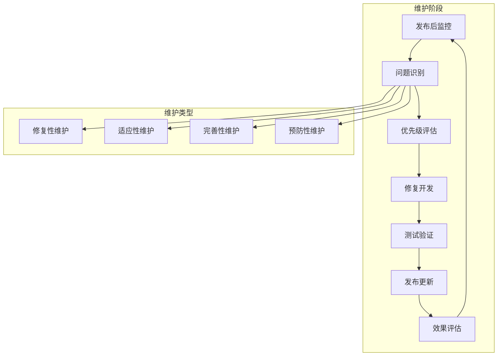

# Flutter 应用维护和更新最佳指南

本文档详细介绍了 Flutter 应用的维护策略、更新流程和长期支持最佳实践。

## 📋 目录

- [维护概述](#维护概述)
- [版本管理策略](#版本管理策略)
- [依赖管理](#依赖管理)
- [性能监控](#性能监控)
- [错误追踪](#错误追踪)
- [用户反馈](#用户反馈)
- [安全更新](#安全更新)
- [兼容性维护](#兼容性维护)
- [文档维护](#文档维护)
- [团队协作](#团队协作)

## 🔧 维护概述

### 维护生命周期



### 维护原则

1. **主动监控**：持续监控应用性能和用户体验
2. **快速响应**：及时处理关键问题和安全漏洞
3. **渐进改进**：持续优化和功能增强
4. **向后兼容**：保持 API 和数据格式的兼容性

## 📊 版本管理策略

### 语义化版本控制

```dart
// lib/config/version_config.dart
class VersionConfig {
  // 版本格式：MAJOR.MINOR.PATCH+BUILD
  static const String version = '1.2.3+45';
  
  // 解析版本信息
  static VersionInfo get versionInfo {
    final parts = version.split('+');
    final versionParts = parts[0].split('.');
    final buildNumber = parts.length > 1 ? int.parse(parts[1]) : 0;
    
    return VersionInfo(
      major: int.parse(versionParts[0]),
      minor: int.parse(versionParts[1]),
      patch: int.parse(versionParts[2]),
      build: buildNumber,
    );
  }
  
  // 版本比较
  static int compareVersions(String version1, String version2) {
    final v1Parts = version1.split('.').map(int.parse).toList();
    final v2Parts = version2.split('.').map(int.parse).toList();
    
    for (int i = 0; i < 3; i++) {
      final v1 = i < v1Parts.length ? v1Parts[i] : 0;
      final v2 = i < v2Parts.length ? v2Parts[i] : 0;
      
      if (v1 != v2) {
        return v1.compareTo(v2);
      }
    }
    
    return 0;
  }
  
  // 检查是否需要强制更新
  static bool isForceUpdateRequired(String currentVersion, String minVersion) {
    return compareVersions(currentVersion, minVersion) < 0;
  }
}

class VersionInfo {
  const VersionInfo({
    required this.major,
    required this.minor,
    required this.patch,
    required this.build,
  });
  
  final int major;
  final int minor;
  final int patch;
  final int build;
  
  @override
  String toString() => '$major.$minor.$patch+$build';
}
```

### 更新策略

```dart
// lib/services/update_service.dart
import 'package:package_info_plus/package_info_plus.dart';
import 'package:url_launcher/url_launcher.dart';
import '../config/version_config.dart';
import '../models/update_info.dart';

class UpdateService {
  static const String _updateCheckUrl = 'https://api.myapp.com/version/check';
  
  // 检查更新
  static Future<UpdateInfo?> checkForUpdates() async {
    try {
      final packageInfo = await PackageInfo.fromPlatform();
      final currentVersion = packageInfo.version;
      
      final response = await http.get(
        Uri.parse('$_updateCheckUrl?version=$currentVersion&platform=${Platform.operatingSystem}'),
      );
      
      if (response.statusCode == 200) {
        final data = json.decode(response.body);
        return UpdateInfo.fromJson(data);
      }
    } catch (e) {
      print('检查更新失败: $e');
    }
    
    return null;
  }
  
  // 显示更新对话框
  static Future<void> showUpdateDialog(
    BuildContext context,
    UpdateInfo updateInfo,
  ) async {
    return showDialog<void>(
      context: context,
      barrierDismissible: !updateInfo.isForceUpdate,
      builder: (BuildContext context) {
        return AlertDialog(
          title: Text('发现新版本 ${updateInfo.latestVersion}'),
          content: Column(
            mainAxisSize: MainAxisSize.min,
            crossAxisAlignment: CrossAxisAlignment.start,
            children: [
              Text('当前版本: ${updateInfo.currentVersion}'),
              const SizedBox(height: 8),
              Text('更新内容:'),
              const SizedBox(height: 4),
              ...updateInfo.releaseNotes.map(
                (note) => Text('• $note', style: const TextStyle(fontSize: 14)),
              ),
              if (updateInfo.isForceUpdate) ..[
                const SizedBox(height: 16),
                Container(
                  padding: const EdgeInsets.all(8),
                  decoration: BoxDecoration(
                    color: Colors.orange.withOpacity(0.1),
                    borderRadius: BorderRadius.circular(4),
                  ),
                  child: const Text(
                    '此更新包含重要的安全修复，必须更新后才能继续使用。',
                    style: TextStyle(color: Colors.orange),
                  ),
                ),
              ],
            ],
          ),
          actions: [
            if (!updateInfo.isForceUpdate)
              TextButton(
                onPressed: () => Navigator.of(context).pop(),
                child: const Text('稍后更新'),
              ),
            ElevatedButton(
              onPressed: () {
                Navigator.of(context).pop();
                _launchUpdateUrl(updateInfo.downloadUrl);
              },
              child: const Text('立即更新'),
            ),
          ],
        );
      },
    );
  }
  
  // 启动更新 URL
  static Future<void> _launchUpdateUrl(String url) async {
    final uri = Uri.parse(url);
    if (await canLaunchUrl(uri)) {
      await launchUrl(uri, mode: LaunchMode.externalApplication);
    }
  }
  
  // 自动检查更新
  static Future<void> autoCheckUpdates(BuildContext context) async {
    final updateInfo = await checkForUpdates();
    
    if (updateInfo != null && updateInfo.hasUpdate) {
      if (context.mounted) {
        await showUpdateDialog(context, updateInfo);
      }
    }
  }
}

// 更新信息模型
class UpdateInfo {
  const UpdateInfo({
    required this.currentVersion,
    required this.latestVersion,
    required this.hasUpdate,
    required this.isForceUpdate,
    required this.downloadUrl,
    required this.releaseNotes,
  });
  
  final String currentVersion;
  final String latestVersion;
  final bool hasUpdate;
  final bool isForceUpdate;
  final String downloadUrl;
  final List<String> releaseNotes;
  
  factory UpdateInfo.fromJson(Map<String, dynamic> json) {
    return UpdateInfo(
      currentVersion: json['currentVersion'] ?? '',
      latestVersion: json['latestVersion'] ?? '',
      hasUpdate: json['hasUpdate'] ?? false,
      isForceUpdate: json['isForceUpdate'] ?? false,
      downloadUrl: json['downloadUrl'] ?? '',
      releaseNotes: List<String>.from(json['releaseNotes'] ?? []),
    );
  }
}
```

## 📦 依赖管理

### 依赖监控

```yaml
# pubspec.yaml
name: my_app
description: A Flutter application
version: 1.0.0+1

environment:
  sdk: '>=3.0.0 <4.0.0'
  flutter: ">=3.10.0"

dependencies:
  flutter:
    sdk: flutter
  
  # 网络请求
  http: ^1.1.0
  dio: ^5.3.2
  
  # 状态管理
  provider: ^6.1.1
  riverpod: ^2.4.9
  
  # 本地存储
  shared_preferences: ^2.2.2
  hive: ^2.2.3
  
  # UI 组件
  cached_network_image: ^3.3.0
  shimmer: ^3.0.0
  
  # 工具库
  intl: ^0.18.1
  path_provider: ^2.1.1

dev_dependencies:
  flutter_test:
    sdk: flutter
  flutter_lints: ^3.0.0
  
  # 代码生成
  build_runner: ^2.4.7
  json_annotation: ^4.8.1
  json_serializable: ^6.7.1
  
  # 测试工具
  mockito: ^5.4.2
  integration_test:
    sdk: flutter

# 依赖覆盖（谨慎使用）
dependency_overrides:
  # 仅在必要时使用
  # some_package: ^1.0.0
```

### 依赖更新脚本

```bash
#!/bin/bash
# scripts/update_dependencies.sh

set -e

echo "📦 开始依赖更新检查..."

# 检查过时的依赖
echo "🔍 检查过时的依赖..."
flutter pub deps --style=compact

# 显示可更新的依赖
echo "📋 可更新的依赖列表:"
flutter pub outdated

# 询问是否继续更新
read -p "是否继续更新依赖？(y/N): " -n 1 -r
echo
if [[ ! $REPLY =~ ^[Yy]$ ]]; then
    echo "❌ 取消更新"
    exit 0
fi

# 备份当前的 pubspec.lock
echo "💾 备份 pubspec.lock..."
cp pubspec.lock pubspec.lock.backup

# 更新依赖
echo "⬆️ 更新依赖..."
flutter pub upgrade

# 运行测试
echo "🧪 运行测试..."
if flutter test; then
    echo "✅ 测试通过，依赖更新成功"
    rm pubspec.lock.backup
else
    echo "❌ 测试失败，恢复之前的依赖版本"
    mv pubspec.lock.backup pubspec.lock
    flutter pub get
    exit 1
fi

# 检查是否有破坏性变更
echo "🔍 检查破坏性变更..."
flutter analyze

echo "🎉 依赖更新完成！"
```

### 依赖安全检查

```dart
// lib/utils/dependency_checker.dart
class DependencyChecker {
  // 已知的有安全问题的包版本
  static const Map<String, List<String>> vulnerablePackages = {
    'http': ['0.13.0', '0.13.1'], // 示例
    'dio': ['4.0.0'], // 示例
  };
  
  // 检查依赖安全性
  static Future<List<SecurityIssue>> checkSecurity() async {
    final issues = <SecurityIssue>[];
    
    try {
      // 读取 pubspec.lock 文件
      final lockFile = File('pubspec.lock');
      if (!await lockFile.exists()) {
        return issues;
      }
      
      final content = await lockFile.readAsString();
      final yaml = loadYaml(content);
      
      final packages = yaml['packages'] as Map<String, dynamic>?;
      if (packages == null) return issues;
      
      // 检查每个包
      for (final entry in packages.entries) {
        final packageName = entry.key;
        final packageInfo = entry.value as Map<String, dynamic>;
        final version = packageInfo['version'] as String?;
        
        if (version != null && vulnerablePackages.containsKey(packageName)) {
          final vulnerableVersions = vulnerablePackages[packageName]!;
          if (vulnerableVersions.contains(version)) {
            issues.add(SecurityIssue(
              packageName: packageName,
              currentVersion: version,
              issue: '已知安全漏洞',
              severity: SecuritySeverity.high,
            ));
          }
        }
      }
    } catch (e) {
      print('检查依赖安全性时出错: $e');
    }
    
    return issues;
  }
  
  // 生成安全报告
  static Future<void> generateSecurityReport() async {
    final issues = await checkSecurity();
    
    if (issues.isEmpty) {
      print('✅ 未发现安全问题');
      return;
    }
    
    print('⚠️ 发现 ${issues.length} 个安全问题:');
    for (final issue in issues) {
      print('  - ${issue.packageName} v${issue.currentVersion}: ${issue.issue}');
    }
  }
}

class SecurityIssue {
  const SecurityIssue({
    required this.packageName,
    required this.currentVersion,
    required this.issue,
    required this.severity,
  });
  
  final String packageName;
  final String currentVersion;
  final String issue;
  final SecuritySeverity severity;
}

enum SecuritySeverity { low, medium, high, critical }
```

## 📈 性能监控

### 性能指标收集

```dart
// lib/services/performance_monitoring_service.dart
import 'dart:async';
import 'package:flutter/foundation.dart';
import 'package:flutter/services.dart';

class PerformanceMonitoringService {
  static final _instance = PerformanceMonitoringService._internal();
  factory PerformanceMonitoringService() => _instance;
  PerformanceMonitoringService._internal();
  
  final List<PerformanceMetric> _metrics = [];
  Timer? _reportTimer;
  
  // 初始化性能监控
  void initialize() {
    if (kDebugMode) return; // 仅在生产环境启用
    
    // 定期上报性能数据
    _reportTimer = Timer.periodic(
      const Duration(minutes: 5),
      (_) => _reportMetrics(),
    );
    
    // 监控内存使用
    _startMemoryMonitoring();
    
    // 监控帧率
    _startFrameRateMonitoring();
  }
  
  // 记录性能指标
  void recordMetric(PerformanceMetric metric) {
    _metrics.add(metric);
    
    // 限制内存中保存的指标数量
    if (_metrics.length > 1000) {
      _metrics.removeRange(0, 500);
    }
  }
  
  // 记录页面加载时间
  void recordPageLoadTime(String pageName, Duration loadTime) {
    recordMetric(PerformanceMetric(
      name: 'page_load_time',
      value: loadTime.inMilliseconds.toDouble(),
      unit: 'ms',
      tags: {'page': pageName},
      timestamp: DateTime.now(),
    ));
  }
  
  // 记录 API 响应时间
  void recordApiResponseTime(String endpoint, Duration responseTime) {
    recordMetric(PerformanceMetric(
      name: 'api_response_time',
      value: responseTime.inMilliseconds.toDouble(),
      unit: 'ms',
      tags: {'endpoint': endpoint},
      timestamp: DateTime.now(),
    ));
  }
  
  // 记录用户操作
  void recordUserAction(String action, {Map<String, String>? context}) {
    recordMetric(PerformanceMetric(
      name: 'user_action',
      value: 1,
      unit: 'count',
      tags: {'action': action, ...?context},
      timestamp: DateTime.now(),
    ));
  }
  
  // 开始内存监控
  void _startMemoryMonitoring() {
    Timer.periodic(const Duration(seconds: 30), (_) async {
      try {
        final memoryInfo = await _getMemoryInfo();
        recordMetric(PerformanceMetric(
          name: 'memory_usage',
          value: memoryInfo['used']?.toDouble() ?? 0,
          unit: 'MB',
          tags: {'type': 'heap'},
          timestamp: DateTime.now(),
        ));
      } catch (e) {
        print('获取内存信息失败: $e');
      }
    });
  }
  
  // 开始帧率监控
  void _startFrameRateMonitoring() {
    // 这里可以集成 Flutter Inspector 或其他帧率监控工具
    // 简化实现
  }
  
  // 获取内存信息
  Future<Map<String, int>> _getMemoryInfo() async {
    try {
      const platform = MethodChannel('performance_monitoring');
      final result = await platform.invokeMethod('getMemoryInfo');
      return Map<String, int>.from(result);
    } catch (e) {
      return {'used': 0, 'total': 0};
    }
  }
  
  // 上报性能指标
  Future<void> _reportMetrics() async {
    if (_metrics.isEmpty) return;
    
    try {
      final metricsToReport = List<PerformanceMetric>.from(_metrics);
      _metrics.clear();
      
      // 发送到分析服务
      await _sendMetricsToAnalytics(metricsToReport);
    } catch (e) {
      print('上报性能指标失败: $e');
    }
  }
  
  // 发送指标到分析服务
  Future<void> _sendMetricsToAnalytics(List<PerformanceMetric> metrics) async {
    // 实现发送逻辑
    // 可以发送到 Firebase Analytics、自定义分析服务等
  }
  
  void dispose() {
    _reportTimer?.cancel();
  }
}

class PerformanceMetric {
  const PerformanceMetric({
    required this.name,
    required this.value,
    required this.unit,
    required this.timestamp,
    this.tags = const {},
  });
  
  final String name;
  final double value;
  final String unit;
  final Map<String, String> tags;
  final DateTime timestamp;
  
  Map<String, dynamic> toJson() {
    return {
      'name': name,
      'value': value,
      'unit': unit,
      'tags': tags,
      'timestamp': timestamp.toIso8601String(),
    };
  }
}
```

### 性能分析工具

```dart
// lib/utils/performance_analyzer.dart
class PerformanceAnalyzer {
  // 分析页面性能
  static Future<PagePerformanceReport> analyzePage(String pageName) async {
    final metrics = await _getPageMetrics(pageName);
    
    return PagePerformanceReport(
      pageName: pageName,
      averageLoadTime: _calculateAverage(metrics, 'page_load_time'),
      p95LoadTime: _calculatePercentile(metrics, 'page_load_time', 95),
      memoryUsage: _calculateAverage(metrics, 'memory_usage'),
      userActions: _countUserActions(metrics),
      recommendations: _generateRecommendations(metrics),
    );
  }
  
  // 分析 API 性能
  static Future<ApiPerformanceReport> analyzeApi(String endpoint) async {
    final metrics = await _getApiMetrics(endpoint);
    
    return ApiPerformanceReport(
      endpoint: endpoint,
      averageResponseTime: _calculateAverage(metrics, 'api_response_time'),
      p95ResponseTime: _calculatePercentile(metrics, 'api_response_time', 95),
      errorRate: _calculateErrorRate(metrics),
      throughput: _calculateThroughput(metrics),
      recommendations: _generateApiRecommendations(metrics),
    );
  }
  
  // 生成性能报告
  static Future<OverallPerformanceReport> generateOverallReport() async {
    final allMetrics = await _getAllMetrics();
    
    return OverallPerformanceReport(
      reportDate: DateTime.now(),
      totalUsers: _countUniqueUsers(allMetrics),
      averageSessionDuration: _calculateAverageSessionDuration(allMetrics),
      topPerformingPages: _getTopPerformingPages(allMetrics),
      slowestPages: _getSlowestPages(allMetrics),
      memoryTrends: _analyzeMemoryTrends(allMetrics),
      recommendations: _generateOverallRecommendations(allMetrics),
    );
  }
  
  static Future<List<PerformanceMetric>> _getPageMetrics(String pageName) async {
    // 从数据库或缓存获取页面性能指标
    return [];
  }
  
  static Future<List<PerformanceMetric>> _getApiMetrics(String endpoint) async {
    // 从数据库或缓存获取 API 性能指标
    return [];
  }
  
  static Future<List<PerformanceMetric>> _getAllMetrics() async {
    // 获取所有性能指标
    return [];
  }
  
  static double _calculateAverage(List<PerformanceMetric> metrics, String metricName) {
    final values = metrics
        .where((m) => m.name == metricName)
        .map((m) => m.value)
        .toList();
    
    if (values.isEmpty) return 0;
    return values.reduce((a, b) => a + b) / values.length;
  }
  
  static double _calculatePercentile(List<PerformanceMetric> metrics, String metricName, int percentile) {
    final values = metrics
        .where((m) => m.name == metricName)
        .map((m) => m.value)
        .toList();
    
    if (values.isEmpty) return 0;
    
    values.sort();
    final index = (percentile / 100 * values.length).ceil() - 1;
    return values[index.clamp(0, values.length - 1)];
  }
  
  static List<String> _generateRecommendations(List<PerformanceMetric> metrics) {
    final recommendations = <String>[];
    
    // 基于指标生成建议
    final avgLoadTime = _calculateAverage(metrics, 'page_load_time');
    if (avgLoadTime > 3000) {
      recommendations.add('页面加载时间过长，建议优化资源加载');
    }
    
    final avgMemory = _calculateAverage(metrics, 'memory_usage');
    if (avgMemory > 100) {
      recommendations.add('内存使用过高，建议检查内存泄漏');
    }
    
    return recommendations;
  }
  
  // 其他辅助方法...
  static double _calculateErrorRate(List<PerformanceMetric> metrics) => 0.0;
  static double _calculateThroughput(List<PerformanceMetric> metrics) => 0.0;
  static List<String> _generateApiRecommendations(List<PerformanceMetric> metrics) => [];
  static int _countUniqueUsers(List<PerformanceMetric> metrics) => 0;
  static Duration _calculateAverageSessionDuration(List<PerformanceMetric> metrics) => Duration.zero;
  static List<String> _getTopPerformingPages(List<PerformanceMetric> metrics) => [];
  static List<String> _getSlowestPages(List<PerformanceMetric> metrics) => [];
  static Map<String, double> _analyzeMemoryTrends(List<PerformanceMetric> metrics) => {};
  static List<String> _generateOverallRecommendations(List<PerformanceMetric> metrics) => [];
  static int _countUserActions(List<PerformanceMetric> metrics) => 0;
}

// 性能报告模型
class PagePerformanceReport {
  const PagePerformanceReport({
    required this.pageName,
    required this.averageLoadTime,
    required this.p95LoadTime,
    required this.memoryUsage,
    required this.userActions,
    required this.recommendations,
  });
  
  final String pageName;
  final double averageLoadTime;
  final double p95LoadTime;
  final double memoryUsage;
  final int userActions;
  final List<String> recommendations;
}

class ApiPerformanceReport {
  const ApiPerformanceReport({
    required this.endpoint,
    required this.averageResponseTime,
    required this.p95ResponseTime,
    required this.errorRate,
    required this.throughput,
    required this.recommendations,
  });
  
  final String endpoint;
  final double averageResponseTime;
  final double p95ResponseTime;
  final double errorRate;
  final double throughput;
  final List<String> recommendations;
}

class OverallPerformanceReport {
  const OverallPerformanceReport({
    required this.reportDate,
    required this.totalUsers,
    required this.averageSessionDuration,
    required this.topPerformingPages,
    required this.slowestPages,
    required this.memoryTrends,
    required this.recommendations,
  });
  
  final DateTime reportDate;
  final int totalUsers;
  final Duration averageSessionDuration;
  final List<String> topPerformingPages;
  final List<String> slowestPages;
  final Map<String, double> memoryTrends;
  final List<String> recommendations;
}
```

## 🐛 错误追踪

### 错误收集和分析

```dart
// lib/services/error_tracking_service.dart
import 'dart:async';
import 'package:flutter/foundation.dart';
import '../models/error_report.dart';

class ErrorTrackingService {
  static final _instance = ErrorTrackingService._internal();
  factory ErrorTrackingService() => _instance;
  ErrorTrackingService._internal();
  
  final List<ErrorReport> _errorQueue = [];
  Timer? _uploadTimer;
  
  void initialize() {
    // 设置全局错误处理
    FlutterError.onError = (FlutterErrorDetails details) {
      _handleFlutterError(details);
    };
    
    // 设置异步错误处理
    PlatformDispatcher.instance.onError = (error, stack) {
      _handleAsyncError(error, stack);
      return true;
    };
    
    // 定期上传错误报告
    _uploadTimer = Timer.periodic(
      const Duration(minutes: 1),
      (_) => _uploadErrorReports(),
    );
  }
  
  // 处理 Flutter 错误
  void _handleFlutterError(FlutterErrorDetails details) {
    final errorReport = ErrorReport(
      id: _generateErrorId(),
      type: ErrorType.flutter,
      message: details.exception.toString(),
      stackTrace: details.stack.toString(),
      timestamp: DateTime.now(),
      context: {
        'library': details.library ?? 'unknown',
        'context': details.context?.toString() ?? 'unknown',
      },
      severity: _determineSeverity(details.exception),
    );
    
    _addErrorReport(errorReport);
    
    // 在调试模式下打印错误
    if (kDebugMode) {
      FlutterError.presentError(details);
    }
  }
  
  // 处理异步错误
  void _handleAsyncError(Object error, StackTrace stack) {
    final errorReport = ErrorReport(
      id: _generateErrorId(),
      type: ErrorType.async,
      message: error.toString(),
      stackTrace: stack.toString(),
      timestamp: DateTime.now(),
      context: {},
      severity: _determineSeverity(error),
    );
    
    _addErrorReport(errorReport);
  }
  
  // 手动报告错误
  void reportError(
    Object error,
    StackTrace? stackTrace, {
    Map<String, dynamic>? context,
    ErrorSeverity? severity,
  }) {
    final errorReport = ErrorReport(
      id: _generateErrorId(),
      type: ErrorType.manual,
      message: error.toString(),
      stackTrace: stackTrace?.toString() ?? '',
      timestamp: DateTime.now(),
      context: context ?? {},
      severity: severity ?? _determineSeverity(error),
    );
    
    _addErrorReport(errorReport);
  }
  
  // 添加错误报告到队列
  void _addErrorReport(ErrorReport report) {
    _errorQueue.add(report);
    
    // 限制队列大小
    if (_errorQueue.length > 100) {
      _errorQueue.removeRange(0, 50);
    }
    
    // 如果是严重错误，立即上传
    if (report.severity == ErrorSeverity.critical) {
      _uploadErrorReports();
    }
  }
  
  // 上传错误报告
  Future<void> _uploadErrorReports() async {
    if (_errorQueue.isEmpty) return;
    
    try {
      final reportsToUpload = List<ErrorReport>.from(_errorQueue);
      _errorQueue.clear();
      
      await _sendErrorReports(reportsToUpload);
    } catch (e) {
      print('上传错误报告失败: $e');
    }
  }
  
  // 发送错误报告到服务器
  Future<void> _sendErrorReports(List<ErrorReport> reports) async {
    // 实现发送逻辑
    // 可以发送到 Sentry、Crashlytics 或自定义错误追踪服务
  }
  
  // 生成错误 ID
  String _generateErrorId() {
    return '${DateTime.now().millisecondsSinceEpoch}_${_errorQueue.length}';
  }
  
  // 确定错误严重程度
  ErrorSeverity _determineSeverity(Object error) {
    if (error is OutOfMemoryError) {
      return ErrorSeverity.critical;
    } else if (error is NetworkException) {
      return ErrorSeverity.warning;
    } else if (error is ValidationException) {
      return ErrorSeverity.info;
    } else {
      return ErrorSeverity.error;
    }
  }
  
  void dispose() {
    _uploadTimer?.cancel();
  }
}

// 错误报告模型
class ErrorReport {
  const ErrorReport({
    required this.id,
    required this.type,
    required this.message,
    required this.stackTrace,
    required this.timestamp,
    required this.context,
    required this.severity,
  });
  
  final String id;
  final ErrorType type;
  final String message;
  final String stackTrace;
  final DateTime timestamp;
  final Map<String, dynamic> context;
  final ErrorSeverity severity;
  
  Map<String, dynamic> toJson() {
    return {
      'id': id,
      'type': type.name,
      'message': message,
      'stackTrace': stackTrace,
      'timestamp': timestamp.toIso8601String(),
      'context': context,
      'severity': severity.name,
    };
  }
}

enum ErrorType { flutter, async, manual, network }
enum ErrorSeverity { info, warning, error, critical }

// 自定义异常类
class NetworkException implements Exception {
  const NetworkException(this.message);
  final String message;
  
  @override
  String toString() => 'NetworkException: $message';
}

class ValidationException implements Exception {
  const ValidationException(this.message);
  final String message;
  
  @override
  String toString() => 'ValidationException: $message';
}
```

## 💬 用户反馈

### 反馈收集系统

```dart
// lib/services/feedback_service.dart
import 'dart:io';
import 'package:flutter/material.dart';
import '../models/feedback_model.dart';

class FeedbackService {
  static const String _feedbackEndpoint = 'https://api.myapp.com/feedback';
  
  // 显示反馈对话框
  static Future<void> showFeedbackDialog(BuildContext context) async {
    return showDialog<void>(
      context: context,
      builder: (BuildContext context) {
        return const FeedbackDialog();
      },
    );
  }
  
  // 提交反馈
  static Future<bool> submitFeedback(FeedbackModel feedback) async {
    try {
      final response = await http.post(
        Uri.parse(_feedbackEndpoint),
        headers: {'Content-Type': 'application/json'},
        body: json.encode(feedback.toJson()),
      );
      
      return response.statusCode == 200;
    } catch (e) {
      print('提交反馈失败: $e');
      return false;
    }
  }
  
  // 收集应用信息
  static Future<Map<String, dynamic>> collectAppInfo() async {
    final packageInfo = await PackageInfo.fromPlatform();
    final deviceInfo = DeviceInfoPlugin();
    
    Map<String, dynamic> info = {
      'appVersion': packageInfo.version,
      'buildNumber': packageInfo.buildNumber,
      'platform': Platform.operatingSystem,
    };
    
    if (Platform.isAndroid) {
      final androidInfo = await deviceInfo.androidInfo;
      info.addAll({
        'deviceModel': androidInfo.model,
        'androidVersion': androidInfo.version.release,
        'manufacturer': androidInfo.manufacturer,
      });
    } else if (Platform.isIOS) {
      final iosInfo = await deviceInfo.iosInfo;
      info.addAll({
        'deviceModel': iosInfo.model,
        'iosVersion': iosInfo.systemVersion,
        'deviceName': iosInfo.name,
      });
    }
    
    return info;
  }
}

// 反馈对话框
class FeedbackDialog extends StatefulWidget {
  const FeedbackDialog({super.key});
  
  @override
  State<FeedbackDialog> createState() => _FeedbackDialogState();
}

class _FeedbackDialogState extends State<FeedbackDialog> {
  final _formKey = GlobalKey<FormState>();
  final _messageController = TextEditingController();
  final _emailController = TextEditingController();
  
  FeedbackType _selectedType = FeedbackType.bug;
  bool _isSubmitting = false;
  
  @override
  Widget build(BuildContext context) {
    return AlertDialog(
      title: const Text('反馈建议'),
      content: Form(
        key: _formKey,
        child: Column(
          mainAxisSize: MainAxisSize.min,
          children: [
            // 反馈类型选择
            DropdownButtonFormField<FeedbackType>(
              value: _selectedType,
              decoration: const InputDecoration(
                labelText: '反馈类型',
                border: OutlineInputBorder(),
              ),
              items: FeedbackType.values.map((type) {
                return DropdownMenuItem(
                  value: type,
                  child: Text(_getFeedbackTypeText(type)),
                );
              }).toList(),
              onChanged: (value) {
                if (value != null) {
                  setState(() {
                    _selectedType = value;
                  });
                }
              },
            ),
            
            const SizedBox(height: 16),
            
            // 反馈内容
            TextFormField(
              controller: _messageController,
              decoration: const InputDecoration(
                labelText: '反馈内容',
                hintText: '请详细描述您遇到的问题或建议...',
                border: OutlineInputBorder(),
              ),
              maxLines: 4,
              validator: (value) {
                if (value == null || value.trim().isEmpty) {
                  return '请输入反馈内容';
                }
                return null;
              },
            ),
            
            const SizedBox(height: 16),
            
            // 联系邮箱（可选）
            TextFormField(
              controller: _emailController,
              decoration: const InputDecoration(
                labelText: '联系邮箱（可选）',
                hintText: '如需回复，请留下邮箱地址',
                border: OutlineInputBorder(),
              ),
              keyboardType: TextInputType.emailAddress,
              validator: (value) {
                if (value != null && value.isNotEmpty) {
                  if (!RegExp(r'^[\w-\.]+@([\w-]+\.)+[\w-]{2,4}$').hasMatch(value)) {
                    return '请输入有效的邮箱地址';
                  }
                }
                return null;
              },
            ),
          ],
        ),
      ),
      actions: [
        TextButton(
          onPressed: _isSubmitting ? null : () => Navigator.of(context).pop(),
          child: const Text('取消'),
        ),
        ElevatedButton(
          onPressed: _isSubmitting ? null : _submitFeedback,
          child: _isSubmitting
              ? const SizedBox(
                  width: 16,
                  height: 16,
                  child: CircularProgressIndicator(strokeWidth: 2),
                )
              : const Text('提交'),
        ),
      ],
    );
  }
  
  Future<void> _submitFeedback() async {
    if (!_formKey.currentState!.validate()) return;
    
    setState(() {
      _isSubmitting = true;
    });
    
    try {
      final appInfo = await FeedbackService.collectAppInfo();
      
      final feedback = FeedbackModel(
        id: DateTime.now().millisecondsSinceEpoch.toString(),
        type: _selectedType,
        message: _messageController.text.trim(),
        email: _emailController.text.trim().isEmpty ? null : _emailController.text.trim(),
        appInfo: appInfo,
        timestamp: DateTime.now(),
      );
      
      final success = await FeedbackService.submitFeedback(feedback);
      
      if (mounted) {
        Navigator.of(context).pop();
        
        ScaffoldMessenger.of(context).showSnackBar(
          SnackBar(
            content: Text(success ? '反馈提交成功，感谢您的建议！' : '反馈提交失败，请稍后重试'),
            backgroundColor: success ? Colors.green : Colors.red,
          ),
        );
      }
    } catch (e) {
      if (mounted) {
        Navigator.of(context).pop();
        
        ScaffoldMessenger.of(context).showSnackBar(
          const SnackBar(
            content: Text('反馈提交失败，请检查网络连接'),
            backgroundColor: Colors.red,
          ),
        );
      }
    } finally {
      if (mounted) {
        setState(() {
          _isSubmitting = false;
        });
      }
    }
  }
  
  String _getFeedbackTypeText(FeedbackType type) {
    switch (type) {
      case FeedbackType.bug:
        return '错误报告';
      case FeedbackType.feature:
        return '功能建议';
      case FeedbackType.improvement:
        return '改进建议';
      case FeedbackType.other:
        return '其他';
    }
  }
  
  @override
  void dispose() {
    _messageController.dispose();
    _emailController.dispose();
    super.dispose();
  }
}

// 反馈模型
class FeedbackModel {
  const FeedbackModel({
    required this.id,
    required this.type,
    required this.message,
    required this.timestamp,
    required this.appInfo,
    this.email,
  });
  
  final String id;
  final FeedbackType type;
  final String message;
  final String? email;
  final DateTime timestamp;
  final Map<String, dynamic> appInfo;
  
  Map<String, dynamic> toJson() {
    return {
      'id': id,
      'type': type.name,
      'message': message,
      'email': email,
      'timestamp': timestamp.toIso8601String(),
      'appInfo': appInfo,
    };
  }
}

enum FeedbackType { bug, feature, improvement, other }
```

## 📚 总结

应用维护和更新是确保 Flutter 应用长期成功的关键：

### 核心要素

1. **版本管理**：规范的版本控制和更新策略
2. **依赖管理**：及时更新和安全检查
3. **性能监控**：持续监控和优化
4. **错误追踪**：快速发现和修复问题

### 最佳实践

1. **主动监控**：建立完善的监控体系
2. **快速响应**：及时处理用户反馈和问题
3. **持续改进**：基于数据驱动的优化
4. **文档维护**：保持文档的及时更新

### 推荐工具

- **监控分析**：Firebase Analytics、Sentry
- **错误追踪**：Crashlytics、Bugsnag
- **用户反馈**：自定义反馈系统、第三方服务
- **版本管理**：Git、语义化版本控制

通过系统性的维护和更新策略，可以确保 Flutter 应用的长期稳定运行和用户满意度。