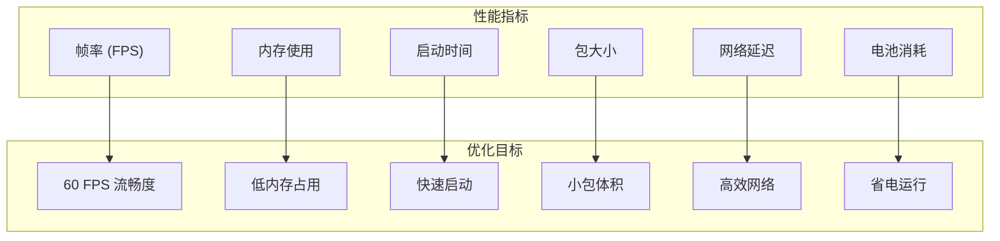

# Flutter 性能优化最佳实践

本文档详细介绍了 Flutter 应用的性能优化策略、技术和最佳实践，帮助开发者构建高性能、流畅的用户体验。

## 📋 目录

- [性能优化概述](#性能优化概述)
- [渲染性能优化](#渲染性能优化)
- [内存管理优化](#内存管理优化)
- [网络性能优化](#网络性能优化)
- [启动时间优化](#启动时间优化)
- [包大小优化](#包大小优化)
- [电池使用优化](#电池使用优化)
- [性能监控和分析](#性能监控和分析)
- [平台特定优化](#平台特定优化)
- [性能测试策略](#性能测试策略)

## 🎯 性能优化概述

### 性能指标



### 性能优化原则

1. **测量优先**：先测量，再优化
2. **渐进优化**：逐步改进，避免过度优化
3. **用户体验**：以用户感知为准
4. **平台适配**：考虑不同平台特性

## 🎨 渲染性能优化

### Widget 构建优化

#### 1. 使用 const 构造函数

```dart
// ❌ 不好的做法 - 每次都重新创建
class MyWidget extends StatelessWidget {
  @override
  Widget build(BuildContext context) {
    return Column(
      children: [
        Text('标题'),
        Container(
          padding: EdgeInsets.all(16.0),
          child: Text('内容'),
        ),
      ],
    );
  }
}

// ✅ 好的做法 - 使用 const
class MyWidget extends StatelessWidget {
  const MyWidget({super.key});
  
  @override
  Widget build(BuildContext context) {
    return const Column(
      children: [
        Text('标题'),
        Padding(
          padding: EdgeInsets.all(16.0),
          child: Text('内容'),
        ),
      ],
    );
  }
}
```

#### 2. 避免在 build 方法中创建对象

```dart
// ❌ 不好的做法
class UserListItem extends StatelessWidget {
  const UserListItem({super.key, required this.user});
  
  final User user;
  
  @override
  Widget build(BuildContext context) {
    // 每次 build 都创建新的 TextStyle
    final titleStyle = TextStyle(
      fontSize: 18,
      fontWeight: FontWeight.bold,
      color: Theme.of(context).primaryColor,
    );
    
    return ListTile(
      title: Text(user.name, style: titleStyle),
      subtitle: Text(user.email),
    );
  }
}

// ✅ 好的做法
class UserListItem extends StatelessWidget {
  const UserListItem({super.key, required this.user});
  
  final User user;
  
  // 静态样式，避免重复创建
  static const TextStyle _titleStyle = TextStyle(
    fontSize: 18,
    fontWeight: FontWeight.bold,
  );
  
  @override
  Widget build(BuildContext context) {
    return ListTile(
      title: Text(
        user.name,
        style: _titleStyle.copyWith(
          color: Theme.of(context).primaryColor,
        ),
      ),
      subtitle: Text(user.email),
    );
  }
}
```

#### 3. 使用 RepaintBoundary

```dart
class OptimizedListView extends StatelessWidget {
  const OptimizedListView({super.key, required this.items});
  
  final List<Item> items;
  
  @override
  Widget build(BuildContext context) {
    return ListView.builder(
      itemCount: items.length,
      itemBuilder: (context, index) {
        // 使用 RepaintBoundary 隔离重绘
        return RepaintBoundary(
          child: ItemWidget(
            key: ValueKey(items[index].id),
            item: items[index],
          ),
        );
      },
    );
  }
}

class ItemWidget extends StatelessWidget {
  const ItemWidget({super.key, required this.item});
  
  final Item item;
  
  @override
  Widget build(BuildContext context) {
    return Card(
      child: ListTile(
        leading: RepaintBoundary(
          child: CircleAvatar(
            backgroundImage: NetworkImage(item.avatarUrl),
          ),
        ),
        title: Text(item.title),
        subtitle: Text(item.description),
      ),
    );
  }
}
```

### 列表性能优化

#### 1. 使用 ListView.builder

```dart
// ❌ 不好的做法 - 一次性创建所有 Widget
class BadListView extends StatelessWidget {
  const BadListView({super.key, required this.items});
  
  final List<String> items;
  
  @override
  Widget build(BuildContext context) {
    return ListView(
      children: items.map((item) => ListTile(title: Text(item))).toList(),
    );
  }
}

// ✅ 好的做法 - 按需创建 Widget
class GoodListView extends StatelessWidget {
  const GoodListView({super.key, required this.items});
  
  final List<String> items;
  
  @override
  Widget build(BuildContext context) {
    return ListView.builder(
      itemCount: items.length,
      itemBuilder: (context, index) {
        return ListTile(title: Text(items[index]));
      },
    );
  }
}
```

#### 2. 实现虚拟滚动

```dart
class VirtualizedListView extends StatefulWidget {
  const VirtualizedListView({
    super.key,
    required this.itemCount,
    required this.itemBuilder,
    this.itemExtent = 56.0,
  });
  
  final int itemCount;
  final Widget Function(BuildContext context, int index) itemBuilder;
  final double itemExtent;
  
  @override
  State<VirtualizedListView> createState() => _VirtualizedListViewState();
}

class _VirtualizedListViewState extends State<VirtualizedListView> {
  final ScrollController _scrollController = ScrollController();
  final Map<int, Widget> _cachedWidgets = {};
  
  int _firstVisibleIndex = 0;
  int _lastVisibleIndex = 0;
  
  @override
  void initState() {
    super.initState();
    _scrollController.addListener(_updateVisibleRange);
  }
  
  @override
  void dispose() {
    _scrollController.dispose();
    super.dispose();
  }
  
  void _updateVisibleRange() {
    final scrollOffset = _scrollController.offset;
    final viewportHeight = _scrollController.position.viewportDimension;
    
    final firstIndex = (scrollOffset / widget.itemExtent).floor();
    final lastIndex = ((scrollOffset + viewportHeight) / widget.itemExtent).ceil();
    
    setState(() {
      _firstVisibleIndex = math.max(0, firstIndex - 5); // 预加载 5 个
      _lastVisibleIndex = math.min(widget.itemCount - 1, lastIndex + 5);
    });
    
    // 清理不可见的缓存
    _cachedWidgets.removeWhere((index, widget) {
      return index < _firstVisibleIndex || index > _lastVisibleIndex;
    });
  }
  
  Widget _buildItem(int index) {
    return _cachedWidgets.putIfAbsent(
      index,
      () => SizedBox(
        height: widget.itemExtent,
        child: widget.itemBuilder(context, index),
      ),
    );
  }
  
  @override
  Widget build(BuildContext context) {
    return ListView.builder(
      controller: _scrollController,
      itemCount: widget.itemCount,
      itemExtent: widget.itemExtent,
      itemBuilder: (context, index) {
        if (index >= _firstVisibleIndex && index <= _lastVisibleIndex) {
          return _buildItem(index);
        } else {
          return SizedBox(height: widget.itemExtent);
        }
      },
    );
  }
}
```

### 动画性能优化

#### 1. 使用高效的动画

```dart
class OptimizedAnimationWidget extends StatefulWidget {
  const OptimizedAnimationWidget({super.key});
  
  @override
  State<OptimizedAnimationWidget> createState() => _OptimizedAnimationWidgetState();
}

class _OptimizedAnimationWidgetState extends State<OptimizedAnimationWidget>
    with TickerProviderStateMixin {
  late AnimationController _controller;
  late Animation<double> _scaleAnimation;
  late Animation<double> _opacityAnimation;
  
  @override
  void initState() {
    super.initState();
    
    _controller = AnimationController(
      duration: const Duration(milliseconds: 300),
      vsync: this,
    );
    
    // 使用 Tween 而不是在 build 中计算
    _scaleAnimation = Tween<double>(
      begin: 0.8,
      end: 1.0,
    ).animate(CurvedAnimation(
      parent: _controller,
      curve: Curves.easeOutBack,
    ));
    
    _opacityAnimation = Tween<double>(
      begin: 0.0,
      end: 1.0,
    ).animate(CurvedAnimation(
      parent: _controller,
      curve: Curves.easeIn,
    ));
  }
  
  @override
  void dispose() {
    _controller.dispose();
    super.dispose();
  }
  
  @override
  Widget build(BuildContext context) {
    return AnimatedBuilder(
      animation: _controller,
      builder: (context, child) {
        return Transform.scale(
          scale: _scaleAnimation.value,
          child: Opacity(
            opacity: _opacityAnimation.value,
            child: child,
          ),
        );
      },
      child: const Card(
        child: Padding(
          padding: EdgeInsets.all(16.0),
          child: Text('动画内容'),
        ),
      ),
    );
  }
}
```

#### 2. 避免昂贵的动画操作

```dart
// ❌ 避免在动画中使用昂贵的操作
class BadAnimationWidget extends StatefulWidget {
  @override
  State<BadAnimationWidget> createState() => _BadAnimationWidgetState();
}

class _BadAnimationWidgetState extends State<BadAnimationWidget>
    with TickerProviderStateMixin {
  late AnimationController _controller;
  
  @override
  Widget build(BuildContext context) {
    return AnimatedBuilder(
      animation: _controller,
      builder: (context, child) {
        // ❌ 在动画中进行复杂计算
        final complexValue = _calculateComplexValue(_controller.value);
        
        return Transform.rotate(
          angle: _controller.value * 2 * math.pi,
          child: Container(
            width: 100 + complexValue,
            height: 100 + complexValue,
            decoration: BoxDecoration(
              // ❌ 在动画中创建复杂的装饰
              gradient: LinearGradient(
                colors: _generateGradientColors(_controller.value),
              ),
            ),
          ),
        );
      },
    );
  }
  
  double _calculateComplexValue(double value) {
    // 复杂计算
    return value * 50;
  }
  
  List<Color> _generateGradientColors(double value) {
    // 复杂颜色计算
    return [Colors.red, Colors.blue];
  }
}

// ✅ 优化后的动画
class GoodAnimationWidget extends StatefulWidget {
  @override
  State<GoodAnimationWidget> createState() => _GoodAnimationWidgetState();
}

class _GoodAnimationWidgetState extends State<GoodAnimationWidget>
    with TickerProviderStateMixin {
  late AnimationController _controller;
  late Animation<double> _rotationAnimation;
  late Animation<double> _sizeAnimation;
  
  // 预计算的值
  static const List<Color> _gradientColors = [Colors.red, Colors.blue];
  static const Decoration _decoration = BoxDecoration(
    gradient: LinearGradient(colors: _gradientColors),
  );
  
  @override
  void initState() {
    super.initState();
    
    _controller = AnimationController(
      duration: const Duration(seconds: 2),
      vsync: this,
    );
    
    _rotationAnimation = Tween<double>(
      begin: 0,
      end: 2 * math.pi,
    ).animate(_controller);
    
    _sizeAnimation = Tween<double>(
      begin: 100,
      end: 150,
    ).animate(_controller);
  }
  
  @override
  Widget build(BuildContext context) {
    return AnimatedBuilder(
      animation: _controller,
      builder: (context, child) {
        return Transform.rotate(
          angle: _rotationAnimation.value,
          child: Container(
            width: _sizeAnimation.value,
            height: _sizeAnimation.value,
            decoration: _decoration,
          ),
        );
      },
    );
  }
}
```

## 💾 内存管理优化

### 内存泄漏预防

#### 1. 正确管理 StreamSubscription

```dart
class StreamListenerWidget extends StatefulWidget {
  const StreamListenerWidget({super.key});
  
  @override
  State<StreamListenerWidget> createState() => _StreamListenerWidgetState();
}

class _StreamListenerWidgetState extends State<StreamListenerWidget> {
  StreamSubscription<String>? _subscription;
  String _data = '';
  
  @override
  void initState() {
    super.initState();
    
    // 订阅流
    _subscription = someDataStream.listen(
      (data) {
        if (mounted) {
          setState(() {
            _data = data;
          });
        }
      },
      onError: (error) {
        print('Stream error: $error');
      },
    );
  }
  
  @override
  void dispose() {
    // 重要：取消订阅以避免内存泄漏
    _subscription?.cancel();
    super.dispose();
  }
  
  @override
  Widget build(BuildContext context) {
    return Text(_data);
  }
}
```

#### 2. 正确管理 AnimationController

```dart
class AnimationWidget extends StatefulWidget {
  const AnimationWidget({super.key});
  
  @override
  State<AnimationWidget> createState() => _AnimationWidgetState();
}

class _AnimationWidgetState extends State<AnimationWidget>
    with TickerProviderStateMixin {
  late AnimationController _controller;
  late Timer _timer;
  
  @override
  void initState() {
    super.initState();
    
    _controller = AnimationController(
      duration: const Duration(seconds: 1),
      vsync: this,
    );
    
    _timer = Timer.periodic(
      const Duration(seconds: 2),
      (_) => _controller.forward().then((_) => _controller.reset()),
    );
  }
  
  @override
  void dispose() {
    // 重要：释放资源
    _controller.dispose();
    _timer.cancel();
    super.dispose();
  }
  
  @override
  Widget build(BuildContext context) {
    return AnimatedBuilder(
      animation: _controller,
      builder: (context, child) {
        return Opacity(
          opacity: _controller.value,
          child: const Text('动画文本'),
        );
      },
    );
  }
}
```

### 图片内存优化

#### 1. 图片缓存管理

```dart
class OptimizedImageWidget extends StatelessWidget {
  const OptimizedImageWidget({
    super.key,
    required this.imageUrl,
    this.width,
    this.height,
  });
  
  final String imageUrl;
  final double? width;
  final double? height;
  
  @override
  Widget build(BuildContext context) {
    return Image.network(
      imageUrl,
      width: width,
      height: height,
      // 设置合适的缓存策略
      cacheWidth: width?.toInt(),
      cacheHeight: height?.toInt(),
      // 错误处理
      errorBuilder: (context, error, stackTrace) {
        return Container(
          width: width,
          height: height,
          color: Colors.grey[300],
          child: const Icon(Icons.error),
        );
      },
      // 加载指示器
      loadingBuilder: (context, child, loadingProgress) {
        if (loadingProgress == null) return child;
        
        return Container(
          width: width,
          height: height,
          alignment: Alignment.center,
          child: CircularProgressIndicator(
            value: loadingProgress.expectedTotalBytes != null
                ? loadingProgress.cumulativeBytesLoaded /
                    loadingProgress.expectedTotalBytes!
                : null,
          ),
        );
      },
    );
  }
}
```

#### 2. 自定义图片缓存

```dart
class ImageCacheManager {
  static final ImageCacheManager _instance = ImageCacheManager._internal();
  factory ImageCacheManager() => _instance;
  ImageCacheManager._internal();
  
  final Map<String, ui.Image> _cache = {};
  final int _maxCacheSize = 100;
  
  Future<ui.Image?> getImage(String url) async {
    // 检查缓存
    if (_cache.containsKey(url)) {
      return _cache[url];
    }
    
    try {
      // 下载图片
      final response = await http.get(Uri.parse(url));
      if (response.statusCode == 200) {
        final bytes = response.bodyBytes;
        final codec = await ui.instantiateImageCodec(bytes);
        final frame = await codec.getNextFrame();
        
        // 添加到缓存
        _addToCache(url, frame.image);
        
        return frame.image;
      }
    } catch (e) {
      print('Failed to load image: $e');
    }
    
    return null;
  }
  
  void _addToCache(String url, ui.Image image) {
    if (_cache.length >= _maxCacheSize) {
      // 移除最旧的图片
      final firstKey = _cache.keys.first;
      _cache.remove(firstKey);
    }
    
    _cache[url] = image;
  }
  
  void clearCache() {
    _cache.clear();
  }
  
  void removeFromCache(String url) {
    _cache.remove(url);
  }
}
```

### 内存监控

```dart
class MemoryMonitor {
  static final MemoryMonitor _instance = MemoryMonitor._internal();
  factory MemoryMonitor() => _instance;
  MemoryMonitor._internal();
  
  Timer? _monitorTimer;
  final List<MemoryInfo> _memoryHistory = [];
  
  void startMonitoring() {
    _monitorTimer = Timer.periodic(
      const Duration(seconds: 5),
      (_) => _checkMemoryUsage(),
    );
  }
  
  void stopMonitoring() {
    _monitorTimer?.cancel();
    _monitorTimer = null;
  }
  
  Future<void> _checkMemoryUsage() async {
    final info = await DeviceInfoPlugin().androidInfo;
    final memoryInfo = MemoryInfo(
      timestamp: DateTime.now(),
      usedMemory: await _getUsedMemory(),
      totalMemory: await _getTotalMemory(),
    );
    
    _memoryHistory.add(memoryInfo);
    
    // 保持历史记录在合理范围内
    if (_memoryHistory.length > 100) {
      _memoryHistory.removeAt(0);
    }
    
    // 检查内存使用是否过高
    if (memoryInfo.usagePercentage > 0.8) {
      _handleHighMemoryUsage();
    }
  }
  
  Future<int> _getUsedMemory() async {
    // 获取已使用内存（平台特定实现）
    return 0;
  }
  
  Future<int> _getTotalMemory() async {
    // 获取总内存（平台特定实现）
    return 0;
  }
  
  void _handleHighMemoryUsage() {
    // 清理缓存
    PaintingBinding.instance.imageCache.clear();
    
    // 触发垃圾回收
    // 注意：在生产环境中谨慎使用
    if (kDebugMode) {
      print('High memory usage detected, clearing caches');
    }
  }
  
  List<MemoryInfo> get memoryHistory => List.unmodifiable(_memoryHistory);
}

class MemoryInfo {
  const MemoryInfo({
    required this.timestamp,
    required this.usedMemory,
    required this.totalMemory,
  });
  
  final DateTime timestamp;
  final int usedMemory;
  final int totalMemory;
  
  double get usagePercentage => usedMemory / totalMemory;
}
```

## 🌐 网络性能优化

### HTTP 请求优化

#### 1. 连接池管理

```dart
class OptimizedHttpClient {
  static final OptimizedHttpClient _instance = OptimizedHttpClient._internal();
  factory OptimizedHttpClient() => _instance;
  OptimizedHttpClient._internal();
  
  late final Dio _dio;
  
  void initialize() {
    _dio = Dio(BaseOptions(
      connectTimeout: const Duration(seconds: 10),
      receiveTimeout: const Duration(seconds: 30),
      sendTimeout: const Duration(seconds: 30),
    ));
    
    // 配置连接池
    (_dio.httpClientAdapter as IOHttpClientAdapter).createHttpClient = () {
      final client = HttpClient();
      client.maxConnectionsPerHost = 5;
      client.connectionTimeout = const Duration(seconds: 10);
      client.idleTimeout = const Duration(seconds: 15);
      return client;
    };
    
    // 添加拦截器
    _dio.interceptors.addAll([
      LogInterceptor(logPrint: (obj) => debugPrint(obj.toString())),
      RetryInterceptor(),
      CacheInterceptor(),
    ]);
  }
  
  Future<Response<T>> get<T>(
    String path, {
    Map<String, dynamic>? queryParameters,
    Options? options,
  }) async {
    return _dio.get<T>(
      path,
      queryParameters: queryParameters,
      options: options,
    );
  }
  
  Future<Response<T>> post<T>(
    String path, {
    dynamic data,
    Map<String, dynamic>? queryParameters,
    Options? options,
  }) async {
    return _dio.post<T>(
      path,
      data: data,
      queryParameters: queryParameters,
      options: options,
    );
  }
}
```

#### 2. 请求缓存策略

```dart
class CacheInterceptor extends Interceptor {
  final Map<String, CachedResponse> _cache = {};
  final Duration _defaultCacheDuration = const Duration(minutes: 5);
  
  @override
  void onRequest(RequestOptions options, RequestInterceptorHandler handler) {
    // 检查是否可以使用缓存
    if (_shouldUseCache(options)) {
      final cacheKey = _generateCacheKey(options);
      final cachedResponse = _cache[cacheKey];
      
      if (cachedResponse != null && !cachedResponse.isExpired) {
        // 返回缓存的响应
        handler.resolve(cachedResponse.response);
        return;
      }
    }
    
    handler.next(options);
  }
  
  @override
  void onResponse(Response response, ResponseInterceptorHandler handler) {
    // 缓存响应
    if (_shouldCacheResponse(response)) {
      final cacheKey = _generateCacheKey(response.requestOptions);
      _cache[cacheKey] = CachedResponse(
        response: response,
        cachedAt: DateTime.now(),
        duration: _getCacheDuration(response.requestOptions),
      );
    }
    
    handler.next(response);
  }
  
  bool _shouldUseCache(RequestOptions options) {
    return options.method == 'GET' && 
           options.extra['useCache'] == true;
  }
  
  bool _shouldCacheResponse(Response response) {
    return response.statusCode == 200 &&
           response.requestOptions.method == 'GET';
  }
  
  String _generateCacheKey(RequestOptions options) {
    final uri = options.uri.toString();
    final headers = options.headers.toString();
    return '$uri-$headers'.hashCode.toString();
  }
  
  Duration _getCacheDuration(RequestOptions options) {
    return options.extra['cacheDuration'] as Duration? ?? _defaultCacheDuration;
  }
  
  void clearCache() {
    _cache.clear();
  }
}

class CachedResponse {
  const CachedResponse({
    required this.response,
    required this.cachedAt,
    required this.duration,
  });
  
  final Response response;
  final DateTime cachedAt;
  final Duration duration;
  
  bool get isExpired {
    return DateTime.now().difference(cachedAt) > duration;
  }
}
```

#### 3. 请求重试机制

```dart
class RetryInterceptor extends Interceptor {
  final int maxRetries;
  final Duration retryDelay;
  
  const RetryInterceptor({
    this.maxRetries = 3,
    this.retryDelay = const Duration(seconds: 1),
  });
  
  @override
  void onError(DioException err, ErrorInterceptorHandler handler) async {
    final options = err.requestOptions;
    final retryCount = options.extra['retryCount'] as int? ?? 0;
    
    if (_shouldRetry(err) && retryCount < maxRetries) {
      // 增加重试计数
      options.extra['retryCount'] = retryCount + 1;
      
      // 等待后重试
      await Future.delayed(retryDelay * (retryCount + 1));
      
      try {
        final response = await Dio().fetch(options);
        handler.resolve(response);
        return;
      } catch (e) {
        // 重试失败，继续处理错误
      }
    }
    
    handler.next(err);
  }
  
  bool _shouldRetry(DioException error) {
    return error.type == DioExceptionType.connectionTimeout ||
           error.type == DioExceptionType.receiveTimeout ||
           error.type == DioExceptionType.connectionError ||
           (error.response?.statusCode != null &&
            error.response!.statusCode! >= 500);
  }
}
```

### 数据压缩和优化

```dart
class DataCompressionService {
  // GZIP 压缩
  static List<int> compressGzip(String data) {
    final bytes = utf8.encode(data);
    return gzip.encode(bytes);
  }
  
  static String decompressGzip(List<int> compressedData) {
    final bytes = gzip.decode(compressedData);
    return utf8.decode(bytes);
  }
  
  // JSON 数据优化
  static Map<String, dynamic> optimizeJsonData(Map<String, dynamic> data) {
    final optimized = <String, dynamic>{};
    
    for (final entry in data.entries) {
      final value = entry.value;
      
      // 移除 null 值
      if (value == null) continue;
      
      // 压缩字符串
      if (value is String && value.isEmpty) continue;
      
      // 递归处理嵌套对象
      if (value is Map<String, dynamic>) {
        final optimizedNested = optimizeJsonData(value);
        if (optimizedNested.isNotEmpty) {
          optimized[entry.key] = optimizedNested;
        }
      } else {
        optimized[entry.key] = value;
      }
    }
    
    return optimized;
  }
  
  // 批量请求优化
  static Future<List<T>> batchRequests<T>(
    List<Future<T>> requests, {
    int batchSize = 5,
    Duration delay = const Duration(milliseconds: 100),
  }) async {
    final results = <T>[];
    
    for (int i = 0; i < requests.length; i += batchSize) {
      final batch = requests.skip(i).take(batchSize);
      final batchResults = await Future.wait(batch);
      results.addAll(batchResults);
      
      // 在批次之间添加延迟
      if (i + batchSize < requests.length) {
        await Future.delayed(delay);
      }
    }
    
    return results;
  }
}
```

## 🚀 启动时间优化

### 应用启动优化

#### 1. 延迟初始化

```dart
class AppInitializer {
  static bool _isInitialized = false;
  
  static Future<void> initialize() async {
    if (_isInitialized) return;
    
    // 关键初始化（阻塞启动）
    await _initializeCritical();
    
    // 非关键初始化（后台执行）
    unawaited(_initializeNonCritical());
    
    _isInitialized = true;
  }
  
  static Future<void> _initializeCritical() async {
    // 只初始化启动必需的服务
    await Future.wait([
      SharedPreferences.getInstance(),
      _initializeTheme(),
      _initializeLocalization(),
    ]);
  }
  
  static Future<void> _initializeNonCritical() async {
    // 延迟初始化非关键服务
    await Future.delayed(const Duration(milliseconds: 500));
    
    await Future.wait([
      _initializeAnalytics(),
      _initializeCrashReporting(),
      _initializeNotifications(),
      _preloadAssets(),
    ]);
  }
  
  static Future<void> _initializeTheme() async {
    // 主题初始化
  }
  
  static Future<void> _initializeLocalization() async {
    // 本地化初始化
  }
  
  static Future<void> _initializeAnalytics() async {
    // 分析服务初始化
  }
  
  static Future<void> _initializeCrashReporting() async {
    // 崩溃报告初始化
  }
  
  static Future<void> _initializeNotifications() async {
    // 通知服务初始化
  }
  
  static Future<void> _preloadAssets() async {
    // 预加载关键资源
  }
}

// main.dart
void main() async {
  WidgetsFlutterBinding.ensureInitialized();
  
  // 只执行关键初始化
  await AppInitializer.initialize();
  
  runApp(MyApp());
}
```

#### 2. 启动屏优化

```dart
class SplashScreen extends StatefulWidget {
  const SplashScreen({super.key});
  
  @override
  State<SplashScreen> createState() => _SplashScreenState();
}

class _SplashScreenState extends State<SplashScreen>
    with TickerProviderStateMixin {
  late AnimationController _logoController;
  late AnimationController _progressController;
  late Animation<double> _logoAnimation;
  late Animation<double> _progressAnimation;
  
  double _initializationProgress = 0.0;
  
  @override
  void initState() {
    super.initState();
    
    _logoController = AnimationController(
      duration: const Duration(milliseconds: 1000),
      vsync: this,
    );
    
    _progressController = AnimationController(
      duration: const Duration(milliseconds: 2000),
      vsync: this,
    );
    
    _logoAnimation = Tween<double>(begin: 0.0, end: 1.0).animate(
      CurvedAnimation(parent: _logoController, curve: Curves.easeInOut),
    );
    
    _progressAnimation = Tween<double>(begin: 0.0, end: 1.0).animate(
      CurvedAnimation(parent: _progressController, curve: Curves.easeInOut),
    );
    
    _startInitialization();
  }
  
  Future<void> _startInitialization() async {
    // 启动 logo 动画
    _logoController.forward();
    
    // 模拟初始化进度
    final steps = [
      () => _initializeServices(),
      () => _loadUserData(),
      () => _prepareUI(),
    ];
    
    for (int i = 0; i < steps.length; i++) {
      await steps[i]();
      
      setState(() {
        _initializationProgress = (i + 1) / steps.length;
      });
      
      _progressController.animateTo(_initializationProgress);
    }
    
    // 导航到主页面
    if (mounted) {
      Navigator.of(context).pushReplacement(
        MaterialPageRoute(builder: (_) => const HomePage()),
      );
    }
  }
  
  Future<void> _initializeServices() async {
    await Future.delayed(const Duration(milliseconds: 500));
  }
  
  Future<void> _loadUserData() async {
    await Future.delayed(const Duration(milliseconds: 300));
  }
  
  Future<void> _prepareUI() async {
    await Future.delayed(const Duration(milliseconds: 200));
  }
  
  @override
  void dispose() {
    _logoController.dispose();
    _progressController.dispose();
    super.dispose();
  }
  
  @override
  Widget build(BuildContext context) {
    return Scaffold(
      backgroundColor: Theme.of(context).primaryColor,
      body: Center(
        child: Column(
          mainAxisAlignment: MainAxisAlignment.center,
          children: [
            AnimatedBuilder(
              animation: _logoAnimation,
              builder: (context, child) {
                return Transform.scale(
                  scale: _logoAnimation.value,
                  child: Opacity(
                    opacity: _logoAnimation.value,
                    child: const FlutterLogo(size: 100),
                  ),
                );
              },
            ),
            const SizedBox(height: 50),
            SizedBox(
              width: 200,
              child: AnimatedBuilder(
                animation: _progressAnimation,
                builder: (context, child) {
                  return LinearProgressIndicator(
                    value: _progressAnimation.value,
                    backgroundColor: Colors.white.withOpacity(0.3),
                    valueColor: const AlwaysStoppedAnimation<Color>(Colors.white),
                  );
                },
              ),
            ),
            const SizedBox(height: 20),
            Text(
              '初始化中... ${(_initializationProgress * 100).toInt()}%',
              style: const TextStyle(
                color: Colors.white,
                fontSize: 16,
              ),
            ),
          ],
        ),
      ),
    );
  }
}
```

## 📦 包大小优化

### 资源优化

#### 1. 图片资源优化

```yaml
# pubspec.yaml
flutter:
  assets:
    # 使用矢量图标
    - assets/icons/
    # 优化后的图片
    - assets/images/optimized/
    
  # 字体优化
  fonts:
    - family: CustomFont
      fonts:
        - asset: fonts/CustomFont-Regular.ttf
        - asset: fonts/CustomFont-Bold.ttf
          weight: 700
```

```dart
// 图片优化工具
class ImageOptimizer {
  static Future<void> optimizeImages() async {
    final directory = Directory('assets/images');
    final files = directory.listSync(recursive: true)
        .where((file) => file.path.endsWith('.png') || file.path.endsWith('.jpg'))
        .cast<File>();
    
    for (final file in files) {
      await _optimizeImage(file);
    }
  }
  
  static Future<void> _optimizeImage(File file) async {
    final bytes = await file.readAsBytes();
    final image = img.decodeImage(bytes);
    
    if (image != null) {
      // 调整图片大小
      final resized = img.copyResize(image, width: 800);
      
      // 压缩图片
      final compressed = img.encodeJpg(resized, quality: 85);
      
      // 保存优化后的图片
      final optimizedPath = file.path.replaceAll('.png', '_optimized.jpg');
      await File(optimizedPath).writeAsBytes(compressed);
    }
  }
}
```

#### 2. 代码分割和懒加载

```dart
// 路由懒加载
class AppRouter {
  static final GoRouter router = GoRouter(
    routes: [
      GoRoute(
        path: '/',
        builder: (context, state) => const HomePage(),
      ),
      GoRoute(
        path: '/profile',
        builder: (context, state) => _loadProfilePage(),
      ),
      GoRoute(
        path: '/settings',
        builder: (context, state) => _loadSettingsPage(),
      ),
    ],
  );
  
  // 懒加载页面
  static Widget _loadProfilePage() {
    return FutureBuilder<Widget>(
      future: _loadPage(() => const ProfilePage()),
      builder: (context, snapshot) {
        if (snapshot.hasData) {
          return snapshot.data!;
        } else {
          return const LoadingPage();
        }
      },
    );
  }
  
  static Widget _loadSettingsPage() {
    return FutureBuilder<Widget>(
      future: _loadPage(() => const SettingsPage()),
      builder: (context, snapshot) {
        if (snapshot.hasData) {
          return snapshot.data!;
        } else {
          return const LoadingPage();
        }
      },
    );
  }
  
  static Future<Widget> _loadPage(Widget Function() pageBuilder) async {
    // 模拟异步加载
    await Future.delayed(const Duration(milliseconds: 100));
    return pageBuilder();
  }
}
```

### 依赖优化

```yaml
# pubspec.yaml - 优化依赖
dependencies:
  flutter:
    sdk: flutter
  
  # 只导入需要的功能
  firebase_core: ^2.15.0
  firebase_auth: ^4.7.2  # 而不是整个 firebase 套件
  
  # 使用轻量级替代品
  dio: ^5.3.0  # 而不是 http + 额外的包
  
  # 条件导入
  device_info_plus: ^9.1.0
  
dev_dependencies:
  flutter_test:
    sdk: flutter
  
  # 构建时工具
  build_runner: ^2.4.6
  json_annotation: ^4.8.1
  
  # 分析工具
  flutter_lints: ^2.0.0
```

```dart
// 条件导入示例
import 'package:flutter/foundation.dart';

// 只在需要时导入
class ConditionalImports {
  static Future<void> initializeAnalytics() async {
    if (kReleaseMode) {
      // 只在发布模式下导入分析工具
      final analytics = await import('package:firebase_analytics/firebase_analytics.dart');
      // 初始化分析
    }
  }
  
  static Future<void> initializeDebugTools() async {
    if (kDebugMode) {
      // 只在调试模式下导入调试工具
      final debugTools = await import('package:flutter_debug_tools/flutter_debug_tools.dart');
      // 初始化调试工具
    }
  }
}
```

## 📊 性能监控和分析

### 性能指标收集

```dart
class PerformanceMonitor {
  static final PerformanceMonitor _instance = PerformanceMonitor._internal();
  factory PerformanceMonitor() => _instance;
  PerformanceMonitor._internal();
  
  final List<PerformanceMetric> _metrics = [];
  Timer? _reportTimer;
  
  void startMonitoring() {
    // 监控帧率
    WidgetsBinding.instance.addTimingsCallback(_onFrameMetrics);
    
    // 定期报告性能数据
    _reportTimer = Timer.periodic(
      const Duration(minutes: 1),
      (_) => _reportMetrics(),
    );
  }
  
  void stopMonitoring() {
    WidgetsBinding.instance.removeTimingsCallback(_onFrameMetrics);
    _reportTimer?.cancel();
  }
  
  void _onFrameMetrics(List<FrameTiming> timings) {
    for (final timing in timings) {
      final buildDuration = timing.buildDuration.inMicroseconds / 1000.0;
      final rasterDuration = timing.rasterDuration.inMicroseconds / 1000.0;
      final totalDuration = timing.totalSpan.inMicroseconds / 1000.0;
      
      _metrics.add(PerformanceMetric(
        timestamp: DateTime.now(),
        buildTime: buildDuration,
        rasterTime: rasterDuration,
        totalTime: totalDuration,
        isJanky: totalDuration > 16.67, // 60 FPS = 16.67ms per frame
      ));
    }
    
    // 保持指标数量在合理范围内
    if (_metrics.length > 1000) {
      _metrics.removeRange(0, 500);
    }
  }
  
  void _reportMetrics() {
    if (_metrics.isEmpty) return;
    
    final recentMetrics = _metrics.where(
      (metric) => DateTime.now().difference(metric.timestamp) < const Duration(minutes: 1),
    ).toList();
    
    if (recentMetrics.isNotEmpty) {
      final report = PerformanceReport.fromMetrics(recentMetrics);
      _sendReport(report);
    }
  }
  
  void _sendReport(PerformanceReport report) {
    // 发送性能报告到分析服务
    if (kDebugMode) {
      print('Performance Report:');
      print('Average FPS: ${report.averageFps.toStringAsFixed(2)}');
      print('Jank Rate: ${(report.jankRate * 100).toStringAsFixed(2)}%');
      print('Average Build Time: ${report.averageBuildTime.toStringAsFixed(2)}ms');
    }
  }
  
  PerformanceReport getCurrentReport() {
    return PerformanceReport.fromMetrics(_metrics);
  }
}

class PerformanceMetric {
  const PerformanceMetric({
    required this.timestamp,
    required this.buildTime,
    required this.rasterTime,
    required this.totalTime,
    required this.isJanky,
  });
  
  final DateTime timestamp;
  final double buildTime;
  final double rasterTime;
  final double totalTime;
  final bool isJanky;
}

class PerformanceReport {
  const PerformanceReport({
    required this.averageFps,
    required this.jankRate,
    required this.averageBuildTime,
    required this.averageRasterTime,
    required this.totalFrames,
    required this.jankyFrames,
  });
  
  final double averageFps;
  final double jankRate;
  final double averageBuildTime;
  final double averageRasterTime;
  final int totalFrames;
  final int jankyFrames;
  
  factory PerformanceReport.fromMetrics(List<PerformanceMetric> metrics) {
    if (metrics.isEmpty) {
      return const PerformanceReport(
        averageFps: 0,
        jankRate: 0,
        averageBuildTime: 0,
        averageRasterTime: 0,
        totalFrames: 0,
        jankyFrames: 0,
      );
    }
    
    final totalFrames = metrics.length;
    final jankyFrames = metrics.where((m) => m.isJanky).length;
    final averageBuildTime = metrics.map((m) => m.buildTime).reduce((a, b) => a + b) / totalFrames;
    final averageRasterTime = metrics.map((m) => m.rasterTime).reduce((a, b) => a + b) / totalFrames;
    final averageFrameTime = metrics.map((m) => m.totalTime).reduce((a, b) => a + b) / totalFrames;
    
    return PerformanceReport(
      averageFps: 1000.0 / averageFrameTime,
      jankRate: jankyFrames / totalFrames,
      averageBuildTime: averageBuildTime,
      averageRasterTime: averageRasterTime,
      totalFrames: totalFrames,
      jankyFrames: jankyFrames,
    );
  }
}
```

### 性能分析工具

```dart
class PerformanceProfiler {
  static final Map<String, Stopwatch> _stopwatches = {};
  static final Map<String, List<Duration>> _measurements = {};
  
  static void startMeasurement(String name) {
    _stopwatches[name] = Stopwatch()..start();
  }
  
  static void endMeasurement(String name) {
    final stopwatch = _stopwatches[name];
    if (stopwatch != null) {
      stopwatch.stop();
      
      _measurements.putIfAbsent(name, () => []).add(stopwatch.elapsed);
      _stopwatches.remove(name);
      
      if (kDebugMode) {
        print('$name took ${stopwatch.elapsedMilliseconds}ms');
      }
    }
  }
  
  static T measureSync<T>(String name, T Function() function) {
    startMeasurement(name);
    try {
      return function();
    } finally {
      endMeasurement(name);
    }
  }
  
  static Future<T> measureAsync<T>(String name, Future<T> Function() function) async {
    startMeasurement(name);
    try {
      return await function();
    } finally {
      endMeasurement(name);
    }
  }
  
  static Map<String, PerformanceStats> getStats() {
    final stats = <String, PerformanceStats>{};
    
    for (final entry in _measurements.entries) {
      final measurements = entry.value;
      if (measurements.isNotEmpty) {
        stats[entry.key] = PerformanceStats.fromMeasurements(measurements);
      }
    }
    
    return stats;
  }
  
  static void clearStats() {
    _measurements.clear();
  }
}

class PerformanceStats {
  const PerformanceStats({
    required this.count,
    required this.average,
    required this.min,
    required this.max,
    required this.total,
  });
  
  final int count;
  final Duration average;
  final Duration min;
  final Duration max;
  final Duration total;
  
  factory PerformanceStats.fromMeasurements(List<Duration> measurements) {
    final count = measurements.length;
    final total = measurements.reduce((a, b) => a + b);
    final average = Duration(microseconds: total.inMicroseconds ~/ count);
    final min = measurements.reduce((a, b) => a < b ? a : b);
    final max = measurements.reduce((a, b) => a > b ? a : b);
    
    return PerformanceStats(
      count: count,
      average: average,
      min: min,
      max: max,
      total: total,
    );
  }
  
  @override
  String toString() {
    return 'PerformanceStats(count: $count, avg: ${average.inMilliseconds}ms, '
           'min: ${min.inMilliseconds}ms, max: ${max.inMilliseconds}ms)';
  }
}

// 使用示例
class ExampleUsage {
  Future<List<User>> loadUsers() async {
    return PerformanceProfiler.measureAsync('loadUsers', () async {
      // 模拟网络请求
      await Future.delayed(const Duration(milliseconds: 500));
      return <User>[];
    });
  }
  
  List<User> processUsers(List<User> users) {
    return PerformanceProfiler.measureSync('processUsers', () {
      // 处理用户数据
      return users.where((user) => user.isActive).toList();
    });
  }
}
```

## 📚 总结

性能优化是一个持续的过程，需要：

### 核心策略

1. **测量优先**：使用工具测量性能瓶颈
2. **渐进优化**：逐步改进，避免过度优化
3. **用户体验**：以用户感知为准
4. **平台适配**：考虑不同平台特性

### 关键领域

1. **渲染性能**：Widget 优化、列表优化、动画优化
2. **内存管理**：避免泄漏、图片优化、缓存管理
3. **网络性能**：请求优化、缓存策略、数据压缩
4. **启动优化**：延迟初始化、资源预加载
5. **包大小**：资源优化、代码分割、依赖管理

### 监控工具

- **Flutter Inspector**：Widget 树分析
- **Performance Overlay**：帧率监控
- **Memory Profiler**：内存使用分析
- **Network Profiler**：网络请求分析
- **Custom Metrics**：自定义性能指标

通过系统性的性能优化，可以显著提升 Flutter 应用的用户体验和运行效率。