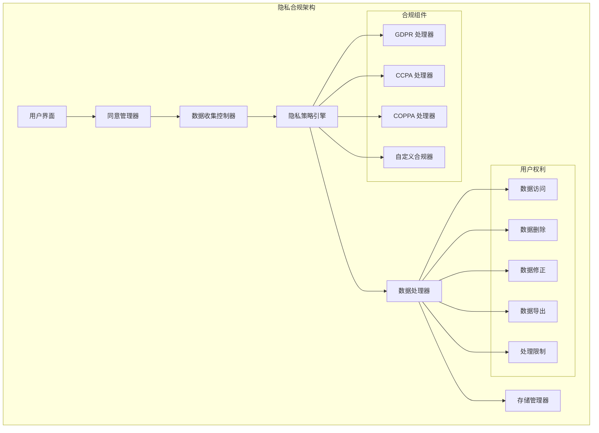

# Flutter 隐私合规处理详解

本文档详细介绍 Flutter 应用中的隐私合规实现，包括 GDPR、CCPA 等法规的技术实现方案。

## 📋 目录

- [隐私合规基础](#隐私合规基础)
- [GDPR 合规实现](#gdpr-合规实现)
- [CCPA 合规实现](#ccpa-合规实现)
- [用户同意管理](#用户同意管理)
- [数据收集透明化](#数据收集透明化)
- [用户权利实现](#用户权利实现)
- [实际应用案例](#实际应用案例)
- [最佳实践](#最佳实践)

## 隐私合规基础

### 架构图



### 基础概念

```dart
import 'package:flutter/material.dart';
import 'package:shared_preferences/shared_preferences.dart';
import 'package:package_info_plus/package_info_plus.dart';
import 'package:device_info_plus/device_info_plus.dart';

// 隐私合规管理器
class PrivacyComplianceManager {
  static const String _consentKey = 'privacy_consent';
  static const String _gdprConsentKey = 'gdpr_consent';
  static const String _ccpaConsentKey = 'ccpa_consent';
  static const String _dataCollectionKey = 'data_collection_consent';

  static PrivacyComplianceManager? _instance;
  static PrivacyComplianceManager get instance {
    _instance ??= PrivacyComplianceManager._internal();
    return _instance!;
  }

  PrivacyComplianceManager._internal();

  late SharedPreferences _prefs;
  final List<PrivacyConsentListener> _listeners = [];

  // 初始化
  Future<void> initialize() async {
    _prefs = await SharedPreferences.getInstance();
    await _checkComplianceRequirements();
  }

  // 检查合规要求
  Future<void> _checkComplianceRequirements() async {
    final deviceInfo = DeviceInfoPlugin();
    final packageInfo = await PackageInfo.fromPlatform();

    // 根据地区和应用类型确定合规要求
    final region = await _detectUserRegion();
    final appCategory = await _getAppCategory();

    if (region == 'EU') {
      await _enableGDPRCompliance();
    }

    if (region == 'CA' || region == 'US') {
      await _enableCCPACompliance();
    }

    if (appCategory == 'children') {
      await _enableCOPPACompliance();
    }
  }

  // 检测用户地区
  Future<String> _detectUserRegion() async {
    // 实际实现中可以通过 IP 地址或设备设置检测
    // 这里简化为示例
    return 'EU'; // 示例返回欧盟地区
  }

  // 获取应用类别
  Future<String> _getAppCategory() async {
    // 根据应用内容确定是否为儿童应用
    return 'general';
  }

  // 启用 GDPR 合规
  Future<void> _enableGDPRCompliance() async {
    await _prefs.setBool('gdpr_required', true);
  }

  // 启用 CCPA 合规
  Future<void> _enableCCPACompliance() async {
    await _prefs.setBool('ccpa_required', true);
  }

  // 启用 COPPA 合规
  Future<void> _enableCOPPACompliance() async {
    await _prefs.setBool('coppa_required', true);
  }

  // 添加同意监听器
  void addConsentListener(PrivacyConsentListener listener) {
    _listeners.add(listener);
  }

  // 移除同意监听器
  void removeConsentListener(PrivacyConsentListener listener) {
    _listeners.remove(listener);
  }

  // 通知监听器
  void _notifyListeners(ConsentEvent event) {
    for (final listener in _listeners) {
      listener.onConsentChanged(event);
    }
  }
}

// 隐私同意监听器
abstract class PrivacyConsentListener {
  void onConsentChanged(ConsentEvent event);
}

// 同意事件
class ConsentEvent {
  final ConsentType type;
  final bool granted;
  final DateTime timestamp;
  final Map<String, dynamic> metadata;

  ConsentEvent({
    required this.type,
    required this.granted,
    required this.timestamp,
    this.metadata = const {},
  });
}

// 同意类型
enum ConsentType {
  gdpr,
  ccpa,
  coppa,
  analytics,
  advertising,
  functional,
  performance,
}

// 数据收集类型
enum DataCollectionType {
  essential,      // 必要数据
  functional,     // 功能数据
  analytics,      // 分析数据
  advertising,    // 广告数据
  personalization, // 个性化数据
}

// 隐私设置
class PrivacySettings {
  final Map<DataCollectionType, bool> dataCollectionConsent;
  final bool analyticsEnabled;
  final bool advertisingEnabled;
  final bool personalizationEnabled;
  final DateTime consentTimestamp;
  final String consentVersion;

  PrivacySettings({
    required this.dataCollectionConsent,
    required this.analyticsEnabled,
    required this.advertisingEnabled,
    required this.personalizationEnabled,
    required this.consentTimestamp,
    required this.consentVersion,
  });

  Map<String, dynamic> toJson() {
    return {
      'dataCollectionConsent': dataCollectionConsent.map(
        (key, value) => MapEntry(key.toString(), value),
      ),
      'analyticsEnabled': analyticsEnabled,
      'advertisingEnabled': advertisingEnabled,
      'personalizationEnabled': personalizationEnabled,
      'consentTimestamp': consentTimestamp.toIso8601String(),
      'consentVersion': consentVersion,
    };
  }

  factory PrivacySettings.fromJson(Map<String, dynamic> json) {
    return PrivacySettings(
      dataCollectionConsent: (json['dataCollectionConsent'] as Map<String, dynamic>)
          .map((key, value) => MapEntry(
                DataCollectionType.values.firstWhere(
                  (e) => e.toString() == key,
                ),
                value as bool,
              )),
      analyticsEnabled: json['analyticsEnabled'] as bool,
      advertisingEnabled: json['advertisingEnabled'] as bool,
      personalizationEnabled: json['personalizationEnabled'] as bool,
      consentTimestamp: DateTime.parse(json['consentTimestamp'] as String),
      consentVersion: json['consentVersion'] as String,
    );
  }
}
```

## GDPR 合规实现

### GDPR 处理器

```dart
class GDPRComplianceHandler {
  static const String _gdprConsentKey = 'gdpr_consent_v2';
  static const String _dataProcessingKey = 'gdpr_data_processing';
  static const String _userRightsKey = 'gdpr_user_rights';

  final SharedPreferences _prefs;

  GDPRComplianceHandler(this._prefs);

  // 检查是否需要 GDPR 同意
  bool isGDPRRequired() {
    return _prefs.getBool('gdpr_required') ?? false;
  }

  // 获取 GDPR 同意状态
  GDPRConsentStatus getConsentStatus() {
    final consentData = _prefs.getString(_gdprConsentKey);
    if (consentData == null) {
      return GDPRConsentStatus.notProvided;
    }

    try {
      final consent = GDPRConsent.fromJson(
        Map<String, dynamic>.from(
          json.decode(consentData) as Map,
        ),
      );

      // 检查同意是否过期
      if (consent.isExpired()) {
        return GDPRConsentStatus.expired;
      }

      return consent.isValid()
          ? GDPRConsentStatus.granted
          : GDPRConsentStatus.denied;
    } catch (e) {
      return GDPRConsentStatus.invalid;
    }
  }

  // 保存 GDPR 同意
  Future<void> saveConsent(GDPRConsent consent) async {
    await _prefs.setString(_gdprConsentKey, json.encode(consent.toJson()));

    // 记录同意事件
    await _logConsentEvent(consent);

    // 通知监听器
    PrivacyComplianceManager.instance._notifyListeners(
      ConsentEvent(
        type: ConsentType.gdpr,
        granted: consent.isValid(),
        timestamp: DateTime.now(),
        metadata: consent.toJson(),
      ),
    );
  }

  // 撤销 GDPR 同意
  Future<void> revokeConsent() async {
    final currentConsent = getCurrentConsent();
    if (currentConsent != null) {
      final revokedConsent = currentConsent.copyWith(
        revoked: true,
        revokedAt: DateTime.now(),
      );

      await saveConsent(revokedConsent);

      // 执行数据删除
      await _executeDataDeletion();
    }
  }

  // 获取当前同意
  GDPRConsent? getCurrentConsent() {
    final consentData = _prefs.getString(_gdprConsentKey);
    if (consentData == null) return null;

    try {
      return GDPRConsent.fromJson(
        Map<String, dynamic>.from(
          json.decode(consentData) as Map,
        ),
      );
    } catch (e) {
      return null;
    }
  }

  // 记录同意事件
  Future<void> _logConsentEvent(GDPRConsent consent) async {
    final events = _prefs.getStringList('gdpr_consent_events') ?? [];

    final event = {
      'timestamp': DateTime.now().toIso8601String(),
      'action': consent.revoked ? 'revoked' : 'granted',
      'version': consent.version,
      'purposes': consent.purposes.map((p) => p.toString()).toList(),
    };

    events.add(json.encode(event));

    // 保留最近 100 个事件
    if (events.length > 100) {
      events.removeRange(0, events.length - 100);
    }

    await _prefs.setStringList('gdpr_consent_events', events);
  }

  // 执行数据删除
  Future<void> _executeDataDeletion() async {
    // 删除用户数据
    await _deleteUserData();

    // 删除分析数据
    await _deleteAnalyticsData();

    // 删除广告数据
    await _deleteAdvertisingData();

    // 通知第三方服务
    await _notifyThirdPartyServices();
  }

  Future<void> _deleteUserData() async {
    // 实现用户数据删除逻辑
  }

  Future<void> _deleteAnalyticsData() async {
    // 实现分析数据删除逻辑
  }

  Future<void> _deleteAdvertisingData() async {
    // 实现广告数据删除逻辑
  }

  Future<void> _notifyThirdPartyServices() async {
    // 通知第三方服务删除用户数据
  }
}

// GDPR 同意状态
enum GDPRConsentStatus {
  notProvided,
  granted,
  denied,
  expired,
  invalid,
}

// GDPR 同意
class GDPRConsent {
  final String version;
  final DateTime timestamp;
  final List<GDPRPurpose> purposes;
  final bool revoked;
  final DateTime? revokedAt;
  final String userAgent;
  final String ipAddress;

  GDPRConsent({
    required this.version,
    required this.timestamp,
    required this.purposes,
    this.revoked = false,
    this.revokedAt,
    required this.userAgent,
    required this.ipAddress,
  });

  bool isValid() {
    return !revoked && purposes.isNotEmpty;
  }

  bool isExpired() {
    // GDPR 同意通常有效期为 2 年
    final expiryDate = timestamp.add(const Duration(days: 730));
    return DateTime.now().isAfter(expiryDate);
  }

  GDPRConsent copyWith({
    String? version,
    DateTime? timestamp,
    List<GDPRPurpose>? purposes,
    bool? revoked,
    DateTime? revokedAt,
    String? userAgent,
    String? ipAddress,
  }) {
    return GDPRConsent(
      version: version ?? this.version,
      timestamp: timestamp ?? this.timestamp,
      purposes: purposes ?? this.purposes,
      revoked: revoked ?? this.revoked,
      revokedAt: revokedAt ?? this.revokedAt,
      userAgent: userAgent ?? this.userAgent,
      ipAddress: ipAddress ?? this.ipAddress,
    );
  }

  Map<String, dynamic> toJson() {
    return {
      'version': version,
      'timestamp': timestamp.toIso8601String(),
      'purposes': purposes.map((p) => p.toString()).toList(),
      'revoked': revoked,
      'revokedAt': revokedAt?.toIso8601String(),
      'userAgent': userAgent,
      'ipAddress': ipAddress,
    };
  }

  factory GDPRConsent.fromJson(Map<String, dynamic> json) {
    return GDPRConsent(
      version: json['version'] as String,
      timestamp: DateTime.parse(json['timestamp'] as String),
      purposes: (json['purposes'] as List<dynamic>)
          .map((p) => GDPRPurpose.values.firstWhere(
                (e) => e.toString() == p,
              ))
          .toList(),
      revoked: json['revoked'] as bool? ?? false,
      revokedAt: json['revokedAt'] != null
          ? DateTime.parse(json['revokedAt'] as String)
          : null,
      userAgent: json['userAgent'] as String,
      ipAddress: json['ipAddress'] as String,
    );
  }
}

// GDPR 处理目的
enum GDPRPurpose {
  essential,        // 必要功能
  analytics,        // 分析统计
  advertising,      // 广告营销
  personalization,  // 个性化
  socialMedia,      // 社交媒体
  thirdPartySharing, // 第三方共享
}
```

## CCPA 合规实现

### CCPA 处理器

```dart
class CCPAComplianceHandler {
  static const String _ccpaConsentKey = 'ccpa_consent_v1';
  static const String _doNotSellKey = 'ccpa_do_not_sell';
  static const String _dataRequestsKey = 'ccpa_data_requests';

  final SharedPreferences _prefs;

  CCPAComplianceHandler(this._prefs);

  // 检查是否需要 CCPA 合规
  bool isCCPARequired() {
    return _prefs.getBool('ccpa_required') ?? false;
  }

  // 获取"不要出售"状态
  bool getDoNotSellStatus() {
    return _prefs.getBool(_doNotSellKey) ?? false;
  }

  // 设置"不要出售"状态
  Future<void> setDoNotSell(bool doNotSell) async {
    await _prefs.setBool(_doNotSellKey, doNotSell);

    // 记录状态变更
    await _logDoNotSellEvent(doNotSell);

    // 如果用户选择不出售，停止相关数据处理
    if (doNotSell) {
      await _stopDataSelling();
    }

    // 通知监听器
    PrivacyComplianceManager.instance._notifyListeners(
      ConsentEvent(
        type: ConsentType.ccpa,
        granted: !doNotSell,
        timestamp: DateTime.now(),
        metadata: {'doNotSell': doNotSell},
      ),
    );
  }

  // 处理数据访问请求
  Future<CCPADataResponse> handleDataAccessRequest(String userId) async {
    try {
      // 收集用户数据
      final personalInfo = await _collectPersonalInfo(userId);
      final categories = await _getDataCategories(userId);
      final sources = await _getDataSources(userId);
      final purposes = await _getBusinessPurposes(userId);
      final thirdParties = await _getThirdPartySharing(userId);

      return CCPADataResponse(
        personalInfo: personalInfo,
        categories: categories,
        sources: sources,
        purposes: purposes,
        thirdParties: thirdParties,
        requestDate: DateTime.now(),
      );
    } catch (e) {
      throw CCPAComplianceException('Failed to process data access request: $e');
    }
  }

  // 处理数据删除请求
  Future<void> handleDataDeletionRequest(String userId) async {
    try {
      // 验证删除请求
      await _verifyDeletionRequest(userId);

      // 删除个人信息
      await _deletePersonalInfo(userId);

      // 删除相关记录
      await _deleteRelatedRecords(userId);

      // 通知第三方
      await _notifyThirdPartiesOfDeletion(userId);

      // 记录删除事件
      await _logDeletionEvent(userId);

    } catch (e) {
      throw CCPAComplianceException('Failed to process data deletion request: $e');
    }
  }

  // 记录"不要出售"事件
  Future<void> _logDoNotSellEvent(bool doNotSell) async {
    final events = _prefs.getStringList('ccpa_do_not_sell_events') ?? [];

    final event = {
      'timestamp': DateTime.now().toIso8601String(),
      'doNotSell': doNotSell,
      'userAgent': await _getUserAgent(),
      'ipAddress': await _getIPAddress(),
    };

    events.add(json.encode(event));

    // 保留最近 50 个事件
    if (events.length > 50) {
      events.removeRange(0, events.length - 50);
    }

    await _prefs.setStringList('ccpa_do_not_sell_events', events);
  }

  // 停止数据出售
  Future<void> _stopDataSelling() async {
    // 停止向广告网络发送数据
    await _stopAdvertisingDataSharing();

    // 停止数据经纪人服务
    await _stopDataBrokerServices();

    // 更新第三方服务配置
    await _updateThirdPartyConfigs();
  }

  // 收集个人信息
  Future<Map<String, dynamic>> _collectPersonalInfo(String userId) async {
    // 实现个人信息收集逻辑
    return {};
  }

  // 获取数据类别
  Future<List<String>> _getDataCategories(String userId) async {
    // 实现数据类别获取逻辑
    return [];
  }

  // 获取数据来源
  Future<List<String>> _getDataSources(String userId) async {
    // 实现数据来源获取逻辑
    return [];
  }

  // 获取业务目的
  Future<List<String>> _getBusinessPurposes(String userId) async {
    // 实现业务目的获取逻辑
    return [];
  }

  // 获取第三方共享信息
  Future<List<String>> _getThirdPartySharing(String userId) async {
    // 实现第三方共享信息获取逻辑
    return [];
  }

  Future<void> _verifyDeletionRequest(String userId) async {
    // 实现删除请求验证逻辑
  }

  Future<void> _deletePersonalInfo(String userId) async {
    // 实现个人信息删除逻辑
  }

  Future<void> _deleteRelatedRecords(String userId) async {
    // 实现相关记录删除逻辑
  }

  Future<void> _notifyThirdPartiesOfDeletion(String userId) async {
    // 实现第三方删除通知逻辑
  }

  Future<void> _logDeletionEvent(String userId) async {
    // 实现删除事件记录逻辑
  }

  Future<void> _stopAdvertisingDataSharing() async {
    // 实现停止广告数据共享逻辑
  }

  Future<void> _stopDataBrokerServices() async {
    // 实现停止数据经纪人服务逻辑
  }

  Future<void> _updateThirdPartyConfigs() async {
    // 实现第三方服务配置更新逻辑
  }

  Future<String> _getUserAgent() async {
    // 实现用户代理获取逻辑
    return 'Flutter App';
  }

  Future<String> _getIPAddress() async {
    // 实现 IP 地址获取逻辑
    return '0.0.0.0';
  }
}

// CCPA 数据响应
class CCPADataResponse {
  final Map<String, dynamic> personalInfo;
  final List<String> categories;
  final List<String> sources;
  final List<String> purposes;
  final List<String> thirdParties;
  final DateTime requestDate;

  CCPADataResponse({
    required this.personalInfo,
    required this.categories,
    required this.sources,
    required this.purposes,
    required this.thirdParties,
    required this.requestDate,
  });

  Map<String, dynamic> toJson() {
    return {
      'personalInfo': personalInfo,
      'categories': categories,
      'sources': sources,
      'purposes': purposes,
      'thirdParties': thirdParties,
      'requestDate': requestDate.toIso8601String(),
    };
  }
}

// CCPA 合规异常
class CCPAComplianceException implements Exception {
  final String message;

  CCPAComplianceException(this.message);

  @override
  String toString() => 'CCPAComplianceException: $message';
}
```

## 用户同意管理

### 同意管理界面

```dart
class PrivacyConsentScreen extends StatefulWidget {
  final bool isRequired;
  final VoidCallback? onConsentCompleted;

  const PrivacyConsentScreen({
    Key? key,
    this.isRequired = false,
    this.onConsentCompleted,
  }) : super(key: key);

  @override
  State<PrivacyConsentScreen> createState() => _PrivacyConsentScreenState();
}

class _PrivacyConsentScreenState extends State<PrivacyConsentScreen>
    with TickerProviderStateMixin {
  late TabController _tabController;

  final Map<DataCollectionType, bool> _consents = {
    DataCollectionType.essential: true,      // 必要数据默认同意
    DataCollectionType.functional: false,
    DataCollectionType.analytics: false,
    DataCollectionType.advertising: false,
    DataCollectionType.personalization: false,
  };

  bool _gdprConsent = false;
  bool _ccpaDoNotSell = false;
  bool _isLoading = false;

  @override
  void initState() {
    super.initState();
    _tabController = TabController(length: 3, vsync: this);
    _loadCurrentSettings();
  }

  @override
  void dispose() {
    _tabController.dispose();
    super.dispose();
  }

  Future<void> _loadCurrentSettings() async {
    final manager = PrivacyComplianceManager.instance;

    // 加载当前设置
    // 实现设置加载逻辑
  }

  @override
  Widget build(BuildContext context) {
    return Scaffold(
      appBar: AppBar(
        title: const Text('隐私设置'),
        automaticallyImplyLeading: !widget.isRequired,
        bottom: TabBar(
          controller: _tabController,
          tabs: const [
            Tab(text: '数据收集'),
            Tab(text: '用户权利'),
            Tab(text: '隐私政策'),
          ],
        ),
      ),
      body: TabBarView(
        controller: _tabController,
        children: [
          _buildDataCollectionTab(),
          _buildUserRightsTab(),
          _buildPrivacyPolicyTab(),
        ],
      ),
      bottomNavigationBar: _buildBottomActions(),
    );
  }

  Widget _buildDataCollectionTab() {
    return ListView(
      padding: const EdgeInsets.all(16),
      children: [
        const Text(
          '数据收集同意',
          style: TextStyle(
            fontSize: 20,
            fontWeight: FontWeight.bold,
          ),
        ),
        const SizedBox(height: 16),

        const Text(
          '请选择您同意我们收集的数据类型：',
          style: TextStyle(fontSize: 16),
        ),
        const SizedBox(height: 16),

        ..._consents.entries.map((entry) {
          return _buildConsentTile(
            type: entry.key,
            value: entry.value,
            onChanged: entry.key == DataCollectionType.essential
                ? null // 必要数据不可取消
                : (value) {
                    setState(() {
                      _consents[entry.key] = value ?? false;
                    });
                  },
          );
        }).toList(),

        const SizedBox(height: 24),

        // GDPR 特定同意
        if (PrivacyComplianceManager.instance._prefs.getBool('gdpr_required') ?? false)
          _buildGDPRConsentSection(),

        // CCPA 特定选项
        if (PrivacyComplianceManager.instance._prefs.getBool('ccpa_required') ?? false)
          _buildCCPAOptionsSection(),
      ],
    );
  }

  Widget _buildConsentTile({
    required DataCollectionType type,
    required bool value,
    required ValueChanged<bool?>? onChanged,
  }) {
    final info = _getDataTypeInfo(type);

    return Card(
      child: Padding(
        padding: const EdgeInsets.all(16),
        child: Column(
          crossAxisAlignment: CrossAxisAlignment.start,
          children: [
            Row(
              children: [
                Expanded(
                  child: Column(
                    crossAxisAlignment: CrossAxisAlignment.start,
                    children: [
                      Text(
                        info.title,
                        style: const TextStyle(
                          fontSize: 16,
                          fontWeight: FontWeight.w600,
                        ),
                      ),
                      const SizedBox(height: 4),
                      Text(
                        info.description,
                        style: TextStyle(
                          fontSize: 14,
                          color: Colors.grey[600],
                        ),
                      ),
                    ],
                  ),
                ),
                Switch(
                  value: value,
                  onChanged: onChanged,
                ),
              ],
            ),

            if (info.examples.isNotEmpty) ..[
              const SizedBox(height: 12),
              ExpansionTile(
                title: const Text(
                  '查看详细信息',
                  style: TextStyle(fontSize: 14),
                ),
                children: [
                  Padding(
                    padding: const EdgeInsets.all(16),
                    child: Column(
                      crossAxisAlignment: CrossAxisAlignment.start,
                      children: [
                        const Text(
                          '包含的数据类型：',
                          style: TextStyle(fontWeight: FontWeight.w600),
                        ),
                        const SizedBox(height: 8),
                        ...info.examples.map((example) => Padding(
                              padding: const EdgeInsets.only(left: 16, bottom: 4),
                              child: Row(
                                children: [
                                  const Text('• '),
                                  Expanded(child: Text(example)),
                                ],
                              ),
                            )),
                      ],
                    ),
                  ),
                ],
              ),
            ],
          ],
        ),
      ),
    );
  }

  Widget _buildGDPRConsentSection() {
    return Card(
      child: Padding(
        padding: const EdgeInsets.all(16),
        child: Column(
          crossAxisAlignment: CrossAxisAlignment.start,
          children: [
            const Text(
              'GDPR 合规',
              style: TextStyle(
                fontSize: 18,
                fontWeight: FontWeight.bold,
              ),
            ),
            const SizedBox(height: 12),

            const Text(
              '根据欧盟通用数据保护条例 (GDPR)，我们需要您的明确同意来处理您的个人数据。',
            ),
            const SizedBox(height: 12),

            CheckboxListTile(
              title: const Text('我同意根据隐私政策处理我的个人数据'),
              subtitle: const Text('这包括为提供服务、改进用户体验和法律要求而进行的数据处理。'),
              value: _gdprConsent,
              onChanged: (value) {
                setState(() {
                  _gdprConsent = value ?? false;
                });
              },
            ),
          ],
        ),
      ),
    );
  }

  Widget _buildCCPAOptionsSection() {
    return Card(
      child: Padding(
        padding: const EdgeInsets.all(16),
        child: Column(
          crossAxisAlignment: CrossAxisAlignment.start,
          children: [
            const Text(
              'CCPA 权利',
              style: TextStyle(
                fontSize: 18,
                fontWeight: FontWeight.bold,
              ),
            ),
            const SizedBox(height: 12),

            const Text(
              '根据加利福尼亚州消费者隐私法案 (CCPA)，您有权选择不出售您的个人信息。',
            ),
            const SizedBox(height: 12),

            CheckboxListTile(
              title: const Text('不要出售我的个人信息'),
              subtitle: const Text('选择此选项将阻止我们向第三方出售您的个人信息。'),
              value: _ccpaDoNotSell,
              onChanged: (value) {
                setState(() {
                  _ccpaDoNotSell = value ?? false;
                });
              },
            ),
          ],
        ),
      ),
    );
  }

  Widget _buildUserRightsTab() {
    return ListView(
      padding: const EdgeInsets.all(16),
      children: [
        const Text(
          '您的数据权利',
          style: TextStyle(
            fontSize: 20,
            fontWeight: FontWeight.bold,
          ),
        ),
        const SizedBox(height: 16),

        _buildUserRightTile(
          icon: Icons.visibility,
          title: '访问我的数据',
          description: '查看我们收集的关于您的个人数据',
          onTap: () => _handleDataAccessRequest(),
        ),

        _buildUserRightTile(
          icon: Icons.edit,
          title: '更正我的数据',
          description: '请求更正不准确或不完整的个人数据',
          onTap: () => _handleDataCorrectionRequest(),
        ),

        _buildUserRightTile(
          icon: Icons.download,
          title: '导出我的数据',
          description: '以可读格式下载您的个人数据副本',
          onTap: () => _handleDataExportRequest(),
        ),

        _buildUserRightTile(
          icon: Icons.delete,
          title: '删除我的数据',
          description: '请求删除您的个人数据（在法律允许的范围内）',
          onTap: () => _handleDataDeletionRequest(),
          isDestructive: true,
        ),

        _buildUserRightTile(
          icon: Icons.block,
          title: '限制数据处理',
          description: '在某些情况下限制我们处理您的数据',
          onTap: () => _handleProcessingRestrictionRequest(),
        ),
      ],
    );
  }

  Widget _buildUserRightTile({
    required IconData icon,
    required String title,
    required String description,
    required VoidCallback onTap,
    bool isDestructive = false,
  }) {
    return Card(
      child: ListTile(
        leading: Icon(
          icon,
          color: isDestructive ? Colors.red : null,
        ),
        title: Text(
          title,
          style: TextStyle(
            color: isDestructive ? Colors.red : null,
            fontWeight: FontWeight.w600,
          ),
        ),
        subtitle: Text(description),
        trailing: const Icon(Icons.arrow_forward_ios),
        onTap: onTap,
      ),
    );
  }

  Widget _buildPrivacyPolicyTab() {
    return SingleChildScrollView(
      padding: const EdgeInsets.all(16),
      child: Column(
        crossAxisAlignment: CrossAxisAlignment.start,
        children: [
          const Text(
            '隐私政策',
            style: TextStyle(
              fontSize: 20,
              fontWeight: FontWeight.bold,
            ),
          ),
          const SizedBox(height: 16),

          // 这里可以嵌入完整的隐私政策内容
          const Text(
            '我们的隐私政策详细说明了我们如何收集、使用、存储和保护您的个人信息...',
            style: TextStyle(fontSize: 16),
          ),

          const SizedBox(height: 24),

          ElevatedButton(
            onPressed: () => _showFullPrivacyPolicy(),
            child: const Text('查看完整隐私政策'),
          ),
        ],
      ),
    );
  }

  Widget _buildBottomActions() {
    return Container(
      padding: const EdgeInsets.all(16),
      child: Row(
        children: [
          if (!widget.isRequired)
            Expanded(
              child: OutlinedButton(
                onPressed: () => Navigator.of(context).pop(),
                child: const Text('取消'),
              ),
            ),

          if (!widget.isRequired) const SizedBox(width: 16),

          Expanded(
            child: ElevatedButton(
              onPressed: _isLoading ? null : _saveConsent,
              child: _isLoading
                  ? const SizedBox(
                      width: 20,
                      height: 20,
                      child: CircularProgressIndicator(strokeWidth: 2),
                    )
                  : Text(widget.isRequired ? '确认并继续' : '保存设置'),
            ),
          ),
        ],
      ),
    );
  }

  DataTypeInfo _getDataTypeInfo(DataCollectionType type) {
    switch (type) {
      case DataCollectionType.essential:
        return DataTypeInfo(
          title: '必要数据',
          description: '应用正常运行所必需的数据',
          examples: ['用户账户信息', '应用设置', '错误日志'],
        );
      case DataCollectionType.functional:
        return DataTypeInfo(
          title: '功能数据',
          description: '用于提供额外功能和服务的数据',
          examples: ['用户偏好设置', '搜索历史', '收藏内容'],
        );
      case DataCollectionType.analytics:
        return DataTypeInfo(
          title: '分析数据',
          description: '用于分析应用使用情况和改进服务的数据',
          examples: ['页面访问统计', '功能使用频率', '性能指标'],
        );
      case DataCollectionType.advertising:
        return DataTypeInfo(
          title: '广告数据',
          description: '用于个性化广告投放的数据',
          examples: ['广告点击记录', '兴趣标签', '设备标识符'],
        );
      case DataCollectionType.personalization:
        return DataTypeInfo(
          title: '个性化数据',
          description: '用于提供个性化内容和推荐的数据',
          examples: ['浏览历史', '内容偏好', '推荐算法数据'],
        );
    }
  }

  Future<void> _saveConsent() async {
    setState(() {
      _isLoading = true;
    });

    try {
      final manager = PrivacyComplianceManager.instance;

      // 保存数据收集同意
      final settings = PrivacySettings(
        dataCollectionConsent: _consents,
        analyticsEnabled: _consents[DataCollectionType.analytics] ?? false,
        advertisingEnabled: _consents[DataCollectionType.advertising] ?? false,
        personalizationEnabled: _consents[DataCollectionType.personalization] ?? false,
        consentTimestamp: DateTime.now(),
        consentVersion: '1.0',
      );

      // 保存 GDPR 同意
      if (manager._prefs.getBool('gdpr_required') ?? false) {
        if (_gdprConsent) {
          final gdprConsent = GDPRConsent(
            version: '1.0',
            timestamp: DateTime.now(),
            purposes: _getSelectedGDPRPurposes(),
            userAgent: 'Flutter App',
            ipAddress: await _getIPAddress(),
          );

          final gdprHandler = GDPRComplianceHandler(manager._prefs);
          await gdprHandler.saveConsent(gdprConsent);
        }
      }

      // 保存 CCPA 选择
      if (manager._prefs.getBool('ccpa_required') ?? false) {
        final ccpaHandler = CCPAComplianceHandler(manager._prefs);
        await ccpaHandler.setDoNotSell(_ccpaDoNotSell);
      }

      // 保存设置到本地存储
      await manager._prefs.setString(
        'privacy_settings',
        json.encode(settings.toJson()),
      );

      if (widget.onConsentCompleted != null) {
        widget.onConsentCompleted!();
      }

      if (!widget.isRequired) {
        Navigator.of(context).pop();
      }

      ScaffoldMessenger.of(context).showSnackBar(
        const SnackBar(
          content: Text('隐私设置已保存'),
          backgroundColor: Colors.green,
        ),
      );

    } catch (e) {
      ScaffoldMessenger.of(context).showSnackBar(
        SnackBar(
          content: Text('保存失败: $e'),
          backgroundColor: Colors.red,
        ),
      );
    } finally {
      setState(() {
        _isLoading = false;
      });
    }
  }

  List<GDPRPurpose> _getSelectedGDPRPurposes() {
    final purposes = <GDPRPurpose>[GDPRPurpose.essential];

    if (_consents[DataCollectionType.analytics] ?? false) {
      purposes.add(GDPRPurpose.analytics);
    }

    if (_consents[DataCollectionType.advertising] ?? false) {
      purposes.add(GDPRPurpose.advertising);
    }

    if (_consents[DataCollectionType.personalization] ?? false) {
      purposes.add(GDPRPurpose.personalization);
    }

    return purposes;
  }

  Future<String> _getIPAddress() async {
    // 实现 IP 地址获取逻辑
    return '0.0.0.0';
  }

  void _handleDataAccessRequest() {
    // 实现数据访问请求处理
  }

  void _handleDataCorrectionRequest() {
    // 实现数据更正请求处理
  }

  void _handleDataExportRequest() {
    // 实现数据导出请求处理
  }

  void _handleDataDeletionRequest() {
    // 实现数据删除请求处理
  }

  void _handleProcessingRestrictionRequest() {
    // 实现处理限制请求处理
  }

  void _showFullPrivacyPolicy() {
    // 显示完整隐私政策
  }
}

class DataTypeInfo {
  final String title;
  final String description;
  final List<String> examples;

  DataTypeInfo({
    required this.title,
    required this.description,
    required this.examples,
  });
}
```

## 数据收集透明化

### 数据收集监控

```dart
class DataCollectionMonitor {
  static final DataCollectionMonitor _instance = DataCollectionMonitor._internal();
  static DataCollectionMonitor get instance => _instance;

  DataCollectionMonitor._internal();

  final List<DataCollectionEvent> _events = [];
  final StreamController<DataCollectionEvent> _eventController =
      StreamController<DataCollectionEvent>.broadcast();

  Stream<DataCollectionEvent> get eventStream => _eventController.stream;

  // 记录数据收集事件
  void recordDataCollection({
    required DataCollectionType type,
    required String purpose,
    required Map<String, dynamic> data,
    String? source,
    String? destination,
  }) {
    final event = DataCollectionEvent(
      id: _generateEventId(),
      type: type,
      purpose: purpose,
      data: data,
      source: source,
      destination: destination,
      timestamp: DateTime.now(),
    );

    _events.add(event);
    _eventController.add(event);

    // 检查是否有用户同意
    _validateConsent(event);

    // 记录到持久存储
    _persistEvent(event);
  }

  // 获取数据收集历史
  List<DataCollectionEvent> getCollectionHistory({
    DataCollectionType? type,
    DateTime? startDate,
    DateTime? endDate,
  }) {
    return _events.where((event) {
      if (type != null && event.type != type) return false;
      if (startDate != null && event.timestamp.isBefore(startDate)) return false;
      if (endDate != null && event.timestamp.isAfter(endDate)) return false;
      return true;
    }).toList();
  }

  // 生成数据收集报告
  DataCollectionReport generateReport({
    DateTime? startDate,
    DateTime? endDate,
  }) {
    final events = getCollectionHistory(
      startDate: startDate,
      endDate: endDate,
    );

    final typeStats = <DataCollectionType, int>{};
    final purposeStats = <String, int>{};
    final sourceStats = <String, int>{};

    for (final event in events) {
      typeStats[event.type] = (typeStats[event.type] ?? 0) + 1;
      purposeStats[event.purpose] = (purposeStats[event.purpose] ?? 0) + 1;
      if (event.source != null) {
        sourceStats[event.source!] = (sourceStats[event.source!] ?? 0) + 1;
      }
    }

    return DataCollectionReport(
      totalEvents: events.length,
      typeStatistics: typeStats,
      purposeStatistics: purposeStats,
      sourceStatistics: sourceStats,
      startDate: startDate ?? events.first.timestamp,
      endDate: endDate ?? events.last.timestamp,
    );
  }

  // 验证用户同意
  void _validateConsent(DataCollectionEvent event) {
    final manager = PrivacyComplianceManager.instance;

    // 检查是否有相应的用户同意
    // 如果没有同意，记录违规事件
  }

  // 持久化事件
  Future<void> _persistEvent(DataCollectionEvent event) async {
    // 将事件保存到本地存储或发送到服务器
  }

  String _generateEventId() {
    return DateTime.now().millisecondsSinceEpoch.toString();
  }

  void dispose() {
    _eventController.close();
  }
}

// 数据收集事件
class DataCollectionEvent {
  final String id;
  final DataCollectionType type;
  final String purpose;
  final Map<String, dynamic> data;
  final String? source;
  final String? destination;
  final DateTime timestamp;

  DataCollectionEvent({
    required this.id,
    required this.type,
    required this.purpose,
    required this.data,
    this.source,
    this.destination,
    required this.timestamp,
  });

  Map<String, dynamic> toJson() {
    return {
      'id': id,
      'type': type.toString(),
      'purpose': purpose,
      'data': data,
      'source': source,
      'destination': destination,
      'timestamp': timestamp.toIso8601String(),
    };
  }
}

// 数据收集报告
class DataCollectionReport {
  final int totalEvents;
  final Map<DataCollectionType, int> typeStatistics;
  final Map<String, int> purposeStatistics;
  final Map<String, int> sourceStatistics;
  final DateTime startDate;
  final DateTime endDate;

  DataCollectionReport({
    required this.totalEvents,
    required this.typeStatistics,
    required this.purposeStatistics,
    required this.sourceStatistics,
    required this.startDate,
    required this.endDate,
  });
}
```

## 用户权利实现

### 数据访问权

```dart
class DataAccessService {
  static const String _userDataKey = 'user_data_export';

  // 处理数据访问请求
  Future<UserDataExport> processDataAccessRequest(String userId) async {
    try {
      // 验证用户身份
      await _verifyUserIdentity(userId);

      // 收集用户数据
      final personalData = await _collectPersonalData(userId);
      final activityData = await _collectActivityData(userId);
      final preferencesData = await _collectPreferencesData(userId);
      final consentData = await _collectConsentData(userId);

      // 生成数据导出
      final export = UserDataExport(
        userId: userId,
        personalData: personalData,
        activityData: activityData,
        preferencesData: preferencesData,
        consentData: consentData,
        exportDate: DateTime.now(),
        format: 'JSON',
      );

      // 记录访问请求
      await _logAccessRequest(userId, export);

      return export;
    } catch (e) {
      throw DataAccessException('Failed to process data access request: $e');
    }
  }

  // 生成数据导出文件
  Future<String> generateExportFile(UserDataExport export) async {
    final jsonData = json.encode(export.toJson());

    // 创建临时文件
    final tempDir = await getTemporaryDirectory();
    final file = File('${tempDir.path}/user_data_export_${export.userId}.json');

    await file.writeAsString(jsonData);

    return file.path;
  }

  Future<void> _verifyUserIdentity(String userId) async {
    // 实现用户身份验证逻辑
  }

  Future<Map<String, dynamic>> _collectPersonalData(String userId) async {
    // 收集个人数据
    return {
      'profile': {
        'name': 'User Name',
        'email': 'user@example.com',
        'phone': '+1234567890',
      },
      'account': {
        'created_at': DateTime.now().toIso8601String(),
        'last_login': DateTime.now().toIso8601String(),
      },
    };
  }

  Future<Map<String, dynamic>> _collectActivityData(String userId) async {
    // 收集活动数据
    return {
      'sessions': [],
      'actions': [],
      'interactions': [],
    };
  }

  Future<Map<String, dynamic>> _collectPreferencesData(String userId) async {
    // 收集偏好设置数据
    return {
      'language': 'en',
      'theme': 'light',
      'notifications': true,
    };
  }

  Future<Map<String, dynamic>> _collectConsentData(String userId) async {
    // 收集同意数据
    return {
      'gdpr_consent': true,
      'marketing_consent': false,
      'analytics_consent': true,
    };
  }

  Future<void> _logAccessRequest(String userId, UserDataExport export) async {
    // 记录数据访问请求
  }
}

// 用户数据导出
class UserDataExport {
  final String userId;
  final Map<String, dynamic> personalData;
  final Map<String, dynamic> activityData;
  final Map<String, dynamic> preferencesData;
  final Map<String, dynamic> consentData;
  final DateTime exportDate;
  final String format;

  UserDataExport({
    required this.userId,
    required this.personalData,
    required this.activityData,
    required this.preferencesData,
    required this.consentData,
    required this.exportDate,
    required this.format,
  });

  Map<String, dynamic> toJson() {
    return {
      'user_id': userId,
      'export_date': exportDate.toIso8601String(),
      'format': format,
      'data': {
        'personal': personalData,
        'activity': activityData,
        'preferences': preferencesData,
        'consent': consentData,
      },
    };
  }
}

class DataAccessException implements Exception {
  final String message;

  DataAccessException(this.message);

  @override
  String toString() => 'DataAccessException: $message';
}
```

## 实际应用案例

### 电商应用隐私合规

```dart
class ECommercePrivacyManager extends PrivacyConsentListener {
  final AnalyticsService _analytics;
  final AdvertisingService _advertising;
  final PersonalizationService _personalization;

  ECommercePrivacyManager({
    required AnalyticsService analytics,
    required AdvertisingService advertising,
    required PersonalizationService personalization,
  }) : _analytics = analytics,
       _advertising = advertising,
       _personalization = personalization {

    // 注册为隐私同意监听器
    PrivacyComplianceManager.instance.addConsentListener(this);
  }

  @override
  void onConsentChanged(ConsentEvent event) {
    switch (event.type) {
      case ConsentType.analytics:
        _handleAnalyticsConsent(event.granted);
        break;
      case ConsentType.advertising:
        _handleAdvertisingConsent(event.granted);
        break;
      case ConsentType.personalization:
        _handlePersonalizationConsent(event.granted);
        break;
      default:
        break;
    }
  }

  void _handleAnalyticsConsent(bool granted) {
    if (granted) {
      _analytics.enable();

      // 记录用户行为数据
      DataCollectionMonitor.instance.recordDataCollection(
        type: DataCollectionType.analytics,
        purpose: '用户行为分析',
        data: {'consent_granted': true},
        source: 'user_consent',
      );
    } else {
      _analytics.disable();

      // 删除已收集的分析数据
      await _analytics.clearData();
    }
  }

  void _handleAdvertisingConsent(bool granted) {
    if (granted) {
      _advertising.enable();

      DataCollectionMonitor.instance.recordDataCollection(
        type: DataCollectionType.advertising,
        purpose: '个性化广告投放',
        data: {'consent_granted': true},
        source: 'user_consent',
      );
    } else {
      _advertising.disable();
      await _advertising.clearData();
    }
  }

  void _handlePersonalizationConsent(bool granted) {
    if (granted) {
      _personalization.enable();

      DataCollectionMonitor.instance.recordDataCollection(
        type: DataCollectionType.personalization,
        purpose: '个性化推荐',
        data: {'consent_granted': true},
        source: 'user_consent',
      );
    } else {
      _personalization.disable();
      await _personalization.clearData();
    }
  }

  // 处理购买事件的隐私合规
  Future<void> handlePurchaseEvent(PurchaseEvent event) async {
    final settings = await _getPrivacySettings();

    // 只有在用户同意的情况下才收集数据
    if (settings.analyticsEnabled) {
      DataCollectionMonitor.instance.recordDataCollection(
        type: DataCollectionType.analytics,
        purpose: '购买行为分析',
        data: {
          'product_id': event.productId,
          'category': event.category,
          'amount': event.amount,
          'timestamp': event.timestamp.toIso8601String(),
        },
        source: 'purchase_tracking',
      );
    }

    if (settings.personalizationEnabled) {
      DataCollectionMonitor.instance.recordDataCollection(
        type: DataCollectionType.personalization,
        purpose: '购买偏好分析',
        data: {
          'user_preferences': event.userPreferences,
          'recommendation_context': event.recommendationContext,
        },
        source: 'personalization_engine',
      );
    }
  }

  Future<PrivacySettings> _getPrivacySettings() async {
    final prefs = await SharedPreferences.getInstance();
    final settingsJson = prefs.getString('privacy_settings');

    if (settingsJson != null) {
      return PrivacySettings.fromJson(
        Map<String, dynamic>.from(json.decode(settingsJson) as Map),
      );
    }

    // 返回默认设置（仅必要数据）
    return PrivacySettings(
      dataCollectionConsent: {
        DataCollectionType.essential: true,
        DataCollectionType.functional: false,
        DataCollectionType.analytics: false,
        DataCollectionType.advertising: false,
        DataCollectionType.personalization: false,
      },
      analyticsEnabled: false,
      advertisingEnabled: false,
      personalizationEnabled: false,
      consentTimestamp: DateTime.now(),
      consentVersion: '1.0',
    );
  }
}

// 购买事件
class PurchaseEvent {
  final String productId;
  final String category;
  final double amount;
  final DateTime timestamp;
  final Map<String, dynamic> userPreferences;
  final Map<String, dynamic> recommendationContext;

  PurchaseEvent({
    required this.productId,
    required this.category,
    required this.amount,
    required this.timestamp,
    required this.userPreferences,
    required this.recommendationContext,
  });
}

// 分析服务接口
abstract class AnalyticsService {
  void enable();
  void disable();
  Future<void> clearData();
}

// 广告服务接口
abstract class AdvertisingService {
  void enable();
  void disable();
  Future<void> clearData();
}

// 个性化服务接口
abstract class PersonalizationService {
  void enable();
  void disable();
  Future<void> clearData();
}
```

## 最佳实践

### 设计原则

1. **隐私优先设计 (Privacy by Design)**
   - 在系统设计阶段就考虑隐私保护
   - 默认最高隐私设置
   - 数据最小化原则

2. **透明度和用户控制**
   - 清晰说明数据收集目的
   - 提供细粒度的控制选项
   - 定期提醒用户隐私设置

3. **合规性监控**
   - 实时监控数据收集活动
   - 定期审查合规状态
   - 建立违规响应机制

### 性能优化

```dart
class PrivacyPerformanceOptimizer {
  // 批量处理同意事件
  static void batchProcessConsentEvents(List<ConsentEvent> events) {
    // 批量处理以减少性能影响
    Timer.periodic(const Duration(seconds: 5), (timer) {
      if (events.isNotEmpty) {
        _processBatch(events.take(10).toList());
        events.removeRange(0, math.min(10, events.length));
      }

      if (events.isEmpty) {
        timer.cancel();
      }
    });
  }

  static void _processBatch(List<ConsentEvent> batch) {
    // 批量处理逻辑
  }

  // 缓存隐私设置
  static final Map<String, PrivacySettings> _settingsCache = {};

  static Future<PrivacySettings> getCachedSettings(String userId) async {
    if (_settingsCache.containsKey(userId)) {
      return _settingsCache[userId]!;
    }

    final settings = await _loadSettings(userId);
    _settingsCache[userId] = settings;

    // 设置缓存过期时间
    Timer(const Duration(minutes: 30), () {
      _settingsCache.remove(userId);
    });

    return settings;
  }

  static Future<PrivacySettings> _loadSettings(String userId) async {
    // 加载设置逻辑
    throw UnimplementedError();
  }
}
```

### 错误处理

```dart
class PrivacyErrorHandler {
  static void handleConsentError(dynamic error, StackTrace stackTrace) {
    // 记录错误但不影响用户体验
    print('Privacy consent error: $error');

    // 发送错误报告（如果用户同意）
    _sendErrorReport(error, stackTrace);

    // 回退到安全默认值
    _applySecureDefaults();
  }

  static void _sendErrorReport(dynamic error, StackTrace stackTrace) {
    // 实现错误报告逻辑
  }

  static void _applySecureDefaults() {
    // 应用安全的默认隐私设置
  }
}
```

### 测试策略

```dart
// 隐私合规测试
class PrivacyComplianceTest {
  static Future<void> testGDPRCompliance() async {
    // 测试 GDPR 合规性
    final handler = GDPRComplianceHandler(await SharedPreferences.getInstance());

    // 测试同意保存
    final consent = GDPRConsent(
      version: '1.0',
      timestamp: DateTime.now(),
      purposes: [GDPRPurpose.essential, GDPRPurpose.analytics],
      userAgent: 'Test Agent',
      ipAddress: '127.0.0.1',
    );

    await handler.saveConsent(consent);

    // 验证同意状态
    final status = handler.getConsentStatus();
    assert(status == GDPRConsentStatus.granted);

    // 测试同意撤销
    await handler.revokeConsent();
    final revokedStatus = handler.getConsentStatus();
    assert(revokedStatus == GDPRConsentStatus.denied);
  }

  static Future<void> testDataCollectionMonitoring() async {
    // 测试数据收集监控
    final monitor = DataCollectionMonitor.instance;

    monitor.recordDataCollection(
      type: DataCollectionType.analytics,
      purpose: '测试目的',
      data: {'test': 'data'},
    );

    final history = monitor.getCollectionHistory(
      type: DataCollectionType.analytics,
    );

    assert(history.isNotEmpty);
    assert(history.last.purpose == '测试目的');
  }
}
```

## 总结

隐私合规处理是现代应用开发的重要组成部分。本文档提供了：

### 关键要点

1. **多法规支持**：支持 GDPR、CCPA 等主要隐私法规
2. **用户控制**：提供细粒度的数据收集控制
3. **透明度**：清晰展示数据收集和使用情况
4. **用户权利**：实现数据访问、删除、修正等权利
5. **合规监控**：实时监控数据收集活动

### 最佳实践建议

1. **隐私优先设计**：从设计阶段就考虑隐私保护
2. **最小化数据收集**：只收集必要的数据
3. **定期审查**：定期检查和更新隐私政策
4. **用户教育**：帮助用户理解隐私设置
5. **技术保障**：使用加密和安全存储技术

### 相关文档

- [数据加密工具使用](./data-encryption.md)
- [网络安全实现](./network-security.md)
- [安全存储方案](./secure-storage.md)

通过实施这些隐私合规措施，可以确保应用符合各种隐私法规要求，同时保护用户隐私权益。
