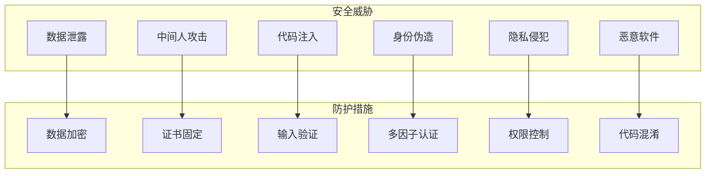

# Flutter 安全实践最佳指南

本文档详细介绍了 Flutter 应用的安全实践、技术和最佳实践，帮助开发者构建安全可靠的移动应用。

## 📋 目录

- [安全概述](#安全概述)
- [数据安全](#数据安全)
- [网络安全](#网络安全)
- [身份认证和授权](#身份认证和授权)
- [代码安全](#代码安全)
- [平台安全](#平台安全)
- [隐私保护](#隐私保护)
- [安全测试](#安全测试)
- [安全监控](#安全监控)
- [合规性要求](#合规性要求)

## 🛡️ 安全概述

### 安全威胁模型



### 安全原则

1. **最小权限原则**：只授予必要的权限
2. **深度防御**：多层安全防护
3. **零信任模型**：不信任任何请求
4. **数据最小化**：只收集必要的数据

## 🔐 数据安全

### 敏感数据存储

#### 1. 使用 flutter_secure_storage

```dart
// lib/services/secure_storage_service.dart
import 'package:flutter_secure_storage/flutter_secure_storage.dart';
import 'package:crypto/crypto.dart';
import 'dart:convert';

class SecureStorageService {
  static const _storage = FlutterSecureStorage(
    aOptions: AndroidOptions(
      encryptedSharedPreferences: true,
      keyCipherAlgorithm: KeyCipherAlgorithm.RSA_ECB_OAEPwithSHA_256andMGF1Padding,
      storageCipherAlgorithm: StorageCipherAlgorithm.AES_GCM_NoPadding,
    ),
    iOptions: IOSOptions(
      accessibility: KeychainAccessibility.first_unlock_this_device,
    ),
  );
  
  // 存储敏感数据
  static Future<void> storeSecureData(String key, String value) async {
    try {
      // 对数据进行额外加密
      final encryptedValue = _encryptData(value);
      await _storage.write(key: key, value: encryptedValue);
    } catch (e) {
      throw SecureStorageException('Failed to store secure data: $e');
    }
  }
  
  // 读取敏感数据
  static Future<String?> getSecureData(String key) async {
    try {
      final encryptedValue = await _storage.read(key: key);
      if (encryptedValue == null) return null;
      
      return _decryptData(encryptedValue);
    } catch (e) {
      throw SecureStorageException('Failed to read secure data: $e');
    }
  }
  
  // 删除敏感数据
  static Future<void> deleteSecureData(String key) async {
    try {
      await _storage.delete(key: key);
    } catch (e) {
      throw SecureStorageException('Failed to delete secure data: $e');
    }
  }
  
  // 清除所有数据
  static Future<void> clearAll() async {
    try {
      await _storage.deleteAll();
    } catch (e) {
      throw SecureStorageException('Failed to clear secure storage: $e');
    }
  }
  
  // 数据加密
  static String _encryptData(String data) {
    final bytes = utf8.encode(data);
    final digest = sha256.convert(bytes);
    return base64.encode(digest.bytes);
  }
  
  // 数据解密
  static String _decryptData(String encryptedData) {
    // 实际应用中应使用更强的加密算法
    final bytes = base64.decode(encryptedData);
    return utf8.decode(bytes);
  }
  
  // 检查存储是否可用
  static Future<bool> isStorageAvailable() async {
    try {
      await _storage.containsKey(key: 'test_key');
      return true;
    } catch (e) {
      return false;
    }
  }
}

class SecureStorageException implements Exception {
  const SecureStorageException(this.message);
  final String message;
  
  @override
  String toString() => 'SecureStorageException: $message';
}

// 使用示例
class AuthTokenManager {
  static const _tokenKey = 'auth_token';
  static const _refreshTokenKey = 'refresh_token';
  
  static Future<void> saveTokens({
    required String accessToken,
    required String refreshToken,
  }) async {
    await Future.wait([
      SecureStorageService.storeSecureData(_tokenKey, accessToken),
      SecureStorageService.storeSecureData(_refreshTokenKey, refreshToken),
    ]);
  }
  
  static Future<String?> getAccessToken() async {
    return SecureStorageService.getSecureData(_tokenKey);
  }
  
  static Future<String?> getRefreshToken() async {
    return SecureStorageService.getSecureData(_refreshTokenKey);
  }
  
  static Future<void> clearTokens() async {
    await Future.wait([
      SecureStorageService.deleteSecureData(_tokenKey),
      SecureStorageService.deleteSecureData(_refreshTokenKey),
    ]);
  }
}
```

#### 2. 数据库加密

```dart
// lib/database/encrypted_database.dart
import 'package:sqflite_sqlcipher/sqflite.dart';
import 'package:path/path.dart';
import 'dart:io';

class EncryptedDatabase {
  static Database? _database;
  static const String _databaseName = 'secure_app.db';
  static const int _databaseVersion = 1;
  
  static Future<Database> get database async {
    _database ??= await _initDatabase();
    return _database!;
  }
  
  static Future<Database> _initDatabase() async {
    final databasesPath = await getDatabasesPath();
    final path = join(databasesPath, _databaseName);
    
    // 生成数据库密码
    final password = await _getDatabasePassword();
    
    return await openDatabase(
      path,
      version: _databaseVersion,
      password: password,
      onCreate: _onCreate,
      onUpgrade: _onUpgrade,
    );
  }
  
  static Future<String> _getDatabasePassword() async {
    // 从安全存储中获取密码，如果不存在则生成新密码
    String? password = await SecureStorageService.getSecureData('db_password');
    
    if (password == null) {
      password = _generateSecurePassword();
      await SecureStorageService.storeSecureData('db_password', password);
    }
    
    return password;
  }
  
  static String _generateSecurePassword() {
    // 生成强密码
    final random = Random.secure();
    final bytes = List<int>.generate(32, (i) => random.nextInt(256));
    return base64.encode(bytes);
  }
  
  static Future<void> _onCreate(Database db, int version) async {
    await db.execute('''
      CREATE TABLE users (
        id INTEGER PRIMARY KEY AUTOINCREMENT,
        email TEXT NOT NULL UNIQUE,
        password_hash TEXT NOT NULL,
        salt TEXT NOT NULL,
        created_at INTEGER NOT NULL,
        updated_at INTEGER NOT NULL
      )
    ''');
    
    await db.execute('''
      CREATE TABLE user_data (
        id INTEGER PRIMARY KEY AUTOINCREMENT,
        user_id INTEGER NOT NULL,
        data_type TEXT NOT NULL,
        encrypted_data TEXT NOT NULL,
        created_at INTEGER NOT NULL,
        FOREIGN KEY (user_id) REFERENCES users (id)
      )
    ''');
  }
  
  static Future<void> _onUpgrade(Database db, int oldVersion, int newVersion) async {
    // 处理数据库升级
    if (oldVersion < 2) {
      // 添加新表或字段
    }
  }
  
  // 安全地插入用户数据
  static Future<int> insertUserData({
    required int userId,
    required String dataType,
    required Map<String, dynamic> data,
  }) async {
    final db = await database;
    
    // 加密数据
    final encryptedData = _encryptUserData(data);
    
    return await db.insert('user_data', {
      'user_id': userId,
      'data_type': dataType,
      'encrypted_data': encryptedData,
      'created_at': DateTime.now().millisecondsSinceEpoch,
    });
  }
  
  // 安全地查询用户数据
  static Future<List<Map<String, dynamic>>> getUserData(int userId) async {
    final db = await database;
    
    final results = await db.query(
      'user_data',
      where: 'user_id = ?',
      whereArgs: [userId],
    );
    
    // 解密数据
    return results.map((row) {
      final encryptedData = row['encrypted_data'] as String;
      final decryptedData = _decryptUserData(encryptedData);
      
      return {
        ...row,
        'data': decryptedData,
      };
    }).toList();
  }
  
  static String _encryptUserData(Map<String, dynamic> data) {
    final jsonString = jsonEncode(data);
    // 使用强加密算法加密数据
    return base64.encode(utf8.encode(jsonString));
  }
  
  static Map<String, dynamic> _decryptUserData(String encryptedData) {
    // 解密数据
    final jsonString = utf8.decode(base64.decode(encryptedData));
    return jsonDecode(jsonString);
  }
  
  static Future<void> close() async {
    if (_database != null) {
      await _database!.close();
      _database = null;
    }
  }
}
```

### 密码安全

```dart
// lib/utils/password_security.dart
import 'package:crypto/crypto.dart';
import 'dart:convert';
import 'dart:math';

class PasswordSecurity {
  // 生成安全的盐值
  static String generateSalt() {
    final random = Random.secure();
    final saltBytes = List<int>.generate(32, (i) => random.nextInt(256));
    return base64.encode(saltBytes);
  }
  
  // 哈希密码
  static String hashPassword(String password, String salt) {
    final bytes = utf8.encode(password + salt);
    final digest = sha256.convert(bytes);
    return digest.toString();
  }
  
  // 验证密码
  static bool verifyPassword(String password, String salt, String hashedPassword) {
    final computedHash = hashPassword(password, salt);
    return computedHash == hashedPassword;
  }
  
  // 密码强度检查
  static PasswordStrength checkPasswordStrength(String password) {
    int score = 0;
    final feedback = <String>[];
    
    // 长度检查
    if (password.length >= 8) {
      score += 1;
    } else {
      feedback.add('密码至少需要8个字符');
    }
    
    // 包含大写字母
    if (password.contains(RegExp(r'[A-Z]'))) {
      score += 1;
    } else {
      feedback.add('密码需要包含大写字母');
    }
    
    // 包含小写字母
    if (password.contains(RegExp(r'[a-z]'))) {
      score += 1;
    } else {
      feedback.add('密码需要包含小写字母');
    }
    
    // 包含数字
    if (password.contains(RegExp(r'[0-9]'))) {
      score += 1;
    } else {
      feedback.add('密码需要包含数字');
    }
    
    // 包含特殊字符
    if (password.contains(RegExp(r'[!@#$%^&*(),.?":{}|<>]'))) {
      score += 1;
    } else {
      feedback.add('密码需要包含特殊字符');
    }
    
    // 检查常见密码
    if (_isCommonPassword(password)) {
      score = 0;
      feedback.add('这是一个常见密码，请选择更安全的密码');
    }
    
    return PasswordStrength(
      score: score,
      level: _getStrengthLevel(score),
      feedback: feedback,
    );
  }
  
  static bool _isCommonPassword(String password) {
    final commonPasswords = [
      'password', '123456', 'password123', 'admin', 'qwerty',
      '12345678', '123456789', 'password1', 'abc123', '111111'
    ];
    
    return commonPasswords.contains(password.toLowerCase());
  }
  
  static PasswordStrengthLevel _getStrengthLevel(int score) {
    switch (score) {
      case 0:
      case 1:
        return PasswordStrengthLevel.weak;
      case 2:
      case 3:
        return PasswordStrengthLevel.medium;
      case 4:
      case 5:
        return PasswordStrengthLevel.strong;
      default:
        return PasswordStrengthLevel.weak;
    }
  }
  
  // 生成安全密码
  static String generateSecurePassword({
    int length = 16,
    bool includeUppercase = true,
    bool includeLowercase = true,
    bool includeNumbers = true,
    bool includeSymbols = true,
  }) {
    const uppercase = 'ABCDEFGHIJKLMNOPQRSTUVWXYZ';
    const lowercase = 'abcdefghijklmnopqrstuvwxyz';
    const numbers = '0123456789';
    const symbols = '!@#\$%^&*()_+-=[]{}|;:,.<>?';
    
    String chars = '';
    if (includeUppercase) chars += uppercase;
    if (includeLowercase) chars += lowercase;
    if (includeNumbers) chars += numbers;
    if (includeSymbols) chars += symbols;
    
    if (chars.isEmpty) {
      throw ArgumentError('At least one character type must be included');
    }
    
    final random = Random.secure();
    return List.generate(
      length,
      (index) => chars[random.nextInt(chars.length)],
    ).join();
  }
}

class PasswordStrength {
  const PasswordStrength({
    required this.score,
    required this.level,
    required this.feedback,
  });
  
  final int score;
  final PasswordStrengthLevel level;
  final List<String> feedback;
  
  bool get isStrong => level == PasswordStrengthLevel.strong;
  bool get isMedium => level == PasswordStrengthLevel.medium;
  bool get isWeak => level == PasswordStrengthLevel.weak;
}

enum PasswordStrengthLevel {
  weak,
  medium,
  strong,
}
```

## 🌐 网络安全

### HTTPS 和证书固定

```dart
// lib/network/secure_http_client.dart
import 'package:dio/dio.dart';
import 'package:dio_certificate_pinning/dio_certificate_pinning.dart';
import 'dart:io';

class SecureHttpClient {
  static Dio? _dio;
  
  static Dio get instance {
    _dio ??= _createSecureClient();
    return _dio!;
  }
  
  static Dio _createSecureClient() {
    final dio = Dio(BaseOptions(
      connectTimeout: const Duration(seconds: 10),
      receiveTimeout: const Duration(seconds: 30),
      sendTimeout: const Duration(seconds: 30),
      // 强制使用 HTTPS
      baseUrl: 'https://api.example.com',
      headers: {
        'Content-Type': 'application/json',
        'Accept': 'application/json',
      },
    ));
    
    // 添加证书固定
    dio.interceptors.add(
      CertificatePinningInterceptor(
        allowedSHAFingerprints: [
          // 添加服务器证书的 SHA 指纹
          'SHA256:AAAAAAAAAAAAAAAAAAAAAAAAAAAAAAAAAAAAAAAAAAA=',
          'SHA256:BBBBBBBBBBBBBBBBBBBBBBBBBBBBBBBBBBBBBBBBBBB=',
        ],
      ),
    );
    
    // 添加安全拦截器
    dio.interceptors.addAll([
      SecurityInterceptor(),
      AuthInterceptor(),
      LoggingInterceptor(),
    ]);
    
    return dio;
  }
  
  // 自定义 HttpClient 配置
  static HttpClient createSecureHttpClient() {
    final client = HttpClient();
    
    // 禁用不安全的协议
    client.badCertificateCallback = (cert, host, port) {
      // 在生产环境中应该验证证书
      return false;
    };
    
    // 设置安全上下文
    client.connectionFactory = (uri, proxyHost, proxyPort) {
      return SecureSocket.connect(
        uri.host,
        uri.port,
        context: SecurityContext.defaultContext,
      );
    };
    
    return client;
  }
}

// 安全拦截器
class SecurityInterceptor extends Interceptor {
  @override
  void onRequest(RequestOptions options, RequestInterceptorHandler handler) {
    // 确保使用 HTTPS
    if (!options.uri.scheme.startsWith('https')) {
      handler.reject(
        DioException(
          requestOptions: options,
          error: 'Only HTTPS requests are allowed',
          type: DioExceptionType.badResponse,
        ),
      );
      return;
    }
    
    // 添加安全头
    options.headers.addAll({
      'X-Requested-With': 'XMLHttpRequest',
      'Cache-Control': 'no-cache',
      'Pragma': 'no-cache',
    });
    
    handler.next(options);
  }
  
  @override
  void onResponse(Response response, ResponseInterceptorHandler handler) {
    // 检查响应安全头
    final headers = response.headers;
    
    if (!headers.map.containsKey('strict-transport-security')) {
      print('Warning: Missing HSTS header');
    }
    
    if (!headers.map.containsKey('x-content-type-options')) {
      print('Warning: Missing X-Content-Type-Options header');
    }
    
    handler.next(response);
  }
  
  @override
  void onError(DioException err, ErrorInterceptorHandler handler) {
    // 记录安全相关错误
    if (err.type == DioExceptionType.badCertificate) {
      print('Certificate validation failed: ${err.message}');
    }
    
    handler.next(err);
  }
}

// 认证拦截器
class AuthInterceptor extends Interceptor {
  @override
  void onRequest(RequestOptions options, RequestInterceptorHandler handler) async {
    // 添加认证令牌
    final token = await AuthTokenManager.getAccessToken();
    if (token != null) {
      options.headers['Authorization'] = 'Bearer $token';
    }
    
    handler.next(options);
  }
  
  @override
  void onError(DioException err, ErrorInterceptorHandler handler) async {
    // 处理认证错误
    if (err.response?.statusCode == 401) {
      // 尝试刷新令牌
      final refreshed = await _refreshToken();
      if (refreshed) {
        // 重试原始请求
        final response = await SecureHttpClient.instance.fetch(err.requestOptions);
        handler.resolve(response);
        return;
      } else {
        // 清除令牌并重定向到登录页面
        await AuthTokenManager.clearTokens();
      }
    }
    
    handler.next(err);
  }
  
  Future<bool> _refreshToken() async {
    try {
      final refreshToken = await AuthTokenManager.getRefreshToken();
      if (refreshToken == null) return false;
      
      final response = await SecureHttpClient.instance.post(
        '/auth/refresh',
        data: {'refresh_token': refreshToken},
      );
      
      final newAccessToken = response.data['access_token'];
      final newRefreshToken = response.data['refresh_token'];
      
      await AuthTokenManager.saveTokens(
        accessToken: newAccessToken,
        refreshToken: newRefreshToken,
      );
      
      return true;
    } catch (e) {
      return false;
    }
  }
}
```

### API 安全

```dart
// lib/services/secure_api_service.dart
class SecureApiService {
  final Dio _dio = SecureHttpClient.instance;
  
  // 安全的 API 调用
  Future<ApiResponse<T>> secureRequest<T>(
    String method,
    String path, {
    Map<String, dynamic>? data,
    Map<String, dynamic>? queryParameters,
    T Function(Map<String, dynamic>)? fromJson,
  }) async {
    try {
      // 输入验证
      _validateInput(data);
      
      // 添加请求签名
      final signedData = await _signRequest(data);
      
      final response = await _dio.request(
        path,
        data: signedData,
        queryParameters: queryParameters,
        options: Options(method: method),
      );
      
      // 验证响应签名
      if (!await _verifyResponse(response)) {
        throw SecurityException('Response signature verification failed');
      }
      
      final result = fromJson != null
          ? fromJson(response.data)
          : response.data as T;
      
      return ApiResponse.success(result);
    } on DioException catch (e) {
      return ApiResponse.error(_handleDioError(e));
    } catch (e) {
      return ApiResponse.error('Unexpected error: $e');
    }
  }
  
  // 输入验证
  void _validateInput(Map<String, dynamic>? data) {
    if (data == null) return;
    
    for (final entry in data.entries) {
      final value = entry.value;
      
      // 检查 SQL 注入
      if (value is String && _containsSqlInjection(value)) {
        throw SecurityException('Potential SQL injection detected');
      }
      
      // 检查 XSS
      if (value is String && _containsXss(value)) {
        throw SecurityException('Potential XSS attack detected');
      }
      
      // 检查过长的输入
      if (value is String && value.length > 10000) {
        throw SecurityException('Input too long');
      }
    }
  }
  
  bool _containsSqlInjection(String input) {
    final sqlPatterns = [
      r"'.*OR.*'.*='.*'",
      r"'.*UNION.*SELECT",
      r"'.*DROP.*TABLE",
      r"'.*INSERT.*INTO",
      r"'.*DELETE.*FROM",
    ];
    
    for (final pattern in sqlPatterns) {
      if (RegExp(pattern, caseSensitive: false).hasMatch(input)) {
        return true;
      }
    }
    
    return false;
  }
  
  bool _containsXss(String input) {
    final xssPatterns = [
      r'<script.*?>.*?</script>',
      r'javascript:',
      r'on\w+\s*=',
      r'<iframe.*?>',
    ];
    
    for (final pattern in xssPatterns) {
      if (RegExp(pattern, caseSensitive: false).hasMatch(input)) {
        return true;
      }
    }
    
    return false;
  }
  
  // 请求签名
  Future<Map<String, dynamic>> _signRequest(Map<String, dynamic>? data) async {
    if (data == null) return {};
    
    final timestamp = DateTime.now().millisecondsSinceEpoch.toString();
    final nonce = _generateNonce();
    
    final signedData = {
      ...data,
      'timestamp': timestamp,
      'nonce': nonce,
    };
    
    final signature = await _generateSignature(signedData);
    signedData['signature'] = signature;
    
    return signedData;
  }
  
  String _generateNonce() {
    final random = Random.secure();
    final bytes = List<int>.generate(16, (i) => random.nextInt(256));
    return base64.encode(bytes);
  }
  
  Future<String> _generateSignature(Map<String, dynamic> data) async {
    // 获取签名密钥
    final secretKey = await SecureStorageService.getSecureData('api_secret');
    if (secretKey == null) {
      throw SecurityException('API secret key not found');
    }
    
    // 创建签名字符串
    final sortedKeys = data.keys.toList()..sort();
    final signatureString = sortedKeys
        .map((key) => '$key=${data[key]}')
        .join('&');
    
    // 生成 HMAC 签名
    final key = utf8.encode(secretKey);
    final bytes = utf8.encode(signatureString);
    final hmac = Hmac(sha256, key);
    final digest = hmac.convert(bytes);
    
    return base64.encode(digest.bytes);
  }
  
  // 响应验证
  Future<bool> _verifyResponse(Response response) async {
    final signature = response.headers.value('X-Response-Signature');
    if (signature == null) return false;
    
    // 验证响应签名
    final expectedSignature = await _generateResponseSignature(response.data);
    return signature == expectedSignature;
  }
  
  Future<String> _generateResponseSignature(dynamic data) async {
    final secretKey = await SecureStorageService.getSecureData('api_secret');
    if (secretKey == null) return '';
    
    final dataString = jsonEncode(data);
    final key = utf8.encode(secretKey);
    final bytes = utf8.encode(dataString);
    final hmac = Hmac(sha256, key);
    final digest = hmac.convert(bytes);
    
    return base64.encode(digest.bytes);
  }
  
  String _handleDioError(DioException error) {
    switch (error.type) {
      case DioExceptionType.connectionTimeout:
        return 'Connection timeout';
      case DioExceptionType.sendTimeout:
        return 'Send timeout';
      case DioExceptionType.receiveTimeout:
        return 'Receive timeout';
      case DioExceptionType.badCertificate:
        return 'Certificate error';
      case DioExceptionType.badResponse:
        return 'Server error: ${error.response?.statusCode}';
      case DioExceptionType.cancel:
        return 'Request cancelled';
      case DioExceptionType.connectionError:
        return 'Connection error';
      case DioExceptionType.unknown:
      default:
        return 'Unknown error';
    }
  }
}

class ApiResponse<T> {
  const ApiResponse.success(this.data) : error = null;
  const ApiResponse.error(this.error) : data = null;
  
  final T? data;
  final String? error;
  
  bool get isSuccess => error == null;
  bool get isError => error != null;
}

class SecurityException implements Exception {
  const SecurityException(this.message);
  final String message;
  
  @override
  String toString() => 'SecurityException: $message';
}
```

## 🔑 身份认证和授权

### 多因子认证

```dart
// lib/services/mfa_service.dart
import 'package:otp/otp.dart';
import 'package:local_auth/local_auth.dart';

class MfaService {
  static final LocalAuthentication _localAuth = LocalAuthentication();
  
  // 生成 TOTP 密钥
  static String generateTotpSecret() {
    final random = Random.secure();
    final bytes = List<int>.generate(20, (i) => random.nextInt(256));
    return base32.encode(bytes);
  }
  
  // 生成 TOTP 代码
  static String generateTotpCode(String secret) {
    final time = DateTime.now().millisecondsSinceEpoch ~/ 1000;
    return OTP.generateTOTPCodeString(
      secret,
      time,
      length: 6,
      interval: 30,
      algorithm: Algorithm.SHA1,
    );
  }
  
  // 验证 TOTP 代码
  static bool verifyTotpCode(String secret, String code) {
    final time = DateTime.now().millisecondsSinceEpoch ~/ 1000;
    
    // 允许前后30秒的时间窗口
    for (int i = -1; i <= 1; i++) {
      final testTime = time + (i * 30);
      final expectedCode = OTP.generateTOTPCodeString(
        secret,
        testTime,
        length: 6,
        interval: 30,
        algorithm: Algorithm.SHA1,
      );
      
      if (expectedCode == code) {
        return true;
      }
    }
    
    return false;
  }
  
  // 生成备用代码
  static List<String> generateBackupCodes() {
    final random = Random.secure();
    return List.generate(10, (index) {
      final code = List.generate(8, (i) => random.nextInt(10)).join();
      return '${code.substring(0, 4)}-${code.substring(4)}';
    });
  }
  
  // 生成 QR 码 URI
  static String generateQrCodeUri({
    required String secret,
    required String accountName,
    required String issuer,
  }) {
    final encodedAccount = Uri.encodeComponent(accountName);
    final encodedIssuer = Uri.encodeComponent(issuer);
    
    return 'otpauth://totp/$encodedIssuer:$encodedAccount'
           '?secret=$secret'
           '&issuer=$encodedIssuer'
           '&algorithm=SHA1'
           '&digits=6'
           '&period=30';
  }
  
  // 生物识别认证
  static Future<BiometricAuthResult> authenticateWithBiometrics() async {
    try {
      // 检查设备是否支持生物识别
      final isAvailable = await _localAuth.canCheckBiometrics;
      if (!isAvailable) {
        return BiometricAuthResult.notAvailable;
      }
      
      // 获取可用的生物识别类型
      final availableBiometrics = await _localAuth.getAvailableBiometrics();
      if (availableBiometrics.isEmpty) {
        return BiometricAuthResult.notEnrolled;
      }
      
      // 执行生物识别认证
      final isAuthenticated = await _localAuth.authenticate(
        localizedReason: '请验证您的身份以继续',
        options: const AuthenticationOptions(
          biometricOnly: true,
          stickyAuth: true,
        ),
      );
      
      return isAuthenticated
          ? BiometricAuthResult.success
          : BiometricAuthResult.failed;
    } catch (e) {
      return BiometricAuthResult.error;
    }
  }
  
  // 设备认证（PIN/密码/图案）
  static Future<bool> authenticateWithDevice() async {
    try {
      return await _localAuth.authenticate(
        localizedReason: '请验证您的设备密码',
        options: const AuthenticationOptions(
          biometricOnly: false,
          stickyAuth: true,
        ),
      );
    } catch (e) {
      return false;
    }
  }
  
  // 多因子认证流程
  static Future<MfaResult> performMfaAuthentication({
    required String username,
    required String password,
    String? totpCode,
    bool useBiometrics = false,
  }) async {
    try {
      // 第一步：用户名密码认证
      final primaryAuth = await _authenticateWithPassword(username, password);
      if (!primaryAuth.isSuccess) {
        return MfaResult.failed('Invalid username or password');
      }
      
      // 第二步：TOTP 认证
      if (totpCode != null) {
        final totpSecret = await SecureStorageService.getSecureData('totp_secret');
        if (totpSecret == null || !verifyTotpCode(totpSecret, totpCode)) {
          return MfaResult.failed('Invalid TOTP code');
        }
      }
      
      // 第三步：生物识别认证（可选）
      if (useBiometrics) {
        final biometricResult = await authenticateWithBiometrics();
        if (biometricResult != BiometricAuthResult.success) {
          return MfaResult.failed('Biometric authentication failed');
        }
      }
      
      return MfaResult.success(primaryAuth.token!);
    } catch (e) {
      return MfaResult.failed('Authentication error: $e');
    }
  }
  
  static Future<AuthResult> _authenticateWithPassword(
    String username,
    String password,
  ) async {
    // 实现密码认证逻辑
    // 这里应该调用后端 API
    return AuthResult.success('mock_token');
  }
}

enum BiometricAuthResult {
  success,
  failed,
  notAvailable,
  notEnrolled,
  error,
}

class MfaResult {
  const MfaResult.success(this.token) : error = null;
  const MfaResult.failed(this.error) : token = null;
  
  final String? token;
  final String? error;
  
  bool get isSuccess => error == null;
}

class AuthResult {
  const AuthResult.success(this.token) : error = null;
  const AuthResult.failed(this.error) : token = null;
  
  final String? token;
  final String? error;
  
  bool get isSuccess => error == null;
}
```

### 权限管理

```dart
// lib/services/permission_service.dart
import 'package:permission_handler/permission_handler.dart';

class PermissionService {
  // 权限映射
  static const Map<AppPermission, Permission> _permissionMap = {
    AppPermission.camera: Permission.camera,
    AppPermission.microphone: Permission.microphone,
    AppPermission.location: Permission.location,
    AppPermission.storage: Permission.storage,
    AppPermission.contacts: Permission.contacts,
    AppPermission.photos: Permission.photos,
    AppPermission.notification: Permission.notification,
  };
  
  // 检查权限状态
  static Future<PermissionStatus> checkPermission(AppPermission permission) async {
    final systemPermission = _permissionMap[permission];
    if (systemPermission == null) {
      throw ArgumentError('Unknown permission: $permission');
    }
    
    return await systemPermission.status;
  }
  
  // 请求权限
  static Future<PermissionRequestResult> requestPermission(
    AppPermission permission, {
    String? rationale,
  }) async {
    try {
      // 检查当前状态
      final currentStatus = await checkPermission(permission);
      
      if (currentStatus.isGranted) {
        return PermissionRequestResult.granted;
      }
      
      // 如果需要显示说明
      if (currentStatus.isDenied && rationale != null) {
        final shouldRequest = await _showPermissionRationale(
          permission,
          rationale,
        );
        
        if (!shouldRequest) {
          return PermissionRequestResult.denied;
        }
      }
      
      // 请求权限
      final systemPermission = _permissionMap[permission]!;
      final result = await systemPermission.request();
      
      return _mapPermissionStatus(result);
    } catch (e) {
      return PermissionRequestResult.error;
    }
  }
  
  // 批量请求权限
  static Future<Map<AppPermission, PermissionRequestResult>> requestMultiplePermissions(
    List<AppPermission> permissions,
  ) async {
    final results = <AppPermission, PermissionRequestResult>{};
    
    for (final permission in permissions) {
      results[permission] = await requestPermission(permission);
    }
    
    return results;
  }
  
  // 打开应用设置
  static Future<bool> openAppSettings() async {
    return await openAppSettings();
  }
  
  // 检查是否需要显示权限说明
  static Future<bool> shouldShowRequestPermissionRationale(
    AppPermission permission,
  ) async {
    final systemPermission = _permissionMap[permission]!;
    return await systemPermission.shouldShowRequestRationale;
  }
  
  // 显示权限说明对话框
  static Future<bool> _showPermissionRationale(
    AppPermission permission,
    String rationale,
  ) async {
    // 这里应该显示一个对话框解释为什么需要这个权限
    // 返回用户是否同意继续请求权限
    return true; // 简化实现
  }
  
  static PermissionRequestResult _mapPermissionStatus(PermissionStatus status) {
    switch (status) {
      case PermissionStatus.granted:
        return PermissionRequestResult.granted;
      case PermissionStatus.denied:
        return PermissionRequestResult.denied;
      case PermissionStatus.permanentlyDenied:
        return PermissionRequestResult.permanentlyDenied;
      case PermissionStatus.restricted:
        return PermissionRequestResult.restricted;
      case PermissionStatus.limited:
        return PermissionRequestResult.limited;
      case PermissionStatus.provisional:
        return PermissionRequestResult.provisional;
    }
  }
  
  // 权限检查装饰器
  static Future<T?> withPermission<T>(
    AppPermission permission,
    Future<T> Function() action, {
    String? rationale,
  }) async {
    final result = await requestPermission(permission, rationale: rationale);
    
    if (result == PermissionRequestResult.granted) {
      return await action();
    } else {
      throw PermissionException(
        'Permission $permission is required but not granted',
      );
    }
  }
}

enum AppPermission {
  camera,
  microphone,
  location,
  storage,
  contacts,
  photos,
  notification,
}

enum PermissionRequestResult {
  granted,
  denied,
  permanentlyDenied,
  restricted,
  limited,
  provisional,
  error,
}

class PermissionException implements Exception {
  const PermissionException(this.message);
  final String message;
  
  @override
  String toString() => 'PermissionException: $message';
}
```

## 📚 总结

安全是移动应用开发的重要基石：

### 核心安全原则

1. **数据保护**：加密存储敏感数据
2. **网络安全**：使用 HTTPS 和证书固定
3. **身份验证**：实施多因子认证
4. **权限控制**：最小权限原则

### 最佳实践

1. **安全存储**：使用 flutter_secure_storage
2. **密码安全**：强密码策略和哈希存储
3. **网络保护**：API 签名和输入验证
4. **生物识别**：增强用户体验的同时保证安全

### 推荐工具

- **flutter_secure_storage**：安全存储
- **dio_certificate_pinning**：证书固定
- **local_auth**：生物识别认证
- **permission_handler**：权限管理

通过系统性的安全实践，可以构建安全可靠的 Flutter 应用程序。