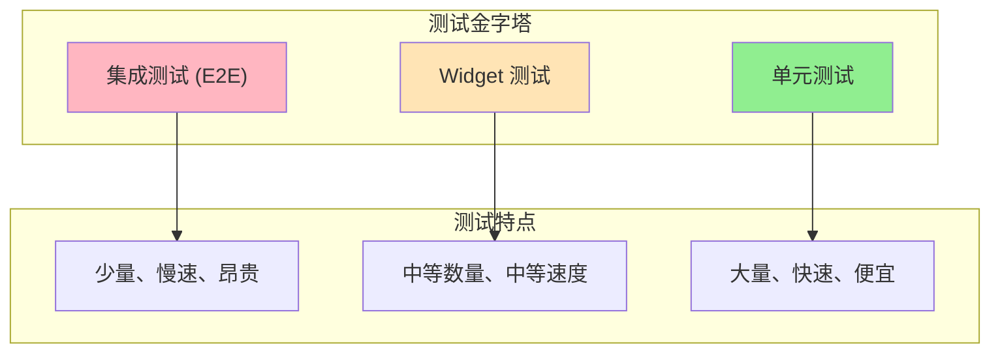

# Flutter 测试策略最佳实践

本文档详细介绍了 Flutter 应用的测试策略、技术和最佳实践，帮助开发者构建可靠、稳定的应用程序。

## 📋 目录

- [测试策略概述](#测试策略概述)
- [单元测试](#单元测试)
- [Widget 测试](#widget-测试)
- [集成测试](#集成测试)
- [测试驱动开发](#测试驱动开发)
- [测试工具和框架](#测试工具和框架)
- [Mock 和 Stub](#mock-和-stub)
- [测试覆盖率](#测试覆盖率)
- [持续集成测试](#持续集成测试)
- [性能测试](#性能测试)

## 🎯 测试策略概述

### 测试金字塔



### 测试策略原则

1. **快速反馈**：测试应该快速执行
2. **可靠性**：测试结果应该一致
3. **可维护性**：测试代码应该易于维护
4. **覆盖率**：关键功能应该有测试覆盖

## 🔧 单元测试

### 基础单元测试

#### 1. 业务逻辑测试

```dart
// lib/models/user.dart
class User {
  const User({
    required this.id,
    required this.name,
    required this.email,
    required this.age,
  });
  
  final String id;
  final String name;
  final String email;
  final int age;
  
  bool get isAdult => age >= 18;
  
  bool get hasValidEmail {
    final emailRegex = RegExp(r'^[\w-\.]+@([\w-]+\.)+[\w-]{2,4}$');
    return emailRegex.hasMatch(email);
  }
  
  User copyWith({
    String? id,
    String? name,
    String? email,
    int? age,
  }) {
    return User(
      id: id ?? this.id,
      name: name ?? this.name,
      email: email ?? this.email,
      age: age ?? this.age,
    );
  }
  
  @override
  bool operator ==(Object other) {
    if (identical(this, other)) return true;
    return other is User &&
        other.id == id &&
        other.name == name &&
        other.email == email &&
        other.age == age;
  }
  
  @override
  int get hashCode => Object.hash(id, name, email, age);
}

// test/models/user_test.dart
import 'package:flutter_test/flutter_test.dart';
import 'package:myapp/models/user.dart';

void main() {
  group('User Model Tests', () {
    late User testUser;
    
    setUp(() {
      testUser = const User(
        id: '1',
        name: 'John Doe',
        email: 'john@example.com',
        age: 25,
      );
    });
    
    group('isAdult getter', () {
      test('should return true for age >= 18', () {
        expect(testUser.isAdult, isTrue);
      });
      
      test('should return false for age < 18', () {
        final minorUser = testUser.copyWith(age: 17);
        expect(minorUser.isAdult, isFalse);
      });
      
      test('should return true for exactly 18', () {
        final adultUser = testUser.copyWith(age: 18);
        expect(adultUser.isAdult, isTrue);
      });
    });
    
    group('hasValidEmail getter', () {
      test('should return true for valid email', () {
        expect(testUser.hasValidEmail, isTrue);
      });
      
      test('should return false for invalid email formats', () {
        final invalidEmails = [
          'invalid-email',
          '@example.com',
          'user@',
          'user@.com',
          'user@domain',
        ];
        
        for (final email in invalidEmails) {
          final userWithInvalidEmail = testUser.copyWith(email: email);
          expect(
            userWithInvalidEmail.hasValidEmail,
            isFalse,
            reason: 'Email "$email" should be invalid',
          );
        }
      });
      
      test('should return true for various valid email formats', () {
        final validEmails = [
          'user@example.com',
          'user.name@example.com',
          'user+tag@example.co.uk',
          'user123@test-domain.org',
        ];
        
        for (final email in validEmails) {
          final userWithValidEmail = testUser.copyWith(email: email);
          expect(
            userWithValidEmail.hasValidEmail,
            isTrue,
            reason: 'Email "$email" should be valid',
          );
        }
      });
    });
    
    group('copyWith method', () {
      test('should create new instance with updated values', () {
        final updatedUser = testUser.copyWith(
          name: 'Jane Doe',
          age: 30,
        );
        
        expect(updatedUser.id, equals(testUser.id));
        expect(updatedUser.name, equals('Jane Doe'));
        expect(updatedUser.email, equals(testUser.email));
        expect(updatedUser.age, equals(30));
      });
      
      test('should keep original values when no parameters provided', () {
        final copiedUser = testUser.copyWith();
        expect(copiedUser, equals(testUser));
      });
    });
    
    group('equality and hashCode', () {
      test('should be equal for same values', () {
        final anotherUser = const User(
          id: '1',
          name: 'John Doe',
          email: 'john@example.com',
          age: 25,
        );
        
        expect(testUser, equals(anotherUser));
        expect(testUser.hashCode, equals(anotherUser.hashCode));
      });
      
      test('should not be equal for different values', () {
        final differentUser = testUser.copyWith(name: 'Jane Doe');
        expect(testUser, isNot(equals(differentUser)));
      });
    });
  });
}
```

#### 2. 服务类测试

```dart
// lib/services/user_service.dart
class UserService {
  UserService(this._apiClient);
  
  final ApiClient _apiClient;
  
  Future<List<User>> getUsers() async {
    try {
      final response = await _apiClient.get('/users');
      final List<dynamic> data = response.data;
      return data.map((json) => User.fromJson(json)).toList();
    } catch (e) {
      throw UserServiceException('Failed to fetch users: $e');
    }
  }
  
  Future<User> getUserById(String id) async {
    if (id.isEmpty) {
      throw ArgumentError('User ID cannot be empty');
    }
    
    try {
      final response = await _apiClient.get('/users/$id');
      return User.fromJson(response.data);
    } catch (e) {
      if (e is ApiException && e.statusCode == 404) {
        throw UserNotFoundException('User with ID $id not found');
      }
      throw UserServiceException('Failed to fetch user: $e');
    }
  }
  
  Future<User> createUser(CreateUserRequest request) async {
    if (!request.isValid) {
      throw ArgumentError('Invalid user data');
    }
    
    try {
      final response = await _apiClient.post('/users', data: request.toJson());
      return User.fromJson(response.data);
    } catch (e) {
      throw UserServiceException('Failed to create user: $e');
    }
  }
}

class UserServiceException implements Exception {
  const UserServiceException(this.message);
  final String message;
  
  @override
  String toString() => 'UserServiceException: $message';
}

class UserNotFoundException extends UserServiceException {
  const UserNotFoundException(super.message);
}

// test/services/user_service_test.dart
import 'package:flutter_test/flutter_test.dart';
import 'package:mockito/mockito.dart';
import 'package:mockito/annotations.dart';
import 'package:myapp/services/user_service.dart';
import 'package:myapp/models/user.dart';
import 'package:myapp/api/api_client.dart';

// 生成 Mock 类
@GenerateMocks([ApiClient])
import 'user_service_test.mocks.dart';

void main() {
  group('UserService Tests', () {
    late UserService userService;
    late MockApiClient mockApiClient;
    
    setUp(() {
      mockApiClient = MockApiClient();
      userService = UserService(mockApiClient);
    });
    
    group('getUsers', () {
      test('should return list of users on successful API call', () async {
        // Arrange
        final mockResponse = ApiResponse(
          data: [
            {'id': '1', 'name': 'John', 'email': 'john@example.com', 'age': 25},
            {'id': '2', 'name': 'Jane', 'email': 'jane@example.com', 'age': 30},
          ],
        );
        
        when(mockApiClient.get('/users'))
            .thenAnswer((_) async => mockResponse);
        
        // Act
        final result = await userService.getUsers();
        
        // Assert
        expect(result, hasLength(2));
        expect(result[0].name, equals('John'));
        expect(result[1].name, equals('Jane'));
        verify(mockApiClient.get('/users')).called(1);
      });
      
      test('should throw UserServiceException on API error', () async {
        // Arrange
        when(mockApiClient.get('/users'))
            .thenThrow(ApiException('Network error'));
        
        // Act & Assert
        expect(
          () => userService.getUsers(),
          throwsA(isA<UserServiceException>()),
        );
      });
    });
    
    group('getUserById', () {
      test('should return user for valid ID', () async {
        // Arrange
        const userId = '1';
        final mockResponse = ApiResponse(
          data: {'id': '1', 'name': 'John', 'email': 'john@example.com', 'age': 25},
        );
        
        when(mockApiClient.get('/users/$userId'))
            .thenAnswer((_) async => mockResponse);
        
        // Act
        final result = await userService.getUserById(userId);
        
        // Assert
        expect(result.id, equals(userId));
        expect(result.name, equals('John'));
      });
      
      test('should throw ArgumentError for empty ID', () async {
        // Act & Assert
        expect(
          () => userService.getUserById(''),
          throwsArgumentError,
        );
      });
      
      test('should throw UserNotFoundException for 404 error', () async {
        // Arrange
        const userId = 'nonexistent';
        when(mockApiClient.get('/users/$userId'))
            .thenThrow(ApiException('Not found', statusCode: 404));
        
        // Act & Assert
        expect(
          () => userService.getUserById(userId),
          throwsA(isA<UserNotFoundException>()),
        );
      });
    });
    
    group('createUser', () {
      test('should create user with valid request', () async {
        // Arrange
        final request = CreateUserRequest(
          name: 'New User',
          email: 'new@example.com',
          age: 25,
        );
        
        final mockResponse = ApiResponse(
          data: {
            'id': '3',
            'name': 'New User',
            'email': 'new@example.com',
            'age': 25,
          },
        );
        
        when(mockApiClient.post('/users', data: request.toJson()))
            .thenAnswer((_) async => mockResponse);
        
        // Act
        final result = await userService.createUser(request);
        
        // Assert
        expect(result.id, equals('3'));
        expect(result.name, equals('New User'));
        verify(mockApiClient.post('/users', data: request.toJson())).called(1);
      });
      
      test('should throw ArgumentError for invalid request', () async {
        // Arrange
        final invalidRequest = CreateUserRequest(
          name: '', // Invalid: empty name
          email: 'invalid-email',
          age: -1,
        );
        
        // Act & Assert
        expect(
          () => userService.createUser(invalidRequest),
          throwsArgumentError,
        );
      });
    });
  });
}
```

### 异步测试

```dart
// test/async_test_examples.dart
import 'package:flutter_test/flutter_test.dart';

void main() {
  group('Async Testing Examples', () {
    test('should handle Future completion', () async {
      // 测试异步函数
      final result = await fetchData();
      expect(result, isNotNull);
    });
    
    test('should handle Stream events', () async {
      // 测试 Stream
      final stream = countStream(3);
      final events = await stream.toList();
      expect(events, equals([0, 1, 2]));
    });
    
    test('should handle Stream with expectAsync', () {
      // 使用 expectAsync 测试 Stream
      final stream = countStream(3);
      final expectedValues = [0, 1, 2];
      int index = 0;
      
      stream.listen(
        expectAsync1((value) {
          expect(value, equals(expectedValues[index]));
          index++;
        }, count: 3),
      );
    });
    
    test('should handle timeout', () async {
      // 测试超时
      expect(
        () => slowFunction(),
        throwsA(isA<TimeoutException>()),
      );
    }, timeout: const Timeout(Duration(seconds: 5)));
    
    test('should handle multiple async operations', () async {
      // 测试多个异步操作
      final futures = [
        fetchData(),
        fetchData(),
        fetchData(),
      ];
      
      final results = await Future.wait(futures);
      expect(results, hasLength(3));
      expect(results.every((r) => r != null), isTrue);
    });
  });
}

Future<String> fetchData() async {
  await Future.delayed(const Duration(milliseconds: 100));
  return 'data';
}

Stream<int> countStream(int max) async* {
  for (int i = 0; i < max; i++) {
    await Future.delayed(const Duration(milliseconds: 10));
    yield i;
  }
}

Future<String> slowFunction() async {
  await Future.delayed(const Duration(seconds: 10));
  return 'slow result';
}
```

## 🎨 Widget 测试

### 基础 Widget 测试

```dart
// lib/widgets/counter_widget.dart
class CounterWidget extends StatefulWidget {
  const CounterWidget({
    super.key,
    this.initialValue = 0,
    this.onChanged,
  });
  
  final int initialValue;
  final ValueChanged<int>? onChanged;
  
  @override
  State<CounterWidget> createState() => _CounterWidgetState();
}

class _CounterWidgetState extends State<CounterWidget> {
  late int _counter;
  
  @override
  void initState() {
    super.initState();
    _counter = widget.initialValue;
  }
  
  void _increment() {
    setState(() {
      _counter++;
    });
    widget.onChanged?.call(_counter);
  }
  
  void _decrement() {
    setState(() {
      _counter--;
    });
    widget.onChanged?.call(_counter);
  }
  
  @override
  Widget build(BuildContext context) {
    return Column(
      mainAxisAlignment: MainAxisAlignment.center,
      children: [
        Text(
          'Counter: $_counter',
          key: const Key('counter_text'),
          style: Theme.of(context).textTheme.headlineMedium,
        ),
        const SizedBox(height: 20),
        Row(
          mainAxisAlignment: MainAxisAlignment.center,
          children: [
            ElevatedButton(
              key: const Key('decrement_button'),
              onPressed: _decrement,
              child: const Icon(Icons.remove),
            ),
            const SizedBox(width: 20),
            ElevatedButton(
              key: const Key('increment_button'),
              onPressed: _increment,
              child: const Icon(Icons.add),
            ),
          ],
        ),
      ],
    );
  }
}

// test/widgets/counter_widget_test.dart
import 'package:flutter/material.dart';
import 'package:flutter_test/flutter_test.dart';
import 'package:myapp/widgets/counter_widget.dart';

void main() {
  group('CounterWidget Tests', () {
    testWidgets('should display initial counter value', (tester) async {
      // Arrange
      const initialValue = 5;
      
      // Act
      await tester.pumpWidget(
        const MaterialApp(
          home: Scaffold(
            body: CounterWidget(initialValue: initialValue),
          ),
        ),
      );
      
      // Assert
      expect(find.text('Counter: $initialValue'), findsOneWidget);
    });
    
    testWidgets('should increment counter when increment button is tapped', (tester) async {
      // Arrange
      await tester.pumpWidget(
        const MaterialApp(
          home: Scaffold(
            body: CounterWidget(),
          ),
        ),
      );
      
      // Act
      await tester.tap(find.byKey(const Key('increment_button')));
      await tester.pump();
      
      // Assert
      expect(find.text('Counter: 1'), findsOneWidget);
    });
    
    testWidgets('should decrement counter when decrement button is tapped', (tester) async {
      // Arrange
      await tester.pumpWidget(
        const MaterialApp(
          home: Scaffold(
            body: CounterWidget(initialValue: 5),
          ),
        ),
      );
      
      // Act
      await tester.tap(find.byKey(const Key('decrement_button')));
      await tester.pump();
      
      // Assert
      expect(find.text('Counter: 4'), findsOneWidget);
    });
    
    testWidgets('should call onChanged callback when counter changes', (tester) async {
      // Arrange
      int? changedValue;
      
      await tester.pumpWidget(
        MaterialApp(
          home: Scaffold(
            body: CounterWidget(
              onChanged: (value) => changedValue = value,
            ),
          ),
        ),
      );
      
      // Act
      await tester.tap(find.byKey(const Key('increment_button')));
      await tester.pump();
      
      // Assert
      expect(changedValue, equals(1));
    });
    
    testWidgets('should handle multiple taps correctly', (tester) async {
      // Arrange
      await tester.pumpWidget(
        const MaterialApp(
          home: Scaffold(
            body: CounterWidget(),
          ),
        ),
      );
      
      // Act
      for (int i = 0; i < 3; i++) {
        await tester.tap(find.byKey(const Key('increment_button')));
        await tester.pump();
      }
      
      // Assert
      expect(find.text('Counter: 3'), findsOneWidget);
    });
    
    testWidgets('should find all expected widgets', (tester) async {
      // Arrange & Act
      await tester.pumpWidget(
        const MaterialApp(
          home: Scaffold(
            body: CounterWidget(),
          ),
        ),
      );
      
      // Assert
      expect(find.byKey(const Key('counter_text')), findsOneWidget);
      expect(find.byKey(const Key('increment_button')), findsOneWidget);
      expect(find.byKey(const Key('decrement_button')), findsOneWidget);
      expect(find.byIcon(Icons.add), findsOneWidget);
      expect(find.byIcon(Icons.remove), findsOneWidget);
    });
  });
}
```

### 复杂 Widget 测试

```dart
// lib/widgets/user_list_widget.dart
class UserListWidget extends StatefulWidget {
  const UserListWidget({
    super.key,
    required this.users,
    this.onUserTap,
    this.onRefresh,
  });
  
  final List<User> users;
  final ValueChanged<User>? onUserTap;
  final VoidCallback? onRefresh;
  
  @override
  State<UserListWidget> createState() => _UserListWidgetState();
}

class _UserListWidgetState extends State<UserListWidget> {
  String _searchQuery = '';
  
  List<User> get _filteredUsers {
    if (_searchQuery.isEmpty) return widget.users;
    
    return widget.users.where((user) {
      return user.name.toLowerCase().contains(_searchQuery.toLowerCase()) ||
             user.email.toLowerCase().contains(_searchQuery.toLowerCase());
    }).toList();
  }
  
  @override
  Widget build(BuildContext context) {
    return Column(
      children: [
        Padding(
          padding: const EdgeInsets.all(16.0),
          child: TextField(
            key: const Key('search_field'),
            decoration: const InputDecoration(
              hintText: 'Search users...',
              prefixIcon: Icon(Icons.search),
            ),
            onChanged: (value) {
              setState(() {
                _searchQuery = value;
              });
            },
          ),
        ),
        Expanded(
          child: _filteredUsers.isEmpty
              ? const Center(
                  key: Key('empty_state'),
                  child: Text('No users found'),
                )
              : RefreshIndicator(
                  key: const Key('refresh_indicator'),
                  onRefresh: () async {
                    widget.onRefresh?.call();
                  },
                  child: ListView.builder(
                    key: const Key('user_list'),
                    itemCount: _filteredUsers.length,
                    itemBuilder: (context, index) {
                      final user = _filteredUsers[index];
                      return UserListItem(
                        key: Key('user_item_${user.id}'),
                        user: user,
                        onTap: () => widget.onUserTap?.call(user),
                      );
                    },
                  ),
                ),
        ),
      ],
    );
  }
}

class UserListItem extends StatelessWidget {
  const UserListItem({
    super.key,
    required this.user,
    this.onTap,
  });
  
  final User user;
  final VoidCallback? onTap;
  
  @override
  Widget build(BuildContext context) {
    return ListTile(
      leading: CircleAvatar(
        child: Text(user.name.substring(0, 1).toUpperCase()),
      ),
      title: Text(user.name),
      subtitle: Text(user.email),
      trailing: user.isAdult
          ? const Icon(Icons.verified_user, color: Colors.green)
          : const Icon(Icons.person, color: Colors.grey),
      onTap: onTap,
    );
  }
}

// test/widgets/user_list_widget_test.dart
import 'package:flutter/material.dart';
import 'package:flutter_test/flutter_test.dart';
import 'package:myapp/widgets/user_list_widget.dart';
import 'package:myapp/models/user.dart';

void main() {
  group('UserListWidget Tests', () {
    late List<User> testUsers;
    
    setUp(() {
      testUsers = [
        const User(id: '1', name: 'John Doe', email: 'john@example.com', age: 25),
        const User(id: '2', name: 'Jane Smith', email: 'jane@example.com', age: 17),
        const User(id: '3', name: 'Bob Johnson', email: 'bob@example.com', age: 30),
      ];
    });
    
    Widget createWidget({
      List<User>? users,
      ValueChanged<User>? onUserTap,
      VoidCallback? onRefresh,
    }) {
      return MaterialApp(
        home: Scaffold(
          body: UserListWidget(
            users: users ?? testUsers,
            onUserTap: onUserTap,
            onRefresh: onRefresh,
          ),
        ),
      );
    }
    
    testWidgets('should display all users', (tester) async {
      // Act
      await tester.pumpWidget(createWidget());
      
      // Assert
      expect(find.text('John Doe'), findsOneWidget);
      expect(find.text('Jane Smith'), findsOneWidget);
      expect(find.text('Bob Johnson'), findsOneWidget);
    });
    
    testWidgets('should display empty state when no users', (tester) async {
      // Act
      await tester.pumpWidget(createWidget(users: []));
      
      // Assert
      expect(find.byKey(const Key('empty_state')), findsOneWidget);
      expect(find.text('No users found'), findsOneWidget);
    });
    
    testWidgets('should filter users based on search query', (tester) async {
      // Arrange
      await tester.pumpWidget(createWidget());
      
      // Act
      await tester.enterText(find.byKey(const Key('search_field')), 'John');
      await tester.pump();
      
      // Assert
      expect(find.text('John Doe'), findsOneWidget);
      expect(find.text('Jane Smith'), findsNothing);
      expect(find.text('Bob Johnson'), findsOneWidget); // Contains 'John'
    });
    
    testWidgets('should filter users by email', (tester) async {
      // Arrange
      await tester.pumpWidget(createWidget());
      
      // Act
      await tester.enterText(find.byKey(const Key('search_field')), 'jane@');
      await tester.pump();
      
      // Assert
      expect(find.text('Jane Smith'), findsOneWidget);
      expect(find.text('John Doe'), findsNothing);
      expect(find.text('Bob Johnson'), findsNothing);
    });
    
    testWidgets('should call onUserTap when user is tapped', (tester) async {
      // Arrange
      User? tappedUser;
      
      await tester.pumpWidget(createWidget(
        onUserTap: (user) => tappedUser = user,
      ));
      
      // Act
      await tester.tap(find.text('John Doe'));
      await tester.pump();
      
      // Assert
      expect(tappedUser, isNotNull);
      expect(tappedUser!.name, equals('John Doe'));
    });
    
    testWidgets('should call onRefresh when pull to refresh', (tester) async {
      // Arrange
      bool refreshCalled = false;
      
      await tester.pumpWidget(createWidget(
        onRefresh: () => refreshCalled = true,
      ));
      
      // Act
      await tester.fling(
        find.byKey(const Key('user_list')),
        const Offset(0, 300),
        1000,
      );
      await tester.pump();
      await tester.pump(const Duration(seconds: 1));
      
      // Assert
      expect(refreshCalled, isTrue);
    });
    
    testWidgets('should display correct icons for adult/minor users', (tester) async {
      // Act
      await tester.pumpWidget(createWidget());
      
      // Assert
      // John (25) and Bob (30) are adults
      expect(find.byIcon(Icons.verified_user), findsNWidgets(2));
      // Jane (17) is a minor
      expect(find.byIcon(Icons.person), findsOneWidget);
    });
    
    testWidgets('should handle search with no results', (tester) async {
      // Arrange
      await tester.pumpWidget(createWidget());
      
      // Act
      await tester.enterText(find.byKey(const Key('search_field')), 'nonexistent');
      await tester.pump();
      
      // Assert
      expect(find.byKey(const Key('empty_state')), findsOneWidget);
      expect(find.text('No users found'), findsOneWidget);
    });
  });
}
```

### Widget 测试工具函数

```dart
// test/helpers/widget_test_helpers.dart
import 'package:flutter/material.dart';
import 'package:flutter_test/flutter_test.dart';
import 'package:provider/provider.dart';

class WidgetTestHelpers {
  /// 创建带有 MaterialApp 的测试 Widget
  static Widget createMaterialApp({
    required Widget child,
    ThemeData? theme,
    Locale? locale,
  }) {
    return MaterialApp(
      theme: theme,
      locale: locale,
      home: Scaffold(body: child),
    );
  }
  
  /// 创建带有 Provider 的测试 Widget
  static Widget createProviderApp<T>({
    required Widget child,
    required T value,
  }) {
    return Provider<T>.value(
      value: value,
      child: createMaterialApp(child: child),
    );
  }
  
  /// 创建带有多个 Provider 的测试 Widget
  static Widget createMultiProviderApp({
    required Widget child,
    required List<Provider> providers,
  }) {
    return MultiProvider(
      providers: providers,
      child: createMaterialApp(child: child),
    );
  }
  
  /// 等待动画完成
  static Future<void> pumpAndSettle(
    WidgetTester tester, {
    Duration timeout = const Duration(seconds: 10),
  }) async {
    await tester.pumpAndSettle(timeout);
  }
  
  /// 输入文本并触发变化
  static Future<void> enterTextAndPump(
    WidgetTester tester,
    Finder finder,
    String text,
  ) async {
    await tester.enterText(finder, text);
    await tester.pump();
  }
  
  /// 点击并等待动画
  static Future<void> tapAndSettle(
    WidgetTester tester,
    Finder finder,
  ) async {
    await tester.tap(finder);
    await tester.pumpAndSettle();
  }
  
  /// 滚动到指定 Widget
  static Future<void> scrollToWidget(
    WidgetTester tester,
    Finder scrollable,
    Finder target,
  ) async {
    await tester.scrollUntilVisible(
      target,
      500.0,
      scrollable: scrollable,
    );
  }
  
  /// 验证 Widget 是否可见
  static void expectVisible(Finder finder) {
    expect(finder, findsOneWidget);
  }
  
  /// 验证 Widget 是否不可见
  static void expectNotVisible(Finder finder) {
    expect(finder, findsNothing);
  }
  
  /// 验证文本内容
  static void expectText(String text) {
    expect(find.text(text), findsOneWidget);
  }
  
  /// 验证多个文本内容
  static void expectTexts(List<String> texts) {
    for (final text in texts) {
      expectText(text);
    }
  }
}

// 使用示例
void main() {
  group('Widget Test Helpers Example', () {
    testWidgets('should use helper functions', (tester) async {
      // 使用辅助函数创建测试 Widget
      await tester.pumpWidget(
        WidgetTestHelpers.createMaterialApp(
          child: const CounterWidget(),
        ),
      );
      
      // 使用辅助函数验证
      WidgetTestHelpers.expectText('Counter: 0');
      
      // 使用辅助函数交互
      await WidgetTestHelpers.tapAndSettle(
        tester,
        find.byKey(const Key('increment_button')),
      );
      
      WidgetTestHelpers.expectText('Counter: 1');
    });
  });
}
```

## 🔗 集成测试

### 基础集成测试

```dart
// integration_test/app_test.dart
import 'package:flutter/material.dart';
import 'package:flutter_test/flutter_test.dart';
import 'package:integration_test/integration_test.dart';
import 'package:myapp/main.dart' as app;

void main() {
  IntegrationTestWidgetsFlutterBinding.ensureInitialized();
  
  group('App Integration Tests', () {
    testWidgets('should complete user registration flow', (tester) async {
      // 启动应用
      app.main();
      await tester.pumpAndSettle();
      
      // 导航到注册页面
      await tester.tap(find.text('Sign Up'));
      await tester.pumpAndSettle();
      
      // 填写注册表单
      await tester.enterText(
        find.byKey(const Key('name_field')),
        'Test User',
      );
      await tester.enterText(
        find.byKey(const Key('email_field')),
        'test@example.com',
      );
      await tester.enterText(
        find.byKey(const Key('password_field')),
        'password123',
      );
      
      // 提交表单
      await tester.tap(find.byKey(const Key('submit_button')));
      await tester.pumpAndSettle();
      
      // 验证注册成功
      expect(find.text('Registration Successful'), findsOneWidget);
    });
    
    testWidgets('should handle login flow', (tester) async {
      app.main();
      await tester.pumpAndSettle();
      
      // 点击登录按钮
      await tester.tap(find.text('Login'));
      await tester.pumpAndSettle();
      
      // 输入凭据
      await tester.enterText(
        find.byKey(const Key('email_field')),
        'test@example.com',
      );
      await tester.enterText(
        find.byKey(const Key('password_field')),
        'password123',
      );
      
      // 提交登录
      await tester.tap(find.byKey(const Key('login_button')));
      await tester.pumpAndSettle();
      
      // 验证登录成功，导航到主页
      expect(find.text('Welcome'), findsOneWidget);
    });
    
    testWidgets('should navigate through app screens', (tester) async {
      app.main();
      await tester.pumpAndSettle();
      
      // 导航到设置页面
      await tester.tap(find.byIcon(Icons.settings));
      await tester.pumpAndSettle();
      
      expect(find.text('Settings'), findsOneWidget);
      
      // 导航到个人资料页面
      await tester.tap(find.text('Profile'));
      await tester.pumpAndSettle();
      
      expect(find.text('User Profile'), findsOneWidget);
      
      // 返回主页
      await tester.tap(find.byIcon(Icons.home));
      await tester.pumpAndSettle();
      
      expect(find.text('Home'), findsOneWidget);
    });
  });
}
```

### 性能集成测试

```dart
// integration_test/performance_test.dart
import 'package:flutter/material.dart';
import 'package:flutter_test/flutter_test.dart';
import 'package:integration_test/integration_test.dart';
import 'package:myapp/main.dart' as app;

void main() {
  final binding = IntegrationTestWidgetsFlutterBinding.ensureInitialized();
  
  group('Performance Tests', () {
    testWidgets('should measure app startup time', (tester) async {
      // 测量启动时间
      await binding.traceAction(
        () async {
          app.main();
          await tester.pumpAndSettle();
        },
        reportKey: 'startup_time',
      );
    });
    
    testWidgets('should measure list scrolling performance', (tester) async {
      app.main();
      await tester.pumpAndSettle();
      
      // 导航到列表页面
      await tester.tap(find.text('User List'));
      await tester.pumpAndSettle();
      
      // 测量滚动性能
      await binding.traceAction(
        () async {
          final listFinder = find.byType(ListView);
          
          // 快速滚动
          for (int i = 0; i < 10; i++) {
            await tester.fling(listFinder, const Offset(0, -500), 1000);
            await tester.pumpAndSettle();
          }
        },
        reportKey: 'list_scrolling',
      );
    });
    
    testWidgets('should measure navigation performance', (tester) async {
      app.main();
      await tester.pumpAndSettle();
      
      // 测量页面导航性能
      await binding.traceAction(
        () async {
          // 导航到多个页面
          final pages = ['Settings', 'Profile', 'About'];
          
          for (final page in pages) {
            await tester.tap(find.text(page));
            await tester.pumpAndSettle();
            
            // 返回主页
            await tester.tap(find.byIcon(Icons.arrow_back));
            await tester.pumpAndSettle();
          }
        },
        reportKey: 'navigation_performance',
      );
    });
  });
}
```

## 🎭 Mock 和 Stub

### 使用 Mockito

```dart
// test/mocks/mock_setup.dart
import 'package:mockito/annotations.dart';
import 'package:myapp/services/user_service.dart';
import 'package:myapp/services/auth_service.dart';
import 'package:myapp/api/api_client.dart';
import 'package:shared_preferences/shared_preferences.dart';

// 生成 Mock 类
@GenerateMocks([
  UserService,
  AuthService,
  ApiClient,
  SharedPreferences,
])
void main() {}

// test/services/auth_service_test.dart
import 'package:flutter_test/flutter_test.dart';
import 'package:mockito/mockito.dart';
import 'package:myapp/services/auth_service.dart';
import 'package:myapp/models/user.dart';

import '../mocks/mock_setup.mocks.dart';

void main() {
  group('AuthService Tests', () {
    late AuthService authService;
    late MockApiClient mockApiClient;
    late MockSharedPreferences mockPrefs;
    
    setUp(() {
      mockApiClient = MockApiClient();
      mockPrefs = MockSharedPreferences();
      authService = AuthService(mockApiClient, mockPrefs);
    });
    
    group('login', () {
      test('should return user on successful login', () async {
        // Arrange
        const email = 'test@example.com';
        const password = 'password123';
        
        final mockUser = User(
          id: '1',
          name: 'Test User',
          email: email,
          age: 25,
        );
        
        final mockResponse = ApiResponse(
          data: {
            'user': mockUser.toJson(),
            'token': 'mock_token',
          },
        );
        
        when(mockApiClient.post(
          '/auth/login',
          data: {'email': email, 'password': password},
        )).thenAnswer((_) async => mockResponse);
        
        when(mockPrefs.setString('auth_token', 'mock_token'))
            .thenAnswer((_) async => true);
        
        // Act
        final result = await authService.login(email, password);
        
        // Assert
        expect(result.isSuccess, isTrue);
        expect(result.data, equals(mockUser));
        
        verify(mockApiClient.post(
          '/auth/login',
          data: {'email': email, 'password': password},
        )).called(1);
        
        verify(mockPrefs.setString('auth_token', 'mock_token')).called(1);
      });
      
      test('should return error on invalid credentials', () async {
        // Arrange
        const email = 'test@example.com';
        const password = 'wrong_password';
        
        when(mockApiClient.post(
          '/auth/login',
          data: {'email': email, 'password': password},
        )).thenThrow(ApiException('Invalid credentials', statusCode: 401));
        
        // Act
        final result = await authService.login(email, password);
        
        // Assert
        expect(result.isSuccess, isFalse);
        expect(result.error, contains('Invalid credentials'));
        
        verifyNever(mockPrefs.setString(any, any));
      });
    });
    
    group('logout', () {
      test('should clear stored token', () async {
        // Arrange
        when(mockPrefs.remove('auth_token'))
            .thenAnswer((_) async => true);
        
        // Act
        await authService.logout();
        
        // Assert
        verify(mockPrefs.remove('auth_token')).called(1);
      });
    });
    
    group('isLoggedIn', () {
      test('should return true when token exists', () async {
        // Arrange
        when(mockPrefs.getString('auth_token'))
            .thenReturn('valid_token');
        
        // Act
        final result = await authService.isLoggedIn();
        
        // Assert
        expect(result, isTrue);
      });
      
      test('should return false when token does not exist', () async {
        // Arrange
        when(mockPrefs.getString('auth_token'))
            .thenReturn(null);
        
        // Act
        final result = await authService.isLoggedIn();
        
        // Assert
        expect(result, isFalse);
      });
    });
  });
}
```

### 自定义 Mock 类

```dart
// test/mocks/custom_mocks.dart
import 'package:myapp/services/notification_service.dart';
import 'package:myapp/models/notification.dart';

class MockNotificationService implements NotificationService {
  final List<AppNotification> _notifications = [];
  bool _permissionGranted = true;
  
  @override
  Future<bool> requestPermission() async {
    return _permissionGranted;
  }
  
  @override
  Future<void> showNotification(AppNotification notification) async {
    if (_permissionGranted) {
      _notifications.add(notification);
    }
  }
  
  @override
  Future<List<AppNotification>> getNotifications() async {
    return List.from(_notifications);
  }
  
  @override
  Future<void> clearNotifications() async {
    _notifications.clear();
  }
  
  // 测试辅助方法
  void setPermissionGranted(bool granted) {
    _permissionGranted = granted;
  }
  
  List<AppNotification> get sentNotifications => List.from(_notifications);
  
  void reset() {
    _notifications.clear();
    _permissionGranted = true;
  }
}

// 使用自定义 Mock
void main() {
  group('Custom Mock Tests', () {
    late MockNotificationService mockNotificationService;
    
    setUp(() {
      mockNotificationService = MockNotificationService();
    });
    
    test('should send notification when permission granted', () async {
      // Arrange
      final notification = AppNotification(
        id: '1',
        title: 'Test',
        body: 'Test notification',
      );
      
      // Act
      await mockNotificationService.showNotification(notification);
      
      // Assert
      expect(mockNotificationService.sentNotifications, hasLength(1));
      expect(mockNotificationService.sentNotifications.first.title, equals('Test'));
    });
    
    test('should not send notification when permission denied', () async {
      // Arrange
      mockNotificationService.setPermissionGranted(false);
      
      final notification = AppNotification(
        id: '1',
        title: 'Test',
        body: 'Test notification',
      );
      
      // Act
      await mockNotificationService.showNotification(notification);
      
      // Assert
      expect(mockNotificationService.sentNotifications, isEmpty);
    });
  });
}
```

## 📊 测试覆盖率

### 生成覆盖率报告

```bash
# 运行测试并生成覆盖率报告
flutter test --coverage

# 生成 HTML 报告
genhtml coverage/lcov.info -o coverage/html

# 打开报告
open coverage/html/index.html
```

### 覆盖率配置

```yaml
# test/coverage_helper_test.dart
// 导入所有需要测试覆盖率的文件
import 'package:myapp/main.dart';
import 'package:myapp/models/user.dart';
import 'package:myapp/services/user_service.dart';
import 'package:myapp/services/auth_service.dart';
import 'package:myapp/widgets/counter_widget.dart';
import 'package:myapp/widgets/user_list_widget.dart';

void main() {
  // 这个文件用于确保所有文件都被包含在覆盖率报告中
}
```

### 覆盖率分析脚本

```dart
// scripts/coverage_analysis.dart
import 'dart:io';
import 'dart:convert';

void main() async {
  final lcovFile = File('coverage/lcov.info');
  
  if (!lcovFile.existsSync()) {
    print('Coverage file not found. Run "flutter test --coverage" first.');
    exit(1);
  }
  
  final content = await lcovFile.readAsString();
  final analysis = analyzeCoverage(content);
  
  print('Coverage Analysis:');
  print('Total Lines: ${analysis.totalLines}');
  print('Covered Lines: ${analysis.coveredLines}');
  print('Coverage Percentage: ${analysis.percentage.toStringAsFixed(2)}%');
  
  if (analysis.percentage < 80) {
    print('Warning: Coverage is below 80%');
    exit(1);
  }
  
  print('Coverage target met!');
}

class CoverageAnalysis {
  const CoverageAnalysis({
    required this.totalLines,
    required this.coveredLines,
  });
  
  final int totalLines;
  final int coveredLines;
  
  double get percentage => (coveredLines / totalLines) * 100;
}

CoverageAnalysis analyzeCoverage(String lcovContent) {
  final lines = lcovContent.split('\n');
  int totalLines = 0;
  int coveredLines = 0;
  
  for (final line in lines) {
    if (line.startsWith('LH:')) {
      coveredLines += int.parse(line.substring(3));
    } else if (line.startsWith('LF:')) {
      totalLines += int.parse(line.substring(3));
    }
  }
  
  return CoverageAnalysis(
    totalLines: totalLines,
    coveredLines: coveredLines,
  );
}
```

## 📚 总结

测试是确保应用质量的关键：

### 测试策略

1. **测试金字塔**：大量单元测试，适量 Widget 测试，少量集成测试
2. **TDD 方法**：先写测试，再写实现
3. **持续测试**：集成到 CI/CD 流程
4. **覆盖率目标**：保持 80% 以上的代码覆盖率

### 最佳实践

1. **测试命名**：清晰描述测试意图
2. **测试隔离**：每个测试独立运行
3. **Mock 使用**：隔离外部依赖
4. **性能测试**：关注关键性能指标

### 推荐工具

- **flutter_test**：Flutter 官方测试框架
- **mockito**：Mock 对象生成
- **integration_test**：集成测试
- **test_coverage**：覆盖率分析

通过系统性的测试策略，可以显著提升 Flutter 应用的质量和可靠性。