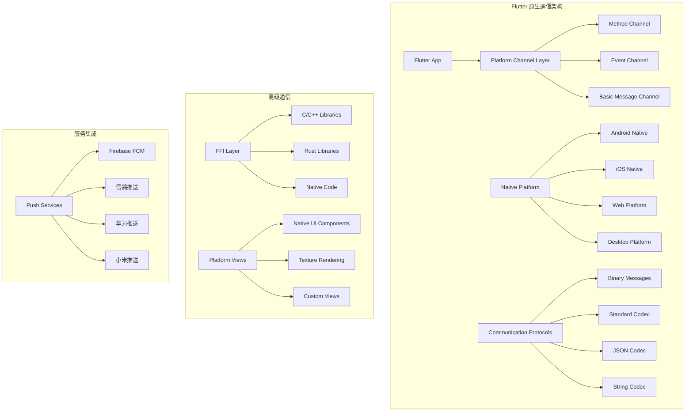
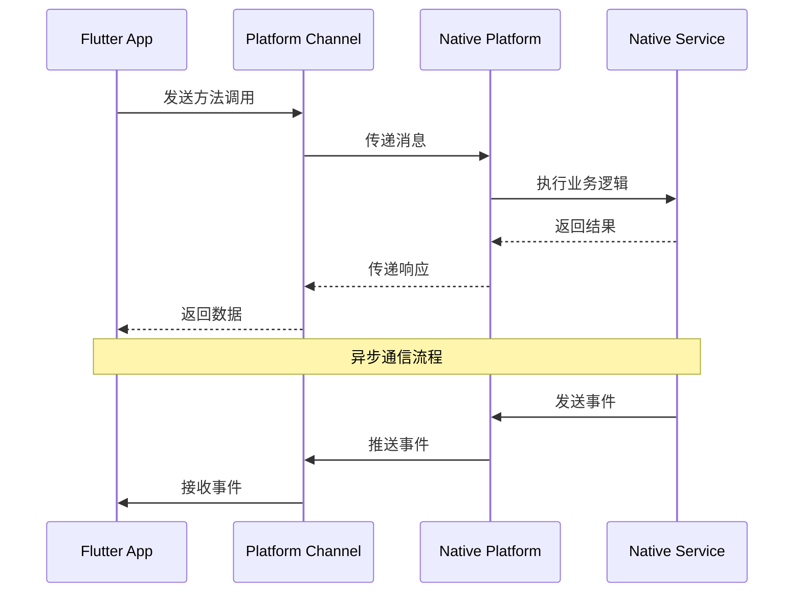
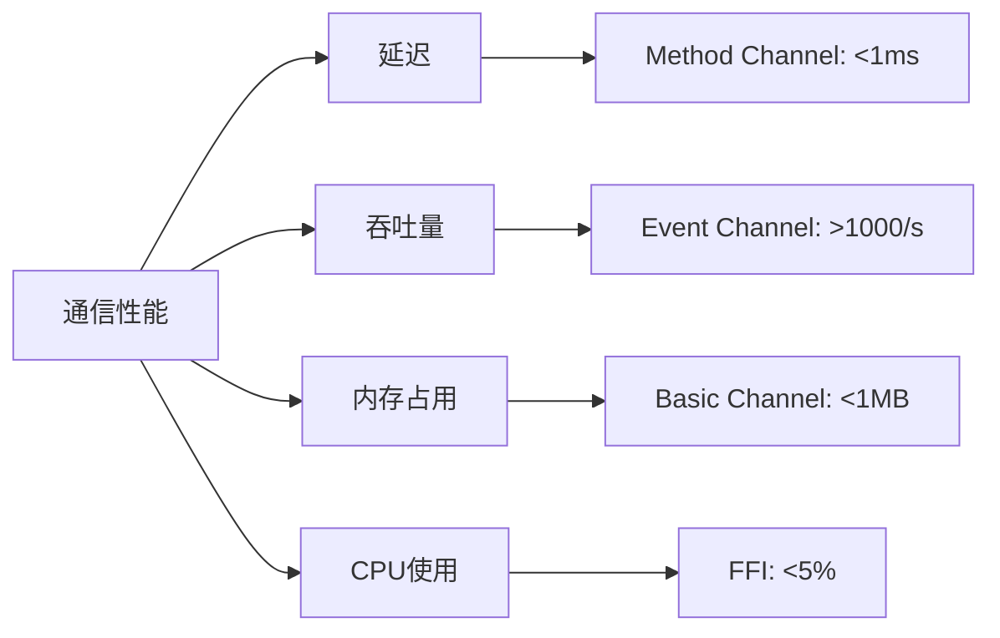
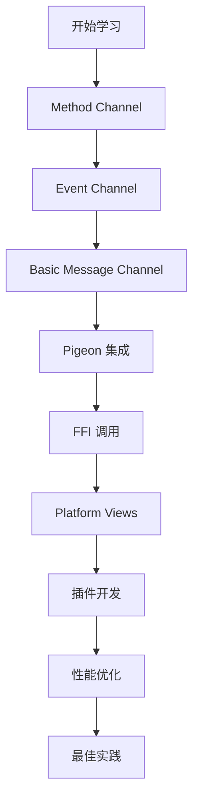

# 🔗 Flutter 原生通信深度指南

> 深入掌握 Flutter 与原生平台的各种通信方式和最佳实践，实现高性能的跨平台功能集成


## 📋 目录导航

<details>
<summary>🎯 快速导航</summary>

### 🔗 基础通信
- [🔗 Method Channel](method-channel.md) - 方法调用通信详解
- [📡 Event Channel](event-channel.md) - 事件流通信详解
- [💬 Basic Message Channel](basic-message-channel.md) - 基础消息通信

### 🚀 高级通信
- [🕊️ Pigeon 集成](pigeon-integration.md) - 类型安全的代码生成
- [⚡ FFI 集成](ffi-integration.md) - C/C++ 库调用
- [📱 Platform Views](platform-views.md) - 原生视图嵌入

### 🛠️ 开发实践
- [🔌 插件开发](plugin-development.md) - 自定义插件开发
- [⚡ 性能优化](performance-optimization.md) - 通信性能优化
- [🏆 最佳实践](best-practices.md) - 开发最佳实践

</details>

## 🏗️ 原生通信架构总览

### 整体架构图



### 通信流程图



## 🎯 核心学习目标

### 📚 理论知识
- ✅ 深入理解 Flutter 原生通信机制
- ✅ 掌握 Platform Channel 的工作原理
- ✅ 了解 FFI 和 Pigeon 的使用场景
- ✅ 学会性能优化和安全考虑

### 🛠️ 实践技能
- ✅ 熟练使用各种 Channel 通信方式
- ✅ 掌握原生插件开发方法
- ✅ 学会 FFI 集成和优化
- ✅ 能够处理复杂通信场景

### 🎨 架构能力
- ✅ 理解跨平台通信架构设计
- ✅ 掌握性能优化策略
- ✅ 学会安全最佳实践
- ✅ 能够设计可扩展的通信方案

## 🚀 快速开始

### 1. 环境准备

```bash
# 检查 Flutter 环境
flutter doctor

# 创建新项目
flutter create native_communication_demo
cd native_communication_demo

# 添加相关依赖
flutter pub add pigeon ffi
flutter pub add --dev build_runner
```

### 2. 基础 Method Channel 示例

```dart
import 'package:flutter/material.dart';
import 'package:flutter/services.dart';

void main() {
  runApp(MyApp());
}

class MyApp extends StatelessWidget {
  @override
  Widget build(BuildContext context) {
    return MaterialApp(
      title: '原生通信示例',
      theme: ThemeData(primarySwatch: Colors.blue),
      home: NativeCommunicationPage(),
    );
  }
}

class NativeCommunicationPage extends StatefulWidget {
  @override
  _NativeCommunicationPageState createState() => _NativeCommunicationPageState();
}

class _NativeCommunicationPageState extends State<NativeCommunicationPage> {
  static const MethodChannel _channel = MethodChannel('com.example.native');
  static const EventChannel _eventChannel = EventChannel('com.example.events');
  
  String _platformVersion = 'Unknown';
  String _batteryLevel = 'Unknown';
  List<String> _events = [];
  
  @override
  void initState() {
    super.initState();
    _getPlatformVersion();
    _getBatteryLevel();
    _listenToEvents();
  }
  
  // 获取平台版本
  Future<void> _getPlatformVersion() async {
    try {
      final String version = await _channel.invokeMethod('getPlatformVersion');
      setState(() {
        _platformVersion = version;
      });
    } on PlatformException catch (e) {
      setState(() {
        _platformVersion = 'Failed to get platform version: ${e.message}';
      });
    }
  }
  
  // 获取电池电量
  Future<void> _getBatteryLevel() async {
    try {
      final int batteryLevel = await _channel.invokeMethod('getBatteryLevel');
      setState(() {
        _batteryLevel = '$batteryLevel%';
      });
    } on PlatformException catch (e) {
      setState(() {
        _batteryLevel = 'Failed to get battery level: ${e.message}';
      });
    }
  }
  
  // 监听原生事件
  void _listenToEvents() {
    _eventChannel.receiveBroadcastStream().listen((event) {
      setState(() {
        _events.add('收到事件: $event');
        if (_events.length > 10) {
          _events.removeAt(0);
        }
      });
    }, onError: (error) {
      setState(() {
        _events.add('事件错误: $error');
      });
    });
  }
  
  // 调用原生方法
  Future<void> _callNativeMethod(String methodName) async {
    try {
      final result = await _channel.invokeMethod(methodName);
      ScaffoldMessenger.of(context).showSnackBar(
        SnackBar(content: Text('调用成功: $result')),
      );
    } on PlatformException catch (e) {
      ScaffoldMessenger.of(context).showSnackBar(
        SnackBar(content: Text('调用失败: ${e.message}')),
      );
    }
  }
  
  @override
  Widget build(BuildContext context) {
    return Scaffold(
      appBar: AppBar(
        title: Text('原生通信示例'),
        actions: [
          IconButton(
            icon: Icon(Icons.refresh),
            onPressed: () {
              _getPlatformVersion();
              _getBatteryLevel();
            },
          ),
        ],
      ),
      body: Padding(
        padding: EdgeInsets.all(16),
        child: Column(
          crossAxisAlignment: CrossAxisAlignment.start,
          children: [
            // 平台信息卡片
            Card(
              child: Padding(
                padding: EdgeInsets.all(16),
                child: Column(
                  crossAxisAlignment: CrossAxisAlignment.start,
                  children: [
                    Text(
                      '平台信息',
                      style: TextStyle(fontSize: 18, fontWeight: FontWeight.bold),
                    ),
                    SizedBox(height: 8),
                    Text('平台版本: $_platformVersion'),
                    Text('电池电量: $_batteryLevel'),
                  ],
                ),
              ),
            ),
            
            SizedBox(height: 16),
            
            // 功能按钮
            Text(
              '原生功能',
              style: TextStyle(fontSize: 18, fontWeight: FontWeight.bold),
            ),
            SizedBox(height: 8),
            
            Wrap(
              spacing: 8,
              runSpacing: 8,
              children: [
                ElevatedButton(
                  onPressed: () => _callNativeMethod('showToast'),
                  child: Text('显示 Toast'),
                ),
                ElevatedButton(
                  onPressed: () => _callNativeMethod('vibrate'),
                  child: Text('震动'),
                ),
                ElevatedButton(
                  onPressed: () => _callNativeMethod('takeScreenshot'),
                  child: Text('截图'),
                ),
                ElevatedButton(
                  onPressed: () => _callNativeMethod('getDeviceInfo'),
                  child: Text('设备信息'),
                ),
              ],
            ),
            
            SizedBox(height: 16),
            
            // 事件列表
            Text(
              '事件监听',
              style: TextStyle(fontSize: 18, fontWeight: FontWeight.bold),
            ),
            SizedBox(height: 8),
            
            Container(
              height: 200,
              decoration: BoxDecoration(
                border: Border.all(color: Colors.grey),
                borderRadius: BorderRadius.circular(8),
              ),
              child: ListView.builder(
                itemCount: _events.length,
                itemBuilder: (context, index) {
                  return ListTile(
                    dense: true,
                    title: Text(_events[index]),
                    leading: Icon(Icons.event, size: 16),
                  );
                },
              ),
            ),
          ],
        ),
      ),
    );
  }
}
```

### 3. Android 原生代码示例

```kotlin
// MainActivity.kt
package com.example.native_communication_demo

import io.flutter.embedding.android.FlutterActivity
import io.flutter.embedding.engine.FlutterEngine
import io.flutter.plugin.common.MethodChannel
import io.flutter.plugin.common.EventChannel
import android.content.Context
import android.os.BatteryManager
import android.widget.Toast
import android.os.VibrationEffect
import android.os.Vibrator
import android.os.Build

class MainActivity: FlutterActivity() {
    private val CHANNEL = "com.example.native"
    private val EVENT_CHANNEL = "com.example.events"
    
    override fun configureFlutterEngine(flutterEngine: FlutterEngine) {
        super.configureFlutterEngine(flutterEngine)
        
        // 设置 Method Channel
        MethodChannel(flutterEngine.dartExecutor.binaryMessenger, CHANNEL).setMethodCallHandler { call, result ->
            when (call.method) {
                "getPlatformVersion" -> {
                    result.success("Android ${Build.VERSION.RELEASE}")
                }
                "getBatteryLevel" -> {
                    val batteryLevel = getBatteryLevel()
                    result.success(batteryLevel)
                }
                "showToast" -> {
                    val message = call.argument<String>("message") ?: "Hello from Android!"
                    showToast(message)
                    result.success("Toast shown")
                }
                "vibrate" -> {
                    val duration = call.argument<Long>("duration") ?: 500L
                    vibrate(duration)
                    result.success("Vibration started")
                }
                "takeScreenshot" -> {
                    // 截图功能实现
                    result.success("Screenshot taken")
                }
                "getDeviceInfo" -> {
                    val deviceInfo = getDeviceInfo()
                    result.success(deviceInfo)
                }
                else -> {
                    result.notImplemented()
                }
            }
        }
        
        // 设置 Event Channel
        EventChannel(flutterEngine.dartExecutor.binaryMessenger, EVENT_CHANNEL).setStreamHandler(
            object : EventChannel.StreamHandler {
                override fun onListen(arguments: Any?, events: EventChannel.EventSink?) {
                    // 开始监听事件
                    events?.success("Event channel connected")
                }
                
                override fun onCancel(arguments: Any?) {
                    // 取消监听
                }
            }
        )
    }
    
    private fun getBatteryLevel(): Int {
        val batteryManager = getSystemService(Context.BATTERY_SERVICE) as BatteryManager
        return batteryManager.getIntProperty(BatteryManager.BATTERY_PROPERTY_CAPACITY)
    }
    
    private fun showToast(message: String) {
        Toast.makeText(this, message, Toast.LENGTH_SHORT).show()
    }
    
    private fun vibrate(duration: Long) {
        val vibrator = getSystemService(Context.VIBRATOR_SERVICE) as Vibrator
        if (Build.VERSION.SDK_INT >= Build.VERSION_CODES.O) {
            vibrator.vibrate(VibrationEffect.createOneShot(duration, VibrationEffect.DEFAULT_AMPLITUDE))
        } else {
            @Suppress("DEPRECATION")
            vibrator.vibrate(duration)
        }
    }
    
    private fun getDeviceInfo(): Map<String, Any> {
        return mapOf(
            "manufacturer" to Build.MANUFACTURER,
            "model" to Build.MODEL,
            "version" to Build.VERSION.RELEASE,
            "sdk" to Build.VERSION.SDK_INT
        )
    }
}
```

### 4. iOS 原生代码示例

```swift
// AppDelegate.swift
import UIKit
import Flutter

@UIApplicationMain
@objc class AppDelegate: FlutterAppDelegate {
    override func application(
        _ application: UIApplication,
        didFinishLaunchingWithOptions launchOptions: [UIApplication.LaunchOptionsKey: Any]?
    ) -> Bool {
        let controller : FlutterViewController = window?.rootViewController as! FlutterViewController
        
        // 设置 Method Channel
        let methodChannel = FlutterMethodChannel(
            name: "com.example.native",
            binaryMessenger: controller.binaryMessenger
        )
        
        methodChannel.setMethodCallHandler { [weak self] (call: FlutterMethodCall, result: @escaping FlutterResult) -> Void in
            switch call.method {
            case "getPlatformVersion":
                result("iOS " + UIDevice.current.systemVersion)
                
            case "getBatteryLevel":
                let batteryLevel = self?.getBatteryLevel() ?? 0
                result(batteryLevel)
                
            case "showToast":
                let message = call.arguments as? String ?? "Hello from iOS!"
                self?.showToast(message: message)
                result("Toast shown")
                
            case "vibrate":
                let duration = call.arguments as? Double ?? 0.5
                self?.vibrate(duration: duration)
                result("Vibration started")
                
            case "takeScreenshot":
                // 截图功能实现
                result("Screenshot taken")
                
            case "getDeviceInfo":
                let deviceInfo = self?.getDeviceInfo() ?? [:]
                result(deviceInfo)
                
            default:
                result(FlutterMethodNotImplemented)
            }
        }
        
        // 设置 Event Channel
        let eventChannel = FlutterEventChannel(
            name: "com.example.events",
            binaryMessenger: controller.binaryMessenger
        )
        
        eventChannel.setStreamHandler(EventStreamHandler())
        
        GeneratedPluginRegistrant.register(with: self)
        return super.application(application, didFinishLaunchingWithOptions: launchOptions)
    }
    
    private func getBatteryLevel() -> Int {
        UIDevice.current.isBatteryMonitoringEnabled = true
        return Int(UIDevice.current.batteryLevel * 100)
    }
    
    private func showToast(message: String) {
        let alert = UIAlertController(title: nil, message: message, preferredStyle: .alert)
        present(alert, animated: true) {
            DispatchQueue.main.asyncAfter(deadline: .now() + 2) {
                alert.dismiss(animated: true)
            }
        }
    }
    
    private func vibrate(duration: Double) {
        let impactFeedback = UIImpactFeedbackGenerator(style: .medium)
        impactFeedback.impactOccurred()
    }
    
    private func getDeviceInfo() -> [String: Any] {
        return [
            "name": UIDevice.current.name,
            "model": UIDevice.current.model,
            "systemName": UIDevice.current.systemName,
            "systemVersion": UIDevice.current.systemVersion
        ]
    }
}

// Event Stream Handler
class EventStreamHandler: NSObject, FlutterStreamHandler {
    func onListen(withArguments arguments: Any?, eventSink events: @escaping FlutterEventSink) -> FlutterError? {
        events("Event channel connected")
        return nil
    }
    
    func onCancel(withArguments arguments: Any?) -> FlutterError? {
        return nil
    }
}
```

## 📊 通信方式对比

### Platform Channel 对比

| 通信方式 | 适用场景 | 性能 | 复杂度 | 类型安全 |
|---------|---------|------|--------|---------|
| Method Channel | 方法调用 | ⭐⭐⭐⭐ | ⭐⭐ | ⭐⭐ |
| Event Channel | 事件流 | ⭐⭐⭐⭐ | ⭐⭐⭐ | ⭐⭐ |
| Basic Message Channel | 基础消息 | ⭐⭐⭐ | ⭐ | ⭐ |
| Pigeon | 类型安全调用 | ⭐⭐⭐⭐⭐ | ⭐⭐⭐ | ⭐⭐⭐⭐⭐ |
| FFI | 高性能调用 | ⭐⭐⭐⭐⭐ | ⭐⭐⭐⭐ | ⭐⭐⭐ |

### 性能对比



### 选择指南

#### 🔗 选择 Method Channel 的场景
- 简单的双向通信
- 方法调用和返回值
- 快速原型开发
- 团队对 Channel 熟悉

#### 📡 选择 Event Channel 的场景
- 持续的事件流
- 实时数据推送
- 状态变化通知
- 传感器数据监听

#### 🕊️ 选择 Pigeon 的场景
- 需要类型安全
- 复杂的接口定义
- 大型项目开发
- 团队协作开发

#### ⚡ 选择 FFI 的场景
- 高性能要求
- C/C++ 库集成
- 计算密集型任务
- 底层系统调用

## 🎨 设计模式应用

### 1. 适配器模式 (Adapter Pattern)

```dart
// 原生服务适配器
abstract class NativeServiceAdapter {
  Future<T> callMethod<T>(String method, [dynamic arguments]);
  Stream<T> listenToEvents<T>(String channel);
}

class MethodChannelAdapter implements NativeServiceAdapter {
  final MethodChannel _channel;
  final EventChannel _eventChannel;
  
  MethodChannelAdapter(String channelName, String eventChannelName)
      : _channel = MethodChannel(channelName),
        _eventChannel = EventChannel(eventChannelName);
  
  @override
  Future<T> callMethod<T>(String method, [dynamic arguments]) async {
    try {
      final result = await _channel.invokeMethod<T>(method, arguments);
      return result as T;
    } on PlatformException catch (e) {
      throw NativeServiceException(e.code, e.message);
    }
  }
  
  @override
  Stream<T> listenToEvents<T>(String channel) {
    return _eventChannel.receiveBroadcastStream().cast<T>();
  }
}

class NativeServiceException implements Exception {
  final String code;
  final String? message;
  
  NativeServiceException(this.code, this.message);
  
  @override
  String toString() => 'NativeServiceException: $code - $message';
}
```

### 2. 工厂模式 (Factory Pattern)

```dart
// 原生服务工厂
class NativeServiceFactory {
  static NativeServiceAdapter createService(ServiceType type) {
    switch (type) {
      case ServiceType.device:
        return MethodChannelAdapter('com.example.device', 'com.example.device.events');
      case ServiceType.camera:
        return MethodChannelAdapter('com.example.camera', 'com.example.camera.events');
      case ServiceType.location:
        return MethodChannelAdapter('com.example.location', 'com.example.location.events');
      case ServiceType.storage:
        return MethodChannelAdapter('com.example.storage', 'com.example.storage.events');
      default:
        throw ArgumentError('不支持的服务类型: $type');
    }
  }
}

enum ServiceType { device, camera, location, storage }

// 使用示例
class DeviceService {
  final NativeServiceAdapter _adapter;
  
  DeviceService() : _adapter = NativeServiceFactory.createService(ServiceType.device);
  
  Future<String> getPlatformVersion() async {
    return await _adapter.callMethod<String>('getPlatformVersion');
  }
  
  Future<int> getBatteryLevel() async {
    return await _adapter.callMethod<int>('getBatteryLevel');
  }
  
  Stream<String> listenToDeviceEvents() {
    return _adapter.listenToEvents<String>('device_events');
  }
}
```

### 3. 观察者模式 (Observer Pattern)

```dart
// 原生事件监听器
class NativeEventObserver extends ChangeNotifier {
  final Map<String, StreamSubscription> _subscriptions = {};
  final Map<String, List<dynamic>> _eventHistory = {};
  
  void listenToChannel(String channelName, NativeServiceAdapter adapter) {
    if (_subscriptions.containsKey(channelName)) {
      return; // 已经在监听
    }
    
    final subscription = adapter.listenToEvents(channelName).listen(
      (event) {
        _addEvent(channelName, event);
        notifyListeners();
      },
      onError: (error) {
        _addEvent(channelName, 'Error: $error');
        notifyListeners();
      },
    );
    
    _subscriptions[channelName] = subscription;
  }
  
  void stopListening(String channelName) {
    _subscriptions[channelName]?.cancel();
    _subscriptions.remove(channelName);
  }
  
  void stopAllListening() {
    for (final subscription in _subscriptions.values) {
      subscription.cancel();
    }
    _subscriptions.clear();
  }
  
  List<dynamic> getEventHistory(String channelName) {
    return _eventHistory[channelName] ?? [];
  }
  
  void _addEvent(String channelName, dynamic event) {
    _eventHistory.putIfAbsent(channelName, () => []).add(event);
    
    // 限制历史记录数量
    if (_eventHistory[channelName]!.length > 100) {
      _eventHistory[channelName]!.removeAt(0);
    }
  }
  
  @override
  void dispose() {
    stopAllListening();
    super.dispose();
  }
}

// 使用示例
class NativeEventWidget extends StatefulWidget {
  @override
  _NativeEventWidgetState createState() => _NativeEventWidgetState();
}

class _NativeEventWidgetState extends State<NativeEventWidget> {
  final NativeEventObserver _observer = NativeEventObserver();
  final DeviceService _deviceService = DeviceService();
  
  @override
  void initState() {
    super.initState();
    _observer.addListener(_onEventChanged);
    _observer.listenToChannel('device_events', _deviceService._adapter);
  }
  
  void _onEventChanged() {
    setState(() {
      // UI 更新
    });
  }
  
  @override
  Widget build(BuildContext context) {
    final events = _observer.getEventHistory('device_events');
    
    return ListView.builder(
      itemCount: events.length,
      itemBuilder: (context, index) {
        return ListTile(
          title: Text(events[index].toString()),
          leading: Icon(Icons.event),
        );
      },
    );
  }
  
  @override
  void dispose() {
    _observer.removeListener(_onEventChanged);
    _observer.dispose();
    super.dispose();
  }
}
```

## 🔧 开发工具推荐

### 📱 调试工具
- **Flutter Inspector**: 通信调试
- **Platform Channel Monitor**: 通道监控
- **Native Debugger**: 原生代码调试
- **Performance Profiler**: 性能分析

### 🎨 设计工具
- **Pigeon**: 类型安全的代码生成
- **FFIGen**: FFI 绑定生成
- **Plugin Template**: 插件模板
- **Channel Tester**: 通道测试工具

### 📚 学习资源
- **官方文档**: 各通信方式的官方文档
- **GitHub 示例**: 官方示例项目
- **社区博客**: 技术博客和教程

## 📈 学习路径建议



### 🎯 阶段目标

#### 第一阶段：基础掌握
- [ ] 理解 Flutter 原生通信原理
- [ ] 掌握 Method Channel 使用方法
- [ ] 学会错误处理和调试
- [ ] 完成简单的原生调用

#### 第二阶段：进阶学习
- [ ] 深入学习 Event Channel 和 Basic Message Channel
- [ ] 掌握 Pigeon 类型安全通信
- [ ] 学会 FFI 基础调用
- [ ] 完成中等复杂度的通信功能

#### 第三阶段：高级应用
- [ ] 掌握 Platform Views 使用
- [ ] 学会插件开发方法
- [ ] 理解性能优化技巧
- [ ] 完成复杂的原生集成

#### 第四阶段：实战项目
- [ ] 完成完整的商业级应用
- [ ] 掌握安全最佳实践
- [ ] 学会团队协作开发
- [ ] 参与开源项目贡献

## 🏆 最佳实践

### 📝 代码规范

```dart
// ✅ 推荐：统一的错误处理
class NativeCommunicationService {
  static const MethodChannel _channel = MethodChannel('com.example.native');
  
  static Future<T> callMethod<T>(String method, [dynamic arguments]) async {
    try {
      final result = await _channel.invokeMethod<T>(method, arguments);
      return result as T;
    } on PlatformException catch (e) {
      throw NativeCommunicationException(
        method: method,
        code: e.code,
        message: e.message,
        details: e.details,
      );
    } catch (e) {
      throw NativeCommunicationException(
        method: method,
        code: 'UNKNOWN_ERROR',
        message: e.toString(),
      );
    }
  }
}

class NativeCommunicationException implements Exception {
  final String method;
  final String code;
  final String? message;
  final dynamic details;
  
  NativeCommunicationException({
    required this.method,
    required this.code,
    this.message,
    this.details,
  });
  
  @override
  String toString() => 'NativeCommunicationException: $method - $code: $message';
}

// ✅ 推荐：类型安全的参数传递
class NativeMethodCall<T> {
  final String method;
  final T? arguments;
  final Type returnType;
  
  const NativeMethodCall({
    required this.method,
    this.arguments,
    required this.returnType,
  });
  
  Map<String, dynamic> toMap() {
    return {
      'method': method,
      'arguments': arguments,
      'returnType': returnType.toString(),
    };
  }
}
```

### 🎨 架构原则
- **单一职责**: 每个 Channel 只负责一个功能域
- **开闭原则**: 对扩展开放，对修改关闭
- **依赖倒置**: 依赖抽象而非具体实现
- **接口隔离**: 使用小而精确的接口

### ⚡ 性能优化
- 减少跨平台调用频率
- 使用批量操作
- 合理使用缓存
- 异步处理耗时操作

### 🧪 测试策略
- 通信单元测试覆盖率 ≥ 90%
- 集成测试覆盖关键功能
- 自动化测试集成 CI/CD
- 性能基准测试

## 📚 相关资源

### 🔗 官方资源
- [Platform Channels 官方文档](https://docs.flutter.dev/development/platform-integration/platform-channels)
- [Dart FFI 官方文档](https://dart.dev/guides/libraries/c-interop)
- [Pigeon 官方文档](https://pub.dev/packages/pigeon)

### 📖 推荐书籍
- 《Flutter 实战》
- 《Flutter 开发实战详解》
- 《原生通信最佳实践》

### 🎥 视频教程
- [Flutter 官方 YouTube 频道](https://www.youtube.com/c/FlutterDev)
- [B 站 Flutter 教程](https://www.bilibili.com/video/BV1S4411E7LY)

---

## 🎉 开始你的原生通信之旅

现在你已经了解了 Flutter 原生通信的整体架构和学习路径。接下来，让我们从[Method Channel](method-channel.md)开始，逐步掌握各种通信方式的使用方法。

记住：**选择合适的通信方式比使用最流行的方式更重要**，根据性能要求和功能需求做出明智的选择！

---

<div align="center">

**🌟 如果这个指南对你有帮助，请给个 Star 支持一下！ 🌟**

[](https://github.com/your-repo/flutter-native-communication)
[](https://github.com/your-repo/flutter-native-communication)

</div>
