# BasicMessageChannel 详解

> BasicMessageChannel提供了Flutter与原生平台之间最基础的双向通信机制，支持持续的消息传递和自定义数据编解码

## 📋 目录

- [基础概念](#基础概念)
- [基础用法](#基础用法)
- [自定义编解码器](#自定义编解码器)
- [高级特性](#高级特性)
- [性能优化](#性能优化)
- [实际应用](#实际应用)
- [最佳实践](#最佳实践)
- [故障排除](#故障排除)

## 🎯 基础概念

### BasicMessageChannel架构图

```mermaid
sequenceDiagram
    participant F as Flutter
    participant E as Flutter Engine
    participant N as Native Platform
    
    Note over F,N: 双向消息传递
    
    F->>E: send(message)
    E->>N: Forward Message
    N->>E: Process & Reply
    E->>F: Return Response
    
    Note over F,N: 原生主动发送
    
    N->>E: send(message)
    E->>F: Forward Message
    F->>E: Process & Reply
    E->>N: Return Response
```



### 核心特性

- **双向通信**: 支持Flutter和原生平台互相发送消息
- **自定义编解码**: 支持多种数据格式和自定义编解码器
- **异步处理**: 基于Future的异步消息处理
- **类型安全**: 通过泛型确保类型安全

### 与其他Channel的对比

| 特性 | BasicMessageChannel | MethodChannel | EventChannel |
|------|---------------------|---------------|---------------|
| 通信方向 | 双向 | 双向 | 单向（原生→Flutter） |
| 数据模式 | 消息传递 | 方法调用 | 事件流 |
| 编解码器 | 可自定义 | 标准编解码器 | 标准编解码器 |
| 适用场景 | 自定义协议 | API调用 | 事件监听 |

## 🚀 基础用法

### 1. Flutter端实现

```dart
import 'package:flutter/services.dart';
import 'dart:typed_data';

// 消息通信服务
class MessageCommunicationService {
  // 使用标准JSON编解码器
  static const BasicMessageChannel<dynamic> _jsonChannel = 
      BasicMessageChannel('com.example.message/json', StandardMessageCodec());
  
  // 使用字符串编解码器
  static const BasicMessageChannel<String> _stringChannel = 
      BasicMessageChannel('com.example.message/string', StringCodec());
  
  // 使用二进制编解码器
  static const BasicMessageChannel<ByteData> _binaryChannel = 
      BasicMessageChannel('com.example.message/binary', BinaryCodec());
  
  // 发送JSON消息
  static Future<dynamic> sendJsonMessage(Map<String, dynamic> message) async {
    try {
      final response = await _jsonChannel.send(message);
      return response;
    } catch (e) {
      print('Failed to send JSON message: $e');
      return null;
    }
  }
  
  // 发送字符串消息
  static Future<String?> sendStringMessage(String message) async {
    try {
      final response = await _stringChannel.send(message);
      return response;
    } catch (e) {
      print('Failed to send string message: $e');
      return null;
    }
  }
  
  // 发送二进制消息
  static Future<ByteData?> sendBinaryMessage(ByteData message) async {
    try {
      final response = await _binaryChannel.send(message);
      return response;
    } catch (e) {
      print('Failed to send binary message: $e');
      return null;
    }
  }
  
  // 设置消息处理器
  static void setupMessageHandlers() {
    // JSON消息处理器
    _jsonChannel.setMessageHandler((message) async {
      print('Received JSON message: $message');
      
      if (message is Map<String, dynamic>) {
        final type = message['type'] as String?;
        
        switch (type) {
          case 'ping':
            return {'type': 'pong', 'timestamp': DateTime.now().millisecondsSinceEpoch};
          case 'getData':
            return await _handleGetDataRequest(message);
          case 'notification':
            _handleNotification(message);
            return {'status': 'received'};
          default:
            return {'error': 'Unknown message type: $type'};
        }
      }
      
      return {'error': 'Invalid message format'};
    });
    
    // 字符串消息处理器
    _stringChannel.setMessageHandler((message) async {
      print('Received string message: $message');
      
      if (message != null) {
        // 简单的回声服务
        return 'Echo: $message';
      }
      
      return 'No message received';
    });
    
    // 二进制消息处理器
    _binaryChannel.setMessageHandler((message) async {
      print('Received binary message: ${message?.lengthInBytes} bytes');
      
      if (message != null) {
        // 返回相同的二进制数据
        return message;
      }
      
      return null;
    });
  }
  
  static Future<Map<String, dynamic>> _handleGetDataRequest(Map<String, dynamic> request) async {
    final dataType = request['dataType'] as String?;
    
    switch (dataType) {
      case 'user':
        return {
          'type': 'userData',
          'data': {
            'id': 123,
            'name': 'John Doe',
            'email': 'john@example.com',
          },
        };
      case 'settings':
        return {
          'type': 'settingsData',
          'data': {
            'theme': 'dark',
            'language': 'en',
            'notifications': true,
          },
        };
      default:
        return {'error': 'Unknown data type: $dataType'};
    }
  }
  
  static void _handleNotification(Map<String, dynamic> notification) {
    final title = notification['title'] as String?;
    final body = notification['body'] as String?;
    
    print('Notification: $title - $body');
    // 这里可以显示本地通知
  }
}
```

### 2. Android端实现

```kotlin
// MainActivity.kt
package com.example.message

import android.os.Handler
import android.os.Looper
import androidx.annotation.NonNull
import io.flutter.embedding.android.FlutterActivity
import io.flutter.embedding.engine.FlutterEngine
import io.flutter.plugin.common.BasicMessageChannel
import io.flutter.plugin.common.BinaryCodec
import io.flutter.plugin.common.StandardMessageCodec
import io.flutter.plugin.common.StringCodec
import java.nio.ByteBuffer
import java.util.*

class MainActivity: FlutterActivity() {
    private val JSON_CHANNEL = "com.example.message/json"
    private val STRING_CHANNEL = "com.example.message/string"
    private val BINARY_CHANNEL = "com.example.message/binary"
    
    private lateinit var jsonChannel: BasicMessageChannel<Any>
    private lateinit var stringChannel: BasicMessageChannel<String>
    private lateinit var binaryChannel: BasicMessageChannel<ByteBuffer>
    
    private val handler = Handler(Looper.getMainLooper())
    
    override fun configureFlutterEngine(@NonNull flutterEngine: FlutterEngine) {
        super.configureFlutterEngine(flutterEngine)
        
        setupMessageChannels(flutterEngine)
        startPeriodicMessages()
    }
    
    private fun setupMessageChannels(flutterEngine: FlutterEngine) {
        // JSON消息通道
        jsonChannel = BasicMessageChannel(
            flutterEngine.dartExecutor.binaryMessenger,
            JSON_CHANNEL,
            StandardMessageCodec.INSTANCE
        )
        
        jsonChannel.setMessageHandler { message, reply ->
            handleJsonMessage(message, reply)
        }
        
        // 字符串消息通道
        stringChannel = BasicMessageChannel(
            flutterEngine.dartExecutor.binaryMessenger,
            STRING_CHANNEL,
            StringCodec.INSTANCE
        )
        
        stringChannel.setMessageHandler { message, reply ->
            handleStringMessage(message, reply)
        }
        
        // 二进制消息通道
        binaryChannel = BasicMessageChannel(
            flutterEngine.dartExecutor.binaryMessenger,
            BINARY_CHANNEL,
            BinaryCodec.INSTANCE
        )
        
        binaryChannel.setMessageHandler { message, reply ->
            handleBinaryMessage(message, reply)
        }
    }
    
    private fun handleJsonMessage(message: Any?, reply: BasicMessageChannel.Reply<Any>) {
        when (message) {
            is Map<*, *> -> {
                val type = message["type"] as? String
                
                when (type) {
                    "getSystemInfo" -> {
                        val response = mapOf(
                            "type" to "systemInfo",
                            "data" to mapOf(
                                "osVersion" to android.os.Build.VERSION.RELEASE,
                                "deviceModel" to android.os.Build.MODEL,
                                "manufacturer" to android.os.Build.MANUFACTURER,
                                "timestamp" to System.currentTimeMillis()
                            )
                        )
                        reply.reply(response)
                    }
                    "performAction" -> {
                        val action = message["action"] as? String
                        val result = performNativeAction(action)
                        reply.reply(mapOf(
                            "type" to "actionResult",
                            "success" to result,
                            "action" to action
                        ))
                    }
                    else -> {
                        reply.reply(mapOf(
                            "error" to "Unknown message type: $type"
                        ))
                    }
                }
            }
            else -> {
                reply.reply(mapOf(
                    "error" to "Invalid message format"
                ))
            }
        }
    }
    
    private fun handleStringMessage(message: String?, reply: BasicMessageChannel.Reply<String>) {
        when {
            message == null -> reply.reply("No message received")
            message.startsWith("reverse:") -> {
                val text = message.substring(8)
                reply.reply(text.reversed())
            }
            message.startsWith("uppercase:") -> {
                val text = message.substring(10)
                reply.reply(text.uppercase())
            }
            message.startsWith("lowercase:") -> {
                val text = message.substring(10)
                reply.reply(text.lowercase())
            }
            else -> reply.reply("Processed: $message")
        }
    }
    
    private fun handleBinaryMessage(message: ByteBuffer?, reply: BasicMessageChannel.Reply<ByteBuffer>) {
        if (message != null) {
            // 处理二进制数据
            val bytes = ByteArray(message.remaining())
            message.get(bytes)
            
            // 简单的数据处理：每个字节加1
            for (i in bytes.indices) {
                bytes[i] = (bytes[i] + 1).toByte()
            }
            
            reply.reply(ByteBuffer.wrap(bytes))
        } else {
            reply.reply(null)
        }
    }
    
    private fun performNativeAction(action: String?): Boolean {
        return when (action) {
            "vibrate" -> {
                // 执行震动
                true
            }
            "flashlight" -> {
                // 控制闪光灯
                true
            }
            "screenshot" -> {
                // 截屏
                true
            }
            else -> false
        }
    }
    
    private fun startPeriodicMessages() {
        // 定期发送消息到Flutter
        val runnable = object : Runnable {
            override fun run() {
                sendPeriodicMessage()
                handler.postDelayed(this, 10000) // 每10秒发送一次
            }
        }
        handler.post(runnable)
    }
    
    private fun sendPeriodicMessage() {
        val message = mapOf(
            "type" to "periodicUpdate",
            "data" to mapOf(
                "timestamp" to System.currentTimeMillis(),
                "batteryLevel" to getBatteryLevel(),
                "memoryUsage" to getMemoryUsage()
            )
        )
        
        jsonChannel.send(message) { reply ->
            println("Periodic message reply: $reply")
        }
    }
    
    private fun getBatteryLevel(): Int {
        // 获取电池电量
        return 85 // 示例值
    }
    
    private fun getMemoryUsage(): Double {
        // 获取内存使用率
        val runtime = Runtime.getRuntime()
        val usedMemory = runtime.totalMemory() - runtime.freeMemory()
        val maxMemory = runtime.maxMemory()
        return (usedMemory.toDouble() / maxMemory.toDouble()) * 100
    }
}
```

### 3. iOS端实现

```swift
// AppDelegate.swift
import UIKit
import Flutter

@UIApplicationMain
@objc class AppDelegate: FlutterAppDelegate {
    private let JSON_CHANNEL = "com.example.message/json"
    private let STRING_CHANNEL = "com.example.message/string"
    private let BINARY_CHANNEL = "com.example.message/binary"
    
    private var jsonChannel: FlutterBasicMessageChannel!
    private var stringChannel: FlutterBasicMessageChannel!
    private var binaryChannel: FlutterBasicMessageChannel!
    
    private var periodicTimer: Timer?
    
    override func application(
        _ application: UIApplication,
        didFinishLaunchingWithOptions launchOptions: [UIApplication.LaunchOptionsKey: Any]?
    ) -> Bool {
        
        let controller : FlutterViewController = window?.rootViewController as! FlutterViewController
        
        setupMessageChannels(controller: controller)
        startPeriodicMessages()
        
        GeneratedPluginRegistrant.register(with: self)
        return super.application(application, didFinishLaunchingWithOptions: launchOptions)
    }
    
    private func setupMessageChannels(controller: FlutterViewController) {
        // JSON消息通道
        jsonChannel = FlutterBasicMessageChannel(
            name: JSON_CHANNEL,
            binaryMessenger: controller.binaryMessenger,
            codec: FlutterStandardMessageCodec.sharedInstance()
        )
        
        jsonChannel.setMessageHandler { [weak self] (message, reply) in
            self?.handleJsonMessage(message: message, reply: reply)
        }
        
        // 字符串消息通道
        stringChannel = FlutterBasicMessageChannel(
            name: STRING_CHANNEL,
            binaryMessenger: controller.binaryMessenger,
            codec: FlutterStringCodec.sharedInstance()
        )
        
        stringChannel.setMessageHandler { [weak self] (message, reply) in
            self?.handleStringMessage(message: message, reply: reply)
        }
        
        // 二进制消息通道
        binaryChannel = FlutterBasicMessageChannel(
            name: BINARY_CHANNEL,
            binaryMessenger: controller.binaryMessenger,
            codec: FlutterBinaryCodec.sharedInstance()
        )
        
        binaryChannel.setMessageHandler { [weak self] (message, reply) in
            self?.handleBinaryMessage(message: message, reply: reply)
        }
    }
    
    private func handleJsonMessage(message: Any?, reply: @escaping FlutterReply) {
        guard let messageDict = message as? [String: Any],
              let type = messageDict["type"] as? String else {
            reply(["error": "Invalid message format"])
            return
        }
        
        switch type {
        case "getDeviceInfo":
            let response: [String: Any] = [
                "type": "deviceInfo",
                "data": [
                    "systemName": UIDevice.current.systemName,
                    "systemVersion": UIDevice.current.systemVersion,
                    "model": UIDevice.current.model,
                    "name": UIDevice.current.name,
                    "timestamp": Int64(Date().timeIntervalSince1970 * 1000)
                ]
            ]
            reply(response)
            
        case "performAction":
            let action = messageDict["action"] as? String
            let result = performNativeAction(action: action)
            reply([
                "type": "actionResult",
                "success": result,
                "action": action ?? "unknown"
            ])
            
        default:
            reply(["error": "Unknown message type: \(type)"])
        }
    }
    
    private func handleStringMessage(message: Any?, reply: @escaping FlutterReply) {
        guard let messageString = message as? String else {
            reply("No message received")
            return
        }
        
        if messageString.hasPrefix("reverse:") {
            let text = String(messageString.dropFirst(8))
            reply(String(text.reversed()))
        } else if messageString.hasPrefix("count:") {
            let text = String(messageString.dropFirst(6))
            reply("Character count: \(text.count)")
        } else {
            reply("Processed: \(messageString)")
        }
    }
    
    private func handleBinaryMessage(message: Any?, reply: @escaping FlutterReply) {
        guard let data = message as? FlutterStandardTypedData else {
            reply(nil)
            return
        }
        
        // 处理二进制数据
        var bytes = [UInt8](data.data)
        
        // 简单的数据处理：每个字节减1
        for i in 0..<bytes.count {
            bytes[i] = bytes[i] &- 1
        }
        
        let processedData = FlutterStandardTypedData(bytes: Data(bytes))
        reply(processedData)
    }
    
    private func performNativeAction(action: String?) -> Bool {
        switch action {
        case "haptic":
            // 执行触觉反馈
            let impactFeedback = UIImpactFeedbackGenerator(style: .medium)
            impactFeedback.impactOccurred()
            return true
            
        case "brightness":
            // 调整屏幕亮度
            UIScreen.main.brightness = 0.8
            return true
            
        default:
            return false
        }
    }
    
    private func startPeriodicMessages() {
        periodicTimer = Timer.scheduledTimer(withTimeInterval: 15.0, repeats: true) { [weak self] _ in
            self?.sendPeriodicMessage()
        }
    }
    
    private func sendPeriodicMessage() {
        let message: [String: Any] = [
            "type": "periodicUpdate",
            "data": [
                "timestamp": Int64(Date().timeIntervalSince1970 * 1000),
                "batteryLevel": UIDevice.current.batteryLevel * 100,
                "batteryState": getBatteryState(),
                "memoryUsage": getMemoryUsage()
            ]
        ]
        
        jsonChannel.sendMessage(message) { reply in
            print("Periodic message reply: \(String(describing: reply))")
        }
    }
    
    private func getBatteryState() -> String {
        switch UIDevice.current.batteryState {
        case .charging:
            return "charging"
        case .full:
            return "full"
        case .unplugged:
            return "unplugged"
        default:
            return "unknown"
        }
    }
    
    private func getMemoryUsage() -> Double {
        var info = mach_task_basic_info()
        var count = mach_msg_type_number_t(MemoryLayout<mach_task_basic_info>.size)/4
        
        let kerr: kern_return_t = withUnsafeMutablePointer(to: &info) {
            $0.withMemoryRebound(to: integer_t.self, capacity: 1) {
                task_info(mach_task_self_,
                         task_flavor_t(MACH_TASK_BASIC_INFO),
                         $0,
                         &count)
            }
        }
        
        if kerr == KERN_SUCCESS {
            return Double(info.resident_size) / (1024 * 1024) // MB
        }
        
        return 0.0
    }
}
```

## 🔧 自定义编解码器

### 1. 自定义JSON编解码器

```dart
// 自定义JSON编解码器
class CustomJsonCodec extends MessageCodec<Map<String, dynamic>> {
  const CustomJsonCodec();
  
  @override
  ByteData? encodeMessage(Map<String, dynamic>? message) {
    if (message == null) return null;
    
    try {
      // 添加时间戳和版本信息
      final wrappedMessage = {
        'version': '1.0',
        'timestamp': DateTime.now().millisecondsSinceEpoch,
        'payload': message,
      };
      
      final jsonString = jsonEncode(wrappedMessage);
      final bytes = utf8.encode(jsonString);
      return ByteData.sublistView(Uint8List.fromList(bytes));
    } catch (e) {
      throw FormatException('Failed to encode message: $e');
    }
  }
  
  @override
  Map<String, dynamic>? decodeMessage(ByteData? message) {
    if (message == null) return null;
    
    try {
      final bytes = message.buffer.asUint8List(message.offsetInBytes, message.lengthInBytes);
      final jsonString = utf8.decode(bytes);
      final decoded = jsonDecode(jsonString) as Map<String, dynamic>;
      
      // 验证版本和提取payload
      final version = decoded['version'] as String?;
      if (version != '1.0') {
        throw FormatException('Unsupported message version: $version');
      }
      
      return decoded['payload'] as Map<String, dynamic>?;
    } catch (e) {
      throw FormatException('Failed to decode message: $e');
    }
  }
}

// 使用自定义编解码器
class CustomMessageService {
  static const BasicMessageChannel<Map<String, dynamic>> _customChannel = 
      BasicMessageChannel('com.example.message/custom', CustomJsonCodec());
  
  static Future<Map<String, dynamic>?> sendCustomMessage(Map<String, dynamic> message) async {
    try {
      final response = await _customChannel.send(message);
      return response;
    } catch (e) {
      print('Failed to send custom message: $e');
      return null;
    }
  }
  
  static void setupCustomHandler() {
    _customChannel.setMessageHandler((message) async {
      print('Received custom message: $message');
      
      // 处理自定义消息
      return {
        'status': 'processed',
        'receivedAt': DateTime.now().millisecondsSinceEpoch,
        'echo': message,
      };
    });
  }
}
```

### 2. 协议缓冲区编解码器

```dart
// Protocol Buffers编解码器
class ProtobufCodec extends MessageCodec<GeneratedMessage> {
  const ProtobufCodec();
  
  @override
  ByteData? encodeMessage(GeneratedMessage? message) {
    if (message == null) return null;
    
    try {
      final bytes = message.writeToBuffer();
      return ByteData.sublistView(bytes);
    } catch (e) {
      throw FormatException('Failed to encode protobuf message: $e');
    }
  }
  
  @override
  GeneratedMessage? decodeMessage(ByteData? message) {
    if (message == null) return null;
    
    try {
      final bytes = message.buffer.asUint8List(message.offsetInBytes, message.lengthInBytes);
      // 这里需要根据具体的protobuf类型进行解码
      // return YourProtobufMessage.fromBuffer(bytes);
      throw UnimplementedError('Implement specific protobuf decoding');
    } catch (e) {
      throw FormatException('Failed to decode protobuf message: $e');
    }
  }
}
```

### 3. 压缩编解码器

```dart
import 'dart:io';

// 压缩编解码器
class CompressedJsonCodec extends MessageCodec<Map<String, dynamic>> {
  const CompressedJsonCodec();
  
  @override
  ByteData? encodeMessage(Map<String, dynamic>? message) {
    if (message == null) return null;
    
    try {
      final jsonString = jsonEncode(message);
      final bytes = utf8.encode(jsonString);
      
      // 使用gzip压缩
      final compressed = gzip.encode(bytes);
      return ByteData.sublistView(Uint8List.fromList(compressed));
    } catch (e) {
      throw FormatException('Failed to encode compressed message: $e');
    }
  }
  
  @override
  Map<String, dynamic>? decodeMessage(ByteData? message) {
    if (message == null) return null;
    
    try {
      final compressedBytes = message.buffer.asUint8List(message.offsetInBytes, message.lengthInBytes);
      
      // 解压缩
      final decompressed = gzip.decode(compressedBytes);
      final jsonString = utf8.decode(decompressed);
      
      return jsonDecode(jsonString) as Map<String, dynamic>;
    } catch (e) {
      throw FormatException('Failed to decode compressed message: $e');
    }
  }
}

// 使用压缩编解码器
class CompressedMessageService {
  static const BasicMessageChannel<Map<String, dynamic>> _compressedChannel = 
      BasicMessageChannel('com.example.message/compressed', CompressedJsonCodec());
  
  static Future<Map<String, dynamic>?> sendLargeData(Map<String, dynamic> largeData) async {
    try {
      print('Original data size: ${jsonEncode(largeData).length} characters');
      
      final response = await _compressedChannel.send(largeData);
      return response;
    } catch (e) {
      print('Failed to send compressed message: $e');
      return null;
    }
  }
}
```

## 🚀 高级特性

### 1. 消息队列和批处理

```dart
// 消息队列管理器
class MessageQueueManager {
  static const BasicMessageChannel<List<dynamic>> _batchChannel = 
      BasicMessageChannel('com.example.message/batch', StandardMessageCodec());
  
  static final List<Map<String, dynamic>> _messageQueue = [];
  static Timer? _batchTimer;
  static const int _maxBatchSize = 10;
  static const Duration _batchInterval = Duration(seconds: 2);
  
  // 添加消息到队列
  static void queueMessage(Map<String, dynamic> message) {
    _messageQueue.add({
      ...message,
      'queuedAt': DateTime.now().millisecondsSinceEpoch,
    });
    
    // 检查是否需要立即发送
    if (_messageQueue.length >= _maxBatchSize) {
      _sendBatch();
    } else {
      _scheduleBatchSend();
    }
  }
  
  static void _scheduleBatchSend() {
    _batchTimer?.cancel();
    _batchTimer = Timer(_batchInterval, _sendBatch);
  }
  
  static void _sendBatch() {
    if (_messageQueue.isEmpty) return;
    
    final batch = List<Map<String, dynamic>>.from(_messageQueue);
    _messageQueue.clear();
    _batchTimer?.cancel();
    
    _sendBatchMessages(batch);
  }
  
  static Future<void> _sendBatchMessages(List<Map<String, dynamic>> messages) async {
    try {
      final batchMessage = {
        'type': 'batch',
        'count': messages.length,
        'messages': messages,
        'sentAt': DateTime.now().millisecondsSinceEpoch,
      };
      
      final response = await _batchChannel.send([batchMessage]);
      print('Batch sent successfully: ${messages.length} messages, response: $response');
    } catch (e) {
      print('Failed to send batch: $e');
      // 可以选择重新加入队列或记录失败
    }
  }
  
  // 设置批处理消息处理器
  static void setupBatchHandler() {
    _batchChannel.setMessageHandler((messages) async {
      if (messages is List) {
        final results = <Map<String, dynamic>>[];
        
        for (final message in messages) {
          if (message is Map<String, dynamic>) {
            final result = await _processSingleMessage(message);
            results.add(result);
          }
        }
        
        return results;
      }
      
      return [{'error': 'Invalid batch format'}];
    });
  }
  
  static Future<Map<String, dynamic>> _processSingleMessage(Map<String, dynamic> message) async {
    final type = message['type'] as String?;
    
    switch (type) {
      case 'analytics':
        return await _processAnalyticsMessage(message);
      case 'log':
        return await _processLogMessage(message);
      case 'metric':
        return await _processMetricMessage(message);
      default:
        return {
          'id': message['id'],
          'status': 'unknown_type',
          'processedAt': DateTime.now().millisecondsSinceEpoch,
        };
    }
  }
  
  static Future<Map<String, dynamic>> _processAnalyticsMessage(Map<String, dynamic> message) async {
    // 处理分析数据
    await Future.delayed(Duration(milliseconds: 10)); // 模拟处理时间
    
    return {
      'id': message['id'],
      'status': 'analytics_processed',
      'processedAt': DateTime.now().millisecondsSinceEpoch,
    };
  }
  
  static Future<Map<String, dynamic>> _processLogMessage(Map<String, dynamic> message) async {
    // 处理日志数据
    print('Log: ${message['content']}');
    
    return {
      'id': message['id'],
      'status': 'logged',
      'processedAt': DateTime.now().millisecondsSinceEpoch,
    };
  }
  
  static Future<Map<String, dynamic>> _processMetricMessage(Map<String, dynamic> message) async {
    // 处理指标数据
    final metric = message['metric'] as String?;
    final value = message['value'] as num?;
    
    print('Metric: $metric = $value');
    
    return {
      'id': message['id'],
      'status': 'metric_recorded',
      'metric': metric,
      'value': value,
      'processedAt': DateTime.now().millisecondsSinceEpoch,
    };
  }
}
```

### 2. 消息路由和分发

```dart
// 消息路由器
class MessageRouter {
  static const BasicMessageChannel<Map<String, dynamic>> _routerChannel = 
      BasicMessageChannel('com.example.message/router', StandardMessageCodec());
  
  static final Map<String, Function(Map<String, dynamic>)> _handlers = {};
  static final Map<String, StreamController<Map<String, dynamic>>> _streams = {};
  
  // 注册消息处理器
  static void registerHandler(String route, Function(Map<String, dynamic>) handler) {
    _handlers[route] = handler;
  }
  
  // 注册消息流
  static Stream<Map<String, dynamic>> registerStream(String route) {
    if (!_streams.containsKey(route)) {
      _streams[route] = StreamController<Map<String, dynamic>>.broadcast();
    }
    return _streams[route]!.stream;
  }
  
  // 发送路由消息
  static Future<Map<String, dynamic>?> sendRoutedMessage(
    String route,
    Map<String, dynamic> payload,
  ) async {
    final message = {
      'route': route,
      'payload': payload,
      'timestamp': DateTime.now().millisecondsSinceEpoch,
    };
    
    try {
      final response = await _routerChannel.send(message);
      return response as Map<String, dynamic>?;
    } catch (e) {
      print('Failed to send routed message to $route: $e');
      return null;
    }
  }
  
  // 设置路由处理器
  static void setupRouter() {
    _routerChannel.setMessageHandler((message) async {
      if (message is Map<String, dynamic>) {
        final route = message['route'] as String?;
        final payload = message['payload'] as Map<String, dynamic>?;
        
        if (route != null && payload != null) {
          return await _routeMessage(route, payload);
        }
      }
      
      return {'error': 'Invalid routed message format'};
    });
  }
  
  static Future<Map<String, dynamic>> _routeMessage(
    String route,
    Map<String, dynamic> payload,
  ) async {
    try {
      // 调用注册的处理器
      final handler = _handlers[route];
      if (handler != null) {
        await handler(payload);
      }
      
      // 发送到流
      final stream = _streams[route];
      if (stream != null && !stream.isClosed) {
        stream.add(payload);
      }
      
      return {
        'route': route,
        'status': 'routed',
        'processedAt': DateTime.now().millisecondsSinceEpoch,
      };
    } catch (e) {
      return {
        'route': route,
        'status': 'error',
        'error': e.toString(),
        'processedAt': DateTime.now().millisecondsSinceEpoch,
      };
    }
  }
}

// 使用示例
class MessageRoutingExample {
  static void setupRouting() {
    MessageRouter.setupRouter();
    
    // 注册处理器
    MessageRouter.registerHandler('user/login', (payload) {
      print('User login: ${payload['username']}');
    });
    
    MessageRouter.registerHandler('user/logout', (payload) {
      print('User logout: ${payload['userId']}');
    });
    
    MessageRouter.registerHandler('notification/show', (payload) {
      print('Show notification: ${payload['title']}');
    });
    
    // 监听流
    MessageRouter.registerStream('analytics/event').listen((event) {
      print('Analytics event: ${event['eventName']}');
    });
  }
  
  static Future<void> sendExampleMessages() async {
    // 发送登录消息
    await MessageRouter.sendRoutedMessage('user/login', {
      'username': 'john_doe',
      'timestamp': DateTime.now().millisecondsSinceEpoch,
    });
    
    // 发送通知消息
    await MessageRouter.sendRoutedMessage('notification/show', {
      'title': 'Welcome!',
      'body': 'Welcome to our app',
      'priority': 'high',
    });
    
    // 发送分析事件
    await MessageRouter.sendRoutedMessage('analytics/event', {
      'eventName': 'app_opened',
      'properties': {
        'source': 'home_screen',
        'timestamp': DateTime.now().millisecondsSinceEpoch,
      },
    });
  }
}
```

## 🚀 性能优化

### 1. 连接池管理

```dart
// BasicMessageChannel连接池
class MessageChannelPool {
  static final Map<String, BasicMessageChannel> _channels = {};
  static final Map<String, DateTime> _lastUsed = {};
  static Timer? _cleanupTimer;
  
  static const Duration _maxIdleTime = Duration(minutes: 5);
  
  static void initialize() {
    _cleanupTimer = Timer.periodic(Duration(minutes: 1), (_) {
      _cleanupIdleChannels();
    });
  }
  
  static void dispose() {
    _cleanupTimer?.cancel();
    _channels.clear();
    _lastUsed.clear();
  }
  
  // 获取或创建通道
  static BasicMessageChannel<T> getChannel<T>(
    String name,
    MessageCodec<T> codec,
  ) {
    final key = '$name:${codec.runtimeType}';
    
    if (!_channels.containsKey(key)) {
      _channels[key] = BasicMessageChannel<T>(name, codec);
    }
    
    _lastUsed[key] = DateTime.now();
    return _channels[key] as BasicMessageChannel<T>;
  }
  
  static void _cleanupIdleChannels() {
    final now = DateTime.now();
    final keysToRemove = <String>[];
    
    _lastUsed.forEach((key, lastUsed) {
      if (now.difference(lastUsed) > _maxIdleTime) {
        keysToRemove.add(key);
      }
    });
    
    for (final key in keysToRemove) {
      _channels.remove(key);
      _lastUsed.remove(key);
      print('Cleaned up idle channel: $key');
    }
  }
}
```

### 2. 消息缓存

```dart
// 消息缓存管理器
class MessageCache {
  static final Map<String, CacheEntry> _cache = {};
  static const int _maxCacheSize = 100;
  static const Duration _cacheExpiry = Duration(minutes: 10);
  
  // 缓存条目
  static class CacheEntry {
    final dynamic data;
    final DateTime timestamp;
    
    CacheEntry(this.data, this.timestamp);
    
    bool get isExpired => DateTime.now().difference(timestamp) > _cacheExpiry;
  }
  
  // 获取缓存的消息
  static T? getCachedMessage<T>(String key) {
    final entry = _cache[key];
    
    if (entry != null && !entry.isExpired) {
      return entry.data as T?;
    }
    
    // 清理过期条目
    if (entry != null && entry.isExpired) {
      _cache.remove(key);
    }
    
    return null;
  }
  
  // 缓存消息
  static void cacheMessage(String key, dynamic data) {
    // 检查缓存大小
    if (_cache.length >= _maxCacheSize) {
      _evictOldestEntry();
    }
    
    _cache[key] = CacheEntry(data, DateTime.now());
  }
  
  static void _evictOldestEntry() {
    String? oldestKey;
    DateTime? oldestTime;
    
    _cache.forEach((key, entry) {
      if (oldestTime == null || entry.timestamp.isBefore(oldestTime!)) {
        oldestKey = key;
        oldestTime = entry.timestamp;
      }
    });
    
    if (oldestKey != null) {
      _cache.remove(oldestKey);
    }
  }
  
  // 清理过期缓存
  static void cleanupExpiredEntries() {
    final keysToRemove = <String>[];
    
    _cache.forEach((key, entry) {
      if (entry.isExpired) {
        keysToRemove.add(key);
      }
    });
    
    for (final key in keysToRemove) {
      _cache.remove(key);
    }
  }
}

// 带缓存的消息服务
class CachedMessageService {
  static const BasicMessageChannel<Map<String, dynamic>> _channel = 
      BasicMessageChannel('com.example.message/cached', StandardMessageCodec());
  
  static Future<Map<String, dynamic>?> sendCachedMessage(
    String cacheKey,
    Map<String, dynamic> message, {
    bool useCache = true,
  }) async {
    // 尝试从缓存获取
    if (useCache) {
      final cached = MessageCache.getCachedMessage<Map<String, dynamic>>(cacheKey);
      if (cached != null) {
        print('Cache hit for key: $cacheKey');
        return cached;
      }
    }
    
    try {
      final response = await _channel.send(message);
      
      // 缓存响应
      if (response != null && useCache) {
        MessageCache.cacheMessage(cacheKey, response);
      }
      
      return response as Map<String, dynamic>?;
    } catch (e) {
      print('Failed to send cached message: $e');
      return null;
    }
  }
}
```

## 📱 实际应用

### 1. 实时聊天系统

```dart
// 实时聊天服务
class RealtimeChatService {
  static const BasicMessageChannel<Map<String, dynamic>> _chatChannel = 
      BasicMessageChannel('com.example.chat/messages', StandardMessageCodec());
  
  static final StreamController<ChatMessage> _messageController = 
      StreamController<ChatMessage>.broadcast();
  
  static Stream<ChatMessage> get messageStream => _messageController.stream;
  
  // 发送聊天消息
  static Future<bool> sendMessage(ChatMessage message) async {
    try {
      final messageData = {
        'type': 'send_message',
        'message': message.toMap(),
      };
      
      final response = await _chatChannel.send(messageData);
      return response?['success'] == true;
    } catch (e) {
      print('Failed to send chat message: $e');
      return false;
    }
  }
  
  // 设置聊天消息处理器
  static void setupChatHandler() {
    _chatChannel.setMessageHandler((message) async {
      if (message is Map<String, dynamic>) {
        final type = message['type'] as String?;
        
        switch (type) {
          case 'new_message':
            final chatMessage = ChatMessage.fromMap(message['message']);
            _messageController.add(chatMessage);
            return {'status': 'received'};
            
          case 'message_status':
            _handleMessageStatus(message);
            return {'status': 'processed'};
            
          case 'typing_indicator':
            _handleTypingIndicator(message);
            return {'status': 'processed'};
            
          default:
            return {'error': 'Unknown message type: $type'};
        }
      }
      
      return {'error': 'Invalid message format'};
    });
  }
  
  static void _handleMessageStatus(Map<String, dynamic> message) {
    final messageId = message['messageId'] as String?;
    final status = message['status'] as String?;
    
    print('Message $messageId status: $status');
    // 更新UI中的消息状态
  }
  
  static void _handleTypingIndicator(Map<String, dynamic> message) {
    final userId = message['userId'] as String?;
    final isTyping = message['isTyping'] as bool?;
    
    print('User $userId typing: $isTyping');
    // 显示或隐藏输入指示器
  }
}

// 聊天消息模型
class ChatMessage {
  final String id;
  final String senderId;
  final String content;
  final ChatMessageType type;
  final DateTime timestamp;
  final Map<String, dynamic>? metadata;
  
  ChatMessage({
    required this.id,
    required this.senderId,
    required this.content,
    required this.type,
    required this.timestamp,
    this.metadata,
  });
  
  factory ChatMessage.fromMap(Map<String, dynamic> map) {
    return ChatMessage(
      id: map['id'] ?? '',
      senderId: map['senderId'] ?? '',
      content: map['content'] ?? '',
      type: ChatMessageType.values[map['type'] ?? 0],
      timestamp: DateTime.fromMillisecondsSinceEpoch(map['timestamp'] ?? 0),
      metadata: map['metadata'],
    );
  }
  
  Map<String, dynamic> toMap() {
    return {
      'id': id,
      'senderId': senderId,
      'content': content,
      'type': type.index,
      'timestamp': timestamp.millisecondsSinceEpoch,
      'metadata': metadata,
    };
  }
}

// 聊天消息类型
enum ChatMessageType {
  text,
  image,
  file,
  audio,
  video,
  location,
  sticker,
}
```

### 2. 文件传输系统

```dart
// 文件传输服务
class FileTransferService {
  static const BasicMessageChannel<Map<String, dynamic>> _transferChannel = 
      BasicMessageChannel('com.example.file/transfer', StandardMessageCodec());
  
  static final Map<String, StreamController<FileTransferProgress>> _progressControllers = {};
  
  // 开始文件传输
  static Future<String?> startFileTransfer({
    required String filePath,
    required String destination,
    int chunkSize = 1024 * 1024, // 1MB chunks
  }) async {
    try {
      final transferRequest = {
        'type': 'start_transfer',
        'filePath': filePath,
        'destination': destination,
        'chunkSize': chunkSize,
      };
      
      final response = await _transferChannel.send(transferRequest);
      final transferId = response?['transferId'] as String?;
      
      if (transferId != null) {
        _progressControllers[transferId] = StreamController<FileTransferProgress>.broadcast();
      }
      
      return transferId;
    } catch (e) {
      print('Failed to start file transfer: $e');
      return null;
    }
  }
  
  // 获取传输进度流
  static Stream<FileTransferProgress>? getTransferProgress(String transferId) {
    return _progressControllers[transferId]?.stream;
  }
  
  // 取消文件传输
  static Future<bool> cancelTransfer(String transferId) async {
    try {
      final cancelRequest = {
        'type': 'cancel_transfer',
        'transferId': transferId,
      };
      
      final response = await _transferChannel.send(cancelRequest);
      
      // 清理进度控制器
      _progressControllers[transferId]?.close();
      _progressControllers.remove(transferId);
      
      return response?['success'] == true;
    } catch (e) {
      print('Failed to cancel file transfer: $e');
      return false;
    }
  }
  
  // 设置文件传输处理器
  static void setupTransferHandler() {
    _transferChannel.setMessageHandler((message) async {
      if (message is Map<String, dynamic>) {
        final type = message['type'] as String?;
        
        switch (type) {
          case 'transfer_progress':
            _handleTransferProgress(message);
            return {'status': 'received'};
            
          case 'transfer_complete':
            _handleTransferComplete(message);
            return {'status': 'received'};
            
          case 'transfer_error':
            _handleTransferError(message);
            return {'status': 'received'};
            
          default:
            return {'error': 'Unknown transfer message type: $type'};
        }
      }
      
      return {'error': 'Invalid transfer message format'};
    });
  }
  
  static void _handleTransferProgress(Map<String, dynamic> message) {
    final transferId = message['transferId'] as String?;
    final progress = FileTransferProgress.fromMap(message);
    
    final controller = _progressControllers[transferId];
    if (controller != null && !controller.isClosed) {
      controller.add(progress);
    }
  }
  
  static void _handleTransferComplete(Map<String, dynamic> message) {
    final transferId = message['transferId'] as String?;
    final progress = FileTransferProgress.fromMap(message);
    
    final controller = _progressControllers[transferId];
    if (controller != null && !controller.isClosed) {
      controller.add(progress);
      controller.close();
    }
    
    _progressControllers.remove(transferId);
  }
  
  static void _handleTransferError(Map<String, dynamic> message) {
    final transferId = message['transferId'] as String?;
    final error = message['error'] as String?;
    
    final controller = _progressControllers[transferId];
    if (controller != null && !controller.isClosed) {
      controller.addError(Exception('Transfer error: $error'));
      controller.close();
    }
    
    _progressControllers.remove(transferId);
  }
}

// 文件传输进度
class FileTransferProgress {
  final String transferId;
  final int bytesTransferred;
  final int totalBytes;
  final double percentage;
  final TransferStatus status;
  final String? error;
  final DateTime timestamp;
  
  FileTransferProgress({
    required this.transferId,
    required this.bytesTransferred,
    required this.totalBytes,
    required this.percentage,
    required this.status,
    this.error,
    required this.timestamp,
  });
  
  factory FileTransferProgress.fromMap(Map<String, dynamic> map) {
    return FileTransferProgress(
      transferId: map['transferId'] ?? '',
      bytesTransferred: map['bytesTransferred'] ?? 0,
      totalBytes: map['totalBytes'] ?? 0,
      percentage: (map['percentage'] ?? 0.0).toDouble(),
      status: TransferStatus.values[map['status'] ?? 0],
      error: map['error'],
      timestamp: DateTime.fromMillisecondsSinceEpoch(map['timestamp'] ?? 0),
    );
  }
}

// 传输状态
enum TransferStatus {
  pending,
  inProgress,
  completed,
  cancelled,
  error,
}
```

## 🎯 最佳实践

### 1. 消息版本控制

```dart
// 消息版本管理
class MessageVersionManager {
  static const String currentVersion = '2.0';
  static const Map<String, String> supportedVersions = {
    '1.0': 'Legacy format',
    '1.1': 'Added metadata support',
    '2.0': 'Current format with compression',
  };
  
  // 包装消息
  static Map<String, dynamic> wrapMessage(
    Map<String, dynamic> payload, {
    String? version,
  }) {
    return {
      'version': version ?? currentVersion,
      'timestamp': DateTime.now().millisecondsSinceEpoch,
      'payload': payload,
    };
  }
  
  // 解包消息
  static Map<String, dynamic>? unwrapMessage(Map<String, dynamic> message) {
    final version = message['version'] as String?;
    
    if (version == null || !supportedVersions.containsKey(version)) {
      throw FormatException('Unsupported message version: $version');
    }
    
    return message['payload'] as Map<String, dynamic>?;
  }
  
  // 迁移旧版本消息
  static Map<String, dynamic> migrateMessage(
    Map<String, dynamic> message,
    String fromVersion,
    String toVersion,
  ) {
    if (fromVersion == toVersion) return message;
    
    // 实现版本迁移逻辑
    switch ('$fromVersion->$toVersion') {
      case '1.0->1.1':
        return _migrateFrom10To11(message);
      case '1.1->2.0':
        return _migrateFrom11To20(message);
      case '1.0->2.0':
        // 多步迁移
        final intermediate = _migrateFrom10To11(message);
        return _migrateFrom11To20(intermediate);
      default:
        throw UnsupportedError('Migration path $fromVersion->$toVersion not supported');
    }
  }
  
  static Map<String, dynamic> _migrateFrom10To11(Map<String, dynamic> message) {
    return {
      ...message,
      'metadata': <String, dynamic>{}, // 添加空的metadata字段
    };
  }
  
  static Map<String, dynamic> _migrateFrom11To20(Map<String, dynamic> message) {
    return {
      ...message,
      'compressed': false, // 添加压缩标志
      'checksum': _calculateChecksum(message), // 添加校验和
    };
  }
  
  static String _calculateChecksum(Map<String, dynamic> message) {
    // 简单的校验和计算
    return message.toString().hashCode.toString();
  }
}
```

### 2. 错误处理和重试

```dart
// 重试策略
class RetryStrategy {
  final int maxRetries;
  final Duration initialDelay;
  final double backoffMultiplier;
  final Duration maxDelay;
  
  const RetryStrategy({
    this.maxRetries = 3,
    this.initialDelay = const Duration(seconds: 1),
    this.backoffMultiplier = 2.0,
    this.maxDelay = const Duration(seconds: 30),
  });
  
  Duration getDelay(int attempt) {
    final delay = Duration(
      milliseconds: (initialDelay.inMilliseconds * 
          math.pow(backoffMultiplier, attempt)).round(),
    );
    
    return delay > maxDelay ? maxDelay : delay;
  }
}

// 可靠的消息服务
class ReliableMessageService {
  static const BasicMessageChannel<Map<String, dynamic>> _channel = 
      BasicMessageChannel('com.example.message/reliable', StandardMessageCodec());
  
  static const RetryStrategy _defaultRetryStrategy = RetryStrategy();
  
  // 发送可靠消息
  static Future<Map<String, dynamic>?> sendReliableMessage(
    Map<String, dynamic> message, {
    RetryStrategy?