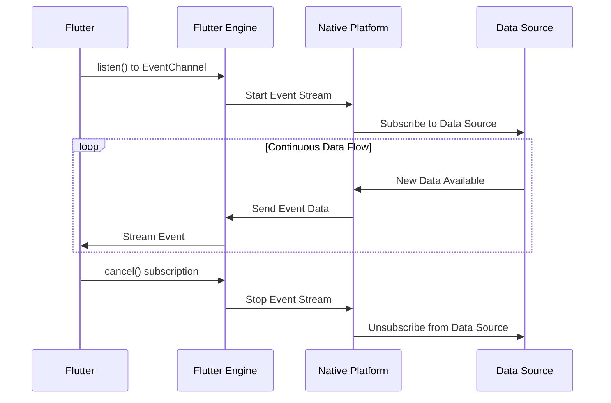

# EventChannel 详解

> EventChannel专门用于从原生平台向Flutter发送连续的数据流，如传感器数据、位置更新、网络状态变化等

## 📋 目录

- [基础概念](#基础概念)
- [基础用法](#基础用法)
- [高级特性](#高级特性)
- [生命周期管理](#生命周期管理)
- [错误处理](#错误处理)
- [性能优化](#性能优化)
- [实际应用](#实际应用)
- [最佳实践](#最佳实践)
- [故障排除](#故障排除)

## 🎯 基础概念

### EventChannel架构图



### 核心特性

- **单向流式通信**: 原生平台向Flutter发送连续数据
- **异步事件流**: 基于Dart Stream机制
- **自动生命周期管理**: 支持订阅和取消订阅
- **背压处理**: 处理数据生产和消费速度不匹配

### 与MethodChannel的区别

| 特性 | MethodChannel | EventChannel |
|------|---------------|---------------|
| 通信方向 | 双向 | 单向（原生→Flutter） |
| 数据模式 | 请求-响应 | 连续流 |
| 生命周期 | 单次调用 | 持续订阅 |
| 适用场景 | API调用 | 事件监听 |

## 🚀 基础用法

### 1. Flutter端实现

```dart
import 'package:flutter/services.dart';
import 'dart:async';

// 传感器数据服务
class SensorService {
  // 定义EventChannel
  static const EventChannel _accelerometerChannel = 
      EventChannel('com.example.sensors/accelerometer');
  static const EventChannel _gyroscopeChannel = 
      EventChannel('com.example.sensors/gyroscope');
  static const EventChannel _magnetometerChannel = 
      EventChannel('com.example.sensors/magnetometer');
  
  // 加速度计数据流
  static Stream<AccelerometerData> get accelerometerStream {
    return _accelerometerChannel
        .receiveBroadcastStream()
        .map((data) => AccelerometerData.fromMap(data));
  }
  
  // 陀螺仪数据流
  static Stream<GyroscopeData> get gyroscopeStream {
    return _gyroscopeChannel
        .receiveBroadcastStream()
        .map((data) => GyroscopeData.fromMap(data));
  }
  
  // 磁力计数据流
  static Stream<MagnetometerData> get magnetometerStream {
    return _magnetometerChannel
        .receiveBroadcastStream()
        .map((data) => MagnetometerData.fromMap(data));
  }
  
  // 带参数的传感器流
  static Stream<AccelerometerData> getAccelerometerStream({
    int samplingRate = 100, // Hz
    bool highPrecision = false,
  }) {
    return _accelerometerChannel
        .receiveBroadcastStream({
          'samplingRate': samplingRate,
          'highPrecision': highPrecision,
        })
        .map((data) => AccelerometerData.fromMap(data));
  }
}

// 加速度计数据模型
class AccelerometerData {
  final double x;
  final double y;
  final double z;
  final DateTime timestamp;
  
  AccelerometerData({
    required this.x,
    required this.y,
    required this.z,
    required this.timestamp,
  });
  
  factory AccelerometerData.fromMap(Map<dynamic, dynamic> map) {
    return AccelerometerData(
      x: (map['x'] ?? 0.0).toDouble(),
      y: (map['y'] ?? 0.0).toDouble(),
      z: (map['z'] ?? 0.0).toDouble(),
      timestamp: DateTime.fromMillisecondsSinceEpoch(map['timestamp'] ?? 0),
    );
  }
}

// 运动类型枚举
enum MotionType {
  walking,
  running,
  cycling,
  swimming,
  stationary,
}

// 心率数据
class HeartRateData {
  final int bpm;
  final HeartRateZone zone;
  final DateTime timestamp;
  
  HeartRateData({
    required this.bpm,
    required this.zone,
    required this.timestamp,
  });
  
  factory HeartRateData.fromMap(Map<dynamic, dynamic> map) {
    return HeartRateData(
      bpm: map['bpm'] ?? 0,
      zone: HeartRateZone.values[map['zone'] ?? 0],
      timestamp: DateTime.fromMillisecondsSinceEpoch(map['timestamp'] ?? 0),
    );
  }
}

// 心率区间
enum HeartRateZone {
  resting,    // 静息
  warmup,     // 热身
  fatBurn,    // 燃脂
  aerobic,    // 有氧
  anaerobic,  // 无氧
  maximum,    // 最大
}

// 综合健身数据
class FitnessData {
  final MotionEvent motion;
  final HeartRateData heartRate;
  final DateTime timestamp;
  
  FitnessData({
    required this.motion,
    required this.heartRate,
    required this.timestamp,
  });
}
```

### 2. 实时监控系统

```dart
// 系统监控服务
class SystemMonitoringService {
  static const EventChannel _cpuChannel = 
      EventChannel('com.example.monitor/cpu');
  static const EventChannel _memoryChannel = 
      EventChannel('com.example.monitor/memory');
  static const EventChannel _batteryChannel = 
      EventChannel('com.example.monitor/battery');
  
  // CPU使用率流
  static Stream<CpuUsage> get cpuUsageStream {
    return _cpuChannel
        .receiveBroadcastStream()
        .map((data) => CpuUsage.fromMap(data));
  }
  
  // 内存使用流
  static Stream<MemoryUsage> get memoryUsageStream {
    return _memoryChannel
        .receiveBroadcastStream()
        .map((data) => MemoryUsage.fromMap(data));
  }
  
  // 电池状态流
  static Stream<BatteryStatus> get batteryStatusStream {
    return _batteryChannel
        .receiveBroadcastStream()
        .map((data) => BatteryStatus.fromMap(data));
  }
  
  // 系统健康状态流
  static Stream<SystemHealth> getSystemHealthStream() {
    return Rx.combineLatest3<CpuUsage, MemoryUsage, BatteryStatus, SystemHealth>(
      cpuUsageStream,
      memoryUsageStream,
      batteryStatusStream,
      (cpu, memory, battery) => SystemHealth(
        cpu: cpu,
        memory: memory,
        battery: battery,
        timestamp: DateTime.now(),
      ),
    );
  }
}

// CPU使用率
class CpuUsage {
  final double percentage;
  final List<double> coreUsages;
  final double temperature; // 摄氏度
  final DateTime timestamp;
  
  CpuUsage({
    required this.percentage,
    required this.coreUsages,
    required this.temperature,
    required this.timestamp,
  });
  
  factory CpuUsage.fromMap(Map<dynamic, dynamic> map) {
    return CpuUsage(
      percentage: (map['percentage'] ?? 0.0).toDouble(),
      coreUsages: List<double>.from(map['coreUsages'] ?? []),
      temperature: (map['temperature'] ?? 0.0).toDouble(),
      timestamp: DateTime.fromMillisecondsSinceEpoch(map['timestamp'] ?? 0),
    );
  }
}

// 内存使用
class MemoryUsage {
  final int totalMemory;    // 字节
  final int usedMemory;     // 字节
  final int availableMemory; // 字节
  final double percentage;
  final DateTime timestamp;
  
  MemoryUsage({
    required this.totalMemory,
    required this.usedMemory,
    required this.availableMemory,
    required this.percentage,
    required this.timestamp,
  });
  
  factory MemoryUsage.fromMap(Map<dynamic, dynamic> map) {
    return MemoryUsage(
      totalMemory: map['totalMemory'] ?? 0,
      usedMemory: map['usedMemory'] ?? 0,
      availableMemory: map['availableMemory'] ?? 0,
      percentage: (map['percentage'] ?? 0.0).toDouble(),
      timestamp: DateTime.fromMillisecondsSinceEpoch(map['timestamp'] ?? 0),
    );
  }
}

// 电池状态
class BatteryStatus {
  final int level;          // 0-100
  final bool isCharging;
  final BatteryHealth health;
  final int voltage;        // 毫伏
  final int temperature;    // 摄氏度 * 10
  final DateTime timestamp;
  
  BatteryStatus({
    required this.level,
    required this.isCharging,
    required this.health,
    required this.voltage,
    required this.temperature,
    required this.timestamp,
  });
  
  factory BatteryStatus.fromMap(Map<dynamic, dynamic> map) {
    return BatteryStatus(
      level: map['level'] ?? 0,
      isCharging: map['isCharging'] ?? false,
      health: BatteryHealth.values[map['health'] ?? 0],
      voltage: map['voltage'] ?? 0,
      temperature: map['temperature'] ?? 0,
      timestamp: DateTime.fromMillisecondsSinceEpoch(map['timestamp'] ?? 0),
    );
  }
}

// 电池健康状态
enum BatteryHealth {
  unknown,
  good,
  overheat,
  dead,
  overVoltage,
  unspecifiedFailure,
  cold,
}

// 系统健康状态
class SystemHealth {
  final CpuUsage cpu;
  final MemoryUsage memory;
  final BatteryStatus battery;
  final DateTime timestamp;
  
  SystemHealth({
    required this.cpu,
    required this.memory,
    required this.battery,
    required this.timestamp,
  });
  
  // 计算系统健康评分 (0-100)
  int get healthScore {
    int score = 100;
    
    // CPU评分
    if (cpu.percentage > 80) score -= 20;
    else if (cpu.percentage > 60) score -= 10;
    
    // 内存评分
    if (memory.percentage > 90) score -= 25;
    else if (memory.percentage > 75) score -= 15;
    
    // 电池评分
    if (battery.level < 20) score -= 15;
    if (battery.health != BatteryHealth.good) score -= 20;
    
    return math.max(0, score);
  }
}
```

## 🎯 最佳实践

### 1. Channel命名规范

```dart
// 推荐的命名规范
class ChannelNames {
  // 格式: 域名/模块/功能
  static const String accelerometer = 'com.yourapp.sensors/accelerometer';
  static const String gyroscope = 'com.yourapp.sensors/gyroscope';
  static const String location = 'com.yourapp.location/updates';
  static const String network = 'com.yourapp.network/status';
  
  // 避免的命名方式
  // static const String bad1 = 'sensor';           // 太简单
  // static const String bad2 = 'my_channel';       // 不够描述性
  // static const String bad3 = 'data_stream';      // 太通用
}
```

### 2. 参数验证

```dart
// 参数验证服务
class ParameterValidator {
  static Map<String, dynamic> validateSensorParams(Map<String, dynamic>? params) {
    final validated = <String, dynamic>{};
    
    if (params != null) {
      // 采样率验证
      if (params.containsKey('samplingRate')) {
        final rate = params['samplingRate'];
        if (rate is int && rate > 0 && rate <= 1000) {
          validated['samplingRate'] = rate;
        } else {
          validated['samplingRate'] = 100; // 默认值
        }
      }
      
      // 高精度模式验证
      if (params.containsKey('highPrecision')) {
        validated['highPrecision'] = params['highPrecision'] == true;
      }
    }
    
    return validated;
  }
  
  static Map<String, dynamic> validateLocationParams(Map<String, dynamic>? params) {
    final validated = <String, dynamic>{};
    
    if (params != null) {
      // 精度验证
      if (params.containsKey('accuracy')) {
        final accuracy = params['accuracy'];
        if (accuracy is int && accuracy >= 0 && accuracy < LocationAccuracy.values.length) {
          validated['accuracy'] = accuracy;
        }
      }
      
      // 距离过滤器验证
      if (params.containsKey('distanceFilter')) {
        final filter = params['distanceFilter'];
        if (filter is num && filter >= 0) {
          validated['distanceFilter'] = filter.toDouble();
        }
      }
    }
    
    return validated;
  }
}
```

### 3. 资源管理

```dart
// 资源管理器
class EventChannelResourceManager {
  static final Map<String, StreamSubscription> _subscriptions = {};
  static final Map<String, DateTime> _lastActivity = {};
  static Timer? _cleanupTimer;
  
  static void initialize() {
    // 定期清理不活跃的订阅
    _cleanupTimer = Timer.periodic(Duration(minutes: 5), (_) {
      _cleanupInactiveSubscriptions();
    });
  }
  
  static void dispose() {
    _cleanupTimer?.cancel();
    _cancelAllSubscriptions();
  }
  
  static void registerSubscription(String key, StreamSubscription subscription) {
    // 取消现有订阅
    _subscriptions[key]?.cancel();
    
    _subscriptions[key] = subscription;
    _lastActivity[key] = DateTime.now();
  }
  
  static void updateActivity(String key) {
    _lastActivity[key] = DateTime.now();
  }
  
  static void _cleanupInactiveSubscriptions() {
    final now = DateTime.now();
    final inactiveKeys = <String>[];
    
    _lastActivity.forEach((key, lastTime) {
      if (now.difference(lastTime) > Duration(minutes: 10)) {
        inactiveKeys.add(key);
      }
    });
    
    for (final key in inactiveKeys) {
      _subscriptions[key]?.cancel();
      _subscriptions.remove(key);
      _lastActivity.remove(key);
      print('Cleaned up inactive subscription: $key');
    }
  }
  
  static void _cancelAllSubscriptions() {
    for (final subscription in _subscriptions.values) {
      subscription.cancel();
    }
    _subscriptions.clear();
    _lastActivity.clear();
  }
}
```

## 🔧 故障排除

### 常见问题及解决方案

| 问题 | 原因 | 解决方案 |
|------|------|----------|
| 流突然停止 | 原生端异常 | 实现重连机制 |
| 数据丢失 | 背压问题 | 使用缓冲区和采样 |
| 内存泄漏 | 未取消订阅 | 正确管理生命周期 |
| 性能问题 | 数据频率过高 | 实现数据过滤和聚合 |
| 权限错误 | 缺少传感器权限 | 检查并请求权限 |

### 调试技巧

```dart
// 调试工具
class EventChannelDebugger {
  static void enableDebugMode() {
    // 监听所有EventChannel错误
    FlutterError.onError = (details) {
      if (details.toString().contains('EventChannel')) {
        print('EventChannel Error: ${details.exception}');
        print('Stack trace: ${details.stack}');
      }
    };
  }
  
  static Stream<T> debugStream<T>(String name, Stream<T> stream) {
    return stream.map((data) {
      print('[$name] Received: $data');
      return data;
    }).handleError((error) {
      print('[$name] Error: $error');
    });
  }
}
```

## 📚 参考资源

- [Flutter EventChannel官方文档](https://api.flutter.dev/flutter/services/EventChannel-class.html)
- [Platform Channel深入指南](https://flutter.dev/docs/development/platform-integration/platform-channels)
- [传感器最佳实践](https://developer.android.com/guide/topics/sensors/sensors_overview)
- [iOS Core Motion框架](https://developer.apple.com/documentation/coremotion)

---

> **提示**: EventChannel是处理连续数据流的强大工具，合理使用可以构建出色的实时应用。记住要注意性能优化和资源管理！(map['timestamp'] ?? 0),
    );
  }
  
  // 计算加速度大小
  double get magnitude => math.sqrt(x * x + y * y + z * z);
  
  @override
  String toString() => 'AccelerometerData(x: $x, y: $y, z: $z, time: $timestamp)';
}

// 陀螺仪数据模型
class GyroscopeData {
  final double x; // 绕X轴旋转角速度
  final double y; // 绕Y轴旋转角速度
  final double z; // 绕Z轴旋转角速度
  final DateTime timestamp;
  
  GyroscopeData({
    required this.x,
    required this.y,
    required this.z,
    required this.timestamp,
  });
  
  factory GyroscopeData.fromMap(Map<dynamic, dynamic> map) {
    return GyroscopeData(
      x: (map['x'] ?? 0.0).toDouble(),
      y: (map['y'] ?? 0.0).toDouble(),
      z: (map['z'] ?? 0.0).toDouble(),
      timestamp: DateTime.fromMillisecondsSinceEpoch(map['timestamp'] ?? 0),
    );
  }
}

// 磁力计数据模型
class MagnetometerData {
  final double x; // X轴磁场强度
  final double y; // Y轴磁场强度
  final double z; // Z轴磁场强度
  final DateTime timestamp;
  
  MagnetometerData({
    required this.x,
    required this.y,
    required this.z,
    required this.timestamp,
  });
  
  factory MagnetometerData.fromMap(Map<dynamic, dynamic> map) {
    return MagnetometerData(
      x: (map['x'] ?? 0.0).toDouble(),
      y: (map['y'] ?? 0.0).toDouble(),
      z: (map['z'] ?? 0.0).toDouble(),
      timestamp: DateTime.fromMillisecondsSinceEpoch(map['timestamp'] ?? 0),
    );
  }
  
  // 计算磁场强度
  double get magnitude => math.sqrt(x * x + y * y + z * z);
}
```

### 2. Android端实现

```kotlin
// MainActivity.kt
package com.example.sensors

import android.content.Context
import android.hardware.Sensor
import android.hardware.SensorEvent
import android.hardware.SensorEventListener
import android.hardware.SensorManager
import androidx.annotation.NonNull
import io.flutter.embedding.android.FlutterActivity
import io.flutter.embedding.engine.FlutterEngine
import io.flutter.plugin.common.EventChannel
import io.flutter.plugin.common.EventChannel.EventSink
import io.flutter.plugin.common.EventChannel.StreamHandler

class MainActivity: FlutterActivity() {
    private val ACCELEROMETER_CHANNEL = "com.example.sensors/accelerometer"
    private val GYROSCOPE_CHANNEL = "com.example.sensors/gyroscope"
    private val MAGNETOMETER_CHANNEL = "com.example.sensors/magnetometer"
    
    private lateinit var sensorManager: SensorManager
    
    override fun configureFlutterEngine(@NonNull flutterEngine: FlutterEngine) {
        super.configureFlutterEngine(flutterEngine)
        
        sensorManager = getSystemService(Context.SENSOR_SERVICE) as SensorManager
        
        // 注册EventChannel
        EventChannel(flutterEngine.dartExecutor.binaryMessenger, ACCELEROMETER_CHANNEL)
            .setStreamHandler(AccelerometerStreamHandler(sensorManager))
            
        EventChannel(flutterEngine.dartExecutor.binaryMessenger, GYROSCOPE_CHANNEL)
            .setStreamHandler(GyroscopeStreamHandler(sensorManager))
            
        EventChannel(flutterEngine.dartExecutor.binaryMessenger, MAGNETOMETER_CHANNEL)
            .setStreamHandler(MagnetometerStreamHandler(sensorManager))
    }
}

// 加速度计流处理器
class AccelerometerStreamHandler(
    private val sensorManager: SensorManager
) : StreamHandler, SensorEventListener {
    
    private var eventSink: EventSink? = null
    private var accelerometer: Sensor? = null
    private var samplingRate: Int = SensorManager.SENSOR_DELAY_NORMAL
    
    override fun onListen(arguments: Any?, events: EventSink?) {
        eventSink = events
        accelerometer = sensorManager.getDefaultSensor(Sensor.TYPE_ACCELEROMETER)
        
        // 处理参数
        if (arguments is Map<*, *>) {
            val rate = arguments["samplingRate"] as? Int ?: 100
            samplingRate = when {
                rate >= 200 -> SensorManager.SENSOR_DELAY_FASTEST
                rate >= 100 -> SensorManager.SENSOR_DELAY_GAME
                rate >= 50 -> SensorManager.SENSOR_DELAY_UI
                else -> SensorManager.SENSOR_DELAY_NORMAL
            }
        }
        
        if (accelerometer != null) {
            sensorManager.registerListener(this, accelerometer, samplingRate)
        } else {
            eventSink?.error("SENSOR_NOT_AVAILABLE", "Accelerometer not available", null)
        }
    }
    
    override fun onCancel(arguments: Any?) {
        sensorManager.unregisterListener(this)
        eventSink = null
    }
    
    override fun onSensorChanged(event: SensorEvent?) {
        if (event?.sensor?.type == Sensor.TYPE_ACCELEROMETER) {
            val data = mapOf(
                "x" to event.values[0],
                "y" to event.values[1],
                "z" to event.values[2],
                "timestamp" to System.currentTimeMillis()
            )
            eventSink?.success(data)
        }
    }
    
    override fun onAccuracyChanged(sensor: Sensor?, accuracy: Int) {
        // 传感器精度变化处理
        val accuracyLevel = when (accuracy) {
            SensorManager.SENSOR_STATUS_ACCURACY_HIGH -> "high"
            SensorManager.SENSOR_STATUS_ACCURACY_MEDIUM -> "medium"
            SensorManager.SENSOR_STATUS_ACCURACY_LOW -> "low"
            else -> "unreliable"
        }
        
        val data = mapOf(
            "type" to "accuracy_changed",
            "accuracy" to accuracyLevel
        )
        eventSink?.success(data)
    }
}

// 陀螺仪流处理器
class GyroscopeStreamHandler(
    private val sensorManager: SensorManager
) : StreamHandler, SensorEventListener {
    
    private var eventSink: EventSink? = null
    private var gyroscope: Sensor? = null
    
    override fun onListen(arguments: Any?, events: EventSink?) {
        eventSink = events
        gyroscope = sensorManager.getDefaultSensor(Sensor.TYPE_GYROSCOPE)
        
        if (gyroscope != null) {
            sensorManager.registerListener(this, gyroscope, SensorManager.SENSOR_DELAY_GAME)
        } else {
            eventSink?.error("SENSOR_NOT_AVAILABLE", "Gyroscope not available", null)
        }
    }
    
    override fun onCancel(arguments: Any?) {
        sensorManager.unregisterListener(this)
        eventSink = null
    }
    
    override fun onSensorChanged(event: SensorEvent?) {
        if (event?.sensor?.type == Sensor.TYPE_GYROSCOPE) {
            val data = mapOf(
                "x" to event.values[0], // 绕X轴旋转角速度 (rad/s)
                "y" to event.values[1], // 绕Y轴旋转角速度 (rad/s)
                "z" to event.values[2], // 绕Z轴旋转角速度 (rad/s)
                "timestamp" to System.currentTimeMillis()
            )
            eventSink?.success(data)
        }
    }
    
    override fun onAccuracyChanged(sensor: Sensor?, accuracy: Int) {
        // 处理精度变化
    }
}

// 磁力计流处理器
class MagnetometerStreamHandler(
    private val sensorManager: SensorManager
) : StreamHandler, SensorEventListener {
    
    private var eventSink: EventSink? = null
    private var magnetometer: Sensor? = null
    
    override fun onListen(arguments: Any?, events: EventSink?) {
        eventSink = events
        magnetometer = sensorManager.getDefaultSensor(Sensor.TYPE_MAGNETIC_FIELD)
        
        if (magnetometer != null) {
            sensorManager.registerListener(this, magnetometer, SensorManager.SENSOR_DELAY_GAME)
        } else {
            eventSink?.error("SENSOR_NOT_AVAILABLE", "Magnetometer not available", null)
        }
    }
    
    override fun onCancel(arguments: Any?) {
        sensorManager.unregisterListener(this)
        eventSink = null
    }
    
    override fun onSensorChanged(event: SensorEvent?) {
        if (event?.sensor?.type == Sensor.TYPE_MAGNETIC_FIELD) {
            val data = mapOf(
                "x" to event.values[0], // X轴磁场强度 (μT)
                "y" to event.values[1], // Y轴磁场强度 (μT)
                "z" to event.values[2], // Z轴磁场强度 (μT)
                "timestamp" to System.currentTimeMillis()
            )
            eventSink?.success(data)
        }
    }
    
    override fun onAccuracyChanged(sensor: Sensor?, accuracy: Int) {
        // 处理精度变化
    }
}
```

### 3. iOS端实现

```swift
// AppDelegate.swift
import UIKit
import Flutter
import CoreMotion

@UIApplicationMain
@objc class AppDelegate: FlutterAppDelegate {
    override func application(
        _ application: UIApplication,
        didFinishLaunchingWithOptions launchOptions: [UIApplication.LaunchOptionsKey: Any]?
    ) -> Bool {
        
        let controller : FlutterViewController = window?.rootViewController as! FlutterViewController
        
        // 注册EventChannel
        let accelerometerChannel = FlutterEventChannel(
            name: "com.example.sensors/accelerometer",
            binaryMessenger: controller.binaryMessenger
        )
        accelerometerChannel.setStreamHandler(AccelerometerStreamHandler())
        
        let gyroscopeChannel = FlutterEventChannel(
            name: "com.example.sensors/gyroscope",
            binaryMessenger: controller.binaryMessenger
        )
        gyroscopeChannel.setStreamHandler(GyroscopeStreamHandler())
        
        let magnetometerChannel = FlutterEventChannel(
            name: "com.example.sensors/magnetometer",
            binaryMessenger: controller.binaryMessenger
        )
        magnetometerChannel.setStreamHandler(MagnetometerStreamHandler())
        
        GeneratedPluginRegistrant.register(with: self)
        return super.application(application, didFinishLaunchingWithOptions: launchOptions)
    }
}

// 加速度计流处理器
class AccelerometerStreamHandler: NSObject, FlutterStreamHandler {
    private let motionManager = CMMotionManager()
    private var eventSink: FlutterEventSink?
    
    func onListen(withArguments arguments: Any?, eventSink events: @escaping FlutterEventSink) -> FlutterError? {
        self.eventSink = events
        
        guard motionManager.isAccelerometerAvailable else {
            return FlutterError(code: "SENSOR_NOT_AVAILABLE", 
                              message: "Accelerometer not available", 
                              details: nil)
        }
        
        // 处理参数
        var updateInterval: TimeInterval = 0.01 // 100Hz
        if let args = arguments as? [String: Any],
           let samplingRate = args["samplingRate"] as? Int {
            updateInterval = 1.0 / Double(samplingRate)
        }
        
        motionManager.accelerometerUpdateInterval = updateInterval
        
        motionManager.startAccelerometerUpdates(to: .main) { [weak self] (data, error) in
            guard let self = self, let accelerometerData = data else {
                if let error = error {
                    self?.eventSink?(FlutterError(code: "SENSOR_ERROR", 
                                                message: error.localizedDescription, 
                                                details: nil))
                }
                return
            }
            
            let result: [String: Any] = [
                "x": accelerometerData.acceleration.x,
                "y": accelerometerData.acceleration.y,
                "z": accelerometerData.acceleration.z,
                "timestamp": Int64(Date().timeIntervalSince1970 * 1000)
            ]
            
            self.eventSink?(result)
        }
        
        return nil
    }
    
    func onCancel(withArguments arguments: Any?) -> FlutterError? {
        motionManager.stopAccelerometerUpdates()
        eventSink = nil
        return nil
    }
}

// 陀螺仪流处理器
class GyroscopeStreamHandler: NSObject, FlutterStreamHandler {
    private let motionManager = CMMotionManager()
    private var eventSink: FlutterEventSink?
    
    func onListen(withArguments arguments: Any?, eventSink events: @escaping FlutterEventSink) -> FlutterError? {
        self.eventSink = events
        
        guard motionManager.isGyroAvailable else {
            return FlutterError(code: "SENSOR_NOT_AVAILABLE", 
                              message: "Gyroscope not available", 
                              details: nil)
        }
        
        motionManager.gyroUpdateInterval = 0.01 // 100Hz
        
        motionManager.startGyroUpdates(to: .main) { [weak self] (data, error) in
            guard let self = self, let gyroData = data else {
                if let error = error {
                    self?.eventSink?(FlutterError(code: "SENSOR_ERROR", 
                                                message: error.localizedDescription, 
                                                details: nil))
                }
                return
            }
            
            let result: [String: Any] = [
                "x": gyroData.rotationRate.x,
                "y": gyroData.rotationRate.y,
                "z": gyroData.rotationRate.z,
                "timestamp": Int64(Date().timeIntervalSince1970 * 1000)
            ]
            
            self.eventSink?(result)
        }
        
        return nil
    }
    
    func onCancel(withArguments arguments: Any?) -> FlutterError? {
        motionManager.stopGyroUpdates()
        eventSink = nil
        return nil
    }
}

// 磁力计流处理器
class MagnetometerStreamHandler: NSObject, FlutterStreamHandler {
    private let motionManager = CMMotionManager()
    private var eventSink: FlutterEventSink?
    
    func onListen(withArguments arguments: Any?, eventSink events: @escaping FlutterEventSink) -> FlutterError? {
        self.eventSink = events
        
        guard motionManager.isMagnetometerAvailable else {
            return FlutterError(code: "SENSOR_NOT_AVAILABLE", 
                              message: "Magnetometer not available", 
                              details: nil)
        }
        
        motionManager.magnetometerUpdateInterval = 0.01 // 100Hz
        
        motionManager.startMagnetometerUpdates(to: .main) { [weak self] (data, error) in
            guard let self = self, let magnetometerData = data else {
                if let error = error {
                    self?.eventSink?(FlutterError(code: "SENSOR_ERROR", 
                                                message: error.localizedDescription, 
                                                details: nil))
                }
                return
            }
            
            let result: [String: Any] = [
                "x": magnetometerData.magneticField.x,
                "y": magnetometerData.magneticField.y,
                "z": magnetometerData.magneticField.z,
                "timestamp": Int64(Date().timeIntervalSince1970 * 1000)
            ]
            
            self.eventSink?(result)
        }
        
        return nil
    }
    
    func onCancel(withArguments arguments: Any?) -> FlutterError? {
        motionManager.stopMagnetometerUpdates()
        eventSink = nil
        return nil
    }
}
```

## 🔧 高级特性

### 1. 多参数EventChannel

```dart
// 位置服务
class LocationService {
  static const EventChannel _locationChannel = 
      EventChannel('com.example.location/updates');
  
  // 获取位置更新流
  static Stream<LocationData> getLocationStream({
    LocationAccuracy accuracy = LocationAccuracy.high,
    double distanceFilter = 10.0, // 米
    Duration interval = const Duration(seconds: 5),
  }) {
    final arguments = {
      'accuracy': accuracy.index,
      'distanceFilter': distanceFilter,
      'interval': interval.inMilliseconds,
    };
    
    return _locationChannel
        .receiveBroadcastStream(arguments)
        .map((data) => LocationData.fromMap(data));
  }
}

// 位置精度枚举
enum LocationAccuracy {
  low,      // 粗略位置
  medium,   // 平衡精度和电量
  high,     // 高精度
  best,     // 最佳精度
}

// 位置数据模型
class LocationData {
  final double latitude;
  final double longitude;
  final double altitude;
  final double accuracy;
  final double speed;
  final double bearing;
  final DateTime timestamp;
  
  LocationData({
    required this.latitude,
    required this.longitude,
    required this.altitude,
    required this.accuracy,
    required this.speed,
    required this.bearing,
    required this.timestamp,
  });
  
  factory LocationData.fromMap(Map<dynamic, dynamic> map) {
    return LocationData(
      latitude: (map['latitude'] ?? 0.0).toDouble(),
      longitude: (map['longitude'] ?? 0.0).toDouble(),
      altitude: (map['altitude'] ?? 0.0).toDouble(),
      accuracy: (map['accuracy'] ?? 0.0).toDouble(),
      speed: (map['speed'] ?? 0.0).toDouble(),
      bearing: (map['bearing'] ?? 0.0).toDouble(),
      timestamp: DateTime.fromMillisecondsSinceEpoch(map['timestamp'] ?? 0),
    );
  }
}
```

### 2. 错误和状态事件

```dart
// 网络状态服务
class NetworkStatusService {
  static const EventChannel _networkChannel = 
      EventChannel('com.example.network/status');
  
  static Stream<NetworkEvent> get networkStream {
    return _networkChannel
        .receiveBroadcastStream()
        .map((data) => NetworkEvent.fromMap(data));
  }
}

// 网络事件基类
abstract class NetworkEvent {
  final DateTime timestamp;
  
  NetworkEvent({required this.timestamp});
  
  factory NetworkEvent.fromMap(Map<dynamic, dynamic> map) {
    final type = map['type'] as String;
    
    switch (type) {
      case 'status_change':
        return NetworkStatusChange.fromMap(map);
      case 'speed_test':
        return NetworkSpeedTest.fromMap(map);
      case 'error':
        return NetworkError.fromMap(map);
      default:
        throw ArgumentError('Unknown network event type: $type');
    }
  }
}

// 网络状态变化事件
class NetworkStatusChange extends NetworkEvent {
  final NetworkType networkType;
  final bool isConnected;
  final String? ssid; // WiFi名称
  final int signalStrength; // 信号强度
  
  NetworkStatusChange({
    required this.networkType,
    required this.isConnected,
    this.ssid,
    required this.signalStrength,
    required DateTime timestamp,
  }) : super(timestamp: timestamp);
  
  factory NetworkStatusChange.fromMap(Map<dynamic, dynamic> map) {
    return NetworkStatusChange(
      networkType: NetworkType.values[map['networkType'] ?? 0],
      isConnected: map['isConnected'] ?? false,
      ssid: map['ssid'],
      signalStrength: map['signalStrength'] ?? 0,
      timestamp: DateTime.fromMillisecondsSinceEpoch(map['timestamp'] ?? 0),
    );
  }
}

// 网络速度测试事件
class NetworkSpeedTest extends NetworkEvent {
  final double downloadSpeed; // Mbps
  final double uploadSpeed;   // Mbps
  final int latency;          // ms
  
  NetworkSpeedTest({
    required this.downloadSpeed,
    required this.uploadSpeed,
    required this.latency,
    required DateTime timestamp,
  }) : super(timestamp: timestamp);
  
  factory NetworkSpeedTest.fromMap(Map<dynamic, dynamic> map) {
    return NetworkSpeedTest(
      downloadSpeed: (map['downloadSpeed'] ?? 0.0).toDouble(),
      uploadSpeed: (map['uploadSpeed'] ?? 0.0).toDouble(),
      latency: map['latency'] ?? 0,
      timestamp: DateTime.fromMillisecondsSinceEpoch(map['timestamp'] ?? 0),
    );
  }
}

// 网络错误事件
class NetworkError extends NetworkEvent {
  final String errorCode;
  final String errorMessage;
  final String? details;
  
  NetworkError({
    required this.errorCode,
    required this.errorMessage,
    this.details,
    required DateTime timestamp,
  }) : super(timestamp: timestamp);
  
  factory NetworkError.fromMap(Map<dynamic, dynamic> map) {
    return NetworkError(
      errorCode: map['errorCode'] ?? 'UNKNOWN',
      errorMessage: map['errorMessage'] ?? 'Unknown error',
      details: map['details'],
      timestamp: DateTime.fromMillisecondsSinceEpoch(map['timestamp'] ?? 0),
    );
  }
}

// 网络类型枚举
enum NetworkType {
  none,
  wifi,
  cellular,
  ethernet,
}
```

### 3. 背压处理

```dart
// 背压处理服务
class BackpressureService {
  static const EventChannel _dataChannel = 
      EventChannel('com.example.data/stream');
  
  // 带背压处理的数据流
  static Stream<DataPacket> getDataStreamWithBackpressure({
    int bufferSize = 100,
    Duration throttleDuration = const Duration(milliseconds: 100),
  }) {
    return _dataChannel
        .receiveBroadcastStream({
          'bufferSize': bufferSize,
          'throttleDuration': throttleDuration.inMilliseconds,
        })
        .map((data) => DataPacket.fromMap(data))
        .transform(BackpressureTransformer<DataPacket>(
          bufferSize: bufferSize,
          onOverflow: (droppedCount) {
            print('Warning: Dropped $droppedCount data packets due to backpressure');
          },
        ));
  }
}

// 背压转换器
class BackpressureTransformer<T> extends StreamTransformerBase<T, T> {
  final int bufferSize;
  final void Function(int droppedCount)? onOverflow;
  
  BackpressureTransformer({
    required this.bufferSize,
    this.onOverflow,
  });
  
  @override
  Stream<T> bind(Stream<T> stream) {
    late StreamController<T> controller;
    late StreamSubscription<T> subscription;
    final buffer = <T>[];
    int droppedCount = 0;
    
    controller = StreamController<T>(
      onListen: () {
        subscription = stream.listen(
          (data) {
            if (buffer.length >= bufferSize) {
              // 缓冲区满，丢弃最旧的数据
              buffer.removeAt(0);
              droppedCount++;
            }
            
            buffer.add(data);
            
            // 如果控制器有监听者，立即发送数据
            if (controller.hasListener && buffer.isNotEmpty) {
              final item = buffer.removeAt(0);
              controller.add(item);
            }
          },
          onError: controller.addError,
          onDone: () {
            // 发送剩余缓冲区数据
            for (final item in buffer) {
              controller.add(item);
            }
            
            if (droppedCount > 0) {
              onOverflow?.call(droppedCount);
            }
            
            controller.close();
          },
        );
      },
      onCancel: () {
        subscription.cancel();
      },
    );
    
    return controller.stream;
  }
}

// 数据包模型
class DataPacket {
  final int id;
  final List<int> data;
  final DateTime timestamp;
  
  DataPacket({
    required this.id,
    required this.data,
    required this.timestamp,
  });
  
  factory DataPacket.fromMap(Map<dynamic, dynamic> map) {
    return DataPacket(
      id: map['id'] ?? 0,
      data: List<int>.from(map['data'] ?? []),
      timestamp: DateTime.fromMillisecondsSinceEpoch(map['timestamp'] ?? 0),
    );
  }
}
```

## 🔄 生命周期管理

### 1. 自动订阅管理

```dart
// 订阅管理器
class SubscriptionManager {
  static final Map<String, StreamSubscription> _subscriptions = {};
  static final Map<String, StreamController> _controllers = {};
  
  // 创建管理的订阅
  static Stream<T> createManagedStream<T>(
    String key,
    Stream<T> sourceStream, {
    void Function(T data)? onData,
    void Function(dynamic error)? onError,
    void Function()? onDone,
  }) {
    // 取消现有订阅
    cancelSubscription(key);
    
    final controller = StreamController<T>.broadcast();
    _controllers[key] = controller;
    
    final subscription = sourceStream.listen(
      (data) {
        onData?.call(data);
        if (!controller.isClosed) {
          controller.add(data);
        }
      },
      onError: (error) {
        onError?.call(error);
        if (!controller.isClosed) {
          controller.addError(error);
        }
      },
      onDone: () {
        onDone?.call();
        if (!controller.isClosed) {
          controller.close();
        }
        _subscriptions.remove(key);
        _controllers.remove(key);
      },
    );
    
    _subscriptions[key] = subscription;
    return controller.stream;
  }
  
  // 取消特定订阅
  static void cancelSubscription(String key) {
    _subscriptions[key]?.cancel();
    _subscriptions.remove(key);
    
    _controllers[key]?.close();
    _controllers.remove(key);
  }
  
  // 取消所有订阅
  static void cancelAllSubscriptions() {
    for (final subscription in _subscriptions.values) {
      subscription.cancel();
    }
    _subscriptions.clear();
    
    for (final controller in _controllers.values) {
      controller.close();
    }
    _controllers.clear();
  }
  
  // 获取活跃订阅数量
  static int get activeSubscriptionCount => _subscriptions.length;
  
  // 获取活跃订阅列表
  static List<String> get activeSubscriptionKeys => _subscriptions.keys.toList();
}

// 使用示例
class SensorManager {
  static const String _accelerometerKey = 'accelerometer';
  static const String _gyroscopeKey = 'gyroscope';
  
  // 开始传感器监听
  static void startSensorMonitoring() {
    // 加速度计
    SubscriptionManager.createManagedStream<AccelerometerData>(
      _accelerometerKey,
      SensorService.accelerometerStream,
      onData: (data) {
        print('Accelerometer: ${data.magnitude.toStringAsFixed(2)} m/s²');
      },
      onError: (error) {
        print('Accelerometer error: $error');
      },
    );
    
    // 陀螺仪
    SubscriptionManager.createManagedStream<GyroscopeData>(
      _gyroscopeKey,
      SensorService.gyroscopeStream,
      onData: (data) {
        print('Gyroscope: x=${data.x.toStringAsFixed(2)}, y=${data.y.toStringAsFixed(2)}, z=${data.z.toStringAsFixed(2)}');
      },
      onError: (error) {
        print('Gyroscope error: $error');
      },
    );
  }
  
  // 停止传感器监听
  static void stopSensorMonitoring() {
    SubscriptionManager.cancelSubscription(_accelerometerKey);
    SubscriptionManager.cancelSubscription(_gyroscopeKey);
  }
  
  // 停止所有监听
  static void stopAllMonitoring() {
    SubscriptionManager.cancelAllSubscriptions();
  }
}
```

### 2. 应用生命周期集成

```dart
// 生命周期感知的EventChannel管理器
class LifecycleAwareEventManager extends WidgetsBindingObserver {
  static final LifecycleAwareEventManager _instance = LifecycleAwareEventManager._internal();
  factory LifecycleAwareEventManager() => _instance;
  LifecycleAwareEventManager._internal();
  
  final Map<String, StreamSubscription> _activeStreams = {};
  final Map<String, Function()> _streamCreators = {};
  bool _isAppInForeground = true;
  
  void initialize() {
    WidgetsBinding.instance.addObserver(this);
  }
  
  void dispose() {
    WidgetsBinding.instance.removeObserver(this);
    _pauseAllStreams();
  }
  
  @override
  void didChangeAppLifecycleState(AppLifecycleState state) {
    switch (state) {
      case AppLifecycleState.resumed:
        _isAppInForeground = true;
        _resumeAllStreams();
        break;
      case AppLifecycleState.paused:
      case AppLifecycleState.inactive:
        _isAppInForeground = false;
        _pauseAllStreams();
        break;
      case AppLifecycleState.detached:
        _pauseAllStreams();
        break;
    }
  }
  
  // 注册生命周期感知的流
  void registerStream(String key, Function() streamCreator) {
    _streamCreators[key] = streamCreator;
    
    if (_isAppInForeground) {
      _createStream(key);
    }
  }
  
  // 取消注册流
  void unregisterStream(String key) {
    _activeStreams[key]?.cancel();
    _activeStreams.remove(key);
    _streamCreators.remove(key);
  }
  
  void _createStream(String key) {
    final creator = _streamCreators[key];
    if (creator != null) {
      _activeStreams[key]?.cancel();
      _activeStreams[key] = creator();
    }
  }
  
  void _pauseAllStreams() {
    for (final subscription in _activeStreams.values) {
      subscription.cancel();
    }
    _activeStreams.clear();
  }
  
  void _resumeAllStreams() {
    for (final key in _streamCreators.keys) {
      _createStream(key);
    }
  }
}

// 使用示例
class SmartSensorService {
  static final _lifecycleManager = LifecycleAwareEventManager();
  
  static void initialize() {
    _lifecycleManager.initialize();
    
    // 注册传感器流
    _lifecycleManager.registerStream('accelerometer', () {
      return SensorService.accelerometerStream.listen((data) {
        _handleAccelerometerData(data);
      });
    });
    
    _lifecycleManager.registerStream('location', () {
      return LocationService.getLocationStream().listen((data) {
        _handleLocationData(data);
      });
    });
  }
  
  static void dispose() {
    _lifecycleManager.dispose();
  }
  
  static void _handleAccelerometerData(AccelerometerData data) {
    // 处理加速度计数据
  }
  
  static void _handleLocationData(LocationData data) {
    // 处理位置数据
  }
}
```

## ⚠️ 错误处理

### 1. 流错误处理

```dart
// 错误处理包装器
class ErrorHandlingEventChannel {
  final EventChannel _channel;
  final String _channelName;
  
  ErrorHandlingEventChannel(this._channelName) 
      : _channel = EventChannel(_channelName);
  
  Stream<T> receiveBroadcastStream<T>({
    dynamic arguments,
    T Function(dynamic)? mapper,
    T? defaultValue,
    Duration retryDelay = const Duration(seconds: 1),
    int maxRetries = 3,
  }) {
    return _createResilientStream<T>(
      arguments: arguments,
      mapper: mapper,
      defaultValue: defaultValue,
      retryDelay: retryDelay,
      maxRetries: maxRetries,
    );
  }
  
  Stream<T> _createResilientStream<T>({
    dynamic arguments,
    T Function(dynamic)? mapper,
    T? defaultValue,
    Duration retryDelay = const Duration(seconds: 1),
    int maxRetries = 3,
  }) async* {
    int retryCount = 0;
    
    while (retryCount <= maxRetries) {
      try {
        await for (final data in _channel.receiveBroadcastStream(arguments)) {
          try {
            if (mapper != null) {
              yield mapper(data);
            } else {
              yield data as T;
            }
            retryCount = 0; // 重置重试计数
          } catch (e) {
            print('Data mapping error in $_channelName: $e');
            if (defaultValue != null) {
              yield defaultValue;
            }
          }
        }
        break; // 正常结束，退出重试循环
      } catch (e) {
        retryCount++;
        print('Stream error in $_channelName (attempt $retryCount): $e');
        
        if (retryCount > maxRetries) {
          print('Max retries exceeded for $_channelName');
          if (defaultValue != null) {
            yield defaultValue;
          }
          break;
        }
        
        print('Retrying $_channelName in ${retryDelay.inSeconds} seconds...');
        await Future.delayed(retryDelay);
        
        // 指数退避
        retryDelay = Duration(milliseconds: (retryDelay.inMilliseconds * 1.5).round());
      }
    }
  }
}

// 使用示例
class ResilientSensorService {
  static final _accelerometerChannel = ErrorHandlingEventChannel('com.example.sensors/accelerometer');
  static final _locationChannel = ErrorHandlingEventChannel('com.example.location/updates');
  
  static Stream<AccelerometerData> get accelerometerStream {
    return _accelerometerChannel.receiveBroadcastStream<AccelerometerData>(
      mapper: (data) => AccelerometerData.fromMap(data),
      defaultValue: AccelerometerData(
        x: 0, y: 0, z: 0, 
        timestamp: DateTime.now(),
      ),
      maxRetries: 5,
    );
  }
  
  static Stream<LocationData> get locationStream {
    return _locationChannel.receiveBroadcastStream<LocationData>(
      arguments: {
        'accuracy': LocationAccuracy.high.index,
        'distanceFilter': 10.0,
      },
      mapper: (data) => LocationData.fromMap(data),
      maxRetries: 3,
    );
  }
}
```

### 2. 超时处理

```dart
// 超时处理服务
class TimeoutEventChannel {
  final EventChannel _channel;
  final Duration _timeout;
  
  TimeoutEventChannel(String name, this._timeout) 
      : _channel = EventChannel(name);
  
  Stream<T> receiveBroadcastStreamWithTimeout<T>({
    dynamic arguments,
    T Function(dynamic)? mapper,
  }) {
    return _channel
        .receiveBroadcastStream(arguments)
        .timeout(
          _timeout,
          onTimeout: (sink) {
            sink.addError(TimeoutException('EventChannel timeout', _timeout));
          },
        )
        .map((data) => mapper != null ? mapper(data) : data as T);
  }
}

// 心跳检测
class HeartbeatEventChannel {
  final EventChannel _channel;
  final Duration _heartbeatInterval;
  Timer? _heartbeatTimer;
  DateTime? _lastDataReceived;
  
  HeartbeatEventChannel(String name, this._heartbeatInterval) 
      : _channel = EventChannel(name);
  
  Stream<T> receiveBroadcastStreamWithHeartbeat<T>({
    dynamic arguments,
    T Function(dynamic)? mapper,
    void Function()? onHeartbeatMissed,
  }) {
    late StreamController<T> controller;
    late StreamSubscription subscription;
    
    controller = StreamController<T>(
      onListen: () {
        _startHeartbeat(onHeartbeatMissed);
        
        subscription = _channel.receiveBroadcastStream(arguments).listen(
          (data) {
            _lastDataReceived = DateTime.now();
            final mappedData = mapper != null ? mapper(data) : data as T;
            controller.add(mappedData);
          },
          onError: controller.addError,
          onDone: () {
            _stopHeartbeat();
            controller.close();
          },
        );
      },
      onCancel: () {
        _stopHeartbeat();
        subscription.cancel();
      },
    );
    
    return controller.stream;
  }
  
  void _startHeartbeat(void Function()? onHeartbeatMissed) {
    _lastDataReceived = DateTime.now();
    
    _heartbeatTimer = Timer.periodic(_heartbeatInterval, (timer) {
      final now = DateTime.now();
      if (_lastDataReceived != null) {
        final timeSinceLastData = now.difference(_lastDataReceived!);
        if (timeSinceLastData > _heartbeatInterval * 2) {
          onHeartbeatMissed?.call();
        }
      }
    });
  }
  
  void _stopHeartbeat() {
    _heartbeatTimer?.cancel();
    _heartbeatTimer = null;
  }
}
```

## 🚀 性能优化

### 1. 数据采样和过滤

```dart
// 数据采样器
class DataSampler<T> {
  final Duration _samplingInterval;
  final bool Function(T data)? _filter;
  DateTime? _lastSampleTime;
  
  DataSampler({
    required Duration samplingInterval,
    bool Function(T data)? filter,
  }) : _samplingInterval = samplingInterval,
       _filter = filter;
  
  Stream<T> sample(Stream<T> source) {
    return source.where((data) {
      final now = DateTime.now();
      
      // 应用过滤器
      if (_filter != null && !_filter!(data)) {
        return false;
      }
      
      // 检查采样间隔
      if (_lastSampleTime == null || 
          now.difference(_lastSampleTime!) >= _samplingInterval) {
        _lastSampleTime = now;
        return true;
      }
      
      return false;
    });
  }
}

// 使用示例
class OptimizedSensorService {
  static Stream<AccelerometerData> getOptimizedAccelerometerStream() {
    final sampler = DataSampler<AccelerometerData>(
      samplingInterval: Duration(milliseconds: 100), // 10Hz
      filter: (data) => data.magnitude > 0.1, // 过滤静止状态
    );
    
    return sampler.sample(SensorService.accelerometerStream);
  }
  
  static Stream<LocationData> getOptimizedLocationStream() {
    final sampler = DataSampler<LocationData>(
      samplingInterval: Duration(seconds: 5),
      filter: (data) => data.accuracy < 20.0, // 只接受高精度位置
    );
    
    return sampler.sample(LocationService.getLocationStream());
  }
}
```

### 2. 数据聚合

```dart
// 数据聚合器
class DataAggregator<T> {
  final Duration _windowSize;
  final List<T> _buffer = [];
  final StreamController<List<T>> _controller = StreamController.broadcast();
  Timer? _windowTimer;
  
  DataAggregator({required Duration windowSize}) : _windowSize = windowSize;
  
  Stream<List<T>> aggregate(Stream<T> source) {
    source.listen(
      (data) {
        _buffer.add(data);
        
        // 启动窗口计时器
        _windowTimer ??= Timer(_windowSize, _flushBuffer);
      },
      onError: _controller.addError,
      onDone: () {
        _flushBuffer();
        _controller.close();
      },
    );
    
    return _controller.stream;
  }
  
  void _flushBuffer() {
    if (_buffer.isNotEmpty) {
      _controller.add(List.from(_buffer));
      _buffer.clear();
    }
    _windowTimer = null;
  }
  
  void dispose() {
    _windowTimer?.cancel();
    _controller.close();
  }
}

// 统计聚合器
class StatisticsAggregator {
  static Stream<AccelerometerStatistics> aggregateAccelerometerData(
    Stream<AccelerometerData> source,
    Duration windowSize,
  ) {
    final aggregator = DataAggregator<AccelerometerData>(windowSize: windowSize);
    
    return aggregator.aggregate(source).map((dataList) {
      if (dataList.isEmpty) {
        return AccelerometerStatistics.empty();
      }
      
      final magnitudes = dataList.map((d) => d.magnitude).toList();
      magnitudes.sort();
      
      final sum = magnitudes.reduce((a, b) => a + b);
      final mean = sum / magnitudes.length;
      
      final variance = magnitudes
          .map((m) => math.pow(m - mean, 2))
          .reduce((a, b) => a + b) / magnitudes.length;
      
      return AccelerometerStatistics(
        count: dataList.length,
        mean: mean,
        min: magnitudes.first,
        max: magnitudes.last,
        standardDeviation: math.sqrt(variance),
        windowStart: dataList.first.timestamp,
        windowEnd: dataList.last.timestamp,
      );
    });
  }
}

// 加速度计统计数据
class AccelerometerStatistics {
  final int count;
  final double mean;
  final double min;
  final double max;
  final double standardDeviation;
  final DateTime windowStart;
  final DateTime windowEnd;
  
  AccelerometerStatistics({
    required this.count,
    required this.mean,
    required this.min,
    required this.max,
    required this.standardDeviation,
    required this.windowStart,
    required this.windowEnd,
  });
  
  factory AccelerometerStatistics.empty() {
    final now = DateTime.now();
    return AccelerometerStatistics(
      count: 0,
      mean: 0.0,
      min: 0.0,
      max: 0.0,
      standardDeviation: 0.0,
      windowStart: now,
      windowEnd: now,
    );
  }
}
```

### 3. 内存管理

```dart
// 内存感知的EventChannel管理器
class MemoryAwareEventManager {
  static const int _maxBufferSize = 1000;
  static const Duration _memoryCheckInterval = Duration(seconds: 30);
  
  final Map<String, CircularBuffer> _buffers = {};
  Timer? _memoryCheckTimer;
  
  void initialize() {
    _startMemoryMonitoring();
  }
  
  void dispose() {
    _memoryCheckTimer?.cancel();
    _buffers.clear();
  }
  
  Stream<T> createManagedStream<T>(
    String key,
    Stream<T> source, {
    int? bufferSize,
  }) {
    final buffer = CircularBuffer<T>(bufferSize ?? _maxBufferSize);
    _buffers[key] = buffer;
    
    return source.map((data) {
      buffer.add(data);
      return data;
    });
  }
  
  void _startMemoryMonitoring() {
    _memoryCheckTimer = Timer.periodic(_memoryCheckInterval, (timer) {
      _checkMemoryUsage();
    });
  }
  
  void _checkMemoryUsage() {
    // 检查缓冲区大小并清理
    _buffers.forEach((key, buffer) {
      if (buffer.length > _maxBufferSize * 0.8) {
        print('Warning: Buffer $key is ${buffer.length}/${buffer.capacity}');
        buffer.clear();
      }
    });
  }
}

// 循环缓冲区
class CircularBuffer<T> {
  final List<T?> _buffer;
  final int capacity;
  int _head = 0;
  int _tail = 0;
  int _size = 0;
  
  CircularBuffer(this.capacity) : _buffer = List.filled(capacity, null);
  
  void add(T item) {
    _buffer[_tail] = item;
    _tail = (_tail + 1) % capacity;
    
    if (_size < capacity) {
      _size++;
    } else {
      _head = (_head + 1) % capacity;
    }
  }
  
  T? get() {
    if (_size == 0) return null;
    
    final item = _buffer[_head];
    _buffer[_head] = null;
    _head = (_head + 1) % capacity;
    _size--;
    
    return item;
  }
  
  void clear() {
    _head = 0;
    _tail = 0;
    _size = 0;
    for (int i = 0; i < capacity; i++) {
      _buffer[i] = null;
    }
  }
  
  int get length => _size;
  bool get isEmpty => _size == 0;
  bool get isFull => _size == capacity;
}
```

## 📱 实际应用

### 1. 健身追踪应用

```dart
// 健身追踪服务
class FitnessTrackingService {
  static const EventChannel _motionChannel = 
      EventChannel('com.example.fitness/motion');
  static const EventChannel _heartRateChannel = 
      EventChannel('com.example.fitness/heartrate');
  
  // 运动检测流
  static Stream<MotionEvent> get motionStream {
    return _motionChannel
        .receiveBroadcastStream()
        .map((data) => MotionEvent.fromMap(data));
  }
  
  // 心率监测流
  static Stream<HeartRateData> get heartRateStream {
    return _heartRateChannel
        .receiveBroadcastStream()
        .map((data) => HeartRateData.fromMap(data));
  }
  
  // 综合健身数据流
  static Stream<FitnessData> getFitnessDataStream() {
    return Rx.combineLatest2<MotionEvent, HeartRateData, FitnessData>(
      motionStream,
      heartRateStream,
      (motion, heartRate) => FitnessData(
        motion: motion,
        heartRate: heartRate,
        timestamp: DateTime.now(),
      ),
    );
  }
}

// 运动事件
class MotionEvent {
  final MotionType type;
  final double intensity;
  final int stepCount;
  final double distance; // 米
  final double calories;
  final DateTime timestamp;
  
  MotionEvent({
    required this.type,
    required this.intensity,
    required this.stepCount,
    required this.distance,
    required this.calories,
    required this.timestamp,
  });
  
  factory MotionEvent.fromMap(Map<dynamic, dynamic> map) {
    return MotionEvent(
      type: MotionType.values[map['type'] ?? 0],
      intensity: (map['intensity'] ?? 0.0).toDouble(),
      stepCount: map['stepCount'] ?? 0,
      distance: (map['distance'] ?? 0.0).toDouble(),
      calories: (map['calories'] ?? 0.0).toDouble(),
      timestamp: DateTime.fromMillisecondsSinceEpoch