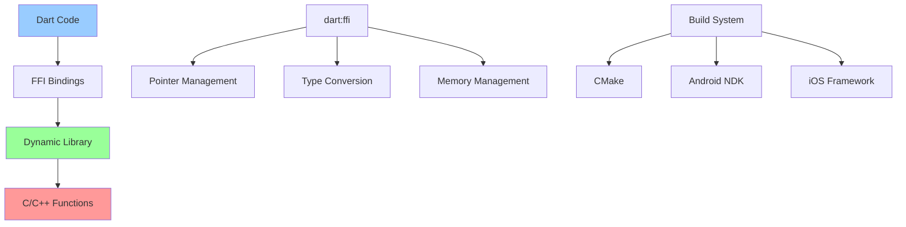

# FFI (Foreign Function Interface) 集成详解

> FFI允许Dart直接调用C/C++代码，提供最高性能的原生集成方案

## 📋 FFI架构图



## 🎯 基础概念

### FFI特点
- **直接调用**: 无需序列化，直接调用C函数
- **高性能**: 接近原生性能
- **类型安全**: 编译时类型检查
- **内存控制**: 精确的内存管理

### 适用场景
- 计算密集型任务
- 图像/音频处理
- 加密算法
- 现有C/C++库集成
- 性能关键路径

## 🚀 基础使用

### 1. 项目结构

```
my_ffi_app/
├── lib/
│   ├── main.dart
│   ├── ffi_bindings.dart
│   └── native_library.dart
├── native/
│   ├── CMakeLists.txt
│   ├── math_operations.h
│   ├── math_operations.c
│   ├── string_utils.h
│   ├── string_utils.c
│   └── image_processing.cpp
├── android/
│   └── app/
│       └── build.gradle
├── ios/
│   └── Runner.xcodeproj/
└── pubspec.yaml
```

### 2. C/C++代码实现

```c
// native/math_operations.h
#ifndef MATH_OPERATIONS_H
#define MATH_OPERATIONS_H

#ifdef __cplusplus
extern "C" {
#endif

// 基础数学运算
int add_numbers(int a, int b);
double multiply_doubles(double a, double b);
int factorial(int n);

// 数组操作
void sum_array(double* array, int length, double* result);
void multiply_arrays(double* a, double* b, double* result, int length);

// 字符串操作
int string_length(const char* str);
char* reverse_string(const char* str);
void free_string(char* str);

// 复杂计算
double calculate_pi(int iterations);
void matrix_multiply(double* a, double* b, double* result, int size);

#ifdef __cplusplus
}
#endif

#endif // MATH_OPERATIONS_H
```

```c
// native/math_operations.c
#include "math_operations.h"
#include <stdlib.h>
#include <string.h>
#include <math.h>

// 基础数学运算
int add_numbers(int a, int b) {
    return a + b;
}

double multiply_doubles(double a, double b) {
    return a * b;
}

int factorial(int n) {
    if (n <= 1) return 1;
    return n * factorial(n - 1);
}

// 数组操作
void sum_array(double* array, int length, double* result) {
    *result = 0.0;
    for (int i = 0; i < length; i++) {
        *result += array[i];
    }
}

void multiply_arrays(double* a, double* b, double* result, int length) {
    for (int i = 0; i < length; i++) {
        result[i] = a[i] * b[i];
    }
}

// 字符串操作
int string_length(const char* str) {
    return strlen(str);
}

char* reverse_string(const char* str) {
    int len = strlen(str);
    char* reversed = (char*)malloc((len + 1) * sizeof(char));
    
    for (int i = 0; i < len; i++) {
        reversed[i] = str[len - 1 - i];
    }
    reversed[len] = '\0';
    
    return reversed;
}

void free_string(char* str) {
    free(str);
}

// 复杂计算
double calculate_pi(int iterations) {
    double pi = 0.0;
    for (int i = 0; i < iterations; i++) {
        double term = 1.0 / (2 * i + 1);
        if (i % 2 == 0) {
            pi += term;
        } else {
            pi -= term;
        }
    }
    return pi * 4.0;
}

void matrix_multiply(double* a, double* b, double* result, int size) {
    for (int i = 0; i < size; i++) {
        for (int j = 0; j < size; j++) {
            result[i * size + j] = 0.0;
            for (int k = 0; k < size; k++) {
                result[i * size + j] += a[i * size + k] * b[k * size + j];
            }
        }
    }
}
```

```cpp
// native/image_processing.cpp
#include <cstdint>
#include <algorithm>
#include <cmath>

extern "C" {

// 图像处理函数
void apply_grayscale(uint8_t* pixels, int width, int height) {
    for (int i = 0; i < width * height; i++) {
        int offset = i * 4; // RGBA
        uint8_t r = pixels[offset];
        uint8_t g = pixels[offset + 1];
        uint8_t b = pixels[offset + 2];
        
        // 灰度转换公式
        uint8_t gray = static_cast<uint8_t>(0.299 * r + 0.587 * g + 0.114 * b);
        
        pixels[offset] = gray;
        pixels[offset + 1] = gray;
        pixels[offset + 2] = gray;
        // Alpha通道保持不变
    }
}

void apply_blur(uint8_t* pixels, int width, int height, int radius) {
    // 简单的盒式模糊
    uint8_t* temp = new uint8_t[width * height * 4];
    std::copy(pixels, pixels + width * height * 4, temp);
    
    for (int y = 0; y < height; y++) {
        for (int x = 0; x < width; x++) {
            int r = 0, g = 0, b = 0, count = 0;
            
            for (int dy = -radius; dy <= radius; dy++) {
                for (int dx = -radius; dx <= radius; dx++) {
                    int nx = x + dx;
                    int ny = y + dy;
                    
                    if (nx >= 0 && nx < width && ny >= 0 && ny < height) {
                        int offset = (ny * width + nx) * 4;
                        r += temp[offset];
                        g += temp[offset + 1];
                        b += temp[offset + 2];
                        count++;
                    }
                }
            }
            
            int offset = (y * width + x) * 4;
            pixels[offset] = r / count;
            pixels[offset + 1] = g / count;
            pixels[offset + 2] = b / count;
        }
    }
    
    delete[] temp;
}

void apply_brightness(uint8_t* pixels, int width, int height, float factor) {
    for (int i = 0; i < width * height; i++) {
        int offset = i * 4;
        
        pixels[offset] = std::min(255, static_cast<int>(pixels[offset] * factor));
        pixels[offset + 1] = std::min(255, static_cast<int>(pixels[offset + 1] * factor));
        pixels[offset + 2] = std::min(255, static_cast<int>(pixels[offset + 2] * factor));
    }
}

}
```

### 3. 构建配置

```cmake
# native/CMakeLists.txt
cmake_minimum_required(VERSION 3.10)
project(native_library)

set(CMAKE_CXX_STANDARD 17)

# 添加源文件
set(SOURCES
    math_operations.c
    string_utils.c
    image_processing.cpp
)

# 创建共享库
add_library(native_library SHARED ${SOURCES})

# 设置输出目录
if(ANDROID)
    set_target_properties(native_library PROPERTIES
        LIBRARY_OUTPUT_DIRECTORY "${CMAKE_CURRENT_SOURCE_DIR}/../android/app/src/main/jniLibs/${ANDROID_ABI}"
    )
elseif(IOS)
    set_target_properties(native_library PROPERTIES
        FRAMEWORK TRUE
        FRAMEWORK_VERSION A
        MACOSX_FRAMEWORK_IDENTIFIER com.example.native_library
    )
else()
    # Desktop platforms
    set_target_properties(native_library PROPERTIES
        LIBRARY_OUTPUT_DIRECTORY "${CMAKE_CURRENT_SOURCE_DIR}/../build"
    )
endif()

# 编译选项
target_compile_options(native_library PRIVATE
    -O3
    -ffast-math
    -DNDEBUG
)
```

```gradle
// android/app/build.gradle
android {
    // ... 其他配置
    
    externalNativeBuild {
        cmake {
            path "../../native/CMakeLists.txt"
            version "3.18.1"
        }
    }
    
    defaultConfig {
        // ... 其他配置
        
        externalNativeBuild {
            cmake {
                cppFlags "-std=c++17"
                arguments "-DANDROID_STL=c++_shared"
            }
        }
        
        ndk {
            abiFilters 'arm64-v8a', 'armeabi-v7a', 'x86_64'
        }
    }
}
```

### 4. Dart FFI绑定

```dart
// lib/ffi_bindings.dart
import 'dart:ffi';
import 'dart:io';
import 'dart:typed_data';
import 'package:ffi/ffi.dart';

// 函数签名定义
typedef AddNumbersNative = Int32 Function(Int32 a, Int32 b);
typedef AddNumbersDart = int Function(int a, int b);

typedef MultiplyDoublesNative = Double Function(Double a, Double b);
typedef MultiplyDoublesDart = double Function(double a, double b);

typedef FactorialNative = Int32 Function(Int32 n);
typedef FactorialDart = int Function(int n);

typedef SumArrayNative = Void Function(Pointer<Double> array, Int32 length, Pointer<Double> result);
typedef SumArrayDart = void Function(Pointer<Double> array, int length, Pointer<Double> result);

typedef MultiplyArraysNative = Void Function(Pointer<Double> a, Pointer<Double> b, Pointer<Double> result, Int32 length);
typedef MultiplyArraysDart = void Function(Pointer<Double> a, Pointer<Double> b, Pointer<Double> result, int length);

typedef StringLengthNative = Int32 Function(Pointer<Utf8> str);
typedef StringLengthDart = int Function(Pointer<Utf8> str);

typedef ReverseStringNative = Pointer<Utf8> Function(Pointer<Utf8> str);
typedef ReverseStringDart = Pointer<Utf8> Function(Pointer<Utf8> str);

typedef FreeStringNative = Void Function(Pointer<Utf8> str);
typedef FreeStringDart = void Function(Pointer<Utf8> str);

typedef CalculatePiNative = Double Function(Int32 iterations);
typedef CalculatePiDart = double Function(int iterations);

typedef MatrixMultiplyNative = Void Function(Pointer<Double> a, Pointer<Double> b, Pointer<Double> result, Int32 size);
typedef MatrixMultiplyDart = void Function(Pointer<Double> a, Pointer<Double> b, Pointer<Double> result, int size);

// 图像处理函数签名
typedef ApplyGrayscaleNative = Void Function(Pointer<Uint8> pixels, Int32 width, Int32 height);
typedef ApplyGrayscaleDart = void Function(Pointer<Uint8> pixels, int width, int height);

typedef ApplyBlurNative = Void Function(Pointer<Uint8> pixels, Int32 width, Int32 height, Int32 radius);
typedef ApplyBlurDart = void Function(Pointer<Uint8> pixels, int width, int height, int radius);

typedef ApplyBrightnessNative = Void Function(Pointer<Uint8> pixels, Int32 width, Int32 height, Float factor);
typedef ApplyBrightnessDart = void Function(Pointer<Uint8> pixels, int width, int height, double factor);

// 原生库加载
class NativeLibrary {
  static late DynamicLibrary _lib;
  
  // 函数指针
  static late AddNumbersDart addNumbers;
  static late MultiplyDoublesDart multiplyDoubles;
  static late FactorialDart factorial;
  static late SumArrayDart sumArray;
  static late MultiplyArraysDart multiplyArrays;
  static late StringLengthDart stringLength;
  static late ReverseStringDart reverseString;
  static late FreeStringDart freeString;
  static late CalculatePiDart calculatePi;
  static late MatrixMultiplyDart matrixMultiply;
  static late ApplyGrayscaleDart applyGrayscale;
  static late ApplyBlurDart applyBlur;
  static late ApplyBrightnessDart applyBrightness;
  
  static void initialize() {
    // 加载动态库
    if (Platform.isAndroid) {
      _lib = DynamicLibrary.open('libnative_library.so');
    } else if (Platform.isIOS) {
      _lib = DynamicLibrary.process();
    } else if (Platform.isWindows) {
      _lib = DynamicLibrary.open('native_library.dll');
    } else if (Platform.isLinux) {
      _lib = DynamicLibrary.open('libnative_library.so');
    } else if (Platform.isMacOS) {
      _lib = DynamicLibrary.open('libnative_library.dylib');
    } else {
      throw UnsupportedError('Unsupported platform');
    }
    
    // 获取函数指针
    addNumbers = _lib.lookup<NativeFunction<AddNumbersNative>>('add_numbers').asFunction();
    multiplyDoubles = _lib.lookup<NativeFunction<MultiplyDoublesNative>>('multiply_doubles').asFunction();
    factorial = _lib.lookup<NativeFunction<FactorialNative>>('factorial').asFunction();
    sumArray = _lib.lookup<NativeFunction<SumArrayNative>>('sum_array').asFunction();
    multiplyArrays = _lib.lookup<NativeFunction<MultiplyArraysNative>>('multiply_arrays').asFunction();
    stringLength = _lib.lookup<NativeFunction<StringLengthNative>>('string_length').asFunction();
    reverseString = _lib.lookup<NativeFunction<ReverseStringNative>>('reverse_string').asFunction();
    freeString = _lib.lookup<NativeFunction<FreeStringNative>>('free_string').asFunction();
    calculatePi = _lib.lookup<NativeFunction<CalculatePiNative>>('calculate_pi').asFunction();
    matrixMultiply = _lib.lookup<NativeFunction<MatrixMultiplyNative>>('matrix_multiply').asFunction();
    applyGrayscale = _lib.lookup<NativeFunction<ApplyGrayscaleNative>>('apply_grayscale').asFunction();
    applyBlur = _lib.lookup<NativeFunction<ApplyBlurNative>>('apply_blur').asFunction();
    applyBrightness = _lib.lookup<NativeFunction<ApplyBrightnessNative>>('apply_brightness').asFunction();
  }
}
```

### 5. 高级封装

```dart
// lib/native_library.dart
import 'dart:ffi';
import 'dart:typed_data';
import 'package:ffi/ffi.dart';
import 'ffi_bindings.dart';

// 数学运算服务
class MathService {
  static void initialize() {
    NativeLibrary.initialize();
  }
  
  // 基础运算
  static int add(int a, int b) {
    return NativeLibrary.addNumbers(a, b);
  }
  
  static double multiply(double a, double b) {
    return NativeLibrary.multiplyDoubles(a, b);
  }
  
  static int factorial(int n) {
    if (n < 0) throw ArgumentError('n must be non-negative');
    return NativeLibrary.factorial(n);
  }
  
  // 数组操作
  static double sumArray(List<double> array) {
    if (array.isEmpty) return 0.0;
    
    final arrayPtr = malloc<Double>(array.length);
    final resultPtr = malloc<Double>();
    
    try {
      // 复制数据到原生内存
      for (int i = 0; i < array.length; i++) {
        arrayPtr[i] = array[i];
      }
      
      NativeLibrary.sumArray(arrayPtr, array.length, resultPtr);
      return resultPtr.value;
    } finally {
      malloc.free(arrayPtr);
      malloc.free(resultPtr);
    }
  }
  
  static List<double> multiplyArrays(List<double> a, List<double> b) {
    if (a.length != b.length) {
      throw ArgumentError('Arrays must have the same length');
    }
    
    final length = a.length;
    final aPtr = malloc<Double>(length);
    final bPtr = malloc<Double>(length);
    final resultPtr = malloc<Double>(length);
    
    try {
      // 复制输入数据
      for (int i = 0; i < length; i++) {
        aPtr[i] = a[i];
        bPtr[i] = b[i];
      }
      
      NativeLibrary.multiplyArrays(aPtr, bPtr, resultPtr, length);
      
      // 复制结果
      final result = <double>[];
      for (int i = 0; i < length; i++) {
        result.add(resultPtr[i]);
      }
      
      return result;
    } finally {
      malloc.free(aPtr);
      malloc.free(bPtr);
      malloc.free(resultPtr);
    }
  }
  
  // 复杂计算
  static double calculatePi(int iterations) {
    if (iterations <= 0) throw ArgumentError('iterations must be positive');
    return NativeLibrary.calculatePi(iterations);
  }
  
  static List<List<double>> matrixMultiply(List<List<double>> a, List<List<double>> b) {
    if (a.isEmpty || b.isEmpty || a[0].length != b.length) {
      throw ArgumentError('Invalid matrix dimensions');
    }
    
    final size = a.length;
    final aPtr = malloc<Double>(size * size);
    final bPtr = malloc<Double>(size * size);
    final resultPtr = malloc<Double>(size * size);
    
    try {
      // 复制矩阵数据（行优先）
      for (int i = 0; i < size; i++) {
        for (int j = 0; j < size; j++) {
          aPtr[i * size + j] = a[i][j];
          bPtr[i * size + j] = b[i][j];
        }
      }
      
      NativeLibrary.matrixMultiply(aPtr, bPtr, resultPtr, size);
      
      // 复制结果
      final result = List.generate(size, (_) => List<double>.filled(size, 0.0));
      for (int i = 0; i < size; i++) {
        for (int j = 0; j < size; j++) {
          result[i][j] = resultPtr[i * size + j];
        }
      }
      
      return result;
    } finally {
      malloc.free(aPtr);
      malloc.free(bPtr);
      malloc.free(resultPtr);
    }
  }
}

// 字符串处理服务
class StringService {
  static int getLength(String str) {
    final strPtr = str.toNativeUtf8();
    try {
      return NativeLibrary.stringLength(strPtr);
    } finally {
      malloc.free(strPtr);
    }
  }
  
  static String reverse(String str) {
    final strPtr = str.toNativeUtf8();
    try {
      final reversedPtr = NativeLibrary.reverseString(strPtr);
      final result = reversedPtr.toDartString();
      NativeLibrary.freeString(reversedPtr);
      return result;
    } finally {
      malloc.free(strPtr);
    }
  }
}

// 图像处理服务
class ImageProcessingService {
  static Uint8List applyGrayscale(Uint8List pixels, int width, int height) {
    if (pixels.length != width * height * 4) {
      throw ArgumentError('Invalid pixel data size');
    }
    
    final pixelsPtr = malloc<Uint8>(pixels.length);
    try {
      // 复制像素数据
      for (int i = 0; i < pixels.length; i++) {
        pixelsPtr[i] = pixels[i];
      }
      
      NativeLibrary.applyGrayscale(pixelsPtr, width, height);
      
      // 复制处理后的数据
      final result = Uint8List(pixels.length);
      for (int i = 0; i < pixels.length; i++) {
        result[i] = pixelsPtr[i];
      }
      
      return result;
    } finally {
      malloc.free(pixelsPtr);
    }
  }
  
  static Uint8List applyBlur(Uint8List pixels, int width, int height, int radius) {
    if (pixels.length != width * height * 4) {
      throw ArgumentError('Invalid pixel data size');
    }
    
    final pixelsPtr = malloc<Uint8>(pixels.length);
    try {
      for (int i = 0; i < pixels.length; i++) {
        pixelsPtr[i] = pixels[i];
      }
      
      NativeLibrary.applyBlur(pixelsPtr, width, height, radius);
      
      final result = Uint8List(pixels.length);
      for (int i = 0; i < pixels.length; i++) {
        result[i] = pixelsPtr[i];
      }
      
      return result;
    } finally {
      malloc.free(pixelsPtr);
    }
  }
  
  static Uint8List applyBrightness(Uint8List pixels, int width, int height, double factor) {
    if (pixels.length != width * height * 4) {
      throw ArgumentError('Invalid pixel data size');
    }
    
    final pixelsPtr = malloc<Uint8>(pixels.length);
    try {
      for (int i = 0; i < pixels.length; i++) {
        pixelsPtr[i] = pixels[i];
      }
      
      NativeLibrary.applyBrightness(pixelsPtr, width, height, factor);
      
      final result = Uint8List(pixels.length);
      for (int i = 0; i < pixels.length; i++) {
        result[i] = pixelsPtr[i];
      }
      
      return result;
    } finally {
      malloc.free(pixelsPtr);
    }
  }
}
```

## 🎯 高级特性

### 1. 异步FFI调用

```dart
// 异步FFI包装器
import 'dart:isolate';
import 'dart:async';

class AsyncMathService {
  // 在独立Isolate中执行计算密集型任务
  static Future<double> calculatePiAsync(int iterations) async {
    final receivePort = ReceivePort();
    
    await Isolate.spawn(_calculatePiIsolate, {
      'sendPort': receivePort.sendPort,
      'iterations': iterations,
    });
    
    final result = await receivePort.first as double;
    return result;
  }
  
  static void _calculatePiIsolate(Map<String, dynamic> args) {
    final sendPort = args['sendPort'] as SendPort;
    final iterations = args['iterations'] as int;
    
    // 在Isolate中初始化FFI
    MathService.initialize();
    
    // 执行计算
    final result = MathService.calculatePi(iterations);
    
    sendPort.send(result);
  }
  
  // 批量矩阵运算
  static Future<List<List<List<double>>>> batchMatrixMultiply(
    List<List<List<double>>> matrices
  ) async {
    final futures = <Future<List<List<double>>>>[];
    
    for (int i = 0; i < matrices.length - 1; i += 2) {
      futures.add(_matrixMultiplyAsync(matrices[i], matrices[i + 1]));
    }
    
    return await Future.wait(futures);
  }
  
  static Future<List<List<double>>> _matrixMultiplyAsync(
    List<List<double>> a,
    List<List<double>> b,
  ) async {
    final receivePort = ReceivePort();
    
    await Isolate.spawn(_matrixMultiplyIsolate, {
      'sendPort': receivePort.sendPort,
      'matrixA': a,
      'matrixB': b,
    });
    
    final result = await receivePort.first as List<List<double>>;
    return result;
  }
  
  static void _matrixMultiplyIsolate(Map<String, dynamic> args) {
    final sendPort = args['sendPort'] as SendPort;
    final matrixA = args['matrixA'] as List<List<double>>;
    final matrixB = args['matrixB'] as List<List<double>>;
    
    MathService.initialize();
    
    final result = MathService.matrixMultiply(matrixA, matrixB);
    sendPort.send(result);
  }
}
```

### 2. 内存池管理

```dart
// 内存池管理器
class MemoryPool {
  static final Map<int, List<Pointer<Void>>> _pools = {};
  static final Map<Pointer<Void>, int> _allocatedSizes = {};
  
  // 从池中获取内存
  static Pointer<T> allocate<T extends NativeType>(int count) {
    final size = sizeOf<T>() * count;
    
    if (_pools.containsKey(size) && _pools[size]!.isNotEmpty) {
      final ptr = _pools[size]!.removeLast();
      return ptr.cast<T>();
    }
    
    final ptr = malloc<T>(count);
    _allocatedSizes[ptr.cast<Void>()] = size;
    return ptr;
  }
  
  // 归还内存到池中
  static void deallocate<T extends NativeType>(Pointer<T> ptr) {
    final voidPtr = ptr.cast<Void>();
    final size = _allocatedSizes[voidPtr];
    
    if (size != null) {
      _pools.putIfAbsent(size, () => <Pointer<Void>>[]);
      _pools[size]!.add(voidPtr);
    }
  }
  
  // 清理内存池
  static void cleanup() {
    for (final pool in _pools.values) {
      for (final ptr in pool) {
        malloc.free(ptr);
      }
    }
    _pools.clear();
    _allocatedSizes.clear();
  }
}

// 使用内存池的优化服务
class OptimizedMathService {
  static List<double> multiplyArraysOptimized(List<double> a, List<double> b) {
    if (a.length != b.length) {
      throw ArgumentError('Arrays must have the same length');
    }
    
    final length = a.length;
    final aPtr = MemoryPool.allocate<Double>(length);
    final bPtr = MemoryPool.allocate<Double>(length);
    final resultPtr = MemoryPool.allocate<Double>(length);
    
    try {
      // 复制输入数据
      for (int i = 0; i < length; i++) {
        aPtr[i] = a[i];
        bPtr[i] = b[i];
      }
      
      NativeLibrary.multiplyArrays(aPtr, bPtr, resultPtr, length);
      
      // 复制结果
      final result = <double>[];
      for (int i = 0; i < length; i++) {
        result.add(resultPtr[i]);
      }
      
      return result;
    } finally {
      MemoryPool.deallocate(aPtr);
      MemoryPool.deallocate(bPtr);
      MemoryPool.deallocate(resultPtr);
    }
  }
}
```

### 3. 错误处理和调试

```dart
// FFI错误处理
class FFIException implements Exception {
  final String message;
  final String? nativeStackTrace;
  
  FFIException(this.message, [this.nativeStackTrace]);
  
  @override
  String toString() {
    if (nativeStackTrace != null) {
      return 'FFIException: $message\nNative stack trace:\n$nativeStackTrace';
    }
    return 'FFIException: $message';
  }
}

// 安全的FFI包装器
class SafeFFIWrapper {
  static T safeCall<T>(T Function() operation, [T? defaultValue]) {
    try {
      return operation();
    } catch (e) {
      print('FFI operation failed: $e');
      if (defaultValue != null) {
        return defaultValue;
      }
      rethrow;
    }
  }
  
  static Future<T> safeCallAsync<T>(Future<T> Function() operation, [T? defaultValue]) async {
    try {
      return await operation();
    } catch (e) {
      print('Async FFI operation failed: $e');
      if (defaultValue != null) {
        return defaultValue;
      }
      rethrow;
    }
  }
}

// 调试工具
class FFIDebugger {
  static bool _debugEnabled = false;
  static final List<String> _callLog = [];
  
  static void enableDebug() {
    _debugEnabled = true;
  }
  
  static void disableDebug() {
    _debugEnabled = false;
  }
  
  static void logCall(String functionName, List<dynamic> args) {
    if (_debugEnabled) {
      final logEntry = '${DateTime.now()}: $functionName($args)';
      _callLog.add(logEntry);
      print(logEntry);
    }
  }
  
  static List<String> getCallLog() {
    return List.from(_callLog);
  }
  
  static void clearLog() {
    _callLog.clear();
  }
}
```

## 📊 性能优化

### 1. 批量操作

```dart
// 批量图像处理
class BatchImageProcessor {
  static List<Uint8List> processBatch(
    List<Uint8List> images,
    int width,
    int height,
    ImageOperation operation,
  ) {
    final results = <Uint8List>[];
    
    // 预分配内存
    final pixelSize = width * height * 4;
    final batchPtr = malloc<Uint8>(pixelSize * images.length);
    
    try {
      // 批量复制输入数据
      for (int i = 0; i < images.length; i++) {
        final offset = i * pixelSize;
        for (int j = 0; j < pixelSize; j++) {
          batchPtr[offset + j] = images[i][j];
        }
      }
      
      // 批量处理
      for (int i = 0; i < images.length; i++) {
        final imagePtr = batchPtr.elementAt(i * pixelSize);
        
        switch (operation) {
          case ImageOperation.grayscale:
            NativeLibrary.applyGrayscale(imagePtr, width, height);
            break;
          case ImageOperation.blur:
            NativeLibrary.applyBlur(imagePtr, width, height, 2);
            break;
          case ImageOperation.brightness:
            NativeLibrary.applyBrightness(imagePtr, width, height, 1.2);
            break;
        }
      }
      
      // 批量复制结果
      for (int i = 0; i < images.length; i++) {
        final result = Uint8List(pixelSize);
        final offset = i * pixelSize;
        for (int j = 0; j < pixelSize; j++) {
          result[j] = batchPtr[offset + j];
        }
        results.add(result);
      }
      
      return results;
    } finally {
      malloc.free(batchPtr);
    }
  }
}

enum ImageOperation {
  grayscale,
  blur,
  brightness,
}
```

### 2. 性能监控

```dart
// 性能监控器
class FFIPerformanceMonitor {
  static final Map<String, List<int>> _timings = {};
  static final Map<String, int> _callCounts = {};
  
  static T measureCall<T>(String functionName, T Function() operation) {
    final stopwatch = Stopwatch()..start();
    
    try {
      final result = operation();
      return result;
    } finally {
      stopwatch.stop();
      _recordTiming(functionName, stopwatch.elapsedMicroseconds);
    }
  }
  
  static void _recordTiming(String functionName, int microseconds) {
    _timings.putIfAbsent(functionName, () => <int>[]);
    _timings[functionName]!.add(microseconds);
    
    _callCounts[functionName] = (_callCounts[functionName] ?? 0) + 1;
  }
  
  static Map<String, dynamic> getStatistics() {
    final stats = <String, dynamic>{};
    
    for (final entry in _timings.entries) {
      final functionName = entry.key;
      final timings = entry.value;
      
      if (timings.isNotEmpty) {
        final total = timings.reduce((a, b) => a + b);
        final average = total / timings.length;
        final min = timings.reduce((a, b) => a < b ? a : b);
        final max = timings.reduce((a, b) => a > b ? a : b);
        
        stats[functionName] = {
          'callCount': _callCounts[functionName],
          'totalTime': total,
          'averageTime': average,
          'minTime': min,
          'maxTime': max,
        };
      }
    }
    
    return stats;
  }
  
  static void reset() {
    _timings.clear();
    _callCounts.clear();
  }
}
```

## 🧪 测试

### 1. 单元测试

```dart
// test/ffi_test.dart
import 'package:flutter_test/flutter_test.dart';
import 'package:myapp/native_library.dart';

void main() {
  setUpAll(() {
    MathService.initialize();
  });
  
  group('MathService', () {
    test('add numbers', () {
      expect(MathService.add(5, 3), equals(8));
      expect(MathService.add(-2, 7), equals(5));
      expect(MathService.add(0, 0), equals(0));
    });
    
    test('multiply doubles', () {
      expect(MathService.multiply(2.5, 4.0), closeTo(10.0, 0.001));
      expect(MathService.multiply(-1.5, 2.0), closeTo(-3.0, 0.001));
    });
    
    test('factorial', () {
      expect(MathService.factorial(0), equals(1));
      expect(MathService.factorial(1), equals(1));
      expect(MathService.factorial(5), equals(120));
      expect(() => MathService.factorial(-1), throwsArgumentError);
    });
    
    test('sum array', () {
      expect(MathService.sumArray([1.0, 2.0, 3.0, 4.0]), closeTo(10.0, 0.001));
      expect(MathService.sumArray([]), equals(0.0));
      expect(MathService.sumArray([-1.0, 1.0]), equals(0.0));
    });
    
    test('multiply arrays', () {
      final result = MathService.multiplyArrays([1.0, 2.0, 3.0], [2.0, 3.0, 4.0]);
      expect(result, equals([2.0, 6.0, 12.0]));
      
      expect(
        () => MathService.multiplyArrays([1.0, 2.0], [1.0, 2.0, 3.0]),
        throwsArgumentError,
      );
    });
    
    test('calculate pi', () {
      final pi = MathService.calculatePi(1000000);
      expect(pi, closeTo(3.14159, 0.001));
      
      expect(() => MathService.calculatePi(0), throwsArgumentError);
      expect(() => MathService.calculatePi(-1), throwsArgumentError);
    });
    
    test('matrix multiply', () {
      final a = [[1.0, 2.0], [3.0, 4.0]];
      final b = [[5.0, 6.0], [7.0, 8.0]];
      final result = MathService.matrixMultiply(a, b);
      
      expect(result[0][0], closeTo(19.0, 0.001)); // 1*5 + 2*7
      expect(result[0][1], closeTo(22.0, 0.001)); // 1*6 + 2*8
      expect(result[1][0], closeTo(43.0, 0.001)); // 3*5 + 4*7
      expect(result[1][1], closeTo(50.0, 0.001)); // 3*6 + 4*8
    });
  });
  
  group('StringService', () {
    test('get string length', () {
      expect(StringService.getLength('hello'), equals(5));
      expect(StringService.getLength(''), equals(0));
      expect(StringService.getLength('测试'), equals(6)); // UTF-8字节数
    });
    
    test('reverse string', () {
      expect(StringService.reverse('hello'), equals('olleh'));
      expect(StringService.reverse(''), equals(''));
      expect(StringService.reverse('a'), equals('a'));
    });
  });
  
  group('ImageProcessingService', () {
    test('apply grayscale', () {
      // 创建2x2 RGBA图像
      final pixels = Uint8List.fromList([
        255, 0, 0, 255,    // 红色像素
        0, 255, 0, 255,    // 绿色像素
        0, 0, 255, 255,    // 蓝色像素
        255, 255, 255, 255 // 白色像素
      ]);
      
      final result = ImageProcessingService.applyGrayscale(pixels, 2, 2);
      
      // 检查灰度转换
      expect(result[0], equals(result[1])); // R == G
      expect(result[1], equals(result[2])); // G == B
      expect(result[3], equals(255)); // Alpha保持不变
    });
  });
}
```

### 2. 性能测试

```dart
// test/performance_test.dart
import 'package:flutter_test/flutter_test.dart';
import 'package:myapp/native_library.dart';

void main() {
  setUpAll(() {
    MathService.initialize();
  });
  
  group('Performance Tests', () {
    test('large array operations', () {
      final largeArray = List.generate(1000000, (i) => i.toDouble());
      
      final stopwatch = Stopwatch()..start();
      final sum = MathService.sumArray(largeArray);
      stopwatch.stop();
      
      print('Large array sum took: ${stopwatch.elapsedMilliseconds}ms');
      expect(sum, closeTo(499999500000.0, 1000.0));
      expect(stopwatch.elapsedMilliseconds, lessThan(1000)); // 应该在1秒内完成
    });
    
    test('pi calculation performance', () {
      final iterations = [1000, 10000, 100000, 1000000];
      
      for (final iter in iterations) {
        final stopwatch = Stopwatch()..start();
        final pi = MathService.calculatePi(iter);
        stopwatch.stop();
        
        print('Pi calculation ($iter iterations) took: ${stopwatch.elapsedMilliseconds}ms');
        expect(pi, closeTo(3.14159, 0.1));
      }
    });
    
    test('matrix multiplication performance', () {
      final sizes = [10, 50, 100];
      
      for (final size in sizes) {
        final a = List.generate(size, (i) => List.generate(size, (j) => (i + j).toDouble()));
        final b = List.generate(size, (i) => List.generate(size, (j) => (i * j).toDouble()));
        
        final stopwatch = Stopwatch()..start();
        final result = MathService.matrixMultiply(a, b);
        stopwatch.stop();
        
        print('Matrix multiplication (${size}x$size) took: ${stopwatch.elapsedMilliseconds}ms');
        expect(result.length, equals(size));
        expect(result[0].length, equals(size));
      }
    });
  });
}
```

## 📚 最佳实践

### 1. 内存管理
- 始终配对使用malloc和free
- 使用try-finally确保内存释放
- 考虑使用内存池减少分配开销
- 监控内存使用情况

### 2. 错误处理
- 验证输入参数
- 处理原生代码异常
- 提供有意义的错误信息
- 实现优雅降级

### 3. 性能优化
- 减少Dart-Native边界跨越
- 批量处理数据
- 使用适当的数据类型
- 在Isolate中执行CPU密集型任务

### 4. 平台兼容性
- 测试所有目标平台
- 处理平台特定差异
- 提供回退方案
- 文档化平台要求

---

> 💡 **提示**: FFI是Flutter中性能最高的原生集成方案，但也需要更多的内存管理和错误处理考虑。建议从简单的函数调用开始，逐步掌握复杂的数据结构和内存管理技巧。