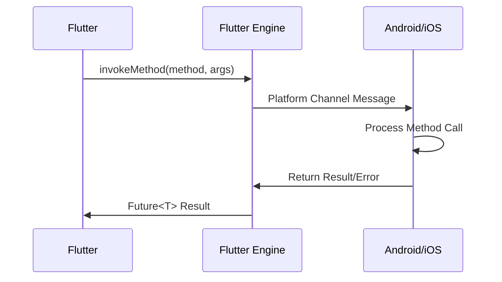

# MethodChannel 详解

> MethodChannel是Flutter中最常用的原生通信方式，提供了简单而强大的方法调用机制

## 📋 目录

- [基础概念](#基础概念)
- [基础用法](#基础用法)
- [高级特性](#高级特性)
- [错误处理](#错误处理)
- [性能优化](#性能优化)
- [实际应用](#实际应用)
- [最佳实践](#最佳实践)
- [故障排除](#故障排除)

## 🎯 基础概念

### MethodChannel架构图



### 核心特性

- **双向通信**: Flutter可以调用原生方法，原生也可以调用Flutter方法
- **异步处理**: 所有调用都是异步的，返回Future
- **类型安全**: 支持多种数据类型的自动序列化
- **错误处理**: 完善的异常处理机制

## 🚀 基础用法

### 1. Flutter端实现

```dart
import 'package:flutter/services.dart';

class DeviceService {
  // 定义MethodChannel
  static const MethodChannel _channel = MethodChannel('com.example.device');
  
  // 获取设备信息
  static Future<Map<String, dynamic>> getDeviceInfo() async {
    try {
      final Map<String, dynamic> result = 
          await _channel.invokeMethod('getDeviceInfo');
      return result;
    } on PlatformException catch (e) {
      throw Exception('Failed to get device info: ${e.message}');
    }
  }
  
  // 获取电池电量
  static Future<int> getBatteryLevel() async {
    try {
      final int batteryLevel = await _channel.invokeMethod('getBatteryLevel');
      return batteryLevel;
    } on PlatformException catch (e) {
      throw Exception('Failed to get battery level: ${e.message}');
    }
  }
  
  // 打开系统设置
  static Future<bool> openSettings(String settingsType) async {
    try {
      final bool result = await _channel.invokeMethod('openSettings', {
        'type': settingsType,
      });
      return result;
    } on PlatformException catch (e) {
      print('Failed to open settings: ${e.message}');
      return false;
    }
  }
  
  // 发送复杂数据
  static Future<String> processUserData(Map<String, dynamic> userData) async {
    try {
      final String result = await _channel.invokeMethod('processUserData', {
        'user': userData,
        'timestamp': DateTime.now().millisecondsSinceEpoch,
        'options': {
          'encrypt': true,
          'compress': false,
        }
      });
      return result;
    } on PlatformException catch (e) {
      throw Exception('Failed to process user data: ${e.message}');
    }
  }
}
```

### 2. Android端实现

```kotlin
// MainActivity.kt
package com.example.app

import android.content.Context
import android.content.Intent
import android.os.BatteryManager
import android.os.Build
import android.provider.Settings
import androidx.annotation.NonNull
import io.flutter.embedding.android.FlutterActivity
import io.flutter.embedding.engine.FlutterEngine
import io.flutter.plugin.common.MethodCall
import io.flutter.plugin.common.MethodChannel
import io.flutter.plugin.common.MethodChannel.MethodCallHandler
import io.flutter.plugin.common.MethodChannel.Result
import org.json.JSONObject

class MainActivity: FlutterActivity() {
    private val CHANNEL = "com.example.device"
    
    override fun configureFlutterEngine(@NonNull flutterEngine: FlutterEngine) {
        super.configureFlutterEngine(flutterEngine)
        
        MethodChannel(flutterEngine.dartExecutor.binaryMessenger, CHANNEL)
            .setMethodCallHandler { call, result ->
                handleMethodCall(call, result)
            }
    }
    
    private fun handleMethodCall(call: MethodCall, result: Result) {
        when (call.method) {
            "getDeviceInfo" -> {
                getDeviceInfo(result)
            }
            "getBatteryLevel" -> {
                getBatteryLevel(result)
            }
            "openSettings" -> {
                val settingsType = call.argument<String>("type")
                openSettings(settingsType, result)
            }
            "processUserData" -> {
                val userData = call.argument<Map<String, Any>>("user")
                val timestamp = call.argument<Long>("timestamp")
                val options = call.argument<Map<String, Any>>("options")
                processUserData(userData, timestamp, options, result)
            }
            else -> {
                result.notImplemented()
            }
        }
    }
    
    private fun getDeviceInfo(result: Result) {
        try {
            val deviceInfo = mapOf(
                "model" to Build.MODEL,
                "manufacturer" to Build.MANUFACTURER,
                "version" to Build.VERSION.RELEASE,
                "sdk" to Build.VERSION.SDK_INT,
                "brand" to Build.BRAND,
                "device" to Build.DEVICE
            )
            result.success(deviceInfo)
        } catch (e: Exception) {
            result.error("DEVICE_INFO_ERROR", "Failed to get device info", e.message)
        }
    }
    
    private fun getBatteryLevel(result: Result) {
        try {
            val batteryManager = getSystemService(Context.BATTERY_SERVICE) as BatteryManager
            val batteryLevel = batteryManager.getIntProperty(BatteryManager.BATTERY_PROPERTY_CAPACITY)
            
            if (batteryLevel != Integer.MIN_VALUE) {
                result.success(batteryLevel)
            } else {
                result.error("BATTERY_ERROR", "Battery level not available", null)
            }
        } catch (e: Exception) {
            result.error("BATTERY_ERROR", "Failed to get battery level", e.message)
        }
    }
    
    private fun openSettings(settingsType: String?, result: Result) {
        try {
            val intent = when (settingsType) {
                "wifi" -> Intent(Settings.ACTION_WIFI_SETTINGS)
                "bluetooth" -> Intent(Settings.ACTION_BLUETOOTH_SETTINGS)
                "location" -> Intent(Settings.ACTION_LOCATION_SOURCE_SETTINGS)
                "app" -> Intent(Settings.ACTION_APPLICATION_DETAILS_SETTINGS).apply {
                    data = android.net.Uri.parse("package:$packageName")
                }
                else -> Intent(Settings.ACTION_SETTINGS)
            }
            
            startActivity(intent)
            result.success(true)
        } catch (e: Exception) {
            result.error("SETTINGS_ERROR", "Failed to open settings", e.message)
        }
    }
    
    private fun processUserData(
        userData: Map<String, Any>?, 
        timestamp: Long?, 
        options: Map<String, Any>?, 
        result: Result
    ) {
        try {
            // 模拟数据处理
            val processedData = JSONObject().apply {
                put("originalData", JSONObject(userData ?: emptyMap()))
                put("processedAt", timestamp ?: System.currentTimeMillis())
                put("encrypted", options?.get("encrypt") ?: false)
                put("compressed", options?.get("compress") ?: false)
                put("status", "processed")
            }
            
            result.success(processedData.toString())
        } catch (e: Exception) {
            result.error("PROCESS_ERROR", "Failed to process user data", e.message)
        }
    }
}
```

### 3. iOS端实现

```swift
// AppDelegate.swift
import UIKit
import Flutter

@UIApplicationMain
@objc class AppDelegate: FlutterAppDelegate {
    override func application(
        _ application: UIApplication,
        didFinishLaunchingWithOptions launchOptions: [UIApplication.LaunchOptionsKey: Any]?
    ) -> Bool {
        
        let controller : FlutterViewController = window?.rootViewController as! FlutterViewController
        let deviceChannel = FlutterMethodChannel(name: "com.example.device",
                                               binaryMessenger: controller.binaryMessenger)
        
        deviceChannel.setMethodCallHandler({
            (call: FlutterMethodCall, result: @escaping FlutterResult) -> Void in
            self.handleMethodCall(call: call, result: result)
        })
        
        GeneratedPluginRegistrant.register(with: self)
        return super.application(application, didFinishLaunchingWithOptions: launchOptions)
    }
    
    private func handleMethodCall(call: FlutterMethodCall, result: @escaping FlutterResult) {
        switch call.method {
        case "getDeviceInfo":
            getDeviceInfo(result: result)
        case "getBatteryLevel":
            getBatteryLevel(result: result)
        case "openSettings":
            if let args = call.arguments as? [String: Any],
               let settingsType = args["type"] as? String {
                openSettings(settingsType: settingsType, result: result)
            } else {
                result(FlutterError(code: "INVALID_ARGUMENT", message: "Settings type required", details: nil))
            }
        case "processUserData":
            if let args = call.arguments as? [String: Any] {
                processUserData(args: args, result: result)
            } else {
                result(FlutterError(code: "INVALID_ARGUMENT", message: "User data required", details: nil))
            }
        default:
            result(FlutterMethodNotImplemented)
        }
    }
    
    private func getDeviceInfo(result: @escaping FlutterResult) {
        let device = UIDevice.current
        let deviceInfo: [String: Any] = [
            "model": device.model,
            "name": device.name,
            "systemName": device.systemName,
            "systemVersion": device.systemVersion,
            "identifierForVendor": device.identifierForVendor?.uuidString ?? "unknown"
        ]
        result(deviceInfo)
    }
    
    private func getBatteryLevel(result: @escaping FlutterResult) {
        let device = UIDevice.current
        device.isBatteryMonitoringEnabled = true
        
        if device.batteryState == .unknown {
            result(FlutterError(code: "BATTERY_ERROR", message: "Battery level not available", details: nil))
        } else {
            let batteryLevel = Int(device.batteryLevel * 100)
            result(batteryLevel)
        }
    }
    
    private func openSettings(settingsType: String, result: @escaping FlutterResult) {
        var settingsUrl: URL?
        
        switch settingsType {
        case "wifi":
            settingsUrl = URL(string: "App-Prefs:root=WIFI")
        case "bluetooth":
            settingsUrl = URL(string: "App-Prefs:root=Bluetooth")
        case "location":
            settingsUrl = URL(string: "App-Prefs:root=Privacy&path=LOCATION")
        case "app":
            settingsUrl = URL(string: UIApplication.openSettingsURLString)
        default:
            settingsUrl = URL(string: "App-Prefs:root=General")
        }
        
        if let url = settingsUrl, UIApplication.shared.canOpenURL(url) {
            UIApplication.shared.open(url, options: [:]) { success in
                result(success)
            }
        } else {
            result(FlutterError(code: "SETTINGS_ERROR", message: "Cannot open settings", details: nil))
        }
    }
    
    private func processUserData(args: [String: Any], result: @escaping FlutterResult) {
        guard let userData = args["user"] as? [String: Any],
              let timestamp = args["timestamp"] as? Int64,
              let options = args["options"] as? [String: Any] else {
            result(FlutterError(code: "INVALID_ARGUMENT", message: "Invalid arguments", details: nil))
            return
        }
        
        // 模拟数据处理
        let processedData: [String: Any] = [
            "originalData": userData,
            "processedAt": timestamp,
            "encrypted": options["encrypt"] as? Bool ?? false,
            "compressed": options["compress"] as? Bool ?? false,
            "status": "processed"
        ]
        
        do {
            let jsonData = try JSONSerialization.data(withJSONObject: processedData)
            let jsonString = String(data: jsonData, encoding: .utf8) ?? "{}"
            result(jsonString)
        } catch {
            result(FlutterError(code: "PROCESS_ERROR", message: "Failed to process user data", details: error.localizedDescription))
        }
    }
}
```

## 🔧 高级特性

### 1. 自定义消息编解码器

```dart
// 自定义编解码器
class CustomMessageCodec extends StandardMessageCodec {
  const CustomMessageCodec();
  
  @override
  void writeValue(WriteBuffer buffer, dynamic value) {
    if (value is DateTime) {
      buffer.putUint8(128); // 自定义类型标识
      buffer.putInt64(value.millisecondsSinceEpoch);
    } else {
      super.writeValue(buffer, value);
    }
  }
  
  @override
  dynamic readValueOfType(int type, ReadBuffer buffer) {
    switch (type) {
      case 128:
        return DateTime.fromMillisecondsSinceEpoch(buffer.getInt64());
      default:
        return super.readValueOfType(type, buffer);
    }
  }
}

// 使用自定义编解码器
class CustomChannelService {
  static const MethodChannel _channel = MethodChannel(
    'com.example.custom',
    StandardMethodCodec(CustomMessageCodec()),
  );
  
  static Future<DateTime> getServerTime() async {
    final DateTime serverTime = await _channel.invokeMethod('getServerTime');
    return serverTime;
  }
}
```

### 2. 原生调用Flutter方法

```dart
// Flutter端注册回调
class CallbackService {
  static const MethodChannel _channel = MethodChannel('com.example.callback');
  
  static void initialize() {
    _channel.setMethodCallHandler(_handleNativeCall);
  }
  
  static Future<dynamic> _handleNativeCall(MethodCall call) async {
    switch (call.method) {
      case 'onLocationUpdate':
        final Map<String, dynamic> location = call.arguments;
        _handleLocationUpdate(location);
        return 'Location received';
      case 'onPushNotification':
        final Map<String, dynamic> notification = call.arguments;
        return await _handlePushNotification(notification);
      default:
        throw MissingPluginException('Method ${call.method} not implemented');
    }
  }
  
  static void _handleLocationUpdate(Map<String, dynamic> location) {
    print('Location updated: $location');
    // 处理位置更新
  }
  
  static Future<bool> _handlePushNotification(Map<String, dynamic> notification) async {
    print('Push notification received: $notification');
    // 处理推送通知
    return true;
  }
}
```

```kotlin
// Android端调用Flutter方法
class LocationService {
    private var methodChannel: MethodChannel? = null
    
    fun setMethodChannel(channel: MethodChannel) {
        this.methodChannel = channel
    }
    
    fun sendLocationUpdate(latitude: Double, longitude: Double) {
        val location = mapOf(
            "latitude" to latitude,
            "longitude" to longitude,
            "timestamp" to System.currentTimeMillis()
        )
        
        methodChannel?.invokeMethod("onLocationUpdate", location, object : MethodChannel.Result {
            override fun success(result: Any?) {
                Log.d("LocationService", "Location sent successfully: $result")
            }
            
            override fun error(errorCode: String, errorMessage: String?, errorDetails: Any?) {
                Log.e("LocationService", "Failed to send location: $errorMessage")
            }
            
            override fun notImplemented() {
                Log.w("LocationService", "Method not implemented")
            }
        })
    }
}
```

### 3. 批量操作优化

```dart
// 批量操作服务
class BatchOperationService {
  static const MethodChannel _channel = MethodChannel('com.example.batch');
  
  // 批量处理数据
  static Future<List<String>> batchProcessData(List<Map<String, dynamic>> dataList) async {
    try {
      final List<dynamic> results = await _channel.invokeMethod('batchProcess', {
        'data': dataList,
        'batchSize': 100, // 批次大小
        'parallel': true, // 是否并行处理
      });
      return results.cast<String>();
    } on PlatformException catch (e) {
      throw Exception('Batch processing failed: ${e.message}');
    }
  }
  
  // 批量文件操作
  static Future<Map<String, bool>> batchFileOperations(List<String> filePaths, String operation) async {
    try {
      final Map<String, dynamic> results = await _channel.invokeMethod('batchFileOp', {
        'files': filePaths,
        'operation': operation, // 'copy', 'move', 'delete'
        'destination': '/storage/emulated/0/processed/',
      });
      return results.cast<String, bool>();
    } on PlatformException catch (e) {
      throw Exception('Batch file operation failed: ${e.message}');
    }
  }
}
```

## ⚠️ 错误处理

### 1. 完整的错误处理策略

```dart
// 错误处理服务
class ErrorHandlingService {
  static const MethodChannel _channel = MethodChannel('com.example.error');
  
  static Future<T> safeInvoke<T>(
    String method, 
    [dynamic arguments]
  ) async {
    try {
      final result = await _channel.invokeMethod<T>(method, arguments);
      if (result == null) {
        throw Exception('Method $method returned null');
      }
      return result;
    } on PlatformException catch (e) {
      _handlePlatformException(e);
      rethrow;
    } on MissingPluginException catch (e) {
      _handleMissingPluginException(e);
      rethrow;
    } catch (e) {
      _handleGenericException(e);
      rethrow;
    }
  }
  
  static void _handlePlatformException(PlatformException e) {
    switch (e.code) {
      case 'PERMISSION_DENIED':
        print('权限被拒绝: ${e.message}');
        break;
      case 'NETWORK_ERROR':
        print('网络错误: ${e.message}');
        break;
      case 'INVALID_ARGUMENT':
        print('参数错误: ${e.message}');
        break;
      default:
        print('平台异常 [${e.code}]: ${e.message}');
    }
  }
  
  static void _handleMissingPluginException(MissingPluginException e) {
    print('插件未实现: ${e.message}');
  }
  
  static void _handleGenericException(dynamic e) {
    print('未知错误: $e');
  }
}

// 使用示例
class NetworkService {
  static Future<String> fetchData(String url) async {
    return await ErrorHandlingService.safeInvoke<String>('fetchData', {
      'url': url,
      'timeout': 30000,
    });
  }
}
```

### 2. 重试机制

```dart
// 重试服务
class RetryService {
  static const MethodChannel _channel = MethodChannel('com.example.retry');
  
  static Future<T> invokeWithRetry<T>(
    String method,
    dynamic arguments, {
    int maxRetries = 3,
    Duration delay = const Duration(seconds: 1),
  }) async {
    int attempts = 0;
    
    while (attempts < maxRetries) {
      try {
        final result = await _channel.invokeMethod<T>(method, arguments);
        return result!;
      } on PlatformException catch (e) {
        attempts++;
        
        if (attempts >= maxRetries) {
          rethrow;
        }
        
        // 某些错误不需要重试
        if (_shouldNotRetry(e.code)) {
          rethrow;
        }
        
        print('Attempt $attempts failed, retrying in ${delay.inSeconds}s...');
        await Future.delayed(delay);
        
        // 指数退避
        delay = Duration(milliseconds: (delay.inMilliseconds * 1.5).round());
      }
    }
    
    throw Exception('Max retries exceeded');
  }
  
  static bool _shouldNotRetry(String errorCode) {
    const nonRetryableCodes = [
      'PERMISSION_DENIED',
      'INVALID_ARGUMENT',
      'NOT_FOUND',
    ];
    return nonRetryableCodes.contains(errorCode);
  }
}
```

## 🚀 性能优化

### 1. 连接池管理

```dart
// Channel连接池
class ChannelPool {
  static final Map<String, MethodChannel> _channels = {};
  static final Map<String, int> _usageCount = {};
  
  static MethodChannel getChannel(String name) {
    if (!_channels.containsKey(name)) {
      _channels[name] = MethodChannel(name);
      _usageCount[name] = 0;
    }
    _usageCount[name] = _usageCount[name]! + 1;
    return _channels[name]!;
  }
  
  static void releaseChannel(String name) {
    if (_usageCount.containsKey(name)) {
      _usageCount[name] = _usageCount[name]! - 1;
      if (_usageCount[name]! <= 0) {
        _channels.remove(name);
        _usageCount.remove(name);
      }
    }
  }
  
  static void clearAll() {
    _channels.clear();
    _usageCount.clear();
  }
}
```

### 2. 缓存机制

```dart
// 缓存服务
class CachedChannelService {
  static const MethodChannel _channel = MethodChannel('com.example.cached');
  static final Map<String, dynamic> _cache = {};
  static final Map<String, DateTime> _cacheTime = {};
  
  static Future<T> getCachedData<T>(
    String key,
    String method,
    dynamic arguments, {
    Duration cacheDuration = const Duration(minutes: 5),
  }) async {
    // 检查缓存
    if (_cache.containsKey(key) && _cacheTime.containsKey(key)) {
      final cacheAge = DateTime.now().difference(_cacheTime[key]!);
      if (cacheAge < cacheDuration) {
        return _cache[key] as T;
      }
    }
    
    // 获取新数据
    final result = await _channel.invokeMethod<T>(method, arguments);
    
    // 更新缓存
    _cache[key] = result;
    _cacheTime[key] = DateTime.now();
    
    return result!;
  }
  
  static void clearCache([String? key]) {
    if (key != null) {
      _cache.remove(key);
      _cacheTime.remove(key);
    } else {
      _cache.clear();
      _cacheTime.clear();
    }
  }
}
```

## 📱 实际应用

### 1. 文件管理器应用

```dart
// 文件管理服务
class FileManagerService {
  static const MethodChannel _channel = MethodChannel('com.example.filemanager');
  
  // 获取文件列表
  static Future<List<FileInfo>> getFileList(String path) async {
    try {
      final List<dynamic> files = await _channel.invokeMethod('getFileList', {
        'path': path,
        'includeHidden': false,
        'sortBy': 'name', // name, size, date
        'sortOrder': 'asc', // asc, desc
      });
      
      return files.map((file) => FileInfo.fromMap(file)).toList();
    } on PlatformException catch (e) {
      throw FileManagerException('Failed to get file list: ${e.message}');
    }
  }
  
  // 创建文件夹
  static Future<bool> createDirectory(String path) async {
    try {
      final bool success = await _channel.invokeMethod('createDirectory', {
        'path': path,
      });
      return success;
    } on PlatformException catch (e) {
      throw FileManagerException('Failed to create directory: ${e.message}');
    }
  }
  
  // 复制文件
  static Future<bool> copyFile(String sourcePath, String destinationPath) async {
    try {
      final bool success = await _channel.invokeMethod('copyFile', {
        'source': sourcePath,
        'destination': destinationPath,
        'overwrite': false,
      });
      return success;
    } on PlatformException catch (e) {
      throw FileManagerException('Failed to copy file: ${e.message}');
    }
  }
  
  // 获取文件信息
  static Future<FileInfo> getFileInfo(String path) async {
    try {
      final Map<String, dynamic> info = await _channel.invokeMethod('getFileInfo', {
        'path': path,
      });
      return FileInfo.fromMap(info);
    } on PlatformException catch (e) {
      throw FileManagerException('Failed to get file info: ${e.message}');
    }
  }
}

// 文件信息模型
class FileInfo {
  final String name;
  final String path;
  final int size;
  final DateTime lastModified;
  final bool isDirectory;
  final String? mimeType;
  
  FileInfo({
    required this.name,
    required this.path,
    required this.size,
    required this.lastModified,
    required this.isDirectory,
    this.mimeType,
  });
  
  factory FileInfo.fromMap(Map<String, dynamic> map) {
    return FileInfo(
      name: map['name'] ?? '',
      path: map['path'] ?? '',
      size: map['size'] ?? 0,
      lastModified: DateTime.fromMillisecondsSinceEpoch(map['lastModified'] ?? 0),
      isDirectory: map['isDirectory'] ?? false,
      mimeType: map['mimeType'],
    );
  }
}

// 自定义异常
class FileManagerException implements Exception {
  final String message;
  FileManagerException(this.message);
  
  @override
  String toString() => 'FileManagerException: $message';
}
```

### 2. 系统信息监控

```dart
// 系统监控服务
class SystemMonitorService {
  static const MethodChannel _channel = MethodChannel('com.example.monitor');
  
  // 获取系统信息
  static Future<SystemInfo> getSystemInfo() async {
    try {
      final Map<String, dynamic> info = await _channel.invokeMethod('getSystemInfo');
      return SystemInfo.fromMap(info);
    } on PlatformException catch (e) {
      throw SystemMonitorException('Failed to get system info: ${e.message}');
    }
  }
  
  // 获取内存使用情况
  static Future<MemoryInfo> getMemoryInfo() async {
    try {
      final Map<String, dynamic> info = await _channel.invokeMethod('getMemoryInfo');
      return MemoryInfo.fromMap(info);
    } on PlatformException catch (e) {
      throw SystemMonitorException('Failed to get memory info: ${e.message}');
    }
  }
  
  // 获取CPU使用率
  static Future<double> getCpuUsage() async {
    try {
      final double usage = await _channel.invokeMethod('getCpuUsage');
      return usage;
    } on PlatformException catch (e) {
      throw SystemMonitorException('Failed to get CPU usage: ${e.message}');
    }
  }
  
  // 获取网络状态
  static Future<NetworkInfo> getNetworkInfo() async {
    try {
      final Map<String, dynamic> info = await _channel.invokeMethod('getNetworkInfo');
      return NetworkInfo.fromMap(info);
    } on PlatformException catch (e) {
      throw SystemMonitorException('Failed to get network info: ${e.message}');
    }
  }
}

// 系统信息模型
class SystemInfo {
  final String osVersion;
  final String deviceModel;
  final String architecture;
  final int totalStorage;
  final int availableStorage;
  final double batteryLevel;
  final bool isCharging;
  
  SystemInfo({
    required this.osVersion,
    required this.deviceModel,
    required this.architecture,
    required this.totalStorage,
    required this.availableStorage,
    required this.batteryLevel,
    required this.isCharging,
  });
  
  factory SystemInfo.fromMap(Map<String, dynamic> map) {
    return SystemInfo(
      osVersion: map['osVersion'] ?? '',
      deviceModel: map['deviceModel'] ?? '',
      architecture: map['architecture'] ?? '',
      totalStorage: map['totalStorage'] ?? 0,
      availableStorage: map['availableStorage'] ?? 0,
      batteryLevel: (map['batteryLevel'] ?? 0.0).toDouble(),
      isCharging: map['isCharging'] ?? false,
    );
  }
}

class MemoryInfo {
  final int totalMemory;
  final int availableMemory;
  final int usedMemory;
  final double usagePercentage;
  
  MemoryInfo({
    required this.totalMemory,
    required this.availableMemory,
    required this.usedMemory,
    required this.usagePercentage,
  });
  
  factory MemoryInfo.fromMap(Map<String, dynamic> map) {
    return MemoryInfo(
      totalMemory: map['totalMemory'] ?? 0,
      availableMemory: map['availableMemory'] ?? 0,
      usedMemory: map['usedMemory'] ?? 0,
      usagePercentage: (map['usagePercentage'] ?? 0.0).toDouble(),
    );
  }
}

class NetworkInfo {
  final String connectionType; // wifi, cellular, none
  final String? ssid;
  final int signalStrength;
  final String? ipAddress;
  final bool isConnected;
  
  NetworkInfo({
    required this.connectionType,
    this.ssid,
    required this.signalStrength,
    this.ipAddress,
    required this.isConnected,
  });
  
  factory NetworkInfo.fromMap(Map<String, dynamic> map) {
    return NetworkInfo(
      connectionType: map['connectionType'] ?? 'none',
      ssid: map['ssid'],
      signalStrength: map['signalStrength'] ?? 0,
      ipAddress: map['ipAddress'],
      isConnected: map['isConnected'] ?? false,
    );
  }
}

class SystemMonitorException implements Exception {
  final String message;
  SystemMonitorException(this.message);
  
  @override
  String toString() => 'SystemMonitorException: $message';
}
```

## 🎯 最佳实践

### 1. Channel命名规范

```dart
// 推荐的命名规范
class ChannelNames {
  // 使用反向域名格式
  static const String device = 'com.company.app/device';
  static const String network = 'com.company.app/network';
  static const String storage = 'com.company.app/storage';
  
  // 功能模块分组
  static const String userAuth = 'com.company.app/auth/user';
  static const String userProfile = 'com.company.app/auth/profile';
  
  // 版本控制
  static const String apiV1 = 'com.company.app/api/v1';
  static const String apiV2 = 'com.company.app/api/v2';
}
```

### 2. 参数验证

```dart
// 参数验证工具
class ParameterValidator {
  static void validateRequired(Map<String, dynamic> params, List<String> requiredKeys) {
    for (final key in requiredKeys) {
      if (!params.containsKey(key) || params[key] == null) {
        throw ArgumentError('Required parameter "$key" is missing or null');
      }
    }
  }
  
  static void validateTypes(Map<String, dynamic> params, Map<String, Type> typeMap) {
    typeMap.forEach((key, expectedType) {
      if (params.containsKey(key) && params[key] != null) {
        if (params[key].runtimeType != expectedType) {
          throw ArgumentError('Parameter "$key" must be of type $expectedType');
        }
      }
    });
  }
  
  static void validateRange(dynamic value, String paramName, {num? min, num? max}) {
    if (value is num) {
      if (min != null && value < min) {
        throw ArgumentError('Parameter "$paramName" must be >= $min');
      }
      if (max != null && value > max) {
        throw ArgumentError('Parameter "$paramName" must be <= $max');
      }
    }
  }
}

// 使用示例
class ValidatedService {
  static const MethodChannel _channel = MethodChannel('com.example.validated');
  
  static Future<String> processData({
    required String data,
    required int timeout,
    bool compress = false,
  }) async {
    // 参数验证
    final params = {
      'data': data,
      'timeout': timeout,
      'compress': compress,
    };
    
    ParameterValidator.validateRequired(params, ['data', 'timeout']);
    ParameterValidator.validateTypes(params, {
      'data': String,
      'timeout': int,
      'compress': bool,
    });
    ParameterValidator.validateRange(timeout, 'timeout', min: 1000, max: 60000);
    
    return await _channel.invokeMethod('processData', params);
  }
}
```

### 3. 生命周期管理

```dart
// Channel生命周期管理
class ChannelLifecycleManager {
  static final Map<String, MethodChannel> _activeChannels = {};
  static final Map<String, List<VoidCallback>> _cleanupCallbacks = {};
  
  static MethodChannel createChannel(String name) {
    if (_activeChannels.containsKey(name)) {
      return _activeChannels[name]!;
    }
    
    final channel = MethodChannel(name);
    _activeChannels[name] = channel;
    _cleanupCallbacks[name] = [];
    
    return channel;
  }
  
  static void addCleanupCallback(String channelName, VoidCallback callback) {
    _cleanupCallbacks[channelName]?.add(callback);
  }
  
  static void disposeChannel(String name) {
    // 执行清理回调
    _cleanupCallbacks[name]?.forEach((callback) => callback());
    
    // 移除引用
    _activeChannels.remove(name);
    _cleanupCallbacks.remove(name);
  }
  
  static void disposeAll() {
    final channelNames = List<String>.from(_activeChannels.keys);
    for (final name in channelNames) {
      disposeChannel(name);
    }
  }
}

// 在应用生命周期中使用
class AppLifecycleObserver extends WidgetsBindingObserver {
  @override
  void didChangeAppLifecycleState(AppLifecycleState state) {
    switch (state) {
      case AppLifecycleState.paused:
        // 应用暂停时清理资源
        break;
      case AppLifecycleState.detached:
        // 应用销毁时清理所有Channel
        ChannelLifecycleManager.disposeAll();
        break;
      default:
        break;
    }
  }
}
```

## 🔧 故障排除

### 常见问题及解决方案

#### 1. MissingPluginException

**问题**: `MissingPluginException: No implementation found for method xxx`

**原因**:
- 原生端未注册MethodChannel
- Channel名称不匹配
- 方法名不匹配

**解决方案**:
```dart
// 检查Channel名称是否一致
// Flutter端
static const MethodChannel _channel = MethodChannel('com.example.test');

// Android端
private val CHANNEL = "com.example.test" // 确保名称完全一致

// iOS端
let channel = FlutterMethodChannel(name: "com.example.test", // 确保名称完全一致
                                  binaryMessenger: controller.binaryMessenger)
```

#### 2. PlatformException处理

**问题**: 原生端抛出异常

**解决方案**:
```dart
// 完善的异常处理
try {
  final result = await _channel.invokeMethod('riskyMethod');
  return result;
} on PlatformException catch (e) {
  switch (e.code) {
    case 'PERMISSION_DENIED':
      // 处理权限问题
      throw PermissionException(e.message ?? 'Permission denied');
    case 'NETWORK_ERROR':
      // 处理网络问题
      throw NetworkException(e.message ?? 'Network error');
    default:
      // 处理其他异常
      throw UnknownException(e.message ?? 'Unknown error');
  }
}
```

#### 3. 内存泄漏

**问题**: Channel引用导致内存泄漏

**解决方案**:
```dart
// 正确的资源管理
class ChannelService {
  MethodChannel? _channel;
  
  void initialize() {
    _channel = MethodChannel('com.example.service');
    _channel!.setMethodCallHandler(_handleMethodCall);
  }
  
  void dispose() {
    _channel?.setMethodCallHandler(null); // 清除回调
    _channel = null;
  }
  
  Future<dynamic> _handleMethodCall(MethodCall call) async {
    // 处理方法调用
  }
}
```

#### 4. 性能问题

**问题**: 频繁的Channel调用导致性能下降

**解决方案**:
```dart
// 使用防抖和节流
class ThrottledChannelService {
  static const MethodChannel _channel = MethodChannel('com.example.throttled');
  static Timer? _debounceTimer;
  static final Map<String, dynamic> _pendingCalls = {};
  
  // 防抖调用
  static void debouncedCall(String method, dynamic arguments, {Duration delay = const Duration(milliseconds: 300)}) {
    _debounceTimer?.cancel();
    _pendingCalls[method] = arguments;
    
    _debounceTimer = Timer(delay, () {
      _pendingCalls.forEach((method, args) {
        _channel.invokeMethod(method, args);
      });
      _pendingCalls.clear();
    });
  }
  
  // 批量调用
  static Future<List<dynamic>> batchCall(List<Map<String, dynamic>> calls) async {
    return await _channel.invokeMethod('batchCall', {'calls': calls});
  }
}
```

### 调试技巧

#### 1. 启用详细日志

```dart
// Flutter端调试
class DebugChannelService {
  static const MethodChannel _channel = MethodChannel('com.example.debug');
  
  static Future<T> debugInvoke<T>(String method, [dynamic arguments]) async {
    final stopwatch = Stopwatch()..start();
    
    debugPrint('🚀 Channel call: $method with args: $arguments');
    
    try {
      final result = await _channel.invokeMethod<T>(method, arguments);
      stopwatch.stop();
      
      debugPrint('✅ Channel result: $result (${stopwatch.elapsedMilliseconds}ms)');
      return result!;
    } catch (e) {
      stopwatch.stop();
      
      debugPrint('❌ Channel error: $e (${stopwatch.elapsedMilliseconds}ms)');
      rethrow;
    }
  }
}
```

```kotlin
// Android端调试
class DebugMethodCallHandler : MethodChannel.MethodCallHandler {
    private val TAG = "DebugChannel"
    
    override fun onMethodCall(call: MethodCall, result: MethodChannel.Result) {
        Log.d(TAG, "Method called: ${call.method} with args: ${call.arguments}")
        
        val startTime = System.currentTimeMillis()
        
        try {
            // 处理方法调用
            handleMethod(call, result)
            
            val duration = System.currentTimeMillis() - startTime
            Log.d(TAG, "Method ${call.method} completed in ${duration}ms")
        } catch (e: Exception) {
            val duration = System.currentTimeMillis() - startTime
            Log.e(TAG, "Method ${call.method} failed in ${duration}ms", e)
            result.error("ERROR", e.message, null)
        }
    }
    
    private fun handleMethod(call: MethodCall, result: MethodChannel.Result) {
        // 实际的方法处理逻辑
    }
}
```

#### 2. 性能监控

```dart
// 性能监控服务
class ChannelPerformanceMonitor {
  static final Map<String, List<int>> _callDurations = {};
  static final Map<String, int> _callCounts = {};
  
  static Future<T> monitoredCall<T>(
    MethodChannel channel,
    String method,
    [dynamic arguments]
  ) async {
    final stopwatch = Stopwatch()..start();
    
    try {
      final result = await channel.invokeMethod<T>(method, arguments);
      
      _recordCall(method, stopwatch.elapsedMilliseconds);
      return result!;
    } catch (e) {
      _recordCall(method, stopwatch.elapsedMilliseconds, error: true);
      rethrow;
    }
  }
  
  static void _recordCall(String method, int duration, {bool error = false}) {
    _callDurations.putIfAbsent(method, () => []);
    _callCounts.putIfAbsent(method, () => 0);
    
    _callDurations[method]!.add(duration);
    _callCounts[method] = _callCounts[method]! + 1;
    
    if (error) {
      debugPrint('❌ $method failed in ${duration}ms');
    }
  }
  
  static Map<String, dynamic> getPerformanceReport() {
    final report = <String, dynamic>{};
    
    _callDurations.forEach((method, durations) {
      final avgDuration = durations.reduce((a, b) => a + b) / durations.length;
      final maxDuration = durations.reduce((a, b) => a > b ? a : b);
      final minDuration = durations.reduce((a, b) => a < b ? a : b);
      
      report[method] = {
        'callCount': _callCounts[method],
        'avgDuration': avgDuration.round(),
        'maxDuration': maxDuration,
        'minDuration': minDuration,
      };
    });
    
    return report;
  }
  
  static void printPerformanceReport() {
    final report = getPerformanceReport();
    debugPrint('📊 Channel Performance Report:');
    report.forEach((method, stats) {
      debugPrint('  $method: ${stats['callCount']} calls, avg: ${stats['avgDuration']}ms');
    });
  }
}
```

---

> 💡 **总结**: MethodChannel是Flutter原生通信的核心机制，掌握其正确使用方法对于开发高质量的Flutter应用至关重要。通过合理的架构设计、完善的错误处理、性能优化和调试技巧，可以构建稳定可靠的跨平台应用。