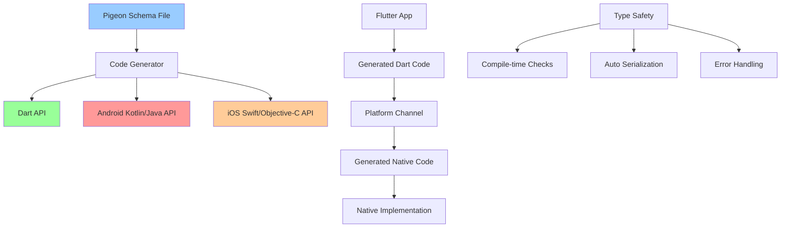

# Pigeon 详解

> Pigeon 是 Flutter 官方提供的代码生成工具，用于创建类型安全的原生平台通信接口

## 📋 Pigeon架构图



## 🎯 目录

- [基础概念](#基础概念)
- [环境配置](#环境配置)
- [定义接口](#定义接口)
- [代码生成](#代码生成)
- [Flutter端实现](#flutter端实现)
- [Android端实现](#android端实现)
- [iOS端实现](#ios端实现)
- [高级特性](#高级特性)
- [实际应用](#实际应用)
- [最佳实践](#最佳实践)

## 🚀 基础概念

### Pigeon特点
- **类型安全**: 编译时类型检查，避免运行时错误
- **代码生成**: 自动生成平台通信代码
- **序列化**: 自动处理数据序列化和反序列化
- **错误处理**: 统一的错误处理机制
- **多平台支持**: 支持Android、iOS、macOS、Windows、Linux

### 与传统MethodChannel对比

| 特性 | MethodChannel | Pigeon |
|------|---------------|--------|
| 类型安全 | 运行时检查 | 编译时检查 |
| 代码维护 | 手动编写 | 自动生成 |
| 序列化 | 手动处理 | 自动处理 |
| 错误处理 | 手动实现 | 统一处理 |
| 开发效率 | 较低 | 高 |
| 学习成本 | 低 | 中等 |

### 适用场景
- 复杂的原生功能集成
- 需要类型安全的通信
- 多平台插件开发
- 团队协作开发
- 大型项目维护

## ⚙️ 环境配置

### 1. 添加依赖

```yaml
# pubspec.yaml
dev_dependencies:
  pigeon: ^17.1.2
```

### 2. 创建配置文件

```yaml
# pigeon_config.yaml
input: pigeons/api.dart
dart_out: lib/generated/pigeon.dart
dart_test_out: test/generated/pigeon_test.dart

# Android配置
java_out: android/src/main/java/com/example/Pigeon.java
java_package: com.example

# iOS配置
objc_header_out: ios/Classes/Pigeon.h
objc_source_out: ios/Classes/Pigeon.m
objc_prefix: FLT

# Swift配置（可选）
swift_out: ios/Classes/Pigeon.swift
```

### 3. 创建生成脚本

```bash
#!/bin/bash
# scripts/generate_pigeon.sh

echo "Generating Pigeon code..."
flutter packages pub run pigeon --input pigeons/api.dart
echo "Pigeon code generation completed!"
```

## 📝 定义接口

### 1. 基础数据类型

```dart
// pigeons/api.dart
import 'package:pigeon/pigeon.dart';

@ConfigurePigeon(PigeonOptions(
  dartOut: 'lib/generated/pigeon.dart',
  dartTestOut: 'test/generated/pigeon_test.dart',
  javaOut: 'android/src/main/java/com/example/Pigeon.java',
  javaOptions: JavaOptions(
    package: 'com.example',
    className: 'Pigeon',
  ),
  objcHeaderOut: 'ios/Classes/Pigeon.h',
  objcSourceOut: 'ios/Classes/Pigeon.m',
  objcOptions: ObjcOptions(
    prefix: 'FLT',
  ),
))

// 基础数据模型
class UserInfo {
  String? id;
  String? name;
  String? email;
  int? age;
  bool? isActive;
  List<String>? tags;
  Map<String?, String?>? metadata;
  
  UserInfo({
    this.id,
    this.name,
    this.email,
    this.age,
    this.isActive,
    this.tags,
    this.metadata,
  });
}

// 响应数据模型
class ApiResponse {
  bool? success;
  String? message;
  UserInfo? data;
  int? code;
  
  ApiResponse({
    this.success,
    this.message,
    this.data,
    this.code,
  });
}

// 错误信息模型
class ErrorInfo {
  String? code;
  String? message;
  Map<String?, String?>? details;
  
  ErrorInfo({
    this.code,
    this.message,
    this.details,
  });
}
```

### 2. 定义Host API（Flutter调用原生）

```dart
// 原生平台实现的API
@HostApi()
abstract class NativeUserApi {
  // 获取用户信息
  @async
  UserInfo getUserInfo(String userId);
  
  // 保存用户信息
  @async
  ApiResponse saveUserInfo(UserInfo userInfo);
  
  // 删除用户
  @async
  bool deleteUser(String userId);
  
  // 获取用户列表
  @async
  List<UserInfo> getUserList(int page, int pageSize);
  
  // 搜索用户
  @async
  List<UserInfo> searchUsers(String keyword, Map<String?, String?> filters);
  
  // 批量操作
  @async
  ApiResponse batchUpdateUsers(List<UserInfo> users);
}

// 设备信息API
@HostApi()
abstract class DeviceApi {
  // 获取设备信息
  Map<String?, String?> getDeviceInfo();
  
  // 获取网络状态
  String getNetworkStatus();
  
  // 获取电池信息
  Map<String?, Object?> getBatteryInfo();
  
  // 获取存储信息
  Map<String?, int?> getStorageInfo();
  
  // 检查权限
  bool hasPermission(String permission);
  
  // 请求权限
  @async
  bool requestPermission(String permission);
}
```

### 3. 定义Flutter API（原生调用Flutter）

```dart
// Flutter端实现的API
@FlutterApi()
abstract class FlutterUserApi {
  // 用户状态变化通知
  void onUserStatusChanged(String userId, String status);
  
  // 接收推送消息
  void onMessageReceived(Map<String?, String?> message);
  
  // 网络状态变化
  void onNetworkStatusChanged(String status);
  
  // 错误通知
  void onError(ErrorInfo error);
  
  // 进度更新
  void onProgressUpdate(String taskId, double progress);
}

// 事件监听API
@FlutterApi()
abstract class EventListenerApi {
  // 生命周期事件
  void onLifecycleEvent(String event);
  
  // 系统事件
  void onSystemEvent(String event, Map<String?, Object?> data);
  
  // 自定义事件
  void onCustomEvent(String eventName, Map<String?, Object?> payload);
}
```

### 4. 复杂数据类型

```dart
// 嵌套数据模型
class Address {
  String? street;
  String? city;
  String? state;
  String? zipCode;
  String? country;
  
  Address({
    this.street,
    this.city,
    this.state,
    this.zipCode,
    this.country,
  });
}

class Company {
  String? id;
  String? name;
  Address? address;
  List<String>? departments;
  
  Company({
    this.id,
    this.name,
    this.address,
    this.departments,
  });
}

class Employee {
  String? id;
  String? name;
  String? position;
  Company? company;
  Address? homeAddress;
  List<String>? skills;
  Map<String?, Object?>? performance;
  
  Employee({
    this.id,
    this.name,
    this.position,
    this.company,
    this.homeAddress,
    this.skills,
    this.performance,
  });
}

// 枚举类型
enum UserRole {
  admin,
  user,
  guest,
  moderator,
}

enum NetworkType {
  wifi,
  cellular,
  ethernet,
  none,
}

// 包含枚举的数据模型
class UserProfile {
  String? id;
  String? name;
  UserRole? role;
  NetworkType? preferredNetwork;
  List<UserRole>? permissions;
  
  UserProfile({
    this.id,
    this.name,
    this.role,
    this.preferredNetwork,
    this.permissions,
  });
}
```

## 🔧 代码生成

### 1. 运行生成命令

```bash
# 使用配置文件生成
flutter packages pub run pigeon --input pigeons/api.dart

# 直接指定参数生成
flutter packages pub run pigeon \
  --input pigeons/api.dart \
  --dart_out lib/generated/pigeon.dart \
  --java_out android/src/main/java/com/example/Pigeon.java \
  --java_package com.example
```

### 2. 生成的Dart代码示例

```dart
// lib/generated/pigeon.dart (自动生成)
import 'dart:async';
import 'dart:typed_data' show Float64List, Int32List, Int64List, Uint8List;
import 'package:flutter/foundation.dart' show ReadBuffer, WriteBuffer;
import 'package:flutter/services.dart';

class UserInfo {
  UserInfo({
    this.id,
    this.name,
    this.email,
    this.age,
    this.isActive,
    this.tags,
    this.metadata,
  });

  String? id;
  String? name;
  String? email;
  int? age;
  bool? isActive;
  List<String?>? tags;
  Map<String?, String?>? metadata;

  Object encode() {
    return <Object?>[
      id,
      name,
      email,
      age,
      isActive,
      tags,
      metadata,
    ];
  }

  static UserInfo decode(Object result) {
    result as List<Object?>;
    return UserInfo(
      id: result[0] as String?,
      name: result[1] as String?,
      email: result[2] as String?,
      age: result[3] as int?,
      isActive: result[4] as bool?,
      tags: (result[5] as List<Object?>?)?.cast<String?>(),
      metadata: (result[6] as Map<Object?, Object?>?)?.cast<String?, String?>(),
    );
  }
}

class NativeUserApi {
  /// Constructor for [NativeUserApi].
  NativeUserApi({BinaryMessenger? binaryMessenger})
      : _binaryMessenger = binaryMessenger;
  final BinaryMessenger? _binaryMessenger;

  static const MessageCodec<Object?> codec = StandardMessageCodec();

  Future<UserInfo> getUserInfo(String arg_userId) async {
    final BasicMessageChannel<Object?> channel = BasicMessageChannel<Object?>(
        'dev.flutter.pigeon.NativeUserApi.getUserInfo', codec,
        binaryMessenger: _binaryMessenger);
    final List<Object?>? replyList =
        await channel.send(<Object?>[arg_userId]) as List<Object?>?;
    if (replyList == null) {
      throw PlatformException(
        code: 'channel-error',
        message: 'Unable to establish connection on channel.',
      );
    } else if (replyList.length > 1) {
      throw PlatformException(
        code: replyList[0]! as String,
        message: replyList[1] as String?,
        details: replyList[2],
      );
    } else {
      return UserInfo.decode(replyList[0]!);
    }
  }
}
```

## 📱 Flutter端实现

### 1. 使用生成的API

```dart
// lib/services/user_service.dart
import '../generated/pigeon.dart';

class UserService {
  late final NativeUserApi _nativeUserApi;
  late final DeviceApi _deviceApi;
  
  UserService() {
    _nativeUserApi = NativeUserApi();
    _deviceApi = DeviceApi();
  }
  
  // 获取用户信息
  Future<UserInfo?> getUserInfo(String userId) async {
    try {
      final userInfo = await _nativeUserApi.getUserInfo(userId);
      return userInfo;
    } catch (e) {
      print('获取用户信息失败: $e');
      return null;
    }
  }
  
  // 保存用户信息
  Future<bool> saveUserInfo(UserInfo userInfo) async {
    try {
      final response = await _nativeUserApi.saveUserInfo(userInfo);
      return response.success ?? false;
    } catch (e) {
      print('保存用户信息失败: $e');
      return false;
    }
  }
  
  // 获取用户列表
  Future<List<UserInfo>> getUserList(int page, int pageSize) async {
    try {
      final users = await _nativeUserApi.getUserList(page, pageSize);
      return users;
    } catch (e) {
      print('获取用户列表失败: $e');
      return [];
    }
  }
  
  // 搜索用户
  Future<List<UserInfo>> searchUsers(
    String keyword, 
    Map<String, String> filters
  ) async {
    try {
      final users = await _nativeUserApi.searchUsers(keyword, filters);
      return users;
    } catch (e) {
      print('搜索用户失败: $e');
      return [];
    }
  }
  
  // 获取设备信息
  Map<String, String> getDeviceInfo() {
    try {
      final deviceInfo = _deviceApi.getDeviceInfo();
      return Map<String, String>.from(deviceInfo);
    } catch (e) {
      print('获取设备信息失败: $e');
      return {};
    }
  }
  
  // 检查权限
  Future<bool> checkAndRequestPermission(String permission) async {
    try {
      final hasPermission = _deviceApi.hasPermission(permission);
      if (hasPermission) {
        return true;
      }
      
      return await _deviceApi.requestPermission(permission);
    } catch (e) {
      print('权限检查失败: $e');
      return false;
    }
  }
}
```

### 2. 实现Flutter API

```dart
// lib/services/flutter_api_impl.dart
import '../generated/pigeon.dart';

class FlutterUserApiImpl implements FlutterUserApi {
  static FlutterUserApiImpl? _instance;
  static FlutterUserApiImpl get instance {
    _instance ??= FlutterUserApiImpl._();
    return _instance!;
  }
  
  FlutterUserApiImpl._();
  
  // 注册API实现
  void register() {
    FlutterUserApi.setup(this);
  }
  
  @override
  void onUserStatusChanged(String userId, String status) {
    print('用户状态变化: $userId -> $status');
    // 通知UI更新
    _notifyUserStatusChanged(userId, status);
  }
  
  @override
  void onMessageReceived(Map<String?, String?> message) {
    print('收到消息: $message');
    // 处理推送消息
    _handleMessage(message);
  }
  
  @override
  void onNetworkStatusChanged(String status) {
    print('网络状态变化: $status');
    // 更新网络状态
    _updateNetworkStatus(status);
  }
  
  @override
  void onError(ErrorInfo error) {
    print('收到错误: ${error.code} - ${error.message}');
    // 处理错误
    _handleError(error);
  }
  
  @override
  void onProgressUpdate(String taskId, double progress) {
    print('任务进度更新: $taskId -> $progress');
    // 更新进度
    _updateProgress(taskId, progress);
  }
  
  // 私有方法
  void _notifyUserStatusChanged(String userId, String status) {
    // 实现状态变化通知逻辑
  }
  
  void _handleMessage(Map<String?, String?> message) {
    // 实现消息处理逻辑
  }
  
  void _updateNetworkStatus(String status) {
    // 实现网络状态更新逻辑
  }
  
  void _handleError(ErrorInfo error) {
    // 实现错误处理逻辑
  }
  
  void _updateProgress(String taskId, double progress) {
    // 实现进度更新逻辑
  }
}
```

### 3. 在应用中使用

```dart
// lib/main.dart
import 'package:flutter/material.dart';
import 'services/user_service.dart';
import 'services/flutter_api_impl.dart';
import 'generated/pigeon.dart';

void main() {
  // 注册Flutter API实现
  FlutterUserApiImpl.instance.register();
  
  runApp(MyApp());
}

class MyApp extends StatelessWidget {
  @override
  Widget build(BuildContext context) {
    return MaterialApp(
      title: 'Pigeon Demo',
      home: UserListPage(),
    );
  }
}

class UserListPage extends StatefulWidget {
  @override
  State<UserListPage> createState() => _UserListPageState();
}

class _UserListPageState extends State<UserListPage> {
  final UserService _userService = UserService();
  List<UserInfo> _users = [];
  bool _isLoading = false;
  
  @override
  void initState() {
    super.initState();
    _loadUsers();
  }
  
  Future<void> _loadUsers() async {
    setState(() {
      _isLoading = true;
    });
    
    try {
      final users = await _userService.getUserList(1, 20);
      setState(() {
        _users = users;
      });
    } finally {
      setState(() {
        _isLoading = false;
      });
    }
  }
  
  @override
  Widget build(BuildContext context) {
    return Scaffold(
      appBar: AppBar(
        title: const Text('用户列表'),
        actions: [
          IconButton(
            icon: const Icon(Icons.refresh),
            onPressed: _loadUsers,
          ),
        ],
      ),
      body: _isLoading
          ? const Center(child: CircularProgressIndicator())
          : ListView.builder(
              itemCount: _users.length,
              itemBuilder: (context, index) {
                final user = _users[index];
                return ListTile(
                  title: Text(user.name ?? 'Unknown'),
                  subtitle: Text(user.email ?? ''),
                  trailing: Text('${user.age ?? 0}岁'),
                  onTap: () => _showUserDetails(user),
                );
              },
            ),
      floatingActionButton: FloatingActionButton(
        onPressed: _addUser,
        child: const Icon(Icons.add),
      ),
    );
  }
  
  void _showUserDetails(UserInfo user) {
    showDialog(
      context: context,
      builder: (context) => AlertDialog(
        title: Text(user.name ?? 'Unknown'),
        content: Column(
          mainAxisSize: MainAxisSize.min,
          crossAxisAlignment: CrossAxisAlignment.start,
          children: [
            Text('ID: ${user.id}'),
            Text('邮箱: ${user.email}'),
            Text('年龄: ${user.age}'),
            Text('状态: ${user.isActive == true ? "活跃" : "非活跃"}'),
            if (user.tags?.isNotEmpty == true)
              Text('标签: ${user.tags!.join(", ")}'),
          ],
        ),
        actions: [
          TextButton(
            onPressed: () => Navigator.pop(context),
            child: const Text('关闭'),
          ),
        ],
      ),
    );
  }
  
  void _addUser() {
    // 实现添加用户逻辑
  }
}
```

## 🤖 Android端实现

### 1. 实现Host API

```kotlin
// android/src/main/kotlin/com/example/NativeUserApiImpl.kt
import com.example.Pigeon.*
import io.flutter.plugin.common.BinaryMessenger

class NativeUserApiImpl : NativeUserApi {
    
    companion object {
        fun register(binaryMessenger: BinaryMessenger) {
            NativeUserApi.setUp(binaryMessenger, NativeUserApiImpl())
        }
    }
    
    override fun getUserInfo(userId: String, callback: (Result<UserInfo>) -> Unit) {
        try {
            // 模拟从数据库或API获取用户信息
            val userInfo = UserInfo().apply {
                id = userId
                name = "张三"
                email = "zhangsan@example.com"
                age = 25L
                isActive = true
                tags = listOf("开发者", "Flutter")
                metadata = mapOf(
                    "department" to "技术部",
                    "level" to "高级"
                )
            }
            
            callback(Result.success(userInfo))
        } catch (e: Exception) {
            callback(Result.failure(e))
        }
    }
    
    override fun saveUserInfo(userInfo: UserInfo, callback: (Result<ApiResponse>) -> Unit) {
        try {
            // 模拟保存用户信息
            val success = saveUserToDatabase(userInfo)
            
            val response = ApiResponse().apply {
                this.success = success
                message = if (success) "保存成功" else "保存失败"
                data = if (success) userInfo else null
                code = if (success) 200L else 500L
            }
            
            callback(Result.success(response))
        } catch (e: Exception) {
            callback(Result.failure(e))
        }
    }
    
    override fun deleteUser(userId: String, callback: (Result<Boolean>) -> Unit) {
        try {
            // 模拟删除用户
            val success = deleteUserFromDatabase(userId)
            callback(Result.success(success))
        } catch (e: Exception) {
            callback(Result.failure(e))
        }
    }
    
    override fun getUserList(page: Long, pageSize: Long, callback: (Result<List<UserInfo>>) -> Unit) {
        try {
            // 模拟分页获取用户列表
            val users = getUsersFromDatabase(page.toInt(), pageSize.toInt())
            callback(Result.success(users))
        } catch (e: Exception) {
            callback(Result.failure(e))
        }
    }
    
    override fun searchUsers(
        keyword: String,
        filters: Map<String?, String?>,
        callback: (Result<List<UserInfo>>) -> Unit
    ) {
        try {
            // 模拟搜索用户
            val users = searchUsersInDatabase(keyword, filters)
            callback(Result.success(users))
        } catch (e: Exception) {
            callback(Result.failure(e))
        }
    }
    
    override fun batchUpdateUsers(
        users: List<UserInfo>,
        callback: (Result<ApiResponse>) -> Unit
    ) {
        try {
            // 模拟批量更新用户
            val success = batchUpdateUsersInDatabase(users)
            
            val response = ApiResponse().apply {
                this.success = success
                message = if (success) "批量更新成功" else "批量更新失败"
                code = if (success) 200L else 500L
            }
            
            callback(Result.success(response))
        } catch (e: Exception) {
            callback(Result.failure(e))
        }
    }
    
    // 私有方法
    private fun saveUserToDatabase(userInfo: UserInfo): Boolean {
        // 实现保存逻辑
        return true
    }
    
    private fun deleteUserFromDatabase(userId: String): Boolean {
        // 实现删除逻辑
        return true
    }
    
    private fun getUsersFromDatabase(page: Int, pageSize: Int): List<UserInfo> {
        // 实现获取用户列表逻辑
        return (1..pageSize).map { index ->
            UserInfo().apply {
                id = "user_${(page - 1) * pageSize + index}"
                name = "用户$index"
                email = "user$index@example.com"
                age = (20 + index % 30).toLong()
                isActive = index % 2 == 0
                tags = listOf("标签${index % 3 + 1}")
            }
        }
    }
    
    private fun searchUsersInDatabase(
        keyword: String,
        filters: Map<String?, String?>
    ): List<UserInfo> {
        // 实现搜索逻辑
        return listOf()
    }
    
    private fun batchUpdateUsersInDatabase(users: List<UserInfo>): Boolean {
        // 实现批量更新逻辑
        return true
    }
}
```

### 2. 实现Device API

```kotlin
// android/src/main/kotlin/com/example/DeviceApiImpl.kt
import android.content.Context
import android.content.pm.PackageManager
import android.net.ConnectivityManager
import android.net.NetworkCapabilities
import android.os.BatteryManager
import android.os.Build
import android.os.StatFs
import androidx.core.content.ContextCompat
import com.example.Pigeon.*

class DeviceApiImpl(private val context: Context) : DeviceApi {
    
    companion object {
        fun register(binaryMessenger: BinaryMessenger, context: Context) {
            DeviceApi.setUp(binaryMessenger, DeviceApiImpl(context))
        }
    }
    
    override fun getDeviceInfo(): Map<String?, String?> {
        return mapOf(
            "model" to Build.MODEL,
            "manufacturer" to Build.MANUFACTURER,
            "version" to Build.VERSION.RELEASE,
            "sdk" to Build.VERSION.SDK_INT.toString(),
            "brand" to Build.BRAND,
            "device" to Build.DEVICE,
            "product" to Build.PRODUCT,
            "hardware" to Build.HARDWARE,
            "fingerprint" to Build.FINGERPRINT
        )
    }
    
    override fun getNetworkStatus(): String {
        val connectivityManager = context.getSystemService(Context.CONNECTIVITY_SERVICE) as ConnectivityManager
        
        if (Build.VERSION.SDK_INT >= Build.VERSION_CODES.M) {
            val network = connectivityManager.activeNetwork ?: return "none"
            val capabilities = connectivityManager.getNetworkCapabilities(network) ?: return "none"
            
            return when {
                capabilities.hasTransport(NetworkCapabilities.TRANSPORT_WIFI) -> "wifi"
                capabilities.hasTransport(NetworkCapabilities.TRANSPORT_CELLULAR) -> "cellular"
                capabilities.hasTransport(NetworkCapabilities.TRANSPORT_ETHERNET) -> "ethernet"
                else -> "unknown"
            }
        } else {
            @Suppress("DEPRECATION")
            val networkInfo = connectivityManager.activeNetworkInfo
            return when (networkInfo?.type) {
                ConnectivityManager.TYPE_WIFI -> "wifi"
                ConnectivityManager.TYPE_MOBILE -> "cellular"
                ConnectivityManager.TYPE_ETHERNET -> "ethernet"
                else -> "none"
            }
        }
    }
    
    override fun getBatteryInfo(): Map<String?, Any?> {
        val batteryManager = context.getSystemService(Context.BATTERY_SERVICE) as BatteryManager
        
        return mapOf(
            "level" to batteryManager.getIntProperty(BatteryManager.BATTERY_PROPERTY_CAPACITY),
            "isCharging" to batteryManager.isCharging,
            "temperature" to batteryManager.getIntProperty(BatteryManager.BATTERY_PROPERTY_CURRENT_NOW),
            "voltage" to batteryManager.getIntProperty(BatteryManager.BATTERY_PROPERTY_CURRENT_AVERAGE),
            "technology" to "Li-ion"
        )
    }
    
    override fun getStorageInfo(): Map<String?, Long?> {
        val statFs = StatFs(context.filesDir.path)
        val blockSize = statFs.blockSizeLong
        val totalBlocks = statFs.blockCountLong
        val availableBlocks = statFs.availableBlocksLong
        
        return mapOf(
            "totalSpace" to totalBlocks * blockSize,
            "freeSpace" to availableBlocks * blockSize,
            "usedSpace" to (totalBlocks - availableBlocks) * blockSize
        )
    }
    
    override fun hasPermission(permission: String): Boolean {
        return ContextCompat.checkSelfPermission(
            context,
            permission
        ) == PackageManager.PERMISSION_GRANTED
    }
    
    override fun requestPermission(permission: String, callback: (Result<Boolean>) -> Unit) {
        // 注意：这里需要在Activity中实现权限请求
        // 这只是一个示例，实际实现需要与Activity交互
        try {
            val hasPermission = hasPermission(permission)
            callback(Result.success(hasPermission))
        } catch (e: Exception) {
            callback(Result.failure(e))
        }
    }
}
```

### 3. 调用Flutter API

```kotlin
// android/src/main/kotlin/com/example/FlutterApiCaller.kt
import com.example.Pigeon.*
import io.flutter.plugin.common.BinaryMessenger

class FlutterApiCaller(binaryMessenger: BinaryMessenger) {
    private val flutterUserApi = FlutterUserApi(binaryMessenger)
    private val eventListenerApi = EventListenerApi(binaryMessenger)
    
    // 通知用户状态变化
    fun notifyUserStatusChanged(userId: String, status: String) {
        flutterUserApi.onUserStatusChanged(userId, status) { result ->
            if (result.isFailure) {
                println("通知用户状态变化失败: ${result.exceptionOrNull()}")
            }
        }
    }
    
    // 发送消息到Flutter
    fun sendMessageToFlutter(message: Map<String?, String?>) {
        flutterUserApi.onMessageReceived(message) { result ->
            if (result.isFailure) {
                println("发送消息失败: ${result.exceptionOrNull()}")
            }
        }
    }
    
    // 通知网络状态变化
    fun notifyNetworkStatusChanged(status: String) {
        flutterUserApi.onNetworkStatusChanged(status) { result ->
            if (result.isFailure) {
                println("通知网络状态变化失败: ${result.exceptionOrNull()}")
            }
        }
    }
    
    // 发送错误信息
    fun sendError(code: String, message: String, details: Map<String?, String?>? = null) {
        val errorInfo = ErrorInfo().apply {
            this.code = code
            this.message = message
            this.details = details
        }
        
        flutterUserApi.onError(errorInfo) { result ->
            if (result.isFailure) {
                println("发送错误信息失败: ${result.exceptionOrNull()}")
            }
        }
    }
    
    // 更新进度
    fun updateProgress(taskId: String, progress: Double) {
        flutterUserApi.onProgressUpdate(taskId, progress) { result ->
            if (result.isFailure) {
                println("更新进度失败: ${result.exceptionOrNull()}")
            }
        }
    }
    
    // 发送系统事件
    fun sendSystemEvent(event: String, data: Map<String?, Any?>) {
        eventListenerApi.onSystemEvent(event, data) { result ->
            if (result.isFailure) {
                println("发送系统事件失败: ${result.exceptionOrNull()}")
            }
        }
    }
}
```

### 4. 在MainActivity中注册

```kotlin
// android/src/main/kotlin/com/example/MainActivity.kt
import io.flutter.embedding.android.FlutterActivity
import io.flutter.embedding.engine.FlutterEngine

class MainActivity: FlutterActivity() {
    
    override fun configureFlutterEngine(flutterEngine: FlutterEngine) {
        super.configureFlutterEngine(flutterEngine)
        
        // 注册Pigeon APIs
        NativeUserApiImpl.register(flutterEngine.dartExecutor.binaryMessenger)
        DeviceApiImpl.register(flutterEngine.dartExecutor.binaryMessenger, this)
        
        // 创建Flutter API调用器
        val flutterApiCaller = FlutterApiCaller(flutterEngine.dartExecutor.binaryMessenger)
        
        // 可以在这里设置一些监听器，比如网络状态变化
        setupNetworkListener(flutterApiCaller)
    }
    
    private fun setupNetworkListener(flutterApiCaller: FlutterApiCaller) {
        // 实现网络状态监听逻辑
    }
}
```

## 🍎 iOS端实现

### 1. 实现Host API

```swift
// ios/Classes/NativeUserApiImpl.swift
import Flutter

class NativeUserApiImpl: NSObject, NativeUserApi {
    
    static func register(with registrar: FlutterPluginRegistrar) {
        let instance = NativeUserApiImpl()
        NativeUserApiSetup.setUp(binaryMessenger: registrar.messenger(), api: instance)
    }
    
    func getUserInfo(userId: String, completion: @escaping (Result<UserInfo, Error>) -> Void) {
        // 模拟异步获取用户信息
        DispatchQueue.global().async {
            do {
                let userInfo = UserInfo()
                userInfo.id = userId
                userInfo.name = "李四"
                userInfo.email = "lisi@example.com"
                userInfo.age = 28
                userInfo.isActive = true
                userInfo.tags = ["iOS开发者", "Swift"]
                userInfo.metadata = [
                    "department": "移动端",
                    "level": "资深"
                ]
                
                DispatchQueue.main.async {
                    completion(.success(userInfo))
                }
            } catch {
                DispatchQueue.main.async {
                    completion(.failure(error))
                }
            }
        }
    }
    
    func saveUserInfo(userInfo: UserInfo, completion: @escaping (Result<ApiResponse, Error>) -> Void) {
        DispatchQueue.global().async {
            do {
                // 模拟保存用户信息
                let success = self.saveUserToDatabase(userInfo: userInfo)
                
                let response = ApiResponse()
                response.success = success
                response.message = success ? "保存成功" : "保存失败"
                response.data = success ? userInfo : nil
                response.code = success ? 200 : 500
                
                DispatchQueue.main.async {
                    completion(.success(response))
                }
            } catch {
                DispatchQueue.main.async {
                    completion(.failure(error))
                }
            }
        }
    }
    
    func deleteUser(userId: String, completion: @escaping (Result<Bool, Error>) -> Void) {
        DispatchQueue.global().async {
            do {
                let success = self.deleteUserFromDatabase(userId: userId)
                DispatchQueue.main.async {
                    completion(.success(success))
                }
            } catch {
                DispatchQueue.main.async {
                    completion(.failure(error))
                }
            }
        }
    }
    
    func getUserList(page: Int64, pageSize: Int64, completion: @escaping (Result<[UserInfo], Error>) -> Void) {
        DispatchQueue.global().async {
            do {
                let users = self.getUsersFromDatabase(page: Int(page), pageSize: Int(pageSize))
                DispatchQueue.main.async {
                    completion(.success(users))
                }
            } catch {
                DispatchQueue.main.async {
                    completion(.failure(error))
                }
            }
        }
    }
    
    func searchUsers(keyword: String, filters: [String?: String?], completion: @escaping (Result<[UserInfo], Error>) -> Void) {
        DispatchQueue.global().async {
            do {
                let users = self.searchUsersInDatabase(keyword: keyword, filters: filters)
                DispatchQueue.main.async {
                    completion(.success(users))
                }
            } catch {
                DispatchQueue.main.async {
                    completion(.failure(error))
                }
            }
        }
    }
    
    func batchUpdateUsers(users: [UserInfo], completion: @escaping (Result<ApiResponse, Error>) -> Void) {
        DispatchQueue.global().async {
            do {
                let success = self.batchUpdateUsersInDatabase(users: users)
                
                let response = ApiResponse()
                response.success = success
                response.message = success ? "批量更新成功" : "批量更新失败"
                response.code = success ? 200 : 500
                
                DispatchQueue.main.async {
                    completion(.success(response))
                }
            } catch {
                DispatchQueue.main.async {
                    completion(.failure(error))
                }
            }
        }
    }
    
    // MARK: - Private Methods
    
    private func saveUserToDatabase(userInfo: UserInfo) -> Bool {
        // 实现保存逻辑
        return true
    }
    
    private func deleteUserFromDatabase(userId: String) -> Bool {
        // 实现删除逻辑
        return true
    }
    
    private func getUsersFromDatabase(page: Int, pageSize: Int) -> [UserInfo] {
        // 实现获取用户列表逻辑
        return (1...pageSize).map { index in
            let userInfo = UserInfo()
            userInfo.id = "user_\((page - 1) * pageSize + index)"
            userInfo.name = "用户\(index)"
            userInfo.email = "user\(index)@example.com"
            userInfo.age = Int64(20 + index % 30)
            userInfo.isActive = index % 2 == 0
            userInfo.tags = ["标签\(index % 3 + 1)"]
            return userInfo
        }
    }
    
    private func searchUsersInDatabase(keyword: String, filters: [String?: String?]) -> [UserInfo] {
        // 实现搜索逻辑
        return []
    }
    
    private func batchUpdateUsersInDatabase(users: [UserInfo]) -> Bool {
        // 实现批量更新逻辑
        return true
    }
}
```

### 2. 实现Device API

```swift
// ios/Classes/DeviceApiImpl.swift
import UIKit
import Network
import SystemConfiguration

class DeviceApiImpl: NSObject, DeviceApi {
    
    static func register(with registrar: FlutterPluginRegistrar) {
        let instance = DeviceApiImpl()
        DeviceApiSetup.setUp(binaryMessenger: registrar.messenger(), api: instance)
    }
    
    func getDeviceInfo() -> [String?: String?] {
        let device = UIDevice.current
        
        return [
            "model": device.model,
            "name": device.name,
            "systemName": device.systemName,
            "systemVersion": device.systemVersion,
            "identifierForVendor": device.identifierForVendor?.uuidString,
            "localizedModel": device.localizedModel,
            "userInterfaceIdiom": "\(device.userInterfaceIdiom.rawValue)"
        ]
    }
    
    func getNetworkStatus() -> String {
        var zeroAddress = sockaddr_in()
        zeroAddress.sin_len = UInt8(MemoryLayout.size(ofValue: zeroAddress))
        zeroAddress.sin_family = sa_family_t(AF_INET)
        
        let defaultRouteReachability = withUnsafePointer(to: &zeroAddress) {
            $0.withMemoryRebound(to: sockaddr.self, capacity: 1) { zeroSockAddress in
                SCNetworkReachabilityCreateWithAddress(nil, zeroSockAddress)
            }
        }
        
        var flags = SCNetworkReachabilityFlags()
        if !SCNetworkReachabilityGetFlags(defaultRouteReachability!, &flags) {
            return "none"
        }
        
        let isReachable = flags.contains(.reachable)
        let needsConnection = flags.contains(.connectionRequired)
        let isNetworkReachable = isReachable && !needsConnection
        
        if !isNetworkReachable {
            return "none"
        }
        
        if flags.contains(.isWWAN) {
            return "cellular"
        }
        
        return "wifi"
    }
    
    func getBatteryInfo() -> [String?: Any?] {
        let device = UIDevice.current
        device.isBatteryMonitoringEnabled = true
        
        return [
            "level": Int(device.batteryLevel * 100),
            "isCharging": device.batteryState == .charging || device.batteryState == .full,
            "state": batteryStateString(device.batteryState)
        ]
    }
    
    func getStorageInfo() -> [String?: Int64?] {
        let fileManager = FileManager.default
        
        do {
            let systemAttributes = try fileManager.attributesOfFileSystem(forPath: NSHomeDirectory())
            let totalSpace = systemAttributes[.systemSize] as? Int64 ?? 0
            let freeSpace = systemAttributes[.systemFreeSize] as? Int64 ?? 0
            let usedSpace = totalSpace - freeSpace
            
            return [
                "totalSpace": totalSpace,
                "freeSpace": freeSpace,
                "usedSpace": usedSpace
            ]
        } catch {
            return [
                "totalSpace": 0,
                "freeSpace": 0,
                "usedSpace": 0
            ]
        }
    }
    
    func hasPermission(permission: String) -> Bool {
        // iOS权限检查逻辑
        switch permission {
        case "camera":
            return AVCaptureDevice.authorizationStatus(for: .video) == .authorized
        case "microphone":
            return AVCaptureDevice.authorizationStatus(for: .audio) == .authorized
        case "photos":
            return PHPhotoLibrary.authorizationStatus() == .authorized
        case "location":
            return CLLocationManager.authorizationStatus() == .authorizedWhenInUse || 
                   CLLocationManager.authorizationStatus() == .authorizedAlways
        default:
            return false
        }
    }
    
    func requestPermission(permission: String, completion: @escaping (Result<Bool, Error>) -> Void) {
        switch permission {
        case "camera":
            AVCaptureDevice.requestAccess(for: .video) { granted in
                DispatchQueue.main.async {
                    completion(.success(granted))
                }
            }
        case "microphone":
            AVCaptureDevice.requestAccess(for: .audio) { granted in
                DispatchQueue.main.async {
                    completion(.success(granted))
                }
            }
        case "photos":
            PHPhotoLibrary.requestAuthorization { status in
                DispatchQueue.main.async {
                    completion(.success(status == .authorized))
                }
            }
        default:
            completion(.success(false))
        }
    }
    
    // MARK: - Private Methods
    
    private func batteryStateString(_ state: UIDevice.BatteryState) -> String {
        switch state {
        case .unknown:
            return "unknown"
        case .unplugged:
            return "unplugged"
        case .charging:
            return "charging"
        case .full:
            return "full"
        @unknown default:
            return "unknown"
        }
    }
}
```

### 3. 调用Flutter API

```swift
// ios/Classes/FlutterApiCaller.swift
import Flutter

class FlutterApiCaller {
    private let flutterUserApi: FlutterUserApi
    private let eventListenerApi: EventListenerApi
    
    init(binaryMessenger: FlutterBinaryMessenger) {
        self.flutterUserApi = FlutterUserApi(binaryMessenger: binaryMessenger)
        self.eventListenerApi = EventListenerApi(binaryMessenger: binaryMessenger)
    }
    
    // 通知用户状态变化
    func notifyUserStatusChanged(userId: String, status: String) {
        flutterUserApi.onUserStatusChanged(userId: userId, status: status) { error in
            if let error = error {
                print("通知用户状态变化失败: \(error)")
            }
        }
    }
    
    // 发送消息到Flutter
    func sendMessageToFlutter(message: [String?: String?]) {
        flutterUserApi.onMessageReceived(message: message) { error in
            if let error = error {
                print("发送消息失败: \(error)")
            }
        }
    }
    
    // 通知网络状态变化
    func notifyNetworkStatusChanged(status: String) {
        flutterUserApi.onNetworkStatusChanged(status: status) { error in
            if let error = error {
                print("通知网络状态变化失败: \(error)")
            }
        }
    }
    
    // 发送错误信息
    func sendError(code: String, message: String, details: [String?: String?]? = nil) {
        let errorInfo = ErrorInfo()
        errorInfo.code = code
        errorInfo.message = message
        errorInfo.details = details
        
        flutterUserApi.onError(error: errorInfo) { error in
            if let error = error {
                print("发送错误信息失败: \(error)")
            }
        }
    }
    
    // 更新进度
    func updateProgress(taskId: String, progress: Double) {
        flutterUserApi.onProgressUpdate(taskId: taskId, progress: progress) { error in
            if let error = error {
                print("更新进度失败: \(error)")
            }
        }
    }
    
    // 发送系统事件
    func sendSystemEvent(event: String, data: [String?: Any?]) {
        eventListenerApi.onSystemEvent(event: event, data: data) { error in
            if let error = error {
                print("发送系统事件失败: \(error)")
            }
        }
    }
}
```

## 🚀 高级特性

### 1. 自定义序列化

```dart
// pigeons/custom_serialization.dart
import 'package:pigeon/pigeon.dart';

// 自定义日期时间类型
class DateTime {
  int? timestamp;
  String? iso8601;
  String? timezone;
  
  DateTime({this.timestamp, this.iso8601, this.timezone});
  
  // 自定义序列化方法
  Map<String, dynamic> toJson() {
    return {
      'timestamp': timestamp,
      'iso8601': iso8601,
      'timezone': timezone,
    };
  }
  
  // 自定义反序列化方法
  static DateTime fromJson(Map<String, dynamic> json) {
    return DateTime(
      timestamp: json['timestamp'],
      iso8601: json['iso8601'],
      timezone: json['timezone'],
    );
  }
}

// 包含自定义类型的数据模型
class Event {
  String? id;
  String? title;
  String? description;
  DateTime? startTime;
  DateTime? endTime;
  List<String>? attendees;
  
  Event({
    this.id,
    this.title,
    this.description,
    this.startTime,
    this.endTime,
    this.attendees,
  });
}

@HostApi()
abstract class EventApi {
  @async
  Event createEvent(Event event);
  
  @async
  List<Event> getEvents(DateTime startDate, DateTime endDate);
  
  @async
  bool updateEvent(String eventId, Event event);
}
```

### 2. 错误处理

```dart
// pigeons/error_handling.dart
// 自定义错误类型
class CustomError {
  String? code;
  String? message;
  Map<String?, String?>? details;
  int? timestamp;
  
  CustomError({
    this.code,
    this.message,
    this.details,
    this.timestamp,
  });
}

@HostApi()
abstract class ErrorHandlingApi {
  // 可能抛出错误的方法
  @async
  String processData(String data);
  
  // 返回结果或错误的方法
  @async
  ApiResult<String> safeProcessData(String data);
}

// 结果包装类
class ApiResult<T> {
  T? data;
  CustomError? error;
  bool? success;
  
  ApiResult({this.data, this.error, this.success});
}
```

### 3. 流式数据

```dart
// pigeons/streaming.dart
// 流式数据传输
@FlutterApi()
abstract class StreamingApi {
  // 接收流式数据
  void onDataChunk(String streamId, List<int> data, bool isLast);
  
  // 流状态变化
  void onStreamStatusChanged(String streamId, String status);
  
  // 流错误
  void onStreamError(String streamId, CustomError error);
}

@HostApi()
abstract class StreamControlApi {
  // 开始流传输
  @async
  String startStream(Map<String?, String?> config);
  
  // 停止流传输
  @async
  bool stopStream(String streamId);
  
  // 暂停/恢复流
  @async
  bool pauseStream(String streamId);
  
  @async
  bool resumeStream(String streamId);
}
```

## 📱 实际应用

### 1. 文件管理器示例

```dart
// pigeons/file_manager.dart
class FileInfo {
  String? path;
  String? name;
  String? extension;
  int? size;
  int? lastModified;
  bool? isDirectory;
  bool? isHidden;
  String? mimeType;
  
  FileInfo({
    this.path,
    this.name,
    this.extension,
    this.size,
    this.lastModified,
    this.isDirectory,
    this.isHidden,
    this.mimeType,
  });
}

class FileOperation {
  String? operation; // copy, move, delete, rename
  String? sourcePath;
  String? targetPath;
  String? newName;
  
  FileOperation({
    this.operation,
    this.sourcePath,
    this.targetPath,
    this.newName,
  });
}

@HostApi()
abstract class FileManagerApi {
  // 列出目录内容
  @async
  List<FileInfo> listDirectory(String path);
  
  // 创建目录
  @async
  bool createDirectory(String path);
  
  // 删除文件或目录
  @async
  bool deleteFile(String path);
  
  // 复制文件
  @async
  bool copyFile(String sourcePath, String targetPath);
  
  // 移动文件
  @async
  bool moveFile(String sourcePath, String targetPath);
  
  // 重命名文件
  @async
  bool renameFile(String path, String newName);
  
  // 获取文件信息
  @async
  FileInfo getFileInfo(String path);
  
  // 批量操作
  @async
  List<bool> batchOperation(List<FileOperation> operations);
}

@FlutterApi()
abstract class FileManagerCallbacks {
  // 操作进度
  void onOperationProgress(String operationId, double progress);
  
  // 操作完成
  void onOperationCompleted(String operationId, bool success, String? error);
  
  // 文件变化监听
  void onFileChanged(String path, String changeType);
}
```

### 2. 相机集成示例

```dart
// pigeons/camera_api.dart
class CameraConfig {
  String? resolution; // "720p", "1080p", "4K"
  String? format; // "jpg", "png", "raw"
  int? quality; // 1-100
  bool? enableFlash;
  String? focusMode; // "auto", "manual", "continuous"
  
  CameraConfig({
    this.resolution,
    this.format,
    this.quality,
    this.enableFlash,
    this.focusMode,
  });
}

class PhotoResult {
  String? filePath;
  int? fileSize;
  int? width;
  int? height;
  String? format;
  Map<String?, String?>? metadata;
  
  PhotoResult({
    this.filePath,
    this.fileSize,
    this.width,
    this.height,
    this.format,
    this.metadata,
  });
}

@HostApi()
abstract class CameraApi {
  // 检查相机权限
  @async
  bool checkCameraPermission();
  
  // 请求相机权限
  @async
  bool requestCameraPermission();
  
  // 获取可用相机列表
  @async
  List<String> getAvailableCameras();
  
  // 初始化相机
  @async
  bool initializeCamera(String cameraId, CameraConfig config);
  
  // 拍照
  @async
  PhotoResult takePhoto();
  
  // 开始录像
  @async
  bool startRecording(String outputPath);
  
  // 停止录像
  @async
  String stopRecording();
  
  // 释放相机资源
  @async
  bool releaseCamera();
}

@FlutterApi()
abstract class CameraCallbacks {
  // 相机状态变化
  void onCameraStatusChanged(String status);
  
  // 预览帧数据
  void onPreviewFrame(List<int> frameData, int width, int height);
  
  // 录像进度
  void onRecordingProgress(int duration, int fileSize);
  
  // 错误回调
  void onCameraError(String errorCode, String errorMessage);
}
```

### 3. 数据库集成示例

```dart
// pigeons/database_api.dart
class DatabaseConfig {
  String? databaseName;
  String? databasePath;
  int? version;
  List<String>? createTableSql;
  
  DatabaseConfig({
    this.databaseName,
    this.databasePath,
    this.version,
    this.createTableSql,
  });
}

class QueryResult {
  List<Map<String?, Object?>>? rows;
  int? affectedRows;
  int? insertId;
  bool? success;
  String? error;
  
  QueryResult({
    this.rows,
    this.affectedRows,
    this.insertId,
    this.success,
    this.error,
  });
}

@HostApi()
abstract class DatabaseApi {
  // 初始化数据库
  @async
  bool initializeDatabase(DatabaseConfig config);
  
  // 执行查询
  @async
  QueryResult executeQuery(String sql, List<Object?> parameters);
  
  // 执行更新
  @async
  QueryResult executeUpdate(String sql, List<Object?> parameters);
  
  // 批量执行
  @async
  List<QueryResult> executeBatch(List<String> sqlList, List<List<Object?>> parametersList);
  
  // 开始事务
  @async
  bool beginTransaction();
  
  // 提交事务
  @async
  bool commitTransaction();
  
  // 回滚事务
  @async
  bool rollbackTransaction();
  
  // 关闭数据库
  @async
  bool closeDatabase();
}
```

## 🎯 最佳实践

### 1. 性能优化

```dart
// 1. 减少数据传输量
class OptimizedUserInfo {
  String? id;
  String? name;
  // 避免传输大量不必要的数据
  // List<String>? largeDataList; // 避免
  
  OptimizedUserInfo({this.id, this.name});
}

// 2. 使用分页
@HostApi()
abstract class OptimizedApi {
  // 分页获取数据
  @async
  List<OptimizedUserInfo> getUsers(int page, int pageSize);
  
  // 按需获取详细信息
  @async
  UserInfo getUserDetails(String userId);
}

// 3. 缓存策略
@HostApi()
abstract class CacheApi {
  // 设置缓存
  @async
  bool setCacheData(String key, Map<String?, Object?> data, int ttl);
  
  // 获取缓存
  @async
  Map<String?, Object?> getCacheData(String key);
  
  // 清除缓存
  @async
  bool clearCache(String? key);
}
```

### 2. 错误处理策略

```dart
// lib/services/pigeon_error_handler.dart
class PigeonErrorHandler {
  static void handleError(dynamic error, String operation) {
    if (error is PlatformException) {
      switch (error.code) {
        case 'PERMISSION_DENIED':
          _handlePermissionError(operation);
          break;
        case 'NETWORK_ERROR':
          _handleNetworkError(operation);
          break;
        case 'INVALID_ARGUMENT':
          _handleInvalidArgumentError(operation, error.message);
          break;
        default:
          _handleGenericError(operation, error);
      }
    } else {
      _handleGenericError(operation, error);
    }
  }
  
  static void _handlePermissionError(String operation) {
    print('权限错误: $operation');
    // 显示权限请求对话框
  }
  
  static void _handleNetworkError(String operation) {
    print('网络错误: $operation');
    // 显示网络错误提示
  }
  
  static void _handleInvalidArgumentError(String operation, String? message) {
    print('参数错误: $operation - $message');
    // 显示参数错误提示
  }
  
  static void _handleGenericError(String operation, dynamic error) {
    print('未知错误: $operation - $error');
    // 显示通用错误提示
  }
}
```

### 3. 测试策略

```dart
// test/pigeon_test.dart
import 'package:flutter_test/flutter_test.dart';
import 'package:mockito/mockito.dart';
import '../lib/generated/pigeon.dart';

class MockNativeUserApi extends Mock implements NativeUserApi {}

void main() {
  group('Pigeon API Tests', () {
    late MockNativeUserApi mockApi;
    
    setUp(() {
      mockApi = MockNativeUserApi();
    });
    
    test('getUserInfo should return user data', () async {
      // Arrange
      final expectedUser = UserInfo()
        ..id = 'test_id'
        ..name = 'Test User'
        ..email = 'test@example.com';
      
      when(mockApi.getUserInfo('test_id'))
          .thenAnswer((_) async => expectedUser);
      
      // Act
      final result = await mockApi.getUserInfo('test_id');
      
      // Assert
      expect(result.id, equals('test_id'));
      expect(result.name, equals('Test User'));
      expect(result.email, equals('test@example.com'));
    });
    
    test('saveUserInfo should handle errors', () async {
      // Arrange
      final userInfo = UserInfo()..id = 'test_id';
      
      when(mockApi.saveUserInfo(userInfo))
          .thenThrow(PlatformException(
            code: 'SAVE_ERROR',
            message: 'Failed to save user',
          ));
      
      // Act & Assert
      expect(
        () => mockApi.saveUserInfo(userInfo),
        throwsA(isA<PlatformException>()),
      );
    });
  });
}
```

### 4. 调试技巧

```dart
// lib/utils/pigeon_logger.dart
class PigeonLogger {
  static bool _debugMode = true;
  
  static void logApiCall(String apiName, String method, Map<String, dynamic>? params) {
    if (_debugMode) {
      print('🔵 Pigeon API Call: $apiName.$method');
      if (params != null) {
        print('📝 Parameters: $params');
      }
    }
  }
  
  static void logApiResponse(String apiName, String method, dynamic response) {
    if (_debugMode) {
      print('🟢 Pigeon API Response: $apiName.$method');
      print('📋 Response: $response');
    }
  }
  
  static void logApiError(String apiName, String method, dynamic error) {
    if (_debugMode) {
      print('🔴 Pigeon API Error: $apiName.$method');
      print('❌ Error: $error');
    }
  }
}

// 在API调用中使用
class LoggedUserService {
  final NativeUserApi _api = NativeUserApi();
  
  Future<UserInfo?> getUserInfo(String userId) async {
    PigeonLogger.logApiCall('NativeUserApi', 'getUserInfo', {'userId': userId});
    
    try {
      final result = await _api.getUserInfo(userId);
      PigeonLogger.logApiResponse('NativeUserApi', 'getUserInfo', result);
      return result;
    } catch (e) {
      PigeonLogger.logApiError('NativeUserApi', 'getUserInfo', e);
      return null;
    }
  }
}
```

## 📚 总结

Pigeon 是 Flutter 官方推荐的原生通信解决方案，具有以下优势：

### ✅ 优势
- **类型安全**: 编译时类型检查，减少运行时错误
- **代码生成**: 自动生成平台代码，提高开发效率
- **维护性**: 统一的接口定义，便于团队协作
- **性能**: 优化的序列化机制，高效的数据传输
- **多平台**: 支持所有 Flutter 平台

### ⚠️ 注意事项
- 学习成本相对较高
- 需要额外的代码生成步骤
- 调试相对复杂
- 接口变更需要重新生成代码

### 🎯 适用场景
- 复杂的原生功能集成
- 需要类型安全的大型项目
- 团队协作开发
- 插件开发
- 对性能有较高要求的应用

Pigeon 为 Flutter 应用提供了强大而灵活的原生通信能力，是构建高质量跨平台应用的重要工具。通过合理使用 Pigeon，可以大大提高开发效率和代码质量。