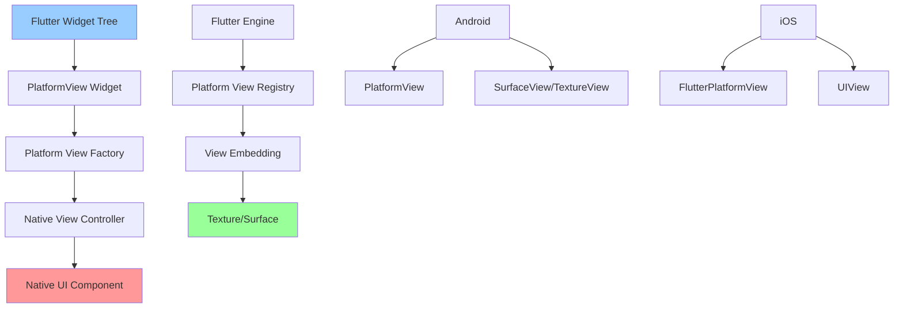

# Platform Views 详解

> Platform Views 允许在Flutter应用中嵌入原生视图组件，实现复杂的原生UI集成

## 📋 Platform Views架构图



## 🎯 目录

- [基础概念](#基础概念)
- [Android Platform Views](#android-platform-views)
- [iOS Platform Views](#ios-platform-views)
- [Flutter端集成](#flutter端集成)
- [高级特性](#高级特性)
- [性能优化](#性能优化)
- [实际应用](#实际应用)
- [最佳实践](#最佳实践)

## 🚀 基础概念

### Platform Views特点
- **原生UI集成**: 直接嵌入原生视图组件
- **完整功能**: 保持原生组件的所有功能
- **性能优化**: 支持硬件加速和优化渲染
- **事件处理**: 完整的触摸和手势支持

### 适用场景
- 地图组件（Google Maps、高德地图）
- 视频播放器
- WebView组件
- 相机预览
- 广告组件
- 复杂的原生UI控件

### 实现方式对比

| 特性 | Virtual Display | Hybrid Composition |
|------|----------------|--------------------|
| 性能 | 较低 | 高 |
| 内存占用 | 高 | 低 |
| 触摸精度 | 一般 | 精确 |
| 兼容性 | 好 | 较好 |
| 推荐场景 | 简单视图 | 复杂交互 |

## 🤖 Android Platform Views

### 1. 创建Platform View

#### PlatformView实现
```kotlin
// CustomPlatformView.kt
import android.content.Context
import android.view.View
import android.widget.TextView
import io.flutter.plugin.platform.PlatformView

class CustomPlatformView(
    context: Context,
    id: Int,
    creationParams: Map<String?, Any?>?
) : PlatformView {
    
    private val textView: TextView = TextView(context)
    
    init {
        // 初始化原生视图
        textView.text = creationParams?.get("text") as? String ?: "Default Text"
        textView.textSize = 16f
        textView.setPadding(20, 20, 20, 20)
    }
    
    override fun getView(): View {
        return textView
    }
    
    override fun dispose() {
        // 清理资源
    }
    
    // 更新视图内容
    fun updateText(newText: String) {
        textView.text = newText
    }
}
```

#### PlatformViewFactory实现
```kotlin
// CustomPlatformViewFactory.kt
import android.content.Context
import io.flutter.plugin.common.StandardMessageCodec
import io.flutter.plugin.platform.PlatformView
import io.flutter.plugin.platform.PlatformViewFactory

class CustomPlatformViewFactory : PlatformViewFactory(StandardMessageCodec.INSTANCE) {
    
    override fun create(
        context: Context,
        viewId: Int,
        args: Any?
    ): PlatformView {
        val creationParams = args as? Map<String?, Any?>
        return CustomPlatformView(context, viewId, creationParams)
    }
}
```

#### 注册Platform View
```kotlin
// MainActivity.kt
import io.flutter.embedding.android.FlutterActivity
import io.flutter.embedding.engine.FlutterEngine

class MainActivity: FlutterActivity() {
    
    override fun configureFlutterEngine(flutterEngine: FlutterEngine) {
        super.configureFlutterEngine(flutterEngine)
        
        // 注册Platform View
        flutterEngine
            .platformViewsController
            .registry
            .registerViewFactory(
                "custom_platform_view",
                CustomPlatformViewFactory()
            )
    }
}
```

### 2. 复杂Platform View示例

#### 自定义地图视图
```kotlin
// MapPlatformView.kt
import android.content.Context
import android.view.View
import com.google.android.gms.maps.CameraUpdateFactory
import com.google.android.gms.maps.GoogleMap
import com.google.android.gms.maps.MapView
import com.google.android.gms.maps.OnMapReadyCallback
import com.google.android.gms.maps.model.LatLng
import com.google.android.gms.maps.model.MarkerOptions
import io.flutter.plugin.platform.PlatformView

class MapPlatformView(
    context: Context,
    id: Int,
    creationParams: Map<String?, Any?>?
) : PlatformView, OnMapReadyCallback {
    
    private val mapView: MapView = MapView(context)
    private var googleMap: GoogleMap? = null
    
    init {
        mapView.onCreate(null)
        mapView.getMapAsync(this)
        
        // 解析初始参数
        creationParams?.let { params ->
            val lat = params["latitude"] as? Double ?: 0.0
            val lng = params["longitude"] as? Double ?: 0.0
            val zoom = params["zoom"] as? Double ?: 10.0
        }
    }
    
    override fun getView(): View {
        return mapView
    }
    
    override fun onMapReady(map: GoogleMap) {
        googleMap = map
        
        // 设置初始位置
        val initialPosition = LatLng(39.9042, 116.4074) // 北京
        map.addMarker(
            MarkerOptions()
                .position(initialPosition)
                .title("北京")
        )
        map.moveCamera(CameraUpdateFactory.newLatLngZoom(initialPosition, 10f))
    }
    
    override fun dispose() {
        mapView.onDestroy()
    }
    
    // 添加标记
    fun addMarker(lat: Double, lng: Double, title: String) {
        googleMap?.addMarker(
            MarkerOptions()
                .position(LatLng(lat, lng))
                .title(title)
        )
    }
    
    // 移动相机
    fun moveCamera(lat: Double, lng: Double, zoom: Float) {
        googleMap?.moveCamera(
            CameraUpdateFactory.newLatLngZoom(LatLng(lat, lng), zoom)
        )
    }
}
```

## 🍎 iOS Platform Views

### 1. 创建Platform View

#### FlutterPlatformView实现
```swift
// CustomPlatformView.swift
import Flutter
import UIKit

class CustomPlatformView: NSObject, FlutterPlatformView {
    private var _view: UIView
    private var _label: UILabel
    
    init(
        frame: CGRect,
        viewIdentifier viewId: Int64,
        arguments args: Any?,
        binaryMessenger messenger: FlutterBinaryMessenger?
    ) {
        _view = UIView()
        _label = UILabel()
        super.init()
        
        createNativeView(args)
    }
    
    func view() -> UIView {
        return _view
    }
    
    func createNativeView(_ args: Any?) {
        _view.backgroundColor = UIColor.lightGray
        
        _label.text = "Default Text"
        _label.textColor = UIColor.black
        _label.textAlignment = .center
        _label.translatesAutoresizingMaskIntoConstraints = false
        
        _view.addSubview(_label)
        
        // 设置约束
        NSLayoutConstraint.activate([
            _label.centerXAnchor.constraint(equalTo: _view.centerXAnchor),
            _label.centerYAnchor.constraint(equalTo: _view.centerYAnchor)
        ])
        
        // 解析参数
        if let args = args as? [String: Any],
           let text = args["text"] as? String {
            _label.text = text
        }
    }
    
    func updateText(_ newText: String) {
        _label.text = newText
    }
}
```

#### PlatformViewFactory实现
```swift
// CustomPlatformViewFactory.swift
import Flutter
import UIKit

class CustomPlatformViewFactory: NSObject, FlutterPlatformViewFactory {
    private var messenger: FlutterBinaryMessenger
    
    init(messenger: FlutterBinaryMessenger) {
        self.messenger = messenger
        super.init()
    }
    
    func create(
        withFrame frame: CGRect,
        viewIdentifier viewId: Int64,
        arguments args: Any?
    ) -> FlutterPlatformView {
        return CustomPlatformView(
            frame: frame,
            viewIdentifier: viewId,
            arguments: args,
            binaryMessenger: messenger
        )
    }
    
    func createArgsCodec() -> FlutterMessageCodec & NSObjectProtocol {
        return FlutterStandardMessageCodec.sharedInstance()
    }
}
```

#### 注册Platform View
```swift
// AppDelegate.swift
import UIKit
import Flutter

@UIApplicationMain
@objc class AppDelegate: FlutterAppDelegate {
    override func application(
        _ application: UIApplication,
        didFinishLaunchingWithOptions launchOptions: [UIApplication.LaunchOptionsKey: Any]?
    ) -> Bool {
        
        let controller: FlutterViewController = window?.rootViewController as! FlutterViewController
        
        // 注册Platform View
        let registrar = self.registrar(forPlugin: "CustomPlatformView")
        let factory = CustomPlatformViewFactory(messenger: registrar.messenger())
        registrar.register(factory, withId: "custom_platform_view")
        
        GeneratedPluginRegistrant.register(with: self)
        return super.application(application, didFinishLaunchingWithOptions: launchOptions)
    }
}
```

### 2. 复杂Platform View示例

#### 自定义视频播放器
```swift
// VideoPlatformView.swift
import Flutter
import UIKit
import AVFoundation

class VideoPlatformView: NSObject, FlutterPlatformView {
    private var _view: UIView
    private var _player: AVPlayer?
    private var _playerLayer: AVPlayerLayer?
    private var _methodChannel: FlutterMethodChannel
    
    init(
        frame: CGRect,
        viewIdentifier viewId: Int64,
        arguments args: Any?,
        binaryMessenger messenger: FlutterBinaryMessenger?
    ) {
        _view = UIView()
        _methodChannel = FlutterMethodChannel(
            name: "video_platform_view_\(viewId)",
            binaryMessenger: messenger!
        )
        super.init()
        
        setupVideoPlayer(args)
        setupMethodChannel()
    }
    
    func view() -> UIView {
        return _view
    }
    
    func setupVideoPlayer(_ args: Any?) {
        guard let args = args as? [String: Any],
              let urlString = args["url"] as? String,
              let url = URL(string: urlString) else {
            return
        }
        
        _player = AVPlayer(url: url)
        _playerLayer = AVPlayerLayer(player: _player)
        _playerLayer?.frame = _view.bounds
        _playerLayer?.videoGravity = .resizeAspectFit
        
        _view.layer.addSublayer(_playerLayer!)
    }
    
    func setupMethodChannel() {
        _methodChannel.setMethodCallHandler { [weak self] (call, result) in
            switch call.method {
            case "play":
                self?._player?.play()
                result(nil)
            case "pause":
                self?._player?.pause()
                result(nil)
            case "seek":
                if let time = call.arguments as? Double {
                    let cmTime = CMTime(seconds: time, preferredTimescale: 1000)
                    self?._player?.seek(to: cmTime)
                }
                result(nil)
            default:
                result(FlutterMethodNotImplemented)
            }
        }
    }
}
```

## 📱 Flutter端集成

### 1. 基础Platform View Widget

```dart
// custom_platform_view.dart
import 'package:flutter/foundation.dart';
import 'package:flutter/gestures.dart';
import 'package:flutter/rendering.dart';
import 'package:flutter/services.dart';
import 'package:flutter/widgets.dart';

class CustomPlatformView extends StatefulWidget {
  final String text;
  final double width;
  final double height;
  final VoidCallback? onCreated;
  
  const CustomPlatformView({
    Key? key,
    required this.text,
    this.width = 200,
    this.height = 100,
    this.onCreated,
  }) : super(key: key);
  
  @override
  State<CustomPlatformView> createState() => _CustomPlatformViewState();
}

class _CustomPlatformViewState extends State<CustomPlatformView> {
  @override
  Widget build(BuildContext context) {
    // 创建参数
    final Map<String, dynamic> creationParams = {
      'text': widget.text,
    };
    
    return SizedBox(
      width: widget.width,
      height: widget.height,
      child: _buildPlatformView(creationParams),
    );
  }
  
  Widget _buildPlatformView(Map<String, dynamic> creationParams) {
    if (defaultTargetPlatform == TargetPlatform.android) {
      return PlatformViewLink(
        viewType: 'custom_platform_view',
        surfaceFactory: (context, controller) {
          return AndroidViewSurface(
            controller: controller as AndroidViewController,
            gestureRecognizers: const <Factory<OneSequenceGestureRecognizer>>{},
            hitTestBehavior: PlatformViewHitTestBehavior.opaque,
          );
        },
        onCreatePlatformView: (params) {
          final controller = PlatformViewsService.initSurfaceAndroidView(
            id: params.id,
            viewType: 'custom_platform_view',
            layoutDirection: TextDirection.ltr,
            creationParams: creationParams,
            creationParamsCodec: const StandardMessageCodec(),
            onFocus: () {
              params.onFocusChanged(true);
            },
          );
          
          controller.addOnPlatformViewCreatedListener((id) {
            params.onPlatformViewCreated(id);
            widget.onCreated?.call();
          });
          
          return controller;
        },
      );
    } else if (defaultTargetPlatform == TargetPlatform.iOS) {
      return UiKitView(
        viewType: 'custom_platform_view',
        layoutDirection: TextDirection.ltr,
        creationParams: creationParams,
        creationParamsCodec: const StandardMessageCodec(),
        onPlatformViewCreated: (id) {
          widget.onCreated?.call();
        },
      );
    }
    
    return Container(
      color: Colors.grey,
      child: const Center(
        child: Text('Platform View not supported'),
      ),
    );
  }
}
```

### 2. 带通信的Platform View

```dart
// interactive_platform_view.dart
import 'package:flutter/services.dart';

class InteractivePlatformView extends StatefulWidget {
  final Map<String, dynamic> initialParams;
  final Function(int)? onPlatformViewCreated;
  
  const InteractivePlatformView({
    Key? key,
    required this.initialParams,
    this.onPlatformViewCreated,
  }) : super(key: key);
  
  @override
  State<InteractivePlatformView> createState() => _InteractivePlatformViewState();
}

class _InteractivePlatformViewState extends State<InteractivePlatformView> {
  MethodChannel? _methodChannel;
  int? _platformViewId;
  
  @override
  Widget build(BuildContext context) {
    return SizedBox(
      width: 300,
      height: 200,
      child: _buildPlatformView(),
    );
  }
  
  Widget _buildPlatformView() {
    if (defaultTargetPlatform == TargetPlatform.android) {
      return AndroidView(
        viewType: 'interactive_platform_view',
        layoutDirection: TextDirection.ltr,
        creationParams: widget.initialParams,
        creationParamsCodec: const StandardMessageCodec(),
        onPlatformViewCreated: _onPlatformViewCreated,
      );
    } else if (defaultTargetPlatform == TargetPlatform.iOS) {
      return UiKitView(
        viewType: 'interactive_platform_view',
        layoutDirection: TextDirection.ltr,
        creationParams: widget.initialParams,
        creationParamsCodec: const StandardMessageCodec(),
        onPlatformViewCreated: _onPlatformViewCreated,
      );
    }
    
    return Container(
      color: Colors.grey,
      child: const Center(
        child: Text('Platform View not supported'),
      ),
    );
  }
  
  void _onPlatformViewCreated(int id) {
    _platformViewId = id;
    _methodChannel = MethodChannel('interactive_platform_view_$id');
    
    // 设置方法调用处理器
    _methodChannel?.setMethodCallHandler(_handleMethodCall);
    
    widget.onPlatformViewCreated?.call(id);
  }
  
  Future<dynamic> _handleMethodCall(MethodCall call) async {
    switch (call.method) {
      case 'onNativeEvent':
        final data = call.arguments as Map<String, dynamic>;
        _handleNativeEvent(data);
        break;
      default:
        throw PlatformException(
          code: 'Unimplemented',
          details: 'Method ${call.method} not implemented',
        );
    }
  }
  
  void _handleNativeEvent(Map<String, dynamic> data) {
    print('收到原生事件: $data');
    // 处理原生事件
  }
  
  // 调用原生方法
  Future<void> callNativeMethod(String method, [dynamic arguments]) async {
    if (_methodChannel != null) {
      try {
        await _methodChannel!.invokeMethod(method, arguments);
      } on PlatformException catch (e) {
        print('调用原生方法失败: ${e.message}');
      }
    }
  }
  
  @override
  void dispose() {
    _methodChannel?.setMethodCallHandler(null);
    super.dispose();
  }
}
```

### 3. Platform View控制器

```dart
// platform_view_controller.dart
class PlatformViewController {
  final int viewId;
  final MethodChannel _methodChannel;
  
  PlatformViewController(this.viewId)
      : _methodChannel = MethodChannel('platform_view_$viewId');
  
  /// 更新视图属性
  Future<void> updateProperty(String key, dynamic value) async {
    try {
      await _methodChannel.invokeMethod('updateProperty', {
        'key': key,
        'value': value,
      });
    } on PlatformException catch (e) {
      print('更新属性失败: ${e.message}');
    }
  }
  
  /// 执行动画
  Future<void> animate(Map<String, dynamic> animationConfig) async {
    try {
      await _methodChannel.invokeMethod('animate', animationConfig);
    } on PlatformException catch (e) {
      print('执行动画失败: ${e.message}');
    }
  }
  
  /// 获取视图状态
  Future<Map<String, dynamic>?> getViewState() async {
    try {
      final result = await _methodChannel.invokeMethod('getViewState');
      return Map<String, dynamic>.from(result);
    } on PlatformException catch (e) {
      print('获取视图状态失败: ${e.message}');
      return null;
    }
  }
  
  /// 销毁视图
  Future<void> dispose() async {
    try {
      await _methodChannel.invokeMethod('dispose');
    } on PlatformException catch (e) {
      print('销毁视图失败: ${e.message}');
    }
  }
}
```

## 🚀 高级特性

### 1. 手势处理

```dart
// gesture_platform_view.dart
class GesturePlatformView extends StatefulWidget {
  @override
  State<GesturePlatformView> createState() => _GesturePlatformViewState();
}

class _GesturePlatformViewState extends State<GesturePlatformView> {
  @override
  Widget build(BuildContext context) {
    return PlatformViewLink(
      viewType: 'gesture_platform_view',
      surfaceFactory: (context, controller) {
        return AndroidViewSurface(
          controller: controller as AndroidViewController,
          gestureRecognizers: <Factory<OneSequenceGestureRecognizer>>{
            Factory<TapGestureRecognizer>(
              () => TapGestureRecognizer()
                ..onTap = () {
                  print('Platform View被点击');
                },
            ),
            Factory<PanGestureRecognizer>(
              () => PanGestureRecognizer()
                ..onPanUpdate = (details) {
                  print('Platform View拖拽: ${details.delta}');
                },
            ),
          },
          hitTestBehavior: PlatformViewHitTestBehavior.opaque,
        );
      },
      onCreatePlatformView: (params) {
        return PlatformViewsService.initSurfaceAndroidView(
          id: params.id,
          viewType: 'gesture_platform_view',
          layoutDirection: TextDirection.ltr,
          onFocus: () {
            params.onFocusChanged(true);
          },
        )..addOnPlatformViewCreatedListener(params.onPlatformViewCreated);
      },
    );
  }
}
```

### 2. 生命周期管理

```dart
// lifecycle_platform_view.dart
class LifecyclePlatformView extends StatefulWidget {
  @override
  State<LifecyclePlatformView> createState() => _LifecyclePlatformViewState();
}

class _LifecyclePlatformViewState extends State<LifecyclePlatformView>
    with WidgetsBindingObserver {
  MethodChannel? _methodChannel;
  
  @override
  void initState() {
    super.initState();
    WidgetsBinding.instance.addObserver(this);
  }
  
  @override
  void dispose() {
    WidgetsBinding.instance.removeObserver(this);
    _methodChannel?.invokeMethod('dispose');
    super.dispose();
  }
  
  @override
  void didChangeAppLifecycleState(AppLifecycleState state) {
    super.didChangeAppLifecycleState(state);
    
    switch (state) {
      case AppLifecycleState.resumed:
        _methodChannel?.invokeMethod('onResume');
        break;
      case AppLifecycleState.paused:
        _methodChannel?.invokeMethod('onPause');
        break;
      case AppLifecycleState.detached:
        _methodChannel?.invokeMethod('onDestroy');
        break;
      default:
        break;
    }
  }
  
  void _onPlatformViewCreated(int id) {
    _methodChannel = MethodChannel('lifecycle_platform_view_$id');
    _methodChannel?.invokeMethod('onCreate');
  }
  
  @override
  Widget build(BuildContext context) {
    return AndroidView(
      viewType: 'lifecycle_platform_view',
      onPlatformViewCreated: _onPlatformViewCreated,
    );
  }
}
```

## ⚡ 性能优化

### 1. 渲染优化

```dart
// optimized_platform_view.dart
class OptimizedPlatformView extends StatefulWidget {
  @override
  State<OptimizedPlatformView> createState() => _OptimizedPlatformViewState();
}

class _OptimizedPlatformViewState extends State<OptimizedPlatformView> {
  bool _isVisible = true;
  
  @override
  Widget build(BuildContext context) {
    return Visibility(
      visible: _isVisible,
      child: RepaintBoundary(
        child: PlatformViewLink(
          viewType: 'optimized_platform_view',
          surfaceFactory: (context, controller) {
            return AndroidViewSurface(
              controller: controller as AndroidViewController,
              gestureRecognizers: const <Factory<OneSequenceGestureRecognizer>>{},
              hitTestBehavior: PlatformViewHitTestBehavior.opaque,
            );
          },
          onCreatePlatformView: (params) {
            return PlatformViewsService.initSurfaceAndroidView(
              id: params.id,
              viewType: 'optimized_platform_view',
              layoutDirection: TextDirection.ltr,
              onFocus: () {
                params.onFocusChanged(true);
              },
            )..addOnPlatformViewCreatedListener(params.onPlatformViewCreated);
          },
        ),
      ),
    );
  }
  
  void setVisibility(bool visible) {
    if (_isVisible != visible) {
      setState(() {
        _isVisible = visible;
      });
    }
  }
}
```

### 2. 内存管理

```dart
// memory_managed_platform_view.dart
class MemoryManagedPlatformView extends StatefulWidget {
  @override
  State<MemoryManagedPlatformView> createState() => _MemoryManagedPlatformViewState();
}

class _MemoryManagedPlatformViewState extends State<MemoryManagedPlatformView> {
  MethodChannel? _methodChannel;
  Timer? _memoryCheckTimer;
  
  @override
  void initState() {
    super.initState();
    _startMemoryMonitoring();
  }
  
  @override
  void dispose() {
    _stopMemoryMonitoring();
    _methodChannel?.invokeMethod('releaseResources');
    super.dispose();
  }
  
  void _startMemoryMonitoring() {
    _memoryCheckTimer = Timer.periodic(const Duration(seconds: 30), (timer) {
      _checkMemoryUsage();
    });
  }
  
  void _stopMemoryMonitoring() {
    _memoryCheckTimer?.cancel();
    _memoryCheckTimer = null;
  }
  
  Future<void> _checkMemoryUsage() async {
    try {
      final memoryInfo = await _methodChannel?.invokeMethod('getMemoryInfo');
      if (memoryInfo != null) {
        final usage = memoryInfo['usage'] as double;
        if (usage > 0.8) { // 内存使用超过80%
          await _methodChannel?.invokeMethod('optimizeMemory');
        }
      }
    } catch (e) {
      print('内存检查失败: $e');
    }
  }
  
  @override
  Widget build(BuildContext context) {
    return AndroidView(
      viewType: 'memory_managed_platform_view',
      onPlatformViewCreated: (id) {
        _methodChannel = MethodChannel('memory_managed_platform_view_$id');
      },
    );
  }
}
```

## 📱 实际应用

### 1. 地图集成示例

```dart
// map_platform_view_demo.dart
class MapPlatformViewDemo extends StatefulWidget {
  @override
  State<MapPlatformViewDemo> createState() => _MapPlatformViewDemoState();
}

class _MapPlatformViewDemoState extends State<MapPlatformViewDemo> {
  PlatformViewController? _mapController;
  
  @override
  Widget build(BuildContext context) {
    return Scaffold(
      appBar: AppBar(
        title: const Text('地图Platform View'),
        actions: [
          IconButton(
            icon: const Icon(Icons.add_location),
            onPressed: _addMarker,
          ),
          IconButton(
            icon: const Icon(Icons.my_location),
            onPressed: _moveToCurrentLocation,
          ),
        ],
      ),
      body: Column(
        children: [
          Expanded(
            child: InteractivePlatformView(
              initialParams: {
                'latitude': 39.9042,
                'longitude': 116.4074,
                'zoom': 10.0,
              },
              onPlatformViewCreated: (id) {
                _mapController = PlatformViewController(id);
              },
            ),
          ),
          Container(
            padding: const EdgeInsets.all(16),
            child: Row(
              mainAxisAlignment: MainAxisAlignment.spaceEvenly,
              children: [
                ElevatedButton(
                  onPressed: _zoomIn,
                  child: const Text('放大'),
                ),
                ElevatedButton(
                  onPressed: _zoomOut,
                  child: const Text('缩小'),
                ),
                ElevatedButton(
                  onPressed: _clearMarkers,
                  child: const Text('清除标记'),
                ),
              ],
            ),
          ),
        ],
      ),
    );
  }
  
  void _addMarker() {
    _mapController?.callNativeMethod('addMarker', {
      'latitude': 39.9042 + (Random().nextDouble() - 0.5) * 0.1,
      'longitude': 116.4074 + (Random().nextDouble() - 0.5) * 0.1,
      'title': '随机标记',
    });
  }
  
  void _moveToCurrentLocation() {
    _mapController?.callNativeMethod('moveToCurrentLocation');
  }
  
  void _zoomIn() {
    _mapController?.callNativeMethod('zoomIn');
  }
  
  void _zoomOut() {
    _mapController?.callNativeMethod('zoomOut');
  }
  
  void _clearMarkers() {
    _mapController?.callNativeMethod('clearMarkers');
  }
}
```

### 2. 视频播放器示例

```dart
// video_platform_view_demo.dart
class VideoPlatformViewDemo extends StatefulWidget {
  final String videoUrl;
  
  const VideoPlatformViewDemo({Key? key, required this.videoUrl}) : super(key: key);
  
  @override
  State<VideoPlatformViewDemo> createState() => _VideoPlatformViewDemoState();
}

class _VideoPlatformViewDemoState extends State<VideoPlatformViewDemo> {
  PlatformViewController? _videoController;
  bool _isPlaying = false;
  double _currentPosition = 0.0;
  double _duration = 0.0;
  
  @override
  Widget build(BuildContext context) {
    return Scaffold(
      appBar: AppBar(
        title: const Text('视频播放器'),
      ),
      body: Column(
        children: [
          Expanded(
            child: InteractivePlatformView(
              initialParams: {
                'url': widget.videoUrl,
                'autoPlay': false,
              },
              onPlatformViewCreated: (id) {
                _videoController = PlatformViewController(id);
                _setupVideoCallbacks();
              },
            ),
          ),
          _buildVideoControls(),
        ],
      ),
    );
  }
  
  Widget _buildVideoControls() {
    return Container(
      padding: const EdgeInsets.all(16),
      child: Column(
        children: [
          // 进度条
          Slider(
            value: _currentPosition,
            max: _duration,
            onChanged: (value) {
              _videoController?.callNativeMethod('seek', value);
            },
          ),
          // 控制按钮
          Row(
            mainAxisAlignment: MainAxisAlignment.spaceEvenly,
            children: [
              IconButton(
                icon: Icon(_isPlaying ? Icons.pause : Icons.play_arrow),
                onPressed: _togglePlayPause,
              ),
              IconButton(
                icon: const Icon(Icons.stop),
                onPressed: _stop,
              ),
              IconButton(
                icon: const Icon(Icons.fullscreen),
                onPressed: _toggleFullscreen,
              ),
            ],
          ),
        ],
      ),
    );
  }
  
  void _setupVideoCallbacks() {
    // 设置视频事件监听
    _videoController?.setMethodCallHandler((call) {
      switch (call.method) {
        case 'onPlaybackStateChanged':
          setState(() {
            _isPlaying = call.arguments['isPlaying'];
          });
          break;
        case 'onPositionChanged':
          setState(() {
            _currentPosition = call.arguments['position'];
          });
          break;
        case 'onDurationChanged':
          setState(() {
            _duration = call.arguments['duration'];
          });
          break;
      }
    });
  }
  
  void _togglePlayPause() {
    if (_isPlaying) {
      _videoController?.callNativeMethod('pause');
    } else {
      _videoController?.callNativeMethod('play');
    }
  }
  
  void _stop() {
    _videoController?.callNativeMethod('stop');
  }
  
  void _toggleFullscreen() {
    _videoController?.callNativeMethod('toggleFullscreen');
  }
}
```

## 🛡️ 最佳实践

### 1. 错误处理

```dart
class SafePlatformView extends StatefulWidget {
  @override
  State<SafePlatformView> createState() => _SafePlatformViewState();
}

class _SafePlatformViewState extends State<SafePlatformView> {
  String? _errorMessage;
  bool _isLoading = true;
  
  @override
  Widget build(BuildContext context) {
    if (_errorMessage != null) {
      return _buildErrorWidget();
    }
    
    if (_isLoading) {
      return _buildLoadingWidget();
    }
    
    return _buildPlatformView();
  }
  
  Widget _buildErrorWidget() {
    return Container(
      color: Colors.red[100],
      child: Center(
        child: Column(
          mainAxisAlignment: MainAxisAlignment.center,
          children: [
            const Icon(Icons.error, size: 48, color: Colors.red),
            const SizedBox(height: 16),
            Text(
              'Platform View加载失败',
              style: Theme.of(context).textTheme.titleLarge,
            ),
            const SizedBox(height: 8),
            Text(_errorMessage!),
            const SizedBox(height: 16),
            ElevatedButton(
              onPressed: _retry,
              child: const Text('重试'),
            ),
          ],
        ),
      ),
    );
  }
  
  Widget _buildLoadingWidget() {
    return const Center(
      child: CircularProgressIndicator(),
    );
  }
  
  Widget _buildPlatformView() {
    return AndroidView(
      viewType: 'safe_platform_view',
      onPlatformViewCreated: _onPlatformViewCreated,
    );
  }
  
  void _onPlatformViewCreated(int id) {
    setState(() {
      _isLoading = false;
    });
  }
  
  void _retry() {
    setState(() {
      _errorMessage = null;
      _isLoading = true;
    });
  }
}
```

### 2. 性能监控

```dart
class PerformanceMonitoredPlatformView extends StatefulWidget {
  @override
  State<PerformanceMonitoredPlatformView> createState() => _PerformanceMonitoredPlatformViewState();
}

class _PerformanceMonitoredPlatformViewState extends State<PerformanceMonitoredPlatformView> {
  final Stopwatch _renderStopwatch = Stopwatch();
  final List<double> _frameTimes = [];
  
  @override
  void initState() {
    super.initState();
    _startPerformanceMonitoring();
  }
  
  void _startPerformanceMonitoring() {
    WidgetsBinding.instance.addPostFrameCallback((_) {
      _renderStopwatch.start();
    });
    
    // 监控帧率
    Timer.periodic(const Duration(seconds: 1), (timer) {
      if (_frameTimes.isNotEmpty) {
        final avgFrameTime = _frameTimes.reduce((a, b) => a + b) / _frameTimes.length;
        final fps = 1000 / avgFrameTime;
        print('Platform View FPS: ${fps.toStringAsFixed(1)}');
        _frameTimes.clear();
      }
    });
  }
  
  @override
  Widget build(BuildContext context) {
    return CustomPaint(
      painter: PerformancePainter(),
      child: AndroidView(
        viewType: 'performance_monitored_platform_view',
        onPlatformViewCreated: (id) {
          _renderStopwatch.stop();
          _frameTimes.add(_renderStopwatch.elapsedMilliseconds.toDouble());
          _renderStopwatch.reset();
        },
      ),
    );
  }
}

class PerformancePainter extends CustomPainter {
  @override
  void paint(Canvas canvas, Size size) {
    // 绘制性能指示器
  }
  
  @override
  bool shouldRepaint(covariant CustomPainter oldDelegate) {
    return false;
  }
}
```

### 3. 资源管理

```dart
class ResourceManagedPlatformView extends StatefulWidget {
  @override
  State<ResourceManagedPlatformView> createState() => _ResourceManagedPlatformViewState();
}

class _ResourceManagedPlatformViewState extends State<ResourceManagedPlatformView>
    with AutomaticKeepAliveClientMixin {
  
  @override
  bool get wantKeepAlive => true;
  
  MethodChannel? _methodChannel;
  final List<StreamSubscription> _subscriptions = [];
  
  @override
  void dispose() {
    // 清理资源
    for (final subscription in _subscriptions) {
      subscription.cancel();
    }
    _subscriptions.clear();
    
    _methodChannel?.invokeMethod('dispose');
    super.dispose();
  }
  
  @override
  Widget build(BuildContext context) {
    super.build(context);
    
    return AndroidView(
      viewType: 'resource_managed_platform_view',
      onPlatformViewCreated: (id) {
        _methodChannel = MethodChannel('resource_managed_platform_view_$id');
        _setupResourceManagement();
      },
    );
  }
  
  void _setupResourceManagement() {
    // 监听内存警告
    final memoryWarningSubscription = SystemChannels.lifecycle.receiveBroadcastStream()
        .listen((event) {
      if (event == AppLifecycleState.paused.toString()) {
        _methodChannel?.invokeMethod('releaseNonEssentialResources');
      } else if (event == AppLifecycleState.resumed.toString()) {
        _methodChannel?.invokeMethod('restoreResources');
      }
    });
    
    _subscriptions.add(memoryWarningSubscription);
  }
}
```

---

> 💡 **提示**: Platform Views是Flutter中最强大的原生集成方案，但也是最复杂的。使用时需要特别注意性能优化、内存管理和生命周期处理。建议在简单的Channel通信无法满足需求时才使用Platform Views。