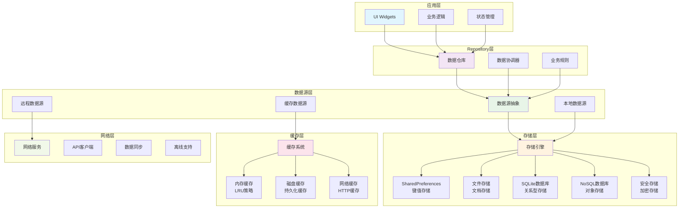
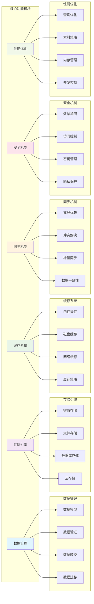
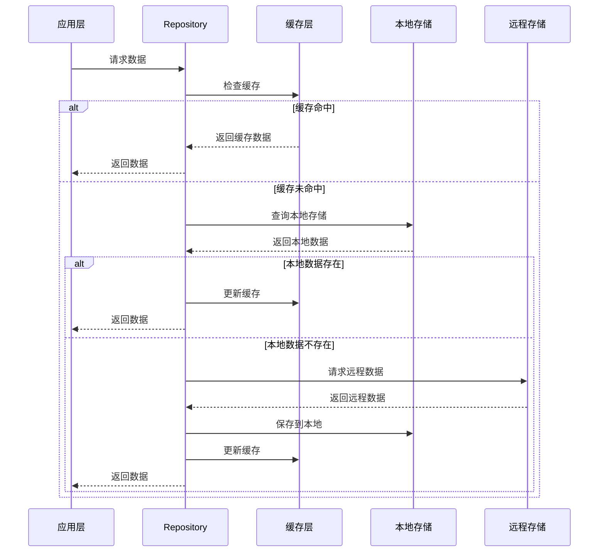
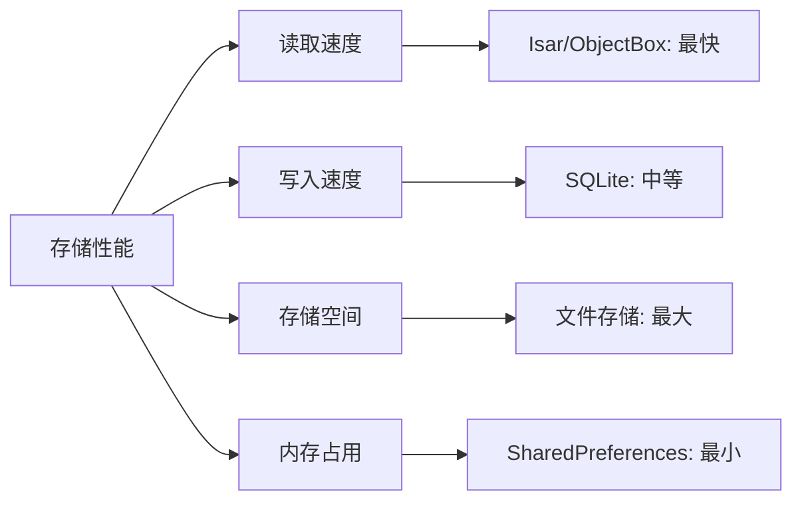
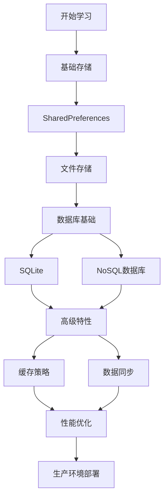

# 💾 Flutter 数据持久化深度指南

> 全面的 Flutter 数据持久化技术指南，涵盖本地存储、数据库操作、缓存策略等核心内容，构建高性能的数据管理系统


## 📋 目录导航

<details>
<summary>🎯 快速导航</summary>

### 💾 基础存储

- [💾 本地存储技术](local-storage.md) - SharedPreferences、文件存储、目录管理
- [🔐 安全存储](secure-storage.md) - 加密存储、密钥管理、数据保护
- [📁 文件系统](file-system.md) - 文件操作、目录管理、权限处理

### 🗄️ 数据库操作

- [🗄️ 数据库操作](database-operations.md) - SQLite、Hive、Isar、ObjectBox
- [🔄 数据同步](data-sync.md) - 离线优先、冲突解决、增量同步
- [📊 数据迁移](data-migration.md) - 版本管理、迁移脚本、备份恢复

### ⚡ 性能优化

- [⚡ 缓存策略](cache-strategies.md) - 内存缓存、磁盘缓存、网络缓存
- [🚀 性能优化](performance-optimization.md) - 查询优化、索引策略、内存管理
- [📈 监控分析](monitoring-analytics.md) - 性能监控、数据分析、优化建议

</details>

## 🏗️ 数据持久化架构总览

### 整体架构图



### 功能模块图



### 数据流架构



## 🎯 核心学习目标

### 📚 理论知识

- ✅ 深入理解 Flutter 数据持久化机制
- ✅ 掌握不同存储方案的适用场景
- ✅ 了解数据库设计和优化原理
- ✅ 学会缓存策略和性能优化

### 🛠️ 实践技能

- ✅ 熟练使用 SharedPreferences、SQLite、Hive 等存储方案
- ✅ 掌握数据同步和冲突解决策略
- ✅ 学会性能监控和优化技巧
- ✅ 能够设计可扩展的数据架构

### 🎨 架构能力

- ✅ 理解数据持久化架构设计
- ✅ 掌握 Repository 模式和数据源分离
- ✅ 学会数据迁移和版本管理
- ✅ 能够处理复杂的数据场景

## 🚀 快速开始

### 1. 环境准备

```bash
# 检查 Flutter 环境
flutter doctor

# 创建新项目
flutter create data_persistence_demo
cd data_persistence_demo

# 添加相关依赖
flutter pub add shared_preferences path_provider sqflite hive hive_flutter
flutter pub add flutter_secure_storage isar isar_flutter_libs
flutter pub add --dev build_runner hive_generator isar_generator
```

### 2. 基础配置示例

```dart
import 'package:flutter/material.dart';
import 'package:hive_flutter/hive_flutter.dart';
import 'package:path_provider/path_provider.dart';
import 'package:isar/isar.dart';
import 'package:shared_preferences/shared_preferences.dart';

void main() async {
  WidgetsFlutterBinding.ensureInitialized();

  // 初始化 Hive
  await Hive.initFlutter();
  await Hive.openBox('settings');
  await Hive.openBox('users');

  // 初始化 Isar
  final dir = await getApplicationDocumentsDirectory();
  final isar = await Isar.open(
    [UserSchema, PostSchema],
    directory: dir.path,
  );

  // 注册依赖
  setupDependencies(isar);

  runApp(MyApp());
}

void setupDependencies(Isar isar) {
  // 注册数据源
  GetIt.instance.registerSingleton<LocalDataSource>(
    LocalDataSourceImpl(),
  );

  GetIt.instance.registerSingleton<DatabaseService>(
    DatabaseServiceImpl(isar),
  );

  GetIt.instance.registerSingleton<CacheManager>(
    CacheManagerImpl(),
  );
}

class MyApp extends StatelessWidget {
  @override
  Widget build(BuildContext context) {
    return MaterialApp(
      title: '数据持久化示例',
      theme: ThemeData(primarySwatch: Colors.blue),
      home: DataPersistencePage(),
    );
  }
}

class DataPersistencePage extends StatefulWidget {
  @override
  _DataPersistencePageState createState() => _DataPersistencePageState();
}

class _DataPersistencePageState extends State<DataPersistencePage> {
  final UserRepository _userRepository = GetIt.instance<UserRepository>();
  final SettingsRepository _settingsRepository = GetIt.instance<SettingsRepository>();

  List<User> _users = [];
  AppSettings _settings = AppSettings();
  bool _isLoading = false;

  @override
  void initState() {
    super.initState();
    _loadData();
  }

  Future<void> _loadData() async {
    setState(() => _isLoading = true);

    try {
      // 并行加载数据
      final results = await Future.wait([
        _userRepository.getAllUsers(),
        _settingsRepository.getSettings(),
      ]);

      setState(() {
        _users = results[0];
        _settings = results[1];
        _isLoading = false;
      });
    } catch (e) {
      setState(() => _isLoading = false);
      ScaffoldMessenger.of(context).showSnackBar(
        SnackBar(content: Text('加载数据失败: $e')),
      );
    }
  }

  @override
  Widget build(BuildContext context) {
    return Scaffold(
      appBar: AppBar(
        title: Text('数据持久化示例'),
        actions: [
          IconButton(
            icon: Icon(Icons.refresh),
            onPressed: _loadData,
          ),
          IconButton(
            icon: Icon(Icons.settings),
            onPressed: _openSettings,
          ),
        ],
      ),
      body: _isLoading
          ? Center(child: CircularProgressIndicator())
          : Column(
              children: [
                // 设置卡片
                _buildSettingsCard(),

                // 用户列表
                Expanded(
                  child: _buildUserList(),
                ),
              ],
            ),
      floatingActionButton: FloatingActionButton(
        onPressed: _addUser,
        child: Icon(Icons.add),
      ),
    );
  }

  Widget _buildSettingsCard() {
    return Card(
      margin: EdgeInsets.all(16),
      child: Padding(
        padding: EdgeInsets.all(16),
        child: Column(
          crossAxisAlignment: CrossAxisAlignment.start,
          children: [
            Text(
              '应用设置',
              style: TextStyle(fontSize: 18, fontWeight: FontWeight.bold),
            ),
            SizedBox(height: 8),
            SwitchListTile(
              title: Text('深色模式'),
              value: _settings.isDarkMode,
              onChanged: (value) async {
                final newSettings = _settings.copyWith(isDarkMode: value);
                await _settingsRepository.saveSettings(newSettings);
                setState(() => _settings = newSettings);
              },
            ),
            SwitchListTile(
              title: Text('推送通知'),
              value: _settings.notificationsEnabled,
              onChanged: (value) async {
                final newSettings = _settings.copyWith(notificationsEnabled: value);
                await _settingsRepository.saveSettings(newSettings);
                setState(() => _settings = newSettings);
              },
            ),
          ],
        ),
      ),
    );
  }

  Widget _buildUserList() {
    return ListView.builder(
      itemCount: _users.length,
      itemBuilder: (context, index) {
        final user = _users[index];
        return ListTile(
          leading: CircleAvatar(
            child: Text(user.name[0].toUpperCase()),
          ),
          title: Text(user.name),
          subtitle: Text(user.email),
          trailing: IconButton(
            icon: Icon(Icons.delete),
            onPressed: () => _deleteUser(user.id),
          ),
        );
      },
    );
  }

  Future<void> _addUser() async {
    final newUser = User(
      id: DateTime.now().millisecondsSinceEpoch,
      name: '新用户 ${_users.length + 1}',
      email: 'user${_users.length + 1}@example.com',
      createdAt: DateTime.now(),
    );

    try {
      await _userRepository.saveUser(newUser);
      setState(() => _users.add(newUser));

      ScaffoldMessenger.of(context).showSnackBar(
        SnackBar(content: Text('用户添加成功')),
      );
    } catch (e) {
      ScaffoldMessenger.of(context).showSnackBar(
        SnackBar(content: Text('添加用户失败: $e')),
      );
    }
  }

  Future<void> _deleteUser(int userId) async {
    try {
      await _userRepository.deleteUser(userId);
      setState(() => _users.removeWhere((user) => user.id == userId));

      ScaffoldMessenger.of(context).showSnackBar(
        SnackBar(content: Text('用户删除成功')),
      );
    } catch (e) {
      ScaffoldMessenger.of(context).showSnackBar(
        SnackBar(content: Text('删除用户失败: $e')),
      );
    }
  }

  void _openSettings() {
    Navigator.push(
      context,
      MaterialPageRoute(builder: (context) => SettingsPage()),
    );
  }
}

// 数据模型
@HiveType(typeId: 0)
class User {
  @HiveField(0)
  final int id;

  @HiveField(1)
  final String name;

  @HiveField(2)
  final String email;

  @HiveField(3)
  final DateTime createdAt;

  User({
    required this.id,
    required this.name,
    required this.email,
    required this.createdAt,
  });
}

@HiveType(typeId: 1)
class AppSettings {
  @HiveField(0)
  final bool isDarkMode;

  @HiveField(1)
  final bool notificationsEnabled;

  @HiveField(2)
  final String language;

  AppSettings({
    this.isDarkMode = false,
    this.notificationsEnabled = true,
    this.language = 'zh_CN',
  });

  AppSettings copyWith({
    bool? isDarkMode,
    bool? notificationsEnabled,
    String? language,
  }) {
    return AppSettings(
      isDarkMode: isDarkMode ?? this.isDarkMode,
      notificationsEnabled: notificationsEnabled ?? this.notificationsEnabled,
      language: language ?? this.language,
    );
  }
}
```

### 3. Repository 实现示例

```dart
// repositories/user_repository.dart
abstract class UserRepository {
  Future<List<User>> getAllUsers();
  Future<User?> getUserById(int id);
  Future<User> saveUser(User user);
  Future<void> deleteUser(int id);
  Stream<List<User>> watchUsers();
}

class UserRepositoryImpl implements UserRepository {
  final LocalDataSource _localDataSource;
  final RemoteDataSource _remoteDataSource;
  final CacheManager _cacheManager;

  UserRepositoryImpl({
    required LocalDataSource localDataSource,
    required RemoteDataSource remoteDataSource,
    required CacheManager cacheManager,
  }) : _localDataSource = localDataSource,
       _remoteDataSource = remoteDataSource,
       _cacheManager = cacheManager;

  @override
  Future<List<User>> getAllUsers() async {
    try {
      // 先从缓存获取
      final cached = await _cacheManager.get<List<User>>('all_users');
      if (cached != null) {
        return cached;
      }

      // 从本地数据库获取
      final localUsers = await _localDataSource.getAllUsers();
      if (localUsers.isNotEmpty) {
        await _cacheManager.set('all_users', localUsers);
        return localUsers;
      }

      // 从远程获取
      final remoteUsers = await _remoteDataSource.getAllUsers();
      await _localDataSource.saveUsers(remoteUsers);
      await _cacheManager.set('all_users', remoteUsers);

      return remoteUsers;
    } catch (e) {
      // 如果远程获取失败，返回本地数据
      return await _localDataSource.getAllUsers();
    }
  }

  @override
  Future<User?> getUserById(int id) async {
    try {
      // 先从缓存获取
      final cached = await _cacheManager.get<User>('user_$id');
      if (cached != null) {
        return cached;
      }

      // 从本地数据库获取
      final localUser = await _localDataSource.getUserById(id);
      if (localUser != null) {
        await _cacheManager.set('user_$id', localUser);
        return localUser;
      }

      // 从远程获取
      final remoteUser = await _remoteDataSource.getUserById(id);
      if (remoteUser != null) {
        await _localDataSource.saveUser(remoteUser);
        await _cacheManager.set('user_$id', remoteUser);
      }

      return remoteUser;
    } catch (e) {
      return await _localDataSource.getUserById(id);
    }
  }

  @override
  Future<User> saveUser(User user) async {
    try {
      // 保存到本地数据库
      final savedUser = await _localDataSource.saveUser(user);

      // 更新缓存
      await _cacheManager.set('user_${savedUser.id}', savedUser);
      await _cacheManager.invalidate('all_users');

      // 异步保存到远程
      _remoteDataSource.saveUser(savedUser).catchError((e) {
        debugPrint('Remote save failed: $e');
      });

      return savedUser;
    } catch (e) {
      throw DataPersistenceException('保存用户失败: $e');
    }
  }

  @override
  Future<void> deleteUser(int id) async {
    try {
      // 从本地数据库删除
      await _localDataSource.deleteUser(id);

      // 清除缓存
      await _cacheManager.invalidate('user_$id');
      await _cacheManager.invalidate('all_users');

      // 异步从远程删除
      _remoteDataSource.deleteUser(id).catchError((e) {
        debugPrint('Remote delete failed: $e');
      });
    } catch (e) {
      throw DataPersistenceException('删除用户失败: $e');
    }
  }

  @override
  Stream<List<User>> watchUsers() {
    return _localDataSource.watchUsers();
  }
}

class DataPersistenceException implements Exception {
  final String message;

  DataPersistenceException(this.message);

  @override
  String toString() => 'DataPersistenceException: $message';
}
```

## 📊 存储方案对比

### 存储方案特性对比

| 存储方案          | 适用场景     | 性能       | 复杂度   | 查询能力   | 类型安全   | 离线支持 |
| ----------------- | ------------ | ---------- | -------- | ---------- | ---------- | -------- |
| SharedPreferences | 简单配置     | ⭐⭐⭐     | ⭐       | ⭐         | ⭐⭐       | ✅       |
| 文件存储          | 大文件、媒体 | ⭐⭐       | ⭐⭐     | ⭐         | ⭐⭐       | ✅       |
| SQLite            | 复杂关系数据 | ⭐⭐⭐     | ⭐⭐⭐⭐ | ⭐⭐⭐⭐⭐ | ⭐⭐⭐     | ✅       |
| Hive              | 简单对象存储 | ⭐⭐⭐⭐   | ⭐⭐     | ⭐⭐       | ⭐⭐⭐     | ✅       |
| Isar              | 高性能 NoSQL | ⭐⭐⭐⭐⭐ | ⭐⭐⭐   | ⭐⭐⭐⭐   | ⭐⭐⭐⭐   | ✅       |
| ObjectBox         | 对象数据库   | ⭐⭐⭐⭐⭐ | ⭐⭐⭐   | ⭐⭐⭐⭐   | ⭐⭐⭐⭐⭐ | ✅       |

### 性能对比



### 选择指南

#### 💾 选择 SharedPreferences 的场景

- 简单的键值对存储
- 应用配置和设置
- 快速原型开发
- 小量数据存储

#### 📁 选择文件存储的场景

- 大文件存储（图片、视频）
- 文档和媒体文件
- 需要文件系统访问
- 临时文件缓存

#### 🗄️ 选择 SQLite 的场景

- 复杂的关系数据
- 需要复杂查询
- 事务处理需求
- 数据完整性要求高

#### 🚀 选择 Hive 的场景

- 简单的对象存储
- 快速开发
- 跨平台一致性
- 类型安全需求

#### ⚡ 选择 Isar 的场景

- 高性能要求
- 复杂查询需求
- 大数据集处理
- 实时数据同步

#### 🎯 选择 ObjectBox 的场景

- 对象关系映射
- 高性能要求
- 类型安全
- 复杂数据模型

## 🎨 设计模式应用

### 1. Repository 模式 (Repository Pattern)

```dart
// Repository 接口
abstract class DataRepository<T> {
  Future<List<T>> getAll();
  Future<T?> getById(String id);
  Future<T> save(T item);
  Future<void> delete(String id);
  Stream<List<T>> watchAll();
}

// 具体实现
class UserRepositoryImpl implements DataRepository<User> {
  final LocalDataSource _localDataSource;
  final RemoteDataSource _remoteDataSource;
  final CacheManager _cacheManager;

  UserRepositoryImpl({
    required LocalDataSource localDataSource,
    required RemoteDataSource remoteDataSource,
    required CacheManager cacheManager,
  }) : _localDataSource = localDataSource,
       _remoteDataSource = remoteDataSource,
       _cacheManager = cacheManager;

  @override
  Future<List<User>> getAll() async {
    // 实现获取所有用户的逻辑
  }

  @override
  Future<User?> getById(String id) async {
    // 实现根据ID获取用户的逻辑
  }

  @override
  Future<User> save(User user) async {
    // 实现保存用户的逻辑
  }

  @override
  Future<void> delete(String id) async {
    // 实现删除用户的逻辑
  }

  @override
  Stream<List<User>> watchAll() {
    // 实现监听用户列表变化的逻辑
  }
}
```

### 2. 策略模式 (Strategy Pattern)

```dart
// 存储策略接口
abstract class StorageStrategy {
  Future<T?> get<T>(String key);
  Future<void> set<T>(String key, T value);
  Future<void> delete(String key);
  Future<void> clear();
}

// SharedPreferences 策略
class SharedPreferencesStrategy implements StorageStrategy {
  final SharedPreferences _prefs;

  SharedPreferencesStrategy(this._prefs);

  @override
  Future<T?> get<T>(String key) async {
    final value = _prefs.get(key);
    return value as T?;
  }

  @override
  Future<void> set<T>(String key, T value) async {
    if (value is String) {
      await _prefs.setString(key, value);
    } else if (value is int) {
      await _prefs.setInt(key, value);
    } else if (value is bool) {
      await _prefs.setBool(key, value);
    } else if (value is double) {
      await _prefs.setDouble(key, value);
    } else if (value is List<String>) {
      await _prefs.setStringList(key, value);
    }
  }

  @override
  Future<void> delete(String key) async {
    await _prefs.remove(key);
  }

  @override
  Future<void> clear() async {
    await _prefs.clear();
  }
}

// Hive 策略
class HiveStrategy implements StorageStrategy {
  final Box _box;

  HiveStrategy(this._box);

  @override
  Future<T?> get<T>(String key) async {
    return _box.get(key) as T?;
  }

  @override
  Future<void> set<T>(String key, T value) async {
    await _box.put(key, value);
  }

  @override
  Future<void> delete(String key) async {
    await _box.delete(key);
  }

  @override
  Future<void> clear() async {
    await _box.clear();
  }
}

// 存储策略工厂
class StorageStrategyFactory {
  static StorageStrategy createStrategy(StorageType type) {
    switch (type) {
      case StorageType.sharedPreferences:
        return SharedPreferencesStrategy(SharedPreferences.getInstance());
      case StorageType.hive:
        return HiveStrategy(Hive.box('default'));
      case StorageType.secure:
        return SecureStorageStrategy();
      default:
        throw ArgumentError('不支持的存储类型: $type');
    }
  }
}

enum StorageType { sharedPreferences, hive, secure }
```

### 3. 观察者模式 (Observer Pattern)

```dart
// 数据变更监听器
class DataChangeObserver extends ChangeNotifier {
  final Map<String, List<Function>> _listeners = {};

  void addListener(String key, Function callback) {
    _listeners.putIfAbsent(key, () => []).add(callback);
  }

  void removeListener(String key, Function callback) {
    _listeners[key]?.remove(callback);
  }

  void notifyDataChanged(String key, dynamic data) {
    _listeners[key]?.forEach((callback) => callback(data));
    notifyListeners();
  }

  void notifyAllListeners() {
    notifyListeners();
  }
}

// 使用示例
class DataManager {
  final DataChangeObserver _observer = DataChangeObserver();

  Future<void> saveUser(User user) async {
    // 保存用户数据
    await _userRepository.save(user);

    // 通知数据变更
    _observer.notifyDataChanged('users', user);
  }

  void watchUsers(Function callback) {
    _observer.addListener('users', callback);
  }

  void stopWatchingUsers(Function callback) {
    _observer.removeListener('users', callback);
  }
}
```

## 🔧 开发工具推荐

### 📱 调试工具

- **Flutter Inspector**: 数据调试
- **Database Inspector**: 数据库调试
- **Cache Inspector**: 缓存调试
- **Performance Profiler**: 性能分析

### 🎨 设计工具

- **DB Browser for SQLite**: SQLite 数据库管理
- **Hive Inspector**: Hive 数据库调试
- **Isar Inspector**: Isar 数据库调试

### 📚 学习资源

- **官方文档**: 各存储方案的官方文档
- **GitHub 示例**: 官方示例项目
- **社区博客**: 技术博客和教程

## 📈 学习路径建议



### 🎯 阶段目标

#### 第一阶段：基础掌握

- [ ] 理解数据持久化基础概念
- [ ] 掌握 SharedPreferences 使用方法
- [ ] 学会文件存储操作
- [ ] 完成简单的数据存储应用

#### 第二阶段：进阶学习

- [ ] 深入学习数据库操作
- [ ] 掌握 Hive 和 SQLite 使用
- [ ] 学会缓存策略实现
- [ ] 完成中等复杂度的数据应用

#### 第三阶段：高级应用

- [ ] 掌握高级数据库特性
- [ ] 学会数据同步和迁移
- [ ] 理解性能优化技巧
- [ ] 完成复杂的数据管理系统

#### 第四阶段：实战项目

- [ ] 完成完整的商业级应用
- [ ] 掌握数据安全最佳实践
- [ ] 学会团队协作开发
- [ ] 参与开源项目贡献

## 🏆 最佳实践

### 📝 代码规范

```dart
// ✅ 推荐：统一的错误处理
class DataPersistenceService {
  static Future<T> safeExecute<T>(
    Future<T> Function() operation,
    String operationName,
  ) async {
    try {
      return await operation();
    } on DatabaseException catch (e) {
      debugPrint('数据库错误 [$operationName]: $e');
      throw DataPersistenceException('数据库操作失败: $e');
    } on FileSystemException catch (e) {
      debugPrint('文件系统错误 [$operationName]: $e');
      throw DataPersistenceException('文件操作失败: $e');
    } catch (e) {
      debugPrint('未知错误 [$operationName]: $e');
      throw DataPersistenceException('操作失败: $e');
    }
  }
}

// ✅ 推荐：类型安全的数据模型
@HiveType(typeId: 0)
class User {
  @HiveField(0)
  final int id;

  @HiveField(1)
  final String name;

  @HiveField(2)
  final String email;

  @HiveField(3)
  final DateTime createdAt;

  User({
    required this.id,
    required this.name,
    required this.email,
    required this.createdAt,
  });

  // 添加 copyWith 方法
  User copyWith({
    int? id,
    String? name,
    String? email,
    DateTime? createdAt,
  }) {
    return User(
      id: id ?? this.id,
      name: name ?? this.name,
      email: email ?? this.email,
      createdAt: createdAt ?? this.createdAt,
    );
  }

  // 添加 fromJson 和 toJson 方法
  factory User.fromJson(Map<String, dynamic> json) {
    return User(
      id: json['id'] as int,
      name: json['name'] as String,
      email: json['email'] as String,
      createdAt: DateTime.parse(json['created_at'] as String),
    );
  }

  Map<String, dynamic> toJson() {
    return {
      'id': id,
      'name': name,
      'email': email,
      'created_at': createdAt.toIso8601String(),
    };
  }
}
```

### 🎨 架构原则

- **单一职责**: 每个 Repository 只负责一个数据实体
- **开闭原则**: 对扩展开放，对修改关闭
- **依赖倒置**: 依赖抽象而非具体实现
- **接口隔离**: 使用小而精确的接口

### ⚡ 性能优化

- 使用批量操作减少数据库调用
- 合理使用索引提高查询性能
- 实现缓存策略减少重复查询
- 异步处理耗时操作

### 🧪 测试策略

- 数据持久化单元测试覆盖率 ≥ 90%
- 集成测试覆盖关键数据流程
- 自动化测试集成 CI/CD
- 性能基准测试

## 📚 相关资源

### 🔗 官方资源

- [Flutter 官方文档](https://flutter.dev/docs)
- [SharedPreferences 文档](https://pub.dev/packages/shared_preferences)
- [Hive 官方文档](https://docs.hivedb.dev/)
- [Isar 官方文档](https://isar.dev/)

### 📖 推荐书籍

- 《Flutter 实战》
- 《Flutter 开发实战详解》
- 《数据持久化最佳实践》

### 🎥 视频教程

- [Flutter 官方 YouTube 频道](https://www.youtube.com/c/FlutterDev)
- [B 站 Flutter 教程](https://www.bilibili.com/video/BV1S4411E7LY)

---

## 🎉 开始你的数据持久化之旅

现在你已经了解了 Flutter 数据持久化的整体架构和学习路径。接下来，让我们从[本地存储技术](local-storage.md)开始，逐步掌握各种存储方案的使用方法。

记住：**选择合适的存储方案比使用最流行的方案更重要**，根据数据特性和性能要求做出明智的选择！

---

<div align="center">

**🌟 如果这个指南对你有帮助，请给个 Star 支持一下！ 🌟**

[](https://github.com/1989allen126/language-tutorial)
[](https://github.com/1989allen126/language-tutorial)

</div>
