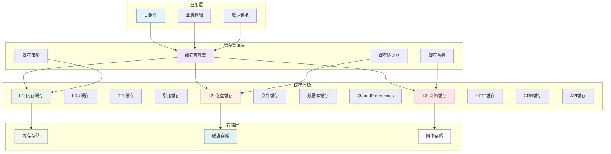
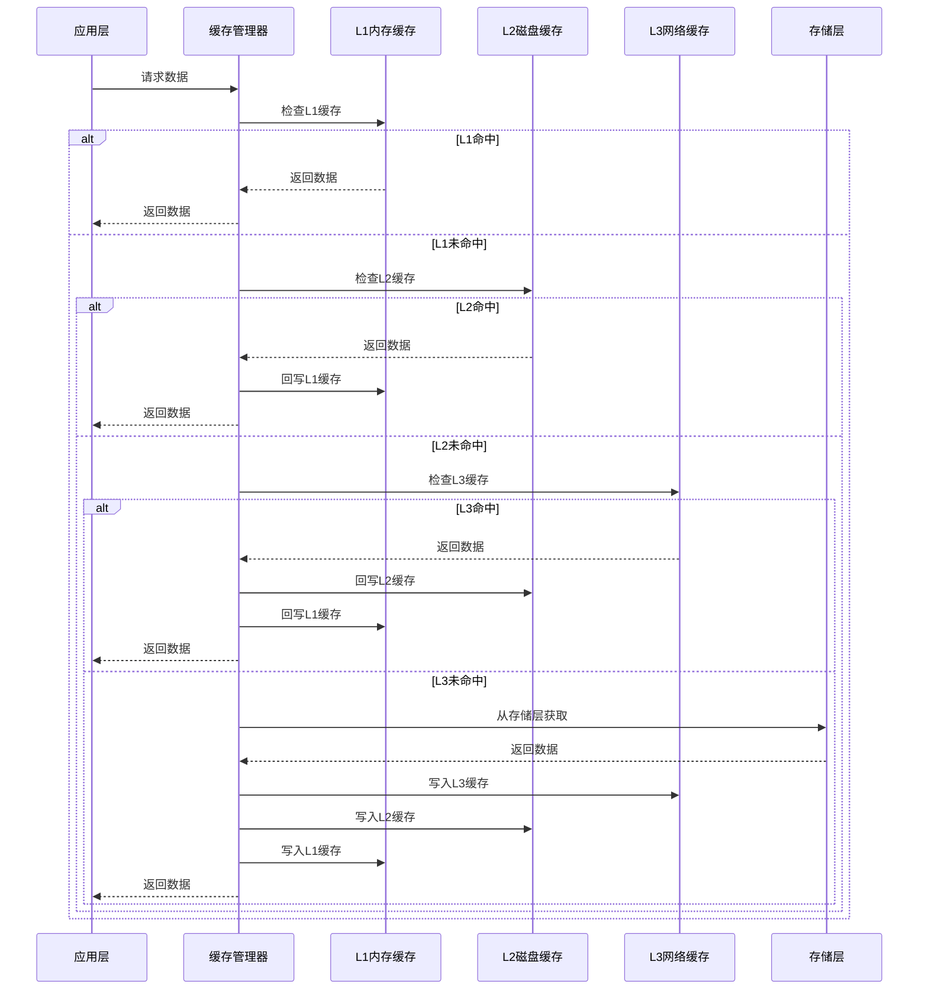
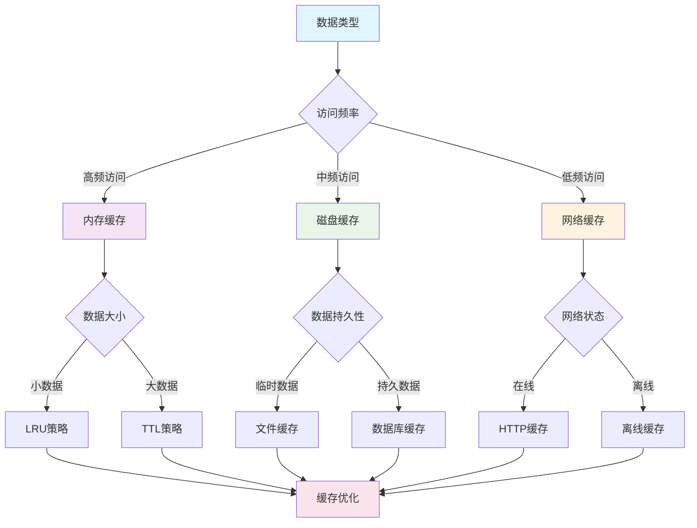
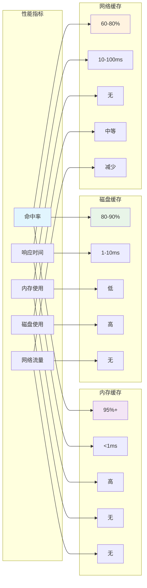

# Flutter 缓存策略详解

## 📖 概述

缓存是提升应用性能的关键技术，本文档详细介绍 Flutter 应用中的各种缓存策略，包括内存缓存、磁盘缓存、网络缓存、图片缓存等核心技术。

## 🎯 学习目标

- 掌握多层缓存架构设计
- 理解缓存策略和淘汰算法
- 实现高效的图片和数据缓存
- 学习缓存同步和一致性保证
- 掌握缓存性能监控和优化

## 📚 目录

1. [缓存架构设计](#1-缓存架构设计)
2. [内存缓存实现](#2-内存缓存实现)
3. [磁盘缓存策略](#3-磁盘缓存策略)
4. [网络缓存管理](#4-网络缓存管理)
5. [图片缓存优化](#5-图片缓存优化)
6. [缓存同步策略](#6-缓存同步策略)
7. [性能监控](#7-性能监控)
8. [最佳实践](#8-最佳实践)

## 🏗️ 缓存架构

### 多层缓存架构



### 缓存数据流



### 缓存策略选择



### 缓存性能指标



## 1. 缓存架构设计

### 1.1 多层缓存架构

```dart
// 缓存层级定义
enum CacheLevel {
  memory,    // L1: 内存缓存
  disk,      // L2: 磁盘缓存
  network,   // L3: 网络缓存
}

// 缓存策略接口
abstract class CacheStrategy<T> {
  Future<T?> get(String key);
  Future<void> put(String key, T value, {Duration? ttl});
  Future<void> remove(String key);
  Future<void> clear();
  Future<bool> contains(String key);
  Future<int> size();
}

// 多层缓存管理器
class MultiLevelCacheManager<T> implements CacheStrategy<T> {
  final CacheStrategy<T> _memoryCache;
  final CacheStrategy<T> _diskCache;
  final CacheStrategy<T>? _networkCache;

  MultiLevelCacheManager({
    required CacheStrategy<T> memoryCache,
    required CacheStrategy<T> diskCache,
    CacheStrategy<T>? networkCache,
  }) : _memoryCache = memoryCache,
       _diskCache = diskCache,
       _networkCache = networkCache;

  @override
  Future<T?> get(String key) async {
    // L1: 检查内存缓存
    T? value = await _memoryCache.get(key);
    if (value != null) {
      return value;
    }

    // L2: 检查磁盘缓存
    value = await _diskCache.get(key);
    if (value != null) {
      // 回写到内存缓存
      await _memoryCache.put(key, value);
      return value;
    }

    // L3: 检查网络缓存
    if (_networkCache != null) {
      value = await _networkCache!.get(key);
      if (value != null) {
        // 回写到上层缓存
        await _diskCache.put(key, value);
        await _memoryCache.put(key, value);
        return value;
      }
    }

    return null;
  }

  @override
  Future<void> put(String key, T value, {Duration? ttl}) async {
    // 写入所有层级
    await _memoryCache.put(key, value, ttl: ttl);
    await _diskCache.put(key, value, ttl: ttl);

    if (_networkCache != null) {
      await _networkCache!.put(key, value, ttl: ttl);
    }
  }

  @override
  Future<void> remove(String key) async {
    await _memoryCache.remove(key);
    await _diskCache.remove(key);

    if (_networkCache != null) {
      await _networkCache!.remove(key);
    }
  }

  @override
  Future<void> clear() async {
    await _memoryCache.clear();
    await _diskCache.clear();

    if (_networkCache != null) {
      await _networkCache!.clear();
    }
  }

  @override
  Future<bool> contains(String key) async {
    return await _memoryCache.contains(key) ||
           await _diskCache.contains(key) ||
           (_networkCache != null && await _networkCache!.contains(key));
  }

  @override
  Future<int> size() async {
    final memorySize = await _memoryCache.size();
    final diskSize = await _diskCache.size();
    final networkSize = _networkCache != null
        ? await _networkCache!.size()
        : 0;

    return memorySize + diskSize + networkSize;
  }
}
```

### 1.2 缓存配置管理

```dart
// 缓存配置
class CacheConfig {
  final int maxMemorySize;
  final int maxDiskSize;
  final Duration defaultTtl;
  final Duration cleanupInterval;
  final double evictionThreshold;
  final CacheEvictionPolicy evictionPolicy;

  const CacheConfig({
    this.maxMemorySize = 50 * 1024 * 1024, // 50MB
    this.maxDiskSize = 200 * 1024 * 1024,  // 200MB
    this.defaultTtl = const Duration(hours: 24),
    this.cleanupInterval = const Duration(minutes: 30),
    this.evictionThreshold = 0.8,
    this.evictionPolicy = CacheEvictionPolicy.lru,
  });
}

// 缓存淘汰策略
enum CacheEvictionPolicy {
  lru,    // Least Recently Used
  lfu,    // Least Frequently Used
  fifo,   // First In First Out
  ttl,    // Time To Live
}

// 缓存管理器工厂
class CacheManagerFactory {
  static CacheStrategy<T> createMemoryCache<T>({
    CacheConfig? config,
  }) {
    return LRUMemoryCache<T>(
      maxSize: config?.maxMemorySize ?? 50 * 1024 * 1024,
      defaultTtl: config?.defaultTtl ?? const Duration(hours: 1),
    );
  }

  static CacheStrategy<T> createDiskCache<T>({
    required String directory,
    CacheConfig? config,
  }) {
    return DiskCache<T>(
      directory: directory,
      maxSize: config?.maxDiskSize ?? 200 * 1024 * 1024,
      defaultTtl: config?.defaultTtl ?? const Duration(days: 7),
    );
  }

  static MultiLevelCacheManager<T> createMultiLevelCache<T>({
    required String diskDirectory,
    CacheConfig? config,
  }) {
    return MultiLevelCacheManager<T>(
      memoryCache: createMemoryCache<T>(config: config),
      diskCache: createDiskCache<T>(
        directory: diskDirectory,
        config: config,
      ),
    );
  }
}
```

## 2. 内存缓存实现

### 2.1 LRU 内存缓存

```dart
// 缓存项
class CacheItem<T> {
  final T value;
  final DateTime createdAt;
  final Duration? ttl;
  DateTime lastAccessed;
  int accessCount;

  CacheItem({
    required this.value,
    required this.createdAt,
    this.ttl,
  }) : lastAccessed = DateTime.now(),
       accessCount = 1;

  bool get isExpired {
    if (ttl == null) return false;
    return DateTime.now().difference(createdAt) > ttl!;
  }

  void markAccessed() {
    lastAccessed = DateTime.now();
    accessCount++;
  }
}

// LRU内存缓存实现
class LRUMemoryCache<T> implements CacheStrategy<T> {
  final int _maxSize;
  final Duration _defaultTtl;
  final Map<String, CacheItem<T>> _cache = {};
  final LinkedHashMap<String, bool> _accessOrder = LinkedHashMap();

  LRUMemoryCache({
    required int maxSize,
    required Duration defaultTtl,
  }) : _maxSize = maxSize,
       _defaultTtl = defaultTtl;

  @override
  Future<T?> get(String key) async {
    final item = _cache[key];
    if (item == null) return null;

    if (item.isExpired) {
      await remove(key);
      return null;
    }

    // 更新访问顺序
    item.markAccessed();
    _accessOrder.remove(key);
    _accessOrder[key] = true;

    return item.value;
  }

  @override
  Future<void> put(String key, T value, {Duration? ttl}) async {
    // 检查是否需要淘汰
    if (_cache.length >= _maxSize) {
      await _evictLeastRecentlyUsed();
    }

    final item = CacheItem<T>(
      value: value,
      createdAt: DateTime.now(),
      ttl: ttl ?? _defaultTtl,
    );

    _cache[key] = item;
    _accessOrder[key] = true;
  }

  @override
  Future<void> remove(String key) async {
    _cache.remove(key);
    _accessOrder.remove(key);
  }

  @override
  Future<void> clear() async {
    _cache.clear();
    _accessOrder.clear();
  }

  @override
  Future<bool> contains(String key) async {
    final item = _cache[key];
    if (item == null) return false;

    if (item.isExpired) {
      await remove(key);
      return false;
    }

    return true;
  }

  @override
  Future<int> size() async {
    await _cleanupExpired();
    return _cache.length;
  }

  Future<void> _evictLeastRecentlyUsed() async {
    if (_accessOrder.isEmpty) return;

    final oldestKey = _accessOrder.keys.first;
    await remove(oldestKey);
  }

  Future<void> _cleanupExpired() async {
    final expiredKeys = <String>[];

    for (final entry in _cache.entries) {
      if (entry.value.isExpired) {
        expiredKeys.add(entry.key);
      }
    }

    for (final key in expiredKeys) {
      await remove(key);
    }
  }

  // 获取缓存统计信息
  CacheStats getStats() {
    final now = DateTime.now();
    int expiredCount = 0;
    int totalAccess = 0;

    for (final item in _cache.values) {
      if (item.isExpired) expiredCount++;
      totalAccess += item.accessCount;
    }

    return CacheStats(
      totalItems: _cache.length,
      expiredItems: expiredCount,
      totalAccess: totalAccess,
      hitRate: totalAccess > 0 ? (_cache.length / totalAccess) : 0.0,
    );
  }
}

// 缓存统计信息
class CacheStats {
  final int totalItems;
  final int expiredItems;
  final int totalAccess;
  final double hitRate;

  const CacheStats({
    required this.totalItems,
    required this.expiredItems,
    required this.totalAccess,
    required this.hitRate,
  });

  @override
  String toString() {
    return 'CacheStats(items: $totalItems, expired: $expiredItems, '
           'access: $totalAccess, hitRate: ${(hitRate * 100).toStringAsFixed(2)}%)';
  }
}
```

### 2.2 LFU 内存缓存

```dart
// LFU内存缓存实现
class LFUMemoryCache<T> implements CacheStrategy<T> {
  final int _maxSize;
  final Duration _defaultTtl;
  final Map<String, CacheItem<T>> _cache = {};
  final Map<String, int> _frequencies = {};
  final Map<int, Set<String>> _frequencyGroups = {};
  int _minFrequency = 1;

  LFUMemoryCache({
    required int maxSize,
    required Duration defaultTtl,
  }) : _maxSize = maxSize,
       _defaultTtl = defaultTtl;

  @override
  Future<T?> get(String key) async {
    final item = _cache[key];
    if (item == null) return null;

    if (item.isExpired) {
      await remove(key);
      return null;
    }

    // 更新频率
    _updateFrequency(key);
    item.markAccessed();

    return item.value;
  }

  @override
  Future<void> put(String key, T value, {Duration? ttl}) async {
    if (_cache.length >= _maxSize) {
      await _evictLeastFrequentlyUsed();
    }

    final item = CacheItem<T>(
      value: value,
      createdAt: DateTime.now(),
      ttl: ttl ?? _defaultTtl,
    );

    _cache[key] = item;
    _frequencies[key] = 1;
    _frequencyGroups.putIfAbsent(1, () => <String>{}).add(key);
    _minFrequency = 1;
  }

  @override
  Future<void> remove(String key) async {
    final frequency = _frequencies.remove(key);
    if (frequency != null) {
      _frequencyGroups[frequency]?.remove(key);
      if (_frequencyGroups[frequency]?.isEmpty == true) {
        _frequencyGroups.remove(frequency);
      }
    }
    _cache.remove(key);
  }

  @override
  Future<void> clear() async {
    _cache.clear();
    _frequencies.clear();
    _frequencyGroups.clear();
    _minFrequency = 1;
  }

  @override
  Future<bool> contains(String key) async {
    final item = _cache[key];
    if (item == null) return false;

    if (item.isExpired) {
      await remove(key);
      return false;
    }

    return true;
  }

  @override
  Future<int> size() async {
    return _cache.length;
  }

  void _updateFrequency(String key) {
    final currentFreq = _frequencies[key] ?? 0;
    final newFreq = currentFreq + 1;

    // 从当前频率组移除
    _frequencyGroups[currentFreq]?.remove(key);
    if (_frequencyGroups[currentFreq]?.isEmpty == true) {
      _frequencyGroups.remove(currentFreq);
      if (currentFreq == _minFrequency) {
        _minFrequency++;
      }
    }

    // 添加到新频率组
    _frequencies[key] = newFreq;
    _frequencyGroups.putIfAbsent(newFreq, () => <String>{}).add(key);
  }

  Future<void> _evictLeastFrequentlyUsed() async {
    if (_frequencyGroups[_minFrequency]?.isEmpty != false) {
      return;
    }

    final keyToEvict = _frequencyGroups[_minFrequency]!.first;
    await remove(keyToEvict);
  }
}
```

## 3. 磁盘缓存策略

### 3.1 基础磁盘缓存

```dart
import 'dart:io';
import 'dart:convert';
import 'package:path/path.dart' as path;
import 'package:crypto/crypto.dart';

// 磁盘缓存实现
class DiskCache<T> implements CacheStrategy<T> {
  final String _directory;
  final int _maxSize;
  final Duration _defaultTtl;
  final Map<String, CacheMetadata> _metadata = {};

  DiskCache({
    required String directory,
    required int maxSize,
    required Duration defaultTtl,
  }) : _directory = directory,
       _maxSize = maxSize,
       _defaultTtl = defaultTtl;

  Future<void> init() async {
    final dir = Directory(_directory);
    if (!await dir.exists()) {
      await dir.create(recursive: true);
    }

    await _loadMetadata();
    await _cleanupExpired();
  }

  @override
  Future<T?> get(String key) async {
    final filePath = _getFilePath(key);
    final file = File(filePath);

    if (!await file.exists()) {
      _metadata.remove(key);
      return null;
    }

    final metadata = _metadata[key];
    if (metadata == null || metadata.isExpired) {
      await remove(key);
      return null;
    }

    try {
      final content = await file.readAsString();
      final data = jsonDecode(content);

      // 更新访问时间
      metadata.lastAccessed = DateTime.now();
      await _saveMetadata();

      return _deserialize(data);
    } catch (e) {
      await remove(key);
      return null;
    }
  }

  @override
  Future<void> put(String key, T value, {Duration? ttl}) async {
    await _ensureSpace();

    final filePath = _getFilePath(key);
    final file = File(filePath);

    try {
      final serialized = _serialize(value);
      final content = jsonEncode(serialized);
      await file.writeAsString(content);

      final metadata = CacheMetadata(
        key: key,
        filePath: filePath,
        size: content.length,
        createdAt: DateTime.now(),
        lastAccessed: DateTime.now(),
        ttl: ttl ?? _defaultTtl,
      );

      _metadata[key] = metadata;
      await _saveMetadata();
    } catch (e) {
      // 清理失败的文件
      if (await file.exists()) {
        await file.delete();
      }
      rethrow;
    }
  }

  @override
  Future<void> remove(String key) async {
    final metadata = _metadata.remove(key);
    if (metadata != null) {
      final file = File(metadata.filePath);
      if (await file.exists()) {
        await file.delete();
      }
    }

    await _saveMetadata();
  }

  @override
  Future<void> clear() async {
    final dir = Directory(_directory);
    if (await dir.exists()) {
      await dir.delete(recursive: true);
      await dir.create(recursive: true);
    }

    _metadata.clear();
    await _saveMetadata();
  }

  @override
  Future<bool> contains(String key) async {
    final metadata = _metadata[key];
    if (metadata == null) return false;

    if (metadata.isExpired) {
      await remove(key);
      return false;
    }

    final file = File(metadata.filePath);
    return await file.exists();
  }

  @override
  Future<int> size() async {
    await _cleanupExpired();
    return _metadata.length;
  }

  String _getFilePath(String key) {
    final hash = sha256.convert(utf8.encode(key)).toString();
    return path.join(_directory, '$hash.cache');
  }

  String _getMetadataPath() {
    return path.join(_directory, 'metadata.json');
  }

  Future<void> _loadMetadata() async {
    final metadataFile = File(_getMetadataPath());
    if (!await metadataFile.exists()) return;

    try {
      final content = await metadataFile.readAsString();
      final data = jsonDecode(content) as Map<String, dynamic>;

      for (final entry in data.entries) {
        _metadata[entry.key] = CacheMetadata.fromJson(entry.value);
      }
    } catch (e) {
      // 元数据损坏，清理缓存
      await clear();
    }
  }

  Future<void> _saveMetadata() async {
    final metadataFile = File(_getMetadataPath());
    final data = <String, dynamic>{};

    for (final entry in _metadata.entries) {
      data[entry.key] = entry.value.toJson();
    }

    await metadataFile.writeAsString(jsonEncode(data));
  }

  Future<void> _cleanupExpired() async {
    final expiredKeys = <String>[];

    for (final entry in _metadata.entries) {
      if (entry.value.isExpired) {
        expiredKeys.add(entry.key);
      }
    }

    for (final key in expiredKeys) {
      await remove(key);
    }
  }

  Future<void> _ensureSpace() async {
    final totalSize = _metadata.values
        .map((m) => m.size)
        .fold(0, (a, b) => a + b);

    if (totalSize < _maxSize) return;

    // 按最后访问时间排序，删除最旧的
    final sortedEntries = _metadata.entries.toList()
      ..sort((a, b) => a.value.lastAccessed.compareTo(b.value.lastAccessed));

    int removedSize = 0;
    final targetSize = (_maxSize * 0.8).round(); // 清理到80%

    for (final entry in sortedEntries) {
      if (totalSize - removedSize <= targetSize) break;

      removedSize += entry.value.size;
      await remove(entry.key);
    }
  }

  dynamic _serialize(T value) {
    // 基础序列化，子类可以重写
    if (value is String || value is num || value is bool) {
      return value;
    } else if (value is Map || value is List) {
      return value;
    } else {
      return value.toString();
    }
  }

  T _deserialize(dynamic data) {
    // 基础反序列化，子类可以重写
    return data as T;
  }
}

// 缓存元数据
class CacheMetadata {
  final String key;
  final String filePath;
  final int size;
  final DateTime createdAt;
  DateTime lastAccessed;
  final Duration ttl;

  CacheMetadata({
    required this.key,
    required this.filePath,
    required this.size,
    required this.createdAt,
    required this.lastAccessed,
    required this.ttl,
  });

  bool get isExpired {
    return DateTime.now().difference(createdAt) > ttl;
  }

  Map<String, dynamic> toJson() {
    return {
      'key': key,
      'filePath': filePath,
      'size': size,
      'createdAt': createdAt.toIso8601String(),
      'lastAccessed': lastAccessed.toIso8601String(),
      'ttl': ttl.inMilliseconds,
    };
  }

  factory CacheMetadata.fromJson(Map<String, dynamic> json) {
    return CacheMetadata(
      key: json['key'],
      filePath: json['filePath'],
      size: json['size'],
      createdAt: DateTime.parse(json['createdAt']),
      lastAccessed: DateTime.parse(json['lastAccessed']),
      ttl: Duration(milliseconds: json['ttl']),
    );
  }
}
```

## 4. 网络缓存管理

### 4.1 HTTP 缓存策略

```dart
import 'package:dio/dio.dart';

// HTTP缓存拦截器
class HttpCacheInterceptor extends Interceptor {
  final CacheStrategy<Response> _cache;
  final Duration _defaultCacheDuration;

  HttpCacheInterceptor({
    required CacheStrategy<Response> cache,
    Duration defaultCacheDuration = const Duration(minutes: 5),
  }) : _cache = cache,
       _defaultCacheDuration = defaultCacheDuration;

  @override
  void onRequest(
    RequestOptions options,
    RequestInterceptorHandler handler,
  ) async {
    // 检查是否启用缓存
    final cacheEnabled = options.extra['cache'] ?? true;
    if (!cacheEnabled) {
      handler.next(options);
      return;
    }

    final cacheKey = _generateCacheKey(options);
    final cachedResponse = await _cache.get(cacheKey);

    if (cachedResponse != null) {
      // 检查缓存是否仍然有效
      if (_isCacheValid(cachedResponse, options)) {
        handler.resolve(cachedResponse);
        return;
      }
    }

    // 添加缓存键到请求选项
    options.extra['cacheKey'] = cacheKey;
    handler.next(options);
  }

  @override
  void onResponse(
    Response response,
    ResponseInterceptorHandler handler,
  ) async {
    final cacheKey = response.requestOptions.extra['cacheKey'] as String?;
    if (cacheKey != null && _shouldCache(response)) {
      final cacheDuration = _getCacheDuration(response);
      await _cache.put(cacheKey, response, ttl: cacheDuration);
    }

    handler.next(response);
  }

  String _generateCacheKey(RequestOptions options) {
    final uri = options.uri.toString();
    final method = options.method;
    final headers = options.headers.toString();
    final data = options.data?.toString() ?? '';

    final combined = '$method:$uri:$headers:$data';
    return sha256.convert(utf8.encode(combined)).toString();
  }

  bool _isCacheValid(Response cachedResponse, RequestOptions options) {
    // 检查ETag
    final etag = cachedResponse.headers.value('etag');
    if (etag != null) {
      options.headers['if-none-match'] = etag;
    }

    // 检查Last-Modified
    final lastModified = cachedResponse.headers.value('last-modified');
    if (lastModified != null) {
      options.headers['if-modified-since'] = lastModified;
    }

    // 检查Cache-Control
    final cacheControl = cachedResponse.headers.value('cache-control');
    if (cacheControl != null) {
      if (cacheControl.contains('no-cache') ||
          cacheControl.contains('must-revalidate')) {
        return false;
      }

      final maxAgeMatch = RegExp(r'max-age=(\d+)').firstMatch(cacheControl);
      if (maxAgeMatch != null) {
        final maxAge = int.parse(maxAgeMatch.group(1)!);
        final responseTime = cachedResponse.extra['responseTime'] as DateTime?;
        if (responseTime != null) {
          final age = DateTime.now().difference(responseTime).inSeconds;
          return age < maxAge;
        }
      }
    }

    return true;
  }

  bool _shouldCache(Response response) {
    // 只缓存成功的响应
    if (response.statusCode != 200) return false;

    // 检查Cache-Control头
    final cacheControl = response.headers.value('cache-control');
    if (cacheControl != null) {
      if (cacheControl.contains('no-store') ||
          cacheControl.contains('private')) {
        return false;
      }
    }

    return true;
  }

  Duration _getCacheDuration(Response response) {
    final cacheControl = response.headers.value('cache-control');
    if (cacheControl != null) {
      final maxAgeMatch = RegExp(r'max-age=(\d+)').firstMatch(cacheControl);
      if (maxAgeMatch != null) {
        final maxAge = int.parse(maxAgeMatch.group(1)!);
        return Duration(seconds: maxAge);
      }
    }

    // 检查Expires头
    final expires = response.headers.value('expires');
    if (expires != null) {
      try {
        final expiresDate = HttpDate.parse(expires);
        final duration = expiresDate.difference(DateTime.now());
        if (duration.isNegative) return Duration.zero;
        return duration;
      } catch (e) {
        // 解析失败，使用默认值
      }
    }

    return _defaultCacheDuration;
  }
}
```

### 4.2 网络缓存管理器

```dart
// 网络缓存管理器
class NetworkCacheManager {
  final Dio _dio;
  final CacheStrategy<Response> _cache;

  NetworkCacheManager({
    required Dio dio,
    required CacheStrategy<Response> cache,
  }) : _dio = dio,
       _cache = cache {
    _dio.interceptors.add(HttpCacheInterceptor(cache: cache));
  }

  // 带缓存的GET请求
  Future<Response<T>> get<T>(
    String path, {
    Map<String, dynamic>? queryParameters,
    Options? options,
    CancelToken? cancelToken,
    ProgressCallback? onReceiveProgress,
    bool useCache = true,
    Duration? cacheDuration,
  }) async {
    final requestOptions = Options(
      method: 'GET',
      extra: {
        'cache': useCache,
        if (cacheDuration != null) 'cacheDuration': cacheDuration,
      },
    ).compose(_dio.options, path);

    return await _dio.fetch<T>(requestOptions);
  }

  // 强制刷新缓存
  Future<Response<T>> getAndRefresh<T>(
    String path, {
    Map<String, dynamic>? queryParameters,
    Options? options,
    CancelToken? cancelToken,
    ProgressCallback? onReceiveProgress,
  }) async {
    // 先删除缓存
    final cacheKey = _generateCacheKey(path, queryParameters);
    await _cache.remove(cacheKey);

    // 重新请求
    return await get<T>(
      path,
      queryParameters: queryParameters,
      options: options,
      cancelToken: cancelToken,
      onReceiveProgress: onReceiveProgress,
      useCache: true,
    );
  }

  // 预加载数据
  Future<void> preload(List<String> urls) async {
    final futures = urls.map((url) => get(url));
    await Future.wait(futures, eagerError: false);
  }

  // 清理过期缓存
  Future<void> cleanupExpiredCache() async {
    // 这里需要根据具体的缓存实现来清理
    if (_cache is LRUMemoryCache) {
      // 内存缓存会自动清理过期项
    } else if (_cache is DiskCache) {
      // 磁盘缓存需要手动清理
      await (_cache as DiskCache).clear();
    }
  }

  String _generateCacheKey(String path, Map<String, dynamic>? params) {
    final uri = Uri(path: path, queryParameters: params);
    return sha256.convert(utf8.encode(uri.toString())).toString();
  }
}
```

## 5. 图片缓存优化

### 5.1 图片缓存管理器

```dart
import 'dart:typed_data';
import 'dart:ui' as ui;
import 'package:flutter/material.dart';

// 图片缓存管理器
class ImageCacheManager {
  static final ImageCacheManager _instance = ImageCacheManager._internal();
  factory ImageCacheManager() => _instance;
  ImageCacheManager._internal();

  final CacheStrategy<Uint8List> _diskCache = DiskCache<Uint8List>(
    directory: 'image_cache',
    maxSize: 500 * 1024 * 1024, // 500MB
    defaultTtl: const Duration(days: 30),
  );

  final CacheStrategy<ui.Image> _memoryCache = LRUMemoryCache<ui.Image>(
    maxSize: 100 * 1024 * 1024, // 100MB
    defaultTtl: const Duration(hours: 1),
  );

  Future<void> init() async {
    if (_diskCache is DiskCache) {
      await (_diskCache as DiskCache).init();
    }
  }

  // 获取图片
  Future<ui.Image?> getImage(String url) async {
    final cacheKey = _generateImageCacheKey(url);

    // 先检查内存缓存
    ui.Image? image = await _memoryCache.get(cacheKey);
    if (image != null) {
      return image;
    }

    // 检查磁盘缓存
    final imageData = await _diskCache.get(cacheKey);
    if (imageData != null) {
      image = await _decodeImage(imageData);
      if (image != null) {
        await _memoryCache.put(cacheKey, image);
        return image;
      }
    }

    // 从网络加载
    return await _loadImageFromNetwork(url, cacheKey);
  }

  // 预加载图片
  Future<void> preloadImage(String url) async {
    await getImage(url);
  }

  // 批量预加载
  Future<void> preloadImages(List<String> urls) async {
    final futures = urls.map((url) => preloadImage(url));
    await Future.wait(futures, eagerError: false);
  }

  // 清理缓存
  Future<void> clearCache() async {
    await _memoryCache.clear();
    await _diskCache.clear();
  }

  // 获取缓存大小
  Future<int> getCacheSize() async {
    final memorySize = await _memoryCache.size();
    final diskSize = await _diskCache.size();
    return memorySize + diskSize;
  }

  Future<ui.Image?> _loadImageFromNetwork(String url, String cacheKey) async {
    try {
      final response = await Dio().get<List<int>>(
        url,
        options: Options(responseType: ResponseType.bytes),
      );

      if (response.data != null) {
        final imageData = Uint8List.fromList(response.data!);

        // 保存到磁盘缓存
        await _diskCache.put(cacheKey, imageData);

        // 解码并保存到内存缓存
        final image = await _decodeImage(imageData);
        if (image != null) {
          await _memoryCache.put(cacheKey, image);
        }

        return image;
      }
    } catch (e) {
      debugPrint('Failed to load image from network: $e');
    }

    return null;
  }

  Future<ui.Image?> _decodeImage(Uint8List data) async {
    try {
      final codec = await ui.instantiateImageCodec(data);
      final frame = await codec.getNextFrame();
      return frame.image;
    } catch (e) {
      debugPrint('Failed to decode image: $e');
      return null;
    }
  }

  String _generateImageCacheKey(String url) {
    return sha256.convert(utf8.encode(url)).toString();
  }
}

// 缓存图片组件
class CachedNetworkImage extends StatefulWidget {
  final String imageUrl;
  final Widget? placeholder;
  final Widget? errorWidget;
  final BoxFit? fit;
  final double? width;
  final double? height;

  const CachedNetworkImage({
    Key? key,
    required this.imageUrl,
    this.placeholder,
    this.errorWidget,
    this.fit,
    this.width,
    this.height,
  }) : super(key: key);

  @override
  State<CachedNetworkImage> createState() => _CachedNetworkImageState();
}

class _CachedNetworkImageState extends State<CachedNetworkImage> {
  ui.Image? _image;
  bool _loading = true;
  bool _error = false;

  @override
  void initState() {
    super.initState();
    _loadImage();
  }

  Future<void> _loadImage() async {
    try {
      final image = await ImageCacheManager().getImage(widget.imageUrl);
      if (mounted) {
        setState(() {
          _image = image;
          _loading = false;
          _error = image == null;
        });
      }
    } catch (e) {
      if (mounted) {
        setState(() {
          _loading = false;
          _error = true;
        });
      }
    }
  }

  @override
  Widget build(BuildContext context) {
    if (_loading) {
      return widget.placeholder ??
          const Center(child: CircularProgressIndicator());
    }

    if (_error || _image == null) {
      return widget.errorWidget ??
          const Icon(Icons.error, color: Colors.red);
    }

    return RawImage(
      image: _image,
      fit: widget.fit,
      width: widget.width,
      height: widget.height,
    );
  }
}
```

## 📚 总结

### 缓存策略选择指南

| 场景             | 推荐策略     | 原因                     |
| ---------------- | ------------ | ------------------------ |
| 频繁访问的小数据 | LRU 内存缓存 | 访问速度快，适合热点数据 |
| 大文件或图片     | 磁盘缓存     | 节省内存，持久化存储     |
| API 响应数据     | 多层缓存     | 平衡性能和存储空间       |
| 用户偏好设置     | 持久化缓存   | 需要跨会话保持           |
| 临时计算结果     | LFU 内存缓存 | 基于使用频率优化         |

### 最佳实践

1. **合理设置 TTL**: 根据数据更新频率设置合适的过期时间
2. **监控缓存性能**: 定期检查命中率和内存使用情况
3. **优雅降级**: 缓存失败时要有备用方案
4. **批量操作**: 减少频繁的单个缓存操作
5. **内存管理**: 及时清理过期和不需要的缓存项

通过合理的缓存策略，可以显著提升 Flutter 应用的性能和用户体验。
