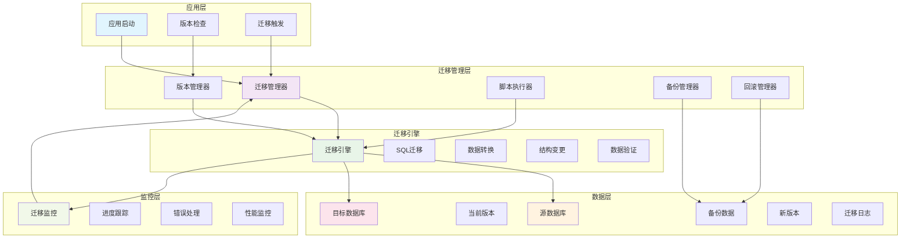
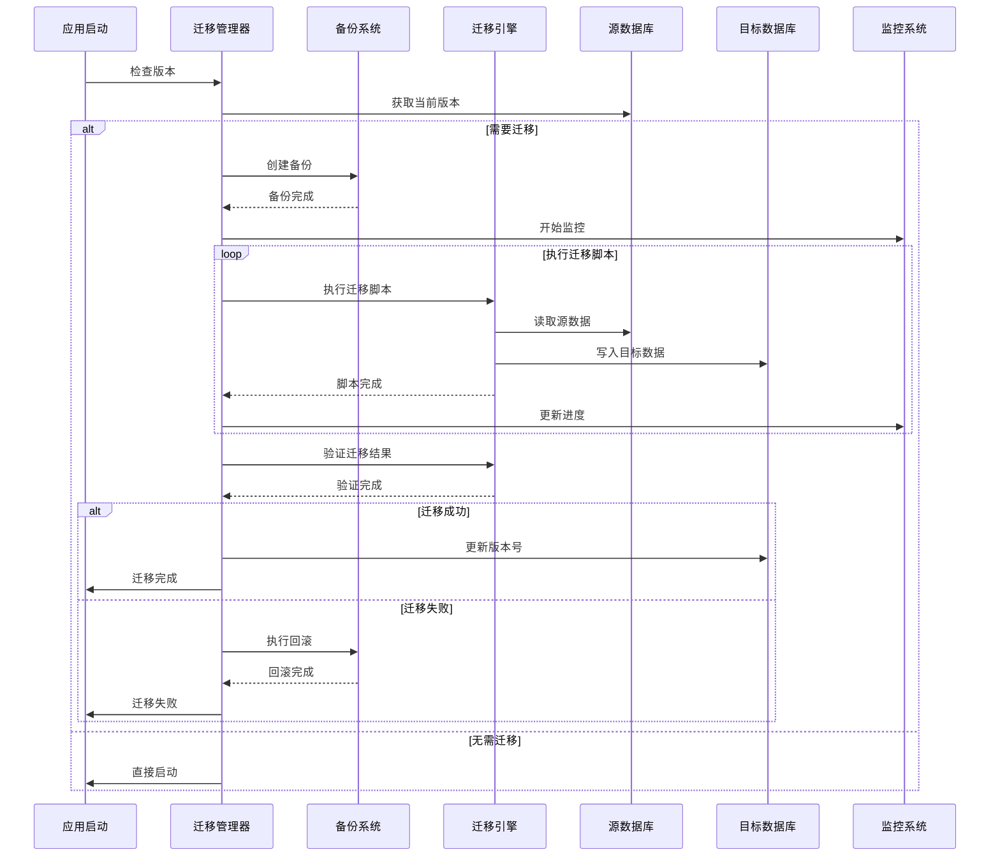
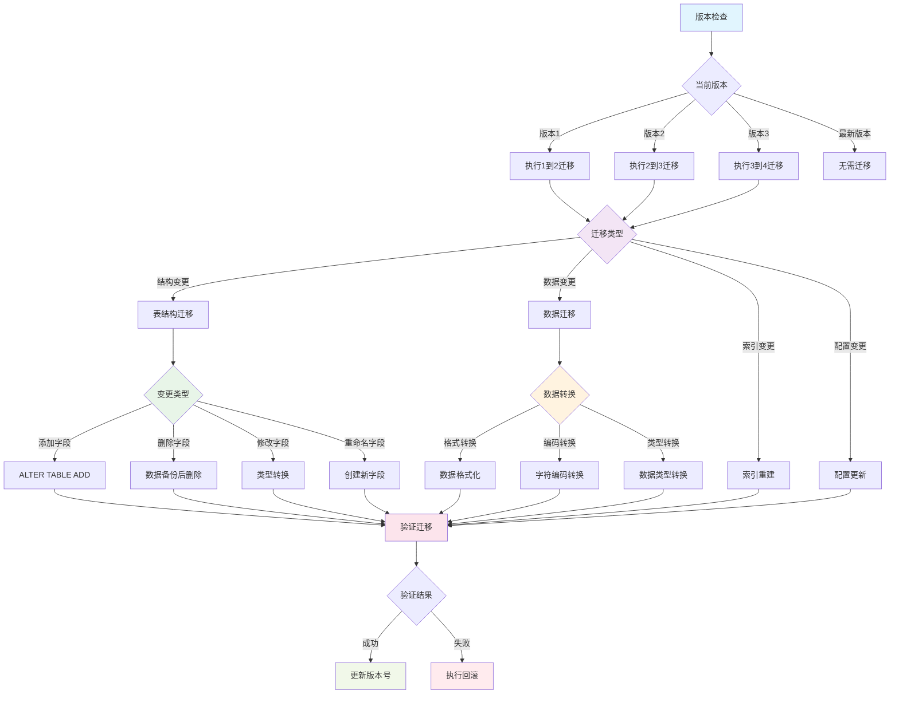

# Flutter 数据迁移策略详解

## 📖 概述

数据迁移是应用版本升级过程中的关键环节，本文档详细介绍 Flutter 应用中的数据迁移策略，包括数据库版本管理、迁移脚本设计、数据备份恢复、兼容性处理等核心技术。

## 🎯 学习目标

- 掌握数据库版本管理策略
- 理解数据迁移脚本设计原则
- 学习数据备份和恢复机制
- 实现向前和向后兼容性
- 掌握迁移过程的错误处理

## 📚 目录

1. [版本管理策略](#1-版本管理策略)
2. [迁移脚本设计](#2-迁移脚本设计)
3. [数据备份恢复](#3-数据备份恢复)
4. [兼容性处理](#4-兼容性处理)
5. [迁移监控](#5-迁移监控)
6. [性能优化](#6-性能优化)
7. [最佳实践](#7-最佳实践)

## 🏗️ 数据迁移架构

### 迁移系统架构



### 迁移流程



### 1. 版本管理策略

### 1.1 版本管理策略图



### 1.2 数据库版本管理

```dart
// 数据库版本信息
class DatabaseVersion {
  final int version;
  final String description;
  final DateTime releaseDate;
  final List<String> migrationScripts;
  final bool isBreakingChange;

  const DatabaseVersion({
    required this.version,
    required this.description,
    required this.releaseDate,
    required this.migrationScripts,
    this.isBreakingChange = false,
  });

  Map<String, dynamic> toJson() {
    return {
      'version': version,
      'description': description,
      'releaseDate': releaseDate.toIso8601String(),
      'migrationScripts': migrationScripts,
      'isBreakingChange': isBreakingChange,
    };
  }

  factory DatabaseVersion.fromJson(Map<String, dynamic> json) {
    return DatabaseVersion(
      version: json['version'],
      description: json['description'],
      releaseDate: DateTime.parse(json['releaseDate']),
      migrationScripts: List<String>.from(json['migrationScripts']),
      isBreakingChange: json['isBreakingChange'] ?? false,
    );
  }
}

// 版本管理器
class DatabaseVersionManager {
  static const String _versionKey = 'database_version';
  static const String _migrationHistoryKey = 'migration_history';

  final SharedPreferences _prefs;
  final List<DatabaseVersion> _versions;

  DatabaseVersionManager({
    required SharedPreferences prefs,
    required List<DatabaseVersion> versions,
  }) : _prefs = prefs,
       _versions = versions..sort((a, b) => a.version.compareTo(b.version));

  // 获取当前数据库版本
  int getCurrentVersion() {
    return _prefs.getInt(_versionKey) ?? 0;
  }

  // 获取目标版本
  int getTargetVersion() {
    return _versions.isNotEmpty ? _versions.last.version : 0;
  }

  // 检查是否需要迁移
  bool needsMigration() {
    return getCurrentVersion() < getTargetVersion();
  }

  // 获取迁移路径
  List<DatabaseVersion> getMigrationPath() {
    final currentVersion = getCurrentVersion();
    return _versions
        .where((v) => v.version > currentVersion)
        .toList();
  }

  // 记录迁移历史
  Future<void> recordMigration(DatabaseVersion version) async {
    final history = getMigrationHistory();
    history.add(MigrationRecord(
      version: version.version,
      description: version.description,
      timestamp: DateTime.now(),
      success: true,
    ));

    await _saveMigrationHistory(history);
    await _prefs.setInt(_versionKey, version.version);
  }

  // 获取迁移历史
  List<MigrationRecord> getMigrationHistory() {
    final historyJson = _prefs.getStringList(_migrationHistoryKey) ?? [];
    return historyJson
        .map((json) => MigrationRecord.fromJson(jsonDecode(json)))
        .toList();
  }

  Future<void> _saveMigrationHistory(List<MigrationRecord> history) async {
    final historyJson = history
        .map((record) => jsonEncode(record.toJson()))
        .toList();
    await _prefs.setStringList(_migrationHistoryKey, historyJson);
  }

  // 回滚到指定版本
  Future<void> rollbackToVersion(int targetVersion) async {
    if (targetVersion >= getCurrentVersion()) {
      throw Exception('Cannot rollback to a higher or equal version');
    }

    await _prefs.setInt(_versionKey, targetVersion);
  }
}

// 迁移记录
class MigrationRecord {
  final int version;
  final String description;
  final DateTime timestamp;
  final bool success;
  final String? errorMessage;

  const MigrationRecord({
    required this.version,
    required this.description,
    required this.timestamp,
    required this.success,
    this.errorMessage,
  });

  Map<String, dynamic> toJson() {
    return {
      'version': version,
      'description': description,
      'timestamp': timestamp.toIso8601String(),
      'success': success,
      'errorMessage': errorMessage,
    };
  }

  factory MigrationRecord.fromJson(Map<String, dynamic> json) {
    return MigrationRecord(
      version: json['version'],
      description: json['description'],
      timestamp: DateTime.parse(json['timestamp']),
      success: json['success'],
      errorMessage: json['errorMessage'],
    );
  }
}
```

### 1.2 版本兼容性检查

```dart
// 兼容性检查器
class CompatibilityChecker {
  final List<DatabaseVersion> _versions;

  CompatibilityChecker(this._versions);

  // 检查版本兼容性
  CompatibilityResult checkCompatibility(
    int fromVersion,
    int toVersion,
  ) {
    final migrationPath = _getMigrationPath(fromVersion, toVersion);

    if (migrationPath.isEmpty) {
      return CompatibilityResult.compatible();
    }

    final hasBreakingChanges = migrationPath
        .any((version) => version.isBreakingChange);

    final warnings = <String>[];
    final errors = <String>[];

    for (final version in migrationPath) {
      if (version.isBreakingChange) {
        warnings.add(
          'Version ${version.version} contains breaking changes: '
          '${version.description}',
        );
      }

      // 检查特定的兼容性问题
      final issues = _checkVersionSpecificIssues(version);
      errors.addAll(issues);
    }

    return CompatibilityResult(
      isCompatible: errors.isEmpty,
      hasBreakingChanges: hasBreakingChanges,
      warnings: warnings,
      errors: errors,
      migrationPath: migrationPath,
    );
  }

  List<DatabaseVersion> _getMigrationPath(int fromVersion, int toVersion) {
    return _versions
        .where((v) => v.version > fromVersion && v.version <= toVersion)
        .toList();
  }

  List<String> _checkVersionSpecificIssues(DatabaseVersion version) {
    final issues = <String>[];

    // 检查特定版本的已知问题
    switch (version.version) {
      case 2:
        // 检查是否有足够的存储空间
        if (!_hasEnoughStorage()) {
          issues.add('Insufficient storage space for migration to version 2');
        }
        break;
      case 5:
        // 检查是否支持新的数据格式
        if (!_supportsNewDataFormat()) {
          issues.add('Device does not support new data format in version 5');
        }
        break;
    }

    return issues;
  }

  bool _hasEnoughStorage() {
    // 实现存储空间检查逻辑
    return true;
  }

  bool _supportsNewDataFormat() {
    // 实现数据格式支持检查逻辑
    return true;
  }
}

// 兼容性检查结果
class CompatibilityResult {
  final bool isCompatible;
  final bool hasBreakingChanges;
  final List<String> warnings;
  final List<String> errors;
  final List<DatabaseVersion> migrationPath;

  const CompatibilityResult({
    required this.isCompatible,
    required this.hasBreakingChanges,
    required this.warnings,
    required this.errors,
    required this.migrationPath,
  });

  factory CompatibilityResult.compatible() {
    return const CompatibilityResult(
      isCompatible: true,
      hasBreakingChanges: false,
      warnings: [],
      errors: [],
      migrationPath: [],
    );
  }
}
```

## 2. 迁移脚本设计

### 2.1 迁移脚本接口

```dart
// 迁移脚本接口
abstract class MigrationScript {
  int get version;
  String get description;

  Future<void> upgrade(Database db);
  Future<void> downgrade(Database db);
  Future<bool> validate(Database db);
}

// 基础迁移脚本
abstract class BaseMigrationScript implements MigrationScript {
  @override
  final int version;

  @override
  final String description;

  const BaseMigrationScript({
    required this.version,
    required this.description,
  });

  @override
  Future<bool> validate(Database db) async {
    try {
      // 基础验证逻辑
      await _validateTableStructure(db);
      await _validateDataIntegrity(db);
      return true;
    } catch (e) {
      debugPrint('Migration validation failed: $e');
      return false;
    }
  }

  Future<void> _validateTableStructure(Database db) async {
    // 验证表结构
  }

  Future<void> _validateDataIntegrity(Database db) async {
    // 验证数据完整性
  }

  // 辅助方法
  Future<bool> tableExists(Database db, String tableName) async {
    final result = await db.rawQuery(
      "SELECT name FROM sqlite_master WHERE type='table' AND name=?",
      [tableName],
    );
    return result.isNotEmpty;
  }

  Future<bool> columnExists(
    Database db,
    String tableName,
    String columnName,
  ) async {
    final result = await db.rawQuery('PRAGMA table_info($tableName)');
    return result.any((row) => row['name'] == columnName);
  }

  Future<void> addColumnIfNotExists(
    Database db,
    String tableName,
    String columnName,
    String columnDefinition,
  ) async {
    if (!await columnExists(db, tableName, columnName)) {
      await db.execute(
        'ALTER TABLE $tableName ADD COLUMN $columnName $columnDefinition',
      );
    }
  }

  Future<void> createIndexIfNotExists(
    Database db,
    String indexName,
    String tableName,
    List<String> columns,
  ) async {
    final result = await db.rawQuery(
      "SELECT name FROM sqlite_master WHERE type='index' AND name=?",
      [indexName],
    );

    if (result.isEmpty) {
      final columnList = columns.join(', ');
      await db.execute(
        'CREATE INDEX $indexName ON $tableName ($columnList)',
      );
    }
  }
}
```

### 2.2 具体迁移脚本示例

```dart
// 版本1到版本2的迁移脚本
class Migration_1_to_2 extends BaseMigrationScript {
  const Migration_1_to_2() : super(
    version: 2,
    description: 'Add user profile table and update user table',
  );

  @override
  Future<void> upgrade(Database db) async {
    await db.transaction((txn) async {
      // 创建用户配置表
      await txn.execute('''
        CREATE TABLE user_profiles (
          id INTEGER PRIMARY KEY AUTOINCREMENT,
          user_id INTEGER NOT NULL,
          avatar_url TEXT,
          bio TEXT,
          preferences TEXT,
          created_at INTEGER NOT NULL,
          updated_at INTEGER NOT NULL,
          FOREIGN KEY (user_id) REFERENCES users (id) ON DELETE CASCADE
        )
      ''');

      // 为用户表添加新列
      await addColumnIfNotExists(
        txn,
        'users',
        'last_login_at',
        'INTEGER',
      );

      await addColumnIfNotExists(
        txn,
        'users',
        'is_verified',
        'INTEGER DEFAULT 0',
      );

      // 创建索引
      await createIndexIfNotExists(
        txn,
        'idx_user_profiles_user_id',
        'user_profiles',
        ['user_id'],
      );

      await createIndexIfNotExists(
        txn,
        'idx_users_last_login',
        'users',
        ['last_login_at'],
      );

      // 迁移现有数据
      await _migrateExistingData(txn);
    });
  }

  @override
  Future<void> downgrade(Database db) async {
    await db.transaction((txn) async {
      // 删除用户配置表
      await txn.execute('DROP TABLE IF EXISTS user_profiles');

      // 删除索引
      await txn.execute('DROP INDEX IF EXISTS idx_user_profiles_user_id');
      await txn.execute('DROP INDEX IF EXISTS idx_users_last_login');

      // 注意：SQLite不支持删除列，所以我们保留新添加的列
      // 在实际应用中，可能需要重建表来完全回滚
    });
  }

  Future<void> _migrateExistingData(DatabaseExecutor db) async {
    // 为现有用户创建默认配置
    final users = await db.query('users');

    for (final user in users) {
      await db.insert('user_profiles', {
        'user_id': user['id'],
        'preferences': '{}', // 默认空配置
        'created_at': DateTime.now().millisecondsSinceEpoch,
        'updated_at': DateTime.now().millisecondsSinceEpoch,
      });
    }
  }

  @override
  Future<bool> validate(Database db) async {
    if (!await super.validate(db)) {
      return false;
    }

    // 验证新表是否存在
    if (!await tableExists(db, 'user_profiles')) {
      return false;
    }

    // 验证新列是否存在
    if (!await columnExists(db, 'users', 'last_login_at')) {
      return false;
    }

    if (!await columnExists(db, 'users', 'is_verified')) {
      return false;
    }

    // 验证数据完整性
    final userCount = Sqflite.firstIntValue(
      await db.rawQuery('SELECT COUNT(*) FROM users'),
    ) ?? 0;

    final profileCount = Sqflite.firstIntValue(
      await db.rawQuery('SELECT COUNT(*) FROM user_profiles'),
    ) ?? 0;

    // 每个用户都应该有一个配置
    return userCount == profileCount;
  }
}

// 版本2到版本3的迁移脚本（数据格式变更）
class Migration_2_to_3 extends BaseMigrationScript {
  const Migration_2_to_3() : super(
    version: 3,
    description: 'Convert preferences from JSON string to normalized tables',
  );

  @override
  Future<void> upgrade(Database db) async {
    await db.transaction((txn) async {
      // 创建新的偏好设置表
      await txn.execute('''
        CREATE TABLE user_preferences (
          id INTEGER PRIMARY KEY AUTOINCREMENT,
          user_id INTEGER NOT NULL,
          preference_key TEXT NOT NULL,
          preference_value TEXT,
          created_at INTEGER NOT NULL,
          updated_at INTEGER NOT NULL,
          FOREIGN KEY (user_id) REFERENCES users (id) ON DELETE CASCADE,
          UNIQUE(user_id, preference_key)
        )
      ''');

      // 迁移现有的JSON偏好设置
      await _migratePreferences(txn);

      // 创建临时表来重建user_profiles表（移除preferences列）
      await txn.execute('''
        CREATE TABLE user_profiles_new (
          id INTEGER PRIMARY KEY AUTOINCREMENT,
          user_id INTEGER NOT NULL,
          avatar_url TEXT,
          bio TEXT,
          created_at INTEGER NOT NULL,
          updated_at INTEGER NOT NULL,
          FOREIGN KEY (user_id) REFERENCES users (id) ON DELETE CASCADE
        )
      ''');

      // 复制数据（除了preferences列）
      await txn.execute('''
        INSERT INTO user_profiles_new
        (id, user_id, avatar_url, bio, created_at, updated_at)
        SELECT id, user_id, avatar_url, bio, created_at, updated_at
        FROM user_profiles
      ''');

      // 删除旧表并重命名新表
      await txn.execute('DROP TABLE user_profiles');
      await txn.execute(
        'ALTER TABLE user_profiles_new RENAME TO user_profiles',
      );

      // 重建索引
      await createIndexIfNotExists(
        txn,
        'idx_user_profiles_user_id',
        'user_profiles',
        ['user_id'],
      );

      await createIndexIfNotExists(
        txn,
        'idx_user_preferences_user_key',
        'user_preferences',
        ['user_id', 'preference_key'],
      );
    });
  }

  @override
  Future<void> downgrade(Database db) async {
    await db.transaction((txn) async {
      // 重建带preferences列的user_profiles表
      await txn.execute('''
        CREATE TABLE user_profiles_old (
          id INTEGER PRIMARY KEY AUTOINCREMENT,
          user_id INTEGER NOT NULL,
          avatar_url TEXT,
          bio TEXT,
          preferences TEXT,
          created_at INTEGER NOT NULL,
          updated_at INTEGER NOT NULL,
          FOREIGN KEY (user_id) REFERENCES users (id) ON DELETE CASCADE
        )
      ''');

      // 复制数据并重建preferences JSON
      await _restorePreferences(txn);

      // 删除新表
      await txn.execute('DROP TABLE user_preferences');
      await txn.execute('DROP TABLE user_profiles');
      await txn.execute(
        'ALTER TABLE user_profiles_old RENAME TO user_profiles',
      );
    });
  }

  Future<void> _migratePreferences(DatabaseExecutor db) async {
    final profiles = await db.query('user_profiles');

    for (final profile in profiles) {
      final preferencesJson = profile['preferences'] as String?;
      if (preferencesJson != null && preferencesJson.isNotEmpty) {
        try {
          final preferences = jsonDecode(preferencesJson) as Map<String, dynamic>;

          for (final entry in preferences.entries) {
            await db.insert('user_preferences', {
              'user_id': profile['user_id'],
              'preference_key': entry.key,
              'preference_value': entry.value?.toString(),
              'created_at': DateTime.now().millisecondsSinceEpoch,
              'updated_at': DateTime.now().millisecondsSinceEpoch,
            });
          }
        } catch (e) {
          debugPrint('Failed to migrate preferences for user ${profile['user_id']}: $e');
        }
      }
    }
  }

  Future<void> _restorePreferences(DatabaseExecutor db) async {
    final profiles = await db.query('user_profiles');

    for (final profile in profiles) {
      final userId = profile['user_id'];

      // 获取用户的所有偏好设置
      final preferences = await db.query(
        'user_preferences',
        where: 'user_id = ?',
        whereArgs: [userId],
      );

      // 重建JSON
      final preferencesMap = <String, dynamic>{};
      for (final pref in preferences) {
        preferencesMap[pref['preference_key'] as String] =
            pref['preference_value'];
      }

      // 插入到新表
      await db.insert('user_profiles_old', {
        'id': profile['id'],
        'user_id': profile['user_id'],
        'avatar_url': profile['avatar_url'],
        'bio': profile['bio'],
        'preferences': jsonEncode(preferencesMap),
        'created_at': profile['created_at'],
        'updated_at': profile['updated_at'],
      });
    }
  }
}
```

### 2.3 迁移执行器

```dart
// 迁移执行器
class MigrationExecutor {
  final Database _database;
  final DatabaseVersionManager _versionManager;
  final List<MigrationScript> _migrations;
  final MigrationProgressCallback? _progressCallback;

  MigrationExecutor({
    required Database database,
    required DatabaseVersionManager versionManager,
    required List<MigrationScript> migrations,
    MigrationProgressCallback? progressCallback,
  }) : _database = database,
       _versionManager = versionManager,
       _migrations = migrations,
       _progressCallback = progressCallback {
    // 按版本号排序
    _migrations.sort((a, b) => a.version.compareTo(b.version));
  }

  // 执行迁移
  Future<MigrationResult> executeMigrations() async {
    if (!_versionManager.needsMigration()) {
      return MigrationResult.success(
        fromVersion: _versionManager.getCurrentVersion(),
        toVersion: _versionManager.getTargetVersion(),
        migrationsExecuted: [],
      );
    }

    final migrationPath = _versionManager.getMigrationPath();
    final migrationsToExecute = _getMigrationsForPath(migrationPath);

    final executedMigrations = <int>[];
    final errors = <String>[];

    _progressCallback?.call(MigrationProgress(
      currentStep: 0,
      totalSteps: migrationsToExecute.length,
      currentMigration: null,
      status: MigrationStatus.started,
    ));

    for (int i = 0; i < migrationsToExecute.length; i++) {
      final migration = migrationsToExecute[i];

      _progressCallback?.call(MigrationProgress(
        currentStep: i + 1,
        totalSteps: migrationsToExecute.length,
        currentMigration: migration,
        status: MigrationStatus.executing,
      ));

      try {
        await _executeSingleMigration(migration);
        executedMigrations.add(migration.version);

        // 记录成功的迁移
        await _versionManager.recordMigration(
          DatabaseVersion(
            version: migration.version,
            description: migration.description,
            releaseDate: DateTime.now(),
            migrationScripts: [],
          ),
        );
      } catch (e) {
        final errorMessage = 'Migration ${migration.version} failed: $e';
        errors.add(errorMessage);

        _progressCallback?.call(MigrationProgress(
          currentStep: i + 1,
          totalSteps: migrationsToExecute.length,
          currentMigration: migration,
          status: MigrationStatus.failed,
          error: errorMessage,
        ));

        // 迁移失败，停止执行
        break;
      }
    }

    final finalStatus = errors.isEmpty
        ? MigrationStatus.completed
        : MigrationStatus.failed;

    _progressCallback?.call(MigrationProgress(
      currentStep: migrationsToExecute.length,
      totalSteps: migrationsToExecute.length,
      currentMigration: null,
      status: finalStatus,
    ));

    if (errors.isEmpty) {
      return MigrationResult.success(
        fromVersion: _versionManager.getCurrentVersion(),
        toVersion: _versionManager.getTargetVersion(),
        migrationsExecuted: executedMigrations,
      );
    } else {
      return MigrationResult.failure(
        fromVersion: _versionManager.getCurrentVersion(),
        toVersion: _versionManager.getTargetVersion(),
        migrationsExecuted: executedMigrations,
        errors: errors,
      );
    }
  }

  Future<void> _executeSingleMigration(MigrationScript migration) async {
    // 创建备份点
    await _createBackupPoint(migration.version);

    try {
      // 执行迁移
      await migration.upgrade(_database);

      // 验证迁移结果
      final isValid = await migration.validate(_database);
      if (!isValid) {
        throw Exception('Migration validation failed');
      }
    } catch (e) {
      // 迁移失败，尝试恢复
      await _restoreFromBackup(migration.version);
      rethrow;
    }
  }

  List<MigrationScript> _getMigrationsForPath(
    List<DatabaseVersion> migrationPath,
  ) {
    final targetVersions = migrationPath.map((v) => v.version).toSet();
    return _migrations
        .where((m) => targetVersions.contains(m.version))
        .toList();
  }

  Future<void> _createBackupPoint(int version) async {
    // 实现数据库备份逻辑
    // 可以复制数据库文件或导出数据
  }

  Future<void> _restoreFromBackup(int version) async {
    // 实现数据库恢复逻辑
    // 从备份点恢复数据库
  }
}

// 迁移进度回调
typedef MigrationProgressCallback = void Function(MigrationProgress progress);

// 迁移进度
class MigrationProgress {
  final int currentStep;
  final int totalSteps;
  final MigrationScript? currentMigration;
  final MigrationStatus status;
  final String? error;

  const MigrationProgress({
    required this.currentStep,
    required this.totalSteps,
    required this.currentMigration,
    required this.status,
    this.error,
  });

  double get progress => totalSteps > 0 ? currentStep / totalSteps : 0.0;
}

// 迁移状态
enum MigrationStatus {
  started,
  executing,
  completed,
  failed,
}

// 迁移结果
class MigrationResult {
  final bool isSuccess;
  final int fromVersion;
  final int toVersion;
  final List<int> migrationsExecuted;
  final List<String> errors;

  const MigrationResult._(
    this.isSuccess,
    this.fromVersion,
    this.toVersion,
    this.migrationsExecuted,
    this.errors,
  );

  factory MigrationResult.success({
    required int fromVersion,
    required int toVersion,
    required List<int> migrationsExecuted,
  }) {
    return MigrationResult._(
      true,
      fromVersion,
      toVersion,
      migrationsExecuted,
      [],
    );
  }

  factory MigrationResult.failure({
    required int fromVersion,
    required int toVersion,
    required List<int> migrationsExecuted,
    required List<String> errors,
  }) {
    return MigrationResult._(
      false,
      fromVersion,
      toVersion,
      migrationsExecuted,
      errors,
    );
  }
}
```

## 3. 数据备份恢复

### 3.1 备份管理器

```dart
// 备份管理器
class BackupManager {
  final String _backupDirectory;
  final int _maxBackups;

  BackupManager({
    required String backupDirectory,
    int maxBackups = 5,
  }) : _backupDirectory = backupDirectory,
       _maxBackups = maxBackups;

  // 创建数据库备份
  Future<BackupInfo> createBackup(
    String databasePath, {
    String? description,
  }) async {
    final timestamp = DateTime.now();
    final backupFileName = 'backup_${timestamp.millisecondsSinceEpoch}.db';
    final backupPath = path.join(_backupDirectory, backupFileName);

    // 确保备份目录存在
    final backupDir = Directory(_backupDirectory);
    if (!await backupDir.exists()) {
      await backupDir.create(recursive: true);
    }

    // 复制数据库文件
    final sourceFile = File(databasePath);
    await sourceFile.copy(backupPath);

    // 创建备份信息
    final backupInfo = BackupInfo(
      id: timestamp.millisecondsSinceEpoch.toString(),
      filePath: backupPath,
      originalPath: databasePath,
      timestamp: timestamp,
      description: description ?? 'Auto backup',
      size: await sourceFile.length(),
    );

    // 保存备份信息
    await _saveBackupInfo(backupInfo);

    // 清理旧备份
    await _cleanupOldBackups();

    return backupInfo;
  }

  // 恢复数据库
  Future<void> restoreBackup(
    String backupId,
    String targetDatabasePath,
  ) async {
    final backupInfo = await getBackupInfo(backupId);
    if (backupInfo == null) {
      throw Exception('Backup not found: $backupId');
    }

    final backupFile = File(backupInfo.filePath);
    if (!await backupFile.exists()) {
      throw Exception('Backup file not found: ${backupInfo.filePath}');
    }

    // 创建当前数据库的备份（以防恢复失败）
    final currentBackup = await createBackup(
      targetDatabasePath,
      description: 'Pre-restore backup',
    );

    try {
      // 恢复数据库
      await backupFile.copy(targetDatabasePath);
    } catch (e) {
      // 恢复失败，回滚到之前的状态
      await restoreBackup(currentBackup.id, targetDatabasePath);
      rethrow;
    }
  }

  // 获取所有备份
  Future<List<BackupInfo>> getAllBackups() async {
    final backupInfoFile = File(path.join(_backupDirectory, 'backups.json'));

    if (!await backupInfoFile.exists()) {
      return [];
    }

    final content = await backupInfoFile.readAsString();
    final List<dynamic> backupList = jsonDecode(content);

    return backupList
        .map((json) => BackupInfo.fromJson(json))
        .toList()
      ..sort((a, b) => b.timestamp.compareTo(a.timestamp));
  }

  // 获取特定备份信息
  Future<BackupInfo?> getBackupInfo(String backupId) async {
    final allBackups = await getAllBackups();
    try {
      return allBackups.firstWhere((backup) => backup.id == backupId);
    } catch (e) {
      return null;
    }
  }

  // 删除备份
  Future<void> deleteBackup(String backupId) async {
    final backupInfo = await getBackupInfo(backupId);
    if (backupInfo == null) {
      return;
    }

    // 删除备份文件
    final backupFile = File(backupInfo.filePath);
    if (await backupFile.exists()) {
      await backupFile.delete();
    }

    // 更新备份信息
    final allBackups = await getAllBackups();
    allBackups.removeWhere((backup) => backup.id == backupId);
    await _saveAllBackupInfo(allBackups);
  }

  // 验证备份完整性
  Future<bool> validateBackup(String backupId) async {
    final backupInfo = await getBackupInfo(backupId);
    if (backupInfo == null) {
      return false;
    }

    final backupFile = File(backupInfo.filePath);
    if (!await backupFile.exists()) {
      return false;
    }

    // 检查文件大小
    final currentSize = await backupFile.length();
    if (currentSize != backupInfo.size) {
      return false;
    }

    // 尝试打开数据库文件
    try {
      final db = await openDatabase(
        backupInfo.filePath,
        readOnly: true,
      );
      await db.close();
      return true;
    } catch (e) {
      return false;
    }
  }

  Future<void> _saveBackupInfo(BackupInfo backupInfo) async {
    final allBackups = await getAllBackups();
    allBackups.add(backupInfo);
    await _saveAllBackupInfo(allBackups);
  }

  Future<void> _saveAllBackupInfo(List<BackupInfo> backups) async {
    final backupInfoFile = File(path.join(_backupDirectory, 'backups.json'));
    final backupList = backups.map((backup) => backup.toJson()).toList();
    await backupInfoFile.writeAsString(jsonEncode(backupList));
  }

  Future<void> _cleanupOldBackups() async {
    final allBackups = await getAllBackups();

    if (allBackups.length <= _maxBackups) {
      return;
    }

    // 按时间排序，保留最新的备份
    allBackups.sort((a, b) => b.timestamp.compareTo(a.timestamp));

    final backupsToDelete = allBackups.skip(_maxBackups).toList();

    for (final backup in backupsToDelete) {
      await deleteBackup(backup.id);
    }
  }
}

// 备份信息
class BackupInfo {
  final String id;
  final String filePath;
  final String originalPath;
  final DateTime timestamp;
  final String description;
  final int size;

  const BackupInfo({
    required this.id,
    required this.filePath,
    required this.originalPath,
    required this.timestamp,
    required this.description,
    required this.size,
  });

  Map<String, dynamic> toJson() {
    return {
      'id': id,
      'filePath': filePath,
      'originalPath': originalPath,
      'timestamp': timestamp.toIso8601String(),
      'description': description,
      'size': size,
    };
  }

  factory BackupInfo.fromJson(Map<String, dynamic> json) {
    return BackupInfo(
      id: json['id'],
      filePath: json['filePath'],
      originalPath: json['originalPath'],
      timestamp: DateTime.parse(json['timestamp']),
      description: json['description'],
      size: json['size'],
    );
  }
}
```

## 📚 总结

### 迁移策略对比

| 策略     | 优点               | 缺点     | 适用场景       |
| -------- | ------------------ | -------- | -------------- |
| 增量迁移 | 升级快速，支持回滚 | 实现复杂 | 频繁更新的应用 |
| 全量迁移 | 实现简单，数据一致 | 升级缓慢 | 大版本升级     |
| 在线迁移 | 不中断服务         | 技术复杂 | 企业级应用     |
| 离线迁移 | 安全可靠           | 服务中断 | 维护窗口升级   |

### 最佳实践

1. **版本管理**: 使用语义化版本号，明确标识破坏性变更
2. **备份策略**: 迁移前自动备份，支持快速回滚
3. **验证机制**: 每个迁移脚本都要有验证逻辑
4. **错误处理**: 实现完善的错误处理和恢复机制
5. **性能优化**: 大数据量迁移要考虑分批处理
6. **兼容性**: 保持向前和向后兼容性
7. **监控告警**: 监控迁移过程，及时发现问题
8. **文档记录**: 详细记录每次迁移的变更内容

通过合理的数据迁移策略，可以确保应用升级过程的安全性和可靠性，为用户提供平滑的升级体验。
