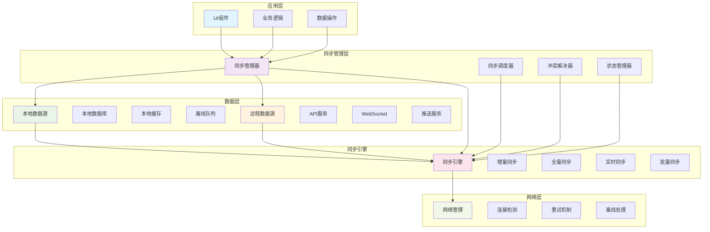
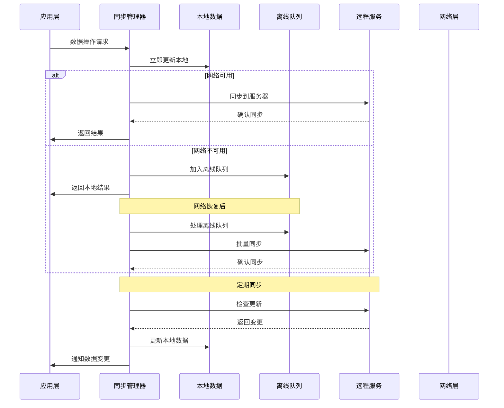
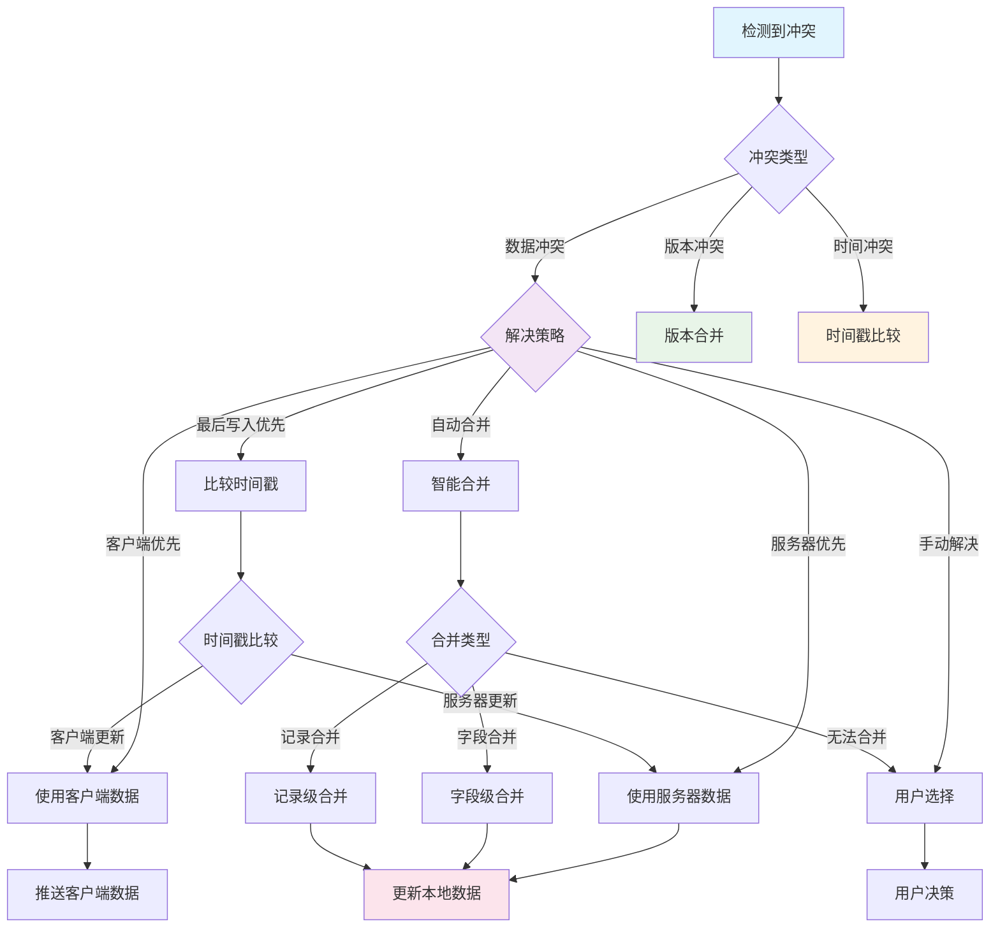
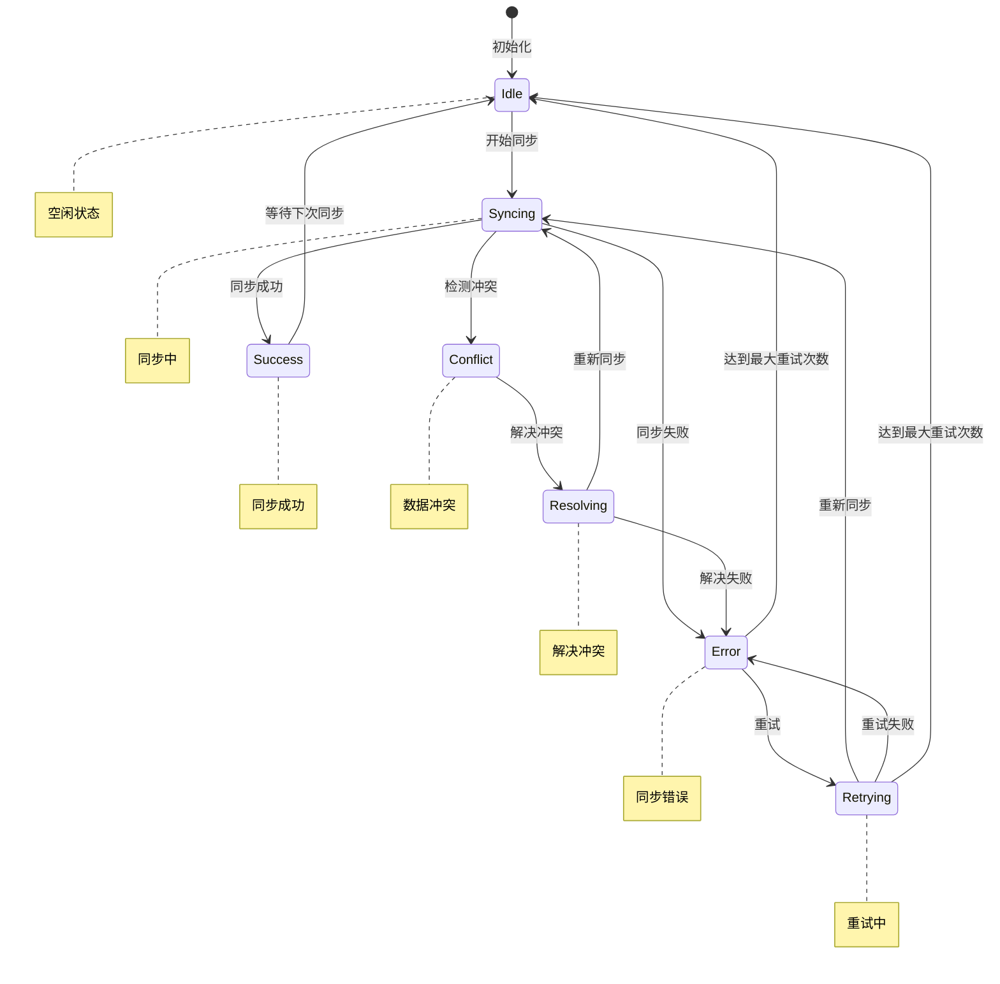

# Flutter 数据同步策略详解

## 📖 概述

数据同步是现代移动应用的核心功能，本文档详细介绍 Flutter 应用中的数据同步策略，包括离线优先、冲突解决、增量同步、实时同步等关键技术。

## 🎯 学习目标

- 掌握离线优先的数据同步架构
- 理解数据冲突检测和解决策略
- 实现增量同步和差异化更新
- 学习实时数据同步技术
- 掌握同步状态管理和错误处理

## 📚 目录

1. [同步架构设计](#1-同步架构设计)
2. [离线优先策略](#2-离线优先策略)
3. [冲突解决机制](#3-冲突解决机制)
4. [增量同步实现](#4-增量同步实现)
5. [实时同步技术](#5-实时同步技术)
6. [同步状态管理](#6-同步状态管理)
7. [性能优化](#7-性能优化)
8. [最佳实践](#8-最佳实践)

## 🏗️ 数据同步架构

### 同步系统架构



### 同步数据流



### 冲突解决策略



### 同步状态管理



## 1. 同步架构设计

### 1.1 数据同步架构

```dart
// 同步状态枚举
enum SyncStatus {
  idle,
  syncing,
  success,
  error,
  conflict,
}

// 同步方向
enum SyncDirection {
  upload,   // 本地到服务器
  download, // 服务器到本地
  bidirectional, // 双向同步
}

// 冲突解决策略
enum ConflictResolution {
  serverWins,    // 服务器优先
  clientWins,    // 客户端优先
  lastWriteWins, // 最后写入优先
  manual,        // 手动解决
  merge,         // 合并策略
}

// 同步配置
class SyncConfig {
  final Duration syncInterval;
  final int maxRetries;
  final Duration retryDelay;
  final ConflictResolution conflictResolution;
  final bool enableRealTimeSync;
  final int batchSize;

  const SyncConfig({
    this.syncInterval = const Duration(minutes: 5),
    this.maxRetries = 3,
    this.retryDelay = const Duration(seconds: 5),
    this.conflictResolution = ConflictResolution.lastWriteWins,
    this.enableRealTimeSync = false,
    this.batchSize = 100,
  });
}

// 同步结果
class SyncResult {
  final SyncStatus status;
  final int uploadedCount;
  final int downloadedCount;
  final int conflictCount;
  final List<SyncError> errors;
  final DateTime timestamp;

  const SyncResult({
    required this.status,
    this.uploadedCount = 0,
    this.downloadedCount = 0,
    this.conflictCount = 0,
    this.errors = const [],
    required this.timestamp,
  });
}

// 同步错误
class SyncError {
  final String id;
  final String message;
  final SyncErrorType type;
  final Map<String, dynamic>? data;

  const SyncError({
    required this.id,
    required this.message,
    required this.type,
    this.data,
  });
}

enum SyncErrorType {
  network,
  conflict,
  validation,
  permission,
  storage,
}
```

### 1.2 数据同步管理器

```dart
// 数据同步管理器接口
abstract class DataSyncManager<T> {
  Future<SyncResult> sync(SyncDirection direction);
  Future<void> startAutoSync();
  Future<void> stopAutoSync();
  Stream<SyncStatus> get syncStatusStream;
  Future<List<T>> getPendingChanges();
  Future<void> markAsSynced(String id);
  Future<void> resolveConflict(String id, T resolvedData);
}

// 通用数据同步管理器实现
class GenericDataSyncManager<T extends SyncableEntity>
    implements DataSyncManager<T> {
  final LocalDataSource<T> _localDataSource;
  final RemoteDataSource<T> _remoteDataSource;
  final SyncConfig _config;
  final StreamController<SyncStatus> _statusController;

  Timer? _autoSyncTimer;
  bool _isAutoSyncEnabled = false;

  GenericDataSyncManager({
    required LocalDataSource<T> localDataSource,
    required RemoteDataSource<T> remoteDataSource,
    required SyncConfig config,
  }) : _localDataSource = localDataSource,
       _remoteDataSource = remoteDataSource,
       _config = config,
       _statusController = StreamController<SyncStatus>.broadcast();

  @override
  Stream<SyncStatus> get syncStatusStream => _statusController.stream;

  @override
  Future<SyncResult> sync(SyncDirection direction) async {
    _statusController.add(SyncStatus.syncing);

    try {
      switch (direction) {
        case SyncDirection.upload:
          return await _uploadChanges();
        case SyncDirection.download:
          return await _downloadChanges();
        case SyncDirection.bidirectional:
          return await _bidirectionalSync();
      }
    } catch (e) {
      _statusController.add(SyncStatus.error);
      return SyncResult(
        status: SyncStatus.error,
        errors: [SyncError(
          id: DateTime.now().millisecondsSinceEpoch.toString(),
          message: e.toString(),
          type: SyncErrorType.network,
        )],
        timestamp: DateTime.now(),
      );
    }
  }

  @override
  Future<void> startAutoSync() async {
    if (_isAutoSyncEnabled) return;

    _isAutoSyncEnabled = true;
    _autoSyncTimer = Timer.periodic(_config.syncInterval, (timer) {
      sync(SyncDirection.bidirectional);
    });
  }

  @override
  Future<void> stopAutoSync() async {
    _isAutoSyncEnabled = false;
    _autoSyncTimer?.cancel();
    _autoSyncTimer = null;
  }

  @override
  Future<List<T>> getPendingChanges() async {
    return await _localDataSource.getPendingChanges();
  }

  @override
  Future<void> markAsSynced(String id) async {
    await _localDataSource.markAsSynced(id);
  }

  @override
  Future<void> resolveConflict(String id, T resolvedData) async {
    await _localDataSource.update(resolvedData);
    await markAsSynced(id);
  }

  Future<SyncResult> _uploadChanges() async {
    final pendingChanges = await _localDataSource.getPendingChanges();
    if (pendingChanges.isEmpty) {
      _statusController.add(SyncStatus.success);
      return SyncResult(
        status: SyncStatus.success,
        timestamp: DateTime.now(),
      );
    }

    int uploadedCount = 0;
    final errors = <SyncError>[];

    // 分批上传
    for (int i = 0; i < pendingChanges.length; i += _config.batchSize) {
      final batch = pendingChanges.skip(i).take(_config.batchSize).toList();

      try {
        final uploadedItems = await _remoteDataSource.uploadBatch(batch);

        for (final item in uploadedItems) {
          await markAsSynced(item.id);
          uploadedCount++;
        }
      } catch (e) {
        errors.add(SyncError(
          id: 'batch_$i',
          message: 'Failed to upload batch: $e',
          type: SyncErrorType.network,
        ));
      }
    }

    final status = errors.isEmpty ? SyncStatus.success : SyncStatus.error;
    _statusController.add(status);

    return SyncResult(
      status: status,
      uploadedCount: uploadedCount,
      errors: errors,
      timestamp: DateTime.now(),
    );
  }

  Future<SyncResult> _downloadChanges() async {
    try {
      final lastSyncTime = await _localDataSource.getLastSyncTime();
      final remoteChanges = await _remoteDataSource.getChangesSince(lastSyncTime);

      if (remoteChanges.isEmpty) {
        _statusController.add(SyncStatus.success);
        return SyncResult(
          status: SyncStatus.success,
          timestamp: DateTime.now(),
        );
      }

      int downloadedCount = 0;
      int conflictCount = 0;
      final errors = <SyncError>[];

      for (final remoteItem in remoteChanges) {
        try {
          final localItem = await _localDataSource.getById(remoteItem.id);

          if (localItem != null && _hasConflict(localItem, remoteItem)) {
            // 处理冲突
            final resolved = await _resolveConflict(localItem, remoteItem);
            if (resolved != null) {
              await _localDataSource.update(resolved);
              downloadedCount++;
            } else {
              conflictCount++;
            }
          } else {
            // 无冲突，直接更新
            await _localDataSource.upsert(remoteItem);
            downloadedCount++;
          }
        } catch (e) {
          errors.add(SyncError(
            id: remoteItem.id,
            message: 'Failed to process item: $e',
            type: SyncErrorType.storage,
          ));
        }
      }

      await _localDataSource.updateLastSyncTime(DateTime.now());

      final status = conflictCount > 0
          ? SyncStatus.conflict
          : (errors.isEmpty ? SyncStatus.success : SyncStatus.error);
      _statusController.add(status);

      return SyncResult(
        status: status,
        downloadedCount: downloadedCount,
        conflictCount: conflictCount,
        errors: errors,
        timestamp: DateTime.now(),
      );
    } catch (e) {
      _statusController.add(SyncStatus.error);
      return SyncResult(
        status: SyncStatus.error,
        errors: [SyncError(
          id: 'download',
          message: e.toString(),
          type: SyncErrorType.network,
        )],
        timestamp: DateTime.now(),
      );
    }
  }

  Future<SyncResult> _bidirectionalSync() async {
    // 先上传本地变更
    final uploadResult = await _uploadChanges();

    // 再下载远程变更
    final downloadResult = await _downloadChanges();

    // 合并结果
    final combinedErrors = [...uploadResult.errors, ...downloadResult.errors];
    final combinedStatus = _getCombinedStatus(uploadResult.status, downloadResult.status);

    _statusController.add(combinedStatus);

    return SyncResult(
      status: combinedStatus,
      uploadedCount: uploadResult.uploadedCount,
      downloadedCount: downloadResult.downloadedCount,
      conflictCount: downloadResult.conflictCount,
      errors: combinedErrors,
      timestamp: DateTime.now(),
    );
  }

  bool _hasConflict(T localItem, T remoteItem) {
    // 检查版本号或时间戳
    return localItem.version != remoteItem.version ||
           localItem.lastModified.isAfter(remoteItem.lastModified);
  }

  Future<T?> _resolveConflict(T localItem, T remoteItem) async {
    switch (_config.conflictResolution) {
      case ConflictResolution.serverWins:
        return remoteItem;
      case ConflictResolution.clientWins:
        return localItem;
      case ConflictResolution.lastWriteWins:
        return localItem.lastModified.isAfter(remoteItem.lastModified)
            ? localItem
            : remoteItem;
      case ConflictResolution.manual:
        // 标记为需要手动解决
        await _localDataSource.markAsConflicted(localItem.id, remoteItem);
        return null;
      case ConflictResolution.merge:
        return await _mergeItems(localItem, remoteItem);
    }
  }

  Future<T?> _mergeItems(T localItem, T remoteItem) async {
    // 子类实现具体的合并逻辑
    return remoteItem; // 默认使用远程版本
  }

  SyncStatus _getCombinedStatus(SyncStatus upload, SyncStatus download) {
    if (upload == SyncStatus.error || download == SyncStatus.error) {
      return SyncStatus.error;
    }
    if (upload == SyncStatus.conflict || download == SyncStatus.conflict) {
      return SyncStatus.conflict;
    }
    return SyncStatus.success;
  }

  void dispose() {
    stopAutoSync();
    _statusController.close();
  }
}
```

## 2. 离线优先策略

### 2.1 离线数据管理

```dart
// 可同步实体接口
abstract class SyncableEntity {
  String get id;
  int get version;
  DateTime get lastModified;
  DateTime get createdAt;
  bool get isDeleted;
  bool get isPendingSync;
  SyncOperation get pendingOperation;

  SyncableEntity copyWith({
    int? version,
    DateTime? lastModified,
    bool? isDeleted,
    bool? isPendingSync,
    SyncOperation? pendingOperation,
  });
}

// 同步操作类型
enum SyncOperation {
  none,
  create,
  update,
  delete,
}

// 离线优先数据源
class OfflineFirstDataSource<T extends SyncableEntity> {
  final LocalDataSource<T> _localDataSource;
  final RemoteDataSource<T> _remoteDataSource;
  final ConnectivityService _connectivityService;

  OfflineFirstDataSource({
    required LocalDataSource<T> localDataSource,
    required RemoteDataSource<T> remoteDataSource,
    required ConnectivityService connectivityService,
  }) : _localDataSource = localDataSource,
       _remoteDataSource = remoteDataSource,
       _connectivityService = connectivityService;

  // 获取数据（离线优先）
  Future<List<T>> getAll() async {
    // 总是从本地获取
    final localData = await _localDataSource.getAll();

    // 如果有网络连接，尝试同步
    if (await _connectivityService.isConnected()) {
      _syncInBackground();
    }

    return localData.where((item) => !item.isDeleted).toList();
  }

  Future<T?> getById(String id) async {
    final item = await _localDataSource.getById(id);
    if (item != null && !item.isDeleted) {
      return item;
    }
    return null;
  }

  // 创建数据
  Future<T> create(T item) async {
    final newItem = item.copyWith(
      version: 1,
      lastModified: DateTime.now(),
      isPendingSync: true,
      pendingOperation: SyncOperation.create,
    );

    await _localDataSource.insert(newItem);

    // 如果有网络连接，尝试立即同步
    if (await _connectivityService.isConnected()) {
      _syncItemInBackground(newItem.id);
    }

    return newItem;
  }

  // 更新数据
  Future<T> update(T item) async {
    final existingItem = await _localDataSource.getById(item.id);
    if (existingItem == null) {
      throw Exception('Item not found: ${item.id}');
    }

    final updatedItem = item.copyWith(
      version: existingItem.version + 1,
      lastModified: DateTime.now(),
      isPendingSync: true,
      pendingOperation: SyncOperation.update,
    );

    await _localDataSource.update(updatedItem);

    // 如果有网络连接，尝试立即同步
    if (await _connectivityService.isConnected()) {
      _syncItemInBackground(updatedItem.id);
    }

    return updatedItem;
  }

  // 删除数据（软删除）
  Future<void> delete(String id) async {
    final existingItem = await _localDataSource.getById(id);
    if (existingItem == null) {
      throw Exception('Item not found: $id');
    }

    final deletedItem = existingItem.copyWith(
      version: existingItem.version + 1,
      lastModified: DateTime.now(),
      isDeleted: true,
      isPendingSync: true,
      pendingOperation: SyncOperation.delete,
    );

    await _localDataSource.update(deletedItem);

    // 如果有网络连接，尝试立即同步
    if (await _connectivityService.isConnected()) {
      _syncItemInBackground(id);
    }
  }

  // 后台同步
  void _syncInBackground() {
    // 使用Isolate或者简单的异步操作
    Future.microtask(() async {
      try {
        final pendingItems = await _localDataSource.getPendingChanges();
        for (final item in pendingItems) {
          await _syncItem(item);
        }
      } catch (e) {
        debugPrint('Background sync failed: $e');
      }
    });
  }

  void _syncItemInBackground(String id) {
    Future.microtask(() async {
      try {
        final item = await _localDataSource.getById(id);
        if (item != null && item.isPendingSync) {
          await _syncItem(item);
        }
      } catch (e) {
        debugPrint('Item sync failed: $e');
      }
    });
  }

  Future<void> _syncItem(T item) async {
    try {
      switch (item.pendingOperation) {
        case SyncOperation.create:
          await _remoteDataSource.create(item);
          break;
        case SyncOperation.update:
          await _remoteDataSource.update(item);
          break;
        case SyncOperation.delete:
          await _remoteDataSource.delete(item.id);
          break;
        case SyncOperation.none:
          return;
      }

      // 标记为已同步
      final syncedItem = item.copyWith(
        isPendingSync: false,
        pendingOperation: SyncOperation.none,
      );
      await _localDataSource.update(syncedItem);
    } catch (e) {
      debugPrint('Failed to sync item ${item.id}: $e');
      // 可以实现重试逻辑
    }
  }
}
```

### 2.2 网络连接监听

```dart
import 'package:connectivity_plus/connectivity_plus.dart';

// 网络连接服务
class ConnectivityService {
  static final ConnectivityService _instance = ConnectivityService._internal();
  factory ConnectivityService() => _instance;
  ConnectivityService._internal();

  final Connectivity _connectivity = Connectivity();
  final StreamController<bool> _connectionController =
      StreamController<bool>.broadcast();

  bool _isConnected = false;
  StreamSubscription<ConnectivityResult>? _subscription;

  Stream<bool> get connectionStream => _connectionController.stream;
  bool get isConnected => _isConnected;

  Future<void> init() async {
    // 检查初始连接状态
    final result = await _connectivity.checkConnectivity();
    _updateConnectionStatus(result);

    // 监听连接变化
    _subscription = _connectivity.onConnectivityChanged.listen(
      _updateConnectionStatus,
    );
  }

  void _updateConnectionStatus(ConnectivityResult result) {
    final wasConnected = _isConnected;
    _isConnected = result != ConnectivityResult.none;

    if (_isConnected != wasConnected) {
      _connectionController.add(_isConnected);

      if (_isConnected) {
        _onConnectionRestored();
      }
    }
  }

  void _onConnectionRestored() {
    // 连接恢复时触发同步
    debugPrint('Connection restored, triggering sync...');
    // 这里可以通知数据同步管理器开始同步
  }

  Future<bool> isConnected() async {
    final result = await _connectivity.checkConnectivity();
    return result != ConnectivityResult.none;
  }

  void dispose() {
    _subscription?.cancel();
    _connectionController.close();
  }
}
```

## 3. 冲突解决机制

### 3.1 三路合并算法

```dart
// 三路合并器
class ThreeWayMerger<T extends SyncableEntity> {
  // 执行三路合并
  Future<MergeResult<T>> merge({
    required T base,      // 共同祖先版本
    required T local,     // 本地版本
    required T remote,    // 远程版本
  }) async {
    final conflicts = <FieldConflict>[];
    final mergedData = <String, dynamic>{};

    // 获取所有字段
    final baseData = _entityToMap(base);
    final localData = _entityToMap(local);
    final remoteData = _entityToMap(remote);

    final allFields = <String>{
      ...baseData.keys,
      ...localData.keys,
      ...remoteData.keys,
    };

    for (final field in allFields) {
      final baseValue = baseData[field];
      final localValue = localData[field];
      final remoteValue = remoteData[field];

      final mergeResult = _mergeField(
        field: field,
        baseValue: baseValue,
        localValue: localValue,
        remoteValue: remoteValue,
      );

      if (mergeResult.hasConflict) {
        conflicts.add(FieldConflict(
          field: field,
          baseValue: baseValue,
          localValue: localValue,
          remoteValue: remoteValue,
        ));
      } else {
        mergedData[field] = mergeResult.value;
      }
    }

    if (conflicts.isEmpty) {
      final mergedEntity = _mapToEntity(mergedData);
      return MergeResult.success(mergedEntity);
    } else {
      return MergeResult.conflict(conflicts);
    }
  }

  FieldMergeResult _mergeField({
    required String field,
    required dynamic baseValue,
    required dynamic localValue,
    required dynamic remoteValue,
  }) {
    // 如果本地和远程都没有改变
    if (_valuesEqual(localValue, baseValue) &&
        _valuesEqual(remoteValue, baseValue)) {
      return FieldMergeResult.success(baseValue);
    }

    // 如果只有本地改变
    if (!_valuesEqual(localValue, baseValue) &&
        _valuesEqual(remoteValue, baseValue)) {
      return FieldMergeResult.success(localValue);
    }

    // 如果只有远程改变
    if (_valuesEqual(localValue, baseValue) &&
        !_valuesEqual(remoteValue, baseValue)) {
      return FieldMergeResult.success(remoteValue);
    }

    // 如果本地和远程都改变了
    if (!_valuesEqual(localValue, baseValue) &&
        !_valuesEqual(remoteValue, baseValue)) {
      // 如果改变的值相同，没有冲突
      if (_valuesEqual(localValue, remoteValue)) {
        return FieldMergeResult.success(localValue);
      }

      // 存在冲突
      return FieldMergeResult.conflict();
    }

    return FieldMergeResult.success(baseValue);
  }

  bool _valuesEqual(dynamic a, dynamic b) {
    if (a == null && b == null) return true;
    if (a == null || b == null) return false;

    if (a is List && b is List) {
      if (a.length != b.length) return false;
      for (int i = 0; i < a.length; i++) {
        if (!_valuesEqual(a[i], b[i])) return false;
      }
      return true;
    }

    if (a is Map && b is Map) {
      if (a.keys.length != b.keys.length) return false;
      for (final key in a.keys) {
        if (!b.containsKey(key) || !_valuesEqual(a[key], b[key])) {
          return false;
        }
      }
      return true;
    }

    return a == b;
  }

  Map<String, dynamic> _entityToMap(T entity) {
    // 子类实现具体的转换逻辑
    throw UnimplementedError('Subclass must implement _entityToMap');
  }

  T _mapToEntity(Map<String, dynamic> data) {
    // 子类实现具体的转换逻辑
    throw UnimplementedError('Subclass must implement _mapToEntity');
  }
}

// 合并结果
class MergeResult<T> {
  final bool isSuccess;
  final T? mergedEntity;
  final List<FieldConflict>? conflicts;

  const MergeResult._(
    this.isSuccess,
    this.mergedEntity,
    this.conflicts,
  );

  factory MergeResult.success(T entity) {
    return MergeResult._(true, entity, null);
  }

  factory MergeResult.conflict(List<FieldConflict> conflicts) {
    return MergeResult._(false, null, conflicts);
  }
}

// 字段合并结果
class FieldMergeResult {
  final bool hasConflict;
  final dynamic value;

  const FieldMergeResult._(this.hasConflict, this.value);

  factory FieldMergeResult.success(dynamic value) {
    return FieldMergeResult._(false, value);
  }

  factory FieldMergeResult.conflict() {
    return FieldMergeResult._(true, null);
  }
}

// 字段冲突
class FieldConflict {
  final String field;
  final dynamic baseValue;
  final dynamic localValue;
  final dynamic remoteValue;

  const FieldConflict({
    required this.field,
    required this.baseValue,
    required this.localValue,
    required this.remoteValue,
  });
}
```

### 3.2 冲突解决 UI

```dart
// 冲突解决页面
class ConflictResolutionPage<T extends SyncableEntity> extends StatefulWidget {
  final T localEntity;
  final T remoteEntity;
  final List<FieldConflict> conflicts;
  final Function(T resolvedEntity) onResolved;

  const ConflictResolutionPage({
    Key? key,
    required this.localEntity,
    required this.remoteEntity,
    required this.conflicts,
    required this.onResolved,
  }) : super(key: key);

  @override
  State<ConflictResolutionPage<T>> createState() =>
      _ConflictResolutionPageState<T>();
}

class _ConflictResolutionPageState<T extends SyncableEntity>
    extends State<ConflictResolutionPage<T>> {
  final Map<String, dynamic> _resolvedValues = {};

  @override
  void initState() {
    super.initState();
    // 初始化为本地值
    for (final conflict in widget.conflicts) {
      _resolvedValues[conflict.field] = conflict.localValue;
    }
  }

  @override
  Widget build(BuildContext context) {
    return Scaffold(
      appBar: AppBar(
        title: const Text('解决冲突'),
        actions: [
          TextButton(
            onPressed: _resolveConflicts,
            child: const Text('完成'),
          ),
        ],
      ),
      body: ListView.builder(
        itemCount: widget.conflicts.length,
        itemBuilder: (context, index) {
          final conflict = widget.conflicts[index];
          return _buildConflictItem(conflict);
        },
      ),
    );
  }

  Widget _buildConflictItem(FieldConflict conflict) {
    return Card(
      margin: const EdgeInsets.all(8.0),
      child: Padding(
        padding: const EdgeInsets.all(16.0),
        child: Column(
          crossAxisAlignment: CrossAxisAlignment.start,
          children: [
            Text(
              '字段: ${conflict.field}',
              style: const TextStyle(
                fontSize: 18,
                fontWeight: FontWeight.bold,
              ),
            ),
            const SizedBox(height: 16),
            _buildValueOption(
              '本地版本',
              conflict.localValue,
              conflict.field,
              Colors.blue,
            ),
            const SizedBox(height: 8),
            _buildValueOption(
              '服务器版本',
              conflict.remoteValue,
              conflict.field,
              Colors.green,
            ),
            if (conflict.baseValue != null) ..[
              const SizedBox(height: 8),
              _buildValueOption(
                '原始版本',
                conflict.baseValue,
                conflict.field,
                Colors.grey,
              ),
            ],
          ],
        ),
      ),
    );
  }

  Widget _buildValueOption(
    String label,
    dynamic value,
    String field,
    Color color,
  ) {
    final isSelected = _resolvedValues[field] == value;

    return GestureDetector(
      onTap: () {
        setState(() {
          _resolvedValues[field] = value;
        });
      },
      child: Container(
        padding: const EdgeInsets.all(12),
        decoration: BoxDecoration(
          border: Border.all(
            color: isSelected ? color : Colors.grey.shade300,
            width: isSelected ? 2 : 1,
          ),
          borderRadius: BorderRadius.circular(8),
          color: isSelected ? color.withOpacity(0.1) : null,
        ),
        child: Row(
          children: [
            Icon(
              isSelected ? Icons.radio_button_checked : Icons.radio_button_off,
              color: color,
            ),
            const SizedBox(width: 8),
            Expanded(
              child: Column(
                crossAxisAlignment: CrossAxisAlignment.start,
                children: [
                  Text(
                    label,
                    style: TextStyle(
                      fontWeight: FontWeight.bold,
                      color: color,
                    ),
                  ),
                  const SizedBox(height: 4),
                  Text(
                    value?.toString() ?? 'null',
                    style: const TextStyle(fontSize: 14),
                  ),
                ],
              ),
            ),
          ],
        ),
      ),
    );
  }

  void _resolveConflicts() {
    // 创建解决后的实体
    final resolvedEntity = _createResolvedEntity();
    widget.onResolved(resolvedEntity);
    Navigator.of(context).pop();
  }

  T _createResolvedEntity() {
    // 子类实现具体的实体创建逻辑
    throw UnimplementedError('Subclass must implement _createResolvedEntity');
  }
}
```

## 4. 增量同步实现

### 4.1 变更跟踪

```dart
// 变更记录
class ChangeRecord {
  final String entityId;
  final String entityType;
  final ChangeType changeType;
  final DateTime timestamp;
  final Map<String, dynamic>? oldValues;
  final Map<String, dynamic>? newValues;
  final String userId;

  const ChangeRecord({
    required this.entityId,
    required this.entityType,
    required this.changeType,
    required this.timestamp,
    this.oldValues,
    this.newValues,
    required this.userId,
  });

  Map<String, dynamic> toJson() {
    return {
      'entityId': entityId,
      'entityType': entityType,
      'changeType': changeType.name,
      'timestamp': timestamp.toIso8601String(),
      'oldValues': oldValues,
      'newValues': newValues,
      'userId': userId,
    };
  }

  factory ChangeRecord.fromJson(Map<String, dynamic> json) {
    return ChangeRecord(
      entityId: json['entityId'],
      entityType: json['entityType'],
      changeType: ChangeType.values.firstWhere(
        (e) => e.name == json['changeType'],
      ),
      timestamp: DateTime.parse(json['timestamp']),
      oldValues: json['oldValues'],
      newValues: json['newValues'],
      userId: json['userId'],
    );
  }
}

enum ChangeType {
  create,
  update,
  delete,
}

// 变更跟踪器
class ChangeTracker {
  final LocalDataSource<ChangeRecord> _changeDataSource;
  final String _currentUserId;

  ChangeTracker({
    required LocalDataSource<ChangeRecord> changeDataSource,
    required String currentUserId,
  }) : _changeDataSource = changeDataSource,
       _currentUserId = currentUserId;

  // 记录创建操作
  Future<void> trackCreate(
    String entityId,
    String entityType,
    Map<String, dynamic> newValues,
  ) async {
    final change = ChangeRecord(
      entityId: entityId,
      entityType: entityType,
      changeType: ChangeType.create,
      timestamp: DateTime.now(),
      newValues: newValues,
      userId: _currentUserId,
    );

    await _changeDataSource.insert(change);
  }

  // 记录更新操作
  Future<void> trackUpdate(
    String entityId,
    String entityType,
    Map<String, dynamic> oldValues,
    Map<String, dynamic> newValues,
  ) async {
    final change = ChangeRecord(
      entityId: entityId,
      entityType: entityType,
      changeType: ChangeType.update,
      timestamp: DateTime.now(),
      oldValues: oldValues,
      newValues: newValues,
      userId: _currentUserId,
    );

    await _changeDataSource.insert(change);
  }

  // 记录删除操作
  Future<void> trackDelete(
    String entityId,
    String entityType,
    Map<String, dynamic> oldValues,
  ) async {
    final change = ChangeRecord(
      entityId: entityId,
      entityType: entityType,
      changeType: ChangeType.delete,
      timestamp: DateTime.now(),
      oldValues: oldValues,
      userId: _currentUserId,
    );

    await _changeDataSource.insert(change);
  }

  // 获取指定时间后的变更
  Future<List<ChangeRecord>> getChangesSince(DateTime since) async {
    return await _changeDataSource.getChangesSince(since);
  }

  // 清理旧的变更记录
  Future<void> cleanupOldChanges(Duration retention) async {
    final cutoffTime = DateTime.now().subtract(retention);
    await _changeDataSource.deleteOlderThan(cutoffTime);
  }
}
```

### 4.2 增量同步管理器

```dart
// 增量同步管理器
class IncrementalSyncManager<T extends SyncableEntity> {
  final LocalDataSource<T> _localDataSource;
  final RemoteDataSource<T> _remoteDataSource;
  final ChangeTracker _changeTracker;
  final String _entityType;

  IncrementalSyncManager({
    required LocalDataSource<T> localDataSource,
    required RemoteDataSource<T> remoteDataSource,
    required ChangeTracker changeTracker,
    required String entityType,
  }) : _localDataSource = localDataSource,
       _remoteDataSource = remoteDataSource,
       _changeTracker = changeTracker,
       _entityType = entityType;

  // 执行增量同步
  Future<IncrementalSyncResult> performIncrementalSync() async {
    final lastSyncTime = await _localDataSource.getLastSyncTime();
    final currentTime = DateTime.now();

    // 上传本地变更
    final uploadResult = await _uploadLocalChanges(lastSyncTime);

    // 下载远程变更
    final downloadResult = await _downloadRemoteChanges(lastSyncTime);

    // 更新最后同步时间
    await _localDataSource.updateLastSyncTime(currentTime);

    return IncrementalSyncResult(
      uploadedCount: uploadResult.count,
      downloadedCount: downloadResult.count,
      conflicts: [...uploadResult.conflicts, ...downloadResult.conflicts],
      errors: [...uploadResult.errors, ...downloadResult.errors],
    );
  }

  Future<_SyncOperationResult> _uploadLocalChanges(DateTime since) async {
    final localChanges = await _changeTracker.getChangesSince(since);
    final entityChanges = localChanges
        .where((change) => change.entityType == _entityType)
        .toList();

    int uploadedCount = 0;
    final conflicts = <String>[];
    final errors = <String>[];

    for (final change in entityChanges) {
      try {
        switch (change.changeType) {
          case ChangeType.create:
            final entity = await _localDataSource.getById(change.entityId);
            if (entity != null) {
              await _remoteDataSource.create(entity);
              uploadedCount++;
            }
            break;

          case ChangeType.update:
            final entity = await _localDataSource.getById(change.entityId);
            if (entity != null) {
              try {
                await _remoteDataSource.update(entity);
                uploadedCount++;
              } on ConflictException catch (e) {
                conflicts.add(change.entityId);
                // 处理冲突
                await _handleUpdateConflict(entity, e.remoteEntity as T);
              }
            }
            break;

          case ChangeType.delete:
            await _remoteDataSource.delete(change.entityId);
            uploadedCount++;
            break;
        }
      } catch (e) {
        errors.add('Failed to upload ${change.entityId}: $e');
      }
    }

    return _SyncOperationResult(
      count: uploadedCount,
      conflicts: conflicts,
      errors: errors,
    );
  }

  Future<_SyncOperationResult> _downloadRemoteChanges(DateTime since) async {
    try {
      final remoteChanges = await _remoteDataSource.getChangesSince(since);

      int downloadedCount = 0;
      final conflicts = <String>[];
      final errors = <String>[];

      for (final remoteEntity in remoteChanges) {
        try {
          final localEntity = await _localDataSource.getById(remoteEntity.id);

          if (localEntity == null) {
            // 新实体，直接插入
            await _localDataSource.insert(remoteEntity);
            downloadedCount++;
          } else {
            // 检查冲突
            if (_hasConflict(localEntity, remoteEntity)) {
              conflicts.add(remoteEntity.id);
              await _handleDownloadConflict(localEntity, remoteEntity);
            } else {
              // 无冲突，更新本地实体
              await _localDataSource.update(remoteEntity);
              downloadedCount++;
            }
          }
        } catch (e) {
          errors.add('Failed to process ${remoteEntity.id}: $e');
        }
      }

      return _SyncOperationResult(
        count: downloadedCount,
        conflicts: conflicts,
        errors: errors,
      );
    } catch (e) {
      return _SyncOperationResult(
        count: 0,
        conflicts: [],
        errors: ['Failed to download changes: $e'],
      );
    }
  }

  bool _hasConflict(T local, T remote) {
    // 检查版本号或最后修改时间
    return local.lastModified.isAfter(remote.lastModified) ||
           (local.version > remote.version);
  }

  Future<void> _handleUpdateConflict(T local, T remote) async {
    // 实现冲突处理逻辑
    // 可以使用三路合并或者标记为需要手动解决
  }

  Future<void> _handleDownloadConflict(T local, T remote) async {
    // 实现下载冲突处理逻辑
  }
}

// 增量同步结果
class IncrementalSyncResult {
  final int uploadedCount;
  final int downloadedCount;
  final List<String> conflicts;
  final List<String> errors;

  const IncrementalSyncResult({
    required this.uploadedCount,
    required this.downloadedCount,
    required this.conflicts,
    required this.errors,
  });

  bool get hasConflicts => conflicts.isNotEmpty;
  bool get hasErrors => errors.isNotEmpty;
  bool get isSuccess => !hasConflicts && !hasErrors;
}

// 同步操作结果
class _SyncOperationResult {
  final int count;
  final List<String> conflicts;
  final List<String> errors;

  const _SyncOperationResult({
    required this.count,
    required this.conflicts,
    required this.errors,
  });
}

// 冲突异常
class ConflictException implements Exception {
  final String message;
  final SyncableEntity remoteEntity;

  const ConflictException(this.message, this.remoteEntity);
}
```

## 📚 总结

### 数据同步策略对比

| 策略     | 优点               | 缺点         | 适用场景             |
| -------- | ------------------ | ------------ | -------------------- |
| 离线优先 | 用户体验好，响应快 | 冲突处理复杂 | 移动应用，网络不稳定 |
| 在线优先 | 数据一致性好       | 依赖网络连接 | 实时协作应用         |
| 增量同步 | 传输效率高         | 实现复杂     | 大数据量应用         |
| 全量同步 | 实现简单           | 传输效率低   | 小数据量应用         |

### 冲突解决策略

1. **服务器优先**: 简单但可能丢失本地修改
2. **客户端优先**: 保护本地修改但可能覆盖重要更新
3. **最后写入优先**: 基于时间戳，可能不够准确
4. **三路合并**: 最智能但实现复杂
5. **手动解决**: 最准确但用户体验差

### 最佳实践

1. **选择合适的同步策略**: 根据应用特点选择离线优先或在线优先
2. **实现增量同步**: 减少数据传输量，提高同步效率
3. **优雅处理冲突**: 提供直观的冲突解决界面
4. **监控同步状态**: 让用户了解同步进度和状态
5. **错误恢复机制**: 实现重试和降级策略
6. **数据完整性**: 确保同步过程中数据的一致性

通过合理的数据同步策略，可以为用户提供流畅的离线体验和可靠的数据一致性保证。
