# Flutter 数据库操作详解

本文档详细介绍 Flutter 应用中的数据库操作技术，包括 SQLite、Hive、Isar 等主流数据库解决方案。

## 📋 目录

1. [SQLite 数据库](#1-sqlite数据库)
2. [Hive NoSQL 数据库](#2-hive-nosql数据库)
3. [Isar 数据库](#3-isar数据库)
4. [ObjectBox 数据库](#4-objectbox数据库)
5. [数据库选择指南](#5-数据库选择指南)
6. [性能优化](#6-性能优化)
7. [最佳实践](#7-最佳实践)

## 🏗️ 数据库架构

### 数据库层次架构

```mermaid
graph TB
    subgraph "应用层"
        A[UI组件]
        A1[业务逻辑]
        A2[数据模型]
    end

    subgraph "数据访问层"
        B[Repository模式]
        B1[数据仓库]
        B2[数据协调器]
        B3[查询构建器]
    end

    subgraph "数据库抽象层"
        C[数据库抽象]
        C1[SQLite适配器]
        C2[Hive适配器]
        C3[Isar适配器]
        C4[ObjectBox适配器]
    end

    subgraph "数据库引擎层"
        D[数据库引擎]
        D1[SQLite<br/>关系型数据库]
        D2[Hive<br/>NoSQL数据库]
        D3[Isar<br/>高性能数据库]
        D4[ObjectBox<br/>对象数据库]
    end

    subgraph "存储层"
        E[文件存储]
        E1[SQLite文件]
        E2[Hive文件]
        E3[Isar文件]
        E4[ObjectBox文件]
    end

    A --> B
    A1 --> B
    A2 --> B
    B --> C
    B1 --> C
    B2 --> C
    B3 --> C
    C --> D
    C1 --> D1
    C2 --> D2
    C3 --> D3
    C4 --> D4
    D --> E
    D1 --> E1
    D2 --> E2
    D3 --> E3
    D4 --> E4

    style A fill:#e1f5fe
    style B fill:#f3e5f5
    style C fill:#e8f5e8
    style D fill:#fff3e0
    style E fill:#fce4ec
```



### 数据库操作流程

```mermaid
sequenceDiagram
    participant App as 应用层
    participant Repo as Repository
    participant DB as 数据库引擎
    participant Cache as 缓存层
    participant File as 文件系统

    App->>Repo: 请求数据操作
    Repo->>Cache: 检查缓存

    alt 读操作
        alt 缓存命中
            Cache-->>Repo: 返回缓存数据
            Repo-->>App: 返回数据
        else 缓存未命中
            Repo->>DB: 执行查询
            DB->>File: 读取数据文件
            File-->>DB: 返回数据
            DB-->>Repo: 返回查询结果
            Repo->>Cache: 更新缓存
            Repo-->>App: 返回数据
        end
    else 写操作
        Repo->>DB: 执行写入
        DB->>File: 写入数据文件
        File-->>DB: 确认写入
        DB-->>Repo: 确认写入
        Repo->>Cache: 更新缓存
        Repo-->>App: 确认完成
    end
```



### 数据库选择决策树

```mermaid
graph TD
    A[应用需求分析] --> B{数据复杂度}
    B -->|简单键值对| C[Hive]
    B -->|复杂关系| D{性能要求}
    B -->|对象存储| E[ObjectBox]

    D -->|高性能| F[Isar]
    D -->|标准性能| G[SQLite]

    C --> H{数据量}
    H -->|小数据量| I[内存存储]
    H -->|大数据量| J[磁盘存储]

    F --> K{查询复杂度}
    K -->|简单查询| L[基础索引]
    K -->|复杂查询| M[复合索引]

    G --> N{事务需求}
    N -->|需要事务| O[ACID支持]
    N -->|无需事务| P[批量操作]

    E --> Q{对象关系}
    Q -->|简单对象| R[直接存储]
    Q -->|复杂关系| S[关系映射]

    style A fill:#e1f5fe
    style C fill:#f3e5f5
    style D fill:#e8f5e8
    style E fill:#fff3e0
    style F fill:#fce4ec
    style G fill:#f1f8e9
```



### 1. SQLite 数据库

### 1.1 基础配置

```yaml
# pubspec.yaml
dependencies:
  sqflite: ^2.3.0
  path: ^1.8.3

dev_dependencies:
  sqflite_common_ffi: ^2.3.0 # 用于桌面平台测试
```

### 1.2 数据库管理器

```dart
import 'package:sqflite/sqflite.dart';
import 'package:path/path.dart';

class DatabaseManager {
  static Database? _database;
  static const String _databaseName = 'app_database.db';
  static const int _databaseVersion = 1;

  static Future<Database> get database async {
    if (_database != null) return _database!;

    _database = await _initDatabase();
    return _database!;
  }

  static Future<Database> _initDatabase() async {
    final databasesPath = await getDatabasesPath();
    final path = join(databasesPath, _databaseName);

    return await openDatabase(
      path,
      version: _databaseVersion,
      onCreate: _onCreate,
      onUpgrade: _onUpgrade,
      onConfigure: _onConfigure,
    );
  }

  static Future<void> _onConfigure(Database db) async {
    // 使用示例
class DatabaseSelectionExamples {
  static void demonstrateSelection() {
    // 高性能要求的应用
    final performancePriorities = {
      DatabaseFeature.performance,
      DatabaseFeature.fileSize,
    };
    DatabaseComparison.printRecommendation(performancePriorities);

    // 复杂查询需求的应用
    final queryPriorities = {
      DatabaseFeature.queryCapability,
      DatabaseFeature.relationSupport,
    };
    DatabaseComparison.printRecommendation(queryPriorities);

    // 类型安全要求高的应用
    final typeSafetyPriorities = {
      DatabaseFeature.typesSafety,
      DatabaseFeature.codeGeneration,
    };
    DatabaseComparison.printRecommendation(typeSafetyPriorities);
  }
}
```

## 6. 性能优化

### 6.1 查询优化

```dart
class QueryOptimization {
  // SQLite查询优化
  static Future<List<User>> optimizedUserSearch({
    String? namePattern,
    int? minAge,
    int? maxAge,
    int limit = 50,
    int offset = 0,
  }) async {
    final db = await DatabaseManager.database;

    // 使用参数化查询和索引
    final whereConditions = <String>[];
    final whereArgs = <dynamic>[];

    if (namePattern != null) {
      whereConditions.add('name LIKE ?');
      whereArgs.add('%$namePattern%');
    }

    if (minAge != null) {
      whereConditions.add('age >= ?');
      whereArgs.add(minAge);
    }

    if (maxAge != null) {
      whereConditions.add('age <= ?');
      whereArgs.add(maxAge);
    }

    final whereClause = whereConditions.isNotEmpty
        ? whereConditions.join(' AND ')
        : null;

    final maps = await db.query(
      'users',
      where: whereClause,
      whereArgs: whereArgs.isNotEmpty ? whereArgs : null,
      orderBy: 'created_at DESC',
      limit: limit,
      offset: offset,
    );

    return maps.map((map) => User.fromMap(map)).toList();
  }

  // Isar查询优化
  static Future<List<IsarUser>> optimizedIsarUserSearch({
    String? namePattern,
    int? minAge,
    int? maxAge,
    int limit = 50,
    int offset = 0,
  }) async {
    final isar = await IsarManager.isar;

    var query = isar.isarUsers.filter();

    if (namePattern != null) {
      query = query.nameContains(namePattern, caseSensitive: false);
    }

    if (minAge != null) {
      query = query.ageGreaterThan(minAge - 1);
    }

    if (maxAge != null) {
      query = query.ageLessThan(maxAge + 1);
    }

    return await query
        .sortByCreatedAtDesc()
        .offset(offset)
        .limit(limit)
        .findAll();
  }
}
```

### 6.2 批量操作优化

```dart
class BatchOperations {
  // SQLite批量插入
  static Future<void> batchInsertUsers(List<User> users) async {
    final db = await DatabaseManager.database;

    await db.transaction((txn) async {
      final batch = txn.batch();

      for (final user in users) {
        batch.insert('users', user.toMap()..remove('id'));
      }

      await batch.commit(noResult: true);
    });
  }

  // Hive批量操作
  static Future<void> batchInsertHiveUsers(List<HiveUser> users) async {
    final box = await HiveManager.openBox<HiveUser>('users');

    final userMap = <String, HiveUser>{};
    for (int i = 0; i < users.length; i++) {
      final key = DateTime.now().millisecondsSinceEpoch + i;
      userMap[key.toString()] = users[i];
    }

    await box.putAll(userMap);
  }

  // Isar批量操作
  static Future<void> batchInsertIsarUsers(List<IsarUser> users) async {
    final isar = await IsarManager.isar;

    await isar.writeTxn(() async {
      await isar.isarUsers.putAll(users);
    });
  }
}
```

### 6.3 内存优化

```dart
class MemoryOptimization {
  // 分页加载
  static Future<List<T>> loadDataInPages<T>(
    Future<List<T>> Function(int offset, int limit) loader,
    int pageSize,
  ) async {
    final allData = <T>[];
    int offset = 0;

    while (true) {
      final pageData = await loader(offset, pageSize);
      if (pageData.isEmpty) break;

      allData.addAll(pageData);
      offset += pageSize;

      // 避免内存过载
      if (allData.length > 10000) {
        break;
      }
    }

    return allData;
  }

  // 流式处理
  static Stream<List<T>> streamDataInBatches<T>(
    Future<List<T>> Function(int offset, int limit) loader,
    int batchSize,
  ) async* {
    int offset = 0;

    while (true) {
      final batch = await loader(offset, batchSize);
      if (batch.isEmpty) break;

      yield batch;
      offset += batchSize;
    }
  }
}
```

## 7. 最佳实践

### 7.1 数据迁移策略

```dart
class DatabaseMigration {
  static Future<void> migrateFromV1ToV2() async {
    final db = await DatabaseManager.database;

    await db.transaction((txn) async {
      // 备份现有数据
      final existingUsers = await txn.query('users');

      // 添加新列
      await txn.execute('ALTER TABLE users ADD COLUMN avatar_url TEXT');

      // 更新现有数据
      for (final user in existingUsers) {
        await txn.update(
          'users',
          {'avatar_url': 'default_avatar.png'},
          where: 'id = ?',
          whereArgs: [user['id']],
        );
      }
    });
  }

  static Future<void> migrateHiveData() async {
    // 检查是否需要迁移
    final oldBox = await Hive.openBox('old_users');
    if (oldBox.isEmpty) return;

    final newBox = await Hive.openBox<HiveUser>('users');

    // 迁移数据
    for (final key in oldBox.keys) {
      final oldData = oldBox.get(key) as Map<dynamic, dynamic>;
      final newUser = HiveUser.create(
        name: oldData['name'],
        email: oldData['email'],
        age: oldData['age'],
      );

      await newBox.put(key, newUser);
    }

    // 清理旧数据
    await oldBox.clear();
    await oldBox.close();
  }
}
```

### 7.2 错误处理和恢复

```dart
class DatabaseErrorHandling {
  static Future<T?> executeWithRetry<T>(
    Future<T> Function() operation,
    String operationName, {
    int maxRetries = 3,
    Duration delay = const Duration(milliseconds: 100),
  }) async {
    for (int attempt = 1; attempt <= maxRetries; attempt++) {
      try {
        return await operation();
      } catch (e) {
        debugPrint('Database operation "$operationName" failed (attempt $attempt): $e');

        if (attempt == maxRetries) {
          // 记录最终失败
          await _logDatabaseError(operationName, e);
          return null;
        }

        // 等待后重试
        await Future.delayed(delay * attempt);
      }
    }

    return null;
  }

  static Future<void> _logDatabaseError(String operation, dynamic error) async {
    // 记录错误到日志文件
    final logEntry = {
      'timestamp': DateTime.now().toIso8601String(),
      'operation': operation,
      'error': error.toString(),
    };

    try {
      await FileStorageManager.writeJsonFile(
        'database_errors.log',
        logEntry,
        useCache: false,
      );
    } catch (e) {
      debugPrint('Failed to log database error: $e');
    }
  }

  // 数据库健康检查
  static Future<bool> checkDatabaseHealth() async {
    try {
      // SQLite健康检查
      final db = await DatabaseManager.database;
      await db.rawQuery('SELECT 1');

      // Hive健康检查
      final hiveBox = await HiveManager.openBox<HiveUser>('users');
      hiveBox.length; // 简单访问测试

      // Isar健康检查
      final isar = await IsarManager.isar;
      await isar.isarUsers.count();

      return true;
    } catch (e) {
      debugPrint('Database health check failed: $e');
      return false;
    }
  }

  // 数据库修复
  static Future<void> repairDatabase() async {
    try {
      // 关闭所有连接
      await DatabaseManager.close();
      await HiveManager.closeAll();
      await IsarManager.close();

      // 重新初始化
      await HiveManager.init();

      debugPrint('Database repair completed');
    } catch (e) {
      debugPrint('Database repair failed: $e');
    }
  }
}
```

### 7.3 性能监控

```dart
class DatabaseMonitor {
  static final Map<String, DatabaseMetrics> _metrics = {};

  static Future<T?> monitorOperation<T>(
    String operationName,
    Future<T> Function() operation,
  ) async {
    final stopwatch = Stopwatch()..start();

    try {
      final result = await operation();
      stopwatch.stop();

      _recordMetrics(operationName, stopwatch.elapsed, true);
      return result;
    } catch (e) {
      stopwatch.stop();
      _recordMetrics(operationName, stopwatch.elapsed, false);
      rethrow;
    }
  }

  static void _recordMetrics(
    String operation,
    Duration duration,
    bool success,
  ) {
    final metrics = _metrics.putIfAbsent(
      operation,
      () => DatabaseMetrics(),
    );

    metrics.totalOperations++;
    metrics.totalDuration += duration;

    if (success) {
      metrics.successfulOperations++;
    } else {
      metrics.failedOperations++;
    }
  }

  static Map<String, DatabaseMetrics> getMetrics() {
    return Map.unmodifiable(_metrics);
  }

  static String generateReport() {
    final buffer = StringBuffer();
    buffer.writeln('Database Performance Report');
    buffer.writeln('=' * 50);

    for (final entry in _metrics.entries) {
      final operation = entry.key;
      final metrics = entry.value;

      buffer.writeln('Operation: $operation');
      buffer.writeln('  Total: ${metrics.totalOperations}');
      buffer.writeln('  Success Rate: ${metrics.successRate.toStringAsFixed(2)}%');
      buffer.writeln('  Avg Duration: ${metrics.averageDuration.inMilliseconds}ms');
      buffer.writeln();
    }

    return buffer.toString();
  }
}

class DatabaseMetrics {
  int totalOperations = 0;
  int successfulOperations = 0;
  int failedOperations = 0;
  Duration totalDuration = Duration.zero;

  double get successRate {
    if (totalOperations == 0) return 0.0;
    return (successfulOperations / totalOperations) * 100;
  }

  Duration get averageDuration {
    if (totalOperations == 0) return Duration.zero;
    return Duration(
      microseconds: totalDuration.inMicroseconds ~/ totalOperations,
    );
  }
}
```

## 📚 总结

### 数据库技术对比

| 特性     | SQLite     | Hive     | Isar       | ObjectBox  |
| -------- | ---------- | -------- | ---------- | ---------- |
| 性能     | ⭐⭐⭐     | ⭐⭐⭐⭐ | ⭐⭐⭐⭐⭐ | ⭐⭐⭐⭐⭐ |
| 查询能力 | ⭐⭐⭐⭐⭐ | ⭐⭐⭐   | ⭐⭐⭐⭐   | ⭐⭐⭐⭐   |
| 关系支持 | ⭐⭐⭐⭐⭐ | ⭐⭐     | ⭐⭐⭐⭐   | ⭐⭐⭐⭐   |
| 类型安全 | ⭐⭐⭐     | ⭐⭐⭐⭐ | ⭐⭐⭐⭐⭐ | ⭐⭐⭐⭐⭐ |
| 学习曲线 | ⭐⭐⭐     | ⭐⭐⭐⭐ | ⭐⭐⭐⭐   | ⭐⭐⭐     |

### 选择建议

- **SQLite**: 复杂查询、关系数据、标准 SQL 需求
- **Hive**: 简单快速、NoSQL、轻量级应用
- **Isar**: 高性能、现代化、类型安全
- **ObjectBox**: 极致性能、对象数据库、实时同步

### 最佳实践

1. **合理选择**: 根据应用需求选择合适的数据库
2. **性能优化**: 使用索引、批量操作、分页查询
3. **错误处理**: 实现重试机制和优雅降级
4. **数据迁移**: 制定完善的版本升级策略
5. **监控诊断**: 收集性能指标，及时发现问题 启用外键约束
   await db.execute('PRAGMA foreign_keys = ON');
   }

static Future`<void>` \_onCreate(Database db, int version) async {
// 创建用户表
await db.execute('''
CREATE TABLE users (
id INTEGER PRIMARY KEY AUTOINCREMENT,
name TEXT NOT NULL,
email TEXT UNIQUE NOT NULL,
age INTEGER,
created_at INTEGER NOT NULL,
updated_at INTEGER NOT NULL
)
''');

    // 创建文章表
    await db.execute('''
      CREATE TABLE articles (
        id INTEGER PRIMARY KEY AUTOINCREMENT,
        title TEXT NOT NULL,
        content TEXT NOT NULL,
        author_id INTEGER NOT NULL,
        category_id INTEGER,
        published BOOLEAN DEFAULT 0,
        created_at INTEGER NOT NULL,
        updated_at INTEGER NOT NULL,
        FOREIGN KEY (author_id) REFERENCES users (id) ON DELETE CASCADE
      )
    ''');

    // 创建分类表
    await db.execute('''
      CREATE TABLE categories (
        id INTEGER PRIMARY KEY AUTOINCREMENT,
        name TEXT NOT NULL UNIQUE,
        description TEXT,
        created_at INTEGER NOT NULL
      )
    ''');

    // 创建索引
    await db.execute('CREATE INDEX idx_articles_author_id ON articles (author_id)');
    await db.execute('CREATE INDEX idx_articles_category_id ON articles (category_id)');
    await db.execute('CREATE INDEX idx_articles_published ON articles (published)');

}

static Future`<void>` \_onUpgrade(Database db, int oldVersion, int newVersion) async {
// 数据库升级逻辑
if (oldVersion < 2) {
// 添加新列
await db.execute('ALTER TABLE users ADD COLUMN avatar_url TEXT');
}

    if (oldVersion < 3) {
      // 创建新表
      await db.execute('''
        CREATE TABLE tags (
          id INTEGER PRIMARY KEY AUTOINCREMENT,
          name TEXT NOT NULL UNIQUE,
          color TEXT
        )
      ''');

    // 创建关联表
      await db.execute('''
        CREATE TABLE article_tags (
          article_id INTEGER,
          tag_id INTEGER,
          PRIMARY KEY (article_id, tag_id),
          FOREIGN KEY (article_id) REFERENCES articles (id) ON DELETE CASCADE,
          FOREIGN KEY (tag_id) REFERENCES tags (id) ON DELETE CASCADE
        )
      ''');
    }

}

static Future`<void>` close() async {
final db = \_database;
if (db != null) {
await db.close();
\_database = null;
}
}
}

````

### 1.3 数据模型

```dart
class User {
  final int? id;
  final String name;
  final String email;
  final int? age;
  final String? avatarUrl;
  final DateTime createdAt;
  final DateTime updatedAt;

  const User({
    this.id,
    required this.name,
    required this.email,
    this.age,
    this.avatarUrl,
    required this.createdAt,
    required this.updatedAt,
  });

  Map<String, dynamic> toMap() {
    return {
      'id': id,
      'name': name,
      'email': email,
      'age': age,
      'avatar_url': avatarUrl,
      'created_at': createdAt.millisecondsSinceEpoch,
      'updated_at': updatedAt.millisecondsSinceEpoch,
    };
  }

  factory User.fromMap(Map<String, dynamic> map) {
    return User(
      id: map['id']?.toInt(),
      name: map['name'] ?? '',
      email: map['email'] ?? '',
      age: map['age']?.toInt(),
      avatarUrl: map['avatar_url'],
      createdAt: DateTime.fromMillisecondsSinceEpoch(map['created_at']),
      updatedAt: DateTime.fromMillisecondsSinceEpoch(map['updated_at']),
    );
  }

  User copyWith({
    int? id,
    String? name,
    String? email,
    int? age,
    String? avatarUrl,
    DateTime? createdAt,
    DateTime? updatedAt,
  }) {
    return User(
      id: id ?? this.id,
      name: name ?? this.name,
      email: email ?? this.email,
      age: age ?? this.age,
      avatarUrl: avatarUrl ?? this.avatarUrl,
      createdAt: createdAt ?? this.createdAt,
      updatedAt: updatedAt ?? this.updatedAt,
    );
  }

  @override
  String toString() {
    return 'User(id: $id, name: $name, email: $email, age: $age)';
  }

  @override
  bool operator ==(Object other) {
    if (identical(this, other)) return true;
    return other is User && other.id == id;
  }

  @override
  int get hashCode => id.hashCode;
}

class Article {
  final int? id;
  final String title;
  final String content;
  final int authorId;
  final int? categoryId;
  final bool published;
  final DateTime createdAt;
  final DateTime updatedAt;

  const Article({
    this.id,
    required this.title,
    required this.content,
    required this.authorId,
    this.categoryId,
    this.published = false,
    required this.createdAt,
    required this.updatedAt,
  });

  Map<String, dynamic> toMap() {
    return {
      'id': id,
      'title': title,
      'content': content,
      'author_id': authorId,
      'category_id': categoryId,
      'published': published ? 1 : 0,
      'created_at': createdAt.millisecondsSinceEpoch,
      'updated_at': updatedAt.millisecondsSinceEpoch,
    };
  }

  factory Article.fromMap(Map<String, dynamic> map) {
    return Article(
      id: map['id']?.toInt(),
      title: map['title'] ?? '',
      content: map['content'] ?? '',
      authorId: map['author_id']?.toInt() ?? 0,
      categoryId: map['category_id']?.toInt(),
      published: (map['published'] ?? 0) == 1,
      createdAt: DateTime.fromMillisecondsSinceEpoch(map['created_at']),
      updatedAt: DateTime.fromMillisecondsSinceEpoch(map['updated_at']),
    );
  }
}

class Category {
  final int? id;
  final String name;
  final String? description;
  final DateTime createdAt;

  const Category({
    this.id,
    required this.name,
    this.description,
    required this.createdAt,
  });

  Map<String, dynamic> toMap() {
    return {
      'id': id,
      'name': name,
      'description': description,
      'created_at': createdAt.millisecondsSinceEpoch,
    };
  }

  factory Category.fromMap(Map<String, dynamic> map) {
    return Category(
      id: map['id']?.toInt(),
      name: map['name'] ?? '',
      description: map['description'],
      createdAt: DateTime.fromMillisecondsSinceEpoch(map['created_at']),
    );
  }
}
````

### 1.4 Repository 模式实现

```dart
abstract class UserRepository {
  Future<int> insert(User user);
  Future<User?> findById(int id);
  Future<User?> findByEmail(String email);
  Future<List<User>> findAll();
  Future<List<User>> findByAge(int minAge, int maxAge);
  Future<int> update(User user);
  Future<int> delete(int id);
  Future<int> count();
}

class SQLiteUserRepository implements UserRepository {
  static const String tableName = 'users';

  @override
  Future<int> insert(User user) async {
    final db = await DatabaseManager.database;
    final now = DateTime.now();

    final userWithTimestamps = user.copyWith(
      createdAt: now,
      updatedAt: now,
    );

    return await db.insert(
      tableName,
      userWithTimestamps.toMap()..remove('id'),
      conflictAlgorithm: ConflictAlgorithm.abort,
    );
  }

  @override
  Future<User?> findById(int id) async {
    final db = await DatabaseManager.database;

    final maps = await db.query(
      tableName,
      where: 'id = ?',
      whereArgs: [id],
      limit: 1,
    );

    if (maps.isEmpty) return null;
    return User.fromMap(maps.first);
  }

  @override
  Future<User?> findByEmail(String email) async {
    final db = await DatabaseManager.database;

    final maps = await db.query(
      tableName,
      where: 'email = ?',
      whereArgs: [email],
      limit: 1,
    );

    if (maps.isEmpty) return null;
    return User.fromMap(maps.first);
  }

  @override
  Future<List<User>> findAll() async {
    final db = await DatabaseManager.database;

    final maps = await db.query(
      tableName,
      orderBy: 'created_at DESC',
    );

    return maps.map((map) => User.fromMap(map)).toList();
  }

  @override
  Future<List<User>> findByAge(int minAge, int maxAge) async {
    final db = await DatabaseManager.database;

    final maps = await db.query(
      tableName,
      where: 'age BETWEEN ? AND ?',
      whereArgs: [minAge, maxAge],
      orderBy: 'age ASC',
    );

    return maps.map((map) => User.fromMap(map)).toList();
  }

  @override
  Future<int> update(User user) async {
    final db = await DatabaseManager.database;

    final userWithUpdatedTime = user.copyWith(
      updatedAt: DateTime.now(),
    );

    return await db.update(
      tableName,
      userWithUpdatedTime.toMap()..remove('id'),
      where: 'id = ?',
      whereArgs: [user.id],
    );
  }

  @override
  Future<int> delete(int id) async {
    final db = await DatabaseManager.database;

    return await db.delete(
      tableName,
      where: 'id = ?',
      whereArgs: [id],
    );
  }

  @override
  Future<int> count() async {
    final db = await DatabaseManager.database;

    final result = await db.rawQuery('SELECT COUNT(*) as count FROM $tableName');
    return Sqflite.firstIntValue(result) ?? 0;
  }

  // 复杂查询示例
  Future<List<User>> searchUsers({
    String? namePattern,
    String? emailPattern,
    int? minAge,
    int? maxAge,
    int limit = 50,
    int offset = 0,
  }) async {
    final db = await DatabaseManager.database;

    final whereConditions = <String>[];
    final whereArgs = <dynamic>[];

    if (namePattern != null) {
      whereConditions.add('name LIKE ?');
      whereArgs.add('%$namePattern%');
    }

    if (emailPattern != null) {
      whereConditions.add('email LIKE ?');
      whereArgs.add('%$emailPattern%');
    }

    if (minAge != null) {
      whereConditions.add('age >= ?');
      whereArgs.add(minAge);
    }

    if (maxAge != null) {
      whereConditions.add('age <= ?');
      whereArgs.add(maxAge);
    }

    final whereClause = whereConditions.isNotEmpty
        ? whereConditions.join(' AND ')
        : null;

    final maps = await db.query(
      tableName,
      where: whereClause,
      whereArgs: whereArgs.isNotEmpty ? whereArgs : null,
      orderBy: 'created_at DESC',
      limit: limit,
      offset: offset,
    );

    return maps.map((map) => User.fromMap(map)).toList();
  }
}

class SQLiteArticleRepository {
  static const String tableName = 'articles';

  Future<int> insert(Article article) async {
    final db = await DatabaseManager.database;
    final now = DateTime.now();

    final articleWithTimestamps = article.copyWith(
      createdAt: now,
      updatedAt: now,
    );

    return await db.insert(
      tableName,
      articleWithTimestamps.toMap()..remove('id'),
    );
  }

  Future<List<Article>> findByAuthor(int authorId) async {
    final db = await DatabaseManager.database;

    final maps = await db.query(
      tableName,
      where: 'author_id = ?',
      whereArgs: [authorId],
      orderBy: 'created_at DESC',
    );

    return maps.map((map) => Article.fromMap(map)).toList();
  }

  Future<List<Article>> findPublished() async {
    final db = await DatabaseManager.database;

    final maps = await db.query(
      tableName,
      where: 'published = ?',
      whereArgs: [1],
      orderBy: 'created_at DESC',
    );

    return maps.map((map) => Article.fromMap(map)).toList();
  }

  // 联表查询示例
  Future<List<Map<String, dynamic>>> findArticlesWithAuthor() async {
    final db = await DatabaseManager.database;

    final result = await db.rawQuery('''
      SELECT
        a.id as article_id,
        a.title,
        a.content,
        a.published,
        a.created_at as article_created_at,
        u.id as author_id,
        u.name as author_name,
        u.email as author_email
      FROM articles a
      INNER JOIN users u ON a.author_id = u.id
      WHERE a.published = 1
      ORDER BY a.created_at DESC
    ''');

    return result;
  }

  // 事务操作示例
  Future<void> publishArticle(int articleId) async {
    final db = await DatabaseManager.database;

    await db.transaction((txn) async {
      // 更新文章状态
      await txn.update(
        tableName,
        {
          'published': 1,
          'updated_at': DateTime.now().millisecondsSinceEpoch,
        },
        where: 'id = ?',
        whereArgs: [articleId],
      );

      // 可以在这里添加其他相关操作
      // 比如更新统计信息、发送通知等
    });
  }
}
```

## 2. Hive NoSQL 数据库

### 2.1 基础配置

```yaml
# pubspec.yaml
dependencies:
  hive: ^2.2.3
  hive_flutter: ^1.1.0

dev_dependencies:
  hive_generator: ^2.0.1
  build_runner: ^2.4.7
```

### 2.2 数据模型定义

```dart
import 'package:hive/hive.dart';

part 'hive_models.g.dart';

@HiveType(typeId: 0)
class HiveUser extends HiveObject {
  @HiveField(0)
  late String name;

  @HiveField(1)
  late String email;

  @HiveField(2)
  int? age;

  @HiveField(3)
  String? avatarUrl;

  @HiveField(4)
  late DateTime createdAt;

  @HiveField(5)
  late DateTime updatedAt;

  HiveUser();

  HiveUser.create({
    required this.name,
    required this.email,
    this.age,
    this.avatarUrl,
    DateTime? createdAt,
    DateTime? updatedAt,
  }) {
    final now = DateTime.now();
    this.createdAt = createdAt ?? now;
    this.updatedAt = updatedAt ?? now;
  }

  Map<String, dynamic> toJson() {
    return {
      'name': name,
      'email': email,
      'age': age,
      'avatarUrl': avatarUrl,
      'createdAt': createdAt.toIso8601String(),
      'updatedAt': updatedAt.toIso8601String(),
    };
  }

  factory HiveUser.fromJson(Map<String, dynamic> json) {
    return HiveUser.create(
      name: json['name'],
      email: json['email'],
      age: json['age'],
      avatarUrl: json['avatarUrl'],
      createdAt: DateTime.parse(json['createdAt']),
      updatedAt: DateTime.parse(json['updatedAt']),
    );
  }

  @override
  String toString() {
    return 'HiveUser(name: $name, email: $email, age: $age)';
  }
}

@HiveType(typeId: 1)
class HiveArticle extends HiveObject {
  @HiveField(0)
  late String title;

  @HiveField(1)
  late String content;

  @HiveField(2)
  late String authorId;

  @HiveField(3)
  String? categoryId;

  @HiveField(4)
  bool published = false;

  @HiveField(5)
  late DateTime createdAt;

  @HiveField(6)
  late DateTime updatedAt;

  @HiveField(7)
  List<String> tags = [];

  HiveArticle();

  HiveArticle.create({
    required this.title,
    required this.content,
    required this.authorId,
    this.categoryId,
    this.published = false,
    this.tags = const [],
    DateTime? createdAt,
    DateTime? updatedAt,
  }) {
    final now = DateTime.now();
    this.createdAt = createdAt ?? now;
    this.updatedAt = updatedAt ?? now;
  }
}

@HiveType(typeId: 2)
enum Priority {
  @HiveField(0)
  low,
  @HiveField(1)
  medium,
  @HiveField(2)
  high,
}

@HiveType(typeId: 3)
class HiveTask extends HiveObject {
  @HiveField(0)
  late String title;

  @HiveField(1)
  String? description;

  @HiveField(2)
  bool completed = false;

  @HiveField(3)
  Priority priority = Priority.medium;

  @HiveField(4)
  DateTime? dueDate;

  @HiveField(5)
  late DateTime createdAt;

  @HiveField(6)
  late DateTime updatedAt;

  HiveTask();

  HiveTask.create({
    required this.title,
    this.description,
    this.completed = false,
    this.priority = Priority.medium,
    this.dueDate,
    DateTime? createdAt,
    DateTime? updatedAt,
  }) {
    final now = DateTime.now();
    this.createdAt = createdAt ?? now;
    this.updatedAt = updatedAt ?? now;
  }
}
```

### 2.3 Hive 管理器

```dart
class HiveManager {
  static bool _initialized = false;

  static Future<void> init() async {
    if (_initialized) return;

    await Hive.initFlutter();

    // 注册适配器
    Hive.registerAdapter(HiveUserAdapter());
    Hive.registerAdapter(HiveArticleAdapter());
    Hive.registerAdapter(HiveTaskAdapter());
    Hive.registerAdapter(PriorityAdapter());

    _initialized = true;
  }

  static Future<Box<T>> openBox<T>(String boxName) async {
    if (!_initialized) {
      throw Exception('HiveManager not initialized. Call init() first.');
    }

    return await Hive.openBox<T>(boxName);
  }

  static Future<LazyBox<T>> openLazyBox<T>(String boxName) async {
    if (!_initialized) {
      throw Exception('HiveManager not initialized. Call init() first.');
    }

    return await Hive.openLazyBox<T>(boxName);
  }

  static Future<void> closeBox(String boxName) async {
    if (Hive.isBoxOpen(boxName)) {
      await Hive.box(boxName).close();
    }
  }

  static Future<void> deleteBox(String boxName) async {
    await Hive.deleteBoxFromDisk(boxName);
  }

  static Future<void> closeAll() async {
    await Hive.close();
  }
}
```

### 2.4 Hive Repository 实现

```dart
class HiveUserRepository {
  static const String boxName = 'users';
  late Box<HiveUser> _box;

  Future<void> init() async {
    _box = await HiveManager.openBox<HiveUser>(boxName);
  }

  Future<String> add(HiveUser user) async {
    final key = DateTime.now().millisecondsSinceEpoch.toString();
    await _box.put(key, user);
    return key;
  }

  HiveUser? get(String key) {
    return _box.get(key);
  }

  List<HiveUser> getAll() {
    return _box.values.toList();
  }

  Future<void> update(String key, HiveUser user) async {
    user.updatedAt = DateTime.now();
    await _box.put(key, user);
  }

  Future<void> delete(String key) async {
    await _box.delete(key);
  }

  List<HiveUser> findByName(String namePattern) {
    return _box.values
        .where((user) => user.name.toLowerCase().contains(namePattern.toLowerCase()))
        .toList();
  }

  List<HiveUser> findByAgeRange(int minAge, int maxAge) {
    return _box.values
        .where((user) => user.age != null && user.age! >= minAge && user.age! <= maxAge)
        .toList();
  }

  HiveUser? findByEmail(String email) {
    try {
      return _box.values.firstWhere((user) => user.email == email);
    } catch (e) {
      return null;
    }
  }

  int get count => _box.length;

  Future<void> clear() async {
    await _box.clear();
  }

  // 监听数据变化
  Stream<BoxEvent> watch() {
    return _box.watch();
  }

  Stream<BoxEvent> watchKey(String key) {
    return _box.watch(key: key);
  }

  // 批量操作
  Future<void> addAll(Map<String, HiveUser> users) async {
    await _box.putAll(users);
  }

  Future<void> deleteAll(List<String> keys) async {
    await _box.deleteAll(keys);
  }

  // 数据导出
  Map<String, Map<String, dynamic>> exportData() {
    final result = <String, Map<String, dynamic>>{};
    for (final key in _box.keys) {
      final user = _box.get(key);
      if (user != null) {
        result[key.toString()] = user.toJson();
      }
    }
    return result;
  }

  // 数据导入
  Future<void> importData(Map<String, Map<String, dynamic>> data) async {
    final users = <String, HiveUser>{};
    for (final entry in data.entries) {
      users[entry.key] = HiveUser.fromJson(entry.value);
    }
    await addAll(users);
  }
}

class HiveTaskRepository {
  static const String boxName = 'tasks';
  late Box<HiveTask> _box;

  Future<void> init() async {
    _box = await HiveManager.openBox<HiveTask>(boxName);
  }

  Future<String> add(HiveTask task) async {
    final key = DateTime.now().millisecondsSinceEpoch.toString();
    await _box.put(key, task);
    return key;
  }

  List<HiveTask> getAll() {
    return _box.values.toList();
  }

  List<HiveTask> getCompleted() {
    return _box.values.where((task) => task.completed).toList();
  }

  List<HiveTask> getPending() {
    return _box.values.where((task) => !task.completed).toList();
  }

  List<HiveTask> getByPriority(Priority priority) {
    return _box.values.where((task) => task.priority == priority).toList();
  }

  List<HiveTask> getOverdue() {
    final now = DateTime.now();
    return _box.values
        .where((task) =>
            !task.completed &&
            task.dueDate != null &&
            task.dueDate!.isBefore(now))
        .toList();
  }

  List<HiveTask> getDueToday() {
    final now = DateTime.now();
    final today = DateTime(now.year, now.month, now.day);
    final tomorrow = today.add(const Duration(days: 1));

    return _box.values
        .where((task) =>
            task.dueDate != null &&
            task.dueDate!.isAfter(today) &&
            task.dueDate!.isBefore(tomorrow))
        .toList();
  }

  Future<void> markCompleted(String key) async {
    final task = _box.get(key);
    if (task != null) {
      task.completed = true;
      task.updatedAt = DateTime.now();
      await task.save();
    }
  }

  Future<void> updatePriority(String key, Priority priority) async {
    final task = _box.get(key);
    if (task != null) {
      task.priority = priority;
      task.updatedAt = DateTime.now();
      await task.save();
    }
  }

  // 统计信息
  Map<String, int> getStatistics() {
    final tasks = _box.values.toList();

    return {
      'total': tasks.length,
      'completed': tasks.where((t) => t.completed).length,
      'pending': tasks.where((t) => !t.completed).length,
      'overdue': getOverdue().length,
      'due_today': getDueToday().length,
      'high_priority': tasks.where((t) => t.priority == Priority.high).length,
      'medium_priority': tasks.where((t) => t.priority == Priority.medium).length,
      'low_priority': tasks.where((t) => t.priority == Priority.low).length,
    };
  }
}
```

## 3. Isar 数据库

### 3.1 基础配置

```yaml
# pubspec.yaml
dependencies:
  isar: ^3.1.0+1
  isar_flutter_libs: ^3.1.0+1
  path_provider: ^2.1.1

dev_dependencies:
  isar_generator: ^3.1.0+1
  build_runner: ^2.4.7
```

### 3.2 数据模型定义

```dart
import 'package:isar/isar.dart';

part 'isar_models.g.dart';

@collection
class IsarUser {
  Id id = Isar.autoIncrement;

  @Index(unique: true)
  late String email;

  @Index()
  late String name;

  int? age;
  String? avatarUrl;

  @Index()
  late DateTime createdAt;

  DateTime? updatedAt;

  // 反向链接
  @Backlink(to: 'author')
  final articles = IsarLinks<IsarArticle>();

  // 计算属性
  String get displayName => name.isEmpty ? email : name;

  bool get isAdult => age != null && age! >= 18;
}

@collection
class IsarArticle {
  Id id = Isar.autoIncrement;

  @Index()
  late String title;

  late String content;

  @Index()
  bool published = false;

  @Index()
  late DateTime createdAt;

  DateTime? updatedAt;

  // 关联关系
  final author = IsarLink<IsarUser>();
  final category = IsarLink<IsarCategory>();
  final tags = IsarLinks<IsarTag>();

  // 嵌入对象
  IsarMetadata? metadata;

  // 计算属性
  int get wordCount => content.split(' ').length;

  String get excerpt => content.length > 100
      ? '${content.substring(0, 100)}...'
      : content;
}

@collection
class IsarCategory {
  Id id = Isar.autoIncrement;

  @Index(unique: true)
  late String name;

  String? description;
  String? color;

  @Index()
  late DateTime createdAt;

  @Backlink(to: 'category')
  final articles = IsarLinks<IsarArticle>();
}

@collection
class IsarTag {
  Id id = Isar.autoIncrement;

  @Index(unique: true)
  late String name;

  String? color;

  @Backlink(to: 'tags')
  final articles = IsarLinks<IsarArticle>();
}

@embedded
class IsarMetadata {
  int? viewCount;
  int? likeCount;
  int? commentCount;
  DateTime? lastViewedAt;
  List<String>? keywords;
}

// 复合索引示例
@collection
class IsarComment {
  Id id = Isar.autoIncrement;

  late String content;
  late String authorName;
  late String authorEmail;

  @Index()
  late DateTime createdAt;

  @Index()
  bool approved = false;

  // 复合索引
  @Index(composite: [CompositeIndex('articleId'), CompositeIndex('approved')])
  late int articleId;

  // 全文搜索索引
  @Index(type: IndexType.value)
  List<String> get contentWords => content.toLowerCase().split(' ');
}
```

### 3.3 Isar 管理器

```dart
class IsarManager {
  static Isar? _isar;

  static Future<Isar> get isar async {
    if (_isar != null) return _isar!;

    final dir = await getApplicationDocumentsDirectory();

    _isar = await Isar.open(
      [
        IsarUserSchema,
        IsarArticleSchema,
        IsarCategorySchema,
        IsarTagSchema,
        IsarCommentSchema,
      ],
      directory: dir.path,
      name: 'app_database',
    );

    return _isar!;
  }

  static Future<void> close() async {
    await _isar?.close();
    _isar = null;
  }

  static Future<void> clear() async {
    final isar = await IsarManager.isar;
    await isar.writeTxn(() async {
      await isar.clear();
    });
  }
}
```

### 3.4 Isar Repository 实现

```dart
class IsarUserRepository {
  Future<int> insert(IsarUser user) async {
    final isar = await IsarManager.isar;

    return await isar.writeTxn(() async {
      user.createdAt = DateTime.now();
      user.updatedAt = DateTime.now();
      return await isar.isarUsers.put(user);
    });
  }

  Future<IsarUser?> findById(int id) async {
    final isar = await IsarManager.isar;
    return await isar.isarUsers.get(id);
  }

  Future<IsarUser?> findByEmail(String email) async {
    final isar = await IsarManager.isar;
    return await isar.isarUsers.filter().emailEqualTo(email).findFirst();
  }

  Future<List<IsarUser>> findAll() async {
    final isar = await IsarManager.isar;
    return await isar.isarUsers.where().findAll();
  }

  Future<List<IsarUser>> findByAgeRange(int minAge, int maxAge) async {
    final isar = await IsarManager.isar;
    return await isar.isarUsers
        .filter()
        .ageBetween(minAge, maxAge)
        .findAll();
  }

  Future<List<IsarUser>> searchByName(String namePattern) async {
    final isar = await IsarManager.isar;
    return await isar.isarUsers
        .filter()
        .nameContains(namePattern, caseSensitive: false)
        .findAll();
  }

  Future<void> update(IsarUser user) async {
    final isar = await IsarManager.isar;

    await isar.writeTxn(() async {
      user.updatedAt = DateTime.now();
      await isar.isarUsers.put(user);
    });
  }

  Future<bool> delete(int id) async {
    final isar = await IsarManager.isar;

    return await isar.writeTxn(() async {
      return await isar.isarUsers.delete(id);
    });
  }

  Future<int> count() async {
    final isar = await IsarManager.isar;
    return await isar.isarUsers.count();
  }

  // 复杂查询示例
  Future<List<IsarUser>> findActiveUsers({
    int? minAge,
    DateTime? since,
    int limit = 50,
    int offset = 0,
  }) async {
    final isar = await IsarManager.isar;

    var query = isar.isarUsers.filter();

    if (minAge != null) {
      query = query.ageGreaterThan(minAge);
    }

    if (since != null) {
      query = query.createdAtGreaterThan(since);
    }

    return await query
        .sortByCreatedAtDesc()
        .offset(offset)
        .limit(limit)
        .findAll();
  }

  // 聚合查询
  Future<Map<String, dynamic>> getStatistics() async {
    final isar = await IsarManager.isar;

    final totalUsers = await isar.isarUsers.count();
    final adultUsers = await isar.isarUsers
        .filter()
        .ageGreaterThan(17)
        .count();

    final averageAge = await isar.isarUsers
        .filter()
        .ageIsNotNull()
        .ageProperty()
        .average();

    return {
      'totalUsers': totalUsers,
      'adultUsers': adultUsers,
      'minorUsers': totalUsers - adultUsers,
      'averageAge': averageAge,
    };
  }

  // 监听数据变化
  Stream<void> watchUsers() {
    return IsarManager.isar.then((isar) => isar.isarUsers.watchLazy());
  }

  Stream<IsarUser?> watchUser(int id) {
    return IsarManager.isar.then((isar) => isar.isarUsers.watchObject(id));
  }
}

class IsarArticleRepository {
  Future<int> insert(IsarArticle article) async {
    final isar = await IsarManager.isar;

    return await isar.writeTxn(() async {
      article.createdAt = DateTime.now();
      article.updatedAt = DateTime.now();
      return await isar.isarArticles.put(article);
    });
  }

  Future<List<IsarArticle>> findPublished() async {
    final isar = await IsarManager.isar;
    return await isar.isarArticles
        .filter()
        .publishedEqualTo(true)
        .sortByCreatedAtDesc()
        .findAll();
  }

  Future<List<IsarArticle>> findByAuthor(int authorId) async {
    final isar = await IsarManager.isar;
    return await isar.isarArticles
        .filter()
        .author((q) => q.idEqualTo(authorId))
        .findAll();
  }

  Future<List<IsarArticle>> findByCategory(int categoryId) async {
    final isar = await IsarManager.isar;
    return await isar.isarArticles
        .filter()
        .category((q) => q.idEqualTo(categoryId))
        .findAll();
  }

  Future<List<IsarArticle>> searchByTitle(String titlePattern) async {
    final isar = await IsarManager.isar;
    return await isar.isarArticles
        .filter()
        .titleContains(titlePattern, caseSensitive: false)
        .findAll();
  }

  Future<List<IsarArticle>> findByDateRange(
    DateTime startDate,
    DateTime endDate,
  ) async {
    final isar = await IsarManager.isar;
    return await isar.isarArticles
        .filter()
        .createdAtBetween(startDate, endDate)
        .sortByCreatedAtDesc()
        .findAll();
  }

  // 全文搜索
  Future<List<IsarArticle>> fullTextSearch(String searchTerm) async {
    final isar = await IsarManager.isar;

    // 搜索标题和内容
    final titleResults = await isar.isarArticles
        .filter()
        .titleContains(searchTerm, caseSensitive: false)
        .findAll();

    final contentResults = await isar.isarArticles
        .filter()
        .contentContains(searchTerm, caseSensitive: false)
        .findAll();

    // 合并结果并去重
    final allResults = <IsarArticle>{};
    allResults.addAll(titleResults);
    allResults.addAll(contentResults);

    return allResults.toList();
  }

  // 关联查询
  Future<IsarArticle?> findWithAuthorAndCategory(int articleId) async {
    final isar = await IsarManager.isar;

    final article = await isar.isarArticles.get(articleId);
    if (article == null) return null;

    // 加载关联数据
    await article.author.load();
    await article.category.load();
    await article.tags.load();

    return article;
  }

  // 事务操作
  Future<void> publishArticle(int articleId) async {
    final isar = await IsarManager.isar;

    await isar.writeTxn(() async {
      final article = await isar.isarArticles.get(articleId);
      if (article != null) {
        article.published = true;
        article.updatedAt = DateTime.now();
        await isar.isarArticles.put(article);

        // 可以在这里添加其他相关操作
        // 比如更新统计信息等
      }
    });
  }

  // 批量操作
  Future<void> bulkInsert(List<IsarArticle> articles) async {
    final isar = await IsarManager.isar;

    await isar.writeTxn(() async {
      final now = DateTime.now();
      for (final article in articles) {
        article.createdAt = now;
        article.updatedAt = now;
      }
      await isar.isarArticles.putAll(articles);
    });
  }
}
```

## 4. ObjectBox 数据库

### 4.1 基础配置

```yaml
# pubspec.yaml
dependencies:
  objectbox: ^2.0.0
  objectbox_flutter_libs: any

dev_dependencies:
  objectbox_generator: any
  build_runner: ^2.4.7
```

### 4.2 数据模型定义

```dart
import 'package:objectbox/objectbox.dart';

@Entity()
class ObjectBoxUser {
  @Id()
  int id = 0;

  @Unique()
  String email = '';

  @Index()
  String name = '';

  int? age;
  String? avatarUrl;

  @Property(type: PropertyType.date)
  DateTime? createdAt;

  @Property(type: PropertyType.date)
  DateTime? updatedAt;

  // 关联关系
  final articles = ToMany<ObjectBoxArticle>();

  ObjectBoxUser({
    this.id = 0,
    required this.email,
    required this.name,
    this.age,
    this.avatarUrl,
    this.createdAt,
    this.updatedAt,
  });
}

@Entity()
class ObjectBoxArticle {
  @Id()
  int id = 0;

  @Index()
  String title = '';

  String content = '';

  @Index()
  bool published = false;

  @Property(type: PropertyType.date)
  DateTime? createdAt;

  @Property(type: PropertyType.date)
  DateTime? updatedAt;

  // 关联关系
  final author = ToOne<ObjectBoxUser>();
  final category = ToOne<ObjectBoxCategory>();
  final tags = ToMany<ObjectBoxTag>();

  ObjectBoxArticle({
    this.id = 0,
    required this.title,
    required this.content,
    this.published = false,
    this.createdAt,
    this.updatedAt,
  });
}

@Entity()
class ObjectBoxCategory {
  @Id()
  int id = 0;

  @Unique()
  String name = '';

  String? description;
  String? color;

  @Property(type: PropertyType.date)
  DateTime? createdAt;

  @Backlink('category')
  final articles = ToMany<ObjectBoxArticle>();

  ObjectBoxCategory({
    this.id = 0,
    required this.name,
    this.description,
    this.color,
    this.createdAt,
  });
}

@Entity()
class ObjectBoxTag {
  @Id()
  int id = 0;

  @Unique()
  String name = '';

  String? color;

  @Backlink('tags')
  final articles = ToMany<ObjectBoxArticle>();

  ObjectBoxTag({
    this.id = 0,
    required this.name,
    this.color,
  });
}
```

### 4.3 ObjectBox 管理器

```dart
class ObjectBoxManager {
  static Store? _store;

  static Future<Store> get store async {
    if (_store != null) return _store!;

    final directory = await getApplicationDocumentsDirectory();
    _store = await openStore(directory: directory.path);

    return _store!;
  }

  static Future<void> close() async {
    _store?.close();
    _store = null;
  }
}
```

## 5. 数据库选择指南

### 5.1 性能对比

```dart
class DatabaseBenchmark {
  static Future<Map<String, Duration>> benchmarkInsert(
    int recordCount,
  ) async {
    final results = <String, Duration>{};

    // SQLite基准测试
    final sqliteStopwatch = Stopwatch()..start();
    final userRepo = SQLiteUserRepository();
    for (int i = 0; i < recordCount; i++) {
      await userRepo.insert(User(
        name: 'User $i',
        email: 'user$i@example.com',
        age: 20 + (i % 50),
        createdAt: DateTime.now(),
        updatedAt: DateTime.now(),
      ));
    }
    sqliteStopwatch.stop();
    results['SQLite'] = sqliteStopwatch.elapsed;

    // Hive基准测试
    final hiveStopwatch = Stopwatch()..start();
    final hiveRepo = HiveUserRepository();
    await hiveRepo.init();
    for (int i = 0; i < recordCount; i++) {
      await hiveRepo.add(HiveUser.create(
        name: 'User $i',
        email: 'user$i@example.com',
        age: 20 + (i % 50),
      ));
    }
    hiveStopwatch.stop();
    results['Hive'] = hiveStopwatch.elapsed;

    // Isar基准测试
    final isarStopwatch = Stopwatch()..start();
    final isarRepo = IsarUserRepository();
    for (int i = 0; i < recordCount; i++) {
      await isarRepo.insert(IsarUser()
        ..name = 'User $i'
        ..email = 'user$i@example.com'
        ..age = 20 + (i % 50));
    }
    isarStopwatch.stop();
    results['Isar'] = isarStopwatch.elapsed;

    return results;
  }

  static Future<Map<String, Duration>> benchmarkQuery(
    int queryCount,
  ) async {
    final results = <String, Duration>{};

    // SQLite查询基准测试
    final sqliteStopwatch = Stopwatch()..start();
    final userRepo = SQLiteUserRepository();
    for (int i = 0; i < queryCount; i++) {
      await userRepo.findByAge(20, 70);
    }
    sqliteStopwatch.stop();
    results['SQLite'] = sqliteStopwatch.elapsed;

    // Hive查询基准测试
    final hiveStopwatch = Stopwatch()..start();
    final hiveRepo = HiveUserRepository();
    for (int i = 0; i < queryCount; i++) {
      hiveRepo.findByAgeRange(20, 70);
    }
    hiveStopwatch.stop();
    results['Hive'] = hiveStopwatch.elapsed;

    // Isar查询基准测试
    final isarStopwatch = Stopwatch()..start();
    final isarRepo = IsarUserRepository();
    for (int i = 0; i < queryCount; i++) {
      await isarRepo.findByAgeRange(20, 70);
    }
    isarStopwatch.stop();
    results['Isar'] = isarStopwatch.elapsed;

    return results;
  }

  static void printBenchmarkResults(
    String operation,
    Map<String, Duration> results,
  ) {
    print('\n$operation Benchmark Results:');
    print('=' * 40);

    final sortedResults = results.entries.toList()
      ..sort((a, b) => a.value.compareTo(b.value));

    for (int i = 0; i < sortedResults.length; i++) {
      final entry = sortedResults[i];
      final rank = i + 1;
      print('$rank. ${entry.key}: ${entry.value.inMilliseconds}ms');
    }
  }
}
```

### 5.2 选择决策矩阵

```dart
enum DatabaseFeature {
  performance,
  queryCapability,
  relationSupport,
  typesSafety,
  codeGeneration,
  crossPlatform,
  fileSize,
  learningCurve,
}

class DatabaseComparison {
  static const Map<String, Map<DatabaseFeature, int>> scores = {
    'SQLite': {
      DatabaseFeature.performance: 7,
      DatabaseFeature.queryCapability: 10,
      DatabaseFeature.relationSupport: 10,
      DatabaseFeature.typesSafety: 6,
      DatabaseFeature.codeGeneration: 5,
      DatabaseFeature.crossPlatform: 10,
      DatabaseFeature.fileSize: 8,
      DatabaseFeature.learningCurve: 7,
    },
    'Hive': {
      DatabaseFeature.performance: 9,
      DatabaseFeature.queryCapability: 6,
      DatabaseFeature.relationSupport: 4,
      DatabaseFeature.typesSafety: 8,
      DatabaseFeature.codeGeneration: 8,
      DatabaseFeature.crossPlatform: 9,
      DatabaseFeature.fileSize: 9,
      DatabaseFeature.learningCurve: 9,
    },
    'Isar': {
      DatabaseFeature.performance: 10,
      DatabaseFeature.queryCapability: 9,
      DatabaseFeature.relationSupport: 9,
      DatabaseFeature.typesSafety: 9,
      DatabaseFeature.codeGeneration: 9,
      DatabaseFeature.crossPlatform: 8,
      DatabaseFeature.fileSize: 8,
      DatabaseFeature.learningCurve: 8,
    },
    'ObjectBox': {
      DatabaseFeature.performance: 10,
      DatabaseFeature.queryCapability: 8,
      DatabaseFeature.relationSupport: 9,
      DatabaseFeature.typesSafety: 9,
      DatabaseFeature.codeGeneration: 9,
      DatabaseFeature.crossPlatform: 7,
      DatabaseFeature.fileSize: 7,
      DatabaseFeature.learningCurve: 7,
    },
  };

  static String recommendDatabase(Set<DatabaseFeature> priorities) {
    final weightedScores = <String, double>{};

    for (final database in scores.keys) {
      double totalScore = 0;
      for (final feature in priorities) {
        totalScore += scores[database]![feature]! * 2; // 优先级特性权重加倍
      }

      // 添加其他特性的基础分数
      for (final feature in DatabaseFeature.values) {
        if (!priorities.contains(feature)) {
          totalScore += scores[database]![feature]!;
        }
      }

      weightedScores[database] = totalScore;
    }

    // 找到最高分数的数据库
    final sortedDatabases = weightedScores.entries.toList()
      ..sort((a, b) => b.value.compareTo(a.value));

    return sortedDatabases.first.key;
  }

  static void printRecommendation(Set<DatabaseFeature> priorities) {
    final recommendation = recommendDatabase(priorities);

    print('\nDatabase Recommendation:');
    print('Priorities: ${priorities.map((f) => f.name).join(', ')}');
    print('Recommended: $recommendation');

    print('\nDetailed Scores:');
    for (final database in scores.keys) {
      final score = scores[database]!;
      final priorityScore = priorities
          .map((f) => score[f]! * 2)
          .fold(0, (a, b) => a + b);
      final totalScore = score.values.fold(0, (a, b) => a + b) + priorityScore;

      print('$database: $totalScore points');
    }
  }
}

//
```
