# Flutter 本地存储方案详解

本文档详细介绍 Flutter 应用中的本地存储技术，包括 SharedPreferences、文件存储、目录管理等核心内容。

## 📋 目录

1. [SharedPreferences 详解](#1-sharedpreferences详解)
2. [文件存储系统](#2-文件存储系统)
3. [目录管理](#3-目录管理)
4. [存储策略选择](#4-存储策略选择)
5. [性能优化](#5-性能优化)
6. [最佳实践](#6-最佳实践)

## 🏗️ 本地存储架构

### 存储层次架构

```mermaid
graph TB
    subgraph "应用层"
        A[UI组件]
        A1[业务逻辑]
        A2[数据模型]
    end

    subgraph "存储管理层"
        B[存储管理器]
        B1[数据协调器]
        B2[缓存管理器]
        B3[存储策略]
    end

    subgraph "存储引擎层"
        C[存储引擎]
        C1[SharedPreferences<br/>键值存储]
        C2[文件存储<br/>文档存储]
        C3[数据库存储<br/>结构化存储]
        C4[安全存储<br/>加密存储]
    end

    subgraph "文件系统层"
        D[文件系统]
        D1[应用目录]
        D2[文档目录]
        D3[缓存目录]
        D4[临时目录]
    end

    subgraph "平台层"
        E[平台接口]
        E1[iOS NSUserDefaults]
        E2[Android SharedPreferences]
        E3[文件系统API]
    end

    A --> B
    A1 --> B
    A2 --> B
    B --> C
    B1 --> C
    B2 --> C
    B3 --> C
    C --> D
    C1 --> E1
    C2 --> E3
    C3 --> E3
    C4 --> E3
    D --> E

    style A fill:#e1f5fe
    style B fill:#f3e5f5
    style C fill:#e8f5e8
    style D fill:#fff3e0
    style E fill:#fce4ec
```



### 数据流架构

```mermaid
sequenceDiagram
    participant App as 应用层
    participant Manager as 存储管理器
    participant Cache as 缓存层
    participant Storage as 存储引擎
    participant FileSystem as 文件系统

    App->>Manager: 请求存储数据
    Manager->>Cache: 检查缓存

    alt 缓存命中
        Cache-->>Manager: 返回缓存数据
        Manager-->>App: 返回数据
    else 缓存未命中
        Manager->>Storage: 读取存储数据
        Storage->>FileSystem: 访问文件系统
        FileSystem-->>Storage: 返回文件数据
        Storage-->>Manager: 返回存储数据
        Manager->>Cache: 更新缓存
        Manager-->>App: 返回数据
    end

    App->>Manager: 写入数据
    Manager->>Cache: 更新缓存
    Manager->>Storage: 写入存储
    Storage->>FileSystem: 写入文件系统
    FileSystem-->>Storage: 确认写入
    Storage-->>Manager: 确认写入
    Manager-->>App: 确认完成
```



### 存储策略选择图

```mermaid
graph TD
    A[数据类型] --> B{数据大小}
    B -->|小数据 < 1KB| C[SharedPreferences]
    B -->|中等数据 1KB-1MB| D[文件存储]
    B -->|大数据 > 1MB| E[数据库存储]

    C --> F{数据类型}
    F -->|简单键值| G[直接存储]
    F -->|复杂对象| H[JSON序列化]

    D --> I{数据格式}
    I -->|文本文件| J[文本存储]
    I -->|二进制文件| K[二进制存储]
    I -->|结构化数据| L[JSON/XML存储]

    E --> M{查询需求}
    M -->|简单查询| N[SQLite]
    M -->|复杂查询| O[关系型数据库]
    M -->|对象存储| P[NoSQL数据库]

    G --> Q[性能优化]
    H --> Q
    J --> Q
    K --> Q
    L --> Q
    N --> Q
    O --> Q
    P --> Q

    style A fill:#e1f5fe
    style C fill:#f3e5f5
    style D fill:#e8f5e8
    style E fill:#fff3e0
    style Q fill:#fce4ec
```



## 1. SharedPreferences 详解

### 1.1 基础使用

```dart
import 'package:shared_preferences/shared_preferences.dart';

class PreferencesManager {
  static SharedPreferences? _prefs;

  // 初始化
  static Future<void> init() async {
    _prefs = await SharedPreferences.getInstance();
  }

  static SharedPreferences get prefs {
    if (_prefs == null) {
      throw Exception('PreferencesManager not initialized. Call init() first.');
    }
    return _prefs!;
  }

  // 基础数据类型存储
  static Future<bool> setString(String key, String value) async {
    return await prefs.setString(key, value);
  }

  static String? getString(String key, {String? defaultValue}) {
    return prefs.getString(key) ?? defaultValue;
  }

  static Future<bool> setInt(String key, int value) async {
    return await prefs.setInt(key, value);
  }

  static int getInt(String key, {int defaultValue = 0}) {
    return prefs.getInt(key) ?? defaultValue;
  }

  static Future<bool> setBool(String key, bool value) async {
    return await prefs.setBool(key, value);
  }

  static bool getBool(String key, {bool defaultValue = false}) {
    return prefs.getBool(key) ?? defaultValue;
  }

  static Future<bool> setDouble(String key, double value) async {
    return await prefs.setDouble(key, value);
  }

  static double getDouble(String key, {double defaultValue = 0.0}) {
    return prefs.getDouble(key) ?? defaultValue;
  }

  static Future<bool> setStringList(String key, List<String> value) async {
    return await prefs.setStringList(key, value);
  }

  static List<String> getStringList(String key, {List<String>? defaultValue}) {
    return prefs.getStringList(key) ?? defaultValue ?? [];
  }

  // 删除操作
  static Future<bool> remove(String key) async {
    return await prefs.remove(key);
  }

  static Future<bool> clear() async {
    return await prefs.clear();
  }

  // 检查键是否存在
  static bool containsKey(String key) {
    return prefs.containsKey(key);
  }

  // 获取所有键
  static Set<String> getKeys() {
    return prefs.getKeys();
  }
}
```

### 1.2 复杂数据类型存储

```dart
import 'dart:convert';

class AdvancedPreferencesManager {
  // JSON对象存储
  static Future<bool> setJson(String key, Map<String, dynamic> value) async {
    final jsonString = jsonEncode(value);
    return await PreferencesManager.setString(key, jsonString);
  }

  static Map<String, dynamic>? getJson(String key) {
    final jsonString = PreferencesManager.getString(key);
    if (jsonString == null) return null;

    try {
      return jsonDecode(jsonString) as Map<String, dynamic>;
    } catch (e) {
      debugPrint('Error decoding JSON for key $key: $e');
      return null;
    }
  }

  // 对象列表存储
  static Future<bool> setObjectList<T>(
    String key,
    List<T> objects,
    Map<String, dynamic> Function(T) toJson,
  ) async {
    final jsonList = objects.map((obj) => toJson(obj)).toList();
    final jsonString = jsonEncode(jsonList);
    return await PreferencesManager.setString(key, jsonString);
  }

  static List<T> getObjectList<T>(
    String key,
    T Function(Map<String, dynamic>) fromJson,
  ) {
    final jsonString = PreferencesManager.getString(key);
    if (jsonString == null) return [];

    try {
      final jsonList = jsonDecode(jsonString) as List<dynamic>;
      return jsonList
          .map((json) => fromJson(json as Map<String, dynamic>))
          .toList();
    } catch (e) {
      debugPrint('Error decoding object list for key $key: $e');
      return [];
    }
  }

  // 枚举存储
  static Future<bool> setEnum<T extends Enum>(String key, T value) async {
    return await PreferencesManager.setString(key, value.name);
  }

  static T? getEnum<T extends Enum>(
    String key,
    List<T> values,
  ) {
    final enumName = PreferencesManager.getString(key);
    if (enumName == null) return null;

    try {
      return values.firstWhere((e) => e.name == enumName);
    } catch (e) {
      return null;
    }
  }

  // DateTime存储
  static Future<bool> setDateTime(String key, DateTime value) async {
    return await PreferencesManager.setString(key, value.toIso8601String());
  }

  static DateTime? getDateTime(String key) {
    final dateString = PreferencesManager.getString(key);
    if (dateString == null) return null;

    try {
      return DateTime.parse(dateString);
    } catch (e) {
      debugPrint('Error parsing DateTime for key $key: $e');
      return null;
    }
  }
}
```

### 1.3 类型安全的 Preferences 包装器

```dart
abstract class PreferenceKey<T> {
  const PreferenceKey(this.key, this.defaultValue);

  final String key;
  final T defaultValue;

  Future<bool> set(T value);
  T get();
  Future<bool> remove() => PreferencesManager.remove(key);
  bool exists() => PreferencesManager.containsKey(key);
}

class StringPreferenceKey extends PreferenceKey<String> {
  const StringPreferenceKey(super.key, super.defaultValue);

  @override
  Future<bool> set(String value) => PreferencesManager.setString(key, value);

  @override
  String get() => PreferencesManager.getString(key, defaultValue: defaultValue)!;
}

class IntPreferenceKey extends PreferenceKey<int> {
  const IntPreferenceKey(super.key, super.defaultValue);

  @override
  Future<bool> set(int value) => PreferencesManager.setInt(key, value);

  @override
  int get() => PreferencesManager.getInt(key, defaultValue: defaultValue);
}

class BoolPreferenceKey extends PreferenceKey<bool> {
  const BoolPreferenceKey(super.key, super.defaultValue);

  @override
  Future<bool> set(bool value) => PreferencesManager.setBool(key, value);

  @override
  bool get() => PreferencesManager.getBool(key, defaultValue: defaultValue);
}

class JsonPreferenceKey<T> extends PreferenceKey<T?> {
  const JsonPreferenceKey(
    super.key,
    super.defaultValue,
    this.fromJson,
    this.toJson,
  );

  final T Function(Map<String, dynamic>) fromJson;
  final Map<String, dynamic> Function(T) toJson;

  @override
  Future<bool> set(T? value) async {
    if (value == null) {
      return await remove();
    }
    return await AdvancedPreferencesManager.setJson(key, toJson(value));
  }

  @override
  T? get() {
    final json = AdvancedPreferencesManager.getJson(key);
    if (json == null) return defaultValue;

    try {
      return fromJson(json);
    } catch (e) {
      debugPrint('Error deserializing object for key $key: $e');
      return defaultValue;
    }
  }
}

// 应用配置键定义
class AppPreferences {
  static const username = StringPreferenceKey('username', '');
  static const isFirstLaunch = BoolPreferenceKey('is_first_launch', true);
  static const launchCount = IntPreferenceKey('launch_count', 0);
  static const themeMode = StringPreferenceKey('theme_mode', 'system');
  static const language = StringPreferenceKey('language', 'en');

  static final userProfile = JsonPreferenceKey<UserProfile>(
    'user_profile',
    null,
    (json) => UserProfile.fromJson(json),
    (profile) => profile.toJson(),
  );

  // 批量操作
  static Future<void> resetToDefaults() async {
    await username.set(username.defaultValue);
    await isFirstLaunch.set(isFirstLaunch.defaultValue);
    await launchCount.set(launchCount.defaultValue);
    await themeMode.set(themeMode.defaultValue);
    await language.set(language.defaultValue);
    await userProfile.remove();
  }

  static Map<String, dynamic> exportSettings() {
    return {
      'username': username.get(),
      'is_first_launch': isFirstLaunch.get(),
      'launch_count': launchCount.get(),
      'theme_mode': themeMode.get(),
      'language': language.get(),
      'user_profile': userProfile.get()?.toJson(),
    };
  }

  static Future<void> importSettings(Map<String, dynamic> settings) async {
    if (settings.containsKey('username')) {
      await username.set(settings['username']);
    }
    if (settings.containsKey('is_first_launch')) {
      await isFirstLaunch.set(settings['is_first_launch']);
    }
    if (settings.containsKey('launch_count')) {
      await launchCount.set(settings['launch_count']);
    }
    if (settings.containsKey('theme_mode')) {
      await themeMode.set(settings['theme_mode']);
    }
    if (settings.containsKey('language')) {
      await language.set(settings['language']);
    }
    if (settings.containsKey('user_profile') && settings['user_profile'] != null) {
      await userProfile.set(UserProfile.fromJson(settings['user_profile']));
    }
  }
}
```

## 2. 文件存储系统

### 2.1 基础文件操作

```dart
import 'dart:io';
import 'dart:convert';
import 'package:path_provider/path_provider.dart';
import 'package:path/path.dart' as path;

class FileStorageManager {
  static Future<Directory> get _documentsDirectory async {
    return await getApplicationDocumentsDirectory();
  }

  static Future<Directory> get _cacheDirectory async {
    return await getTemporaryDirectory();
  }

  static Future<Directory> get _supportDirectory async {
    return await getApplicationSupportDirectory();
  }

  // 文本文件操作
  static Future<void> writeTextFile(
    String fileName,
    String content, {
    bool useCache = false,
  }) async {
    final directory = useCache
        ? await _cacheDirectory
        : await _documentsDirectory;
    final file = File(path.join(directory.path, fileName));

    // 确保目录存在
    await file.parent.create(recursive: true);

    await file.writeAsString(content, encoding: utf8);
  }

  static Future<String?> readTextFile(
    String fileName, {
    bool useCache = false,
  }) async {
    try {
      final directory = useCache
          ? await _cacheDirectory
          : await _documentsDirectory;
      final file = File(path.join(directory.path, fileName));

      if (!await file.exists()) {
        return null;
      }

      return await file.readAsString(encoding: utf8);
    } catch (e) {
      debugPrint('Error reading file $fileName: $e');
      return null;
    }
  }

  // JSON文件操作
  static Future<void> writeJsonFile(
    String fileName,
    Map<String, dynamic> data, {
    bool useCache = false,
    bool prettyPrint = false,
  }) async {
    final jsonString = prettyPrint
        ? JsonEncoder.withIndent('  ').convert(data)
        : jsonEncode(data);

    await writeTextFile(fileName, jsonString, useCache: useCache);
  }

  static Future<Map<String, dynamic>?> readJsonFile(
    String fileName, {
    bool useCache = false,
  }) async {
    final content = await readTextFile(fileName, useCache: useCache);
    if (content == null) return null;

    try {
      return jsonDecode(content) as Map<String, dynamic>;
    } catch (e) {
      debugPrint('Error parsing JSON from file $fileName: $e');
      return null;
    }
  }

  // 二进制文件操作
  static Future<void> writeBinaryFile(
    String fileName,
    List<int> bytes, {
    bool useCache = false,
  }) async {
    final directory = useCache
        ? await _cacheDirectory
        : await _documentsDirectory;
    final file = File(path.join(directory.path, fileName));

    await file.parent.create(recursive: true);
    await file.writeAsBytes(bytes);
  }

  static Future<List<int>?> readBinaryFile(
    String fileName, {
    bool useCache = false,
  }) async {
    try {
      final directory = useCache
          ? await _cacheDirectory
          : await _documentsDirectory;
      final file = File(path.join(directory.path, fileName));

      if (!await file.exists()) {
        return null;
      }

      return await file.readAsBytes();
    } catch (e) {
      debugPrint('Error reading binary file $fileName: $e');
      return null;
    }
  }

  // 文件管理
  static Future<bool> fileExists(
    String fileName, {
    bool useCache = false,
  }) async {
    final directory = useCache
        ? await _cacheDirectory
        : await _documentsDirectory;
    final file = File(path.join(directory.path, fileName));
    return await file.exists();
  }

  static Future<void> deleteFile(
    String fileName, {
    bool useCache = false,
  }) async {
    final directory = useCache
        ? await _cacheDirectory
        : await _documentsDirectory;
    final file = File(path.join(directory.path, fileName));

    if (await file.exists()) {
      await file.delete();
    }
  }

  static Future<int> getFileSize(
    String fileName, {
    bool useCache = false,
  }) async {
    final directory = useCache
        ? await _cacheDirectory
        : await _documentsDirectory;
    final file = File(path.join(directory.path, fileName));

    if (!await file.exists()) {
      return 0;
    }

    final stat = await file.stat();
    return stat.size;
  }

  static Future<DateTime?> getFileModifiedTime(
    String fileName, {
    bool useCache = false,
  }) async {
    final directory = useCache
        ? await _cacheDirectory
        : await _documentsDirectory;
    final file = File(path.join(directory.path, fileName));

    if (!await file.exists()) {
      return null;
    }

    final stat = await file.stat();
    return stat.modified;
  }

  // 批量操作
  static Future<List<String>> listFiles({
    bool useCache = false,
    String? extension,
  }) async {
    final directory = useCache
        ? await _cacheDirectory
        : await _documentsDirectory;

    if (!await directory.exists()) {
      return [];
    }

    final entities = await directory.list().toList();
    final files = entities
        .whereType<File>()
        .map((file) => path.basename(file.path))
        .where((fileName) => extension == null || fileName.endsWith(extension))
        .toList();

    return files;
  }

  static Future<void> clearCache() async {
    final cacheDir = await _cacheDirectory;
    if (await cacheDir.exists()) {
      await cacheDir.delete(recursive: true);
      await cacheDir.create();
    }
  }

  static Future<int> getCacheSize() async {
    final cacheDir = await _cacheDirectory;
    if (!await cacheDir.exists()) {
      return 0;
    }

    int totalSize = 0;
    await for (final entity in cacheDir.list(recursive: true)) {
      if (entity is File) {
        final stat = await entity.stat();
        totalSize += stat.size;
      }
    }

    return totalSize;
  }
}
```

### 2.2 结构化文件存储

```dart
class StructuredFileStorage<T> {
  final String fileName;
  final T Function(Map<String, dynamic>) fromJson;
  final Map<String, dynamic> Function(T) toJson;
  final bool useCache;

  StructuredFileStorage({
    required this.fileName,
    required this.fromJson,
    required this.toJson,
    this.useCache = false,
  });

  Future<void> save(T object) async {
    final json = toJson(object);
    await FileStorageManager.writeJsonFile(
      fileName,
      json,
      useCache: useCache,
    );
  }

  Future<T?> load() async {
    final json = await FileStorageManager.readJsonFile(
      fileName,
      useCache: useCache,
    );

    if (json == null) return null;

    try {
      return fromJson(json);
    } catch (e) {
      debugPrint('Error deserializing object from $fileName: $e');
      return null;
    }
  }

  Future<void> delete() async {
    await FileStorageManager.deleteFile(fileName, useCache: useCache);
  }

  Future<bool> exists() async {
    return await FileStorageManager.fileExists(fileName, useCache: useCache);
  }
}

class ListFileStorage<T> {
  final String fileName;
  final T Function(Map<String, dynamic>) fromJson;
  final Map<String, dynamic> Function(T) toJson;
  final bool useCache;

  ListFileStorage({
    required this.fileName,
    required this.fromJson,
    required this.toJson,
    this.useCache = false,
  });

  Future<void> saveList(List<T> objects) async {
    final jsonList = objects.map((obj) => toJson(obj)).toList();
    final data = {'items': jsonList, 'count': objects.length};

    await FileStorageManager.writeJsonFile(
      fileName,
      data,
      useCache: useCache,
    );
  }

  Future<List<T>> loadList() async {
    final json = await FileStorageManager.readJsonFile(
      fileName,
      useCache: useCache,
    );

    if (json == null || !json.containsKey('items')) {
      return [];
    }

    try {
      final items = json['items'] as List<dynamic>;
      return items
          .map((item) => fromJson(item as Map<String, dynamic>))
          .toList();
    } catch (e) {
      debugPrint('Error deserializing list from $fileName: $e');
      return [];
    }
  }

  Future<void> addItem(T item) async {
    final currentList = await loadList();
    currentList.add(item);
    await saveList(currentList);
  }

  Future<void> removeItem(bool Function(T) predicate) async {
    final currentList = await loadList();
    currentList.removeWhere(predicate);
    await saveList(currentList);
  }

  Future<void> updateItem(
    bool Function(T) predicate,
    T Function(T) updater,
  ) async {
    final currentList = await loadList();
    for (int i = 0; i < currentList.length; i++) {
      if (predicate(currentList[i])) {
        currentList[i] = updater(currentList[i]);
      }
    }
    await saveList(currentList);
  }

  Future<int> getCount() async {
    final json = await FileStorageManager.readJsonFile(
      fileName,
      useCache: useCache,
    );

    return json?['count'] ?? 0;
  }
}
```

### 2.3 文件存储工厂

```dart
class FileStorageFactory {
  static final Map<String, StructuredFileStorage> _structuredStorages = {};
  static final Map<String, ListFileStorage> _listStorages = {};

  static StructuredFileStorage<T> getStructuredStorage<T>({
    required String fileName,
    required T Function(Map<String, dynamic>) fromJson,
    required Map<String, dynamic> Function(T) toJson,
    bool useCache = false,
  }) {
    final key = '${fileName}_${useCache}';

    if (!_structuredStorages.containsKey(key)) {
      _structuredStorages[key] = StructuredFileStorage<T>(
        fileName: fileName,
        fromJson: fromJson,
        toJson: toJson,
        useCache: useCache,
      );
    }

    return _structuredStorages[key] as StructuredFileStorage<T>;
  }

  static ListFileStorage<T> getListStorage<T>({
    required String fileName,
    required T Function(Map<String, dynamic>) fromJson,
    required Map<String, dynamic> Function(T) toJson,
    bool useCache = false,
  }) {
    final key = '${fileName}_${useCache}';

    if (!_listStorages.containsKey(key)) {
      _listStorages[key] = ListFileStorage<T>(
        fileName: fileName,
        fromJson: fromJson,
        toJson: toJson,
        useCache: useCache,
      );
    }

    return _listStorages[key] as ListFileStorage<T>;
  }

  // 预定义的存储实例
  static StructuredFileStorage<UserProfile> get userProfileStorage {
    return getStructuredStorage<UserProfile>(
      fileName: 'user_profile.json',
      fromJson: (json) => UserProfile.fromJson(json),
      toJson: (profile) => profile.toJson(),
    );
  }

  static ListFileStorage<ChatMessage> get chatMessagesStorage {
    return getListStorage<ChatMessage>(
      fileName: 'chat_messages.json',
      fromJson: (json) => ChatMessage.fromJson(json),
      toJson: (message) => message.toJson(),
    );
  }

  static StructuredFileStorage<AppSettings> get appSettingsStorage {
    return getStructuredStorage<AppSettings>(
      fileName: 'app_settings.json',
      fromJson: (json) => AppSettings.fromJson(json),
      toJson: (settings) => settings.toJson(),
    );
  }
}
```

## 3. 目录管理

### 3.1 目录结构管理

```dart
class DirectoryManager {
  static Future<Directory> get documentsDirectory async {
    return await getApplicationDocumentsDirectory();
  }

  static Future<Directory> get cacheDirectory async {
    return await getTemporaryDirectory();
  }

  static Future<Directory> get supportDirectory async {
    return await getApplicationSupportDirectory();
  }

  static Future<Directory?> get externalStorageDirectory async {
    return await getExternalStorageDirectory();
  }

  static Future<List<Directory>?> get externalCacheDirectories async {
    return await getExternalCacheDirectories();
  }

  // 创建应用目录结构
  static Future<void> createAppDirectories() async {
    final baseDir = await documentsDirectory;

    final directories = [
      'data',
      'cache',
      'images',
      'documents',
      'backups',
      'logs',
      'temp',
    ];

    for (final dirName in directories) {
      final dir = Directory(path.join(baseDir.path, dirName));
      if (!await dir.exists()) {
        await dir.create(recursive: true);
      }
    }
  }

  // 获取特定目录
  static Future<Directory> getDataDirectory() async {
    final baseDir = await documentsDirectory;
    final dataDir = Directory(path.join(baseDir.path, 'data'));
    if (!await dataDir.exists()) {
      await dataDir.create(recursive: true);
    }
    return dataDir;
  }

  static Future<Directory> getImagesDirectory() async {
    final baseDir = await documentsDirectory;
    final imagesDir = Directory(path.join(baseDir.path, 'images'));
    if (!await imagesDir.exists()) {
      await imagesDir.create(recursive: true);
    }
    return imagesDir;
  }

  static Future<Directory> getBackupsDirectory() async {
    final baseDir = await documentsDirectory;
    final backupsDir = Directory(path.join(baseDir.path, 'backups'));
    if (!await backupsDir.exists()) {
      await backupsDir.create(recursive: true);
    }
    return backupsDir;
  }

  static Future<Directory> getLogsDirectory() async {
    final baseDir = await documentsDirectory;
    final logsDir = Directory(path.join(baseDir.path, 'logs'));
    if (!await logsDir.exists()) {
      await logsDir.create(recursive: true);
    }
    return logsDir;
  }

  // 目录大小计算
  static Future<int> getDirectorySize(Directory directory) async {
    if (!await directory.exists()) {
      return 0;
    }

    int totalSize = 0;
    await for (final entity in directory.list(recursive: true)) {
      if (entity is File) {
        final stat = await entity.stat();
        totalSize += stat.size;
      }
    }

    return totalSize;
  }

  // 清理目录
  static Future<void> cleanDirectory(
    Directory directory, {
    Duration? olderThan,
    List<String>? excludeExtensions,
  }) async {
    if (!await directory.exists()) {
      return;
    }

    final now = DateTime.now();

    await for (final entity in directory.list()) {
      if (entity is File) {
        bool shouldDelete = true;

        // 检查文件年龄
        if (olderThan != null) {
          final stat = await entity.stat();
          final age = now.difference(stat.modified);
          if (age < olderThan) {
            shouldDelete = false;
          }
        }

        // 检查文件扩展名
        if (excludeExtensions != null) {
          final extension = path.extension(entity.path).toLowerCase();
          if (excludeExtensions.contains(extension)) {
            shouldDelete = false;
          }
        }

        if (shouldDelete) {
          try {
            await entity.delete();
          } catch (e) {
            debugPrint('Error deleting file ${entity.path}: $e');
          }
        }
      }
    }
  }

  // 目录信息
  static Future<DirectoryInfo> getDirectoryInfo(Directory directory) async {
    if (!await directory.exists()) {
      return DirectoryInfo(
        path: directory.path,
        exists: false,
        fileCount: 0,
        directoryCount: 0,
        totalSize: 0,
      );
    }

    int fileCount = 0;
    int directoryCount = 0;
    int totalSize = 0;

    await for (final entity in directory.list(recursive: true)) {
      if (entity is File) {
        fileCount++;
        final stat = await entity.stat();
        totalSize += stat.size;
      } else if (entity is Directory) {
        directoryCount++;
      }
    }

    return DirectoryInfo(
      path: directory.path,
      exists: true,
      fileCount: fileCount,
      directoryCount: directoryCount,
      totalSize: totalSize,
    );
  }
}

class DirectoryInfo {
  final String path;
  final bool exists;
  final int fileCount;
  final int directoryCount;
  final int totalSize;

  const DirectoryInfo({
    required this.path,
    required this.exists,
    required this.fileCount,
    required this.directoryCount,
    required this.totalSize,
  });

  String get formattedSize {
    if (totalSize < 1024) {
      return '${totalSize} B';
    } else if (totalSize < 1024 * 1024) {
      return '${(totalSize / 1024).toStringAsFixed(1)} KB';
    } else if (totalSize < 1024 * 1024 * 1024) {
      return '${(totalSize / (1024 * 1024)).toStringAsFixed(1)} MB';
    } else {
      return '${(totalSize / (1024 * 1024 * 1024)).toStringAsFixed(1)} GB';
    }
  }

  @override
  String toString() {
    return 'DirectoryInfo(path: $path, exists: $exists, '
           'files: $fileCount, directories: $directoryCount, '
           'size: $formattedSize)';
  }
}
```

## 4. 存储策略选择

### 4.1 存储决策矩阵

```dart
enum StorageType {
  sharedPreferences,
  fileStorage,
  secureStorage,
  database,
  memoryCache,
}

enum DataCharacteristics {
  simple,      // 简单键值对
  complex,     // 复杂对象
  large,       // 大数据量
  sensitive,   // 敏感数据
  temporary,   // 临时数据
  persistent,  // 持久数据
  searchable,  // 需要查询
  relational,  // 关联数据
}

class StorageStrategy {
  static StorageType selectStorageType(Set<DataCharacteristics> characteristics) {
    // 敏感数据优先使用安全存储
    if (characteristics.contains(DataCharacteristics.sensitive)) {
      return StorageType.secureStorage;
    }

    // 临时数据使用内存缓存
    if (characteristics.contains(DataCharacteristics.temporary)) {
      return StorageType.memoryCache;
    }

    // 需要查询或关联的数据使用数据库
    if (characteristics.contains(DataCharacteristics.searchable) ||
        characteristics.contains(DataCharacteristics.relational)) {
      return StorageType.database;
    }

    // 大数据量使用文件存储
    if (characteristics.contains(DataCharacteristics.large)) {
      return StorageType.fileStorage;
    }

    // 复杂对象使用文件存储
    if (characteristics.contains(DataCharacteristics.complex)) {
      return StorageType.fileStorage;
    }

    // 简单数据使用SharedPreferences
    if (characteristics.contains(DataCharacteristics.simple)) {
      return StorageType.sharedPreferences;
    }

    // 默认使用文件存储
    return StorageType.fileStorage;
  }

  static String getStorageRecommendation(Set<DataCharacteristics> characteristics) {
    final storageType = selectStorageType(characteristics);

    switch (storageType) {
      case StorageType.sharedPreferences:
        return 'SharedPreferences - 适合简单的键值对数据，如用户设置';
      case StorageType.fileStorage:
        return 'File Storage - 适合复杂对象或大文件，支持JSON序列化';
      case StorageType.secureStorage:
        return 'Secure Storage - 适合敏感数据，如密码、令牌等';
      case StorageType.database:
        return 'Database - 适合需要查询、关联的结构化数据';
      case StorageType.memoryCache:
        return 'Memory Cache - 适合临时数据，应用重启后丢失';
    }
  }
}

// 使用示例
class StorageExamples {
  static void demonstrateStorageSelection() {
    // 用户设置
    final userSettingsCharacteristics = {
      DataCharacteristics.simple,
      DataCharacteristics.persistent,
    };
    print('用户设置: ${StorageStrategy.getStorageRecommendation(userSettingsCharacteristics)}');

    // 用户密码
    final passwordCharacteristics = {
      DataCharacteristics.sensitive,
      DataCharacteristics.persistent,
    };
    print('用户密码: ${StorageStrategy.getStorageRecommendation(passwordCharacteristics)}');

    // 聊天记录
    final chatHistoryCharacteristics = {
      DataCharacteristics.complex,
      DataCharacteristics.large,
      DataCharacteristics.searchable,
      DataCharacteristics.persistent,
    };
    print('聊天记录: ${StorageStrategy.getStorageRecommendation(chatHistoryCharacteristics)}');

    // 图片缓存
    final imageCacheCharacteristics = {
      DataCharacteristics.large,
      DataCharacteristics.temporary,
    };
    print('图片缓存: ${StorageStrategy.getStorageRecommendation(imageCacheCharacteristics)}');
  }
}
```

## 5. 性能优化

### 5.1 批量操作优化

```dart
class BatchOperationManager {
  static const int _batchSize = 100;
  static const Duration _batchDelay = Duration(milliseconds: 100);

  final List<_BatchOperation> _pendingOperations = [];
  Timer? _batchTimer;

  // 批量写入SharedPreferences
  Future<void> batchSetPreferences(Map<String, dynamic> data) async {
    final prefs = await SharedPreferences.getInstance();

    // 分批处理
    final entries = data.entries.toList();
    for (int i = 0; i < entries.length; i += _batchSize) {
      final batch = entries.skip(i).take(_batchSize);

      for (final entry in batch) {
        final key = entry.key;
        final value = entry.value;

        if (value is String) {
          await prefs.setString(key, value);
        } else if (value is int) {
          await prefs.setInt(key, value);
        } else if (value is bool) {
          await prefs.setBool(key, value);
        } else if (value is double) {
          await prefs.setDouble(key, value);
        } else if (value is List<String>) {
          await prefs.setStringList(key, value);
        }
      }

      // 避免阻塞UI线程
      if (i + _batchSize < entries.length) {
        await Future.delayed(const Duration(milliseconds: 1));
      }
    }
  }

  // 延迟批量操作
  void scheduleBatchOperation(_BatchOperation operation) {
    _pendingOperations.add(operation);

    _batchTimer?.cancel();
    _batchTimer = Timer(_batchDelay, _executeBatch);
  }

  Future<void> _executeBatch() async {
    if (_pendingOperations.isEmpty) return;

    final operations = List<_BatchOperation>.from(_pendingOperations);
    _pendingOperations.clear();

    // 按类型分组操作
    final groupedOperations = <Type, List<_BatchOperation>>{};
    for (final operation in operations) {
      groupedOperations.putIfAbsent(operation.runtimeType, () => []).add(operation);
    }

    // 执行分组操作
    for (final group in groupedOperations.values) {
      await _executeOperationGroup(group);
    }
  }

  Future<void> _executeOperationGroup(List<_BatchOperation> operations) async {
    // 根据操作类型执行批量操作
    for (final operation in operations) {
      try {
        await operation.execute();
      } catch (e) {
        debugPrint('Batch operation failed: $e');
      }
    }
  }

  void dispose() {
    _batchTimer?.cancel();
    _pendingOperations.clear();
  }
}

abstract class _BatchOperation {
  Future<void> execute();
}

class _PreferencesBatchOperation extends _BatchOperation {
  final String key;
  final dynamic value;

  _PreferencesBatchOperation(this.key, this.value);

  @override
  Future<void> execute() async {
    final prefs = await SharedPreferences.getInstance();

    if (value is String) {
      await prefs.setString(key, value);
    } else if (value is int) {
      await prefs.setInt(key, value);
    } else if (value is bool) {
      await prefs.setBool(key, value);
    } else if (value is double) {
      await prefs.setDouble(key, value);
    }
  }
}
```

### 5.2 缓存优化

```dart
class StorageCache {
  final Map<String, _CacheEntry> _cache = {};
  final int maxSize;
  final Duration defaultTtl;

  StorageCache({
    this.maxSize = 1000,
    this.defaultTtl = const Duration(minutes: 30),
  });

  T? get<T>(String key) {
    final entry = _cache[key];
    if (entry == null) return null;

    if (entry.isExpired) {
      _cache.remove(key);
      return null;
    }

    entry.lastAccessed = DateTime.now();
    return entry.value as T?;
  }

  void set<T>(String key, T value, {Duration? ttl}) {
    // 检查缓存大小限制
    if (_cache.length >= maxSize) {
      _evictLeastRecentlyUsed();
    }

    final expiry = DateTime.now().add(ttl ?? defaultTtl);
    _cache[key] = _CacheEntry(
      value: value,
      expiry: expiry,
      lastAccessed: DateTime.now(),
    );
  }

  void remove(String key) {
    _cache.remove(key);
  }

  void clear() {
    _cache.clear();
  }

  void _evictLeastRecentlyUsed() {
    if (_cache.isEmpty) return;

    String? oldestKey;
    DateTime? oldestTime;

    for (final entry in _cache.entries) {
      if (oldestTime == null || entry.value.lastAccessed.isBefore(oldestTime)) {
        oldestTime = entry.value.lastAccessed;
        oldestKey = entry.key;
      }
    }

    if (oldestKey != null) {
      _cache.remove(oldestKey);
    }
  }

  void cleanExpired() {
    final now = DateTime.now();
    _cache.removeWhere((key, entry) => entry.expiry.isBefore(now));
  }

  int get size => _cache.length;

  double get hitRate {
    // 实际应用中需要跟踪命中率
    return 0.0;
  }
}

class _CacheEntry {
  final dynamic value;
  final DateTime expiry;
  DateTime lastAccessed;

  _CacheEntry({
    required this.value,
    required this.expiry,
    required this.lastAccessed,
  });

  bool get isExpired => DateTime.now().isAfter(expiry);
}
```

## 6. 最佳实践

### 6.1 错误处理和重试机制

```dart
class RobustStorageManager {
  static const int maxRetries = 3;
  static const Duration retryDelay = Duration(milliseconds: 100);

  static Future<T?> executeWithRetry<T>(
    Future<T> Function() operation,
    String operationName,
  ) async {
    for (int attempt = 1; attempt <= maxRetries; attempt++) {
      try {
        return await operation();
      } catch (e) {
        debugPrint('Storage operation "$operationName" failed (attempt $attempt): $e');

        if (attempt == maxRetries) {
          // 记录最终失败
          _logStorageError(operationName, e);
          return null;
        }

        // 等待后重试
        await Future.delayed(retryDelay * attempt);
      }
    }

    return null;
  }

  static void _logStorageError(String operation, dynamic error) {
    // 记录到日志系统
    debugPrint('Storage operation "$operation" failed permanently: $error');

    // 可以发送到错误追踪服务
    // Crashlytics.recordError(error, StackTrace.current);
  }

  // 安全的SharedPreferences操作
  static Future<bool> safeSetString(String key, String value) async {
    return await executeWithRetry(
      () => PreferencesManager.setString(key, value),
      'setString($key)',
    ) ?? false;
  }

  static Future<String?> safeGetString(String key) async {
    return await executeWithRetry(
      () async => PreferencesManager.getString(key),
      'getString($key)',
    );
  }

  // 安全的文件操作
  static Future<bool> safeWriteFile(String fileName, String content) async {
    return await executeWithRetry(
      () async {
        await FileStorageManager.writeTextFile(fileName, content);
        return true;
      },
      'writeFile($fileName)',
    ) ?? false;
  }

  static Future<String?> safeReadFile(String fileName) async {
    return await executeWithRetry(
      () => FileStorageManager.readTextFile(fileName),
      'readFile($fileName)',
    );
  }
}
```

### 6.2 存储监控和诊断

```dart
class StorageMonitor {
  static final Map<String, StorageMetrics> _metrics = {};

  static void recordOperation(
    String operation,
    Duration duration,
    bool success,
    int? dataSize,
  ) {
    final metrics = _metrics.putIfAbsent(operation, () => StorageMetrics());

    metrics.totalOperations++;
    metrics.totalDuration += duration;

    if (success) {
      metrics.successfulOperations++;
    } else {
      metrics.failedOperations++;
    }

    if (dataSize != null) {
      metrics.totalDataSize += dataSize;
    }
  }

  static StorageMetrics? getMetrics(String operation) {
    return _metrics[operation];
  }

  static Map<String, StorageMetrics> getAllMetrics() {
    return Map.unmodifiable(_metrics);
  }

  static void resetMetrics() {
    _metrics.clear();
  }

  static String generateReport() {
    final buffer = StringBuffer();
    buffer.writeln('Storage Performance Report');
    buffer.writeln('=' * 40);

    for (final entry in _metrics.entries) {
      final operation = entry.key;
      final metrics = entry.value;

      buffer.writeln('Operation: $operation');
      buffer.writeln('  Total operations: ${metrics.totalOperations}');
      buffer.writeln('  Success rate: ${metrics.successRate.toStringAsFixed(2)}%');
      buffer.writeln('  Average duration: ${metrics.averageDuration.inMilliseconds}ms');
      buffer.writeln('  Total data size: ${_formatBytes(metrics.totalDataSize)}');
      buffer.writeln();
    }

    return buffer.toString();
  }

  static String _formatBytes(int bytes) {
    if (bytes < 1024) return '${bytes}B';
    if (bytes < 1024 * 1024) return '${(bytes / 1024).toStringAsFixed(1)}KB';
    if (bytes < 1024 * 1024 * 1024) return '${(bytes / (1024 * 1024)).toStringAsFixed(1)}MB';
    return '${(bytes / (1024 * 1024 * 1024)).toStringAsFixed(1)}GB';
  }
}

class StorageMetrics {
  int totalOperations = 0;
  int successfulOperations = 0;
  int failedOperations = 0;
  Duration totalDuration = Duration.zero;
  int totalDataSize = 0;

  double get successRate {
    if (totalOperations == 0) return 0.0;
    return (successfulOperations / totalOperations) * 100;
  }

  Duration get averageDuration {
    if (totalOperations == 0) return Duration.zero;
    return Duration(microseconds: totalDuration.inMicroseconds ~/ totalOperations);
  }
}

// 装饰器模式实现监控
class MonitoredStorageManager {
  static Future<T?> _withMonitoring<T>(
    String operation,
    Future<T> Function() action,
  ) async {
    final stopwatch = Stopwatch()..start();

    try {
      final result = await action();
      stopwatch.stop();

      StorageMonitor.recordOperation(
        operation,
        stopwatch.elapsed,
        true,
        null,
      );

      return result;
    } catch (e) {
      stopwatch.stop();

      StorageMonitor.recordOperation(
        operation,
        stopwatch.elapsed,
        false,
        null,
      );

      rethrow;
    }
  }

  static Future<bool> setString(String key, String value) async {
    return await _withMonitoring(
      'setString',
      () => PreferencesManager.setString(key, value),
    ) ?? false;
  }

  static Future<String?> getString(String key) async {
    return await _withMonitoring(
      'getString',
      () async => PreferencesManager.getString(key),
    );
  }
}
```

## 📚 总结

### 核心技术

- **SharedPreferences**: 简单键值对存储，适合配置和设置
- **文件存储**: 复杂数据和大文件存储，支持 JSON 序列化
- **目录管理**: 应用数据组织和文件系统操作
- **缓存策略**: 内存缓存和磁盘缓存优化

### 最佳实践

- **存储选择**: 根据数据特性选择合适的存储方案
- **错误处理**: 实现重试机制和优雅降级
- **性能优化**: 批量操作和缓存策略
- **监控诊断**: 性能指标收集和问题排查

### 推荐工具

- **shared_preferences**: 基础键值对存储
- **path_provider**: 系统目录访问
- **flutter_secure_storage**: 安全存储
- **hive**: 高性能 NoSQL 数据库
