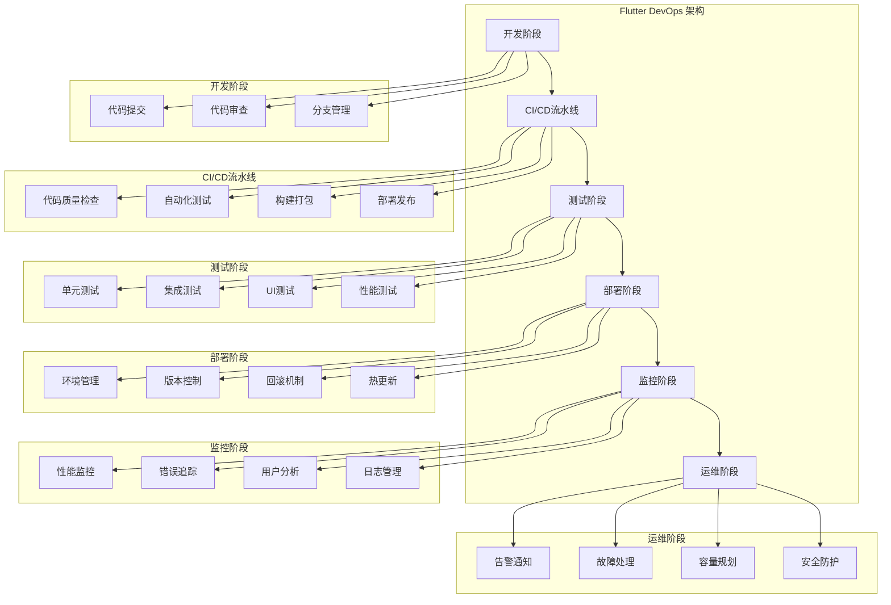
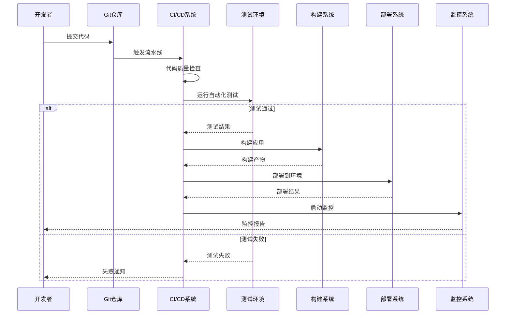
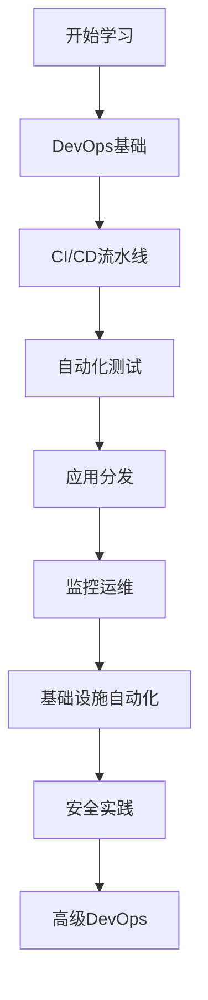

# 🚀 Flutter DevOps 深度指南

> 全面的 Flutter 应用 DevOps 解决方案，涵盖 CI/CD、自动化测试、应用分发、监控运维等企业级实践


## 📋 目录导航

<details>
<summary>🎯 快速导航</summary>

### 🔄 CI/CD 流水线

- [🔄 持续集成](continuous-integration.md) - GitHub Actions、GitLab CI、Jenkins 配置
- [🚀 持续部署](continuous-deployment.md) - 自动化部署、环境管理、回滚策略
- [📊 代码质量](code-quality.md) - 静态分析、代码覆盖率、质量门禁
- [⚡ 构建优化](build-optimization.md) - 构建缓存、并行构建、增量构建

### 🧪 自动化测试

- [🧪 测试策略](testing-strategy.md) - 测试金字塔、测试分层、测试计划
- [🔬 单元测试](unit-testing.md) - Widget 测试、Mock、测试覆盖率
- [🔗 集成测试](integration-testing.md) - 端到端测试、API 测试、数据库测试
- [🎨 UI 测试](ui-testing.md) - 自动化 UI 测试、截图对比、跨平台测试

### 📱 应用分发

- [📱 多平台发布](multi-platform-release.md) - iOS App Store、Google Play、华为应用市场
- [🧪 内测分发](beta-distribution.md) - TestFlight、Firebase App Distribution、蒲公英
- [📋 版本管理](version-management.md) - 语义化版本、分支策略、发布流程
- [🔥 热更新](hot-update.md) - CodePush、自定义热更新方案

### 📊 监控运维

- [📊 应用监控](app-monitoring.md) - 性能监控、错误追踪、用户行为分析
- [📝 日志管理](log-management.md) - 日志收集、分析、告警
- [⚡ 性能分析](performance-analysis.md) - APM 工具、性能指标、优化建议
- [🚨 告警通知](alerting.md) - 监控告警、通知渠道、事件响应

### 🏗️ 基础设施管理

- [🐳 容器化部署](containerization.md) - Docker、Kubernetes、微服务架构
- [☁️ 云原生实践](cloud-native.md) - 云服务集成、Serverless、边缘计算
- [📜 基础设施即代码](infrastructure-as-code.md) - Terraform、Ansible、配置管理
- [🛡️ 安全实践](security-practices.md) - DevSecOps、安全扫描、合规检查

</details>

## 🏗️ DevOps 架构总览

### 整体架构图



### CI/CD 流水线架构



## 🎯 核心学习目标

### 📚 理论知识

- ✅ 深入理解 DevOps 理念和实践
- ✅ 掌握 CI/CD 流水线设计原理
- ✅ 了解自动化测试策略和方法
- ✅ 学会监控运维和性能优化

### 🛠️ 实践技能

- ✅ 熟练配置 GitHub Actions、GitLab CI 等 CI/CD 工具
- ✅ 掌握自动化测试框架和测试方法
- ✅ 学会应用分发和版本管理
- ✅ 能够搭建完整的监控体系

### 🎨 架构能力

- ✅ 理解 DevOps 架构设计原则
- ✅ 掌握微服务和容器化部署
- ✅ 学会基础设施即代码实践
- ✅ 能够处理复杂的运维场景

## 🚀 快速开始

### 1. 环境准备

```bash
# 检查 Flutter 环境
flutter doctor

# 创建新项目
flutter create devops_demo
cd devops_demo

# 添加相关依赖
flutter pub add --dev flutter_test integration_test mockito
flutter pub add --dev flutter_lints dart_code_metrics
flutter pub add firebase_core firebase_crashlytics firebase_analytics
```

### 2. 基础 CI/CD 配置

```yaml
# .github/workflows/flutter.yml
name: Flutter CI/CD Pipeline

on:
  push:
    branches: [main, develop]
  pull_request:
    branches: [main]

env:
  FLUTTER_VERSION: "3.16.0"
  JAVA_VERSION: "17"

jobs:
  # 代码质量检查
  quality:
    name: Code Quality
    runs-on: ubuntu-latest
    steps:
      - name: Checkout code
        uses: actions/checkout@v3

      - name: Setup Flutter
        uses: subosito/flutter-action@v2
        with:
          flutter-version: ${{ env.FLUTTER_VERSION }}

      - name: Install dependencies
        run: flutter pub get

      - name: Analyze code
        run: flutter analyze

      - name: Check formatting
        run: dart format --set-exit-if-changed .

      - name: Run lints
        run: flutter pub run dart_code_metrics:metrics analyze lib

  # 单元测试
  test:
    name: Unit Tests
    runs-on: ubuntu-latest
    needs: quality
    steps:
      - name: Checkout code
        uses: actions/checkout@v3

      - name: Setup Flutter
        uses: subosito/flutter-action@v2
        with:
          flutter-version: ${{ env.FLUTTER_VERSION }}

      - name: Install dependencies
        run: flutter pub get

      - name: Run tests
        run: flutter test --coverage

      - name: Upload coverage
        uses: codecov/codecov-action@v3
        with:
          file: coverage/lcov.info

  # Android构建
  build-android:
    name: Build Android
    runs-on: ubuntu-latest
    needs: test
    steps:
      - name: Checkout code
        uses: actions/checkout@v3

      - name: Setup Java
        uses: actions/setup-java@v3
        with:
          distribution: "zulu"
          java-version: ${{ env.JAVA_VERSION }}

      - name: Setup Flutter
        uses: subosito/flutter-action@v2
        with:
          flutter-version: ${{ env.FLUTTER_VERSION }}

      - name: Install dependencies
        run: flutter pub get

      - name: Build APK
        run: flutter build apk --release

      - name: Build App Bundle
        run: flutter build appbundle --release

      - name: Upload artifacts
        uses: actions/upload-artifact@v3
        with:
          name: android-artifacts
          path: |
            build/app/outputs/flutter-apk/app-release.apk
            build/app/outputs/bundle/release/app-release.aab

  # iOS构建
  build-ios:
    name: Build iOS
    runs-on: macos-latest
    needs: test
    steps:
      - name: Checkout code
        uses: actions/checkout@v3

      - name: Setup Flutter
        uses: subosito/flutter-action@v2
        with:
          flutter-version: ${{ env.FLUTTER_VERSION }}

      - name: Install dependencies
        run: flutter pub get

      - name: Build iOS
        run: |
          flutter build ios --release --no-codesign
          cd ios
          xcodebuild -workspace Runner.xcworkspace \
                     -scheme Runner \
                     -configuration Release \
                     -destination generic/platform=iOS \
                     -archivePath build/Runner.xcarchive \
                     archive
```

### 3. 自动化测试配置

```dart
// test/widget_test.dart
import 'package:flutter/material.dart';
import 'package:flutter_test/flutter_test.dart';
import 'package:mockito/mockito.dart';
import 'package:devops_demo/main.dart';

// Mock类生成
import 'widget_test.mocks.dart';

@GenerateMocks([ApiService])
void main() {
  group('App Widget Tests', () {
    late MockApiService mockApiService;

    setUp(() {
      mockApiService = MockApiService();
    });

    testWidgets('Counter increments smoke test', (WidgetTester tester) async {
      // 构建应用并触发一帧
      await tester.pumpWidget(MyApp());

      // 验证计数器从0开始
      expect(find.text('0'), findsOneWidget);
      expect(find.text('1'), findsNothing);

      // 点击'+'图标并触发一帧
      await tester.tap(find.byIcon(Icons.add));
      await tester.pump();

      // 验证计数器已增加
      expect(find.text('0'), findsNothing);
      expect(find.text('1'), findsOneWidget);
    });

    testWidgets('Login form validation', (WidgetTester tester) async {
      await tester.pumpWidget(MaterialApp(
        home: LoginPage(apiService: mockApiService),
      ));

      // 测试空表单提交
      await tester.tap(find.byType(ElevatedButton));
      await tester.pump();

      expect(find.text('请输入邮箱'), findsOneWidget);
      expect(find.text('请输入密码'), findsOneWidget);

      // 测试有效输入
      await tester.enterText(find.byType(TextField).first, 'test@example.com');
      await tester.enterText(find.byType(TextField).last, 'password123');

      when(mockApiService.login(any, any))
          .thenAnswer((_) async => LoginResult.success());

      await tester.tap(find.byType(ElevatedButton));
      await tester.pump();

      verify(mockApiService.login('test@example.com', 'password123')).called(1);
    });
  });
}

// 集成测试
// integration_test/app_test.dart
import 'package:flutter/material.dart';
import 'package:flutter_test/flutter_test.dart';
import 'package:integration_test/integration_test.dart';
import 'package:devops_demo/main.dart' as app;

void main() {
  IntegrationTestWidgetsFlutterBinding.ensureInitialized();

  group('端到端测试', () {
    testWidgets('完整用户流程测试', (WidgetTester tester) async {
      app.main();
      await tester.pumpAndSettle();

      // 1. 启动页面
      expect(find.text('欢迎'), findsOneWidget);

      // 2. 导航到登录页面
      await tester.tap(find.text('登录'));
      await tester.pumpAndSettle();

      // 3. 执行登录
      await tester.enterText(
        find.byKey(const Key('email_field')),
        'test@example.com',
      );
      await tester.enterText(
        find.byKey(const Key('password_field')),
        'password123',
      );

      await tester.tap(find.byKey(const Key('login_button')));
      await tester.pumpAndSettle(const Duration(seconds: 3));

      // 4. 验证登录成功
      expect(find.text('主页'), findsOneWidget);

      // 5. 测试主要功能
      await tester.tap(find.byIcon(Icons.add));
      await tester.pumpAndSettle();

      expect(find.text('新建'), findsOneWidget);

      // 6. 退出登录
      await tester.tap(find.byIcon(Icons.logout));
      await tester.pumpAndSettle();

      expect(find.text('欢迎'), findsOneWidget);
    });

    testWidgets('性能测试', (WidgetTester tester) async {
      app.main();
      await tester.pumpAndSettle();

      // 测试页面加载性能
      final stopwatch = Stopwatch()..start();

      await tester.tap(find.text('商品列表'));
      await tester.pumpAndSettle();

      stopwatch.stop();

      // 验证页面加载时间小于2秒
      expect(stopwatch.elapsedMilliseconds, lessThan(2000));

      // 测试滚动性能
      final listFinder = find.byType(ListView);
      expect(listFinder, findsOneWidget);

      // 快速滚动测试
      await tester.fling(listFinder, const Offset(0, -500), 1000);
      await tester.pumpAndSettle();

      // 验证滚动后UI正常
      expect(find.byType(ListTile), findsWidgets);
    });
  });
}
```

### 4. 监控配置示例

```dart
// lib/main.dart
import 'package:flutter/material.dart';
import 'package:firebase_core/firebase_core.dart';
import 'package:firebase_crashlytics/firebase_crashlytics.dart';
import 'package:firebase_analytics/firebase_analytics.dart';

void main() async {
  WidgetsFlutterBinding.ensureInitialized();

  await Firebase.initializeApp();

  // 配置Crashlytics
  FlutterError.onError = (errorDetails) {
    FirebaseCrashlytics.instance.recordFlutterFatalError(errorDetails);
  };

  // 配置Analytics
  FirebaseAnalytics analytics = FirebaseAnalytics.instance;

  runApp(MyApp(analytics: analytics));
}

class MyApp extends StatelessWidget {
  final FirebaseAnalytics analytics;

  const MyApp({Key? key, required this.analytics}) : super(key: key);

  @override
  Widget build(BuildContext context) {
    return MaterialApp(
      title: 'DevOps Demo',
      navigatorObservers: [
        FirebaseAnalyticsObserver(analytics: analytics),
      ],
      home: const MyHomePage(),
    );
  }
}

// lib/utils/logger.dart
import 'package:logger/logger.dart';
import 'package:firebase_crashlytics/firebase_crashlytics.dart';

class AppLogger {
  static final Logger _logger = Logger(
    printer: PrettyPrinter(
      methodCount: 2,
      errorMethodCount: 8,
      lineLength: 120,
      colors: true,
      printEmojis: true,
      printTime: true,
    ),
  );

  static void debug(String message, [dynamic error, StackTrace? stackTrace]) {
    _logger.d(message, error, stackTrace);
  }

  static void info(String message, [dynamic error, StackTrace? stackTrace]) {
    _logger.i(message, error, stackTrace);
  }

  static void warning(String message, [dynamic error, StackTrace? stackTrace]) {
    _logger.w(message, error, stackTrace);
  }

  static void error(String message, [dynamic error, StackTrace? stackTrace]) {
    _logger.e(message, error, stackTrace);

    // 发送到Crashlytics
    FirebaseCrashlytics.instance.recordError(
      error ?? message,
      stackTrace,
      reason: message,
    );
  }

  static void fatal(String message, [dynamic error, StackTrace? stackTrace]) {
    _logger.f(message, error, stackTrace);

    // 发送致命错误到Crashlytics
    FirebaseCrashlytics.instance.recordError(
      error ?? message,
      stackTrace,
      reason: message,
      fatal: true,
    );
  }
}

// lib/utils/performance_monitor.dart
import 'package:firebase_performance/firebase_performance.dart';

class PerformanceMonitor {
  static final FirebasePerformance _performance = FirebasePerformance.instance;

  // 监控HTTP请求
  static Future<T> monitorHttpRequest<T>(
    String url,
    Future<T> Function() request,
  ) async {
    final trace = _performance.newHttpTrace(
      url: url,
      httpMethod: HttpMethod.Get,
    );

    await trace.start();

    try {
      final result = await request();
      trace.setHttpResponseCode(200);
      return result;
    } catch (e) {
      trace.setHttpResponseCode(500);
      rethrow;
    } finally {
      await trace.stop();
    }
  }

  // 监控自定义操作
  static Future<T> monitorOperation<T>(
    String operationName,
    Future<T> Function() operation, {
    Map<String, String>? attributes,
  }) async {
    final trace = _performance.newTrace(operationName);

    if (attributes != null) {
      attributes.forEach((key, value) {
        trace.putAttribute(key, value);
      });
    }

    await trace.start();

    try {
      return await operation();
    } finally {
      await trace.stop();
    }
  }

  // 监控页面加载时间
  static Trace startPageTrace(String pageName) {
    final trace = _performance.newTrace('page_load_$pageName');
    trace.start();
    return trace;
  }
}
```

## 📊 DevOps 工具对比

### CI/CD 工具对比

| 工具           | 学习成本 | 功能丰富度 | 集成难度   | 社区支持   | 适用场景             |
| -------------- | -------- | ---------- | ---------- | ---------- | -------------------- |
| GitHub Actions | ⭐⭐⭐   | ⭐⭐⭐⭐⭐ | ⭐⭐⭐⭐⭐ | ⭐⭐⭐⭐⭐ | 开源项目、小团队     |
| GitLab CI      | ⭐⭐⭐⭐ | ⭐⭐⭐⭐   | ⭐⭐⭐⭐   | ⭐⭐⭐⭐   | 企业级、私有部署     |
| Jenkins        | ⭐⭐     | ⭐⭐⭐⭐⭐ | ⭐⭐       | ⭐⭐⭐⭐⭐ | 大型企业、复杂流水线 |
| CircleCI       | ⭐⭐⭐   | ⭐⭐⭐⭐   | ⭐⭐⭐⭐   | ⭐⭐⭐     | 云原生、快速部署     |
| Azure DevOps   | ⭐⭐⭐   | ⭐⭐⭐⭐   | ⭐⭐⭐     | ⭐⭐⭐     | 微软生态、企业级     |

### 测试工具对比

| 工具类型  | 工具名称         | 适用场景              | 优势               | 劣势         |
| --------- | ---------------- | --------------------- | ------------------ | ------------ |
| 单元测试  | Flutter Test     | Widget 测试、逻辑测试 | 官方支持、集成度高 | 功能相对简单 |
| Mock 测试 | Mockito          | 依赖隔离、测试驱动    | 功能强大、类型安全 | 学习成本较高 |
| 集成测试  | Integration Test | 端到端测试            | 真实环境、完整流程 | 执行时间长   |
| UI 测试   | Patrol           | 自动化 UI 测试        | 跨平台、易用性     | 社区相对较小 |

### 监控工具对比

| 工具      | 功能     | 集成难度   | 成本     | 适用场景           |
| --------- | -------- | ---------- | -------- | ------------------ |
| Firebase  | 全面监控 | ⭐⭐⭐⭐⭐ | 免费起步 | 快速集成、小项目   |
| Sentry    | 错误追踪 | ⭐⭐⭐⭐   | 中等     | 错误监控、性能分析 |
| New Relic | APM 监控 | ⭐⭐⭐     | 较高     | 企业级、复杂应用   |
| DataDog   | 全栈监控 | ⭐⭐⭐     | 较高     | 大型企业、微服务   |

## 🎨 设计模式应用

### 1. 流水线模式 (Pipeline Pattern)

```dart
// CI/CD流水线抽象
abstract class PipelineStage {
  String get name;
  Future<bool> execute(PipelineContext context);
}

class PipelineContext {
  final Map<String, dynamic> data = {};
  final List<String> logs = [];

  void addData(String key, dynamic value) {
    data[key] = value;
  }

  T? getData<T>(String key) {
    return data[key] as T?;
  }

  void addLog(String message) {
    logs.add('${DateTime.now()}: $message');
  }
}

// 具体流水线阶段
class CodeQualityStage extends PipelineStage {
  @override
  String get name => 'Code Quality';

  @override
  Future<bool> execute(PipelineContext context) async {
    try {
      context.addLog('开始代码质量检查');

      // 运行代码分析
      final result = await Process.run('flutter', ['analyze']);

      if (result.exitCode == 0) {
        context.addLog('代码质量检查通过');
        context.addData('codeQuality', 'passed');
        return true;
      } else {
        context.addLog('代码质量检查失败: ${result.stderr}');
        context.addData('codeQuality', 'failed');
        return false;
      }
    } catch (e) {
      context.addLog('代码质量检查异常: $e');
      return false;
    }
  }
}

class TestStage extends PipelineStage {
  @override
  String get name => 'Testing';

  @override
  Future<bool> execute(PipelineContext context) async {
    try {
      context.addLog('开始运行测试');

      // 运行单元测试
      final testResult = await Process.run('flutter', ['test', '--coverage']);

      if (testResult.exitCode == 0) {
        context.addLog('测试通过');
        context.addData('testResult', 'passed');
        return true;
      } else {
        context.addLog('测试失败: ${testResult.stderr}');
        context.addData('testResult', 'failed');
        return false;
      }
    } catch (e) {
      context.addLog('测试异常: $e');
      return false;
    }
  }
}

class BuildStage extends PipelineStage {
  @override
  String get name => 'Building';

  @override
  Future<bool> execute(PipelineContext context) async {
    try {
      context.addLog('开始构建应用');

      // 构建Android APK
      final buildResult = await Process.run('flutter', ['build', 'apk', '--release']);

      if (buildResult.exitCode == 0) {
        context.addLog('构建成功');
        context.addData('buildResult', 'success');
        return true;
      } else {
        context.addLog('构建失败: ${buildResult.stderr}');
        context.addData('buildResult', 'failed');
        return false;
      }
    } catch (e) {
      context.addLog('构建异常: $e');
      return false;
    }
  }
}

// 流水线执行器
class PipelineExecutor {
  final List<PipelineStage> stages;

  PipelineExecutor(this.stages);

  Future<bool> execute() async {
    final context = PipelineContext();

    for (final stage in stages) {
      context.addLog('执行阶段: ${stage.name}');

      final success = await stage.execute(context);

      if (!success) {
        context.addLog('阶段失败: ${stage.name}');
        return false;
      }

      context.addLog('阶段完成: ${stage.name}');
    }

    context.addLog('所有阶段执行完成');
    return true;
  }
}

// 使用示例
void main() async {
  final pipeline = PipelineExecutor([
    CodeQualityStage(),
    TestStage(),
    BuildStage(),
  ]);

  final success = await pipeline.execute();

  if (success) {
    print('流水线执行成功');
  } else {
    print('流水线执行失败');
  }
}
```

### 2. 观察者模式 (Observer Pattern)

```dart
// 部署状态监听器
class DeploymentObserver extends ChangeNotifier {
  final Map<String, DeploymentStatus> _deployments = {};

  DeploymentStatus getDeploymentStatus(String deploymentId) {
    return _deployments[deploymentId] ?? DeploymentStatus.unknown;
  }

  void updateDeploymentStatus(String deploymentId, DeploymentStatus status) {
    _deployments[deploymentId] = status;
    notifyListeners();

    // 记录部署状态变化
    _logDeploymentStatus(deploymentId, status);
  }

  void _logDeploymentStatus(String deploymentId, DeploymentStatus status) {
    print('部署状态更新: $deploymentId -> $status');
  }
}

enum DeploymentStatus { pending, inProgress, success, failed, unknown }

// 部署管理器
class DeploymentManager {
  final DeploymentObserver _observer = DeploymentObserver();

  Future<void> deploy(String deploymentId, String version) async {
    _observer.updateDeploymentStatus(deploymentId, DeploymentStatus.pending);

    try {
      _observer.updateDeploymentStatus(deploymentId, DeploymentStatus.inProgress);

      // 执行部署逻辑
      await _performDeployment(version);

      _observer.updateDeploymentStatus(deploymentId, DeploymentStatus.success);
    } catch (e) {
      _observer.updateDeploymentStatus(deploymentId, DeploymentStatus.failed);
      rethrow;
    }
  }

  Future<void> _performDeployment(String version) async {
    // 模拟部署过程
    await Future.delayed(Duration(seconds: 5));
  }

  void watchDeployment(String deploymentId, Function(DeploymentStatus) callback) {
    _observer.addListener(() {
      final status = _observer.getDeploymentStatus(deploymentId);
      callback(status);
    });
  }
}
```

### 3. 策略模式 (Strategy Pattern)

```dart
// 部署策略接口
abstract class DeploymentStrategy {
  String get name;
  Future<bool> deploy(String version, Map<String, dynamic> config);
  Future<bool> rollback(String version);
}

// Android部署策略
class AndroidDeploymentStrategy implements DeploymentStrategy {
  @override
  String get name => 'Android';

  @override
  Future<bool> deploy(String version, Map<String, dynamic> config) async {
    try {
      print('部署Android版本: $version');

      // 构建APK
      await Process.run('flutter', ['build', 'apk', '--release']);

      // 上传到Google Play Console
      await _uploadToPlayStore(version, config);

      return true;
    } catch (e) {
      print('Android部署失败: $e');
      return false;
    }
  }

  @override
  Future<bool> rollback(String version) async {
    try {
      print('回滚Android版本: $version');
      // 实现回滚逻辑
      return true;
    } catch (e) {
      print('Android回滚失败: $e');
      return false;
    }
  }

  Future<void> _uploadToPlayStore(String version, Map<String, dynamic> config) async {
    // 实现上传逻辑
  }
}

// iOS部署策略
class IOSDeploymentStrategy implements DeploymentStrategy {
  @override
  String get name => 'iOS';

  @override
  Future<bool> deploy(String version, Map<String, dynamic> config) async {
    try {
      print('部署iOS版本: $version');

      // 构建iOS应用
      await Process.run('flutter', ['build', 'ios', '--release']);

      // 上传到App Store Connect
      await _uploadToAppStore(version, config);

      return true;
    } catch (e) {
      print('iOS部署失败: $e');
      return false;
    }
  }

  @override
  Future<bool> rollback(String version) async {
    try {
      print('回滚iOS版本: $version');
      // 实现回滚逻辑
      return true;
    } catch (e) {
      print('iOS回滚失败: $e');
      return false;
    }
  }

  Future<void> _uploadToAppStore(String version, Map<String, dynamic> config) async {
    // 实现上传逻辑
  }
}

// 部署策略工厂
class DeploymentStrategyFactory {
  static DeploymentStrategy createStrategy(String platform) {
    switch (platform.toLowerCase()) {
      case 'android':
        return AndroidDeploymentStrategy();
      case 'ios':
        return IOSDeploymentStrategy();
      default:
        throw ArgumentError('不支持的平台: $platform');
    }
  }
}

// 使用示例
class DeploymentService {
  Future<void> deployToPlatform(String platform, String version) async {
    final strategy = DeploymentStrategyFactory.createStrategy(platform);

    final config = {
      'releaseNotes': '新版本发布',
      'targetAudience': 'all',
    };

    final success = await strategy.deploy(version, config);

    if (success) {
      print('${strategy.name} 部署成功');
    } else {
      print('${strategy.name} 部署失败');
    }
  }
}
```

## 🔧 开发工具推荐

### 📱 调试工具

- **Flutter Inspector**: 应用调试
- **Dart DevTools**: 性能分析
- **Firebase Console**: 监控分析
- **Sentry Dashboard**: 错误追踪

### 🎨 设计工具

- **GitHub Actions**: CI/CD 流水线
- **GitLab CI**: 企业级 CI/CD
- **Jenkins**: 传统 CI/CD
- **Docker**: 容器化部署

### 📚 学习资源

- **官方文档**: 各工具的官方文档
- **GitHub 示例**: 官方示例项目
- **社区博客**: 技术博客和教程

## 📈 学习路径建议



### 🎯 阶段目标

#### 第一阶段：基础掌握

- [ ] 理解 DevOps 基础概念
- [ ] 掌握 Git 和分支管理
- [ ] 学会基础 CI/CD 配置
- [ ] 完成简单的自动化部署

#### 第二阶段：进阶学习

- [ ] 深入学习自动化测试
- [ ] 掌握应用分发流程
- [ ] 学会监控和日志管理
- [ ] 完成中等复杂度的 DevOps 流程

#### 第三阶段：高级应用

- [ ] 掌握基础设施即代码
- [ ] 学会容器化和微服务
- [ ] 理解安全最佳实践
- [ ] 完成企业级 DevOps 架构

#### 第四阶段：实战项目

- [ ] 完成完整的商业级 DevOps 流程
- [ ] 掌握团队协作和流程优化
- [ ] 学会性能优化和故障处理
- [ ] 参与开源项目贡献

## 🏆 最佳实践

### 📝 代码规范

```dart
// ✅ 推荐：统一的错误处理
class DevOpsService {
  static Future<T> safeExecute<T>(
    Future<T> Function() operation,
    String operationName,
  ) async {
    try {
      return await operation();
    } on ProcessException catch (e) {
      print('进程执行错误 [$operationName]: $e');
      throw DevOpsException('进程执行失败: $e');
    } on FileSystemException catch (e) {
      print('文件系统错误 [$operationName]: $e');
      throw DevOpsException('文件操作失败: $e');
    } catch (e) {
      print('未知错误 [$operationName]: $e');
      throw DevOpsException('操作失败: $e');
    }
  }
}

class DevOpsException implements Exception {
  final String message;

  DevOpsException(this.message);

  @override
  String toString() => 'DevOpsException: $message';
}

// ✅ 推荐：配置管理
class DevOpsConfig {
  final String flutterVersion;
  final String javaVersion;
  final Map<String, String> environment;
  final List<String> testCommands;
  final Map<String, dynamic> buildConfig;

  DevOpsConfig({
    required this.flutterVersion,
    required this.javaVersion,
    required this.environment,
    required this.testCommands,
    required this.buildConfig,
  });

  factory DevOpsConfig.fromJson(Map<String, dynamic> json) {
    return DevOpsConfig(
      flutterVersion: json['flutterVersion'] as String,
      javaVersion: json['javaVersion'] as String,
      environment: Map<String, String>.from(json['environment'] as Map),
      testCommands: List<String>.from(json['testCommands'] as List),
      buildConfig: json['buildConfig'] as Map<String, dynamic>,
    );
  }

  Map<String, dynamic> toJson() {
    return {
      'flutterVersion': flutterVersion,
      'javaVersion': javaVersion,
      'environment': environment,
      'testCommands': testCommands,
      'buildConfig': buildConfig,
    };
  }
}
```

### 🎨 架构原则

- **自动化优先**: 尽可能自动化重复性工作
- **持续改进**: 不断优化流程和工具
- **监控驱动**: 基于监控数据进行决策
- **安全左移**: 在开发早期考虑安全问题

### ⚡ 性能优化

- 使用缓存减少构建时间
- 并行执行独立任务
- 优化测试执行策略
- 合理使用资源限制

### 🧪 测试策略

- DevOps 流程测试覆盖率 ≥ 95%
- 自动化测试覆盖关键流程
- 定期进行故障演练
- 性能基准测试

## 📚 相关资源

### 🔗 官方资源

- [Flutter 官方文档](https://flutter.dev/docs)
- [GitHub Actions 文档](https://docs.github.com/en/actions)
- [Firebase 文档](https://firebase.google.com/docs)
- [Sentry 文档](https://docs.sentry.io/)

### 📖 推荐书籍

- 《Flutter 实战》
- 《DevOps 实践指南》
- 《持续交付》

### 🎥 视频教程

- [Flutter 官方 YouTube 频道](https://www.youtube.com/c/FlutterDev)
- [B 站 Flutter 教程](https://www.bilibili.com/video/BV1S4411E7LY)

---

## 🎉 开始你的 DevOps 之旅

现在你已经了解了 Flutter DevOps 的整体架构和学习路径。接下来，让我们从[持续集成](continuous-integration.md)开始，逐步掌握各种 DevOps 实践。

记住：**DevOps 是一种文化，而不仅仅是工具和流程**，注重团队协作和持续改进！

---

<div align="center">

**🌟 如果这个指南对你有帮助，请给个 Star 支持一下！ 🌟**

[](https://github.com/1989allen126/language-tutorial)
[](https://github.com/1989allen126/language-tutorial)

</div>
