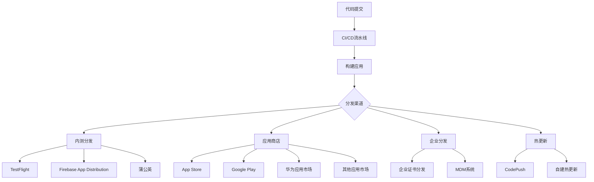

# Flutter 应用分发完整指南

## 📖 概述

应用分发是DevOps流程的最后一环，涉及多平台发布、版本管理、内测分发和热更新等关键环节。本文档详细介绍Flutter应用的分发策略和最佳实践。

## 🎯 分发策略架构



## 📱 多平台发布

### 1. iOS发布配置

```yaml
# ios/fastlane/Fastfile
default_platform(:ios)

platform :ios do
  before_all do
    setup_circle_ci if ENV['CI']
  end
  
  desc "构建并上传到TestFlight"
  lane :beta do
    # 更新版本号
    increment_build_number(
      xcodeproj: "Runner.xcodeproj",
      build_number: ENV['BUILD_NUMBER'] || latest_testflight_build_number + 1
    )
    
    # 构建应用
    build_app(
      scheme: "Runner",
      export_method: "app-store",
      export_options: {
        provisioningProfiles: {
          "com.example.myapp" => "MyApp AppStore"
        }
      }
    )
    
    # 上传到TestFlight
    upload_to_testflight(
      skip_waiting_for_build_processing: true,
      changelog: ENV['CHANGELOG'] || "Bug fixes and improvements"
    )
    
    # 发送通知
    slack(
      message: "iOS Beta版本已上传到TestFlight",
      channel: "#releases",
      success: true
    )
  end
  
  desc "发布到App Store"
  lane :release do
    # 确保代码是最新的
    ensure_git_status_clean
    
    # 更新版本号
    version = prompt(text: "请输入版本号: ")
    increment_version_number(
      version_number: version,
      xcodeproj: "Runner.xcodeproj"
    )
    
    # 构建应用
    build_app(
      scheme: "Runner",
      export_method: "app-store"
    )
    
    # 上传到App Store
    upload_to_app_store(
      force: true,
      reject_if_possible: true,
      skip_metadata: false,
      skip_screenshots: false,
      submit_for_review: true,
      automatic_release: false
    )
    
    # 创建Git标签
    add_git_tag(
      tag: "ios-v#{version}",
      message: "iOS Release v#{version}"
    )
    
    push_git_tags
    
    # 发送通知
    slack(
      message: "iOS v#{version} 已提交App Store审核",
      channel: "#releases",
      success: true
    )
  end
  
  desc "构建企业版本"
  lane :enterprise do
    build_app(
      scheme: "Runner",
      export_method: "enterprise",
      export_options: {
        provisioningProfiles: {
          "com.example.myapp" => "MyApp Enterprise"
        }
      }
    )
    
    # 上传到内部服务器
    upload_to_internal_server
  end
end
```

### 2. Android发布配置

```yaml
# android/fastlane/Fastfile
default_platform(:android)

platform :android do
  desc "构建并上传到内测"
  lane :beta do
    # 清理构建
    gradle(task: "clean")
    
    # 构建APK
    gradle(
      task: "assemble",
      build_type: "Release",
      properties: {
        "android.injected.signing.store.file" => ENV['KEYSTORE_PATH'],
        "android.injected.signing.store.password" => ENV['KEYSTORE_PASSWORD'],
        "android.injected.signing.key.alias" => ENV['KEY_ALIAS'],
        "android.injected.signing.key.password" => ENV['KEY_PASSWORD']
      }
    )
    
    # 上传到Firebase App Distribution
    firebase_app_distribution(
      app: ENV['FIREBASE_APP_ID'],
      testers: "testers@example.com",
      groups: "qa-team, beta-testers",
      release_notes: ENV['CHANGELOG'] || "Bug fixes and improvements",
      firebase_cli_token: ENV['FIREBASE_TOKEN']
    )
    
    # 发送通知
    slack(
      message: "Android Beta版本已发布到Firebase App Distribution",
      channel: "#releases",
      success: true
    )
  end
  
  desc "发布到Google Play"
  lane :release do
    # 构建AAB
    gradle(
      task: "bundle",
      build_type: "Release"
    )
    
    # 上传到Google Play
    upload_to_play_store(
      track: "production",
      release_status: "draft",
      aab: "../build/app/outputs/bundle/release/app-release.aab",
      skip_upload_metadata: false,
      skip_upload_changelogs: false,
      skip_upload_images: false,
      skip_upload_screenshots: false
    )
    
    # 创建Git标签
    version = get_version_name
    add_git_tag(
      tag: "android-v#{version}",
      message: "Android Release v#{version}"
    )
    
    push_git_tags
    
    # 发送通知
    slack(
      message: "Android v#{version} 已上传到Google Play",
      channel: "#releases",
      success: true
    )
  end
  
  desc "发布到华为应用市场"
  lane :huawei do
    gradle(
      task: "assemble",
      build_type: "Release"
    )
    
    # 上传到华为应用市场
    huawei_app_gallery(
      client_id: ENV['HUAWEI_CLIENT_ID'],
      client_secret: ENV['HUAWEI_CLIENT_SECRET'],
      app_id: ENV['HUAWEI_APP_ID'],
      apk_path: "../build/app/outputs/flutter-apk/app-release.apk"
    )
  end
end
```

### 3. 多平台统一发布脚本

```bash
#!/bin/bash
# scripts/release.sh

set -e

# 颜色输出
RED='\033[0;31m'
GREEN='\033[0;32m'
YELLOW='\033[1;33m'
BLUE='\033[0;34m'
NC='\033[0m' # No Color

log_info() {
    echo -e "${GREEN}[INFO]${NC} $1"
}

log_warn() {
    echo -e "${YELLOW}[WARN]${NC} $1"
}

log_error() {
    echo -e "${RED}[ERROR]${NC} $1"
}

log_step() {
    echo -e "${BLUE}[STEP]${NC} $1"
}

# 检查环境
check_environment() {
    log_step "检查发布环境..."
    
    # 检查Flutter
    if ! command -v flutter &> /dev/null; then
        log_error "Flutter未安装"
        exit 1
    fi
    
    # 检查Fastlane
    if ! command -v fastlane &> /dev/null; then
        log_error "Fastlane未安装"
        exit 1
    fi
    
    # 检查Git状态
    if [[ -n $(git status --porcelain) ]]; then
        log_error "Git工作目录不干净，请先提交或暂存更改"
        exit 1
    fi
    
    log_info "环境检查通过"
}

# 更新版本号
update_version() {
    local version=$1
    local build_number=$2
    
    log_step "更新版本号到 $version ($build_number)..."
    
    # 更新pubspec.yaml
    sed -i.bak "s/^version: .*/version: $version+$build_number/" pubspec.yaml
    rm pubspec.yaml.bak
    
    # 提交版本更改
    git add pubspec.yaml
    git commit -m "chore: bump version to $version ($build_number)"
    
    log_info "版本号已更新"
}

# 构建Flutter应用
build_flutter() {
    log_step "构建Flutter应用..."
    
    # 清理
    flutter clean
    flutter pub get
    
    # 生成代码
    if [ -f "pubspec.yaml" ] && grep -q "build_runner" pubspec.yaml; then
        flutter packages pub run build_runner build --delete-conflicting-outputs
    fi
    
    log_info "Flutter构建完成"
}

# iOS发布
release_ios() {
    local release_type=$1
    
    log_step "发布iOS应用 ($release_type)..."
    
    cd ios
    
    case $release_type in
        "beta")
            fastlane beta
            ;;
        "release")
            fastlane release
            ;;
        "enterprise")
            fastlane enterprise
            ;;
        *)
            log_error "未知的iOS发布类型: $release_type"
            exit 1
            ;;
    esac
    
    cd ..
    log_info "iOS发布完成"
}

# Android发布
release_android() {
    local release_type=$1
    
    log_step "发布Android应用 ($release_type)..."
    
    cd android
    
    case $release_type in
        "beta")
            fastlane beta
            ;;
        "release")
            fastlane release
            ;;
        "huawei")
            fastlane huawei
            ;;
        *)
            log_error "未知的Android发布类型: $release_type"
            exit 1
            ;;
    esac
    
    cd ..
    log_info "Android发布完成"
}

# 发送通知
send_notification() {
    local platform=$1
    local version=$2
    local release_type=$3
    
    local message="🚀 $platform v$version ($release_type) 发布完成"
    
    # Slack通知
    if [ ! -z "$SLACK_WEBHOOK_URL" ]; then
        curl -X POST -H 'Content-type: application/json' \
            --data "{\"text\":\"$message\"}" \
            $SLACK_WEBHOOK_URL
    fi
    
    # 邮件通知
    if command -v mail &> /dev/null && [ ! -z "$NOTIFICATION_EMAIL" ]; then
        echo "$message" | mail -s "应用发布通知" $NOTIFICATION_EMAIL
    fi
    
    log_info "通知已发送"
}

# 主函数
main() {
    echo "🚀 Flutter应用发布脚本"
    echo "========================"
    
    # 解析参数
    PLATFORM=""
    RELEASE_TYPE=""
    VERSION=""
    BUILD_NUMBER=""
    
    while [[ $# -gt 0 ]]; do
        case $1 in
            -p|--platform)
                PLATFORM="$2"
                shift 2
                ;;
            -t|--type)
                RELEASE_TYPE="$2"
                shift 2
                ;;
            -v|--version)
                VERSION="$2"
                shift 2
                ;;
            -b|--build)
                BUILD_NUMBER="$2"
                shift 2
                ;;
            -h|--help)
                echo "用法: $0 -p <platform> -t <type> [-v version] [-b build_number]"
                echo "平台: ios, android, both"
                echo "类型: beta, release, enterprise (iOS), huawei (Android)"
                exit 0
                ;;
            *)
                log_error "未知参数: $1"
                exit 1
                ;;
        esac
    done
    
    # 验证参数
    if [ -z "$PLATFORM" ] || [ -z "$RELEASE_TYPE" ]; then
        log_error "平台和发布类型是必需的"
        echo "使用 -h 查看帮助"
        exit 1
    fi
    
    # 设置默认值
    if [ -z "$VERSION" ]; then
        VERSION=$(grep '^version:' pubspec.yaml | cut -d' ' -f2 | cut -d'+' -f1)
    fi
    
    if [ -z "$BUILD_NUMBER" ]; then
        BUILD_NUMBER=$(date +%Y%m%d%H%M)
    fi
    
    log_info "发布配置:"
    log_info "  平台: $PLATFORM"
    log_info "  类型: $RELEASE_TYPE"
    log_info "  版本: $VERSION"
    log_info "  构建号: $BUILD_NUMBER"
    
    # 确认发布
    read -p "确认发布? (y/N): " confirm
    if [[ ! $confirm =~ ^[Yy]$ ]]; then
        log_info "取消发布"
        exit 0
    fi
    
    # 执行发布流程
    check_environment
    
    if [ "$RELEASE_TYPE" = "release" ]; then
        update_version "$VERSION" "$BUILD_NUMBER"
    fi
    
    build_flutter
    
    case $PLATFORM in
        "ios")
            release_ios "$RELEASE_TYPE"
            send_notification "iOS" "$VERSION" "$RELEASE_TYPE"
            ;;
        "android")
            release_android "$RELEASE_TYPE"
            send_notification "Android" "$VERSION" "$RELEASE_TYPE"
            ;;
        "both")
            release_ios "$RELEASE_TYPE"
            release_android "$RELEASE_TYPE"
            send_notification "iOS & Android" "$VERSION" "$RELEASE_TYPE"
            ;;
        *)
            log_error "未知平台: $PLATFORM"
            exit 1
            ;;
    esac
    
    log_info "🎉 发布完成!"
}

# 错误处理
trap 'log_error "发布过程中发生错误"; exit 1' ERR

# 执行主函数
main "$@"
```

## 🧪 内测分发

### 1. Firebase App Distribution

```dart
// lib/config/firebase_config.dart
import 'package:firebase_core/firebase_core.dart';
import 'package:firebase_app_distribution/firebase_app_distribution.dart';

class FirebaseConfig {
  static Future<void> initialize() async {
    await Firebase.initializeApp();
    
    // 检查更新
    await checkForUpdates();
  }
  
  static Future<void> checkForUpdates() async {
    try {
      final appDistribution = FirebaseAppDistribution.instance;
      
      // 检查是否有新版本
      final release = await appDistribution.checkForUpdate();
      
      if (release != null) {
        // 显示更新对话框
        await _showUpdateDialog(release);
      }
    } catch (e) {
      print('检查更新失败: $e');
    }
  }
  
  static Future<void> _showUpdateDialog(AppDistributionRelease release) async {
    // 实现更新对话框逻辑
    final shouldUpdate = await _showDialog(
      title: '发现新版本',
      content: '版本 ${release.versionName} 已可用\n\n${release.releaseNotes}',
      actions: ['稍后', '立即更新'],
    );
    
    if (shouldUpdate) {
      await FirebaseAppDistribution.instance.updateApp();
    }
  }
  
  static Future<bool> _showDialog({
    required String title,
    required String content,
    required List<String> actions,
  }) async {
    // 实现对话框显示逻辑
    return false; // 示例返回值
  }
}
```

### 2. 蒲公英分发

```dart
// lib/services/pgyer_service.dart
import 'dart:convert';
import 'package:http/http.dart' as http;

class PgyerService {
  static const String _baseUrl = 'https://www.pgyer.com/apiv2';
  static const String _apiKey = 'YOUR_API_KEY';
  
  /// 检查应用更新
  static Future<PgyerAppInfo?> checkUpdate(String appKey) async {
    try {
      final response = await http.post(
        Uri.parse('$_baseUrl/app/check'),
        body: {
          '_api_key': _apiKey,
          'appKey': appKey,
        },
      );
      
      if (response.statusCode == 200) {
        final data = json.decode(response.body);
        if (data['code'] == 0) {
          return PgyerAppInfo.fromJson(data['data']);
        }
      }
      
      return null;
    } catch (e) {
      print('检查更新失败: $e');
      return null;
    }
  }
  
  /// 获取应用信息
  static Future<PgyerAppInfo?> getAppInfo(String appKey) async {
    try {
      final response = await http.post(
        Uri.parse('$_baseUrl/app/view'),
        body: {
          '_api_key': _apiKey,
          'appKey': appKey,
        },
      );
      
      if (response.statusCode == 200) {
        final data = json.decode(response.body);
        if (data['code'] == 0) {
          return PgyerAppInfo.fromJson(data['data']);
        }
      }
      
      return null;
    } catch (e) {
      print('获取应用信息失败: $e');
      return null;
    }
  }
}

class PgyerAppInfo {
  final String appKey;
  final String appName;
  final String appVersion;
  final String appVersionNo;
  final String appBuildVersion;
  final String appIdentifier;
  final String appIcon;
  final String appDescription;
  final String appUpdateDescription;
  final String appScreenshots;
  final String appShortcutUrl;
  final String appCreated;
  final String appUpdated;
  final String appQRCodeURL;
  final String appPgyerURL;
  final String appBuildURL;
  
  PgyerAppInfo({
    required this.appKey,
    required this.appName,
    required this.appVersion,
    required this.appVersionNo,
    required this.appBuildVersion,
    required this.appIdentifier,
    required this.appIcon,
    required this.appDescription,
    required this.appUpdateDescription,
    required this.appScreenshots,
    required this.appShortcutUrl,
    required this.appCreated,
    required this.appUpdated,
    required this.appQRCodeURL,
    required this.appPgyerURL,
    required this.appBuildURL,
  });
  
  factory PgyerAppInfo.fromJson(Map<String, dynamic> json) {
    return PgyerAppInfo(
      appKey: json['appKey'] ?? '',
      appName: json['appName'] ?? '',
      appVersion: json['appVersion'] ?? '',
      appVersionNo: json['appVersionNo'] ?? '',
      appBuildVersion: json['appBuildVersion'] ?? '',
      appIdentifier: json['appIdentifier'] ?? '',
      appIcon: json['appIcon'] ?? '',
      appDescription: json['appDescription'] ?? '',
      appUpdateDescription: json['appUpdateDescription'] ?? '',
      appScreenshots: json['appScreenshots'] ?? '',
      appShortcutUrl: json['appShortcutUrl'] ?? '',
      appCreated: json['appCreated'] ?? '',
      appUpdated: json['appUpdated'] ?? '',
      appQRCodeURL: json['appQRCodeURL'] ?? '',
      appPgyerURL: json['appPgyerURL'] ?? '',
      appBuildURL: json['appBuildURL'] ?? '',
    );
  }
}
```

### 3. 内测用户管理

```dart
// lib/services/beta_user_service.dart
class BetaUserService {
  static const String _baseUrl = 'https://api.example.com';
  
  /// 注册内测用户
  static Future<bool> registerBetaUser({
    required String email,
    required String name,
    required String deviceId,
    required String platform,
  }) async {
    try {
      final response = await http.post(
        Uri.parse('$_baseUrl/beta/register'),
        headers: {'Content-Type': 'application/json'},
        body: json.encode({
          'email': email,
          'name': name,
          'device_id': deviceId,
          'platform': platform,
          'registered_at': DateTime.now().toIso8601String(),
        }),
      );
      
      return response.statusCode == 200;
    } catch (e) {
      print('注册内测用户失败: $e');
      return false;
    }
  }
  
  /// 检查用户是否有内测权限
  static Future<bool> checkBetaAccess(String deviceId) async {
    try {
      final response = await http.get(
        Uri.parse('$_baseUrl/beta/check/$deviceId'),
      );
      
      if (response.statusCode == 200) {
        final data = json.decode(response.body);
        return data['has_access'] == true;
      }
      
      return false;
    } catch (e) {
      print('检查内测权限失败: $e');
      return false;
    }
  }
  
  /// 提交反馈
  static Future<bool> submitFeedback({
    required String deviceId,
    required String feedback,
    required String version,
    Map<String, dynamic>? metadata,
  }) async {
    try {
      final response = await http.post(
        Uri.parse('$_baseUrl/beta/feedback'),
        headers: {'Content-Type': 'application/json'},
        body: json.encode({
          'device_id': deviceId,
          'feedback': feedback,
          'version': version,
          'metadata': metadata ?? {},
          'submitted_at': DateTime.now().toIso8601String(),
        }),
      );
      
      return response.statusCode == 200;
    } catch (e) {
      print('提交反馈失败: $e');
      return false;
    }
  }
}
```

## 🔄 版本管理

### 1. 语义化版本控制

```dart
// lib/utils/version_manager.dart
class VersionManager {
  static const String _currentVersion = '1.2.3';
  static const int _buildNumber = 123;
  
  /// 获取当前版本
  static String get currentVersion => _currentVersion;
  
  /// 获取构建号
  static int get buildNumber => _buildNumber;
  
  /// 获取完整版本信息
  static String get fullVersion => '$_currentVersion+$_buildNumber';
  
  /// 比较版本号
  static int compareVersions(String version1, String version2) {
    final v1Parts = version1.split('.').map(int.parse).toList();
    final v2Parts = version2.split('.').map(int.parse).toList();
    
    final maxLength = math.max(v1Parts.length, v2Parts.length);
    
    for (int i = 0; i < maxLength; i++) {
      final v1Part = i < v1Parts.length ? v1Parts[i] : 0;
      final v2Part = i < v2Parts.length ? v2Parts[i] : 0;
      
      if (v1Part < v2Part) return -1;
      if (v1Part > v2Part) return 1;
    }
    
    return 0;
  }
  
  /// 检查是否需要更新
  static bool needsUpdate(String latestVersion) {
    return compareVersions(_currentVersion, latestVersion) < 0;
  }
  
  /// 检查是否为强制更新
  static bool isForceUpdate(String latestVersion, String minVersion) {
    return compareVersions(_currentVersion, minVersion) < 0;
  }
  
  /// 解析版本信息
  static VersionInfo parseVersion(String version) {
    final parts = version.split('.');
    
    if (parts.length != 3) {
      throw ArgumentError('Invalid version format: $version');
    }
    
    return VersionInfo(
      major: int.parse(parts[0]),
      minor: int.parse(parts[1]),
      patch: int.parse(parts[2]),
    );
  }
  
  /// 生成下一个版本号
  static String getNextVersion(String currentVersion, VersionType type) {
    final version = parseVersion(currentVersion);
    
    switch (type) {
      case VersionType.major:
        return '${version.major + 1}.0.0';
      case VersionType.minor:
        return '${version.major}.${version.minor + 1}.0';
      case VersionType.patch:
        return '${version.major}.${version.minor}.${version.patch + 1}';
    }
  }
}

class VersionInfo {
  final int major;
  final int minor;
  final int patch;
  
  VersionInfo({
    required this.major,
    required this.minor,
    required this.patch,
  });
  
  @override
  String toString() => '$major.$minor.$patch';
}

enum VersionType {
  major,
  minor,
  patch,
}
```

### 2. 版本更新检查

```dart
// lib/services/update_service.dart
class UpdateService {
  static const String _updateCheckUrl = 'https://api.example.com/version/check';
  
  /// 检查应用更新
  static Future<UpdateInfo?> checkForUpdate() async {
    try {
      final response = await http.get(
        Uri.parse(_updateCheckUrl),
        headers: {
          'User-Agent': 'MyApp/${VersionManager.currentVersion}',
          'Platform': Platform.operatingSystem,
        },
      );
      
      if (response.statusCode == 200) {
        final data = json.decode(response.body);
        return UpdateInfo.fromJson(data);
      }
      
      return null;
    } catch (e) {
      print('检查更新失败: $e');
      return null;
    }
  }
  
  /// 显示更新对话框
  static Future<void> showUpdateDialog(
    BuildContext context,
    UpdateInfo updateInfo,
  ) async {
    final shouldUpdate = await showDialog<bool>(
      context: context,
      barrierDismissible: !updateInfo.isForceUpdate,
      builder: (context) => UpdateDialog(updateInfo: updateInfo),
    );
    
    if (shouldUpdate == true) {
      await _performUpdate(updateInfo);
    }
  }
  
  /// 执行更新
  static Future<void> _performUpdate(UpdateInfo updateInfo) async {
    if (Platform.isIOS) {
      await _openAppStore(updateInfo.iosUrl);
    } else if (Platform.isAndroid) {
      await _openPlayStore(updateInfo.androidUrl);
    }
  }
  
  static Future<void> _openAppStore(String? url) async {
    if (url != null && await canLaunch(url)) {
      await launch(url);
    }
  }
  
  static Future<void> _openPlayStore(String? url) async {
    if (url != null && await canLaunch(url)) {
      await launch(url);
    }
  }
}

class UpdateInfo {
  final String latestVersion;
  final String minVersion;
  final String releaseNotes;
  final String? iosUrl;
  final String? androidUrl;
  final bool isForceUpdate;
  final DateTime releaseDate;
  
  UpdateInfo({
    required this.latestVersion,
    required this.minVersion,
    required this.releaseNotes,
    this.iosUrl,
    this.androidUrl,
    required this.isForceUpdate,
    required this.releaseDate,
  });
  
  factory UpdateInfo.fromJson(Map<String, dynamic> json) {
    return UpdateInfo(
      latestVersion: json['latest_version'],
      minVersion: json['min_version'],
      releaseNotes: json['release_notes'],
      iosUrl: json['ios_url'],
      androidUrl: json['android_url'],
      isForceUpdate: json['is_force_update'] ?? false,
      releaseDate: DateTime.parse(json['release_date']),
    );
  }
  
  bool get hasUpdate {
    return VersionManager.needsUpdate(latestVersion);
  }
}

class UpdateDialog extends StatelessWidget {
  final UpdateInfo updateInfo;
  
  const UpdateDialog({Key? key, required this.updateInfo}) : super(key: key);
  
  @override
  Widget build(BuildContext context) {
    return AlertDialog(
      title: Text(updateInfo.isForceUpdate ? '强制更新' : '发现新版本'),
      content: Column(
        mainAxisSize: MainAxisSize.min,
        crossAxisAlignment: CrossAxisAlignment.start,
        children: [
          Text('最新版本: ${updateInfo.latestVersion}'),
          Text('当前版本: ${VersionManager.currentVersion}'),
          const SizedBox(height: 16),
          Text('更新内容:'),
          const SizedBox(height: 8),
          Text(
            updateInfo.releaseNotes,
            style: Theme.of(context).textTheme.bodyMedium,
          ),
        ],
      ),
      actions: [
        if (!updateInfo.isForceUpdate)
          TextButton(
            onPressed: () => Navigator.of(context).pop(false),
            child: const Text('稍后'),
          ),
        ElevatedButton(
          onPressed: () => Navigator.of(context).pop(true),
          child: const Text('立即更新'),
        ),
      ],
    );
  }
}
```

## 🔥 热更新

### 1. CodePush集成

```dart
// lib/services/code_push_service.dart
import 'package:code_push/code_push.dart';

class CodePushService {
  static CodePush? _codePush;
  
  /// 初始化CodePush
  static Future<void> initialize() async {
    _codePush = CodePush(
      deploymentKey: Platform.isIOS 
          ? 'YOUR_IOS_DEPLOYMENT_KEY'
          : 'YOUR_ANDROID_DEPLOYMENT_KEY',
    );
    
    await _codePush!.initialize();
  }
  
  /// 检查更新
  static Future<void> checkForUpdate() async {
    if (_codePush == null) return;
    
    try {
      final update = await _codePush!.checkForUpdate();
      
      if (update != null) {
        await _showUpdateDialog(update);
      }
    } catch (e) {
      print('检查热更新失败: $e');
    }
  }
  
  /// 同步更新
  static Future<void> sync({
    bool installOnRestart = true,
    SyncOptions? options,
  }) async {
    if (_codePush == null) return;
    
    try {
      final status = await _codePush!.sync(
        options: options ?? SyncOptions(
          installMode: installOnRestart 
              ? InstallMode.onNextRestart 
              : InstallMode.immediate,
          updateDialog: UpdateDialogOptions(
            title: '发现更新',
            optionalUpdateMessage: '有新的更新可用，是否立即安装？',
            optionalIgnoreButtonLabel: '忽略',
            optionalInstallButtonLabel: '安装',
          ),
        ),
      );
      
      _handleSyncStatus(status);
    } catch (e) {
      print('同步更新失败: $e');
    }
  }
  
  /// 处理同步状态
  static void _handleSyncStatus(SyncStatus status) {
    switch (status) {
      case SyncStatus.upToDate:
        print('应用已是最新版本');
        break;
      case SyncStatus.updateInstalled:
        print('更新已安装，将在下次启动时生效');
        break;
      case SyncStatus.updateIgnored:
        print('用户忽略了更新');
        break;
      case SyncStatus.unknownError:
        print('更新过程中发生未知错误');
        break;
      case SyncStatus.syncInProgress:
        print('同步正在进行中');
        break;
      case SyncStatus.checkingForUpdate:
        print('正在检查更新');
        break;
      case SyncStatus.awaitingUserAction:
        print('等待用户操作');
        break;
      case SyncStatus.downloadingPackage:
        print('正在下载更新包');
        break;
      case SyncStatus.installingUpdate:
        print('正在安装更新');
        break;
    }
  }
  
  /// 显示更新对话框
  static Future<void> _showUpdateDialog(RemotePackage update) async {
    // 实现自定义更新对话框
  }
  
  /// 获取当前包信息
  static Future<LocalPackage?> getCurrentPackage() async {
    if (_codePush == null) return null;
    
    try {
      return await _codePush!.getCurrentPackage();
    } catch (e) {
      print('获取当前包信息失败: $e');
      return null;
    }
  }
  
  /// 重启应用
  static Future<void> restartApp() async {
    if (_codePush == null) return;
    
    try {
      await _codePush!.restartApp();
    } catch (e) {
      print('重启应用失败: $e');
    }
  }
}
```

### 2. 自建热更新系统

```dart
// lib/services/hot_update_service.dart
class HotUpdateService {
  static const String _updateServerUrl = 'https://update.example.com';
  static const String _localUpdatePath = 'updates';
  
  /// 检查热更新
  static Future<HotUpdateInfo?> checkHotUpdate() async {
    try {
      final response = await http.get(
        Uri.parse('$_updateServerUrl/check'),
        headers: {
          'App-Version': VersionManager.currentVersion,
          'Platform': Platform.operatingSystem,
          'Build-Number': VersionManager.buildNumber.toString(),
        },
      );
      
      if (response.statusCode == 200) {
        final data = json.decode(response.body);
        if (data['has_update'] == true) {
          return HotUpdateInfo.fromJson(data['update_info']);
        }
      }
      
      return null;
    } catch (e) {
      print('检查热更新失败: $e');
      return null;
    }
  }
  
  /// 下载热更新包
  static Future<bool> downloadUpdate(HotUpdateInfo updateInfo) async {
    try {
      final response = await http.get(Uri.parse(updateInfo.downloadUrl));
      
      if (response.statusCode == 200) {
        final directory = await getApplicationDocumentsDirectory();
        final updateDir = Directory('${directory.path}/$_localUpdatePath');
        
        if (!await updateDir.exists()) {
          await updateDir.create(recursive: true);
        }
        
        final updateFile = File('${updateDir.path}/${updateInfo.fileName}');
        await updateFile.writeAsBytes(response.bodyBytes);
        
        // 验证文件完整性
        final fileHash = await _calculateFileHash(updateFile);
        if (fileHash == updateInfo.fileHash) {
          return true;
        } else {
          await updateFile.delete();
          return false;
        }
      }
      
      return false;
    } catch (e) {
      print('下载热更新包失败: $e');
      return false;
    }
  }
  
  /// 应用热更新
  static Future<bool> applyUpdate(HotUpdateInfo updateInfo) async {
    try {
      final directory = await getApplicationDocumentsDirectory();
      final updateFile = File('${directory.path}/$_localUpdatePath/${updateInfo.fileName}');
      
      if (!await updateFile.exists()) {
        return false;
      }
      
      // 解压更新包
      final bytes = await updateFile.readAsBytes();
      final archive = ZipDecoder().decodeBytes(bytes);
      
      // 备份当前文件
      await _backupCurrentFiles(updateInfo.affectedFiles);
      
      // 应用更新
      for (final file in archive) {
        if (file.isFile) {
          final targetPath = '${directory.path}/${file.name}';
          final targetFile = File(targetPath);
          
          await targetFile.create(recursive: true);
          await targetFile.writeAsBytes(file.content as List<int>);
        }
      }
      
      // 清理更新文件
      await updateFile.delete();
      
      return true;
    } catch (e) {
      print('应用热更新失败: $e');
      // 恢复备份
      await _restoreBackup();
      return false;
    }
  }
  
  /// 计算文件哈希
  static Future<String> _calculateFileHash(File file) async {
    final bytes = await file.readAsBytes();
    final digest = sha256.convert(bytes);
    return digest.toString();
  }
  
  /// 备份当前文件
  static Future<void> _backupCurrentFiles(List<String> files) async {
    final directory = await getApplicationDocumentsDirectory();
    final backupDir = Directory('${directory.path}/backup');
    
    if (!await backupDir.exists()) {
      await backupDir.create(recursive: true);
    }
    
    for (final filePath in files) {
      final sourceFile = File('${directory.path}/$filePath');
      if (await sourceFile.exists()) {
        final backupFile = File('${backupDir.path}/$filePath');
        await backupFile.create(recursive: true);
        await sourceFile.copy(backupFile.path);
      }
    }
  }
  
  /// 恢复备份
  static Future<void> _restoreBackup() async {
    final directory = await getApplicationDocumentsDirectory();
    final backupDir = Directory('${directory.path}/backup');
    
    if (await backupDir.exists()) {
      await for (final entity in backupDir.list(recursive: true)) {
        if (entity is File) {
          final relativePath = entity.path.replaceFirst('${backupDir.path}/', '');
          final targetFile = File('${directory.path}/$relativePath');
          await entity.copy(targetFile.path);
        }
      }
    }
  }
}

class HotUpdateInfo {
  final String version;
  final String fileName;
  final String downloadUrl;
  final String fileHash;
  final int fileSize;
  final List<String> affectedFiles;
  final String description;
  final bool isForceUpdate;
  
  HotUpdateInfo({
    required this.version,
    required this.fileName,
    required this.downloadUrl,
    required this.fileHash,
    required this.fileSize,
    required this.affectedFiles,
    required this.description,
    required this.isForceUpdate,
  });
  
  factory HotUpdateInfo.fromJson(Map<String, dynamic> json) {
    return HotUpdateInfo(
      version: json['version'],
      fileName: json['file_name'],
      downloadUrl: json['download_url'],
      fileHash: json['file_hash'],
      fileSize: json['file_size'],
      affectedFiles: List<String>.from(json['affected_files']),
      description: json['description'],
      isForceUpdate: json['is_force_update'] ?? false,
    );
  }
}
```

## 🚀 最佳实践

### 1. 分发策略选择

- **内测阶段**: 使用Firebase App Distribution或蒲公英
- **公开发布**: 通过官方应用商店
- **企业应用**: 使用企业证书或MDM系统
- **快速修复**: 使用热更新技术

### 2. 版本管理原则

- **语义化版本**: 遵循MAJOR.MINOR.PATCH格式
- **构建号递增**: 每次构建都应有唯一的构建号
- **分支策略**: 不同环境使用不同的分支
- **标签管理**: 为每个发布版本创建Git标签

### 3. 质量保证

- **自动化测试**: 发布前运行完整的测试套件
- **代码审查**: 所有代码变更都需要审查
- **灰度发布**: 逐步扩大发布范围
- **监控告警**: 实时监控应用性能和错误

### 4. 用户体验

- **更新提醒**: 合理的更新提醒频率
- **增量更新**: 减少更新包大小
- **离线支持**: 支持离线下载和安装
- **回滚机制**: 出现问题时快速回滚

通过完善的应用分发体系，可以实现Flutter应用的高效、可靠、用户友好的发布和更新流程。