# Flutter 自动化测试完整指南

## 📖 概述

自动化测试是DevOps流程中的重要环节，通过自动化的测试策略确保代码质量，减少手动测试成本，提高交付效率。本文档详细介绍Flutter应用的自动化测试实践。

## 🎯 测试金字塔

```mermaid
graph TD
    A[UI测试 - 10%] --> B[集成测试 - 20%]
    B --> C[单元测试 - 70%]
    
    D[慢速、昂贵、脆弱] --> A
    E[中等速度、中等成本] --> B
    F[快速、便宜、稳定] --> C
```



### 测试分层策略

- **单元测试(70%)**: 测试单个函数、方法或类
- **集成测试(20%)**: 测试组件间的交互
- **UI测试(10%)**: 测试完整的用户流程

## 🧪 单元测试

### 1. 基础单元测试

```dart
// test/unit/calculator_test.dart
import 'package:flutter_test/flutter_test.dart';
import 'package:myapp/utils/calculator.dart';

void main() {
  group('Calculator', () {
    late Calculator calculator;
    
    setUp(() {
      calculator = Calculator();
    });
    
    tearDown(() {
      // 清理资源
    });
    
    test('should add two numbers correctly', () {
      // Arrange
      const a = 5;
      const b = 3;
      
      // Act
      final result = calculator.add(a, b);
      
      // Assert
      expect(result, equals(8));
    });
    
    test('should subtract two numbers correctly', () {
      expect(calculator.subtract(10, 4), equals(6));
    });
    
    test('should multiply two numbers correctly', () {
      expect(calculator.multiply(3, 4), equals(12));
    });
    
    test('should divide two numbers correctly', () {
      expect(calculator.divide(15, 3), equals(5));
    });
    
    test('should throw exception when dividing by zero', () {
      expect(
        () => calculator.divide(10, 0),
        throwsA(isA<ArgumentError>()),
      );
    });
  });
}
```

### 2. 异步测试

```dart
// test/unit/api_service_test.dart
import 'package:flutter_test/flutter_test.dart';
import 'package:mockito/mockito.dart';
import 'package:mockito/annotations.dart';
import 'package:http/http.dart' as http;
import 'package:myapp/services/api_service.dart';
import 'package:myapp/models/user.dart';

@GenerateMocks([http.Client])
import 'api_service_test.mocks.dart';

void main() {
  group('ApiService', () {
    late ApiService apiService;
    late MockClient mockClient;
    
    setUp(() {
      mockClient = MockClient();
      apiService = ApiService(client: mockClient);
    });
    
    group('fetchUser', () {
      test('should return User when the call is successful', () async {
        // Arrange
        const userId = '123';
        const responseBody = '''
        {
          "id": "123",
          "name": "John Doe",
          "email": "john@example.com"
        }
        ''';
        
        when(mockClient.get(
          Uri.parse('https://api.example.com/users/$userId'),
          headers: anyNamed('headers'),
        )).thenAnswer((_) async => http.Response(responseBody, 200));
        
        // Act
        final user = await apiService.fetchUser(userId);
        
        // Assert
        expect(user, isA<User>());
        expect(user.id, equals('123'));
        expect(user.name, equals('John Doe'));
        expect(user.email, equals('john@example.com'));
        
        verify(mockClient.get(
          Uri.parse('https://api.example.com/users/$userId'),
          headers: anyNamed('headers'),
        )).called(1);
      });
      
      test('should throw ApiException when the call fails', () async {
        // Arrange
        const userId = '123';
        
        when(mockClient.get(
          Uri.parse('https://api.example.com/users/$userId'),
          headers: anyNamed('headers'),
        )).thenAnswer((_) async => http.Response('Not Found', 404));
        
        // Act & Assert
        expect(
          () => apiService.fetchUser(userId),
          throwsA(isA<ApiException>()),
        );
      });
      
      test('should handle network timeout', () async {
        // Arrange
        const userId = '123';
        
        when(mockClient.get(
          Uri.parse('https://api.example.com/users/$userId'),
          headers: anyNamed('headers'),
        )).thenThrow(const SocketException('Network timeout'));
        
        // Act & Assert
        expect(
          () => apiService.fetchUser(userId),
          throwsA(isA<NetworkException>()),
        );
      });
    });
  });
}
```

### 3. 状态管理测试

```dart
// test/unit/user_bloc_test.dart
import 'package:bloc_test/bloc_test.dart';
import 'package:flutter_test/flutter_test.dart';
import 'package:mockito/mockito.dart';
import 'package:mockito/annotations.dart';
import 'package:myapp/blocs/user/user_bloc.dart';
import 'package:myapp/repositories/user_repository.dart';
import 'package:myapp/models/user.dart';

@GenerateMocks([UserRepository])
import 'user_bloc_test.mocks.dart';

void main() {
  group('UserBloc', () {
    late UserBloc userBloc;
    late MockUserRepository mockUserRepository;
    
    setUp(() {
      mockUserRepository = MockUserRepository();
      userBloc = UserBloc(userRepository: mockUserRepository);
    });
    
    tearDown(() {
      userBloc.close();
    });
    
    test('initial state is UserInitial', () {
      expect(userBloc.state, equals(UserInitial()));
    });
    
    group('LoadUser', () {
      const user = User(
        id: '1',
        name: 'John Doe',
        email: 'john@example.com',
      );
      
      blocTest<UserBloc, UserState>(
        'emits [UserLoading, UserLoaded] when LoadUser is successful',
        build: () {
          when(mockUserRepository.getUser('1'))
              .thenAnswer((_) async => user);
          return userBloc;
        },
        act: (bloc) => bloc.add(const LoadUser('1')),
        expect: () => [
          UserLoading(),
          UserLoaded(user),
        ],
        verify: (_) {
          verify(mockUserRepository.getUser('1')).called(1);
        },
      );
      
      blocTest<UserBloc, UserState>(
        'emits [UserLoading, UserError] when LoadUser fails',
        build: () {
          when(mockUserRepository.getUser('1'))
              .thenThrow(Exception('Failed to load user'));
          return userBloc;
        },
        act: (bloc) => bloc.add(const LoadUser('1')),
        expect: () => [
          UserLoading(),
          const UserError('Failed to load user'),
        ],
      );
    });
    
    group('UpdateUser', () {
      const originalUser = User(
        id: '1',
        name: 'John Doe',
        email: 'john@example.com',
      );
      
      const updatedUser = User(
        id: '1',
        name: 'Jane Doe',
        email: 'jane@example.com',
      );
      
      blocTest<UserBloc, UserState>(
        'emits [UserLoaded] with updated user when UpdateUser is successful',
        build: () {
          when(mockUserRepository.updateUser(updatedUser))
              .thenAnswer((_) async => updatedUser);
          return userBloc;
        },
        seed: () => UserLoaded(originalUser),
        act: (bloc) => bloc.add(UpdateUser(updatedUser)),
        expect: () => [
          UserLoaded(updatedUser),
        ],
      );
    });
  });
}
```

## 🔗 集成测试

### 1. Widget集成测试

```dart
// test/integration/user_profile_test.dart
import 'package:flutter/material.dart';
import 'package:flutter_test/flutter_test.dart';
import 'package:mockito/mockito.dart';
import 'package:provider/provider.dart';
import 'package:myapp/screens/user_profile_screen.dart';
import 'package:myapp/services/user_service.dart';
import 'package:myapp/models/user.dart';

import '../mocks/mock_user_service.dart';

void main() {
  group('UserProfileScreen Integration Tests', () {
    late MockUserService mockUserService;
    
    setUp(() {
      mockUserService = MockUserService();
    });
    
    Widget createTestWidget() {
      return MaterialApp(
        home: Provider<UserService>(
          create: (_) => mockUserService,
          child: const UserProfileScreen(userId: '123'),
        ),
      );
    }
    
    testWidgets('should display user information when loaded successfully', (tester) async {
      // Arrange
      const user = User(
        id: '123',
        name: 'John Doe',
        email: 'john@example.com',
        avatar: 'https://example.com/avatar.jpg',
      );
      
      when(mockUserService.getUser('123'))
          .thenAnswer((_) async => user);
      
      // Act
      await tester.pumpWidget(createTestWidget());
      await tester.pump(); // 触发初始构建
      await tester.pump(); // 等待异步操作完成
      
      // Assert
      expect(find.text('John Doe'), findsOneWidget);
      expect(find.text('john@example.com'), findsOneWidget);
      expect(find.byType(CircleAvatar), findsOneWidget);
    });
    
    testWidgets('should display loading indicator while fetching user', (tester) async {
      // Arrange
      when(mockUserService.getUser('123'))
          .thenAnswer((_) async {
        await Future.delayed(const Duration(seconds: 1));
        return const User(
          id: '123',
          name: 'John Doe',
          email: 'john@example.com',
        );
      });
      
      // Act
      await tester.pumpWidget(createTestWidget());
      await tester.pump();
      
      // Assert
      expect(find.byType(CircularProgressIndicator), findsOneWidget);
      
      // Wait for loading to complete
      await tester.pumpAndSettle();
      expect(find.byType(CircularProgressIndicator), findsNothing);
    });
    
    testWidgets('should display error message when loading fails', (tester) async {
      // Arrange
      when(mockUserService.getUser('123'))
          .thenThrow(Exception('Failed to load user'));
      
      // Act
      await tester.pumpWidget(createTestWidget());
      await tester.pump();
      await tester.pump();
      
      // Assert
      expect(find.text('Error loading user'), findsOneWidget);
      expect(find.byType(ElevatedButton), findsOneWidget); // Retry button
    });
    
    testWidgets('should retry loading when retry button is tapped', (tester) async {
      // Arrange
      when(mockUserService.getUser('123'))
          .thenThrow(Exception('Failed to load user'))
          .thenAnswer((_) async => const User(
            id: '123',
            name: 'John Doe',
            email: 'john@example.com',
          ));
      
      // Act
      await tester.pumpWidget(createTestWidget());
      await tester.pump();
      await tester.pump();
      
      // Tap retry button
      await tester.tap(find.byType(ElevatedButton));
      await tester.pump();
      await tester.pump();
      
      // Assert
      expect(find.text('John Doe'), findsOneWidget);
      verify(mockUserService.getUser('123')).called(2);
    });
  });
}
```

### 2. 端到端流程测试

```dart
// test/integration/login_flow_test.dart
import 'package:flutter/material.dart';
import 'package:flutter_test/flutter_test.dart';
import 'package:integration_test/integration_test.dart';
import 'package:myapp/main.dart' as app;
import 'package:myapp/services/auth_service.dart';
import 'package:get_it/get_it.dart';

import '../mocks/mock_auth_service.dart';

void main() {
  IntegrationTestWidgetsFlutterBinding.ensureInitialized();
  
  group('Login Flow Integration Tests', () {
    late MockAuthService mockAuthService;
    
    setUp(() {
      mockAuthService = MockAuthService();
      GetIt.instance.registerSingleton<AuthService>(mockAuthService);
    });
    
    tearDown(() {
      GetIt.instance.reset();
    });
    
    testWidgets('complete login flow', (tester) async {
      // Arrange
      when(mockAuthService.login('test@example.com', 'password123'))
          .thenAnswer((_) async => const AuthResult.success());
      
      // Act
      app.main();
      await tester.pumpAndSettle();
      
      // Navigate to login screen
      await tester.tap(find.text('Login'));
      await tester.pumpAndSettle();
      
      // Fill in login form
      await tester.enterText(
        find.byKey(const Key('email_field')),
        'test@example.com',
      );
      await tester.enterText(
        find.byKey(const Key('password_field')),
        'password123',
      );
      
      // Submit login
      await tester.tap(find.byKey(const Key('login_button')));
      await tester.pumpAndSettle();
      
      // Assert
      expect(find.text('Welcome'), findsOneWidget);
      verify(mockAuthService.login('test@example.com', 'password123')).called(1);
    });
    
    testWidgets('login with invalid credentials', (tester) async {
      // Arrange
      when(mockAuthService.login('test@example.com', 'wrongpassword'))
          .thenThrow(const AuthException('Invalid credentials'));
      
      // Act
      app.main();
      await tester.pumpAndSettle();
      
      await tester.tap(find.text('Login'));
      await tester.pumpAndSettle();
      
      await tester.enterText(
        find.byKey(const Key('email_field')),
        'test@example.com',
      );
      await tester.enterText(
        find.byKey(const Key('password_field')),
        'wrongpassword',
      );
      
      await tester.tap(find.byKey(const Key('login_button')));
      await tester.pumpAndSettle();
      
      // Assert
      expect(find.text('Invalid credentials'), findsOneWidget);
    });
  });
}
```

## 🖥 UI测试

### 1. 页面导航测试

```dart
// test/ui/navigation_test.dart
import 'package:flutter/material.dart';
import 'package:flutter_test/flutter_test.dart';
import 'package:integration_test/integration_test.dart';
import 'package:myapp/main.dart' as app;

void main() {
  IntegrationTestWidgetsFlutterBinding.ensureInitialized();
  
  group('Navigation UI Tests', () {
    testWidgets('bottom navigation works correctly', (tester) async {
      // Act
      app.main();
      await tester.pumpAndSettle();
      
      // Test Home tab
      expect(find.text('Home'), findsOneWidget);
      expect(find.byIcon(Icons.home), findsOneWidget);
      
      // Navigate to Profile tab
      await tester.tap(find.byIcon(Icons.person));
      await tester.pumpAndSettle();
      
      expect(find.text('Profile'), findsOneWidget);
      
      // Navigate to Settings tab
      await tester.tap(find.byIcon(Icons.settings));
      await tester.pumpAndSettle();
      
      expect(find.text('Settings'), findsOneWidget);
      
      // Navigate back to Home
      await tester.tap(find.byIcon(Icons.home));
      await tester.pumpAndSettle();
      
      expect(find.text('Home'), findsOneWidget);
    });
    
    testWidgets('drawer navigation works correctly', (tester) async {
      // Act
      app.main();
      await tester.pumpAndSettle();
      
      // Open drawer
      await tester.tap(find.byIcon(Icons.menu));
      await tester.pumpAndSettle();
      
      // Navigate to About page
      await tester.tap(find.text('About'));
      await tester.pumpAndSettle();
      
      expect(find.text('About Us'), findsOneWidget);
      
      // Go back
      await tester.tap(find.byIcon(Icons.arrow_back));
      await tester.pumpAndSettle();
      
      expect(find.text('Home'), findsOneWidget);
    });
  });
}
```

### 2. 表单交互测试

```dart
// test/ui/form_interaction_test.dart
import 'package:flutter/material.dart';
import 'package:flutter_test/flutter_test.dart';
import 'package:integration_test/integration_test.dart';
import 'package:myapp/main.dart' as app;

void main() {
  IntegrationTestWidgetsFlutterBinding.ensureInitialized();
  
  group('Form Interaction UI Tests', () {
    testWidgets('user registration form validation', (tester) async {
      // Act
      app.main();
      await tester.pumpAndSettle();
      
      // Navigate to registration
      await tester.tap(find.text('Register'));
      await tester.pumpAndSettle();
      
      // Test empty form submission
      await tester.tap(find.byKey(const Key('register_button')));
      await tester.pumpAndSettle();
      
      expect(find.text('Please enter your name'), findsOneWidget);
      expect(find.text('Please enter your email'), findsOneWidget);
      expect(find.text('Please enter your password'), findsOneWidget);
      
      // Fill form with invalid data
      await tester.enterText(
        find.byKey(const Key('name_field')),
        'Jo', // Too short
      );
      await tester.enterText(
        find.byKey(const Key('email_field')),
        'invalid-email', // Invalid format
      );
      await tester.enterText(
        find.byKey(const Key('password_field')),
        '123', // Too short
      );
      
      await tester.tap(find.byKey(const Key('register_button')));
      await tester.pumpAndSettle();
      
      expect(find.text('Name must be at least 3 characters'), findsOneWidget);
      expect(find.text('Please enter a valid email'), findsOneWidget);
      expect(find.text('Password must be at least 6 characters'), findsOneWidget);
      
      // Fill form with valid data
      await tester.enterText(
        find.byKey(const Key('name_field')),
        'John Doe',
      );
      await tester.enterText(
        find.byKey(const Key('email_field')),
        'john@example.com',
      );
      await tester.enterText(
        find.byKey(const Key('password_field')),
        'password123',
      );
      
      await tester.tap(find.byKey(const Key('register_button')));
      await tester.pumpAndSettle();
      
      // Should navigate to success page or show success message
      expect(find.text('Registration successful'), findsOneWidget);
    });
    
    testWidgets('search functionality', (tester) async {
      // Act
      app.main();
      await tester.pumpAndSettle();
      
      // Navigate to search page
      await tester.tap(find.byIcon(Icons.search));
      await tester.pumpAndSettle();
      
      // Enter search query
      await tester.enterText(
        find.byKey(const Key('search_field')),
        'flutter',
      );
      
      // Submit search
      await tester.testTextInput.receiveAction(TextInputAction.search);
      await tester.pumpAndSettle();
      
      // Verify search results
      expect(find.text('Search Results'), findsOneWidget);
      expect(find.byType(ListTile), findsWidgets);
      
      // Test search result interaction
      await tester.tap(find.byType(ListTile).first);
      await tester.pumpAndSettle();
      
      // Should navigate to detail page
      expect(find.byIcon(Icons.arrow_back), findsOneWidget);
    });
  });
}
```

## 🔧 测试工具和配置

### 1. 测试配置文件

```yaml
# pubspec.yaml
dev_dependencies:
  flutter_test:
    sdk: flutter
  integration_test:
    sdk: flutter
  mockito: ^5.4.2
  build_runner: ^2.4.6
  bloc_test: ^9.1.4
  fake_async: ^1.3.1
  golden_toolkit: ^0.15.0
  patrol: ^2.0.0
  
# test/flutter_test_config.dart
import 'dart:async';
import 'package:flutter_test/flutter_test.dart';

Future<void> testExecutable(FutureOr<void> Function() testMain) async {
  setUpAll(() {
    // 全局测试设置
  });
  
  tearDownAll(() {
    // 全局测试清理
  });
  
  await testMain();
}
```

### 2. Mock生成配置

```dart
// test/mocks/mocks.dart
import 'package:mockito/annotations.dart';
import 'package:http/http.dart' as http;
import 'package:myapp/services/api_service.dart';
import 'package:myapp/services/auth_service.dart';
import 'package:myapp/repositories/user_repository.dart';

@GenerateMocks([
  http.Client,
  ApiService,
  AuthService,
  UserRepository,
])
void main() {}
```

### 3. 测试辅助工具

```dart
// test/helpers/test_helpers.dart
import 'package:flutter/material.dart';
import 'package:flutter_test/flutter_test.dart';
import 'package:provider/provider.dart';

class TestHelpers {
  /// 创建测试用的MaterialApp包装器
  static Widget createTestApp({
    required Widget child,
    List<Provider>? providers,
    ThemeData? theme,
  }) {
    Widget app = MaterialApp(
      home: child,
      theme: theme,
    );
    
    if (providers != null && providers.isNotEmpty) {
      app = MultiProvider(
        providers: providers,
        child: app,
      );
    }
    
    return app;
  }
  
  /// 等待所有动画完成
  static Future<void> pumpAndSettleWithTimeout(
    WidgetTester tester, {
    Duration timeout = const Duration(seconds: 10),
  }) async {
    final end = DateTime.now().add(timeout);
    
    do {
      if (DateTime.now().isAfter(end)) {
        throw TimeoutException('pumpAndSettle timed out', timeout);
      }
      await tester.pump(const Duration(milliseconds: 100));
    } while (tester.binding.hasScheduledFrame);
  }
  
  /// 查找包含特定文本的Widget
  static Finder findTextContaining(String text) {
    return find.byWidgetPredicate(
      (widget) => widget is Text && widget.data?.contains(text) == true,
    );
  }
  
  /// 滚动到指定Widget
  static Future<void> scrollToWidget(
    WidgetTester tester,
    Finder finder, {
    Finder? scrollable,
  }) async {
    final scrollableFinder = scrollable ?? find.byType(Scrollable);
    
    await tester.scrollUntilVisible(
      finder,
      100.0,
      scrollable: scrollableFinder,
    );
  }
  
  /// 模拟网络延迟
  static Future<void> simulateNetworkDelay({
    Duration delay = const Duration(milliseconds: 500),
  }) async {
    await Future.delayed(delay);
  }
}

// test/helpers/golden_test_helpers.dart
import 'package:flutter/material.dart';
import 'package:flutter_test/flutter_test.dart';
import 'package:golden_toolkit/golden_toolkit.dart';

class GoldenTestHelpers {
  /// 执行Golden测试
  static Future<void> expectGoldenMatches(
    WidgetTester tester,
    String goldenFile, {
    Finder? finder,
  }) async {
    await loadAppFonts();
    
    final widget = finder != null 
        ? tester.widget(finder) 
        : tester.allWidgets.first;
        
    await expectLater(
      finder ?? find.byWidget(widget as Widget),
      matchesGoldenFile('goldens/$goldenFile.png'),
    );
  }
  
  /// 多设备Golden测试
  static Future<void> expectMultiDeviceGolden(
    WidgetTester tester,
    String goldenFile,
    Widget widget, {
    List<Device>? devices,
  }) async {
    await loadAppFonts();
    
    final testDevices = devices ?? [
      Device.phone,
      Device.tablet,
      Device.iphone11,
    ];
    
    await multiScreenGolden(
      tester,
      goldenFile,
      devices: testDevices,
      builder: () => widget,
    );
  }
}
```

## 📊 测试覆盖率

### 1. 覆盖率配置

```yaml
# analysis_options.yaml
analyzer:
  exclude:
    - "**/*.g.dart"
    - "**/*.freezed.dart"
    - "**/*.mocks.dart"
    - "test/**"
    
linter:
  rules:
    - prefer_const_constructors
    - avoid_print
    - avoid_unnecessary_containers
```

### 2. 覆盖率脚本

```bash
#!/bin/bash
# scripts/test_coverage.sh

set -e

echo "🧪 运行测试并生成覆盖率报告..."

# 清理之前的覆盖率数据
rm -rf coverage/

# 运行测试并收集覆盖率
flutter test --coverage

# 生成HTML报告
if command -v genhtml &> /dev/null; then
    genhtml coverage/lcov.info -o coverage/html
    echo "📊 覆盖率报告已生成: coverage/html/index.html"
else
    echo "⚠️  genhtml未安装，无法生成HTML报告"
    echo "   安装命令: brew install lcov (macOS) 或 apt-get install lcov (Ubuntu)"
fi

# 显示覆盖率摘要
if command -v lcov &> /dev/null; then
    echo "📈 覆盖率摘要:"
    lcov --summary coverage/lcov.info
fi

# 检查覆盖率阈值
COVERAGE_THRESHOLD=80
COVERAGE_PERCENTAGE=$(lcov --summary coverage/lcov.info 2>&1 | grep -o '[0-9]\+\.[0-9]\+%' | head -1 | sed 's/%//')

if (( $(echo "$COVERAGE_PERCENTAGE < $COVERAGE_THRESHOLD" | bc -l) )); then
    echo "❌ 覆盖率 $COVERAGE_PERCENTAGE% 低于阈值 $COVERAGE_THRESHOLD%"
    exit 1
else
    echo "✅ 覆盖率 $COVERAGE_PERCENTAGE% 达到要求"
fi
```

## 🚀 CI/CD集成

### 1. GitHub Actions测试配置

```yaml
# .github/workflows/test.yml
name: Test

on:
  push:
    branches: [ main, develop ]
  pull_request:
    branches: [ main ]

jobs:
  test:
    runs-on: ubuntu-latest
    
    steps:
      - name: Checkout code
        uses: actions/checkout@v4
        
      - name: Setup Flutter
        uses: subosito/flutter-action@v2
        with:
          flutter-version: '3.16.0'
          channel: 'stable'
          
      - name: Get dependencies
        run: flutter pub get
        
      - name: Generate mocks
        run: flutter packages pub run build_runner build --delete-conflicting-outputs
        
      - name: Run analyzer
        run: flutter analyze
        
      - name: Run unit tests
        run: flutter test --coverage
        
      - name: Upload coverage to Codecov
        uses: codecov/codecov-action@v3
        with:
          file: coverage/lcov.info
          
  integration_test:
    runs-on: ubuntu-latest
    
    steps:
      - name: Checkout code
        uses: actions/checkout@v4
        
      - name: Setup Flutter
        uses: subosito/flutter-action@v2
        with:
          flutter-version: '3.16.0'
          
      - name: Get dependencies
        run: flutter pub get
        
      - name: Start Android emulator
        uses: reactivecircus/android-emulator-runner@v2
        with:
          api-level: 29
          script: flutter test integration_test/
```

### 2. 测试报告生成

```dart
// test/test_reporter.dart
import 'dart:convert';
import 'dart:io';

class TestReporter {
  static void generateReport(Map<String, dynamic> results) {
    final report = {
      'timestamp': DateTime.now().toIso8601String(),
      'summary': {
        'total_tests': results['total_tests'],
        'passed_tests': results['passed_tests'],
        'failed_tests': results['failed_tests'],
        'coverage_percentage': results['coverage_percentage'],
      },
      'details': results['test_details'],
    };
    
    final file = File('test_report.json');
    file.writeAsStringSync(json.encode(report));
    
    print('📊 测试报告已生成: test_report.json');
  }
}
```

## 🎯 最佳实践

### 1. 测试组织原则

- **AAA模式**: Arrange(准备) -> Act(执行) -> Assert(断言)
- **单一职责**: 每个测试只验证一个功能点
- **独立性**: 测试之间不应相互依赖
- **可重复性**: 测试结果应该是确定的

### 2. Mock使用策略

- **外部依赖**: 网络请求、数据库、文件系统
- **复杂对象**: 难以构造或控制的对象
- **副作用**: 有副作用的操作(发送邮件、支付等)
- **性能考虑**: 耗时操作的模拟

### 3. 测试维护

- **定期重构**: 保持测试代码的清洁
- **更新同步**: 功能变更时同步更新测试
- **性能监控**: 监控测试执行时间
- **覆盖率目标**: 设定合理的覆盖率目标

通过完善的自动化测试体系，可以显著提高Flutter应用的质量和稳定性，减少生产环境的bug，提升开发效率。