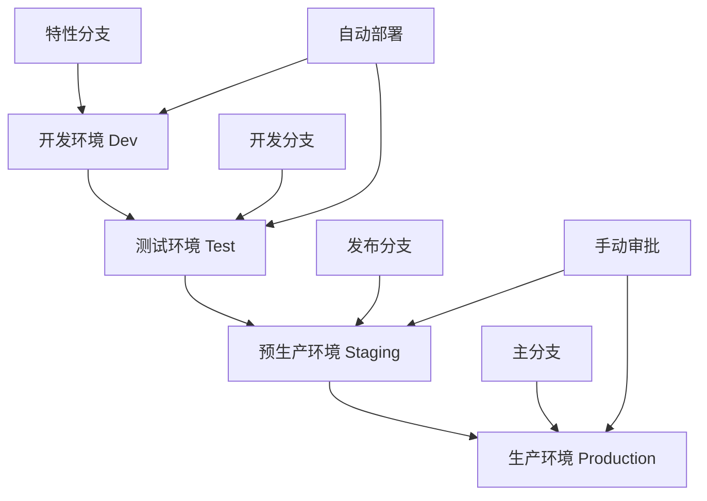

# Flutter 持续部署(CD)完整指南

## 📖 概述

持续部署(Continuous Deployment, CD)是DevOps流程的关键环节，通过自动化部署流程，实现代码从开发环境到生产环境的快速、可靠交付。本文档详细介绍Flutter应用的持续部署实践。

## 🎯 CD核心目标

- **自动化部署**: 减少人工干预，提高部署效率
- **环境一致性**: 确保各环境配置统一
- **快速回滚**: 出现问题时快速恢复
- **零停机部署**: 保证服务连续性
- **可追溯性**: 完整的部署历史记录

## 🏗 部署架构设计

### 1. 多环境架构



### 2. 部署流水线设计

```yaml
# 部署流水线配置
deployment_pipeline:
  stages:
    - name: build
      jobs:
        - compile_flutter_app
        - run_tests
        - security_scan
        
    - name: deploy_dev
      condition: branch == 'develop'
      jobs:
        - deploy_to_dev_environment
        - run_smoke_tests
        
    - name: deploy_staging
      condition: branch == 'release/*'
      approval_required: true
      jobs:
        - deploy_to_staging
        - run_integration_tests
        - performance_tests
        
    - name: deploy_production
      condition: branch == 'main'
      approval_required: true
      jobs:
        - blue_green_deployment
        - health_checks
        - rollback_on_failure
```

## 🚀 部署策略

### 1. 蓝绿部署(Blue-Green Deployment)

```yaml
# GitHub Actions - 蓝绿部署
name: Blue-Green Deployment

on:
  push:
    branches: [main]
    
env:
  CLUSTER_NAME: flutter-app-cluster
  SERVICE_NAME: flutter-app-service
  
jobs:
  blue-green-deploy:
    runs-on: ubuntu-latest
    
    steps:
      - name: Checkout code
        uses: actions/checkout@v4
        
      - name: Setup kubectl
        uses: azure/setup-kubectl@v3
        with:
          version: 'v1.28.0'
          
      - name: Configure AWS credentials
        uses: aws-actions/configure-aws-credentials@v2
        with:
          aws-access-key-id: ${{ secrets.AWS_ACCESS_KEY_ID }}
          aws-secret-access-key: ${{ secrets.AWS_SECRET_ACCESS_KEY }}
          aws-region: us-west-2
          
      - name: Update kubeconfig
        run: |
          aws eks update-kubeconfig --name ${{ env.CLUSTER_NAME }}
          
      - name: Build and push Docker image
        run: |
          # 构建新版本镜像
          docker build -t ${{ env.SERVICE_NAME }}:${{ github.sha }} .
          docker tag ${{ env.SERVICE_NAME }}:${{ github.sha }} ${{ env.SERVICE_NAME }}:green
          
          # 推送到镜像仓库
          docker push ${{ env.SERVICE_NAME }}:${{ github.sha }}
          docker push ${{ env.SERVICE_NAME }}:green
          
      - name: Deploy to Green environment
        run: |
          # 部署到Green环境
          kubectl set image deployment/flutter-app-green \
            flutter-app=${{ env.SERVICE_NAME }}:${{ github.sha }}
          
          # 等待部署完成
          kubectl rollout status deployment/flutter-app-green --timeout=300s
          
      - name: Health check Green environment
        run: |
          # 健康检查
          GREEN_URL=$(kubectl get service flutter-app-green-service -o jsonpath='{.status.loadBalancer.ingress[0].hostname}')
          
          for i in {1..30}; do
            if curl -f "http://$GREEN_URL/health"; then
              echo "Green environment is healthy"
              break
            fi
            echo "Waiting for Green environment... ($i/30)"
            sleep 10
          done
          
      - name: Switch traffic to Green
        run: |
          # 切换流量到Green环境
          kubectl patch service flutter-app-service \
            -p '{"spec":{"selector":{"version":"green"}}}'
          
          echo "Traffic switched to Green environment"
          
      - name: Verify deployment
        run: |
          # 验证部署
          sleep 30
          PROD_URL=$(kubectl get service flutter-app-service -o jsonpath='{.status.loadBalancer.ingress[0].hostname}')
          
          if curl -f "http://$PROD_URL/health"; then
            echo "Deployment successful"
          else
            echo "Deployment failed, initiating rollback"
            exit 1
          fi
          
      - name: Cleanup old Blue environment
        if: success()
        run: |
          # 清理旧的Blue环境
          kubectl delete deployment flutter-app-blue --ignore-not-found=true
          
          # 将当前Green标记为新的Blue
          kubectl label deployment flutter-app-green version=blue --overwrite
          kubectl label deployment flutter-app-green version-
          
      - name: Rollback on failure
        if: failure()
        run: |
          echo "Rolling back to Blue environment"
          kubectl patch service flutter-app-service \
            -p '{"spec":{"selector":{"version":"blue"}}}'
```

### 2. 金丝雀部署(Canary Deployment)

```yaml
# 金丝雀部署配置
name: Canary Deployment

on:
  push:
    branches: [main]
    
jobs:
  canary-deploy:
    runs-on: ubuntu-latest
    
    steps:
      - name: Checkout code
        uses: actions/checkout@v4
        
      - name: Deploy Canary (5% traffic)
        run: |
          # 部署金丝雀版本，分配5%流量
          kubectl apply -f k8s/canary-deployment.yaml
          
          # 配置流量分割
          kubectl apply -f - <<EOF
          apiVersion: networking.istio.io/v1beta1
          kind: VirtualService
          metadata:
            name: flutter-app-vs
          spec:
            http:
            - match:
              - headers:
                  canary:
                    exact: "true"
              route:
              - destination:
                  host: flutter-app-canary
                weight: 100
            - route:
              - destination:
                  host: flutter-app-stable
                weight: 95
              - destination:
                  host: flutter-app-canary
                weight: 5
          EOF
          
      - name: Monitor Canary metrics
        run: |
          # 监控金丝雀版本指标
          python scripts/monitor_canary.py --duration=300 --threshold=0.01
          
      - name: Gradually increase traffic
        run: |
          # 逐步增加流量：5% -> 25% -> 50% -> 100%
          for weight in 25 50 100; do
            echo "Increasing canary traffic to ${weight}%"
            
            kubectl apply -f - <<EOF
            apiVersion: networking.istio.io/v1beta1
            kind: VirtualService
            metadata:
              name: flutter-app-vs
            spec:
              http:
              - route:
                - destination:
                    host: flutter-app-stable
                  weight: $((100 - weight))
                - destination:
                    host: flutter-app-canary
                  weight: ${weight}
            EOF
            
            # 监控指标
            python scripts/monitor_canary.py --duration=180 --threshold=0.01
            
            if [ $? -ne 0 ]; then
              echo "Canary deployment failed, rolling back"
              kubectl apply -f k8s/stable-deployment.yaml
              exit 1
            fi
            
            sleep 60
          done
          
      - name: Promote Canary to Stable
        run: |
          # 将金丝雀版本提升为稳定版本
          kubectl label deployment flutter-app-canary version=stable --overwrite
          kubectl delete deployment flutter-app-stable
          kubectl patch service flutter-app-service \
            -p '{"spec":{"selector":{"version":"stable"}}}'
```

### 3. 滚动部署(Rolling Deployment)

```yaml
# Kubernetes滚动部署配置
apiVersion: apps/v1
kind: Deployment
metadata:
  name: flutter-app
  labels:
    app: flutter-app
spec:
  replicas: 6
  strategy:
    type: RollingUpdate
    rollingUpdate:
      maxUnavailable: 1      # 最多1个Pod不可用
      maxSurge: 2           # 最多额外创建2个Pod
  selector:
    matchLabels:
      app: flutter-app
  template:
    metadata:
      labels:
        app: flutter-app
    spec:
      containers:
      - name: flutter-app
        image: flutter-app:latest
        ports:
        - containerPort: 8080
        resources:
          requests:
            memory: "256Mi"
            cpu: "250m"
          limits:
            memory: "512Mi"
            cpu: "500m"
        livenessProbe:
          httpGet:
            path: /health
            port: 8080
          initialDelaySeconds: 30
          periodSeconds: 10
        readinessProbe:
          httpGet:
            path: /ready
            port: 8080
          initialDelaySeconds: 5
          periodSeconds: 5
---
apiVersion: v1
kind: Service
metadata:
  name: flutter-app-service
spec:
  selector:
    app: flutter-app
  ports:
  - protocol: TCP
    port: 80
    targetPort: 8080
  type: LoadBalancer
```

## 🌍 环境管理

### 1. 环境配置管理

```dart
// lib/config/environment.dart
enum Environment {
  development,
  testing,
  staging,
  production,
}

class EnvironmentConfig {
  static Environment _currentEnvironment = Environment.development;
  
  static Environment get currentEnvironment => _currentEnvironment;
  
  static void setEnvironment(Environment env) {
    _currentEnvironment = env;
  }
  
  static String get apiBaseUrl {
    switch (_currentEnvironment) {
      case Environment.development:
        return 'https://dev-api.example.com';
      case Environment.testing:
        return 'https://test-api.example.com';
      case Environment.staging:
        return 'https://staging-api.example.com';
      case Environment.production:
        return 'https://api.example.com';
    }
  }
  
  static String get databaseUrl {
    switch (_currentEnvironment) {
      case Environment.development:
        return 'dev-db.example.com';
      case Environment.testing:
        return 'test-db.example.com';
      case Environment.staging:
        return 'staging-db.example.com';
      case Environment.production:
        return 'prod-db.example.com';
    }
  }
  
  static bool get isDebugMode {
    return _currentEnvironment == Environment.development ||
           _currentEnvironment == Environment.testing;
  }
  
  static bool get enableAnalytics {
    return _currentEnvironment == Environment.staging ||
           _currentEnvironment == Environment.production;
  }
  
  static Map<String, dynamic> get firebaseConfig {
    switch (_currentEnvironment) {
      case Environment.development:
        return {
          'apiKey': 'dev-api-key',
          'projectId': 'flutter-app-dev',
          'appId': 'dev-app-id',
        };
      case Environment.testing:
        return {
          'apiKey': 'test-api-key',
          'projectId': 'flutter-app-test',
          'appId': 'test-app-id',
        };
      case Environment.staging:
        return {
          'apiKey': 'staging-api-key',
          'projectId': 'flutter-app-staging',
          'appId': 'staging-app-id',
        };
      case Environment.production:
        return {
          'apiKey': 'prod-api-key',
          'projectId': 'flutter-app-prod',
          'appId': 'prod-app-id',
        };
    }
  }
}

// lib/main.dart
import 'package:flutter/foundation.dart';
import 'config/environment.dart';

void main() {
  // 根据编译模式设置环境
  if (kDebugMode) {
    EnvironmentConfig.setEnvironment(Environment.development);
  } else if (kProfileMode) {
    EnvironmentConfig.setEnvironment(Environment.staging);
  } else {
    EnvironmentConfig.setEnvironment(Environment.production);
  }
  
  runApp(MyApp());
}
```

### 2. 配置文件管理

```yaml
# config/development.yaml
api:
  base_url: "https://dev-api.example.com"
  timeout: 30
  retry_count: 3

database:
  host: "dev-db.example.com"
  port: 5432
  name: "flutter_app_dev"

logging:
  level: "debug"
  enable_console: true
  enable_file: true

feature_flags:
  new_ui: true
  beta_features: true
  analytics: false

---
# config/production.yaml
api:
  base_url: "https://api.example.com"
  timeout: 10
  retry_count: 2

database:
  host: "prod-db.example.com"
  port: 5432
  name: "flutter_app_prod"

logging:
  level: "error"
  enable_console: false
  enable_file: true

feature_flags:
  new_ui: false
  beta_features: false
  analytics: true
```

```dart
// lib/config/config_loader.dart
import 'dart:convert';
import 'package:flutter/services.dart';
import 'package:yaml/yaml.dart';

class ConfigLoader {
  static Map<String, dynamic>? _config;
  
  static Future<void> loadConfig(String environment) async {
    try {
      final configString = await rootBundle.loadString('config/$environment.yaml');
      final yamlMap = loadYaml(configString);
      _config = Map<String, dynamic>.from(yamlMap);
    } catch (e) {
      throw Exception('Failed to load config for environment: $environment');
    }
  }
  
  static T getValue<T>(String key, {T? defaultValue}) {
    if (_config == null) {
      throw Exception('Config not loaded. Call loadConfig() first.');
    }
    
    final keys = key.split('.');
    dynamic value = _config;
    
    for (final k in keys) {
      if (value is Map && value.containsKey(k)) {
        value = value[k];
      } else {
        return defaultValue ?? (throw Exception('Config key not found: $key'));
      }
    }
    
    return value as T;
  }
  
  static String getString(String key, {String? defaultValue}) {
    return getValue<String>(key, defaultValue: defaultValue);
  }
  
  static int getInt(String key, {int? defaultValue}) {
    return getValue<int>(key, defaultValue: defaultValue);
  }
  
  static bool getBool(String key, {bool? defaultValue}) {
    return getValue<bool>(key, defaultValue: defaultValue);
  }
  
  static Map<String, dynamic> getMap(String key, {Map<String, dynamic>? defaultValue}) {
    return getValue<Map<String, dynamic>>(key, defaultValue: defaultValue);
  }
}
```

## 🔄 回滚策略

### 1. 自动回滚机制

```python
# scripts/auto_rollback.py
import requests
import time
import subprocess
import logging
from typing import Dict, List

class HealthChecker:
    def __init__(self, endpoints: List[str], thresholds: Dict[str, float]):
        self.endpoints = endpoints
        self.thresholds = thresholds
        self.logger = logging.getLogger(__name__)
        
    def check_health(self) -> bool:
        """检查应用健康状态"""
        for endpoint in self.endpoints:
            try:
                response = requests.get(f"{endpoint}/health", timeout=10)
                if response.status_code != 200:
                    self.logger.error(f"Health check failed for {endpoint}: {response.status_code}")
                    return False
                    
                # 检查响应时间
                if response.elapsed.total_seconds() > self.thresholds.get('response_time', 5.0):
                    self.logger.error(f"Response time too high for {endpoint}: {response.elapsed.total_seconds()}s")
                    return False
                    
            except requests.RequestException as e:
                self.logger.error(f"Health check failed for {endpoint}: {e}")
                return False
                
        return True
    
    def check_metrics(self) -> bool:
        """检查关键指标"""
        try:
            # 检查错误率
            error_rate = self._get_error_rate()
            if error_rate > self.thresholds.get('error_rate', 0.05):
                self.logger.error(f"Error rate too high: {error_rate}")
                return False
                
            # 检查响应时间
            avg_response_time = self._get_avg_response_time()
            if avg_response_time > self.thresholds.get('avg_response_time', 2.0):
                self.logger.error(f"Average response time too high: {avg_response_time}s")
                return False
                
            # 检查CPU使用率
            cpu_usage = self._get_cpu_usage()
            if cpu_usage > self.thresholds.get('cpu_usage', 0.8):
                self.logger.error(f"CPU usage too high: {cpu_usage}")
                return False
                
            return True
            
        except Exception as e:
            self.logger.error(f"Metrics check failed: {e}")
            return False
    
    def _get_error_rate(self) -> float:
        """获取错误率"""
        # 从监控系统获取错误率
        # 这里使用Prometheus作为示例
        query = 'rate(http_requests_total{status=~"5.."}[5m]) / rate(http_requests_total[5m])'
        result = self._query_prometheus(query)
        return float(result.get('value', [0, 0])[1])
    
    def _get_avg_response_time(self) -> float:
        """获取平均响应时间"""
        query = 'rate(http_request_duration_seconds_sum[5m]) / rate(http_request_duration_seconds_count[5m])'
        result = self._query_prometheus(query)
        return float(result.get('value', [0, 0])[1])
    
    def _get_cpu_usage(self) -> float:
        """获取CPU使用率"""
        query = 'avg(rate(container_cpu_usage_seconds_total[5m]))'
        result = self._query_prometheus(query)
        return float(result.get('value', [0, 0])[1])
    
    def _query_prometheus(self, query: str) -> Dict:
        """查询Prometheus"""
        prometheus_url = "http://prometheus:9090"
        response = requests.get(f"{prometheus_url}/api/v1/query", params={'query': query})
        return response.json().get('data', {}).get('result', [{}])[0]

class RollbackManager:
    def __init__(self, health_checker: HealthChecker):
        self.health_checker = health_checker
        self.logger = logging.getLogger(__name__)
        
    def monitor_deployment(self, monitoring_duration: int = 300) -> bool:
        """监控部署状态"""
        start_time = time.time()
        
        while time.time() - start_time < monitoring_duration:
            if not self.health_checker.check_health():
                self.logger.error("Health check failed, initiating rollback")
                return self.rollback()
                
            if not self.health_checker.check_metrics():
                self.logger.error("Metrics check failed, initiating rollback")
                return self.rollback()
                
            time.sleep(30)  # 每30秒检查一次
            
        self.logger.info("Deployment monitoring completed successfully")
        return True
    
    def rollback(self) -> bool:
        """执行回滚"""
        try:
            self.logger.info("Starting rollback process")
            
            # Kubernetes回滚
            result = subprocess.run([
                'kubectl', 'rollout', 'undo', 'deployment/flutter-app'
            ], capture_output=True, text=True)
            
            if result.returncode != 0:
                self.logger.error(f"Rollback failed: {result.stderr}")
                return False
                
            # 等待回滚完成
            result = subprocess.run([
                'kubectl', 'rollout', 'status', 'deployment/flutter-app', '--timeout=300s'
            ], capture_output=True, text=True)
            
            if result.returncode != 0:
                self.logger.error(f"Rollback status check failed: {result.stderr}")
                return False
                
            # 验证回滚后的健康状态
            time.sleep(60)  # 等待服务稳定
            if self.health_checker.check_health():
                self.logger.info("Rollback completed successfully")
                self._send_rollback_notification(True)
                return True
            else:
                self.logger.error("Rollback completed but health check still failing")
                self._send_rollback_notification(False)
                return False
                
        except Exception as e:
            self.logger.error(f"Rollback process failed: {e}")
            self._send_rollback_notification(False)
            return False
    
    def _send_rollback_notification(self, success: bool):
        """发送回滚通知"""
        status = "成功" if success else "失败"
        message = f"应用回滚{status}\n时间: {time.strftime('%Y-%m-%d %H:%M:%S')}"
        
        # 发送Slack通知
        webhook_url = "https://hooks.slack.com/services/YOUR/SLACK/WEBHOOK"
        payload = {
            "text": message,
            "color": "good" if success else "danger"
        }
        
        try:
            requests.post(webhook_url, json=payload)
        except Exception as e:
            self.logger.error(f"Failed to send notification: {e}")

if __name__ == "__main__":
    # 配置日志
    logging.basicConfig(level=logging.INFO)
    
    # 配置健康检查
    endpoints = [
        "https://api.example.com",
        "https://app.example.com"
    ]
    
    thresholds = {
        'response_time': 5.0,
        'error_rate': 0.05,
        'avg_response_time': 2.0,
        'cpu_usage': 0.8
    }
    
    health_checker = HealthChecker(endpoints, thresholds)
    rollback_manager = RollbackManager(health_checker)
    
    # 监控部署
    success = rollback_manager.monitor_deployment(monitoring_duration=600)
    
    if not success:
        exit(1)
```

### 2. 手动回滚脚本

```bash
#!/bin/bash
# scripts/manual_rollback.sh

set -e

# 配置变量
NAMESPACE="default"
DEPLOYMENT="flutter-app"
SERVICE="flutter-app-service"

# 颜色输出
RED='\033[0;31m'
GREEN='\033[0;32m'
YELLOW='\033[1;33m'
NC='\033[0m' # No Color

log_info() {
    echo -e "${GREEN}[INFO]${NC} $1"
}

log_warn() {
    echo -e "${YELLOW}[WARN]${NC} $1"
}

log_error() {
    echo -e "${RED}[ERROR]${NC} $1"
}

# 检查kubectl连接
check_kubectl() {
    log_info "检查kubectl连接..."
    if ! kubectl cluster-info &> /dev/null; then
        log_error "无法连接到Kubernetes集群"
        exit 1
    fi
    log_info "kubectl连接正常"
}

# 显示当前部署状态
show_current_status() {
    log_info "当前部署状态:"
    kubectl get deployment $DEPLOYMENT -n $NAMESPACE
    echo
    
    log_info "部署历史:"
    kubectl rollout history deployment/$DEPLOYMENT -n $NAMESPACE
    echo
}

# 选择回滚版本
select_rollback_version() {
    echo "请选择回滚选项:"
    echo "1) 回滚到上一个版本"
    echo "2) 回滚到指定版本"
    echo "3) 取消"
    
    read -p "请输入选项 (1-3): " choice
    
    case $choice in
        1)
            ROLLBACK_OPTION="--to-revision=0"
            log_info "将回滚到上一个版本"
            ;;
        2)
            kubectl rollout history deployment/$DEPLOYMENT -n $NAMESPACE
            read -p "请输入要回滚到的版本号: " revision
            ROLLBACK_OPTION="--to-revision=$revision"
            log_info "将回滚到版本 $revision"
            ;;
        3)
            log_info "取消回滚操作"
            exit 0
            ;;
        *)
            log_error "无效选项"
            exit 1
            ;;
    esac
}

# 执行回滚
perform_rollback() {
    log_info "开始回滚部署..."
    
    # 执行回滚
    if kubectl rollout undo deployment/$DEPLOYMENT -n $NAMESPACE $ROLLBACK_OPTION; then
        log_info "回滚命令执行成功"
    else
        log_error "回滚命令执行失败"
        exit 1
    fi
    
    # 等待回滚完成
    log_info "等待回滚完成..."
    if kubectl rollout status deployment/$DEPLOYMENT -n $NAMESPACE --timeout=300s; then
        log_info "回滚完成"
    else
        log_error "回滚超时或失败"
        exit 1
    fi
}

# 验证回滚结果
verify_rollback() {
    log_info "验证回滚结果..."
    
    # 检查Pod状态
    log_info "Pod状态:"
    kubectl get pods -l app=$DEPLOYMENT -n $NAMESPACE
    echo
    
    # 检查服务健康状态
    log_info "检查服务健康状态..."
    
    # 获取服务URL
    SERVICE_URL=$(kubectl get service $SERVICE -n $NAMESPACE -o jsonpath='{.status.loadBalancer.ingress[0].hostname}')
    
    if [ -z "$SERVICE_URL" ]; then
        SERVICE_URL=$(kubectl get service $SERVICE -n $NAMESPACE -o jsonpath='{.spec.clusterIP}')
        SERVICE_PORT=$(kubectl get service $SERVICE -n $NAMESPACE -o jsonpath='{.spec.ports[0].port}')
        SERVICE_URL="$SERVICE_URL:$SERVICE_PORT"
    fi
    
    # 健康检查
    for i in {1..10}; do
        if curl -f "http://$SERVICE_URL/health" &> /dev/null; then
            log_info "服务健康检查通过"
            break
        else
            log_warn "健康检查失败，重试中... ($i/10)"
            sleep 10
        fi
        
        if [ $i -eq 10 ]; then
            log_error "服务健康检查失败"
            exit 1
        fi
    done
}

# 发送通知
send_notification() {
    local status=$1
    local message="Flutter应用回滚${status}\n时间: $(date)\n环境: $NAMESPACE"
    
    # 发送Slack通知（如果配置了webhook）
    if [ ! -z "$SLACK_WEBHOOK_URL" ]; then
        curl -X POST -H 'Content-type: application/json' \
            --data "{\"text\":\"$message\"}" \
            $SLACK_WEBHOOK_URL
    fi
    
    # 发送邮件通知（如果配置了邮件服务）
    if command -v mail &> /dev/null && [ ! -z "$NOTIFICATION_EMAIL" ]; then
        echo -e "$message" | mail -s "Flutter应用回滚通知" $NOTIFICATION_EMAIL
    fi
}

# 主函数
main() {
    log_info "Flutter应用回滚脚本"
    echo "================================"
    
    check_kubectl
    show_current_status
    
    # 确认回滚操作
    read -p "确认要执行回滚操作吗? (y/N): " confirm
    if [[ ! $confirm =~ ^[Yy]$ ]]; then
        log_info "取消回滚操作"
        exit 0
    fi
    
    select_rollback_version
    perform_rollback
    verify_rollback
    
    log_info "回滚操作完成"
    send_notification "成功"
}

# 错误处理
trap 'log_error "回滚过程中发生错误"; send_notification "失败"; exit 1' ERR

# 执行主函数
main "$@"
```

## 📊 部署监控

### 1. 部署指标监控

```python
# scripts/deployment_monitor.py
import time
import requests
import json
from datetime import datetime
from typing import Dict, List, Optional

class DeploymentMonitor:
    def __init__(self, config: Dict):
        self.config = config
        self.prometheus_url = config['prometheus_url']
        self.grafana_url = config['grafana_url']
        self.alert_thresholds = config['alert_thresholds']
        
    def collect_metrics(self) -> Dict:
        """收集部署相关指标"""
        metrics = {}
        
        # 应用健康状态
        metrics['health_status'] = self._get_health_status()
        
        # 响应时间指标
        metrics['response_time'] = self._get_response_time_metrics()
        
        # 错误率指标
        metrics['error_rate'] = self._get_error_rate_metrics()
        
        # 吞吐量指标
        metrics['throughput'] = self._get_throughput_metrics()
        
        # 资源使用指标
        metrics['resource_usage'] = self._get_resource_usage_metrics()
        
        # 部署状态指标
        metrics['deployment_status'] = self._get_deployment_status()
        
        return metrics
    
    def _get_health_status(self) -> Dict:
        """获取应用健康状态"""
        query = 'up{job="flutter-app"}'
        result = self._query_prometheus(query)
        
        healthy_instances = sum(1 for r in result if float(r['value'][1]) == 1)
        total_instances = len(result)
        
        return {
            'healthy_instances': healthy_instances,
            'total_instances': total_instances,
            'health_percentage': (healthy_instances / total_instances * 100) if total_instances > 0 else 0
        }
    
    def _get_response_time_metrics(self) -> Dict:
        """获取响应时间指标"""
        queries = {
            'avg': 'avg(rate(http_request_duration_seconds_sum[5m]) / rate(http_request_duration_seconds_count[5m]))',
            'p50': 'histogram_quantile(0.5, rate(http_request_duration_seconds_bucket[5m]))',
            'p95': 'histogram_quantile(0.95, rate(http_request_duration_seconds_bucket[5m]))',
            'p99': 'histogram_quantile(0.99, rate(http_request_duration_seconds_bucket[5m]))'
        }
        
        metrics = {}
        for name, query in queries.items():
            result = self._query_prometheus(query)
            metrics[name] = float(result[0]['value'][1]) if result else 0
            
        return metrics
    
    def _get_error_rate_metrics(self) -> Dict:
        """获取错误率指标"""
        error_query = 'rate(http_requests_total{status=~"5.."}[5m])'
        total_query = 'rate(http_requests_total[5m])'
        
        error_result = self._query_prometheus(error_query)
        total_result = self._query_prometheus(total_query)
        
        error_rate = 0
        if error_result and total_result:
            errors = sum(float(r['value'][1]) for r in error_result)
            total = sum(float(r['value'][1]) for r in total_result)
            error_rate = (errors / total * 100) if total > 0 else 0
            
        return {
            'error_rate_percentage': error_rate,
            'errors_per_second': sum(float(r['value'][1]) for r in error_result) if error_result else 0
        }
    
    def _get_throughput_metrics(self) -> Dict:
        """获取吞吐量指标"""
        query = 'rate(http_requests_total[5m])'
        result = self._query_prometheus(query)
        
        throughput = sum(float(r['value'][1]) for r in result) if result else 0
        
        return {
            'requests_per_second': throughput
        }
    
    def _get_resource_usage_metrics(self) -> Dict:
        """获取资源使用指标"""
        queries = {
            'cpu_usage': 'avg(rate(container_cpu_usage_seconds_total{pod=~"flutter-app-.*"}[5m])) * 100',
            'memory_usage': 'avg(container_memory_usage_bytes{pod=~"flutter-app-.*"}) / 1024 / 1024',
            'disk_usage': 'avg(container_fs_usage_bytes{pod=~"flutter-app-.*"}) / 1024 / 1024 / 1024'
        }
        
        metrics = {}
        for name, query in queries.items():
            result = self._query_prometheus(query)
            metrics[name] = float(result[0]['value'][1]) if result else 0
            
        return metrics
    
    def _get_deployment_status(self) -> Dict:
        """获取部署状态"""
        queries = {
            'desired_replicas': 'kube_deployment_spec_replicas{deployment="flutter-app"}',
            'available_replicas': 'kube_deployment_status_replicas_available{deployment="flutter-app"}',
            'ready_replicas': 'kube_deployment_status_replicas_ready{deployment="flutter-app"}'
        }
        
        metrics = {}
        for name, query in queries.items():
            result = self._query_prometheus(query)
            metrics[name] = int(float(result[0]['value'][1])) if result else 0
            
        return metrics
    
    def _query_prometheus(self, query: str) -> List[Dict]:
        """查询Prometheus"""
        try:
            response = requests.get(
                f"{self.prometheus_url}/api/v1/query",
                params={'query': query},
                timeout=10
            )
            response.raise_for_status()
            return response.json()['data']['result']
        except Exception as e:
            print(f"Prometheus query failed: {e}")
            return []
    
    def check_alerts(self, metrics: Dict) -> List[Dict]:
        """检查告警条件"""
        alerts = []
        
        # 健康状态告警
        health_percentage = metrics['health_status']['health_percentage']
        if health_percentage < self.alert_thresholds['health_percentage']:
            alerts.append({
                'type': 'health',
                'severity': 'critical',
                'message': f'应用健康状态低于阈值: {health_percentage:.1f}%',
                'value': health_percentage,
                'threshold': self.alert_thresholds['health_percentage']
            })
        
        # 响应时间告警
        avg_response_time = metrics['response_time']['avg']
        if avg_response_time > self.alert_thresholds['avg_response_time']:
            alerts.append({
                'type': 'response_time',
                'severity': 'warning',
                'message': f'平均响应时间过高: {avg_response_time:.3f}s',
                'value': avg_response_time,
                'threshold': self.alert_thresholds['avg_response_time']
            })
        
        # 错误率告警
        error_rate = metrics['error_rate']['error_rate_percentage']
        if error_rate > self.alert_thresholds['error_rate']:
            alerts.append({
                'type': 'error_rate',
                'severity': 'critical',
                'message': f'错误率过高: {error_rate:.2f}%',
                'value': error_rate,
                'threshold': self.alert_thresholds['error_rate']
            })
        
        # CPU使用率告警
        cpu_usage = metrics['resource_usage']['cpu_usage']
        if cpu_usage > self.alert_thresholds['cpu_usage']:
            alerts.append({
                'type': 'cpu_usage',
                'severity': 'warning',
                'message': f'CPU使用率过高: {cpu_usage:.1f}%',
                'value': cpu_usage,
                'threshold': self.alert_thresholds['cpu_usage']
            })
        
        return alerts
    
    def generate_report(self, metrics: Dict, alerts: List[Dict]) -> str:
        """生成监控报告"""
        report = f"""
# Flutter应用部署监控报告

**生成时间**: {datetime.now().strftime('%Y-%m-%d %H:%M:%S')}

## 应用健康状态
- 健康实例: {metrics['health_status']['healthy_instances']}/{metrics['health_status']['total_instances']}
- 健康百分比: {metrics['health_status']['health_percentage']:.1f}%

## 性能指标
- 平均响应时间: {metrics['response_time']['avg']:.3f}s
- P95响应时间: {metrics['response_time']['p95']:.3f}s
- P99响应时间: {metrics['response_time']['p99']:.3f}s
- 错误率: {metrics['error_rate']['error_rate_percentage']:.2f}%
- 吞吐量: {metrics['throughput']['requests_per_second']:.1f} req/s

## 资源使用
- CPU使用率: {metrics['resource_usage']['cpu_usage']:.1f}%
- 内存使用: {metrics['resource_usage']['memory_usage']:.1f} MB
- 磁盘使用: {metrics['resource_usage']['disk_usage']:.1f} GB

## 部署状态
- 期望副本数: {metrics['deployment_status']['desired_replicas']}
- 可用副本数: {metrics['deployment_status']['available_replicas']}
- 就绪副本数: {metrics['deployment_status']['ready_replicas']}
"""
        
        if alerts:
            report += "\n## 告警信息\n"
            for alert in alerts:
                report += f"- **{alert['severity'].upper()}**: {alert['message']}\n"
        else:
            report += "\n## 告警信息\n- 无告警\n"
            
        return report

if __name__ == "__main__":
    config = {
        'prometheus_url': 'http://prometheus:9090',
        'grafana_url': 'http://grafana:3000',
        'alert_thresholds': {
            'health_percentage': 90,
            'avg_response_time': 2.0,
            'error_rate': 5.0,
            'cpu_usage': 80.0
        }
    }
    
    monitor = DeploymentMonitor(config)
    
    # 收集指标
    metrics = monitor.collect_metrics()
    
    # 检查告警
    alerts = monitor.check_alerts(metrics)
    
    # 生成报告
    report = monitor.generate_report(metrics, alerts)
    
    print(report)
    
    # 如果有告警，发送通知
    if alerts:
        # 发送告警通知的逻辑
        pass
```

## 🚀 最佳实践

### 1. 部署策略选择

- **蓝绿部署**: 适用于关键业务系统，需要零停机时间
- **金丝雀部署**: 适用于风险控制要求高的场景
- **滚动部署**: 适用于一般业务系统，资源利用率高
- **A/B测试**: 适用于需要验证新功能效果的场景

### 2. 环境管理原则

- **环境隔离**: 各环境完全独立，避免相互影响
- **配置管理**: 使用配置中心统一管理环境配置
- **数据隔离**: 各环境使用独立的数据库和存储
- **访问控制**: 严格控制生产环境访问权限

### 3. 回滚策略设计

- **自动回滚**: 基于健康检查和指标监控的自动回滚
- **快速回滚**: 保持上一版本的完整部署，支持快速切换
- **数据回滚**: 考虑数据库变更的回滚策略
- **通知机制**: 及时通知相关人员回滚状态

### 4. 监控告警体系

- **多层监控**: 应用层、基础设施层、业务层监控
- **实时告警**: 关键指标异常时立即告警
- **告警分级**: 根据严重程度分级处理
- **告警收敛**: 避免告警风暴，合理收敛告警

通过系统的持续部署实践，可以实现Flutter应用的快速、可靠、安全的自动化部署，显著提升交付效率和系统稳定性。