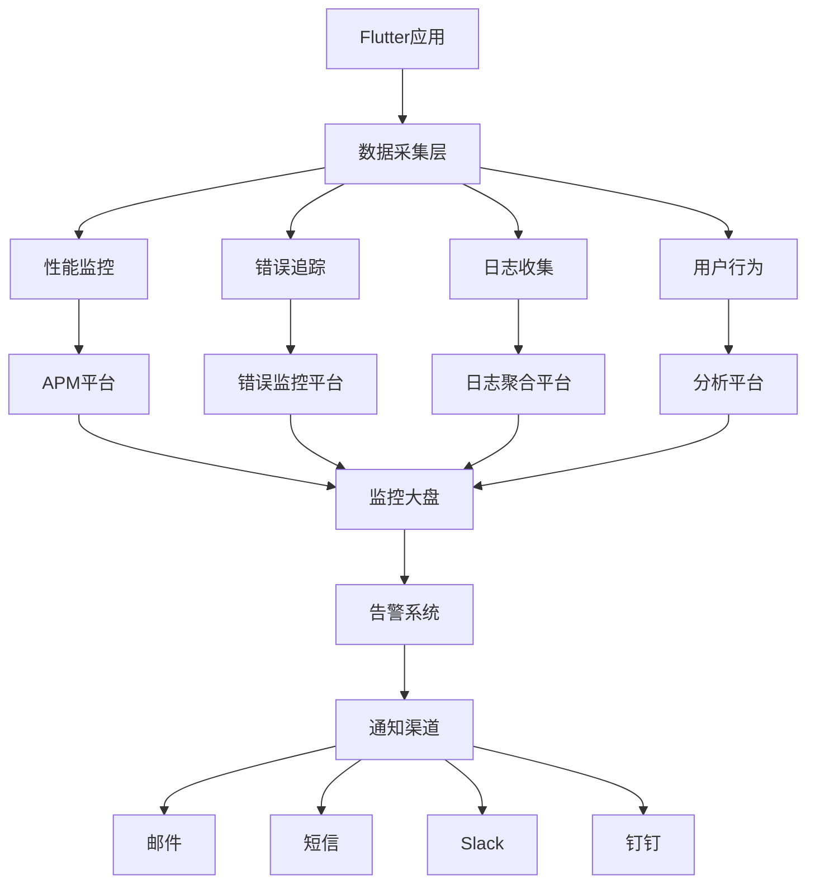

# Flutter 监控运维完整指南

## 📖 概述

监控运维是保障Flutter应用稳定运行的关键环节，涉及应用性能监控、错误追踪、日志管理、告警通知等多个方面。本文档详细介绍Flutter应用的监控运维策略和最佳实践。

## 🎯 监控架构设计



## 📊 应用性能监控

### 1. Firebase Performance Monitoring

```dart
// lib/monitoring/firebase_performance.dart
import 'package:firebase_performance/firebase_performance.dart';

class FirebasePerformanceMonitoring {
  static FirebasePerformance? _performance;
  
  /// 初始化性能监控
  static Future<void> initialize() async {
    _performance = FirebasePerformance.instance;
    
    // 启用性能监控
    await _performance!.setPerformanceCollectionEnabled(true);
    
    // 设置自定义属性
    await _setCustomAttributes();
  }
  
  /// 设置自定义属性
  static Future<void> _setCustomAttributes() async {
    // 可以添加用户ID、版本号等自定义属性
  }
  
  /// 创建自定义跟踪
  static Trace createTrace(String name) {
    return _performance!.newTrace(name);
  }
  
  /// 跟踪方法执行时间
  static Future<T> traceMethod<T>(
    String traceName,
    Future<T> Function() method, {
    Map<String, String>? attributes,
  }) async {
    final trace = createTrace(traceName);
    
    // 添加自定义属性
    if (attributes != null) {
      for (final entry in attributes.entries) {
        trace.putAttribute(entry.key, entry.value);
      }
    }
    
    await trace.start();
    
    try {
      final result = await method();
      await trace.stop();
      return result;
    } catch (e) {
      // 记录错误信息
      trace.putAttribute('error', e.toString());
      await trace.stop();
      rethrow;
    }
  }
  
  /// 跟踪网络请求
  static HttpMetric createHttpMetric(String url, HttpMethod method) {
    return _performance!.newHttpMetric(url, method);
  }
  
  /// 跟踪页面加载时间
  static Future<void> trackScreenView(String screenName) async {
    final trace = createTrace('screen_view_$screenName');
    trace.putAttribute('screen_name', screenName);
    
    await trace.start();
    
    // 在页面销毁时停止跟踪
    // 这通常在页面的dispose方法中调用
    // await trace.stop();
  }
}

// 使用示例
class ApiService {
  static Future<Map<String, dynamic>> fetchUserData(String userId) async {
    return await FirebasePerformanceMonitoring.traceMethod(
      'fetch_user_data',
      () async {
        final httpMetric = FirebasePerformanceMonitoring.createHttpMetric(
          'https://api.example.com/users/$userId',
          HttpMethod.Get,
        );
        
        await httpMetric.start();
        
        try {
          final response = await http.get(
            Uri.parse('https://api.example.com/users/$userId'),
          );
          
          httpMetric.responseCode = response.statusCode;
          httpMetric.responsePayloadSize = response.bodyBytes.length;
          
          await httpMetric.stop();
          
          return json.decode(response.body);
        } catch (e) {
          await httpMetric.stop();
          rethrow;
        }
      },
      attributes: {
        'user_id': userId,
        'api_version': 'v1',
      },
    );
  }
}
```

### 2. 自定义性能监控

```dart
// lib/monitoring/performance_monitor.dart
class PerformanceMonitor {
  static final Map<String, Stopwatch> _stopwatches = {};
  static final List<PerformanceMetric> _metrics = [];
  
  /// 开始性能监控
  static void startTimer(String name) {
    _stopwatches[name] = Stopwatch()..start();
  }
  
  /// 停止性能监控
  static Duration? stopTimer(String name) {
    final stopwatch = _stopwatches.remove(name);
    if (stopwatch != null) {
      stopwatch.stop();
      final duration = stopwatch.elapsed;
      
      // 记录性能指标
      _recordMetric(PerformanceMetric(
        name: name,
        duration: duration,
        timestamp: DateTime.now(),
      ));
      
      return duration;
    }
    return null;
  }
  
  /// 记录性能指标
  static void _recordMetric(PerformanceMetric metric) {
    _metrics.add(metric);
    
    // 限制内存中保存的指标数量
    if (_metrics.length > 1000) {
      _metrics.removeRange(0, 500);
    }
    
    // 发送到监控服务
    _sendToMonitoringService(metric);
  }
  
  /// 发送到监控服务
  static void _sendToMonitoringService(PerformanceMetric metric) {
    // 异步发送，避免影响应用性能
    Future.microtask(() async {
      try {
        await http.post(
          Uri.parse('https://monitoring.example.com/metrics'),
          headers: {'Content-Type': 'application/json'},
          body: json.encode(metric.toJson()),
        );
      } catch (e) {
        print('发送性能指标失败: $e');
      }
    });
  }
  
  /// 获取性能统计
  static PerformanceStats getStats(String name) {
    final relevantMetrics = _metrics
        .where((metric) => metric.name == name)
        .toList();
    
    if (relevantMetrics.isEmpty) {
      return PerformanceStats.empty(name);
    }
    
    final durations = relevantMetrics
        .map((metric) => metric.duration.inMilliseconds)
        .toList();
    
    durations.sort();
    
    return PerformanceStats(
      name: name,
      count: durations.length,
      average: durations.reduce((a, b) => a + b) / durations.length,
      median: durations[durations.length ~/ 2].toDouble(),
      p95: durations[(durations.length * 0.95).floor()].toDouble(),
      p99: durations[(durations.length * 0.99).floor()].toDouble(),
      min: durations.first.toDouble(),
      max: durations.last.toDouble(),
    );
  }
  
  /// 监控Widget构建时间
  static Widget monitorWidget({
    required String name,
    required Widget child,
  }) {
    return _PerformanceMonitorWidget(
      name: name,
      child: child,
    );
  }
  
  /// 监控异步操作
  static Future<T> monitorAsync<T>(
    String name,
    Future<T> Function() operation,
  ) async {
    startTimer(name);
    try {
      final result = await operation();
      stopTimer(name);
      return result;
    } catch (e) {
      stopTimer(name);
      rethrow;
    }
  }
}

class _PerformanceMonitorWidget extends StatefulWidget {
  final String name;
  final Widget child;
  
  const _PerformanceMonitorWidget({
    required this.name,
    required this.child,
  });
  
  @override
  _PerformanceMonitorWidgetState createState() =>
      _PerformanceMonitorWidgetState();
}

class _PerformanceMonitorWidgetState extends State<_PerformanceMonitorWidget> {
  @override
  void initState() {
    super.initState();
    PerformanceMonitor.startTimer('widget_build_${widget.name}');
  }
  
  @override
  void dispose() {
    PerformanceMonitor.stopTimer('widget_build_${widget.name}');
    super.dispose();
  }
  
  @override
  Widget build(BuildContext context) {
    return widget.child;
  }
}

class PerformanceMetric {
  final String name;
  final Duration duration;
  final DateTime timestamp;
  final Map<String, dynamic>? metadata;
  
  PerformanceMetric({
    required this.name,
    required this.duration,
    required this.timestamp,
    this.metadata,
  });
  
  Map<String, dynamic> toJson() {
    return {
      'name': name,
      'duration_ms': duration.inMilliseconds,
      'timestamp': timestamp.toIso8601String(),
      'metadata': metadata,
    };
  }
}

class PerformanceStats {
  final String name;
  final int count;
  final double average;
  final double median;
  final double p95;
  final double p99;
  final double min;
  final double max;
  
  PerformanceStats({
    required this.name,
    required this.count,
    required this.average,
    required this.median,
    required this.p95,
    required this.p99,
    required this.min,
    required this.max,
  });
  
  factory PerformanceStats.empty(String name) {
    return PerformanceStats(
      name: name,
      count: 0,
      average: 0,
      median: 0,
      p95: 0,
      p99: 0,
      min: 0,
      max: 0,
    );
  }
}
```

### 3. 内存监控

```dart
// lib/monitoring/memory_monitor.dart
class MemoryMonitor {
  static Timer? _timer;
  static final List<MemoryInfo> _memoryHistory = [];
  
  /// 开始内存监控
  static void startMonitoring({Duration interval = const Duration(seconds: 30)}) {
    _timer?.cancel();
    
    _timer = Timer.periodic(interval, (timer) {
      _collectMemoryInfo();
    });
  }
  
  /// 停止内存监控
  static void stopMonitoring() {
    _timer?.cancel();
    _timer = null;
  }
  
  /// 收集内存信息
  static Future<void> _collectMemoryInfo() async {
    try {
      final memoryInfo = await _getMemoryInfo();
      _memoryHistory.add(memoryInfo);
      
      // 限制历史记录数量
      if (_memoryHistory.length > 100) {
        _memoryHistory.removeRange(0, 50);
      }
      
      // 检查内存泄漏
      _checkMemoryLeak(memoryInfo);
      
      // 发送到监控服务
      _sendMemoryInfo(memoryInfo);
    } catch (e) {
      print('收集内存信息失败: $e');
    }
  }
  
  /// 获取内存信息
  static Future<MemoryInfo> _getMemoryInfo() async {
    final info = await DeviceInfoPlugin().androidInfo;
    
    return MemoryInfo(
      timestamp: DateTime.now(),
      usedMemory: _getUsedMemory(),
      totalMemory: _getTotalMemory(),
      availableMemory: _getAvailableMemory(),
    );
  }
  
  /// 获取已使用内存
  static int _getUsedMemory() {
    // 这里需要使用平台特定的方法获取内存信息
    // 可以使用MethodChannel调用原生代码
    return 0;
  }
  
  /// 获取总内存
  static int _getTotalMemory() {
    return 0;
  }
  
  /// 获取可用内存
  static int _getAvailableMemory() {
    return 0;
  }
  
  /// 检查内存泄漏
  static void _checkMemoryLeak(MemoryInfo currentInfo) {
    if (_memoryHistory.length < 10) return;
    
    final recentHistory = _memoryHistory.takeLast(10).toList();
    final memoryGrowth = currentInfo.usedMemory - recentHistory.first.usedMemory;
    
    // 如果内存持续增长超过阈值，可能存在内存泄漏
    if (memoryGrowth > 50 * 1024 * 1024) { // 50MB
      _reportMemoryLeak(memoryGrowth);
    }
  }
  
  /// 报告内存泄漏
  static void _reportMemoryLeak(int memoryGrowth) {
    final leak = MemoryLeak(
      timestamp: DateTime.now(),
      memoryGrowth: memoryGrowth,
      stackTrace: StackTrace.current.toString(),
    );
    
    // 发送内存泄漏报告
    _sendMemoryLeak(leak);
  }
  
  /// 发送内存信息
  static void _sendMemoryInfo(MemoryInfo info) {
    Future.microtask(() async {
      try {
        await http.post(
          Uri.parse('https://monitoring.example.com/memory'),
          headers: {'Content-Type': 'application/json'},
          body: json.encode(info.toJson()),
        );
      } catch (e) {
        print('发送内存信息失败: $e');
      }
    });
  }
  
  /// 发送内存泄漏报告
  static void _sendMemoryLeak(MemoryLeak leak) {
    Future.microtask(() async {
      try {
        await http.post(
          Uri.parse('https://monitoring.example.com/memory-leak'),
          headers: {'Content-Type': 'application/json'},
          body: json.encode(leak.toJson()),
        );
      } catch (e) {
        print('发送内存泄漏报告失败: $e');
      }
    });
  }
  
  /// 获取内存统计
  static MemoryStats getMemoryStats() {
    if (_memoryHistory.isEmpty) {
      return MemoryStats.empty();
    }
    
    final usedMemoryList = _memoryHistory
        .map((info) => info.usedMemory)
        .toList();
    
    return MemoryStats(
      averageUsed: usedMemoryList.reduce((a, b) => a + b) / usedMemoryList.length,
      maxUsed: usedMemoryList.reduce(math.max),
      minUsed: usedMemoryList.reduce(math.min),
      currentUsed: _memoryHistory.last.usedMemory.toDouble(),
      sampleCount: _memoryHistory.length,
    );
  }
}

class MemoryInfo {
  final DateTime timestamp;
  final int usedMemory;
  final int totalMemory;
  final int availableMemory;
  
  MemoryInfo({
    required this.timestamp,
    required this.usedMemory,
    required this.totalMemory,
    required this.availableMemory,
  });
  
  Map<String, dynamic> toJson() {
    return {
      'timestamp': timestamp.toIso8601String(),
      'used_memory': usedMemory,
      'total_memory': totalMemory,
      'available_memory': availableMemory,
    };
  }
}

class MemoryLeak {
  final DateTime timestamp;
  final int memoryGrowth;
  final String stackTrace;
  
  MemoryLeak({
    required this.timestamp,
    required this.memoryGrowth,
    required this.stackTrace,
  });
  
  Map<String, dynamic> toJson() {
    return {
      'timestamp': timestamp.toIso8601String(),
      'memory_growth': memoryGrowth,
      'stack_trace': stackTrace,
    };
  }
}

class MemoryStats {
  final double averageUsed;
  final int maxUsed;
  final int minUsed;
  final double currentUsed;
  final int sampleCount;
  
  MemoryStats({
    required this.averageUsed,
    required this.maxUsed,
    required this.minUsed,
    required this.currentUsed,
    required this.sampleCount,
  });
  
  factory MemoryStats.empty() {
    return MemoryStats(
      averageUsed: 0,
      maxUsed: 0,
      minUsed: 0,
      currentUsed: 0,
      sampleCount: 0,
    );
  }
}
```

## 🐛 错误监控

### 1. Firebase Crashlytics

```dart
// lib/monitoring/crashlytics_service.dart
import 'package:firebase_crashlytics/firebase_crashlytics.dart';

class CrashlyticsService {
  static FirebaseCrashlytics? _crashlytics;
  
  /// 初始化Crashlytics
  static Future<void> initialize() async {
    _crashlytics = FirebaseCrashlytics.instance;
    
    // 在调试模式下禁用Crashlytics
    if (kDebugMode) {
      await _crashlytics!.setCrashlyticsCollectionEnabled(false);
    } else {
      await _crashlytics!.setCrashlyticsCollectionEnabled(true);
    }
    
    // 设置全局错误处理
    FlutterError.onError = (FlutterErrorDetails details) {
      _crashlytics!.recordFlutterFatalError(details);
    };
    
    // 设置异步错误处理
    PlatformDispatcher.instance.onError = (error, stack) {
      _crashlytics!.recordError(error, stack, fatal: true);
      return true;
    };
  }
  
  /// 记录非致命错误
  static Future<void> recordError(
    dynamic exception,
    StackTrace? stackTrace, {
    String? reason,
    Map<String, dynamic>? information,
    bool fatal = false,
  }) async {
    await _crashlytics?.recordError(
      exception,
      stackTrace,
      reason: reason,
      information: information,
      fatal: fatal,
    );
  }
  
  /// 记录自定义日志
  static Future<void> log(String message) async {
    await _crashlytics?.log(message);
  }
  
  /// 设置用户标识符
  static Future<void> setUserIdentifier(String identifier) async {
    await _crashlytics?.setUserIdentifier(identifier);
  }
  
  /// 设置自定义键值
  static Future<void> setCustomKey(String key, Object value) async {
    await _crashlytics?.setCustomKey(key, value);
  }
  
  /// 设置用户信息
  static Future<void> setUserInfo({
    String? userId,
    String? email,
    String? name,
  }) async {
    if (userId != null) {
      await setUserIdentifier(userId);
    }
    if (email != null) {
      await setCustomKey('user_email', email);
    }
    if (name != null) {
      await setCustomKey('user_name', name);
    }
  }
  
  /// 强制发送崩溃报告
  static Future<void> sendUnsentReports() async {
    await _crashlytics?.sendUnsentReports();
  }
  
  /// 检查是否有未发送的崩溃报告
  static Future<bool> checkForUnsentReports() async {
    return await _crashlytics?.checkForUnsentReports() ?? false;
  }
  
  /// 删除未发送的崩溃报告
  static Future<void> deleteUnsentReports() async {
    await _crashlytics?.deleteUnsentReports();
  }
}

// 错误边界Widget
class ErrorBoundary extends StatefulWidget {
  final Widget child;
  final Widget Function(FlutterErrorDetails)? errorBuilder;
  final void Function(FlutterErrorDetails)? onError;
  
  const ErrorBoundary({
    Key? key,
    required this.child,
    this.errorBuilder,
    this.onError,
  }) : super(key: key);
  
  @override
  _ErrorBoundaryState createState() => _ErrorBoundaryState();
}

class _ErrorBoundaryState extends State<ErrorBoundary> {
  FlutterErrorDetails? _errorDetails;
  
  @override
  void initState() {
    super.initState();
    
    // 捕获子Widget的错误
    FlutterError.onError = (FlutterErrorDetails details) {
      setState(() {
        _errorDetails = details;
      });
      
      // 记录错误到Crashlytics
      CrashlyticsService.recordError(
        details.exception,
        details.stack,
        reason: details.context?.toString(),
        information: {
          'library': details.library,
          'context': details.context?.toString(),
        },
      );
      
      // 调用自定义错误处理
      widget.onError?.call(details);
    };
  }
  
  @override
  Widget build(BuildContext context) {
    if (_errorDetails != null) {
      return widget.errorBuilder?.call(_errorDetails!) ??
          _DefaultErrorWidget(errorDetails: _errorDetails!);
    }
    
    return widget.child;
  }
}

class _DefaultErrorWidget extends StatelessWidget {
  final FlutterErrorDetails errorDetails;
  
  const _DefaultErrorWidget({required this.errorDetails});
  
  @override
  Widget build(BuildContext context) {
    return Scaffold(
      appBar: AppBar(
        title: const Text('出现错误'),
        backgroundColor: Colors.red,
      ),
      body: Padding(
        padding: const EdgeInsets.all(16.0),
        child: Column(
          crossAxisAlignment: CrossAxisAlignment.start,
          children: [
            const Icon(
              Icons.error_outline,
              size: 64,
              color: Colors.red,
            ),
            const SizedBox(height: 16),
            const Text(
              '应用遇到了一个错误',
              style: TextStyle(
                fontSize: 18,
                fontWeight: FontWeight.bold,
              ),
            ),
            const SizedBox(height: 8),
            const Text(
              '我们已经记录了这个错误，并会尽快修复。',
              style: TextStyle(fontSize: 14),
            ),
            const SizedBox(height: 16),
            if (kDebugMode) ..[
              const Text(
                '错误详情（仅在调试模式下显示）:',
                style: TextStyle(
                  fontSize: 14,
                  fontWeight: FontWeight.bold,
                ),
              ),
              const SizedBox(height: 8),
              Expanded(
                child: SingleChildScrollView(
                  child: Text(
                    errorDetails.toString(),
                    style: const TextStyle(
                      fontSize: 12,
                      fontFamily: 'monospace',
                    ),
                  ),
                ),
              ),
            ],
            const SizedBox(height: 16),
            Row(
              children: [
                ElevatedButton(
                  onPressed: () {
                    // 重启应用
                    Phoenix.rebirth(context);
                  },
                  child: const Text('重启应用'),
                ),
                const SizedBox(width: 8),
                TextButton(
                  onPressed: () {
                    // 发送错误报告
                    _sendErrorReport();
                  },
                  child: const Text('发送错误报告'),
                ),
              ],
            ),
          ],
        ),
      ),
    );
  }
  
  void _sendErrorReport() {
    CrashlyticsService.sendUnsentReports();
    // 显示发送成功提示
  }
}
```

### 2. 自定义错误监控

```dart
// lib/monitoring/error_monitor.dart
class ErrorMonitor {
  static final List<ErrorInfo> _errors = [];
  static const int _maxErrors = 100;
  
  /// 记录错误
  static void recordError(
    dynamic error,
    StackTrace? stackTrace, {
    String? context,
    Map<String, dynamic>? metadata,
    ErrorSeverity severity = ErrorSeverity.error,
  }) {
    final errorInfo = ErrorInfo(
      error: error,
      stackTrace: stackTrace,
      context: context,
      metadata: metadata,
      severity: severity,
      timestamp: DateTime.now(),
    );
    
    _errors.add(errorInfo);
    
    // 限制错误数量
    if (_errors.length > _maxErrors) {
      _errors.removeRange(0, _maxErrors ~/ 2);
    }
    
    // 发送到监控服务
    _sendErrorToService(errorInfo);
    
    // 根据严重程度决定是否立即通知
    if (severity == ErrorSeverity.critical) {
      _sendImmediateAlert(errorInfo);
    }
  }
  
  /// 发送错误到监控服务
  static void _sendErrorToService(ErrorInfo errorInfo) {
    Future.microtask(() async {
      try {
        await http.post(
          Uri.parse('https://monitoring.example.com/errors'),
          headers: {'Content-Type': 'application/json'},
          body: json.encode(errorInfo.toJson()),
        );
      } catch (e) {
        print('发送错误信息失败: $e');
      }
    });
  }
  
  /// 发送紧急告警
  static void _sendImmediateAlert(ErrorInfo errorInfo) {
    Future.microtask(() async {
      try {
        await http.post(
          Uri.parse('https://monitoring.example.com/alerts'),
          headers: {'Content-Type': 'application/json'},
          body: json.encode({
            'type': 'critical_error',
            'message': 'Critical error occurred in Flutter app',
            'error': errorInfo.toJson(),
            'timestamp': DateTime.now().toIso8601String(),
          }),
        );
      } catch (e) {
        print('发送紧急告警失败: $e');
      }
    });
  }
  
  /// 获取错误统计
  static ErrorStats getErrorStats() {
    final now = DateTime.now();
    final last24Hours = now.subtract(const Duration(hours: 24));
    
    final recentErrors = _errors
        .where((error) => error.timestamp.isAfter(last24Hours))
        .toList();
    
    final errorsByType = <String, int>{};
    final errorsBySeverity = <ErrorSeverity, int>{};
    
    for (final error in recentErrors) {
      final errorType = error.error.runtimeType.toString();
      errorsByType[errorType] = (errorsByType[errorType] ?? 0) + 1;
      errorsBySeverity[error.severity] = 
          (errorsBySeverity[error.severity] ?? 0) + 1;
    }
    
    return ErrorStats(
      totalErrors: recentErrors.length,
      errorsByType: errorsByType,
      errorsBySeverity: errorsBySeverity,
      lastError: _errors.isNotEmpty ? _errors.last : null,
    );
  }
  
  /// 清除错误历史
  static void clearErrors() {
    _errors.clear();
  }
}

class ErrorInfo {
  final dynamic error;
  final StackTrace? stackTrace;
  final String? context;
  final Map<String, dynamic>? metadata;
  final ErrorSeverity severity;
  final DateTime timestamp;
  
  ErrorInfo({
    required this.error,
    this.stackTrace,
    this.context,
    this.metadata,
    required this.severity,
    required this.timestamp,
  });
  
  Map<String, dynamic> toJson() {
    return {
      'error': error.toString(),
      'error_type': error.runtimeType.toString(),
      'stack_trace': stackTrace?.toString(),
      'context': context,
      'metadata': metadata,
      'severity': severity.toString(),
      'timestamp': timestamp.toIso8601String(),
    };
  }
}

enum ErrorSeverity {
  info,
  warning,
  error,
  critical,
}

class ErrorStats {
  final int totalErrors;
  final Map<String, int> errorsByType;
  final Map<ErrorSeverity, int> errorsBySeverity;
  final ErrorInfo? lastError;
  
  ErrorStats({
    required this.totalErrors,
    required this.errorsByType,
    required this.errorsBySeverity,
    this.lastError,
  });
}
```

## 📝 日志管理

### 1. 结构化日志系统

```dart
// lib/logging/logger.dart
import 'package:logging/logging.dart';

class AppLogger {
  static late Logger _logger;
  static final List<LogRecord> _logHistory = [];
  static const int _maxLogHistory = 1000;
  
  /// 初始化日志系统
  static void initialize({
    String name = 'MyApp',
    Level level = Level.INFO,
  }) {
    _logger = Logger(name);
    Logger.root.level = level;
    
    // 设置日志处理器
    Logger.root.onRecord.listen(_handleLogRecord);
  }
  
  /// 处理日志记录
  static void _handleLogRecord(LogRecord record) {
    // 添加到历史记录
    _logHistory.add(record);
    
    // 限制历史记录数量
    if (_logHistory.length > _maxLogHistory) {
      _logHistory.removeRange(0, _maxLogHistory ~/ 2);
    }
    
    // 控制台输出
    _printToConsole(record);
    
    // 发送到日志服务
    _sendToLogService(record);
    
    // 写入本地文件
    _writeToFile(record);
  }
  
  /// 控制台输出
  static void _printToConsole(LogRecord record) {
    final timestamp = record.time.toIso8601String();
    final level = record.level.name;
    final message = record.message;
    final error = record.error != null ? ' ERROR: ${record.error}' : '';
    final stackTrace = record.stackTrace != null ? '\n${record.stackTrace}' : '';
    
    print('[$timestamp] [$level] $message$error$stackTrace');
  }
  
  /// 发送到日志服务
  static void _sendToLogService(LogRecord record) {
    if (record.level >= Level.WARNING) {
      Future.microtask(() async {
        try {
          await http.post(
            Uri.parse('https://logging.example.com/logs'),
            headers: {'Content-Type': 'application/json'},
            body: json.encode(_recordToJson(record)),
          );
        } catch (e) {
          print('发送日志失败: $e');
        }
      });
    }
  }
  
  /// 写入本地文件
  static void _writeToFile(LogRecord record) {
    Future.microtask(() async {
      try {
        final directory = await getApplicationDocumentsDirectory();
        final logFile = File('${directory.path}/app.log');
        
        final logEntry = '${record.time.toIso8601String()} '
            '[${record.level.name}] '
            '${record.message}'
            '${record.error != null ? ' ERROR: ${record.error}' : ''}'
            '${record.stackTrace != null ? '\n${record.stackTrace}' : ''}\n';
        
        await logFile.writeAsString(logEntry, mode: FileMode.append);
        
        // 日志文件轮转
        await _rotateLogFile(logFile);
      } catch (e) {
        print('写入日志文件失败: $e');
      }
    });
  }
  
  /// 日志文件轮转
  static Future<void> _rotateLogFile(File logFile) async {
    final stat = await logFile.stat();
    const maxSize = 10 * 1024 * 1024; // 10MB
    
    if (stat.size > maxSize) {
      final directory = logFile.parent;
      final timestamp = DateTime.now().millisecondsSinceEpoch;
      final archiveFile = File('${directory.path}/app_$timestamp.log');
      
      await logFile.rename(archiveFile.path);
      
      // 删除旧的归档文件
      await _cleanupOldLogs(directory);
    }
  }
  
  /// 清理旧日志
  static Future<void> _cleanupOldLogs(Directory directory) async {
    final files = await directory
        .list()
        .where((entity) => entity is File && entity.path.contains('app_'))
        .cast<File>()
        .toList();
    
    files.sort((a, b) => a.lastModifiedSync().compareTo(b.lastModifiedSync()));
    
    // 保留最近的5个文件
    if (files.length > 5) {
      for (int i = 0; i < files.length - 5; i++) {
        await files[i].delete();
      }
    }
  }
  
  /// 转换日志记录为JSON
  static Map<String, dynamic> _recordToJson(LogRecord record) {
    return {
      'timestamp': record.time.toIso8601String(),
      'level': record.level.name,
      'logger_name': record.loggerName,
      'message': record.message,
      'error': record.error?.toString(),
      'stack_trace': record.stackTrace?.toString(),
    };
  }
  
  // 便捷方法
  static void debug(String message, [Object? error, StackTrace? stackTrace]) {
    _logger.fine(message, error, stackTrace);
  }
  
  static void info(String message, [Object? error, StackTrace? stackTrace]) {
    _logger.info(message, error, stackTrace);
  }
  
  static void warning(String message, [Object? error, StackTrace? stackTrace]) {
    _logger.warning(message, error, stackTrace);
  }
  
  static void error(String message, [Object? error, StackTrace? stackTrace]) {
    _logger.severe(message, error, stackTrace);
  }
  
  /// 获取日志历史
  static List<LogRecord> getLogHistory({
    Level? minLevel,
    DateTime? since,
    int? limit,
  }) {
    var logs = _logHistory.where((record) {
      if (minLevel != null && record.level < minLevel) return false;
      if (since != null && record.time.isBefore(since)) return false;
      return true;
    }).toList();
    
    if (limit != null && logs.length > limit) {
      logs = logs.takeLast(limit).toList();
    }
    
    return logs;
  }
  
  /// 导出日志
  static Future<File> exportLogs() async {
    final directory = await getApplicationDocumentsDirectory();
    final exportFile = File('${directory.path}/exported_logs.txt');
    
    final buffer = StringBuffer();
    for (final record in _logHistory) {
      buffer.writeln('${record.time.toIso8601String()} '
          '[${record.level.name}] '
          '${record.message}'
          '${record.error != null ? ' ERROR: ${record.error}' : ''}'
          '${record.stackTrace != null ? '\n${record.stackTrace}' : ''}');
    }
    
    await exportFile.writeAsString(buffer.toString());
    return exportFile;
  }
}
```

### 2. 日志分析和可视化

```dart
// lib/logging/log_analyzer.dart
class LogAnalyzer {
  /// 分析日志模式
  static LogAnalysis analyzeLogPattern(List<LogRecord> logs) {
    final analysis = LogAnalysis();
    
    // 按级别统计
    for (final log in logs) {
      analysis.levelCounts[log.level] = 
          (analysis.levelCounts[log.level] ?? 0) + 1;
    }
    
    // 按时间分布
    final hourCounts = <int, int>{};
    for (final log in logs) {
      final hour = log.time.hour;
      hourCounts[hour] = (hourCounts[hour] ?? 0) + 1;
    }
    analysis.hourlyDistribution = hourCounts;
    
    // 错误模式分析
    final errorLogs = logs.where((log) => log.error != null).toList();
    final errorPatterns = <String, int>{};
    
    for (final log in errorLogs) {
      final errorType = log.error.runtimeType.toString();
      errorPatterns[errorType] = (errorPatterns[errorType] ?? 0) + 1;
    }
    analysis.errorPatterns = errorPatterns;
    
    // 性能问题检测
    analysis.performanceIssues = _detectPerformanceIssues(logs);
    
    return analysis;
  }
  
  /// 检测性能问题
  static List<PerformanceIssue> _detectPerformanceIssues(List<LogRecord> logs) {
    final issues = <PerformanceIssue>[];
    
    // 检测频繁的错误
    final errorCounts = <String, int>{};
    for (final log in logs) {
      if (log.level >= Level.SEVERE) {
        final key = '${log.loggerName}:${log.message}';
        errorCounts[key] = (errorCounts[key] ?? 0) + 1;
      }
    }
    
    for (final entry in errorCounts.entries) {
      if (entry.value > 10) { // 超过10次的错误
        issues.add(PerformanceIssue(
          type: IssueType.frequentError,
          description: '频繁错误: ${entry.key}',
          count: entry.value,
          severity: IssueSeverity.high,
        ));
      }
    }
    
    // 检测内存警告
    final memoryWarnings = logs
        .where((log) => log.message.contains('memory') && 
                       log.level >= Level.WARNING)
        .length;
    
    if (memoryWarnings > 5) {
      issues.add(PerformanceIssue(
        type: IssueType.memoryWarning,
        description: '内存警告过多',
        count: memoryWarnings,
        severity: IssueSeverity.medium,
      ));
    }
    
    return issues;
  }
  
  /// 生成日志报告
  static LogReport generateReport(List<LogRecord> logs) {
    final analysis = analyzeLogPattern(logs);
    
    return LogReport(
      period: _getLogPeriod(logs),
      totalLogs: logs.length,
      analysis: analysis,
      recommendations: _generateRecommendations(analysis),
      generatedAt: DateTime.now(),
    );
  }
  
  /// 获取日志时间范围
  static DateTimeRange _getLogPeriod(List<LogRecord> logs) {
    if (logs.isEmpty) {
      final now = DateTime.now();
      return DateTimeRange(start: now, end: now);
    }
    
    final times = logs.map((log) => log.time).toList();
    times.sort();
    
    return DateTimeRange(
      start: times.first,
      end: times.last,
    );
  }
  
  /// 生成建议
  static List<String> _generateRecommendations(LogAnalysis analysis) {
    final recommendations = <String>[];
    
    // 基于错误级别的建议
    final errorCount = analysis.levelCounts[Level.SEVERE] ?? 0;
    if (errorCount > 10) {
      recommendations.add('错误数量较多($errorCount)，建议检查错误处理逻辑');
    }
    
    // 基于性能问题的建议
    for (final issue in analysis.performanceIssues) {
      switch (issue.type) {
        case IssueType.frequentError:
          recommendations.add('发现频繁错误，建议优化错误处理');
          break;
        case IssueType.memoryWarning:
          recommendations.add('内存警告较多，建议检查内存使用');
          break;
      }
    }
    
    return recommendations;
  }
}

class LogAnalysis {
  Map<Level, int> levelCounts = {};
  Map<int, int> hourlyDistribution = {};
  Map<String, int> errorPatterns = {};
  List<PerformanceIssue> performanceIssues = [];
}

class PerformanceIssue {
  final IssueType type;
  final String description;
  final int count;
  final IssueSeverity severity;
  
  PerformanceIssue({
    required this.type,
    required this.description,
    required this.count,
    required this.severity,
  });
}

enum IssueType {
  frequentError,
  memoryWarning,
  performanceBottleneck,
}

enum IssueSeverity {
  low,
  medium,
  high,
  critical,
}

class LogReport {
  final DateTimeRange period;
  final int totalLogs;
  final LogAnalysis analysis;
  final List<String> recommendations;
  final DateTime generatedAt;
  
  LogReport({
    required this.period,
    required this.totalLogs,
    required this.analysis,
    required this.recommendations,
    required this.generatedAt,
  });
}
```

## 🚨 告警系统

### 1. 告警配置和管理

```dart
// lib/monitoring/alert_manager.dart
class AlertManager {
  static final List<AlertRule> _rules = [];
  static final List<Alert> _activeAlerts = [];
  static Timer? _checkTimer;
  
  /// 初始化告警系统
  static void initialize() {
    // 添加默认告警规则
    _addDefaultRules();
    
    // 启动定期检查
    _checkTimer = Timer.periodic(
      const Duration(minutes: 1),
      (_) => _checkAlerts(),
    );
  }
  
  /// 添加默认告警规则
  static void _addDefaultRules() {
    // 错误率告警
    addRule(AlertRule(
      id: 'error_rate',
      name: '错误率过高',
      condition: (metrics) {
        final errorRate = _calculateErrorRate(metrics);
        return errorRate > 0.05; // 5%
      },
      severity: AlertSeverity.high,
      cooldown: const Duration(minutes: 15),
    ));
    
    // 内存使用告警
    addRule(AlertRule(
      id: 'memory_usage',
      name: '内存使用过高',
      condition: (metrics) {
        final memoryUsage = _getMemoryUsage(metrics);
        return memoryUsage > 0.8; // 80%
      },
      severity: AlertSeverity.medium,
      cooldown: const Duration(minutes: 10),
    ));
    
    // 崩溃告警
    addRule(AlertRule(
      id: 'crash_rate',
      name: '崩溃率过高',
      condition: (metrics) {
        final crashRate = _calculateCrashRate(metrics);
        return crashRate > 0.01; // 1%
      },
      severity: AlertSeverity.critical,
      cooldown: const Duration(minutes: 5),
    ));
  }
  
  /// 添加告警规则
  static void addRule(AlertRule rule) {
    _rules.add(rule);
  }
  
  /// 移除告警规则
  static void removeRule(String ruleId) {
    _rules.removeWhere((rule) => rule.id == ruleId);
  }
  
  /// 检查告警
  static Future<void> _checkAlerts() async {
    try {
      final metrics = await _collectMetrics();
      
      for (final rule in _rules) {
        await _checkRule(rule, metrics);
      }
      
      // 清理已解决的告警
      _cleanupResolvedAlerts();
    } catch (e) {
      AppLogger.error('检查告警失败', e);
    }
  }
  
  /// 检查单个规则
  static Future<void> _checkRule(AlertRule rule, AppMetrics metrics) async {
    final isTriggered = rule.condition(metrics);
    final existingAlert = _activeAlerts
        .where((alert) => alert.ruleId == rule.id)
        .firstOrNull;
    
    if (isTriggered && existingAlert == null) {
      // 新告警
      final alert = Alert(
        id: _generateAlertId(),
        ruleId: rule.id,
        name: rule.name,
        severity: rule.severity,
        message: _generateAlertMessage(rule, metrics),
        triggeredAt: DateTime.now(),
        metadata: _extractRelevantMetrics(rule, metrics),
      );
      
      _activeAlerts.add(alert);
      await _sendAlert(alert);
    } else if (!isTriggered && existingAlert != null) {
      // 告警解决
      existingAlert.resolvedAt = DateTime.now();
      await _sendResolutionNotification(existingAlert);
    }
  }
  
  /// 收集指标
  static Future<AppMetrics> _collectMetrics() async {
    return AppMetrics(
      errorCount: ErrorMonitor.getErrorStats().totalErrors,
      memoryUsage: MemoryMonitor.getMemoryStats().currentUsed,
      performanceStats: PerformanceMonitor.getStats('app_performance'),
      timestamp: DateTime.now(),
    );
  }
  
  /// 计算错误率
  static double _calculateErrorRate(AppMetrics metrics) {
    // 实现错误率计算逻辑
    return 0.0;
  }
  
  /// 获取内存使用率
  static double _getMemoryUsage(AppMetrics metrics) {
    // 实现内存使用率计算逻辑
    return 0.0;
  }
  
  /// 计算崩溃率
  static double _calculateCrashRate(AppMetrics metrics) {
    // 实现崩溃率计算逻辑
    return 0.0;
  }
  
  /// 发送告警
  static Future<void> _sendAlert(Alert alert) async {
    // 发送到不同的通知渠道
    await Future.wait([
      _sendEmailAlert(alert),
      _sendSlackAlert(alert),
      _sendSMSAlert(alert),
    ]);
    
    AppLogger.warning('告警触发: ${alert.name}', null, null);
  }
  
  /// 发送邮件告警
  static Future<void> _sendEmailAlert(Alert alert) async {
    try {
      await http.post(
        Uri.parse('https://notification.example.com/email'),
        headers: {'Content-Type': 'application/json'},
        body: json.encode({
          'to': 'alerts@example.com',
          'subject': '[${alert.severity.name.toUpperCase()}] ${alert.name}',
          'body': _formatAlertEmail(alert),
        }),
      );
    } catch (e) {
      AppLogger.error('发送邮件告警失败', e);
    }
  }
  
  /// 发送Slack告警
  static Future<void> _sendSlackAlert(Alert alert) async {
    try {
      await http.post(
        Uri.parse('https://hooks.slack.com/services/YOUR/SLACK/WEBHOOK'),
        headers: {'Content-Type': 'application/json'},
        body: json.encode({
          'text': '🚨 ${alert.name}',
          'attachments': [
            {
              'color': _getAlertColor(alert.severity),
              'fields': [
                {
                  'title': '严重程度',
                  'value': alert.severity.name,
                  'short': true,
                },
                {
                  'title': '触发时间',
                  'value': alert.triggeredAt.toIso8601String(),
                  'short': true,
                },
                {
                  'title': '详情',
                  'value': alert.message,
                  'short': false,
                },
              ],
            },
          ],
        }),
      );
    } catch (e) {
      AppLogger.error('发送Slack告警失败', e);
    }
  }
  
  /// 发送短信告警
  static Future<void> _sendSMSAlert(Alert alert) async {
    // 只有高严重程度的告警才发送短信
    if (alert.severity != AlertSeverity.critical) return;
    
    try {
      await http.post(
        Uri.parse('https://sms.example.com/send'),
        headers: {'Content-Type': 'application/json'},
        body: json.encode({
          'to': '+1234567890',
          'message': '🚨 ${alert.name}: ${alert.message}',
        }),
      );
    } catch (e) {
      AppLogger.error('发送短信告警失败', e);
    }
  }
  
  /// 格式化告警邮件
  static String _formatAlertEmail(Alert alert) {
    return '''
告警名称: ${alert.name}
严重程度: ${alert.severity.name}
触发时间: ${alert.triggeredAt}

详细信息:
${alert.message}

相关指标:
${alert.metadata.entries.map((e) => '${e.key}: ${e.value}').join('\n')}

请及时处理此告警。
''';
  }
  
  /// 获取告警颜色
  static String _getAlertColor(AlertSeverity severity) {
    switch (severity) {
      case AlertSeverity.low:
        return 'good';
      case AlertSeverity.medium:
        return 'warning';
      case AlertSeverity.high:
        return 'danger';
      case AlertSeverity.critical:
        return '#ff0000';
    }
  }
  
  /// 生成告警ID
  static String _generateAlertId() {
    return 'alert_${DateTime.now().millisecondsSinceEpoch}';
  }
  
  /// 生成告警消息
  static String _generateAlertMessage(AlertRule rule, AppMetrics metrics) {
    // 根据规则类型生成具体的告警消息
    return '${rule.name} - 当前指标超过阈值';
  }
  
  /// 提取相关指标
  static Map<String, dynamic> _extractRelevantMetrics(
    AlertRule rule,
    AppMetrics metrics,
  ) {
    return {
      'error_count': metrics.errorCount,
      'memory_usage': metrics.memoryUsage,
      'timestamp': metrics.timestamp.toIso8601String(),
    };
  }
  
  /// 发送解决通知
  static Future<void> _sendResolutionNotification(Alert alert) async {
    AppLogger.info('告警已解决: ${alert.name}');
    
    // 发送解决通知
    await _sendSlackResolution(alert);
  }
  
  /// 发送Slack解决通知
  static Future<void> _sendSlackResolution(Alert alert) async {
    try {
      await http.post(
        Uri.parse('https://hooks.slack.com/services/YOUR/SLACK/WEBHOOK'),
        headers: {'Content-Type': 'application/json'},
        body: json.encode({
          'text': '✅ 告警已解决: ${alert.name}',
          'attachments': [
            {
              'color': 'good',
              'fields': [
                {
                  'title': '解决时间',
                  'value': alert.resolvedAt?.toIso8601String(),
                  'short': true,
                },
                {
                  'title': '持续时间',
                  'value': _formatDuration(
                    alert.resolvedAt!.difference(alert.triggeredAt),
                  ),
                  'short': true,
                },
              ],
            },
          ],
        }),
      );
    } catch (e) {
      AppLogger.error('发送Slack解决通知失败', e);
    }
  }
  
  /// 格式化持续时间
  static String _formatDuration(Duration duration) {
    final hours = duration.inHours;
    final minutes = duration.inMinutes % 60;
    return '${hours}小时${minutes}分钟';
  }
  
  /// 清理已解决的告警
  static void _cleanupResolvedAlerts() {
    final now = DateTime.now();
    _activeAlerts.removeWhere((alert) {
      return alert.resolvedAt != null &&
          now.difference(alert.resolvedAt!).inHours > 24;
    });
  }
  
  /// 获取活跃告警
  static List<Alert> getActiveAlerts() {
    return _activeAlerts.where((alert) => alert.resolvedAt == null).toList();
  }
  
  /// 获取告警历史
  static List<Alert> getAlertHistory({
    DateTime? since,
    AlertSeverity? severity,
    int? limit,
  }) {
    var alerts = _activeAlerts.where((alert) {
      if (since != null && alert.triggeredAt.isBefore(since)) return false;
      if (severity != null && alert.severity != severity) return false;
      return true;
    }).toList();
    
    alerts.sort((a, b) => b.triggeredAt.compareTo(a.triggeredAt));
    
    if (limit != null && alerts.length > limit) {
      alerts = alerts.take(limit).toList();
    }
    
    return alerts;
  }
  
  /// 停止告警系统
  static void dispose() {
    _checkTimer?.cancel();
    _checkTimer = null;
  }
}

class AlertRule {
  final String id;
  final String name;
  final bool Function(AppMetrics) condition;
  final AlertSeverity severity;
  final Duration cooldown;
  DateTime? lastTriggered;
  
  AlertRule({
    required this.id,
    required this.name,
    required this.condition,
    required this.severity,
    required this.cooldown,
  });
}

class Alert {
  final String id;
  final String ruleId;
  final String name;
  final AlertSeverity severity;
  final String message;
  final DateTime triggeredAt;
  final Map<String, dynamic> metadata;
  DateTime? resolvedAt;
  
  Alert({
    required this.id,
    required this.ruleId,
    required this.name,
    required this.severity,
    required this.message,
    required this.triggeredAt,
    required this.metadata,
  });
}

enum AlertSeverity {
  low,
  medium,
  high,
  critical,
}

class AppMetrics {
  final int errorCount;
  final double memoryUsage;
  final PerformanceStats performanceStats;
  final DateTime timestamp;
  
  AppMetrics({
    required this.errorCount,
    required this.memoryUsage,
    required this.performanceStats,
    required this.timestamp,
  });
}
```

### 2. 告警仪表板

```dart
// lib/monitoring/alert_dashboard.dart
class AlertDashboard extends StatefulWidget {
  @override
  _AlertDashboardState createState() => _AlertDashboardState();
}

class _AlertDashboardState extends State<AlertDashboard> {
  late Timer _refreshTimer;
  List<Alert> _activeAlerts = [];
  List<Alert> _recentAlerts = [];
  
  @override
  void initState() {
    super.initState();
    _loadAlerts();
    
    // 定期刷新
    _refreshTimer = Timer.periodic(
      const Duration(seconds: 30),
      (_) => _loadAlerts(),
    );
  }
  
  @override
  void dispose() {
    _refreshTimer.cancel();
    super.dispose();
  }
  
  void _loadAlerts() {
    setState(() {
      _activeAlerts = AlertManager.getActiveAlerts();
      _recentAlerts = AlertManager.getAlertHistory(
        since: DateTime.now().subtract(const Duration(hours: 24)),
        limit: 50,
      );
    });
  }
  
  @override
  Widget build(BuildContext context) {
    return Scaffold(
      appBar: AppBar(
        title: const Text('告警监控'),
        actions: [
          IconButton(
            icon: const Icon(Icons.refresh),
            onPressed: _loadAlerts,
          ),
        ],
      ),
      body: RefreshIndicator(
        onRefresh: () async => _loadAlerts(),
        child: ListView(
          padding: const EdgeInsets.all(16),
          children: [
            _buildSummaryCard(),
            const SizedBox(height: 16),
            _buildActiveAlertsSection(),
            const SizedBox(height: 16),
            _buildRecentAlertsSection(),
          ],
        ),
      ),
    );
  }
  
  Widget _buildSummaryCard() {
    final criticalCount = _activeAlerts
        .where((alert) => alert.severity == AlertSeverity.critical)
        .length;
    final highCount = _activeAlerts
        .where((alert) => alert.severity == AlertSeverity.high)
        .length;
    
    return Card(
      child: Padding(
        padding: const EdgeInsets.all(16),
        child: Column(
          crossAxisAlignment: CrossAxisAlignment.start,
          children: [
            const Text(
              '告警概览',
              style: TextStyle(
                fontSize: 18,
                fontWeight: FontWeight.bold,
              ),
            ),
            const SizedBox(height: 16),
            Row(
              children: [
                Expanded(
                  child: _buildMetricItem(
                    '活跃告警',
                    _activeAlerts.length.toString(),
                    Colors.orange,
                  ),
                ),
                Expanded(
                  child: _buildMetricItem(
                    '严重告警',
                    criticalCount.toString(),
                    Colors.red,
                  ),
                ),
                Expanded(
                  child: _buildMetricItem(
                    '高级告警',
                    highCount.toString(),
                    Colors.deepOrange,
                  ),
                ),
              ],
            ),
          ],
        ),
      ),
    );
  }
  
  Widget _buildMetricItem(String label, String value, Color color) {
    return Column(
      children: [
        Text(
          value,
          style: TextStyle(
            fontSize: 24,
            fontWeight: FontWeight.bold,
            color: color,
          ),
        ),
        Text(
          label,
          style: const TextStyle(
            fontSize: 12,
            color: Colors.grey,
          ),
        ),
      ],
    );
  }
  
  Widget _buildActiveAlertsSection() {
    return Card(
      child: Padding(
        padding: const EdgeInsets.all(16),
        child: Column(
          crossAxisAlignment: CrossAxisAlignment.start,
          children: [
            const Text(
              '活跃告警',
              style: TextStyle(
                fontSize: 18,
                fontWeight: FontWeight.bold,
              ),
            ),
            const SizedBox(height: 16),
            if (_activeAlerts.isEmpty)
              const Center(
                child: Text(
                  '暂无活跃告警',
                  style: TextStyle(color: Colors.grey),
                ),
              )
            else
              ..._activeAlerts.map((alert) => _buildAlertItem(alert)),
          ],
        ),
      ),
    );
  }
  
  Widget _buildRecentAlertsSection() {
    return Card(
      child: Padding(
        padding: const EdgeInsets.all(16),
        child: Column(
          crossAxisAlignment: CrossAxisAlignment.start,
          children: [
            const Text(
              '最近告警',
              style: TextStyle(
                fontSize: 18,
                fontWeight: FontWeight.bold,
              ),
            ),
            const SizedBox(height: 16),
            if (_recentAlerts.isEmpty)
              const Center(
                child: Text(
                  '暂无最近告警',
                  style: TextStyle(color: Colors.grey),
                ),
              )
            else
              ..._recentAlerts.take(10).map((alert) => _buildAlertItem(alert)),
          ],
        ),
      ),
    );
  }
  
  Widget _buildAlertItem(Alert alert) {
    return Container(
      margin: const EdgeInsets.only(bottom: 8),
      padding: const EdgeInsets.all(12),
      decoration: BoxDecoration(
        border: Border.all(color: _getSeverityColor(alert.severity)),
        borderRadius: BorderRadius.circular(8),
      ),
      child: Row(
        children: [
          Icon(
            _getSeverityIcon(alert.severity),
            color: _getSeverityColor(alert.severity),
            size: 20,
          ),
          const SizedBox(width: 12),
          Expanded(
            child: Column(
              crossAxisAlignment: CrossAxisAlignment.start,
              children: [
                Text(
                  alert.name,
                  style: const TextStyle(
                    fontWeight: FontWeight.bold,
                  ),
                ),
                Text(
                  alert.message,
                  style: const TextStyle(
                    fontSize: 12,
                    color: Colors.grey,
                  ),
                ),
                Text(
                  _formatTime(alert.triggeredAt),
                  style: const TextStyle(
                    fontSize: 10,
                    color: Colors.grey,
                  ),
                ),
              ],
            ),
          ),
          if (alert.resolvedAt == null)
            IconButton(
              icon: const Icon(Icons.check),
              onPressed: () => _resolveAlert(alert),
            ),
        ],
      ),
    );
  }
  
  Color _getSeverityColor(AlertSeverity severity) {
    switch (severity) {
      case AlertSeverity.low:
        return Colors.green;
      case AlertSeverity.medium:
        return Colors.orange;
      case AlertSeverity.high:
        return Colors.red;
      case AlertSeverity.critical:
        return Colors.purple;
    }
  }
  
  IconData _getSeverityIcon(AlertSeverity severity) {
    switch (severity) {
      case AlertSeverity.low:
        return Icons.info;
      case AlertSeverity.medium:
        return Icons.warning;
      case AlertSeverity.high:
        return Icons.error;
      case AlertSeverity.critical:
        return Icons.dangerous;
    }
  }
  
  String _formatTime(DateTime time) {
    final now = DateTime.now();
    final difference = now.difference(time);
    
    if (difference.inMinutes < 60) {
      return '${difference.inMinutes}分钟前';
    } else if (difference.inHours < 24) {
      return '${difference.inHours}小时前';
    } else {
      return '${difference.inDays}天前';
    }
  }
  
  void _resolveAlert(Alert alert) {
    // 手动解决告警
    alert.resolvedAt = DateTime.now();
    _loadAlerts();
  }
}
```

## 📈 监控大盘

### 1. 综合监控仪表板

```dart
// lib/monitoring/monitoring_dashboard.dart
class MonitoringDashboard extends StatefulWidget {
  @override
  _MonitoringDashboardState createState() => _MonitoringDashboardState();
}

class _MonitoringDashboardState extends State<MonitoringDashboard>
    with TickerProviderStateMixin {
  late TabController _tabController;
  late Timer _refreshTimer;
  
  @override
  void initState() {
    super.initState();
    _tabController = TabController(length: 4, vsync: this);
    
    // 定期刷新数据
    _refreshTimer = Timer.periodic(
      const Duration(seconds: 30),
      (_) => setState(() {}),
    );
  }
  
  @override
  void dispose() {
    _tabController.dispose();
    _refreshTimer.cancel();
    super.dispose();
  }
  
  @override
  Widget build(BuildContext context) {
    return Scaffold(
      appBar: AppBar(
        title: const Text('监控大盘'),
        bottom: TabBar(
          controller: _tabController,
          tabs: const [
            Tab(text: '概览', icon: Icon(Icons.dashboard)),
            Tab(text: '性能', icon: Icon(Icons.speed)),
            Tab(text: '错误', icon: Icon(Icons.error)),
            Tab(text: '告警', icon: Icon(Icons.notifications)),
          ],
        ),
      ),
      body: TabBarView(
        controller: _tabController,
        children: [
          _buildOverviewTab(),
          _buildPerformanceTab(),
          _buildErrorTab(),
          AlertDashboard(),
        ],
      ),
    );
  }
  
  Widget _buildOverviewTab() {
    return ListView(
      padding: const EdgeInsets.all(16),
      children: [
        _buildSystemHealthCard(),
        const SizedBox(height: 16),
        _buildQuickStatsCard(),
        const SizedBox(height: 16),
        _buildRecentActivityCard(),
      ],
    );
  }
  
  Widget _buildSystemHealthCard() {
    return Card(
      child: Padding(
        padding: const EdgeInsets.all(16),
        child: Column(
          crossAxisAlignment: CrossAxisAlignment.start,
          children: [
            const Text(
              '系统健康状态',
              style: TextStyle(
                fontSize: 18,
                fontWeight: FontWeight.bold,
              ),
            ),
            const SizedBox(height: 16),
            Row(
              children: [
                Expanded(
                  child: _buildHealthIndicator(
                    '应用状态',
                    _getAppHealthStatus(),
                    _getAppHealthColor(),
                  ),
                ),
                Expanded(
                  child: _buildHealthIndicator(
                    '错误率',
                    '${_getErrorRate().toStringAsFixed(2)}%',
                    _getErrorRateColor(),
                  ),
                ),
                Expanded(
                  child: _buildHealthIndicator(
                    '响应时间',
                    '${_getAverageResponseTime()}ms',
                    _getResponseTimeColor(),
                  ),
                ),
              ],
            ),
          ],
        ),
      ),
    );
  }
  
  Widget _buildHealthIndicator(String label, String value, Color color) {
    return Column(
      children: [
        Container(
          width: 60,
          height: 60,
          decoration: BoxDecoration(
            shape: BoxShape.circle,
            color: color.withOpacity(0.2),
            border: Border.all(color: color, width: 3),
          ),
          child: Center(
            child: Text(
              value,
              style: TextStyle(
                fontWeight: FontWeight.bold,
                color: color,
                fontSize: 12,
              ),
              textAlign: TextAlign.center,
            ),
          ),
        ),
        const SizedBox(height: 8),
        Text(
          label,
          style: const TextStyle(
            fontSize: 12,
            color: Colors.grey,
          ),
        ),
      ],
    );
  }
  
  // 辅助方法
  String _getAppHealthStatus() {
    final activeAlerts = AlertManager.getActiveAlerts();
    if (activeAlerts.any((alert) => alert.severity == AlertSeverity.critical)) {
      return '严重';
    } else if (activeAlerts.any((alert) => alert.severity == AlertSeverity.high)) {
      return '警告';
    } else {
      return '正常';
    }
  }
  
  Color _getAppHealthColor() {
    final status = _getAppHealthStatus();
    switch (status) {
      case '正常':
        return Colors.green;
      case '警告':
        return Colors.orange;
      case '严重':
        return Colors.red;
      default:
        return Colors.grey;
    }
  }
  
  double _getErrorRate() {
    // 实现错误率计算
    return 2.5;
  }
  
  Color _getErrorRateColor() {
    final rate = _getErrorRate();
    if (rate < 1) return Colors.green;
    if (rate < 5) return Colors.orange;
    return Colors.red;
  }
  
  int _getAverageResponseTime() {
    // 实现平均响应时间计算
    return 150;
  }
  
  Color _getResponseTimeColor() {
    final time = _getAverageResponseTime();
    if (time < 200) return Colors.green;
    if (time < 500) return Colors.orange;
    return Colors.red;
  }
}
```

## 🚀 最佳实践

### 1. 监控策略

- **分层监控**: 应用层、系统层、业务层全面覆盖
- **主动监控**: 预防性监控，提前发现问题
- **实时告警**: 关键指标异常时立即通知
- **历史分析**: 保留历史数据，分析趋势和模式

### 2. 告警管理

- **告警分级**: 根据严重程度设置不同的通知方式
- **告警抑制**: 避免告警风暴，设置合理的冷却时间
- **告警聚合**: 相关告警合并，减少噪音
- **自动恢复**: 问题解决后自动关闭告警

### 3. 性能优化

- **异步处理**: 监控数据收集和发送不影响应用性能
- **批量上报**: 减少网络请求次数
- **本地缓存**: 网络异常时本地存储监控数据
- **采样策略**: 高频事件采用采样方式减少数据量

### 4. 数据安全

- **敏感信息过滤**: 避免记录用户隐私数据
- **数据加密**: 传输和存储过程中加密敏感数据
- **访问控制**: 限制监控数据的访问权限
- **数据保留**: 设置合理的数据保留期限

通过完善的监控运维体系，可以实现Flutter应用的全面监控、及时告警和高效运维，确保应用的稳定性和用户体验。