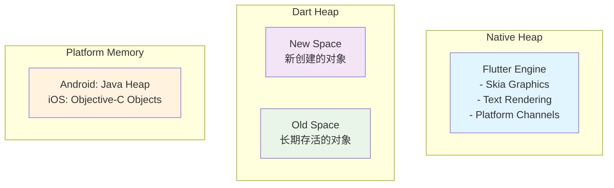

# Flutter 内存优化

本文档详细介绍 Flutter 应用的内存管理原理和优化策略，帮助开发者有效控制内存使用，避免内存泄漏，提升应用性能和稳定性。

## 🧠 内存管理基础

### 1. Flutter 内存架构



### 2. 内存监控工具

#### Flutter DevTools

```dart
// lib/utils/memory_monitor.dart
class MemoryMonitor {
  static Timer? _timer;
  static final List<MemorySnapshot> _snapshots = [];

  static void startMonitoring({Duration interval = const Duration(seconds: 5)}) {
    _timer?.cancel();

    _timer = Timer.periodic(interval, (timer) {
      _takeSnapshot();
    });

    print('🔍 内存监控已启动，间隔: ${interval.inSeconds}秒');
  }

  static void stopMonitoring() {
    _timer?.cancel();
    _timer = null;
    print('⏹️  内存监控已停止');
  }

  static void _takeSnapshot() {
    final snapshot = MemorySnapshot(
      timestamp: DateTime.now(),
      rss: _getRSS(),
      heapUsage: _getHeapUsage(),
      externalMemory: _getExternalMemory(),
    );

    _snapshots.add(snapshot);

    // 保留最近 100 个快照
    if (_snapshots.length > 100) {
      _snapshots.removeAt(0);
    }

    _checkMemoryThresholds(snapshot);
  }

  static int _getRSS() {
    // 获取常驻内存大小 (Resident Set Size)
    try {
      final info = ProcessInfo.currentRss;
      return info;
    } catch (e) {
      return 0;
    }
  }

  static int _getHeapUsage() {
    // 获取 Dart 堆内存使用量
    final info = ProcessInfo.currentRss;
    return info;
  }

  static int _getExternalMemory() {
    // 获取外部内存使用量（如图片缓存）
    return PaintingBinding.instance.imageCache.currentSizeBytes;
  }

  static void _checkMemoryThresholds(MemorySnapshot snapshot) {
    const rssThreshold = 200 * 1024 * 1024; // 200MB
    const heapThreshold = 100 * 1024 * 1024; // 100MB

    if (snapshot.rss > rssThreshold) {
      print('⚠️  RSS 内存使用过高: ${_formatBytes(snapshot.rss)}');
      _triggerMemoryWarning('RSS', snapshot.rss, rssThreshold);
    }

    if (snapshot.heapUsage > heapThreshold) {
      print('⚠️  堆内存使用过高: ${_formatBytes(snapshot.heapUsage)}');
      _triggerMemoryWarning('Heap', snapshot.heapUsage, heapThreshold);
    }
  }

  static void _triggerMemoryWarning(String type, int current, int threshold) {
    // 触发内存警告
    MemoryWarningHandler.handleWarning(type, current, threshold);
  }

  static List<MemorySnapshot> getSnapshots() => List.from(_snapshots);

  static MemorySnapshot? getLatestSnapshot() {
    return _snapshots.isNotEmpty ? _snapshots.last : null;
  }

  static String _formatBytes(int bytes) {
    if (bytes < 1024) return '${bytes}B';
    if (bytes < 1024 * 1024) return '${(bytes / 1024).toStringAsFixed(1)}KB';
    return '${(bytes / (1024 * 1024)).toStringAsFixed(1)}MB';
  }

  static void generateReport() {
    if (_snapshots.isEmpty) {
      print('📊 暂无内存快照数据');
      return;
    }

    final latest = _snapshots.last;
    final peak = _snapshots.reduce((a, b) => a.rss > b.rss ? a : b);
    final average = _snapshots.map((s) => s.rss).reduce((a, b) => a + b) / _snapshots.length;

    print('\n📊 内存使用报告:');
    print('当前 RSS: ${_formatBytes(latest.rss)}');
    print('峰值 RSS: ${_formatBytes(peak.rss)}');
    print('平均 RSS: ${_formatBytes(average.round())}');
    print('当前堆内存: ${_formatBytes(latest.heapUsage)}');
    print('外部内存: ${_formatBytes(latest.externalMemory)}');
    print('快照数量: ${_snapshots.length}');
  }
}

class MemorySnapshot {
  final DateTime timestamp;
  final int rss;
  final int heapUsage;
  final int externalMemory;

  MemorySnapshot({
    required this.timestamp,
    required this.rss,
    required this.heapUsage,
    required this.externalMemory,
  });
}
```

#### 自定义内存分析器

```dart
// lib/utils/memory_analyzer.dart
class MemoryAnalyzer {
  static final Map<String, ObjectTracker> _trackers = {};

  static void trackObject(String category, Object object) {
    _trackers.putIfAbsent(category, () => ObjectTracker(category));
    _trackers[category]!.addObject(object);
  }

  static void untrackObject(String category, Object object) {
    _trackers[category]?.removeObject(object);
  }

  static void analyzeMemoryLeaks() {
    print('\n🔍 内存泄漏分析:');

    _trackers.forEach((category, tracker) {
      final count = tracker.getObjectCount();
      if (count > 0) {
        print('$category: $count 个对象');

        if (count > 100) {
          print('⚠️  $category 可能存在内存泄漏');
        }
      }
    });
  }

  static void forceGC() {
    // 强制垃圾回收
    print('🗑️  执行垃圾回收...');

    // 多次调用以确保彻底清理
    for (int i = 0; i < 3; i++) {
      // 在实际应用中，Dart 会自动进行垃圾回收
      // 这里只是模拟
      Future.delayed(Duration(milliseconds: 100));
    }

    print('✅ 垃圾回收完成');
  }
}

class ObjectTracker {
  final String category;
  final Set<WeakReference<Object>> _objects = {};

  ObjectTracker(this.category);

  void addObject(Object object) {
    _objects.add(WeakReference(object));
  }

  void removeObject(Object object) {
    _objects.removeWhere((ref) => ref.target == object);
  }

  int getObjectCount() {
    // 清理已被回收的对象
    _objects.removeWhere((ref) => ref.target == null);
    return _objects.length;
  }
}
```

### 3. 内存泄漏检测

#### 自动检测系统

```dart
// lib/utils/leak_detector.dart
class LeakDetector {
  static final Map<Type, int> _objectCounts = {};
  static final Map<Type, List<WeakReference<Object>>> _objectRefs = {};
  static Timer? _checkTimer;

  static void startDetection() {
    _checkTimer?.cancel();

    _checkTimer = Timer.periodic(Duration(minutes: 1), (timer) {
      _checkForLeaks();
    });

    print('🕵️ 内存泄漏检测已启动');
  }

  static void stopDetection() {
    _checkTimer?.cancel();
    _checkTimer = null;
    print('🛑 内存泄漏检测已停止');
  }

  static void registerObject(Object object) {
    final type = object.runtimeType;

    _objectCounts[type] = (_objectCounts[type] ?? 0) + 1;

    _objectRefs.putIfAbsent(type, () => []);
    _objectRefs[type]!.add(WeakReference(object));
  }

  static void _checkForLeaks() {
    print('\n🔍 检查内存泄漏...');

    _objectRefs.forEach((type, refs) {
      // 清理已被回收的引用
      refs.removeWhere((ref) => ref.target == null);

      final aliveCount = refs.length;
      final totalCount = _objectCounts[type] ?? 0;

      if (aliveCount > 50) {
        print('⚠️  可能的内存泄漏: $type ($aliveCount/$totalCount 个对象仍存活)');
        _analyzeObjectType(type, refs);
      }
    });
  }

  static void _analyzeObjectType(Type type, List<WeakReference<Object>> refs) {
    // 分析特定类型的对象
    final sampleSize = math.min(5, refs.length);

    print('  分析样本 ($sampleSize 个对象):');

    for (int i = 0; i < sampleSize; i++) {
      final obj = refs[i].target;
      if (obj != null) {
        print('    - ${obj.toString()}');
      }
    }
  }

  static Map<Type, int> getObjectCounts() {
    final result = <Type, int>{};

    _objectRefs.forEach((type, refs) {
      refs.removeWhere((ref) => ref.target == null);
      result[type] = refs.length;
    });

    return result;
  }
}

// 使用 Mixin 自动追踪对象
mixin LeakTrackable {
  @mustCallSuper
  void initState() {
    LeakDetector.registerObject(this);
  }
}

// 示例使用
class MyWidget extends StatefulWidget with LeakTrackable {
  @override
  _MyWidgetState createState() => _MyWidgetState();
}

class _MyWidgetState extends State<MyWidget> {
  @override
  void initState() {
    super.initState();
    widget.initState(); // 注册到泄漏检测器
  }

  @override
  Widget build(BuildContext context) {
    return Container();
  }
}
```

## 🎯 内存优化策略

### 1. Widget 优化

#### 避免不必要的重建

```dart
// lib/widgets/optimized_widget.dart
class OptimizedWidget extends StatefulWidget {
  final String title;
  final List<String> items;

  const OptimizedWidget({
    Key? key,
    required this.title,
    required this.items,
  }) : super(key: key);

  @override
  _OptimizedWidgetState createState() => _OptimizedWidgetState();
}

class _OptimizedWidgetState extends State<OptimizedWidget> {
  late final List<String> _cachedItems;

  @override
  void initState() {
    super.initState();
    // 缓存不变的数据
    _cachedItems = List.from(widget.items);
  }

  @override
  void didUpdateWidget(OptimizedWidget oldWidget) {
    super.didUpdateWidget(oldWidget);

    // 只在数据真正变化时更新缓存
    if (!listEquals(oldWidget.items, widget.items)) {
      _cachedItems.clear();
      _cachedItems.addAll(widget.items);
    }
  }

  @override
  Widget build(BuildContext context) {
    return Column(
      children: [
        // 使用 const 构造函数
        const _HeaderWidget(),

        // 提取不变的部分
        _TitleWidget(title: widget.title),

        // 使用 ListView.builder 而不是 Column
        Expanded(
          child: ListView.builder(
            itemCount: _cachedItems.length,
            itemBuilder: (context, index) {
              return _ItemWidget(
                key: ValueKey(_cachedItems[index]),
                item: _cachedItems[index],
              );
            },
          ),
        ),
      ],
    );
  }
}

// 使用 const 构造函数的静态 Widget
class _HeaderWidget extends StatelessWidget {
  const _HeaderWidget();

  @override
  Widget build(BuildContext context) {
    return Container(
      height: 60,
      color: Colors.blue,
      child: Center(
        child: Text(
          'Header',
          style: TextStyle(color: Colors.white),
        ),
      ),
    );
  }
}

// 可复用的 Widget
class _TitleWidget extends StatelessWidget {
  final String title;

  const _TitleWidget({required this.title});

  @override
  Widget build(BuildContext context) {
    return Padding(
      padding: EdgeInsets.all(16),
      child: Text(
        title,
        style: Theme.of(context).textTheme.headlineSmall,
      ),
    );
  }
}

// 带有 Key 的列表项
class _ItemWidget extends StatelessWidget {
  final String item;

  const _ItemWidget({
    Key? key,
    required this.item,
  }) : super(key: key);

  @override
  Widget build(BuildContext context) {
    return ListTile(
      title: Text(item),
      onTap: () {
        // 处理点击
      },
    );
  }
}
```

#### 使用 AutomaticKeepAliveClientMixin

```dart
// lib/widgets/keepalive_widget.dart
class KeepAliveWidget extends StatefulWidget {
  @override
  _KeepAliveWidgetState createState() => _KeepAliveWidgetState();
}

class _KeepAliveWidgetState extends State<KeepAliveWidget>
    with AutomaticKeepAliveClientMixin {

  @override
  bool get wantKeepAlive => true;

  @override
  Widget build(BuildContext context) {
    super.build(context); // 必须调用

    return ExpensiveWidget();
  }
}

// 条件性保持存活
class ConditionalKeepAliveWidget extends StatefulWidget {
  final bool shouldKeepAlive;

  const ConditionalKeepAliveWidget({
    Key? key,
    required this.shouldKeepAlive,
  }) : super(key: key);

  @override
  _ConditionalKeepAliveWidgetState createState() => _ConditionalKeepAliveWidgetState();
}

class _ConditionalKeepAliveWidgetState extends State<ConditionalKeepAliveWidget>
    with AutomaticKeepAliveClientMixin {

  @override
  bool get wantKeepAlive => widget.shouldKeepAlive;

  @override
  void didUpdateWidget(ConditionalKeepAliveWidget oldWidget) {
    super.didUpdateWidget(oldWidget);

    if (oldWidget.shouldKeepAlive != widget.shouldKeepAlive) {
      updateKeepAlive();
    }
  }

  @override
  Widget build(BuildContext context) {
    super.build(context);

    return Container(
      child: Text('Keep alive: ${widget.shouldKeepAlive}'),
    );
  }
}
```

### 2. 图片内存优化

#### 图片缓存管理

```dart
// lib/utils/image_cache_manager.dart
class ImageCacheManager {
  static const int _maxCacheSize = 100 * 1024 * 1024; // 100MB
  static const int _maxCacheObjects = 1000;

  static void configureImageCache() {
    // 配置图片缓存
    PaintingBinding.instance.imageCache.maximumSizeBytes = _maxCacheSize;
    PaintingBinding.instance.imageCache.maximumSize = _maxCacheObjects;

    print('🖼️  图片缓存配置: ${_maxCacheSize ~/ (1024 * 1024)}MB, $_maxCacheObjects 个对象');
  }

  static void clearImageCache() {
    PaintingBinding.instance.imageCache.clear();
    print('🗑️  图片缓存已清空');
  }

  static void evictImage(String imageUrl) {
    final key = NetworkImage(imageUrl);
    PaintingBinding.instance.imageCache.evict(key);
  }

  static ImageCacheStatus getCacheStatus() {
    final cache = PaintingBinding.instance.imageCache;

    return ImageCacheStatus(
      currentSize: cache.currentSize,
      currentSizeBytes: cache.currentSizeBytes,
      maximumSize: cache.maximumSize,
      maximumSizeBytes: cache.maximumSizeBytes,
    );
  }

  static void printCacheStatus() {
    final status = getCacheStatus();

    print('📊 图片缓存状态:');
    print('  对象数量: ${status.currentSize}/${status.maximumSize}');
    print('  内存使用: ${_formatBytes(status.currentSizeBytes)}/${_formatBytes(status.maximumSizeBytes)}');

    final usagePercent = (status.currentSizeBytes / status.maximumSizeBytes * 100);
    if (usagePercent > 80) {
      print('⚠️  图片缓存使用率过高: ${usagePercent.toStringAsFixed(1)}%');
    }
  }

  static String _formatBytes(int bytes) {
    if (bytes < 1024 * 1024) return '${(bytes / 1024).toStringAsFixed(1)}KB';
    return '${(bytes / (1024 * 1024)).toStringAsFixed(1)}MB';
  }
}

class ImageCacheStatus {
  final int currentSize;
  final int currentSizeBytes;
  final int maximumSize;
  final int maximumSizeBytes;

  ImageCacheStatus({
    required this.currentSize,
    required this.currentSizeBytes,
    required this.maximumSize,
    required this.maximumSizeBytes,
  });
}
```

#### 智能图片加载

```dart
// lib/widgets/smart_image.dart
class SmartImage extends StatefulWidget {
  final String imageUrl;
  final double? width;
  final double? height;
  final BoxFit fit;
  final Widget? placeholder;
  final Widget? errorWidget;

  const SmartImage({
    Key? key,
    required this.imageUrl,
    this.width,
    this.height,
    this.fit = BoxFit.cover,
    this.placeholder,
    this.errorWidget,
  }) : super(key: key);

  @override
  _SmartImageState createState() => _SmartImageState();
}

class _SmartImageState extends State<SmartImage> {
  ImageProvider? _imageProvider;
  bool _isVisible = false;

  @override
  void initState() {
    super.initState();

    // 使用 VisibilityDetector 检测可见性
    WidgetsBinding.instance.addPostFrameCallback((_) {
      _checkVisibility();
    });
  }

  void _checkVisibility() {
    // 简化的可见性检测
    // 实际应用中可以使用 visibility_detector 包
    setState(() {
      _isVisible = true;
    });
  }

  @override
  void didChangeDependencies() {
    super.didChangeDependencies();

    if (_isVisible && _imageProvider == null) {
      _loadImage();
    }
  }

  void _loadImage() {
    // 根据设备像素密度选择合适的图片尺寸
    final devicePixelRatio = MediaQuery.of(context).devicePixelRatio;
    final targetWidth = (widget.width ?? 200) * devicePixelRatio;
    final targetHeight = (widget.height ?? 200) * devicePixelRatio;

    // 构建优化的图片 URL
    final optimizedUrl = _buildOptimizedUrl(
      widget.imageUrl,
      targetWidth.round(),
      targetHeight.round(),
    );

    _imageProvider = CachedNetworkImageProvider(
      optimizedUrl,
      cacheKey: '${widget.imageUrl}_${targetWidth}x${targetHeight}',
    );
  }

  String _buildOptimizedUrl(String originalUrl, int width, int height) {
    // 如果是支持动态调整大小的图片服务
    if (originalUrl.contains('example.com')) {
      return '$originalUrl?w=$width&h=$height&q=80';
    }

    return originalUrl;
  }

  @override
  Widget build(BuildContext context) {
    if (!_isVisible || _imageProvider == null) {
      return widget.placeholder ?? _buildPlaceholder();
    }

    return Image(
      image: _imageProvider!,
      width: widget.width,
      height: widget.height,
      fit: widget.fit,
      frameBuilder: (context, child, frame, wasSynchronouslyLoaded) {
        if (wasSynchronouslyLoaded || frame != null) {
          return child;
        }
        return widget.placeholder ?? _buildPlaceholder();
      },
      errorBuilder: (context, error, stackTrace) {
        return widget.errorWidget ?? _buildErrorWidget();
      },
    );
  }

  Widget _buildPlaceholder() {
    return Container(
      width: widget.width,
      height: widget.height,
      color: Colors.grey[300],
      child: Icon(
        Icons.image,
        color: Colors.grey[600],
      ),
    );
  }

  Widget _buildErrorWidget() {
    return Container(
      width: widget.width,
      height: widget.height,
      color: Colors.grey[300],
      child: Icon(
        Icons.error,
        color: Colors.red,
      ),
    );
  }

  @override
  void dispose() {
    // 清理图片缓存（如果需要）
    if (_imageProvider != null) {
      _imageProvider!.evict();
    }
    super.dispose();
  }
}

// 自定义缓存图片提供者
class CachedNetworkImageProvider extends ImageProvider<CachedNetworkImageProvider> {
  final String url;
  final String? cacheKey;

  const CachedNetworkImageProvider(this.url, {this.cacheKey});

  @override
  Future<CachedNetworkImageProvider> obtainKey(ImageConfiguration configuration) {
    return SynchronousFuture<CachedNetworkImageProvider>(this);
  }

  @override
  ImageStreamCompleter load(CachedNetworkImageProvider key, DecoderCallback decode) {
    return MultiFrameImageStreamCompleter(
      codec: _loadAsync(key, decode),
      scale: 1.0,
    );
  }

  Future<Codec> _loadAsync(CachedNetworkImageProvider key, DecoderCallback decode) async {
    // 实现图片加载和缓存逻辑
    final response = await http.get(Uri.parse(url));

    if (response.statusCode == 200) {
      final bytes = response.bodyBytes;
      return await decode(bytes);
    } else {
      throw NetworkImageLoadException(
        statusCode: response.statusCode,
        uri: Uri.parse(url),
      );
    }
  }

  @override
  bool operator ==(Object other) {
    if (other.runtimeType != runtimeType) return false;
    return other is CachedNetworkImageProvider &&
        other.url == url &&
        other.cacheKey == cacheKey;
  }

  @override
  int get hashCode => Object.hash(url, cacheKey);
}
```

### 3. 列表优化

#### 虚拟化列表

```dart
// lib/widgets/virtual_list.dart
class VirtualList<T> extends StatefulWidget {
  final List<T> items;
  final Widget Function(BuildContext context, T item, int index) itemBuilder;
  final double itemHeight;
  final int? visibleItemCount;

  const VirtualList({
    Key? key,
    required this.items,
    required this.itemBuilder,
    required this.itemHeight,
    this.visibleItemCount,
  }) : super(key: key);

  @override
  _VirtualListState<T> createState() => _VirtualListState<T>();
}

class _VirtualListState<T> extends State<VirtualList<T>> {
  late ScrollController _scrollController;
  int _firstVisibleIndex = 0;
  int _lastVisibleIndex = 0;
  late int _visibleItemCount;

  @override
  void initState() {
    super.initState();

    _scrollController = ScrollController();
    _scrollController.addListener(_onScroll);

    _visibleItemCount = widget.visibleItemCount ?? 10;
    _updateVisibleRange();
  }

  void _onScroll() {
    _updateVisibleRange();
  }

  void _updateVisibleRange() {
    final scrollOffset = _scrollController.offset;
    final newFirstIndex = (scrollOffset / widget.itemHeight).floor();
    final newLastIndex = math.min(
      newFirstIndex + _visibleItemCount,
      widget.items.length - 1,
    );

    if (newFirstIndex != _firstVisibleIndex || newLastIndex != _lastVisibleIndex) {
      setState(() {
        _firstVisibleIndex = math.max(0, newFirstIndex);
        _lastVisibleIndex = math.max(0, newLastIndex);
      });
    }
  }

  @override
  Widget build(BuildContext context) {
    return LayoutBuilder(
      builder: (context, constraints) {
        _visibleItemCount = (constraints.maxHeight / widget.itemHeight).ceil() + 2;

        return ListView.builder(
          controller: _scrollController,
          itemCount: widget.items.length,
          itemExtent: widget.itemHeight,
          itemBuilder: (context, index) {
            // 只渲染可见范围内的项目
            if (index < _firstVisibleIndex || index > _lastVisibleIndex) {
              return SizedBox(height: widget.itemHeight);
            }

            return widget.itemBuilder(context, widget.items[index], index);
          },
        );
      },
    );
  }

  @override
  void dispose() {
    _scrollController.dispose();
    super.dispose();
  }
}
```

#### 分页加载

```dart
// lib/widgets/paginated_list.dart
class PaginatedList<T> extends StatefulWidget {
  final Future<List<T>> Function(int page, int pageSize) loadData;
  final Widget Function(BuildContext context, T item) itemBuilder;
  final int pageSize;
  final Widget? loadingWidget;
  final Widget? errorWidget;

  const PaginatedList({
    Key? key,
    required this.loadData,
    required this.itemBuilder,
    this.pageSize = 20,
    this.loadingWidget,
    this.errorWidget,
  }) : super(key: key);

  @override
  _PaginatedListState<T> createState() => _PaginatedListState<T>();
}

class _PaginatedListState<T> extends State<PaginatedList<T>> {
  final List<T> _items = [];
  final ScrollController _scrollController = ScrollController();

  int _currentPage = 0;
  bool _isLoading = false;
  bool _hasMoreData = true;
  String? _error;

  @override
  void initState() {
    super.initState();

    _scrollController.addListener(_onScroll);
    _loadNextPage();
  }

  void _onScroll() {
    if (_scrollController.position.pixels >=
        _scrollController.position.maxScrollExtent - 200) {
      _loadNextPage();
    }
  }

  Future<void> _loadNextPage() async {
    if (_isLoading || !_hasMoreData) return;

    setState(() {
      _isLoading = true;
      _error = null;
    });

    try {
      final newItems = await widget.loadData(_currentPage, widget.pageSize);

      setState(() {
        _items.addAll(newItems);
        _currentPage++;
        _hasMoreData = newItems.length == widget.pageSize;
        _isLoading = false;
      });

    } catch (e) {
      setState(() {
        _error = e.toString();
        _isLoading = false;
      });
    }
  }

  Future<void> _refresh() async {
    setState(() {
      _items.clear();
      _currentPage = 0;
      _hasMoreData = true;
      _error = null;
    });

    await _loadNextPage();
  }

  @override
  Widget build(BuildContext context) {
    if (_items.isEmpty && _isLoading) {
      return widget.loadingWidget ?? Center(child: CircularProgressIndicator());
    }

    if (_items.isEmpty && _error != null) {
      return widget.errorWidget ?? Center(
        child: Column(
          mainAxisAlignment: MainAxisAlignment.center,
          children: [
            Text('加载失败: $_error'),
            ElevatedButton(
              onPressed: _refresh,
              child: Text('重试'),
            ),
          ],
        ),
      );
    }

    return RefreshIndicator(
      onRefresh: _refresh,
      child: ListView.builder(
        controller: _scrollController,
        itemCount: _items.length + (_hasMoreData ? 1 : 0),
        itemBuilder: (context, index) {
          if (index == _items.length) {
            // 加载更多指示器
            return Padding(
              padding: EdgeInsets.all(16),
              child: Center(
                child: _isLoading
                    ? CircularProgressIndicator()
                    : Text('没有更多数据'),
              ),
            );
          }

          return widget.itemBuilder(context, _items[index]);
        },
      ),
    );
  }

  @override
  void dispose() {
    _scrollController.dispose();
    super.dispose();
  }
}
```

### 4. 状态管理优化

#### 内存友好的状态管理

```dart
// lib/state/memory_efficient_state.dart
class MemoryEfficientState<T> {
  T? _value;
  final List<VoidCallback> _listeners = [];
  Timer? _cleanupTimer;

  T? get value => _value;

  set value(T? newValue) {
    if (_value != newValue) {
      _value = newValue;
      _notifyListeners();
      _scheduleCleanup();
    }
  }

  void addListener(VoidCallback listener) {
    _listeners.add(listener);
  }

  void removeListener(VoidCallback listener) {
    _listeners.remove(listener);

    // 如果没有监听者，考虑清理状态
    if (_listeners.isEmpty) {
      _scheduleCleanup();
    }
  }

  void _notifyListeners() {
    for (final listener in _listeners) {
      listener();
    }
  }

  void _scheduleCleanup() {
    _cleanupTimer?.cancel();

    // 5分钟后清理无用状态
    _cleanupTimer = Timer(Duration(minutes: 5), () {
      if (_listeners.isEmpty) {
        _value = null;
      }
    });
  }

  void dispose() {
    _cleanupTimer?.cancel();
    _listeners.clear();
    _value = null;
  }
}

// 状态管理器
class StateManager {
  static final Map<String, MemoryEfficientState> _states = {};

  static MemoryEfficientState<T> getState<T>(String key) {
    return _states.putIfAbsent(key, () => MemoryEfficientState<T>()) as MemoryEfficientState<T>;
  }

  static void removeState(String key) {
    final state = _states.remove(key);
    state?.dispose();
  }

  static void clearUnusedStates() {
    final keysToRemove = <String>[];

    _states.forEach((key, state) {
      if (state._listeners.isEmpty && state.value == null) {
        keysToRemove.add(key);
      }
    });

    for (final key in keysToRemove) {
      removeState(key);
    }

    print('🗑️  清理了 ${keysToRemove.length} 个无用状态');
  }
}
```

## 🔧 内存问题诊断

### 1. 常见内存泄漏模式

#### Timer 和 Stream 泄漏

```dart
// lib/utils/resource_manager.dart
class ResourceManager {
  final List<Timer> _timers = [];
  final List<StreamSubscription> _subscriptions = [];

  Timer createTimer(Duration duration, VoidCallback callback) {
    final timer = Timer(duration, callback);
    _timers.add(timer);
    return timer;
  }

  Timer createPeriodicTimer(Duration duration, VoidCallback callback) {
    final timer = Timer.periodic(duration, (_) => callback());
    _timers.add(timer);
    return timer;
  }

  StreamSubscription<T> listen<T>(Stream<T> stream, void Function(T) onData) {
    final subscription = stream.listen(onData);
    _subscriptions.add(subscription);
    return subscription;
  }

  void dispose() {
    // 取消所有 Timer
    for (final timer in _timers) {
      timer.cancel();
    }
    _timers.clear();

    // 取消所有 Stream 订阅
    for (final subscription in _subscriptions) {
      subscription.cancel();
    }
    _subscriptions.clear();

    print('🗑️  ResourceManager 已清理所有资源');
  }
}

// 使用 Mixin 自动管理资源
mixin ResourceMixin<T extends StatefulWidget> on State<T> {
  late final ResourceManager _resourceManager;

  @override
  void initState() {
    super.initState();
    _resourceManager = ResourceManager();
  }

  Timer createTimer(Duration duration, VoidCallback callback) {
    return _resourceManager.createTimer(duration, callback);
  }

  Timer createPeriodicTimer(Duration duration, VoidCallback callback) {
    return _resourceManager.createPeriodicTimer(duration, callback);
  }

  StreamSubscription<T> listen<T>(Stream<T> stream, void Function(T) onData) {
    return _resourceManager.listen(stream, onData);
  }

  @override
  void dispose() {
    _resourceManager.dispose();
    super.dispose();
  }
}

// 使用示例
class MyWidget extends StatefulWidget {
  @override
  _MyWidgetState createState() => _MyWidgetState();
}

class _MyWidgetState extends State<MyWidget> with ResourceMixin {
  @override
  void initState() {
    super.initState();

    // 自动管理的 Timer
    createPeriodicTimer(Duration(seconds: 1), () {
      print('定时器触发');
    });

    // 自动管理的 Stream 订阅
    listen(Stream.periodic(Duration(seconds: 2)), (data) {
      print('Stream 数据: $data');
    });
  }

  @override
  Widget build(BuildContext context) {
    return Container();
  }
}
```

#### 循环引用检测

```dart
// lib/utils/circular_reference_detector.dart
class CircularReferenceDetector {
  static final Map<Object, Set<Object>> _references = {};

  static void addReference(Object parent, Object child) {
    _references.putIfAbsent(parent, () => {}).add(child);
  }

  static void removeReference(Object parent, Object child) {
    _references[parent]?.remove(child);
    if (_references[parent]?.isEmpty == true) {
      _references.remove(parent);
    }
  }

  static bool detectCircularReference(Object object) {
    final visited = <Object>{};
    return _hasCircularReference(object, visited);
  }

  static bool _hasCircularReference(Object object, Set<Object> visited) {
    if (visited.contains(object)) {
      return true; // 发现循环引用
    }

    visited.add(object);

    final children = _references[object];
    if (children != null) {
      for (final child in children) {
        if (_hasCircularReference(child, visited)) {
          return true;
        }
      }
    }

    visited.remove(object);
    return false;
  }

  static void analyzeAllReferences() {
    print('\n🔍 循环引用分析:');

    int circularCount = 0;

    _references.keys.forEach((object) {
      if (detectCircularReference(object)) {
        print('⚠️  发现循环引用: ${object.runtimeType}');
        circularCount++;
      }
    });

    if (circularCount == 0) {
      print('✅ 未发现循环引用');
    } else {
      print('❌ 发现 $circularCount 个循环引用');
    }
  }
}
```

### 2. 内存警告处理

```dart
// lib/utils/memory_warning_handler.dart
class MemoryWarningHandler {
  static final List<VoidCallback> _warningCallbacks = [];

  static void addWarningCallback(VoidCallback callback) {
    _warningCallbacks.add(callback);
  }

  static void removeWarningCallback(VoidCallback callback) {
    _warningCallbacks.remove(callback);
  }

  static void handleWarning(String type, int current, int threshold) {
    print('⚠️  内存警告: $type 使用量 ${_formatBytes(current)} 超过阈值 ${_formatBytes(threshold)}');

    // 触发内存清理
    _performMemoryCleanup();

    // 通知所有监听者
    for (final callback in _warningCallbacks) {
      try {
        callback();
      } catch (e) {
        print('内存警告回调执行失败: $e');
      }
    }
  }

  static void _performMemoryCleanup() {
    print('🧹 执行内存清理...');

    // 清理图片缓存
    ImageCacheManager.clearImageCache();

    // 清理无用状态
    StateManager.clearUnusedStates();

    // 强制垃圾回收
    MemoryAnalyzer.forceGC();

    print('✅ 内存清理完成');
  }

  static String _formatBytes(int bytes) {
    if (bytes < 1024 * 1024) return '${(bytes / 1024).toStringAsFixed(1)}KB';
    return '${(bytes / (1024 * 1024)).toStringAsFixed(1)}MB';
  }
}
```

## 🚀 最佳实践

### 1. 开发阶段

- **及时释放资源**: 在 dispose 方法中清理所有资源
- **避免全局变量**: 减少全局状态的使用
- **使用 const 构造函数**: 提高 Widget 复用率
- **合理使用缓存**: 平衡内存使用和性能

### 2. 架构设计

- **分层架构**: 明确各层的职责和生命周期
- **依赖注入**: 便于资源管理和测试
- **事件驱动**: 减少对象间的直接引用
- **懒加载**: 按需加载和初始化

### 3. 监控和调试

- **持续监控**: 建立内存监控体系
- **定期分析**: 定期进行内存泄漏检测
- **性能测试**: 在不同设备上测试内存表现
- **用户反馈**: 收集用户关于应用卡顿的反馈

### 4. 发布前检查

- **内存压力测试**: 模拟长时间使用场景
- **泄漏检测**: 使用工具检测潜在泄漏
- **性能回归**: 确保新版本没有内存回归
- **设备兼容性**: 在低内存设备上测试

通过系统的内存优化，可以显著提升应用的性能和稳定性，减少崩溃率，提供更好的用户体验。
