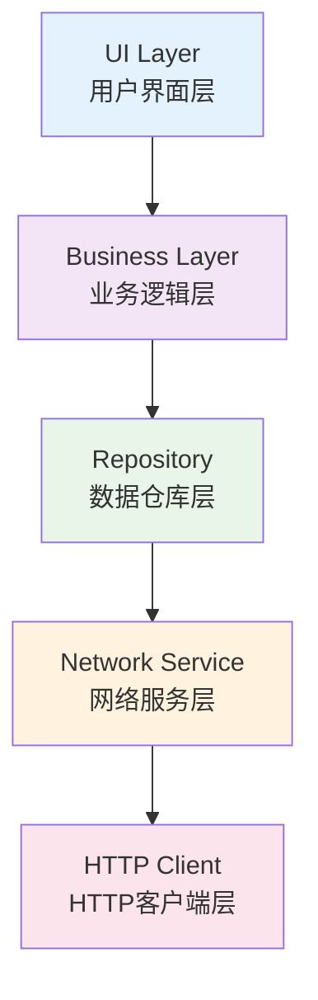

# Flutter 网络性能优化

本文档详细介绍 Flutter 应用网络性能的优化策略，帮助开发者构建高效的网络请求架构，提升应用响应速度和用户体验。

## 🌐 网络架构设计

### 1. 网络请求层次架构



### 2. 高性能网络客户端

```dart
// lib/network/optimized_http_client.dart
import 'dart:io';
import 'package:dio/dio.dart';
import 'package:dio_cache_interceptor/dio_cache_interceptor.dart';
import 'package:dio_certificate_pinning/dio_certificate_pinning.dart';

class OptimizedHttpClient {
  static OptimizedHttpClient? _instance;
  late Dio _dio;
  late CacheStore _cacheStore;

  OptimizedHttpClient._internal() {
    _initializeClient();
  }

  factory OptimizedHttpClient() {
    return _instance ??= OptimizedHttpClient._internal();
  }

  void _initializeClient() {
    _dio = Dio();

    // 基础配置
    _dio.options = BaseOptions(
      connectTimeout: Duration(seconds: 10),
      receiveTimeout: Duration(seconds: 30),
      sendTimeout: Duration(seconds: 30),
      headers: {
        'User-Agent': 'Flutter-App/1.0',
        'Accept': 'application/json',
        'Content-Type': 'application/json',
      },
    );

    // 配置缓存
    _setupCache();

    // 配置拦截器
    _setupInterceptors();

    // 配置证书锁定
    _setupCertificatePinning();

    // 配置连接池
    _setupConnectionPool();
  }

  void _setupCache() {
    _cacheStore = MemCacheStore(maxSize: 50 * 1024 * 1024); // 50MB

    _dio.interceptors.add(
      DioCacheInterceptor(
        options: CacheOptions(
          store: _cacheStore,
          policy: CachePolicy.request,
          hitCacheOnErrorExcept: [401, 403],
          maxStale: Duration(days: 7),
          priority: CachePriority.normal,
          cipher: null,
          keyBuilder: CacheOptions.defaultCacheKeyBuilder,
          allowPostMethod: false,
        ),
      ),
    );
  }

  void _setupInterceptors() {
    // 请求拦截器
    _dio.interceptors.add(
      InterceptorsWrapper(
        onRequest: (options, handler) {
          // 添加认证头
          _addAuthHeader(options);

          // 请求日志
          _logRequest(options);

          handler.next(options);
        },
        onResponse: (response, handler) {
          // 响应日志
          _logResponse(response);

          handler.next(response);
        },
        onError: (error, handler) {
          // 错误处理
          _handleError(error);

          handler.next(error);
        },
      ),
    );

    // 重试拦截器
    _dio.interceptors.add(
      RetryInterceptor(
        dio: _dio,
        logPrint: print,
        retries: 3,
        retryDelays: [
          Duration(seconds: 1),
          Duration(seconds: 2),
          Duration(seconds: 3),
        ],
      ),
    );
  }

  void _setupCertificatePinning() {
    _dio.interceptors.add(
      CertificatePinningInterceptor(
        allowedSHAFingerprints: [
          'SHA256:AAAAAAAAAAAAAAAAAAAAAAAAAAAAAAAAAAAAAAAAAAA=',
        ],
      ),
    );
  }

  void _setupConnectionPool() {
    (_dio.httpClientAdapter as DefaultHttpClientAdapter).onHttpClientCreate = (client) {
      client.maxConnectionsPerHost = 6;
      client.connectionTimeout = Duration(seconds: 10);
      client.idleTimeout = Duration(seconds: 30);
      return client;
    };
  }

  void _addAuthHeader(RequestOptions options) {
    // 添加认证令牌
    final token = AuthManager.getToken();
    if (token != null) {
      options.headers['Authorization'] = 'Bearer $token';
    }
  }

  void _logRequest(RequestOptions options) {
    print('🚀 请求: ${options.method} ${options.uri}');
    if (options.data != null) {
      print('📤 请求数据: ${options.data}');
    }
  }

  void _logResponse(Response response) {
    final duration = DateTime.now().millisecondsSinceEpoch -
        (response.requestOptions.extra['start_time'] ?? 0);

    print('✅ 响应: ${response.statusCode} ${response.requestOptions.uri} (${duration}ms)');
  }

  void _handleError(DioError error) {
    print('❌ 网络错误: ${error.type} - ${error.message}');

    // 记录错误统计
    NetworkMetrics.recordError(error);
  }

  // 公共请求方法
  Future<Response<T>> get<T>(
    String path, {
    Map<String, dynamic>? queryParameters,
    Options? options,
    CancelToken? cancelToken,
  }) async {
    return _dio.get<T>(
      path,
      queryParameters: queryParameters,
      options: options,
      cancelToken: cancelToken,
    );
  }

  Future<Response<T>> post<T>(
    String path, {
    dynamic data,
    Map<String, dynamic>? queryParameters,
    Options? options,
    CancelToken? cancelToken,
  }) async {
    return _dio.post<T>(
      path,
      data: data,
      queryParameters: queryParameters,
      options: options,
      cancelToken: cancelToken,
    );
  }

  Future<Response<T>> put<T>(
    String path, {
    dynamic data,
    Map<String, dynamic>? queryParameters,
    Options? options,
    CancelToken? cancelToken,
  }) async {
    return _dio.put<T>(
      path,
      data: data,
      queryParameters: queryParameters,
      options: options,
      cancelToken: cancelToken,
    );
  }

  Future<Response<T>> delete<T>(
    String path, {
    dynamic data,
    Map<String, dynamic>? queryParameters,
    Options? options,
    CancelToken? cancelToken,
  }) async {
    return _dio.delete<T>(
      path,
      data: data,
      queryParameters: queryParameters,
      options: options,
      cancelToken: cancelToken,
    );
  }

  // 清理缓存
  Future<void> clearCache() async {
    await _cacheStore.clean();
    print('🗑️  网络缓存已清理');
  }

  // 获取缓存大小
  Future<int> getCacheSize() async {
    return await _cacheStore.size;
  }
}

// 认证管理器
class AuthManager {
  static String? _token;

  static String? getToken() => _token;

  static void setToken(String token) {
    _token = token;
  }

  static void clearToken() {
    _token = null;
  }
}

// 重试拦截器
class RetryInterceptor extends Interceptor {
  final Dio dio;
  final void Function(String message)? logPrint;
  final int retries;
  final List<Duration> retryDelays;

  RetryInterceptor({
    required this.dio,
    this.logPrint,
    this.retries = 3,
    this.retryDelays = const [
      Duration(seconds: 1),
      Duration(seconds: 2),
      Duration(seconds: 3),
    ],
  });

  @override
  void onError(DioError err, ErrorInterceptorHandler handler) async {
    final extra = err.requestOptions.extra;
    final retryCount = extra['retry_count'] ?? 0;

    if (retryCount < retries && _shouldRetry(err)) {
      extra['retry_count'] = retryCount + 1;

      final delay = retryDelays.length > retryCount
          ? retryDelays[retryCount]
          : retryDelays.last;

      logPrint?.call('🔄 重试请求 ${retryCount + 1}/$retries: ${err.requestOptions.uri}');

      await Future.delayed(delay);

      try {
        final response = await dio.fetch(err.requestOptions);
        handler.resolve(response);
      } catch (e) {
        super.onError(err, handler);
      }
    } else {
      super.onError(err, handler);
    }
  }

  bool _shouldRetry(DioError error) {
    return error.type == DioErrorType.connectTimeout ||
           error.type == DioErrorType.receiveTimeout ||
           error.type == DioErrorType.sendTimeout ||
           (error.type == DioErrorType.response &&
            error.response?.statusCode != null &&
            error.response!.statusCode! >= 500);
  }
}
```

### 3. 网络性能监控

```dart
// lib/network/network_metrics.dart
class NetworkMetrics {
  static final List<RequestMetric> _requestHistory = [];
  static final Map<String, int> _errorCounts = {};
  static int _totalRequests = 0;
  static int _successfulRequests = 0;

  static void recordRequest({
    required String url,
    required String method,
    required int statusCode,
    required Duration duration,
    required int responseSize,
  }) {
    final metric = RequestMetric(
      url: url,
      method: method,
      statusCode: statusCode,
      duration: duration,
      responseSize: responseSize,
      timestamp: DateTime.now(),
    );

    _requestHistory.add(metric);
    _totalRequests++;

    if (statusCode >= 200 && statusCode < 300) {
      _successfulRequests++;
    }

    // 保留最近 1000 个请求记录
    if (_requestHistory.length > 1000) {
      _requestHistory.removeAt(0);
    }

    _analyzePerformance(metric);
  }

  static void recordError(DioError error) {
    final errorType = error.type.toString();
    _errorCounts[errorType] = (_errorCounts[errorType] ?? 0) + 1;

    print('📊 网络错误统计: $errorType (${_errorCounts[errorType]} 次)');
  }

  static void _analyzePerformance(RequestMetric metric) {
    // 检测慢请求
    if (metric.duration.inMilliseconds > 3000) {
      print('🐌 慢请求检测: ${metric.method} ${metric.url} (${metric.duration.inMilliseconds}ms)');
    }

    // 检测大响应
    if (metric.responseSize > 1024 * 1024) { // 1MB
      print('📦 大响应检测: ${metric.url} (${(metric.responseSize / 1024 / 1024).toStringAsFixed(1)}MB)');
    }
  }

  static NetworkStats getStats() {
    if (_requestHistory.isEmpty) {
      return NetworkStats.empty();
    }

    final recentRequests = _requestHistory.where(
      (request) => DateTime.now().difference(request.timestamp).inMinutes < 5,
    ).toList();

    if (recentRequests.isEmpty) {
      return NetworkStats.empty();
    }

    final avgDuration = recentRequests
        .map((r) => r.duration.inMilliseconds)
        .reduce((a, b) => a + b) / recentRequests.length;

    final avgResponseSize = recentRequests
        .map((r) => r.responseSize)
        .reduce((a, b) => a + b) / recentRequests.length;

    final successRate = _totalRequests > 0
        ? (_successfulRequests / _totalRequests) * 100
        : 0.0;

    return NetworkStats(
      totalRequests: _totalRequests,
      successfulRequests: _successfulRequests,
      successRate: successRate,
      averageResponseTime: avgDuration,
      averageResponseSize: avgResponseSize,
      errorCounts: Map.from(_errorCounts),
    );
  }

  static void generateReport() {
    final stats = getStats();

    print('\n📊 网络性能报告:');
    print('总请求数: ${stats.totalRequests}');
    print('成功率: ${stats.successRate.toStringAsFixed(1)}%');
    print('平均响应时间: ${stats.averageResponseTime.toStringAsFixed(0)}ms');
    print('平均响应大小: ${(stats.averageResponseSize / 1024).toStringAsFixed(1)}KB');

    if (stats.errorCounts.isNotEmpty) {
      print('\n错误统计:');
      stats.errorCounts.forEach((error, count) {
        print('  $error: $count 次');
      });
    }

    _provideSuggestions(stats);
  }

  static void _provideSuggestions(NetworkStats stats) {
    print('\n💡 优化建议:');

    if (stats.averageResponseTime > 2000) {
      print('- 响应时间过长，建议优化服务器性能或使用CDN');
    }

    if (stats.averageResponseSize > 500 * 1024) { // 500KB
      print('- 响应体过大，建议启用压缩或分页');
    }

    if (stats.successRate < 95) {
      print('- 成功率偏低，建议检查网络稳定性和错误处理');
    }
  }

  static void clearStats() {
    _requestHistory.clear();
    _errorCounts.clear();
    _totalRequests = 0;
    _successfulRequests = 0;
    print('🗑️  网络统计数据已清空');
  }
}

class RequestMetric {
  final String url;
  final String method;
  final int statusCode;
  final Duration duration;
  final int responseSize;
  final DateTime timestamp;

  RequestMetric({
    required this.url,
    required this.method,
    required this.statusCode,
    required this.duration,
    required this.responseSize,
    required this.timestamp,
  });
}

class NetworkStats {
  final int totalRequests;
  final int successfulRequests;
  final double successRate;
  final double averageResponseTime;
  final double averageResponseSize;
  final Map<String, int> errorCounts;

  NetworkStats({
    required this.totalRequests,
    required this.successfulRequests,
    required this.successRate,
    required this.averageResponseTime,
    required this.averageResponseSize,
    required this.errorCounts,
  });

  factory NetworkStats.empty() {
    return NetworkStats(
      totalRequests: 0,
      successfulRequests: 0,
      successRate: 0,
      averageResponseTime: 0,
      averageResponseSize: 0,
      errorCounts: {},
    );
  }
}
```

## 🚀 请求优化策略

### 1. 请求合并与批处理

```dart
// lib/network/request_batcher.dart
class RequestBatcher {
  static final Map<String, List<BatchRequest>> _pendingRequests = {};
  static final Map<String, Timer> _batchTimers = {};

  static Future<T> batchRequest<T>({
    required String batchKey,
    required String endpoint,
    required Map<String, dynamic> params,
    required T Function(Map<String, dynamic>) parser,
    Duration batchDelay = const Duration(milliseconds: 100),
  }) async {
    final completer = Completer<T>();

    final batchRequest = BatchRequest<T>(
      endpoint: endpoint,
      params: params,
      parser: parser,
      completer: completer,
    );

    _pendingRequests.putIfAbsent(batchKey, () => []).add(batchRequest);

    // 设置批处理定时器
    _batchTimers[batchKey]?.cancel();
    _batchTimers[batchKey] = Timer(batchDelay, () {
      _executeBatch(batchKey);
    });

    return completer.future;
  }

  static Future<void> _executeBatch(String batchKey) async {
    final requests = _pendingRequests.remove(batchKey);
    _batchTimers.remove(batchKey);

    if (requests == null || requests.isEmpty) return;

    try {
      // 合并请求参数
      final batchParams = _mergeBatchParams(requests);

      // 执行批量请求
      final response = await OptimizedHttpClient().post(
        '/batch',
        data: batchParams,
      );

      // 分发响应结果
      _distributeBatchResponse(requests, response.data);

      print('📦 批量请求完成: $batchKey (${requests.length} 个请求)');

    } catch (error) {
      // 处理批量请求错误
      for (final request in requests) {
        request.completer.completeError(error);
      }
    }
  }

  static Map<String, dynamic> _mergeBatchParams(List<BatchRequest> requests) {
    final batchData = <String, dynamic>{
      'requests': requests.map((request) => {
        'endpoint': request.endpoint,
        'params': request.params,
      }).toList(),
    };

    return batchData;
  }

  static void _distributeBatchResponse(
    List<BatchRequest> requests,
    Map<String, dynamic> batchResponse,
  ) {
    final responses = batchResponse['responses'] as List<dynamic>;

    for (int i = 0; i < requests.length && i < responses.length; i++) {
      final request = requests[i];
      final responseData = responses[i] as Map<String, dynamic>;

      try {
        final result = request.parser(responseData);
        request.completer.complete(result);
      } catch (error) {
        request.completer.completeError(error);
      }
    }
  }
}

class BatchRequest<T> {
  final String endpoint;
  final Map<String, dynamic> params;
  final T Function(Map<String, dynamic>) parser;
  final Completer<T> completer;

  BatchRequest({
    required this.endpoint,
    required this.params,
    required this.parser,
    required this.completer,
  });
}
```

### 2. 智能缓存策略

```dart
// lib/network/smart_cache_manager.dart
class SmartCacheManager {
  static final Map<String, CachedResponse> _cache = {};
  static final Map<String, DateTime> _cacheTimestamps = {};
  static const int maxCacheSize = 100 * 1024 * 1024; // 100MB
  static int currentCacheSize = 0;

  static Future<T?> getCachedResponse<T>(
    String key,
    T Function(Map<String, dynamic>) parser, {
    Duration? maxAge,
  }) async {
    final cachedResponse = _cache[key];
    final timestamp = _cacheTimestamps[key];

    if (cachedResponse == null || timestamp == null) {
      return null;
    }

    // 检查缓存是否过期
    if (maxAge != null && DateTime.now().difference(timestamp) > maxAge) {
      _removeFromCache(key);
      return null;
    }

    try {
      return parser(cachedResponse.data);
    } catch (e) {
      _removeFromCache(key);
      return null;
    }
  }

  static void setCachedResponse(
    String key,
    Map<String, dynamic> data, {
    CacheStrategy strategy = CacheStrategy.normal,
  }) {
    final responseSize = _calculateResponseSize(data);

    // 检查缓存空间
    _ensureCacheSpace(responseSize);

    final cachedResponse = CachedResponse(
      data: data,
      size: responseSize,
      strategy: strategy,
    );

    _cache[key] = cachedResponse;
    _cacheTimestamps[key] = DateTime.now();
    currentCacheSize += responseSize;

    print('💾 缓存响应: $key (${(responseSize / 1024).toStringAsFixed(1)}KB)');
  }

  static void _ensureCacheSpace(int requiredSize) {
    while (currentCacheSize + requiredSize > maxCacheSize && _cache.isNotEmpty) {
      _evictOldestCache();
    }
  }

  static void _evictOldestCache() {
    String? oldestKey;
    DateTime? oldestTime;

    _cacheTimestamps.forEach((key, timestamp) {
      if (oldestTime == null || timestamp.isBefore(oldestTime!)) {
        oldestKey = key;
        oldestTime = timestamp;
      }
    });

    if (oldestKey != null) {
      _removeFromCache(oldestKey!);
    }
  }

  static void _removeFromCache(String key) {
    final cachedResponse = _cache.remove(key);
    _cacheTimestamps.remove(key);

    if (cachedResponse != null) {
      currentCacheSize -= cachedResponse.size;
    }
  }

  static int _calculateResponseSize(Map<String, dynamic> data) {
    // 简单估算响应大小
    final jsonString = jsonEncode(data);
    return jsonString.length * 2; // UTF-16 编码
  }

  static void clearCache() {
    _cache.clear();
    _cacheTimestamps.clear();
    currentCacheSize = 0;
    print('🗑️  智能缓存已清空');
  }

  static CacheStats getCacheStats() {
    return CacheStats(
      totalEntries: _cache.length,
      totalSize: currentCacheSize,
      hitRate: _calculateHitRate(),
    );
  }

  static double _calculateHitRate() {
    // 这里需要实现命中率计算逻辑
    // 简化实现，实际应该跟踪命中和未命中次数
    return 0.0;
  }
}

class CachedResponse {
  final Map<String, dynamic> data;
  final int size;
  final CacheStrategy strategy;

  CachedResponse({
    required this.data,
    required this.size,
    required this.strategy,
  });
}

enum CacheStrategy {
  normal,
  aggressive,
  minimal,
}

class CacheStats {
  final int totalEntries;
  final int totalSize;
  final double hitRate;

  CacheStats({
    required this.totalEntries,
    required this.totalSize,
    required this.hitRate,
  });
}
```

### 3. 请求优先级管理

```dart
// lib/network/request_priority_manager.dart
class RequestPriorityManager {
  static final PriorityQueue<PriorityRequest> _requestQueue = PriorityQueue<PriorityRequest>();
  static final Map<RequestPriority, int> _concurrentLimits = {
    RequestPriority.critical: 3,
    RequestPriority.high: 2,
    RequestPriority.normal: 1,
    RequestPriority.low: 1,
  };
  static final Map<RequestPriority, int> _activeCounts = {
    RequestPriority.critical: 0,
    RequestPriority.high: 0,
    RequestPriority.normal: 0,
    RequestPriority.low: 0,
  };

  static Future<T> executeRequest<T>({
    required Future<T> Function() request,
    required RequestPriority priority,
    String? tag,
  }) async {
    final completer = Completer<T>();

    final priorityRequest = PriorityRequest<T>(
      request: request,
      priority: priority,
      completer: completer,
      tag: tag,
      timestamp: DateTime.now(),
    );

    _requestQueue.add(priorityRequest);
    _processQueue();

    return completer.future;
  }

  static void _processQueue() {
    while (_requestQueue.isNotEmpty) {
      final nextRequest = _requestQueue.first;
      final priority = nextRequest.priority;

      // 检查并发限制
      if (_activeCounts[priority]! >= _concurrentLimits[priority]!) {
        break;
      }

      _requestQueue.removeFirst();
      _activeCounts[priority] = _activeCounts[priority]! + 1;

      _executeRequest(nextRequest);
    }
  }

  static Future<void> _executeRequest<T>(PriorityRequest<T> priorityRequest) async {
    try {
      print('🚀 执行${_getPriorityName(priorityRequest.priority)}请求: ${priorityRequest.tag}');

      final result = await priorityRequest.request();
      priorityRequest.completer.complete(result);

    } catch (error) {
      priorityRequest.completer.completeError(error);
    } finally {
      _activeCounts[priorityRequest.priority] = _activeCounts[priorityRequest.priority]! - 1;
      _processQueue(); // 处理队列中的下一个请求
    }
  }

  static String _getPriorityName(RequestPriority priority) {
    switch (priority) {
      case RequestPriority.critical:
        return '关键';
      case RequestPriority.high:
        return '高优先级';
      case RequestPriority.normal:
        return '普通';
      case RequestPriority.low:
        return '低优先级';
    }
  }

  static void cancelRequestsByTag(String tag) {
    final requestsToCancel = _requestQueue.where((request) => request.tag == tag).toList();

    for (final request in requestsToCancel) {
      _requestQueue.remove(request);
      request.completer.completeError(CancelledError('请求已取消: $tag'));
    }

    print('❌ 已取消标签为 "$tag" 的 ${requestsToCancel.length} 个请求');
  }

  static QueueStats getQueueStats() {
    final priorityCounts = <RequestPriority, int>{};

    for (final request in _requestQueue) {
      priorityCounts[request.priority] = (priorityCounts[request.priority] ?? 0) + 1;
    }

    return QueueStats(
      totalQueued: _requestQueue.length,
      activeCounts: Map.from(_activeCounts),
      queuedCounts: priorityCounts,
    );
  }
}

class PriorityRequest<T> implements Comparable<PriorityRequest> {
  final Future<T> Function() request;
  final RequestPriority priority;
  final Completer<T> completer;
  final String? tag;
  final DateTime timestamp;

  PriorityRequest({
    required this.request,
    required this.priority,
    required this.completer,
    this.tag,
    required this.timestamp,
  });

  @override
  int compareTo(PriorityRequest other) {
    // 优先级越高，值越小（优先队列特性）
    final priorityComparison = priority.index.compareTo(other.priority.index);

    if (priorityComparison != 0) {
      return priorityComparison;
    }

    // 相同优先级按时间排序
    return timestamp.compareTo(other.timestamp);
  }
}

enum RequestPriority {
  critical, // 关键请求（如登录、支付）
  high,     // 高优先级（如用户操作响应）
  normal,   // 普通请求（如数据加载）
  low,      // 低优先级（如预加载、统计）
}

class QueueStats {
  final int totalQueued;
  final Map<RequestPriority, int> activeCounts;
  final Map<RequestPriority, int> queuedCounts;

  QueueStats({
    required this.totalQueued,
    required this.activeCounts,
    required this.queuedCounts,
  });
}

class CancelledError extends Error {
  final String message;

  CancelledError(this.message);

  @override
  String toString() => 'CancelledError: $message';
}
```

## 📱 移动网络优化

### 1. 网络状态监控

```dart
// lib/network/network_monitor.dart
import 'package:connectivity_plus/connectivity_plus.dart';

class NetworkMonitor {
  static NetworkMonitor? _instance;
  late StreamSubscription<ConnectivityResult> _connectivitySubscription;
  ConnectivityResult _currentConnectivity = ConnectivityResult.none;
  final List<NetworkStateListener> _listeners = [];

  NetworkMonitor._internal();

  factory NetworkMonitor() {
    return _instance ??= NetworkMonitor._internal();
  }

  void initialize() {
    _connectivitySubscription = Connectivity().onConnectivityChanged.listen(
      _onConnectivityChanged,
    );

    // 获取初始网络状态
    _checkInitialConnectivity();
  }

  Future<void> _checkInitialConnectivity() async {
    final connectivity = await Connectivity().checkConnectivity();
    _onConnectivityChanged(connectivity);
  }

  void _onConnectivityChanged(ConnectivityResult result) {
    final previousConnectivity = _currentConnectivity;
    _currentConnectivity = result;

    print('📶 网络状态变化: ${_getConnectivityName(previousConnectivity)} → ${_getConnectivityName(result)}');

    // 通知监听器
    for (final listener in _listeners) {
      listener.onNetworkStateChanged(result, previousConnectivity);
    }

    // 根据网络状态调整策略
    _adjustNetworkStrategy(result);
  }

  void _adjustNetworkStrategy(ConnectivityResult connectivity) {
    switch (connectivity) {
      case ConnectivityResult.wifi:
        _enableHighQualityMode();
        break;
      case ConnectivityResult.mobile:
        _enableDataSavingMode();
        break;
      case ConnectivityResult.none:
        _enableOfflineMode();
        break;
      default:
        _enableNormalMode();
        break;
    }
  }

  void _enableHighQualityMode() {
    print('📶 启用高质量模式 (WiFi)');
    // 启用高质量图片、视频等
    NetworkConfig.setQualityMode(QualityMode.high);
  }

  void _enableDataSavingMode() {
    print('📱 启用数据节省模式 (移动网络)');
    // 压缩图片、限制预加载等
    NetworkConfig.setQualityMode(QualityMode.dataSaving);
  }

  void _enableOfflineMode() {
    print('📵 启用离线模式');
    // 使用缓存数据、禁用非必要请求
    NetworkConfig.setQualityMode(QualityMode.offline);
  }

  void _enableNormalMode() {
    print('📶 启用普通模式');
    NetworkConfig.setQualityMode(QualityMode.normal);
  }

  String _getConnectivityName(ConnectivityResult connectivity) {
    switch (connectivity) {
      case ConnectivityResult.wifi:
        return 'WiFi';
      case ConnectivityResult.mobile:
        return '移动网络';
      case ConnectivityResult.ethernet:
        return '以太网';
      case ConnectivityResult.none:
        return '无网络';
      default:
        return '未知';
    }
  }

  void addListener(NetworkStateListener listener) {
    _listeners.add(listener);
  }

  void removeListener(NetworkStateListener listener) {
    _listeners.remove(listener);
  }

  ConnectivityResult get currentConnectivity => _currentConnectivity;

  bool get isConnected => _currentConnectivity != ConnectivityResult.none;

  bool get isWiFi => _currentConnectivity == ConnectivityResult.wifi;

  bool get isMobile => _currentConnectivity == ConnectivityResult.mobile;

  void dispose() {
    _connectivitySubscription.cancel();
    _listeners.clear();
  }
}

abstract class NetworkStateListener {
  void onNetworkStateChanged(ConnectivityResult current, ConnectivityResult previous);
}

class NetworkConfig {
  static QualityMode _currentMode = QualityMode.normal;

  static void setQualityMode(QualityMode mode) {
    _currentMode = mode;
  }

  static QualityMode get currentMode => _currentMode;

  static bool get shouldCompressImages => _currentMode == QualityMode.dataSaving;

  static bool get shouldPreloadContent => _currentMode == QualityMode.high;

  static bool get isOfflineMode => _currentMode == QualityMode.offline;
}

enum QualityMode {
  high,
  normal,
  dataSaving,
  offline,
}
```

### 2. 自适应请求策略

```dart
// lib/network/adaptive_request_strategy.dart
class AdaptiveRequestStrategy {
  static Duration getTimeoutForConnectivity(ConnectivityResult connectivity) {
    switch (connectivity) {
      case ConnectivityResult.wifi:
        return Duration(seconds: 10);
      case ConnectivityResult.mobile:
        return Duration(seconds: 15);
      case ConnectivityResult.ethernet:
        return Duration(seconds: 8);
      default:
        return Duration(seconds: 30);
    }
  }

  static int getRetryCountForConnectivity(ConnectivityResult connectivity) {
    switch (connectivity) {
      case ConnectivityResult.wifi:
        return 2;
      case ConnectivityResult.mobile:
        return 3;
      default:
        return 1;
    }
  }

  static Map<String, dynamic> getImageQualityParams(ConnectivityResult connectivity) {
    switch (connectivity) {
      case ConnectivityResult.wifi:
        return {
          'quality': 90,
          'format': 'webp',
          'width': null, // 原始尺寸
        };
      case ConnectivityResult.mobile:
        return {
          'quality': 70,
          'format': 'webp',
          'width': 800,
        };
      default:
        return {
          'quality': 50,
          'format': 'webp',
          'width': 400,
        };
    }
  }

  static bool shouldEnablePreloading(ConnectivityResult connectivity) {
    return connectivity == ConnectivityResult.wifi;
  }

  static int getConcurrentRequestLimit(ConnectivityResult connectivity) {
    switch (connectivity) {
      case ConnectivityResult.wifi:
        return 6;
      case ConnectivityResult.mobile:
        return 3;
      default:
        return 2;
    }
  }
}
```

## 🔧 网络调试工具

### 1. 网络请求拦截器

```dart
// lib/network/debug_interceptor.dart
class DebugInterceptor extends Interceptor {
  final bool enableLogging;
  final bool enableMocking;
  final Map<String, MockResponse> mockResponses;

  DebugInterceptor({
    this.enableLogging = true,
    this.enableMocking = false,
    this.mockResponses = const {},
  });

  @override
  void onRequest(RequestOptions options, RequestInterceptorHandler handler) {
    if (enableLogging) {
      _logRequest(options);
    }

    if (enableMocking) {
      final mockResponse = _getMockResponse(options);
      if (mockResponse != null) {
        handler.resolve(_createMockResponse(options, mockResponse));
        return;
      }
    }

    options.extra['start_time'] = DateTime.now().millisecondsSinceEpoch;
    handler.next(options);
  }

  @override
  void onResponse(Response response, ResponseInterceptorHandler handler) {
    if (enableLogging) {
      _logResponse(response);
    }

    // 记录性能指标
    _recordMetrics(response);

    handler.next(response);
  }

  @override
  void onError(DioError err, ErrorInterceptorHandler handler) {
    if (enableLogging) {
      _logError(err);
    }

    handler.next(err);
  }

  void _logRequest(RequestOptions options) {
    print('\n🚀 === 网络请求 ===');
    print('URL: ${options.method} ${options.uri}');
    print('Headers: ${options.headers}');

    if (options.data != null) {
      print('Body: ${options.data}');
    }

    if (options.queryParameters.isNotEmpty) {
      print('Query: ${options.queryParameters}');
    }
  }

  void _logResponse(Response response) {
    final startTime = response.requestOptions.extra['start_time'] ?? 0;
    final duration = DateTime.now().millisecondsSinceEpoch - startTime;

    print('\n✅ === 网络响应 ===');
    print('URL: ${response.requestOptions.uri}');
    print('Status: ${response.statusCode}');
    print('Duration: ${duration}ms');
    print('Size: ${_getResponseSize(response)}');

    if (response.data != null) {
      final dataStr = response.data.toString();
      if (dataStr.length > 500) {
        print('Data: ${dataStr.substring(0, 500)}...');
      } else {
        print('Data: $dataStr');
      }
    }
  }

  void _logError(DioError error) {
    print('\n❌ === 网络错误 ===');
    print('URL: ${error.requestOptions.uri}');
    print('Type: ${error.type}');
    print('Message: ${error.message}');

    if (error.response != null) {
      print('Status: ${error.response!.statusCode}');
      print('Data: ${error.response!.data}');
    }
  }

  MockResponse? _getMockResponse(RequestOptions options) {
    final key = '${options.method} ${options.path}';
    return mockResponses[key];
  }

  Response _createMockResponse(RequestOptions options, MockResponse mockResponse) {
    print('🎭 使用模拟响应: ${options.method} ${options.uri}');

    return Response(
      requestOptions: options,
      data: mockResponse.data,
      statusCode: mockResponse.statusCode,
      headers: Headers.fromMap(mockResponse.headers),
    );
  }

  String _getResponseSize(Response response) {
    if (response.data == null) return '0B';

    final size = response.data.toString().length;
    if (size < 1024) {
      return '${size}B';
    } else if (size < 1024 * 1024) {
      return '${(size / 1024).toStringAsFixed(1)}KB';
    } else {
      return '${(size / 1024 / 1024).toStringAsFixed(1)}MB';
    }
  }

  void _recordMetrics(Response response) {
    final startTime = response.requestOptions.extra['start_time'] ?? 0;
    final duration = Duration(milliseconds: DateTime.now().millisecondsSinceEpoch - startTime);
    final responseSize = response.data?.toString().length ?? 0;

    NetworkMetrics.recordRequest(
      url: response.requestOptions.uri.toString(),
      method: response.requestOptions.method,
      statusCode: response.statusCode ?? 0,
      duration: duration,
      responseSize: responseSize,
    );
  }
}

class MockResponse {
  final Map<String, dynamic> data;
  final int statusCode;
  final Map<String, String> headers;

  MockResponse({
    required this.data,
    this.statusCode = 200,
    this.headers = const {},
  });
}
```

## 🚀 最佳实践

### 1. 网络架构设计

- **分层架构**: 清晰的网络层次结构
- **统一错误处理**: 集中处理网络错误
- **请求拦截**: 统一添加认证、日志等
- **响应缓存**: 智能缓存策略减少请求

### 2. 性能优化

- **连接复用**: 使用 HTTP/2 和连接池
- **请求合并**: 批量处理相关请求
- **数据压缩**: 启用 GZIP 压缩
- **CDN 加速**: 使用内容分发网络

### 3. 移动网络适配

- **网络状态监控**: 根据网络类型调整策略
- **自适应质量**: 动态调整内容质量
- **离线支持**: 提供离线功能
- **数据节省**: 在移动网络下优化流量使用

### 4. 安全考虑

- **HTTPS 强制**: 所有请求使用 HTTPS
- **证书锁定**: 防止中间人攻击
- **请求签名**: 验证请求完整性
- **敏感数据保护**: 避免在日志中暴露敏感信息

通过系统的网络性能优化，可以显著提升应用的响应速度和用户体验，同时降低网络资源消耗。
