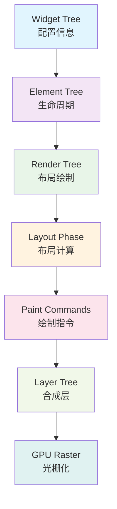

# Flutter 渲染性能优化

本文档详细介绍Flutter应用渲染性能的优化策略，帮助开发者构建流畅的60fps用户界面，提升用户体验。

## 🎨 渲染原理基础

### 1. Flutter 渲染管道



### 2. 性能监控工具

#### Flutter Inspector

```dart
// lib/utils/performance_overlay.dart
class PerformanceOverlay {
  static bool _isEnabled = false;
  
  static void enable() {
    if (!_isEnabled) {
      WidgetsBinding.instance.addTimingsCallback(_onFrameTiming);
      _isEnabled = true;
      print('🎯 性能监控已启用');
    }
  }
  
  static void disable() {
    if (_isEnabled) {
      WidgetsBinding.instance.removeTimingsCallback(_onFrameTiming);
      _isEnabled = false;
      print('⏹️  性能监控已禁用');
    }
  }
  
  static void _onFrameTiming(List<FrameTiming> timings) {
    for (final timing in timings) {
      final buildDuration = timing.buildDuration.inMicroseconds;
      final rasterDuration = timing.rasterDuration.inMicroseconds;
      final totalDuration = timing.totalSpan.inMicroseconds;
      
      // 检测性能问题
      _analyzeFrameTiming(buildDuration, rasterDuration, totalDuration);
    }
  }
  
  static void _analyzeFrameTiming(int buildDuration, int rasterDuration, int totalDuration) {
    const targetFrameTime = 16667; // 60fps = 16.67ms
    
    if (totalDuration > targetFrameTime) {
      final fps = 1000000 / totalDuration;
      print('⚠️  帧率下降: ${fps.toStringAsFixed(1)}fps');
      
      if (buildDuration > 8000) { // 8ms
        print('  - 构建阶段耗时: ${(buildDuration / 1000).toStringAsFixed(1)}ms');
      }
      
      if (rasterDuration > 8000) { // 8ms
        print('  - 光栅化耗时: ${(rasterDuration / 1000).toStringAsFixed(1)}ms');
      }
    }
  }
}
```

#### 自定义性能监控

```dart
// lib/utils/render_performance_monitor.dart
class RenderPerformanceMonitor {
  static final List<FrameMetrics> _frameHistory = [];
  static Timer? _reportTimer;
  
  static void startMonitoring() {
    WidgetsBinding.instance.addTimingsCallback(_recordFrameMetrics);
    
    _reportTimer = Timer.periodic(Duration(seconds: 10), (_) {
      _generatePerformanceReport();
    });
    
    print('📊 渲染性能监控已启动');
  }
  
  static void stopMonitoring() {
    WidgetsBinding.instance.removeTimingsCallback(_recordFrameMetrics);
    _reportTimer?.cancel();
    _reportTimer = null;
    
    print('📊 渲染性能监控已停止');
  }
  
  static void _recordFrameMetrics(List<FrameTiming> timings) {
    for (final timing in timings) {
      final metrics = FrameMetrics(
        timestamp: DateTime.now(),
        buildTime: timing.buildDuration.inMicroseconds,
        rasterTime: timing.rasterDuration.inMicroseconds,
        totalTime: timing.totalSpan.inMicroseconds,
      );
      
      _frameHistory.add(metrics);
      
      // 保留最近 1000 帧的数据
      if (_frameHistory.length > 1000) {
        _frameHistory.removeAt(0);
      }
    }
  }
  
  static void _generatePerformanceReport() {
    if (_frameHistory.isEmpty) return;
    
    final recentFrames = _frameHistory.where(
      (frame) => DateTime.now().difference(frame.timestamp).inSeconds < 10,
    ).toList();
    
    if (recentFrames.isEmpty) return;
    
    final avgBuildTime = recentFrames
        .map((f) => f.buildTime)
        .reduce((a, b) => a + b) / recentFrames.length;
    
    final avgRasterTime = recentFrames
        .map((f) => f.rasterTime)
        .reduce((a, b) => a + b) / recentFrames.length;
    
    final avgTotalTime = recentFrames
        .map((f) => f.totalTime)
        .reduce((a, b) => a + b) / recentFrames.length;
    
    final avgFps = 1000000 / avgTotalTime;
    
    final jankFrames = recentFrames.where((f) => f.totalTime > 16667).length;
    final jankRate = (jankFrames / recentFrames.length) * 100;
    
    print('\n📊 渲染性能报告 (最近10秒):');
    print('平均帧率: ${avgFps.toStringAsFixed(1)}fps');
    print('平均构建时间: ${(avgBuildTime / 1000).toStringAsFixed(1)}ms');
    print('平均光栅化时间: ${(avgRasterTime / 1000).toStringAsFixed(1)}ms');
    print('卡顿率: ${jankRate.toStringAsFixed(1)}%');
    
    if (jankRate > 5) {
      print('⚠️  卡顿率过高，建议优化渲染性能');
    }
  }
  
  static PerformanceStats getPerformanceStats() {
    if (_frameHistory.isEmpty) {
      return PerformanceStats.empty();
    }
    
    final totalFrames = _frameHistory.length;
    final jankFrames = _frameHistory.where((f) => f.totalTime > 16667).length;
    
    final avgBuildTime = _frameHistory
        .map((f) => f.buildTime)
        .reduce((a, b) => a + b) / totalFrames;
    
    final avgRasterTime = _frameHistory
        .map((f) => f.rasterTime)
        .reduce((a, b) => a + b) / totalFrames;
    
    final avgTotalTime = _frameHistory
        .map((f) => f.totalTime)
        .reduce((a, b) => a + b) / totalFrames;
    
    return PerformanceStats(
      averageFps: 1000000 / avgTotalTime,
      averageBuildTime: avgBuildTime / 1000,
      averageRasterTime: avgRasterTime / 1000,
      jankRate: (jankFrames / totalFrames) * 100,
      totalFrames: totalFrames,
    );
  }
}

class FrameMetrics {
  final DateTime timestamp;
  final int buildTime;
  final int rasterTime;
  final int totalTime;
  
  FrameMetrics({
    required this.timestamp,
    required this.buildTime,
    required this.rasterTime,
    required this.totalTime,
  });
}

class PerformanceStats {
  final double averageFps;
  final double averageBuildTime;
  final double averageRasterTime;
  final double jankRate;
  final int totalFrames;
  
  PerformanceStats({
    required this.averageFps,
    required this.averageBuildTime,
    required this.averageRasterTime,
    required this.jankRate,
    required this.totalFrames,
  });
  
  factory PerformanceStats.empty() {
    return PerformanceStats(
      averageFps: 0,
      averageBuildTime: 0,
      averageRasterTime: 0,
      jankRate: 0,
      totalFrames: 0,
    );
  }
}
```

## ⚡ 渲染优化策略

### 1. Widget 构建优化

#### 减少不必要的重建

```dart
// lib/widgets/optimized_stateful_widget.dart
class OptimizedStatefulWidget extends StatefulWidget {
  final String title;
  final List<String> items;
  final VoidCallback? onTap;
  
  const OptimizedStatefulWidget({
    Key? key,
    required this.title,
    required this.items,
    this.onTap,
  }) : super(key: key);
  
  @override
  _OptimizedStatefulWidgetState createState() => _OptimizedStatefulWidgetState();
}

class _OptimizedStatefulWidgetState extends State<OptimizedStatefulWidget> {
  late String _cachedTitle;
  late List<String> _cachedItems;
  Widget? _cachedHeader;
  
  @override
  void initState() {
    super.initState();
    _updateCache();
  }
  
  @override
  void didUpdateWidget(OptimizedStatefulWidget oldWidget) {
    super.didUpdateWidget(oldWidget);
    
    // 只在必要时更新缓存
    if (oldWidget.title != widget.title || 
        !listEquals(oldWidget.items, widget.items)) {
      _updateCache();
    }
  }
  
  void _updateCache() {
    _cachedTitle = widget.title;
    _cachedItems = List.from(widget.items);
    _cachedHeader = null; // 重置缓存的 header
  }
  
  Widget _buildHeader() {
    // 缓存复杂的 header 构建
    return _cachedHeader ??= Container(
      padding: EdgeInsets.all(16),
      decoration: BoxDecoration(
        gradient: LinearGradient(
          colors: [Colors.blue, Colors.purple],
        ),
        borderRadius: BorderRadius.circular(8),
      ),
      child: Text(
        _cachedTitle,
        style: TextStyle(
          color: Colors.white,
          fontSize: 18,
          fontWeight: FontWeight.bold,
        ),
      ),
    );
  }
  
  @override
  Widget build(BuildContext context) {
    return Column(
      children: [
        _buildHeader(),
        
        // 使用 ListView.builder 而不是 Column
        Expanded(
          child: ListView.builder(
            itemCount: _cachedItems.length,
            itemBuilder: (context, index) {
              return _OptimizedListItem(
                key: ValueKey(_cachedItems[index]),
                text: _cachedItems[index],
                onTap: widget.onTap,
              );
            },
          ),
        ),
      ],
    );
  }
}

// 独立的列表项 Widget
class _OptimizedListItem extends StatelessWidget {
  final String text;
  final VoidCallback? onTap;
  
  const _OptimizedListItem({
    Key? key,
    required this.text,
    this.onTap,
  }) : super(key: key);
  
  @override
  Widget build(BuildContext context) {
    return ListTile(
      title: Text(text),
      onTap: onTap,
    );
  }
}
```

#### 使用 RepaintBoundary

```dart
// lib/widgets/repaint_boundary_widget.dart
class RepaintBoundaryWidget extends StatefulWidget {
  @override
  _RepaintBoundaryWidgetState createState() => _RepaintBoundaryWidgetState();
}

class _RepaintBoundaryWidgetState extends State<RepaintBoundaryWidget>
    with TickerProviderStateMixin {
  late AnimationController _animationController;
  late Animation<double> _animation;
  
  @override
  void initState() {
    super.initState();
    
    _animationController = AnimationController(
      duration: Duration(seconds: 2),
      vsync: this,
    );
    
    _animation = Tween<double>(
      begin: 0.0,
      end: 1.0,
    ).animate(_animationController);
    
    _animationController.repeat();
  }
  
  @override
  Widget build(BuildContext context) {
    return Column(
      children: [
        // 静态内容，不需要重绘
        RepaintBoundary(
          child: _StaticContent(),
        ),
        
        // 动画内容，独立重绘
        RepaintBoundary(
          child: AnimatedBuilder(
            animation: _animation,
            builder: (context, child) {
              return Transform.rotate(
                angle: _animation.value * 2 * math.pi,
                child: Container(
                  width: 100,
                  height: 100,
                  decoration: BoxDecoration(
                    color: Colors.blue,
                    shape: BoxShape.circle,
                  ),
                ),
              );
            },
          ),
        ),
        
        // 另一个静态内容
        RepaintBoundary(
          child: _AnotherStaticContent(),
        ),
      ],
    );
  }
  
  @override
  void dispose() {
    _animationController.dispose();
    super.dispose();
  }
}

class _StaticContent extends StatelessWidget {
  @override
  Widget build(BuildContext context) {
    return Container(
      height: 200,
      child: ListView.builder(
        itemCount: 50,
        itemBuilder: (context, index) {
          return ListTile(
            title: Text('静态项目 $index'),
          );
        },
      ),
    );
  }
}

class _AnotherStaticContent extends StatelessWidget {
  @override
  Widget build(BuildContext context) {
    return Container(
      height: 100,
      color: Colors.grey[200],
      child: Center(
        child: Text('这是另一个静态内容区域'),
      ),
    );
  }
}
```

### 2. 列表性能优化

#### 高性能列表实现

```dart
// lib/widgets/high_performance_list.dart
class HighPerformanceList<T> extends StatefulWidget {
  final List<T> items;
  final Widget Function(BuildContext context, T item, int index) itemBuilder;
  final double? itemExtent;
  final ScrollController? controller;
  final bool shrinkWrap;
  final EdgeInsetsGeometry? padding;
  
  const HighPerformanceList({
    Key? key,
    required this.items,
    required this.itemBuilder,
    this.itemExtent,
    this.controller,
    this.shrinkWrap = false,
    this.padding,
  }) : super(key: key);
  
  @override
  _HighPerformanceListState<T> createState() => _HighPerformanceListState<T>();
}

class _HighPerformanceListState<T> extends State<HighPerformanceList<T>> {
  late ScrollController _scrollController;
  final Map<int, Widget> _itemCache = {};
  
  @override
  void initState() {
    super.initState();
    _scrollController = widget.controller ?? ScrollController();
  }
  
  @override
  void didUpdateWidget(HighPerformanceList<T> oldWidget) {
    super.didUpdateWidget(oldWidget);
    
    // 清理缓存如果数据变化
    if (oldWidget.items != widget.items) {
      _itemCache.clear();
    }
  }
  
  Widget _buildItem(BuildContext context, int index) {
    // 使用缓存避免重复构建
    return _itemCache.putIfAbsent(index, () {
      return RepaintBoundary(
        child: widget.itemBuilder(context, widget.items[index], index),
      );
    });
  }
  
  @override
  Widget build(BuildContext context) {
    return ListView.builder(
      controller: _scrollController,
      itemCount: widget.items.length,
      itemExtent: widget.itemExtent,
      shrinkWrap: widget.shrinkWrap,
      padding: widget.padding,
      // 使用 cacheExtent 预加载屏幕外的项目
      cacheExtent: 500,
      itemBuilder: _buildItem,
    );
  }
  
  @override
  void dispose() {
    if (widget.controller == null) {
      _scrollController.dispose();
    }
    super.dispose();
  }
}
```

#### 分组列表优化

```dart
// lib/widgets/grouped_list_view.dart
class GroupedListView<T, G> extends StatefulWidget {
  final List<T> items;
  final G Function(T item) groupBy;
  final Widget Function(BuildContext context, G group) groupHeaderBuilder;
  final Widget Function(BuildContext context, T item) itemBuilder;
  final bool sticky;
  
  const GroupedListView({
    Key? key,
    required this.items,
    required this.groupBy,
    required this.groupHeaderBuilder,
    required this.itemBuilder,
    this.sticky = false,
  }) : super(key: key);
  
  @override
  _GroupedListViewState<T, G> createState() => _GroupedListViewState<T, G>();
}

class _GroupedListViewState<T, G> extends State<GroupedListView<T, G>> {
  late List<_GroupedItem<T, G>> _groupedItems;
  
  @override
  void initState() {
    super.initState();
    _buildGroupedItems();
  }
  
  @override
  void didUpdateWidget(GroupedListView<T, G> oldWidget) {
    super.didUpdateWidget(oldWidget);
    
    if (oldWidget.items != widget.items) {
      _buildGroupedItems();
    }
  }
  
  void _buildGroupedItems() {
    _groupedItems = [];
    
    if (widget.items.isEmpty) return;
    
    // 按组分组
    final groups = <G, List<T>>{};
    for (final item in widget.items) {
      final group = widget.groupBy(item);
      groups.putIfAbsent(group, () => []).add(item);
    }
    
    // 构建分组项目列表
    groups.forEach((group, items) {
      _groupedItems.add(_GroupedItem.header(group));
      
      for (final item in items) {
        _groupedItems.add(_GroupedItem.item(item));
      }
    });
  }
  
  @override
  Widget build(BuildContext context) {
    return ListView.builder(
      itemCount: _groupedItems.length,
      itemBuilder: (context, index) {
        final groupedItem = _groupedItems[index];
        
        if (groupedItem.isHeader) {
          return RepaintBoundary(
            child: widget.groupHeaderBuilder(context, groupedItem.group!),
          );
        } else {
          return RepaintBoundary(
            child: widget.itemBuilder(context, groupedItem.item!),
          );
        }
      },
    );
  }
}

class _GroupedItem<T, G> {
  final bool isHeader;
  final G? group;
  final T? item;
  
  _GroupedItem.header(this.group) : isHeader = true, item = null;
  _GroupedItem.item(this.item) : isHeader = false, group = null;
}
```

### 3. 动画性能优化

#### 高效动画实现

```dart
// lib/widgets/optimized_animation.dart
class OptimizedAnimation extends StatefulWidget {
  final Widget child;
  final Duration duration;
  final Curve curve;
  
  const OptimizedAnimation({
    Key? key,
    required this.child,
    this.duration = const Duration(milliseconds: 300),
    this.curve = Curves.easeInOut,
  }) : super(key: key);
  
  @override
  _OptimizedAnimationState createState() => _OptimizedAnimationState();
}

class _OptimizedAnimationState extends State<OptimizedAnimation>
    with SingleTickerProviderStateMixin {
  late AnimationController _controller;
  late Animation<double> _animation;
  
  @override
  void initState() {
    super.initState();
    
    _controller = AnimationController(
      duration: widget.duration,
      vsync: this,
    );
    
    _animation = CurvedAnimation(
      parent: _controller,
      curve: widget.curve,
    );
    
    _controller.forward();
  }
  
  @override
  Widget build(BuildContext context) {
    return RepaintBoundary(
      child: AnimatedBuilder(
        animation: _animation,
        builder: (context, child) {
          return Transform.scale(
            scale: _animation.value,
            child: Opacity(
              opacity: _animation.value,
              child: widget.child,
            ),
          );
        },
      ),
    );
  }
  
  @override
  void dispose() {
    _controller.dispose();
    super.dispose();
  }
}

// 复杂动画的优化版本
class ComplexOptimizedAnimation extends StatefulWidget {
  @override
  _ComplexOptimizedAnimationState createState() => _ComplexOptimizedAnimationState();
}

class _ComplexOptimizedAnimationState extends State<ComplexOptimizedAnimation>
    with TickerProviderStateMixin {
  late AnimationController _rotationController;
  late AnimationController _scaleController;
  late Animation<double> _rotationAnimation;
  late Animation<double> _scaleAnimation;
  
  @override
  void initState() {
    super.initState();
    
    _rotationController = AnimationController(
      duration: Duration(seconds: 2),
      vsync: this,
    );
    
    _scaleController = AnimationController(
      duration: Duration(seconds: 1),
      vsync: this,
    );
    
    _rotationAnimation = Tween<double>(
      begin: 0.0,
      end: 2 * math.pi,
    ).animate(_rotationController);
    
    _scaleAnimation = Tween<double>(
      begin: 0.5,
      end: 1.5,
    ).animate(CurvedAnimation(
      parent: _scaleController,
      curve: Curves.elasticOut,
    ));
    
    _rotationController.repeat();
    _scaleController.repeat(reverse: true);
  }
  
  @override
  Widget build(BuildContext context) {
    return Center(
      child: RepaintBoundary(
        child: AnimatedBuilder(
          animation: Listenable.merge([_rotationAnimation, _scaleAnimation]),
          builder: (context, child) {
            return Transform.scale(
              scale: _scaleAnimation.value,
              child: Transform.rotate(
                angle: _rotationAnimation.value,
                child: Container(
                  width: 100,
                  height: 100,
                  decoration: BoxDecoration(
                    gradient: LinearGradient(
                      colors: [Colors.blue, Colors.purple],
                    ),
                    borderRadius: BorderRadius.circular(50),
                  ),
                ),
              ),
            );
          },
        ),
      ),
    );
  }
  
  @override
  void dispose() {
    _rotationController.dispose();
    _scaleController.dispose();
    super.dispose();
  }
}
```

#### 动画性能监控

```dart
// lib/utils/animation_performance_monitor.dart
class AnimationPerformanceMonitor {
  static final Map<String, AnimationMetrics> _animationMetrics = {};
  
  static void startTracking(String animationName, AnimationController controller) {
    final metrics = AnimationMetrics(animationName);
    _animationMetrics[animationName] = metrics;
    
    controller.addListener(() {
      metrics.recordFrame(controller.value);
    });
    
    controller.addStatusListener((status) {
      if (status == AnimationStatus.completed || status == AnimationStatus.dismissed) {
        metrics.complete();
        _reportAnimationPerformance(animationName, metrics);
      }
    });
  }
  
  static void _reportAnimationPerformance(String name, AnimationMetrics metrics) {
    print('\n🎬 动画性能报告: $name');
    print('总帧数: ${metrics.frameCount}');
    print('平均帧率: ${metrics.averageFps.toStringAsFixed(1)}fps');
    print('最低帧率: ${metrics.minFps.toStringAsFixed(1)}fps');
    print('掉帧次数: ${metrics.droppedFrames}');
    
    if (metrics.averageFps < 55) {
      print('⚠️  动画性能不佳，建议优化');
    }
  }
  
  static Map<String, AnimationMetrics> getAllMetrics() {
    return Map.from(_animationMetrics);
  }
}

class AnimationMetrics {
  final String name;
  final List<DateTime> _frameTimes = [];
  int _droppedFrames = 0;
  DateTime? _startTime;
  DateTime? _endTime;
  
  AnimationMetrics(this.name) {
    _startTime = DateTime.now();
  }
  
  void recordFrame(double value) {
    final now = DateTime.now();
    _frameTimes.add(now);
    
    // 检测掉帧
    if (_frameTimes.length > 1) {
      final lastFrame = _frameTimes[_frameTimes.length - 2];
      final frameDuration = now.difference(lastFrame).inMicroseconds;
      
      if (frameDuration > 20000) { // 超过20ms认为掉帧
        _droppedFrames++;
      }
    }
  }
  
  void complete() {
    _endTime = DateTime.now();
  }
  
  int get frameCount => _frameTimes.length;
  
  double get averageFps {
    if (_frameTimes.length < 2 || _startTime == null || _endTime == null) {
      return 0;
    }
    
    final totalDuration = _endTime!.difference(_startTime!).inMicroseconds;
    return (_frameTimes.length * 1000000) / totalDuration;
  }
  
  double get minFps {
    if (_frameTimes.length < 2) return 0;
    
    double minFps = double.infinity;
    
    for (int i = 1; i < _frameTimes.length; i++) {
      final frameDuration = _frameTimes[i].difference(_frameTimes[i - 1]).inMicroseconds;
      final fps = 1000000 / frameDuration;
      
      if (fps < minFps) {
        minFps = fps;
      }
    }
    
    return minFps == double.infinity ? 0 : minFps;
  }
  
  int get droppedFrames => _droppedFrames;
}
```

### 4. 图片渲染优化

#### 智能图片渲染

```dart
// lib/widgets/optimized_image_widget.dart
class OptimizedImageWidget extends StatefulWidget {
  final String imageUrl;
  final double? width;
  final double? height;
  final BoxFit fit;
  final bool enableMemoryCache;
  final bool enableDiskCache;
  
  const OptimizedImageWidget({
    Key? key,
    required this.imageUrl,
    this.width,
    this.height,
    this.fit = BoxFit.cover,
    this.enableMemoryCache = true,
    this.enableDiskCache = true,
  }) : super(key: key);
  
  @override
  _OptimizedImageWidgetState createState() => _OptimizedImageWidgetState();
}

class _OptimizedImageWidgetState extends State<OptimizedImageWidget> {
  ImageProvider? _imageProvider;
  bool _isLoading = true;
  bool _hasError = false;
  
  @override
  void initState() {
    super.initState();
    _loadImage();
  }
  
  @override
  void didUpdateWidget(OptimizedImageWidget oldWidget) {
    super.didUpdateWidget(oldWidget);
    
    if (oldWidget.imageUrl != widget.imageUrl) {
      _loadImage();
    }
  }
  
  void _loadImage() {
    setState(() {
      _isLoading = true;
      _hasError = false;
    });
    
    _imageProvider = _createOptimizedImageProvider();
    
    // 预加载图片
    _imageProvider!.resolve(ImageConfiguration.empty).addListener(
      ImageStreamListener(
        (ImageInfo info, bool synchronousCall) {
          if (mounted) {
            setState(() {
              _isLoading = false;
            });
          }
        },
        onError: (dynamic error, StackTrace? stackTrace) {
          if (mounted) {
            setState(() {
              _isLoading = false;
              _hasError = true;
            });
          }
        },
      ),
    );
  }
  
  ImageProvider _createOptimizedImageProvider() {
    // 根据设备像素密度调整图片大小
    final devicePixelRatio = MediaQuery.of(context).devicePixelRatio;
    final targetWidth = (widget.width ?? 200) * devicePixelRatio;
    final targetHeight = (widget.height ?? 200) * devicePixelRatio;
    
    return ResizeImage(
      NetworkImage(widget.imageUrl),
      width: targetWidth.round(),
      height: targetHeight.round(),
    );
  }
  
  @override
  Widget build(BuildContext context) {
    if (_hasError) {
      return _buildErrorWidget();
    }
    
    if (_isLoading) {
      return _buildLoadingWidget();
    }
    
    return RepaintBoundary(
      child: Image(
        image: _imageProvider!,
        width: widget.width,
        height: widget.height,
        fit: widget.fit,
        gaplessPlayback: true, // 避免图片切换时的闪烁
      ),
    );
  }
  
  Widget _buildLoadingWidget() {
    return Container(
      width: widget.width,
      height: widget.height,
      color: Colors.grey[200],
      child: Center(
        child: SizedBox(
          width: 24,
          height: 24,
          child: CircularProgressIndicator(strokeWidth: 2),
        ),
      ),
    );
  }
  
  Widget _buildErrorWidget() {
    return Container(
      width: widget.width,
      height: widget.height,
      color: Colors.grey[200],
      child: Icon(
        Icons.error_outline,
        color: Colors.grey[600],
      ),
    );
  }
}
```

#### 图片预加载管理

```dart
// lib/utils/image_preloader.dart
class ImagePreloader {
  static final Map<String, ImageProvider> _preloadedImages = {};
  static final Set<String> _preloadingImages = {};
  
  static Future<void> preloadImage(String imageUrl, BuildContext context) async {
    if (_preloadedImages.containsKey(imageUrl) || _preloadingImages.contains(imageUrl)) {
      return;
    }
    
    _preloadingImages.add(imageUrl);
    
    try {
      final imageProvider = NetworkImage(imageUrl);
      await precacheImage(imageProvider, context);
      
      _preloadedImages[imageUrl] = imageProvider;
      print('✅ 图片预加载成功: $imageUrl');
      
    } catch (e) {
      print('❌ 图片预加载失败: $imageUrl - $e');
    } finally {
      _preloadingImages.remove(imageUrl);
    }
  }
  
  static Future<void> preloadImages(List<String> imageUrls, BuildContext context) async {
    final futures = imageUrls.map((url) => preloadImage(url, context));
    await Future.wait(futures);
  }
  
  static ImageProvider? getPreloadedImage(String imageUrl) {
    return _preloadedImages[imageUrl];
  }
  
  static void clearPreloadedImages() {
    _preloadedImages.clear();
    print('🗑️  已清理所有预加载的图片');
  }
  
  static int get preloadedImageCount => _preloadedImages.length;
}
```

## 🔧 性能调试工具

### 1. 渲染性能分析器

```dart
// lib/utils/render_performance_analyzer.dart
class RenderPerformanceAnalyzer {
  static bool _isAnalyzing = false;
  static final List<RenderIssue> _issues = [];
  
  static void startAnalysis() {
    if (_isAnalyzing) return;
    
    _isAnalyzing = true;
    _issues.clear();
    
    WidgetsBinding.instance.addTimingsCallback(_analyzeFrameTiming);
    print('🔍 渲染性能分析已启动');
  }
  
  static void stopAnalysis() {
    if (!_isAnalyzing) return;
    
    _isAnalyzing = false;
    WidgetsBinding.instance.removeTimingsCallback(_analyzeFrameTiming);
    
    _generateAnalysisReport();
    print('📊 渲染性能分析已停止');
  }
  
  static void _analyzeFrameTiming(List<FrameTiming> timings) {
    for (final timing in timings) {
      _analyzeFrame(timing);
    }
  }
  
  static void _analyzeFrame(FrameTiming timing) {
    final buildTime = timing.buildDuration.inMicroseconds;
    final rasterTime = timing.rasterDuration.inMicroseconds;
    final totalTime = timing.totalSpan.inMicroseconds;
    
    // 检测构建阶段问题
    if (buildTime > 10000) { // 10ms
      _issues.add(RenderIssue(
        type: RenderIssueType.slowBuild,
        description: '构建阶段耗时过长: ${(buildTime / 1000).toStringAsFixed(1)}ms',
        severity: buildTime > 16000 ? IssueSeverity.high : IssueSeverity.medium,
        timestamp: DateTime.now(),
      ));
    }
    
    // 检测光栅化问题
    if (rasterTime > 10000) { // 10ms
      _issues.add(RenderIssue(
        type: RenderIssueType.slowRaster,
        description: '光栅化耗时过长: ${(rasterTime / 1000).toStringAsFixed(1)}ms',
        severity: rasterTime > 16000 ? IssueSeverity.high : IssueSeverity.medium,
        timestamp: DateTime.now(),
      ));
    }
    
    // 检测总体性能问题
    if (totalTime > 16667) { // 60fps阈值
      final fps = 1000000 / totalTime;
      _issues.add(RenderIssue(
        type: RenderIssueType.lowFps,
        description: '帧率过低: ${fps.toStringAsFixed(1)}fps',
        severity: fps < 30 ? IssueSeverity.high : IssueSeverity.medium,
        timestamp: DateTime.now(),
      ));
    }
  }
  
  static void _generateAnalysisReport() {
    if (_issues.isEmpty) {
      print('✅ 未发现渲染性能问题');
      return;
    }
    
    print('\n📊 渲染性能分析报告:');
    print('总问题数: ${_issues.length}');
    
    final groupedIssues = <RenderIssueType, List<RenderIssue>>{};
    for (final issue in _issues) {
      groupedIssues.putIfAbsent(issue.type, () => []).add(issue);
    }
    
    groupedIssues.forEach((type, issues) {
      print('\n${_getIssueTypeName(type)}: ${issues.length} 次');
      
      final highSeverityCount = issues.where((i) => i.severity == IssueSeverity.high).length;
      if (highSeverityCount > 0) {
        print('  ⚠️  高严重性问题: $highSeverityCount 次');
      }
    });
    
    _provideSuggestions(groupedIssues);
  }
  
  static void _provideSuggestions(Map<RenderIssueType, List<RenderIssue>> groupedIssues) {
    print('\n💡 优化建议:');
    
    if (groupedIssues.containsKey(RenderIssueType.slowBuild)) {
      print('- 构建优化: 使用 const 构造函数，避免在 build 方法中创建复杂对象');
    }
    
    if (groupedIssues.containsKey(RenderIssueType.slowRaster)) {
      print('- 光栅化优化: 使用 RepaintBoundary，减少复杂的绘制操作');
    }
    
    if (groupedIssues.containsKey(RenderIssueType.lowFps)) {
      print('- 帧率优化: 检查动画实现，避免不必要的重建');
    }
  }
  
  static String _getIssueTypeName(RenderIssueType type) {
    switch (type) {
      case RenderIssueType.slowBuild:
        return '构建缓慢';
      case RenderIssueType.slowRaster:
        return '光栅化缓慢';
      case RenderIssueType.lowFps:
        return '帧率过低';
    }
  }
  
  static List<RenderIssue> getIssues() => List.from(_issues);
}

enum RenderIssueType {
  slowBuild,
  slowRaster,
  lowFps,
}

enum IssueSeverity {
  low,
  medium,
  high,
}

class RenderIssue {
  final RenderIssueType type;
  final String description;
  final IssueSeverity severity;
  final DateTime timestamp;
  
  RenderIssue({
    required this.type,
    required this.description,
    required this.severity,
    required this.timestamp,
  });
}
```

### 2. Widget 重建检测器

```dart
// lib/utils/widget_rebuild_detector.dart
class WidgetRebuildDetector {
  static final Map<String, RebuildStats> _rebuildStats = {};
  static bool _isEnabled = false;
  
  static void enable() {
    _isEnabled = true;
    print('🔍 Widget 重建检测已启用');
  }
  
  static void disable() {
    _isEnabled = false;
    print('⏹️  Widget 重建检测已禁用');
  }
  
  static void recordRebuild(String widgetName) {
    if (!_isEnabled) return;
    
    final stats = _rebuildStats.putIfAbsent(widgetName, () => RebuildStats(widgetName));
    stats.recordRebuild();
    
    // 检测频繁重建
    if (stats.shouldWarn()) {
      print('⚠️  Widget 重建频繁: $widgetName (${stats.rebuildCount} 次)');
    }
  }
  
  static void generateReport() {
    if (_rebuildStats.isEmpty) {
      print('📊 暂无 Widget 重建数据');
      return;
    }
    
    print('\n📊 Widget 重建报告:');
    
    final sortedStats = _rebuildStats.values.toList()
      ..sort((a, b) => b.rebuildCount.compareTo(a.rebuildCount));
    
    for (final stats in sortedStats.take(10)) {
      final avgInterval = stats.averageRebuildInterval;
      print('${stats.widgetName}: ${stats.rebuildCount} 次重建, 平均间隔: ${avgInterval.toStringAsFixed(1)}ms');
      
      if (stats.rebuildCount > 50) {
        print('  ⚠️  重建次数过多，建议优化');
      }
    }
  }
  
  static void clearStats() {
    _rebuildStats.clear();
    print('🗑️  Widget 重建统计已清空');
  }
}

class RebuildStats {
  final String widgetName;
  int rebuildCount = 0;
  DateTime? lastRebuildTime;
  final List<DateTime> rebuildTimes = [];
  
  RebuildStats(this.widgetName);
  
  void recordRebuild() {
    final now = DateTime.now();
    rebuildCount++;
    lastRebuildTime = now;
    rebuildTimes.add(now);
    
    // 只保留最近 100 次重建记录
    if (rebuildTimes.length > 100) {
      rebuildTimes.removeAt(0);
    }
  }
  
  bool shouldWarn() {
    // 如果在 1 秒内重建超过 10 次，发出警告
    if (rebuildTimes.length < 10) return false;
    
    final recentRebuilds = rebuildTimes.where(
      (time) => DateTime.now().difference(time).inSeconds < 1,
    ).length;
    
    return recentRebuilds >= 10;
  }
  
  double get averageRebuildInterval {
    if (rebuildTimes.length < 2) return 0;
    
    final totalInterval = rebuildTimes.last.difference(rebuildTimes.first).inMicroseconds;
    return totalInterval / (rebuildTimes.length - 1) / 1000; // 转换为毫秒
  }
}

// 使用 Mixin 自动检测重建
mixin RebuildDetectorMixin<T extends StatefulWidget> on State<T> {
  @override
  Widget build(BuildContext context) {
    WidgetRebuildDetector.recordRebuild(widget.runtimeType.toString());
    return buildWidget(context);
  }
  
  Widget buildWidget(BuildContext context);
}

// 使用示例
class MyWidget extends StatefulWidget {
  @override
  _MyWidgetState createState() => _MyWidgetState();
}

class _MyWidgetState extends State<MyWidget> with RebuildDetectorMixin {
  @override
  Widget buildWidget(BuildContext context) {
    return Container(
      child: Text('Hello World'),
    );
  }
}
```

## 🚀 最佳实践

### 1. 开发阶段

- **使用 const 构造函数**: 提高 Widget 复用率
- **避免在 build 方法中创建对象**: 减少不必要的内存分配
- **合理使用 RepaintBoundary**: 隔离重绘区域
- **优化列表性能**: 使用 ListView.builder 而不是 Column

### 2. 动画优化

- **使用 Transform 而不是改变布局**: Transform 只影响绘制阶段
- **避免在动画中使用 Opacity**: 使用 AnimatedOpacity 或 FadeTransition
- **合理设置动画帧率**: 不是所有动画都需要 60fps
- **使用硬件加速**: 利用 GPU 进行动画渲染

### 3. 图片优化

- **选择合适的图片格式**: WebP 优于 PNG/JPEG
- **使用合适的图片尺寸**: 避免过大的图片
- **实现图片懒加载**: 只加载可见区域的图片
- **合理配置图片缓存**: 平衡内存使用和性能

### 4. 性能监控

- **持续监控帧率**: 建立性能监控体系
- **定期性能测试**: 在不同设备上测试性能
- **分析性能瓶颈**: 使用工具定位性能问题
- **用户体验优先**: 关注真实用户的使用体验

通过系统的渲染性能优化，可以确保应用在各种设备上都能提供流畅的用户体验，减少卡顿和掉帧现象。