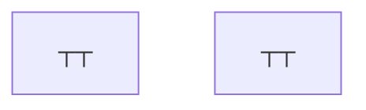

# Flutter 存储性能优化

本文档详细介绍Flutter应用存储性能的优化策略，包括本地存储、数据库优化、缓存管理等，帮助开发者构建高效的数据存储架构。

## 💾 存储架构设计

### 1. 存储层次架构





### 2. 统一存储管理器

```dart
// lib/storage/storage_manager.dart
import 'dart:convert';
import 'dart:io';
import 'package:shared_preferences/shared_preferences.dart';
import 'package:path_provider/path_provider.dart';
import 'package:hive/hive.dart';
import 'package:sqflite/sqflite.dart';

class StorageManager {
  static StorageManager? _instance;
  late SharedPreferences _prefs;
  late Database _database;
  final Map<String, Box> _hiveBoxes = {};
  final Map<String, dynamic> _memoryCache = {};
  
  StorageManager._internal();
  
  factory StorageManager() {
    return _instance ??= StorageManager._internal();
  }
  
  Future<void> initialize() async {
    await _initializeSharedPreferences();
    await _initializeHive();
    await _initializeDatabase();
    
    print('💾 存储管理器初始化完成');
  }
  
  Future<void> _initializeSharedPreferences() async {
    _prefs = await SharedPreferences.getInstance();
    print('✅ SharedPreferences 初始化完成');
  }
  
  Future<void> _initializeHive() async {
    final appDir = await getApplicationDocumentsDirectory();
    Hive.init(appDir.path);
    print('✅ Hive 初始化完成');
  }
  
  Future<void> _initializeDatabase() async {
    final databasePath = await getDatabasesPath();
    final path = '$databasePath/app_database.db';
    
    _database = await openDatabase(
      path,
      version: 1,
      onCreate: _createDatabase,
      onUpgrade: _upgradeDatabase,
    );
    
    print('✅ SQLite 数据库初始化完成');
  }
  
  Future<void> _createDatabase(Database db, int version) async {
    await db.execute('''
      CREATE TABLE cache_entries (
        key TEXT PRIMARY KEY,
        value TEXT NOT NULL,
        created_at INTEGER NOT NULL,
        expires_at INTEGER,
        size INTEGER NOT NULL
      )
    ''');
    
    await db.execute('''
      CREATE TABLE user_data (
        id INTEGER PRIMARY KEY AUTOINCREMENT,
        user_id TEXT NOT NULL,
        data_type TEXT NOT NULL,
        data TEXT NOT NULL,
        updated_at INTEGER NOT NULL
      )
    ''');
    
    await db.execute('''
      CREATE INDEX idx_cache_expires ON cache_entries(expires_at)
    ''');
    
    await db.execute('''
      CREATE INDEX idx_user_data_user_id ON user_data(user_id)
    ''');
  }
  
  Future<void> _upgradeDatabase(Database db, int oldVersion, int newVersion) async {
    // 数据库升级逻辑
    print('📈 数据库从版本 $oldVersion 升级到 $newVersion');
  }
  
  // 内存缓存操作
  void setMemoryCache(String key, dynamic value) {
    _memoryCache[key] = value;
  }
  
  T? getMemoryCache<T>(String key) {
    return _memoryCache[key] as T?;
  }
  
  void removeMemoryCache(String key) {
    _memoryCache.remove(key);
  }
  
  void clearMemoryCache() {
    _memoryCache.clear();
    print('🗑️  内存缓存已清空');
  }
  
  // SharedPreferences 操作
  Future<void> setPreference(String key, dynamic value) async {
    if (value is String) {
      await _prefs.setString(key, value);
    } else if (value is int) {
      await _prefs.setInt(key, value);
    } else if (value is double) {
      await _prefs.setDouble(key, value);
    } else if (value is bool) {
      await _prefs.setBool(key, value);
    } else if (value is List<String>) {
      await _prefs.setStringList(key, value);
    } else {
      await _prefs.setString(key, jsonEncode(value));
    }
  }
  
  T? getPreference<T>(String key) {
    final value = _prefs.get(key);
    if (value is T) {
      return value;
    } else if (value is String && T != String) {
      try {
        return jsonDecode(value) as T;
      } catch (e) {
        return null;
      }
    }
    return null;
  }
  
  Future<void> removePreference(String key) async {
    await _prefs.remove(key);
  }
  
  // Hive 操作
  Future<Box<T>> getHiveBox<T>(String boxName) async {
    if (_hiveBoxes.containsKey(boxName)) {
      return _hiveBoxes[boxName] as Box<T>;
    }
    
    final box = await Hive.openBox<T>(boxName);
    _hiveBoxes[boxName] = box;
    return box;
  }
  
  Future<void> setHiveData<T>(String boxName, String key, T value) async {
    final box = await getHiveBox<T>(boxName);
    await box.put(key, value);
  }
  
  Future<T?> getHiveData<T>(String boxName, String key) async {
    final box = await getHiveBox<T>(boxName);
    return box.get(key);
  }
  
  Future<void> removeHiveData(String boxName, String key) async {
    final box = await getHiveBox(boxName);
    await box.delete(key);
  }
  
  // SQLite 操作
  Future<void> insertCacheEntry({
    required String key,
    required String value,
    DateTime? expiresAt,
  }) async {
    final now = DateTime.now().millisecondsSinceEpoch;
    final size = value.length;
    
    await _database.insert(
      'cache_entries',
      {
        'key': key,
        'value': value,
        'created_at': now,
        'expires_at': expiresAt?.millisecondsSinceEpoch,
        'size': size,
      },
      conflictAlgorithm: ConflictAlgorithm.replace,
    );
  }
  
  Future<String?> getCacheEntry(String key) async {
    final now = DateTime.now().millisecondsSinceEpoch;
    
    final result = await _database.query(
      'cache_entries',
      where: 'key = ? AND (expires_at IS NULL OR expires_at > ?)',
      whereArgs: [key, now],
    );
    
    if (result.isNotEmpty) {
      return result.first['value'] as String;
    }
    
    return null;
  }
  
  Future<void> removeCacheEntry(String key) async {
    await _database.delete(
      'cache_entries',
      where: 'key = ?',
      whereArgs: [key],
    );
  }
  
  Future<void> cleanExpiredCache() async {
    final now = DateTime.now().millisecondsSinceEpoch;
    
    final deletedCount = await _database.delete(
      'cache_entries',
      where: 'expires_at IS NOT NULL AND expires_at <= ?',
      whereArgs: [now],
    );
    
    print('🗑️  清理了 $deletedCount 个过期缓存条目');
  }
  
  // 存储统计
  Future<StorageStats> getStorageStats() async {
    final cacheSize = await _getCacheSize();
    final databaseSize = await _getDatabaseSize();
    final prefsSize = await _getPreferencesSize();
    final hiveSize = await _getHiveSize();
    
    return StorageStats(
      totalSize: cacheSize + databaseSize + prefsSize + hiveSize,
      cacheSize: cacheSize,
      databaseSize: databaseSize,
      preferencesSize: prefsSize,
      hiveSize: hiveSize,
      memoryCacheEntries: _memoryCache.length,
    );
  }
  
  Future<int> _getCacheSize() async {
    final result = await _database.rawQuery(
      'SELECT SUM(size) as total_size FROM cache_entries',
    );
    
    return result.first['total_size'] as int? ?? 0;
  }
  
  Future<int> _getDatabaseSize() async {
    final databasePath = await getDatabasesPath();
    final file = File('$databasePath/app_database.db');
    
    if (await file.exists()) {
      return await file.length();
    }
    
    return 0;
  }
  
  Future<int> _getPreferencesSize() async {
    // SharedPreferences 大小估算
    final keys = _prefs.getKeys();
    int totalSize = 0;
    
    for (final key in keys) {
      final value = _prefs.get(key);
      totalSize += key.length * 2; // UTF-16
      totalSize += value.toString().length * 2;
    }
    
    return totalSize;
  }
  
  Future<int> _getHiveSize() async {
    int totalSize = 0;
    
    for (final box in _hiveBoxes.values) {
      if (box.isOpen) {
        // Hive 大小估算
        totalSize += box.length * 100; // 粗略估算
      }
    }
    
    return totalSize;
  }
  
  // 清理操作
  Future<void> clearAllCache() async {
    clearMemoryCache();
    await _database.delete('cache_entries');
    
    for (final box in _hiveBoxes.values) {
      if (box.isOpen) {
        await box.clear();
      }
    }
    
    print('🗑️  所有缓存已清空');
  }
  
  Future<void> dispose() async {
    for (final box in _hiveBoxes.values) {
      if (box.isOpen) {
        await box.close();
      }
    }
    
    await _database.close();
    _memoryCache.clear();
    
    print('💾 存储管理器已释放');
  }
}

class StorageStats {
  final int totalSize;
  final int cacheSize;
  final int databaseSize;
  final int preferencesSize;
  final int hiveSize;
  final int memoryCacheEntries;
  
  StorageStats({
    required this.totalSize,
    required this.cacheSize,
    required this.databaseSize,
    required this.preferencesSize,
    required this.hiveSize,
    required this.memoryCacheEntries,
  });
  
  String get formattedTotalSize => _formatBytes(totalSize);
  String get formattedCacheSize => _formatBytes(cacheSize);
  String get formattedDatabaseSize => _formatBytes(databaseSize);
  String get formattedPreferencesSize => _formatBytes(preferencesSize);
  String get formattedHiveSize => _formatBytes(hiveSize);
  
  String _formatBytes(int bytes) {
    if (bytes < 1024) {
      return '${bytes}B';
    } else if (bytes < 1024 * 1024) {
      return '${(bytes / 1024).toStringAsFixed(1)}KB';
    } else {
      return '${(bytes / 1024 / 1024).toStringAsFixed(1)}MB';
    }
  }
}
```

### 3. 智能缓存策略

```dart
// lib/storage/smart_cache_strategy.dart
class SmartCacheStrategy {
  static const int maxMemoryCacheSize = 50 * 1024 * 1024; // 50MB
  static const int maxDiskCacheSize = 200 * 1024 * 1024; // 200MB
  static const Duration defaultCacheDuration = Duration(hours: 24);
  
  static final Map<String, CacheEntry> _memoryCache = {};
  static int _currentMemorySize = 0;
  
  static Future<T?> get<T>({
    required String key,
    required Future<T> Function() fetcher,
    required T Function(Map<String, dynamic>) parser,
    Duration? cacheDuration,
    CacheLevel level = CacheLevel.memory,
  }) async {
    // 1. 尝试从内存缓存获取
    if (level.index >= CacheLevel.memory.index) {
      final memoryResult = _getFromMemoryCache<T>(key, parser);
      if (memoryResult != null) {
        print('💾 内存缓存命中: $key');
        return memoryResult;
      }
    }
    
    // 2. 尝试从磁盘缓存获取
    if (level.index >= CacheLevel.disk.index) {
      final diskResult = await _getFromDiskCache<T>(key, parser);
      if (diskResult != null) {
        print('💿 磁盘缓存命中: $key');
        
        // 回写到内存缓存
        if (level.index >= CacheLevel.memory.index) {
          _setToMemoryCache(key, diskResult, cacheDuration);
        }
        
        return diskResult;
      }
    }
    
    // 3. 从网络获取数据
    print('🌐 缓存未命中，从网络获取: $key');
    
    try {
      final result = await fetcher();
      
      // 存储到缓存
      await _setCacheData(key, result, level, cacheDuration);
      
      return result;
    } catch (e) {
      print('❌ 网络请求失败: $key - $e');
      rethrow;
    }
  }
  
  static T? _getFromMemoryCache<T>(
    String key,
    T Function(Map<String, dynamic>) parser,
  ) {
    final entry = _memoryCache[key];
    
    if (entry == null) return null;
    
    // 检查是否过期
    if (entry.isExpired) {
      _removeFromMemoryCache(key);
      return null;
    }
    
    try {
      if (entry.data is T) {
        return entry.data as T;
      } else if (entry.data is Map<String, dynamic>) {
        return parser(entry.data as Map<String, dynamic>);
      }
    } catch (e) {
      _removeFromMemoryCache(key);
    }
    
    return null;
  }
  
  static Future<T?> _getFromDiskCache<T>(
    String key,
    T Function(Map<String, dynamic>) parser,
  ) async {
    try {
      final cachedJson = await StorageManager().getCacheEntry(key);
      
      if (cachedJson == null) return null;
      
      final data = jsonDecode(cachedJson) as Map<String, dynamic>;
      return parser(data);
      
    } catch (e) {
      print('❌ 磁盘缓存解析失败: $key - $e');
      await StorageManager().removeCacheEntry(key);
      return null;
    }
  }
  
  static void _setToMemoryCache(
    String key,
    dynamic data,
    Duration? cacheDuration,
  ) {
    final entry = CacheEntry(
      data: data,
      createdAt: DateTime.now(),
      expiresAt: cacheDuration != null 
          ? DateTime.now().add(cacheDuration)
          : null,
    );
    
    final entrySize = _estimateEntrySize(entry);
    
    // 检查内存限制
    _ensureMemorySpace(entrySize);
    
    _memoryCache[key] = entry;
    _currentMemorySize += entrySize;
  }
  
  static Future<void> _setCacheData(
    String key,
    dynamic data,
    CacheLevel level,
    Duration? cacheDuration,
  ) async {
    final duration = cacheDuration ?? defaultCacheDuration;
    
    // 存储到内存缓存
    if (level.index >= CacheLevel.memory.index) {
      _setToMemoryCache(key, data, duration);
    }
    
    // 存储到磁盘缓存
    if (level.index >= CacheLevel.disk.index) {
      try {
        final jsonData = _serializeData(data);
        await StorageManager().insertCacheEntry(
          key: key,
          value: jsonData,
          expiresAt: DateTime.now().add(duration),
        );
      } catch (e) {
        print('❌ 磁盘缓存存储失败: $key - $e');
      }
    }
  }
  
  static String _serializeData(dynamic data) {
    if (data is Map<String, dynamic>) {
      return jsonEncode(data);
    } else if (data is List) {
      return jsonEncode(data);
    } else {
      // 对于自定义对象，需要实现 toJson 方法
      return jsonEncode(data.toJson());
    }
  }
  
  static void _ensureMemorySpace(int requiredSize) {
    while (_currentMemorySize + requiredSize > maxMemoryCacheSize && _memoryCache.isNotEmpty) {
      _evictLeastRecentlyUsed();
    }
  }
  
  static void _evictLeastRecentlyUsed() {
    String? oldestKey;
    DateTime? oldestTime;
    
    _memoryCache.forEach((key, entry) {
      if (oldestTime == null || entry.createdAt.isBefore(oldestTime!)) {
        oldestKey = key;
        oldestTime = entry.createdAt;
      }
    });
    
    if (oldestKey != null) {
      _removeFromMemoryCache(oldestKey!);
    }
  }
  
  static void _removeFromMemoryCache(String key) {
    final entry = _memoryCache.remove(key);
    if (entry != null) {
      _currentMemorySize -= _estimateEntrySize(entry);
    }
  }
  
  static int _estimateEntrySize(CacheEntry entry) {
    // 简单估算缓存条目大小
    final dataSize = entry.data.toString().length * 2; // UTF-16
    return dataSize + 100; // 加上元数据开销
  }
  
  static Future<void> clearCache({CacheLevel? level}) async {
    if (level == null || level.index >= CacheLevel.memory.index) {
      _memoryCache.clear();
      _currentMemorySize = 0;
      print('🗑️  内存缓存已清空');
    }
    
    if (level == null || level.index >= CacheLevel.disk.index) {
      await StorageManager().cleanExpiredCache();
      print('🗑️  磁盘缓存已清空');
    }
  }
  
  static CacheStats getCacheStats() {
    return CacheStats(
      memoryEntries: _memoryCache.length,
      memorySize: _currentMemorySize,
      memoryHitRate: _calculateMemoryHitRate(),
    );
  }
  
  static double _calculateMemoryHitRate() {
    // 这里需要实现命中率计算逻辑
    // 简化实现，实际应该跟踪命中和未命中次数
    return 0.0;
  }
}

class CacheEntry {
  final dynamic data;
  final DateTime createdAt;
  final DateTime? expiresAt;
  
  CacheEntry({
    required this.data,
    required this.createdAt,
    this.expiresAt,
  });
  
  bool get isExpired {
    if (expiresAt == null) return false;
    return DateTime.now().isAfter(expiresAt!);
  }
}

enum CacheLevel {
  none,
  memory,
  disk,
}

class CacheStats {
  final int memoryEntries;
  final int memorySize;
  final double memoryHitRate;
  
  CacheStats({
    required this.memoryEntries,
    required this.memorySize,
    required this.memoryHitRate,
  });
}
```

## 🗄️ 数据库性能优化

### 1. SQLite 优化策略

```dart
// lib/storage/optimized_database.dart
class OptimizedDatabase {
  static Database? _database;
  static final Map<String, PreparedStatement> _preparedStatements = {};
  
  static Future<Database> get database async {
    if (_database != null) return _database!;
    
    _database = await _initDatabase();
    return _database!;
  }
  
  static Future<Database> _initDatabase() async {
    final databasePath = await getDatabasesPath();
    final path = '$databasePath/optimized_app.db';
    
    return await openDatabase(
      path,
      version: 1,
      onCreate: _createDatabase,
      onOpen: _configureDatabase,
    );
  }
  
  static Future<void> _createDatabase(Database db, int version) async {
    // 创建用户表
    await db.execute('''
      CREATE TABLE users (
        id INTEGER PRIMARY KEY AUTOINCREMENT,
        username TEXT UNIQUE NOT NULL,
        email TEXT UNIQUE NOT NULL,
        created_at INTEGER NOT NULL,
        updated_at INTEGER NOT NULL
      )
    ''');
    
    // 创建文章表
    await db.execute('''
      CREATE TABLE articles (
        id INTEGER PRIMARY KEY AUTOINCREMENT,
        title TEXT NOT NULL,
        content TEXT NOT NULL,
        author_id INTEGER NOT NULL,
        category_id INTEGER NOT NULL,
        created_at INTEGER NOT NULL,
        updated_at INTEGER NOT NULL,
        FOREIGN KEY (author_id) REFERENCES users (id)
      )
    ''');
    
    // 创建索引
    await _createIndexes(db);
    
    print('✅ 数据库表创建完成');
  }
  
  static Future<void> _createIndexes(Database db) async {
    // 用户表索引
    await db.execute('CREATE INDEX idx_users_username ON users(username)');
    await db.execute('CREATE INDEX idx_users_email ON users(email)');
    
    // 文章表索引
    await db.execute('CREATE INDEX idx_articles_author ON articles(author_id)');
    await db.execute('CREATE INDEX idx_articles_category ON articles(category_id)');
    await db.execute('CREATE INDEX idx_articles_created ON articles(created_at)');
    
    // 复合索引
    await db.execute('CREATE INDEX idx_articles_author_created ON articles(author_id, created_at)');
    
    print('✅ 数据库索引创建完成');
  }
  
  static Future<void> _configureDatabase(Database db) async {
    // 启用 WAL 模式（Write-Ahead Logging）
    await db.execute('PRAGMA journal_mode=WAL');
    
    // 设置同步模式
    await db.execute('PRAGMA synchronous=NORMAL');
    
    // 设置缓存大小（页数）
    await db.execute('PRAGMA cache_size=10000');
    
    // 启用外键约束
    await db.execute('PRAGMA foreign_keys=ON');
    
    // 设置临时存储为内存
    await db.execute('PRAGMA temp_store=MEMORY');
    
    print('✅ 数据库配置优化完成');
  }
  
  // 批量插入优化
  static Future<void> batchInsert(
    String table,
    List<Map<String, dynamic>> data, {
    int batchSize = 1000,
  }) async {
    final db = await database;
    
    for (int i = 0; i < data.length; i += batchSize) {
      final batch = db.batch();
      final end = (i + batchSize < data.length) ? i + batchSize : data.length;
      
      for (int j = i; j < end; j++) {
        batch.insert(table, data[j]);
      }
      
      await batch.commit(noResult: true);
      print('📦 批量插入进度: ${end}/${data.length}');
    }
  }
  
  // 预编译语句
  static Future<List<Map<String, dynamic>>> executeQuery(
    String sql,
    List<dynamic> arguments, {
    bool useCache = true,
  }) async {
    final db = await database;
    
    if (useCache && _preparedStatements.containsKey(sql)) {
      // 使用缓存的预编译语句
      return await db.rawQuery(sql, arguments);
    }
    
    final result = await db.rawQuery(sql, arguments);
    
    if (useCache) {
      // 缓存查询语句（简化实现）
      _preparedStatements[sql] = PreparedStatement(sql);
    }
    
    return result;
  }
  
  // 分页查询优化
  static Future<PagedResult<T>> getPagedData<T>({
    required String table,
    required T Function(Map<String, dynamic>) fromMap,
    String? where,
    List<dynamic>? whereArgs,
    String? orderBy,
    int page = 1,
    int pageSize = 20,
  }) async {
    final db = await database;
    
    // 获取总数
    final countSql = 'SELECT COUNT(*) as count FROM $table' +
        (where != null ? ' WHERE $where' : '');
    
    final countResult = await db.rawQuery(countSql, whereArgs);
    final totalCount = countResult.first['count'] as int;
    
    // 获取分页数据
    final offset = (page - 1) * pageSize;
    final dataSql = 'SELECT * FROM $table' +
        (where != null ? ' WHERE $where' : '') +
        (orderBy != null ? ' ORDER BY $orderBy' : '') +
        ' LIMIT $pageSize OFFSET $offset';
    
    final dataResult = await db.rawQuery(dataSql, whereArgs);
    final items = dataResult.map((row) => fromMap(row)).toList();
    
    return PagedResult<T>(
      items: items,
      totalCount: totalCount,
      page: page,
      pageSize: pageSize,
      totalPages: (totalCount / pageSize).ceil(),
    );
  }
  
  // 事务优化
  static Future<T> executeTransaction<T>(
    Future<T> Function(Transaction txn) action,
  ) async {
    final db = await database;
    
    return await db.transaction((txn) async {
      try {
        return await action(txn);
      } catch (e) {
        print('❌ 事务执行失败: $e');
        rethrow;
      }
    });
  }
  
  // 数据库分析和优化
  static Future<void> analyzeDatabase() async {
    final db = await database;
    
    // 分析表统计信息
    await db.execute('ANALYZE');
    
    // 获取数据库大小
    final sizeResult = await db.rawQuery('PRAGMA page_count');
    final pageCount = sizeResult.first['page_count'] as int;
    
    final pageSizeResult = await db.rawQuery('PRAGMA page_size');
    final pageSize = pageSizeResult.first['page_size'] as int;
    
    final databaseSize = pageCount * pageSize;
    
    print('📊 数据库分析完成');
    print('数据库大小: ${(databaseSize / 1024 / 1024).toStringAsFixed(2)}MB');
    print('页数: $pageCount');
    print('页大小: ${pageSize}B');
  }
  
  // 清理和压缩
  static Future<void> vacuum() async {
    final db = await database;
    
    print('🗜️  开始数据库压缩...');
    await db.execute('VACUUM');
    print('✅ 数据库压缩完成');
  }
  
  static Future<void> close() async {
    if (_database != null) {
      await _database!.close();
      _database = null;
      _preparedStatements.clear();
      print('💾 数据库连接已关闭');
    }
  }
}

class PreparedStatement {
  final String sql;
  
  PreparedStatement(this.sql);
}

class PagedResult<T> {
  final List<T> items;
  final int totalCount;
  final int page;
  final int pageSize;
  final int totalPages;
  
  PagedResult({
    required this.items,
    required this.totalCount,
    required this.page,
    required this.pageSize,
    required this.totalPages,
  });
  
  bool get hasNextPage => page < totalPages;
  bool get hasPreviousPage => page > 1;
}
```

### 2. Hive 性能优化

```dart
// lib/storage/optimized_hive_manager.dart
class OptimizedHiveManager {
  static final Map<String, Box> _openBoxes = {};
  static bool _isInitialized = false;
  
  static Future<void> initialize() async {
    if (_isInitialized) return;
    
    final appDir = await getApplicationDocumentsDirectory();
    Hive.init(appDir.path);
    
    // 注册适配器
    _registerAdapters();
    
    // 预打开常用的 Box
    await _preOpenBoxes();
    
    _isInitialized = true;
    print('✅ Hive 优化管理器初始化完成');
  }
  
  static void _registerAdapters() {
    // 注册自定义类型适配器
    if (!Hive.isAdapterRegistered(0)) {
      Hive.registerAdapter(UserModelAdapter());
    }
    
    if (!Hive.isAdapterRegistered(1)) {
      Hive.registerAdapter(ArticleModelAdapter());
    }
    
    print('✅ Hive 适配器注册完成');
  }
  
  static Future<void> _preOpenBoxes() async {
    // 预打开常用的 Box
    final commonBoxes = ['users', 'articles', 'settings', 'cache'];
    
    for (final boxName in commonBoxes) {
      try {
        final box = await Hive.openBox(boxName);
        _openBoxes[boxName] = box;
        print('📦 预打开 Box: $boxName');
      } catch (e) {
        print('❌ 打开 Box 失败: $boxName - $e');
      }
    }
  }
  
  static Future<Box<T>> getBox<T>(String boxName) async {
    if (_openBoxes.containsKey(boxName)) {
      return _openBoxes[boxName] as Box<T>;
    }
    
    final box = await Hive.openBox<T>(boxName);
    _openBoxes[boxName] = box;
    return box;
  }
  
  // 批量操作
  static Future<void> batchPut<T>(
    String boxName,
    Map<String, T> data, {
    int batchSize = 1000,
  }) async {
    final box = await getBox<T>(boxName);
    
    final entries = data.entries.toList();
    
    for (int i = 0; i < entries.length; i += batchSize) {
      final batch = <String, T>{};
      final end = (i + batchSize < entries.length) ? i + batchSize : entries.length;
      
      for (int j = i; j < end; j++) {
        batch[entries[j].key] = entries[j].value;
      }
      
      await box.putAll(batch);
      print('📦 批量写入进度: ${end}/${entries.length}');
    }
  }
  
  // 条件查询
  static List<T> query<T>(
    String boxName,
    bool Function(T item) condition,
  ) {
    final box = _openBoxes[boxName] as Box<T>?;
    if (box == null) return [];
    
    return box.values.where(condition).toList();
  }
  
  // 分页查询
  static PagedHiveResult<T> getPagedData<T>(
    String boxName, {
    bool Function(T item)? filter,
    int Function(T a, T b)? comparator,
    int page = 1,
    int pageSize = 20,
  }) {
    final box = _openBoxes[boxName] as Box<T>?;
    if (box == null) {
      return PagedHiveResult<T>(
        items: [],
        totalCount: 0,
        page: page,
        pageSize: pageSize,
        totalPages: 0,
      );
    }
    
    var items = box.values.toList();
    
    // 应用过滤器
    if (filter != null) {
      items = items.where(filter).toList();
    }
    
    // 应用排序
    if (comparator != null) {
      items.sort(comparator);
    }
    
    final totalCount = items.length;
    final totalPages = (totalCount / pageSize).ceil();
    
    // 分页
    final startIndex = (page - 1) * pageSize;
    final endIndex = (startIndex + pageSize < totalCount) 
        ? startIndex + pageSize 
        : totalCount;
    
    final pagedItems = items.sublist(startIndex, endIndex);
    
    return PagedHiveResult<T>(
      items: pagedItems,
      totalCount: totalCount,
      page: page,
      pageSize: pageSize,
      totalPages: totalPages,
    );
  }
  
  // 索引优化
  static Future<void> createIndex<T>(
    String boxName,
    String indexName,
    dynamic Function(T item) keyExtractor,
  ) async {
    final box = await getBox<T>(boxName);
    final indexBox = await getBox<String>('${boxName}_index_$indexName');
    
    // 清空现有索引
    await indexBox.clear();
    
    // 重建索引
    for (final entry in box.toMap().entries) {
      final key = entry.key;
      final value = entry.value;
      final indexKey = keyExtractor(value).toString();
      
      await indexBox.put(indexKey, key.toString());
    }
    
    print('📇 索引创建完成: $boxName.$indexName');
  }
  
  // 通过索引查询
  static Future<T?> getByIndex<T>(
    String boxName,
    String indexName,
    dynamic indexValue,
  ) async {
    final indexBox = await getBox<String>('${boxName}_index_$indexName');
    final box = await getBox<T>(boxName);
    
    final key = indexBox.get(indexValue.toString());
    if (key == null) return null;
    
    return box.get(key);
  }
  
  // 压缩优化
  static Future<void> compactBox(String boxName) async {
    final box = await getBox(boxName);
    
    print('🗜️  开始压缩 Box: $boxName');
    await box.compact();
    print('✅ Box 压缩完成: $boxName');
  }
  
  // 统计信息
  static Future<HiveStats> getStats() async {
    int totalEntries = 0;
    int totalSize = 0;
    
    for (final entry in _openBoxes.entries) {
      final box = entry.value;
      totalEntries += box.length;
      
      // 估算大小
      totalSize += box.length * 100; // 粗略估算
    }
    
    return HiveStats(
      totalBoxes: _openBoxes.length,
      totalEntries: totalEntries,
      estimatedSize: totalSize,
    );
  }
  
  // 清理操作
  static Future<void> clearBox(String boxName) async {
    final box = await getBox(boxName);
    await box.clear();
    print('🗑️  Box 已清空: $boxName');
  }
  
  static Future<void> closeAllBoxes() async {
    for (final entry in _openBoxes.entries) {
      await entry.value.close();
      print('📦 Box 已关闭: ${entry.key}');
    }
    
    _openBoxes.clear();
    await Hive.close();
    _isInitialized = false;
    
    print('💾 所有 Hive Box 已关闭');
  }
}

class PagedHiveResult<T> {
  final List<T> items;
  final int totalCount;
  final int page;
  final int pageSize;
  final int totalPages;
  
  PagedHiveResult({
    required this.items,
    required this.totalCount,
    required this.page,
    required this.pageSize,
    required this.totalPages,
  });
  
  bool get hasNextPage => page < totalPages;
  bool get hasPreviousPage => page > 1;
}

class HiveStats {
  final int totalBoxes;
  final int totalEntries;
  final int estimatedSize;
  
  HiveStats({
    required this.totalBoxes,
    required this.totalEntries,
    required this.estimatedSize,
  });
  
  String get formattedSize {
    if (estimatedSize < 1024) {
      return '${estimatedSize}B';
    } else if (estimatedSize < 1024 * 1024) {
      return '${(estimatedSize / 1024).toStringAsFixed(1)}KB';
    } else {
      return '${(estimatedSize / 1024 / 1024).toStringAsFixed(1)}MB';
    }
  }
}

// 示例适配器
class UserModelAdapter extends TypeAdapter<UserModel> {
  @override
  final int typeId = 0;
  
  @override
  UserModel read(BinaryReader reader) {
    return UserModel(
      id: reader.readString(),
      name: reader.readString(),
      email: reader.readString(),
    );
  }
  
  @override
  void write(BinaryWriter writer, UserModel obj) {
    writer.writeString(obj.id);
    writer.writeString(obj.name);
    writer.writeString(obj.email);
  }
}

class ArticleModelAdapter extends TypeAdapter<ArticleModel> {
  @override
  final int typeId = 1;
  
  @override
  ArticleModel read(BinaryReader reader) {
    return ArticleModel(
      id: reader.readString(),
      title: reader.readString(),
      content: reader.readString(),
      authorId: reader.readString(),
    );
  }
  
  @override
  void write(BinaryWriter writer, ArticleModel obj) {
    writer.writeString(obj.id);
    writer.writeString(obj.title);
    writer.writeString(obj.content);
    writer.writeString(obj.authorId);
  }
}

// 示例模型
class UserModel {
  final String id;
  final String name;
  final String email;
  
  UserModel({
    required this.id,
    required this.name,
    required this.email,
  });
}

class ArticleModel {
  final String id;
  final String title;
  final String content;
  final String authorId;
  
  ArticleModel({
    required this.id,
    required this.title,
    required this.content,
    required this.authorId,
  });
}
```

## 📊 存储性能监控

### 1. 存储性能分析器

```dart
// lib/storage/storage_performance_analyzer.dart
class StoragePerformanceAnalyzer {
  static final List<StorageOperation> _operations = [];
  static bool _isEnabled = false;
  
  static void enable() {
    _isEnabled = true;
    print('📊 存储性能分析已启用');
  }
  
  static void disable() {
    _isEnabled = false;
    print('⏹️  存储性能分析已禁用');
  }
  
  static Future<T> trackOperation<T>(
    String operationType,
    String target,
    Future<T> Function() operation,
  ) async {
    if (!_isEnabled) {
      return await operation();
    }
    
    final startTime = DateTime.now();
    
    try {
      final result = await operation();
      
      final duration = DateTime.now().difference(startTime);
      _recordOperation(
        StorageOperation(
          type: operationType,
          target: target,
          duration: duration,
          success: true,
          timestamp: startTime,
        ),
      );
      
      return result;
    } catch (e) {
      final duration = DateTime.now().difference(startTime);
      _recordOperation(
        StorageOperation(
          type: operationType,
          target: target,
          duration: duration,
          success: false,
          error: e.toString(),
          timestamp: startTime,
        ),
      );
      
      rethrow;
    }
  }
  
  static void _recordOperation(StorageOperation operation) {
    _operations.add(operation);
    
    // 保留最近 1000 个操作记录
    if (_operations.length > 1000) {
      _operations.removeAt(0);
    }
    
    // 检测慢操作
    if (operation.duration.inMilliseconds > 100) {
      print('🐌 慢存储操作: ${operation.type} ${operation.target} (${operation.duration.inMilliseconds}ms)');
    }
  }
  
  static StoragePerformanceReport generateReport() {
    if (_operations.isEmpty) {
      return StoragePerformanceReport.empty();
    }
    
    final recentOps = _operations.where(
      (op) => DateTime.now().difference(op.timestamp).inMinutes < 5,
    ).toList();
    
    if (recentOps.isEmpty) {
      return StoragePerformanceReport.empty();
    }
    
    // 按操作类型分组
    final groupedOps = <String, List<StorageOperation>>{};
    for (final op in recentOps) {
      groupedOps.putIfAbsent(op.type, () => []).add(op);
    }
    
    final typeStats = <String, OperationStats>{};
    
    groupedOps.forEach((type, ops) {
      final successOps = ops.where((op) => op.success).toList();
      final avgDuration = successOps.isNotEmpty
          ? successOps.map((op) => op.duration.inMilliseconds).reduce((a, b) => a + b) / successOps.length
          : 0.0;
      
      final maxDuration = ops.isNotEmpty
          ? ops.map((op) => op.duration.inMilliseconds).reduce((a, b) => a > b ? a : b)
          : 0;
      
      final successRate = ops.isNotEmpty ? (successOps.length / ops.length) * 100 : 0.0;
      
      typeStats[type] = OperationStats(
        totalOperations: ops.length,
        successfulOperations: successOps.length,
        averageDuration: avgDuration,
        maxDuration: maxDuration,
        successRate: successRate,
      );
    });
    
    return StoragePerformanceReport(
      totalOperations: recentOps.length,
      operationStats: typeStats,
      slowOperations: recentOps.where((op) => op.duration.inMilliseconds > 100).length,
    );
  }
  
  static void printReport() {
    final report = generateReport();
    
    print('\n📊 存储性能报告 (最近5分钟):');
    print('总操作数: ${report.totalOperations}');
    print('慢操作数: ${report.slowOperations}');
    
    if (report.operationStats.isNotEmpty) {
      print('\n操作统计:');
      report.operationStats.forEach((type, stats) {
        print('  $type:');
        print('    操作次数: ${stats.totalOperations}');
        print('    成功率: ${stats.successRate.toStringAsFixed(1)}%');
        print('    平均耗时: ${stats.averageDuration.toStringAsFixed(1)}ms');
        print('    最大耗时: ${stats.maxDuration}ms');
      });
    }
    
    _provideSuggestions(report);
  }
  
  static void _provideSuggestions(StoragePerformanceReport report) {
    print('\n💡 优化建议:');
    
    if (report.slowOperations > report.totalOperations * 0.1) {
      print('- 慢操作比例过高，建议优化存储策略');
    }
    
    report.operationStats.forEach((type, stats) {
      if (stats.averageDuration > 50) {
        print('- $type 操作耗时较长，建议优化');
      }
      
      if (stats.successRate < 95) {
        print('- $type 操作成功率偏低，建议检查错误处理');
      }
    });
  }
  
  static void clearStats() {
    _operations.clear();
    print('🗑️  存储性能统计已清空');
  }
}

class StorageOperation {
  final String type;
  final String target;
  final Duration duration;
  final bool success;
  final String? error;
  final DateTime timestamp;
  
  StorageOperation({
    required this.type,
    required this.target,
    required this.duration,
    required this.success,
    this.error,
    required this.timestamp,
  });
}

class OperationStats {
  final int totalOperations;
  final int successfulOperations;
  final double averageDuration;
  final int maxDuration;
  final double successRate;
  
  OperationStats({
    required this.totalOperations,
    required this.successfulOperations,
    required this.averageDuration,
    required this.maxDuration,
    required this.successRate,
  });
}

class StoragePerformanceReport {
  final int totalOperations;
  final Map<String, OperationStats> operationStats;
  final int slowOperations;
  
  StoragePerformanceReport({
    required this.totalOperations,
    required this.operationStats,
    required this.slowOperations,
  });
  
  factory StoragePerformanceReport.empty() {
    return StoragePerformanceReport(
      totalOperations: 0,
      operationStats: {},
      slowOperations: 0,
    );
  }
}
```

## 🚀 最佳实践

### 1. 存储策略选择

- **SharedPreferences**: 简单配置和用户偏好
- **Hive**: 复杂对象和高性能需求
- **SQLite**: 关系型数据和复杂查询
- **文件系统**: 大文件和媒体内容

### 2. 性能优化原则

- **分层缓存**: 内存 → 磁盘 → 网络
- **批量操作**: 减少 I/O 次数
- **索引优化**: 提高查询性能
- **数据压缩**: 减少存储空间

### 3. 数据一致性

- **事务处理**: 保证数据完整性
- **版本控制**: 处理数据迁移
- **备份恢复**: 防止数据丢失
- **同步策略**: 多端数据同步

### 4. 监控和维护

- **性能监控**: 跟踪存储性能
- **空间管理**: 控制存储使用
- **定期清理**: 清除过期数据
- **错误处理**: 优雅处理存储错误

通过系统的存储性能优化，可以显著提升应用的数据处理能力和响应速度，同时确保数据的安全性和一致性。